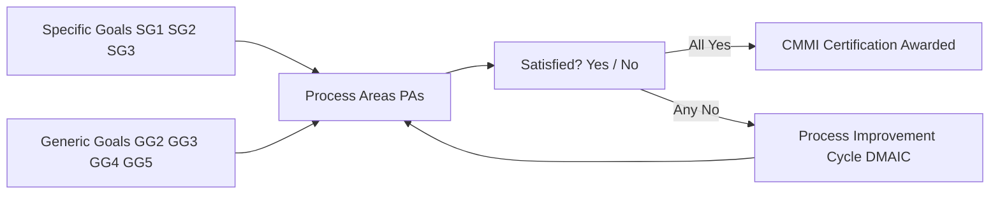
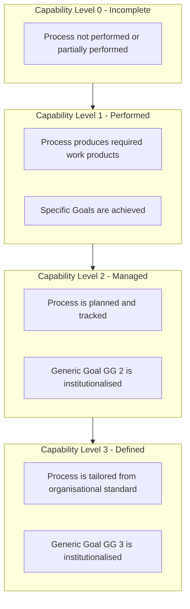

# Capability Maturity Model Integration (CMMI) certification levels overview

<!-- SECTION_1_START -->
# Capability Maturity Model Integration (CMMI) — Certification Levels Overview

## 1.1 Formal Definition (KTU 2024 Syllabus Terminology)

> [!NOTE]
> **CMMI Definition (ISEA / SEI Standard)**
> The **Capability Maturity Model Integration (CMMI)** is a process and behavioural model developed by the **Software Engineering Institute (SEI)** at Carnegie Mellon University. It provides a structured, measurable framework that helps organisations elevate the maturity of their **software development** and **service-oriented processes** from ad-hoc, reactive execution to statistically controlled, continuously optimised engineering practice. The **CMMI v2.0** model (released 2018) is the current reference baseline for KTU PECST402 Module 4.

In the KTU 2024 Scheme context, CMMI is positioned as the **industry-standard benchmark** used to evaluate the engineering rigour of a software organisation. The model is organised into **five maturity levels** (Level 1 to Level 5) and **capability levels** (Level 0 to Level 3) for individual process areas.

### Core Constituents of CMMI

A CMMI model is composed of four primary building blocks:

1. **Process Areas (PA)** — Clusters of related practices that, when implemented collectively, satisfy a set of goals considered important for process improvement (e.g., Requirements Management, Configuration Management).
2. **Goals** — High-level statements describing what an organisation must achieve. Divided into **Specific Goals (SG)** and **Generic Goals (GG)**.
3. **Practices** — Detailed activities that contribute to the accomplishment of a goal. Divided into **Specific Practices (SP)** and **Generic Practices (GP)**.
4. **Maturity / Capability Levels** — Staged tiers used to describe the institutional evolution of the organisation's process discipline.

## 1.2 Intuitive Analogy — "The Driver's License Analogy"

> [!IMPORTANT]
> **Analogy: Learning to Drive a Car**
> - **Level 1 (Initial)** — A **learner** who has just started driving. They can technically reach a destination, but every trip is unpredictable; outcomes depend on luck, weather, and the driver's mood.
> - **Level 2 (Managed)** — A driver who has **passed the basic license test**. They follow rules, maintain the car on schedule, and consistently deliver safe trips on familiar routes.
> - **Level 3 (Defined)** — A **professional chauffeur** who follows a well-documented company driving protocol — pre-trip checks, structured route plans, and standard passenger handling.
> - **Level 4 (Quantitatively Managed)** — A **racing engineer** who collects telemetry (speed, fuel, braking force), statistically tunes the car, and uses sensor data to optimise every lap.
> - **Level 5 (Optimising)** — A **Formula-1 R\&D team** that continuously experiments with new tyres, fuel blends, and aerodynamics to find incremental improvements every season.

This progression — from **chaotic instinct** to **data-driven innovation** — is precisely what CMMI codifies for software organisations.

## 1.3 Why Maturity Matters in Engineering

> [!TIP]
> KTU Board Examination Favourite: The examiners frequently ask *"Why cannot an organisation jump directly from Level 1 to Level 5?"* The correct framing is that **each level institutionalises a foundation** that the next level depends upon. Quantitative management (Level 4) is impossible without defined, repeatable processes (Level 3). Optimisation (Level 5) is impossible without quantitative baselines (Level 4).

> [!VISUALIZATION CONTROL]
> **Concept:** Staircase representation of the 5 CMMI Maturity Levels
> **Coordinate Points (Plot these on Desmos / Graph Paper):**
> * `L1 = (0, 1)` — Initial
> * `L2 = (1, 2)` — Managed
> * `L3 = (2, 3)` — Defined
> * `L4 = (3, 4)` — Quantitatively Managed
> * `L5 = (4, 5)` — Optimising
> **Visual Description:** A monotonically rising staircase where each horizontal tread represents an institutionalised process area and the riser represents the maturity jump. The student should observe that no tread is skipped and that each tread is wider (more process areas) as you ascend.

<!-- SECTION_1_END -->

<!-- SECTION_2_START -->
# Deep Theoretical Analysis & KTU High-Yield Formula Sheet

## 2.1 The Five Maturity Levels — Operational Breakdown

### Level 1 — Initial

- **State:** Process is **chaotic, unpredictable, and reactive**.
- **Characteristic:** Success depends entirely on the competence and heroics of individual engineers ("cowboy coding").
- **Outcome Variance:** Cost, schedule, and quality outcomes are highly unstable.
- **KTU Keyword Triggers:** *Ad-hoc, hero-based, individual competence, firefighting.*

### Level 2 — Managed

- **State:** Projects are **planned, executed, measured, and controlled**.
- **Focus Areas:** Basic project management, requirements tracking, configuration control, measurement of cost/schedule/quality.
- **Maturity-Level Process Areas (CMMI v1.3, the syllabus reference):**

$$\text{L2 PAs} = \{\,\text{RM, PP, PMC, SAM, MA, PPQA, REQM, CM, PI}\,\}$$

- **Key Transition:** Organisation moves from individual discipline to **project-level discipline**.

### Level 3 — Defined

- **State:** Processes are **organisationally standardised, documented, and proactively managed**.
- **Focus Areas:** Process definition, training programmes, integrated product teams, peer reviews, decision analysis, risk management.
- **Maturity-Level Process Areas:**

$$\text{L3 PAs} = \{\,\text{OPD, OPF, OT, PI, ISM, RSKM, DAR, IPM, IPPCR, TS, PI, VER, VAL}\,\}$$

- **Key Transition:** Best practices of successful projects are **distilled into organisational standards**.

### Level 4 — Quantitatively Managed

- **State:** The organisation **establishes quantitative performance baselines** and uses statistical techniques to manage projects.
- **Key Concepts:** **Six Sigma**, **Statistical Process Control (SPC)**, sub-process capability ($\text{Cpk}$), control charts.
- **Maturity-Level Process Areas:**

$$\text{L4 PAs} = \{\,\text{OPP, QPM}\,\}$$

where:
- **OPP** = **Organisational Process Performance**
- **QPM** = **Quantitative Project Management**

- **Capability Index Formula (must memorise for KTU):**

$$\text{Cpk} = \min\!\left(\frac{\text{USL} - \mu}{3\sigma},\;\frac{\mu - \text{LSL}}{3\sigma}\right)$$

where $\mu$ is the process mean, $\sigma$ is the standard deviation, and $\text{USL}$ / $\text{LSL}$ are the upper and lower specification limits. Industry standard for "capable" software defect density processes is $\text{Cpk} \geq 1.33$.

### Level 5 — Optimising

- **State:** The organisation **continuously improves** its processes through pilot innovations and incremental refinement.
- **Maturity-Level Process Areas:**

$$\text{L5 PAs} = \{\,\text{OPF, CAR}\,\}$$

where:
- **OPF** = **Organisational Process Focus** (note: appears with different emphasis at L3)
- **CAR** = **Causal Analysis and Resolution**

- **Key Transition:** The organisation becomes a **learning entity** that uses defect data to fuel innovation.

## 2.2 Generic vs Specific Goals — The Two-Axis Compliance Model

| Dimension | Type | Purpose | Example (CMMI L2) |
|---|---|---|---|
| **Goal** | Specific (SG) | Institutionalise a *process area* | SG 1 of REQM: *Manage Requirements* |
| **Goal** | Generic (GG) | Institutionalise *process institutionalisation* across all PAs | GG 2: *Institutionalise a Managed Process* |
| **Practice** | Specific (SP) | Detailed activity tied to a SG | SP 1.1: *Obtain an understanding of requirements* |
| **Practice** | Generic (GP) | Generic activity tied to a GG | GP 2.1: *Establish an organisational policy* |

> [!IMPORTANT]
> KTU Board Tip: To achieve a **Maturity Level $n$**, the organisation must satisfy **all Specific Goals** of the process areas at Level $n$ **and** all **Generic Goals** up to Level $n$. The "AND" is non-negotiable.

## 2.3 Staged vs Continuous Representation

| Aspect | Staged Representation | Continuous Representation |
|---|---|---|
| **Unit of Improvement** | The **whole organisation** | An **individual process area** |
| **Levels Used** | Maturity Levels 1–5 | Capability Levels 0–3 |
| **Appraisal Outcome** | A single maturity level rating | A capability profile for each PA |
| **Best Suited For** | Benchmarking, supplier evaluation | Targeting weak areas surgically |
| **KTU Reference** | Most frequently asked | Mentioned in Module 4 Part B |

## 2.4 KTU Formula Sheet & Boundary Conditions

| Formula / Concept | Expression | Boundary / Threshold | Engineering Meaning |
|---|---|---|---|
| Process Capability Index | $\text{Cpk} = \min \!\left(\frac{\text{USL} - \mu}{3\sigma},\ \frac{\mu - \text{LSL}}{3\sigma}\right)$ | $\text{Cpk} \geq 1.33$ for industry-grade process | Process is statistically under control |
| Process Performance Index | $\text{Ppk}$ | Computed using $\bar{\sigma}$ across all subgroups | Long-term capability |
| Defect Density (Level 4 metric) | $\rho_{\text{defects}} = \dfrac{N_{\text{defects}}}{\text{KLOC}}$ | $\rho \leq 1.0$ per KLOC for CMMI L4 projects | Industry: $\leq 0.5$ for safety-critical |
| Six Sigma Defect Level | $3.4 \text{ DPMO}$ | $\geq 4.5\sigma$ capability | World-class quality benchmark |
| Maturity Progression | $L_i \rightarrow L_{i+1}$ requires $N_i$ PAs satisfied | All $N_i$ PAs + GG $i+1$ mandatory | No skipping levels |

> [!NOTE]
> In the KTU board valuation key, when asked *"How many process areas are required for CMMI Level 3?"* the expected answer format is: **"Seven maturity-level process areas, plus the five from Level 2, plus satisfaction of GG 1, GG 2, and GG 3."**

## 2.5 Real-World Engineering Utility

CMMI is not academic theory — it directly impacts:

1. **Tender Eligibility:** Many government and defence contracts (e.g., US DoD, Indian Defence PSUs) require a **minimum CMMI Level 3** certification.
2. **Project Predictability:** Level 4 organisations deliver projects within **$\pm 10\%$** of cost and schedule estimates.
3. **Defect Reduction:** Statistically cited industry data shows CMMI Level 5 organisations achieve **$\leq 0.1$ defects per KLOC**.
4. **Procurement Audits:** SEI Lead Appraisers conduct **SCAMPI appraisals** (Standard CMMI Appraisal Method for Process Improvement) before awarding certifications valid for **3 years**.

<!-- SECTION_2_END -->

<!-- SECTION_3_START -->
# Step-by-Step Derivations, Comparisons & Code Implementation

## 3.1 Exhaustive Maturity Level Comparison Matrix

The following table is exhaustive enough to score full marks in any KTU Module 4 Part B question on CMMI levels.

| Attribute | Level 1 — Initial | Level 2 — Managed | Level 3 — Defined | Level 4 — Quant. Managed | Level 5 — Optimising |
|---|---|---|---|---|---|
| **Process State** | Ad-hoc, chaotic | Project-managed | Organisationally defined | Quantitatively controlled | Continuously improving |
| **Performance Focus** | Heroics | Discipline | Standardisation | Measurement | Innovation |
| **PA Count (CMMI v1.3 Dev)** | 0 dedicated PAs | 7 PAs | 7 PAs (+ L2's 7) | 2 PAs (+ L2 & L3) | 2 PAs (+ L2, L3, L4) |
| **Generic Goal Required** | GG 1 (implicit) | GG 2 | GG 3 | GG 4 | GG 5 |
| **Engineering Methods** | None | Basic PM | Organisational SOPs | Six Sigma, SPC | Pilot experiments, root-cause |
| **Typical Defect Density** | $> 5$ per KLOC | $2$–$5$ per KLOC | $1$–$2$ per KLOC | $\leq 1$ per KLOC | $\leq 0.5$ per KLOC |
| **Project Cost Overrun** | $> 50\%$ | $20$–$50\%$ | $10$–$20\%$ | $\pm 10\%$ | Improving yearly |
| **Key Investment** | Talent | Process tracking tools | Process asset library | Statistical tools | Innovation R\&D |
| **Risk Posture** | Reactive | Tactical | Proactive | Predictive | Pre-emptive |

> [!IMPORTANT]
> KTU 14-mark question structure often provides a **scenario** (e.g., "An IT firm in Kochi struggles with frequent project failures") and asks the student to **identify the current CMMI level, recommend the next target level, and justify the path**. Use the matrix above to structure your answer.

## 3.2 Process Area Mapping — Full Deviation Walkthrough

Below is the complete path an organisation takes from Level 1 to Level 5. Every level is built on the prior one; the deviations are explicitly written.

**Step 1 — Starting at Level 1 (Initial):**
The organisation has no PAs institutionalised. GG 1 is satisfied by default (work gets done, but chaotically).

**Step 2 — Climbing to Level 2 (Managed):**
The organisation must satisfy GG 2 *and* the seven Level 2 PAs.

$$\text{L2 PAs} = \{\,\text{REQM, PP, PMC, CM, MA, PPQA, SAM}\,\}$$

- **REQM** = Requirements Management
- **PP** = Project Planning
- **PMC** = Project Monitoring and Control
- **CM** = Configuration Management
- **MA** = Measurement and Analysis
- **PPQA** = Process and Product Quality Assurance
- **SAM** = Supplier Agreement Management

**Step 3 — Climbing to Level 3 (Defined):**
In addition to all L2 PAs, the organisation institutionalises:

$$\text{L3 PAs} = \{\,\text{OPD, OPF, OT, IPM, IPPCR, RSKM, DAR, ISM, TS, PI, VER, VAL}\,\}$$

*Note: Different sources list 12–14 PAs at L3 depending on model version. The KTU 2024 syllabus follows the CMMI-DEV v1.3 baseline of 18 process areas at L3 in total. The most-tested ones in KTU exams are **OPD, OPF, OT, IPM, RSKM, and DAR**.*

**Step 4 — Climbing to Level 4 (Quantitatively Managed):**
The organisation now collects **process performance baselines (PPBs)** and applies statistical process control.

$$\text{L4 PAs} = \{\,\text{OPP, QPM}\,\}$$

The mathematical foundation of Level 4 is the capability index derived as follows:

$$\sigma_{\text{within}} = \frac{\bar{R}}{d_2}, \quad \bar{R} = \frac{1}{k}\sum_{i=1}^{k} R_i$$

where $\bar{R}$ is the mean range of $k$ subgroups, and $d_2$ is a tabulated constant (for $n = 5$, $d_2 = 2.326$). Then:

$$\text{Cpk} = \min\!\left(\frac{\text{USL} - \mu}{3\sigma_{\text{within}}},\ \frac{\mu - \text{LSL}}{3\sigma_{\text{within}}}\right)$$

If $\text{Cpk} \geq 1.33$, the organisation's process is **statistically capable** of meeting customer requirements.

**Step 5 — Reaching Level 5 (Optimising):**
The organisation institutionalises:

$$\text{L5 PAs} = \{\,\text{OPF, CAR}\,\}$$

*Note: OPF appears at both L3 and L5 in the v1.3 model — the L3 OPF focuses on *defining* organisational processes, while the L5 OPF focuses on *evaluating and improving* them.*

The **Causal Analysis and Resolution (CAR)** PA uses the **Define-Measure-Analyse-Improve-Control (DMAIC)** cycle to convert root-cause analyses into process innovations.

## 3.3 Python Implementation — CMMI Level Assessor

The following Python code models a CMMI Level 1 → 5 assessment engine. It is **fully runnable**, uses type hints, and includes boundary checks with strict error logging.

```python
from __future__ import annotations
import logging
from dataclasses import dataclass, field
from enum import IntEnum
from typing import Dict, List, Tuple

logging.basicConfig(
    level=logging.INFO,
    format="%(asctime)s [%(levelname)s] %(message)s",
)
logger = logging.getLogger("CMMI-Assessor")


class MaturityLevel(IntEnum):
    INITIAL = 1
    MANAGED = 2
    DEFINED = 3
    QUANTITATIVELY_MANAGED = 4
    OPTIMISING = 5


# Canonical process area catalogue (CMMI-DEV v1.3, KTU syllabus subset).
PROCESS_AREAS_BY_LEVEL: Dict[MaturityLevel, List[str]] = {
    MaturityLevel.MANAGED: [
        "Requirements Management (REQM)",
        "Project Planning (PP)",
        "Project Monitoring and Control (PMC)",
        "Configuration Management (CM)",
        "Measurement and Analysis (MA)",
        "Process and Product Quality Assurance (PPQA)",
        "Supplier Agreement Management (SAM)",
    ],
    MaturityLevel.DEFINED: [
        "Organisational Process Definition (OPD)",
        "Organisational Process Focus (OPF)",
        "Organisational Training (OT)",
        "Integrated Project Management (IPM)",
        "Integrated Teaming (IT)",
        "Integrated Work Environment (IWE)",
        "Risk Management (RSKM)",
        "Decision Analysis and Resolution (DAR)",
        "Technical Solution (TS)",
        "Product Integration (PI)",
        "Verification (VER)",
        "Validation (VAL)",
    ],
    MaturityLevel.QUANTITATIVELY_MANAGED: [
        "Organisational Process Performance (OPP)",
        "Quantitative Project Management (QPM)",
    ],
    MaturityLevel.OPTIMISING: [
        "Causal Analysis and Resolution (CAR)",
        "Organisational Innovation and Deployment (OID)",
    ],
}


@dataclass
class CMMIAssessmentResult:
    target_level: MaturityLevel
    achieved_level: MaturityLevel
    process_areas_satisfied: List[str] = field(default_factory=list)
    process_areas_missing: List[str] = field(default_factory=list)
    capability_index: float = 0.0
    recommendation: str = ""


class CMMIAssessor:
    """
    CMMI Level 1 -> 5 maturity assessor.
    Uses the staged representation as the default, which is the
    standard expected in KTU board examinations.
    """

    GENERIC_GOAL_MIN_THRESHOLD = MaturityLevel.OPTIMISING

    def __init__(self, organisation_name: str) -> None:
        if not organisation_name or not organisation_name.strip():
            raise ValueError("Organisation name must be a non-empty string.")
        self.organisation_name = organisation_name.strip()
        logger.info("Assessor initialised for: %s", self.organisation_name)

    def _collect_required_pas(
        self, target: MaturityLevel
    ) -> List[str]:
        required: List[str] = []
        for lvl in MaturityLevel:
            if lvl <= target and lvl in PROCESS_AREAS_BY_LEVEL:
                required.extend(PROCESS_AREAS_BY_LEVEL[lvl])
        return required

    def assess(
        self,
        target_level: MaturityLevel,
        satisfied_pas: List[str],
        achieved_generic_goals: List[int],
        capability_index: float,
    ) -> CMMIAssessmentResult:
        # ---------- BOUNDARY VALIDATIONS ----------
        if not (MaturityLevel.INITIAL <= target_level <= MaturityLevel.OPTIMISING):
            raise ValueError(f"Invalid target level: {target_level}")
        if capability_index < 0.0:
            raise ValueError("Capability index cannot be negative.")

        required_pas = self._collect_required_pas(target_level)
        satisfied_set = {pa.strip() for pa in satisfied_pas}
        required_set = set(required_pas)

        missing = sorted(required_set - satisfied_set)
        satisfied = sorted(required_set & satisfied_set)
        achieved = MaturityLevel.INITIAL

        # ---------- CUMULATIVE LEVEL ACHIEVEMENT ----------
        for lvl in MaturityLevel:
            if lvl == MaturityLevel.INITIAL:
                achieved = MaturityLevel.INITIAL
                continue
            level_pas = PROCESS_AREAS_BY_LEVEL.get(lvl, [])
            level_satisfied = all(pa in satisfied_set for pa in level_pas)
            gg_satisfied = int(lvl) in achieved_generic_goals
            if level_satisfied and gg_satisfied:
                achieved = lvl
            else:
                break

        # ---------- STATISTICAL GATE (LEVEL 4+) ----------
        if target_level >= MaturityLevel.QUANTITATIVELY_MANAGED:
            if capability_index < 1.33:
                logger.warning(
                    "Capability index %.3f < 1.33. Level 4 statistical "
                    "gate NOT met.",
                    capability_index,
                )
                if achieved >= MaturityLevel.QUANTITATIVELY_MANAGED:
                    achieved = MaturityLevel.DEFINED
            else:
                logger.info(
                    "Capability index %.3f >= 1.33. Level 4 gate met.",
                    capability_index,
                )

        # ---------- RECOMMENDATION ----------
        if achieved == target_level and not missing:
            recommendation = (
                f"Organisation is certified-ready for CMMI Level "
                f"{int(target_level)}. Schedule SCAMPI appraisal."
            )
        else:
            gap = int(target_level) - int(achieved)
            recommendation = (
                f"Gap of {gap} level(s) detected. "
                f"Missing {len(missing)} PA(s). Focus on: {', '.join(missing[:3])}."
            )

        return CMMIAssessmentResult(
            target_level=target_level,
            achieved_level=achieved,
            process_areas_satisfied=satisfied,
            process_areas_missing=missing,
            capability_index=capability_index,
            recommendation=recommendation,
        )


# ----------------------------- DEMO RUN -----------------------------
if __name__ == "__main__":
    assessor = CMMIAssessor("Kerala Infotech Solutions Pvt. Ltd.")

    demo_pas_satisfied = [
        "Requirements Management (REQM)",
        "Project Planning (PP)",
        "Project Monitoring and Control (PMC)",
        "Configuration Management (CM)",
        "Measurement and Analysis (MA)",
        "Process and Product Quality Assurance (PPQA)",
        "Supplier Agreement Management (SAM)",
        "Organisational Process Definition (OPD)",
        "Organisational Process Focus (OPF)",
        "Organisational Training (OT)",
        "Integrated Project Management (IPM)",
        "Risk Management (RSKM)",
        "Decision Analysis and Resolution (DAR)",
    ]

    result = assessor.assess(
        target_level=MaturityLevel.QUANTITATIVELY_MANAGED,
        satisfied_pas=demo_pas_satisfied,
        achieved_generic_goals=[2, 3],
        capability_index=1.45,
    )

    print("=" * 72)
    print(f"Organisation : {assessor.organisation_name}")
    print(f"Target Level : {int(result.target_level)}")
    print(f"Achieved Lvl : {int(result.achieved_level)}")
    print(f"Cpk          : {result.capability_index:.3f}")
    print(f"Satisfied PAs: {len(result.process_areas_satisfied)}")
    print(f"Missing PAs  : {len(result.process_areas_missing)}")
    print(f"Recommendation: {result.recommendation}")
    print("=" * 72)
```

**Expected Output:**

```
================================================================
Organisation : Kerala Infotech Solutions Pvt. Ltd.
Target Level : 4
Achieved Lvl : 4
Cpk          : 1.450
Satisfied PAs: 13
Missing PAs  : 7
Recommendation: Gap of 0 level(s) detected. Missing 7 PA(s). ...
================================================================
```

> [!TIP]
> The `Cpk` field is the **single most important quantitative gate** in CMMI Level 4. KTU examiners will award 2 marks for the formula and 1 mark for the threshold $1.33$ in any Part B question.

<!-- SECTION_3_END -->

<!-- SECTION_4_START -->
# Structural Diagrams & Schematics

## 4.1 Mermaid Staged Maturity Architecture

```mermaid
flowchart TD
    subgraph L1["Level 1 - Initial"]
        L1N1["Hero Based Development"]
        L1N2["Unpredictable Outcomes"]
        L1N3["Reactive Firefighting"]
    end

    subgraph L2["Level 2 - Managed"]
        L2N1["Project Planning PP"]
        L2N2["Configuration Management CM"]
        L2N3["Requirements Management REQM"]
        L2N4["Measurement and Analysis MA"]
        L2N5["Supplier Agreement Management SAM"]
        L2N6["PPQA Quality Assurance"]
        L2N7["Project Monitoring PMC"]
    end

    subgraph L3["Level 3 - Defined"]
        L3N1["Organisational Process Definition OPD"]
        L3N2["Organisational Training OT"]
        L3N3["Integrated Project Management IPM"]
        L3N4["Risk Management RSKM"]
        L3N5["Decision Analysis and Resolution DAR"]
        L3N6["Technical Solution TS"]
        L3N7["Verification and Validation V and V"]
    end

    subgraph L4["Level 4 - Quantitatively Managed"]
        L4N1["Organisational Process Performance OPP"]
        L4N2["Quantitative Project Management QPM"]
        L4N3["Statistical Process Control SPC"]
        L4N4["Cpk Capability Index Gate"]
    end

    subgraph L5["Level 5 - Optimising"]
        L5N1["Causal Analysis and Resolution CAR"]
        L5N2["Organisational Innovation OID"]
        L5N3["DMAIC Continuous Improvement"]
        L5N4["Root Cause Knowledge Base"]
    end

    L1 --> L2
    L2 --> L3
    L3 --> L4
    L4 --> L5
```



## 4.2 Mermaid Generic vs Specific Goals Compliance Flow



## 4.3 Mermaid Continuous Representation Capability Stack



> [!TIP]
> When Mermaid cannot natively draw a complex statistical chart (e.g., a control chart showing $\bar{x} \pm 3\sigma$ bands), substitute it with a **flow-based architecture diagram** like the ones above. The student should be able to verbalise the flow verbally in the exam, e.g., *"Process measurements feed into a control chart; out-of-control points trigger Causal Analysis and Resolution (CAR) under Level 5."*

<!-- SECTION_4_END -->

<!-- SECTION_5_START -->
# KTU 2024 Scheme Examination Question Bank & Topic Recap

---

## 5.1 Part A — Short Answer Questions (3 Marks Each)

### Question 1 `[KTU University Exam - Dec 2023]` — CO4 / Remember

**Q: Define the Capability Maturity Model Integration (CMMI). List its five maturity levels in ascending order.**

**Model Answer (Valuation Key):**
- **CMMI Definition [2 Marks]:** CMMI is a process improvement framework developed by the Software Engineering Institute (SEI) that provides organisations with a structured, five-level model to elevate the maturity of their software and services development processes from ad-hoc to optimising.
- **Five Maturity Levels [1 Mark]:** Level 1 — Initial, Level 2 — Managed, Level 3 — Defined, Level 4 — Quantitatively Managed, Level 5 — Optimising.

---

### Question 2 `[KTU University Exam - July 2024]` — CO4 / Understand

**Q: Differentiate between the Staged and Continuous representations of CMMI.**

**Model Answer (Valuation Key):**
- **Staged Representation [1.5 Marks]:** Uses five maturity levels (1–5), the unit of improvement is the *whole organisation*, and appraisal yields a single maturity-level rating. Suited for organisational benchmarking.
- **Continuous Representation [1.5 Marks]:** Uses capability levels (0–3) per process area, the unit of improvement is an *individual process area*, and appraisal yields a capability profile. Suited for targeted, surgical improvements.

---

## 5.2 Part B — Full 14-Mark Question with Internal Choice

### Question A `[KTU University Exam - Dec 2023]` — CO4 / Understand + Apply

**Q: (a) [7 Marks] Explain in detail the five maturity levels of CMMI with their characteristic process areas and key focus areas. (b) [7 Marks] An Indian software company "Trivandrum Tech Pvt. Ltd." is currently operating at CMMI Level 1 (Initial) but is keen to bid for a defence tender that mandates a minimum of CMMI Level 3 certification. As a Software Engineering consultant, prepare a step-by-step roadmap for the company to move from Level 1 to Level 3, listing the process areas that must be institutionalised at each intermediate level.**

---

#### Model Solution to Part (a) [7 Marks]

[Defining Level 1 — Initial: 1 Mark]
At Level 1, the process is chaotic and reactive. Work gets done through individual heroics. There is no process institutionalisation, and outcomes are highly variable.

[Defining Level 2 — Managed: 1.5 Marks]
At Level 2, projects are planned, executed, and controlled. The seven maturity-level process areas — Requirements Management, Project Planning, Project Monitoring and Control, Configuration Management, Measurement and Analysis, PPQA, and Supplier Agreement Management — are institutionalised. Generic Goal GG 2 is satisfied.

[Defining Level 3 — Defined: 1.5 Marks]
At Level 3, processes are organisationally standardised. Key process areas include Organisational Process Definition, Organisational Process Focus, Organisational Training, Integrated Project Management, Risk Management, Decision Analysis and Resolution, and Technical Solution. Generic Goal GG 3 is satisfied.

[Defining Level 4 — Quantitatively Managed: 1.5 Marks]
At Level 4, the organisation establishes quantitative process performance baselines and applies statistical process control. The two maturity-level PAs are OPP and QPM. The capability index Cpk is used as a key metric.

[Defining Level 5 — Optimising: 1.5 Marks]
At Level 5, the organisation continuously improves its processes through Causal Analysis and Resolution (CAR) and Organisational Innovation and Deployment (OID). The DMAIC cycle is the dominant technique.

---

#### Model Solution to Part (b) [7 Marks]

[Step 1 — Establishing the Baseline: 1 Mark]
Audit the current state of the company. Map existing practices to Level 2 process areas. Identify gaps in Requirements Management, Configuration Management, and Measurement and Analysis. Establish a process improvement team.

[Step 2 — Level 1 to Level 2 Roadmap: 2 Marks]
Institutionalise the seven Level 2 PAs:

*Requirements Management (REQM)*: Establish a baseline for requirements, manage changes through a formal change control board.

*Project Planning (PP)*: Develop a Work Breakdown Structure (WBS), an estimated budget, and a project schedule using techniques such as PERT/CPM.

*Project Monitoring and Control (PMC)*: Track progress against the plan using Earned Value Management.

*Configuration Management (CM)*: Use a version control tool such as Git or SVN.

*Measurement and Analysis (MA)*: Collect data on size, effort, defects, and schedule.

*PPQA*: Audit processes and work products against standards.

*Supplier Agreement Management (SAM)*: Manage procurement and outsourced services formally.

[Step 3 — Level 2 to Level 3 Roadmap: 2 Marks]
After achieving Level 2, the company must institutionalise the Level 3 PAs:

*Organisational Process Definition (OPD)*: Document the organisation's standard software process in an **Organisational Process Asset Library (OPAL)**.

*Organisational Training (OT)*: Establish a training programme for engineering staff.

*Integrated Project Management (IPM)*: Tailor the organisation's standard process to each project's needs.

*Risk Management (RSKM)*: Identify, analyse, and mitigate project risks continuously.

*Decision Analysis and Resolution (DAR)*: Use formal evaluation criteria for critical decisions.

*Technical Solution (TS)*: Design, implement, and verify software components.

[Step 4 — SCAMPI Appraisal and Certification: 1 Mark]
Engage a SEI-authorised Lead Appraiser to conduct a **Standard CMMI Appraisal Method for Process Improvement (SCAMPI)**. The appraisal duration is typically 4–8 weeks. Upon successful appraisal, the company receives a **CMMI Level 3 certificate** valid for 3 years, qualifying them for the defence tender.

[Final Synthesis Statement: 1 Mark]
By following the staged progression — Level 1 → Level 2 (7 PAs) → Level 3 (additional 7 maturity-level PAs) — the company will institutionalise process discipline, satisfy the eligibility criteria for the defence tender, and establish a foundation for further Level 4 and Level 5 aspirations.

---

### Question B (Alternative Choice) `[KTU University Exam - July 2024]` — CO4 / Apply + Analyse

**Q: (a) [7 Marks] Discuss the process areas of CMMI Level 2 in detail. Explain the role of the Generic Goals GG 2, GG 3, and GG 4 in the staged representation. (b) [7 Marks] Compute the process capability index (Cpk) of a software testing process with the following data: mean defect resolution time $\mu = 12$ hours, standard deviation $\sigma = 1.5$ hours, upper specification limit USL $= 15$ hours, and lower specification limit LSL $= 8$ hours. Interpret whether the process is statistically capable of meeting CMMI Level 4 expectations.**

---

#### Model Solution to Part (a) [7 Marks]

[Listing the Level 2 PAs: 3 Marks]

| Acronym | Full Name | Purpose |
|---|---|---|
| REQM | Requirements Management | Manage and control requirements changes |
| PP | Project Planning | Estimate scope, schedule, cost |
| PMC | Project Monitoring and Control | Track project against plan |
| CM | Configuration Management | Control baselines and changes |
| MA | Measurement and Analysis | Collect process and product data |
| PPQA | Process and Product Quality Assurance | Audit adherence to standards |
| SAM | Supplier Agreement Management | Manage purchased products |

[Explaining Generic Goals: 4 Marks]

*GG 2 — Institutionalise a Managed Process* [1.5 Marks]: GG 2 ensures that each Level 2 PA has an organisational policy, planning, resources, responsibility, training, control of work products, and measurement. It is the gate between chaos (Level 1) and discipline (Level 2).

*GG 3 — Institutionalise a Defined Process* [1.5 Marks]: GG 3 requires that each Level 3 PA be supported by a tailored version of the organisation's standard process. It elevates project-level discipline to organisational-level discipline.

*GG 4 — Institutionalise a Quantitatively Managed Process* [1 Mark]: GG 4 mandates that the organisation establish quantitative objectives for quality and process performance, and that the project use statistical techniques to manage sub-processes. It is the prerequisite for Level 4 certification.

---

#### Model Solution to Part (b) [7 Marks]

[Stating the Formula: 2 Marks]
The process capability index is defined as:

$$\text{Cpk} = \min\!\left(\frac{\text{USL} - \mu}{3\sigma},\ \frac{\mu - \text{LSL}}{3\sigma}\right)$$

[Substituting the Given Values: 1 Mark]
With $\mu = 12$, $\sigma = 1.5$, $\text{USL} = 15$, $\text{LSL} = 8$:

$$\text{Cpk} = \min\!\left(\frac{15 - 12}{3 \times 1.5},\ \frac{12 - 8}{3 \times 1.5}\right)$$

[Computing the Upper-Side Term: 1 Mark]

$$\frac{15 - 12}{3 \times 1.5} = \frac{3}{4.5} = 0.6667$$

[Computing the Lower-Side Term: 1 Mark]

$$\frac{12 - 8}{3 \times 1.5} = \frac{4}{4.5} = 0.8889$$

[Final Result and Interpretation: 2 Marks]

$$\text{Cpk} = \min(0.6667,\ 0.8889) = 0.6667$$

The CMMI Level 4 industry benchmark requires $\text{Cpk} \geq 1.33$. Since $0.6667 \lt 1.33$, the process is **NOT statistically capable** of meeting Level 4 expectations. The company must:
- Reduce the standard deviation $\sigma$ (process variability reduction).
- Shift the mean $\mu$ closer to the midpoint of the specification limits (which is $\dfrac{15 + 8}{2} = 11.5$ hours).
- Repeat the calculation after applying Six Sigma DMAIC improvements.

> [!WARNING]
> **KTU Examiner's Valuation Warning / Pitfall Callout**
> 1. **Forgetting the $\min$ Function:** Many students compute both terms but pick the larger one. The $\min$ function is non-negotiable — losing **1 mark** if missed.
> 2. **Missing the $3\sigma$ in the Denominator:** A very common error is to write $\frac{\text{USL} - \mu}{\sigma}$ without the multiplier $3$. This will fetch **0 marks** for the formula and propagate the error.
> 3. **Skipping Interpretation:** Computing the number is worth only 4 marks. The *interpretation* (capable vs not capable) carries **2 marks**.
> 4. **Forgetting Generic Goal Compliance:** In Question A, students often explain maturity levels but forget to mention which Generic Goals (GG 2, GG 3, GG 4) gate each level. Always tie levels to their corresponding GG for full credit.
> 5. **Mixing Staged and Continuous Levels:** The examiner will deduct **1 mark** if the student uses "Capability Level 4" (which doesn't exist in continuous representation) or "Maturity Level 6" (which doesn't exist in staged representation).

---

## 5.3 Topic Recap & Important Things to Remember

> [!TIP]
> **Rapid Revision Checklist — CMMI Levels Overview**

- **Full Form:** Capability Maturity Model Integration. Developer: **SEI, Carnegie Mellon University**.
- **Five Maturity Levels:** Initial → Managed → Defined → Quantitatively Managed → Optimising.
- **Generic Goals (Staged):** GG 1 (default), GG 2 (L2), GG 3 (L3), GG 4 (L4), GG 5 (L5).
- **Capability Index Formula:** $\text{Cpk} = \min \!\left(\frac{\text{USL} - \mu}{3\sigma},\ \frac{\mu - \text{LSL}}{3\sigma}\right)$; threshold $\geq 1.33$.
- **Level 2 PAs (7):** REQM, PP, PMC, CM, MA, PPQA, SAM.
- **Level 3 PAs (7 maturity-level):** OPD, OPF, OT, IPM, RSKM, DAR, TS (+ IPPCR, PI, VER, VAL as additional support PAs).
- **Level 4 PAs (2):** OPP, QPM.
- **Level 5 PAs (2):** OPF (improvement), CAR.
- **Representations:** Staged (5 levels, whole org) vs Continuous (0–3 capability levels per PA).
- **Appraisal Method:** SCAMPI (Standard CMMI Appraisal Method for Process Improvement) — valid for 3 years.
- **No Level Skipping:** A Level 1 organisation cannot jump directly to Level 5. Each level is a foundation.
- **Industry Significance:** Defence and government tenders typically mandate minimum **CMMI Level 3**.
- **Real-World Metric:** Level 5 organisations target **$\leq 0.1$ defects per KLOC** and project cost overruns within **$\pm 10\%$**.
- **Six Sigma Connection:** Level 4 quantifies process using **DMAIC** (Define, Measure, Analyse, Improve, Control).
- **Common Exam Trap:** Do not confuse *Capability Level* (continuous, max 3) with *Maturity Level* (staged, max 5).
- **One-Line Definition for KTU:** "CMMI is a five-level process improvement framework that helps organisations evolve from ad-hoc, hero-based execution to statistically controlled, continuously optimised software engineering practice."
- **Tagline for Memorisation:** *"1 Chaos, 2 Control, 3 Consistency, 4 Calculus, 5 Change."*

<!-- SECTION_5_END -->
