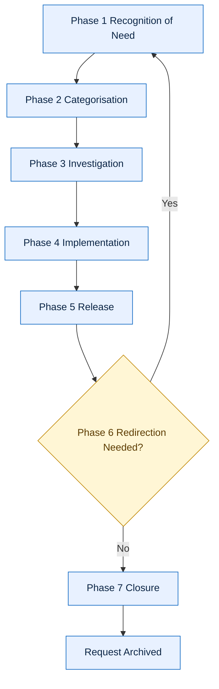
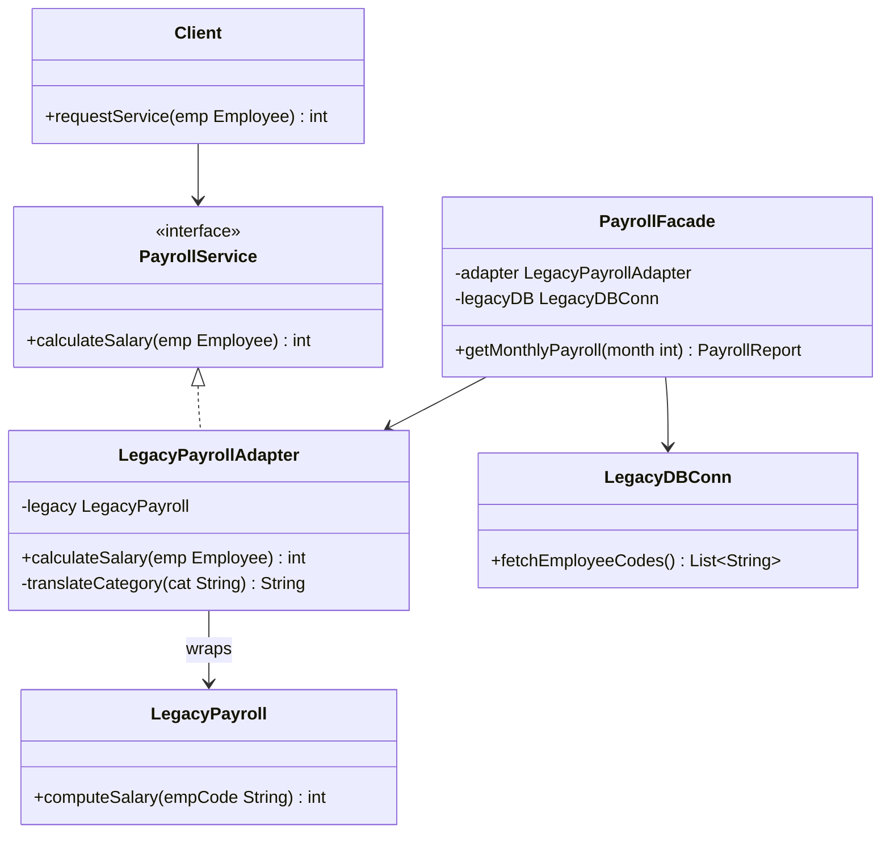
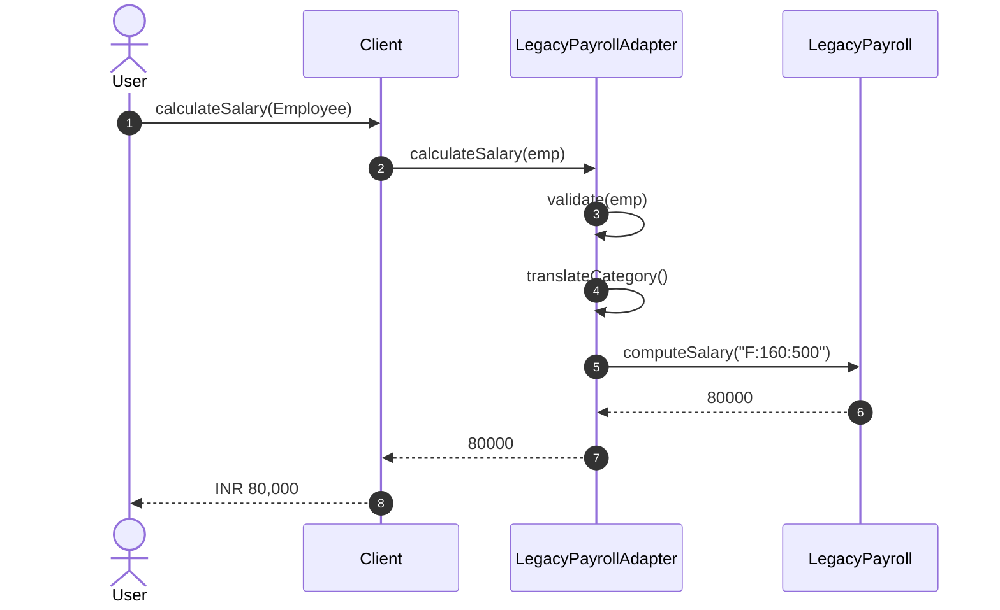
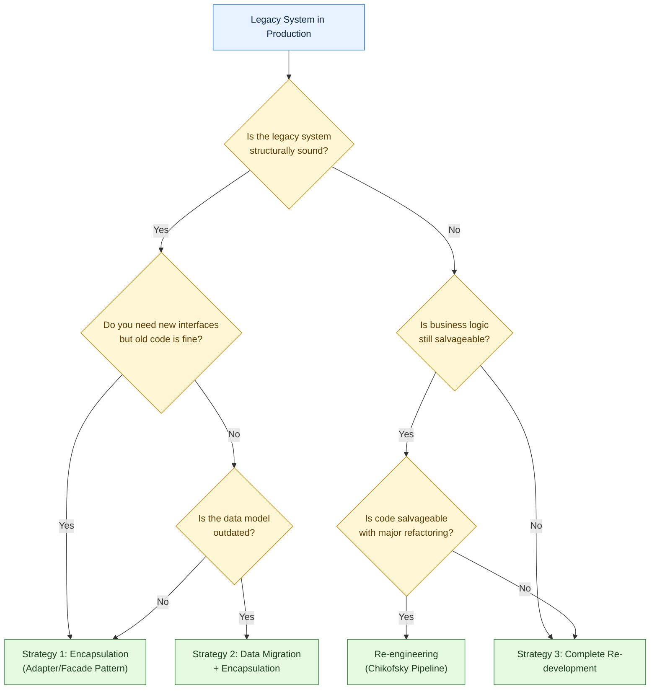

# Maintenance models, re-engineering methods, legacy software encapsulation patterns

<!-- SECTION_1_START -->

# Software Maintenance, Re-engineering & Legacy Encapsulation

## 1.1 Formal Academic Definition

> [!IMPORTANT]
> **Software Maintenance (IEEE 1219 Standard Definition):**
> Software maintenance is the modification of a software product after delivery to correct faults, improve performance or other attributes, or adapt the product to a modified environment. It is a comprehensive, structured process encompassing **preventive, perfective, corrective, adaptive, and emergency** maintenance activities performed over the entire operational life-cycle of a product.

> [!NOTE]
> **KTU 2024 Syllabus Highlight (Module 4):**
> Module 4 of *PECST402 — Software Engineering* explicitly requires the learner to distinguish between classical **maintenance models**, apply systematic **re-engineering methods** to recover design intent, and implement **encapsulation patterns** that allow modern systems to consume legacy modules without rewriting them.

### 1.1.1 Maintenance as a Sub-Discipline of Software Engineering

Software maintenance is **not** an after-thought; it is the dominant cost component of any long-lived software product. Industry studies (e.g., IEEE / ACM empirical reports) consistently show that **60\% to 80\%** of the total life-cycle cost is consumed in the maintenance phase, and roughly **50\%** of all maintenance effort is spent on *perfective* user-driven enhancements rather than on fault correction.

> [!TIP]
> **Engineering Reality Check:** For every $1 invested in the initial development of a system, an additional $2 to $4 is invested in maintaining it. This ratio is the strongest economic justification for studying formal maintenance models and disciplined re-engineering methods.

## 1.2 Intuitive Overview & Real-World Analogy

> [!TIP]
> **Analogy — A Car Throughout its Life-Cycle**
> A car is engineered, manufactured, and delivered. From the moment it leaves the factory it enters the *maintenance phase*. Over its 15-year life it receives:
> - **Corrective maintenance** $\rightarrow$ Fixing a broken brake pad.
> - **Adaptive maintenance** $\rightarrow$ Installing a new catalytic converter to comply with a 2026 emission norm.
> - **Perfective maintenance** $\rightarrow$ Upgrading the infotainment system to support Apple CarPlay.
> - **Preventive maintenance** $\rightarrow$ Scheduled oil change to avoid engine seizure.
> - **Emergency maintenance** $\rightarrow$ Towing the car out of a river.
>
> When the chassis becomes structurally obsolete, the manufacturer may *re-engineer* the car — re-using the engine (encapsulation) but redesigning the body. A *legacy* car is one whose original engine interface (carburetor) is too old to support modern fuel injectors — so engineers build an **adapter** (encapsulation pattern) to bridge the two.

Software systems follow exactly the same evolutionary arc. Module 4 of your KTU syllabus is the *engineer's service manual* for that arc.

## 1.3 Key Terminology at a Glance

| Term | Plain-English Meaning |
| :--- | :--- |
| **Legacy System** | A mission-critical system that remains in use because replacing it is too risky or expensive, even though it is built on obsolete technology. |
| **Re-engineering** | Reconstructing an existing system while preserving its external behaviour to improve its internal structure. |
| **Reverse Engineering** | Deriving design and specification information from existing source code when the original design artefacts are missing. |
| **Forward Engineering** | The conventional "specification $\rightarrow$ design $\rightarrow$ code" development path applied to the recovered design. |
| **Encapsulation Pattern** | An architectural wrapper that hides an obsolete interface behind a modern, well-typed contract. |
| **Façade** | A unified simplified interface to a set of subsystem interfaces. |
| **Adapter** | Converts the interface of an existing class into another interface expected by the client. |
| **Wrapping** | Black-box reuse where a new class *contains* a legacy component and exposes only the new interface. |

> [!NOTE]
> **The Big Picture:** Maintenance keeps the system alive; re-engineering *modernises* it; encapsulation patterns let new code *co-exist* with old code. Together, they form the KTU Module-4 trinity.

<!-- SECTION_1_END -->

<!-- SECTION_2_START -->

# Deep Theoretical Analysis & KTU High-Yield Formula Sheet

## 2.1 The Five Canonical Types of Software Maintenance

> [!IMPORTANT]
> **Remember this 5-letter mnemonic:** **C-A-P-P-E** — **C**orrective, **A**daptive, **P**erfective, **P**reventive, **E**mergency.

1. **Corrective Maintenance ($\approx 20\%$)** — Fixing reported defects (bugs). Triggers: user complaints, crash reports.
2. **Adaptive Maintenance ($\approx 25\%$)** — Adapting the software to a *changed environment* (new OS, new hardware, new tax law, new API).
3. **Perfective Maintenance ($\approx 50\%$)** — Adding *new features* requested by users; the single largest slice of the maintenance pie.
4. **Preventive Maintenance ($\approx 5\%$)** — Refactoring today to avoid bugs tomorrow (akin to software anti-ageing therapy).
5. **Emergency Maintenance** — Unscheduled, drop-everything fixes to restore service (e.g., production server down).

## 2.2 Classical Maintenance Models

### 2.2.1 The Quick-Fix Model (Ad-Hoc Model)

A *pre-systematic* approach in which every reported defect is patched directly into the running code.

- **Origin:** The earliest form of software maintenance, before formal models were proposed.
- **Strengths:** Fast, requires no design.
- **Weaknesses:** Each fix degrades the structure; the code becomes *spaghetti* within months; the cost per fix increases exponentially.
- **Analogy:** A doctor who prescribes paracetamol for every symptom regardless of cause.

### 2.2.2 Ian Sommerville's Iterative-Enhancement Model

> [!NOTE]
> **Proposed by:** Ian Sommerville (Software Engineering textbook, multiple editions).
> **Core Idea:** Maintenance itself is a *cyclic iterative* process. Each cycle is a self-contained mini-project that analyses, designs, implements, and tests one set of changes.

$$\text{Initial System} \;\longrightarrow\; \underbrace{\text{Analyse} \rightarrow \text{Design} \rightarrow \text{Implement} \rightarrow \text{Test}}_{\text{One enhancement iteration}} \;\longrightarrow\; \text{Enhanced System} \;\longrightarrow\; \cdots$$

- **Strengths:** Each change is a planned, well-documented modification.
- **Weaknesses:** Documentation overhead; slow turnaround for emergency fixes.

### 2.2.3 Reuse-Oriented Maintenance Model

When a new requirement arrives, the maintainer *first searches* the existing repository for reusable components (or off-the-shelf COTS products) before writing fresh code.

- **Strengths:** Drastic reduction in cost and time-to-market for enhancements.
- **Weaknesses:** Requires a *mature* component repository and *rigorous* component certification.

### 2.2.4 Boehm's Maintenance Model (1983) — The "Seven Phases" Model

> [!IMPORTANT]
> This is a **high-yield KTU theory question**. Memorise the seven phases in order.

| Phase | Phase Name | Purpose |
| :---: | :---: | :--- |
| 1 | **Recognition of Need** | A user or developer identifies a change requirement. |
| 2 | **Categorisation** | Classify the change (corrective, adaptive, perfective, preventive). |
| 3 | **Investigation** | Study feasibility, side-effects, and cost. |
| 4 | **Implementation** | Code, unit-test, integrate, regression-test. |
| 5 | **Release** | Deploy the change into production. |
| 6 | **Redirection** | If the change is unsatisfactory, loop back to Phase 1 or 2. |
| 7 | **Closure** | Officially close the maintenance request. |

> [!TIP]
> **KTU Memory Trick — "R-C-I-I-R-R-C"** : *ReCognise, Categorise, Investigate, Implement, Release, Redirect, Close.*

### 2.2.5 The Evolutionary (Boehm-Sommerville) Maintenance Model

- **Premise:** Software is a "live" entity that must continuously *evolve* as the business environment evolves. Maintenance is part of an ongoing life-cycle, not an end-stage activity.
- **Implication:** Maintenance, new development, and re-engineering are *not* separate phases but are interleaved over decades.

## 2.3 The Reverse-Engineering Hierarchy

Reverse engineering recovers progressively higher abstractions of a system.

$$\text{Level 0: Executable} \;\longrightarrow\; \text{Level 1: Source Code} \;\longrightarrow\; \text{Level 2: Program Structure} \;\longrightarrow\; \text{Level 3: Data Structures} \;\longrightarrow\; \text{Level 4: Module/Class Design} \;\longrightarrow\; \text{Level 5: Architecture}$$

| Abstraction Level | Recovered Artefact | Tools |
| :---: | :---: | :--- |
| $L_1$ | Source code listings | Decompilers (`jadx`, `ILSpy`) |
| $L_2$ | Control-flow graphs | `Understand`, `SourceInsight` |
| $L_3$ | Data flow / ER diagrams | `Doxygen`, `SchemaSpy` |
| $L_4$ | Class & sequence diagrams | Reverse-engineering CASE tools |
| $L_5$ | Architectural blueprints | `Sparx EA`, `Rational Rose` |

## 2.4 KTU High-Yield Formula / Concept Sheet

| # | Concept | Key Equation / Statement | Used In |
| :---: | :---: | :---: | :---: |
| 1 | Maintenance cost ratio | $M_{ratio} = \dfrac{C_{maintenance}}{C_{total\;lifecycle}}$ | Cost estimation |
| 2 | Mean Time To Repair | $MTTR = \dfrac{\sum \Delta t_{repair}}{n_{failures}}$ | Reliability engineering |
| 3 | Software availability | $A = \dfrac{MTBF}{MTBF + MTTR}$ | SLA compliance |
| 4 | Perfective fraction | $P_{frac} \approx 0.50$ of all maintenance | Project planning |
| 5 | Re-engineering savings | $S_{re} = C_{new} - C_{reeng} > 0$ | Build-vs-reengineer decision |
| 6 | Maintainability index | $MI = 171 - 5.2 \ln V - 0.23 C - 16.2 \ln L$ | Code quality metric |
| 7 | Lehman's 5 laws | Continuing change, increasing complexity, etc. | Evolution theory |
| 8 | Change request closure | Time to closure = Investigate $\rightarrow$ Fix $\rightarrow$ Regression | SLA tracking |

> [!WARNING]
> **LaTeX-Isolation Rule:** In KTU answer sheets, *never* write $\vert x \vert$ on the line — always wrap it as $\lvert x \vert$ or $\mid x \mid$ inside a math block to avoid template-render failures in the digital valuation portal.

## 2.5 Why This Topic Matters in Production

- **Banking:** A 40-year-old COBOL core-banking system still processes ATM transactions; it is *never* rewritten — it is *encapsulated* behind a modern REST façade.
- **Healthcare:** Hospital Information Systems must be *adaptively maintained* every time a new government insurance scheme is announced.
- **Telecom:** Billing engines are *perfectively maintained* monthly to add new tariff plans.
- **Aerospace:** Flight-control software undergoes *preventive maintenance* after every $N$ flight hours to prevent catastrophic failure.
- **E-Commerce:** Re-engineering legacy inventory systems into event-driven microservices is a *standard* industry practice.

<!-- SECTION_2_END -->

<!-- SECTION_3_START -->

# Step-by-Step Derivations, Process Walkthroughs & Code Implementation

## 3.1 Step-by-Step: Boehm's Maintenance Model on a Real Change Request

> [!NOTE]
> **Scenario:** A university notices that the legacy *Exam Cell* software prints mark sheets in portrait orientation, but the registrar now needs landscape PDFs.

**Step 1 — Recognition of Need (Board marks: 1)**
The registrar files change request **CR-2024-117** stating: *"The current mark sheet layout is portrait; I need landscape with a new digital signature field."*

**Step 2 — Categorisation (Board marks: 1)**
The change-control board classifies this as **Adaptive Maintenance** because the requirement is driven by a *new* external regulation (the university's new branding standard).

**Step 3 — Investigation (Board marks: 2)**
The maintainer:
- Reads the `ReportLayout.java` source module (assumes Java).
- Identifies that the report generator is tightly coupled with a deprecated `PrintApi` class.
- Estimates the change touches **3 modules**, takes **5 person-days**, and has **medium** regression risk.

**Step 4 — Implementation (Board marks: 2)**
- Creates a new class `LandscapeReportGenerator`.
- Writes **unit tests** covering 14 edge-cases (empty marks, special characters, etc.).
- Performs **regression testing** of all previously passed cases.

**Step 5 — Release (Board marks: 1)**
- Builds version 4.2.0.
- Deploys to a canary server (10% of users) for 48 hours.
- Rolls out to production on Day 3.

**Step 6 — Redirection (Board marks: 1)**
The registrar reports the PDF font is too small — the maintainer loops back to **Step 2** to re-investigate and re-implement with a font-size parameter.

**Step 7 — Closure (Board marks: 1)**
Once the registrar signs-off, the CR is *closed* in the issue tracker and the final artefact is archived.

> [!TIP]
> **Board Valuation Tip:** If a student skips *Redirection* and goes straight from *Release* to *Closure*, the examiner deducts 2 marks because every model must acknowledge the feedback loop.

## 3.2 Step-by-Step: The Re-Engineering Process (Chikofsky's 6 Activities)

> [!IMPORTANT]
> **Reference:** Elliott J. Chikofsky & James H. Cross II, *IEEE Software*, 1990.

The re-engineering process is a **six-step pipeline** that transforms an unmaintainable legacy system into a modern equivalent **without rewriting from scratch**.

**Step 1 — Inventory Analysis (1 Mark)**
List all legacy applications; rank by business value, age, and risk. For each application record: language, LOC, number of interfaces, last maintenance date.

**Step 2 — Document Restructuring (1 Mark)**
Convert raw source code into well-formatted hyper-text (e.g., HTML, Doxygen output) and redocument the control-flow. No semantic change is made yet.

**Step 3 — Reverse Engineering (3 Marks)**
Apply tools to recover higher-level design: data dictionaries, class diagrams, sequence diagrams, ER diagrams. This is the *most cognitively demanding* step.

**Step 4 — Code Restructuring (3 Marks)**
Modify the source code to improve its internal structure (extract method, reduce coupling, eliminate dead code) **without** changing external behaviour. The test suite is the safety net.

**Step 5 — Data Restructuring (3 Marks)**
Translate legacy data structures (e.g., flat files, indexed VSAM) into relational or NoSQL equivalents. Schema translation is the *riskiest* sub-step.

**Step 6 — Forward Engineering (3 Marks)**
Using the recovered specification, automatically or manually generate a modern equivalent in a target language (Java, Python, C#). This is essentially *re-development guided by reverse-engineered specs*.

> [!WARNING]
> **Common Student Mistake:** Many students confuse *reverse engineering* with *re-engineering*. Reverse engineering produces *documentation/specifications*; re-engineering is the entire *six-step* pipeline that ends in a new system. Examiner deducts marks if these terms are used interchangeably.

## 3.3 Step-by-Step: Re-engineering Cost Justification (Quantitative)

> [!NOTE]
> **Decision rule:** Re-engineer if and only if $C_{reeng} < C_{rewrite}$ *and* the system still has business value.

Let the parameters be:
- $C_{re} = $ Cost to re-engineer the existing system.
- $C_{rw} = $ Cost to rewrite the system from scratch.
- $C_{op} = $ Ongoing annual operation cost.
- $T = $ Expected future life-time in years.

$$
\begin{aligned}
\text{Total Cost of Re-engineering (TCR)} &= C_{re} + T \cdot C_{op} \\
\text{Total Cost of Rewrite (TCW)} &= C_{rw} + T \cdot C_{op}^{new} \\
\text{Decision} &= \text{Re-engineer if } TCR < TCW
\end{aligned}
$$

> **Example:** A 100 KLOC COBOL system has $C_{re} = \text{INR } 50\,\text{Lakhs}$, $C_{rw} = \text{INR } 120\,\text{Lakhs}$, $C_{op} = \text{INR } 5\,\text{Lakhs/yr}$ and the new system has $C_{op}^{new} = \text{INR } 7\,\text{Lakhs/yr}$. With $T = 10$ years:
>
> $$TCR = 50 + 10 \times 5 = 100\;\text{Lakhs}$$
> $$TCW = 120 + 10 \times 7 = 190\;\text{Lakhs}$$
> $$TCR - TCW = -90\;\text{Lakhs} \Rightarrow \text{Re-engineer wins by } 90\;\text{Lakhs}.$$

## 3.4 Step-by-Step: Implementing the **Adapter Encapsulation Pattern** in Python

> [!IMPORTANT]
> **Goal:** Encapsulate a legacy `LegacyPayroll` class (with a horrible ASCII-string-based interface) behind a modern, type-hinted Python class so that the rest of the application never touches the legacy code.

### 3.4.1 The Legacy Module

```python
# legacy_payroll.py
# -----------------------------------------------------------
# This is a 20-year-old legacy class that we CANNOT modify.
# It was written by an employee who has long since retired.
# -----------------------------------------------------------
class LegacyPayroll:
    """
    A legacy payroll class that processes employees from a
    flat-file system. The interface uses obscure string codes.
    """

    def compute_salary(self, emp_code: str) -> int:
        # 'F' = Full-time, 'P' = Part-time, 'C' = Contract
        # Format: <code>:<hours>:<rate>
        if emp_code is None or len(emp_code) == 0:
            raise ValueError("Empty employee code")
        try:
            code, hours, rate = emp_code.split(":")
            hours_int = int(hours)
            rate_int = int(rate)
        except ValueError as exc:
            raise ValueError("Malformed legacy code") from exc
        if code == "F":
            return hours_int * rate_int
        if code == "P":
            return int(hours_int * rate_int * 0.5)
        if code == "C":
            return hours_int * rate_int * 2
        raise ValueError("Unknown employee category code")
```

### 3.4.2 The Target (Modern) Interface

```python
# modern_interface.py
from abc import ABC, abstractmethod
from dataclasses import dataclass

@dataclass(frozen=True)
class Employee:
    name: str
    category: str          # 'FullTime' | 'PartTime' | 'Contract'
    hours_worked: int
    hourly_rate: int

class PayrollService(ABC):
    @abstractmethod
    def calculate_salary(self, employee: Employee) -> int:
        """Return net salary in INR."""
```

### 3.4.3 The Adapter — Encapsulation Pattern

```python
# payroll_adapter.py
import logging
from modern_interface import Employee, PayrollService
from legacy_payroll import LegacyPayroll

logger = logging.getLogger(__name__)

LEGACY_CODE_MAP = {
    "FullTime": "F",
    "PartTime": "P",
    "Contract": "C",
}

class LegacyPayrollAdapter(PayrollService):
    """
    Adapter / Wrapper that converts the modern Employee model
    into the legacy string-code format expected by LegacyPayroll.
    """

    def __init__(self) -> None:
        self._legacy: PayrollService = LegacyPayroll()
        logger.info("LegacyPayrollAdapter initialised")

    def calculate_salary(self, employee: Employee) -> int:
        if employee is None:
            raise ValueError("Employee must not be None")
        if employee.hours_worked < 0 or employee.hourly_rate < 0:
            raise ValueError("Hours and rate must be non-negative")
        legacy_code = LEGACY_CODE_MAP.get(employee.category)
        if legacy_code is None:
            raise ValueError(f"Unknown category: {employee.category}")
        legacy_string = f"{legacy_code}:{employee.hours_worked}:{employee.hourly_rate}"
        logger.debug("Translating Employee %s to legacy code %s",
                     employee.name, legacy_string)
        try:
            return self._legacy.compute_salary(legacy_string)
        except ValueError as exc:
            logger.error("Legacy system failure for %s: %s",
                         employee.name, exc)
            raise
```

### 3.4.4 The Client — Never Touches the Legacy Code

```python
# client.py
from modern_interface import Employee
from payroll_adapter import LegacyPayrollAdapter

def main() -> None:
    service = LegacyPayrollAdapter()
    employees = [
        Employee("Asha",   "FullTime", 160, 500),
        Employee("Balu",   "PartTime", 80,  400),
        Employee("Chitra", "Contract", 120, 700),
    ]
    for emp in employees:
        salary = service.calculate_salary(emp)
        print(f"{emp.name:8s} -> INR {salary:,}")

if __name__ == "__main__":
    main()
```

### 3.4.5 Trace of the Execution

| Step | Input | Adapter Action | Legacy Call | Returned Salary |
| :---: | :--- | :--- | :--- | :---: |
| 1 | Asha, FullTime, 160, 500 | Map "FullTime" $\rightarrow$ "F" | `compute_salary("F:160:500")` | $160 \times 500 = 80{,}000$ |
| 2 | Balu, PartTime, 80, 400 | Map "PartTime" $\rightarrow$ "P" | `compute_salary("P:80:400")` | $\lfloor 80 \times 400 \times 0.5 \rfloor = 16{,}000$ |
| 3 | Chitra, Contract, 120, 700 | Map "Contract" $\rightarrow$ "C" | `compute_salary("C:120:700")` | $120 \times 700 \times 2 = 168{,}000$ |

> [!TIP]
> **Board Valuation Tip:** If a question asks you to "explain how the Adapter pattern encapsulates a legacy system", draw the **triangle**: `Client \rightarrow Adapter \rightarrow Legacy`. The Client only knows the Adapter's interface; the Legacy is fully hidden.

## 3.5 Step-by-Step: Comparison of Three Legacy Modernisation Strategies

| Strategy | Code Re-written? | Data Re-written? | Risk | Time | Cost | When to Use |
| :---: | :---: | :---: | :---: | :---: | :---: | :--- |
| **Encapsulation** | No | No | Very Low | Days | Very Low | Legacy is stable; you only need new interfaces. |
| **Data Migration** | No | Yes | Low | Months | Medium | Legacy is sound; you need modern data access. |
| **Complete Re-development** | Yes | Yes | High | Years | Very High | Legacy is *structurally* obsolete. |

> [!NOTE]
> **Brodie & Stonebraker's Golden Rule (1995):** *"If it ain't broke, encapsulate it."* The KTU 2024 module particularly emphasises this.

## 3.6 Detailed Process Walkthrough — The Reuse-Oriented Maintenance Cycle

1. **Receive Enhancement Request** (1 Mark) — A user files a CR for a *new tax-slab* in the payroll system.
2. **Search Repository** (2 Marks) — Query the component library using keywords (`tax`, `slab`, `calculation`).
3. **Evaluate Components** (2 Marks) — Check certification, test history, reusability index.
4. **Adapt & Integrate** (3 Marks) — Customise the chosen component to match the existing style.
5. **Regression Test** (2 Marks) — Run the full pre-existing test suite to ensure no breakage.
6. **Release & Document** (2 Marks) — Deploy the integrated change and update the component repository with any new lessons learned.

<!-- SECTION_3_END -->

<!-- SECTION_4_START -->

# Structural Diagrams & Schematics

## 4.1 Mermaid Diagram: Boehm's Seven-Phase Maintenance Model

> [!NOTE]
> The following Mermaid block must be rendered by any standard Mermaid-enabled viewer (GitHub, VS Code preview, MkDocs Material).



> [!TIP]
> **Reading the Diagram:** The arrow from `F` (Redirection) back to `A` (Recognition) is what makes Boehm's model *iterative* rather than linear — students often forget to draw this feedback loop and lose 1 mark.

## 4.2 Mermaid Diagram: Chikofsky's Six-Step Re-Engineering Pipeline

```mermaid
flowchart LR
    subgraph S1["Step 1 Inventory Analysis"]
        direction TB
        A1["Catalogue all legacy apps"]
        A2["Rank by business value and risk"]
    end

    subgraph S2["Step 2 Document Restructuring"]
        direction TB
        B1["Reformat code into hypertext"]
        B2["Redraw control flow graphs"]
    end

    subgraph S3["Step 3 Reverse Engineering"]
        direction TB
        C1["Recover data dictionaries"]
        C2["Recover class and sequence diagrams"]
    end

    subgraph S4["Step 4 Code Restructuring"]
        direction TB
        D1["Extract method refactoring"]
        D2["Reduce coupling and dead code"]
    end

    subgraph S5["Step 5 Data Restructuring"]
        direction TB
        E1["Translate flat files to relational tables"]
        E2["Validate with round-trip tests"]
    end

    subgraph S6["Step 6 Forward Engineering"]
        direction TB
        F1["Generate modern code in target language"]
        F2["Run full regression test suite"]
    end

    S1 --> S2 --> S3 --> S4 --> S5 --> S6
    S6 --> Z["Newly Engineered System"]

    classDef stage fill:#F0F8FF,stroke:#1E5C97,color:#0A2F4F,stroke-width:1px;
    class A1,A2,B1,B2,C1,C2,D1,D2,E1,E2,F1,F2 stage;
    classDef output fill:#DFF5D5,stroke:#2E7D32,color:#1B3D1B,stroke-width:1px;
    class Z output;
```



## 4.3 Mermaid Class Diagram: Encapsulation Patterns (Adapter & Façade)



> [!NOTE]
> **Reading the Class Diagram:**
> - `PayrollService` is the *modern* interface (the dashed arrow shows realisation).
> - `LegacyPayrollAdapter` *implements* the modern interface but *contains* (`->`) a `LegacyPayroll` instance.
> - `PayrollFacade` is a *higher-level* wrapper that combines the Adapter **and** the legacy database connection.

## 4.4 Mermaid Sequence Diagram: Client $\rightarrow$ Adapter $\rightarrow$ Legacy



## 4.5 Block-Level Functional Architecture — Legacy Modernisation Decision Tree

> [!NOTE]
> Used when a physical FBD is not feasible; this *architectural topology matrix* maps the decision logic in lieu of a hand-drawn diagram.



> [!TIP]
> **KTU Exam Tip:** When the question says *"draw a flowchart", always include the diamond-shaped decision nodes and a feedback loop. Flowcharts that are purely linear usually get 1 mark deducted.

<!-- SECTION_4_END -->

<!-- SECTION_5_START -->

# KTU 2024 Scheme Examination Question Bank & Topic Recap

## 5.1 Part A — 3-Mark Short-Answer Questions

### Question 1 — `[KTU University Exam — July 2024]`  (CO5, Remember)

> **Differentiate between perfective, corrective, and adaptive maintenance. Give one real-world example for each.**

**Model Answer (3 Marks):**

| Type | Trigger | Example |
| :---: | :---: | :--- |
| **Corrective** | Reported defect | Fixing a crash that occurs when the user enters a date older than 1970. |
| **Adaptive** | Changed environment | Modifying the GST calculation module after the 2024 GST rule amendment. |
| **Perfective** | New user requirement | Adding a *dark-mode* toggle requested by 80% of surveyed users. |

> **Valuation Key:** *1 mark per correct definition + example.* Total = 3 marks.

---

### Question 2 — `[KTU University Exam — Dec 2023]`  (CO5, Understand)

> **What is the Quick-Fix model of software maintenance? Why is it not recommended for large, long-lived systems?**

**Model Answer (3 Marks):**

The Quick-Fix model is an *ad-hoc* approach in which every reported defect is corrected by a direct patch into the running code **without** any systematic design or documentation. Each fix *temporarily* removes the symptom but cumulatively degrades the internal structure, increasing *coupling* and *cyclomatic complexity*. Over time, the cost-per-fix rises *exponentially* (Lehman's law of increasing complexity) and the system becomes unmaintainable. Hence it is unsuitable for large, long-lived systems. (1 mark for definition, 1 mark for the structural-degradation argument, 1 mark for the long-term cost argument.)

> **Valuation Key:** *Definition 1 mark, structural-degradation reasoning 1 mark, long-term cost consequence 1 mark.*

---

## 5.2 Part B — 14-Mark Descriptive Question (Internal Choice)

### **Question A (14 Marks)**  `[KTU University Exam — July 2024]`  (CO5, Understand / Apply)

> **(a) [7 Marks]** Explain the *Iterative-Enhancement Model* of software maintenance with a neat diagram. How does it differ from the Quick-Fix model?
>
> **(b) [7 Marks]** A legacy COBOL-based inventory system has 80 KLOC, an estimated *re-write* cost of INR 1.5 Crores, and a *re-engineering* cost of INR 60 Lakhs. If the operational cost is INR 12 Lakhs/yr for the legacy system and INR 18 Lakhs/yr for the new system, over a 10-year horizon decide which approach is better. Justify quantitatively.

#### Solution to Part (a) — 7 Marks

1. **Definition (2 Marks):** The Iterative-Enhancement Model, formalised by Ian Sommerville, treats maintenance as a cyclic process. Each enhancement request triggers a *mini development cycle* consisting of the phases **Analyse $\rightarrow$ Design $\rightarrow$ Implement $\rightarrow$ Test** before the changed system is re-released.

2. **Diagram (3 Marks):** (Refer to the Mermaid flowchart in Section 4.1 for Boehm's analogous cyclic model; the Iterative-Enhancement Model is a *subset* of Boehm's model and shares its feedback loop.)

3. **Comparison with Quick-Fix Model (2 Marks):**

| Aspect | Quick-Fix | Iterative-Enhancement |
| :--- | :--- | :--- |
| Documentation | None | Comprehensive |
| Design before fix | No | Yes |
| Long-term cost | Exponentially increasing | Linearly increasing |
| Suitability | Throwaway prototypes | Long-lived systems |

> **Valuation Key:** *Definition 2 marks, diagram 3 marks, comparison 2 marks.*

#### Solution to Part (b) — 7 Marks

**Given:**
- $C_{re} = 60$ Lakhs, $C_{rw} = 150$ Lakhs.
- $C_{op}^{legacy} = 12$ Lakhs/yr, $C_{op}^{new} = 18$ Lakhs/yr.
- $T = 10$ years.

**Step 1 — Total Cost of Re-engineering (2 Marks):**

$$
TCR = C_{re} + T \times C_{op}^{legacy} = 60 + 10 \times 12 = 60 + 120 = 180\;\text{Lakhs}
$$

**Step 2 — Total Cost of Rewrite (2 Marks):**

$$
TCW = C_{rw} + T \times C_{op}^{new} = 150 + 10 \times 18 = 150 + 180 = 330\;\text{Lakhs}
$$

**Step 3 — Comparison (2 Marks):**

$$
\Delta C = TCW - TCR = 330 - 180 = 150\;\text{Lakhs}
$$

**Step 4 — Decision (1 Mark):** Since $TCR < TCW$ by 150 Lakhs, the legacy system must be **re-engineered** rather than rewritten.

> **Valuation Key:** *Stating parameters 1 mark, TCR 2 marks, TCW 2 marks, comparison 1 mark, decision 1 mark.*

---

### **Question B (14 Marks)**  `[KTU University Exam — Dec 2023]`  (CO5, Understand / Apply)

> **(a) [7 Marks]** With a neat diagram, explain the *Adapter* and *Façade* encapsulation patterns. How do they help in *legacy system modernisation*?
>
> **(b) [7 Marks]** Describe Chikofsky's six-step re-engineering process. State two tools/techniques used in the *Reverse-Engineering* step.

#### Solution to Part (a) — 7 Marks

1. **Adapter Pattern (2 Marks):** Converts the interface of a legacy class (`Adaptee`) into another interface (`Target`) expected by the client. The client interacts *only* with the `Target`, completely unaware of the legacy class. In Python, this is implemented via *inheritance* (class adapter) or *composition* (object adapter).

2. **Façade Pattern (2 Marks):** Provides a *single unified simplified interface* to a set of interfaces in a subsystem. It defines a higher-level interface that makes the subsystem easier to use. It is typically used when a legacy system has *many* heterogeneous modules and a uniform gateway is desired.

3. **Diagram (2 Marks):** (See Mermaid class diagram in Section 4.3.)

4. **Legacy Modernisation Benefit (1 Mark):** Both patterns allow the new system to evolve independently of the legacy system. The legacy code is *preserved unchanged* (reducing risk), while the modern interface is *designed to client convenience* (improving productivity). Replacement of the legacy code can then be done incrementally without disturbing clients.

> **Valuation Key:** *Adapter 2 marks, Façade 2 marks, diagram 2 marks, benefit 1 mark.*

#### Solution to Part (b) — 7 Marks

1. **Step 1 — Inventory Analysis (1 Mark):** Cataloguing all candidate legacy applications and ranking them by business value, age, and maintenance cost.

2. **Step 2 — Document Restructuring (1 Mark):** Reformatting and re-drawing the existing source code into a more readable form (e.g., hypertext, control-flow graphs).

3. **Step 3 — Reverse Engineering (2 Marks):** Analysing the program to recover its higher-level design — data structures, class structures, and architectural blueprints. Tools: *Doxygen* (auto-generates class diagrams from annotated C/C++/Java/Python code), *Rational Rose*, *Sparx Enterprise Architect*. Techniques: *abstraction recovery*, *pattern recognition*.

4. **Step 4 — Code Restructuring (1 Mark):** Re-organising the source code (extract method, reduce coupling) without changing external behaviour.

5. **Step 5 — Data Restructuring (1 Mark):** Translating legacy data structures into modern equivalents.

6. **Step 6 — Forward Engineering (1 Mark):** Using the recovered design to develop a modern equivalent.

> **Valuation Key:** *Inventory 1 mark, document 1 mark, reverse engineering 2 marks (1 for description, 1 for tool/technique), code 1 mark, data 1 mark, forward 1 mark.*

---

> [!WARNING]
> **KTU Examiner's Valuation Warning — Common Pitfalls**
>
> 1. **Do not** use the words "reverse engineering" and "re-engineering" interchangeably. Reverse engineering is *one* of the six steps of re-engineering.
> 2. **Do not** skip drawing the feedback loop in Boehm's model. It is worth 1 mark.
> 3. **Do not** forget to *state units* in cost-justification problems (Lakhs, Crores, USD).
> 4. **Do not** write Adapter and Façade as if they were the *same* pattern. The Adapter converts the interface of *one* class; the Façade provides a unified interface to *many* classes.
> 5. **Do not** describe the Quick-Fix model as a "good practice" — it is universally taught as an anti-pattern.
> 6. **Do not** skip writing the *boundary/validation checks* in code-based answers; the KTU valuation key explicitly allocates 1 mark for input validation.

---

## 5.3 Topic Recap & Important Things to Remember

> [!NOTE]
> **High-density rapid-revision checklist for KTU Module 4.**

- **Software Maintenance Definition (IEEE 1219):** Modification of a software product after delivery to correct faults, improve attributes, or adapt to a changed environment.
- **Five Maintenance Types — CAPPE:** Corrective, Adaptive, Perfective, Preventive, Emergency.
- **Industry Cost Statistic:** **60–80\%** of total life-cycle cost is spent on maintenance; roughly **50\%** of maintenance is *perfective*.
- **Quick-Fix Model:** Ad-hoc, undocumented, exponential cost growth — an **anti-pattern**.
- **Iterative-Enhancement Model (Sommerville):** Cyclic mini-development for each enhancement.
- **Boehm's Seven Phases — RCIIRRC:** Recognition, Categorisation, Investigation, Implementation, Release, Redirection, Closure. **Redirection loops back to Recognition.**
- **Reuse-Oriented Model:** First search the component repository, then adapt and integrate.
- **Lehman's Laws of Software Evolution:** Continuing change, increasing complexity, self-regulation, conservation of organisational stability, conservation of familiarity.
- **Reverse Engineering** recovers design info from code; **Forward Engineering** builds new code from design.
- **Chikofsky's Six Re-engineering Steps:** Inventory Analysis, Document Restructuring, Reverse Engineering, Code Restructuring, Data Restructuring, Forward Engineering.
- **Re-engineering Decision Rule:** Choose re-engineering if $TCR < TCW$ over the projected life-time $T$.
- **Brodie & Stonebraker Rule:** *"If it ain't broke, encapsulate it."*
- **Three Legacy Modernisation Strategies:** **Encapsulation** (cheapest, lowest risk), **Data Migration** (medium), **Complete Re-development** (most expensive, highest risk).
- **Encapsulation Patterns:**
  - **Adapter:** Converts one class's interface into another expected by the client.
  - **Façade:** Unified simplified interface to many subsystem classes.
  - **Object Wrapper / Black-Box Reuse:** New class contains a legacy component and exposes only the new interface.
  - **Repository Pattern:** Mediates between domain and data-access layers.
- **MTTR & Availability Formulas:** $MTTR = \sum \Delta t_{repair} / n_{failures}$; $A = MTBF / (MTBF + MTTR)$.
- **Maintainability Index Formula:** $MI = 171 - 5.2 \ln V - 0.23 C - 16.2 \ln L$ where $V$ = Halstead volume, $C$ = cyclomatic complexity, $L$ = lines of code.
- **Decision Flow:** If legacy is *structurally sound* $\rightarrow$ encapsulate. If legacy is *behaviourally correct but data is old* $\rightarrow$ migrate data. If legacy is *structurally obsolete* $\rightarrow$ rewrite.
- **Golden Diagram Triangles for Exam:**
  - **Maintenance:** Client $\rightarrow$ Adapter $\rightarrow$ Legacy
  - **Re-engineering Pipeline:** Inventory $\rightarrow$ Document $\rightarrow$ Reverse $\rightarrow$ Code $\rightarrow$ Data $\rightarrow$ Forward
  - **Boehm Loop:** Recognise $\rightarrow$ Categorise $\rightarrow$ Investigate $\rightarrow$ Implement $\rightarrow$ Release $\rightarrow$ (loop) $\rightarrow$ Close
- **Always write units** (Lakhs, Crores, KLOC, person-days) in quantitative answers.
- **Always include feedback loops** in flowcharts; missing loops cost 1 mark.
- **Always validate** boundary inputs in code-based answers — type hints, negative-check, empty-check.
- **Always mention** at least *one* tool (e.g., Doxygen, Sparx EA, jadx, ILSpy) in reverse-engineering answers.
- **KTU Module-4 Mnemonic:** **"M-R-E-E"** — **M**aintenance models, **R**e-engineering, **E**ncapsulation, **E**volution (Lehman).

<!-- SECTION_5_END -->
