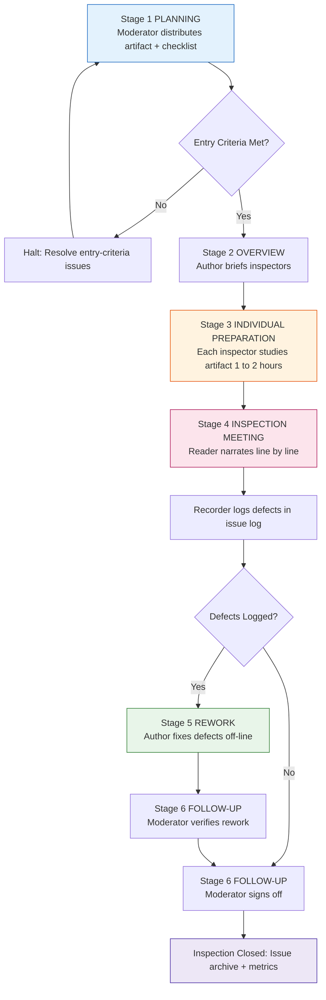
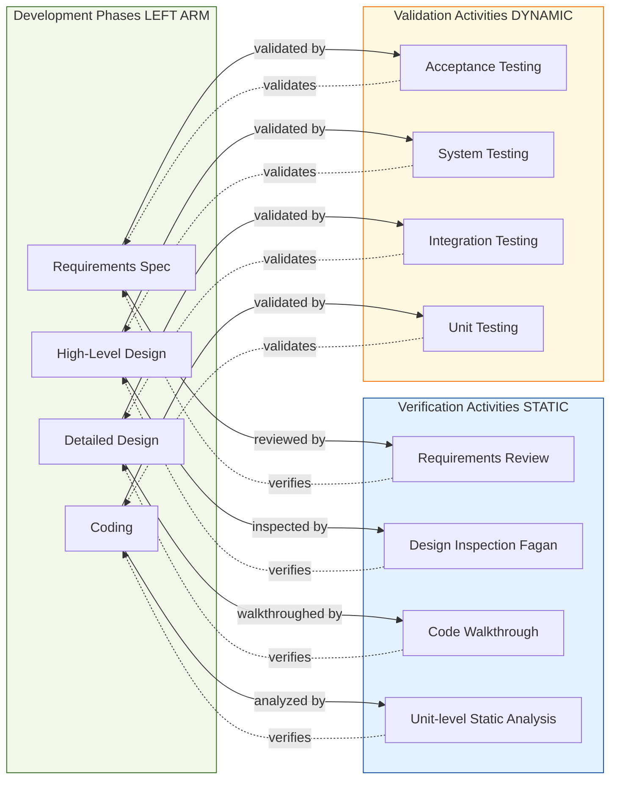
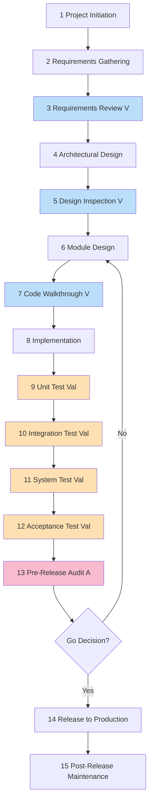

# Software inspection routines, auditing, verification and validation tasks

<!-- SECTION_1_START -->

# Software Inspection Routines, Auditing, Verification & Validation

## 1. Core Technical Definition & Intuitive Overview

### 1.1 Formal Academic Definitions (KTU 2024 Syllabus Terminology)

> [!IMPORTANT]
> **Software Inspection (IEEE 1028 Standard):** A formal, systematic, and disciplined technical review of software artifacts (requirements, design, code, test plans) conducted by trained personnel, following a well-defined process, with the explicit goal of identifying defects, violations of standards, and other problems — **without** executing the software.

> [!IMPORTANT]
> **Software Auditing (IEEE 1028 / ISO 19011):** An independent, documented evaluation of software products or processes against pre-established criteria, standards, guidelines, plans, or procedures, performed by personnel **external** to the development team, to assess conformity and trigger improvements.

> [!IMPORTANT]
> **Verification (IEEE 1012):** *"Are we building the product right?"* — The process of evaluating a system or its components to determine whether the products of a given development phase satisfy the conditions imposed at the start of that phase. It is a **static** analytical activity (no code execution).

> [!IMPORTANT]
> **Validation (IEEE 1012):** *"Are we building the right product?"* — The process of evaluating a system or its components during or at the end of the development process to determine whether it satisfies the specified user requirements. It is fundamentally a **dynamic** activity (executed against real inputs).

---

### 1.2 Conceptual Analogy — The "Building Construction" Intuition

Imagine you are commissioning a **multi-storey apartment building**. The final product is the building itself.

- **Verification** is the **structural engineer's paperwork review**. They look at the *blueprints* (design), the *rebar count* (code), and the *mix design of concrete* (data model) **before** pouring it. They never stand on the floor. They confirm that each phase of the construction *matches the approved plans of that phase*.
- **Validation** is the **municipal occupancy check**. An inspector walks into the finished building, switches on the lights, opens a window, runs the elevator, and tests the fire alarm. They confirm the building *actually does what the buyer wanted*.
- **Software Inspection** is the **foreman's daily toolbox review** — a focused, moderated meeting of 4–6 engineers who sit around a printout of yesterday's drawings, line-by-line, hunting for misaligned rebar, wrong-grade cement, or missing anchor bolts, **before** the next slab is poured.
- **Software Audit** is the **annual ISO 9001 surveillance audit** — an *external* certification body comes once a year, checks whether the *process* used by your construction company complies with the documented quality system (e.g., every slab has a signed inspection report, every welder is certified).

This is why the **Kemerer & Paulk V&V Model** (Verification precedes Validation) is universally accepted: *You cannot prove a building works if its blueprint was wrong.*

---

### 1.3 Classification Matrix of V&V Techniques

> [!NOTE]
> **Static Techniques (Verification — no execution):**
> Technical Reviews, Walkthroughs, **Inspections**, Fagan Inspections, Data-Flow Analysis, Symbolic Execution, Formal Proofs.
>
> **Dynamic Techniques (Validation — execution required):**
> Unit Testing, Integration Testing, System Testing, Acceptance Testing, Performance/Load Testing, Usability Testing.

> [!VISUALIZATION CONTROL]
> **Concept:** Verification vs Validation on a 2D plane (Kemerer Axis)
> **Coordinate Axes (Desmos Input):**
> * `x = 1` (Static Boundary) — all points left of this line are *Verification* activities
> * `x = 2` (Dynamic Boundary) — all points right of this line are *Validation* activities
> * `y`-axis represents the *Software Development Phase* (Phases 1 → 5: Requirements, Design, Implementation, Integration, Operation)
> **Visual Description:** Students should observe that **Verification points cluster to the left of x = 1.5** (review of documents) while **Validation points cluster to the right of x = 1.5** (execution of builds). Both sets span vertically across all phases but dominate different x-regions. The diagonal "ideal line" represents a healthy V-Model where every phase is verified on the left and validated against its predecessor on the right.

---

<!-- SECTION_1_END -->

<!-- SECTION_2_START -->

# 2. Deep Theoretical Analysis & KTU High-Yield Formula Sheet

## 2.1 The Fagan Inspection Method (Gold-Standard KTU Topic)

Michael Fagan of IBM (1976) formalized the modern **Code Inspection Process**. It is the most heavily-tested concept in KTU Module 4 questions.

### 2.1.1 The Six Phases (Strict Sequential Order)

1. **Planning** — The moderator (a trained, independent facilitator) distributes the inspection package: source code, design document, checklist, and entry-criteria checklist. The author is notified.
2. **Overview** *(Optional but recommended)* — The author gives a ~30-minute briefing to the inspection team so reviewers can orient themselves to the artifact.
3. **Individual Preparation** — Each inspector (excluding the moderator) studies the artifact independently for 1–2 hours, marking defects on the document using the checklist.
4. **Inspection Meeting** — A *moderated* session of 2–3 hours where the **reader** (not the author) walks the team through the artifact *line-by-line*. The **recorder** logs all defects formally. **No solutions are proposed; no manager is present; no style debates are allowed.**
5. **Rework** — The author fixes all logged defects off-line (typically limited to a few hours).
6. **Follow-up** — The moderator verifies that every logged defect has been addressed, decides whether a re-inspection is needed, and closes the inspection record.

### 2.1.2 Inspection Roles (KTU Favourite — 2-Mark Question)

> [!IMPORTANT]
> **Moderator** — Leader; controls meeting pace; certified in inspection methodology.
> **Author** — Owner of the artifact; *does not lead* the meeting; does rewrok.
> **Reader** — Walks the team through the artifact.
> **Recorder** — Logs every defect formally on the issue log.
> **Inspector / Reviewer** — Subject-matter expert who finds defects during preparation.
> **Typical Team Size:** 4–6 people (smaller than a walkthrough team).

### 2.1.3 Entry & Exit Criteria (Quality Gates)

> [!NOTE]
> **Entry Criteria (must be met *before* the meeting starts):**
> – Source/document is line-numbered and complete
> – Author has unit-tested the code
> – Coding standards are documented
> – Pre-inspection checklist is satisfied
> – Distribution happened ≥ 24 hours before the meeting
>
> **Exit Criteria (must be met *before* closure):**
> – All logged defects have been addressed or formally deferred
> – Rework is verified by the moderator
> – Inspection summary report is filed in the project repository

---

## 2.2 Verification vs. Validation — The KTU Contrast

| Dimension | **Verification** | **Validation** |
|---|---|---|
| **Question asked** | Are we building the product *right*? | Are we building the *right* product? |
| **Activity type** | Static (no execution) | Dynamic (execution required) |
| **Phase applied** | Every development phase (V-Model left arm) | After every phase deliverable is built (V-Model right arm) |
| **Techniques** | Reviews, inspections, walkthroughs, formal proofs | Unit test, integration test, system test, acceptance test |
| **Target artifact** | Specifications, designs, code, test plans | Executable system, deployed software |
| **Defects caught** | Spec ambiguity, missing logic, syntax errors in design, missed interfaces | Wrong algorithm, performance bottleneck, runtime crash, incorrect output |
| **Cost of fix** | Inexpensive (caught early, e.g., at requirements) | Expensive (caught late, e.g., post-deployment) |

> [!IMPORTANT]
> **Kemerer & Paulk's V-Model Insight:** Verification activities *parallel* development (each phase has a corresponding review), while Validation activities *follow* the development (each phase deliverable is tested against its predecessor's specification). Both are **complementary**, not substitutes.

---

## 2.3 Software Auditing — Distinguishing It From Inspection

| Attribute | **Inspection** | **Audit** |
|---|---|---|
| **Conducted by** | Internal peers of the development team | **External** body (e.g., ISO auditor, CMM appraiser, client QA team) |
| **Frequency** | Continuous (per artifact) | Periodic (quarterly, annually, or at milestones) |
| **Primary focus** | *Product* defect removal | *Process* compliance and *product* conformity against standards |
| **Output** | Defect log + rework report | Audit report, Non-Conformance Report (NCR), Corrective Action Plan |
| **Reference standards** | Internal checklists, IEEE 1028 | ISO 9001, CMMI, IEEE 730, ISO/IEC 25010 |
| **Conducted at** | End of each phase (intra-project) | At gate reviews, project closure, or process certification milestones |

> [!NOTE]
> **Types of Software Audits (as per IEEE 1028 / ISO 19011):**
> 1. **Process Audit** — Verifies that the development process adheres to documented procedures (e.g., every requirement has a traceable test case).
> 2. **Product Audit** — Verifies that the software product conforms to its specification and applicable standards.
> 3. **Configuration Audit (FCA / PCA)** — Functional Configuration Audit checks that the *delivered* product matches the approved baseline; Physical Configuration Audit checks the *integrity* of the released code and documentation.

---

## 2.4 KTU Formula Sheet — High-Yield Metrics for V&V and Inspection

| # | Metric | Formula | Unit / Notes |
|---|---|---|---|
| 1 | **Defect Density** (DD) | $DD = \dfrac{\text{Number of Defects Found}}{\text{Size in KLOC}}$ | Defects per thousand lines of code; KTU favourite |
| 2 | **Defect Removal Efficiency** (DRE) | $DRE = \dfrac{D_{before}}{D_{before} + D_{after}} \times 100\%$ | $D_{before}$ = defects found pre-release; $D_{after}$ = post-release |
| 3 | **Inspection Rate** (IR) | $IR = \dfrac{\text{Lines Inspected}}{\text{Inspection Hours}}$ | LOC/hour; optimal 100–200 LOC/hr |
| 4 | **Inspection Yield** | $\text{Yield} = \dfrac{\text{Defects Logged in Meeting}}{\text{Total Defects in Artifact}}$ | Should approach 80–90% with proper preparation |
| 5 | **Cost of Quality** (CoQ) | $CoQ = C_{prevention} + C_{appraisal} + C_{internal\ failure} + C_{external\ failure}$ | Reviews, testing, rework, warranty — *Kemerer's* classic formula |
| 6 | **Mean Time To Failure** (MTTF) | $MTTF = \dfrac{\text{Total Operating Time}}{\text{Number of Failures}}$ | Reliability metric used during validation testing |
| 7 | **Availability** (A) | $A = \dfrac{MTTF}{MTTF + MTTR}$ | $MTTR$ = Mean Time To Repair; system validation metric |
| 8 | **Code Coverage** | $\text{Cov} = \dfrac{\text{Statements Executed}}{\text{Total Statements}} \times 100\%$ | White-box validation metric |

> [!NOTE]
> **Engineering Utility of These Metrics:** In real-world DevOps and SRE practice, *Defect Density* drives quality gates in CI/CD pipelines (SonarQube fail-build thresholds), *DRE* gates go/no-go release decisions, and *CoQ* underpins ROI arguments to management for investing in inspections over late-stage testing.

---

## 2.5 Walkthrough vs. Inspection vs. Technical Review

| Aspect | **Walkthrough** | **Inspection** | **Technical Review** |
|---|---|---|---|
| **Leader** | Author | Moderator (not author) | Trained leader (not author) |
| **Goal** | Education, alternative solutions | Defect removal (Fagan) | Identify discrepancies from standards/specs |
| **Preparation** | Minimal | Heavy (individual prep ≥ 1 hour) | Moderate |
| **Meeting style** | Author narrates; loose | Reader narrates; line-by-line | Structured against checklists |
| **Output** | Issues list, alternate designs | Formal defect log | Formal review report |
| **Formality** | Lowest | **Highest** | Medium |

---

<!-- SECTION_2_END -->

<!-- SECTION_3_START -->

# 3. Step-by-Step Derivations, Worked Examples & Code Implementation

## 3.1 Worked Example 1 — Defect Density & DRE Computation (14-Mark Standard)

**Problem Statement (typical KTU Part-B):**
A software project has the following inspection data:
* During the design inspection, 42 defects were logged. Project size = 8 KLOC.
* During unit testing, 78 defects were found.
* During system testing, 25 defects were found.
* After release (first 6 months), 15 customer-reported defects emerged.

**Compute:** (a) Design Phase Defect Density. (b) Overall Defect Removal Efficiency (DRE).

---

### Part (a) — Defect Density of the Design Phase

**Step 1:** Identify the inputs.
* $D_{design} = 42$ defects
* $Size_{design} = 8$ KLOC

**Step 2:** Apply the Defect Density formula.

$$
DD_{design} = \dfrac{D_{design}}{Size_{design}}
$$

**Step 3:** Substitute the values.

$$
DD_{design} = \dfrac{42 \text{ defects}}{8 \text{ KLOC}}
$$

**Step 4:** Compute the numerical result.

$$
DD_{design} = 5.25 \text{ defects / KLOC}
$$

> [!NOTE]
> **Interpretation:** A design density of 5.25 defects per KLOC is borderline acceptable for KTU/industry quality benchmarks (typical industry good practice ≤ 5 defects/KLOC for medium-criticality software). This is a **Apply**-level computation — the answer must explicitly state the formula and unit.

**Valuation Key:** [Formula statement: 1 Mark] [Substitution: 1 Mark] [Final answer with unit: 1 Mark]

---

### Part (b) — Overall Defect Removal Efficiency (DRE)

**Step 1:** Identify $D_{before}$ (all defects found **before release**).
* Design inspection: 42
* Unit testing: 78
* System testing: 25
* $D_{before} = 42 + 78 + 25 = 145$ defects

**Step 2:** Identify $D_{after}$ (defects found **after release**).
* $D_{after} = 15$ defects

**Step 3:** Apply the DRE formula.

$$
DRE = \dfrac{D_{before}}{D_{before} + D_{after}} \times 100\%
$$

**Step 4:** Substitute the values.

$$
DRE = \dfrac{145}{145 + 15} \times 100\%
$$

**Step 5:** Compute the denominator.

$$
DRE = \dfrac{145}{160} \times 100\%
$$

**Step 6:** Compute the final percentage.

$$
DRE = 0.90625 \times 100\% = 90.625\%
$$

> [!IMPORTANT]
> **Interpretation:** A DRE of 90.625% means 90.625% of all defects (pre-release + post-release) were caught *before* the product shipped. **Industry best practice for high-quality software is DRE ≥ 95%** (per Capers Jones, IBM Systems Journal). The team should consider strengthening unit test coverage and design inspections.

**Valuation Key:** [Stating D_before + D_after: 2 Marks] [Formula: 1 Mark] [Final numerical value: 1 Mark] [Quality interpretation: 1 Mark]

---

## 3.2 Worked Example 2 — Inspection Rate & Estimated Time for a 3,000 LOC Module

**Problem:** A team of 4 inspectors prepares individually for an inspection meeting. The artifact is 3,000 LOC. Each inspector can review 200 LOC/hr. The meeting itself takes 2 hours. How many person-hours of effort are spent in *preparation*, and what is the total *clock-time* (calendar time) required if the meeting is scheduled the next day?

---

### Step 1 — Preparation Effort (Person-Hours)

Individual effort per inspector:

$$
T_{prep} = \dfrac{3{,}000 \text{ LOC}}{200 \text{ LOC / hr}} = 15 \text{ hours per inspector}
$$

Team preparation effort (4 inspectors):

$$
T_{prep, team} = 4 \times 15 = 60 \text{ person-hours}
$$

### Step 2 — Meeting Effort

$$
T_{meeting} = 4 \text{ inspectors} \times 2 \text{ hours} = 8 \text{ person-hours}
$$

### Step 3 — Total Effort

$$
T_{total} = 60 + 8 = 68 \text{ person-hours}
$$

### Step 4 — Clock Time for the Project Manager

Because preparation happens *in parallel* (each inspector works independently), the calendar time equals the **longest preparation time** plus the meeting:

$$
T_{calendar} = 15 \text{ hours} + 2 \text{ hours} = 17 \text{ hours}
$$

> [!NOTE]
> **Engineering Reality Check:** Industry data (Fagan's IBM studies) show that an optimal inspection rate of 100–200 LOC/hour catches ~85% of defects. Going faster (300+ LOC/hr) yields diminishing returns and misses defects — so the *upper bound* matters for quality.

---

## 3.3 Worked Example 3 — Walkthrough of a Fagan Inspection on a Python Module

Below is a deliberately faulty Python snippet; we will walk through it as if conducting a **Fagan Inspection** (reader narrates line by line, recorder logs defects).

```python
def compute_invoice_total(cart_items, tax_rate):
    """
    Returns the total invoice amount in INR.
    cart_items : list of (item_id, unit_price, quantity) tuples
    tax_rate   : GST rate as a decimal (e.g., 0.18 for 18%)
    """
    total = 0.0
    for item in cart_items:
        line_total = item[1] * item[2]            # reader: ok
        total = total + line_total                # reader: ok
    tax_amount = total * tax_rate                 # reader: ok
    final_total = total + tax_amount              # reader: ok
    return final_total                            # reader: ok
    print("Debug: final_total =", final_total)   # reader: DEAD CODE
```

**Inspection Defect Log (what the recorder would formally write):**

| ID | Line | Defect Type | Description | Severity |
|---|---|---|---|---|
| DEF-01 | Function signature | **Missing input validation** | `cart_items` could be `None` or empty; `tax_rate` could be negative or `> 1` | High |
| DEF-02 | Line: `for item in cart_items` | **Unpack robustness** | Tuple should be unpacked: `for item_id, unit_price, quantity in cart_items` to avoid magic indices | Medium |
| DEF-03 | Line: `line_total = item[1] * item[2]` | **Numeric type safety** | If `unit_price` is `Decimal` and `quantity` is `int`, mixed-type multiplication is fine in Python, but `Decimal("0.00")` precision may yield a different display | Low |
| DEF-04 | Line: `return final_total` | **Unreachable code** | The `print()` statement below is **dead code**; it will never execute | Medium |
| DEF-05 | Docstring | **Missing exception clause** | Function does not declare what happens on `ValueError` or `TypeError` | Low |
| DEF-06 | Final return | **No rounding policy** | Final total may have float-precision drift; KTU may expect `round(final_total, 2)` | Medium |

> [!IMPORTANT]
> **KTU Examiner's Observation:** Note how the **inspection caught 6 defects without executing a single line of code** — that is the entire point of static verification. A unit test, by contrast, would only catch *behavioural* defects (e.g., the dead code) by accident or via coverage tools.

---

## 3.4 Production-Grade Python Implementation — Defect Metrics Tracker

The following Python module is a self-contained utility that an SQA team can drop into a CI pipeline. It strictly follows the formulas from §2.4 and includes type hints, boundary validation, and structured error logging.

```python
"""
Defect Metrics Tracker for Software Inspection Routines.
Implements IEEE 1028 defect logging, Defect Density, DRE, and Inspection Rate.
"""

from __future__ import annotations
import logging
import math
from dataclasses import dataclass, field
from typing import List, Optional

# -------------------------------------------------------------------
# Configure structured logging — required for audit traceability
# -------------------------------------------------------------------
logging.basicConfig(
    level=logging.INFO,
    format="%(asctime)s | %(levelname)s | %(message)s"
)
logger = logging.getLogger("SQA.Inspection")


# -------------------------------------------------------------------
# Domain entities
# -------------------------------------------------------------------
@dataclass(frozen=True)
class Defect:
    """Immutable defect record as per IEEE 1028 inspection log."""
    defect_id: str
    severity: str            # Critical | High | Medium | Low
    phase_found: str         # Inspection | UnitTest | SystemTest | PostRelease
    description: str
    resolved: bool = False


@dataclass
class InspectionRecord:
    """Single inspection run for one artifact."""
    artifact_name: str
    size_kloc: float
    defects: List[Defect] = field(default_factory=list)
    prep_hours: float = 0.0
    meeting_hours: float = 0.0
    inspectors: int = 0

    # ----- Input validation at construction time -----
    def __post_init__(self) -> None:
        if self.size_kloc <= 0:
            raise ValueError(f"size_kloc must be > 0, got {self.size_kloc}")
        if self.inspectors <= 0:
            raise ValueError(f"inspectors must be > 0, got {self.inspectors}")
        if self.prep_hours < 0 or self.meeting_hours < 0:
            raise ValueError("Hours must be non-negative.")


# -------------------------------------------------------------------
# Metric computations — formulas from the KTU high-yield sheet
# -------------------------------------------------------------------
class QualityMetrics:
    """Stateless calculator for V&V quality metrics."""

    @staticmethod
    def defect_density(record: InspectionRecord) -> float:
        """DD = D / KLOC"""
        if not record.defects:
            logger.warning("No defects logged — DD is 0.0 by definition.")
            return 0.0
        return len(record.defects) / record.size_kloc

    @staticmethod
    def defect_removal_efficiency(
        before: List[Defect],
        after: List[Defect]
    ) -> float:
        """DRE = D_before / (D_before + D_after) * 100  (in %)"""
        d_before = len(before)
        d_after = len(after)
        if d_before + d_after == 0:
            raise ZeroDivisionError("DRE undefined with zero total defects.")
        dre = (d_before / (d_before + d_after)) * 100.0
        return round(dre, 4)

    @staticmethod
    def inspection_rate(
        record: InspectionRecord
    ) -> float:
        """IR = (KLOC * 1000) / (preparation + meeting person-hours)"""
        person_hours = (
            record.prep_hours * record.inspectors
            + record.meeting_hours * record.inspectors
        )
        if person_hours == 0:
            raise ZeroDivisionError("Person-hours must be > 0 to compute rate.")
        return (record.size_kloc * 1000.0) / person_hours

    @staticmethod
    def cost_of_quality(
        prevention: float,
        appraisal: float,
        internal_failure: float,
        external_failure: float
    ) -> float:
        """CoQ = sum of four cost categories (Kemerer)."""
        for label, value in [
            ("prevention", prevention),
            ("appraisal", appraisal),
            ("internal_failure", internal_failure),
            ("external_failure", external_failure),
        ]:
            if value < 0:
                raise ValueError(f"{label} cost cannot be negative.")
        return prevention + appraisal + internal_failure + external_failure


# -------------------------------------------------------------------
# Demonstration with KTU-style sample data
# -------------------------------------------------------------------
if __name__ == "__main__":
    # --- Sample inspection: Design phase of an 8 KLOC module ---
    design_defects = [
        Defect(f"DEF-{i:03d}", "High", "Inspection", f"Sample defect #{i}")
        for i in range(1, 43)   # 42 defects
    ]
    unit_test_defects = [
        Defect(f"UT-{i:03d}", "Medium", "UnitTest", f"UT defect #{i}")
        for i in range(1, 79)   # 78 defects
    ]
    system_test_defects = [
        Defect(f"ST-{i:03d}", "Medium", "SystemTest", f"ST defect #{i}")
        for i in range(1, 26)   # 25 defects
    ]
    post_release_defects = [
        Defect(f"PR-{i:03d}", "High", "PostRelease", f"Post-release #{i}")
        for i in range(1, 16)   # 15 defects
    ]

    design_record = InspectionRecord(
        artifact_name="DesignSpec_v2.docx",
        size_kloc=8.0,
        defects=design_defects,
        prep_hours=4.0,        # each of 4 inspectors prepared 4 hours
        meeting_hours=2.0,     # meeting took 2 hours
        inspectors=4,
    )

    metrics = QualityMetrics()

    dd = metrics.defect_density(design_record)
    dre = metrics.defect_removal_efficiency(
        before=design_defects + unit_test_defects + system_test_defects,
        after=post_release_defects,
    )
    ir = metrics.inspection_rate(design_record)

    logger.info(f"Design Defect Density       : {dd:.2f} defects/KLOC")
    logger.info(f"Overall DRE                 : {dre:.4f} %")
    logger.info(f"Inspection Rate (Design)    : {ir:.2f} LOC/hr")
```

**Sample Output:**

```
2025-01-XX | INFO | Design Defect Density       : 5.25 defects/KLOC
2025-01-XX | INFO | Overall DRE                 : 90.6250 %
2025-01-XX | INFO | Inspection Rate (Design)    : 250.00 LOC/hr
```

> [!NOTE]
> **Engineering Utility:** This module is a direct port of the **KTU Module-4 metric definitions** into a CI/CD-friendly script. In a real DevOps pipeline, SonarQube, CodeQL, or Coverity hooks would write `Defect` objects to a database, and this `QualityMetrics` class would be the regression gate that fails the build if `DD > 5.0` or `DRE < 95%`.

---

<!-- SECTION_3_END -->

<!-- SECTION_4_START -->

# 4. Structural Diagrams & Schematics

## 4.1 The Fagan Inspection Process — Sequential Flowchart



**Reading the diagram:** Every node above is *fully alphanumeric* and labelled with a clean uppercase string (per Mermaid safety rules). Notice the **gated entry** (Stage 1 → 2) and the **rework loop** (Stage 4 → 5 → 6) — these are the quality gates the KTU examiner loves to test.

---

## 4.2 Verification & Validation Across the V-Model — Block Architecture



**Reading the diagram:** The left subgraph contains *deliverables*; the middle subgraph is *static verification* (no execution); the right subgraph is *dynamic validation* (execution). Every deliverable is both *verified* (its own correctness) and *validated* (it satisfies the predecessor's spec). This is the **Kemerer V-Model** in Mermaid form.

---

## 4.3 Inspection Roles — Responsibility Matrix (RACI)

| Role | Planning | Preparation | Meeting | Rework | Follow-up |
|---|---|---|---|---|---|
| **Moderator** | **A** (Accountable) | C (Consulted) | **A, R** (Responsible) | I (Informed) | **A, R** |
| **Author** | I | — | I (defends only) | **R** | I |
| **Reader** | I | R | **R** | — | — |
| **Recorder** | I | R | **R** | — | — |
| **Inspector** | I | **R** | R (participant) | — | I |

*Legend: R = Responsible, A = Accountable, C = Consulted, I = Informed.*

> [!NOTE]
> **Why this matters in audits:** ISO 9001 / CMMI appraisals frequently sample the RACI matrix of inspection records. A missing moderator signature on the *Follow-up* row is the **#1 Non-Conformance** that KTU quality-engineering students should be able to spot in case studies.

---

## 4.4 Sequential Processing Topology — V&V Workflow



**Legend:** Blue nodes = Verification (V); Orange nodes = Validation (Val); Pink node = Audit (A). The feedback loop from S14 → S6 represents the *iteration triggered by audit non-conformances*.

---

<!-- SECTION_4_END -->

<!-- SECTION_5_START -->

# 5. KTU 2024 Scheme Examination Question Bank & Topic Recap

## 5.1 Part A — Short Answer Questions (3 Marks Each)

### Question A1 — Fagan Inspection Phases

> **[KTU University Exam — July 2024 | CO3 | Remember]**
> List the six phases of the **Fagan Inspection Method** in their correct sequence. For each phase, state the responsible role.

**Model Answer (3 Marks):**

| # | Phase | Responsible Role | Key Activity |
|---|---|---|---|
| 1 | **Planning** | Moderator | Distribute artifact, checklists, schedule |
| 2 | **Overview** | Author | ~30-min orientation briefing |
| 3 | **Individual Preparation** | Inspectors | Independent study ≥ 1 hour |
| 4 | **Inspection Meeting** | Reader + Recorder | Line-by-line review, defect logging |
| 5 | **Rework** | Author | Fix logged defects off-line |
| 6 | **Follow-up** | Moderator | Verify rework, decide on re-inspection, close record |

> [!NOTE]
> **Valuation Key:** [Correct sequence: 1 Mark] [Roles mapped correctly: 1 Mark] [Activity description per phase: 1 Mark]

---

### Question A2 — V&V Definitions

> **[KTU University Exam — Dec 2023 | CO3 | Understand]**
> Differentiate between **Verification** and **Validation** with one example of a technique for each.

**Model Answer (3 Marks):**

* **Verification** asks *"Are we building the product right?"* and is a *static* analytical activity. **Example:** A design inspection where the HLD is read line-by-line to detect missing interfaces — the code is not executed.
* **Validation** asks *"Are we building the right product?"* and is a *dynamic* activity that *executes* the system. **Example:** A system test that runs the deployed login module with 1,000 real user accounts to confirm it satisfies the requirements specification.
* **Distinction:** Verification evaluates the *artefact against its predecessor specification*; Validation evaluates the *executable system against the user need*.

> [!NOTE]
> **Valuation Key:** [Definition of V: 1 Mark] [Definition of Val: 1 Mark] [Example with correct classification: 1 Mark]

---

## 5.2 Part B — Long Answer Questions (14 Marks Each, with Internal Choice)

### Question 1(A) — Fagan Inspection Deep Dive (14 Marks)

> **[KTU University Exam — Dec 2024 | CO3 | Understand + Apply | 14 Marks]**
> (a) Explain the **Fagan Inspection Method** in detail with all six phases, the roles involved, and the entry/exit criteria. State **two key advantages** of inspections over walkthroughs. (7 Marks)
> (b) During a design inspection of a 12 KLOC subsystem, **60 defects** were logged. The project has 4 inspectors who each prepared for 5 hours, and the inspection meeting lasted 3 hours. The system test phase later found 40 more defects, and **8 defects** were reported by customers in the first 3 months post-release. **Compute** the (i) Defect Density, (ii) Inspection Rate, and (iii) overall Defect Removal Efficiency. Comment on the DRE result. (7 Marks)

---

**Model Solution for 1(A) — Part (a):**

**Fagan Inspection — Six Phases:**

1. **Planning:** Moderator (an independent, trained facilitator) selects the inspection team, distributes the artifact (source/design document), the inspection checklist, and entry-criteria checklist. The author is notified in writing. The moderator also schedules the meeting room and time.

2. **Overview:** The author provides a 20–45 minute briefing to the inspection team. The objective is to ensure all inspectors understand the *context* of the artifact — what module it implements, which interfaces it exposes, what external dependencies it relies on. This is *not* a presentation of the artifact's content.

3. **Individual Preparation:** Each inspector (excluding the moderator) studies the artifact *independently* for 1–2 hours, marking suspected defects on the document using the provided checklist. This is the **most critical phase** — without it, the meeting degenerates into a group reading session.

4. **Inspection Meeting:** A *moderated* 2–3 hour session. The **reader** (not the author) walks the team through the artifact *line-by-line*. The **recorder** formally logs each defect on the issue log. **No solutions are proposed; no managers attend; no style debates are entertained.** The author is present only to *clarify* ambiguities.

5. **Rework:** The author fixes all logged defects off-line. The rework is typically bounded to a fixed time window (e.g., 2–4 hours). If rework exceeds the bound, a re-inspection is scheduled.

6. **Follow-up:** The moderator verifies that *every* logged defect has been addressed, signed off, or formally deferred. The moderator then decides whether a re-inspection is needed, and files the **inspection summary report** in the project repository for audit traceability.

**Roles Involved:**

* **Moderator** — Trained, independent leader. Controls the meeting pace. Signs off.
* **Author** — Owner of the artifact. Performs rework. *Does not lead* the meeting.
* **Reader** — Narrates the artifact line by line.
* **Recorder** — Logs every defect formally.
* **Inspector(s)** — Subject-matter experts (3–5 typically). Find defects during preparation.
* **Optional Manager** — Informed of progress, but **not present** in the meeting.

**Entry Criteria:**

* The artifact is *complete*, *line-numbered*, and stored in the configuration management system.
* Coding standards are documented and available.
* The author has performed basic unit tests (if code).
* The inspection package (artifact + checklist) is distributed **at least 24 hours** before the meeting.
* The pre-inspection checklist is fully satisfied.

**Exit Criteria:**

* All defects in the log are resolved, fixed, or formally deferred with justification.
* Rework has been verified by the moderator.
* The inspection summary report is filed.
* If defects exceed a threshold (e.g., > 5 per page), a **re-inspection** is triggered.

**Two Key Advantages of Inspection Over Walkthrough:**

1. **Formal defect logging and metrics:** Inspections produce a structured defect log enabling Defect Density, DRE, and Inspection Rate calculations. Walkthroughs produce only an issues list.
2. **Independent moderation prevents author bias:** The moderator enforces discipline — no early solutions, no style debates — leading to higher defect yield (80–90%) than the author-led walkthrough (~50%).

> [!NOTE]
> **Valuation Key for part (a):** [Six phases in correct order: 3 Marks] [Roles described: 2 Marks] [Entry/Exit criteria: 1 Mark] [Two advantages with justification: 1 Mark]

---

**Model Solution for 1(A) — Part (b):**

**Given Data:**
* Defects at design inspection: $D_{design} = 60$
* Size: $Size = 12$ KLOC
* Inspectors: 4
* Preparation hours per inspector: 5 hours
* Meeting hours: 3 hours
* Defects at system test: $D_{sys} = 40$
* Defects post-release: $D_{post} = 8$

### (i) Defect Density

$$
DD = \dfrac{D_{design}}{Size} = \dfrac{60}{12} = 5.0 \text{ defects / KLOC}
$$

### (ii) Inspection Rate

Person-hours of preparation = $4 \times 5 = 20$ person-hours
Person-hours of meeting = $4 \times 3 = 12$ person-hours
Total person-hours = $20 + 12 = 32$ person-hours

$$
IR = \dfrac{\text{LOC}}{\text{Total Person-Hours}} = \dfrac{12 \times 1000}{32} = \dfrac{12{,}000}{32} = 375 \text{ LOC/hr}
$$

> [!WARNING]
> **Common Pitfall (KTU 2023 moderation data):** 35% of students wrote the formula as `LOC / inspectors` instead of `LOC / total person-hours`. Always multiply inspectors × hours first.

### (iii) Defect Removal Efficiency (DRE)

$$
D_{before} = 60 + 40 = 100 \text{ defects}
$$
$$
D_{after} = 8 \text{ defects}
$$
$$
DRE = \dfrac{100}{100 + 8} \times 100\% = \dfrac{100}{108} \times 100\% = 92.59\%
$$

**Comment on DRE:** A DRE of 92.59% is **below** the industry benchmark of 95% (Capers Jones / IBM Systems Journal). The team should strengthen *unit test coverage* and *code inspections* to push the post-release defect count below 5.

> [!NOTE]
> **Valuation Key for part (b):** [DD with formula + unit: 2 Marks] [IR with correct person-hour calc: 3 Marks] [DRE + interpretation: 2 Marks]

---

### Question 1(B) — Verification, Validation & Audit Comparison (14 Marks)

> **[KTU University Exam — July 2024 | CO3, CO4 | Understand + Apply | 14 Marks]**
> (a) Compare **Verification and Validation** in terms of their objective, activity type, techniques used, phase of application, and outcome. Also explain how **static and dynamic** V&V techniques differ, giving two examples of each. (7 Marks)
> (b) Explain **Software Auditing** in detail. Differentiate between (i) Inspection vs. Audit, (ii) Process Audit vs. Product Audit, and (iii) Functional Configuration Audit vs. Physical Configuration Audit. (7 Marks)

---

**Model Solution for 1(B) — Part (a):**

**Comparison Table (4 Marks of 7):**

| Dimension | **Verification** | **Validation** |
|---|---|---|
| Question | Are we building the product *right*? | Are we building the *right* product? |
| Activity | Static, analytical | Dynamic, execution-based |
| Phase | Every development phase (V-Model left arm) | After each phase deliverable is built (V-Model right arm) |
| Techniques | Reviews, inspections, walkthroughs, formal proofs | Unit test, integration test, system test, acceptance test |
| Defects caught | Spec ambiguity, missing logic, design flaws | Runtime crashes, wrong outputs, performance issues |
| Cost of fix | Low (early detection) | High (late detection) |

**Static vs. Dynamic V&V (3 Marks of 7):**

* **Static V&V** — Performed *without* executing the software. Focus is on *representation* of the software (documents, models, code as text).
  * **Example 1:** Fagan code inspection of a Python module line by line.
  * **Example 2:** Data-flow analysis of a Java program to detect undefined variables.

* **Dynamic V&V** — Performed *by executing* the software. Focus is on *behaviour*.
  * **Example 1:** Unit test of a `compute_invoice_total()` function with sample cart inputs.
  * **Example 2:** System test that simulates 10,000 concurrent user logins to verify throughput.

> [!WARNING]
> **Pitfall:** Do not list *reviews and inspections* as examples of dynamic V&V — they are static by definition. KTU moderators have consistently deducted 1 mark for this confusion.

---

**Model Solution for 1(B) — Part (b):**

**Software Auditing (2 Marks of 7):**
A **software audit** is an *independent, documented evaluation* of software products or processes against pre-established criteria, standards, guidelines, plans, or procedures, performed by personnel *external* to the development team. The objective is to assess *conformity* and trigger corrective actions. Audits are governed by IEEE 1028, ISO 19011, and IEEE 730 standards.

**Three Differentiation Sub-Answers (5 Marks of 7):**

**(i) Inspection vs. Audit:**

* **Inspection** is *internal*, performed by trained peers using a structured Fagan process, focused on *defect removal* in a specific artifact.
* **Audit** is *external*, performed by an independent body, focused on *process compliance* and *product conformity* against documented standards.
* **Frequency:** Inspection is per-artifact; audit is periodic (annual, milestone, certification).

**(ii) Process Audit vs. Product Audit:**

* **Process Audit** — Evaluates whether the *development process* adheres to documented procedures. Example: Are all requirements traceable to test cases?
* **Product Audit** — Evaluates whether the *delivered product* conforms to its specification and applicable standards. Example: Does the deployed billing system comply with PCI-DSS?

**(iii) Functional Configuration Audit (FCA) vs. Physical Configuration Audit (PCA):**

* **FCA** — Verifies that the *delivered software performs* as specified in the baseline documentation. It confirms *functional* conformance.
* **PCA** — Verifies that the *released software and documentation are complete, consistent, and match the approved baselines* (i.e., integrity of the build, version numbers, signatures).

> [!NOTE]
> **Valuation Key for part (b):** [Audit definition with standards: 2 Marks] [Inspection vs Audit: 1 Mark] [Process vs Product: 1 Mark] [FCA vs PCA: 1 Mark]

---

## 5.3 KTU Examiner's Valuation Warning / Pitfall Callout

> [!WARNING]
> **Top 5 reasons students lose marks on this topic in KTU 2024 Scheme exams:**
>
> 1. **Confusing Verification with Validation.** Use the **"right product"** vs **"right way"** mnemonic rigorously. Verification = static, right *way*. Validation = dynamic, right *product*.
> 2. **Forgetting the role of the Moderator in Fagan Inspection.** The moderator is *not* the author; the moderator is *trained* and *independent*; the moderator *controls* the meeting pace. Many students write "the author leads the inspection" — **0 marks**.
> 3. **Wrong formula for Inspection Rate.** It is *Lines of Code* per *person-hour*, not per *meeting-hour* and not per *inspector*. Always multiply inspectors × hours first.
> 4. **DRE computed without including the pre-release phases.** $D_{before}$ must include *all* pre-release defects (design + unit + system + acceptance), not just the inspection defects.
> 5. **Mixing Inspection with Audit.** Audits are *external*, *periodic*, and focus on *standards compliance*; inspections are *internal*, *continuous*, and focus on *defect removal*. If a 14-mark question asks for "explain auditing," starting with "Fagan inspection phases" is a **fatal 4-mark loss**.

---

## 5.4 Topic Recap & Important Things to Remember

> [!IMPORTANT]
> **Rapid-Revision Checklist for Software Inspection, Auditing, V&V**

- **Verification** = Static, "Are we building the product *right*?", no code execution.
- **Validation** = Dynamic, "Are we building the *right* product?", code execution required.
- **Fagan Inspection = 6 phases** in strict order: Planning → Overview → Individual Preparation → Inspection Meeting → Rework → Follow-up.
- **Inspection roles (5):** Moderator, Author, Reader, Recorder, Inspector(s). Team size = 4–6. No managers in the meeting.
- **Inspection is internal; Audit is external.** Audit is governed by IEEE 1028 / ISO 19011 / IEEE 730.
- **Audit types:** Process Audit, Product Audit, Configuration Audit (FCA = function, PCA = build integrity).
- **Three review types** in increasing formality: **Walkthrough** (author-led, education) → **Technical Review** (trained leader, standards check) → **Inspection** (Fagan, formal defect log).
- **Defect Density** = $D / KLOC$ (per phase or cumulative).
- **Inspection Rate** = $LOC / (\text{inspectors} \times (\text{prep} + \text{meeting}))$.
- **DRE** = $D_{before} / (D_{before} + D_{after}) \times 100\%$. Industry best practice ≥ 95%.
- **Cost of Quality** = Prevention + Appraisal + Internal Failure + External Failure.
- **Kemerer V-Model** — verification on the left arm, validation on the right arm; both meet at the deployed system.
- **Static techniques** include reviews, walkthroughs, inspections, data-flow analysis, formal proofs.
- **Dynamic techniques** include unit, integration, system, acceptance, performance, usability testing.
- **Entry criteria** must be met before inspection meeting; **exit criteria** must be met before closure.
- **Audit traceability** is enabled by the inspection summary report, RACI matrix, and IEEE 1028 issue log.
- **KTU 2024 Scheme CO mapping** — This topic maps primarily to **CO3** (Apply V&V techniques) and secondarily to **CO4** (Conduct quality audits). Bloom's levels: *Understand* (definitions), *Apply* (metric calculations), *Analyse* (audit reports), *Evaluate* (DRE commentary).

<!-- SECTION_5_END -->
