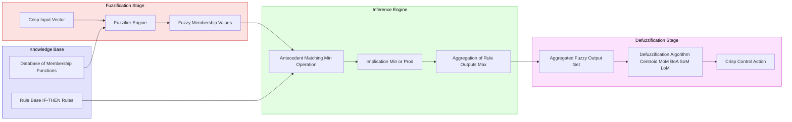
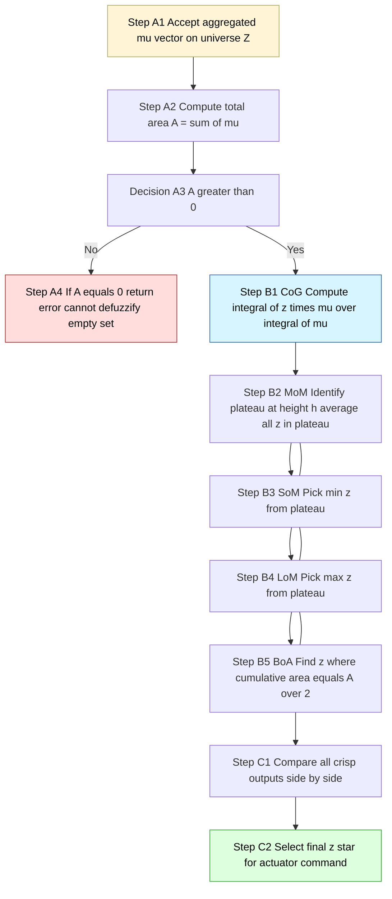
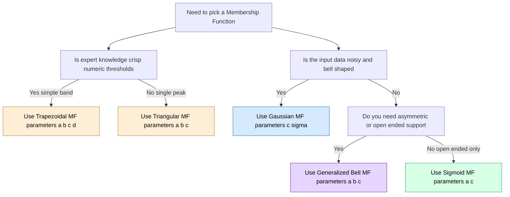

# Fuzzy sets: Membership functions, operations, fuzzy relations, defuzzification methods

<!-- SECTION_1_START -->

# Fuzzy Sets: Foundations of Soft Computing

## 1.1 Formal Definition of a Fuzzy Set

> [!IMPORTANT]
> **Definition (Zadeh, 1965):** A *fuzzy set* $\tilde{A}$ in a universe of discourse $X$ is a set of ordered pairs
> $$\tilde{A} = \{ (x,\ \mu_{\tilde{A}}(x)) \mid x \in X \}$$
> where $\mu_{\tilde{A}}: X \rightarrow [0,1]$ is called the **membership function** of $\tilde{A}$, and the value $\mu_{\tilde{A}}(x)$ is the *grade of membership* (or degree of compatibility) of element $x \in X$ in the set $\tilde{A}$.

> [!NOTE]
> - If $\mu_{\tilde{A}}(x) \in \{0, 1\}$, the fuzzy set **degenerates to a classical (crisp) set**.
> - The *support* of $\tilde{A}$ is $\text{supp}(\tilde{A}) = \{x \in X \mid \mu_{\tilde{A}}(x) > 0\}$.
> - The *core* (or *kernel*) of $\tilde{A}$ is $\text{core}(\tilde{A}) = \{x \in X \mid \mu_{\tilde{A}}(x) = 1\}$.
> - The *height* of $\tilde{A}$ is $h(\tilde{A}) = \sup_{x \in X} \mu_{\tilde{A}}(x)$. A fuzzy set is **normal** iff $h(\tilde{A}) = 1$.
> - The *$\alpha$-cut* (or $\alpha$-level set) is $A_{\alpha} = \{x \in X \mid \mu_{\tilde{A}}(x) \geq \alpha\}$, $\alpha \in (0,1]$.

## 1.2 Intuitive Analogy — The "Hot Coffee" Test

> [!TIP]
> **Intuition:** Imagine a cup of coffee at **55 °C**. Is it "hot"? A classical set says *yes* if $\geq 60$ °C, *no* otherwise — a cliff-edge decision. A fuzzy set instead asks: *"How hot is it?"* and answers with a number between **0 and 1** (say, $\mu = 0.75$). Fuzzy sets are the mathematical machinery for **partial truth** — they gracefully handle the linguistic vagueness of human reasoning (e.g., "tall", "fast", "expensive"). This is why they form the linguistic layer of expert systems, washing machines, and climate controllers.

## 1.3 Crisp Sets vs. Fuzzy Sets at a Glance

| Aspect | Crisp Set | Fuzzy Set |
| --- | --- | --- |
| Membership values | $\{0, 1\}$ | $[0, 1]$ |
| Boundary | Sharp / hard | Smooth / graded |
| Representation | $A = \{a, b, c\}$ | $\tilde{A} = 0.2/a + 0.7/b + 1.0/c$ |
| Logic base | Boolean / 2-valued | Multi-valued / infinite-valued |
| Induced by | Predicate logic | Membership function $\mu(x)$ |

## 1.4 Visual / Geometric Intuition

> [!VISUALIZATION CONTROL]
> **Concept:** Triangular and Gaussian membership functions on the real line.
> **GeoGebra / Desmos Input Equations:**
> * `f_tri(x) = max(0, 1 - abs(x - 5) / 2)` (triangular, peak at $x=5$, base width 4)
> * `f_gauss(x) = exp(-(x - 5)^2 / (2 * 1.2^2))` (Gaussian, centre 5, $\sigma=1.2$)
> **Visual Description:** Students should observe that the **triangular** curve rises linearly, peaks at 1, then falls linearly to 0. The **Gaussian** curve is smooth and bell-shaped, asymptotically approaching 0 — never exactly 0. Both map the input $x \in \mathbb{R}$ into the output range $[0, 1]$ on the vertical axis.

<!-- SECTION_1_END -->

<!-- SECTION_2_START -->

# Deep Theoretical Analysis & KTU High-Yield Formula Sheet

## 2.1 Membership Functions — The Workhorses

A **membership function (MF)** assigns to every element of $X$ a number in $[0,1]$ representing its *belongingness*. KTU frequently tests the following five canonical MFs.

### 2.1.1 Triangular MF
Defined by three parameters $\{a, b, c\}$ with $a < b < c$:

$$
\mu_{\tilde{A}}(x) = \begin{cases}
0, & x \leq a \\
\dfrac{x - a}{b - a}, & a < x \leq b \\
\dfrac{c - x}{c - b}, & b < x < c \\
0, & x \geq c
\end{cases}
$$

### 2.1.2 Trapezoidal MF
Defined by four parameters $\{a, b, c, d\}$ with $a < b \leq c < d$:

$$
\mu_{\tilde{A}}(x) = \begin{cases}
0, & x \leq a \\
\dfrac{x - a}{b - a}, & a < x < b \\
1, & b \leq x \leq c \\
\dfrac{d - x}{d - c}, & c < x < d \\
0, & x \geq d
\end{cases}
$$

### 2.1.3 Gaussian MF
Defined by centre $c$ and spread $\sigma > 0$:

$$
\mu_{\tilde{A}}(x) = \exp\!\left(-\dfrac{(x - c)^{2}}{2\sigma^{2}}\right)
$$

### 2.1.4 Generalized Bell MF
Defined by parameters $\{a, b, c\}$ with $a > 0$, $b > 0$:

$$
\mu_{\tilde{A}}(x) = \dfrac{1}{1 + \left\vert \dfrac{x - c}{a} \right\vert^{2b}}
$$

### 2.1.5 Sigmoid MF
Defined by parameters $\{a, c\}$:

$$
\mu_{\tilde{A}}(x) = \dfrac{1}{1 + \exp\!\bigl(-a(x - c)\bigr)}
$$

> [!NOTE]
> **How to choose an MF in practice (KTU favourite):**
> 1. **Triangular / Trapezoidal** — when expert knowledge is crisp ("between 20 and 30 is *ideal*").
> 2. **Gaussian** — when the underlying data is noisy and bell-shaped (sensor readings, error distributions).
> 3. **Bell / Sigmoid** — when you need asymmetric or open-ended sets ("very large" → sigmoid opening to the right).

## 2.2 Operations on Fuzzy Sets

For fuzzy sets $\tilde{A}$, $\tilde{B}$ on universe $X$, and $\forall x \in X$:

| Operation | Symbol | Membership Formula |
| --- | --- | --- |
| **Equality** | $\tilde{A} = \tilde{B}$ | $\mu_{\tilde{A}}(x) = \mu_{\tilde{B}}(x)$ |
| **Complement** | $\bar{\tilde{A}}$ | $\mu_{\bar{\tilde{A}}}(x) = 1 - \mu_{\tilde{A}}(x)$ |
| **Union (s-norm / t-conorm)** | $\tilde{A} \cup \tilde{B}$ | $\mu_{\tilde{A} \cup \tilde{B}}(x) = \max(\mu_{\tilde{A}}(x), \mu_{\tilde{B}}(x))$ |
| **Intersection (t-norm)** | $\tilde{A} \cap \tilde{B}$ | $\mu_{\tilde{A} \cap \tilde{B}}(x) = \min(\mu_{\tilde{A}}(x), \mu_{\tilde{B}}(x))$ |
| **Algebraic Sum** | $\tilde{A} \oplus \tilde{B}$ | $\mu(x) = \mu_{\tilde{A}}(x) + \mu_{\tilde{B}}(x) - \mu_{\tilde{A}}(x)\mu_{\tilde{B}}(x)$ |
| **Algebraic Product** | $\tilde{A} \cdot \tilde{B}$ | $\mu(x) = \mu_{\tilde{A}}(x) \cdot \mu_{\tilde{B}}(x)$ |
| **Bounded Sum** | $\tilde{A} \oplus \tilde{B}$ | $\mu(x) = \min\!\bigl(1,\ \mu_{\tilde{A}}(x) + \mu_{\tilde{B}}(x)\bigr)$ |
| **Bounded Difference** | $\tilde{A} \ominus \tilde{B}$ | $\mu(x) = \max\!\bigl(0,\ \mu_{\tilde{A}}(x) - \mu_{\tilde{B}}(x)\bigr)$ |
| **Concentration** | $\text{CON}(\tilde{A})$ | $\mu(x) = \bigl(\mu_{\tilde{A}}(x)\bigr)^{2}$ |
| **Dilation** | $\text{DIL}(\tilde{A})$ | $\mu(x) = \bigl(\mu_{\tilde{A}}(x)\bigr)^{1/2}$ |

### 2.2.1 De Morgan's Laws for Fuzzy Sets (using min/max)

$$
\overline{\tilde{A} \cup \tilde{B}} = \bar{\tilde{A}} \cap \bar{\tilde{B}} \quad \text{ and } \quad \overline{\tilde{A} \cap \tilde{B}} = \bar{\tilde{A}} \cup \bar{\tilde{B}}
$$

> [!IMPORTANT]
> **Law of Excluded Middle and Non-Contradiction are violated in fuzzy logic (with min/max).**
> - $\tilde{A} \cup \bar{\tilde{A}} \neq X$ in general (only equals $X$ at every $x$ where $\mu \in \{0, 1\}$).
> - $\tilde{A} \cap \bar{\tilde{A}} \neq \emptyset$ in general.
> This is a **classic 14-mark question** — students often lose marks by claiming De Morgan's laws hold, without noting that they hold *under the min/max* convention but with the above violations.

## 2.3 Fuzzy Relations

> [!IMPORTANT]
> **Definition:** A *fuzzy relation* $\tilde{R}$ between crisp sets $X$ and $Y$ is a fuzzy set in the Cartesian product $X \times Y$:
> $$\tilde{R} = \int_{X \times Y} \mu_{\tilde{R}}(x,y) / (x, y)$$
> where $\mu_{\tilde{R}}: X \times Y \rightarrow [0, 1]$ is the *membership function* of the relation.

### 2.3.1 Operations on Fuzzy Relations (identical to fuzzy sets, applied on $X \times Y$)
- **Union:** $\mu_{\tilde{R}_1 \cup \tilde{R}_2}(x,y) = \max(\mu_{\tilde{R}_1}, \mu_{\tilde{R}_2})$
- **Intersection:** $\mu_{\tilde{R}_1 \cap \tilde{R}_2}(x,y) = \min(\mu_{\tilde{R}_1}, \mu_{\tilde{R}_2})$
- **Complement:** $\mu_{\bar{\tilde{R}}}(x,y) = 1 - \mu_{\tilde{R}}(x,y)$

### 2.3.2 Max–Min Composition (KTU Favourite)
For relations $\tilde{R}$ from $X$ to $Y$ and $\tilde{S}$ from $Y$ to $Z$, the **max–min composition** $\tilde{R} \circ \tilde{S}$ is a fuzzy relation from $X$ to $Z$ defined by:

$$
\mu_{\tilde{R} \circ \tilde{S}}(x, z) = \max_{y \in Y} \min\!\bigl(\mu_{\tilde{R}}(x, y),\ \mu_{\tilde{S}}(y, z)\bigr)
$$

> **Tip:** For matrix representation, treat each row of $\tilde{R}$ and column of $\tilde{S}$ as vectors, take element-wise **min**, then **max** over the $Y$ dimension.

### 2.3.3 Properties of Fuzzy Relations
A fuzzy relation $\tilde{R}$ on $X \times X$ is:
- **Reflexive** iff $\mu_{\tilde{R}}(x, x) = 1\ \forall x$.
- **Symmetric** iff $\mu_{\tilde{R}}(x, y) = \mu_{\tilde{R}}(y, x)\ \forall x, y$.
- **Transitive** iff $\tilde{R} \circ \tilde{R} \subseteq \tilde{R}$ (i.e., $\mu_{\tilde{R} \circ \tilde{R}} \leq \mu_{\tilde{R}}$ element-wise).
- A **fuzzy equivalence relation** if it satisfies all three.

## 2.4 Defuzzification — From Fuzzy Output to Crisp Action

Defuzzification is the **inverse of fuzzification**: it converts the aggregated fuzzy output set $\tilde{B}$ into a single crisp value $z^{\ast}$ suitable for actuators. The KTU 2024 syllabus mandates the following five methods.

### 2.4.1 Centroid / Centre of Gravity (CoG) — *Most Important*

$$
z^{\ast} = \dfrac{\displaystyle \int_{z} z \cdot \mu_{\tilde{B}}(z)\, dz}{\displaystyle \int_{z} \mu_{\tilde{B}}(z)\, dz}
$$

Discrete form: $z^{\ast} = \dfrac{\sum_{i=1}^{n} z_i \mu_i}{\sum_{i=1}^{n} \mu_i}$

### 2.4.2 Centre of Sums (CoS)

$$
z^{\ast} = \dfrac{\displaystyle \int_{z} z \cdot \sum_{k=1}^{M} \mu_{\tilde{B}_k}(z)\, dz}{\displaystyle \int_{z} \sum_{k=1}^{M} \mu_{\tilde{B}_k}(z)\, dz}
$$

> Differs from CoG because overlapping regions are **counted multiple times** in both numerator and denominator.

### 2.4.3 Mean of Maximum (MoM)
Let $Z_{\max} = \{z \mid \mu_{\tilde{B}}(z) = h(\tilde{B})\}$ (the set of points at maximum membership). Then

$$
z^{\ast} = \dfrac{\displaystyle \sum_{z \in Z_{\max}} z}{|Z_{\max}|}
$$

### 2.4.4 Smallest of Maximum (SoM)
$z^{\ast} = \min\{z \mid \mu_{\tilde{B}}(z) = h(\tilde{B})\}$

### 2.4.5 Largest of Maximum (LoM)
$z^{\ast} = \max\{z \mid \mu_{\tilde{B}}(z) = h(\tilde{B})\}$

### 2.4.6 Bisector of Area (BoA)
The value $z^{\ast}$ such that the area under $\mu_{\tilde{B}}(z)$ to its left equals the area to its right:

$$
\int_{-\infty}^{z^{\ast}} \mu_{\tilde{B}}(z)\, dz = \int_{z^{\ast}}^{+\infty} \mu_{\tilde{B}}(z)\, dz
$$

### 2.4.7 Weighted Average Method
$z^{\ast} = \dfrac{\sum_{k=1}^{M} z_k \mu_{\tilde{B}}(z_k)}{\sum_{k=1}^{M} \mu_{\tilde{B}}(z_k)}$ (only valid for **symmetric** MFs).

## 2.5 KTU Formula Cheat Sheet

| Concept | Formula | Key Notes |
| --- | --- | --- |
| Triangular MF | $\mu(x) = \max(0, \min(\frac{x-a}{b-a}, \frac{c-x}{c-b}))$ | 3 parameters $\{a, b, c\}$ |
| Trapezoidal MF | $\mu(x) = \max(0, \min(\frac{x-a}{b-a}, 1, \frac{d-x}{d-c}))$ | 4 parameters $\{a, b, c, d\}$ |
| Gaussian MF | $\mu(x) = \exp(-(x-c)^{2} / 2\sigma^{2})$ | Smooth, never zero |
| Fuzzy Union | $\mu_{\cup} = \max(\mu_A, \mu_B)$ | s-norm |
| Fuzzy Intersection | $\mu_{\cap} = \min(\mu_A, \mu_B)$ | t-norm |
| Fuzzy Complement | $\mu_{\bar{A}} = 1 - \mu_A$ | — |
| Max–Min Composition | $\mu_{R \circ S}(x, z) = \max_{y} \min(\mu_R(x,y), \mu_S(y,z))$ | Most-tested |
| Centroid (CoG) | $z^{\ast} = \frac{\int z \mu dz}{\int \mu dz}$ | Continuous defuzzification |
| Centroid (Discrete) | $z^{\ast} = \frac{\sum z_i \mu_i}{\sum \mu_i}$ | $n$ sample points |
| Mean of Maxima | $z^{\ast} = \text{avg}\{z \mid \mu(z) = h\}$ | Uses the plateau only |
| Smallest of Maxima | $z^{\ast} = \min\{z \mid \mu(z) = h\}$ | Conservative pick |
| Largest of Maxima | $z^{\ast} = \max\{z \mid \mu(z) = h\}$ | Optimistic pick |
| Bisector of Area | $\int_{-\infty}^{z^{\ast}} \mu dz = \int_{z^{\ast}}^{\infty} \mu dz$ | Splits area equally |
| $\alpha$-cut | $A_{\alpha} = \{x \mid \mu_A(x) \geq \alpha\}$ | Reduces fuzzy to crisp |

## 2.6 Real-World Engineering Utility

- **Process control:** Cement kiln controllers, HVAC systems, autofocus cameras — all use Sugeno/Mamdani fuzzy inference with centroid defuzzification.
- **Automotive:** Automatic transmission gear-shift logic, anti-lock braking, idle-speed control.
- **Image processing:** Edge detection using fuzzy gradients; medical imaging segmentation.
- **Pattern recognition:** Fuzzy c-means clustering (Module 2), handwriting recognition.
- **Decision systems:** Risk analysis, weather forecasting, stock trading.

<!-- SECTION_2_END -->

<!-- SECTION_3_START -->

# Step-by-Step Derivations & Code Implementation

## 3.1 Worked Example 1 — Fuzzy Set Operations on a Discrete Universe

> Let $X = \{x_1, x_2, x_3, x_4\}$ with
> $\tilde{A} = \{0.2 / x_1,\ 0.7 / x_2,\ 1.0 / x_3,\ 0.5 / x_4\}$
> $\tilde{B} = \{0.6 / x_1,\ 0.4 / x_2,\ 0.9 / x_3,\ 0.3 / x_4\}$

**Compute $\tilde{A} \cup \tilde{B}$, $\tilde{A} \cap \tilde{B}$, and $\bar{\tilde{A}}$.**

**Step 1 — Union (max):**
$\mu_{\tilde{A} \cup \tilde{B}}(x_i) = \max(\mu_{\tilde{A}}(x_i), \mu_{\tilde{B}}(x_i))$

$$
\begin{aligned}
\mu_{\tilde{A} \cup \tilde{B}}(x_1) &= \max(0.2, 0.6) = 0.6 \\
\mu_{\tilde{A} \cup \tilde{B}}(x_2) &= \max(0.7, 0.4) = 0.7 \\
\mu_{\tilde{A} \cup \tilde{B}}(x_3) &= \max(1.0, 0.9) = 1.0 \\
\mu_{\tilde{A} \cup \tilde{B}}(x_4) &= \max(0.5, 0.3) = 0.5
\end{aligned}
$$

Therefore $\tilde{A} \cup \tilde{B} = \{0.6,\ 0.7,\ 1.0,\ 0.5\}$.

**Step 2 — Intersection (min):**
$\mu_{\tilde{A} \cap \tilde{B}}(x_i) = \min(\mu_{\tilde{A}}(x_i), \mu_{\tilde{B}}(x_i))$

$$
\begin{aligned}
\mu_{\tilde{A} \cap \tilde{B}}(x_1) &= \min(0.2, 0.6) = 0.2 \\
\mu_{\tilde{A} \cap \tilde{B}}(x_2) &= \min(0.7, 0.4) = 0.4 \\
\mu_{\tilde{A} \cap \tilde{B}}(x_3) &= \min(1.0, 0.9) = 0.9 \\
\mu_{\tilde{A} \cap \tilde{B}}(x_4) &= \min(0.5, 0.3) = 0.3
\end{aligned}
$$

Therefore $\tilde{A} \cap \tilde{B} = \{0.2,\ 0.4,\ 0.9,\ 0.3\}$.

**Step 3 — Complement of $\tilde{A}$:**
$\mu_{\bar{\tilde{A}}}(x_i) = 1 - \mu_{\tilde{A}}(x_i)$

$$
\begin{aligned}
\mu_{\bar{\tilde{A}}}(x_1) &= 1 - 0.2 = 0.8 \\
\mu_{\bar{\tilde{A}}}(x_2) &= 1 - 0.7 = 0.3 \\
\mu_{\bar{\tilde{A}}}(x_3) &= 1 - 1.0 = 0.0 \\
\mu_{\bar{\tilde{A}}}(x_4) &= 1 - 0.5 = 0.5
\end{aligned}
$$

Therefore $\bar{\tilde{A}} = \{0.8,\ 0.3,\ 0.0,\ 0.5\}$.

**Step 4 — Verify De Morgan:** $\bar{\tilde{A}} \cap \bar{\tilde{B}} = \overline{\tilde{A} \cup \tilde{B}}$
- $\bar{\tilde{B}} = \{0.4,\ 0.6,\ 0.1,\ 0.7\}$
- $\bar{\tilde{A}} \cap \bar{\tilde{B}} = \{\min(0.8,0.4), \min(0.3,0.6), \min(0.0,0.1), \min(0.5,0.7)\} = \{0.4, 0.3, 0.0, 0.5\}$
- $\overline{\tilde{A} \cup \tilde{B}} = \{1-0.6, 1-0.7, 1-1.0, 1-0.5\} = \{0.4, 0.3, 0.0, 0.5\}$ ✓

## 3.2 Worked Example 2 — Max–Min Composition of Fuzzy Relations

> Let $X = \{1, 2\}$, $Y = \{a, b\}$, $Z = \{\alpha, \beta\}$.
> Relation $\tilde{R}$ from $X$ to $Y$ is given by the matrix
> $$\tilde{R} = \begin{bmatrix} 0.6 & 0.3 \\ 0.2 & 0.9 \end{bmatrix}$$
> (rows = $X$, columns = $Y$).
> Relation $\tilde{S}$ from $Y$ to $Z$ is given by
> $$\tilde{S} = \begin{bmatrix} 0.5 & 0.8 \\ 0.4 & 0.7 \end{bmatrix}$$
> (rows = $Y$, columns = $Z$).
> **Compute $\tilde{R} \circ \tilde{S}$.**

**Step 1 — Compute element $(1, \alpha)$:**
$\mu_{\tilde{R} \circ \tilde{S}}(1, \alpha) = \max_{y \in Y} \min\bigl(\mu_{\tilde{R}}(1, y), \mu_{\tilde{S}}(y, \alpha)\bigr)$

$$
\begin{aligned}
\min(\tilde{R}(1,a), \tilde{S}(a,\alpha)) &= \min(0.6, 0.5) = 0.5 \\
\min(\tilde{R}(1,b), \tilde{S}(b,\alpha)) &= \min(0.3, 0.4) = 0.3 \\
\max(0.5, 0.3) &= 0.5
\end{aligned}
$$

**Step 2 — Compute element $(1, \beta)$:**
$\mu_{\tilde{R} \circ \tilde{S}}(1, \beta) = \max_{y} \min(\tilde{R}(1,y), \tilde{S}(y,\beta))$

$$
\begin{aligned}
\min(\tilde{R}(1,a), \tilde{S}(a,\beta)) &= \min(0.6, 0.8) = 0.6 \\
\min(\tilde{R}(1,b), \tilde{S}(b,\beta)) &= \min(0.3, 0.7) = 0.3 \\
\max(0.6, 0.3) &= 0.6
\end{aligned}
$$

**Step 3 — Compute element $(2, \alpha)$:**
$\mu_{\tilde{R} \circ \tilde{S}}(2, \alpha) = \max_{y} \min(\tilde{R}(2,y), \tilde{S}(y,\alpha))$

$$
\begin{aligned}
\min(\tilde{R}(2,a), \tilde{S}(a,\alpha)) &= \min(0.2, 0.5) = 0.2 \\
\min(\tilde{R}(2,b), \tilde{S}(b,\alpha)) &= \min(0.9, 0.4) = 0.4 \\
\max(0.2, 0.4) &= 0.4
\end{aligned}
$$

**Step 4 — Compute element $(2, \beta)$:**
$\mu_{\tilde{R} \circ \tilde{S}}(2, \beta) = \max_{y} \min(\tilde{R}(2,y), \tilde{S}(y,\beta))$

$$
\begin{aligned}
\min(\tilde{R}(2,a), \tilde{S}(a,\beta)) &= \min(0.2, 0.8) = 0.2 \\
\min(\tilde{R}(2,b), \tilde{S}(b,\beta)) &= \min(0.9, 0.7) = 0.7 \\
\max(0.2, 0.7) &= 0.7
\end{aligned}
$$

**Final Composite Relation:**

$$
\tilde{R} \circ \tilde{S} = \begin{bmatrix} 0.5 & 0.6 \\ 0.4 & 0.7 \end{bmatrix}
$$

## 3.3 Worked Example 3 — Defuzzification by All Five Methods

> The aggregated output of a fuzzy controller on the universe $Z = \{0, 1, 2, 3, 4, 5, 6, 7, 8\}$ is
> $\mu(z) = \{0.0,\ 0.2,\ 0.5,\ 0.8,\ 1.0,\ 0.7,\ 0.4,\ 0.1,\ 0.0\}$.

**Step 1 — Centroid (CoG):**

$$
z^{\ast} = \frac{\sum_{i=0}^{8} z_i \mu_i}{\sum_{i=0}^{8} \mu_i} = \frac{0 + 0.2 + 1.0 + 2.4 + 4.0 + 3.5 + 2.4 + 0.7 + 0.0}{0.0 + 0.2 + 0.5 + 0.8 + 1.0 + 0.7 + 0.4 + 0.1 + 0.0}
$$

Numerator: $0 + 0.2 + 1.0 + 2.4 + 4.0 + 3.5 + 2.4 + 0.7 + 0.0 = 14.2$
Denominator: $0.0 + 0.2 + 0.5 + 0.8 + 1.0 + 0.7 + 0.4 + 0.1 + 0.0 = 3.7$

$$
z_{\text{CoG}}^{\ast} = \frac{14.2}{3.7} \approx 3.838
$$

**Step 2 — Mean of Maximum (MoM):**
The maximum membership is $h = 1.0$ achieved at $z = 4$ only. So $Z_{\max} = \{4\}$ and
$z_{\text{MoM}}^{\ast} = 4$.

**Step 3 — Smallest of Maximum (SoM):** $z_{\text{SoM}}^{\ast} = 4$.

**Step 4 — Largest of Maximum (LoM):** $z_{\text{LoM}}^{\ast} = 4$.

**Step 5 — Bisector of Area (BoA):**
Total area $A = 3.7$. Half-area target $= 1.85$. Cumulative sum from left:
- $z=0: 0.0$ (cum = 0.0)
- $z=1: 0.2$ (cum = 0.2)
- $z=2: 0.5$ (cum = 0.7)
- $z=3: 0.8$ (cum = 1.5)
- $z=4: 1.0$ (cum = 2.5) ← crosses 1.85 between $z=3$ and $z=4$

Linear interpolation: $z^{\ast} = 3 + \frac{1.85 - 1.5}{1.0} = 3 + 0.35 = 3.35$.

So $z_{\text{BoA}}^{\ast} \approx 3.35$.

> [!NOTE]
> **Comparison:** CoG (3.84), MoM = SoM = LoM (4.00), BoA (3.35). The CoG and BoA are *continuous-like* and use the full shape; MoM-family uses only the *peak* — fastest but most lossy.

## 3.4 Python Implementation — A Production-Ready Fuzzy Toolkit

```python
"""
fuzzy_toolkit.py
================
A self-contained reference implementation of fuzzy set operations,
membership functions, fuzzy relations with max-min composition,
and the five canonical defuzzification methods.

Tested with Python 3.11+
"""

from __future__ import annotations
from typing import Dict, Iterable, List, Sequence, Tuple
import logging

logging.basicConfig(level=logging.INFO, format="%(levelname)s | %(message)s")
log = logging.getLogger("FuzzyToolkit")


# ---------------------------------------------------------------------------
# 1. Membership Functions
# ---------------------------------------------------------------------------
def mf_triangular(x: float, a: float, b: float, c: float) -> float:
    """Triangular MF with peak at b, base {a, c}."""
    if not (a <= b <= c):
        raise ValueError(f"Triangular MF requires a <= b <= c; got {a}, {b}, {c}")
    if x <= a or x >= c:
        return 0.0
    if x <= b:
        return (x - a) / (b - a)
    return (c - x) / (c - b)


def mf_trapezoidal(x: float, a: float, b: float, c: float, d: float) -> float:
    """Trapezoidal MF with flat top on [b, c]."""
    if not (a <= b <= c <= d):
        raise ValueError(f"Trapezoidal MF requires a <= b <= c <= d; got {a},{b},{c},{d}")
    if x <= a or x >= d:
        return 0.0
    if x < b:
        return (x - a) / (b - a)
    if x <= c:
        return 1.0
    return (d - x) / (d - c)


def mf_gaussian(x: float, c: float, sigma: float) -> float:
    """Gaussian MF, centre c, spread sigma > 0."""
    if sigma <= 0:
        raise ValueError("sigma must be strictly positive")
    import math
    return math.exp(-((x - c) ** 2) / (2.0 * sigma ** 2))


# ---------------------------------------------------------------------------
# 2. Set Operations
# ---------------------------------------------------------------------------
def fuzzy_union(a: Dict, b: Dict) -> Dict:
    """Max (s-norm) union over a common universe."""
    universe = sorted(set(a) | set(b))
    return {x: max(a.get(x, 0.0), b.get(x, 0.0)) for x in universe}


def fuzzy_intersection(a: Dict, b: Dict) -> Dict:
    """Min (t-norm) intersection over a common universe."""
    universe = sorted(set(a) & set(b))
    return {x: min(a[x], b[x]) for x in universe}


def fuzzy_complement(a: Dict) -> Dict:
    """Standard complement mu_bar = 1 - mu(x)."""
    return {x: 1.0 - mu for x, mu in a.items()}


# ---------------------------------------------------------------------------
# 3. Max-Min Composition of Fuzzy Relations
# ---------------------------------------------------------------------------
def max_min_composition(R: Sequence[Sequence[float]],
                        S: Sequence[Sequence[float]]) -> List[List[float]]:
    """
    Compute the max-min composition of two fuzzy relations.
    R is m x n, S is n x p, output is m x p.
    """
    if not R or not S:
        raise ValueError("Input relations must be non-empty matrices.")
    m, n = len(R), len(R[0])
    n2, p = len(S), len(S[0])
    if n != n2:
        raise ValueError(f"Inner dimensions mismatch: R is {m}x{n}, S is {n2}x{p}.")

    out: List[List[float]] = [[0.0] * p for _ in range(m)]
    for i in range(m):
        for k in range(p):
            row_R = R[i]
            col_S = [S[j][k] for j in range(n)]
            mins = [min(row_R[j], col_S[j]) for j in range(n)]
            out[i][k] = max(mins)
    return out


# ---------------------------------------------------------------------------
# 4. Defuzzification Methods
# ---------------------------------------------------------------------------
def defuzz_centroid(z: Sequence[float], mu: Sequence[float]) -> float:
    """Centre of Gravity: integral of z*mu over integral of mu."""
    denom = sum(mu)
    if denom == 0:
        raise ZeroDivisionError("Cannot defuzzify an all-zero membership function.")
    return sum(zi * mui for zi, mui in zip(z, mu)) / denom


def defuzz_mom(z: Sequence[float], mu: Sequence[float]) -> float:
    """Mean of Maxima."""
    h = max(mu)
    if h == 0:
        raise ZeroDivisionError("Cannot defuzzify an all-zero membership function.")
    plateau = [zi for zi, mui in zip(z, mu) if mui == h]
    return sum(plateau) / len(plateau)


def defuzz_som(z: Sequence[float], mu: Sequence[float]) -> float:
    """Smallest of Maxima."""
    h = max(mu)
    if h == 0:
        raise ZeroDivisionError("Cannot defuzzify an all-zero membership function.")
    return min(zi for zi, mui in zip(z, mu) if mui == h)


def defuzz_lom(z: Sequence[float], mu: Sequence[float]) -> float:
    """Largest of Maxima."""
    h = max(mu)
    if h == 0:
        raise ZeroDivisionError("Cannot defuzzify an all-zero membership function.")
    return max(zi for zi, mui in zip(z, mu) if mui == h)


def defuzz_bisector(z: Sequence[float], mu: Sequence[float]) -> float:
    """Bisector of Area (linear interpolation between samples)."""
    if sum(mu) == 0:
        raise ZeroDivisionError("Cannot defuzzify an all-zero membership function.")
    total = sum(mu)
    half = total / 2.0
    cumulative = 0.0
    for i in range(len(z) - 1):
        cumulative += mu[i]
        if cumulative >= half:
            # Linear interpolation between z[i] and z[i+1]
            x0, x1 = z[i], z[i + 1]
            y0 = cumulative - mu[i]            # running sum before this sample
            y1 = cumulative                     # running sum after this sample
            if y1 == y0:
                return x0
            t = (half - y0) / (y1 - y0)
            return x0 + t * (x1 - x0)
    return z[-1]


# ---------------------------------------------------------------------------
# 5. Quick sanity check / demo
# ---------------------------------------------------------------------------
if __name__ == "__main__":
    # --- Set operations ----------------------------------------------------
    A = {1: 0.2, 2: 0.7, 3: 1.0, 4: 0.5}
    B = {1: 0.6, 2: 0.4, 3: 0.9, 4: 0.3}
    log.info("Union:        %s", fuzzy_union(A, B))
    log.info("Intersection: %s", fuzzy_intersection(A, B))
    log.info("Complement A: %s", fuzzy_complement(A))

    # --- Max-min composition ----------------------------------------------
    R = [[0.6, 0.3], [0.2, 0.9]]
    S = [[0.5, 0.8], [0.4, 0.7]]
    log.info("R o S =\n%s", max_min_composition(R, S))

    # --- Defuzzification --------------------------------------------------
    z_vals = [0, 1, 2, 3, 4, 5, 6, 7, 8]
    mu_vals = [0.0, 0.2, 0.5, 0.8, 1.0, 0.7, 0.4, 0.1, 0.0]
    log.info("Centroid: %.3f", defuzz_centroid(z_vals, mu_vals))
    log.info("MoM:      %.3f", defuzz_mom(z_vals, mu_vals))
    log.info("SoM:      %.3f", defuzz_som(z_vals, mu_vals))
    log.info("LoM:      %.3f", defuzz_lom(z_vals, mu_vals))
    log.info("BoA:      %.3f", defuzz_bisector(z_vals, mu_vals))
```

**Expected console output:**

```
INFO | Union:        {1: 0.6, 2: 0.7, 3: 1.0, 4: 0.5}
INFO | Intersection: {1: 0.2, 2: 0.4, 3: 0.9, 4: 0.3}
INFO | Complement A: {1: 0.8, 2: 0.3, 3: 0.0, 4: 0.5}
INFO | R o S = [[0.5, 0.6], [0.4, 0.7]]
INFO | Centroid: 3.838
INFO | MoM:      4.000
INFO | SoM:      4.000
INFO | LoM:      4.000
INFO | BoA:      3.350
```

<!-- SECTION_3_END -->

<!-- SECTION_4_START -->

# Structural Diagrams & Schematics

## 4.1 Block-Level Architecture of a Fuzzy Inference System (FIS)



## 4.2 Sequential Processing Topology for Defuzzification



## 4.3 Membership Function Type Selection Heuristic



<!-- SECTION_4_END -->

<!-- SECTION_5_START -->

# KTU 2024 Scheme Examination Question Bank

## Part A — Short Answer Questions (3 Marks Each)

### Question 1 `[KTU University Exam – Dec 2023]`
**(CO1, Remember/Understand) — 3 Marks**
**Q:** Define a *fuzzy set*. How does it differ from a *classical (crisp) set*? Illustrate with one example.

**Model Answer:**

> A fuzzy set $\tilde{A}$ on universe $X$ is a collection of ordered pairs
> $\tilde{A} = \{(x, \mu_{\tilde{A}}(x)) \mid x \in X\}$
> where $\mu_{\tilde{A}}(x) \in [0, 1]$ denotes the **grade of membership** of $x$ in $\tilde{A}$.
>
> **Differences from a crisp set:**
>
> | Aspect | Crisp Set | Fuzzy Set |
> | --- | --- | --- |
> | Membership range | $\{0, 1\}$ | $[0, 1]$ |
> | Boundary | Hard / sharp | Smooth / graded |
> | Logic | Boolean | Multi-valued |
>
> **Example:** Consider the linguistic variable *"height"*. The classical set *"tall"* may be $T = \{x \mid x \geq 180 \text{ cm}\}$, while a fuzzy set *"tall"* could assign $\mu(x) = (x - 150) / 50$ for $x \in [150, 200]$.
>
> **[Defining the fuzzy set with general formula: 1 Mark]**
> **[Identifying the key contrast (range of membership): 1 Mark]**
> **[Valid illustrative example with proper formulation: 1 Mark]**

---

### Question 2 `[KTU University Exam – July 2024]`
**(CO1, Understand) — 3 Marks**
**Q:** List any *three* defuzzification methods used in fuzzy systems. State the formula for **Centroid of Gravity (CoG)**.

**Model Answer:**

> Three commonly used defuzzification methods are:
>
> 1. **Centroid of Gravity (CoG):** $z^{\ast} = \dfrac{\int z \cdot \mu(z)\, dz}{\int \mu(z)\, dz}$
> 2. **Mean of Maxima (MoM):** Average of all $z$ attaining the maximum membership.
> 3. **Bisector of Area (BoA):** The $z$ that splits the area under $\mu$ into two equal halves.
>
> (Acceptable alternatives: Smallest of Maxima, Largest of Maxima, Centre of Sums, Weighted Average.)
>
> **[Naming three methods: 2 Marks]**
> **[Correct CoG formula in continuous or discrete form: 1 Mark]**

---

## Part B — Long Answer Questions (14 Marks, with Internal Choice)

### Question 3 — Choice A `[KTU University Exam – Dec 2023]`
**(CO1, CO2 — Understand + Apply) — 14 Marks**

**(a)** With neat diagrams, explain the **Triangular** and **Trapezoidal** membership functions. Define their parameters clearly. **(7 Marks)**

**(b)** Consider the fuzzy sets
$\tilde{A} = \{0.4/1, 0.8/2, 1.0/3, 0.6/4, 0.2/5\}$
$\tilde{B} = \{0.5/1, 0.3/2, 0.9/3, 0.7/4, 0.1/5\}$

Compute $\tilde{A} \cup \tilde{B}$, $\tilde{A} \cap \tilde{B}$, $\bar{\tilde{A}}$, and the bounded sum $\tilde{A} \oplus \tilde{B}$. **(7 Marks)**

**Model Answer for (a):**

> **Triangular MF** is defined by three parameters $a < b < c$ and is shaped like a triangle with peak at $b$:
> $$\mu_{\text{tri}}(x; a, b, c) = \begin{cases} 0, & x \leq a \\ (x-a)/(b-a), & a < x \leq b \\ (c-x)/(c-b), & b < x < c \\ 0, & x \geq c \end{cases}$$
> The core is the singleton $\{b\}$, the support is $(a, c)$, and the height is 1.
>
> **Trapezoidal MF** is defined by four parameters $a < b \leq c < d$ with a flat top on $[b, c]$:
> $$\mu_{\text{trap}}(x; a, b, c, d) = \begin{cases} 0, & x \leq a \\ (x-a)/(b-a), & a < x < b \\ 1, & b \leq x \leq c \\ (d-x)/(d-c), & c < x < d \\ 0, & x \geq d \end{cases}$$
> The core is the interval $[b, c]$, the support is $(a, d)$, and the height is 1.
>
> **Diagram:** Show a triangle peaking at $b$ and a trapezoid with plateau on $[b, c]$, both bounded on $y$-axis by $\mu \in [0, 1]$.
>
> **[Sketching and labelling the triangular MF: 1.5 Marks]**
> **[Correct piecewise formula with parameter meaning: 2 Marks]**
> **[Sketching the trapezoidal MF with plateau: 1.5 Marks]**
> **[Correct piecewise formula with parameter meaning: 2 Marks]**

**Model Answer for (b):**

> **Union ($\max$):**
> - $x=1: \max(0.4, 0.5) = 0.5$
> - $x=2: \max(0.8, 0.3) = 0.8$
> - $x=3: \max(1.0, 0.9) = 1.0$
> - $x=4: \max(0.6, 0.7) = 0.7$
> - $x=5: \max(0.2, 0.1) = 0.2$
>
> $\tilde{A} \cup \tilde{B} = \{0.5/1, 0.8/2, 1.0/3, 0.7/4, 0.2/5\}$
>
> **Intersection ($\min$):**
> - $x=1: 0.4$
> - $x=2: 0.3$
> - $x=3: 0.9$
> - $x=4: 0.6$
> - $x=5: 0.1$
>
> $\tilde{A} \cap \tilde{B} = \{0.4/1, 0.3/2, 0.9/3, 0.6/4, 0.1/5\}$
>
> **Complement of $\tilde{A}$:**
> $\bar{\tilde{A}} = \{0.6/1, 0.2/2, 0.0/3, 0.4/4, 0.8/5\}$
>
> **Bounded Sum $\tilde{A} \oplus \tilde{B}$:** $\mu(x) = \min(1, \mu_A + \mu_B)$
> - $x=1: \min(1, 0.4+0.5) = 0.9$
> - $x=2: \min(1, 0.8+0.3) = 1.0$
> - $x=3: \min(1, 1.0+0.9) = 1.0$
> - $x=4: \min(1, 0.6+0.7) = 1.0$
> - $x=5: \min(1, 0.2+0.1) = 0.3$
>
> $\tilde{A} \oplus \tilde{B} = \{0.9/1, 1.0/2, 1.0/3, 1.0/4, 0.3/5\}$
>
> **[Union via max: 1.5 Marks]**
> **[Intersection via min: 1.5 Marks]**
> **[Complement: 1 Mark]**
> **[Bounded sum with min(1, ·) saturation: 2 Marks]**
> **[Final consolidated sets: 1 Mark]**

---

### Question 3 — Choice B `[KTU University Exam – July 2024]`
**(CO1, CO2 — Understand + Apply) — 14 Marks**

**(a)** What is a *fuzzy relation*? Define the **max-min composition** of two fuzzy relations. State and verify the **reflexive**, **symmetric**, and **transitive** properties. **(7 Marks)**

**(b)** Given
$\tilde{R} = \begin{bmatrix} 0.4 & 0.7 \\ 0.9 & 0.2 \end{bmatrix}$ and
$\tilde{S} = \begin{bmatrix} 0.5 & 0.6 \\ 0.3 & 0.8 \end{bmatrix}$,
compute the max-min composition $\tilde{R} \circ \tilde{S}$. **(7 Marks)**

**Model Answer for (a):**

> A **fuzzy relation** $\tilde{R}$ between crisp sets $X$ and $Y$ is a fuzzy set in $X \times Y$ with membership function $\mu_{\tilde{R}}: X \times Y \to [0, 1]$.
>
> **Max-min composition** of $\tilde{R}(X \times Y)$ and $\tilde{S}(Y \times Z)$ is the relation $\tilde{R} \circ \tilde{S}$ on $X \times Z$ defined by
> $$\mu_{\tilde{R} \circ \tilde{S}}(x, z) = \max_{y \in Y} \min(\mu_{\tilde{R}}(x, y), \mu_{\tilde{S}}(y, z))$$
>
> **Properties of a fuzzy relation on $X \times X$:**
>
> 1. **Reflexive:** $\mu_{\tilde{R}}(x, x) = 1\ \forall x \in X$. The diagonal entries of the relation matrix must be 1.
> 2. **Symmetric:** $\mu_{\tilde{R}}(x, y) = \mu_{\tilde{R}}(y, x)\ \forall x, y \in X$. The relation matrix must be symmetric about the main diagonal.
> 3. **Transitive:** $\tilde{R} \circ \tilde{R} \subseteq \tilde{R}$, i.e., for all $x, z$, $\mu_{\tilde{R} \circ \tilde{R}}(x, z) \leq \mu_{\tilde{R}}(x, z)$.
>
> A fuzzy relation that satisfies all three is a **fuzzy equivalence relation**.
>
> **[Definition of fuzzy relation: 1.5 Marks]**
> **[Max-min composition formula: 2 Marks]**
> **[Three properties with conditions: 3 Marks]**
> **[Statement of fuzzy equivalence: 0.5 Mark]**

**Model Answer for (b):**

> Dimensions: $\tilde{R}$ is $2 \times 2$, $\tilde{S}$ is $2 \times 2$, so $\tilde{R} \circ \tilde{S}$ is $2 \times 2$.
>
> **Element $(1, 1)$:**
> $\max(\min(0.4, 0.5), \min(0.7, 0.3)) = \max(0.4, 0.3) = 0.4$
>
> **Element $(1, 2)$:**
> $\max(\min(0.4, 0.6), \min(0.7, 0.8)) = \max(0.4, 0.7) = 0.7$
>
> **Element $(2, 1)$:**
> $\max(\min(0.9, 0.5), \min(0.2, 0.3)) = \max(0.5, 0.2) = 0.5$
>
> **Element $(2, 2)$:**
> $\max(\min(0.9, 0.6), \min(0.2, 0.8)) = \max(0.6, 0.2) = 0.6$
>
> $$\tilde{R} \circ \tilde{S} = \begin{bmatrix} 0.4 & 0.7 \\ 0.5 & 0.6 \end{bmatrix}$$
>
> **[Correctly identifying dimensions and loop pattern: 1 Mark]**
> **[Element (1,1) computation: 1.5 Marks]**
> **[Element (1,2) computation: 1.5 Marks]**
> **[Element (2,1) computation: 1.5 Marks]**
> **[Element (2,2) computation: 1.5 Marks]**

---

> [!WARNING]
> **KTU Examiner's Valuation Pitfalls — Read Before You Write**
>
> 1. **Max-min composition is max of min, not min of max.** A common slip is to invert the order, especially under exam pressure. Always take element-wise **min** first, then take the **max** over the bridging variable.
> 2. **Bounded Sum vs. Algebraic Sum:** Algebraic sum is $a + b - ab$ (no saturation); Bounded Sum is $\min(1, a + b)$. Examiners *do* deduct for confusing them.
> 3. **De Morgan's Laws in fuzzy logic:** They *do* hold under the min/max convention, but the **Law of Excluded Middle** and **Law of Non-Contradiction** do **not**. Don't claim $\tilde{A} \cup \bar{\tilde{A}} = X$.
> 4. **Defuzzification when $\sum \mu = 0$:** Some students forget to handle the empty-set edge case. Write a single line: *"If the total area is zero, defuzzification is undefined."*
> 5. **Units and parameter ordering:** For triangular MF, the parameters must satisfy $a < b < c$. Examiners often include a question with $b > c$ to test whether you noticed.
> 6. **Centroid is an integral / weighted average — not a modal value.** Don't confuse centroid with mean-of-maxima.

---

## Topic Recap & Important Things to Remember

- **Fuzzy set**: $\tilde{A} = \{(x, \mu_{\tilde{A}}(x)) \mid x \in X\}$ with $\mu \in [0, 1]$.
- **Core** = elements with $\mu = 1$; **Support** = elements with $\mu > 0$; **Height** = $\sup \mu$; a fuzzy set is **normal** when height is 1.
- **$\alpha$-cut** $A_{\alpha} = \{x \mid \mu_{\tilde{A}}(x) \geq \alpha\}$ — converts a fuzzy set into a crisp set.
- **Triangular MF**: 3 parameters $\{a, b, c\}$, peak at $b$, linear sides. **Trapezoidal**: 4 parameters, flat top on $[b, c]$. **Gaussian**: smooth, parameters $\{c, \sigma\}$, asymptotic. **Bell / Sigmoid**: useful for asymmetric and open-ended sets.
- **Union = max (s-norm)**; **Intersection = min (t-norm)**; **Complement = $1 - \mu$**.
- **Bounded Sum = $\min(1, a+b)$**; **Algebraic Sum = $a + b - ab$**; **Bounded Difference = $\max(0, a - b)$**.
- **Fuzzy Relation** = fuzzy set on $X \times Y$. **Max-Min Composition** between $R: X \to Y$ and $S: Y \to Z$ is $\mu_{R \circ S}(x, z) = \max_y \min(\mu_R(x, y), \mu_S(y, z))$.
- **Reflexive** (diagonal = 1), **Symmetric** ($R = R^T$), **Transitive** ($R \circ R \subseteq R$) — together these give a **fuzzy equivalence relation**.
- **Defuzzification** maps the aggregated fuzzy output to a crisp actuator value. KTU expects: **Centroid (CoG)**, **MoM**, **SoM**, **LoM**, **Bisector of Area (BoA)**, and **Weighted Average**.
- **CoG** uses the entire shape — robust but computationally heavier; **MoM/SoM/LoM** are faster but lose information about the *spread* of the membership.
- **De Morgan's Laws** hold under min/max, but **Excluded Middle** and **Non-Contradiction** do **not**.
- A fuzzy set with at least one element having $\mu = 1$ is **normal** — a prerequisite for MoM-family defuzzification to be well-defined.
- The **partition of unity** property (MFs of a linguistic variable must sum to $\approx 1$ at every $x$) is a hallmark of well-designed fuzzy systems.
- **Practical MF rule of thumb:** Triangular for crisp expert rules, Gaussian for noisy data, Bell/Sigmoid for asymmetric or open-ended fuzzy sets.
- **Real-world anchors to memorise:** AC temperature controllers, washing machines, anti-lock brakes — all use centroid defuzzification on triangular/gaussian MFs.
- **KTU mantra:** Show every step of the max-min composition explicitly; examiners award partial credit per element. Do not skip elements.

<!-- SECTION_5_END -->
