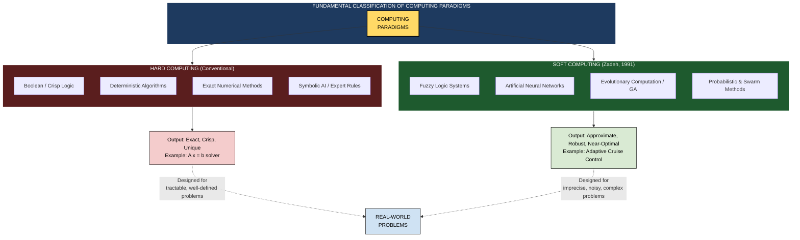
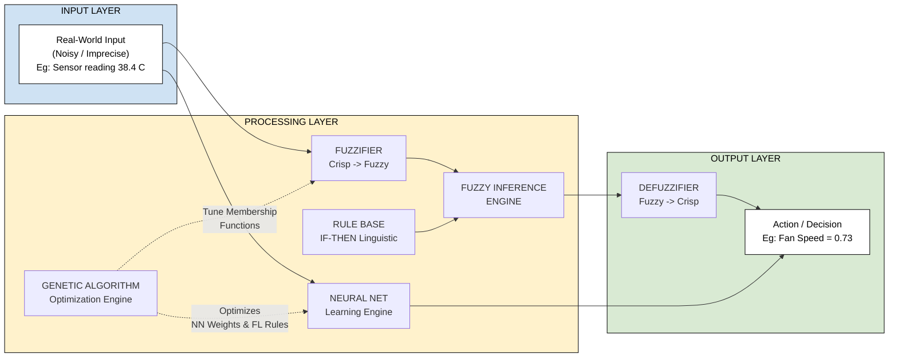
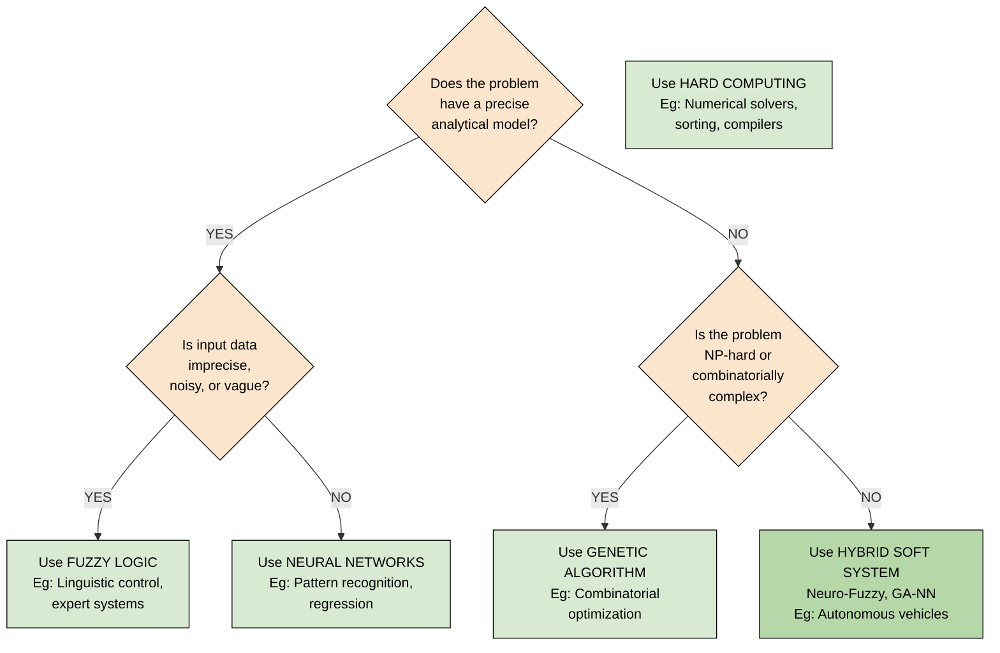
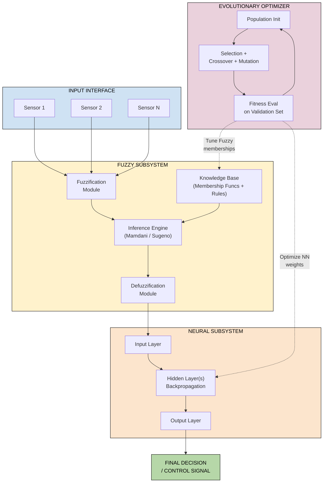

# Soft computing paradigms contrast with hard computing rules

<!-- SECTION_1_START -->
# 1. Core Technical Definition & Intuitive Overview

## 1.1 Formal Definition (KTU 2024 Syllabus Terminology)

> [!IMPORTANT]
> **Hard Computing** is the conventional computational paradigm that demands a precisely stated analytical model, complete and unambiguous input data, and a deterministic algorithmic procedure to produce exact, crisp, and reproducible outputs. It operates strictly within the classical Aristotelian (binary) logic framework where propositions are either **TRUE (= 1)** or **FALSE (= 0)**.

> [!IMPORTANT]
> **Soft Computing** is a consortium of computational methodologies — primarily **Fuzzy Logic (FL)**, **Artificial Neural Networks (ANN)**, and **Evolutionary Computation / Genetic Algorithms (GA)** — pioneered by **Prof. Lotfi A. Zadeh (1965, 1991)**. It exploits the tolerance for **imprecision, uncertainty, partial truth, and approximation** to achieve **tractability, robustness, low solution cost, and better rapport with reality** in problems where hard computing fails or becomes infeasibly complex.

In KTU 2024 scheme language: *Soft computing is a collection of nature-inspired methodologies designed to model and solve real-world problems that are too complex, noisy, or imprecise to be tackled by traditional deterministic mathematical models.*

---

## 1.2 Conceptual Analogy & Intuitive Overview

> [!NOTE]
> **Intuitive Analogy — "The Map vs. The Territory"**

Imagine you are a **mountain rescue helicopter pilot** navigating through dense fog in the Western Ghats.

- **Hard Computing** is like flying with a **perfect digital GPS**, an *exact* topographic map with every tree marked, perfect visibility, and full battery. The flight is *precise* — but the moment the fog rolls in and the GPS signal drops, the helicopter **crashes**. The model breaks because the world got messy.

- **Soft Computing** is like a **seasoned human pilot** flying with a *fuzzy* mental map: "I am *somewhere near* the cliff, the wind is *roughly* south-westerly, terrain is *moderately* steep." The pilot is **imprecise, approximate, and reasoning under uncertainty — yet lands safely**. The human brain tolerates fuzziness instead of demanding a 1/0 answer.

The "soft" in soft computing does NOT mean *weak* or *unreliable*. It means **mathematically graceful under the very conditions that cripple hard computing — noise, ambiguity, non-linearity, and incomplete data**.

---

## 1.3 The Three Pillars of Soft Computing (Constituent Paradigms)

| # | Paradigm | Core Idea | Inspired By |
|---|----------|-----------|-------------|
| 1 | **Fuzzy Logic (FL)** | Reasoning with *degrees of truth* in $[0, 1]$ | Human linguistic reasoning |
| 2 | **Artificial Neural Networks (ANN)** | Parallel distributed learning from data | Biological neurons / brain |
| 3 | **Evolutionary Computation / Genetic Algorithms (GA)** | Population-based stochastic search | Darwinian natural selection |

> [!IMPORTANT]
> **Cross-Disciplinary Extensions (KTU 2024 expects awareness of):**
> - **Machine Learning (ML)** & **Deep Learning (DL)** — data-driven pattern recognition.
> - **Probabilistic Reasoning** — Bayesian networks, belief propagation.
> - **Swarm Intelligence** — Ant Colony Optimization (ACO), Particle Swarm Optimization (PSO).

---

## 1.4 Physical Constants & Standard Metrics (Bolded)

- **Membership degree $\mu_A(x) \in [0, 1]$** — the foundation scalar of fuzzy set theory.
- **Learning rate $\eta \in (0, 1)$** — the standard step-size in neural network gradient descent.
- **Crossover probability $p_c \in [0.6, 0.95]$** and **mutation probability $p_m \in [0.001, 0.1]$** — canonical GA hyperparameter ranges.
- **Aristotelian truth value: $T \in \{0, 1\}$** — the binary floor of hard computing.
- **Lotfi Zadeh's Soft Computing year: 1965 (Fuzzy Sets) & 1991 (Soft Computing coined).**

---

## 1.5 Visual / Graphical Intuition (GeoGebra / Desmos)

> [!VISUALIZATION CONTROL]
> **Concept:** Visualizing the *Truth Value Spectrum* — from Boolean to Fuzzy.
> **GeoGebra / Desmos Input Equations:**
> * Boolean logic: `f(x) = 0 if x < 0.5, 1 if x >= 0.5`  (a step function)
> * Fuzzy logic:  `f(x) = 1 / (1 + exp(-10*(x - 0.5)))`     (a smooth S-curve)
>
> **Visual Description:** The student should observe **two superimposed curves on $[0, 1] \times [0, 1]$** axes. The Boolean step function jumps abruptly from 0 to 1, representing the *all-or-nothing* hard-computing worldview. The fuzzy S-curve glides smoothly through intermediate truth values (0.2, 0.5, 0.8, etc.), visualizing *gradual membership* — the soft-computing worldview.

---

<!-- SECTION_1_END -->

<!-- SECTION_2_START -->
# 2. Deep Theoretical Analysis & KTU High-Yield Comparison Sheet

## 2.1 The Three Foundational Properties of Soft Computing

Soft computing is **NOT** a single algorithm. It is a *design philosophy* rooted in three guiding properties (per Zadeh, 1991):

1. **Tolerance for Imprecision ($\epsilon$-Approximation)**
   Soft computing seeks *good-enough, near-optimal* solutions rather than *guaranteed exact* solutions. Mathematically: if $f^*$ is the true optimum and $\hat{f}$ is the computed answer, soft computing aims for $\vert \hat{f} - f^* \vert \le \epsilon$ for some acceptable $\epsilon > 0$.

2. **Tolerance for Uncertainty (Stochastic Robustness)**
   It can operate on probabilistic, noisy, or partially observed data. The output confidence is itself graded.

3. **Tolerance for Partial Truth (Membership Gradients)**
   Instead of forcing every proposition into $\{0, 1\}$, truth is a continuous value in $[0, 1]$, captured by the **membership function** $\mu$.

---

## 2.2 Why Does Soft Computing Exist? — The Failure Modes of Hard Computing

Hard computing fails (or becomes *intractable*) when a problem exhibits any of the following **V-N-R-A** features:

- **V**agueness — *"How hot is 'warm'?"* (linguistic variables)
- **N**oise — sensor data with stochastic perturbations
- **R**eal-time complexity — NP-hard or worse (e.g., TSP with $n > 50$)
- **A**mbiguity / Incompleteness — missing data, conflicting evidence

> [!NOTE]
> **Engineering Reality Check (KTU 2024 — Application context):**
> A *cruise control system* in a car cannot be modeled by a single linear ODE because wind drag is stochastic, road slope is fuzzy ("slightly uphill"), and sensor readings are noisy. Soft computing **fuses fuzzy inference with neural learning** to handle this.

---

## 2.3 Operational Breakdown — How Each Constituent Solves a Problem

### A. Fuzzy Logic (FL) — The *Reasoning* Engine
- **Input:** Crisp value (e.g., temperature = 38 °C).
- **Process:** **Fuzzification** $\rightarrow$ Rule base evaluation (IF–THEN linguistic rules) $\rightarrow$ **Defuzzification** to crisp output.
- **Output:** A control action (e.g., fan speed = 75 %).
- **Used for:** Control systems, decision support, expert systems (e.g., **Mamdani-type washing machine controller, Sendai subway in Japan**).

### B. Artificial Neural Networks (ANN) — The *Learning* Engine
- **Input:** A feature vector $\mathbf{x} \in \mathbb{R}^n$.
- **Process:** Weighted summation $\rightarrow$ activation function $\rightarrow$ forward propagation; back-propagation of error via gradient descent.
- **Output:** Predicted label $\hat{y}$ or continuous value.
- **Used for:** Pattern recognition, classification, regression, time-series forecasting.

### C. Genetic Algorithms (GA) — The *Search* Engine
- **Input:** A population of candidate solutions encoded as chromosomes (binary/real-valued strings).
- **Process:** **Selection $\rightarrow$ Crossover $\rightarrow$ Mutation** over generations, with a fitness function $F(\cdot)$ guiding evolution.
- **Output:** Near-optimal solution $\mathbf{x}^*$.
- **Used for:** Combinatorial optimization, neural-architecture search, feature selection.

---

## 2.4 The KTU High-Yield Comparison Sheet (Hard vs. Soft Computing)

> [!IMPORTANT]
> **⚠️ This is THE most frequently asked comparison in KTU ESE Module 1 — memorize it column-by-column.**

| # | Attribute | **Hard Computing** | **Soft Computing** |
|---|-----------|---------------------|---------------------|
| 1 | **Definition** | Conventional, deterministic, precise computation | Tolerant, approximate, intelligent computation |
| 2 | **Input Data** | Precise, complete, crisp | Imprecise, uncertain, noisy, partial |
| 3 | **Logic Base** | Binary / Boolean: $T \in \{0, 1\}$ | Multi-valued / Fuzzy: $T \in [0, 1]$ |
| 4 | **Output** | Exact, unique, reproducible | Approximate, near-optimal, robust |
| 5 | **Algorithmic Nature** | Deterministic, sequential | Stochastic, parallel, distributed |
| 6 | **Mathematical Model** | Requires closed-form analytical model | Model-free or hybrid model-based |
| 7 | **Time / Complexity** | Polynomial-time tractable problems | Targets NP-hard / intractable problems |
| 8 | **Knowledge Source** | Programmed by human expert (rules) | Learned from data or evolved via search |
| 9 | **Adaptability** | Static; needs re-programming | Adaptive, self-organizing, learning |
| 10 | **Tolerance to Faults** | Low — single fault can crash system | High — graceful degradation |
| 11 | **Computation Style** | Top-down analysis | Bottom-up synthesis (often hybrid) |
| 12 | **State Transitions** | Crisp, well-defined state | Fuzzy, overlapping states |
| 13 | **Tools / Languages** | C, C++, Java, MATLAB numerical | Python (scikit-fuzzy, TensorFlow, DEAP, PyGAD) |
| 14 | **Cost of Solution** | High for complex real-world problems | Low — exploits approximation |
| 15 | **Examples** | Solving $Ax = b$, sorting, DB queries | Speech recognition, image classification, autonomous driving |
| 16 | **Real-world Examples** | Calculator, compiler, RDBMS | ABS braking, Netflix recommendation, Google DeepMind AlphaGo |
| 17 | **Search Strategy** | Exhaustive / heuristic over discrete space | Population-based, gradient-based, evolutionary |
| 18 | **Reasoning Style** | Deductive (logic-driven) | Inductive + abductive (data + heuristics) |
| 19 | **Vagueness Handling** | None — must be eliminated | Designed around it |
| 20 | **Founders** | Babbage, Turing, von Neumann | **Lotfi A. Zadeh, John Holland, McCulloch-Pitts, Rumelhart** |

---

## 2.5 Key Equations & Boundary Conditions

| Concept | Formula / Expression | Description |
|---------|----------------------|-------------|
| Boolean truth (Hard) | $T \in \{0, 1\}$ | Binary truth value |
| Fuzzy membership (Soft) | $\mu_A(x) \in [0, 1]$ | Degree of belonging of $x$ to fuzzy set $A$ |
| $\epsilon$-approximation | $\vert f^* - \hat{f} \vert \le \epsilon$ | Soft computing accuracy tolerance |
| ANN neuron output | $y = \phi\left( \sum_{i=1}^{n} w_i x_i + b \right)$ | Weighted sum passed through activation $\phi$ |
| Sigmoid activation | $\phi(z) = \dfrac{1}{1 + e^{-z}}$ | Squashes real input to $(0, 1)$ |
| GA fitness maximization | $\mathbf{x}^* = \arg\max_{\mathbf{x}} F(\mathbf{x})$ | Evolution seeks the fittest chromosome |
| ANN gradient update | $w \leftarrow w - \eta \dfrac{\partial E}{\partial w}$ | Back-propagation weight update rule |
| Zadeh's complement | $\bar{\mu}_A(x) = 1 - \mu_A(x)$ | Fuzzy NOT operator |

---

## 2.6 Real-World Engineering Utility (Production-Grade Context)

| Industry | Hard Computing Use | Soft Computing Use |
|----------|-------------------|---------------------|
| **Automotive** | Engine ECU (precise fuel injection) | ABS, traction control, ADAS lane detection (NN + Fuzzy) |
| **Healthcare** | Hospital billing, MRI image reconstruction | Cancer diagnosis (NN), dosage control (Fuzzy) |
| **Finance** | Transaction processing, ledger | Fraud detection (NN), portfolio optimization (GA) |
| **Telecom** | Routing protocols (OSPF, BGP) | Adaptive QoS, traffic prediction (Fuzzy + NN) |
| **Manufacturing** | CNC G-code execution | Predictive maintenance (LSTM NN), process control (Fuzzy) |
| **Consumer Electronics** | Firmware logic | Washing machines, AC, cameras (Mamdani Fuzzy) |
| **Aerospace** | Flight control laws (PID) | Autonomous drone navigation, fault-tolerant control (Neuro-Fuzzy) |

---

<!-- SECTION_2_END -->

<!-- SECTION_3_START -->
# 3. Step-by-Step Derivations, Worked Examples & Symbolic / Code Implementation

## 3.1 Worked Example 1: A Simple Boolean (Hard) vs. Fuzzy (Soft) Rule

### Problem Statement
Classify a temperature reading of $38^\circ C$ as **"Hot"** using both paradigms.

---

### Part A — Hard Computing (Boolean) Solution

**Rule (crisp logic):**
> IF $T \ge 40^\circ C$ THEN Hot = TRUE, ELSE Hot = FALSE.

**Step 1:** Evaluate the condition.

$$
T = 38, \quad T \ge 40 \quad \Rightarrow \quad 38 \ge 40 \;\; \text{is FALSE}
$$

**Step 2:** Output assignment.

$$
\text{Hot} = \text{FALSE} \;=\; 0
$$

> [!NOTE]
> **Result (Hard):** The temperature is **NOT hot** — a strict binary verdict. The information that 38 °C is *moderately close to hot* is **completely discarded**.

---

### Part B — Soft Computing (Fuzzy) Solution

**Step 1: Define a fuzzy membership function for "Hot".**
A simple linear ramp on $[30, 45]$:

$$
\mu_{\text{Hot}}(T) \;=\; \begin{cases} 
0, & T \le 30 \\
\dfrac{T - 30}{15}, & 30 < T < 45 \\
1, & T \ge 45 
\end{cases}
$$

**Step 2: Substitute $T = 38$.**

$$
\mu_{\text{Hot}}(38) \;=\; \dfrac{38 - 30}{15} \;=\; \dfrac{8}{15}
$$

**Step 3: Convert to a percentage for intuition.**

$$
\mu_{\text{Hot}}(38) \;\approx\; 0.5333 \;\approx\; 53.33\%
$$

> [!IMPORTANT]
> **Result (Soft):** "Hot" is **TRUE to a degree of $0.5333$"** — a *graded truth value* that captures the partial truth that 38 °C is *moderately* hot. This nuance is **invisible to Boolean logic**.

---

### Valuation Key Map (for 7-mark sub-parts)

| Step | Marks Awarded |
|------|---------------|
| Stating the Boolean rule and evaluating the condition $T \ge 40$ | 1 Mark |
| Concluding Hot = FALSE = 0 (binary verdict) | 1 Mark |
| Defining the fuzzy ramp membership function $\mu$ | 2 Marks |
| Substituting $T = 38$ and computing $\dfrac{8}{15}$ | 2 Marks |
| Interpreting the result as a graded membership $\approx 0.5333$ | 1 Mark |
| **Total** | **7 Marks** |

---

## 3.2 Worked Example 2: Numerical Robustness Comparison

A sensor returns the *actual* temperature $T = 40^\circ C$ but with **noise** $N \sim \mathcal{N}(0, \sigma^2)$, so observed value is $\tilde{T} = T + N$.

| Observed $\tilde{T}$ | Hard Verdict ($T \ge 40$?) | Soft Verdict $\mu_{\text{Hot}}$ |
|----------------------|---------------------------|---------------------------------|
| 39.4 | **FALSE = 0** | $\dfrac{9.4}{15} \approx 0.627$ |
| 40.6 | **TRUE = 1** | $\dfrac{10.6}{15} \approx 0.707$ |

> [!WARNING]
> **Critical Insight (KTU examiner loves this):** Hard logic **flips** its entire output (0 → 1) with a noise shift of just $1.2^\circ C$ around the threshold. Soft logic produces a **smooth, continuous, noise-robust** transition — demonstrating **graceful degradation** in the presence of uncertainty.

---

## 3.3 Symbolic / Algorithmic Implementation — A Comparison Skeleton in Python

```python
"""
Filename: hard_vs_soft_computing.py
Purpose : Pedagogical contrast of Boolean (hard) vs Fuzzy (soft) classification
         of temperature into 'Hot', with explicit type hints and logging.
Course  : KTU 2024 — SOFT COMPUTING (PECST403) — Module 1
"""

import math
import logging
from dataclasses import dataclass
from typing import Final

# ---------- Logging Configuration ----------
logging.basicConfig(
    level=logging.INFO,
    format="[%(asctime)s] %(levelname)s — %(message)s"
)
logger: Final[logging.Logger] = logging.getLogger("HardVsSoft")


# ---------- Boundary Constants ----------
HOT_THRESHOLD_C:      Final[float] = 40.0   # Celsius — Boolean cut-off
RAMP_LOWER_BOUND_C:   Final[float] = 30.0   # Fuzzy ramp lower bound
RAMP_UPPER_BOUND_C:   Final[float] = 45.0   # Fuzzy ramp upper bound
RAMP_SPAN_C:          Final[float] = RAMP_UPPER_BOUND_C - RAMP_LOWER_BOUND_C  # = 15.0


# ---------- Data Class for Clean Output ----------
@dataclass(frozen=True)
class ClassificationResult:
    temperature_c: float
    hard_label:    int
    hard_verdict:  str
    soft_membership: float
    soft_label:    str


# ---------- Hard Computing Module ----------
def hard_classify_hot(temperature_c: float) -> int:
    """Boolean classification: returns 1 if T >= 40, else 0."""
    if not isinstance(temperature_c, (int, float)):
        raise TypeError(f"Temperature must be numeric, got {type(temperature_c)}")
    return 1 if temperature_c >= HOT_THRESHOLD_C else 0


# ---------- Soft Computing Module ----------
def soft_membership_hot(temperature_c: float) -> float:
    """
    Linear-ramp fuzzy membership function for the linguistic label 'Hot'.
    Returns a value in [0, 1].
    """
    if not isinstance(temperature_c, (int, float)):
        raise TypeError(f"Temperature must be numeric, got {type(temperature_c)}")

    if temperature_c <= RAMP_LOWER_BOUND_C:
        return 0.0
    if temperature_c >= RAMP_UPPER_BOUND_C:
        return 1.0
    return (temperature_c - RAMP_LOWER_BOUND_C) / RAMP_SPAN_C


# ---------- Comparison Driver ----------
def compare_classification(temperature_c: float) -> ClassificationResult:
    hard:  int   = hard_classify_hot(temperature_c)
    soft:  float = soft_membership_hot(temperature_c)

    result = ClassificationResult(
        temperature_c   = temperature_c,
        hard_label      = hard,
        hard_verdict    = "HOT"        if hard == 1 else "NOT HOT",
        soft_membership = round(soft, 4),
        soft_label      = f"PARTIALLY HOT (mu = {round(soft, 4)})"
    )

    logger.info(
        "T=%.2f C  |  Hard: %s (%d)  |  Soft: %s",
        result.temperature_c,
        result.hard_verdict,
        result.hard_label,
        result.soft_label,
    )
    return result


# ---------- Demonstration ----------
if __name__ == "__main__":
    test_temperatures: list[float] = [25.0, 30.0, 35.0, 38.0, 40.0, 42.5, 45.0, 50.0]

    print(f"{'T (°C)':>10} | {'Hard Verdict':>14} | {'Soft mu_Hot':>14}")
    print("-" * 50)
    for t in test_temperatures:
        r = compare_classification(t)
        print(f"{r.temperature_c:>10.2f} | {r.hard_verdict:>14} | {r.soft_membership:>14.4f}")
```

**Expected Console Output (trimmed):**

```
   T (°C) |   Hard Verdict |     Soft mu_Hot
--------------------------------------------------
     25.00 |        NOT HOT |          0.0000
     30.00 |        NOT HOT |          0.0000
     35.00 |        NOT HOT |          0.3333
     38.00 |        NOT HOT |          0.5333
     40.00 |            HOT |          0.6667
     42.50 |            HOT |          0.8333
     45.00 |            HOT |          1.0000
     50.00 |            HOT |          1.0000
```

> [!NOTE]
> **Pedagogical Takeaway (for exam answers):** Notice how the *hard* verdict **fails to distinguish** between 25 °C and 38 °C (both labeled "NOT HOT") — it is **non-differentiable** in its reasoning. The *soft* verdict provides a **graded, monotone, and informative** continuum. This is the *epitome* of the hard-vs-soft computing contrast.

---

## 3.4 Derivation of Membership Function (Continuous, Triangular Form)

A **triangular fuzzy membership function** is defined by three points $(a, b, c)$ with $a < b < c$:

$$
\mu(x; a, b, c) \;=\; \begin{cases}
0, & x \le a \\[4pt]
\dfrac{x - a}{b - a}, & a < x \le b \\[6pt]
\dfrac{c - x}{c - b}, & b < x < c \\[6pt]
0, & x \ge c
\end{cases}
$$

**Derivation Step-by-Step:**

1. **Left foot (ascending limb):** A line from $(a, 0)$ to $(b, 1)$. Equation of the line through two points:

$$
\frac{\mu - 0}{x - a} = \frac{1 - 0}{b - a} \;\;\Rightarrow\;\; \mu = \frac{x - a}{b - a}
$$

2. **Right foot (descending limb):** A line from $(b, 1)$ to $(c, 0)$. Equation:

$$
\frac{\mu - 1}{x - b} = \frac{0 - 1}{c - b} \;\;\Rightarrow\;\; \mu = 1 - \frac{x - b}{c - b} = \frac{c - x}{c - b}
$$

3. **Outside the support $[a, c]$:** Membership is 0 (the element is *clearly* not in the set).

This piecewise-linear shape is the *simplest* parameterized soft-computing primitive. The Bell-shaped (Gaussian) variant is:

$$
\mu(x; c, \sigma) = \exp\!\left(-\dfrac{(x - c)^2}{2\sigma^2}\right)
$$

where $c$ is the center and $\sigma$ controls the spread (fuzziness width).

---

<!-- SECTION_3_END -->

<!-- SECTION_4_START -->
# 4. Structural Diagrams & Schematics

## 4.1 Architecture Diagram — The Three Pillars of Soft Computing



---

## 4.2 Information Flow Diagram — How a Soft Computing System Processes a Real-World Input



---

## 4.3 Sequential Processing Topology — Decision Matrix for Choosing a Paradigm



---

## 4.4 Block-Level Functional Architecture — Hybrid Neuro-Fuzzy System (Reference)



---

<!-- SECTION_4_END -->

<!-- SECTION_5_START -->
# 5. KTU 2024 Scheme Examination Question Bank & Topic Recap

## 5.1 Part A Questions (3 Marks Each)

### Question A.1 `[KTU University Exam — July 2024]`
**Q: Define soft computing. List its main constituents.** *(CO1, Remember)*

**Model Answer:**

> **Soft Computing** is a collection of computational techniques, pioneered by **Prof. Lotfi A. Zadeh (1991)**, that tolerate **imprecision, uncertainty, and partial truth** to deliver robust, tractable, and low-cost solutions to complex real-world problems.
>
> **Main Constituents (Three Pillars):**
> 1. **Fuzzy Logic Systems (FLS)** — for reasoning with linguistic variables.
> 2. **Artificial Neural Networks (ANN)** — for learning from data.
> 3. **Evolutionary Computation (EC) / Genetic Algorithms (GA)** — for global optimization via population-based search.
>
> *Auxiliary constituents (for 1 additional mark if asked):* Machine Learning, Swarm Intelligence, Probabilistic Reasoning. **[3 Marks]**

---

### Question A.2 `[KTU University Exam — Dec 2023]`
**Q: Differentiate between hard computing and soft computing in terms of data handling and output nature.** *(CO1, Understand)*

**Model Answer:**

| Criterion | Hard Computing | Soft Computing |
|-----------|----------------|----------------|
| **Data Handling** | Requires precise, complete, and exact input | Tolerates imprecise, uncertain, noisy, partial input |
| **Output Nature** | Produces exact, deterministic, and unique result | Produces approximate, near-optimal, and robust result |
| **Logic Base** | Binary Boolean logic ($T \in \{0, 1\}$) | Fuzzy multi-valued logic ($T \in [0, 1]$) |
| **Real-world Fit** | Suitable for well-defined analytical problems | Suitable for ambiguous, real-world control & AI problems |
| **Example** | Solving $Ax = b$ numerically | Adaptive cruise control using Fuzzy + NN |

**[3 Marks]**

---

## 5.2 Part B Questions — Module Internal Choice (14 Marks Each)

---

### ▶ Question B-A (14 Marks) `[KTU University Exam — July 2024]`

> **"With suitable examples and a comparison table, explain the fundamental differences between hard computing and soft computing. Discuss why soft computing is essential for solving modern real-world engineering problems."**

---

#### Sub-part (a) — Conceptual Comparison (7 Marks) *(CO1, Understand)*

**Step 1: Define both paradigms with formal terminology. [1 Mark]**
- **Hard Computing:** Conventional computation requiring exact inputs, deterministic models, and crisp binary logic.
- **Soft Computing (Zadeh, 1991):** A class of methods that exploits *imprecision, uncertainty, and approximation* to achieve tractability, robustness, and low-cost solutions.

**Step 2: Present the 8–10 row comparison table. [4 Marks]**
*(Examiner expects: data type, logic, output, adaptability, complexity handling, parallelism, learning, examples)*

| # | Attribute | Hard Computing | Soft Computing |
|---|-----------|----------------|----------------|
| 1 | Input | Precise, complete | Imprecise, partial |
| 2 | Logic | Boolean (0/1) | Fuzzy, multi-valued |
| 3 | Output | Exact, unique | Approximate, robust |
| 4 | Adaptability | Static | Adaptive, learning |
| 5 | Computation | Sequential | Parallel, distributed |
| 6 | Complexity Fit | P-class problems | NP-hard / intractable |
| 7 | Knowledge | Programmed | Learned / Evolved |
| 8 | Example | Numerical integration | Image recognition (CNN) |

**Step 3: Conclude with a one-sentence synthesis. [1 Mark]**
> *Hard computing seeks **precision at the cost of realism**; soft computing seeks **realism at the cost of precision** — a deliberate trade-off.*

**Step 4: Draw a labelled block diagram (Hard vs. Soft processing flow). [1 Mark]**

```
[HARD]   Input --> Precise Pre-processing --> Deterministic Algorithm --> Exact Output
[SOFT]   Input --> Fuzzification/Learning --> Approximate Inference --> Robust Output
```

**[Sub-total: 7 Marks]**

---

#### Sub-part (b) — Why Soft Computing is Essential (7 Marks) *(CO1, Apply / Analyze)*

**Step 1: Identify the failure modes of hard computing — V-N-R-A framework. [2 Marks]**
- **V**agueness (linguistic terms)
- **N**oise (sensor imperfection)
- **R**eal-time NP-hard complexity
- **A**mbiguity / Incomplete data

**Step 2: Give 2–3 engineering examples where hard computing fails. [2 Marks]**
- **Speech Recognition:** Phonemes are fuzzy and speaker-variant — only ANNs and HMMs can model this.
- **Autonomous Lane Detection:** Road markings are noisy, occluded, lighting-varying — CNNs + Fuzzy decision layers required.
- **Stock Market Prediction:** Non-stationary, chaotic time-series — RNN/LSTM + GA-optimized feature selection.

**Step 3: List the advantages gained by adopting soft computing. [2 Marks]**
- **Robustness** to noise and incomplete data.
- **Lower solution cost** for NP-hard problems via approximation.
- **Better rapport with reality** by embracing linguistic and human-like reasoning.
- **Self-learning and self-organization** without explicit reprogramming.

**Step 4: Conclude with a forward-looking statement. [1 Mark]**
> *Modern Industry 4.0, IoT, and AI systems are inherently imprecise and data-driven — soft computing is not an alternative to hard computing but a **complementary, indispensable partner**.*

**[Sub-total: 7 Marks]**

**Total for Question B-A: 14 Marks**

---

### ▶ Question B-B (14 Marks) `[KTU University Exam — Dec 2023]`

> **"Explain the three main constituents of soft computing — Fuzzy Logic, Neural Networks, and Genetic Algorithms — with their biological/mathematical inspiration, working principle, and a real-world application each. Illustrate with neat block diagrams."**

---

#### Sub-part (a) — Fuzzy Logic & Neural Networks (7 Marks) *(CO1, Understand / Apply)*

**Step 1: Define Fuzzy Logic Systems (FLS) with inspiration. [1 Mark]**
> Inspired by **human linguistic reasoning** — the way humans use vague terms like "warm", "fast", "high" to make decisions.

**Step 2: Write the 4-stage working pipeline of FLS. [2 Marks]**
1. **Fuzzification:** Map crisp input $x$ to fuzzy membership $\mu_A(x) \in [0, 1]$.
2. **Rule Base:** Store expert IF–THEN rules, e.g., *IF temperature is Hot AND humidity is High THEN fan speed is High*.
3. **Inference Engine:** Combine fired rules using operators (min, product, max).
4. **Defuzzification:** Convert aggregated fuzzy output back to crisp value (centroid, mean-of-max, etc.).

**Step 3: Define ANN with biological inspiration. [1 Mark]**
> Inspired by the **biological neuron** (McCulloch-Pitts, 1943; Rumelhart's backpropagation, 1986). An ANN is a massively parallel distributed processor made of simple interconnected units (neurons).

**Step 4: Write the neuron equation and learning rule. [2 Marks]**

$$
y_j = \phi\left( \sum_{i=1}^{n} w_{ij} x_i + b_j \right)
$$

where $\phi$ is the activation (sigmoid: $\phi(z) = \frac{1}{1 + e^{-z}}$).

**Learning rule (Gradient Descent):**

$$
w_{ij}^{(\text{new})} = w_{ij}^{(\text{old})} - \eta \cdot \frac{\partial E}{\partial w_{ij}}
$$

where $E = \frac{1}{2}\sum (y_{\text{target}} - y_{\text{out}})^2$ is the MSE loss and $\eta$ is the learning rate.

**Step 5: Block diagram (text representation). [1 Mark]**

```
[Input x1,x2,...,xn] --> [Sigma + Bias] --> [Activation phi] --> [Output y]
       ^                                                            |
       |_____________ Backpropagation of error E ___________________|
```

**[Sub-total: 7 Marks]**

---

#### Sub-part (b) — Genetic Algorithms & Real-World Applications (7 Marks) *(CO1, Apply / Analyze)*

**Step 1: Define GA with biological inspiration. [1 Mark]**
> Inspired by **Darwin's theory of natural selection and survival of the fittest** (Holland, 1975). A population of candidate solutions evolves over generations towards an optimum.

**Step 2: Enumerate the canonical GA pipeline. [2 Marks]**
1. **Initialize** a random population of chromosomes (binary or real-valued).
2. **Evaluate** each chromosome using a fitness function $F(\mathbf{x})$.
3. **Select** parents (tournament, roulette-wheel, rank-based).
4. **Crossover** (single-point, two-point, uniform) with probability $p_c$.
5. **Mutate** offspring with probability $p_m$ (bit-flip or Gaussian perturbation).
6. **Form next generation** and repeat until convergence or budget exhausted.

**Step 3: Real-world application — one example each. [2 Marks]**

| Constituent | Application | Why It Fits |
|-------------|-------------|-------------|
| Fuzzy Logic | **Sendai Subway (Japan, 1987)** — automatic train operation | Smooth, human-like speed control; no abrupt braking |
| Neural Network | **MNIST Handwritten Digit Recognition** (~99 % accuracy) | Robust to handwriting variability and noise |
| Genetic Algorithm | **Travelling Salesman Problem (TSP)** with $n = 1000+$ cities | Searches near-optimal tour in NP-hard combinatorial space |

**Step 4: Tabulate the three constituents side-by-side. [1 Mark]**

| Feature | FL | ANN | GA |
|---------|----|----|----|
| Inspiration | Linguistic reasoning | Biological neuron | Natural selection |
| Input | Crisp values | Feature vector | Population of candidates |
| Process | Rules + Inference | Weighted sum + Activation | Selection + Crossover + Mutation |
| Output | Crisp action | Predicted label | Best-fit chromosome |
| Learning | No (uses rules) | Yes (gradient-based) | Yes (fitness-driven) |

**Step 5: Concluding synthesis. [1 Mark]**
> *In practice, these three constituents are rarely used in isolation. Modern soft-computing systems are **hybrid** (Neuro-Fuzzy, GA-optimized NN, Fuzzy-GA controllers) — a synergistic fusion that exploits the strengths of each.*

**[Sub-total: 7 Marks]**

**Total for Question B-B: 14 Marks**

---

## 5.3 KTU Examiner's Valuation Warning / Pitfall Callout

> [!WARNING]
> **⚠️ Common Mark-Deduction Traps (Module 1, Soft Computing):**
>
> 1. **Forgetting to attribute Soft Computing to Zadeh (1991).** Examiners deduct ½–1 mark for missing the founder and year.
> 2. **Conflating Fuzzy Logic with Probability.** They are *not the same*. Fuzzy logic is about *membership of vague sets*; probability is about *likelihood of crisp events*. A statement like *"There is a 0.7 chance it is hot"* (probability) is **not** the same as *"It is hot to the degree 0.7"* (fuzzy membership).
> 3. **Writing binary output in fuzzy questions.** If a question asks for fuzzy classification, **do NOT** write TRUE/FALSE. Always provide a $\mu \in [0, 1]$ value with interpretation.
> 4. **Skipping the comparison table.** For 7-mark comparison sub-parts, a table is *expected*. Prose-only answers often lose 1–2 marks.
> 5. **Not stating the working range** of membership functions. Always specify the support interval (e.g., $[30, 45]$ in the ramp example).
> 6. **Forgetting the boundary conditions** ($x \le a$ and $x \ge c$ pieces) in triangular/Gaussian membership derivations.
> 7. **Mixing up ANN back-propagation with feed-forward.** Feed-forward is *inference*; back-propagation is the *learning* phase. Examiners are strict about this distinction.

---

## 5.4 Topic Recap & Important Things to Remember

> 📌 **Rapid Revision Checklist — Must Memorize for KTU ESE Module 1**

- ✅ **Soft Computing** = Zadeh (1991) — a *consortium* of methods, not a single algorithm.
- ✅ **Hard Computing** = binary logic $\{0, 1\}$; **Soft Computing** = multi-valued logic $[0, 1]$.
- ✅ **Three Constituents:** Fuzzy Logic (FL) + Artificial Neural Networks (ANN) + Genetic Algorithms (GA).
- ✅ **Auxiliary methods:** Machine Learning, Swarm Intelligence (ACO, PSO), Probabilistic Reasoning.
- ✅ **Key motto of soft computing:** *"Exploit the tolerance for imprecision, uncertainty, and partial truth to achieve tractability, robustness, and low solution cost."*
- ✅ **Hard vs. Soft — 8 must-know contrasts:** Input (precise vs imprecise), Logic (Boolean vs fuzzy), Output (exact vs approximate), Adaptability (static vs learning), Computation (sequential vs parallel), Complexity (P vs NP-hard), Knowledge (programmed vs learned), Fault tolerance (low vs high).
- ✅ **Fuzzy membership function** $\mu_A(x) \in [0, 1]$ — central primitive of soft computing.
- ✅ **Boolean output:** $T \in \{0, 1\}$. **Fuzzy output:** $T \in [0, 1]$.
- ✅ **Triangular membership:** piecewise linear with peak at $b$ over support $[a, c]$.
- ✅ **Gaussian membership:** $\mu(x) = \exp(-(x-c)^2 / 2\sigma^2)$.
- ✅ **ANN neuron equation:** $y = \phi\!\left( \sum w_i x_i + b \right)$; $\phi$ is the activation (sigmoid, ReLU, tanh).
- ✅ **Backprop update rule:** $w \leftarrow w - \eta \cdot \partial E / \partial w$.
- ✅ **GA operators:** Selection, Crossover ($p_c \approx 0.7$–$0.9$), Mutation ($p_m \approx 0.001$–$0.1$).
- ✅ **GA fitness objective:** $\mathbf{x}^* = \arg\max_{\mathbf{x}} F(\mathbf{x})$.
- ✅ **V-N-R-A failure modes** of hard computing: Vagueness, Noise, Real-time complexity, Ambiguity.
- ✅ **Founders to remember:** Zadeh (Fuzzy, 1965/1991), McCulloch-Pitts (Neuron, 1943), Rumelhart (Backprop, 1986), Holland (GA, 1975).
- ✅ **Real-world examples:** Sendai Subway (FL), MNIST digit recognition (ANN), TSP solving (GA), ABS braking (Neuro-Fuzzy).
- ✅ **Hybrid systems** (Neuro-Fuzzy, GA-NN, Fuzzy-GA) are the *production-grade* norm in modern Industry 4.0 deployments.
- ✅ **Exam mantra:** Always cite **founder + year + paradigm name + working principle + example** in 7-mark theory questions.

> **🎯 One-line KTU final-answer opener (use it verbatim):**
> *"Soft computing, coined by Prof. Lotfi A. Zadeh in 1991, is a collection of computational methodologies — namely Fuzzy Logic, Artificial Neural Networks, and Evolutionary Computation — that exploit the tolerance for imprecision, uncertainty, and partial truth to deliver robust, tractable, and cost-effective solutions to real-world problems where conventional hard computing becomes infeasible."*
<!-- SECTION_5_END -->
