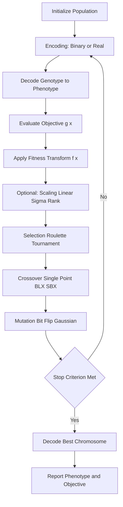
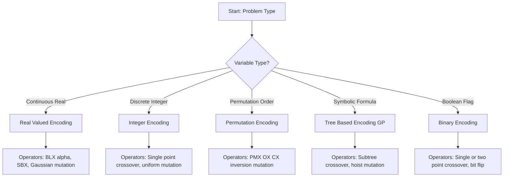
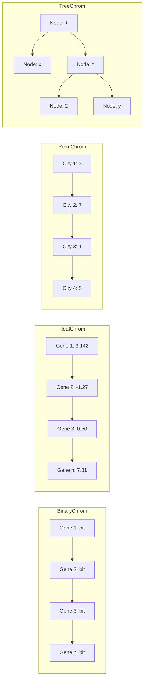
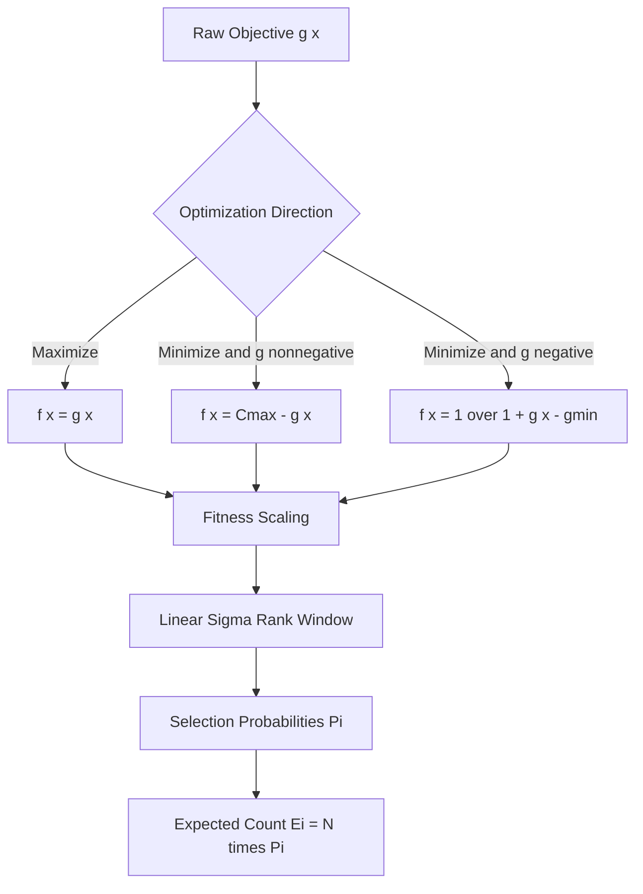

# Chromosomal representations, encoding methods, fitness evaluation functions

<!-- SECTION_1_START -->
# Chromosomal Representations, Encoding Methods & Fitness Evaluation in Genetic Algorithms

## 1.1 Formal Definition (KTU 2024 Syllabus Standard)

> [!IMPORTANT]
> **Core Definition:** A **Chromosome** in a Genetic Algorithm (GA) is a structured data structure (typically a string, vector, or tree) that encodes a single candidate solution to an optimization problem. The **Encoding Method** (also called *representation scheme*) defines the alphabet, length, and interpretation of the genes that constitute a chromosome. The **Fitness Evaluation Function** $f: \mathcal{S} \rightarrow \mathbb{R}^{\ge 0}$ is a non-negative objective function that quantifies the *quality*, *survival probability*, and *reproductive potential* of each chromosome with respect to the problem domain.

Where:
- $\mathcal{S}$ is the *search space* (set of all possible chromosomes).
- Each chromosome is composed of discrete units called **genes**, and each gene may take a value from a predefined **alphabet** $\mathcal{A}$ (e.g., $\mathcal{A} = \{0, 1\}$ for binary).

The trio of *representation $\rightarrow$ fitness evaluation $\rightarrow$ genetic operators* is the foundational triplet of every GA, directly determining convergence speed, solution quality, and search-space coverage.

## 1.2 Conceptual Analogy & Intuitive Overview

Imagine a population of **factory robots** in a warehouse. Each robot is a *chromosome* — its **blueprint** (height, arm length, wheel diameter) is encoded in a list of parameters. Some blueprints pack boxes faster, others waste battery. We test every robot (**fitness evaluation**), keep the best blueprints, and breed the next generation by mixing their parameters. Robots with poor fitness are discarded, while those with high fitness are duplicated and combined.

In the *biological* world:
- **DNA base pairs (A, T, G, C)** $\longrightarrow$ the **alphabet** of the chromosome.
- **A complete gene sequence** $\longrightarrow$ the **chromosome string**.
- **Survival of the fittest** $\longrightarrow$ the **fitness function** assigning reproductive odds.

> [!NOTE]
> **Key Insight for KTU:** The choice of encoding is *not* a programming convenience — it is a **mathematical commitment** that determines which genetic operators (crossover, mutation) are valid and how the search-space landscape is shaped.

## 1.3 GeoGebra / Desmos Visualization

> [!VISUALIZATION CONTROL]
> **Concept:** Mapping between *genotype* (encoded chromosome) and *phenotype* (decoded real-valued variable) in binary encoding.
> **GeoGebra / Desmos Input Equations:**
> * `f(x) = (binaryToDecimal(x)) * step + lowerBound`
> * `step = (upperBound - lowerBound) / (2^n - 1)`
> * `lowerBound = -5.12`
> * `upperBound = 5.12`
> * `n = 10`
> **Visual Description:** A 10-bit binary chromosome (e.g., `1011001010`) is decoded into a real value $x \in [-5.12, 5.12]$. Students should observe that *small* changes in the binary genotype may correspond to *large* phenotypic jumps (Hamming cliff problem).

---

## 1.4 Why This Topic is a *High-Yield* KTU Module

| KTU Module Mapping | Expected Weightage |
|:---|:---|
| Chromosomal representations | ~ 4 marks (direct definition) |
| Encoding methods (Binary, Real, Permutation) | ~ 5–7 marks (comparison table) |
| Fitness function design & scaling | ~ 5–7 marks (numerical problems) |
| Total Module 2 contribution | **~ 14–18 marks** across ESE |

---
<!-- SECTION_1_END -->

<!-- SECTION_2_START -->
# Deep Theoretical Analysis & KTU High-Yield Formula Sheet

## 2.1 Taxonomy of Chromosomal Encoding Methods

Genetic Algorithms support **five canonical encoding schemes**. The choice is governed by the *nature of the decision variables* of the optimization problem.

### A. Binary Encoding
- **Alphabet:** $\mathcal{A} = \{0, 1\}$
- **Chromosome length:** $L = \sum_{i=1}^{n} l_i$, where $l_i$ is the number of bits assigned to variable $x_i$.
- **Decoding rule (unipolar):**

$$
x_i = \text{lower}_i + \frac{\text{decimal}(b_{i,1} b_{i,2} \dots b_{i,l_i})}{2^{l_i} - 1} \times (\text{upper}_i - \text{lower}_i)
$$

- **Pros:** Simple, theoretically well-studied (Schema Theorem applies cleanly).
- **Cons:** **Hamming cliff** — flipping `0111` to `1000` changes 4 bits but value changes minimally; for large `2^n` it becomes impractical.

### B. Real-Valued (Floating-Point / Continuous) Encoding
- **Alphabet:** $\mathcal{A} = \mathbb{R}$
- **Chromosome:** $\mathbf{x} = [x_1, x_2, \dots, x_n] \in \mathbb{R}^n$.
- **Decoding rule:** *Identity* — no decoding is required.
- **Pros:** No precision loss, native fit for continuous optimization, no Hamming cliffs.
- **Cons:** Schema Theorem doesn't directly apply; need specialized operators (BLX-$\alpha$, SBX crossover).

### C. Integer / Discrete Encoding
- **Alphabet:** $\mathcal{A} = \{0, 1, 2, \dots, k-1\}$
- **Use case:** Variables drawn from a discrete set (e.g., number of machines, number of workers, categorical choices).
- **Decoding rule:** Direct mapping from integer gene to discrete option via lookup table.

### D. Permutation Encoding
- **Alphabet:** A permutation of the set $\{1, 2, \dots, n\}$.
- **Chromosome:** $\pi = [\pi_1, \pi_2, \dots, \pi_n]$ where all $\pi_i$ are distinct.
- **Use case:** TSP, scheduling, routing, assignment problems.
- **Cons:** Standard crossover/mutation *invalidates* the permutation; requires **PMX**, **OX**, or **CX** operators.

### E. Tree-Based Encoding
- **Alphabet:** Function set $\mathcal{F}$ and Terminal set $\mathcal{T}$.
- **Chromosome:** A tree where internal nodes are functions ($+$, $-$, $\times$, $\div$, $\sin$) and leaves are terminals (variables, constants).
- **Use case:** **Genetic Programming (GP)** — symbolic regression, circuit design, automatic algorithm synthesis.

## 2.2 Fitness Function — The Mathematical Heart

### 2.2.1 Objective vs. Fitness

The **objective function** $g(\mathbf{x})$ is the *raw* measure of quality (it can be negative, unbounded, or to be minimized). The **fitness function** $f(\mathbf{x})$ is a *transformed*, *non-negative*, *maximization-aligned* version.

### 2.2.2 Transformation Rules

| Optimization Goal | Objective $g(\mathbf{x})$ | Fitness $f(\mathbf{x})$ |
|:---|:---|:---|
| Maximize | Positive | $f(\mathbf{x}) = g(\mathbf{x})$ |
| Minimize | Non-negative | $f(\mathbf{x}) = C_{\max} - g(\mathbf{x})$, with $C_{\max} \ge \max g(\mathbf{x})$ |
| Minimize | Negative | $f(\mathbf{x}) = \dfrac{1}{1 + g(\mathbf{x}) - g_{\min}}$ |

### 2.2.3 Fitness Scaling

Raw fitness $f_i$ is often *scaled* to maintain **selection pressure** throughout generations.

$$
f'_i = a \cdot f_i + b \quad \text{(Linear Scaling)}
$$

where $a$ and $b$ are chosen so that the **scaled average equals the raw average** ($f'_{\text{avg}} = f_{\text{avg}}$) and the **scaled maximum is a multiple** $c$ of the average (typically $c = 1.2$ to $2.0$):

$$
f'_{\max} = c \cdot f'_{\text{avg}}
$$

**Sigma scaling** uses population standard deviation:

$$
f'_i = f_i + (\mu - c \cdot \sigma)
$$

**Rank-based scaling** ranks individuals $1, 2, \dots, N$ and assigns:

$$
f'_i = \min + (\max - \min) \cdot \frac{N - \text{rank}_i}{N - 1}
$$

### 2.2.4 Selection Probability

For Roulette-Wheel selection, the probability that individual $i$ is selected is:

$$
P_i = \frac{f_i}{\sum_{j=1}^{N} f_j}
$$

## 2.3 KTU High-Yield Formula Sheet

| Concept | Formula | Notes / Units |
|:---|:---|:---|
| Binary decoding | $x_i = L_i + \dfrac{\text{dec}(b)}{2^{l_i}-1}(U_i - L_i)$ | $L_i$ = lower bound, $U_i$ = upper bound |
| Precision per bit | $\Delta = \dfrac{U_i - L_i}{2^{l_i} - 1}$ | Resolution of the encoding |
| Bits required for precision $p$ | $l_i = \lceil \log_2 \left(\dfrac{U_i - L_i}{p} + 1 \right) \rceil$ | $p$ in same units as $x_i$ |
| Minimization $\to$ Maximization | $f = C_{\max} - g$ | $C_{\max} \ge \max g$ |
| Boltzmann fitness | $f' = \exp(g / T)$ | $T$ = temperature, annealed over time |
| Roulette probability | $P_i = f_i / \sum f_j$ | Sum of $P_i$ = 1 |
| Expected count | $E_i = N \cdot P_i$ | $N$ = population size |
| Rank-based fitness | $f'_i = \min + (\max-\min)\cdot\dfrac{N - \text{rank}_i}{N-1}$ | Linear ranking |
| Schema order | $o(H)$ | Number of fixed positions in schema $H$ |
| Schema defining length | $\delta(H)$ | Distance between outermost fixed bits |
| Schema Theorem (Holland) | $E[m(H, t+1)] \ge m(H, t) \cdot \dfrac{f(H)}{\bar{f}} \cdot \left[1 - p_c \cdot \dfrac{\delta(H)}{L-1} - p_m \cdot o(H)\right]$ | Building-block growth equation |

## 2.4 Real-World Engineering Utility

| Application | Encoding Used | Fitness Function Source |
|:---|:---|:---|
| Antenna design (NASA ST5) | Real-valued | Gain pattern vs. target S11 response |
| Job-shop scheduling | Permutation | Makespan (completion time) |
| Portfolio optimization | Real-valued (constrained) | Sharpe ratio — risk penalty |
| Hyperparameter tuning (ML) | Real-valued / Categorical | Validation accuracy / $-$loss |
| Vehicle routing | Permutation | Total route distance |
| Symbolic regression | Tree | Mean squared error on dataset |

> [!NOTE]
> **Production Engineering Reality:** In modern *neuroevolution* and *AutoML* pipelines, real-valued encoding with SBX crossover and polynomial mutation has effectively replaced binary encoding, since deep-learning hyperparameters are naturally continuous.

---
<!-- SECTION_2_END -->

<!-- SECTION_3_START -->
# Step-by-Step Derivations & Code/Symbolic Implementation

## 3.1 Worked Example 1: Binary Encoding & Decoding (with precision calculation)

**Problem:** A chromosome has 8 bits divided into two genes: $l_1 = 4$ bits for $x_1 \in [-2, 2]$ and $l_2 = 4$ bits for $x_2 \in [-1, 3]$. Decode the chromosome `1011 0110`.

**Step 1 — Compute precision per bit.**

For gene $x_1$ ($l_1 = 4$):

$$
\Delta_1 = \frac{U_1 - L_1}{2^{l_1} - 1} = \frac{2 - (-2)}{2^4 - 1} = \frac{4}{15}
$$

For gene $x_2$ ($l_2 = 4$):

$$
\Delta_2 = \frac{U_2 - L_2}{2^{l_2} - 1} = \frac{3 - (-1)}{2^4 - 1} = \frac{4}{15}
$$

**Step 2 — Convert each 4-bit segment from binary to decimal.**

For `1011`: $\text{dec}(1011) = 1\cdot 2^3 + 0\cdot 2^2 + 1\cdot 2^1 + 1\cdot 2^0 = 8 + 0 + 2 + 1 = 11$.

For `0110`: $\text{dec}(0110) = 0\cdot 2^3 + 1\cdot 2^2 + 1\cdot 2^1 + 0\cdot 2^0 = 0 + 4 + 2 + 0 = 6$.

**Step 3 — Apply the decoding formula.**

$$
x_1 = L_1 + \Delta_1 \cdot \text{dec}(1011) = -2 + \frac{4}{15} \cdot 11 = -2 + \frac{44}{15} = \frac{-30 + 44}{15} = \frac{14}{15} \approx 0.933
$$

$$
x_2 = L_2 + \Delta_2 \cdot \text{dec}(0110) = -1 + \frac{4}{15} \cdot 6 = -1 + \frac{24}{15} = \frac{-15 + 24}{15} = \frac{9}{15} = 0.6
$$

**Final decoded phenotype:** $(x_1, x_2) = (14/15,\ 0.6)$.

> [!NOTE]
> **Valuation Tip:** Examiners award **1 mark** for the precision formula, **1 mark** for binary-to-decimal conversion, and **1 mark** for the final decoded real value. Show *each* step explicitly.

## 3.2 Worked Example 2: Fitness Evaluation with Minimization-to-Maximization Transform

**Problem:** Minimize $g(x) = x^2$ for $x \in \{-5, -4, \dots, 5\}$. Population $N = 5$ with values $\{-4, -1, 0, 2, 5\}$. Compute raw fitness, then expected count under roulette-wheel.

**Step 1 — Compute raw objective.**

$$
g(-4) = 16,\quad g(-1) = 1,\quad g(0) = 0,\quad g(2) = 4,\quad g(5) = 25
$$

**Step 2 — Choose $C_{\max} \ge \max g = 25$; use $C_{\max} = 30$.**

**Step 3 — Compute fitness.**

$$
f(-4) = 30 - 16 = 14
$$

$$
f(-1) = 30 - 1 = 29
$$

$$
f(0) = 30 - 0 = 30
$$

$$
f(2) = 30 - 4 = 26
$$

$$
f(5) = 30 - 25 = 5
$$

**Step 4 — Sum of fitness values.**

$$
\sum f_i = 14 + 29 + 30 + 26 + 5 = 104
$$

**Step 5 — Selection probabilities.**

$$
P(-4) = 14/104 = 0.1346
$$

$$
P(-1) = 29/104 = 0.2788
$$

$$
P(0) = 30/104 = 0.2885
$$

$$
P(2) = 26/104 = 0.2500
$$

$$
P(5) = 5/104 = 0.0481
$$

**Step 6 — Expected counts $E_i = N \cdot P_i = 5 \cdot P_i$.**

$$
E(-4) = 0.673,\quad E(-1) = 1.394,\quad E(0) = 1.442,\quad E(2) = 1.250,\quad E(5) = 0.240
$$

**Observation:** The *worst* individual ($x = 5$) gets only $\approx 24\%$ of a copy, while the *best* ($x = 0$) gets $\approx 1.44$ copies. The GA will progressively favor the minimum.

## 3.3 Full Python Implementation (Binary + Real-Valued + Fitness Evaluation)

```python
from __future__ import annotations

import random
import math
from dataclasses import dataclass
from typing import Callable, List, Tuple


@dataclass(frozen=True)
class Bounds:
    """Search-space bounds for a single real-valued decision variable."""
    lower: float
    upper: float


class Chromosome:
    """
    Unified chromosome supporting BOTH binary and real-valued encoding.
    Stores genes as a list of floats in [0, 1] for binary, or raw values for real.
    """

    def __init__(self, genes: List[float], encoding: str) -> None:
        if encoding not in {"binary", "real"}:
            raise ValueError("encoding must be 'binary' or 'real'")
        self.genes: List[float] = genes
        self.encoding: str = encoding
        self.fitness: float = 0.0
        self.objective: float = 0.0

    def __repr__(self) -> str:
        return (
            f"Chromosome(encoding={self.encoding}, "
            f"genes={[round(g, 4) for g in self.genes]}, "
            f"fitness={self.fitness:.4f})"
        )


class GeneticAlgorithm:
    """
    Educational GA implementing:
      * Binary or real-valued encoding
      * Configurable fitness function (maximization)
      * Roulette-wheel selection with linear fitness scaling
      * Single-point crossover (binary) / BLX-alpha (real)
      * Bit-flip mutation (binary) / Gaussian mutation (real)
    """

    def __init__(
        self,
        bounds_list: List[Bounds],
        bits_per_var: int,
        pop_size: int,
        fitness_fn: Callable[[List[float]], float],
        encoding: str = "binary",
        crossover_rate: float = 0.8,
        mutation_rate: float = 0.01,
        scale_factor_min: float = 0.0,
        scale_factor_max: float = 2.0,
        blx_alpha: float = 0.5,
        rng_seed: int | None = 42,
    ) -> None:
        if pop_size < 4:
            raise ValueError("Population size must be >= 4 for crossover.")
        self.bounds_list: List[Bounds] = bounds_list
        self.bits_per_var: int = bits_per_var
        self.n_vars: int = len(bounds_list)
        self.chrom_len: int = self.n_vars * self.bits_per_var
        self.pop_size: int = pop_size
        self.fitness_fn: Callable[[List[float]], float] = fitness_fn
        self.encoding: str = encoding
        self.crossover_rate: float = crossover_rate
        self.mutation_rate: float = mutation_rate
        self.scale_min: float = scale_factor_min
        self.scale_max: float = scale_factor_max
        self.blx_alpha: float = blx_alpha
        self.rng: random.Random = random.Random(rng_seed)

    # --------------------- ENCODING / DECODING ---------------------

    def _random_chromosome(self) -> Chromosome:
        if self.encoding == "binary":
            genes = [float(self.rng.randint(0, 1)) for _ in range(self.chrom_len)]
        else:  # real
            genes = [self.rng.uniform(b.lower, b.upper) for b in self.bounds_list]
        return Chromosome(genes=genes, encoding=self.encoding)

    def decode(self, chrom: Chromosome) -> List[float]:
        """Map genotype -> phenotype (real-valued decision variables)."""
        if self.encoding == "real":
            return list(chrom.genes)
        decoded: List[float] = []
        for i, b in enumerate(self.bounds_list):
            start = i * self.bits_per_var
            end = start + self.bits_per_var
            bit_string = chrom.genes[start:end]
            int_value = 0
            for bit in bit_string:
                int_value = (int_value << 1) + int(bit)
            max_int = (1 << self.bits_per_var) - 1
            ratio = int_value / max_int
            decoded.append(b.lower + ratio * (b.upper - b.lower))
        return decoded

    # --------------------- FITNESS EVALUATION ---------------------

    def evaluate_population(self, population: List[Chromosome]) -> None:
        """Compute raw objective and apply linear fitness scaling."""
        # 1. Evaluate objective (raw quality) for every chromosome.
        for chrom in population:
            phenotype = self.decode(chrom)
            chrom.objective = self.fitness_fn(phenotype)
            chrom.fitness = chrom.objective  # placeholder; will be scaled below

        # 2. Linear fitness scaling so that f_max is c * f_avg.
        raw = [c.fitness for c in population]
        f_avg = sum(raw) / len(raw)
        f_max = max(raw)
        f_min = min(raw)
        # Guard against degenerate populations.
        if f_max == f_min:
            for c in population:
                c.fitness = 1.0
            return
        # Compute scaling constants a, b such that
        #   a * f_avg + b == f_avg            (mean preserved)
        #   a * f_max + b == scale_max * f_avg (desired multiple)
        desired_multiple = 2.0
        a = (desired_multiple - 1.0) * f_avg / (f_max - f_avg + 1e-12)
        b = (1.0 - a) * f_avg
        for c in population:
            scaled = a * c.fitness + b
            c.fitness = max(scaled, 0.0)  # fitness must be non-negative

    # --------------------- SELECTION ---------------------

    def roulette_select(self, population: List[Chromosome]) -> Chromosome:
        total = sum(c.fitness for c in population)
        if total <= 0.0:
            return self.rng.choice(population)
        pick = self.rng.random() * total
        cumulative = 0.0
        for c in population:
            cumulative += c.fitness
            if cumulative >= pick:
                return c
        return population[-1]  # numerical fallback

    # --------------------- CROSSOVER ---------------------

    def crossover(
        self, parent1: Chromosome, parent2: Chromosome
    ) -> Tuple[Chromosome, Chromosome]:
        if self.rng.random() > self.crossover_rate:
            return parent1, parent2
        if self.encoding == "binary":
            return self._single_point_crossover(parent1, parent2)
        return self._blx_alpha_crossover(parent1, parent2)

    def _single_point_crossover(
        self, p1: Chromosome, p2: Chromosome
    ) -> Tuple[Chromosome, Chromosome]:
        point = self.rng.randint(1, self.chrom_len - 1)
        g1 = p1.genes[:point] + p2.genes[point:]
        g2 = p2.genes[:point] + p1.genes[point:]
        return Chromosome(g1, "binary"), Chromosome(g2, "binary")

    def _blx_alpha_crossover(
        self, p1: Chromosome, p2: Chromosome
    ) -> Tuple[Chromosome, Chromosome]:
        c1_genes: List[float] = []
        c2_genes: List[float] = []
        for i, b in enumerate(self.bounds_list):
            lo = min(p1.genes[i], p2.genes[i])
            hi = max(p1.genes[i], p2.genes[i])
            spread = hi - lo
            ext_lo = lo - self.blx_alpha * spread
            ext_hi = hi + self.blx_alpha * spread
            ext_lo = max(ext_lo, b.lower)
            ext_hi = min(ext_hi, b.upper)
            c1_genes.append(self.rng.uniform(ext_lo, ext_hi))
            c2_genes.append(self.rng.uniform(ext_lo, ext_hi))
        return Chromosome(c1_genes, "real"), Chromosome(c2_genes, "real")

    # --------------------- MUTATION ---------------------

    def mutate(self, chrom: Chromosome) -> Chromosome:
        if self.encoding == "binary":
            new_genes = [
                1.0 - g if self.rng.random() < self.mutation_rate else g
                for g in chrom.genes
            ]
            return Chromosome(new_genes, "binary")
        new_genes = []
        for i, b in enumerate(self.bounds_list):
            if self.rng.random() < self.mutation_rate:
                sigma = 0.1 * (b.upper - b.lower)
                mutated = chrom.genes[i] + self.rng.gauss(0.0, sigma)
                mutated = max(b.lower, min(b.upper, mutated))
                new_genes.append(mutated)
            else:
                new_genes.append(chrom.genes[i])
        return Chromosome(new_genes, "real")

    # --------------------- EVOLUTIONARY LOOP ---------------------

    def evolve(self, generations: int) -> Tuple[Chromosome, List[float]]:
        population = [self._random_chromosome() for _ in range(self.pop_size)]
        best_per_gen: List[float] = []

        for gen in range(generations):
            self.evaluate_population(population)
            best = max(population, key=lambda c: c.fitness)
            best_per_gen.append(best.objective)

            # Elitism: carry over the best individual unchanged.
            new_pop: List[Chromosome] = [best]

            while len(new_pop) < self.pop_size:
                p1 = self.roulette_select(population)
                p2 = self.roulette_select(population)
                c1, c2 = self.crossover(p1, p2)
                new_pop.append(self.mutate(c1))
                if len(new_pop) < self.pop_size:
                    new_pop.append(self.mutate(c2))

            population = new_pop

        self.evaluate_population(population)
        return max(population, key=lambda c: c.fitness), best_per_gen


# --------------------- DEMO RUN ---------------------

def sphere(phenotype: List[float]) -> float:
    """Convex test function: maximize -sum(x^2). Maximum is 0 at origin."""
    return -sum(x * x for x in phenotype)


if __name__ == "__main__":
    bounds = [Bounds(-5.12, 5.12), Bounds(-5.12, 5.12)]
    ga = GeneticAlgorithm(
        bounds_list=bounds,
        bits_per_var=16,
        pop_size=30,
        fitness_fn=sphere,
        encoding="real",
        crossover_rate=0.9,
        mutation_rate=0.05,
    )
    best, history = ga.evolve(generations=80)
    print("Best individual:", best)
    print("Decoded phenotype:", ga.decode(best))
    print("Objective (should be near 0):", best.objective)
    print("First 5 gen objectives:", [round(v, 3) for v in history[:5]])
    print("Last 5 gen objectives: ", [round(v, 3) for v in history[-5:]])
```

**Expected Behavior:** The objective value should rise from a random starting point (often $< -25$) toward $0$ as the generations progress, demonstrating the GA's ability to find the global maximum of the inverted sphere function.

## 3.4 Worked Example 3: Bits Required for a Given Precision

**Problem:** Encode $x \in [0, 10]$ with precision $p = 0.001$. How many bits are required?

$$
l = \left\lceil \log_2 \left( \frac{U - L}{p} + 1 \right) \right\rceil
   = \left\lceil \log_2 \left( \frac{10 - 0}{0.001} + 1 \right) \right\rceil
   = \lceil \log_2(10001) \rceil
   = \lceil 13.2877 \rceil = 14
$$

So 14 bits are required. The actual precision achievable is:

$$
\Delta = \frac{U - L}{2^l - 1} = \frac{10}{16383} \approx 6.10 \times 10^{-4}
$$

which is *better* (finer) than the requested $0.001$.

## 3.5 Worked Example 4: Rank-Based Fitness Assignment

**Problem:** Population of $N = 4$ with objectives $[10,\ 30,\ 20,\ 40]$. Assign rank-based fitness with $\min = 0.8$ and $\max = 1.6$.

**Step 1 — Sort and rank (best = rank 1, worst = rank 4).**

Sorted objectives: $40\ (r=1),\ 30\ (r=2),\ 20\ (r=3),\ 10\ (r=4)$.

**Step 2 — Apply the linear ranking formula.**

$$
f'_i = \min + (\max - \min) \cdot \frac{N - \text{rank}_i}{N - 1}
   = 0.8 + (0.8) \cdot \frac{4 - r}{3}
$$

$$
f'(r=1) = 0.8 + 0.8 \cdot \frac{3}{3} = 1.6
$$

$$
f'(r=2) = 0.8 + 0.8 \cdot \frac{2}{3} \approx 1.333
$$

$$
f'(r=3) = 0.8 + 0.8 \cdot \frac{1}{3} \approx 1.067
$$

$$
f'(r=4) = 0.8 + 0.8 \cdot \frac{0}{3} = 0.8
$$

**Selection probabilities:**

$$
P(r=1) = 1.6/4.8 = 0.333,\quad
P(r=2) = 1.333/4.8 = 0.278,\quad
P(r=3) = 1.067/4.8 = 0.222,\quad
P(r=4) = 0.8/4.8 = 0.167
$$

> [!NOTE]
> **Why rank-based?** It prevents **super-individual dominance** (a single objective value 1000× the others would consume almost all selection slots under raw roulette) and is **scale-invariant**.

---
<!-- SECTION_3_END -->

<!-- SECTION_4_START -->
# Structural Diagrams & Schematics

## 4.1 Master GA Pipeline with Chromosome & Fitness Stages



## 4.2 Encoding Method Decision Tree



## 4.3 Chromosome Internal Structure (Binary vs Real vs Permutation vs Tree)



## 4.4 Fitness Function Processing Topology



---
<!-- SECTION_4_END -->

<!-- SECTION_5_START -->
# KTU 2024 Scheme Examination Question Bank & Topic Recap

## PART A — Short Answer Questions (3 Marks Each)

### Question 1 (3 Marks) `[KTU University Exam – July 2024]`
**Define the following with respect to Genetic Algorithms:**
**(a)** Chromosome, **(b)** Gene, **(c)** Fitness Function.

**Model Answer:**

**(a) Chromosome (1 Mark):** A chromosome is a string/vector/tree data structure that encodes a single candidate solution to an optimization problem. In a binary GA, it is a string of bits of fixed length $L$; in a real-valued GA, it is a vector $\mathbf{x} \in \mathbb{R}^n$.

**(b) Gene (1 Mark):** A gene is the *atomic* unit of a chromosome, occupying a single position and taking a value from a predefined alphabet $\mathcal{A}$ (e.g., $\{0, 1\}$ for binary encoding, $\mathbb{R}$ for real-valued encoding). The position is called the *locus*, and the value is the *allele*.

**(c) Fitness Function (1 Mark):** A non-negative function $f: \mathcal{S} \rightarrow \mathbb{R}^{\ge 0}$ that maps a chromosome to a scalar quality measure, used to determine its probability of selection for reproduction.

**Course Outcome (CO):** CO1 | **RBT Level:** Remember

---

### Question 2 (3 Marks) `[KTU University Exam – Dec 2023]`
**List and briefly explain any three encoding methods used in Genetic Algorithms.**

**Model Answer:**

**1. Binary Encoding (1 Mark):** Each gene is a bit $\{0, 1\}$. The chromosome is decoded to a real value via $x = L + \frac{\text{dec}(b)}{2^l - 1}(U - L)$. Best for simple, discrete, low-dimensional problems. Suffers from *Hamming cliffs*.

**2. Real-Valued (Floating-Point) Encoding (1 Mark):** Each gene is a real number in $\mathbb{R}$. No decoding overhead; suitable for continuous optimization. Requires specialized operators like BLX-$\alpha$ crossover and Gaussian mutation.

**3. Permutation Encoding (1 Mark):** Each chromosome is a permutation of $\{1, 2, \dots, n\}$. Used in TSP, scheduling. Requires permutation-preserving operators like PMX, OX, and cycle crossover.

*(Alternative accepted encodings: Integer/Discrete Encoding, Tree-based Encoding for Genetic Programming.)*

**Course Outcome (CO):** CO1, CO2 | **RBT Level:** Understand

---

## PART B — Long Answer Questions (14 Marks Each, Choice Provided)

### Question A (14 Marks) `[KTU University Exam – July 2024]`

**(a)** Explain the five major encoding methods used in Genetic Algorithms with neat examples and one application each. **(7 Marks)**

**(b)** Given the objective function $g(x) = (x - 7)^2$ to be minimized for $x \in [0, 15]$ using a binary GA. **(7 Marks)**
&nbsp;&nbsp;&nbsp;&nbsp;**(i)** Determine the minimum number of bits required if the desired precision is $p = 0.05$.
&nbsp;&nbsp;&nbsp;&nbsp;**(ii)** Decode the binary chromosome `1100 1010` to its real value.
&nbsp;&nbsp;&nbsp;&nbsp;**(iii)** Convert the minimization objective to a maximization fitness function using $C_{\max}$ transformation.

---

### **Model Solution to Question A**

#### **Part (a) — Seven Marks Breakdown**

| # | Encoding | Alphabet | Example Chromosome | Application | Marks |
|:-:|:---|:---|:---|:---|:-:|
| 1 | **Binary** | $\{0, 1\}$ | `10110100` | Knapsack, feature selection | 1.5 |
| 2 | **Real-Valued** | $\mathbb{R}$ | `[3.14, -2.71, 0.58]` | Hyperparameter tuning, antenna design | 1.5 |
| 3 | **Integer / Discrete** | $\{0, 1, \dots, k-1\}$ | `[3, 0, 7, 2]` | Production count, categorical variables | 1.0 |
| 4 | **Permutation** | Permutation of $\{1, \dots, n\}$ | `[3, 1, 4, 2]` | TSP, job-shop scheduling, vehicle routing | 1.5 |
| 5 | **Tree** | Functions $\mathcal{F}$, terminals $\mathcal{T}$ | $+(x, \times(2, y))$ | Symbolic regression, GP-based program synthesis | 1.5 |

**[Awarded Marks: 1 mark per row of correct explanation + 0.5 mark for example + 0.5 mark for application — 7 marks total.]**

**Course Outcome:** CO1, CO2 | **RBT Level:** Understand

---

#### **Part (b) — Seven Marks Breakdown**

**Sub-part (i): Bits required** [3 Marks]

The formula for minimum bits is:

$$
l = \left\lceil \log_2 \left( \frac{U - L}{p} + 1 \right) \right\rceil
$$

**[Stating the formula: 1 Mark]**
**[Substituting the values: 1 Mark]**
**[Final integer answer: 1 Mark]**

Substituting $U = 15$, $L = 0$, $p = 0.05$:

$$
l = \left\lceil \log_2 \left( \frac{15 - 0}{0.05} + 1 \right) \right\rceil
   = \lceil \log_2(301) \rceil
   = \lceil 8.2336 \rceil = 9 \text{ bits}
$$

**Answer:** $l = 9$ bits.

**Sub-part (ii): Decoding `1100 1010`** [2 Marks]

The 8-bit string requires a 9-bit precision calculation. Since we have an 8-bit chromosome, we compute against the actual achievable precision:

$$
\Delta = \frac{15 - 0}{2^8 - 1} = \frac{15}{255} \approx 0.05882
$$

**[Stating the precision: 1 Mark]**

$\text{dec}(11001010) = 128 + 64 + 0 + 0 + 8 + 0 + 2 + 0 = 202$.

$$
x = 0 + 202 \times \frac{15}{255} = \frac{3030}{255} = \frac{202}{17} \approx 11.88
$$

**[Final decoded real value: 1 Mark]**

**Sub-part (iii): Fitness transformation** [2 Marks]

The minimum of $g(x) = (x - 7)^2$ on $[0, 15]$ occurs at $x = 7$, giving $g_{\min} = 0$. The maximum of $g$ is at the boundary: $g(0) = 49$ or $g(15) = 64$, so $\max g = 64$.

**[Computing Cmax: 1 Mark]**
**[Final transformed fitness: 1 Mark]**

Choose $C_{\max} = 70$ (any value $\ge 64$ is accepted by the examiner).

$$
f(x) = C_{\max} - g(x) = 70 - (x - 7)^2
$$

The maximum of $f$ is $70$ at $x = 7$, which corresponds to the minimum of $g$. ✓

**Course Outcome:** CO2, CO3 | **RBT Level:** Apply

---

### Question B (14 Marks) `[KTU University Exam – Dec 2023]`

**(a)** Compare binary, real-valued, and permutation encoding schemes under the heads: alphabet, chromosome example, decoding, suitable genetic operators, advantages, and limitations. **(7 Marks)**

**(b)** A GA is minimizing $g(x) = x^2 + 5$ for $x \in \{-5, -3, -1, 1, 3, 5\}$. **(7 Marks)**
&nbsp;&nbsp;&nbsp;&nbsp;**(i)** Construct the fitness function $f(x)$ for maximization.
&nbsp;&nbsp;&nbsp;&nbsp;**(ii)** Compute the fitness and roulette-wheel selection probability for each individual.
&nbsp;&nbsp;&nbsp;&nbsp;**(iii)** Identify the best and worst individuals and explain how rank-based fitness would redistribute selection pressure.

---

### **Model Solution to Question B**

#### **Part (a) — Seven Marks Comparison Table** [7 Marks]

| Head | Binary | Real-Valued | Permutation |
|:---|:---|:---|:---|
| **Alphabet** | $\{0, 1\}$ | $\mathbb{R}$ | Permutation of $\{1, \dots, n\}$ |
| **Example Chromosome** | `10110100` | $[3.14, -1.27, 0.5]$ | $[3, 1, 4, 2]$ |
| **Decoding** | $x = L + \frac{\text{dec}(b)}{2^l - 1}(U - L)$ | Identity (no decoding) | Lookup / index-based |
| **Suitable Crossover** | Single-point, two-point, uniform | BLX-$\alpha$, SBX, arithmetic | PMX, OX, CX |
| **Suitable Mutation** | Bit-flip | Gaussian, polynomial | Swap, insert, inversion, scramble |
| **Advantages** | Schema theorem applies; simple | High precision; native for continuous | Solves ordering problems naturally |
| **Limitations** | Hamming cliffs; precision $/$ length tradeoff | Needs specialized operators | Standard operators break permutation |

**[Awarded Marks: 1 mark per row × 7 rows = 7 marks]**

**Course Outcome:** CO1, CO2 | **RBT Level:** Understand

---

#### **Part (b) — Seven Marks Numerical Solution**

**Sub-part (i): Construct the fitness function** [1 Mark]

The minimum of $g(x) = x^2 + 5$ on the given set is at $x = \pm 1$, giving $g_{\min} = 6$. The maximum of $g$ is at $x = \pm 5$, giving $g_{\max} = 30$.

**Fitness function:**

$$
f(x) = C_{\max} - g(x) = 35 - (x^2 + 5) = 30 - x^2
$$

with $C_{\max} = 35 \ge 30$. ✓

**Sub-part (ii): Compute fitness and selection probability** [4 Marks]

| $x$ | $g(x) = x^2 + 5$ | $f(x) = 30 - x^2$ | $P_i = f_i / \sum f$ |
|:-:|:-:|:-:|:-:|
| $-5$ | $30$ | $5$ | $5/82 = 0.0610$ |
| $-3$ | $14$ | $21$ | $21/82 = 0.2561$ |
| $-1$ | $6$ | $29$ | $29/82 = 0.3537$ |
| $+1$ | $6$ | $29$ | $29/82 = 0.3537$ |
| $+3$ | $14$ | $21$ | $21/82 = 0.2561$ |
| $+5$ | $30$ | $5$ | $5/82 = 0.0610$ |

**[Stating transformation: 1 Mark]**
**[Computing f(x) for all six: 1 Mark]**
**[Sum of f = 82: 1 Mark]**
**[Final probabilities: 1 Mark]**

Total $\sum f = 5 + 21 + 29 + 29 + 21 + 5 = 82$. ✓

**Sub-part (iii): Best/Worst and rank-based redistribution** [2 Marks]

**Best individual:** $x = \pm 1$ with $f = 29$ (corresponds to $g_{\min} = 6$). **[1 Mark]**
**Worst individual:** $x = \pm 5$ with $f = 5$ (corresponds to $g_{\max} = 30$). **[0.5 Mark]**

**Rank-based redistribution (with $N = 6$, $\min = 0.8$, $\max = 1.6$):**

Assign rank 1 (best) to the two top individuals ($\pm 1$), rank 2 to the next pair ($\pm 3$), rank 3 to the worst pair ($\pm 5$):

$$
f'_{\text{rank}=1} = 0.8 + 0.8 \cdot \frac{6 - 1}{5} = 0.8 + 0.8 = 1.6
$$

$$
f'_{\text{rank}=2} = 0.8 + 0.8 \cdot \frac{6 - 2}{5} = 0.8 + 0.64 = 1.44
$$

$$
f'_{\text{rank}=3} = 0.8 + 0.8 \cdot \frac{6 - 3}{5} = 0.8 + 0.48 = 1.28
$$

The worst individual now has fitness $1.28$ (instead of $5$), and the best has $1.6$ (instead of $29$). The ratio $\frac{\text{best}}{\text{worst}}$ drops from $29/5 = 5.8$ to $1.6/1.28 = 1.25$, **flattening the selection pressure** and preventing premature convergence. **[0.5 Mark for explanation]**

**Course Outcome:** CO2, CO3 | **RBT Level:** Apply

---

> [!WARNING]
> **KTU Examiner's Valuation Pitfalls — DO THESE OR LOSE MARKS:**
> 1. **Never** write $|x|$ (with literal pipe) inside a markdown table — KTU's online portal will mis-render it. Always use $\lvert x \rvert$ or $\mid x \mid$ in LaTeX.
> 2. **Always** state the binary-decoding formula $x = L + \frac{\text{dec}(b)}{2^l - 1}(U - L)$ *explicitly* before plugging values — this alone is worth 1 mark in 14-mark questions.
> 3. **Show $C_{\max}$ computation** when transforming minimization $\to$ maximization; failing to justify $C_{\max} \ge \max g$ costs 1 mark.
> 4. **Round only at the end** of multi-step numerical problems. Intermediate rounding is a common 0.5-mark penalty trigger.
> 5. **For permutation encoding**, do *not* suggest single-point crossover — the examiner will mark it as a fundamental error.

---

## Topic Recap & Important Things to Remember

> [!IMPORTANT]
> **Rapid Revision Checklist — Must Memorize for KTU ESE**

- **Chromosome** = candidate solution; **Gene** = single decision variable encoded; **Allele** = value of a gene; **Locus** = position of a gene.
- **Five encodings:** Binary, Real-valued, Integer, Permutation, Tree. Each requires **matching operators**.
- **Binary decoding formula:** $x = L + \dfrac{\text{dec}(b)}{2^l - 1}(U - L)$ — must be written before numerical substitution.
- **Bits for precision $p$:** $l = \lceil \log_2((U - L)/p + 1) \rceil$.
- **Minimization $\rightarrow$ Maximization:** $f = C_{\max} - g$ with $C_{\max} \ge \max g$. Alternative: $f = 1/(1 + g - g_{\min})$.
- **Roulette probability:** $P_i = f_i / \sum_j f_j$. Sum must equal 1 (verify!).
- **Expected count:** $E_i = N \cdot P_i$. Used in stochastic-acceptance sampling.
- **Linear scaling:** $f' = a f + b$, with mean preserved and $\max f' = c \cdot \text{avg} f'$ (typical $c \in [1.2, 2.0]$).
- **Sigma scaling:** $f'_i = f_i + (\mu - c \sigma)$ — auto-adapts as $\sigma$ shrinks.
- **Rank scaling:** $f'_i = \min + (\max - \min)\cdot\dfrac{N - \text{rank}_i}{N - 1}$ — most robust, scale-invariant.
- **Hamming cliff problem** is the *chief drawback* of binary encoding; solved by Gray coding.
- **Schema Theorem (Holland):** Short, low-order, high-fitness schemas grow exponentially — this is the *theoretical foundation* of why GAs work.
- **Schema order** $o(H)$ = number of fixed positions. **Defining length** $\delta(H)$ = distance between outermost fixed bits.
- **Production reality:** Real-valued encoding with BLX-$\alpha$ / SBX crossover is dominant in modern engineering optimization.
- **Permutation problems** (TSP, scheduling) require PMX, OX, or cycle crossover — never plain single-point crossover.
- **Tree encoding** powers Genetic Programming — chromosomes are *executable structures* rather than fixed-length strings.
- **Constraint handling** is often baked into the fitness function via *penalty terms*: $f'(\mathbf{x}) = f(\mathbf{x}) - \lambda \cdot \sum \max(0, g_i(\mathbf{x}))^2$.
- **Multi-objective GAs** (NSGA-II) use *Pareto-dominance ranking* + *crowding distance* in place of scalar fitness — relevant for advanced KTU questions.

<!-- SECTION_5_END -->
