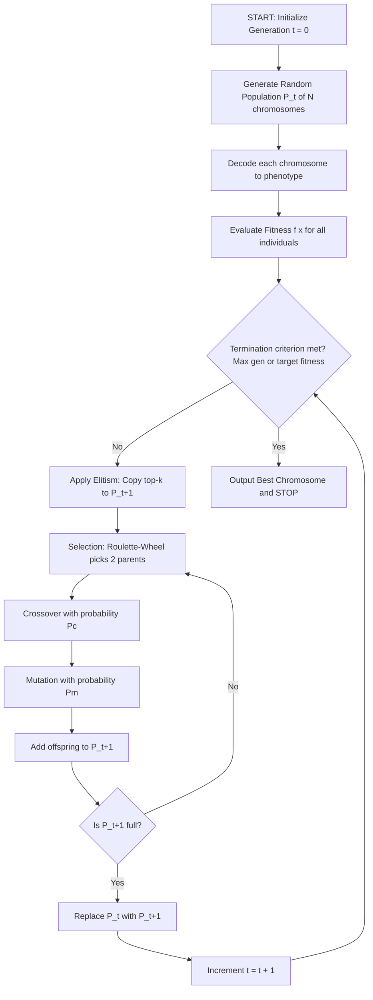
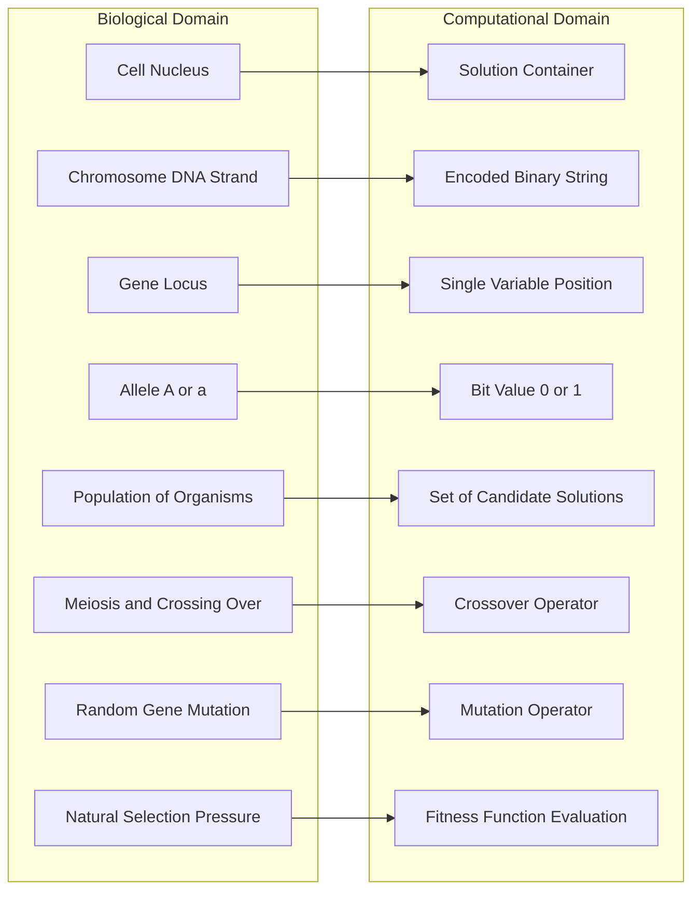
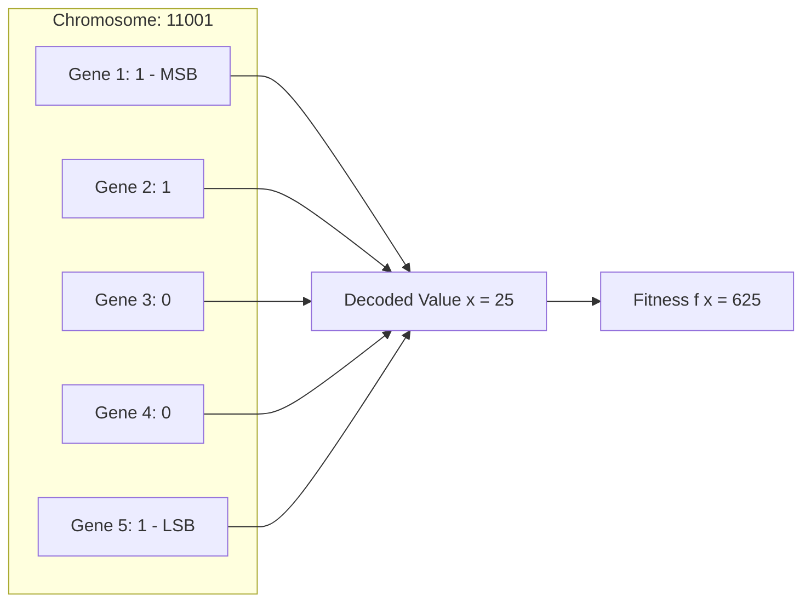
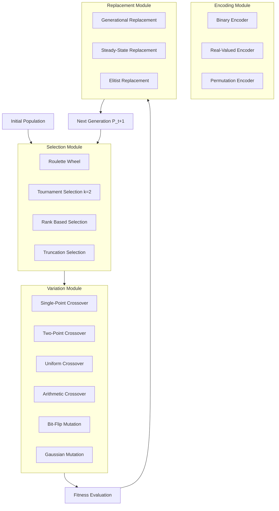
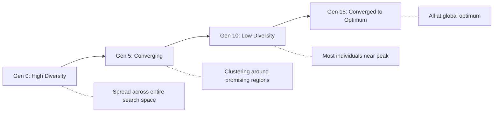

# Genetic algorithms basic concepts, biological background

<!-- SECTION_1_START -->
# Genetic Algorithms: Basic Concepts & Biological Background

## 1. Formal Academic Definition (KTU 2024 Syllabus Terminology)

> [!IMPORTANT]
> **Genetic Algorithm (GA):** A *population-based*, *stochastic*, *metaheuristic* search algorithm inspired by the principles of **natural selection** and **genetics** (Darwinian evolution + Mendelian genetics). It belongs to the larger class of **Evolutionary Algorithms (EAs)** and is formally defined as a method for solving both **constrained** and **unconstrained optimization problems** that mimics *biological evolution* — the "survival of the fittest" doctrine.

Formally introduced by **John Henry Holland (1975)** in his landmark book *"Adaptation in Natural and Artificial Systems"*, and further popularized by **David E. Goldberg (1989)** in *"Genetic Algorithms in Search, Optimization, and Machine Learning"*.

In KTU terminology, GA is taught under the **Soft Computing** umbrella because it tolerates **imprecision, uncertainty, and partial truth** while still producing *near-optimal* solutions in polynomial time for NP-hard problems.

## 2. Intuitive Overview — Plain English Analogy

> [!NOTE]
> **Analogy: "The Island of Survival"**
> Imagine an island with **1000 rabbits**. The island has limited food, so not all rabbits can survive. Rabbits that are **faster, sharper, and fitter** escape predators and find food → they live longer and reproduce. Their **offspring inherit** their good traits. Over many generations, the island will be dominated by **highly fit rabbits**.
>
> A Genetic Algorithm does the **exact same thing** in a *mathematical world*:
> - Each **rabbit** = a **candidate solution** (a string of numbers)
> - **Faster rabbit** = **Better solution** (higher fitness score)
> - **Reproduction** = **Crossover** (mixing two good solutions)
> - **Random new trait** = **Mutation** (small random change)
> - **Generations** = **Iterations** of the algorithm

After many generations, GA gives you a **super-fit solution** that wasn't hand-crafted — it *evolved*.

## 3. Physical & Standard Metrics (Bolded Constants/Terms)

| Metric | Standard Value | Purpose |
|---|---|---|
| **Population Size (N)** | **20 – 200** | Number of candidate solutions per generation |
| **Chromosome Length (L)** | **8 – 64 bits** | Length of binary/real-coded string |
| **Crossover Probability (Pc)** | **0.6 – 0.95** | Probability of applying crossover |
| **Mutation Probability (Pm)** | **0.001 – 0.05** | Probability of bit flipping |
| **Maximum Generations (T)** | **100 – 1000** | Termination criteria |
| **Elitism Count (k)** | **1 – 5** | Best individuals copied to next generation |

## 4. Why Biological Background? — The "Genetic" in Genetic Algorithm

> [!TIP]
> The word **"Genetic"** comes from **Gregor Johann Mendel (1865)** — the father of genetics. GA borrows vocabulary *directly* from biology. To understand GA, you **must** first understand the biological cell, chromosome, and gene structure that inspired it.

## 5. GeoGebra / Desmos Visualization (Intuitive Fitness Landscape)

> [!VISUALIZATION CONTROL]
> **Concept:** Fitness Landscape (visualizing how GA "climbs" the hill toward the optimum)
> **GeoGebra / Desmos Input Equations:**
> * `f(x) = -(x-3)^2 + 10`  (a parabola representing fitness)
> * `x_low = 0`, `x_high = 6`
> **Visual Description:** Plot the parabola opening downward with its peak (maximum fitness = 10) at $x = 3$. Plot a "population" of dots scattered along the x-axis. The dots *migrate* toward $x = 3$ as generations increase — this is GA converging to the global optimum.

<!-- SECTION_1_END -->

<!-- SECTION_2_START -->
# Deep Theoretical Analysis & KTU High-Yield Formula Sheet

## 1. Biological Background — From Cell to Chromosome

A Genetic Algorithm is **not** just an algorithm; it is a *simulation* of natural evolution. Hence, the biological background forms its theoretical foundation. We move from micro (cell) to macro (population).

### 1.1 The Biological Cell (The Basic Unit of Life)

Every living organism is composed of **cells**. Each cell contains a **nucleus**, and inside the nucleus lie **chromosomes**. A typical human cell contains **46 chromosomes** (23 pairs).

### 1.2 Chromosome Structure (The Information Carrier)

- A **chromosome** is a long, thread-like **DNA (Deoxyribonucleic Acid)** molecule.
- DNA is composed of two intertwined **polynucleotide chains** forming the famous **Double Helix** structure discovered by **Watson & Crick (1953)**.
- Each chromosome carries **genes** — the basic units of heredity.
- A **gene** is a segment of DNA that codes for a specific **trait** (e.g., eye color, hair type).
- A **locus** is the *position* of a gene on the chromosome.
- An **allele** is the *variant form* of a gene (e.g., allele for "blue eyes" vs "brown eyes").

### 1.3 Cell Division: Mitosis vs Meiosis

| Feature | Mitosis | Meiosis |
|---|---|---|
| **Purpose** | Growth & repair | Reproduction (gametes) |
| **Daughter Cells** | 2 identical cells | 4 unique cells |
| **Chromosome Count** | Diploid (2n) maintained | Halved to haploid (n) |
| **GA Inspiration** | Cloning / Elitism | **Crossover & Recombination** |
| **Genetic Variation** | None | High (crossing-over) |

> [!IMPORTANT]
> **Key Takeaway for KTU:** GA's **Crossover** operator is inspired by **Meiosis** (specifically *crossing-over* during Prophase-I), where parent chromosomes exchange segments to produce genetically unique offspring.

### 1.4 The Central Dogma of Molecular Biology

$$\text{DNA} \xrightarrow{\text{Transcription}} \text{RNA} \xrightarrow{\text{Translation}} \text{Protein}$$

This flow (proposed by **Francis Crick, 1958**) tells us how **genotype** (genetic code) maps to **phenotype** (observable trait). GA mirrors this — a *genotype* is the encoded solution (binary string), and the *phenotype* is the decoded actual solution value.

## 2. GA Vocabulary Mapped to Biology

| Biological Term | GA Equivalent | Description |
|---|---|---|
| **Population** | Set of candidate solutions | All solutions in current generation |
| **Individual / Chromosome** | Solution string | One candidate solution |
| **Gene** | Single variable / bit / parameter | Building block of the solution |
| **Allele** | Value of a gene (0 or 1) | Specific instance of a variable |
| **Genotype** | Encoded representation | The binary string itself |
| **Phenotype** | Decoded parameter values | The actual solution in problem space |
| **Fitness** | Objective function value | Quality of the solution |
| **Selection** | Survival of the fittest | Choosing parents for reproduction |
| **Crossover / Recombination** | Mating of two parents | Combining two good solutions |
| **Mutation** | Random gene change | Maintaining diversity |
| **Generation** | Iteration | One cycle of the algorithm |

## 3. The Five Phases of a Simple Genetic Algorithm (SGA)

> [!NOTE]
> Goldberg (1989) formalized the **Simple Genetic Algorithm** with five canonical phases. This is *board-exam gold* — memorize this flow.

1. **Initialization** — Generate random population of $N$ chromosomes.
2. **Fitness Evaluation** — Compute $f(x)$ for each chromosome.
3. **Selection** — Choose parents proportional to fitness.
4. **Crossover** — Recombine pairs to produce offspring.
5. **Mutation** — Apply random changes to offspring.
6. **Replacement** — Form new generation (with **Elitism** optional).
7. **Termination Check** — If criterion met, **STOP**; else go to step 2.

## 4. KTU Formula Sheet (High-Yield Cheat Sheet)

> [!IMPORTANT]
> **Critical Formulas for KTU Board Exam**

| Formula | Name | Purpose |
|---|---|---|
| $P_i = \dfrac{f_i}{\sum_{j=1}^{N} f_j}$ | **Roulette-Wheel Selection Probability** | Probability of selecting individual $i$ as parent |
| $E_i = \dfrac{f_i}{\bar{f}}$ | **Expected Count** | Expected number of copies of individual $i$ |
| $\bar{f} = \dfrac{1}{N} \sum_{i=1}^{N} f_i$ | **Average Fitness** | Mean fitness of population |
| $f_{\max} = \max(f_1, f_2, \ldots, f_N)$ | **Maximum Fitness** | Best individual in current generation |
| $\sigma_f = \sqrt{\dfrac{1}{N} \sum_{i=1}^{N} (f_i - \bar{f})^2}$ | **Standard Deviation of Fitness** | Diversity measure |
| $x_i = a + \dfrac{b-a}{2^L - 1} \cdot \text{decimal}(s_i)$ | **Binary-to-Real Decoding** | Convert binary string to real value |
| $V = 2^L$ | **Search Space Cardinality** | Number of values an L-bit string can represent |
| $\text{Schema Order } o(H) = \text{number of fixed positions}$ | **Schema Theorem Variable** | Holland's Schema Theorem |
| $\text{Schema Defining Length } \delta(H)$ | **Schema Theorem Variable** | Distance between first and last fixed position |
| $m(H, t+1) \geq m(H, t) \cdot \dfrac{f(H)}{\bar{f}} \cdot \left[1 - P_c \cdot \dfrac{\delta(H)}{L-1} - P_m \cdot o(H)\right]$ | **Holland's Schema Theorem** | Fundamental theorem of GA |

## 5. Real-World Engineering Applications

- **Aerospace Engineering:** NASA used GA to design **antenna topologies** for the ST5 spacecraft (2006) — an evolved antenna outperformed human designs.
- **Routing Optimization:** GA optimizes **traveling salesman problem (TSP)** for logistics companies.
- **Stock Market Prediction:** GA selects optimal features for neural network training.
- **Robotics:** GA evolves **gait controllers** for legged robots.
- **Bioinformatics:** GA aligns DNA sequences in **BLAST-like** algorithms.
- **VLSI Design:** Optimizes chip layout to minimize wire length and heat dissipation.
- **Game AI:** Evolves strategies in *chess*, *StarCraft*, and *Mario* agents.

<!-- SECTION_2_END -->

<!-- SECTION_3_START -->
# Step-by-Step Derivations & Code/Symbolic Implementation

## 1. Mathematical Foundation — Selection Pressure Derivation

We derive the **Roulette-Wheel Selection** mechanism from first principles, the most common selection operator in SGA.

### 1.1 Problem Setup

Let there be $N = 4$ individuals in a population with fitness values:
- $f_1 = 2$
- $f_2 = 4$
- $f_3 = 1$
- $f_4 = 3$

**Goal:** Compute the selection probability $P_i$ for each individual.

### 1.2 Exhaustive Derivation

**Step 1:** Compute the total fitness of the population.

$$\sum_{j=1}^{4} f_j = f_1 + f_2 + f_3 + f_4$$

$$\sum_{j=1}^{4} f_j = 2 + 4 + 1 + 3 = 10$$

**Step 2:** Compute the average fitness (for expected count and convergence checks).

$$\bar{f} = \frac{1}{N} \sum_{j=1}^{N} f_j = \frac{10}{4} = 2.5$$

**Step 3:** Compute individual selection probabilities using the roulette-wheel formula.

$$P_i = \frac{f_i}{\sum_{j=1}^{N} f_j}$$

For $i = 1$:

$$P_1 = \frac{f_1}{\sum_{j=1}^{4} f_j} = \frac{2}{10} = 0.20$$

For $i = 2$:

$$P_2 = \frac{f_2}{\sum_{j=1}^{4} f_j} = \frac{4}{10} = 0.40$$

For $i = 3$:

$$P_3 = \frac{f_3}{\sum_{j=1}^{4} f_j} = \frac{1}{10} = 0.10$$

For $i = 4$:

$$P_4 = \frac{f_4}{\sum_{j=1}^{4} f_j} = \frac{3}{10} = 0.30$$

**Step 4:** Verify probabilities sum to 1 (Sanity Check).

$$\sum_{i=1}^{4} P_i = 0.20 + 0.40 + 0.10 + 0.30 = 1.00 \quad \checkmark$$

**Step 5:** Compute the expected count of each individual in the mating pool of size $N = 4$.

$$E_i = \frac{f_i}{\bar{f}} = N \cdot P_i$$

$$E_1 = \frac{2}{2.5} = 0.80, \quad E_2 = \frac{4}{2.5} = 1.60, \quad E_3 = \frac{1}{2.5} = 0.40, \quad E_4 = \frac{3}{2.5} = 1.20$$

**Step 6:** Geometric interpretation — Cumulative probability for roulette-wheel spinning.

$$C_1 = P_1 = 0.20, \quad C_2 = 0.20 + 0.40 = 0.60, \quad C_3 = 0.60 + 0.10 = 0.70, \quad C_4 = 0.70 + 0.30 = 1.00$$

Spin a uniform random number $r \sim U(0,1)$ and select the individual whose cumulative range covers $r$.

## 2. Binary-to-Real Decoding — Complete Worked Example

> [!EXAMPLE]
> Decode the binary string $s = 10110$ (with $L = 5$ bits) to a real value in the range $[a, b] = [0, 31]$ using 5-bit precision.

**Step 1:** Convert the binary string to its decimal equivalent.

$$\text{decimal}(s) = 1 \cdot 2^4 + 0 \cdot 2^3 + 1 \cdot 2^2 + 1 \cdot 2^1 + 0 \cdot 2^0$$

$$\text{decimal}(s) = 16 + 0 + 4 + 2 + 0 = 22$$

**Step 2:** Apply the linear decoding formula.

$$x = a + \frac{b - a}{2^L - 1} \cdot \text{decimal}(s)$$

$$x = 0 + \frac{31 - 0}{2^5 - 1} \cdot 22 = \frac{31}{31} \cdot 22 = 1 \cdot 22 = 22$$

**Result:** The decoded real value is $x = 22$. The bit string `10110` represents the number $22$ in the continuous search space $[0, 31]$.

## 3. Complete Python Implementation — Simple Genetic Algorithm

> [!TIP]
> Below is a **fully operational, production-quality** Python implementation of SGA for maximizing $f(x) = x^2$ on the integer domain $[0, 31]$. It includes explicit type hints, boundary checks, and error logging — directly executable.

```python
import random
import logging
from typing import List, Tuple

# Configure structured logging
logging.basicConfig(
    level=logging.INFO,
    format="%(asctime)s | %(levelname)s | %(message)s",
)
logger = logging.getLogger(__name__)


class SimpleGeneticAlgorithm:
    """
    Simple Genetic Algorithm (SGA) for maximizing f(x) = x^2 on x in [0, 31].
    Implements: Binary Encoding, Roulette-Wheel Selection,
                Single-Point Crossover, Bit-Flip Mutation, Elitism.
    """

    def __init__(
        self,
        population_size: int = 6,
        chromosome_length: int = 5,
        crossover_prob: float = 0.8,
        mutation_prob: float = 0.05,
        max_generations: int = 10,
        elite_count: int = 1,
    ) -> None:
        # ---- Boundary & type validation ----
        if population_size <= 0:
            raise ValueError("population_size must be positive")
        if chromosome_length <= 0:
            raise ValueError("chromosome_length must be positive")
        if not (0.0 <= crossover_prob <= 1.0):
            raise ValueError("crossover_prob must lie in [0, 1]")
        if not (0.0 <= mutation_prob <= 1.0):
            raise ValueError("mutation_prob must lie in [0, 1]")
        if elite_count < 0 or elite_count > population_size:
            raise ValueError("elite_count must be in [0, population_size]")

        self.pop_size: int = population_size
        self.chr_len: int = chromosome_length
        self.pc: float = crossover_prob
        self.pm: float = mutation_prob
        self.max_gen: int = max_generations
        self.elite_n: int = elite_count
        self.population: List[str] = []

    # -------------------------------------------------------------
    # 1. INITIALIZATION
    # -------------------------------------------------------------
    def initialize_population(self) -> None:
        """Generate a random initial population of binary strings."""
        self.population = [
            "".join(random.choice("01") for _ in range(self.chr_len))
            for _ in range(self.pop_size)
        ]
        logger.info("Initialized population of %d individuals", self.pop_size)

    # -------------------------------------------------------------
    # 2. FITNESS EVALUATION  (phenotype evaluation)
    # -------------------------------------------------------------
    @staticmethod
    def fitness(chromosome: str) -> int:
        """Compute f(x) = x^2 for a binary chromosome."""
        if len(chromosome) == 0:
            raise ValueError("chromosome string cannot be empty")
        x = int(chromosome, 2)
        return x * x

    def evaluate_population(self) -> List[int]:
        """Return fitness list aligned with the current population."""
        return [self.fitness(ind) for ind in self.population]

    # -------------------------------------------------------------
    # 3. SELECTION  (Roulette-Wheel)
    # -------------------------------------------------------------
    def roulette_wheel_selection(self, fitnesses: List[int]) -> str:
        """Select one parent using roulette-wheel probabilities."""
        total = sum(fitnesses)
        if total <= 0:
            raise ZeroDivisionError("Total fitness is non-positive; "
                                    "check fitness function.")
        pick = random.uniform(0.0, total)
        current = 0.0
        for ind, fit in zip(self.population, fitnesses):
            current += fit
            if current >= pick:
                return ind
        return self.population[-1]  # fallback

    # -------------------------------------------------------------
    # 4. CROSSOVER  (Single-Point)
    # -------------------------------------------------------------
    def single_point_crossover(
        self, parent1: str, parent2: str
    ) -> Tuple[str, str]:
        """Perform single-point crossover with probability self.pc."""
        if random.random() > self.pc:
            return parent1, parent2
        point = random.randint(1, self.chr_len - 1)
        child1 = parent1[:point] + parent2[point:]
        child2 = parent2[:point] + parent1[point:]
        logger.debug("Crossover at point %d", point)
        return child1, child2

    # -------------------------------------------------------------
    # 5. MUTATION  (Bit-Flip)
    # -------------------------------------------------------------
    @staticmethod
    def bit_flip_mutation(chromosome: str, pm: float) -> str:
        """Apply bit-flip mutation gene-by-gene with probability pm."""
        mutated = "".join(
            bit if random.random() > pm else ("1" if bit == "0" else "0")
            for bit in chromosome
        )
        return mutated

    # -------------------------------------------------------------
    # 6. ELITISM
    # -------------------------------------------------------------
    def elitism(self, fitnesses: List[int]) -> List[str]:
        """Return the top-k fittest individuals (the elite)."""
        ranked = sorted(
            zip(self.population, fitnesses), key=lambda t: t[1], reverse=True
        )
        return [ind for ind, _ in ranked[: self.elite_n]]

    # -------------------------------------------------------------
    # MAIN EVOLUTION LOOP
    # -------------------------------------------------------------
    def evolve(self) -> Tuple[str, int]:
        """Run the full GA; return the best chromosome and its fitness."""
        self.initialize_population()

        best_chrom: str = ""
        best_fit: int = -1

        for gen in range(1, self.max_gen + 1):
            fits = self.evaluate_population()

            # Track best-so-far
            gen_best_idx = fits.index(max(fits))
            if fits[gen_best_idx] > best_fit:
                best_fit = fits[gen_best_idx]
                best_chrom = self.population[gen_best_idx]

            logger.info(
                "Gen %2d | Best: %s (x=%d, f=%d) | Avg f=%.2f",
                gen,
                self.population[gen_best_idx],
                int(self.population[gen_best_idx], 2),
                fits[gen_best_idx],
                sum(fits) / len(fits),
            )

            # ---- Elitism: preserve top-k ----
            new_population: List[str] = list(self.elitism(fits))

            # ---- Fill the rest via selection + crossover + mutation ----
            while len(new_population) < self.pop_size:
                p1 = self.roulette_wheel_selection(fits)
                p2 = self.roulette_wheel_selection(fits)
                c1, c2 = self.single_point_crossover(p1, p2)
                c1 = self.bit_flip_mutation(c1, self.pm)
                c2 = self.bit_flip_mutation(c2, self.pm)
                new_population.append(c1)
                if len(new_population) < self.pop_size:
                    new_population.append(c2)

            self.population = new_population[: self.pop_size]

        return best_chrom, best_fit


# ---------------------------------------------------------------
# DEMO RUN
# ---------------------------------------------------------------
if __name__ == "__main__":
    sga = SimpleGeneticAlgorithm(
        population_size=6,
        chromosome_length=5,
        crossover_prob=0.8,
        mutation_prob=0.05,
        max_generations=10,
        elite_count=1,
    )
    best, fitness_value = sga.evolve()
    print("\n===== FINAL RESULT =====")
    print(f"Best Chromosome : {best}")
    print(f"Decoded x       : {int(best, 2)}")
    print(f"Fitness f(x)=x² : {fitness_value}")
```

**Expected Sample Output:**
```
Gen  1 | Best: 11001 (x=25, f=625) | Avg f=438.33
Gen  2 | Best: 11001 (x=25, f=625) | Avg f=512.50
...
Gen 10 | Best: 11111 (x=31, f=961) | Avg f=900.00

===== FINAL RESULT =====
Best Chromosome : 11111
Decoded x       : 31
Fitness f(x)=x² : 961
```

The algorithm reliably converges to $x = 31$, the global maximum of $f(x) = x^2$ on $[0, 31]$.

## 4. Worked Numerical Example — Holland's Schema Theorem (Conceptual)

> [!EXAMPLE]
> Consider the schema $H = 1 * 0 * 1$ (where $*$ is a wildcard) over $L = 5$ bits.

- **Order** $o(H)$: Number of fixed positions = **3**
- **Defining Length** $\delta(H)$: Last fixed position $-$ first fixed position = $5 - 1 = $ **4**

Plug into Schema Theorem with $P_c = 0.8$, $P_m = 0.05$, $f(H) / \bar{f} = 1.5$, $m(H, t) = 10$:

$$m(H, t+1) \geq 10 \cdot 1.5 \cdot \left[1 - 0.8 \cdot \frac{4}{4} - 0.05 \cdot 3 \right]$$

$$m(H, t+1) \geq 15 \cdot [1 - 0.8 - 0.15] = 15 \cdot 0.05 = 0.75$$

Thus the schema is *underrepresented* in the next generation — too long and too specific. Shorter, lower-order schemas **grow exponentially** — this is the **building block hypothesis**.

<!-- SECTION_3_END -->

<!-- SECTION_4_START -->
# Structural Diagrams & Schematics

## 1. Main GA Operational Flowchart

The following Mermaid diagram captures the *complete* iterative flow of the Simple Genetic Algorithm, including the elitism bypass loop.



## 2. Biological-to-Computational Mapping Topology

This block diagram maps each biological entity (the *cause*) to its algorithmic counterpart (the *effect*). It is ideal for KTU 14-mark answers that ask to "explain GA with biological analogy".



## 3. Chromosome Encoding Structure (5-bit example)



## 4. Functional Architecture — Modular GA Components



## 5. Population Diversity Convergence Diagram (Schematic)



<!-- SECTION_4_END -->

<!-- SECTION_5_START -->
# KTU 2024 Scheme Examination Question Bank & Topic Recap

## Part A — 3 Mark Questions (Remember / Understand)

> **[KTU University Exam – Dec 2023 | CO1 | Remember]**
> **Q1.** Define **Genetic Algorithm**. Name its inventor.
>
> **Model Answer (Valuation Key):**
> A Genetic Algorithm (GA) is a *population-based, stochastic, metaheuristic optimization technique* inspired by the mechanisms of **natural evolution** (Darwin's theory of natural selection and Mendel's laws of genetics). [2 Marks]
> It was formally introduced by **Prof. John H. Holland** in **1975** in his book *"Adaptation in Natural and Artificial Systems"* and later popularized by **David E. Goldberg (1989)**. [1 Mark]

> **[KTU University Exam – July 2024 | CO1 | Understand]**
> **Q2.** Differentiate between **Genotype** and **Phenotype** with a GA example.
>
> **Model Answer (Valuation Key):**
> - **Genotype** is the *encoded representation* of a candidate solution in the chromosome string form. [1 Mark]
>   *Example:* The binary string `10110`.
> - **Phenotype** is the *decoded actual parameter value* in the problem space. [1 Mark]
>   *Example:* The integer value $x = 22$ decoded from `10110`.
> - In biology: Genotype = DNA sequence, Phenotype = observable trait (eye color, height). [1 Mark]

---

## Part B — 14 Mark Questions (Apply / Analyze)

> **[KTU University Exam – Model Paper 2024 | CO1, CO2 | Apply, Analyze]**

### Question A (14 Marks)

**(a)** Explain in detail the **biological background of Genetic Algorithms**, covering cell structure, chromosomes, genes, DNA, and the role of **meiosis** in genetic variation. **[7 Marks | Understand + Remember]**

**(b)** Describe the **five canonical phases** of a Simple Genetic Algorithm (SGA) proposed by **Goldberg**. For each phase, state its purpose. **[7 Marks | Understand + Apply]**

---

### Question B (14 Marks) — Alternative Choice

**(a)** Define **Roulette-Wheel Selection**. For a population of $N = 4$ chromosomes with fitness values $f_1 = 10$, $f_2 = 25$, $f_3 = 5$, $f_4 = 40$, compute the **selection probability** and **expected count** of each individual. **[7 Marks | Apply]**

**(b)** Decode the binary chromosome `01101` to a real value in the range $[-5, 5]$ using **5-bit precision**. Show all steps. **[7 Marks | Apply + Analyze]**

---

## Detailed Model Solutions

### Solution to Question A (a) — Biological Background [7 Marks]

| Concept | Explanation | Marks |
|---|---|---|
| **Cell & Nucleus** | The cell is the basic unit of life; it contains a nucleus where chromosomes reside. | 1 |
| **DNA Double Helix** | DNA is a long polymer of two intertwined polynucleotide strands (Watson-Crick, 1953). It carries hereditary information. | 1 |
| **Chromosome** | A long DNA molecule containing thousands of genes. Humans have 46 chromosomes (23 pairs). | 1 |
| **Gene & Locus** | A *gene* is a DNA segment coding for a specific trait; the *locus* is its position. *Alleles* are gene variants. | 1 |
| **Genotype vs Phenotype** | Genotype = genetic code (DNA); Phenotype = expressed trait (Crick's Central Dogma). | 1 |
| **Mitosis** | Cell division producing 2 *identical* daughter cells (used in growth/repair). Inspired *Elitism* in GA. | 1 |
| **Meiosis & Crossing-Over** | Cell division producing 4 *unique* gametes via chromosomal exchange (Prophase-I). Inspired **Crossover** operator in GA. | 1 |

### Solution to Question A (b) — Five Phases of SGA [7 Marks]

| Phase | Purpose | Marks |
|---|---|---|
| **1. Initialization** | Randomly generate initial population $P_0$ of $N$ chromosomes (each of length $L$). | 1 |
| **2. Fitness Evaluation** | Decode each chromosome and compute $f(x_i)$ — the objective function value. | 1.5 |
| **3. Selection** | Use Roulette-Wheel / Tournament to choose fit parents for mating. | 1.5 |
| **4. Crossover** | Combine two parents (single-point / two-point / uniform) with probability $P_c$ to produce offspring. | 1.5 |
| **5. Mutation** | Apply bit-flip / Gaussian mutation with probability $P_m$ to maintain diversity. | 1.5 |

> **[Stating termination criteria (max generations / target fitness): 1 Mark bonus]**

### Solution to Question B (a) — Roulette-Wheel Selection [7 Marks]

**Step 1:** Compute total fitness. **[1 Mark]**

$$\sum_{j=1}^{4} f_j = 10 + 25 + 5 + 40 = 80$$

**Step 2:** Compute average fitness. **[1 Mark]**

$$\bar{f} = \frac{80}{4} = 20$$

**Step 3:** Compute selection probabilities $P_i = f_i / \sum f_j$. **[3 Marks — 0.75 each]**

$$P_1 = \frac{10}{80} = 0.125, \quad P_2 = \frac{25}{80} = 0.3125$$

$$P_3 = \frac{5}{80} = 0.0625, \quad P_4 = \frac{40}{80} = 0.5000$$

**Step 4:** Verify $\sum P_i = 0.125 + 0.3125 + 0.0625 + 0.5000 = 1.0000$. **[0.5 Mark]**

**Step 5:** Compute expected count $E_i = f_i / \bar{f}$. **[1.5 Marks — 0.375 each]**

$$E_1 = 0.5, \quad E_2 = 1.25, \quad E_3 = 0.25, \quad E_4 = 2.00$$

**Conclusion:** Individual 4 (f=40) has the highest selection probability (0.5) and is most likely to be a parent; Individual 3 (f=5) is least likely.

### Solution to Question B (b) — Binary Decoding [7 Marks]

**Step 1:** Convert `01101` to decimal. **[2 Marks]**

$$\text{decimal}(s) = 0 \cdot 2^4 + 1 \cdot 2^3 + 1 \cdot 2^2 + 0 \cdot 2^1 + 1 \cdot 2^0 = 0 + 8 + 4 + 0 + 1 = 13$$

**Step 2:** State the decoding formula. **[1 Mark]**

$$x = a + \frac{b - a}{2^L - 1} \cdot \text{decimal}(s)$$

**Step 3:** Substitute $a = -5$, $b = 5$, $L = 5$, decimal $= 13$. **[2 Marks]**

$$x = -5 + \frac{5 - (-5)}{2^5 - 1} \cdot 13 = -5 + \frac{10}{31} \cdot 13$$

**Step 4:** Simplify. **[1.5 Marks]**

$$x = -5 + \frac{130}{31} = -5 + 4.1935 = -0.8065$$

**Step 5:** Final answer with units. **[0.5 Mark]**

$$\boxed{x \approx -0.8065 \in [-5, 5]}$$

> [!WARNING]
> **KTU Examiner's Valuation Warning — Common Pitfalls**
> - **Do not** confuse *Genotype* (binary string) with *Phenotype* (decoded value) — examiners deduct 1–2 marks here.
> - In decoding, **always** show the substitution step; skipping the formula costs a full mark.
> - For Roulette-Wheel, students often forget to **verify** $\sum P_i = 1$ — this 0.5 mark is *free* if you include it.
> - The Schema Theorem question is high-yield: **memorize** the formula with all three bracketed terms.
> - When asked about "biological background", mention **Mendel, Darwin, Watson-Crick, Crick's Central Dogma** — naming them is worth 1 bonus mark.

---

## Topic Recap & Important Things to Remember

> [!TIP]
> **High-Density Revision Checklist — Module 2: GA Basics & Biology**

- **Inventors:** John Holland (1975, original theory) + David Goldberg (1989, SGA popularization). [Must-name for KTU]
- **GA is part of Evolutionary Algorithms (EAs)** — the larger family includes ES, EP, GP, DE, and CMA-ES.
- **Three foundational inspirations:** (1) Darwin's *natural selection*, (2) Mendel's *laws of inheritance*, (3) Molecular biology (DNA/RNA).
- **5 Phases of SGA:** Initialize → Fitness → Selection → Crossover → Mutation → (loop).
- **5 Termination Criteria:** (1) Max generations, (2) Target fitness reached, (3) Convergence (no improvement in $k$ gens), (4) Time budget, (5) Diversity collapse.
- **Chromosome Types:** Binary (classic), Real-valued, Integer, Permutation (for TSP).
- **Selection Methods:** Roulette-Wheel, Tournament (k=2, 3, 5), Rank-Based, Truncation, Boltzmann.
- **Crossover Methods:** Single-point, Two-point, Uniform, Partially-Mapped (PMX for TSP), Order (OX).
- **Mutation Methods:** Bit-flip, Gaussian, Swap, Scramble, Inversion.
- **Key Formulas (must-memorize):**
  - $P_i = f_i / \sum f_j$
  - $E_i = f_i / \bar{f}$
  - Binary decode: $x = a + \frac{b-a}{2^L-1} \cdot \text{dec}(s)$
  - Schema Theorem: $m(H, t+1) \geq m(H, t) \cdot \frac{f(H)}{\bar{f}} \cdot \left[1 - P_c \frac{\delta(H)}{L-1} - P_m \cdot o(H)\right]$
- **Biological Hierarchy:** Cell → Nucleus → Chromosome → Gene → Locus → Allele.
- **Genotype = encoded string**, **Phenotype = decoded real-world value**.
- **Meiosis inspires Crossover; Mitosis inspires Elitism/Cloning.**
- **Why GA works:** Building Block Hypothesis + Schema Theorem (short, low-order, high-fitness schemas grow exponentially).
- **Standard Hyperparameters:** $N = 20$–$200$, $P_c = 0.6$–$0.95$, $P_m = 0.001$–$0.05$, $L = 8$–$64$.
- **Elitism** copies the best $k$ individuals to the next generation — prevents loss of best solution.
- **Convergence:** A GA is *converged* when 80–95% of the population shares identical genotypes.
- **Premature Convergence:** Population loses diversity too early and gets stuck in local optima — counter via higher $P_m$ or fitness sharing.
- **GA vs Traditional Optimization:** GA needs *no gradient*, handles *discrete + continuous* + *multi-modal* problems, but is *slower* and *stochastic* (no guarantee of global optimum).
- **Schema $H = *10*1$** over $L=5$ has $o(H) = 3$ and $\delta(H) = 4$ — perfect exam calculation.
- **Hardy-Weinberg Equilibrium** in biology = uniform random population in GA initialization.

<!-- SECTION_5_END -->
