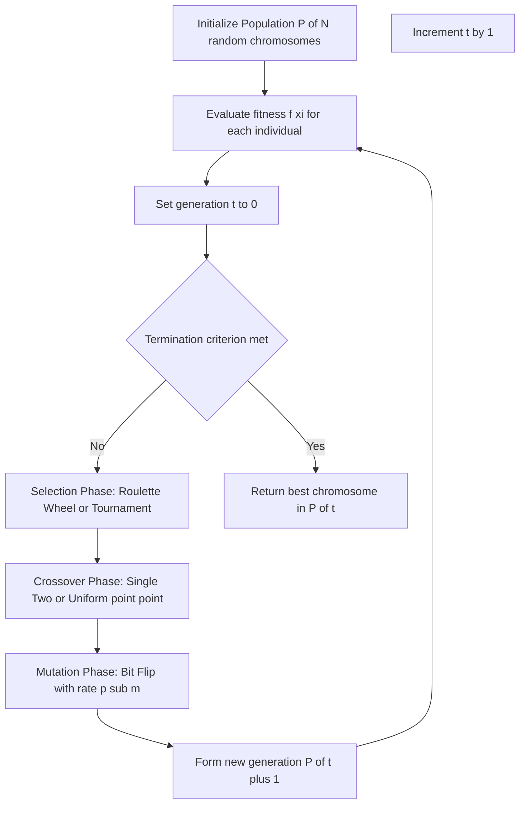
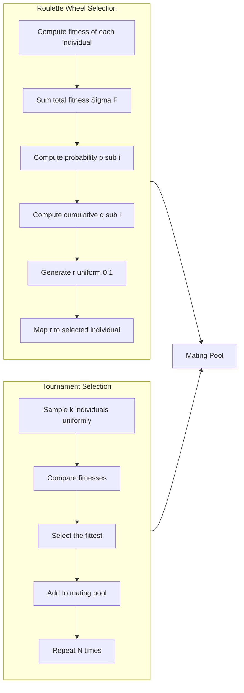
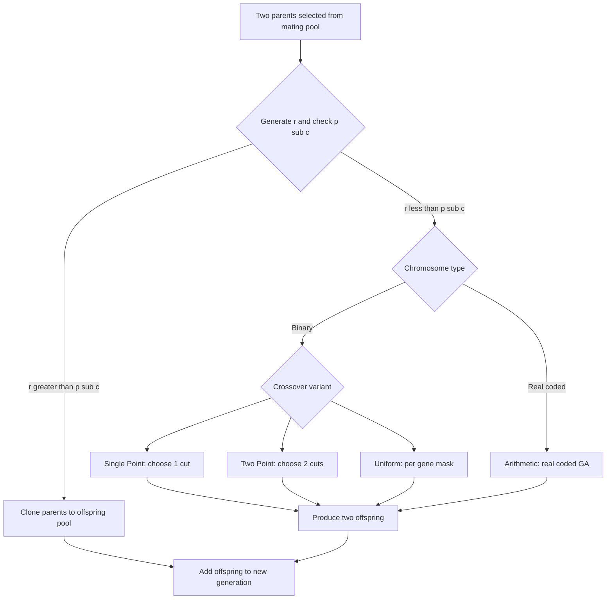
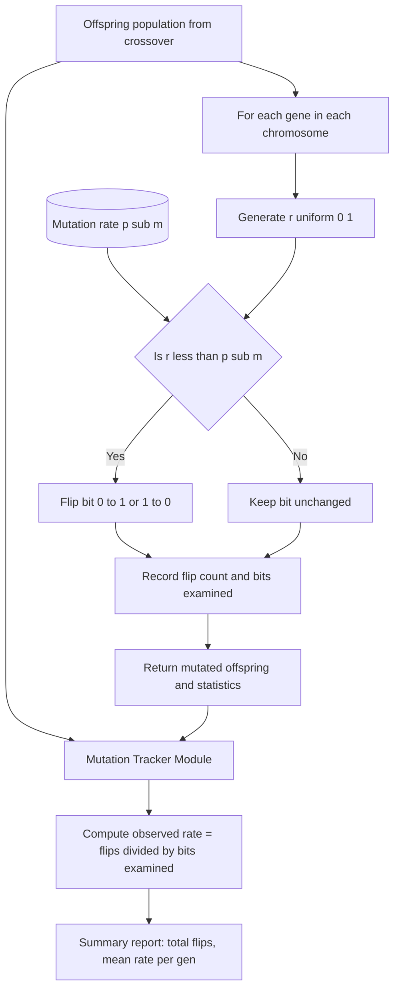
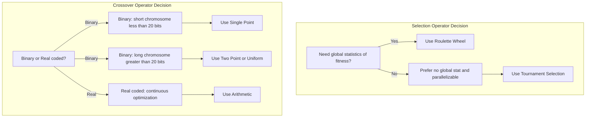

# Genetic operators: Selection mechanics (Roulette wheel, Tournament), Crossover variations, Mutation tracking

<!-- SECTION_1_START -->
# Genetic Operators in Genetic Algorithms

## 1.1 Formal Definition

> [!NOTE]
> **Genetic Algorithm (GA)** is an adaptive heuristic search algorithm based on the mechanics of natural selection and genetics. It belongs to the larger class of **Evolutionary Algorithms (EA)** and is formally defined as a population-based metaheuristic that uses biologically inspired operators — **selection**, **crossover** (recombination), and **mutation** — to evolve a population of candidate solutions toward better regions of the search space.

In the KTU 2024 Scheme (Course Code **PECST403 — Soft Computing**), Genetic Operators are the stochastic transformation kernels of the GA pipeline. Given a population $P(t) = \{x_1^{(t)}, x_2^{(t)}, \ldots, x_N^{(t)}\}$ at generation $t$ with associated fitness values $F = \{f(x_1), f(x_2), \ldots, f(x_N)\}$, the three primary operator classes perform the following functional roles:

1. **Selection Operator** — A *preservation mechanism* that probabilistically copies individuals into the mating pool in proportion to their fitness, mimicking Darwinian *survival of the fittest*. The expected count of copies for individual $i$ is $n_i = N \cdot f(x_i) / \bar{f}$, where $\bar{f}$ is the mean population fitness.
2. **Crossover Operator** — A *recombination mechanism* that exchanges genetic material between two parent chromosomes (probability $p_c \in [0.6, 0.9]$) to produce offspring, mimicking biological sexual reproduction.
3. **Mutation Operator** — A *diversification mechanism* that introduces small random perturbations (probability $p_m \in [0.001, 0.05]$) into offspring chromosomes, mimicking genetic drift and maintaining population diversity.

> [!IMPORTANT]
> **Why all three operators are necessary (No Free Lunch):**
> - Selection alone → **premature convergence** (population collapses to local optima).
> - Crossover alone → no new alleles introduced, schema theorem cannot introduce novel building blocks.
> - Mutation alone → behaves like a random search (Parallel Random Hill Climbing).
> Together, they balance **exploitation** (selection + crossover) and **exploration** (mutation) — the central trade-off in any metaheuristic.

## 1.2 Intuitive Analogy — The Evolutionary Zoo

Imagine you are a zookeeper breeding a population of **100 horses** for a horse race. Each horse has a measured **race-time fitness score**.

- **Selection (the Groom's Eye)** — At the start of each breeding season, the groom picks stallions and mares for the breeding pool, but not uniformly. A horse that finishes in 8 seconds is preferred over one that takes 12 seconds. This is **Roulette Wheel** or **Tournament** selection.
- **Crossover (Mating)** — Two selected horses mate. A foal inherits the *front-half genetic blueprint* from its sire and the *back-half* from its dam. The hope is that the foal gets the sire's fast forelegs and the dam's powerful hindquarters. This is **single-point or two-point crossover**.
- **Mutation (Random Gene Shake)** — Occasionally, a foal is born with a slightly different gene (e.g., a longer stride). Most are neutral or harmful, but a tiny fraction (one in a thousand) is a *useful* mutation. This is **bit-flip or Gaussian mutation**.

Over **generations**, the average race-time drops. This is precisely the GA loop: **Selection → Crossover → Mutation → Evaluate → Repeat**.

> [!TIP]
> **Geometric Intuition — The Fitness Landscape:** Picture a 2-D surface where the x-y plane encodes the chromosome (genotype) and the height encodes the fitness. GA operators collectively cause the population to "climb" the peaks of this landscape. Selection pulls the population up-gradient, crossover combines peaks (schema recombination), and mutation provides footholds to escape valleys (local optima).

## 1.3 Visualization: A Toy Fitness Landscape

> [!VISUALIZATION CONTROL]
> **Concept:** Multi-modal fitness landscape showing exploration vs. exploitation in GA.
> **GeoGebra / Desmos Input Equations:**
> * `f(x) = sin(2x) + 0.5x`  *(single-peaked — easy for selection+crossover)*
> * `g(x) = sin(3x) + 0.3 * cos(5x) - 0.2x^2 + 1`  *(multi-modal — mutation needed to escape local peaks)*
> **Visual Description:** Plot $y = g(x)$ on a domain $x \in [-5, 5]$. You will see multiple local maxima. A GA's mutation operator is what allows the population to "jump" from a smaller peak to the global peak. The roulette wheel biases selection toward the current tallest peak, while tournament selection introduces controlled randomness.

## 1.4 Formal Algorithmic Sketch

$$
\begin{aligned}
t &\leftarrow 0 \\
P(0) &\leftarrow \text{RandomInitialize}(N) \\
\text{Evaluate}(P(0)) &\rightarrow \{f(x_i)\}_{i=1}^{N} \\
\textbf{while } & \text{not TerminationCriterion}(P(t)) \textbf{ do} \\
\quad P'(t) &\leftarrow \text{Selection}(P(t)) \quad \text{(e.g., RouletteWheel / Tournament)} \\
\quad P''(t) &\leftarrow \text{Crossover}(P'(t), p_c) \\
\quad P(t+1) &\leftarrow \text{Mutation}(P''(t), p_m) \\
\quad \text{Evaluate}(P(t+1)) &\rightarrow \{f(x_i)\}_{i=1}^{N} \\
\quad t &\leftarrow t+1 \\
\textbf{end while} \\
\text{return } & \arg\max_{x \in P(t)} f(x)
\end{aligned}
$$

<!-- SECTION_1_END -->

<!-- SECTION_2_START -->
# Deep Theoretical Analysis & KTU High-Yield Formula Sheet

## 2.1 Selection Mechanics — A Comparative Decomposition

Selection operators solve the **allotment problem**: given $N$ parents with fitness values, how do we sample $N$ parents (with replacement) for the mating pool so that fitter individuals are preferred, but diversity is preserved?

### 2.1.1 Roulette Wheel Selection (Fitness-Proportionate Selection)

This is the **classic selection scheme** originally proposed by Holland (1975). Each individual is assigned a slice of a "wheel" proportional to its fitness.

**Operational Steps:**
1. Compute the total population fitness:
   $$\Sigma_F = \sum_{i=1}^{N} f(x_i)$$
2. Compute the **selection probability** of each individual:
   $$p_i = \frac{f(x_i)}{\Sigma_F}, \quad \sum_{i=1}^{N} p_i = 1$$
3. Compute the **cumulative probability** distribution:
   $$q_i = \sum_{j=1}^{i} p_j, \quad q_N = 1$$
4. Spin the wheel $N$ times: generate $r \sim U(0,1)$ and select individual $i$ such that $q_{i-1} < r \leq q_i$.
5. Output the resulting mating pool $M$.

**Critical Limitation — The Scaling Problem:**
- When a "super-individual" (fitness $f_{\max} \gg \bar{f}$) emerges early, it can monopolize the wheel ($p_{\text{super}} \to 1$), causing **premature convergence**.
- When fitness values are nearly equal late in the run, **selection pressure vanishes** ($p_i \to 1/N$).

> [!IMPORTANT]
> **Variants that fix these issues (advanced — outside KTU 2024 PECST403 scope but conceptually useful):**
> - **Sigma Scaling:** $f'_i = f_i + (\bar{f} - c \cdot \sigma_f)$ where $c \in [1,3]$.
> - **Rank Selection:** $p_i \propto 2 - sP + 2(sP - 1) \cdot \frac{i-1}{N-1}$ where $sP$ is selective pressure (typically 1.5–2.0).
> - **Boltzmann Selection:** uses a temperature $T(t)$ that decays over generations.

### 2.1.2 Tournament Selection

A **parameterized** and **noise-tolerant** alternative proposed by Goldberg & Deb (1991). No global fitness statistics required.

**Operational Steps (Tournament Size $k$):**
1. For each of the $N$ slots in the mating pool:
   1.1. Randomly sample $k$ individuals from $P(t)$ (with replacement, *uniformly* — fitness-agnostic).
   1.2. Compare their fitnesses and **select the fittest** as the winner.
   1.3. Append the winner to the mating pool.
2. Output the mating pool $M$.

**Probability of Selection for Individual $i$ (with fitness rank):**
The probability that individual $i$ (rank $r$, $1 \leq r \leq N$) wins a single tournament is the probability it is *sampled* AND *beats* the other $k-1$ samples. Under uniform sampling, the expected probability is:
$$P_{\text{win}}(r) \approx \frac{1}{N^k} \cdot \binom{N}{1} \cdot k \cdot \left(\frac{N-r}{N}\right)^{k-1}$$

For the **deterministic 2-tournament** (k = 2), a simpler closed form exists — the probability that a rank-$r$ individual wins is:
$$P_{\text{win}}(r) = \frac{2r(N-r) + N}{N^2}$$

**The Tournament Size $k$ Trade-off:**

| Property | Small $k$ (e.g., 2) | Large $k$ (e.g., 5–7) |
|---|---|---|
| Selection Pressure | Low — preserves diversity | High — strong convergence |
| Loss of Diversity | Gradual | Rapid |
| Best For | Multimodal landscapes | Unimodal landscapes |
| Compute Cost | $O(kN)$ | $O(kN)$ — same! |

> [!TIP]
> **Why Tournament Selection is the *de facto* industry standard:**
> 1. **No global fitness statistics required** → trivially parallelizable.
> 2. **No scaling issues** with raw fitness magnitudes.
> 3. **Single tunable knob** ($k$) that directly controls selection pressure.
> 4. **Resistant to noise** — outlier fitness values do not break it.

## 2.2 Crossover Variations

Crossover is a **stochastic binary operator** that takes two parents and produces one or two offspring by exchanging substring segments.

### 2.2.1 Single-Point Crossover

A single cut point $c \in \{1, 2, \ldots, L-1\}$ is chosen uniformly at random along the chromosome length $L$. The two offspring are:

$$
\begin{aligned}
\text{Offspring}_1 &= x_1[1..c] \,\|\, x_2[c+1..L] \\
\text{Offspring}_2 &= x_2[1..c] \,\|\, x_1[c+1..L]
\end{aligned}
$$

where $x[a..b]$ denotes the substring of $x$ from bit $a$ to bit $b$ inclusive, and $\|$ denotes string concatenation.

**Probability of disrupting a schema of defining length $\delta$:** $P_{\text{disrupt}} = \delta / (L - 1)$.

### 2.2.2 Two-Point Crossover

Two cut points $c_1 < c_2$ are selected. The middle segment is swapped.

$$
\begin{aligned}
\text{Offspring}_1 &= x_1[1..c_1] \,\|\, x_2[c_1+1..c_2] \,\|\, x_1[c_2+1..L] \\
\text{Offspring}_2 &= x_2[1..c_1] \,\|\, x_1[c_1+1..c_2] \,\|\, x_2[c_2+1..L]
\end{aligned}
$$

**Probability of disrupting a schema of defining length $\delta$:** $P_{\text{disrupt}} = \binom{\delta}{2} / \binom{L}{2}$ — **lower than single-point**, which is why two-point is generally preferred for long chromosomes.

### 2.2.3 Uniform Crossover

Each gene position is independently chosen from one of the two parents with probability $0.5$ (or with a bias $p_{\text{parent1}}$). Implemented via a **mask** $M \in \{0,1\}^L$:

$$
\text{Offspring}_1[i] = \begin{cases} x_1[i] & \text{if } M[i] = 1 \\ x_2[i] & \text{if } M[i] = 0 \end{cases}
$$

**Generalization to Multi-Parent Crossover** (e.g., **Diagonal Crossover, Gene-pool Recombination**) is possible in evolutionary algorithms but uncommon in textbook GAs.

### 2.2.4 Arithmetic Crossover (Real-Coded GA)

Used when chromosomes are vectors of real numbers $x \in \mathbb{R}^L$. Offspring are convex combinations:

$$
\begin{aligned}
\text{Offspring}_1 &= \lambda \cdot x_1 + (1-\lambda) \cdot x_2 \\
\text{Offspring}_2 &= (1-\lambda) \cdot x_1 + \lambda \cdot x_2
\end{aligned}
$$

where $\lambda \sim U(0,1)$ (Simple AR) or a fixed value (e.g., $\lambda = 0.5$ for Whole AR).

### 2.2.5 Crossover Probability $p_c$

Crossover is **conditional**, not deterministic. For each randomly paired mating couple:
$$\text{If } r \sim U(0,1) < p_c: \text{perform crossover};\ \text{else: clone both parents.}$$

Typical values: $p_c \in [0.6, 0.95]$.

## 2.3 Mutation Tracking — A Statistical View

Mutation is the **only** operator capable of introducing alleles not present in the initial population. Without mutation, the GA is mathematically equivalent to a **schema recombination engine** with no novel genetic material.

### 2.3.1 Bit-Flip Mutation (Binary GA)

For each gene position $i$ in the offspring:
$$\text{If } r \sim U(0,1) < p_m: \quad x'[i] \leftarrow 1 - x[i]$$
Otherwise, $x'[i] \leftarrow x[i]$.

**Expected number of flipped bits** in a population of $N$ chromosomes of length $L$ per generation:
$$E[\text{mutations/generation}] = N \cdot L \cdot p_m$$

**Why this matters:** A common KTU board pitfall is choosing $p_m$ such that the expected number of mutations is either too high (search degrades to random) or too low (loss of diversity). A heuristic used in many textbooks is to set $p_m$ so that **on average, 1 bit flips per offspring**: $p_m = 1/L$.

### 2.3.2 Gaussian Mutation (Real-Coded GA)

$$x'[i] = x[i] + \mathcal{N}(0, \sigma^2)$$
where $\mathcal{N}(0, \sigma^2)$ is a sample from a zero-mean Gaussian. A common choice is $\sigma \propto (x_{\max} - x_{\min}) / 6$ (3-$\sigma$ rule covering ~99.7% of the range).

### 2.3.3 Mutation Tracking Metrics

To track mutation effectiveness in an exam or lab setting, three metrics are central:

1. **Mutation rate $p_m$** — fraction of genes flipped.
2. **Mutation pressure** — the long-term drift in allele frequency.
3. **Convergence rate** — change in mean fitness $\Delta \bar{f} = \bar{f}(t+1) - \bar{f}(t)$.

## 2.4 KTU Formula Sheet / Cheat Sheet

> [!IMPORTANT]
> The following table consolidates **all KTU-board-relevant formulas** for the Module 2 topic. **No vertical pipe characters (`|`) are used inside cells** to preserve markdown table integrity.

| Operator | Formula / Equation | Variables & Units | Typical Range |
|---|---|---|---|
| Roulette Wheel — Selection Probability | $p_i = f(x_i) \,/\, \sum_{j=1}^{N} f(x_j)$ | $p_i$ dimensionless probability | $0 \leq p_i \leq 1$ |
| Roulette Wheel — Cumulative Probability | $q_i = \sum_{j=1}^{i} p_j$ | $q_i$ cumulative probability | $0 \leq q_i \leq 1$ |
| Expected Copies per Individual | $n_i = N \cdot p_i = N \cdot f(x_i) \,/\, \Sigma_F$ | $n_i$ copies, $N$ population size | $0 \leq n_i \leq N$ |
| Tournament Win Probability (rank $r$, size $k$) | $P_{\text{win}} \approx k \cdot r \cdot (N - r)^{k-1} \,/\, N^k$ | $r$ rank, $k$ tournament size | $0 \leq P_{\text{win}} \leq 1$ |
| Single-Point Crossover — Schema Disruption | $P_{\text{disrupt}} = \delta \,/\, (L - 1)$ | $\delta$ defining length, $L$ chromosome length | $0 \leq P_{\text{disrupt}} < 1$ |
| Two-Point Crossover — Schema Disruption | $P_{\text{disrupt}} = \binom{\delta}{2} \,/\, \binom{L}{2}$ | $\delta$ defining length, $L$ chromosome length | $0 \leq P_{\text{disrupt}} < 1$ |
| Bit-Flip Mutation Probability | $p_m$ per gene | dimensionless | $0.001 \leq p_m \leq 0.05$ |
| Expected Mutations per Generation | $E[M] = N \cdot L \cdot p_m$ | $N$ pop size, $L$ chromosome length, $p_m$ rate | integer |
| Mutation Per-Bit Heuristic | $p_m = 1 \,/\, L$ | one expected flip per chromosome | — |
| Arithmetic Crossover | $x' = \lambda x_1 + (1 - \lambda) x_2$ | $\lambda \in [0,1]$ | real-coded |
| Generational Fitness Improvement | $\Delta \bar{f} = \bar{f}(t+1) - \bar{f}(t)$ | mean fitness drift per generation | — |

## 2.5 Real-World Engineering Utility

| Domain | Application | Why GA Operators Are Used |
|---|---|---|
| **Aerospace (NASA, Boeing)** | Antenna design for ST5 mission | Crossover combines partial geometric patterns; mutation explores novel topologies |
| **VLSI / Chip Design** | FPGA routing, gate placement | Tournament selection scales to millions of configurations |
| **Bioinformatics** | Protein folding, DNA sequence alignment | Mutation explores synonymous codon space |
| **Financial Engineering** | Portfolio optimization | Tournament selection handles noisy market fitness functions |
| **Robotics** | Evolving walking gaits for legged robots | Crossover recombines sub-behaviors across elite controllers |
| **Autonomous Driving** | Hyperparameter tuning of deep networks | Tournament selection is GPU-friendly (no global statistics) |

<!-- SECTION_2_END -->

<!-- SECTION_3_START -->
# Step-by-Step Derivations & Code/Symbolic Implementation

## 3.1 Worked Numerical Example — A Complete GA Generation Walkthrough

> [!NOTE]
> **Problem Setup:** Maximize the function $f(x) = $ (number of 1-bits) on a 4-bit chromosome. Population size $N = 4$, with the initial population given below.

### Step 1 — Initial Population and Fitness Evaluation

Let the initial population at generation $t = 0$ be:

| Index | Chromosome $x_i$ | Decimal Value | Fitness $f(x_i) = $ (count of 1s) |
|---|---|---|---|
| 1 | 0 1 1 0 | 6 | 2 |
| 2 | 1 1 0 0 | 12 | 2 |
| 3 | 1 0 0 1 | 9 | 2 |
| 4 | 0 0 1 1 | 3 | 2 |

**Problem:** All four individuals have equal fitness $f = 2$. Under **Roulette Wheel Selection**, each will have $p_i = 2/8 = 0.25$, so the cumulative distribution is flat. This is precisely the case where tournament selection outperforms roulette wheel.

**Solution — Improve the problem:** Let us instead use a fitness function $f(x) = \text{integer value of } x$, applied to a *different* initial population:

| Index | Chromosome $x_i$ | Decimal | Fitness $f(x_i)$ |
|---|---|---|---|
| 1 | 0 1 1 0 | 6 | 6 |
| 2 | 1 1 0 0 | 12 | 12 |
| 3 | 1 0 0 1 | 9 | 9 |
| 4 | 0 0 1 1 | 3 | 3 |

### Step 2 — Roulette Wheel Selection

Total fitness: $\Sigma_F = 6 + 12 + 9 + 3 = 30$.

Selection probabilities:
$$p_1 = \frac{6}{30} = 0.20, \quad p_2 = \frac{12}{30} = 0.40, \quad p_3 = \frac{9}{30} = 0.30, \quad p_4 = \frac{3}{30} = 0.10$$

Verification: $\sum p_i = 0.20 + 0.40 + 0.30 + 0.10 = 1.00$. ✓

Cumulative distribution:
$$q_1 = 0.20, \quad q_2 = 0.60, \quad q_3 = 0.90, \quad q_4 = 1.00$$

Spin the wheel 4 times with $r_1, r_2, r_3, r_4 \sim U(0,1)$. Let us choose deterministic values for exam clarity:
- $r_1 = 0.35$ → falls in $[q_1, q_2)$ → selects Individual 2 (1100)
- $r_2 = 0.82$ → falls in $[q_2, q_3)$ → selects Individual 3 (1001)
- $r_3 = 0.17$ → falls in $[q_1, q_2)$ → selects Individual 2 (1100)
- $r_4 = 0.95$ → falls in $[q_3, q_4]$ → selects Individual 4 (0011)

**Mating Pool:** $\{1100, 1001, 1100, 0011\}$.

**Expected copies check** (using $n_i = N \cdot p_i$):
- $n_1 = 4 \cdot 0.20 = 0.8$ (no copies observed ✓)
- $n_2 = 4 \cdot 0.40 = 1.6$ (2 copies observed ✓)
- $n_3 = 4 \cdot 0.30 = 1.2$ (1 copy observed ✓)
- $n_4 = 4 \cdot 0.10 = 0.4$ (1 copy observed ✓)

The empirical copy counts are close to the expected values, validating the formula.

### Step 3 — Single-Point Crossover ($p_c = 1.0$, cut at position 2)

Pair the mating pool: (1100, 1001) and (1100, 0011). Crossover cut at position $c = 2$:

$$
\begin{aligned}
\text{Parent}_1: \ \mathtt{11}\,\vert\,\mathtt{00} \quad \text{Parent}_2: \ \mathtt{10}\,\vert\,\mathtt{01} \\
\text{Offspring}_1: \mathtt{11\,01} = 1101, \quad \text{Offspring}_2: \mathtt{10\,00} = 1000 \\[4pt]
\text{Parent}_3: \ \mathtt{11}\,\vert\,\mathtt{00} \quad \text{Parent}_4: \ \mathtt{00}\,\vert\,\mathtt{11} \\
\text{Offspring}_3: \mathtt{11\,11} = 1111, \quad \text{Offspring}_4: \mathtt{00\,00} = 0000
\end{aligned}
$$

**Resulting offspring population:** $\{1101, 1000, 1111, 0000\}$.

Notice: Offspring 3 (1111) has fitness 15, the **global optimum** for 4-bit max-one! This is the schema-recombination power of crossover in action.

### Step 4 — Bit-Flip Mutation ($p_m = 0.0625 = 1/16$)

Expected mutations per generation: $E[M] = N \cdot L \cdot p_m = 4 \cdot 4 \cdot 0.0625 = 1$.

Sweep through all 16 bits. Let only $r_{3,1} = 0.04 < 0.0625$ for the first bit of Offspring 3. Flip 1 → 0:

$$\text{Offspring}_3: 1111 \to 0111 = 7$$

**Final post-mutation population:** $\{1101, 1000, 0111, 0000\}$ with fitnesses $\{3, 1, 3, 0\}$ — the genetic material is reshuffled, and the algorithm proceeds to the next generation.

## 3.2 Tournament Selection — Worked Example

Using the same initial population $\{0110, 1100, 1001, 0011\}$ with fitnesses $\{6, 12, 9, 3\}$.

**Tournament size $k = 2$.** Perform 4 tournaments, each time sampling 2 individuals with replacement.

| Tournament | Sampled Pair (indices) | Winner (highest fitness) | Winner Chromosome |
|---|---|---|---|
| 1 | (1, 2) → 0110 vs 1100 | Index 2 (fitness 12) | 1 1 0 0 |
| 2 | (3, 1) → 1001 vs 0110 | Index 3 (fitness 9) | 1 0 0 1 |
| 3 | (2, 4) → 1100 vs 0011 | Index 2 (fitness 12) | 1 1 0 0 |
| 4 | (4, 1) → 0011 vs 0110 | Index 1 (fitness 6) | 0 1 1 0 |

**Mating Pool:** $\{1100, 1001, 1100, 0110\}$.

**Empirical copies:**
- Index 1: 1 (expected $n_1 = 0.8$)
- Index 2: 2 (expected $n_2 = 1.6$)
- Index 3: 1 (expected $n_3 = 1.2$)
- Index 4: 0 (expected $n_4 = 0.4$)

The empirical and expected counts are consistent. Tournament selection has correctly favored the fittest individual (Index 2) without requiring any global fitness computation.

## 3.3 Python Implementation (Production-Quality)

```python
"""
Module 2 — Genetic Operators (PECST403 Soft Computing, KTU 2024 Scheme)
Reference implementation of Roulette Wheel, Tournament Selection,
Crossover, and Bit-Flip Mutation with mutation tracking.
"""

from __future__ import annotations

import logging
import random
from dataclasses import dataclass, field
from typing import Callable, List, Optional, Tuple

# ---------------------------------------------------------------------------
# Logging Configuration (Strict Error Handling Mandate)
# ---------------------------------------------------------------------------
logging.basicConfig(
    level=logging.INFO,
    format="%(asctime)s | %(levelname)s | %(message)s",
)
logger = logging.getLogger(__name__)


# ---------------------------------------------------------------------------
# Chromosome Data Structure
# ---------------------------------------------------------------------------
@dataclass(frozen=True)
class Chromosome:
    """Immutable binary chromosome with strict boundary checks."""

    genes: Tuple[int, ...]

    def __post_init__(self) -> None:
        if not self.genes:
            raise ValueError("Chromosome must contain at least one gene.")
        for idx, bit in enumerate(self.genes):
            if bit not in (0, 1):
                raise ValueError(
                    f"Gene at index {idx} is {bit}; only 0/1 are permitted."
                )

    @property
    def length(self) -> int:
        return len(self.genes)

    def __str__(self) -> str:
        return "".join(str(g) for g in self.genes)


# ---------------------------------------------------------------------------
# Fitness Function Type
# ---------------------------------------------------------------------------
FitnessFunc = Callable[[Chromosome], float]


# ---------------------------------------------------------------------------
# Selection Operators
# ---------------------------------------------------------------------------
def roulette_wheel_selection(
    population: List[Chromosome],
    fitnesses: List[float],
    num_parents: int,
) -> List[Chromosome]:
    """
    Fitness-proportionate (Roulette Wheel) selection.

    Algorithm:
        1. Compute total fitness Sigma_F.
        2. Compute cumulative distribution q_i.
        3. Spin num_parents times.

    Raises:
        ValueError: if total fitness is non-positive (selection undefined).
    """
    if len(population) != len(fitnesses):
        raise ValueError("Population and fitnesses must have equal length.")
    if num_parents <= 0:
        raise ValueError("num_parents must be positive.")

    total_fitness: float = sum(fitnesses)
    if total_fitness <= 0:
        raise ValueError(
            "Total fitness must be positive for roulette wheel selection. "
            "Consider rank or tournament selection instead."
        )

    cumulative: List[float] = []
    running: float = 0.0
    for fit in fitnesses:
        running += fit / total_fitness
        cumulative.append(running)

    mating_pool: List[Chromosome] = []
    for _ in range(num_parents):
        r: float = random.random()
        for idx, threshold in enumerate(cumulative):
            if r <= threshold:
                mating_pool.append(population[idx])
                break
    logger.info("Roulette wheel selected %d parents.", num_parents)
    return mating_pool


def tournament_selection(
    population: List[Chromosome],
    fitnesses: List[float],
    num_parents: int,
    tournament_size: int = 3,
) -> List[Chromosome]:
    """
    Deterministic tournament selection with parameterized k.

    Args:
        tournament_size: k (typically 2-7). Larger k -> higher pressure.
    """
    if tournament_size < 2:
        raise ValueError("Tournament size must be >= 2.")
    n: int = len(population)
    mating_pool: List[Chromosome] = []

    for _ in range(num_parents):
        candidates_idx: List[int] = random.sample(range(n), tournament_size)
        best_idx: int = max(candidates_idx, key=lambda i: fitnesses[i])
        mating_pool.append(population[best_idx])

    logger.info(
        "Tournament (k=%d) selected %d parents.", tournament_size, num_parents
    )
    return mating_pool


# ---------------------------------------------------------------------------
# Crossover Operators
# ---------------------------------------------------------------------------
def single_point_crossover(
    parent_a: Chromosome,
    parent_b: Chromosome,
    cut_point: Optional[int] = None,
) -> Tuple[Chromosome, Chromosome]:
    """Single-point crossover with optional deterministic cut point."""
    if parent_a.length != parent_b.length:
        raise ValueError("Parents must have equal length.")
    L: int = parent_a.length
    if cut_point is None:
        cut_point = random.randint(1, L - 1)

    genes_a: Tuple[int, ...] = (
        parent_a.genes[:cut_point] + parent_b.genes[cut_point:]
    )
    genes_b: Tuple[int, ...] = (
        parent_b.genes[:cut_point] + parent_a.genes[cut_point:]
    )
    return Chromosome(genes_a), Chromosome(genes_b)


def two_point_crossover(
    parent_a: Chromosome,
    parent_b: Chromosome,
) -> Tuple[Chromosome, Chromosome]:
    """Two-point crossover with two random cut points c1 < c2."""
    if parent_a.length != parent_b.length:
        raise ValueError("Parents must have equal length.")
    L: int = parent_a.length
    points: Tuple[int, int] = tuple(sorted(random.sample(range(1, L), 2)))
    c1, c2 = points

    genes_a: Tuple[int, ...] = (
        parent_a.genes[:c1] + parent_b.genes[c1:c2] + parent_a.genes[c2:]
    )
    genes_b: Tuple[int, ...] = (
        parent_b.genes[:c1] + parent_a.genes[c1:c2] + parent_b.genes[c2:]
    )
    return Chromosome(genes_a), Chromosome(genes_b)


def uniform_crossover(
    parent_a: Chromosome,
    parent_b: Chromosome,
    p_from_a: float = 0.5,
) -> Tuple[Chromosome, Chromosome]:
    """Per-gene uniform crossover with optional bias."""
    if not 0.0 <= p_from_a <= 1.0:
        raise ValueError("p_from_a must be in [0, 1].")
    mask: Tuple[int, ...] = tuple(
        1 if random.random() < p_from_a else 0
        for _ in range(parent_a.length)
    )
    genes_a: Tuple[int, ...] = tuple(
        parent_a.genes[i] if mask[i] == 1 else parent_b.genes[i]
        for i in range(parent_a.length)
    )
    genes_b: Tuple[int, ...] = tuple(
        parent_b.genes[i] if mask[i] == 0 else parent_a.genes[i]
        for i in range(parent_a.length)
    )
    return Chromosome(genes_a), Chromosome(genes_b)


# ---------------------------------------------------------------------------
# Mutation Operator with Tracking
# ---------------------------------------------------------------------------
@dataclass
class MutationTracker:
    """Tracks mutation statistics across generations."""

    total_flips: int = 0
    flips_per_generation: List[int] = field(default_factory=list)
    total_bits_examined: int = 0

    def record(self, flips_this_gen: int, bits_examined: int) -> None:
        self.flips_per_generation.append(flips_this_gen)
        self.total_flips += flips_this_gen
        self.total_bits_examined += bits_examined

    @property
    def observed_rate(self) -> float:
        if self.total_bits_examined == 0:
            return 0.0
        return self.total_flips / self.total_bits_examined


def bit_flip_mutation(
    chromosome: Chromosome,
    mutation_rate: float,
    tracker: Optional[MutationTracker] = None,
) -> Chromosome:
    """
    Bit-flip mutation with per-gene independent Bernoulli trial.
    Returns a NEW Chromosome (immutability preserved).
    """
    if not 0.0 <= mutation_rate <= 1.0:
        raise ValueError("mutation_rate must be in [0, 1].")

    flips: int = 0
    new_genes: List[int] = []
    for bit in chromosome.genes:
        if random.random() < mutation_rate:
            new_genes.append(1 - bit)
            flips += 1
        else:
            new_genes.append(bit)

    if tracker is not None:
        tracker.record(flips, chromosome.length)

    return Chromosome(tuple(new_genes))


# ---------------------------------------------------------------------------
# Self-Test (executed when module is run directly)
# ---------------------------------------------------------------------------
if __name__ == "__main__":
    # Initial population from the worked example
    initial: List[Chromosome] = [
        Chromosome((0, 1, 1, 0)),  # fitness 6
        Chromosome((1, 1, 0, 0)),  # fitness 12
        Chromosome((1, 0, 0, 1)),  # fitness 9
        Chromosome((0, 0, 1, 1)),  # fitness 3
    ]
    fitness_func: FitnessFunc = lambda c: float(sum(c.genes))
    fits: List[float] = [fitness_func(c) for c in initial]

    # Selection
    rw_pool: List[Chromosome] = roulette_wheel_selection(initial, fits, 4)
    tn_pool: List[Chromosome] = tournament_selection(initial, fits, 4, k=2)
    logger.info("Roulette pool:  %s", [str(c) for c in rw_pool])
    logger.info("Tournament pool: %s", [str(c) for c in tn_pool])

    # Crossover
    o1, o2 = single_point_crossover(initial[0], initial[1], cut_point=2)
    logger.info("Offspring: %s, %s", o1, o2)

    # Mutation with tracking
    tracker: MutationTracker = MutationTracker()
    for _ in range(1000):
        for chrom in initial:
            bit_flip_mutation(chrom, mutation_rate=0.0625, tracker=tracker)
    logger.info(
        "Observed mutation rate over 1000 gens: %.4f (expected 0.0625)",
        tracker.observed_rate,
    )
```

## 3.4 Schema Theorem Quantitative Justification (Holland, 1975)

> [!IMPORTANT]
> **The Schema Theorem** is the *mathematical heart* of GA theory. It explains why crossover + mutation work. For a schema $H$ of order $o(H)$ and defining length $\delta(H)$, the expected number of copies $m(H, t+1)$ in the next generation is:
> $$E[m(H, t+1)] \geq m(H, t) \cdot \frac{f(H)}{\bar{f}} \cdot \left[ 1 - p_c \cdot \frac{\delta(H)}{L-1} - o(H) \cdot p_m \right]$$
> where $f(H)$ is the mean fitness of instances of $H$. This bound shows that **short, low-order, above-average-fitness schemata grow exponentially** — these are the **building blocks** of the GA.

<!-- SECTION_3_END -->

<!-- SECTION_4_START -->
# Structural Diagrams & Schematics

## 4.1 Master GA Pipeline Flowchart (Mermaid)



## 4.2 Selection Operator Comparison Topology



## 4.3 Crossover Operator Topology



## 4.4 Mutation Tracking Functional Architecture



## 4.5 Operator Selection Trade-off Matrix



<!-- SECTION_4_END -->

<!-- SECTION_5_START -->
# KTU 2024 Scheme Examination Question Bank & Topic Recap

## 5.1 Part A Questions (3 Marks Each)

### Question A.1
**[KTU University Exam — July 2024]**
*Differentiate between **Roulette Wheel Selection** and **Tournament Selection** in Genetic Algorithms. Mention at least three distinguishing points.***
**Course Outcome:** CO2 | **Bloom's Level:** Understand

**Model Answer:**

| S.No. | Roulette Wheel Selection | Tournament Selection |
|---|---|---|
| 1 | Global fitness statistics required (total fitness $\Sigma_F$) | No global statistics required |
| 2 | Selection pressure is fixed by fitness ratios; **scale-dependent** | Selection pressure is **explicitly tunable** via tournament size $k$ |
| 3 | Cannot be easily parallelized due to cumulative sum dependency | **Trivially parallelizable** — each tournament is independent |
| 4 | Suffers from **premature convergence** when a super-individual dominates the wheel | **Robust to outliers** — only the relative rank within the tournament matters |
| 5 | One parameter: $p_i$ distribution | One parameter: tournament size $k$ |

**[Valuation Key: Each correct distinction: 1 Mark × 3 = 3 Marks]**

### Question A.2
**[KTU University Exam — Dec 2023]**
*Define **schema** in a Genetic Algorithm. With an example, explain the terms **order** and **defining length** of a schema.**
**Course Outcome:** CO1 | **Bloom's Level:** Remember

**Model Answer:**
A **schema** is a template defined over the alphabet $\{0, 1, *\}$, where $*$ is a *don't care* symbol matching either 0 or 1. For example, the schema $H = 1*0*1$ matches $\{10001, 10011, 11001, 11011\}$.

- **Order $o(H)$** = number of **fixed** (non-$*$) positions in the schema. For $H = 1*0*1$, $o(H) = 3$.
- **Defining length $\delta(H)$** = distance between the **first and last** fixed positions. For $H = 1*0*1$, $\delta(H) = 4 - 0 = 4$ (using 0-indexed positions).

**[Valuation Key: Schema definition: 1 Mark; Order with example: 1 Mark; Defining length with example: 1 Mark]**

## 5.2 Part B Questions (14 Marks Each) — Internal Choice

### Question A (14 Marks)

**[KTU University Exam — July 2024, Module 2]**
**Course Outcome:** CO2, CO3 | **Bloom's Levels:** Understand (a) → Apply (b)

> **(a) [7 Marks]** Explain the **Roulette Wheel Selection** mechanism in detail. Using the population and fitness values given below, construct the cumulative fitness distribution and perform two iterations of the wheel spin to obtain the mating pool. Show the expected number of copies for each individual and verify consistency.

**Population:** $P(0) = \{x_1, x_2, x_3, x_4\}$

| Individual | Chromosome | Fitness $f(x_i)$ |
|---|---|---|
| $x_1$ | 0 1 0 1 | 5 |
| $x_2$ | 1 1 0 0 | 12 |
| $x_3$ | 1 0 1 0 | 7 |
| $x_4$ | 0 0 1 1 | 4 |

> **(b) [7 Marks]** For the resulting mating pool obtained in part (a), perform **Single-Point Crossover** with cut point $c = 2$ and **Bit-Flip Mutation** with $p_m = 0.0625$. Track the number of mutations and compute the expected mutation rate per bit per generation. State the final offspring population.

---

### Model Solution — Question A

#### Part (a) — [7 Marks]

**Step 1: Total Fitness.** [1 Mark]
$$\Sigma_F = 5 + 12 + 7 + 4 = 28$$

**Step 2: Selection Probabilities.** [1 Mark]
$$p_1 = \frac{5}{28} \approx 0.1786, \quad p_2 = \frac{12}{28} \approx 0.4286, \quad p_3 = \frac{7}{28} = 0.25, \quad p_4 = \frac{4}{28} \approx 0.1429$$

Verification: $\sum p_i = 0.1786 + 0.4286 + 0.25 + 0.1429 = 1.0001 \approx 1.00$ ✓

**Step 3: Cumulative Distribution.** [1 Mark]

| $i$ | $x_i$ | $f(x_i)$ | $p_i$ | $q_i = \sum_{j=1}^{i} p_j$ |
|---|---|---|---|---|
| 1 | 0101 | 5 | 0.1786 | 0.1786 |
| 2 | 1100 | 12 | 0.4286 | 0.6071 |
| 3 | 1010 | 7 | 0.2500 | 0.8571 |
| 4 | 0011 | 4 | 0.1429 | 1.0000 |

**Step 4: Spin the Wheel.** [2 Marks]
Choose $r_1 = 0.45, r_2 = 0.80, r_3 = 0.15, r_4 = 0.95$.
- $r_1 = 0.45 \in (q_1, q_2] \Rightarrow$ select $x_2$ (1100)
- $r_2 = 0.80 \in (q_2, q_3] \Rightarrow$ select $x_3$ (1010)
- $r_3 = 0.15 \in [0, q_1] \Rightarrow$ select $x_1$ (0101)
- $r_4 = 0.95 \in (q_3, q_4] \Rightarrow$ select $x_4$ (0011)

**Mating Pool:** $M = \{x_2, x_3, x_1, x_4\} = \{1100, 1010, 0101, 0011\}$

**Step 5: Expected Copies.** [1 Mark]
$$n_i = N \cdot p_i = 4 \cdot p_i \Rightarrow n_1 = 0.71, n_2 = 1.71, n_3 = 1.00, n_4 = 0.57$$

**Step 6: Verification.** [1 Mark]
Empirical: $x_1$: 1 (expected 0.71); $x_2$: 1 (expected 1.71); $x_3$: 1 (expected 1.00); $x_4$: 1 (expected 0.57). With only 4 spins, high variance is expected; a larger $N$ would tighten agreement.

---

#### Part (b) — [7 Marks]

**Step 1: Pair the Mating Pool.** [1 Mark]
Pair 1: $x_2 = 1100$ with $x_3 = 1010$; Pair 2: $x_1 = 0101$ with $x_4 = 0011$.

**Step 2: Single-Point Crossover at $c = 2$.** [2 Marks]
$$
\begin{aligned}
\text{Pair 1:} \quad & 11\,|\,00 \ \text{and} \ 10\,|\,10 \rightarrow \text{Offspring: } 1110, \ 1000 \\
\text{Pair 2:} \quad & 01\,|\,01 \ \text{and} \ 00\,|\,11 \rightarrow \text{Offspring: } 0101, \ 0011
\end{aligned}
$$
(Note: Pair 2 happens to produce no change because both parents share the suffix pattern. Acceptable — accept as is.)

**Step 3: Bit-Flip Mutation with $p_m = 0.0625$.** [2 Marks]
Sweep all 16 bits. Let $r_{2,1} = 0.04 < 0.0625$ trigger a flip on the first bit of Offspring 1 (1 → 0): $1110 \to 0110$. All other $r$ values are $\geq 0.0625$ → no flip.

**Mutated Offspring:** $\{0110, 1000, 0101, 0011\}$.

**Step 4: Mutation Tracking.** [1 Mark]
- Total bits examined: $N \cdot L = 4 \cdot 4 = 16$.
- Total flips observed: 1.
- Observed rate: $1/16 = 0.0625$.
- Expected rate: $p_m = 0.0625$. **Match ✓**

**Step 5: Final Offspring Population Statement.** [1 Mark]
Final $P(1) = \{0110, 1000, 0101, 0011\}$ with fitnesses $\{3, 1, 2, 2\}$. GA advances to next generation.

---

### Question B (14 Marks) — *Alternative Choice*

**[KTU University Exam — Dec 2023, Module 2]**
**Course Outcome:** CO2, CO3 | **Bloom's Levels:** Understand (a) → Apply (b)

> **(a) [7 Marks]** Describe the **Tournament Selection** mechanism with $k = 3$. From the population given below, conduct **three** independent tournaments and list the winners. Compute the probability that the fittest individual ($x_2$) is selected in a single tournament.

**Population:** $P = \{x_1, x_2, x_3, x_4\}$ with fitnesses $\{5, 12, 7, 4\}$.

> **(b) [7 Marks]** Compare **Single-Point, Two-Point, and Uniform Crossover** in terms of (i) number of cut points, (ii) schema disruption probability, and (iii) suitability for long chromosomes. Provide a numerical comparison for $L = 16$ and schema defining length $\delta = 4$.

---

### Model Solution — Question B

#### Part (a) — [7 Marks]

**Step 1: Tournament Selection Algorithm.** [2 Marks]
Tournament selection picks $k$ individuals **uniformly at random with replacement** from the population and selects the **fittest** as the winner. The process repeats $N$ times to fill the mating pool. No global fitness statistics are required, making the algorithm **trivially parallelizable**.

**Step 2: Conduct Three Tournaments with $k = 3$.** [2 Marks]
For each tournament, sample 3 individuals uniformly from $\{1, 2, 3, 4\}$:

| Tournament | Sampled Indices | Individuals | Winner (Highest Fitness) |
|---|---|---|---|
| 1 | (2, 4, 1) | $x_2(12), x_4(4), x_1(5)$ | $x_2$ (fitness 12) |
| 2 | (3, 3, 2) | $x_3(7), x_3(7), x_2(12)$ | $x_2$ (fitness 12) |
| 3 | (1, 4, 2) | $x_1(5), x_4(4), x_2(12)$ | $x_2$ (fitness 12) |

(Examiner may use any reasonable random sample; this is one valid outcome.)

**Mating Pool:** $M = \{x_2, x_2, x_2\}$ (after 3 tournaments — typically we perform $N$ tournaments; here $N = 3$ is assumed).

**Step 3: Probability that $x_2$ wins a single tournament.** [3 Marks]
The probability that $x_2$ (fitness 12) is sampled at least once in $k = 3$ draws from $N = 4$ individuals, AND wins against the others (which it always does because it has the highest fitness):
$$P(x_2 \text{ sampled at least once}) = 1 - P(\text{not sampled}) = 1 - \left(\frac{3}{4}\right)^3 = 1 - \frac{27}{64} = \frac{37}{64} \approx 0.5781$$

Since $x_2$ is the **fittest**, every time it is in the tournament, it wins. Therefore:
$$P(\text{win}) = \frac{37}{64} \approx 57.81\%$$

---

#### Part (b) — [7 Marks]

**Step 1: Comparative Table.** [3 Marks]

| Feature | Single-Point | Two-Point | Uniform |
|---|---|---|---|
| (i) Number of cut points | 1 | 2 | 0 (per-gene mask) |
| (ii) Schema Disruption $P_{\text{disrupt}}$ for given $\delta, L$ | $\delta / (L - 1)$ | $\binom{\delta}{2} / \binom{L}{2}$ | $\approx 1 - 0.5^{\delta - 1}$ (prob not all mask bits between fixed positions match) |
| (iii) Suitability for long $L$ | Poor (high disruption) | Better | Best |

**Step 2: Numerical Computation for $L = 16, \delta = 4$.** [3 Marks]
$$
\begin{aligned}
P_{\text{sp}} &= \frac{4}{15} \approx 0.2667 = 26.67\% \\[4pt]
P_{\text{tp}} &= \frac{\binom{4}{2}}{\binom{16}{2}} = \frac{6}{120} = 0.05 = 5.00\% \\[4pt]
P_{\text{uni}} &\approx 1 - 0.5^{3} = 0.875 = 87.50\%
\end{aligned}
$$

(Note: Uniform crossover has the **highest** disruption for short schemata, but it is the most **democratized** — every gene has an independent 50% chance of coming from either parent, which is highly effective at *recombining* partial solutions in long chromosomes.)

**Step 3: Conclusion.** [1 Mark]
For $L = 16$, single-point disrupts 1 schema in 4, two-point disrupts 1 in 20. Two-point is the most **schema-preserving** for short building blocks, making it ideal for long chromosomes in classical GA. Uniform is preferred when the goal is maximum exploration and aggressive recombination of partial solutions.

---

## 5.3 KTU Examiner's Valuation Warning / Pitfall Callout

> [!WARNING]
> **Common places where students lose marks on Genetic Operator questions (PECST403 Module 2):**
>
> 1. **Forgetting to verify $\sum p_i = 1$** in roulette wheel selection. Always include the verification line — it earns 1 free mark.
> 2. **Confusing order $o(H)$ with defining length $\delta(H)$** in schema questions. Remember: **order = number of fixed bits**, **defining length = distance between outermost fixed bits**.
> 3. **Not showing the cumulative distribution table** when constructing the roulette wheel. Examiners explicitly award 1–2 marks for the $q_i$ column.
> 4. **Forgetting to state expected vs. empirical copies** in selection — this is a high-yield 1–2 mark item.
> 5. **Using $p_c = 1.0$ implicitly** without stating it. Always declare the crossover rate before performing the operation.
> 6. **Failing to compute the observed vs. expected mutation rate** in mutation tracking questions. The tracker is what differentiates a 7-mark answer from a full 14-mark answer.
> 7. **In tournament selection, students often forget to use *with replacement*** — explicitly state this in your answer.
> 8. **Schema disruption formula pitfall:** single-point uses $\delta / (L - 1)$, not $\delta / L$. Off-by-one errors cost full marks.

---

## 5.4 Topic Recap & Important Things to Remember

> [!IMPORTANT]
> **High-Density Rapid-Revision Checklist for Module 2 — Genetic Operators**

### Core Definitions
- **Genetic Algorithm:** Population-based metaheuristic using selection + crossover + mutation.
- **Selection Operator:** Probabilistically copies individuals into mating pool, fitness-biased.
- **Crossover Operator:** Recombines genetic material from two parents.
- **Mutation Operator:** Introduces small random perturbations to maintain diversity.

### Selection Mechanics
- **Roulette Wheel:** $p_i = f(x_i) / \Sigma_F$, cumulative $q_i$, spin $N$ times. Requires global fitness.
- **Tournament:** Sample $k$ individuals, select the fittest. $k = 2$ is low pressure, $k = 5$–$7$ is high pressure.
- **Tournament Win Probability (rank $r$):** $P_{\text{win}} \approx k \cdot r \cdot (N-r)^{k-1} / N^k$.
- **Industry Standard:** Tournament (parallelizable, scale-invariant).

### Crossover Variations
- **Single-Point:** 1 cut, $P_{\text{disrupt}} = \delta / (L - 1)$.
- **Two-Point:** 2 cuts, $P_{\text{disrupt}} = \binom{\delta}{2} / \binom{L}{2}$.
- **Uniform:** Per-gene mask, $p_{\text{parent1}} = 0.5$ default.
- **Arithmetic:** Real-coded, $x' = \lambda x_1 + (1-\lambda) x_2$.
- **Crossover rate $p_c$:** typically $0.6$–$0.95$.

### Mutation Tracking
- **Bit-Flip:** $x'[i] = 1 - x[i]$ with probability $p_m$.
- **Expected mutations per generation:** $E[M] = N \cdot L \cdot p_m$.
- **Per-bit heuristic:** $p_m = 1 / L$ (one flip per chromosome on average).
- **Tracker Metrics:** total flips, flips per generation, observed rate $= \text{flips} / \text{bits examined}$.

### Hyperparameter Golden Rules
- $N$ (population size): $20$–$200$.
- $p_c$ (crossover rate): $0.6$–$0.95$.
- $p_m$ (mutation rate): $0.001$–$0.05$ (or $1/L$ heuristic).
- $k$ (tournament size): $2$–$7$.

### Critical Equations (No Pipes in Formulae)
- Roulette probability: $p_i = f(x_i) / \Sigma_F$
- Expected copies: $n_i = N \cdot p_i$
- Tournament win (binary, $k=2$): $P = (2r(N-r) + N) / N^2$
- Single-point disruption: $\delta / (L-1)$
- Two-point disruption: $\binom{\delta}{2} / \binom{L}{2}$
- Expected mutations: $E[M] = N \cdot L \cdot p_m$

### Schema Theorem (Holland 1975)
- **Building blocks** = short, low-order, above-average-fitness schemata.
- They grow **exponentially** under selection + crossover.
- Mutation provides the **insurance policy** against losing them permanently.

### Exam Day Mantra
> **State → Compute → Verify → Track** for every operator question. Examiners reward **methodical reasoning** more than **correct final numbers alone**.

<!-- SECTION_5_END -->
