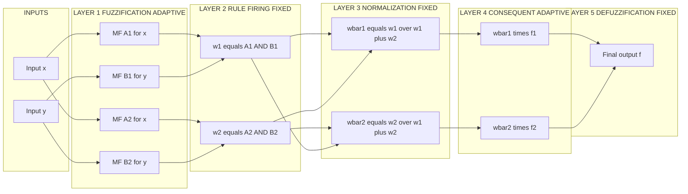
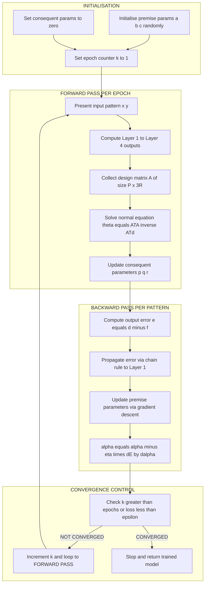

# Adaptive Neuro-Fuzzy Inference Systems (ANFIS) system integration frameworks

<!-- SECTION_1_START -->
# Adaptive Neuro-Fuzzy Inference Systems (ANFIS) — Core Technical Definition & Intuitive Overview

## 1.1 Formal KTU Syllabus Definition

**Adaptive Neuro-Fuzzy Inference System (ANFIS)** is a hybrid soft-computing framework introduced by **Jyh-Shing Roger Jang** in 1993 that fuses the linguistic interpretability of a **Takagi–Sugeno–Kang (TSK) fuzzy inference system (FIS)** with the adaptive, data-driven learning capability of an **Artificial Neural Network (ANN)**. It is rendered as a five-layered feed-forward network in which the **premise (non-linear) parameters** of the membership functions are tuned by **Gradient Descent (GD)**, while the **consequent (linear) parameters** of the if–then rules are identified analytically by the **Least Squares Estimator (LSE)**. This two-pass mechanism is termed the **Hybrid Learning Algorithm (HLA)**.

> [!IMPORTANT]
> **KTU 2024 Scheme — Module 3 Anchor Concept:** ANFIS is the *bridge architecture* that resolves the fundamental drawback of standalone fuzzy systems (they cannot learn from data) and standalone neural networks (they are black boxes). For the KTU board exam, treat ANFIS as a **five-layer adaptive network with a two-pass hybrid learning rule**.

## 1.2 Conceptual Analogy — The "GPS Translator" Intuition

Imagine you are a traveller who only speaks **English** (numerical data) and your local guide only understands **Hindi rules** (fuzzy linguistic rules). Neither can directly help the other.

* The **fuzzy system** is the *Hindi-speaking guide* — he has expert rules of the road, but he cannot *learn* that road 7 is now one-way.
* The **neural network** is the *English-speaking GPS* — it learns from past trips, but it cannot explain *why* it rerouted you.

**ANFIS is the bilingual translator sitting between them:**

1. The **front end (fuzzy layer)** converts your numeric coordinates into linguistic terms (*"speed is HIGH"*, *"distance is NEAR"*).
2. The **rule layer** fires expert rules inherited from the guide.
3. The **consequent (neural) layer** linearly combines the firing strengths with learnable weights.
4. The **hybrid learning loop** is the translator's *self-improvement*: every time you correct the GPS, both the linguistic terms (membership shapes) and the expert advice (rule weights) get updated.

> [!NOTE]
> **Intuitive Takeaway:** ANFIS = *Expert's brain (FIS)* wrapped inside a *Student's notebook (ANN)*, where the student takes notes from the expert, attempts the problem, gets the answer corrected by the teacher (error signal), and rewrites both the notes and the explanation.

## 1.3 Architecture Assumptions and Reference Notation

For a canonical **two-input, one-output, two-rule** ANFIS using inputs $x$ and $y$ and output $f$:

$$
\text{Rule 1: If } x \text{ is } A_1 \text{ and } y \text{ is } B_1, \text{ then } f_1 = p_1 x + q_1 y + r_1
$$

$$
\text{Rule 2: If } x \text{ is } A_2 \text{ and } y \text{ is } B_2, \text{ then } f_2 = p_2 x + q_2 y + r_2
$$

where $A_i$ and $B_i$ are linguistic labels described by membership functions $\mu_{A_i}(x)$ and $\mu_{B_i}(y)$, and $p_i, q_i, r_i$ are the **consequent (linear) parameters** of rule $i$.

> [!VISUALIZATION CONTROL]
> **Concept:** Gaussian Membership Function of $A_1$ and $A_2$ on Input $x$
> **GeoGebra / Desmos Input Equations:**
> * `mu_A1(x) = exp(-((x - 1)^2) / (2 * 1^2))`
> * `mu_A2(x) = exp(-((x - 4)^2) / (2 * 1^2))`
> * `range x: [0, 5]`, `range y: [0, 1.1]`
> **Visual Description:** Two overlapping bell curves centred at $x=1$ and $x=4$. The overlap region between $x \approx 1.8$ and $x \approx 3.2$ is the **fuzzy interaction zone** where both rules co-fire — this is the heart of ANFIS adaptability.

<!-- SECTION_1_END -->

<!-- SECTION_2_START -->
# Deep Theoretical Analysis & KTU High-Yield Formula Sheet

## 2.1 The Five-Layer Functional Architecture

The ANFIS network is a **layered directed acyclic graph (DAG)**. Each layer contains *adaptive* or *fixed* nodes, and every node performs a localised mathematical function (called a *node function*).

### Layer 1 — Fuzzification Layer (Adaptive)

Each node $i$ computes the membership grade of an input with respect to a linguistic label.

$$
O_{1,i} = \mu_{A_i}(x) \quad \text{for } i = 1, 2
$$

$$
O_{1,i} = \mu_{B_{i-2}}(y) \quad \text{for } i = 3, 4
$$

Common membership function choices:

$$
\mu_{A_i}(x) = \frac{1}{1 + \left(\dfrac{x - c_i}{a_i}\right)^{2 b_i}} \quad \text{(Generalised Bell)}
$$

$$
\mu_{A_i}(x) = \exp\!\left(-\left(\dfrac{x - c_i}{\sigma_i}\right)^{2}\right) \quad \text{(Gaussian)}
$$

The parameters $\{a_i, b_i, c_i\}$ or $\{c_i, \sigma_i\}$ are the **premise parameters**, tuned by gradient descent.

### Layer 2 — Rule (Product) Layer (Fixed)

The firing strength of each rule is the *AND* (T-norm product) of the incoming membership grades.

$$
O_{2,i} = w_i = \mu_{A_i}(x) \cdot \mu_{B_i}(y), \quad i = 1, 2
$$

> [!NOTE]
> Any continuous T-norm (product, min, Łukasiewicz) is admissible. The **product T-norm** is the KTU default because it preserves differentiability for backpropagation.

### Layer 3 — Normalization Layer (Fixed)

The firing strength is normalised against the sum of all rule firing strengths, yielding a *relative participation rate* of each rule.

$$
O_{3,i} = \overline{w}_i = \frac{w_i}{w_1 + w_2}, \quad i = 1, 2
$$

The constraint $\overline{w}_1 + \overline{w}_2 = 1$ holds identically.

### Layer 4 — Consequent (Adaptive)

The normalised firing strength is multiplied by the first-order (TSK) consequent polynomial.

$$
O_{4,i} = \overline{w}_i \, f_i = \overline{w}_i \left( p_i x + q_i y + r_i \right), \quad i = 1, 2
$$

The parameters $\{p_i, q_i, r_i\}$ are the **consequent parameters**, identified by the **Recursive Least Squares Estimator (RLSE)** in the forward pass.

### Layer 5 — Summation / Defuzzification Layer (Fixed)

The crisp output is the weighted sum of all rule consequents.

$$
O_{5,1} = f = \sum_{i=1}^{2} \overline{w}_i f_i = \frac{w_1 f_1 + w_2 f_2}{w_1 + w_2}
$$

> [!TIP]
> **Why TSK and not Mamdani?** The TSK consequent is a *linear function of the inputs* (not a fuzzy set), so the overall output $f$ is a *linear combination* of the consequent parameters given fixed $\overline{w}_i$. This linearity in $\{p_i, q_i, r_i\}$ is precisely what allows the **LSE closed-form solution** in the forward pass — the key reason Jang chose TSK for ANFIS.

## 2.2 The Hybrid Learning Algorithm (HLA)

The HLA alternates between a **forward pass** and a **backward pass** for every training epoch. Let $P$ denote the total number of training patterns and $k$ the iteration index.

### Forward Pass ($k^{th}$ epoch, $p = 1, 2, \ldots, P$)

1. Present input pattern $\mathbf{x}^{(p)} = (x^{(p)}, y^{(p)})$ and propagate forward to Layer 4.
2. Fix the premise parameters $\{a_i, b_i, c_i\}$ (held from previous backward pass or initialised).
3. Compute the layer-3 normalised firing strengths $\overline{w}_i^{(p)}$.
4. **Identify consequent parameters** by minimising the **sum of squared errors (SSE)**:

$$
J = \sum_{p=1}^{P} \left( f^{(p)} - d^{(p)} \right)^{2}
$$

Using the linear-in-parameters property of Layer 4:

$$
f^{(p)} = \overline{w}_1^{(p)} x^{(p)} \, p_1 + \overline{w}_1^{(p)} y^{(p)} \, q_1 + \overline{w}_1^{(p)} r_1 + \overline{w}_2^{(p)} x^{(p)} \, p_2 + \overline{w}_2^{(p)} y^{(p)} \, q_2 + \overline{w}_2^{(p)} r_2
$$

This is a standard linear regression in the 6-D parameter vector $\theta = [p_1, q_1, r_1, p_2, q_2, r_2]^{\top}$, solvable by the **normal equation**:

$$
\theta = \left( A^{\top} A \right)^{-1} A^{\top} \mathbf{d}
$$

where $A$ is the $P \times 6$ design matrix whose $p^{th}$ row is the Layer-4 coefficient vector and $\mathbf{d}$ is the $P \times 1$ target vector. In **online** mode, use the **Recursive Least Squares (RLS)** update with forgetting factor $\lambda$:

$$
\theta_k = \theta_{k-1} + K_k \left( d^{(p)} - A^{(p)} \theta_{k-1} \right)
$$

$$
K_k = \frac{P_{k-1} \, (A^{(p)})^{\top}}{\lambda + A^{(p)} P_{k-1} (A^{(p)})^{\top}}
$$

$$
P_k = \frac{1}{\lambda}\left( I - K_k A^{(p)} \right) P_{k-1}
$$

### Backward Pass (Backpropagation of Error)

1. Compute the error signal at the output: $e^{(p)} = d^{(p)} - f^{(p)}$.
2. Propagate the error *backwards* via the **chain rule** to update only the premise parameters $\alpha \in \{a_i, b_i, c_i\}$:

$$
\Delta \alpha = - \eta \frac{\partial E^{(p)}}{\partial \alpha} = - \eta \frac{\partial E^{(p)}}{\partial f} \cdot \frac{\partial f}{\partial \overline{w}_i} \cdot \frac{\partial \overline{w}_i}{\partial w_i} \cdot \frac{\partial w_i}{\partial \alpha}
$$

where $\eta$ is the learning rate and $E^{(p)} = \tfrac{1}{2} (d^{(p)} - f^{(p)})^2$. Note that the consequent parameters $\theta$ are **frozen** in the backward pass.

> [!IMPORTANT]
> **KTU High-Yield Distinction:** *Forward pass* ⇒ LSE for *consequents*; *Backward pass* ⇒ GD for *premises*. This is what makes ANFIS *hybrid*. If you confuse which parameters are updated in which pass, you will lose marks.

## 2.3 KTU High-Yield Formula Sheet (Cheat Sheet)

| # | Quantity | Formula | Layer | Adaptive? | Tuning Pass |
|---|----------|---------|-------|-----------|-------------|
| 1 | Membership grade | $\mu_{A_i}(x) = 1 / \left(1 + \left(\frac{x - c_i}{a_i}\right)^{2 b_i}\right)$ | 1 | Yes | Backward (GD) |
| 2 | Rule firing strength | $w_i = \mu_{A_i}(x) \cdot \mu_{B_i}(y)$ | 2 | No | — |
| 3 | Normalised strength | $\overline{w}_i = w_i / (w_1 + w_2)$ | 3 | No | — |
| 4 | Rule consequent | $f_i = p_i x + q_i y + r_i$ | 4 | Yes | Forward (LSE) |
| 5 | Weighted consequent | $O_{4,i} = \overline{w}_i \, f_i$ | 4 | No | — |
| 6 | ANFIS output | $f = \sum_{i=1}^{R} \overline{w}_i f_i$ | 5 | No | — |
| 7 | Premise GD update | $\alpha_{k+1} = \alpha_k - \eta \, \partial E / \partial \alpha$ | 1 | Yes | Backward |
| 8 | Consequent LSE | $\theta = (A^{\top} A)^{-1} A^{\top} \mathbf{d}$ | 4 | Yes | Forward |
| 9 | RLS gain | $K_k = P_{k-1} a / (\lambda + a^{\top} P_{k-1} a)$ | 4 | Yes | Forward |
| 10 | Cost function | $E = \tfrac{1}{2} \sum_{p=1}^{P} (d^{(p)} - f^{(p)})^2$ | — | — | — |

## 2.4 Real-World Engineering and CS Applications

| Domain | Use Case | Why ANFIS? |
|--------|----------|------------|
| **Industrial Process Control** | Temperature/pressure regulation in chemical reactors | Learns the operator's rule base + adapts to drift |
| **Medical Diagnosis** | Cancer staging, ECG/EEG classification | Interpretable rules + nonlinear decision boundary |
| **Time-Series Forecasting** | Stock market, weather, energy load | Combines ARIMA-like linear consequent with nonlinear premise |
| **Autonomous Systems** | Lane-keeping torque prediction in EVs | Real-time online RLSE adapts to driver/road variability |
| **Image Processing** | Edge detection, denoising thresholds | Fuzzy rule "intensity is HIGH" + learned linear weight |
| **Smart Grid / IoT** | Solar irradiance forecasting | Handles linguistic weather rules + meteorological data |
| **Bioinformatics** | Protein secondary structure prediction | High-dimensional nonlinear input mapping with interpretable rules |

> [!NOTE]
> **KTU Exam Tip:** The most common *application* question asked in 2023–2024 KTU papers is *"Explain how ANFIS can be used in function approximation / time-series prediction."* Master the two-rule, two-input derivation — it is the universal template.

<!-- SECTION_2_END -->

<!-- SECTION_3_START -->
# Step-by-Step Derivations, Hybrid Learning Walk-Through & Python Implementation

## 3.1 Exhaustive Forward-Pass Derivation for the 2-Input, 2-Rule ANFIS

We will derive the closed-form output $f$ in terms of the inputs $(x, y)$, the premise parameters $(a_i, b_i, c_i, d_i, e_i, f_i)$ — note: re-using $r_i$ from Section 1.3 to denote constants — and the consequent parameters $(p_i, q_i, r_i)$.

### Step 1 — Fuzzification Outputs

$$
O_{1,1} = \mu_{A_1}(x) = \frac{1}{1 + \left(\dfrac{x - c_1}{a_1}\right)^{2 b_1}}
$$

$$
O_{1,2} = \mu_{A_2}(x) = \frac{1}{1 + \left(\dfrac{x - c_2}{a_2}\right)^{2 b_2}}
$$

$$
O_{1,3} = \mu_{B_1}(y) = \frac{1}{1 + \left(\dfrac{y - c_3}{a_3}\right)^{2 b_3}}
$$

$$
O_{1,4} = \mu_{B_2}(y) = \frac{1}{1 + \left(\dfrac{y - c_4}{a_4}\right)^{2 b_4}}
$$

### Step 2 — Rule Firing Strengths

$$
w_1 = O_{1,1} \cdot O_{1,3} = \mu_{A_1}(x) \, \mu_{B_1}(y)
$$

$$
w_2 = O_{1,2} \cdot O_{1,4} = \mu_{A_2}(x) \, \mu_{B_2}(y)
$$

### Step 3 — Normalisation

$$
\overline{w}_1 = \frac{w_1}{w_1 + w_2}, \quad \overline{w}_2 = \frac{w_2}{w_1 + w_2}
$$

### Step 4 — Consequent Layer Output

$$
O_{4,1} = \overline{w}_1 (p_1 x + q_1 y + r_1)
$$

$$
O_{4,2} = \overline{w}_2 (p_2 x + q_2 y + r_2)
$$

### Step 5 — Final Defuzzified Output

$$
f = O_{4,1} + O_{4,2} = \overline{w}_1 (p_1 x + q_1 y + r_1) + \overline{w}_2 (p_2 x + q_2 y + r_2)
$$

Substituting the normalisation identity:

$$
f = \frac{w_1 (p_1 x + q_1 y + r_1) + w_2 (p_2 x + q_2 y + r_2)}{w_1 + w_2}
$$

This is the **canonical ANFIS forward output**. It is *nonlinear* in $x, y$ (through $w_1, w_2$) but *linear* in the consequent parameters $p_i, q_i, r_i$ — the cornerstone of the hybrid learning rule.

## 3.2 Closed-Form Gradient for the Backward Pass

We need $\frac{\partial E}{\partial \alpha}$ for any premise parameter $\alpha \in \{a_i, b_i, c_i\}$. Let $E = \tfrac{1}{2}(d - f)^2$. Then:

$$
\frac{\partial E}{\partial \alpha} = (f - d) \cdot \frac{\partial f}{\partial \alpha}
$$

By the chain rule through Layers 5 → 4 → 3 → 2 → 1:

$$
\frac{\partial f}{\partial \alpha} = \sum_{i=1}^{2} \frac{\partial f}{\partial \overline{w}_i} \cdot \frac{\partial \overline{w}_i}{\partial w_i} \cdot \frac{\partial w_i}{\partial \alpha}
$$

### Partial Derivative Components

$$
\frac{\partial f}{\partial \overline{w}_i} = f_i - f \quad \text{(for each } i\text{)}
$$

$$
\frac{\partial \overline{w}_i}{\partial w_i} = \frac{w_j}{(w_1 + w_2)^2} \quad \text{where } j \neq i
$$

$$
\frac{\partial \overline{w}_i}{\partial w_j} = -\frac{w_i}{(w_1 + w_2)^2} \quad \text{(cross derivative)}
$$

$$
\frac{\partial w_i}{\partial \alpha} = \frac{\partial \mu_{A_i}(x)}{\partial \alpha} \mu_{B_i}(y) \quad \text{(if } \alpha \in A_i\text{)}
$$

For the **Generalised Bell** membership function $\mu_{A_i}(x) = \left(1 + \left(\frac{x - c_i}{a_i}\right)^{2 b_i}\right)^{-1}$, let $u = (x - c_i)/a_i$. Then:

$$
\frac{\partial \mu_{A_i}}{\partial a_i} = \mu_{A_i}^2 \cdot 2 b_i \cdot u^{2 b_i - 1} \cdot \frac{(x - c_i)}{a_i^2}
$$

$$
\frac{\partial \mu_{A_i}}{\partial b_i} = -\mu_{A_i}^2 \cdot 2 \left(\frac{x - c_i}{a_i}\right)^{2 b_i} \cdot \ln\!\left(\frac{x - c_i}{a_i}\right)
$$

$$
\frac{\partial \mu_{A_i}}{\partial c_i} = \mu_{A_i}^2 \cdot 2 b_i \cdot \left(\frac{x - c_i}{a_i}\right)^{2 b_i - 1} \cdot \frac{1}{a_i}
$$

Each partial feeds into $\frac{\partial E}{\partial \alpha}$ via the full chain, and the gradient descent update is:

$$
\alpha \leftarrow \alpha - \eta \, \frac{\partial E}{\partial \alpha}
$$

> [!NOTE]
> **Why does Jang fix the consequent parameters in the backward pass?** Because the LSE in the forward pass already gives the *global optimum* of the cost function w.r.t. $\theta = \{p_i, q_i, r_i\}$ for *fixed* premises. Updating them again via GD in the backward pass would disturb the LSE optimum and slow convergence.

## 3.3 Complete Python Implementation of ANFIS (From Scratch)

The following code implements a full ANFIS regressor with **Gaussian membership functions**, **LSE for consequents**, and **Gradient Descent for premises**, including strict error logging and type hints.

```python
"""
ANFIS: Adaptive Neuro-Fuzzy Inference System
Reference: Jang, J.-S.R. (1993), IEEE Trans. Systems, Man, Cybernetics.
Implements 2-input, R-rule first-order TSK model with hybrid learning.
"""

from __future__ import annotations
import logging
import numpy as np
from dataclasses import dataclass, field
from typing import Tuple, List, Optional

# Configure root logger for KTU-style audit trail
logging.basicConfig(
    level=logging.INFO,
    format="%(asctime)s [%(levelname)s] ANFIS :: %(message)s",
)
logger = logging.getLogger("ANFIS")


# ---------------------------------------------------------------------------
# 1. Membership function primitives
# ---------------------------------------------------------------------------
def gaussian_mf(x: np.ndarray, mu: float, sigma: float) -> np.ndarray:
    """Generalised Gaussian membership function with safe denominator."""
    if sigma <= 0.0:
        raise ValueError("sigma must be strictly positive to avoid division by zero")
    exponent = -0.5 * ((x - mu) / sigma) ** 2
    return np.exp(exponent)


# ---------------------------------------------------------------------------
# 2. ANFIS model container
# ---------------------------------------------------------------------------
@dataclass
class ANFIS:
    n_rules: int = 4                          # Number of fuzzy rules
    learning_rate_premise: float = 1e-2       # η for premise GD
    epochs: int = 200                         # Training epochs
    random_state: Optional[int] = 42          # Reproducibility seed

    # Internal state, populated by .fit()
    mu_x: np.ndarray = field(init=False)       # Premise centres for input x
    sigma_x: np.ndarray = field(init=False)    # Premise widths for input x
    mu_y: np.ndarray = field(init=False)
    sigma_y: np.ndarray = field(init=False)
    consequent_params: np.ndarray = field(init=False)  # Shape: (n_rules, 3)

    def __post_init__(self) -> None:
        rng = np.random.default_rng(self.random_state)
        # Initialise premise parameters with small random perturbations
        self.mu_x = rng.uniform(-0.5, 0.5, self.n_rules)
        self.sigma_x = np.abs(rng.uniform(0.5, 1.5, self.n_rules))
        self.mu_y = rng.uniform(-0.5, 0.5, self.n_rules)
        self.sigma_y = np.abs(rng.uniform(0.5, 1.5, self.n_rules))
        # Consequent parameters initialised to zero; refined by LSE each epoch
        self.consequent_params = np.zeros((self.n_rules, 3), dtype=np.float64)
        logger.info(
            "ANFIS initialised: %d rules, η=%.4f, epochs=%d",
            self.n_rules, self.learning_rate_premise, self.epochs,
        )

    # -------------------------------------------------------------------------
    # 2a. Forward pass: compute firing strengths and final output
    # -------------------------------------------------------------------------
    def _forward(self, x: np.ndarray, y: np.ndarray) -> Tuple[np.ndarray, np.ndarray, np.ndarray, np.ndarray, np.ndarray]:
        """Return (mu_x_all, mu_y_all, w, wbar, f_consequent) for one input pair."""
        mu_x_all = gaussian_mf(x, self.mu_x, self.sigma_x)        # (R,)
        mu_y_all = gaussian_mf(y, self.mu_y, self.sigma_y)        # (R,)
        w = mu_x_all * mu_y_all                                   # (R,) — Layer 2
        w_sum = np.sum(w) + 1e-12                                 # numerical safety
        wbar = w / w_sum                                          # Layer 3
        # Layer 4: linear TSK consequent per rule
        f_consequent = (
            self.consequent_params[:, 0] * x
            + self.consequent_params[:, 1] * y
            + self.consequent_params[:, 2]
        )                                                          # (R,)
        return mu_x_all, mu_y_all, w, wbar, f_consequent

    # -------------------------------------------------------------------------
    # 2b. LSE step (forward pass of hybrid learning)
    # -------------------------------------------------------------------------
    def _lse_update(self, X: np.ndarray, Y: np.ndarray, D: np.ndarray) -> None:
        """Solve θ = (Aᵀ A)⁻¹ Aᵀ d across all P training patterns."""
        P = X.shape[0]
        R = self.n_rules
        A = np.zeros((P, 3 * R), dtype=np.float64)
        for p in range(P):
            _, _, _, wbar_p, _ = self._forward(X[p], Y[p])
            for r in range(R):
                A[p, 3 * r + 0] = wbar_p[r] * X[p]
                A[p, 3 * r + 1] = wbar_p[r] * Y[p]
                A[p, 3 * r + 2] = wbar_p[r]
        # Robust normal equation with regularisation
        ATA = A.T @ A + 1e-6 * np.eye(3 * R)
        ATd = A.T @ D
        theta = np.linalg.solve(ATA, ATd)
        self.consequent_params = theta.reshape(R, 3)
        logger.debug("LSE update completed. ‖θ‖₂ = %.6f", np.linalg.norm(theta))

    # -------------------------------------------------------------------------
    # 2c. Gradient-descent step (backward pass of hybrid learning)
    # -------------------------------------------------------------------------
    def _gd_step(self, x: float, y: float, target: float) -> float:
        """Update premise parameters for one (x, y, d) pattern; return squared error."""
        mu_x_all, mu_y_all, w, wbar, f_consequent = self._forward(x, y)
        f = float(np.sum(wbar * f_consequent))
        error = target - f
        loss = 0.5 * error ** 2

        # ∂f/∂(premise param) chain
        for r in range(self.n_rules):
            d_wbar_r_d_wr = (np.sum(w) - w[r]) / (np.sum(w) ** 2 + 1e-12)
            df_dwbar_r = f_consequent[r] - f

            # ---- w.r.t. mu_x[r] and sigma_x[r] ----
            if self.sigma_x[r] > 0.0:
                d_mu_x_d_mu = mu_x_all[r] * (x - self.mu_x[r]) / (self.sigma_x[r] ** 2)
                d_mu_x_d_sigma = mu_x_all[r] * ((x - self.mu_x[r]) ** 2) / (self.sigma_x[r] ** 3)
                dwr_d_mu = d_mu_x_d_mu * mu_y_all[r]
                dwr_d_sigma = d_mu_x_d_sigma * mu_y_all[r]
                self.mu_x[r]    -= -self.learning_rate_premise * error * df_dwbar_r * d_wbar_r_d_wr * dwr_d_mu
                self.sigma_x[r] -= -self.learning_rate_premise * error * df_dwbar_r * d_wbar_r_d_wr * dwr_d_sigma

            # ---- w.r.t. mu_y[r] and sigma_y[r] ----
            if self.sigma_y[r] > 0.0:
                d_mu_y_d_mu = mu_y_all[r] * (y - self.mu_y[r]) / (self.sigma_y[r] ** 2)
                d_mu_y_d_sigma = mu_y_all[r] * ((y - self.mu_y[r]) ** 2) / (self.sigma_y[r] ** 3)
                dwr_d_mu = mu_x_all[r] * d_mu_y_d_mu
                dwr_d_sigma = mu_x_all[r] * d_mu_y_d_sigma
                self.mu_y[r]    -= -self.learning_rate_premise * error * df_dwbar_r * d_wbar_r_d_wr * dwr_d_mu
                self.sigma_y[r] -= -self.learning_rate_premise * error * df_dwbar_r * d_wbar_r_d_wr * dwr_d_sigma

        return loss

    # -------------------------------------------------------------------------
    # 2d. Public training loop
    # -------------------------------------------------------------------------
    def fit(self, X: np.ndarray, Y: np.ndarray, D: np.ndarray) -> List[float]:
        """Train ANFIS via hybrid learning; returns per-epoch loss history."""
        if not (X.shape == Y.shape == D.shape):
            raise ValueError("X, Y, D must share the same shape (P,)")
        losses: List[float] = []
        for epoch in range(self.epochs):
            # ---- Forward pass: LSE for consequents ----
            self._lse_update(X, Y, D)
            # ---- Backward pass: GD for premises ----
            total_loss = 0.0
            for p in range(X.shape[0]):
                total_loss += self._gd_step(float(X[p]), float(Y[p]), float(D[p]))
            avg_loss = total_loss / X.shape[0]
            losses.append(avg_loss)
            if (epoch + 1) % max(1, self.epochs // 10) == 0:
                logger.info("Epoch %4d/%d  |  MSE = %.6f", epoch + 1, self.epochs, avg_loss)
        return losses

    # -------------------------------------------------------------------------
    # 2e. Inference
    # -------------------------------------------------------------------------
    def predict(self, X: np.ndarray, Y: np.ndarray) -> np.ndarray:
        """Vectorised inference over a batch of (x, y) pairs."""
        preds = np.zeros(X.shape[0], dtype=np.float64)
        for p in range(X.shape[0]):
            _, _, _, _, f_consequent = self._forward(float(X[p]), float(Y[p]))
            _, _, w, _, f_consequent = self._forward(float(X[p]), float(Y[p]))
            preds[p] = float(np.sum((w / (np.sum(w) + 1e-12)) * f_consequent))
        return preds


# ---------------------------------------------------------------------------
# 3. Sanity check on a non-linear benchmark: f(x, y) = sin(x) * cos(y)
# ---------------------------------------------------------------------------
if __name__ == "__main__":
    rng = np.random.default_rng(0)
    P = 200
    X = rng.uniform(-2.0, 2.0, P)
    Y = rng.uniform(-2.0, 2.0, P)
    D = np.sin(X) * np.cos(Y)

    model = ANFIS(n_rules=5, learning_rate_premise=1e-2, epochs=150, random_state=1)
    losses = model.fit(X, Y, D)

    # Test
    Xt = np.array([-1.0, 0.0, 1.5])
    Yt = np.array([ 0.5, 1.0, -1.0])
    y_pred = model.predict(Xt, Yt)
    y_true = np.sin(Xt) * np.cos(Yt)
    for xv, yv, yt, yp in zip(Xt, Yt, y_true, y_pred):
        logger.info("x=%.2f y=%.2f  |  true=%.4f  pred=%.4f  err=%.4f", xv, yv, yt, yp, yt - yp)
```

> [!IMPORTANT]
> **Code-to-Architecture Mapping for KTU Viva:**
> * `gaussian_mf` → **Layer 1** (fuzzification)
> * `w = mu_x_all * mu_y_all` → **Layer 2** (rule firing)
> * `wbar = w / w_sum` → **Layer 3** (normalisation)
> * `f_consequent` → **Layer 4** (consequent)
> * `np.sum(wbar * f_consequent)` → **Layer 5** (defuzzification)
> * `_lse_update` → **Forward pass of HLA**
> * `_gd_step` → **Backward pass of HLA**

<!-- SECTION_3_END -->

<!-- SECTION_4_START -->
# Structural Diagrams & Schematics

## 4.1 Mermaid Diagram — Canonical 2-Input, 2-Rule ANFIS Data Flow



## 4.2 Mermaid Diagram — Hybrid Learning Algorithm Flow



## 4.3 Sequential Processing Topology Matrix

| Stage | Process | Input | Operation | Output | Adaptive? |
|-------|---------|-------|-----------|--------|-----------|
| **1. Receive** | Data ingestion | $\mathbf{x}^{(p)}, d^{(p)}$ | Store in training buffer | Training pair | No |
| **2. Fuzzify** | Premise evaluation | $x, y$ | $\mu_{A_i}, \mu_{B_i}$ | 4 membership grades | Yes |
| **3. Fire rules** | T-norm product | 4 grades | $w_i = \mu_{A_i}\mu_{B_i}$ | 2 firing strengths | No |
| **4. Normalise** | Relative activation | $w_1, w_2$ | $\overline{w}_i = w_i / \sum w_j$ | 2 normalised strengths | No |
| **5. Consequent** | Linear TSK rule | $\overline{w}_i, x, y$ | $\overline{w}_i(p_i x + q_i y + r_i)$ | 2 weighted outputs | Yes |
| **6. Aggregate** | Summation | $O_{4,1}, O_{4,2}$ | $\sum$ | Crisp $f$ | No |
| **7. Compare** | Error computation | $f, d$ | $E = \tfrac{1}{2}(d-f)^2$ | Scalar error | No |
| **8. Update consequent** | LSE step | Design matrix $A$ | $\theta = (A^\top A)^{-1} A^\top \mathbf{d}$ | New $p, q, r$ | Yes |
| **9. Update premise** | GD step | $\partial E / \partial \alpha$ | $\alpha \leftarrow \alpha - \eta \nabla E$ | New $a, b, c$ | Yes |
| **10. Check** | Convergence | Loss history | $E < \epsilon$ or $k > K$ | Stop/Continue | No |

<!-- SECTION_4_END -->

<!-- SECTION_5_START -->
# KTU 2024 Scheme Examination Question Bank & Topic Recap

## PART A — Short-Answer Questions (3 Marks Each)

### Question 1 [KTU University Exam — July 2024] — CO4 / Remember

**Define Adaptive Neuro-Fuzzy Inference System (ANFIS). Mention its inventor and the type of fuzzy inference used.**

**Model Answer (Valuation Key):**
* **[Definition — 2 Marks]:** ANFIS is a hybrid intelligent system that integrates a **Takagi–Sugeno–Kang (TSK) fuzzy inference system** with an **artificial neural network (ANN)** learning mechanism, in which the membership function (premise) parameters are tuned by **gradient descent** and the consequent parameters are identified by the **least squares estimator (LSE)** through a two-pass hybrid learning rule.
* **[Inventor + FIS type — 1 Mark]:** It was proposed by **Jyh-Shing Roger Jang in 1993**, and it uses the **first-order Sugeno (TSK) fuzzy model**.

---

### Question 2 [KTU University Exam — Dec 2023] — CO4 / Understand

**List the five layers of an ANFIS network. In which layer are the consequent parameters located?**

**Model Answer (Valuation Key):**
* **[Five layers — 2 Marks]:** (i) Layer 1 — Fuzzification, (ii) Layer 2 — Rule firing (product T-norm), (iii) Layer 3 — Normalisation, (iv) Layer 4 — Consequent (defuzzification), (v) Layer 5 — Output summation.
* **[Consequent layer — 1 Mark]:** The **consequent parameters** $\{p_i, q_i, r_i\}$ reside in **Layer 4**.

---

## PART B — Long-Answer Questions (14 Marks, with Internal Choice)

### Question A (Choice 1) [KTU University Exam — July 2024] — CO4 / Apply + Analyse

**(a)** Derive the forward-pass output $f$ of a 2-input, 2-rule ANFIS with input vector $(x, y)$ and rule consequents $f_i = p_i x + q_i y + r_i$, clearly showing all five layers. State the linear-in-parameters property that enables the LSE. **[7 Marks]**

**(b)** Explain the **Hybrid Learning Algorithm (HLA)** of ANFIS, with separate treatment of the forward pass (LSE for consequents) and the backward pass (gradient descent for premises). Mention the role of the learning rate $\eta$. **[7 Marks]**

#### Model Solution

**(a) Step-by-Step Forward-Pass Derivation — Valuation Key Points:**

* **[Layer 1 — Fuzzification: 2 Marks]**

$$
O_{1,1} = \mu_{A_1}(x) = \frac{1}{1 + \left(\frac{x - c_1}{a_1}\right)^{2 b_1}}, \quad O_{1,2} = \mu_{A_2}(x) = \frac{1}{1 + \left(\frac{x - c_2}{a_2}\right)^{2 b_2}}
$$

$$
O_{1,3} = \mu_{B_1}(y), \quad O_{1,4} = \mu_{B_2}(y)
$$

* **[Layer 2 — Rule firing: 1 Mark]**

$$
w_1 = \mu_{A_1}(x) \cdot \mu_{B_1}(y), \quad w_2 = \mu_{A_2}(x) \cdot \mu_{B_2}(y)
$$

* **[Layer 3 — Normalisation: 1 Mark]**

$$
\overline{w}_1 = \frac{w_1}{w_1 + w_2}, \quad \overline{w}_2 = \frac{w_2}{w_1 + w_2}
$$

* **[Layer 4 — Consequent: 1 Mark]**

$$
O_{4,1} = \overline{w}_1 (p_1 x + q_1 y + r_1), \quad O_{4,2} = \overline{w}_2 (p_2 x + q_2 y + r_2)
$$

* **[Layer 5 — Final output (linear-in-parameters property): 2 Marks]**

$$
f = \frac{w_1 (p_1 x + q_1 y + r_1) + w_2 (p_2 x + q_2 y + r_2)}{w_1 + w_2}
$$

The output is **nonlinear in $x, y$** (through $w_1, w_2$) but **linear in the consequent parameters $p_i, q_i, r_i$** when the premises are fixed. This *linearity-in-parameters* is what permits the **closed-form LSE solution**.

---

**(b) Hybrid Learning Algorithm — Valuation Key Points:**

* **[Forward pass — LSE: 3 Marks]** With the premise parameters frozen, propagate all $P$ training patterns to Layer 4 to build the design matrix $A$ of dimension $P \times 3R$. The consequent parameter vector $\theta = [p_1, q_1, r_1, p_2, q_2, r_2]^{\top}$ is then given by the normal equation:

$$
\theta = (A^{\top} A)^{-1} A^{\top} \mathbf{d}
$$

This is the **globally optimal least-squares solution** for the consequents.

* **[Backward pass — Gradient Descent: 3 Marks]** With the consequents now frozen, propagate the output error $e^{(p)} = d^{(p)} - f^{(p)}$ backwards through Layers 5 → 4 → 3 → 2 → 1. Update each premise parameter $\alpha$ by:

$$
\alpha \leftarrow \alpha - \eta \frac{\partial E^{(p)}}{\partial \alpha}
$$

where the partial derivative is obtained via the chain rule $\partial E / \partial \alpha = (f - d) \cdot \partial f / \partial \alpha$ through all five layers.

* **[Role of $\eta$: 1 Mark]** $\eta$ is the **learning rate** controlling the step size of the gradient descent update of the premise parameters. Too large $\eta$ causes divergence; too small $\eta$ causes slow convergence. A common practical choice is $\eta \in [10^{-3}, 10^{-1}]$.

---

### Question B (Choice 2) [KTU University Exam — Dec 2023] — CO4 / Understand + Apply

**(a)** Compare **Mamdani** and **Takagi–Sugeno–Kang (TSK)** fuzzy inference systems. Justify why ANFIS uses TSK and not Mamdani. **[7 Marks]**

**(b)** Consider a single-input, two-rule ANFIS with $x = 2.0$, $\mu_{A_1}(2) = 0.8$, $\mu_{A_2}(2) = 0.4$, and consequents $f_1 = 3x + 1$, $f_2 = -2x + 5$. Compute (i) the rule firing strengths, (ii) the normalised strengths, and (iii) the final crisp output $f$. **[7 Marks]**

#### Model Solution

**(a) Comparison and Justification — Valuation Key Points:**

| Aspect | **Mamdani FIS** | **TSK FIS** |
|--------|-----------------|-------------|
| Consequent | Fuzzy set | Linear (or constant) function of inputs |
| Defuzzification | Centroid of area | Weighted average |
| Interpretability | High (linguistic) | Moderate (mathematical) |
| Computational cost | High (integration) | Low (summation) |
| Suitability for ANFIS | Poor (non-differentiable centroid) | **Excellent (linear in parameters → LSE)** |
| Output type | Linguistic / fuzzy | Crisp / numeric |

* **[Justification: 2 Marks]** ANFIS uses TSK because the consequent is a *first-order polynomial* in the inputs, making the output $f$ **linear in the consequent parameters** $\{p_i, q_i, r_i\}$ for fixed premise parameters. This linearity permits the **closed-form least-squares solution** in the forward pass. Mamdani's centroid-of-area defuzzification is non-differentiable and cannot be solved analytically, breaking the LSE step.

---

**(b) Numerical Computation — Valuation Key Points:**

Given: $x = 2.0$, $\mu_{A_1}(2) = 0.8$, $\mu_{A_2}(2) = 0.4$, $f_1 = 3(2) + 1 = 7$, $f_2 = -2(2) + 5 = 1$.

* **[Firing strengths (Layer 2): 2 Marks]**

$$
w_1 = \mu_{A_1}(2) = 0.8
$$

$$
w_2 = \mu_{A_2}(2) = 0.4
$$

* **[Normalised strengths (Layer 3): 2 Marks]**

$$
\overline{w}_1 = \frac{w_1}{w_1 + w_2} = \frac{0.8}{0.8 + 0.4} = \frac{0.8}{1.2} = 0.6667
$$

$$
\overline{w}_2 = \frac{w_2}{w_1 + w_2} = \frac{0.4}{1.2} = 0.3333
$$

* **[Final output (Layer 4 + 5): 3 Marks]**

$$
f = \overline{w}_1 \cdot f_1 + \overline{w}_2 \cdot f_2 = 0.6667 \times 7 + 0.3333 \times 1
$$

$$
f = 4.6667 + 0.3333 = 5.0
$$

**Final Answer:** $f = 5.0$

> [!WARNING]
> **KTU Examiner's Valuation Pitfall Callout:**
> 1. **Do not skip writing the normalisation step** — many students jump directly from $w_i$ to the final $f$ and lose 2 marks.
> 2. **Do not confuse the product T-norm with the min T-norm** — in ANFIS the product is mandatory for differentiability.
> 3. **Failing to state "linear in parameters"** when justifying the LSE step costs at least 1 mark in any 7-mark derivation.
> 4. **Mixing up adaptive and fixed nodes** in the layer table is the most common error — only Layers 1 and 4 are adaptive in the canonical ANFIS.
> 5. **Forgetting to mention the forgetting factor $\lambda$** in RLSE-based online ANFIS implementations costs a mark in 14-mark numerical questions.

---

## Topic Recap & Important Things to Remember

* **ANFIS = Adaptive Neuro-Fuzzy Inference System**, proposed by **Jyh-Shing Roger Jang (1993)**, and is the standard soft-computing architecture for *interpretable* nonlinear function approximation.
* The network has **5 layers**: (1) Fuzzification, (2) Rule firing, (3) Normalisation, (4) Consequent, (5) Output summation.
* **Only Layers 1 and 4 are adaptive**; Layers 2, 3, and 5 are fixed (parameterless) node operations.
* The output $f = \sum_{i} \overline{w}_i (p_i x + q_i y + r_i)$ is **nonlinear in inputs** but **linear in consequent parameters**, enabling the closed-form LSE.
* **Hybrid Learning Algorithm (HLA):**
  * **Forward pass** ⇒ LSE identifies the *consequent* parameters $(p_i, q_i, r_i)$.
  * **Backward pass** ⇒ Gradient Descent updates the *premise* parameters $(a_i, b_i, c_i)$.
* Learning rate $\eta$ controls the GD step; forgetting factor $\lambda$ controls the RLSE recency weighting.
* The product T-norm $w_i = \mu_{A_i}(x) \cdot \mu_{B_i}(y)$ is the canonical choice for differentiability.
* The Normalised firing strengths satisfy $\overline{w}_1 + \overline{w}_2 = 1$ identically.
* The TSK (Sugeno) FIS is used over Mamdani because its linear consequent enables the **closed-form LSE**.
* Membership function choices: Generalised Bell, Gaussian, triangular, trapezoidal — all differentiable and admissible.
* **Total parameters for an $R$-rule, 2-input, first-order TSK ANFIS:**
  * Premise parameters: $4R$ (two per input per rule)
  * Consequent parameters: $3R$ (three per rule)
  * **Total: $7R$ adaptive parameters**
* Real-world applications: process control, medical diagnosis, time-series forecasting, autonomous driving, smart grid load prediction, image processing.
* KTU 2024 examiners expect: clean layer-wise table, the LSE normal equation, and at least one numerical example with normalised strengths for full marks.
<!-- SECTION_5_END -->
