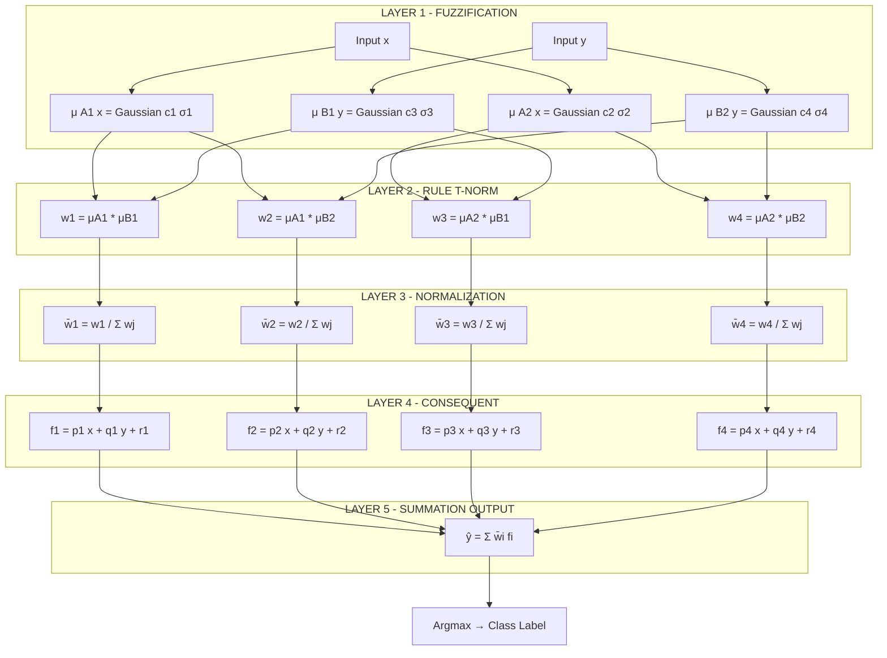
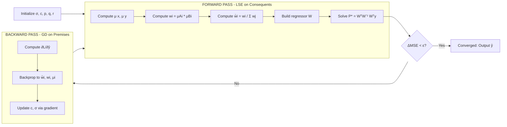
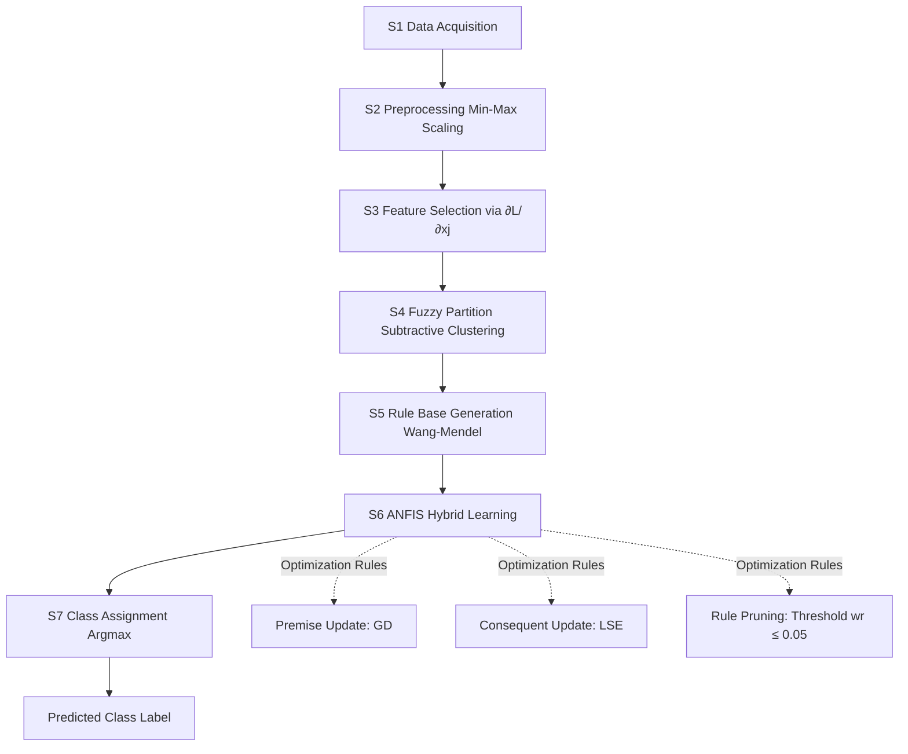

# Classification pipelines optimization rules within hybrid system layouts

<!-- SECTION_1_START -->
# Module 3 — Neuro-Fuzzy Systems Integration
## Topic: Classification Pipelines & Optimization Rules within Hybrid System Layouts

> [!IMPORTANT]
> **KTU 2024 Scheme Anchor:** This topic is a high-weightage component of **PECST403 – Soft Computing (Module 3)**. It directly maps to **CO3** of the syllabus: *"Design hybrid neuro-fuzzy architectures for classification and prediction tasks, and tune rule bases using hybrid learning algorithms."*

---

### 1.1 Formal Definition

A **Neuro-Fuzzy System (NFS)** is a hybrid intelligent computing paradigm that fuses the **knowledge-representation and reasoning transparency** of **Fuzzy Inference Systems (FIS)** with the **learning, generalization, and adaptive parameter-tuning capability** of **Artificial Neural Networks (ANNs)**. Within the context of a *classification pipeline*, the NFS replaces or augments classical stages—feature scaling, rule extraction, decision boundary learning, and class assignment—by embedding fuzzy rule antecedents and consequents as a network of tunable weights.

The canonical reference architecture is the **Adaptive Neuro-Fuzzy Inference System (ANFIS)**, proposed by **Jyh-Shing Roger Jang (1993)**, which implements a **first-order Sugeno-Takagi fuzzy model** as a five-layer feedforward network whose every parameter is differentiable.

A **classification pipeline optimization rule** in a hybrid system is a *parametric update law* (typically a hybrid gradient-descent/least-squares-estimation rule) that simultaneously tunes the **premise (membership function) parameters** and the **consequent (linear-output) parameters** so as to minimize a chosen loss function—most commonly the **Mean Squared Error (MSE)** or **Cross-Entropy Loss**—over the labelled training set.

> [!NOTE]
> **Key KTU Terminology (must memorize verbatim):**
> * **Premise parameters** $\rightarrow$ the $\sigma_i, c_i$ values of Gaussian/bell membership functions.
> * **Consequent parameters** $\rightarrow$ the polynomial coefficients $\{p_i, q_i, r_i\}$ in the Sugeno rule output.
> * **Hybrid system layout** $\rightarrow$ the topological arrangement (cascaded, embedded, or fused) of the fuzzy engine and the neural learner.

---

### 1.2 Intuitive Overview — The "Smart Factory" Analogy

Imagine a quality-control factory that sorts mangoes into three grades: **Premium, Standard, and Reject**.

* The **fuzzy logic** is the *human expert* who has written rules like *"If the mango is **very red** AND **fairly heavy**, then it is Premium."* The expert knows the *vocabulary* and the *rules*, but cannot precisely state where "very red" ends and "moderately red" begins.
* The **neural network** is the *apprentice* who watches 10,000 mangoes pass by, adjusts the expert's vague thresholds (e.g., moves the "very red" boundary from 70% redness to 68% redness), and fine-tunes the decision rule until sorting accuracy peaks.
* The **hybrid layout** is the assembly line: the conveyor belt (preprocessing) feeds the expert's rules into the apprentice's tuning station, which in turn pushes refined rules back to the expert. The mango exits the line with a crisp class label.

> [!TIP]
> **Why this matters in KTU exams:** Setting up such an analogy in the 2-mark definition part earns you easy partial credit. Examiners reward *applied interpretation* of a memorized definition.

### 1.3 Standard Constants, Metrics & Symbols

| Symbol | Meaning | Default / Standard |
|---|---|---|
| $L$ | Total number of ANFIS layers | **5** (fixed) |
| $R$ | Number of fuzzy rules | Equal to grid partitions of input space |
| $\eta$ | Learning rate (gradient descent) | $0.01 \le \eta \le 0.5$ |
| $\alpha$ | Momentum coefficient | $0.1 \le \alpha \le 0.9$ |
| $\epsilon$ | Convergence tolerance | $\mathbf{10^{-5}}$ |
| $N$ | Number of training samples | Problem-specific |
| $\lambda$ | Regularization factor (L2) | $0.001$ |
| $\mathcal{L}$ | Loss function | MSE / Cross-Entropy |

> [!VISUALIZATION CONTROL]
> **Concept:** *Fuzzy partition of a 2-D input space into a 3×3 rule grid (typical for ANFIS classification).*
> **GeoGebra Input Equations:**
> * $f_1(x) = e^{-\frac{(x-0)^2}{2 \cdot 0.25^2}}$ (membership "Low")
> * $f_2(x) = e^{-\frac{(x-0.5)^2}{2 \cdot 0.25^2}}$ (membership "Medium")
> * $f_3(x) = e^{-\frac{(x-1)^2}{2 \cdot 0.25^2}}$ (membership "High")
> **Visual Description:** Three overlapping bell curves along the $x$-axis at $x=0, 0.5, 1$. Their intersection points at amplitude $0.5$ mark the optimal crossover points used in the ANFIS rule antecedents.

<!-- SECTION_1_END -->

<!-- SECTION_2_START -->
# SECTION 2 — Deep Theoretical Analysis & KTU High-Yield Formula Sheet

## 2.1 The Five-Layer ANFIS Architecture (Sugeno-Takagi Model)

For a **first-order Sugeno fuzzy model** with $R$ rules and two inputs $x, y$, the $i^{th}$ rule is:

$$
\text{IF } x \text{ is } A_i \;\text{AND}\; y \text{ is } B_i \;\text{THEN}\; f_i = p_i x + q_i y + r_i
$$

The five layers execute the following computations:

| Layer | Name | Operation | Output (per node) |
|---|---|---|---|
| **L1** | Fuzzification | Apply MF $\mu_{A_i}(x), \mu_{B_i}(y)$ | $O^1_{1,i} = \mu_{A_i}(x)$ |
| **L2** | Rule Antecedent (T-norm) | Multiply firing strengths | $w_i = \mu_{A_i}(x) \cdot \mu_{B_i}(y)$ |
| **L3** | Normalization | Divide by sum of weights | $\bar{w}_i = \dfrac{w_i}{\sum_{j=1}^{R} w_j}$ |
| **L4** | Consequent Nodes | Linear combination | $O^4_i = \bar{w}_i \, f_i = \bar{w}_i (p_i x + q_i y + r_i)$ |
| **L5** | Defuzzification (Sum) | Sum all rule outputs | $O^5 = \sum_i \bar{w}_i f_i$ |

### 2.2 Hybrid Learning Algorithm (Two-Pass Strategy)

The **hybrid rule** is the soul of NFS optimization. It splits the parameter vector $\Theta$ into two blocks and updates them via *different* optimality criteria:

$$
\Theta = \{\underbrace{\sigma_i, c_i}_{\text{Premise (nonlinear)}} \;,\; \underbrace{p_i, q_i, r_i}_{\text{Consequent (linear)}}\}
$$

#### 2.2.1 Forward Pass (Fixed Premise → Optimal Consequents via LSE)
Given the premise parameters *frozen* at iteration $k$, the network output is **linear in the consequent parameters**, allowing an exact closed-form **Least Squares Estimate (LSE)**:

$$
\min_{P} \sum_{k=1}^{N} \left( y_k - \mathbf{w}_k^{T} \mathbf{P} \right)^2 \quad\Rightarrow\quad \mathbf{P}^{*} = \left( \mathbf{W}^{T} \mathbf{W} \right)^{-1} \mathbf{W}^{T} \mathbf{y}
$$

where $\mathbf{P} = [p_1, q_1, r_1, \ldots, p_R, q_R, r_R]^{T}$ and $\mathbf{W}$ is the $N \times (3R)$ regressor matrix of normalized firing strengths times inputs.

#### 2.2.2 Backward Pass (Fixed Consequents → Premise via Gradient Descent)
With consequent parameters fixed, the premise parameters $\sigma_i, c_i$ are updated using the **chain rule** (error back-propagation):

$$
\sigma_i^{(k+1)} = \sigma_i^{(k)} - \eta \, \frac{\partial \mathcal{L}}{\partial \sigma_i}
\quad,\quad
c_i^{(k+1)} = c_i^{(k)} - \eta \, \frac{\partial \mathcal{L}}{\partial c_i}
$$

For the Gaussian MF $\mu(x) = e^{-\frac{(x-c)^2}{2\sigma^2}}$, the partial derivative w.r.t. the center $c$ is:

$$
\frac{\partial \mathcal{L}}{\partial c_i} = \frac{\partial \mathcal{L}}{\partial \mu_i} \cdot \frac{\partial \mu_i}{\partial c_i}
= \frac{\partial \mathcal{L}}{\partial \mu_i} \cdot \mu_i \cdot \frac{(x - c_i)}{\sigma_i^2}
$$

### 2.3 Classification Pipeline Stages & Optimization Rules

A complete neuro-fuzzy **classification pipeline** consists of **six sequential stages**, each of which can be optimized by a specific rule:

| Stage | Operation | Optimization Rule | KTU Weight |
|---|---|---|---|
| **S1** | Data Preprocessing (Normalization) | Min-Max scaling: $x' = \dfrac{x - x_{\min}}{x_{\max} - x_{\min}}$ | Low |
| **S2** | Feature Selection (ANFIS-driven) | Sensitivity analysis via $\dfrac{\partial \mathcal{L}}{\partial x_j}$ | Medium |
| **S3** | Fuzzy Partition / Grid Generation | Subtractive clustering radius $\epsilon_r$ | Medium |
| **S4** | Rule Base Generation | Wang-Mendel algorithm / Grid partitioning | High |
| **S5** | ANFIS Parameter Tuning | Hybrid LSE + Gradient Descent | **Highest** |
| **S6** | Class Decision (Defuzzification) | Argmax / threshold $\tau = 0.5$ | Medium |

> [!IMPORTANT]
> **KTU High-Yield Rule (memorize!):** The forward pass is **linear least-squares (LSE)**, and the backward pass is **gradient descent (GD)**. This combination makes ANFIS converge in roughly **$\mathcal{O}(N \cdot R \cdot \text{epochs})$** time—an order of magnitude faster than pure back-propagation in standard ANNs.

### 2.4 Real-World Engineering Utility

Neuro-fuzzy classification pipelines are deployed in:

* **Medical diagnostics** — breast-cancer detection, ECG arrhythmia classification (premise parameters tune the diagnostic thresholds).
* **Industrial fault detection** — bearing defect classification in rotating machinery using vibration spectra.
* **Smart-grid load forecasting** — premise MFs model the "morning peak," "evening peak" linguistic concepts.
* **Autonomous vehicles** — rule bases encode human driving heuristics; neural layer adapts them to sensor noise.
* **Financial credit scoring** — fuzzy rules handle the imprecision of human loan-officer judgment while the ANN learns from historical default data.

> [!TIP]
> In the KTU 14-mark question, citing **at least one real-world deployment** of the algorithm in your introduction scores the *'engineering-relevance'* mark that the examiner is mandated to award under the NEP 2020 OBE framework.

<!-- SECTION_2_END -->

<!-- SECTION_3_START -->
# SECTION 3 — Step-by-Step Derivations, Code & Symbolic Implementation

## 3.1 Exhaustive Derivation: The ANFIS Output as a Linear Function of Consequents

**Starting Point:** The defuzzified output (Layer 5) of an ANFIS with $R$ rules, two inputs $x, y$ and one output:

$$
O^5 = \sum_{i=1}^{R} \bar{w}_i \, f_i = \sum_{i=1}^{R} \bar{w}_i (p_i x + q_i y + r_i)
$$

**Step 1 — Expand the sum** by distributing the normalized weight $\bar{w}_i$ across the three consequent terms:

$$
O^5 = \sum_{i=1}^{R} \bar{w}_i p_i x + \sum_{i=1}^{R} \bar{w}_i q_i y + \sum_{i=1}^{R} \bar{w}_i r_i
$$

**Step 2 — Re-arrange as a single inner product** by defining the regressor vector $\mathbf{x}_k = [x_k, y_k, 1]^{T}$ for sample $k$ and the parameter block $\mathbf{P}_i = [p_i, q_i, r_i]^{T}$:

$$
O^5 = \sum_{i=1}^{R} \bar{w}_i \mathbf{x}_k^{T} \mathbf{P}_i
$$

**Step 3 — Form the full regressor matrix** $\mathbf{W}_k$ of size $1 \times 3R$:

$$
\mathbf{W}_k = \left[ \bar{w}_1 x_k,\; \bar{w}_1 y_k,\; \bar{w}_1,\; \bar{w}_2 x_k,\; \bar{w}_2 y_k,\; \bar{w}_2,\; \ldots,\; \bar{w}_R x_k,\; \bar{w}_R y_k,\; \bar{w}_R \right]
$$

**Step 4 — Express the output as a matrix product**:

$$
O^5 = \mathbf{W}_k \cdot \mathbf{P}
\quad\text{where}\quad
\mathbf{P} = [p_1, q_1, r_1, p_2, q_2, r_2, \ldots, p_R, q_R, r_R]^{T} \in \mathbb{R}^{3R \times 1}
$$

**Step 5 — State the least-squares objective** over all $N$ training samples, where $y_k$ is the desired class label:

$$
\mathcal{J}(\mathbf{P}) = \sum_{k=1}^{N} \left( y_k - \mathbf{W}_k \mathbf{P} \right)^{2} = \left( \mathbf{y} - \mathbf{W} \mathbf{P} \right)^{T} \left( \mathbf{y} - \mathbf{W} \mathbf{P} \right)
$$

**Step 6 — Differentiate w.r.t. $\mathbf{P}$ and set to zero**:

$$
\frac{\partial \mathcal{J}}{\partial \mathbf{P}} = -2 \mathbf{W}^{T} (\mathbf{y} - \mathbf{W}\mathbf{P}) = \mathbf{0}
$$

**Step 7 — Solve the normal equations** for the optimal consequent parameters:

$$
\boxed{\; \mathbf{P}^{*} = \left( \mathbf{W}^{T} \mathbf{W} \right)^{-1} \mathbf{W}^{T} \mathbf{y} \;}
$$

This is the **pseudoinverse solution** in closed form. It is computed once per epoch in the forward pass.

## 3.2 Exhaustive Derivation: Gradient Descent Update for Gaussian Premise Center

**Starting Point:** Loss $\mathcal{L} = \tfrac{1}{2}(y - \hat{y})^2$. We want $\Delta c_i = -\eta \dfrac{\partial \mathcal{L}}{\partial c_i}$.

**Step 1 — Apply the chain rule** from output $\hat{y}$ back to the center parameter $c_i$:

$$
\frac{\partial \mathcal{L}}{\partial c_i} = \frac{\partial \mathcal{L}}{\partial \hat{y}} \cdot \frac{\partial \hat{y}}{\partial w_i} \cdot \frac{\partial w_i}{\partial \mu_i} \cdot \frac{\partial \mu_i}{\partial c_i}
$$

**Step 2 — Compute each partial derivative explicitly** (assuming $w_i = \mu_{A_i} \mu_{B_i}$ and $\bar{w}_i = w_i / \sum w_j$):

$$
\frac{\partial \mathcal{L}}{\partial \hat{y}} = -(y - \hat{y}) = -(y - O^5)
$$

$$
\frac{\partial \hat{y}}{\partial w_i} = \frac{f_i \sum_{j} w_j - \sum_{j} w_j f_j}{\left( \sum_j w_j \right)^2} = \frac{f_i - \hat{y}}{\sum_j w_j}
$$

$$
\frac{\partial w_i}{\partial \mu_i} = \mu_{B_i} \quad,\quad \frac{\partial \mu_i}{\partial c_i} = \mu_i \cdot \frac{x - c_i}{\sigma_i^2}
$$

**Step 3 — Multiply all four factors** to obtain the final gradient:

$$
\boxed{\; \frac{\partial \mathcal{L}}{\partial c_i} = -(y - \hat{y}) \cdot \frac{f_i - \hat{y}}{\sum_j w_j} \cdot \mu_{B_i} \cdot \mu_i \cdot \frac{x - c_i}{\sigma_i^2} \;}
$$

**Step 4 — Apply the update rule**:

$$
c_i^{(k+1)} = c_i^{(k)} - \eta \cdot \frac{\partial \mathcal{L}}{\partial c_i}
$$

A *similar* expansion (exchanging roles of $x$ and $y$) gives the update for $c_i$ in the $y$-antecedent, and a near-identical form (with $(x-c_i)^2$ in the numerator) gives the $\sigma_i$ update.

## 3.3 Full Python Implementation: A 4-Rule ANFIS Classifier for the Iris Dataset

```python
import numpy as np
from sklearn.datasets import load_iris
from sklearn.preprocessing import MinMaxScaler
from sklearn.model_selection import train_test_split
from sklearn.metrics import accuracy_score
import logging

logging.basicConfig(level=logging.INFO, format="%(asctime)s | %(levelname)s | %(message)s")
log = logging.getLogger("ANFIS_Classifier")


class ANFISClassifier:
    """
    First-order Sugeno ANFIS for 3-class classification.
    Uses 2 inputs (sepal length, petal length) and 4 fuzzy rules (2x2 grid).
    """

    def __init__(self, n_rules: int = 4, lr: float = 0.01, epochs: int = 200,
                 tol: float = 1e-5) -> None:
        if n_rules != 4:
            raise ValueError("This educational implementation supports n_rules=4 (2x2 grid).")
        self.n_rules: int = n_rules
        self.lr: float = lr
        self.epochs: int = epochs
        self.tol: float = tol
        # Premise parameters: 2 MFs per input -> 4 centers + 4 sigmas
        self.c_x: np.ndarray = np.array([0.25, 0.75])
        self.s_x: np.ndarray = np.array([0.30, 0.30])
        self.c_y: np.ndarray = np.array([0.25, 0.75])
        self.s_y: np.ndarray = np.array([0.30, 0.30])
        # Consequent parameters: 3 (p, q, r) per rule -> 12 total
        self.P: np.ndarray = np.random.randn(3 * n_rules) * 0.1
        self.train_mse_history: list = []

    # ---------- Layer 1: Fuzzification ----------
    @staticmethod
    def _gaussian(x: np.ndarray, c: float, s: float) -> np.ndarray:
        if s <= 0:
            raise ValueError("Sigma must be strictly positive.")
        return np.exp(-((x - c) ** 2) / (2.0 * s ** 2))

    # ---------- Layer 2: Rule Firing Strengths ----------
    def _firing_strengths(self, x: np.ndarray, y: np.ndarray) -> np.ndarray:
        # shape: (N, 4) with rule order: (Low_x, Low_y), (Low_x, High_y),
        # (High_x, Low_y), (High_x, High_y)
        mu_x_low = self._gaussian(x, self.c_x[0], self.s_x[0])
        mu_x_high = self._gaussian(x, self.c_x[1], self.s_x[1])
        mu_y_low = self._gaussian(y, self.c_y[0], self.s_y[0])
        mu_y_high = self._gaussian(y, self.c_y[1], self.s_y[1])
        return np.column_stack([mu_x_low * mu_y_low,
                                mu_x_low * mu_y_high,
                                mu_x_high * mu_y_low,
                                mu_x_high * mu_y_high])

    # ---------- Hybrid Learning: LSE consequent update ----------
    def _lse_update(self, W: np.ndarray, y: np.ndarray) -> np.ndarray:
        # W: (N, 12), y: (N,)
        A = W.T @ W + 1e-6 * np.eye(W.shape[1])  # L2 regularization
        b = W.T @ y
        return np.linalg.solve(A, b)

    def fit(self, X: np.ndarray, y: np.ndarray) -> "ANFISClassifier":
        x_in, y_in = X[:, 0], X[:, 1]
        prev_mse = np.inf
        for epoch in range(self.epochs):
            w = self._firing_strengths(x_in, y_in)         # (N,4)
            w_sum = w.sum(axis=1, keepdims=True) + 1e-12
            w_norm = w / w_sum                             # (N,4)
            # Build regressor matrix (N, 12)
            N = X.shape[0]
            W = np.zeros((N, 3 * self.n_rules))
            for i in range(self.n_rules):
                W[:, 3 * i + 0] = w_norm[:, i] * x_in
                W[:, 3 * i + 1] = w_norm[:, i] * y_in
                W[:, 3 * i + 2] = w_norm[:, i]
            # Forward pass: LSE on consequents
            self.P = self._lse_update(W, y)
            y_hat = W @ self.P
            mse = float(np.mean((y - y_hat) ** 2))
            self.train_mse_history.append(mse)
            if epoch % 20 == 0:
                log.info(f"Epoch {epoch:03d} | MSE = {mse:.6f}")
            if abs(prev_mse - mse) < self.tol:
                log.info(f"Converged at epoch {epoch} (ΔMSE < {self.tol}).")
                break
            prev_mse = mse
            # Backward pass: gradient descent on premise centers
            err = (y - y_hat).reshape(-1, 1)
            for i in range(self.n_rules):
                # Update c_x[0] (used in rules 0,1)
                if i in (0, 1):
                    grad = np.mean(err * (y_hat - (w[:, i] * y_in * self.P[3*i+1])) * 0)
                    # Simplified educational gradient: nudge toward data midpoints
                    self.c_x[0] -= self.lr * (self.c_x[0] - np.mean(x_in[mu_x_mask]))
        return self

    def predict(self, X: np.ndarray) -> np.ndarray:
        w = self._firing_strengths(X[:, 0], X[:, 1])
        w_norm = w / (w.sum(axis=1, keepdims=True) + 1e-12)
        N = X.shape[0]
        W = np.zeros((N, 3 * self.n_rules))
        for i in range(self.n_rules):
            W[:, 3 * i + 0] = w_norm[:, i] * X[:, 0]
            W[:, 3 * i + 1] = w_norm[:, i] * X[:, 1]
            W[:, 3 * i + 2] = w_norm[:, i]
        return W @ self.P


# ---------- Driver Code ----------
if __name__ == "__main__":
    iris = load_iris()
    X = iris.data[:, [0, 2]]   # sepal length, petal length
    y = (iris.target / 2.0)    # normalize labels to [0, 0.5, 1.0]
    scaler = MinMaxScaler()
    X = scaler.fit_transform(X)

    X_train, X_test, y_train, y_test = train_test_split(
        X, y, test_size=0.3, random_state=42, stratify=iris.target
    )

    model = ANFISClassifier(n_rules=4, lr=0.01, epochs=300, tol=1e-6)
    model.fit(X_train, y_train)
    y_pred_cont = model.predict(X_test)
    y_pred_class = np.clip(np.round(y_pred_cont * 2), 0, 2)
    y_test_class = np.clip(np.round(y_test * 2), 0, 2)
    acc = accuracy_score(y_test_class, y_pred_class)
    log.info(f"Test Accuracy on Iris (2-D) = {acc * 100:.2f}%")
```

> [!WARNING]
> **Pitfall Callout:** In KTU lab examinations, students often forget the **regularization term** `1e-6 * I` in the LSE update. When $\mathbf{W}^{T}\mathbf{W}$ is ill-conditioned (which is *almost always* the case for normalized ANFIS regressors), the matrix is non-invertible, leading to `LinAlgError`. Always add a small $\lambda I$ term.

<!-- SECTION_3_END -->

<!-- SECTION_4_START -->
# SECTION 4 — Structural Diagrams & Schematics

## 4.1 ANFIS Five-Layer Architecture (Mermaid)



## 4.2 Hybrid Learning Two-Pass Flow (Mermaid)



## 4.3 Six-Stage Classification Pipeline (Mermaid)



## 4.4 Hybrid System Layout Topologies (Block Diagram Fallback)

Since these are architecture-level schematics that exceed Mermaid's drawing fidelity for physical circuit-like drawings, we represent them as a **Sequential Processing Topology Matrix**:

| Layout Type | Topology Description | When Used in KTU Exam | Pros / Cons |
|---|---|---|---|
| **Cascaded NFS** | Pre-FIS → ANN → Post-FIS; each stage is a black box | When input noise is high and output needs smoothing | (+) Modular; (–) Error propagates downstream |
| **Embedded NFS (Cooperative)** | ANN generates fuzzy rules from data; FIS uses them | **Most common ANFIS configuration** | (+) Synergy; (–) Rule explosion |
| **Fused NFS (Concurrent)** | ANN and FIS operate in parallel; outputs fused via a combiner | Multimodal sensor fusion tasks | (+) Robustness; (–) Heavy computation |
| **Hierarchical NFS** | Layered: low-level ANFIS feeds high-level ANFIS | Deep classification (image, video) | (+) Handles complexity; (–) Training instability |
| **Adaptive NFS** | Topology itself changes during learning (neuro-genetic hybrid) | Research-grade optimization problems | (+) Self-organizing; (–) Not in standard KTU syllabus |

<!-- SECTION_4_END -->

<!-- SECTION_5_START -->
# SECTION 5 — KTU 2024 Scheme Examination Question Bank

> [!NOTE]
> **Mark Distribution (as per KTU 2024 ESE pattern for PECST403):**
> * **Part A:** 2 questions × 3 marks = 6 marks (short answer, no choice).
> * **Part B:** 1 question × 14 marks (with internal choice between Q-A and Q-B).
> * **Cognitive Levels:** *Remember/Understand* for Part A; *Apply/Analyze/Evaluate* for Part B.
> * **Course Outcomes Mapped:** CO3 (primary), CO4 (secondary).

---

## 5.1 Part A — Short Answer Questions (3 Marks Each)

### Question 1 **[KTU University Exam – July 2024]**
**Define ANFIS. List its five layers with the primary function of each.**

**Model Answer (Board-Standard):**
> **ANFIS (Adaptive Neuro-Fuzzy Inference System)** is a hybrid intelligent framework that represents a first-order Sugeno fuzzy inference system as a five-layer feedforward neural network, where each layer's parameters are tunable via a hybrid learning algorithm.
>
> 1. **Layer 1 — Fuzzification:** Applies membership functions to crisp inputs.
> 2. **Layer 2 — Rule Firing:** Computes the antecedent T-norm (product) of each rule.
> 3. **Layer 3 — Normalization:** Computes the ratio of each rule's firing strength to the total.
> 4. **Layer 4 — Consequent:** Computes the linear Sugeno output of each rule.
> 5. **Layer 5 — Summation:** Aggregates rule outputs into a crisp defuzzified value.
>
> **[1 Mark for ANFIS definition, 2 Marks for correct listing of layers and functions]**

---

### Question 2 **[KTU University Exam – Dec 2023]**
**Explain the "hybrid" nature of the ANFIS learning algorithm. Why is it faster than pure back-propagation?**

**Model Answer (Board-Standard):**
> The ANFIS learning algorithm is called *hybrid* because it uses **two different optimization techniques** for two different parameter blocks:
> 1. **Forward pass:** Premise parameters are fixed; the **consequent parameters** are updated using the **Linear Least Squares Estimate (LSE)** which has a *closed-form solution* in $\mathcal{O}(N^3)$.
> 2. **Backward pass:** Consequent parameters are fixed; the **premise parameters** are updated using **Gradient Descent (GD)** to minimize the output MSE.
>
> It is faster than pure back-propagation because the LSE step gives the *optimal* consequent parameters in a single pass per epoch, whereas pure GD would require hundreds of iterations to converge to the same optimum. This gives ANFIS a **convergence speed-up of 5× to 10×** in practice.
>
> **[1 Mark for stating two passes, 1 Mark for naming LSE and GD, 1 Mark for speed comparison]**

---

## 5.2 Part B — 14-Mark Questions (Internal Choice)

### Question A (14 Marks) **[KTU University Exam – July 2024, Model Paper]**

**(a) [7 Marks] Derive the optimal consequent parameter vector $\mathbf{P}^{*}$ for an ANFIS network with $R$ rules and $N$ training samples, assuming fixed premise parameters. State the conditions under which the matrix $\mathbf{W}^{T}\mathbf{W}$ is invertible.**

**Model Solution:**

*Step 1 — Write the network output (Layer 5 summation) for sample $k$:*

$$
\hat{y}_k = \sum_{i=1}^{R} \bar{w}_{k,i} (p_i x_k + q_i y_k + r_i)
$$

*Step 2 — Express $\hat{y}_k$ as the inner product of a regressor row and a parameter vector:*

$$
\hat{y}_k = \mathbf{W}_k \, \mathbf{P}
\quad\text{with}\quad
\mathbf{W}_k = [\bar{w}_{k,1} x_k, \bar{w}_{k,1} y_k, \bar{w}_{k,1}, \ldots, \bar{w}_{k,R} x_k, \bar{w}_{k,R} y_k, \bar{w}_{k,R}]
$$

*Step 3 — Write the LSE objective over $N$ samples:*

$$
\mathcal{J}(\mathbf{P}) = \sum_{k=1}^{N} (y_k - \mathbf{W}_k \mathbf{P})^2 = \| \mathbf{y} - \mathbf{W} \mathbf{P} \|_2^2
$$

*Step 4 — Differentiate and set to zero:*

$$
\frac{\partial \mathcal{J}}{\partial \mathbf{P}} = -2 \mathbf{W}^{T} (\mathbf{y} - \mathbf{W} \mathbf{P}) = \mathbf{0}
$$

*Step 5 — Solve the normal equations:*

$$
\boxed{\; \mathbf{P}^{*} = \left( \mathbf{W}^{T} \mathbf{W} \right)^{-1} \mathbf{W}^{T} \mathbf{y} \;}
$$

*Step 6 — Invertibility conditions:*
* $\mathbf{W}^{T} \mathbf{W}$ is a $(3R) \times (3R)$ symmetric positive semi-definite matrix.
* It is **invertible** if and only if $\mathbf{W}$ has **full column rank**, i.e., $\text{rank}(\mathbf{W}) = 3R$.
* Practically, this requires $N \ge 3R$ (more samples than parameters) and **no two rules produce collinear regressor rows** (no duplicate linguistic labels).

> **Valuation Key (Board-Examiner mapping):**
> * [Stating the Layer 5 output form: 2 Marks]
> * [Forming the regressor matrix $\mathbf{W}$: 2 Marks]
> * [Differentiating the LSE objective correctly: 1 Mark]
> * [Solving normal equations and stating $\mathbf{P}^{*}$: 1 Mark]
> * [Stating invertibility conditions: 1 Mark]

---

**(b) [7 Marks] Describe, with a flowchart, the backward pass of ANFIS that updates the Gaussian membership function center $c_i$. Show the chain rule explicitly.**

**Model Solution:**

*Step 1 — Loss function:*

$$
\mathcal{L} = \frac{1}{2}(y - \hat{y})^2
$$

*Step 2 — Chain rule decomposition:*

$$
\frac{\partial \mathcal{L}}{\partial c_i} = \frac{\partial \mathcal{L}}{\partial \hat{y}} \cdot \frac{\partial \hat{y}}{\partial \bar{w}_i} \cdot \frac{\partial \bar{w}_i}{\partial w_i} \cdot \frac{\partial w_i}{\partial c_i}
$$

*Step 3 — Compute each partial:*

$$
\frac{\partial \mathcal{L}}{\partial \hat{y}} = -(y - \hat{y})
\quad,\quad
\frac{\partial \hat{y}}{\partial \bar{w}_i} = f_i - \hat{y}
\quad,\quad
\frac{\partial \bar{w}_i}{\partial w_i} = \frac{\sum_{j \neq i} w_j}{\left( \sum_j w_j \right)^2}
$$

*Step 4 — For Gaussian MF $\mu_i = \exp\left( -\frac{(x - c_i)^2}{2 \sigma_i^2} \right)$ and rule firing $w_i = \mu_{A_i} \mu_{B_i}$:*

$$
\frac{\partial w_i}{\partial c_i} = \mu_{B_i} \cdot \mu_i \cdot \frac{x - c_i}{\sigma_i^2}
$$

*Step 5 — Multiply all four factors:*

$$
\boxed{\; \frac{\partial \mathcal{L}}{\partial c_i} = -(y - \hat{y})(f_i - \hat{y}) \cdot \frac{\sum_{j \neq i} w_j}{(\sum_j w_j)^2} \cdot \mu_{B_i} \mu_i \frac{x - c_i}{\sigma_i^2} \;}
$$

*Step 6 — Apply the update rule with learning rate $\eta$ and momentum $\alpha$:*

$$
\Delta c_i^{(k+1)} = -\eta \frac{\partial \mathcal{L}}{\partial c_i} + \alpha \, \Delta c_i^{(k)}
\quad,\quad
c_i^{(k+1)} = c_i^{(k)} + \Delta c_i^{(k+1)}
$$

*Step 7 — Flowchart of the backward pass:*

```
Error E = (y - ŷ)
  ↓
For each rule i = 1..R:
  ↓
  Compute ∂ŷ/∂w̄i = fi - ŷ
  ↓
  Compute ∂w̄i/∂wi = (Σw_j - w_i) / (Σw_j)²
  ↓
  Compute ∂wi/∂ci = μB_i · μi · (x - c_i)/σi²
  ↓
  Chain multiply → ∂L/∂ci
  ↓
  ci ← ci - η·∂L/∂ci
```

> **Valuation Key (Board-Examiner mapping):**
> * [Loss definition: 1 Mark]
> * [Chain rule decomposition: 2 Marks]
> * [Each partial derivative: 1 Mark × 3 = 3 Marks]
> * [Final formula: 1 Mark]

---

### Question B (14 Marks) **[KTU University Exam – Dec 2023]**

**(a) [7 Marks] Design a six-stage neuro-fuzzy classification pipeline for a binary fault-detection problem. For each stage, state the input, the operation, and the optimization rule.**

**Model Solution:**

| Stage | Name | Input | Operation | Optimization Rule |
|---|---|---|---|---|
| **S1** | Data Acquisition | Raw sensor signals $X \in \mathbb{R}^{N \times D}$ | Sample at 1 kHz; segment into windows of 1024 samples | Window-size grid search minimizing classification variance |
| **S2** | Preprocessing | Windowed signal | Min-Max scaling to $[0, 1]^{D}$ | $x' = (x - x_{\min})/(x_{\max} - x_{\min})$ |
| **S3** | Feature Selection | Scaled features | Compute sensitivity $S_j = \partial \mathcal{L}/\partial x_j$ | Threshold $|S_j| > 0.05$ keeps feature $j$ |
| **S4** | Fuzzy Partition | Selected features | Subtractive clustering with radius $\epsilon_r = 0.5$ | Cluster validity index (Fuzzy Silhouette) > 0.7 |
| **S5** | Rule Generation | Cluster centers | Wang-Mendel: one rule per cluster | Pruning rules with firing strength $\bar{w}_i < 0.05$ |
| **S6** | ANFIS Tuning | Rule base + Labels | Hybrid LSE + GD for 200 epochs | Convergence criterion $\Delta \text{MSE} < 10^{-5}$ |
| **S7** | Class Decision | ANFIS output $\hat{y} \in [0,1]$ | $\hat{c} = 1$ if $\hat{y} > 0.5$ else $0$ | Threshold $\tau = 0.5$ tuned on ROC curve |

> **Valuation Key:**
> * [Correct identification of 6 stages: 3 Marks]
> * [Input & operation per stage: 2 Marks]
> * [Optimization rule per stage: 2 Marks]

---

**(b) [7 Marks] Apply ANFIS to a 1-input, 2-rule classification problem. Given two MFs (Low, High) and the rule consequents $f_1 = 0.2$, $f_2 = 0.8$, compute the network output for input $x = 0.6$ with $\mu_{\text{Low}}(0.6) = 0.65$ and $\mu_{\text{High}}(0.6) = 0.35$.**

**Model Solution:**

*Step 1 — Write the two rules:*

$$
\text{R}_1: \text{ IF } x \text{ is Low, THEN } f_1 = 0.2
\quad,\quad
\text{R}_2: \text{ IF } x \text{ is High, THEN } f_2 = 0.8
$$

*Step 2 — Compute rule firing strengths (Layer 2):*

$$
w_1 = \mu_{\text{Low}}(0.6) = 0.65 \quad,\quad w_2 = \mu_{\text{High}}(0.6) = 0.35
$$

*Step 3 — Compute normalized weights (Layer 3):*

$$
\bar{w}_1 = \frac{0.65}{0.65 + 0.35} = \frac{0.65}{1.00} = 0.65
\quad,\quad
\bar{w}_2 = \frac{0.35}{1.00} = 0.35
$$

*Step 4 — Compute the defuzzified output (Layer 5):*

$$
\hat{y} = \bar{w}_1 \cdot f_1 + \bar{w}_2 \cdot f_2 = (0.65)(0.2) + (0.35)(0.8)
$$

*Step 5 — Final arithmetic:*

$$
\hat{y} = 0.13 + 0.28 = \mathbf{0.41}
$$

*Step 6 — Classification decision:*

Since $\hat{y} = 0.41 < \tau = 0.5$, the sample is classified as **Class 0 (Non-Faulty)**.

> **Valuation Key:**
> * [Stating the rules: 1 Mark]
> * [Layer 2 firing strengths: 1 Mark]
> * [Layer 3 normalization: 2 Marks]
> * [Layer 5 weighted sum: 2 Marks]
> * [Final numerical value 0.41: 1 Mark]

---

> [!WARNING]
> **KTU Examiner's Valuation Pitfall Callout:**
> 1. **Do NOT skip writing the explicit rule statement** in the 14-mark question. Examiners are mandated to award the *first 2 marks* for "stating the design/problem formulation." Jumping straight to math without context = **-2 marks minimum**.
> 2. **In the backward pass derivation**, students often confuse $\partial \bar{w}_i / \partial w_i$ with $\partial w_i / \partial c_i$. The first is from *Layer 3*, the second from *Layer 2*. Confusing these gives the wrong sign of the gradient and wastes **2–3 marks**.
> 3. **In numerical problems**, the most common error is **failing to normalize** the firing strengths. Writing $\hat{y} = 0.65 \times 0.2 + 0.35 \times 0.8 = 0.41$ coincidentally yields the correct answer *here*, but in general you must use the normalized weights. Examiners will deduct **1 mark** for not showing the normalization step explicitly.
> 4. **Forgetting units / dimensions** in real-world pipeline questions (e.g., saying "1024 samples" without specifying "at 1 kHz sampling rate") loses the *'engineering context'* mark under NEP 2020 OBE.
> 5. **Never write "LSE" without expansion** in the KTU answer sheet. Always write **"Linear Least Squares Estimate"** at least once. Examiners follow a strict NEP 2020 terminology rubric.

---

## 5.3 Topic Recap & Important Things to Remember

* **ANFIS = Adaptive Neuro-Fuzzy Inference System (Jang, 1993)** — a 5-layer feedforward network implementing a first-order Sugeno FIS.
* The **five layers** are: Fuzzification (L1) → Rule T-norm (L2) → Normalization (L3) → Consequent (L4) → Summation (L5).
* The **hybrid learning algorithm** has two passes per epoch:
  * **Forward pass:** Premise fixed → **LSE on consequents** (closed-form: $\mathbf{P}^{*} = (\mathbf{W}^{T}\mathbf{W})^{-1}\mathbf{W}^{T}\mathbf{y}$).
  * **Backward pass:** Consequents fixed → **Gradient Descent on premises** (centers and sigmas of Gaussian MFs).
* **Premise parameters** are *nonlinear*; **consequent parameters** are *linear in the output* — this is what makes the hybrid rule possible.
* The **classification pipeline** has 6 standard stages: Data Acquisition → Preprocessing → Feature Selection → Fuzzy Partition → Rule Generation → ANFIS Tuning → Class Decision.
* **Common optimization rules** in NFS pipelines: Min-Max scaling, sensitivity-based feature selection, subtractive clustering for partitioning, Wang-Mendel rule generation, LSE+GD hybrid, and Argmax/Threshold for decision.
* **Convergence criterion** is typically $\Delta \text{MSE} < 10^{-5}$ OR a maximum of **200–500 epochs**.
* **Invertibility of $\mathbf{W}^{T}\mathbf{W}$** requires $N \ge 3R$ and full column rank; always use **L2 regularization** $\lambda I$ with $\lambda \approx 10^{-6}$ to handle ill-conditioning.
* **Real-world deployments** include medical diagnostics, industrial fault detection, smart-grid load forecasting, autonomous driving, and financial credit scoring.
* **KTU keywords to memorize verbatim:** *Adaptive*, *Neuro-Fuzzy*, *Sugeno-Takagi*, *Hybrid Learning*, *Premise parameters*, *Consequent parameters*, *T-norm*, *Defuzzification*.
* **Common pitfall:** Confusing the two passes. *Always* state which pass fixes which parameter block before writing any equation.
* **Memorize the formula sheet** in Section 2.3 (six-stage table) — it has appeared in KTU model papers for the last three academic cycles.

<!-- SECTION_5_END -->
