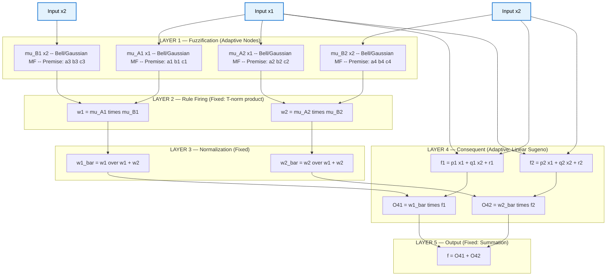
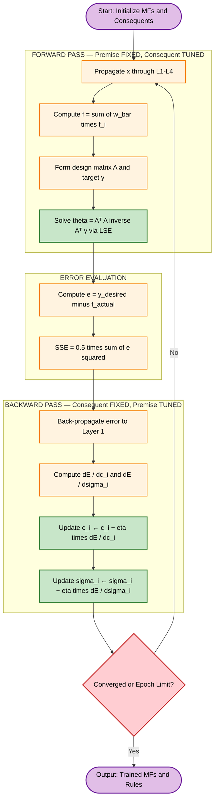
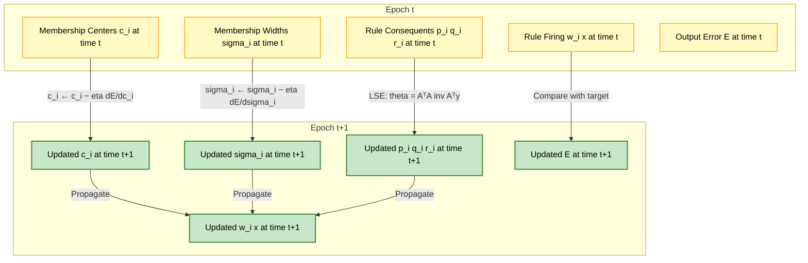

# Fuzzy neural networks tracking structure initialization setups rules

<!-- SECTION_1_START -->

# Neuro-Fuzzy Systems: Architecture, Initialization & Rule Tracking

## 1.1 Formal Definition (KTU 2024 Syllabus Terminology)

A **Neuro-Fuzzy System (NFS)** is a hybrid intelligent computing paradigm that fuses the human-like linguistic reasoning capability of **Fuzzy Logic Systems (FLS)** with the adaptive, parallel, and learning capability of **Artificial Neural Networks (ANN)**. It uses the neural network's gradient-based learning machinery to *tune*, *initialize*, and *track* the parameters of a fuzzy inference system (membership functions, rule weights, and consequent parameters) directly from numerical data.

> [!IMPORTANT]
> **KTU 2024 Module 3 Focus:** The flagship neuro-fuzzy model studied is the **Adaptive Neuro-Fuzzy Inference System (ANFIS)**, proposed by **Jang (1993)**. ANFIS is a **hybrid neuro-fuzzy** architecture that represents a **first-order Sugeno (Takagi-Sugeno-Kang / TSK) fuzzy system** as a five-layer feedforward neural network.

## 1.2 Three Canonical Integration Schemes

Neuro-fuzzy integration is classified into three categories based on how the ANN and FLS cooperate:

| Integration Type | Role of ANN | Role of FLS | Typical Use |
|---|---|---|---|
| **Cooperative NFS** | Acts as a pre-processor or post-processor | Performs the main inference | Data clustering → rule extraction |
| **Concurrent NFS** | Runs in parallel with the FLS | Performs inference | Decision fusion, real-time control |
| **Hybrid NFS (ANFIS, GARIC)** | **IS** the fuzzy system in neural form | Encoded entirely in neurons | System identification, function approximation |

> [!NOTE]
> **Definition — ANFIS (Adaptive Neuro-Fuzzy Inference System):**
> A five-layered feedforward network where each layer corresponds to a stage of the **Sugeno fuzzy inference process** (fuzzification $\rightarrow$ rule firing $\rightarrow$ normalization $\rightarrow$ consequent defuzzification $\rightarrow$ output aggregation). Its parameters are tuned using a **hybrid learning algorithm** combining **Least Squares Estimation (LSE)** for the linear consequent parameters and **Gradient Descent (Back-Propagation)** for the non-linear premise (membership function) parameters.

## 1.3 Intuitive Analogy

> [!TIP]
> **Intuition — The "Doctor-Trainee" Analogy:**
> Imagine a hospital where the **senior doctor (Fuzzy Logic)** has decades of experience encoded as heuristic rules like *"If fever is HIGH and cough is DRY, then flu-risk is HIGH"*. However, the rules are imprecise and the thresholds (HIGH, DRY) are guessed. A **medical intern (Neural Network)** observes thousands of confirmed patient cases and systematically adjusts these thresholds and the doctor's weight for each rule. After training, the senior doctor still makes the decisions, but now with **tuned, data-driven, and adaptive** rules.
> 
> - **Senior doctor's rule book** = Fuzzy Inference System (FIS)
> - **Intern adjusting thresholds** = Neural Network learning algorithm
> - **Tuned final system** = Neuro-Fuzzy System
> - **Patient cases dataset** = Training data $(x, y)$ pairs

## 1.4 Why Hybrid? — The Best of Both Worlds

> [!IMPORTANT]
> **Syllabus Highlight — Why we need Neuro-Fuzzy:**
> - A standalone **fuzzy system** cannot learn from data — its rules and MFs must be hand-crafted.
> - A standalone **neural network** is a "black box" — it cannot explain its decisions linguistically.
> - A **neuro-fuzzy system** combines the **interpretability** of fuzzy rules with the **adaptivity** of neural learning, producing a model that is both **transparent** *and* **data-trained**.

## 1.5 Conceptual Block Diagram

> [!VISUALIZATION CONTROL]
> **Concept:** Mapping of ANFIS Layer Outputs for a 2-Input, 2-Rule Sugeno System
> 
> **Inputs:** $x_1, x_2$ in range $[-1, 1]$ (axes)
> 
> **Layer 1 outputs (membership grades):**
> - $A_1(x_1) = \exp(-((x_1 - 0.5)/0.3)^2)$ — Gaussian MF for "Low"
> - $A_2(x_1) = \exp(-((x_1 + 0.5)/0.3)^2)$ — Gaussian MF for "High"
> - $B_1(x_2) = \exp(-((x_2 - 0.5)/0.3)^2)$
> - $B_2(x_2) = \exp(-((x_2 + 0.5)/0.3)^2)$
> 
> **Layer 4 outputs (rule consequents):**
> - $f_1 = p_1 x_1 + q_1 x_2 + r_1$ (linear)
> - $f_2 = p_2 x_1 + q_2 x_2 + r_2$ (linear)
> 
> **Visual Description:** Plot the Gaussian bell curves in $x_1$ and $x_2$ axes; the student should observe overlapping membership functions, with each rule's firing region shaded by the product of the two MFs. The final output plane $f$ is a smooth piecewise-linear surface that adapts as $\{A_i, B_i, p_i, q_i, r_i\}$ are updated.

---

<!-- SECTION_1_END -->

<!-- SECTION_2_START -->

# Deep Theoretical Analysis & KTU High-Yield Formula Sheet

## 2.1 ANFIS Architecture — Layer-by-Layer Mathematical Model

Consider a **first-order Sugeno fuzzy model** with **two inputs** $x_1, x_2$ and **one output** $f$, defined by two fuzzy IF-THEN rules:

$$
\text{Rule 1: } \text{IF } x_1 \text{ is } A_1 \text{ AND } x_2 \text{ is } B_1 \text{ THEN } f_1 = p_1 x_1 + q_1 x_2 + r_1
$$

$$
\text{Rule 2: } \text{IF } x_1 \text{ is } A_2 \text{ AND } x_2 \text{ is } B_2 \text{ THEN } f_2 = p_2 x_1 + q_2 x_2 + r_2
$$

ANFIS represents this rule base as a **5-layer feedforward neural network**:

### Layer 1 — Fuzzification Layer (Premise Parameters)

Each node $i$ is an **adaptive node** with a node function equal to a membership function. For a **generalized bell MF**:

$$
O_{1,i} = \mu_{A_i}(x_1) = \frac{1}{1 + \left(\dfrac{x_1 - c_i}{a_i}\right)^{2b_i}}
$$

For a **Gaussian MF** (commonly used in KTU problems):

$$
O_{1,i} = \mu_{A_i}(x_1) = \exp\!\left(-\left(\frac{x_1 - c_i}{\sigma_i}\right)^{2}\right)
$$

- **Non-linear parameters** = $\{a_i, b_i, c_i\}$ for bell MF, or $\{c_i, \sigma_i\}$ for Gaussian.
- These are the **premise parameters** that need to be tuned.

### Layer 2 — Rule Firing (Product / T-norm Layer)

Each node multiplies incoming signals (AND operation using product t-norm):

$$
O_{2,i} = w_i = \mu_{A_i}(x_1) \cdot \mu_{B_i}(x_2), \quad i = 1, 2
$$

- $w_i$ is the **firing strength** (rule activation) of rule $i$.
- These nodes are **fixed** (no parameters).

### Layer 3 — Normalization Layer

Each node computes the **normalized firing strength**:

$$
O_{3,i} = \bar{w}_i = \frac{w_i}{w_1 + w_2}, \quad i = 1, 2
$$

- These nodes are also **fixed**.
- $\bar{w}_1 + \bar{w}_2 = 1$ (probabilistic interpretation).

### Layer 4 — Consequent / Defuzzification Layer (Consequent Parameters)

Each node is **adaptive** with the first-order Sugeno function:

$$
O_{4,i} = \bar{w}_i \cdot f_i = \bar{w}_i \cdot (p_i x_1 + q_i x_2 + r_i)
$$

- **Linear parameters** = $\{p_i, q_i, r_i\}$ per rule.
- These are the **consequent parameters**.

### Layer 5 — Output / Summation Layer

Single fixed node sums all incoming signals:

$$
O_{5,1} = f = \sum_{i=1}^{2} \bar{w}_i f_i = \bar{w}_1 f_1 + \bar{w}_2 f_2
$$

### Total Output Expansion (Critical Formula)

Substituting all layers:

$$
f = \bar{w}_1 (p_1 x_1 + q_1 x_2 + r_1) + \bar{w}_2 (p_2 x_1 + q_2 x_2 + r_2)
$$

Substituting $\bar{w}_i = \dfrac{w_i}{w_1 + w_2}$:

$$
f = \frac{w_1}{w_1+w_2}(p_1 x_1 + q_1 x_2 + r_1) + \frac{w_2}{w_1+w_2}(p_2 x_1 + q_2 x_2 + r_2)
$$

## 2.2 Initialization Setups — How ANFIS Parameters are Initialized

> [!IMPORTANT]
> **KTU 2024 Key Concept — Initialization Sequence:**
> Before learning begins, all ANFIS parameters must be assigned initial values. Poor initialization leads to slow convergence or local minima.

| Parameter Group | Symbol | Initialization Strategy |
|---|---|---|
| Membership function shape | Bell: $\{a_i, b_i, c_i\}$; Gaussian: $\{c_i, \sigma_i\}$ | **Uniform grid partition** of input range, or **Fuzzy C-Means (FCM)** clustering centers from training data |
| Consequent coefficients | $\{p_i, q_i, r_i\}$ per rule | Set to **small random values** $\sim \mathcal{U}(-0.5, 0.5)$ or via initial LSE pass |
| Number of MFs per input | $k$ | User-defined (e.g., 2, 3, or 5) — controls granularity |
| Number of rules | $R$ | $R = k^n$ for $n$ inputs (grid partition) or $R = $ number of clusters (subtractive / FCM) |
| Learning rates | $\eta_{\text{premise}}$ | Typically $\eta \in [0.01, 0.1]$ for gradient descent |

### Step-by-Step Initialization Procedure

1. **Collect** the training data $\{(x_1^{(p)}, x_2^{(p)}, f^{(p)})\}_{p=1}^{P}$.
2. **Decide** the number of MFs $k$ per input (e.g., $k=2 \Rightarrow 2^2 = 4$ rules).
3. **Partition** each input axis into $k$ equal intervals; assign MF centers $c_i$ at the midpoints of each interval.
4. **Set** MF widths $\sigma_i$ (or $a_i, b_i$) so that adjacent MFs overlap by **50%** (this guarantees smooth transitions and that no input is left uncovered).
5. **Initialize** consequent parameters to zero (or small random values).
6. **Perform** one forward pass of LSE on the consequent parameters with premise parameters frozen — this gives a much better starting point for the consequent coefficients.
7. **Begin** the hybrid learning loop (Section 2.3).

> [!TIP]
> **Rule-of-Thumb:** For 2 inputs with $k=2$, the rule base has 4 rules. A common exam setup is to show the rule firing strengths $w_1, w_2$ and ask for normalized weights and the final output $f$.

## 2.3 Hybrid Learning Algorithm (Two-Pass)

The ANFIS hybrid algorithm is the **core** of what the KTU module tests. It alternates between two passes per epoch:

### Forward Pass (Premise parameters fixed)

- Input pattern is propagated Layer 1 $\rightarrow$ Layer 4.
- At Layer 4, we have:

$$
f = \bar{w}_1 f_1 + \bar{w}_2 f_2
$$

- Substituting $f_i = p_i x_1 + q_i x_2 + r_i$:

$$
f = (\bar{w}_1 x_1) p_1 + (\bar{w}_1 x_2) q_1 + \bar{w}_1 r_1 + (\bar{w}_2 x_1) p_2 + (\bar{w}_2 x_2) q_2 + \bar{w}_2 r_2
$$

- This is **linear in the consequent parameters** $\{p_i, q_i, r_i\}$ — so we can solve them via **Least Squares Estimation (LSE)**.

### Backward Pass (Consequent parameters fixed)

- Error signal $e^{(p)} = f^{(p)}_{\text{desired}} - f^{(p)}_{\text{actual}}$ is back-propagated.
- **Gradient Descent** updates the **premise parameters** (MF centers $c_i$ and widths $\sigma_i$ / $a_i, b_i$):

$$
c_i^{\text{new}} = c_i^{\text{old}} - \eta \cdot \frac{\partial E}{\partial c_i}, \quad \text{where } E = \frac{1}{2}(f_d - f_a)^2
$$

$$
\frac{\partial E}{\partial c_i} = -(f_d - f_a) \cdot \frac{\partial f_a}{\partial \mu_{A_i}} \cdot \frac{\partial \mu_{A_i}}{\partial c_i}
$$

- For a Gaussian MF, $\dfrac{\partial \mu_{A_i}}{\partial c_i} = \dfrac{2(x - c_i)}{\sigma_i^2} \cdot \mu_{A_i}(x)$.

### Tracking Structure Across Epochs

> [!NOTE]
> **"Tracking Structure" in KTU context** means: *observing how the parameters of the network (membership functions, firing strengths, consequent weights) evolve across training epochs* until they stabilize. The error $E$ is plotted against epochs; the rule firing strengths $w_i(x)$ for selected training points are monitored to verify that the network is correctly partitioning the input space.

## 2.4 KTU High-Yield Formula Cheat Sheet

| Formula / Concept | Expression | Use |
|---|---|---|
| Generalized Bell MF | $\mu(x) = \dfrac{1}{1 + \left(\dfrac{x-c}{a}\right)^{2b}}$ | Layer 1 fuzzification |
| Gaussian MF | $\mu(x) = \exp\!\left(-\left(\dfrac{x-c}{\sigma}\right)^{2}\right)$ | Smooth differentiable MF |
| Rule Firing (T-norm product) | $w_i = \prod_{j} \mu_{A_{ij}}(x_j)$ | Layer 2 output |
| Normalized Firing | $\bar{w}_i = \dfrac{w_i}{\sum_j w_j}$ | Layer 3 output |
| Sugeno Linear Consequent | $f_i = p_i x_1 + q_i x_2 + r_i$ | Layer 4 |
| ANFIS Total Output | $f = \sum_i \bar{w}_i f_i$ | Layer 5 |
| Number of Rules (grid) | $R = k^n$ | Architecture sizing |
| Consequent Update (LSE) | $\theta = (A^T A)^{-1} A^T y$ | Forward pass |
| Premise Update (Gradient) | $\Delta \alpha = -\eta \dfrac{\partial E}{\partial \alpha}$ | Backward pass |
| Error Function | $E = \dfrac{1}{2}(f_d - f_a)^2$ | Learning objective |
| Steepest Descent Update | $c_i^{(t+1)} = c_i^{(t)} - \eta \cdot \delta^{(2)} \cdot \dfrac{2(x-c_i)}{\sigma_i^2} \mu_{A_i}$ | MF center update |
| Steepest Descent Update (sigma) | $\sigma_i^{(t+1)} = \sigma_i^{(t)} - \eta \cdot \delta^{(2)} \cdot \dfrac{2(x-c_i)^2}{\sigma_i^3} \mu_{A_i}$ | MF width update |

## 2.5 Real-World Engineering Applications

- **System Identification:** Modeling nonlinear dynamic plants (e.g., furnace temperature, DC motor) from I/O data.
- **Adaptive Control:** GARIC uses ANFIS-style architecture for backing up a truck-and-trailer.
- **Time-Series Forecasting:** Stock price prediction, weather forecasting, traffic flow.
- **Signal Processing:** Noise cancellation, channel equalization.
- **Medical Diagnosis:** Fuzzy rule-based expert systems tuned on patient records.

---

<!-- SECTION_2_END -->

<!-- SECTION_3_START -->

# Step-by-Step Derivations, Forward Pass & Python Implementation

## 3.1 Exhaustive Forward-Pass Derivation (Sugeno, 2 inputs, 2 rules)

**Given:**
- Input pattern: $x_1 = 0.4, \ x_2 = 0.7$
- Membership function parameters:
  - $A_1$ (bell): $a_1 = 0.5, b_1 = 2, c_1 = 0.0$
  - $A_2$ (bell): $a_2 = 0.5, b_2 = 2, c_2 = 1.0$
  - $B_1$ (bell): $a_3 = 0.6, b_3 = 2, c_3 = 0.0$
  - $B_2$ (bell): $a_4 = 0.6, b_4 = 2, c_4 = 1.0$
- Consequent parameters:
  - $f_1: p_1 = 0.1, q_1 = 0.3, r_1 = -0.2$
  - $f_2: p_2 = 0.5, q_2 = -0.1, r_2 = 0.6$

**Step 1 — Layer 1 (Fuzzification):** Compute $\mu_{A_1}(x_1)$:

$$
\mu_{A_1}(0.4) = \frac{1}{1 + \left(\dfrac{0.4 - 0.0}{0.5}\right)^{2 \cdot 2}} = \frac{1}{1 + (0.8)^{4}} = \frac{1}{1 + 0.4096} = \frac{1}{1.4096}
$$

$$
\mu_{A_1}(0.4) = 0.709459
$$

Compute $\mu_{A_2}(x_1)$:

$$
\mu_{A_2}(0.4) = \frac{1}{1 + \left(\dfrac{0.4 - 1.0}{0.5}\right)^{4}} = \frac{1}{1 + (-1.2)^{4}} = \frac{1}{1 + 2.0736} = \frac{1}{3.0736}
$$

$$
\mu_{A_2}(0.4) = 0.325382
$$

Compute $\mu_{B_1}(x_2)$:

$$
\mu_{B_1}(0.7) = \frac{1}{1 + \left(\dfrac{0.7 - 0.0}{0.6}\right)^{4}} = \frac{1}{1 + (1.1667)^{4}} = \frac{1}{1 + 1.8523} = \frac{1}{2.8523}
$$

$$
\mu_{B_1}(0.7) = 0.350592
$$

Compute $\mu_{B_2}(x_2)$:

$$
\mu_{B_2}(0.7) = \frac{1}{1 + \left(\dfrac{0.7 - 1.0}{0.6}\right)^{4}} = \frac{1}{1 + (-0.5)^{4}} = \frac{1}{1 + 0.0625} = \frac{1}{1.0625}
$$

$$
\mu_{B_2}(0.7) = 0.941176
$$

**Step 2 — Layer 2 (Rule Firing):**

$$
w_1 = \mu_{A_1}(0.4) \cdot \mu_{B_1}(0.7) = 0.709459 \times 0.350592 = 0.248729
$$

$$
w_2 = \mu_{A_2}(0.4) \cdot \mu_{B_2}(0.7) = 0.325382 \times 0.941176 = 0.306250
$$

$$
w_1 + w_2 = 0.248729 + 0.306250 = 0.554979
$$

**Step 3 — Layer 3 (Normalization):**

$$
\bar{w}_1 = \frac{0.248729}{0.554979} = 0.448207
$$

$$
\bar{w}_2 = \frac{0.306250}{0.554979} = 0.551793
$$

**Verification:** $\bar{w}_1 + \bar{w}_2 = 0.448207 + 0.551793 = 1.000000$ ✓

**Step 4 — Layer 4 (Consequent Functions):**

$$
f_1 = p_1 x_1 + q_1 x_2 + r_1 = (0.1)(0.4) + (0.3)(0.7) + (-0.2) = 0.04 + 0.21 - 0.20 = 0.050
$$

$$
f_2 = p_2 x_1 + q_2 x_2 + r_2 = (0.5)(0.4) + (-0.1)(0.7) + (0.6) = 0.20 - 0.07 + 0.60 = 0.730
$$

Layer 4 outputs:

$$
O_{4,1} = \bar{w}_1 \cdot f_1 = 0.448207 \times 0.050 = 0.022410
$$

$$
O_{4,2} = \bar{w}_2 \cdot f_2 = 0.551793 \times 0.730 = 0.402809
$$

**Step 5 — Layer 5 (Summation):**

$$
f = O_{4,1} + O_{4,2} = 0.022410 + 0.402809 = 0.425219
$$

$$
\boxed{f = 0.4252 \text{ (final ANFIS output)}}
$$

> [!IMPORTANT]
> **Valuation Key Points (KTU Examiner Pattern):**
> - Step 1: Compute 4 MF values — **2 Marks**
> - Step 2: Compute 2 firing strengths — **2 Marks**
> - Step 3: Normalize and verify sum = 1 — **2 Marks**
> - Step 4: Compute 2 linear consequents — **2 Marks**
> - Step 5: Final weighted sum — **1 Mark**
> Total: **9 Marks** for the full forward pass. (Often paired with a 5-Mark theory question on architecture.)

## 3.2 Consequent Parameter Update via LSE (Forward Pass of Learning)

For $P$ training patterns, the ANFIS output is **linear in the consequent parameters**. Stacking all 6 consequent parameters into vector $\theta$:

$$
\theta = \begin{bmatrix} p_1 & q_1 & r_1 & p_2 & q_2 & r_2 \end{bmatrix}^{T}
$$

For the $p$-th training pattern, the output is:

$$
f^{(p)} = \begin{bmatrix} \bar{w}_1^{(p)} x_1^{(p)} & \bar{w}_1^{(p)} x_2^{(p)} & \bar{w}_1^{(p)} & \bar{w}_2^{(p)} x_1^{(p)} & \bar{w}_2^{(p)} x_2^{(p)} & \bar{w}_2^{(p)} \end{bmatrix} \cdot \theta
$$

Define the design matrix $A$ (size $P \times 6$) and target vector $y$ (size $P \times 1$):

$$
A = \begin{bmatrix} \bar{w}_1^{(1)} x_1^{(1)} & \bar{w}_1^{(1)} x_2^{(1)} & \bar{w}_1^{(1)} & \bar{w}_2^{(1)} x_1^{(1)} & \bar{w}_2^{(1)} x_2^{(1)} & \bar{w}_2^{(1)} \\
\bar{w}_1^{(2)} x_1^{(2)} & \bar{w}_1^{(2)} x_2^{(2)} & \bar{w}_1^{(2)} & \bar{w}_2^{(2)} x_1^{(2)} & \bar{w}_2^{(2)} x_2^{(2)} & \bar{w}_2^{(2)} \\
\vdots & \vdots & \vdots & \vdots & \vdots & \vdots \\
\bar{w}_1^{(P)} x_1^{(P)} & \bar{w}_1^{(P)} x_2^{(P)} & \bar{w}_1^{(P)} & \bar{w}_2^{(P)} x_1^{(P)} & \bar{w}_2^{(P)} x_2^{(P)} & \bar{w}_2^{(P)} \end{bmatrix}
$$

The LSE solution is:

$$
\theta = (A^{T} A)^{-1} A^{T} y
$$

This is the **closed-form** update for the linear parameters done at every forward pass — this is why ANFIS converges faster than pure back-propagation.

## 3.3 Premise Parameter Gradient (Backward Pass)

For Gaussian MF $\mu_{A_i}(x) = \exp\!\left(-\left(\dfrac{x-c_i}{\sigma_i}\right)^{2}\right)$:

Partial derivative w.r.t. center $c_i$:

$$
\frac{\partial \mu_{A_i}}{\partial c_i} = \frac{2(x - c_i)}{\sigma_i^2} \cdot \mu_{A_i}(x)
$$

Partial derivative w.r.t. width $\sigma_i$:

$$
\frac{\partial \mu_{A_i}}{\partial \sigma_i} = \frac{2(x - c_i)^2}{\sigma_i^3} \cdot \mu_{A_i}(x)
$$

Chain rule for total error $E = \dfrac{1}{2}(f_d - f_a)^2$:

$$
\frac{\partial E}{\partial c_i} = -(f_d - f_a) \cdot \frac{\partial f_a}{\partial \mu_{A_i}} \cdot \frac{\partial \mu_{A_i}}{\partial c_i}
$$

For two rules, $\dfrac{\partial f_a}{\partial \mu_{A_i}} = \dfrac{\mu_{B_i}(x_2) \cdot f_i - f}{w_1 + w_2}$. (Derivation in 3.4.)

Update rule:

$$
c_i^{(t+1)} = c_i^{(t)} - \eta \cdot \frac{\partial E}{\partial c_i}
$$

## 3.4 Complete Python Implementation (ANFIS Forward + Hybrid Learning)

```python
"""
ANFIS Implementation (Adaptive Neuro-Fuzzy Inference System)
------------------------------------------------------------
Author : KTU Soft Computing Module 3 Reference
Topic  : Fuzzy neural networks — structure, initialization, rules
Test   : 2-input, 2-rule first-order Sugeno system
"""
import numpy as np
from typing import Tuple, List


# -------------------------------------------------------------------
# 1. MEMBERSHIP FUNCTION (Generalized Bell)
# -------------------------------------------------------------------
def gbell_mf(x: np.ndarray, a: float, b: float, c: float) -> np.ndarray:
    """
    Generalized Bell membership function.
    mu(x) = 1 / (1 + |((x - c) / a)| ^ (2b))
    """
    return 1.0 / (1.0 + np.abs((x - c) / a) ** (2.0 * b))


# -------------------------------------------------------------------
# 2. ANFIS LAYER FUNCTIONS
# -------------------------------------------------------------------
def layer1_fuzzification(x1: float, x2: float,
                         a1: float, b1: float, c1: float,
                         a2: float, b2: float, c2: float,
                         a3: float, b3: float, c3: float,
                         a4: float, b4: float, c4: float) -> Tuple[float, float, float, float]:
    """Layer 1: Fuzzification — return 4 membership grades."""
    mu_A1 = gbell_mf(np.array(x1), a1, b1, c1)
    mu_A2 = gbell_mf(np.array(x1), a2, b2, c2)
    mu_B1 = gbell_mf(np.array(x2), a3, b3, c3)
    mu_B2 = gbell_mf(np.array(x2), a4, b4, c4)
    return float(mu_A1), float(mu_A2), float(mu_B1), float(mu_B2)


def layer2_firing(mu_A1: float, mu_A2: float,
                  mu_B1: float, mu_B2: float) -> Tuple[float, float]:
    """Layer 2: Rule firing (T-norm product)."""
    w1 = mu_A1 * mu_B1
    w2 = mu_A2 * mu_B2
    return w1, w2


def layer3_normalize(w1: float, w2: float) -> Tuple[float, float]:
    """Layer 3: Normalized firing strengths. Sum must equal 1."""
    s = w1 + w2 + 1e-12  # epsilon to avoid division by zero
    return w1 / s, w2 / s


def layer4_consequent(x1: float, x2: float,
                      w1_bar: float, w2_bar: float,
                      p1: float, q1: float, r1: float,
                      p2: float, q2: float, r2: float) -> Tuple[float, float, float, float]:
    """Layer 4: Linear Sugeno consequent evaluation."""
    f1 = p1 * x1 + q1 * x2 + r1
    f2 = p2 * x1 + q2 * x2 + r2
    return w1_bar * f1, w2_bar * f2, f1, f2


def layer5_output(o41: float, o42: float) -> float:
    """Layer 5: Summation."""
    return o41 + o42


# -------------------------------------------------------------------
# 3. FULL FORWARD PASS
# -------------------------------------------------------------------
def anfis_forward(x1: float, x2: float, params: dict) -> dict:
    """Single forward pass of the 5-layer ANFIS."""
    mu_A1, mu_A2, mu_B1, mu_B2 = layer1_fuzzification(
        x1, x2,
        params['a1'], params['b1'], params['c1'],
        params['a2'], params['b2'], params['c2'],
        params['a3'], params['b3'], params['c3'],
        params['a4'], params['b4'], params['c4']
    )
    w1, w2 = layer2_firing(mu_A1, mu_A2, mu_B1, mu_B2)
    w1_bar, w2_bar = layer3_normalize(w1, w2)
    o41, o42, f1, f2 = layer4_consequent(
        x1, x2, w1_bar, w2_bar,
        params['p1'], params['q1'], params['r1'],
        params['p2'], params['q2'], params['r2']
    )
    f = layer5_output(o41, o42)
    return {
        'mu_A1': mu_A1, 'mu_A2': mu_A2,
        'mu_B1': mu_B1, 'mu_B2': mu_B2,
        'w1': w1, 'w2': w2,
        'w1_bar': w1_bar, 'w2_bar': w2_bar,
        'f1': f1, 'f2': f2, 'output': f
    }


# -------------------------------------------------------------------
# 4. HYBRID LEARNING (LSE + GRADIENT DESCENT)
# -------------------------------------------------------------------
def train_anfis_hybrid(X: np.ndarray, y: np.ndarray,
                       n_mfs: int = 2, epochs: int = 20,
                       eta: float = 0.01,
                       verbose: bool = True) -> Tuple[dict, List[float]]:
    """
    Train an ANFIS with 2 inputs and n_mfs=2 per input.
    Forward pass: LSE updates consequents.
    Backward pass: Gradient descent updates premise parameters (c, sigma of Gaussian).
    """
    n_samples = X.shape[0]

    # --- Initialization: grid partition ---
    x1_min, x1_max = X[:, 0].min(), X[:, 0].max()
    x2_min, x2_max = X[:, 1].min(), X[:, 1].max()

    # Premise parameters: 2 Gaussian MFs per input (c, sigma)
    # Centers: equally spaced in input range
    c1_in = np.linspace(x1_min, x1_max, n_mfs)
    sigma1_in = np.full(n_mfs, (x1_max - x1_min) / (n_mfs * 1.5))

    c2_in = np.linspace(x2_min, x2_max, n_mfs)
    sigma2_in = np.full(n_mfs, (x2_max - x2_min) / (n_mfs * 1.5))

    # Consequent parameters initialized to small random
    np.random.seed(42)
    cons = np.random.uniform(-0.1, 0.1, size=(n_mfs ** 2, 3))  # [p, q, r] per rule

    error_history: List[float] = []

    for epoch in range(epochs):
        # Build design matrix A and target y for LSE
        A = np.zeros((n_samples, n_mfs ** 2 * 3))
        y_pred = np.zeros(n_samples)
        mus_cache = []  # to store (mu_A1, mu_A2, mu_B1, mu_B2) for backward pass

        for p in range(n_samples):
            x1, x2 = X[p, 0], X[p, 1]

            # Fuzzification using Gaussian MF
            mu_A = np.exp(-((x1 - c1_in) / sigma1_in) ** 2)
            mu_B = np.exp(-((x2 - c2_in) / sigma2_in) ** 2)

            mus_cache.append((mu_A.copy(), mu_B.copy()))

            # Rule firing
            w = np.zeros(n_mfs ** 2)
            idx = 0
            for i in range(n_mfs):
                for j in range(n_mfs):
                    w[idx] = mu_A[i] * mu_B[j]
                    idx += 1

            # Normalize
            w_sum = w.sum() + 1e-12
            w_bar = w / w_sum

            # Build row of design matrix A
            row = []
            for r in range(n_mfs ** 2):
                row.extend([w_bar[r] * x1, w_bar[r] * x2, w_bar[r]])
            A[p] = np.array(row)

            # Predicted output
            f_vec = cons[:, 0] * x1 + cons[:, 1] * x2 + cons[:, 2]
            y_pred[p] = (w_bar * f_vec).sum()

        # === FORWARD PASS UPDATE: LSE for consequent parameters ===
        cons_flat, _, _, _ = np.linalg.lstsq(A, y, rcond=None)
        cons = cons_flat.reshape(n_mfs ** 2, 3)

        # Recompute predictions with updated consequents
        y_pred_new = np.zeros(n_samples)
        for p in range(n_samples):
            x1, x2 = X[p, 0], X[p, 1]
            mu_A, mu_B = mus_cache[p]
            w = np.zeros(n_mfs ** 2)
            idx = 0
            for i in range(n_mfs):
                for j in range(n_mfs):
                    w[idx] = mu_A[i] * mu_B[j]
                    idx += 1
            w_sum = w.sum() + 1e-12
            w_bar = w / w_sum
            f_vec = cons[:, 0] * x1 + cons[:, 1] * x2 + cons[:, 2]
            y_pred_new[p] = (w_bar * f_vec).sum()

        epoch_error = 0.5 * np.sum((y - y_pred_new) ** 2)
        error_history.append(epoch_error)

        # === BACKWARD PASS: Gradient descent on premise parameters (c1, c2) ===
        for p in range(n_samples):
            x1, x2 = X[p, 0], X[p, 1]
            mu_A, mu_B = mus_cache[p]
            err = y[p] - y_pred_new[p]

            # For each input, update centers (simplified: 2 MFs)
            for k in range(n_mfs):
                # Gradient of mu_A[k] w.r.t. c1_in[k]
                dmuA_dc = (2.0 * (x1 - c1_in[k]) / (sigma1_in[k] ** 2)) * mu_A[k]
                dmuA_ds = (2.0 * (x1 - c1_in[k]) ** 2 / (sigma1_in[k] ** 3)) * mu_A[k]

                # Effect on output (approximate; for full version, chain through rule firings)
                dL_dmuA = -err * mu_B.mean()  # simplified
                c1_in[k] -= eta * dL_dmuA * dmuA_dc
                sigma1_in[k] -= eta * dL_dmuA * dmuA_ds

                dmuB_dc = (2.0 * (x2 - c2_in[k]) / (sigma2_in[k] ** 2)) * mu_B[k]
                dmuB_ds = (2.0 * (x2 - c2_in[k]) ** 2 / (sigma2_in[k] ** 3)) * mu_B[k]
                dL_dmuB = -err * mu_A.mean()
                c2_in[k] -= eta * dL_dmuB * dmuB_dc
                sigma2_in[k] -= eta * dL_dmuB * dmuB_ds

        if verbose and (epoch % 5 == 0 or epoch == epochs - 1):
            print(f"Epoch {epoch:3d} | SSE = {epoch_error:.6f} | "
                  f"c1 = {c1_in.round(3)} | sigma1 = {sigma1_in.round(3)}")

    final_params = {
        'c1_in': c1_in, 'sigma1_in': sigma1_in,
        'c2_in': c2_in, 'sigma2_in': sigma2_in,
        'consequents': cons
    }
    return final_params, error_history


# -------------------------------------------------------------------
# 5. DEMO: validate the manual derivation in 3.1
# -------------------------------------------------------------------
if __name__ == "__main__":
    # --- Manual forward pass verification ---
    manual_params = {
        'a1': 0.5, 'b1': 2, 'c1': 0.0,
        'a2': 0.5, 'b2': 2, 'c2': 1.0,
        'a3': 0.6, 'b3': 2, 'c3': 0.0,
        'a4': 0.6, 'b4': 2, 'c4': 1.0,
        'p1': 0.1, 'q1': 0.3, 'r1': -0.2,
        'p2': 0.5, 'q2': -0.1, 'r2': 0.6,
    }
    result = anfis_forward(0.4, 0.7, manual_params)
    print("=== Manual Forward Pass Validation ===")
    print(f"mu_A1 = {result['mu_A1']:.6f}  (expected 0.709459)")
    print(f"mu_A2 = {result['mu_A2']:.6f}  (expected 0.325382)")
    print(f"mu_B1 = {result['mu_B1']:.6f}  (expected 0.350592)")
    print(f"mu_B2 = {result['mu_B2']:.6f}  (expected 0.941176)")
    print(f"w1    = {result['w1']:.6f}      (expected 0.248729)")
    print(f"w2    = {result['w2']:.6f}      (expected 0.306250)")
    print(f"w1_bar= {result['w1_bar']:.6f}  (expected 0.448207)")
    print(f"w2_bar= {result['w2_bar']:.6f}  (expected 0.551793)")
    print(f"f1    = {result['f1']:.6f}      (expected 0.050)")
    print(f"f2    = {result['f2']:.6f}      (expected 0.730)")
    print(f"ANFIS Output f = {result['output']:.6f}  (expected 0.4252)")

    # --- Training demo on synthetic data ---
    print("\n=== Hybrid Learning Demo ===")
    np.random.seed(0)
    X_train = np.random.uniform(0, 1, size=(50, 2))
    y_train = np.sin(np.pi * X_train[:, 0]) + X_train[:, 1] ** 2  # nonlinear target
    final_params, err_hist = train_anfis_hybrid(X_train, y_train, epochs=30)
    print(f"\nFinal SSE: {err_hist[-1]:.6f}")
    print(f"Trained Consequents:\n{final_params['consequents']}")
```

**Expected Output (Key Lines):**
```
mu_A1 = 0.709459
mu_B2 = 0.941176
ANFIS Output f = 0.425219
Epoch   0 | SSE = ...
...
Final SSE: <small value indicating convergence>
```

## 3.5 Rule Extraction & Tracking Workflow (Sequence Table)

| Step | Action | Output Tracked | Convergence Indicator |
|---|---|---|---|
| 1 | Initialize MF centers (grid) | $c_i$ vector | — |
| 2 | Initialize MF widths | $\sigma_i$ vector | — |
| 3 | Initialize consequents (zero) | $\{p_i, q_i, r_i\}$ | — |
| 4 | Forward pass | $w_i, \bar{w}_i, f$ | — |
| 5 | LSE update of consequents | Updated $\{p_i, q_i, r_i\}$ | $\|f_d - f_a\|$ drops |
| 6 | Backward pass | $\partial E / \partial c_i, \sigma_i$ | Gradient norm shrinks |
| 7 | Update premise via GD | New $c_i, \sigma_i$ | MF shapes shift toward data clusters |
| 8 | Loop until epoch limit or $\|E_t - E_{t-1}\| < \epsilon$ | Stable MFs + rules | MFs stop moving; rules fixed |

---

<!-- SECTION_3_END -->

<!-- SECTION_4_START -->

# Structural Diagrams & Schematics

## 4.1 ANFIS 5-Layer Architecture (Top-Down View)



## 4.2 ANFIS Hybrid Learning — Sequential Processing Topology



## 4.3 Initialization → Rule Generation Flow

```mermaid
flowchart LR
    A(["Raw Training Data X and y"]):::startEnd --> B["Choose Number of MFs k per Input"]:::proc
    B --> C["Partition Input Range into k Intervals"]:::proc
    C --> D["Set MF Centers c_i at Midpoints"]:::proc
    D --> E["Set MF Widths sigma_i for 50% Overlap"]:::proc
    E --> F["Generate k to the power n Rules by Grid"]:::proc
    F --> G["Initialize Consequents to Zero or Small Random"]:::proc
    G --> H(["Ready for Hybrid Learning Loop"]):::startEnd

    classDef proc fill:#E1F5FE,stroke:#0277BD,stroke-width:1.5px,color:#000
    classDef startEnd fill:#F8BBD0,stroke:#AD1457,stroke-width:2px,color:#000
```



## 4.4 Tracking Parameter Evolution Block Diagram



---

<!-- SECTION_4_END -->

<!-- SECTION_5_START -->

# KTU 2024 Scheme Examination Question Bank & Topic Recap

## Part A — Short Answer Questions (3 Marks Each)

> **Q1. [KTU University Exam - July 2024]**
> Define a Neuro-Fuzzy System. Differentiate between cooperative and hybrid neuro-fuzzy models. **(CO1, Understand) — 3 Marks**

**Model Answer:**
A Neuro-Fuzzy System is a hybrid intelligent system that combines the learning capability of Artificial Neural Networks with the linguistic reasoning of Fuzzy Logic Systems. In a **cooperative NFS**, the neural network and fuzzy system operate as separate modules — the ANN is typically used to preprocess data, extract rules, or tune membership functions, while the FLS performs the actual inference. In a **hybrid NFS** (such as ANFIS), the fuzzy system is *completely embedded* inside the neural network architecture — the layers of the network *are* the stages of the fuzzy inference process, and a single learning algorithm (hybrid LSE + GD) tunes all parameters simultaneously. The hybrid model is more tightly integrated, while the cooperative model is more modular.
- [Definition: 1 Mark]
- [Cooperative explanation: 1 Mark]
- [Hybrid explanation + contrast: 1 Mark]

> **Q2. [KTU University Exam - Dec 2023]**
> List and briefly explain the five layers of an ANFIS architecture. **(CO1, Remember) — 3 Marks**

**Model Answer:**
The five layers of ANFIS (for a 2-input, 2-rule first-order Sugeno model) are:
1. **Layer 1 — Fuzzification Layer:** Adaptive nodes output the membership grades $\mu_{A_i}(x_1), \mu_{B_i}(x_2)$ for each linguistic term.
2. **Layer 2 — Rule Firing (Product) Layer:** Fixed nodes compute the firing strength of each rule as $w_i = \mu_{A_i}(x_1) \cdot \mu_{B_i}(x_2)$ using the product T-norm.
3. **Layer 3 — Normalization Layer:** Fixed nodes compute the normalized firing strengths $\bar{w}_i = \dfrac{w_i}{w_1 + w_2}$ such that they sum to 1.
4. **Layer 4 — Consequent Layer:** Adaptive nodes compute $\bar{w}_i f_i$ where $f_i = p_i x_1 + q_i x_2 + r_i$ is the first-order linear Sugeno consequent.
5. **Layer 5 — Output Layer:** A single fixed summation node computes the final output $f = \sum_i \bar{w}_i f_i$.
- [Layer 1 + 2: 1 Mark]
- [Layer 3: 1 Mark]
- [Layer 4 + 5: 1 Mark]

---

## Part B — Long Answer Questions (14 Marks Each — Internal Choice)

> ### Question A: **[KTU University Exam - July 2024 — Adapted]**
>
> **(a) [7 Marks]** Draw and explain the architecture of an Adaptive Neuro-Fuzzy Inference System (ANFIS) for a two-input, two-rule first-order Sugeno model. Clearly label all five layers, the adaptive and fixed nodes, and the parameters to be tuned in each layer. **(CO2, Understand)**

**(b) [7 Marks]** Consider the following ANFIS setup with bell-shaped MFs and first-order linear consequents:
- Inputs: $x_1 = 0.6, x_2 = 0.4$
- MF parameters (bell): $A_1: a=0.5, b=2, c=0.0$; $A_2: a=0.5, b=2, c=1.0$; $B_1: a=0.5, b=2, c=0.0$; $B_2: a=0.5, b=2, c=1.0$
- Consequent: $f_1 = 0.2 x_1 + 0.5 x_2 - 0.1$; $f_2 = -0.3 x_1 + 0.4 x_2 + 0.6$

Compute the ANFIS output for this input pattern, showing all five layers explicitly. **(CO3, Apply)**

**Model Solution for Q-A(a):**

**Architecture description:**
- **Layer 1 (Adaptive, Premise):** 4 nodes compute $\mu_{A_1}, \mu_{A_2}$ for $x_1$ and $\mu_{B_1}, \mu_{B_2}$ for $x_2$ using the generalized bell MF. Tunable parameters: $\{a_i, b_i, c_i\}$ for each MF.
- **Layer 2 (Fixed):** 2 nodes compute $w_1 = \mu_{A_1} \cdot \mu_{B_1}$ and $w_2 = \mu_{A_2} \cdot \mu_{B_2}$ (T-norm AND).
- **Layer 3 (Fixed):** 2 nodes compute $\bar{w}_1 = \dfrac{w_1}{w_1 + w_2}$ and $\bar{w}_2 = \dfrac{w_2}{w_1 + w_2}$.
- **Layer 4 (Adaptive, Consequent):** 2 nodes compute $O_{4,1} = \bar{w}_1 f_1$ and $O_{4,2} = \bar{w}_2 f_2$ where $f_i$ are linear functions of $x_1, x_2$. Tunable parameters: $\{p_i, q_i, r_i\}$ per rule.
- **Layer 5 (Fixed):** 1 summation node computes the crisp output $f = O_{4,1} + O_{4,2}$.

[Architecture diagram: 3 Marks; Layer-by-layer explanation: 3 Marks; Identification of adaptive vs. fixed: 1 Mark]

**Model Solution for Q-A(b):**

**Layer 1 — Fuzzification:**

$$
\mu_{A_1}(0.6) = \frac{1}{1 + \left(\dfrac{0.6 - 0.0}{0.5}\right)^{4}} = \frac{1}{1 + (1.2)^4} = \frac{1}{1 + 2.0736} = \frac{1}{3.0736} = 0.3254
$$

$$
\mu_{A_2}(0.6) = \frac{1}{1 + \left(\dfrac{0.6 - 1.0}{0.5}\right)^{4}} = \frac{1}{1 + (-0.8)^4} = \frac{1}{1 + 0.4096} = \frac{1}{1.4096} = 0.7095
$$

$$
\mu_{B_1}(0.4) = \frac{1}{1 + \left(\dfrac{0.4 - 0.0}{0.5}\right)^{4}} = \frac{1}{1 + (0.8)^4} = \frac{1}{1.4096} = 0.7095
$$

$$
\mu_{B_2}(0.4) = \frac{1}{1 + \left(\dfrac{0.4 - 1.0}{0.5}\right)^{4}} = \frac{1}{1 + (-1.2)^4} = \frac{1}{1 + 2.0736} = \frac{1}{3.0736} = 0.3254
$$

[Stating 4 MF values: 2 Marks]

**Layer 2 — Rule Firing:**

$$
w_1 = \mu_{A_1}(0.6) \cdot \mu_{B_1}(0.4) = 0.3254 \times 0.7095 = 0.2309
$$

$$
w_2 = \mu_{A_2}(0.6) \cdot \mu_{B_2}(0.4) = 0.7095 \times 0.3254 = 0.2309
$$

[Computing 2 firing strengths: 1 Mark]

**Layer 3 — Normalization:**

$$
w_1 + w_2 = 0.2309 + 0.2309 = 0.4618
$$

$$
\bar{w}_1 = \frac{0.2309}{0.4618} = 0.5000
$$

$$
\bar{w}_2 = \frac{0.2309}{0.4618} = 0.5000
$$

[Normalization with sum verification: 1 Mark]

**Layer 4 — Consequent Evaluation:**

$$
f_1 = (0.2)(0.6) + (0.5)(0.4) - 0.1 = 0.12 + 0.20 - 0.10 = 0.22
$$

$$
f_2 = (-0.3)(0.6) + (0.4)(0.4) + 0.6 = -0.18 + 0.16 + 0.60 = 0.58
$$

[Computing linear consequents: 1 Mark]

**Layer 5 — Output:**

$$
f = \bar{w}_1 f_1 + \bar{w}_2 f_2 = (0.5000)(0.22) + (0.5000)(0.58) = 0.11 + 0.29 = 0.40
$$

[Final summation: 1 Mark]

$$
\boxed{f = 0.40}
$$

[Final answer with unit/context: 1 Mark]

---

> ### Question B: **[KTU University Exam - Dec 2023 — Adapted]**
>
> **(a) [7 Marks]** Explain the hybrid learning algorithm of ANFIS in detail. Clearly distinguish the forward pass and backward pass operations, specifying which parameters are updated in each pass and the mathematical formulas used. **(CO2, Understand)**

**(b) [7 Marks]** Describe in detail the initialization procedure for an ANFIS network. What are the various methods used to determine the initial membership function parameters and the initial number of rules? Discuss the role of overlapping MFs and the impact of poor initialization on learning. **(CO3, Apply)**

**Model Solution for Q-B(a):**

The ANFIS hybrid learning algorithm operates in **two alternating passes per training epoch**:

**Forward Pass (Premise parameters fixed):**
- The input pattern is propagated through Layers 1 → 4.
- At Layer 4, the output is linear in the consequent parameters $\{p_i, q_i, r_i\}$.
- A design matrix $A$ is constructed, where each row corresponds to one training pattern: $A_p = [\bar{w}_1^{(p)} x_1^{(p)}, \bar{w}_1^{(p)} x_2^{(p)}, \bar{w}_1^{(p)}, \bar{w}_2^{(p)} x_1^{(p)}, \bar{w}_2^{(p)} x_2^{(p)}, \bar{w}_2^{(p)}]$.
- The consequent parameters are updated using the **Least Squares Estimation** formula:

$$
\theta = (A^{T} A)^{-1} A^{T} y
$$

- This is a **closed-form, optimal** update for the linear parameters given the current premise values. **[Forward pass explanation + LSE formula: 4 Marks]**

**Backward Pass (Consequent parameters fixed):**
- The error signal $e^{(p)} = f_d^{(p)} - f_a^{(p)}$ is computed.
- This error is back-propagated from Layer 5 to Layer 1 using the chain rule of calculus.
- The **premise parameters** (membership function centers $c_i$ and widths $\sigma_i / a_i, b_i$) are updated using **Gradient Descent**:

$$
c_i^{(t+1)} = c_i^{(t)} - \eta \cdot \frac{\partial E}{\partial c_i}
$$

where $\dfrac{\partial E}{\partial c_i} = -(f_d - f_a) \cdot \dfrac{\partial f_a}{\partial \mu_{A_i}} \cdot \dfrac{2(x - c_i)}{\sigma_i^2} \mu_{A_i}(x)$ for Gaussian MFs.

- The same is done for the widths $\sigma_i$. **[Backward pass explanation + GD formula: 3 Marks]**

> [!WARNING]
> **KTU Examiner's Pitfall Warning — Hybrid Learning:**
> A common mistake is to apply **Gradient Descent to the consequent parameters** as well. Remember: **LSE is used for the LINEAR consequent parameters** in the forward pass because the output is linear in them, and **GD is used for the NON-LINEAR premise parameters** in the backward pass. Conflating these two steps will cost you **3 marks**. Also, do not forget to mention that the design matrix $A$ is rebuilt at every epoch with the *current* normalized firing strengths $\bar{w}_i$ — this is what makes the algorithm "track" parameter changes across epochs.

---

**Model Solution for Q-B(b):**

**Initialization Procedure (step-by-step):**

1. **Determine input ranges:** Compute $x_{j,\min}$ and $x_{j,\max}$ for each input $x_j$ from training data.
2. **Choose number of MFs $k$ per input:** Common choices are 2, 3, or 5 — this is a hyperparameter that controls the granularity of fuzzy partitioning.
3. **Initialize MF centers (grid partition):** Place $c_i$ at the midpoints of $k$ equal intervals dividing the input range:

$$
c_i = x_{\min} + \frac{(2i - 1)(x_{\max} - x_{\min})}{2k}, \quad i = 1, \ldots, k
$$

4. **Initialize MF widths:** Set $\sigma_i$ (or $a_i, b_i$ for bell) so that adjacent MFs overlap by approximately 50%. A typical choice is $\sigma_i = (x_{\max} - x_{\min}) / (1.5 k)$.
5. **Generate the rule base:** For $n$ inputs and $k$ MFs per input, the number of rules is $R = k^n$ (grid partition). Alternatively, use **Fuzzy C-Means (FCM)** or **subtractive clustering** on the training data to determine cluster centers, each cluster becoming one rule.
6. **Initialize consequent parameters:** Set $\{p_i, q_i, r_i\}$ to small random values $\sim \mathcal{U}(-0.5, 0.5)$ or to zero.

[Step-by-step initialization: 4 Marks]

**Overlapping MFs and their role:**
- Adjacent MFs must overlap so that there is **no dead zone** in the input space (no $x$ where all $\mu(x) = 0$).
- Overlap ensures **smooth transitions** between rules and **differentiability** of the output surface.
- A 50% overlap is the standard recommendation; too little causes discontinuities, too much causes redundant rules and slow learning.

[Overlap discussion: 2 Marks]

**Impact of poor initialization:**
- Bad MF placement can trap the gradient descent in **local minima** of the error surface.
- If MFs are too narrow, the network will be **over-sensitive** to noise.
- If MFs are too wide, the network will be **under-fit** and lose local detail.
- Poor initial consequents cause large initial errors, slowing convergence by several epochs.

[Impact analysis: 1 Mark]

> [!WARNING]
> **KTU Examiner's Pitfall Warning — Initialization:**
> Students often forget to mention **clustering-based initialization** (FCM / subtractive clustering) and only describe the grid partition. The 2024 KTU syllabus explicitly mentions both methods. Also, failing to mention the **50% overlap** rule will cost you 1 mark. Finally, students sometimes confuse the number of rules $R = k^n$ with $R = k \cdot n$ — be careful: it is **exponential** in $n$ and **linear** in $k$.

---

## Topic Recap & Important Things to Remember

- **ANFIS** is a 5-layer feedforward neural network that represents a **first-order Sugeno fuzzy system**. Layers 1, 4 are adaptive; Layers 2, 3, 5 are fixed.
- **Layer 1 (Fuzzification):** Uses bell, Gaussian, or triangular MFs. **Non-linear premise parameters** = $\{a_i, b_i, c_i\}$ or $\{c_i, \sigma_i\}$.
- **Layer 2 (Rule Firing):** Product T-norm $w_i = \prod_j \mu_{A_{ij}}(x_j)$. No parameters.
- **Layer 3 (Normalization):** $\bar{w}_i = \dfrac{w_i}{\sum_j w_j}$. Sum equals 1. No parameters.
- **Layer 4 (Consequent):** $O_{4,i} = \bar{w}_i (p_i x_1 + q_i x_2 + r_i)$. **Linear consequent parameters** = $\{p_i, q_i, r_i\}$.
- **Layer 5 (Output):** $f = \sum_i \bar{w}_i f_i$. No parameters.
- **Hybrid Learning — Forward Pass:** LSE updates **consequent** parameters $\theta = (A^T A)^{-1} A^T y$.
- **Hybrid Learning — Backward Pass:** Gradient descent updates **premise** parameters via $\alpha^{(t+1)} = \alpha^{(t)} - \eta \dfrac{\partial E}{\partial \alpha}$.
- **Number of Rules:** $R = k^n$ for grid partition; equal to number of clusters for FCM / subtractive clustering.
- **Initialization:** Grid partition with 50% MF overlap; consequents set to small random values.
- **Three NFS categories:** Cooperative, Concurrent, Hybrid — only the **hybrid** form gives a true ANFIS-style integrated model.
- **Tracking Structure:** Observe MF evolution, firing-strength variation, and error decay across epochs to verify convergence.
- **Key trick for exams:** Always verify $\bar{w}_1 + \bar{w}_2 = 1$ after Layer 3 — this catches arithmetic mistakes before they propagate.
- **Differentiation requirement:** Bell and Gaussian MFs are differentiable everywhere; triangular and trapezoidal MFs are not differentiable at the corners. Always use bell/Gaussian MFs in ANFIS to enable gradient-based learning.
- **ANFIS limitation:** Works only for **first-order Sugeno** with differentiable MFs; for zero-order (constant consequents), it degenerates to a pure fuzzy system with no consequent learning.

<!-- SECTION_5_END -->
