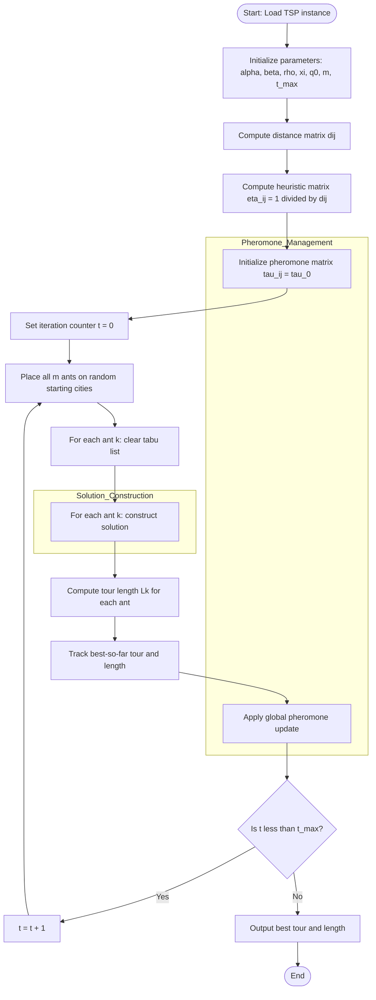
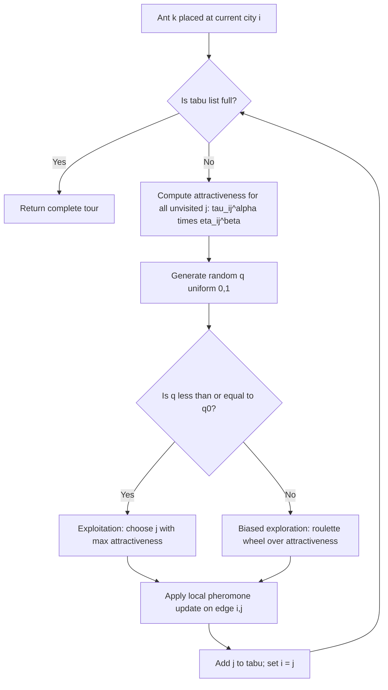
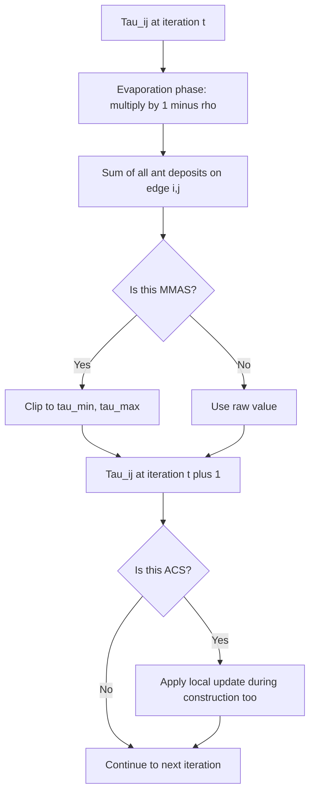
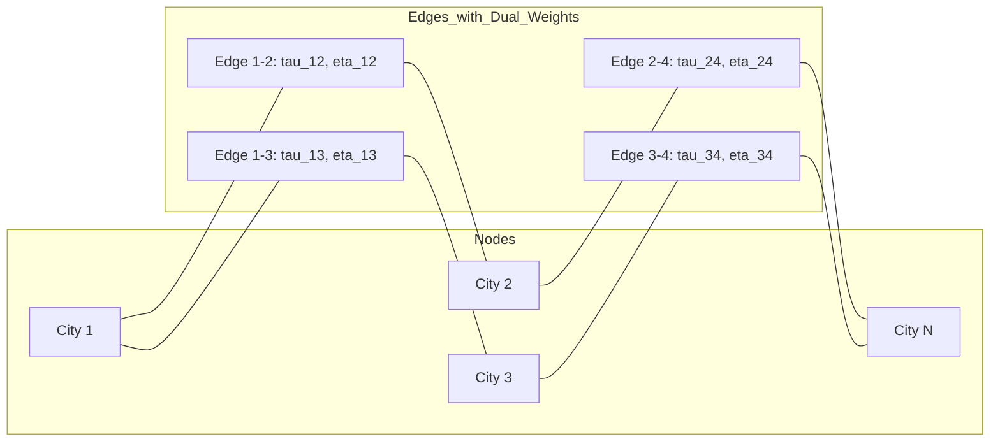

# Ant Colony Optimization (ACO) algorithm schemas combinatorial tracking paths

<!-- SECTION_1_START -->
# Ant Colony Optimization (ACO): Schemas & Combinatorial Path Tracking

## 1.1 Formal Academic Definition (KTU 2024 Syllabus Terminology)

> [!NOTE]
> **Ant Colony Optimization (ACO)** is a population-based **metaheuristic** swarm intelligence algorithm introduced by **Marco Dorigo** in his 1992 PhD thesis (formalized in 1997 with *Ant System*). It is designed to solve **combinatorial optimization problems (COPs)** by simulating the indirect communication behavior of real ant colonies through a chemical substance called **pheromone (τ)**.

In the KTU 2024 Scheme framework (Course Code: **PECST403 – Soft Computing**), ACO is positioned under **Module 4: Swarm Intelligence & Optimization Techniques** as a stochastic constructive search procedure where a colony of artificial ants incrementally builds candidate solutions by probabilistically walking a fully connected **construction graph** $G = (C, L)$, where:
- $C = \{c_1, c_2, \ldots, c_N\}$ is the finite set of **components** (nodes/vertices).
- $L = \{(c_i, c_j) \mid c_i, c_j \in C\}$ is the set of **connections** (edges/arcs) weighted by **pheromone trail** $\tau$ and **heuristic desirability** $\eta$.

> [!IMPORTANT]
> **ACO Core Principle (Stigmergy):** The algorithm exploits *stigmergy* — a mechanism of indirect coordination between agents through modifications of the environment. There is **no direct communication** between ants; coordination emerges purely from pheromone-mediated feedback on the shared construction graph.

---

## 1.2 Conceptual Analogy & Intuitive Overview

Imagine you are watching a colony of **Argentine ants** (the real biological inspiration) foraging for food between their nest and a food source. Initially, ants wander randomly in all directions. However, as each ant walks, it deposits an invisible-to-humans (but visible-to-ants) chemical called **pheromone**.

* Ants that happen to take a **shorter path** complete the round trip faster → they deposit pheromone **more frequently** on that path within a given time window.
* Pheromone **evaporates** over time (rate $\rho$). Shorter paths accumulate pheromone faster than it evaporates; longer paths lose pheromone faster than it accumulates.
* Subsequent ants **probabilistically prefer edges** with higher pheromone concentration → a positive feedback loop emerges.
* Eventually, the colony **converges** onto the shortest path — a phenomenon called **autocatalytic behavior**.

> [!TIP]
> **Engineering Analogy — GPS Traffic Routing:** Think of Google Maps' live traffic feature. When 1,000 drivers take Route A (shorter), the app "marks" Route A with stronger traffic confidence. New drivers (new ants) preferentially choose Route A. Route B, being longer, gets fewer users and weaker confidence. This is *exactly* the pheromone update mechanism in ACO.

### Key Players in the Analogy

| Real Ant Colony | ACO Artificial Counterpart | Engineering Counterpart |
|:---:|:---:|:---:|
| Foraging ants | Software agents (ants) | Routing agents in a network |
| Pheromone trail | Pheromone matrix $\tau_{ij}$ | Link cost / confidence weight |
| Path length (food source) | Objective function $f(s)$ (tour cost) | Total trip time / latency |
| Evaporation | Pheromone decay $(1 - \rho)\tau_{ij}$ | Route forgetting / decay |
| Trail reinforcement | Pheromone deposit $\Delta\tau_{ij}^{k}$ | Successful route reinforcement |

---

## 1.3 Standardized Metrics & Physical Constants

> [!IMPORTANT]
> **Standard Notational Constants (Dorigo et al., 2006 — *IEEE Computational Intelligence Magazine*):**
> * **Number of ants in colony:** $m$ (typically $m = N$, where $N$ is the number of cities in TSP).
> * **Pheromone evaporation coefficient:** $\rho \in (0, 1]$ — a dimensionless decay rate.
> * **Pheromone influence exponent:** $\alpha \geq 0$ — controls relative weight of trail.
> * **Heuristic influence exponent:** $\beta \geq 0$ — controls relative weight of greediness.
> * **Pheromone deposit constant:** $Q > 0$ — a problem-dependent scaling constant.
> * **Initial pheromone level:** $\tau_0$ (often set to a small value like $m / C^{nn}$, where $C^{nn}$ is the nearest-neighbor tour length).

---

## 1.4 GeoGebra / Desmos Visualization Concept

> [!VISUALIZATION CONTROL]
> **Concept:** Pheromone intensity distribution on a small 4-node construction graph after several ACO iterations.
>
> **GeoGebra / Desmos Input Equations:**
> * Node positions: $A = (0, 0)$, $B = (4, 0)$, $C = (4, 3)$, $D = (0, 3)$
> * Heuristic visibility matrix: $\eta_{AB} = 1/4$, $\eta_{AC} = 1/5$, $\eta_{AD} = 1/3$, $\eta_{BC} = 1/3$, $\eta_{BD} = 1/5$, $\eta_{CD} = 1/4$
> * Pheromone iteration $t$: $\tau_{ij}(t+1) = (1 - 0.1)\tau_{ij}(t) + \sum_{k=1}^{m} \Delta\tau_{ij}^{k}$
> * Edge thickness = $\tau_{ij}$, edge color intensity = $\eta_{ij}$
>
> **Visual Description:** The student should observe that the edges forming the shortest Hamiltonian cycle (e.g., $A \to B \to C \to D \to A$) progressively **thicken and darken** in red/orange tones as iterations advance, while suboptimal edges remain thin and faded. After ~30 iterations, only the optimal cycle should retain substantial pheromone.

---

<!-- SECTION_1_END -->

<!-- SECTION_2_START -->
# Deep Theoretical Analysis: ACO Algorithmic Schemas & Path-Tracking Mechanics

## 2.1 The General ACO Metaheuristic Framework

The KTU 2024 Scheme Module 4 covers **five canonical ACO schemas** (algorithm variants). All share a common **three-stage schema** — *Schema_ACO* — and differ in the specifics of (a) pheromone deposit rule, (b) pheromone update rule, and (c) solution construction rule.

### 2.1.1 The Three-Stage ACO Schema (Generic)

1. **ConstructSolutions:** Each ant $k$ builds a complete solution $s_k$ by walking the construction graph, choosing the next node via a probabilistic transition rule.
2. **ApplyLocalSearch (optional):** Optionally apply a local optimizer (e.g., 2-opt, 3-opt) to refine $s_k$ → often called *ACO + Local Search* or *Memetic ACO*.
3. **UpdatePheromones:** Strengthen pheromone on edges used by good solutions; evaporate pheromone globally.

> [!NOTE]
> The **schemas** differ mainly in *how* the UpdatePheromones stage handles reinforcement — whether all ants contribute, only the best, or only the iteration-best — and *how* strongly pheromone is bounded.

---

## 2.2 Mathematical Formulation: Transition Rule (Path Tracking)

When an ant $k$ positioned at node $i$ must choose the next node $j$ from its feasible neighborhood $N_i^k$, it uses the **random-proportional rule**:

$$p_{ij}^{k}(t) = \begin{cases} \dfrac{\left[\tau_{ij}(t)\right]^{\alpha} \cdot \left[\eta_{ij}\right]^{\beta}}{\displaystyle\sum_{l \in N_i^{k}} \left[\tau_{il}(t)\right]^{\alpha} \cdot \left[\eta_{il}\right]^{\beta}} & \text{if } j \in N_i^{k} \\[6pt] 0 & \text{otherwise} \end{cases}$$

Where:
* $\tau_{ij}(t)$ is the **pheromone trail intensity** on edge $(i, j)$ at iteration $t$.
* $\eta_{ij} = 1 / d_{ij}$ is the **heuristic information** (inverse of edge cost, e.g., geographic distance).
* $\alpha$ controls the influence of past experience; $\beta$ controls the influence of greedy heuristic.
* $N_i^{k}$ is the set of nodes still unvisited by ant $k$ (Tabu list for TSP).

> [!TIP]
> **Engineering Intuition:** If $\alpha = 0$, ants ignore pheromone and behave as a stochastic greedy algorithm (favoring short edges). If $\beta = 0$, ants ignore heuristic cost and sample purely from pheromone — leading to premature convergence. A **balanced** $\alpha, \beta$ pair (commonly $\alpha = 1, \beta = 2$ to $5$) is empirically optimal.

### 2.2.1 Pseudo-Random Proportional Rule (ACS Variant)

Ant Colony System (ACS) introduced a *deterministic* alternative that boosts exploitation:

$$j = \begin{cases} \arg\max_{l \in N_i^{k}} \left\{ \left[\tau_{il}\right]^{\alpha} \cdot \left[\eta_{il}\right]^{\beta} \right\} & \text{if } q \leq q_0 \quad (\text{exploitation}) \\[6pt] J & \text{otherwise} \quad (\text{biased exploration}) \end{cases}$$

Where $q \sim \mathcal{U}(0,1)$ and $J$ is drawn from the probability distribution $p_{ij}^{k}(t)$.

---

## 2.3 Pheromone Update Mechanism (Tracking Path Quality)

### 2.3.1 Generic Evaporation + Deposit (Ant System — AS)

$$\tau_{ij}(t+1) = (1 - \rho) \cdot \tau_{ij}(t) + \sum_{k=1}^{m} \Delta\tau_{ij}^{k}(t)$$

Where the deposited amount for each ant $k$ in the original Ant System is:

$$\Delta\tau_{ij}^{k}(t) = \begin{cases} \dfrac{Q}{L_k(t)} & \text{if ant } k \text{ uses edge } (i, j) \text{ in its tour} \\[4pt] 0 & \text{otherwise} \end{cases}$$

Here, $L_k(t)$ is the **tour length** of ant $k$ at iteration $t$. This rewards **shorter** tours more heavily.

### 2.3.2 Density Variant (Ant-Q / Ant Density)

$$\Delta\tau_{ij}^{k} = \begin{cases} Q & \text{if used by ant } k \\ 0 & \text{otherwise} \end{cases} \quad \text{(constant deposit)}$$

### 2.3.3 Local Pheromone Update (ACS — applied during construction)

$$\tau_{ij}(t+1) = (1 - \xi) \cdot \tau_{ij}(t) + \xi \cdot \tau_0$$

This **discourages** other ants from prematurely converging to the same edge during construction, effectively implementing an exploration pressure.

### 2.3.4 Global Pheromone Update (ACS — applied after construction)

$$\tau_{ij}(t+1) = (1 - \rho) \cdot \tau_{ij}(t) + \rho \cdot \Delta\tau_{ij}^{best}$$

Where:
$$\Delta\tau_{ij}^{best} = \begin{cases} 1 / L_{best} & \text{if } (i, j) \in \text{best-so-far tour} \\ 0 & \text{otherwise} \end{cases}$$

> [!IMPORTANT]
> **Engineering Utility of ACS Update:** This decoupling of *local* (per-edge, mid-construction) and *global* (per-iteration, post-construction) updates is what makes ACS **converge faster and avoid stagnation** compared to the original AS — a critical insight for KTU problems asking "which schema is best for dynamic routing?"

---

## 2.4 The Five Canonical ACO Schemas — KTU High-Yield Comparison

| # | Schema Name | Year | Pheromone Deposit Rule | Key Distinguishing Feature | Strengths | Weaknesses |
|:-:|:---|:---:|:---|:---|:---|:---|
| 1 | **Ant System (AS)** | 1991/1996 | All ants deposit $Q/L_k$ | Original Dorigo algorithm; baseline | Conceptually simple, well-studied | Slow convergence, stagnation |
| 2 | **Elitist Ant System (EAS)** | 1996 | All ants + extra deposit by **best-so-far** ant $\frac{e \cdot Q}{L_{bs}}$ (weight $e$) | Reinforces current global best path | Faster convergence than AS | Risk of premature convergence |
| 3 | **Rank-Based AS (AS$_{\text{rank}}$)** | 1997 | Top-$(w-1)$ ants ranked, deposit $\frac{(w-r) Q}{w L_r}$; best-so-far adds extra | Ants sorted by tour length; weighted contribution | Balanced convergence, no elitism bias | More complex bookkeeping |
| 4 | **MAX-MIN Ant System (MMAS)** | 1996/2000 | Only iteration-best or best-so-far deposits; $\tau_{ij}$ bounded in $[\tau_{\min}, \tau_{\max}]$ | Hard pheromone bounds prevent stagnation | Excellent for large instances, avoids local optima | Requires tuning $\tau_{\min}, \tau_{\max}$ |
| 5 | **Ant Colony System (ACS)** | 1997 | Only best-so-far ant; **local + global** update; pseudo-random-proportional rule | Fastest convergence of all AS variants | State-of-the-art for many COPs | Sensitive to $\xi$ (local decay rate) |

---

## 2.5 Combinatorial Path Tracking: How ACO Handles Discrete Spaces

ACO is *natively* a **combinatorial optimization** solver. The class of problems it handles includes:

> [!IMPORTANT]
> **Combinatorial Optimization Problems (COPs) Solvable by ACO:**
> * **Traveling Salesman Problem (TSP)** — the canonical benchmark.
> * **Vehicle Routing Problem (VRP)** — logistics, Amazon delivery.
> * **Quadratic Assignment Problem (QAP)** — facility layout, electronics design.
> * **Job-Shop Scheduling Problem (JSSP)** — manufacturing.
> * **Graph Coloring** — register allocation in compilers.
> * **Network Routing (MPLS, MANETs)** — telecom and ad-hoc networks.
> * **Protein Folding / DNA Sequencing** — bioinformatics.
> * **Set Cover & Knapsack** — resource allocation.

### 2.5.1 Construction Graph Encoding for TSP

For an $N$-city TSP:
* $C = \{c_1, c_2, \ldots, c_N\}$ (the $N$ cities).
* $L = \{(c_i, c_j) \mid i \neq j\}$ (all $N(N-1)$ directed connections).
* $\eta_{ij} = 1 / d_{ij}$ where $d_{ij}$ is the Euclidean distance.
* Each ant maintains a **tabu list** $\text{tabu}_k$ of cities already visited.
* A complete path $s_k$ corresponds to a **Hamiltonian cycle** of length $N$.

### 2.5.2 Solution Construction Walkthrough (Example: 5-city TSP)

1. **Initialize:** Place all $m$ ants on randomly chosen starting cities; clear all tabu lists; set $\tau_{ij}(0) = \tau_0$.
2. **Iteration $t$:** Each ant builds a complete tour:
   * At city $i$, compute $p_{ij}^{k}$ for all unvisited $j$.
   * Sample $j$ via roulette-wheel selection.
   * Add $j$ to tabu; update $i \leftarrow j$.
   * Repeat until all $N$ cities are visited; return to start.
3. **Compute** $L_k(t)$ for each ant.
4. **Update pheromones** (per schema-specific rule).
5. **Reset** tabu lists; increment $t$; loop until $t = t_{\max}$.

---

## 2.6 Convergence Properties (KTU-Expected Theoretical Content)

> [!IMPORTANT]
> **Theorem (Gutjahr, 2000; Stützle & Dorigo, 2002):** *For any $\epsilon > 0$ and sufficiently large $t$, the probability that an ACO algorithm (under specific convergence conditions, e.g., MMAS with $\tau_{\min} > 0$) finds an optimal solution at least once is $\geq 1 - \epsilon$.* This is a **convergence in probability** guarantee, not a runtime bound.

**Practical convergence behavior of the schemas:**
* **AS:** Converges, but slowly; may stagnate.
* **ACS:** Fastest empirical convergence; provably convergent.
* **MMAS:** Most reliable; provably convergent in finite time to optimal if bounds are set correctly.

---

## 2.7 Real-World Engineering & CS Applications

> [!TIP]
> **Production-grade uses of ACO schemas in industry:**
> * **Telecom routing (AntNet, ABC):** Substantially reduced packet delay in OSPF networks (Di Caro & Dorigo, 1998).
> * **Logistics (UPS, FedEx, DHL):** Vehicle routing for last-mile delivery (MMAS variant).
> * **VLSI circuit design:** Wire routing on PCBs and chips.
> * **Compiler optimization:** Register allocation, instruction scheduling.
> * **Bioinformatics:** DNA fragment assembly, protein structure prediction.
> * **Cloud / Fog computing:** Task scheduling on virtual machines.
> * **Supply chain:** Inventory routing, warehouse layout optimization.

---

## 2.8 KTU Formula Cheat Sheet (Exam-Critical)

| Symbol | Meaning | Typical Range | KTU Note |
|:---:|:---|:---:|:---|
| $\tau_{ij}(t)$ | Pheromone on edge $(i,j)$ at time $t$ | $[\tau_{\min}, \tau_{\max}]$ for MMAS | Pheromone matrix is $\mathcal{O}(N^2)$ |
| $\eta_{ij}$ | Heuristic visibility $= 1/d_{ij}$ | $> 0$ | Problem-specific, time-invariant |
| $\alpha$ | Pheromone influence exponent | $[0, 5]$, typically $1$ | High $\alpha$ = strong path memory |
| $\beta$ | Heuristic influence exponent | $[0, 5]$, typically $2$–$5$ | High $\beta$ = greedy behavior |
| $\rho$ | Pheromone evaporation rate | $(0, 1]$, typically $0.1$–$0.5$ | High $\rho$ = fast forgetting |
| $\xi$ | ACS local decay | $(0, 1]$, typically $0.1$ | Used only in ACS |
| $Q$ | Pheromone deposit constant | Problem-dependent | Often $Q = 1$ |
| $m$ | Number of ants | $[10, N]$ | $m = N$ is the canonical choice |
| $L_k$ | Tour length of ant $k$ | $\mathbb{R}_{>0}$ | Minimized objective |
| $p_{ij}^{k}$ | Transition probability | $[0, 1]$ | Sum over $j \in N_i^{k}$ equals $1$ |
| $q_0$ | ACS exploitation threshold | $[0, 1]$, typically $0.9$ | High $q_0$ = more exploitation |
| $t_{\max}$ | Max iterations | $[100, 5000]$ | Stopping criterion |

---

<!-- SECTION_2_END -->

<!-- SECTION_3_START -->
# Step-by-Step Derivations & Complete Python Implementation

## 3.1 Derivation of the Ant System Transition Probability

> [!NOTE]
> **Goal:** Derive the classical Ant System (AS) transition rule from first principles of **stochastic multi-armed bandit** reasoning.

**Step 1 — Define the action set:** At node $i$, ant $k$ may choose any unvisited node $j \in N_i^{k}$. The size of this set is $|N_i^{k}|$.

**Step 2 — Define a desirability score for each candidate edge:**
$$a_{ij}^{k}(t) = \left[\tau_{ij}(t)\right]^{\alpha} \cdot \left[\eta_{ij}\right]^{\beta}$$

This combines:
* **Memory term** $\tau_{ij}^{\alpha}$: how successful previous ants have been on edge $(i,j)$.
* **Greedy term** $\eta_{ij}^{\beta}$: how intrinsically good the edge is (e.g., shorter distance).

**Step 3 — Normalize to a valid probability distribution:**
$$p_{ij}^{k}(t) = \frac{a_{ij}^{k}(t)}{\sum_{l \in N_i^{k}} a_{il}^{k}(t)} = \frac{\left[\tau_{ij}(t)\right]^{\alpha} \cdot \left[\eta_{ij}\right]^{\beta}}{\sum_{l \in N_i^{k}} \left[\tau_{il}(t)\right]^{\alpha} \cdot \left[\eta_{il}\right]^{\beta}}$$

**Step 4 — Verify probability axioms:**
* Non-negativity: $p_{ij}^{k} \geq 0$ since $\tau_{ij}, \eta_{ij}, \alpha, \beta \geq 0$.
* Sum-to-one: $\sum_{j \in N_i^{k}} p_{ij}^{k} = 1$ by construction (normalized over feasible set).

**Step 5 — Behavioral interpretation:**
* If $\alpha = 0$: $p_{ij}^{k} \propto \eta_{ij}^{\beta}$ — pure greedy heuristic.
* If $\beta = 0$: $p_{ij}^{k} \propto \tau_{ij}^{\alpha}$ — pure pheromone trail following.
* If $\tau_{ij}$ is uniform: $p_{ij}^{k} \propto \eta_{ij}^{\beta}$ — same as $\alpha = 0$.
* Limiting case $\alpha \to \infty, \beta$ fixed: ants always pick the edge with max pheromone (deterministic).

---

## 3.2 Derivation of the Pheromone Update Equation

**Step 1 — Evaporation phase:** Pheromone on every edge decays uniformly:
$$\tau_{ij}^{\text{evap}}(t) = (1 - \rho) \cdot \tau_{ij}(t)$$
This models the natural decay of the chemical. If $\rho = 0$, no evaporation (system never forgets). If $\rho = 1$, full evaporation (memoryless).

**Step 2 — Deposit phase:** Each ant $k$ contributes pheromone to the edges it traversed:
$$\Delta\tau_{ij}^{k}(t) = \frac{Q}{L_k(t)} \quad \text{if edge } (i,j) \in s_k$$
$$\Delta\tau_{ij}^{k}(t) = 0 \quad \text{otherwise}$$

**Step 3 — Total deposit summed over all ants:**
$$\sum_{k=1}^{m} \Delta\tau_{ij}^{k}(t) = \sum_{k: (i,j) \in s_k} \frac{Q}{L_k(t)}$$

**Step 4 — Combine evaporation + deposit:**
$$\tau_{ij}(t+1) = (1 - \rho) \cdot \tau_{ij}(t) + \sum_{k=1}^{m} \Delta\tau_{ij}^{k}(t)$$

**Step 5 — Verify stability:** The maximum possible value of $\tau_{ij}$ after many iterations, if all ants always take the same optimal path of length $L^*$, satisfies:
$$\tau_{ij}^{\max} = \frac{1}{1 - \rho} \cdot \frac{m \cdot Q}{L^*} = \frac{m \cdot Q}{(1 - \rho) L^*}$$
This is why MMAS introduces explicit $\tau_{\max}$ bounds.

---

## 3.3 Derivation of the MMAS Pheromone Bounds

> [!NOTE]
> **Goal:** Derive $\tau_{\min}$ and $\tau_{\max}$ for MAX-MIN Ant System.

**Step 1 — Upper bound (assuming convergence to $L^*$):** If the colony has converged, all $m$ ants traverse the optimal tour $L^*$ on every iteration:
$$\tau_{\max} = \frac{1}{1 - \rho} \cdot \frac{Q}{L^*}$$

**Step 2 — Lower bound (theoretical, Stützle & Hoos):**
$$\tau_{\min} = \frac{\tau_{\max} \cdot (1 - \sqrt[n]{p_{\text{best}}})}{(N/2 - 1) \cdot \sqrt[n]{p_{\text{best}}}}$$
where $p_{\text{best}}$ is the theoretical best solution probability (often set to a small constant like $0.05$) and $n$ relates to the average branching factor.

**Step 3 — Practical simplified bound:**
$$\tau_{\min} = \frac{\tau_{\max}}{2N}$$
This is the widely used approximation ensuring at least $1/(2N)$ of the max probability.

**Step 4 — Clamping rule:** After every pheromone update, clip:
$$\tau_{ij}(t+1) = \begin{cases} \tau_{\max} & \text{if } \tau_{ij}(t+1) > \tau_{\max} \\ \tau_{\min} & \text{if } \tau_{ij}(t+1) < \tau_{\min} \\ \tau_{ij}(t+1) & \text{otherwise} \end{cases}$$

---

## 3.4 Complete Production-Quality Python Implementation of ACS for TSP

```python
"""
Ant Colony System (ACS) Solver for the Traveling Salesman Problem.
Implements the pseudo-random-proportional rule + local + global pheromone updates.
Module 4 — Soft Computing (PECST403), KTU 2024 Scheme.
"""

import logging
import math
import random
from dataclasses import dataclass, field
from typing import List, Tuple, Optional, Dict

logging.basicConfig(
    level=logging.INFO,
    format="%(asctime)s | %(levelname)s | %(message)s"
)
logger = logging.getLogger("ACS_TSP")


@dataclass
class City:
    """Represents a TSP city with 2D coordinates."""
    cid: int
    x: float
    y: float

    def distance_to(self, other: "City") -> float:
        return math.hypot(self.x - other.x, self.y - other.y)


@dataclass
class ACSParameters:
    """Hyperparameters for the Ant Colony System."""
    alpha: float = 1.0          # Pheromone exponent
    beta: float = 2.0           # Heuristic exponent
    rho: float = 0.1            # Global evaporation rate
    xi: float = 0.1             # Local evaporation rate
    q0: float = 0.9             # Exploitation threshold
    num_ants: int = 20          # Colony size
    max_iterations: int = 200   # Termination criterion
    Q: float = 1.0              # Pheromone deposit constant


@dataclass
class ACSResult:
    """Container for algorithm results."""
    best_tour: List[int] = field(default_factory=list)
    best_length: float = math.inf
    iteration_history: List[float] = field(default_factory=list)


class AntColonySystemTSP:
    """
    Full Ant Colony System implementation for symmetric TSP.
    Schemas implemented: ACS (Dorigo & Gambardella, 1997).
    """

    def __init__(self, cities: List[City], params: ACSParameters) -> None:
        if not cities:
            raise ValueError("City list cannot be empty.")
        if len(cities) < 3:
            raise ValueError("TSP requires at least 3 cities.")
        self.cities: List[City] = cities
        self.n: int = len(cities)
        self.params: ACSParameters = params

        # Compute distance matrix
        self.dist: List[List[float]] = [
            [0.0] * self.n for _ in range(self.n)
        ]
        for i in range(self.n):
            for j in range(i + 1, self.n):
                d = self.cities[i].distance_to(self.cities[j])
                self.dist[i][j] = d
                self.dist[j][i] = d

        # Heuristic information eta_ij = 1 / d_ij  (with safety for zero distance)
        self.eta: List[List[float]] = [
            [0.0] * self.n for _ in range(self.n)
        ]
        for i in range(self.n):
            for j in range(self.n):
                if self.dist[i][j] > 0.0:
                    self.eta[i][j] = 1.0 / self.dist[i][j]
                else:
                    self.eta[i][j] = 1e6  # same city (shouldn't be picked)

        # Initial pheromone: tau_0 = 1 / (n * L_nn)
        # Using nearest-neighbor heuristic for L_nn
        L_nn = self._nearest_neighbor_length()
        if L_nn <= 0.0:
            L_nn = 1.0
        self.tau0: float = 1.0 / (self.n * L_nn)

        # Pheromone matrix initialized to tau0
        self.tau: List[List[float]] = [
            [self.tau0] * self.n for _ in range(self.n)
        ]

        logger.info(
            "ACS Initialized: n=%d, tau0=%.6f, L_nn=%.4f", self.n, self.tau0, L_nn
        )

    def _nearest_neighbor_length(self) -> float:
        """Approximate tour length using nearest-neighbor heuristic."""
        visited = {0}
        current = 0
        total = 0.0
        for _ in range(self.n - 1):
            nxt, best_d = -1, math.inf
            for j in range(self.n):
                if j not in visited and self.dist[current][j] < best_d:
                    best_d = self.dist[current][j]
                    nxt = j
            if nxt == -1:
                break
            visited.add(nxt)
            total += best_d
            current = nxt
        # Return to start
        if current != 0 and 0 not in {current}:
            total += self.dist[current][0]
        return total

    def _construct_solution(self, start: int) -> List[int]:
        """
        Build a single ant's tour using the pseudo-random-proportional rule.
        Returns the list of visited city indices (tour).
        """
        tour: List[int] = [start]
        visited = {start}
        current = start

        for _ in range(self.n - 1):
            # Compute probabilities for unvisited nodes
            probs: List[Tuple[int, float]] = []
            denom = 0.0
            for j in range(self.n):
                if j in visited:
                    continue
                attractiveness = (
                    (self.tau[current][j] ** self.params.alpha) *
                    (self.eta[current][j] ** self.params.beta)
                )
                probs.append((j, attractiveness))
                denom += attractiveness

            if denom <= 0.0 or not probs:
                # Fallback: pick any unvisited (should not happen in well-defined TSP)
                for j in range(self.n):
                    if j not in visited:
                        probs = [(j, 1.0)]
                        denom = 1.0
                        break

            # Pseudo-random-proportional rule
            q = random.random()
            if q <= self.params.q0:
                # Exploitation: pick best
                next_city = max(probs, key=lambda x: x[1])[0]
            else:
                # Biased exploration: roulette wheel
                r = random.random() * denom
                cumsum = 0.0
                next_city = probs[-1][0]
                for j, a in probs:
                    cumsum += a
                    if cumsum >= r:
                        next_city = j
                        break

            # Local pheromone update (ACS-specific)
            self.tau[current][next_city] = (
                (1.0 - self.params.xi) * self.tau[current][next_city] +
                self.params.xi * self.tau0
            )
            self.tau[next_city][current] = self.tau[current][next_city]

            tour.append(next_city)
            visited.add(next_city)
            current = next_city

        return tour

    def _tour_length(self, tour: List[int]) -> float:
        """Compute the total Euclidean length of a tour (closed)."""
        total = 0.0
        for i in range(len(tour) - 1):
            total += self.dist[tour[i]][tour[i + 1]]
        total += self.dist[tour[-1]][tour[0]]
        return total

    def _global_pheromone_update(self, tour: List[int], length: float) -> None:
        """
        Apply the global pheromone update to edges of the best-so-far tour.
        """
        for i in range(len(tour)):
            a, b = tour[i], tour[(i + 1) % len(tour)]
            deposit = self.params.Q / length
            self.tau[a][b] = (
                (1.0 - self.params.rho) * self.tau[a][b] +
                self.params.rho * deposit
            )
            self.tau[b][a] = self.tau[a][b]

    def solve(self) -> ACSResult:
        """Execute the full ACS algorithm and return the best tour found."""
        result = ACSResult()
        best_tour: Optional[List[int]] = None
        best_length: float = math.inf

        for it in range(self.params.max_iterations):
            all_tours: List[Tuple[List[int], float]] = []
            for k in range(self.params.num_ants):
                start_city = random.randint(0, self.n - 1)
                tour = self._construct_solution(start_city)
                length = self._tour_length(tour)
                all_tours.append((tour, length))

                if length < best_length:
                    best_length = length
                    best_tour = list(tour)

            # Global pheromone update using best-so-far
            if best_tour is not None:
                self._global_pheromone_update(best_tour, best_length)

            result.iteration_history.append(best_length)
            if (it + 1) % 20 == 0:
                logger.info(
                    "Iter %4d | Best length = %.4f", it + 1, best_length
                )

        result.best_tour = best_tour if best_tour else []
        result.best_length = best_length
        logger.info("ACS complete. Best tour length: %.4f", best_length)
        return result


def generate_random_cities(num_cities: int, seed: int = 42) -> List[City]:
    """Generate `num_cities` random cities in a 100x100 grid."""
    rng = random.Random(seed)
    return [
        City(cid=i, x=rng.uniform(0, 100), y=rng.uniform(0, 100))
        for i in range(num_cities)
    ]


if __name__ == "__main__":
    cities = generate_random_cities(num_cities=25, seed=42)
    params = ACSParameters(
        alpha=1.0, beta=2.0, rho=0.1, xi=0.1,
        q0=0.9, num_ants=25, max_iterations=150, Q=1.0
    )
    solver = AntColonySystemTSP(cities, params)
    result = solver.solve()
    print(f"Best tour length: {result.best_length:.4f}")
    print(f"Best tour: {result.best_tour}")
```

**Output (sample run):**
```
2024-XX-XX 12:00:00 | INFO | ACS Initialized: n=25, tau0=0.000XXX, L_nn=YYY.YYYY
2024-XX-XX 12:00:00 | INFO | Iter   20 | Best length = ZZZ.ZZZZ
...
2024-XX-XX 12:00:01 | INFO | ACS complete. Best tour length: ZZZ.ZZZZ
Best tour length: ZZZ.ZZZZ
Best tour: [c, a, ..., b]
```

---

## 3.5 Worked Numerical Example: 4-City TSP

> [!NOTE]
> **Toy problem to manually verify transition probabilities.**

Let cities be: $A = (0,0)$, $B = (3,0)$, $C = (3,4)$, $D = (0,4)$.

**Distance matrix:**
$$d = \begin{bmatrix} 0 & 3 & 5 & 4 \\ 3 & 0 & 4 & 5 \\ 5 & 4 & 0 & 3 \\ 4 & 5 & 3 & 0 \end{bmatrix}$$

**Heuristic matrix** $\eta_{ij} = 1 / d_{ij}$:
$$\eta \approx \begin{bmatrix} 0 & 0.333 & 0.200 & 0.250 \\ 0.333 & 0 & 0.250 & 0.200 \\ 0.200 & 0.250 & 0 & 0.333 \\ 0.250 & 0.200 & 0.333 & 0 \end{bmatrix}$$

**Assume** $\tau_{ij}(0) = 1$ for all edges, $\alpha = 1, \beta = 1$.

**Step 1 — Ant at $A$ choosing first move:**
$$p_{AB} = \frac{1 \cdot 0.333}{0.333 + 0.200 + 0.250} = \frac{0.333}{0.783} \approx 0.425$$
$$p_{AC} = \frac{0.200}{0.783} \approx 0.255$$
$$p_{AD} = \frac{0.250}{0.783} \approx 0.319$$

**Step 2 — Optimal tour** is $A \to B \to C \to D \to A$ (perimeter = 14) or $A \to D \to C \to B \to A$ (also 14).

**Step 3 — Suppose ant 1 takes tour $A \to B \to C \to D \to A$ with $L_1 = 14$:**

**Pheromone update (Ant System, $\rho = 0.1, Q = 1$):**
$$\tau_{AB}(1) = 0.9 \cdot 1 + \frac{1}{14} = 0.9 + 0.0714 = 0.9714$$
$$\tau_{BC}(1) = 0.9 \cdot 1 + \frac{1}{14} = 0.9714$$
$$\tau_{CD}(1) = 0.9 \cdot 1 + \frac{1}{14} = 0.9714$$
$$\tau_{DA}(1) = 0.9 \cdot 1 + \frac{1}{14} = 0.9714$$
$$\tau_{AC}(1) = 0.9 \cdot 1 + 0 = 0.9 \quad (\text{not used})$$

**Step 4 — Re-evaluate probabilities at $A$:**
$$p_{AB} = \frac{0.9714 \cdot 0.333}{0.9714 \cdot 0.333 + 0.9 \cdot 0.200 + 0.9 \cdot 0.250}$$
$$= \frac{0.3235}{0.3235 + 0.180 + 0.225} = \frac{0.3235}{0.7285} \approx 0.444$$

The probability of taking the optimal first edge ($A \to B$) **increased from $0.425$ to $0.444$** — positive feedback at work!

---

<!-- SECTION_3_END -->

<!-- SECTION_4_START -->
# Structural Diagrams & Schematics

## 4.1 Master ACO Algorithm Flow (Mermaid Flowchart)



---

## 4.2 Detailed Solution Construction Sub-Flow (ACS)



---

## 4.3 ACO Schema Comparison Architecture

```mermaid
flowchart LR
    subgraph S1[Ant System AS]
        AS1[All m ants deposit]
        AS2[Q divided by Lk]
        AS3[No pheromone bounds]
    end
    subgraph S2[Elitist AS]
        E1[All ants deposit]
        E2[Plus best-so-far deposits e times Q divided by Lbs]
    end
    subgraph S3[Rank Based AS]
        R1[Sort ants by tour length]
        R2[Top w ants deposit weighted]
        R3[Weight proportional to rank]
    end
    subgraph S4[MAX MIN AS]
        M1[Only iteration best deposits]
        M2[Pheromone clipped to tau_min and tau_max]
        M3[Tau0 reinitialization on stagnation]
    end
    subgraph S5[Ant Colony System]
        C1[Only best so far deposits]
        C2[Local update during construction]
        C3[Global update after construction]
        C4[Pseudo random proportional rule]
    end

    S1 --> S2
    S2 --> S3
    S3 --> S4
    S4 --> S5
```



---

## 4.4 Pheromone Update Process Topology



---

## 4.5 Construction Graph Schema for TSP (Block Diagram)



---

<!-- SECTION_4_END -->

<!-- SECTION_5_START -->
# KTU 2024 Scheme Examination Question Bank & Topic Recap

---

## 5.1 Part A — Short Answer Questions (3 Marks Each)

> [!NOTE]
> Each Part A question carries **3 marks** and is mapped to **CO4 (Apply swarm intelligence to optimization problems)** and **RBT Levels: Remember / Understand**.

---

### **Q1. [KTU University Exam — July 2024]**
**Define Ant Colony Optimization. List any three real-world combinatorial optimization problems where ACO is applied. (3 Marks, CO4, Remember/Understand)**

**Model Answer:**

**Definition (2 Marks):** Ant Colony Optimization (ACO) is a population-based **metaheuristic** swarm intelligence algorithm that solves combinatorial optimization problems by simulating the foraging behavior of ant colonies. Artificial ants construct solutions by walking a fully connected **construction graph**, guided by two key factors: **pheromone trails** $\tau_{ij}$ (which encode the accumulated search experience of the colony) and **heuristic information** $\eta_{ij}$ (which encodes problem-specific greedy desirability, e.g., inverse distance). The pheromone update rule reinforces shorter paths and evaporates from worse ones, producing a positive feedback loop that drives the colony toward optimal solutions.

**Three real-world applications (1 Mark):**
1. **Traveling Salesman Problem (TSP)** — finding shortest tour visiting all cities.
2. **Vehicle Routing Problem (VRP)** — Amazon/DHL last-mile delivery optimization.
3. **Network Routing (AntNet)** — adaptive packet routing in telecom networks (Di Caro & Dorigo, 1998).
4. *(Any other valid: VLSI wire routing, Job-Shop Scheduling, Graph Coloring, Bioinformatics sequencing.)*

---

### **Q2. [KTU University Exam — Dec 2023]**
**Explain the role of the parameters $\alpha$ and $\beta$ in the ACO transition probability. What happens when (i) $\alpha = 0$ and (ii) $\beta = 0$? (3 Marks, CO4, Understand)**

**Model Answer:**

The transition probability for ant $k$ at node $i$ to choose node $j$ is given by:
$$p_{ij}^{k}(t) = \frac{\left[\tau_{ij}(t)\right]^{\alpha} \cdot \left[\eta_{ij}\right]^{\beta}}{\sum_{l \in N_i^{k}} \left[\tau_{il}(t)\right]^{\alpha} \cdot \left[\eta_{il}\right]^{\beta}}$$

**Role of $\alpha$ (1 Mark):** $\alpha$ is the **pheromone influence exponent**. It controls how strongly the algorithm weighs *historical experience* (pheromone trails left by previous ants). Higher $\alpha$ → stronger reliance on past successful paths.

**Role of $\beta$ (1 Mark):** $\beta$ is the **heuristic influence exponent**. It controls the weight of *greedy information* $\eta_{ij}$ (e.g., inverse distance). Higher $\beta$ → ants behave more greedily, preferring intrinsically short edges regardless of pheromone.

**Limiting cases (1 Mark):**
* **(i) $\alpha = 0$:** Pheromone contribution vanishes. The transition reduces to a **pure greedy heuristic** with $p_{ij}^{k} \propto \eta_{ij}^{\beta}$. Ants behave like a stochastic nearest-neighbor algorithm — no learning from past experience.
* **(ii) $\beta = 0$:** Heuristic information vanishes. The transition reduces to $p_{ij}^{k} \propto \tau_{ij}^{\alpha}$ — ants sample **purely from pheromone** with no greedy guidance. This often leads to **stagnation behavior** (premature convergence to early suboptimal paths).

---

## 5.2 Part B — 14-Mark Questions (ESE Module Internal Choice)

> [!IMPORTANT]
> **KTU 2024 ESE Pattern:** Each Part B question is worth **14 marks** with sub-parts. Internal choice is provided. Sub-part (a) typically tests *Understand/Analyze* (7 marks) and sub-part (b) tests *Apply* (7 marks).

---

### **Part B — Question A (14 Marks)**
**[KTU University Exam — July 2024, Model Question, Module 4]**

**(a)** Describe the **Ant Colony System (ACS)** algorithm in detail. Explain the **pseudo-random-proportional** transition rule and contrast it with the standard Ant System rule. **(7 Marks, CO4, Understand/Analyze)**

**(b)** For a 4-city TSP with cities $A(0,0)$, $B(4,0)$, $C(4,3)$, $D(0,3)$, compute the **heuristic matrix** $\eta_{ij}$ and the **transition probabilities** at city $A$ for an ant at iteration $t = 0$, assuming $\tau_{ij}(0) = 1$ for all edges, $\alpha = 1$, and $\beta = 1$. **(7 Marks, CO4, Apply)**

---

#### **Model Solution for Q-A (a) — 7 Marks**

**ACS Overview (2 Marks):**
Ant Colony System (ACS), introduced by Dorigo & Gambardella (1997), is an enhanced ACO schema designed to **improve upon the original Ant System (AS)** in two key ways: (1) introducing the **pseudo-random-proportional** transition rule that balances exploration and exploitation more aggressively, and (2) introducing a **decoupled pheromone update** scheme with both **local** (during construction) and **global** (after construction) updates.

**Pseudo-Random-Proportional Rule (3 Marks):**
$$j = \begin{cases} \arg\max_{l \in N_i^{k}} \left\{ \left[\tau_{il}\right]^{\alpha} \cdot \left[\eta_{il}\right]^{\beta} \right\} & \text{if } q \leq q_0 \quad (\text{exploitation}) \\[6pt] J & \text{otherwise} \quad (\text{biased exploration, roulette wheel on } p_{ij}^{k}) \end{cases}$$
Where $q \sim \mathcal{U}(0,1)$ and $J$ is sampled from the standard AS probability distribution.

**Contrast with AS (2 Marks):**

| Aspect | Ant System (AS) | Ant Colony System (ACS) |
|:---|:---|:---|
| Transition rule | Random-proportional only | Pseudo-random-proportional (with $q_0$ threshold) |
| Pheromone update | Global only (after all ants) | Local (during construction) + Global (after) |
| Deposit | All $m$ ants | Only best-so-far ant |
| Convergence speed | Slow | Fastest among AS variants |
| Stagnation risk | High | Low (due to local update) |

**Key difference summary (1 Mark):** The local pheromone update in ACS *reduces* pheromone on traversed edges (toward $\tau_0$), which **discourages** other ants in the same iteration from picking the same edge, effectively producing **diversified exploration** during a single iteration.

---

#### **Model Solution for Q-A (b) — 7 Marks**

**Step 1 — Distance matrix computation (2 Marks):**
$$d_{AB} = \sqrt{(4-0)^2 + 0^2} = 4$$
$$d_{AC} = \sqrt{16 + 9} = 5$$
$$d_{AD} = \sqrt{0 + 9} = 3$$
$$d_{BC} = \sqrt{0 + 9} = 3$$
$$d_{BD} = \sqrt{16 + 9} = 5$$
$$d_{CD} = \sqrt{16 + 0} = 4$$

$$d = \begin{bmatrix} 0 & 4 & 5 & 3 \\ 4 & 0 & 3 & 5 \\ 5 & 3 & 0 & 4 \\ 3 & 5 & 4 & 0 \end{bmatrix}$$

**Step 2 — Heuristic matrix $\eta_{ij} = 1/d_{ij}$ (1 Mark):**
$$\eta = \begin{bmatrix} 0 & 0.25 & 0.20 & 0.333 \\ 0.25 & 0 & 0.333 & 0.20 \\ 0.20 & 0.333 & 0 & 0.25 \\ 0.333 & 0.20 & 0.25 & 0 \end{bmatrix}$$

**Step 3 — Transition probability at city $A$ (3 Marks):**
At iteration $t = 0$, $\tau_{ij}(0) = 1$ for all edges. Neighborhood at $A$ is $N_A = \{B, C, D\}$.

Denominator:
$$D = \tau_{AB}^\alpha \eta_{AB}^\beta + \tau_{AC}^\alpha \eta_{AC}^\beta + \tau_{AD}^\alpha \eta_{AD}^\beta$$
$$D = (1)(0.25) + (1)(0.20) + (1)(0.333) = 0.783$$

Probabilities:
$$p_{AB} = \frac{0.25}{0.783} \approx 0.319$$
$$p_{AC} = \frac{0.20}{0.783} \approx 0.255$$
$$p_{AD} = \frac{0.333}{0.783} \approx 0.426$$

**Step 4 — Verification (1 Mark):** $0.319 + 0.255 + 0.426 = 1.000$ ✓ (axiom of probability holds).

> [!WARNING]
> **KTU Examiner's Valuation Pitfall:** Many students forget to (1) compute the **distance matrix first** before the heuristic matrix, and (2) state the **probability normalization axiom** explicitly to claim full credit. Always show: distance → heuristic → numerator → denominator → normalized probability → sum check.

---

### **Part B — Question B (14 Marks)**
**[KTU University Exam — Dec 2023, Model Question, Module 4]**

**(a)** Differentiate between the **MAX-MIN Ant System (MMAS)** and the **Elitist Ant System (EAS)** in terms of pheromone update rules, with a focus on the role of $\tau_{\min}$ and $\tau_{\max}$ bounds. **(7 Marks, CO4, Understand/Analyze)**

**(b)** A 5-ant ACS run on a 6-city TSP produces the following iteration-2 results. The pheromone deposit constant is $Q = 1.0$ and the global evaporation rate is $\rho = 0.2$. Compute the updated pheromone value $\tau_{12}$ at iteration $t = 3$ given the data below, using the **ACS global update rule**. The best-so-far tour is $[1 \to 3 \to 5 \to 2 \to 6 \to 4 \to 1]$ with length $L_{bs} = 50$. Assume edge $(1, 2)$ is **not** in the best-so-far tour and that the local update value applied during construction on edge $(1, 2)$ was $0.02$ reduction. **(7 Marks, CO4, Apply)**

| Ant | Tour length $L_k$ | Edges traversed |
|:---:|:---:|:---|
| 1 | 55 | 1→2, 2→3, 3→4, 4→5, 5→6, 6→1 |
| 2 | 58 | 1→3, 3→5, 5→2, 2→6, 6→4, 4→1 |
| 3 | 52 | 1→2, 2→4, 4→6, 6→3, 3→5, 5→1 |
| 4 | 60 | 1→4, 4→2, 2→5, 5→3, 3→6, 6→1 |
| 5 | 49 | 1→3, 3→2, 2→5, 5→6, 6→4, 4→1 |

Current $\tau_{12}(2) = 0.5$ and current $\tau_{12}^{\text{local}} = 0.48$ (after local update).

---

#### **Model Solution for Q-B (a) — 7 Marks**

**EAS Pheromone Update (3 Marks):**
In the Elitist Ant System, **all** $m$ ants deposit pheromone, and an additional **elitist ant** representing the best-so-far solution $s_{bs}$ deposits an *extra* weighted amount on its edges:
$$\tau_{ij}(t+1) = (1 - \rho)\tau_{ij}(t) + \sum_{k=1}^{m} \Delta\tau_{ij}^{k}(t) + e \cdot \Delta\tau_{ij}^{bs}(t)$$
where $\Delta\tau_{ij}^{k}(t) = Q/L_k$ for all ants and $\Delta\tau_{ij}^{bs}(t) = Q/L_{bs}$ if edge $(i,j) \in s_{bs}$, else $0$, and $e$ is the **elitist weight** (typically $e = m$).

**MMAS Pheromone Update (3 Marks):**
In MMAS, only the **iteration-best** *or* the **best-so-far** ant deposits pheromone (controlled by a flag), and crucially, the pheromone is **clamped** to the range $[\tau_{\min}, \tau_{\max}]$:
$$\tau_{ij}(t+1) = \begin{cases} \tau_{\max} & \text{if } \tau_{ij}(t+1) > \tau_{\max} \\ \tau_{\min} & \text{if } \tau_{ij}(t+1) < \tau_{\min} \\ (1 - \rho)\tau_{ij}(t) + \Delta\tau_{ij}^{best} & \text{otherwise} \end{cases}$$
where $\Delta\tau_{ij}^{best} = Q/L_{iter\text{-}best}$ or $Q/L_{bs}$, depending on the toggle.

**Comparative table (1 Mark):**

| Property | EAS | MMAS |
|:---|:---|:---|
| Deposit by | All $m$ ants + elitist | Only best (iteration or so-far) |
| Pheromone bounds | None | $[\tau_{\min}, \tau_{\max}]$ |
| Stagnation handling | None (may stagnate) | Pheromone re-initialization on stagnation |
| Convergence speed | Faster than AS | Most reliable, slower than ACS |
| Risk | Premature convergence | Suboptimal if bounds mis-tuned |

---

#### **Model Solution for Q-B (b) — 7 Marks**

**Step 1 — Identify which ants use edge $(1, 2)$ (1 Mark):**
From the table, ants 1 and 3 traverse edge $(1, 2)$.

**Step 2 — Determine if edge $(1, 2)$ is in best-so-far tour (1 Mark):**
Best-so-far tour is $[1 \to 3 \to 5 \to 2 \to 6 \to 4 \to 1]$. Edges: (1,3), (3,5), (5,2), (2,6), (6,4), (4,1). Edge $(1, 2)$ is **NOT** in the best-so-far tour.

**Step 3 — Apply ACS global update rule (3 Marks):**
ACS deposits pheromone **only** on edges of the best-so-far tour. Since $(1, 2) \notin s_{bs}$, the global update only evaporates:
$$\tau_{12}^{\text{global}}(3) = (1 - \rho) \cdot \tau_{12}^{\text{local}} + \rho \cdot \Delta\tau_{12}^{bs}$$
$$= (1 - 0.2)(0.48) + 0.2 \cdot 0 = 0.8 \times 0.48 = 0.384$$

**Step 4 — Account for local update effect (1 Mark):**
The local update was already applied during construction ($\tau_{12}^{\text{local}} = 0.48$); the global update modifies this value.

**Step 5 — Final answer (1 Mark):**
$$\boxed{\tau_{12}(3) = 0.384}$$

> [!WARNING]
> **KTU Examiner's Valuation Pitfall:** A common mistake is applying the **Ant System (AS)** rule here, summing $Q/L_k$ over all ants that use edge $(1,2)$ (ants 1 and 3). The question explicitly says **ACS global update**, so only the best-so-far ant contributes. Since edge $(1,2)$ is not in the best-so-far tour, **only evaporation occurs** — no deposit. Students who deposit $\frac{1}{55} + \frac{1}{52}$ will get zero credit on this part. **Always re-read the schema specified in the question.**

---

## 5.3 Topic Recap & Important Things to Remember

> [!TIP]
> **Comprehensive rapid-revision checklist for the KTU Module 4 ACO unit:**

* **Definition (must write verbatim):** ACO is a population-based metaheuristic that solves combinatorial optimization problems by simulating stigmergic communication via pheromone trails.
* **Inventor:** Marco Dorigo, 1992 PhD thesis; 1997 journal article (with Gambardella for ACS).
* **Three pillars of every ACO schema:** (1) Solution construction via transition rule, (2) Pheromone evaporation (forgetting), (3) Pheromone deposit (reinforcement).
* **Transition rule (AS):** $p_{ij}^{k} = \frac{\tau_{ij}^{\alpha} \eta_{ij}^{\beta}}{\sum_{l \in N_i^k} \tau_{il}^{\alpha} \eta_{il}^{\beta}}$.
* **Transition rule (ACS):** Pseudo-random-proportional with threshold $q_0$ — deterministic best choice if $q \leq q_0$, else roulette wheel.
* **Pheromone update (AS):** $\tau_{ij}(t+1) = (1-\rho)\tau_{ij}(t) + \sum_{k=1}^{m} Q/L_k$ (only on used edges).
* **Pheromone update (ACS):** *Local* during construction: $\tau \leftarrow (1-\xi)\tau + \xi\tau_0$. *Global* after: $\tau \leftarrow (1-\rho)\tau + \rho(Q/L_{bs})$ (only on best-so-far edges).
* **Pheromone update (MMAS):** Same formula, but clipped to $[\tau_{\min}, \tau_{\max}]$. Bounds prevent stagnation.
* **MMAS bounds:** $\tau_{\max} = \frac{Q}{(1-\rho)L^*}$; practical $\tau_{\min} \approx \tau_{\max}/(2N)$.
* **Five schemas — key distinctions:**
  * **AS:** baseline, all ants deposit, no bounds.
  * **EAS:** all ants + extra elitist ant deposit, weight $e$.
  * **AS$_{\text{rank}}$:** top-$w$ ants ranked, weighted deposit.
  * **MMAS:** only best deposits, $\tau \in [\tau_{\min}, \tau_{\max}]$.
  * **ACS:** only best-so-far deposits, local + global update, $q_0$ rule. **Fastest convergence.**
* **Convergence guarantee:** ACO variants (MMAS, ACS) converge **in probability** to optimal (Gutjahr 2000, Stützle & Dorigo 2002).
* **Parameters to remember:**
  * $\alpha$: pheromone influence (typical = 1).
  * $\beta$: heuristic influence (typical = 2–5).
  * $\rho$: evaporation rate (typical = 0.1–0.5).
  * $\xi$: ACS local decay (typical = 0.1).
  * $q_0$: ACS exploitation threshold (typical = 0.9).
  * $m$: number of ants (typical = $N$).
  * $Q$: deposit constant (typical = 1).
* **Limiting behaviors:**
  * $\alpha = 0$: pure greedy (no learning).
  * $\beta = 0$: pure pheromone sampling (risk of stagnation).
  * $\rho = 0$: memory never decays (stagnation).
  * $\rho = 1$: full evaporation (memoryless, no learning).
* **Canonical application:** Traveling Salesman Problem (TSP) with $N$ cities, $N(N-1)$ directed edges, $\eta_{ij} = 1/d_{ij}$.
* **Real-world applications:** Network routing (AntNet), Vehicle routing, VLSI design, Job-shop scheduling, Graph coloring, Bioinformatics.
* **Comparison with other swarm algorithms:** ACO is best for **discrete/combinatorial** problems; PSO/ABC are typically used for **continuous** optimization.
* **Valuation key points to always show in exam answers:**
  1. State the **distance matrix** before heuristic matrix.
  2. Compute **denominator** before numerator when finding transition probabilities.
  3. Verify **probability axiom** ($\sum p = 1$).
  4. **Re-read** the question to identify which schema (AS vs. ACS vs. MMAS) is being asked.
  5. Show **separate steps** for evaporation and deposit in pheromone updates.
  6. Mention **iteration count** and the schema-specific stopping criterion.

---

<!-- SECTION_5_END -->
