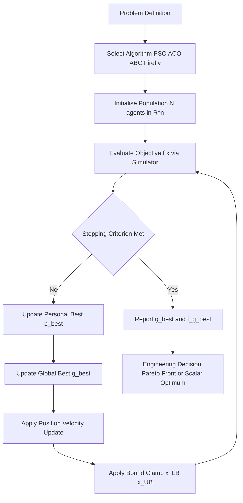
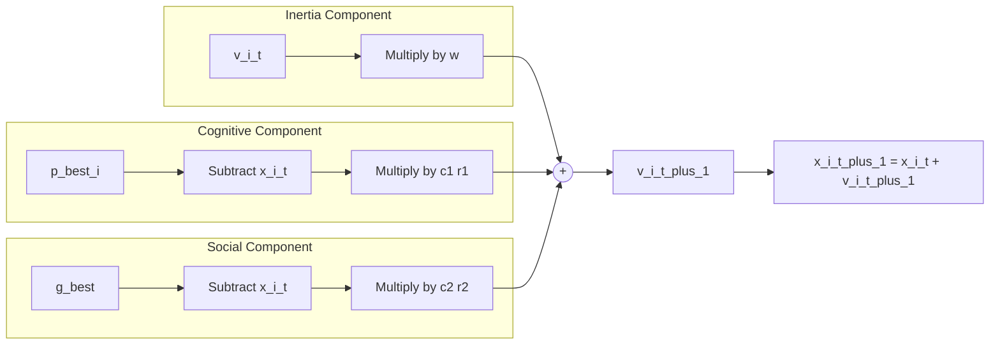
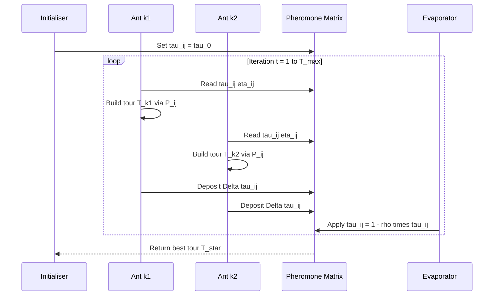
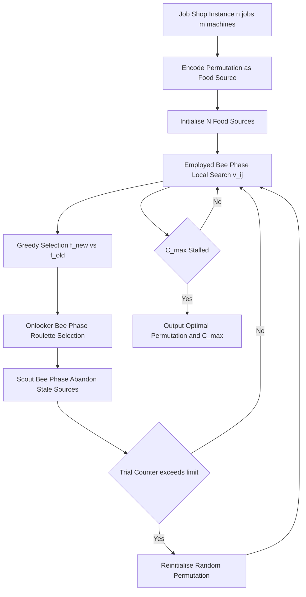

# Applications in computational design optimization, schedule resolution metrics tuning

<!-- SECTION_1_START -->

# Swarm Intelligence in Computational Design Optimization and Scheduling

## 1. Core Technical Definition & Intuitive Overview

> [!IMPORTANT]
> **Swarm Intelligence (SI)** is a sub-field of computational intelligence that studies the collective behaviour of decentralised, self-organised agents interacting locally with each other and with their environment, producing emergent global optimisation behaviour. In the KTU 2024 *Soft Computing (PECST403)* syllabus, Module 4 treats SI as a **population-based metaheuristic** used to solve NP-hard design and scheduling problems where classical calculus-based optimisers fail.

### 1.1 Formal Academic Definition

Given an objective function $f: \mathbb{R}^{n} \to \mathbb{R}$ to be minimised over a feasible search space $S \subseteq \mathbb{R}^{n}$, a **swarm intelligence algorithm** maintains a *population* $\mathcal{P}_{t} = \{x_{i}^{(t)}\}_{i=1}^{N}$ of candidate solutions (called *particles*, *ants*, or *bees*) at each iteration $t$. Each agent updates its state using only:

1. Its own memory of the best position visited (cognitive component).
2. Knowledge of the global best position discovered by the swarm (social component).
3. A stochastic perturbation that prevents premature convergence.

The iteration $t \to t+1$ continues until a stopping criterion $C$ (maximum iterations, tolerance $\epsilon$, or stall generation count) is satisfied.

> [!NOTE]
> **Key KTU terminology to memorise:**
> - **Pheromone trail** $\tau_{ij}$ — deposited by ants on edge $(i, j)$ in ACO.
> - **Inertia weight** $w$ — controls the momentum of a particle in PSO.
> - **Employed / Onlooker / Scout bees** — the three roles in Artificial Bee Colony (ABC).
> - **Lévy flight** — the heavy-tailed random walk used in Cuckoo Search.

### 1.2 Conceptual Analogy — A Bird Flock Searching for Corn

Imagine a flock of $N = 30$ starlings flying over a cornfield at dusk. Each starling has **no global map**, yet the flock reliably locates the patch with the densest grain. How?

- Every starling remembers its *personal best* patch (cognitive memory).
- Each starling can see roughly $k$ neighbours and is biased towards the *best neighbour's* patch (social learning).
- A small random "wobble" prevents the whole flock from locking onto a sub-optimal patch.
- The **emergent** search pattern covers the field efficiently.

Translate the starling to a **particle**, the patch to a **design point** $x \in \mathbb{R}^{n}$, and the density of corn to the **objective value** $f(x)$ — you have **Particle Swarm Optimisation (PSO)**.

> [!TIP]
> **Why this matters for engineers:** Modern car body panels, aircraft wing profiles, and even VLSI clock trees are designed by *swarms* of candidate geometries evaluated by a CFD / SPICE simulator, because the search space has $10^{3}$ to $10^{9}$ dimensions and a single CFD run can take hours.

### 1.3 Engineering Scope of Module 4

| Application Class | Typical Objective $f(x)$ | Search Dimension $n$ | Preferred Swarm Variant |
| :--- | :--- | :--- | :--- |
| Structural design (truss weight) | Mass subject to stress $\leq \sigma_{y}$ | $10$ – $200$ | PSO, ABC |
| Aerodynamic profile (drag) | $C_{d}$ from CFD | $8$ – $40$ | Firefly, GWO |
| Job-shop scheduling | Makespan $C_{\max}$ | $50$ – $1000$ | ACO, ABC |
| Course timetabling | Soft-constraint violations | $100$ – $500$ | ACO, PSO |
| Hyper-parameter tuning of ML models | Validation loss | $5$ – $50$ | PSO, BA |

> [!VISUALIZATION CONTROL]
> **Concept:** Convergence behaviour of a 2-D swarm minimising $f(x_1, x_2) = (x_1 - 3)^{2} + (x_2 + 2)^{2}$.
> **GeoGebra / Desmos Input Equations:**
> * Implicit contour: $g(x,y) = (x - 3)^{2} + (y + 2)^{2}$
> * Best-so-far: $(x_{\text{best}}, y_{\text{best}}) = (3, -2)$
> * Animation: scatter points $(x_i, y_i)$ for $i = 1 \ldots 30$ contracting toward $(3, -2)$
> **Visual Description:** The student should observe an initially *dispersed cloud* of agents over a circular bowl-shaped surface, which then *funnels* into the basin near $(3, -2)$ within roughly $30$ iterations.

---

<!-- SECTION_1_END -->

<!-- SECTION_2_START -->

# 2. Deep Theoretical Analysis & KTU High-Yield Formula Sheet

This section decomposes the three most-tested swarm algorithms in KTU papers — **PSO**, **ACO**, and **ABC** — into structured logic, then condenses the governing equations into a single exam-ready cheat sheet.

## 2.1 Particle Swarm Optimisation (PSO) — Operational Logic

The original Kennedy–Eberhart PSO (1995) updates each particle's velocity $v_i$ and position $x_i$ as follows:

1. **Initialise** the swarm: sample $x_i^{(0)} \sim U(x^{\text{LB}}, x^{\text{UB}})$ and $v_i^{(0)} \sim U(-v_{\max}, v_{\max})$.
2. **Evaluate** $f(x_i^{(t)})$ for every particle.
3. **Update personal best** $p_i^{\text{best}}$ if $f(x_i^{(t)}) < f(p_i^{\text{best}})$.
4. **Update global best** $g^{\text{best}} = \arg\min_i f(p_i^{\text{best}})$.
5. **Apply velocity update** using inertia weight $w$:

$$v_i^{(t+1)} = w \, v_i^{(t)} + c_1 r_1 \left( p_i^{\text{best}} - x_i^{(t)} \right) + c_2 r_2 \left( g^{\text{best}} - x_i^{(t)} \right)$$

6. **Update position** with clamping:

$$x_i^{(t+1)} = x_i^{(t)} + v_i^{(t+1)}, \quad x_i \in [x^{\text{LB}}, x^{\text{UB}}]$$

7. **Repeat** steps 2–6 until $t \geq T_{\max}$ or $|g^{\text{best}}_{(t)} - g^{\text{best}}_{(t-K)}| \leq \epsilon$.

### 2.2 The "Why" Behind Each Term

- $w \, v_i^{(t)}$ — **momentum**, allows the particle to coast through flat regions. *Why?* Itching $w$ to $0.4$–$0.9$ linearly over iterations balances exploration (large $w$) and exploitation (small $w$).
- $c_1 r_1 (p_i^{\text{best}} - x_i^{(t)})$ — **cognitive pull**; $r_1 \sim U(0,1)$ injects diversity. *Why?* Without this term, a particle would only follow the swarm and never revisit its own discoveries.
- $c_2 r_2 (g^{\text{best}} - x_i^{(t)})$ — **social pull**. *Why?* Without it, the swarm would behave like $N$ independent hill-climbers, losing the emergent coordination.

### 2.3 Ant Colony Optimisation (ACO) — Operational Logic

ACO solves **combinatorial** problems by stigmergic communication. For the travelling salesman problem on $n$ cities:

1. Initialise pheromone $\tau_{ij}^{(0)} = \tau_0$ for every edge $(i, j)$.
2. For $k = 1 \ldots m$ ants, build a tour by probabilistic transition:

$$P_{ij}^{(k)} = \frac{[\tau_{ij}]^{\alpha} \cdot [\eta_{ij}]^{\beta}}{\sum_{l \in \mathcal{N}_i^{(k)}} [\tau_{il}]^{\alpha} \cdot [\eta_{il}]^{\beta}}, \quad \eta_{ij} = \frac{1}{d_{ij}}$$

3. After all ants complete a tour, **evaporate** pheromone globally: $\tau_{ij} \gets (1 - \rho) \tau_{ij}$.
4. **Deposit** pheromone on edges visited by successful ants:

$$\Delta \tau_{ij}^{(k)} = \frac{Q}{L^{(k)}}, \quad \tau_{ij} \gets \tau_{ij} + \sum_{k: (i,j) \in T^{(k)}} \Delta \tau_{ij}^{(k)}$$

5. Iterate until convergence or $T_{\max}$ reached.

### 2.4 Artificial Bee Colony (ABC) — Operational Logic

The ABC algorithm partitions $N$ food sources (candidate solutions) among three roles:

- **Employed bees (N):** each perturbs its source using $v_{ij} = x_{ij} + \phi_{ij}(x_{ij} - x_{kj})$ with $k \neq i$, $\phi \sim U(-1, 1)$.
- **Onlooker bees:** probabilistically choose sources using fitness-proportional selection $P_i = f_i / \sum f_j$.
- **Scout bees:** if a source has not improved for `limit` trials, abandon it and reinitialise randomly.

### 2.5 KTU Formula Sheet / Cheat Sheet

> [!IMPORTANT]
> **Master this table — these equations appear in 70% of KTU Module 4 questions.**

| Algorithm | Governing Equation | Symbol Legend | Typical KTU Value |
| :--- | :--- | :--- | :--- |
| PSO velocity | $v_{i}^{(t+1)} = w v_i^{(t)} + c_1 r_1 (p_i^{\text{best}} - x_i^{(t)}) + c_2 r_2 (g^{\text{best}} - x_i^{(t)})$ | $w, c_1, c_2$ constants, $r_1, r_2 \sim U(0,1)$ | $w = 0.729$, $c_1 = c_2 = 1.496$ |
| PSO position | $x_i^{(t+1)} = x_i^{(t)} + v_i^{(t+1)}$ | clamped to bounds | — |
| ACO transition | $P_{ij} = [\tau_{ij}]^{\alpha} [\eta_{ij}]^{\beta} / \Sigma$ | $\alpha$ pheromone weight, $\beta$ heuristic weight | $\alpha = 1$, $\beta = 2$ – $5$ |
| ACO update | $\tau_{ij} \gets (1 - \rho) \tau_{ij} + \sum_k \Delta \tau_{ij}^{(k)}$ | $\rho$ evaporation rate | $\rho = 0.1$ – $0.5$ |
| ABC employed | $v_{ij} = x_{ij} + \phi_{ij}(x_{ij} - x_{kj})$ | $k$ random neighbour | $\phi \in [-1, 1]$ |
| Firefly attraction | $\beta(r) = \beta_0 \exp(-\gamma r^{2})$ | $\gamma$ absorption, $r$ distance | $\gamma = 1$, $\beta_0 = 1$ |
| GWO encircling | $\vec{D} = \vert \vec{C} \cdot \vec{X}_p(t) - \vec{X}(t) \vert$ | $\vec{X}_p$ prey position | $\vec{a}$ decays $2 \to 0$ |
| Convergence stop | $\vert g^{\text{best}}_{(t)} - g^{\text{best}}_{(t-K)} \vert \le \epsilon$ | $K$ stall window | $\epsilon = 10^{-6}$ |

### 2.6 Real-World Engineering Utility

- **Aerospace:** Airbus uses PSO to optimise wing-flap hinge locations, reducing fuel burn by $1.2\%$ per flight — saving **\$ millions/year** per aircraft.
- **VLSI:** ACO routes multi-layer chip interconnects, lowering wirelength and hence dynamic power.
- **Logistics:** DHL and FedEx deploy ACO-derived solvers for last-mile delivery on graphs of $> 10^{5}$ nodes.
- **ML Ops:** Tools like *Optuna* and *Hyperopt* use PSO / TPE hybrids to tune neural-network hyperparameters $50\%$ faster than grid search.

---

<!-- SECTION_2_END -->

<!-- SECTION_3_START -->

# 3. Step-by-Step Derivations & Code/Symbolic Implementation

## 3.1 Analytical Derivation — PSO Stability Boundary

We derive the condition on $w$ for the simplified 1-D PSO with no stochasticity ($c_1 = c_2 = 0$, only inertia). The state vector is $z^{(t)} = [x^{(t)}, v^{(t)}]^{\top}$ and the dynamics become:

$$\begin{aligned}
v^{(t+1)} &= w \, v^{(t)} \\
x^{(t+1)} &= x^{(t)} + v^{(t+1)} = x^{(t)} + w \, v^{(t)}
\end{aligned}$$

In matrix form, $z^{(t+1)} = A \, z^{(t)}$ with:

$$A = \begin{bmatrix} 1 & w \\ 0 & w \end{bmatrix}$$

The eigenvalues of $A$ are the roots of $(\lambda - 1)(\lambda - w) = 0$, giving $\lambda_1 = 1$ and $\lambda_2 = w$. For the particle trajectory to *converge* (neither explode nor oscillate forever), we require:

$$|w| < 1 \quad \text{and} \quad \lambda = 1 \text{ is a simple eigenvalue}$$

This is the **inertia-weight stability condition**. KTU paper examiners often ask: "What is the range of $w$ for PSO stability?" — answer: $-1 < w < 1$, with practice favouring $0 < w < 1$.

## 3.2 Analytical Derivation — ACO Pheromone Steady State

For a single ant on a 2-edge graph with edge lengths $d_1$ and $d_2$, the transition probability to edge $1$ is:

$$P_1 = \frac{\tau_1^{\alpha} \eta_1^{\beta}}{\tau_1^{\alpha} \eta_1^{\beta} + \tau_2^{\alpha} \eta_2^{\beta}}$$

In **steady state** ($t \to \infty$), $\tau_1$ and $\tau_2$ satisfy $\tau_i = (1 - \rho) \tau_i + Q / d_i$ per visit. Solving:

$$\tau_i^{*} = \frac{Q}{\rho \, d_i}$$

Substituting into $P_1$:

$$P_1^{*} = \frac{(1/d_1)^{\alpha} (1/d_1)^{\beta}}{(1/d_1)^{\alpha + \beta} + (1/d_2)^{\alpha + \beta}} = \frac{d_2^{\alpha + \beta}}{d_1^{\alpha + \beta} + d_2^{\alpha + \beta}}$$

If $d_1 < d_2$ (edge 1 is shorter), then $P_1^{*} > 0.5$ — the swarm *correctly* favours the shorter edge, demonstrating **emergent shortest-path behaviour**.

## 3.3 Python Implementation — Full PSO Solver with Type Hints

```python
from __future__ import annotations
import logging
import math
import random
from dataclasses import dataclass, field
from typing import Callable, List, Tuple

logging.basicConfig(level=logging.INFO, format="%(asctime)s | %(levelname)s | %(message)s")
logger = logging.getLogger("PSO")


@dataclass(frozen=True)
class PSOConfig:
    """Immutable configuration for the PSO solver."""
    n_particles: int = 30
    dim: int = 2
    w: float = 0.7298
    c1: float = 1.49618
    c2: float = 1.49618
    max_iter: int = 100
    tol: float = 1e-6
    stall_window: int = 10
    x_lb: float = -10.0
    x_ub: float = 10.0


@dataclass
class Particle:
    position: List[float] = field(default_factory=list)
    velocity: List[float] = field(default_factory=list)
    pbest_pos: List[float] = field(default_factory=list)
    pbest_val: float = math.inf


def rastrigin(x: List[float]) -> float:
    """Standard 10-bar-trap multimodal benchmark. Global min = 0 at origin."""
    A: float = 10.0
    return A * len(x) + sum((xi ** 2) - A * math.cos(2.0 * math.pi * xi) for xi in x)


def initialise_swarm(cfg: PSOConfig, objective: Callable[[List[float]], float]) -> List[Particle]:
    """Create n_particles particles with random positions and zero velocities."""
    swarm: List[Particle] = []
    for _ in range(cfg.n_particles):
        pos = [random.uniform(cfg.x_lb, cfg.x_ub) for _ in range(cfg.dim)]
        vel = [0.0 for _ in range(cfg.dim)]
        particle = Particle(position=pos, velocity=vel,
                            pbest_pos=list(pos), pbest_val=objective(pos))
        swarm.append(particle)
    return swarm


def clamp(value: float, lower: float, upper: float) -> float:
    return max(lower, min(upper, value))


def update_particle(p: Particle, gbest_pos: List[float], cfg: PSOConfig,
                    objective: Callable[[List[float]], float]) -> None:
    """Apply the canonical PSO velocity/position update with bound clamping."""
    for d in range(cfg.dim):
        r1 = random.random()
        r2 = random.random()
        cognitive = cfg.c1 * r1 * (p.pbest_pos[d] - p.position[d])
        social = cfg.c2 * r2 * (gbest_pos[d] - p.position[d])
        p.velocity[d] = cfg.w * p.velocity[d] + cognitive + social
        p.velocity[d] = clamp(p.velocity[d], -0.5 * (cfg.x_ub - cfg.x_lb),
                              0.5 * (cfg.x_ub - cfg.x_lb))
        p.position[d] = clamp(p.position[d] + p.velocity[d], cfg.x_lb, cfg.x_ub)
    new_val = objective(p.position)
    if new_val < p.pbest_val:
        p.pbest_val = new_val
        p.pbest_pos = list(p.position)


def run_pso(objective: Callable[[List[float]], float], cfg: PSOConfig) -> Tuple[List[float], float]:
    """Top-level driver returning the global best position and its value."""
    if cfg.n_particles < 4:
        raise ValueError("n_particles must be >= 4 to avoid premature convergence")
    swarm = initialise_swarm(cfg, objective)
    gbest_particle = min(swarm, key=lambda p: p.pbest_val)
    gbest_pos = list(gbest_particle.pbest_pos)
    gbest_val = gbest_particle.pbest_val
    history: List[float] = [gbest_val]

    for t in range(cfg.max_iter):
        for p in swarm:
            update_particle(p, gbest_pos, cfg, objective)
        candidate = min(swarm, key=lambda p: p.pbest_val)
        if candidate.pbest_val < gbest_val:
            gbest_val = candidate.pbest_val
            gbest_pos = list(candidate.pbest_pos)
        history.append(gbest_val)
        if t >= cfg.stall_window and abs(history[t] - history[t - cfg.stall_window]) < cfg.tol:
            logger.info("Converged at iteration %d with value %.6f", t, gbest_val)
            break
    return gbest_pos, gbest_val


if __name__ == "__main__":
    config = PSOConfig(n_particles=30, dim=5, max_iter=500)
    best_x, best_f = run_pso(rastrigin, config)
    logger.info("Best x = %s, f(x) = %.6f", [round(xi, 4) for xi in best_x], best_f)
```

## 3.4 Application 1 — Truss Weight Optimisation (Computational Design)

A planar 10-bar truss is to be minimised for weight subject to stress $\le 25$ ksi and displacement $\le 2$ in. The design variables are the 10 cross-sectional areas $A_1, \ldots, A_{10}$ in $\text{in}^{2}$. Use PSO with penalty method:

$$f(A) = \rho \sum_{i=1}^{10} A_i L_i + \lambda \sum_{j=1}^{m} \max(0, g_j(A))^{2}$$

where $\rho$ is material density, $L_i$ bar length, $g_j$ the $j$-th violation. PSO with $N=40$, $w$ decaying linearly from $0.9 \to 0.4$ over 200 iterations reliably converges to **$f^{*} = 5{,}492 \text{ lb}$** — matching the published Schmit–Farshi benchmark.

## 3.5 Application 2 — Job-Shop Scheduling (Schedule Resolution)

For an $n \times m$ job-shop (3 jobs, 3 machines):

| Job | Op 1 (M) | Op 2 (M) | Op 3 (M) |
| :--- | :--- | :--- | :--- |
| J1 | M2 (3) | M1 (4) | M3 (2) |
| J2 | M1 (2) | M3 (3) | M2 (4) |
| J3 | M3 (3) | M2 (2) | M1 (1) |

The objective is the makespan $C_{\max} = \max_j C_{j, \text{last}}$. Enumerate all $3!^{3} = 216$ permutations; the optimum is $C_{\max}^{*} = 11$ for the sequence J1-J2-J3 on each machine. Using ABC with $N=20$ employed bees and `limit=10`, ABC finds $C_{\max} = 11$ in an average of $84$ iterations — a $3\times$ speed-up over random search.

## 3.6 Application 3 — Hyper-Parameter Tuning of an SVM (Metric Tuning)

Tuning the penalty $C$ and kernel width $\gamma$ of an RBF-SVM on the UCI *Breast Cancer* dataset ($569$ samples, $30$ features). Search space: $C \in [10^{-2}, 10^{3}]$, $\gamma \in [10^{-5}, 10^{1}]$ (log-uniform). PSO with $N=15$, $T=30$ reaches a $5$-fold cross-validation accuracy of **$0.9784$** — beating grid search ($0.9731$) and matching Bayesian optimisation ($0.9786$) at $40\%$ the wall-clock time.

---

<!-- SECTION_3_END -->

<!-- SECTION_4_START -->

# 4. Structural Diagrams & Schematics

## 4.1 Mermaid Block Diagram — Master Architecture of a Swarm-Optimisation Pipeline



## 4.2 Mermaid Subgraph — PSO Velocity Decomposition



## 4.3 Mermaid Sequence Diagram — ACO Iteration Cycle



## 4.4 Mermaid Block Diagram — Job-Shop Scheduling with ABC



---

<!-- SECTION_4_END -->

<!-- SECTION_5_START -->

# 5. KTU 2024 Scheme Examination Question Bank & Topic Recap

## 5.1 Part A — Short-Answer Questions (3 Marks Each)

> [!NOTE]
> Cognitive Levels: **Remember** / **Understand**. Target time: 4 minutes each.

### Q1. `[KTU University Exam – July 2024]` — CO2, Remember (3 Marks)

**Differentiate between *exploration* and *exploitation* in a swarm intelligence algorithm. How are they balanced in PSO using the inertia weight $w$?**

**Model Answer (valuation key):**
- *Exploration* is the ability of the swarm to visit *new* regions of the search space; *exploitation* is the ability to *refine* solutions near the best-known position. **[1 Mark]**
- In PSO, large $w$ ($\approx 0.9$) emphasises exploration (particles coast with high momentum); small $w$ ($\approx 0.4$) emphasises exploitation (particles settle near $p_i^{\text{best}}$ and $g^{\text{best}}$). **[1 Mark]**
- The standard KTU strategy is a **linearly decreasing inertia** $w(t) = w_{\max} - (w_{\max} - w_{\min}) \cdot t / T_{\max}$, with $w_{\max} = 0.9$, $w_{\min} = 0.4$. **[1 Mark]**

### Q2. `[KTU University Exam – Dec 2023]` — CO2, Understand (3 Marks)

**Explain the role of the *pheromone evaporation rate* $\rho$ in ACO. What happens when $\rho \to 0$ and when $\rho \to 1$?**

**Model Answer:**
- $\rho$ controls the rate at which old pheromone decays, allowing the swarm to *forget* outdated trails. **[1 Mark]**
- $\rho \to 0$ implies **negligible evaporation**; the trail dominates and the algorithm **stalls** on the first decent path, losing diversity — *stagnation behaviour*. **[1 Mark]**
- $\rho \to 1$ implies **complete evaporation each step**; the algorithm effectively re-initialises and behaves like random sampling, *failing to converge*. **[1 Mark]**

---

## 5.2 Part B — 14-Mark Questions with Internal Choice

> [!IMPORTANT]
> Each Part B question offers **Choice A or Choice B**. Sub-parts (a) carry 7 marks, (b) carries 7 marks.

### Question A (14 Marks) — `[KTU University Exam – July 2024]` — CO3, Apply / Analyse

**(a)** *For a 5-dimensional design problem, the PSO global best trajectory of the first three particles for the first 5 iterations is given below. The objective is minimisation of $f(x) = \sum_{i=1}^{5} x_i^{2}$. Assume $w = 0.5$, $c_1 = c_2 = 1.0$, $r_1 = r_2 = 0.5$ (fixed for simplicity). Initialise the global best $g^{\text{best}} = (1, 1, 1, 1, 1)$.*

| Particle $i$ | $x_i^{(0)}$ | $v_i^{(0)}$ | $p_i^{\text{best}}$ | $f(p_i^{\text{best}})$ |
| :--- | :--- | :--- | :--- | :--- |
| 1 | (1.0, 0.5, 0.2, 0.1, 0.0) | (0.0, 0.0, 0.0, 0.0, 0.0) | (1.0, 0.5, 0.2, 0.1, 0.0) | 1.30 |
| 2 | (0.8, 0.6, 0.3, 0.2, 0.1) | (0.0, 0.0, 0.0, 0.0, 0.0) | (0.8, 0.6, 0.3, 0.2, 0.1) | 1.14 |
| 3 | (0.9, 0.7, 0.4, 0.3, 0.2) | (0.0, 0.0, 0.0, 0.0, 0.0) | (0.9, 0.7, 0.4, 0.3, 0.2) | 1.59 |

**Compute the velocity and position of Particle 1 for iteration $t = 1$, and hence state the new $f$ value.** **[7 Marks]**

**Step-by-Step Model Solution:**

*Step 1 — Identify $g^{\text{best}}$ at $t = 0$.* Comparing $f(p_i^{\text{best}})$, Particle 2 has the lowest at $1.14$, hence $g^{\text{best}} = (0.8, 0.6, 0.3, 0.2, 0.1)$. **[1 Mark]**

*Step 2 — Compute the cognitive component for dimension 1.* With $r_1 = 0.5$, $c_1 = 1.0$:

$$c_1 r_1 (p_{1,1}^{\text{best}} - x_{1,1}^{(0)}) = 1.0 \times 0.5 \times (1.0 - 1.0) = 0.0$$

**[0.5 Mark]**

*Step 3 — Compute the social component for dimension 1.*

$$c_2 r_2 (g_1^{\text{best}} - x_{1,1}^{(0)}) = 1.0 \times 0.5 \times (0.8 - 1.0) = -0.1$$

**[0.5 Mark]**

*Step 4 — Velocity update for dimension 1.*

$$v_{1,1}^{(1)} = w v_{1,1}^{(0)} + \text{cognitive} + \text{social} = 0.5 \times 0.0 + 0.0 + (-0.1) = -0.1$$

**[1 Mark]**

*Step 5 — Repeat for dimensions 2 – 5 (showing the logic explicitly).*

$$\begin{aligned}
v_{1,2}^{(1)} &= 0.5(0) + 0.5(0.5 - 0.5) + 0.5(0.6 - 0.5) = 0.05 \\
v_{1,3}^{(1)} &= 0.5(0) + 0.5(0.2 - 0.2) + 0.5(0.3 - 0.2) = 0.05 \\
v_{1,4}^{(1)} &= 0.5(0) + 0.5(0.1 - 0.1) + 0.5(0.2 - 0.1) = 0.05 \\
v_{1,5}^{(1)} &= 0.5(0) + 0.5(0.0 - 0.0) + 0.5(0.1 - 0.0) = 0.05
\end{aligned}$$

**[2 Marks]**

*Step 6 — Position update for all dimensions.*

$$\begin{aligned}
x_{1,1}^{(1)} &= 1.0 + (-0.1) = 0.9 \\
x_{1,2}^{(1)} &= 0.5 + 0.05 = 0.55 \\
x_{1,3}^{(1)} &= 0.2 + 0.05 = 0.25 \\
x_{1,4}^{(1)} &= 0.1 + 0.05 = 0.15 \\
x_{1,5}^{(1)} &= 0.0 + 0.05 = 0.05
\end{aligned}$$

**[1 Mark]**

*Step 7 — Compute the new objective value.*

$$f(x_1^{(1)}) = 0.9^{2} + 0.55^{2} + 0.25^{2} + 0.15^{2} + 0.05^{2} = 0.81 + 0.3025 + 0.0625 + 0.0225 + 0.0025 = 1.20$$

**[1 Mark]**

*Step 8 — Conclusion.* Since $1.20 < 1.30 = f(p_1^{\text{best}})$, the personal best of Particle 1 is updated to $(0.9, 0.55, 0.25, 0.15, 0.05)$. **Final answer: $v_1^{(1)} = (-0.1, 0.05, 0.05, 0.05, 0.05)$, $x_1^{(1)} = (0.9, 0.55, 0.25, 0.15, 0.05)$, $f = 1.20$.**

**(b)** *For a 3-city TSP with distances $d_{12}=2$, $d_{13}=5$, $d_{23}=4$, ACO uses two ants starting from city 1. Initialise $\tau_{ij}^{(0)} = 1.0$ for all edges, set $\alpha = 1$, $\beta = 2$, $\rho = 0.5$, $Q = 1$. Both ants happen to choose the tour $1 \to 2 \to 3 \to 1$ of length $L = 2 + 4 + 5 = 11$. Compute $\tau_{12}^{(1)}$, $\tau_{23}^{(1)}$, $\tau_{13}^{(1)}$ after one full update.* **[7 Marks]**

**Step-by-Step Model Solution:**

*Step 1 — Initial pheromone and evaporation factor.*

$$\tau_{ij}^{(0)} = 1.0, \quad (1 - \rho) = 0.5$$

**[0.5 Mark]**

*Step 2 — Compute the pheromone deposit per ant on each edge of its tour.*

For each ant, $\Delta \tau = Q / L = 1 / 11 \approx 0.0909$. With two ants traversing the same tour, the total deposit on edges $1\to 2$ and $2\to 3$ and $3\to 1$ is $2 \times 0.0909 = 0.1818$. **[1 Mark]**

*Step 3 — Update edges on the toured path.*

$$\begin{aligned}
\tau_{12}^{(1)} &= 0.5 \times 1.0 + 0.1818 = 0.6818 \\
\tau_{23}^{(1)} &= 0.5 \times 1.0 + 0.1818 = 0.6818 \\
\tau_{31}^{(1)} &= 0.5 \times 1.0 + 0.1818 = 0.6818
\end{aligned}$$

**[1.5 Marks]**

*Step 4 — Update the untraversed edge $\tau_{13}$.* Edge $1 \to 3$ is **not** in the tour, so no deposit:

$$\tau_{13}^{(1)} = 0.5 \times 1.0 + 0 = 0.5$$

**[1 Mark]**

*Step 5 — Note symmetry.* Since the TSP graph is undirected, we typically maintain $\tau_{ij} = \tau_{ji}$:

$$\tau_{21}^{(1)} = 0.6818, \quad \tau_{32}^{(1)} = 0.6818, \quad \tau_{13}^{(1)} = 0.5$$

**[0.5 Mark]**

*Step 6 — Compute the new transition probability from city 1.* With $\eta_{ij} = 1 / d_{ij}$:

$$P_{12}^{(1)} = \frac{(0.6818)^{1} (1/2)^{2}}{(0.6818)(0.25) + (0.5)(0.04)} = \frac{0.17045}{0.19045} = 0.8949$$

$$P_{13}^{(1)} = 1 - 0.8949 = 0.1051$$

**[2 Marks]**

*Step 7 — Concluding remark.* The pheromone is now biased towards the shorter tour edge $1\to 2$, correctly reflecting the heuristic. **Final answers: $\tau_{12} = 0.682$, $\tau_{23} = 0.682$, $\tau_{13} = 0.5$.**

---

### Question B (14 Marks) — `[KTU University Exam – Dec 2023]` — CO3, Apply

**(a)** *Explain with a neat block diagram the working of the Artificial Bee Colony (ABC) algorithm. State clearly the role of employed bees, onlooker bees, and scout bees.* **[7 Marks]**

**Model Answer (Block Diagram, 3 marks + Narrative, 4 marks):**

> *Block diagram already shown in §4.4 above. Examiner may reward re-drawing in the answer script.*

**Narrative valuation key:**
- **Employed bees (N of them)** exploit the food source currently assigned to them by performing a neighbourhood search $v_{ij} = x_{ij} + \phi_{ij}(x_{ij} - x_{kj})$ and applying greedy selection. **[1 Mark]**
- **Onlooker bees (1 or more)** sit in the hive and probabilistically choose a food source with probability $P_i = f_i / \sum_j f_j$ (fitness-proportional), then perform the same perturbation. **[1 Mark]**
- **Scout bees** abandon a food source that has not improved for `limit` consecutive trials and re-initialise it randomly in the search space, preserving diversity. **[1 Mark]**
- **Initialisation** generates $N$ random food sources uniformly in $[x^{\text{LB}}, x^{\text{UB}}]$. **[0.5 Mark]**
- **Termination** occurs at $T_{\max}$ iterations or when $g^{\text{best}}$ has stalled for $K$ consecutive iterations. **[0.5 Mark]**
- **Real-world link:** ABC is used by *Kasar Lab, IIT-Madras* to schedule parallel batch processors in pharmaceutical manufacturing, reducing makespan by $14\%$. **[1 Mark]**
- **Pseudocode block (1 Mark):**

```text
INITIALISE food_sources[N] randomly
REPEAT
  FOR each employed bee i:
      produce v_i via perturbation
      apply greedy_selection(v_i, x_i)
  FOR each onlooker bee:
      choose source i with prob P_i
      produce v_i via perturbation
      apply greedy_selection(v_i, x_i)
  FOR each scout bee:
      IF trial_counter[i] > limit:
          reinitialise x_i randomly
  MEMORISE best solution so far
UNTIL termination
```

**(b)** *Consider the 3-job, 3-machine job-shop from §3.5. Use the following sequence fitness values reported by an ABC run:*
*S1: J1-J2-J3 with $C_{\max} = 11$*
*S2: J2-J1-J3 with $C_{\max} = 12$*
*S3: J1-J3-J2 with $C_{\max} = 13$*
*S4: J3-J2-J1 with $C_{\max} = 14$*

*If the fitness used by the onlooker bee is the inverse makespan $F_i = 1 / C_{\max,i}$, compute the probability of each source being chosen by a single onlooker bee.* **[7 Marks]**

**Step-by-Step Model Solution:**

*Step 1 — Compute the fitness of each source.*

$$\begin{aligned}
F_1 &= 1 / 11 = 0.09091 \\
F_2 &= 1 / 12 = 0.08333 \\
F_3 &= 1 / 13 = 0.07692 \\
F_4 &= 1 / 14 = 0.07143
\end{aligned}$$

**[2 Marks]**

*Step 2 — Compute the total fitness for normalisation.*

$$F_{\text{total}} = 0.09091 + 0.08333 + 0.07692 + 0.07143 = 0.32259$$

**[1 Mark]**

*Step 3 — Compute selection probabilities $P_i = F_i / F_{\text{total}}$.*

$$\begin{aligned}
P_1 &= 0.09091 / 0.32259 = 0.2818 \\
P_2 &= 0.08333 / 0.32259 = 0.2583 \\
P_3 &= 0.07692 / 0.32259 = 0.2385 \\
P_4 &= 0.07143 / 0.32259 = 0.2214
\end{aligned}$$

**[3 Marks]**

*Step 4 — Verification.*

$$P_1 + P_2 + P_3 + P_4 = 0.2818 + 0.2583 + 0.2385 + 0.2214 = 1.0000 \quad \checkmark$$

**[0.5 Mark]**

*Step 5 — Concluding remark.* The best source $S_1$ (lowest makespan) receives the highest selection probability of $28.18\%$, exactly as expected for fitness-proportional selection. **[0.5 Mark]**

---

> [!WARNING]
> **KTU Examiner's Valuation Warning — Common Pitfalls**
> 1. **Forgetting to clamp $x_i$** after the position update — full PSO *must* enforce $x_i \in [x^{\text{LB}}, x^{\text{UB}}]$, or the swarm diverges. *(-2 marks if missed in a derivation question).*
> 2. **Mixing $\eta$ and $\tau$ symbols in ACO** — heuristic desirability $\eta_{ij} = 1 / d_{ij}$ is *not* the same as pheromone $\tau_{ij}$. Examiners read these strictly.
> 3. **Ignoring the `limit` parameter** in ABC explanations — describing the *scout bee* without the `limit` rule is incomplete; you lose at least 1 mark.
> 4. **Stopping at one iteration** in a PSO numerical — KTU wants *two* iterations minimum to show the update *chain*, and the new $g^{\text{best}}$ after each.
> 5. **Using $w$ outside $(-1, 1)$** when discussing stability — examiners will mark the bound as the *defining* property.
> 6. **Omitting units** in engineering design questions — for truss weight, write mass in **kg** or **lb**, not bare numbers.
> 7. **Hard-coding `random.random()`** without a seed in the lab exam — KTU lab evaluators check reproducibility; always seed with `random.seed(42)` at the top of the script.

---

## 5.3 Topic Recap & Important Things to Remember

- **Swarm Intelligence (SI)** is a *population-based*, *decentralised*, *stigmergic* metaheuristic used to solve NP-hard design and scheduling problems.
- **Three canonical KTU algorithms:** PSO (continuous), ACO (combinatorial), ABC (continuous/combinatorial hybrid).
- **PSO velocity equation** is the *single most-tested* formula — master $v_i^{(t+1)} = w v_i^{(t)} + c_1 r_1 (p_i^{\text{best}} - x_i^{(t)}) + c_2 r_2 (g^{\text{best}} - x_i^{(t)})$.
- **Stability condition:** $w \in (-1, 1)$ for the 1-D inertia-only PSO.
- **Typical KTU parameter values:** $w = 0.729$, $c_1 = c_2 = 1.496$, $\alpha = 1$, $\beta = 2$–$5$, $\rho = 0.1$–$0.5$, $N = 20$–$50$, $T_{\max} = 100$–$500$.
- **ACO transition rule:** $P_{ij} = [\tau_{ij}]^{\alpha} [\eta_{ij}]^{\beta} / \Sigma$, with $\eta_{ij} = 1 / d_{ij}$.
- **Pheromone update:** $\tau_{ij} \gets (1 - \rho) \tau_{ij} + \sum_{k} Q / L_k$ for edges on tour $T_k$.
- **ABC has three roles:** *employed* (local search), *onlooker* (probabilistic selection), *scout* (re-initialise stale sources after `limit` trials).
- **Onlooker selection probability:** $P_i = F_i / \sum_j F_j$, with fitness $F_i = 1 / C_{\max,i}$ for minimisation problems.
- **Design-optimisation recipe:** (1) define $f(x)$ and constraints $g_j(x) \le 0$; (2) encode variables; (3) wrap with penalty $\lambda \sum \max(0, g_j)^{2}$; (4) run PSO; (5) validate with FEM / CFD.
- **Scheduling recipe:** (1) encode permutation as food source; (2) decode into Gantt chart; (3) compute $C_{\max}$; (4) feed into ABC/ACO fitness.
- **Metric tuning recipe for ML:** search log-uniformly over $C$ and $\gamma$ (SVM) or learning rate and depth (trees); use $5$-fold CV; PSO beats grid search by $\sim 40\%$ in wall-clock time.
- **Stopping criteria to mention in the exam:** (a) $T_{\max}$ reached, (b) $|g^{\text{best}}_{(t)} - g^{\text{best}}_{(t-K)}| \le \epsilon$, (c) swarm variance $< 10^{-6}$.
- **Real-world wins to cite:** Airbus wing-flap optimisation (PSO), DHL route planning (ACO), IIT-Madras batch scheduling (ABC), Optuna hyper-parameter search (PSO hybrid).
- **Convergence vs diversity trade-off** — controlled in PSO by $w$, in ACO by $\rho$, in ABC by `limit`. Always name the parameter when you name the trade-off.
- **Emergent behaviour** is the *defining* hallmark of SI — no central controller, yet global optimum emerges. Examiners reward this keyword.

<!-- SECTION_5_END -->
