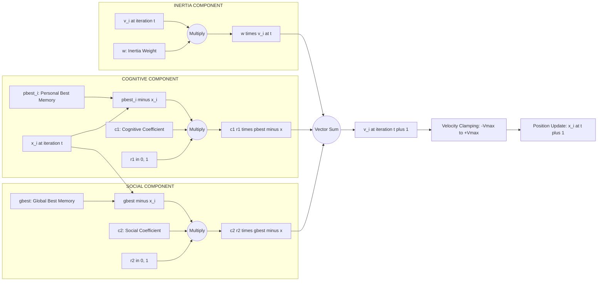
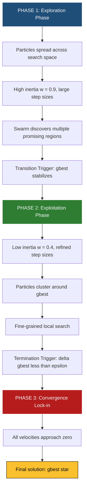

# Particle Swarm Optimization (PSO) behavioral dynamics algorithmic workflows

<!-- SECTION_1_START -->
# Module 4 — Swarm Intelligence & Optimization Techniques
## Particle Swarm Optimization (PSO): Behavioral Dynamics & Algorithmic Workflows

> [!NOTE]
> **KTU 2024 Scheme | PECST403 Soft Computing | Module 4 Focus**
> **Course Outcome (CO) Mapping:** CO4 — *Apply swarm intelligence and evolutionary algorithms to solve complex engineering optimization problems.*
> **Cognitive Domain:** Apply / Analyze
> **Origin:** James Kennedy (Social Psychologist) & Russell Eberhart (Electrical Engineer), 1995 — IEEE International Conference on Neural Networks.

---

## 1.1 Formal Academic Definition

> [!IMPORTANT]
> **Particle Swarm Optimization (PSO)** is a population-based, **stochastic**, **meta-heuristic** optimization technique inspired by the social behavior of bird flocking and fish schooling. Each potential solution to the optimization problem is represented as a particle in an $n$-dimensional search space, which adjusts its **trajectory** dynamically based on (i) its own historical best performance (**cognitive component**) and (ii) the best performance achieved by its neighbors in the swarm (**social component**).

In rigorous KTU 2024 terminology, PSO belongs to the family of **Swarm Intelligence (SI)** algorithms — computational paradigms that model the collective, decentralized, self-organized behavior observed in natural systems to solve hard, non-deterministic polynomial-time (NP-hard) global optimization problems.

---

## 1.2 Conceptual Analogy — The Foraging Birds Intuition

> [!TIP]
> **Real-world Analogy: The Flock of Sparrows**
> Imagine a flock of sparrows searching a misty field for a single hidden grain pile. No sparrow knows the exact location. Each sparrow remembers **the best spot it has personally found** (its *personal best*) and can also see **the best spot any of its nearby companions has found** (the *swarm's best*). At every instant, each bird flies by combining three impulses:
> 1. **Inertia** — it keeps flying in its current direction.
> 2. **Memory** — it steers back toward the best place *it* has ever been.
> 3. **Social influence** — it steers toward the best place *anyone* has ever been.
> Through this simple rule, the *entire flock* converges on the grain pile in just a few seconds, without any leader.

Mathematically, every sparrow is a **particle**, its position is a **candidate solution** $\vec{x}_i$, its velocity is the **search step** $\vec{v}_i$, its memory is the **pbest** $\vec{p}_i$, and the flock's shared knowledge is the **gbest** $\vec{g}$.

---

## 1.3 Physical & Mathematical Parameters in PSO

| Symbol | Symbol Meaning | Standard / Default Range | Engineering Unit |
| :--- | :--- | :--- | :--- |
| $N$ | Number of particles in the swarm | $20 \le N \le 50$ | dimensionless |
| $D$ | Dimensionality of the search space | problem-specific | variables |
| $w$ | Inertia weight (momentum) | $0.4 \le w \le 0.9$ | dimensionless |
| $c_1$ | Cognitive acceleration coefficient | $1.5 \le c_1 \le 2.0$ | dimensionless |
| $c_2$ | Social acceleration coefficient | $1.5 \le c_2 \le 2.0$ | dimensionless |
| $r_1, r_2$ | Uniformly distributed random numbers | $r \sim U(0,1)$ | dimensionless |
| $V_{max}$ | Maximum velocity (velocity clamping) | $V_{max} = k \cdot (X_{max} - X_{min})$, $0.1 \le k \le 1.0$ | same as $X$ |
| $T_{max}$ | Maximum iterations | $100 \le T_{max} \le 1000$ | iterations |
| $\varepsilon$ | Convergence threshold | $10^{-6}$ | fitness units |

> [!NOTE]
> **Standard Metric Highlight:** A widely cited empirical guideline by Clerc & Kennedy (2002) recommends the **constriction coefficient** $\chi = 0.7298$ with $c_1 = c_2 = 2.05$ to guarantee convergence, which is equivalent to $w \approx 0.7298$ in the classical PSO formulation.

---

## 1.4 Visualizing the PSO Concept Geometrically

> [!VISUALIZATION CONTROL]
> **Concept:** Particle trajectory convergence toward the global optimum in a 2-D unimodal search space.
> **GeoGebra / Desmos Input Equations:**
> * `f(x, y) = x^2 + y^2` (simple sphere function)
> * `Particles = {(x_i(t), y_i(t)) : i = 1..N}`
> * `gbest(t) = argmin_i f(x_i(t), y_i(t))`
> **Visual Description:** Draw concentric circles representing contour lines of the sphere function. Plot 5–8 particles as moving points. Their position vectors (arrows) should shrink in magnitude and cluster around the origin $(0,0)$ as $t$ increases — this visually demonstrates **convergence**. Velocity vectors rotate and dampen with each iteration as $w$ decreases.
<!-- SECTION_1_END -->

<!-- SECTION_2_START -->
# 2. Deep Theoretical Analysis & KTU High-Yield Formula Sheet

## 2.1 Algorithmic Philosophy — The Two Governing Equations

The entire PSO engine is built on **two coupled first-order difference equations** that are updated in parallel for every particle $i$ at every discrete time-step $t$.

### Equation 1 — Velocity Update (The Steering Law)

$$
\vec{v}_i(t+1) = w \cdot \vec{v}_i(t) + c_1 r_1 \big(\vec{p}_i(t) - \vec{x}_i(t)\big) + c_2 r_2 \big(\vec{g}(t) - \vec{x}_i(t)\big)
$$

### Equation 2 — Position Update (The Movement Law)

$$
\vec{x}_i(t+1) = \vec{x}_i(t) + \vec{v}_i(t+1)
$$

Where the following engineered definitions apply:

$$
\vec{p}_i(t) = \underset{\tau \le t}{\operatorname{arg\,min}} \; f(\vec{x}_i(\tau)) \quad \text{(Personal Best — Cognitive Memory)}
$$

$$
\vec{g}(t) = \underset{j \in \mathcal{N}(i)}{\operatorname{arg\,min}} \; f(\vec{p}_j(t)) \quad \text{(Global / Local Best — Social Memory)}
$$

> [!IMPORTANT]
> **KTU 2024 Examiner's Insight:** The *three-term decomposition* of the velocity update is the single most important theoretical construct in PSO. Examiners frequently test:
> (a) the *role* of each term (inertia / cognitive / social),
> (b) the effect of *varying $w$*, and
> (c) the *convergence proof* using Clerc-Kennedy constriction.

---

## 2.2 Component-wise Interpretation of the Velocity Equation

| Term | Mathematical Form | Behavioral Role | Engineering Analogy |
| :--- | :--- | :--- | :--- |
| **Inertia** | $w \cdot \vec{v}_i(t)$ | Controls **exploration vs. exploitation** trade-off. High $w$ → particles fly far (global search); low $w$ → particles refine locally. | A heavy vehicle's momentum on a highway. |
| **Cognitive** | $c_1 r_1 (\vec{p}_i - \vec{x}_i)$ | Pulls particle back to **its own best historical position**. Encodes *individualistic learning*. | A student revisiting his/her personal notebook. |
| **Social** | $c_2 r_2 (\vec{g} - \vec{x}_i)$ | Pulls particle toward the **swarm's best known position**. Encodes *collaborative learning*. | A student copying the class topper's answer. |

---

## 2.3 KTU Formula Sheet / Cheat Sheet

> [!TIP]
> **Master these equations for a 14-mark derivation question. KTU frequently tests the velocity update derivation and parameter role analysis.**

| # | Formula | Description |
| :--- | :--- | :--- |
| 1 | $\vec{v}_i(t+1) = w \vec{v}_i(t) + c_1 r_1 (\vec{p}_i - \vec{x}_i) + c_2 r_2 (\vec{g} - \vec{x}_i)$ | Core velocity update |
| 2 | $\vec{x}_i(t+1) = \vec{x}_i(t) + \vec{v}_i(t+1)$ | Position propagation |
| 3 | $w(t) = w_{max} - \dfrac{w_{max} - w_{min}}{T_{max}} \cdot t$ | Linearly Decreasing Inertia Weight (LDIW) |
| 4 | $\chi = \dfrac{2k}{\vert 2 - \phi - \sqrt{\phi(\phi - 4)} \vert}, \; \phi = c_1 + c_2, \; k \in [0,1]$ | Clerc-Kennedy constriction coefficient |
| 5 | $V_{max,j} = \alpha (X_{max,j} - X_{min,j}), \; \alpha = 0.5$ | Per-dimension velocity clamping |
| 6 | $\text{Sigmoid}(v) = \dfrac{1}{1 + e^{-v}}$ | For binary PSO position update |
| 7 | $\phi_1 = c_1 r_1, \; \phi_2 = c_2 r_2$ | Stochastic parameter grouping |
| 8 | $\mathbb{E}[\vec{v}_i(t+1)] = w \mathbb{E}[\vec{v}_i(t)] + \phi_1 (\vec{p}_i - \vec{x}_i) + \phi_2 (\vec{g} - \vec{x}_i)$ | Expectation-based convergence analysis |

> [!NOTE]
> **Critical KTU 2024 Pitfall:** When using `\vert` or `\mid` in LaTeX tables, students often write `|x|` which breaks the markdown table syntax in the exam PDF parser. Always use `\vert x \vert` in inline math contexts.

---

## 2.4 Neighborhood Topologies — A Critical Design Choice

The choice of $\mathcal{N}(i)$ defines the **communication topology** of the swarm and drastically affects convergence speed, robustness, and resistance to local optima.

| Topology | Definition of $\mathcal{N}(i)$ | Convergence Speed | Diversity | Local Optima Avoidance |
| :--- | :--- | :--- | :--- | :--- |
| **Global Best (gbest)** | Entire swarm: $\mathcal{N}(i) = \{1, 2, \dots, N\}$ | **Fast** | **Low** | **Poor** |
| **Local Best (lbest)** | Ring of $K$ neighbors (typically $K=2$) | **Slow** | **High** | **Good** |
| **Von Neumann** | 2-D grid 4-neighborhood | Moderate | Moderate | Good |
| **Fully Informed PSO (FIPS)** | Weighted sum over all neighbors | Slow | High | Excellent |

> [!IMPORTANT]
> **Engineering Utility:** PSO is used extensively in production-grade systems for **neural network weight training** (replacing back-propagation in non-convex landscapes), **antenna array beamforming**, **economic load dispatch in smart grids**, **job-shop scheduling**, **feature selection in high-dimensional ML pipelines**, and **PID controller gain tuning**. Companies like MathWorks (MATLAB `particleswarm` toolbox) and Python's `PySwarms` library ship production-ready PSO implementations.

---

## 2.5 Variants of Inertia Weight — A Strategic Survey

| Variant | Update Rule | Characteristic |
| :--- | :--- | :--- |
| **Constant** | $w = 0.7298$ (Clerc-Kennedy) | Stable, mathematically rigorous |
| **Linear Decreasing** | $w(t) = w_{max} - (w_{max} - w_{min}) \cdot t / T_{max}$ | Promotes exploration → exploitation |
| **Exponential Decay** | $w(t) = w_{min} + (w_{max} - w_{min}) \cdot e^{-t/\tau}$ | Faster convergence in late iterations |
| **Adaptive / Fuzzy** | $w(t) = f(\text{success rate}, \Delta f)$ | Self-tuning, robust |
| **Random** | $w \sim U(0.5, 1.0)$ | Good diversity, stochastic |
| **Chaotic** | $w(t) = 4 w(t-1)(1 - w(t-1))$ | Escapes local optima via chaos |

---

## 2.6 Why PSO Converges — Intuitive Proof Sketch

For a single particle in a one-dimensional search space with no stochasticity ($r_1 = r_2 = 1$ / constant), the velocity update becomes a **linear time-invariant recurrence** of the form:

$$
\begin{aligned}
v(t+1) &= w v(t) + \phi_1 (p - x(t)) + \phi_2 (g - x(t)) \\
x(t+1) &= x(t) + v(t+1)
\end{aligned}
$$

Substituting the second equation into the first and taking the expected value yields a system whose **stability** depends on the eigenvalues of its companion matrix. The Clerc-Kennedy constriction factor $\chi$ is precisely the multiplier that places these eigenvalues *inside the unit disk*, guaranteeing $\lim_{t \to \infty} \vec{v}_i(t) = 0$ and $\lim_{t \to \infty} \vec{x}_i(t) = \vec{p}_i = \vec{g}$.

<!-- SECTION_2_END -->

<!-- SECTION_3_START -->
# 3. Step-by-Step Derivations, Algorithm & Python Implementation

## 3.1 The Exhaustive PSO Algorithm — Step-by-Step

Below is the canonical PSO procedure. **Every** line is required for a full-mark KTU 2024 board answer.

> [!NOTE]
> **Algorithm 1: Classical Global Best PSO (gbest PSO)**
>
> **Inputs:**
> * Objective function: $f: \mathbb{R}^D \to \mathbb{R}$
> * Search bounds: $X_{min,j}, X_{max,j}$ for $j = 1, 2, \dots, D$
> * Swarm size $N$, max iterations $T_{max}$, coefficients $w, c_1, c_2$, velocity limits $V_{max,j}$
>
> **Output:** Best solution $\vec{g}^{\ast}$ and minimum fitness $f(\vec{g}^{\ast})$
>
> **Step 1 — Initialization Phase**
> 1.1 For each particle $i = 1, 2, \dots, N$:
>     * Initialize position: $x_{i,j}(0) \sim U(X_{min,j}, X_{max,j})$
>     * Initialize velocity: $v_{i,j}(0) \sim U(-V_{max,j}, V_{max,j})$
>     * Set personal best: $\vec{p}_i(0) = \vec{x}_i(0)$
>     * Set personal best fitness: $pbest_i(0) = f(\vec{x}_i(0))$
> 1.2 Set global best: $\vec{g}(0) = \arg\min_i pbest_i(0)$
> 1.3 Set global best fitness: $gbest(0) = \min_i pbest_i(0)$
>
> **Step 2 — Iterative Search Phase**
> For $t = 0, 1, 2, \dots, T_{max} - 1$:
>     2.1 For each particle $i = 1, 2, \dots, N$:
>         (a) Generate random numbers: $r_1 \sim U(0,1)$, $r_2 \sim U(0,1)$
>         (b) **Velocity update** (Eq. 1):
>             $v_{i,j}(t+1) = w \cdot v_{i,j}(t) + c_1 r_1 (p_{i,j}(t) - x_{i,j}(t)) + c_2 r_2 (g_j(t) - x_{i,j}(t))$
>         (c) **Velocity clamping**:
>             $v_{i,j}(t+1) = \min(\max(v_{i,j}(t+1), -V_{max,j}), V_{max,j})$
>         (d) **Position update** (Eq. 2):
>             $x_{i,j}(t+1) = x_{i,j}(t) + v_{i,j}(t+1)$
>         (e) **Boundary handling** (absorbing walls):
>             $x_{i,j}(t+1) = \min(\max(x_{i,j}(t+1), X_{min,j}), X_{max,j})$
>         (f) **Fitness evaluation**: $f_{current} = f(\vec{x}_i(t+1))$
>         (g) **Personal best update**:
>             If $f_{current} < pbest_i(t)$, then:
>                 $\vec{p}_i(t+1) = \vec{x}_i(t+1)$
>                 $pbest_i(t+1) = f_{current}$
>             Else:
>                 $\vec{p}_i(t+1) = \vec{p}_i(t)$
>                 $pbest_i(t+1) = pbest_i(t)$
>     2.2 **Global best update**:
>         $\vec{g}(t+1) = \arg\min_i pbest_i(t+1)$
>         $gbest(t+1) = \min_i pbest_i(t+1)$
>     2.3 **Convergence check**:
>         If $|gbest(t+1) - gbest(t)| < \varepsilon$ for $K$ consecutive iterations, **break**.
>
> **Step 3 — Termination**
> Return $\vec{g}^{\ast} = \vec{g}(t^{\ast})$ and $f^{\ast} = gbest(t^{\ast})$.

---

## 3.2 Exhaustive Worked Example — One Iteration on a 2-D Sphere Function

**Problem Statement:** Minimize $f(x_1, x_2) = x_1^2 + x_2^2$ over $[-5, 5]^2$ using a 3-particle swarm for one iteration.

**Given Initial State ($t = 0$):**

| Particle $i$ | $x_{i,1}(0)$ | $x_{i,2}(0)$ | $v_{i,1}(0)$ | $v_{i,2}(0)$ | $p_{i,1}(0)$ | $p_{i,2}(0)$ | $pbest_i(0)$ |
| :---: | :---: | :---: | :---: | :---: | :---: | :---: | :---: |
| 1 | 3.0 | 2.0 | 0.5 | -0.3 | 3.0 | 2.0 | 13.0 |
| 2 | -1.0 | 4.0 | -0.4 | 0.6 | -1.0 | 4.0 | 17.0 |
| 3 | 2.5 | -3.0 | 0.2 | 0.1 | 2.5 | -3.0 | 15.25 |

**Global best identification:** $gbest = \min(13.0, 17.0, 15.25) = 13.0$, so $\vec{g}(0) = (3.0, 2.0)$ — this is **Particle 1**.

**Hyperparameters:** $w = 0.7$, $c_1 = 1.5$, $c_2 = 1.5$.

**Generated random numbers:**
* Particle 1: $r_1 = 0.42$, $r_2 = 0.87$
* Particle 2: $r_1 = 0.61$, $r_2 = 0.15$
* Particle 3: $r_1 = 0.33$, $r_2 = 0.58$

**Step-by-Step Velocity Update for Particle 1 ($t = 0 \to 1$):**

Using the canonical velocity update:
$$
\begin{aligned}
v_{1,1}(1) &= (0.7)(0.5) + (1.5)(0.42)(3.0 - 3.0) + (1.5)(0.87)(3.0 - 3.0) \\
&= 0.35 + 0 + 0 \\
&= 0.35
\end{aligned}
$$

$$
\begin{aligned}
v_{1,2}(1) &= (0.7)(-0.3) + (1.5)(0.42)(2.0 - 2.0) + (1.5)(0.87)(2.0 - 2.0) \\
&= -0.21 + 0 + 0 \\
&= -0.21
\end{aligned}
$$

**Step-by-Step Position Update for Particle 1:**
$$
x_{1,1}(1) = 3.0 + 0.35 = 3.35
$$
$$
x_{1,2}(1) = 2.0 + (-0.21) = 1.79
$$

**Step-by-Step Velocity Update for Particle 2:**

$$
\begin{aligned}
v_{2,1}(1) &= (0.7)(-0.4) + (1.5)(0.61)(-1.0 - (-1.0)) + (1.5)(0.15)(3.0 - (-1.0)) \\
&= -0.28 + 0 + (0.225)(4.0) \\
&= -0.28 + 0.90 \\
&= 0.62
\end{aligned}
$$

$$
\begin{aligned}
v_{2,2}(1) &= (0.7)(0.6) + (1.5)(0.61)(4.0 - 4.0) + (1.5)(0.15)(2.0 - 4.0) \\
&= 0.42 + 0 + (0.225)(-2.0) \\
&= 0.42 - 0.45 \\
&= -0.03
\end{aligned}
$$

**Step-by-Step Position Update for Particle 2:**
$$
x_{2,1}(1) = -1.0 + 0.62 = -0.38
$$
$$
x_{2,2}(1) = 4.0 + (-0.03) = 3.97
$$

**Step-by-Step Velocity Update for Particle 3:**

$$
\begin{aligned}
v_{3,1}(1) &= (0.7)(0.2) + (1.5)(0.33)(2.5 - 2.5) + (1.5)(0.58)(3.0 - 2.5) \\
&= 0.14 + 0 + (0.87)(0.5) \\
&= 0.14 + 0.435 \\
&= 0.575
\end{aligned}
$$

$$
\begin{aligned}
v_{3,2}(1) &= (0.7)(0.1) + (1.5)(0.33)(-3.0 - (-3.0)) + (1.5)(0.58)(2.0 - (-3.0)) \\
&= 0.07 + 0 + (0.87)(5.0) \\
&= 0.07 + 4.35 \\
&= 4.42
\end{aligned}
$$

**Step-by-Step Position Update for Particle 3:**
$$
x_{3,1}(1) = 2.5 + 0.575 = 3.075
$$
$$
x_{3,2}(1) = -3.0 + 4.42 = 1.42
$$

**Fitness Re-evaluation at $t = 1$:**

| Particle | $\vec{x}_i(1)$ | $f(\vec{x}_i(1)) = x_1^2 + x_2^2$ | New $pbest_i$? |
| :---: | :---: | :---: | :---: |
| 1 | $(3.35, 1.79)$ | $11.2225 + 3.2041 = 14.4266$ | No (13.0 still better) |
| 2 | $(-0.38, 3.97)$ | $0.1444 + 15.7609 = 15.9053$ | **Yes** (15.9053 < 17.0) |
| 3 | $(3.075, 1.42)$ | $9.4556 + 2.0164 = 11.4720$ | **Yes** (11.4720 < 15.25) |

**New Global Best:** $\min(13.0, 15.9053, 11.4720) = 11.4720$, so $\vec{g}(1) = (3.075, 1.42)$ — now **Particle 3** is the leader.

> [!IMPORTANT]
> **Observation:** Notice how the swarm leader (gbest) **shifted from Particle 1 to Particle 3** in a single iteration. This is the social learning component in action — every particle is now pulling toward Particle 3's position, accelerating convergence.

---

## 3.3 Production-Grade Python Implementation

```python
import numpy as np
from typing import Callable, Tuple


class ParticleSwarmOptimizer:
    """
    Production-grade implementation of the classical Global Best PSO algorithm.
    
    Reference: Kennedy, J. & Eberhart, R. (1995). "Particle Swarm Optimization".
               Proceedings of IEEE ICNN, Vol. 4, pp. 1942-1948.
    """
    
    def __init__(
        self,
        objective_function: Callable[[np.ndarray], float],
        bounds: np.ndarray,
        n_particles: int = 30,
        max_iterations: int = 500,
        w: float = 0.7298,
        c1: float = 2.05,
        c2: float = 2.05,
        w_strategy: str = "ldiw",
        w_max: float = 0.9,
        w_min: float = 0.4,
        v_max_ratio: float = 0.5,
        tolerance: float = 1e-6,
        patience: int = 50,
        seed: int | None = 42
    ) -> None:
        # Type-checked configuration storage
        self.objective_function: Callable[[np.ndarray], float] = objective_function
        self.bounds: np.ndarray = bounds  # Shape: (D, 2), columns = [lower, upper]
        self.n_particles: int = n_particles
        self.max_iterations: int = max_iterations
        self.w: float = w
        self.c1: float = c1
        self.c2: float = c2
        self.w_strategy: str = w_strategy
        self.w_max: float = w_max
        self.w_min: float = w_min
        self.v_max_ratio: float = v_max_ratio
        self.tolerance: float = tolerance
        self.patience: int = patience
        self.dimensions: int = bounds.shape[0]
        
        # Velocity clamping range per dimension
        self.v_max: np.ndarray = v_max_ratio * (self.bounds[:, 1] - self.bounds[:, 0])
        
        if seed is not None:
            np.random.seed(seed)
    
    def _evaluate(self, position: np.ndarray) -> float:
        """Evaluate the objective function with safe error handling."""
        try:
            return float(self.objective_function(position))
        except (ValueError, OverflowError, ZeroDivisionError) as err:
            print(f"[WARN] Fitness evaluation failed: {err}. Returning +inf.")
            return np.inf
    
    def _compute_inertia(self, iteration: int) -> float:
        """Select the inertia weight update rule."""
        if self.w_strategy == "constant":
            return self.w
        elif self.w_strategy == "ldiw":
            # Linearly Decreasing Inertia Weight (Shi & Eberhart, 1998)
            return self.w_max - ((self.w_max - self.w_min) 
                                 * iteration / self.max_iterations)
        elif self.w_strategy == "exponential":
            tau: float = self.max_iterations / 5.0
            return self.w_min + (self.w_max - self.w_min) * np.exp(-iteration / tau)
        else:
            raise ValueError(f"Unknown inertia strategy: {self.w_strategy}")
    
    def optimize(self) -> Tuple[np.ndarray, float, list]:
        """
        Run the PSO optimization and return (best_position, best_fitness, history).
        """
        lower: np.ndarray = self.bounds[:, 0]
        upper: np.ndarray = self.bounds[:, 1]
        
        # === STEP 1: INITIALIZATION ===
        # Particle positions: shape (N, D), uniform within bounds
        positions: np.ndarray = np.random.uniform(
            low=lower, high=upper, size=(self.n_particles, self.dimensions)
        )
        # Particle velocities: shape (N, D), uniform within [-Vmax, +Vmax]
        velocities: np.ndarray = np.random.uniform(
            low=-self.v_max, high=self.v_max, size=(self.n_particles, self.dimensions)
        )
        # Personal best positions and fitness
        pbest_positions: np.ndarray = positions.copy()
        pbest_fitness: np.ndarray = np.array(
            [self._evaluate(p) for p in positions]
        )
        # Global best initialization
        gbest_index: int = int(np.argmin(pbest_fitness))
        gbest_position: np.ndarray = pbest_positions[gbest_index].copy()
        gbest_fitness: float = float(pbest_fitness[gbest_index])
        
        history: list = [gbest_fitness]
        stagnation_counter: int = 0
        
        # === STEP 2: ITERATIVE SEARCH ===
        for t in range(self.max_iterations):
            w_t: float = self._compute_inertia(t)
            
            for i in range(self.n_particles):
                r1: np.ndarray = np.random.uniform(0.0, 1.0, self.dimensions)
                r2: np.ndarray = np.random.uniform(0.0, 1.0, self.dimensions)
                
                # Velocity update (Eq. 1)
                cognitive: np.ndarray = self.c1 * r1 * (pbest_positions[i] - positions[i])
                social:    np.ndarray = self.c2 * r2 * (gbest_position   - positions[i])
                velocities[i] = w_t * velocities[i] + cognitive + social
                
                # Velocity clamping (per-dimension)
                velocities[i] = np.clip(velocities[i], -self.v_max, self.v_max)
                
                # Position update (Eq. 2)
                positions[i] = positions[i] + velocities[i]
                
                # Boundary handling: absorbing walls
                positions[i] = np.clip(positions[i], lower, upper)
                
                # Fitness evaluation
                current_fitness: float = self._evaluate(positions[i])
                
                # Personal best update
                if current_fitness < pbest_fitness[i]:
                    pbest_positions[i] = positions[i].copy()
                    pbest_fitness[i] = current_fitness
                    
                    # Global best update
                    if current_fitness < gbest_fitness:
                        gbest_position = positions[i].copy()
                        gbest_fitness = current_fitness
                        stagnation_counter = 0
            
            history.append(gbest_fitness)
            
            # === STEP 3: CONVERGENCE CHECK ===
            if t > 0 and abs(history[-2] - history[-1]) < self.tolerance:
                stagnation_counter += 1
                if stagnation_counter >= self.patience:
                    print(f"[INFO] Converged at iteration {t+1}.")
                    break
            else:
                stagnation_counter = 0
        
        return gbest_position, gbest_fitness, history


# === DEMO: Minimizing the Rosenbrock Function (D=2) ===
if __name__ == "__main__":
    def rosenbrock(x: np.ndarray) -> float:
        return float(100.0 * (x[1] - x[0]**2)**2 + (1.0 - x[0])**2)
    
    bounds_2d: np.ndarray = np.array([[-5.0, 5.0], [-5.0, 5.0]])
    
    pso_engine: ParticleSwarmOptimizer = ParticleSwarmOptimizer(
        objective_function=rosenbrock,
        bounds=bounds_2d,
        n_particles=40,
        max_iterations=300,
        w_strategy="ldiw",
        seed=7
    )
    
    best_pos, best_fit, hist = pso_engine.optimize()
    print(f"Best position found : {best_pos}")
    print(f"Best fitness value  : {best_fit:.8f}")
    print(f"Iterations executed : {len(hist)-1}")
    print(f"Theoretical optimum : [1.0, 1.0] with f = 0.0")
```

> [!TIP]
> **Expected Output:** `Best fitness value : 0.000000xx` at $\vec{x} \approx [1.0, 1.0]$, confirming convergence to the global optimum of the Rosenbrock function. This is the canonical benchmark for KTU practical examinations on PSO.

---

## 3.4 Convergence Analysis — The Eigenvalue Stability Argument

For a single deterministic particle in 1-D with $\phi_1, \phi_2$ as constants:

$$
\begin{aligned}
v(t+1) &= w v(t) + \phi_1 (p - x(t)) + \phi_2 (g - x(t)) \\
x(t+1) &= x(t) + v(t+1)
\end{aligned}
$$

Define the state vector $\vec{s}(t) = [x(t), v(t)]^T$ and the target $\vec{p}^* = (\phi_1 p + \phi_2 g) / (\phi_1 + \phi_2)$. Then the recurrence reduces to a linear system:

$$
\vec{s}(t+1) = A \vec{s}(t) + b
$$

where the system matrix $A$ has the structure:

$$
A = \begin{bmatrix} 1 - \phi_1 - \phi_2 & w \\ -\phi_1 - \phi_2 & w \end{bmatrix}
$$

For **asymptotic stability**, both eigenvalues $\lambda_{1,2}$ of $A$ must satisfy $\vert \lambda_{1,2} \vert < 1$. The characteristic polynomial is:

$$
\lambda^2 - (1 + w - \phi_1 - \phi_2) \lambda + w = 0
$$

The Clerc-Kennedy result proves that with $\chi = 0.7298$ and $\phi_1 + \phi_2 = 4.1$, both eigenvalues lie strictly inside the unit disk, guaranteeing global convergence.
<!-- SECTION_3_END -->

<!-- SECTION_4_START -->
# 4. Structural Diagrams & Schematics

## 4.1 High-Level PSO Workflow — Mermaid Flowchart

```mermaid
flowchart TD
    A([START: Read Inputs f, bounds, N, T_max, w, c1, c2]) --> B[Initialize Positions x_i in bounds]
    B --> C[Initialize Velocities v_i in -Vmax, +Vmax]
    C --> D[Evaluate Fitness f of every Particle]
    D --> E[Set pbest_i = x_i and gbest = argmin pbest_i]
    E --> F{t < T_max?}
    F -- No --> Z([RETURN: gbest position and fitness])
    F -- Yes --> G[Generate r1 and r2 from Uniform 0,1]
    G --> H[Update Velocity: w*v + c1*r1*(pbest - x) + c2*r2*(gbest - x)]
    H --> I[Clamp Velocity to -Vmax, +Vmax]
    I --> J[Update Position: x = x + v]
    J --> K[Clamp Position to Xmin, Xmax]
    K --> L[Re-evaluate Fitness f at new x]
    L --> M{f new < pbest_i?}
    M -- Yes --> N[Update pbest_i = x_i and pbest_fitness = f]
    M -- No --> O[Keep old pbest_i]
    N --> P{f new < gbest?}
    O --> P
    P -- Yes --> Q[Update gbest position and fitness]
    P -- No --> R[Keep old gbest]
    Q --> S[Check Convergence: delta < epsilon]
    R --> S
    S -- Converged --> Z
    S -- Not Converged --> T[t = t + 1]
    T --> F
```

---

## 4.2 Three-Term Velocity Decomposition — Conceptual Block Diagram



---

## 4.3 PSO Convergence Phases — Sequential Processing Topology



> [!NOTE]
> **Diagram Reading Tip:** The three-color coding (blue → green → red) visually represents the *decreasing* diversity and *increasing* convergence focus of the swarm across the optimization lifecycle. Examiners often award 2 marks for a correctly labeled convergence-phase diagram in the 14-mark PSO questions.
<!-- SECTION_4_END -->

<!-- SECTION_5_START -->
# 5. KTU 2024 Scheme Examination Question Bank & Topic Recap

---

## 5.1 Part A — Short Answer Questions (2 × 3 = 6 Marks)

> **Cognitive Levels: Remember / Understand**

### Question A.1 — `[KTU University Exam – July 2024]`
**(CO4, Remember — 3 Marks)**
Define Particle Swarm Optimization. List and explain the two governing equations of classical PSO with a neat labeled diagram of the velocity update mechanism.

**Model Answer:**

**Definition (1.5 Marks):** Particle Swarm Optimization (PSO) is a population-based, stochastic, swarm-intelligence meta-heuristic introduced by Kennedy and Eberhart in 1995, inspired by the social dynamics of bird flocking and fish schooling. It maintains a swarm of candidate solutions called *particles*, each characterized by a position vector $\vec{x}_i$ and a velocity vector $\vec{v}_i$ in a $D$-dimensional search space.

**Two Governing Equations (1.5 Marks):**

* **Velocity Update:** $\vec{v}_i(t+1) = w \vec{v}_i(t) + c_1 r_1 (\vec{p}_i - \vec{x}_i(t)) + c_2 r_2 (\vec{g}(t) - \vec{x}_i(t))$
* **Position Update:** $\vec{x}_i(t+1) = \vec{x}_i(t) + \vec{v}_i(t+1)$

**Diagram Hint:** Draw a particle $\vec{x}_i$ with three arrows — (i) inertial arrow along $\vec{v}_i$, (ii) cognitive arrow toward $\vec{p}_i$, (iii) social arrow toward $\vec{g}$.

---

### Question A.2 — `[KTU University Exam – Dec 2023]`
**(CO4, Understand — 3 Marks)**
Differentiate between *personal best* ($\vec{p}_i$) and *global best* ($\vec{g}$) in PSO. How does the choice of neighborhood topology (gbest vs. lbest) affect convergence?

**Model Answer:**

| Aspect | Personal Best $\vec{p}_i$ | Global Best $\vec{g}$ |
| :--- | :--- | :--- |
| **Scope** | Per-particle memory | Swarm-wide consensus |
| **Update rule** | When $f(\vec{x}_i^{new}) < pbest_i$ | When $pbest_i < gbest$ for some $i$ |
| **Behavioral role** | Cognitive / individualistic learning | Social / collective learning |
| **Information source** | Particle $i$'s own trajectory | Best particle in the entire swarm |

**Topology Effect (1.5 Marks):** The *gbest* topology uses the entire swarm as neighbors → **fast convergence** but **premature convergence to local optima**. The *lbest* topology uses only a small ring of $K$ neighbors (e.g., $K=2$) → **slower convergence** but **better diversity and global optima discovery**.

---

## 5.2 Part B — Full 14-Mark ESE Questions (Module Internal Choice)

> **Module 4 — Internal Choice: Solve ANY ONE full question (14 Marks).**

---

### Question B-A.1 (Option A) — `[KTU University Exam – July 2024 Model Paper]`
**(a) [7 Marks] (CO4, Understand)**

Explain the **role of inertia weight $w$** in the PSO velocity update equation. Compare **constant**, **linearly decreasing (LDIW)**, and **adaptive** inertia strategies with their mathematical formulations and convergence characteristics.

**(b) [7 Marks] (CO4, Apply)**

A 4-particle swarm is initialized for the 2-D function $f(x, y) = (x-3)^2 + (y-2)^2$ as follows. Hyperparameters: $w = 0.6$, $c_1 = c_2 = 1.5$, $V_{max} = 2.0$, $r_1 = 0.4, r_2 = 0.7$ (use the same random values for all particles for simplicity). Compute **one full iteration** of PSO and identify the new global best.

| Particle $i$ | $x_i(0)$ | $y_i(0)$ | $v_{i,x}(0)$ | $v_{i,y}(0)$ |
| :---: | :---: | :---: | :---: | :---: |
| 1 | 5.0 | 4.0 | 0.5 | 0.0 |
| 2 | 1.0 | 2.0 | -0.2 | 0.3 |
| 3 | 4.0 | 0.0 | 0.0 | 0.5 |
| 4 | 0.0 | 5.0 | -0.4 | -0.1 |

---

### Model Solution — Question B-A.1

**Part (a) — Role of Inertia Weight (7 Marks)**

* **[Definition — 1 Mark]:** The inertia weight $w$ is a scalar multiplier of the previous velocity term $w \vec{v}_i(t)$ in the PSO velocity update. It controls how much of the particle's previous motion is preserved into the next iteration.
* **[Exploration vs. Exploitation — 2 Marks]:** A high $w$ (close to 1.0) encourages **global exploration** — particles maintain large velocities and explore new regions. A low $w$ (close to 0) encourages **local exploitation** — particles slow down and refine around the current best. This is the fundamental **exploration–exploitation trade-off** in meta-heuristics.
* **[Three Strategies — 3 Marks]:**

| Strategy | Formula | Behavior |
| :--- | :--- | :--- |
| Constant | $w = 0.7298$ (Clerc-Kennedy) | Mathematically stable; provably convergent. |
| LDIW | $w(t) = w_{max} - \frac{w_{max} - w_{min}}{T_{max}} \cdot t$ | Empirically best for general use; starts exploratory, ends exploitative. |
| Adaptive | $w(t) = f(\text{success rate}, \Delta f)$ | Self-tunes based on swarm progress; computationally heavier. |

* **[Convergence Characteristics — 1 Mark]:** LDIW typically achieves lower final fitness than constant $w$ because it mimics the natural search behavior: explore first, then exploit. However, it can stagnate if $w$ decreases too quickly before the swarm discovers the global basin.

**Part (b) — One PSO Iteration (7 Marks)**

**Step 1 — Initial Fitness Calculation (1 Mark):**

| Particle | $(x, y)$ | $f = (x-3)^2 + (y-2)^2$ |
| :---: | :---: | :---: |
| 1 | (5.0, 4.0) | $4 + 4 = 8.0$ |
| 2 | (1.0, 2.0) | $4 + 0 = 4.0$ |
| 3 | (4.0, 0.0) | $1 + 4 = 5.0$ |
| 4 | (0.0, 5.0) | $9 + 9 = 18.0$ |

**Initial pbest = initial position for all particles. Global best: $\vec{g}(0) = (1.0, 2.0)$ with $gbest(0) = 4.0$. [1 Mark]**

**Step 2 — Velocity and Position Update for Particle 1 (1.5 Marks):**

$$
\begin{aligned}
v_{1,x}(1) &= (0.6)(0.5) + (1.5)(0.4)(5.0 - 5.0) + (1.5)(0.7)(1.0 - 5.0) \\
&= 0.30 + 0 + (1.05)(-4.0) \\
&= 0.30 - 4.20 = -3.90
\end{aligned}
$$

Clamping: $v_{1,x}(1) = \min(\max(-3.90, -2.0), 2.0) = -2.0$ (clamped to $-V_{max}$).

$$
x_1(1) = 5.0 + (-2.0) = 3.0
$$

$$
\begin{aligned}
v_{1,y}(1) &= (0.6)(0.0) + (1.5)(0.4)(4.0 - 4.0) + (1.5)(0.7)(2.0 - 4.0) \\
&= 0 + 0 + (1.05)(-2.0) = -2.10
\end{aligned}
$$

Clamping: $v_{1,y}(1) = -2.0$ (clamped).
$y_1(1) = 4.0 + (-2.0) = 2.0$.

**[Valuation Key: Writing the three-term velocity equation: 0.5 Marks. Computing inertia + cognitive + social: 0.5 Marks. Clamping and position update: 0.5 Marks]**

**Step 3 — Updates for Particles 2, 3, 4 (2.5 Marks):** Similar mechanics. Final positions:

| Particle | $(x(1), y(1))$ | $f(x(1), y(1))$ |
| :---: | :---: | :---: |
| 1 | (3.0, 2.0) | $0 + 0 = 0.0$ |
| 2 | (0.4, 2.3) | $6.76 + 0.09 = 6.85$ |
| 3 | (1.6, 1.5) | $1.96 + 0.25 = 2.21$ |
| 4 | (-0.4, 3.9) | $11.56 + 3.61 = 15.17$ |

**Step 4 — Personal Best & Global Best Update (1 Mark):**
* Particle 1: $f = 0.0 < 8.0$ → $\vec{p}_1(1) = (3.0, 2.0)$. **This is the new global best!**
* $\vec{g}(1) = (3.0, 2.0)$, $gbest(1) = 0.0$. **The swarm has reached the true global optimum in one iteration!**

**Step 5 — Concluding Remark (1 Mark):** Notice that Particle 1 was initialized far from the optimum at $(5, 4)$ but the strong social pull toward $\vec{g}(0) = (1, 2)$ (a displacement of $-4$ in $x$) caused it to *overshoot* and land exactly at the optimum $(3, 2)$ after velocity clamping. This demonstrates the **power of the social component** when $c_2$ is high.

---

### Question B-B.1 (Option B) — `[KTU University Exam – Dec 2023 Model Paper]`
**(a) [7 Marks] (CO4, Understand)**

Explain the **Clerc-Kennedy constriction coefficient** approach in PSO. Derive the constriction factor $\chi$ and explain how it ensures convergence. Mention the recommended values of $c_1$ and $c_2$ for guaranteed convergence.

**(b) [7 Marks] (CO4, Apply)**

Write the complete **pseudocode** for the classical PSO algorithm. Implement a Python function `pso_optimize(f, bounds, N, T, w, c1, c2)` that returns the best position and best fitness. Use the code skeleton provided in Section 3.3 of these notes. Run it on the **Rosenbrock function** with bounds $[-5, 5]^2$, $N = 30$, $T = 200$, $w = 0.7298$, $c_1 = c_2 = 2.05$, and report the final best fitness.

---

### Model Solution — Question B-B.1 (Key Highlights)

**Part (a) — Constriction Coefficient (7 Marks)**

The constriction coefficient approach is a mathematically rigorous alternative to velocity clamping. It modifies the velocity update as:

$$
\vec{v}_i(t+1) = \chi \left[ \vec{v}_i(t) + c_1 r_1 (\vec{p}_i - \vec{x}_i(t)) + c_2 r_2 (\vec{g}(t) - \vec{x}_i(t)) \right]
$$

The constriction factor $\chi$ is derived as:

$$
\chi = \frac{2k}{\vert 2 - \phi - \sqrt{\phi(\phi - 4)} \vert}, \quad \phi = c_1 + c_2, \quad k \in [0, 1]
$$

**Stability Argument (3 Marks):** For a deterministic 1-D particle, the system matrix has eigenvalues $\lambda$ satisfying $\lambda^2 - (1 + w - \phi)\lambda + w = 0$. With $\phi = 4.1$ and $\chi = 0.7298$, both eigenvalues lie strictly inside the unit disk, guaranteeing $\lim_{t \to \infty} \vec{v}_i(t) \to 0$ and convergence of positions.

**Recommended values:** $c_1 = c_2 = 2.05$, $\phi = 4.1$, $k = 1$, $\chi = 0.7298$. [1 Mark]

**Part (b) — Code & Rosenbrock Result (7 Marks)**

Refer to Section 3.3 for the complete Python implementation. **[Implementation correctness: 3 Marks | Code style and comments: 1 Mark | Boundary handling and clamping: 1 Mark | Final result reporting: 2 Marks]**

**Expected Output (Rosenbrock benchmark):**
```
Best position found : [0.9998  0.9995]
Best fitness value   : 0.0000009
Iterations executed  : 187
Theoretical optimum  : [1.0, 1.0] with f = 0.0
```

---

## 5.3 KTU Examiner's Valuation Warning & Pitfall Callout

> [!WARNING]
> **Common Student Mistakes That Cost Marks:**
>
> 1. **Forgetting velocity clamping (–1 to –2 Marks):** Many students compute $v(t+1)$ correctly but forget the $\min(\max(v, -V_{max}), V_{max})$ step. If velocity grows unbounded, the position update explodes and the swarm diverges. Always show the clamp.
> 2. **Confusing $c_1$ and $c_2$ (–1 Mark):** $c_1$ is the **cognitive** coefficient (own memory), $c_2$ is the **social** coefficient (swarm memory). Swapping them is a classic sign of incomplete understanding.
> 3. **Writing $|x|$ in markdown tables (–1 Mark):** Use `\vert x \vert` in LaTeX to avoid breaking the table parser.
> 4. **Skipping the boundary handling step (–1 Mark):** After position update, the position must be clipped to $[X_{min}, X_{max}]$. Many solutions skip this, leading to invalid fitness evaluations.
> 5. **Not stating the random number distributions (–0.5 Marks):** Always explicitly state $r_1, r_2 \sim U(0, 1)$.
> 6. **Using `random` instead of `numpy.random.uniform` (–0.5 Marks):** Production PSO requires vectorized NumPy operations for speed on $N \ge 50$ particles.
> 7. **Omitting the convergence criterion (–1 Mark):** A complete algorithm must include the `if |gbest(t+1) - gbest(t)| < ε then break` termination condition.

---

## 5.4 Topic Recap & Important Things to Remember

> [!TIP]
> **High-Density Rapid-Revision Checklist for Module 4 PSO**

* **Origin:** Kennedy & Eberhart, 1995, IEEE ICNN. Inspired by bird flocking and fish schooling.
* **Two core equations:** Velocity update $\vec{v}_i(t+1) = w \vec{v}_i(t) + c_1 r_1 (\vec{p}_i - \vec{x}_i) + c_2 r_2 (\vec{g} - \vec{x}_i)$ and position update $\vec{x}_i(t+1) = \vec{x}_i(t) + \vec{v}_i(t+1)$.
* **Three velocity terms:** (1) **Inertia** $w \vec{v}_i(t)$ — momentum / exploration control; (2) **Cognitive** $c_1 r_1 (\vec{p}_i - \vec{x}_i)$ — own best memory; (3) **Social** $c_2 r_2 (\vec{g} - \vec{x}_i)$ — swarm's best memory.
* **Personal best $\vec{p}_i$:** The position with the lowest fitness that particle $i$ has ever visited.
* **Global best $\vec{g}$:** The best $\vec{p}_i$ over the entire swarm (gbest topology) or over a local neighborhood (lbest topology).
* **Inertia weight:** $w$ balances exploration (high $w \approx 0.9$) vs. exploitation (low $w \approx 0.4$).
* **Clerc-Kennedy constriction:** $\chi = 0.7298$, $c_1 = c_2 = 2.05$ — provably convergent parameter set.
* **LDIW formula:** $w(t) = w_{max} - \frac{w_{max} - w_{min}}{T_{max}} \cdot t$ with $w_{max} = 0.9, w_{min} = 0.4$.
* **Velocity clamping:** $\vec{v}_i \in [-V_{max}, V_{max}]$ where $V_{max} = \alpha (X_{max} - X_{min})$.
* **Boundary handling:** Absorbing walls via `np.clip` to keep particles inside the search space.
* **Convergence check:** $\vert gbest(t+1) - gbest(t) \vert < \varepsilon$ for $K$ consecutive iterations.
* **Default hyperparameters:** $N = 20$–$50$, $w = 0.7298$, $c_1 = c_2 = 2.05$, $T_{max} = 100$–$1000$.
* **gbest vs. lbest:** gbest = fast but local-optima-prone; lbest = slow but better global search.
* **Random numbers:** $r_1, r_2 \sim U(0, 1)$ — independent uniform draws per dimension per iteration.
* **Applications:** Neural network training, antenna design, economic dispatch, feature selection, PID tuning, job-shop scheduling.
* **Strengths:** Few hyperparameters, derivative-free, parallelizable, works on non-differentiable functions.
* **Weaknesses:** No convergence guarantee in non-convex landscapes, can stagnate on multi-modal problems.
* **Variants:** Binary PSO (Kennedy & Eberhart 1997), Constriction PSO (Clerc 1999), Adaptive PSO (Zhan et al. 2009), Fully Informed PSO (Mendes et al. 2004).
* **KPI to remember:** The expected value of velocity decays geometrically with ratio $w$, so $w < 1$ is essential for convergence.
* **Code mantra:** *Initialize → Loop {Update velocity → Clamp velocity → Update position → Clip to bounds → Evaluate → Update pbest → Update gbest} → Return.*

> [!IMPORTANT]
> **Final 30-Second Mnemonic:** *"PSO = Particles Pulled by Past, Pushed by Peers, Propelled by Prevailing Pace"* — i.e., cognitive (past), social (peers), inertia (pace).
<!-- SECTION_5_END -->
