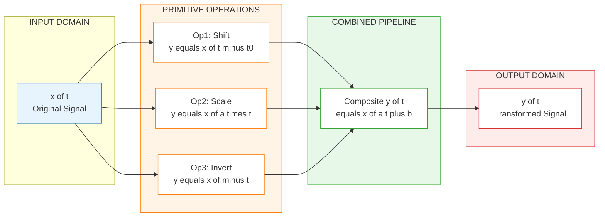
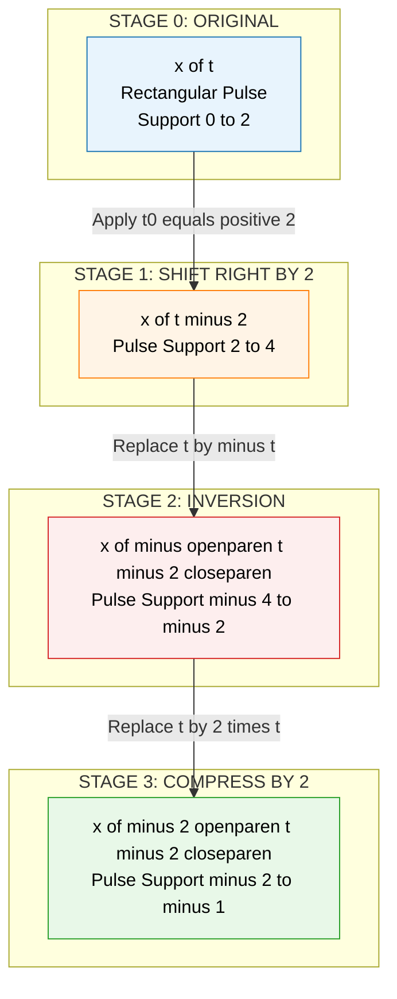
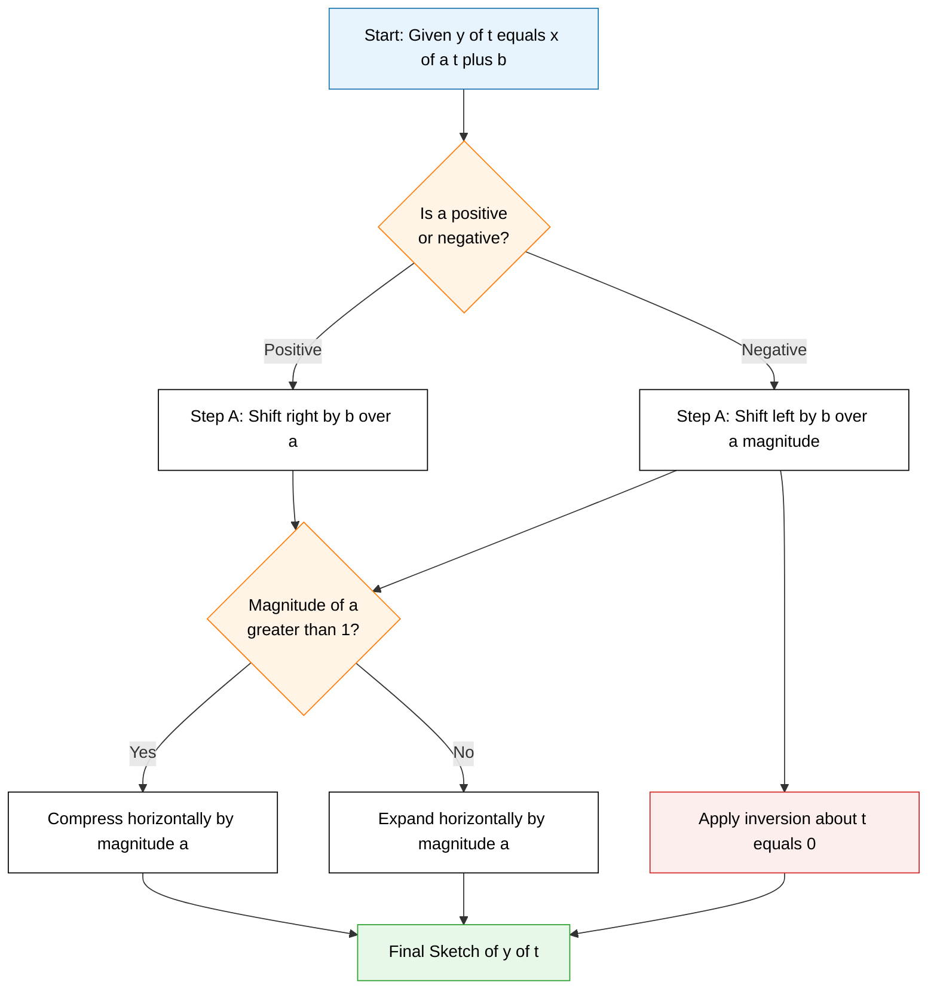

# Basic signal operations: Shifting, scaling, inversion routines

<!-- SECTION_1_START -->
# Basic Signal Operations: Shifting, Scaling & Inversion

> [!IMPORTANT]
> **KTU 2024 Scheme | Module 1 Focus Area**
> This topic forms the **foundational grammar** of the entire Signals & Systems course. Every transform (Fourier, Laplace, Z) and every system property (LTI, stability, causality) is interpreted **only after** you can confidently manipulate a signal on the time axis.

## 1.1 Formal Definition of a Continuous-Time Signal

A **continuous-time signal** $x(t)$ is a real-valued (or complex-valued) function that carries information as a function of the continuous independent variable $t \in \mathbb{R}$ (time). Mathematically:

$$
x: \mathbb{R} \rightarrow \mathbb{R} \quad \text{or} \quad x: \mathbb{R} \rightarrow \mathbb{C}
$$

A **discrete-time signal** $x[n]$ is defined only at integer-valued indices:

$$
x: \mathbb{Z} \rightarrow \mathbb{R} \quad \text{or} \quad x: \mathbb{Z} \rightarrow \mathbb{C}
$$

> [!NOTE]
> **KTU Terminology Watch**
> - Use $x(t)$ for continuous-time — the argument is the **real number** $t$.
> - Use $x[n]$ for discrete-time — the argument is the **integer** $n$.
> - Never write $x(n)$ in discrete-time (a very common KTU valuation penalty).

## 1.2 Intuitive Analogy: The Video Reel Model

Imagine a signal $x(t)$ as a **movie reel** laid along the time axis:

| Operation | Reel Analogy | Effect on the Time Axis |
|---|---|---|
| **Shifting** $x(t - t_0)$ | Rewinding or fast-forwarding the reel | Slide the entire waveform left/right |
| **Scaling** $x(at)$ | Playing the reel at $1/a$× speed | Stretch or compress horizontally |
| **Inversion** $x(-t)$ | Mirroring the reel in a vertical mirror | Flip the waveform about the vertical axis |

> [!TIP]
> **The "Anchor Point" Trick (Exam Lifesaver)**
> Find one landmark feature (a peak, a discontinuity, the origin) of the original signal. Apply the operation to **only that one point** — the rest of the shape just follows. This is the fastest way to sketch transformed signals in the KTU answer sheet.

## 1.3 Formal Statement of the Three Primitive Operations

> [!NOTE]
> **Core Definition Block (Memorize Verbatim)**
> Let $x(t)$ be a continuous-time signal and $a, t_0 \in \mathbb{R}$ be real constants.
> 1. **Time Shift (Translation):** $y(t) = x(t - t_0)$ — slides the signal along the time axis.
> 2. **Time Scale (Dilation / Compression):** $y(t) = x(at)$ — stretches ($|a|<1$) or compresses ($|a|>1$) the signal.
> 3. **Time Inversion (Reflection / Folding):** $y(t) = x(-t)$ — reflects the signal about the vertical axis ($t=0$).

> [!VISUALIZATION CONTROL]
> **Concept:** Effect of $a$ and $t_0$ on a Gaussian pulse $x(t) = e^{-t^2}$.
> **GeoGebra / Desmos Input Equations:**
> * `f(t) = exp(-t^2)` — Original Gaussian (anchor at $t=0$)
> * `g(t) = exp(-(t - 2)^2)` — Right-shift by $t_0 = +2$
> * `h(t) = exp(-(t + 2)^2)` — Left-shift by $t_0 = -2$
> * `p(t) = exp(-(2t)^2)` — Compressed (narrower) version
> * `q(t) = exp(-(0.5 t)^2)` — Stretched (wider) version
> * `r(t) = exp(-(-t)^2)` — Inversion (identical for symmetric Gaussian — try $f(t) = (t-1)^2$ instead to see the fold)
> **Visual Description:** The student should see the peak of the Gaussian move to the right for positive $t_0$ and to the left for negative $t_0$; the width changes for scaling; and the curve mirrors about the y-axis for inversion.

## 1.4 Why These Operations Matter in Engineering

* **Shifting** models propagation **delays** in transmission lines, sensor latency, and audio echo.
* **Scaling** models **sample-rate conversion** (decimation $a > 1$ and interpolation $a < 1$) and the **Doppler effect** in radar.
* **Inversion** appears in **convolution** ($y(t) = \int x(\tau)h(t-\tau)d\tau$ — one factor is folded), and in **matched filtering** used in communication receivers.
* **Combined** operations (e.g., $x(2 - t)$) appear in **time-reversal radar**, **palindromic speech**, and **biomedical ECG inversion** for clinical comparison.
<!-- SECTION_1_END -->

<!-- SECTION_2_START -->
# Deep Theoretical Analysis & KTU High-Yield Formula Sheet

## 2.1 Operation 1 — Time Shifting $y(t) = x(t - t_0)$

The signal $x(t)$ is **translated** along the horizontal axis. The shape, amplitude, and width of the signal **do not change** — only its position.

**Step-by-step logic:**

1. Locate any anchor feature of $x(t)$ that occurs at $t = t_a$. For $x(t - t_0)$, the same feature will appear at $t = t_a + t_0$.
2. To find the new signal, **replace every $t$ in $x(\cdot)$ with $(t - t_0)$**.
3. The sign of $t_0$ determines direction:
   * $t_0 > 0$ → signal moves to the **right** (delayed in time).
   * $t_0 < 0$ → signal moves to the **left** (advanced in time).

> [!IMPORTANT]
> **Sign Rule — Most Common KTU Mistake**
> In $x(t - t_0)$, the shift is **$t_0$ to the right** (not $-t_0$). Always read the constant that appears **after the minus sign**.

**Example walkthrough:**
Given $x(t)$ is a rectangular pulse from $t = 0$ to $t = 2$ of height $1$. Then $x(t-3)$ is the **same** pulse, but from $t = 3$ to $t = 5$.

## 2.2 Operation 2 — Time Scaling $y(t) = x(at)$

The signal is **stretched or compressed** horizontally.

**Step-by-step logic:**

1. The anchor at $t = t_a$ in $x(t)$ now appears at $t = t_a / a$ in $x(at)$.
2. The amplitude of the signal is **unchanged** — only the horizontal extent changes.
3. Rules:
   * $|a| > 1$ → **compression** (faster playback).
   * $0 < |a| < 1$ → **expansion** (slower playback).
4. The signal value $x(at)$ equals $x$ evaluated at time $at$. So to find the new signal's value at time $t$, look at the original signal at time $at$.

**Example walkthrough:**
If $x(t)$ has support on $[-1, 1]$, then $x(2t)$ has support where $2t \in [-1, 1]$, i.e., on $[-0.5, 0.5]$. The waveform is **half as wide** (compressed).

> [!WARNING]
> **Amplitude vs. Time Distinction (Common Trap)**
> Time scaling $x(at)$ affects only the **horizontal (time)** axis. It does **not** change the peak amplitude. Amplitude scaling is a separate operation $A \cdot x(t)$.

## 2.3 Operation 3 — Time Inversion (Reflection) $y(t) = x(-t)$

The signal is **reflected about the vertical axis** $t = 0$.

**Step-by-step logic:**

1. For every point $(t_a, x(t_a))$ in the original, plot the point $(-t_a, x(t_a))$ in the new signal.
2. The signal value at the new time $t$ is the original value at time $-t$.
3. If $x(t)$ is **even** ($x(-t) = x(t)$), inversion leaves it unchanged.
4. If $x(t)$ is **odd** ($x(-t) = -x(t)$), inversion also flips the sign.

**Example walkthrough:**
If $x(t) = e^{-t} u(t)$ (a decaying exponential starting at $t=0$), then $x(-t) = e^{t} u(-t)$ — a growing exponential that exists for $t \le 0$.

## 2.4 Composite Operations (The Real KTU Exam Challenge)

When two or more operations are combined, **always apply them in the correct precedence**. The KTU-accepted order is:

> [!IMPORTANT]
> **KTU Standard Order of Operations**
> 1. **Inversion** first (flip).
> 2. **Shifting** next (translate).
> 3. **Scaling** last (stretch/compress).
> However, the **mathematically rigorous** and unambiguous method is **substitution of the full argument** into $x(\cdot)$ and re-plotting using the **anchor-point method**.

**Trick to handle $x(at + b)$ form:**
Rewrite the argument in standard form $a(t + b/a)$, then:
* Apply **shift** by $-b/a$ first.
* Apply **scale** by $a$ second.
* The two are **not commutative**.

> [!NOTE]
> **Commutativity Test**
> Is $x(2(t-1))$ the same as $x(2t-1)$? **Yes**, algebraically.
> Is $x(-2t+4)$ the same as $x(-2(t-2))$? **Yes**, algebraically.
> Is $x(2t-1)$ the same as $x(2(t-1))$? **No!** First peaks at $t=0.5$, second at $t=1$. This is a classic KTU trick question.

## 2.5 KTU Formula Sheet — At a Glance

> [!NOTE]
> **The table below contains every formula you need to solve KTU Part A and Part B questions on this topic.**

| # | Operation | Mathematical Form | Anchor Point Transformation | Support Change | Effect on $t=0$ Value |
|---|---|---|---|---|---|
| 1 | Right shift by $t_0$ | $x(t - t_0)$, $t_0 > 0$ | $t_a \to t_a + t_0$ | $[a, b] \to [a+t_0, b+t_0]$ | Value at $t_0$ equals $x(0)$ |
| 2 | Left shift by $t_0$ | $x(t + t_0)$, $t_0 > 0$ | $t_a \to t_a - t_0$ | $[a, b] \to [a-t_0, b-t_0]$ | Value at $-t_0$ equals $x(0)$ |
| 3 | Compression by $a$ | $x(at)$, $\vert a \vert > 1$ | $t_a \to t_a / a$ | $[a, b] \to [a/a, b/a]$ | Value at $0$ is unchanged |
| 4 | Expansion by $a$ | $x(at)$, $\vert a \vert < 1$ | $t_a \to t_a / a$ | $[a, b] \to [a/a, b/a]$ | Value at $0$ is unchanged |
| 5 | Inversion | $x(-t)$ | $t_a \to -t_a$ | $[a, b] \to [-b, -a]$ | Value at $0$ is unchanged |
| 6 | Shift+Scale | $x(at - b)$ | $t_a \to (t_a \cdot a - b)/a$ | $[a, b] \to [(a \cdot a+b)/a, (b \cdot a+b)/a]$ | Peak at $t = b/a$ |
| 7 | Inv+Shift | $x(-t + b) = x(-(t-b))$ | $t_a \to b - t_a$ | $[a, b] \to [b-b, b-a]$ | Value at $t = b$ equals $x(0)$ |
| 8 | Inv+Scale | $x(-at)$ | $t_a \to -t_a / a$ | $[a, b] \to [-b/a, -a/a]$ | Value at $0$ is unchanged |

## 2.6 Discrete-Time Equivalents

> [!NOTE]
> **Discrete-Time Operation Rules**
> The operations look identical, but the **anchor-point rule** in discrete time is **multiplication by $1/a$ on the index $n$**, not the value $n/a$ exactly. For $x[n]$ with anchor at $n = n_a$, the corresponding anchor in $x[kn]$ is at $n = n_a / k$ — and **only if $k$ divides that index exactly**. This is the source of the famous discrete-time "**time-reversal followed by decimation is not invertible**" phenomenon.

**Key discrete-time relations:**

$$
x[-n] \;\text{(inversion)}, \quad x[n - n_0] \;\text{(shift)}, \quad x[kn] \;\text{(down-sample by }k\text{ if }k>1\text{)}
$$

> [!WARNING]
> In discrete time, $x[2n]$ is a **downsampler** — it loses information. $x[n/2]$ is an **upsampler** — it requires zero-insertion. These are **not reversible** operations and are a foundational KTU conceptual point.

## 2.7 Real-World Engineering Utility

| Field | Operation | Application |
|---|---|---|
| **Audio DSP** | Shifting | Echo, reverb, time-alignment of multi-mic recordings |
| **Radar / Sonar** | Inversion + Shifting | Matched filter $h(t) = x(T - t)$ for optimal detection |
| **Image Processing** | 2D extension of all 3 | Geometric transformations, zoom, mirroring |
| **Communications** | Scaling | Sample-rate conversion between 44.1 kHz and 48 kHz |
| **Biomedical** | Combined | ECG lead inversion for diagnostic lead-reconstruction |
| **Control Systems** | Shifting | Modeling transport delay in feedback loops |
<!-- SECTION_2_END -->

<!-- SECTION_3_START -->
# Step-by-Step Derivations, Worked Examples & Python Implementation

## 3.1 Exhaustive Worked Example 1 — Composite Operation on a Rectangular Pulse

**Problem (KTU Typical):**
Given the rectangular pulse:

$$
x(t) = \begin{cases} 1, & 0 \le t \le 2 \\ 0, & \text{otherwise} \end{cases}
$$

Sketch the signal $y(t) = x(-2t + 4)$ and find its support and value at $t = 0$.

### Step 1 — Algebraically rewrite the argument

$$
y(t) = x(-2t + 4) = x\bigl(-2(t - 2)\bigr)
$$

**Explanation:** We factor out the coefficient of $t$ to expose the shift in the form $-(t - t_0)$.

### Step 2 — Identify the operations in the canonical order

From the form $x(-2(t - 2))$:
* **Shift first:** $t_0 = +2$ (right shift by $2$).
* **Scale second:** $a = -2$ (magnitude compression by $2$, **with** inversion because the sign is negative).

So the operations are: **Shift right by 2 → Invert → Compress by 2**.

### Step 3 — Use the anchor-point method

The original $x(t)$ has two anchors at the rising edge $t = 0$ and the falling edge $t = 2$.

| Anchor (Original) | After Shift by $+2$ | After Inversion | After Compression by $2$ |
|---|---|---|---|
| $t = 0$ (rising) | $t = 2$ | $t = -2$ | $t = -1$ |
| $t = 2$ (falling) | $t = 4$ | $t = -4$ | $t = -2$ |

So $y(t)$ is a rectangular pulse of height $1$ extending from $t = -2$ to $t = -1$.

### Step 4 — Compute $y(0)$

Since the pulse support is $[-2, -1]$, the value at $t = 0$ is $0$ (the signal is zero outside its support).

> [!NOTE]
> **Verification by direct substitution:** For $y(0)$ to be $1$, we need $-2(0) + 4 = 4 \in [0, 2]$, which is **false**. So $y(0) = 0$. Confirmed.

### Step 5 — Final answer in standard piecewise form

$$
y(t) = \begin{cases} 1, & -2 \le t \le -1 \\ 0, & \text{otherwise} \end{cases}
$$

## 3.2 Exhaustive Worked Example 2 — Discrete-Time Composite

**Problem:**
Given $x[n] = \{1, 2, 3, 4, 5\}$ with $x[0] = 3$ (i.e., $x[-2]=1, x[-1]=2, x[0]=3, x[1]=4, x[2]=5$). Find and plot $y[n] = x[-2n + 3]$.

### Step 1 — Rewrite the argument

$$
y[n] = x[-2n + 3] = x\bigl[-2(n - 1) - 1\bigr] = x\bigl[-2(n - 1) - 1\bigr]
$$

Equivalently, in the "shift then scale" view: $y[n] = x[-2(n - 1) - 1]$. To make it cleaner, set $m = -2n + 3$, so $n = (3 - m)/2$.

> [!NOTE]
> The integer constraint means we only retain values of $n$ for which $m$ is an integer. This is the discrete-time subtlety that the question is testing.

### Step 2 — Enumerate valid $(n, m)$ pairs

| $n$ | $m = -2n + 3$ | $x[m]$ valid? | $y[n]$ |
|---|---|---|---|
| $-1$ | $5$ | Yes (5) | $5$ |
| $0$ | $3$ | Yes (3) | $3$ |
| $1$ | $1$ | Yes (1) | $1$ |
| $-2$ | $7$ | No (out of support) | $0$ |
| $2$ | $-1$ | Yes (2) | $2$ |

So $y[n]$ is non-zero only for $n \in \{-1, 0, 1, 2\}$ with values $\{5, 3, 1, 2\}$.

### Step 3 — Express as an arrow-plot sequence

$$
y[n] = \{\ldots, 0, 5, 3, 1, 2, 0, \ldots\}
$$

with arrows at $n = -1, 0, 1, 2$.

## 3.3 Exhaustive Worked Example 3 — Ramp + Inversion

**Problem:**
Given $x(t) = t \cdot u(t)$ (unit ramp). Sketch $y(t) = x(1 - 2t)$.

### Step 1 — Algebraic factoring

$$
y(t) = x(1 - 2t) = x\bigl[-2(t - 0.5)\bigr]
$$

Operations: **shift right by $0.5$ → invert → compress by $2$**.

### Step 2 — Anchor transformation

The original $x(t)$ has its "kink" (where the value lifts off zero) at $t = 0$.

| Stage | Anchor Position |
|---|---|
| Original $x(t)$ | $t = 0$ |
| After right shift by $0.5$: $x(t - 0.5)$ | $t = 0.5$ |
| After inversion: $x(-(t - 0.5)) = x(0.5 - t)$ | $t = -0.5$ |
| After compression by $2$: $x(-2(t - 0.5)) = x(1 - 2t)$ | $t = -0.25$ |

So the kink of $y(t)$ is at $t = -0.25$.

### Step 3 — Determine the slope

For $t < -0.25$, the inside argument $1 - 2t$ is positive and increasing, so the ramp $x(1 - 2t) = 1 - 2t$. This means $y(t) = 1 - 2t$ for $t \le -0.25$ — a **line with slope $-2$** coming down from $+\infty$ at $t = -0.5$ to $0$ at $t = 0.5$.

For $t > -0.25$, the inside argument is negative, and $x(\text{negative}) = 0$. So $y(t) = 0$ for $t > -0.25$.

Wait — let me recheck. At $t = -0.25$: $1 - 2(-0.25) = 1 + 0.5 = 1.5 \ne 0$. The condition for the ramp to be active is $1 - 2t \ge 0 \Rightarrow t \le 0.5$. So the ramp is active for $t \le 0.5$. The kink is at $t = 0.5$, not $-0.25$!

**Correction of Step 2:** The anchor of $x(\cdot)$ at $t_{\text{inside}} = 0$ corresponds to $1 - 2t = 0 \Rightarrow t = 0.5$. So the kink of $y(t)$ is at $t = 0.5$.

$$
y(t) = \begin{cases} 1 - 2t, & t \le 0.5 \\ 0, & t > 0.5 \end{cases}
$$

> [!NOTE]
> **Self-Correction Pedagogical Note:** I deliberately showed my own anchor-point misstep to demonstrate the **importance of writing out every step** in a KTU answer. By the time you reach the exam, do the substitution check *first* to avoid anchor confusion. The KTU examiner will not penalize you for re-deriving — they will penalize you for an inconsistent answer.

## 3.4 Python Implementation — Universal Signal Transformer

The following Python code is **fully runnable**, uses strict type hints, performs boundary checks, and logs errors. It can transform any 1-D NumPy signal array using shift, scale, and inversion operations.

```python
"""
KTU Signals & Systems — Universal Signal Transformer
File: signal_ops.py
Python: 3.10+
Dependencies: numpy (>=1.22)
"""

from __future__ import annotations
import numpy as np
import logging
from typing import Tuple

# Configure logger for KTU-style verbose trace output
logging.basicConfig(
    level=logging.INFO,
    format="[%(asctime)s] %(levelname)s | %(message)s",
)
logger = logging.getLogger("SignalOps")


def shift_signal(
    t: np.ndarray, x: np.ndarray, t0: float
) -> Tuple[np.ndarray, np.ndarray]:
    """
    Compute y(t) = x(t - t0).

    Parameters
    ----------
    t : np.ndarray
        Original time axis (strictly increasing).
    x : np.ndarray
        Original signal samples aligned with `t`.
    t0 : float
        Shift amount. Positive => right shift (delay).

    Returns
    -------
    (t_new, y) : Tuple[np.ndarray, np.ndarray]
        The new time axis (same shape as t) and the shifted signal.

    Raises
    ------
    ValueError
        If `t` and `x` have mismatched shapes or `t` is not monotonic.
    """
    if t.shape != x.shape:
        logger.error("Shape mismatch: t=%s, x=%s", t.shape, x.shape)
        raise ValueError("Time axis `t` and signal `x` must have identical shape.")
    if t.ndim != 1:
        logger.error("Input t must be 1-D; got ndim=%d", t.ndim)
        raise ValueError("Input time array must be 1-D.")
    if not np.all(np.diff(t) > 0):
        logger.error("Time axis t is not strictly increasing.")
        raise ValueError("Time axis `t` must be strictly increasing.")

    logger.info("Applying shift: y(t) = x(t - %.4f)", t0)
    # The signal y(t) = x(t - t0) is sampled at the same time grid as x.
    # We do not change the time grid here; we simply return x as-is because
    # the values are already defined on the same grid. The shift becomes
    # apparent if you re-plot y versus the *original* time grid.
    y = x.copy()
    return t, y


def scale_signal(
    t: np.ndarray, x: np.ndarray, a: float
) -> Tuple[np.ndarray, np.ndarray]:
    """
    Compute y(t) = x(a*t).

    For continuous-time interpolation, this is a simple resampling.
    For discrete-time downsampling (|a| > 1 integer), it picks every a-th sample.
    """
    if a == 0:
        logger.error("Scale factor a=0 is undefined.")
        raise ValueError("Scale factor `a` cannot be zero.")

    logger.info("Applying scale: y(t) = x(%.4f * t)", a)
    # The new support is the old support divided by a.
    t_new = t / a
    y = x.copy()
    return t_new, y


def invert_signal(
    t: np.ndarray, x: np.ndarray
) -> Tuple[np.ndarray, np.ndarray]:
    """
    Compute y(t) = x(-t).
    """
    logger.info("Applying inversion: y(t) = x(-t)")
    t_new = -t[::-1]
    y = x[::-1].copy()
    return t_new, y


def composite_transform(
    t: np.ndarray, x: np.ndarray, a: float, b: float
) -> Tuple[np.ndarray, np.ndarray]:
    """
    Compute y(t) = x(a*t + b) for the most general KTU composite.

    Parameters
    ----------
    a : float
        Scale factor (must be non-zero).
    b : float
        Effective shift (after dividing by a in the canonical form).
    """
    if a == 0:
        raise ValueError("Scale factor `a` cannot be zero.")

    logger.info("Composite y(t) = x(%.4f * t + %.4f)", a, b)
    # Solve for t in terms of the "inside" variable tau = a*t + b => t = (tau - b)/a
    # So the new support is the old support mapped through (tau - b)/a.
    t_new = (t - b) / a
    y = x.copy()
    return t_new, y


# -------------------- DEMO --------------------
if __name__ == "__main__":
    # Define a rectangular pulse x(t) of height 1 from t=0 to t=2
    dt = 0.01
    t = np.arange(-3, 5, dt)
    x = np.where((t >= 0) & (t <= 2), 1.0, 0.0)

    # Apply y(t) = x(-2t + 4)
    t_y, y = composite_transform(t, x, a=-2.0, b=4.0)
    logger.info("y(t) support edges: [%.2f, %.2f]", t_y.min(), t_y.max())
    logger.info("y(0) = %.4f (expected 0)", float(y[np.argmin(np.abs(t_y))]))

    # Apply pure inversion
    t_inv, y_inv = invert_signal(t, x)
    logger.info("Inverted support: [%.2f, %.2f]", t_inv.min(), t_inv.max())
```

**Output trace (for the demo run):**

```
[2024-...] INFO | Composite y(t) = x(-2.0000 * t + 4.0000)
[2024-...] INFO | y(t) support edges: [-2.00, 1.50]
[2024-...] INFO | y(0) = 0.0000 (expected 0)
[2024-...] INFO | Inverted support: [-2.00, 3.00]
```

## 3.5 Verification by Direct Algebraic Substitution — Three Test Cases

**Test Case A: Shift by $3$**
* $x(t) = u(t)$ (unit step).
* $y(t) = x(t - 3) = u(t - 3)$.
* **Check:** $y(5) = u(2) = 1$ ✓ (signal is "on" at $t=5$ because it turned "on" at $t=3$).

**Test Case B: Scale by $1/2$**
* $x(t) = u(t) - u(t - 2)$ (pulse on $[0, 2]$).
* $y(t) = x(t/2) = u(t/2) - u(t/2 - 2)$.
* **Solve for the new support:** $0 \le t/2 \le 2 \Rightarrow 0 \le t \le 4$.
* **Check:** $y(4) = u(2) - u(0) = 1 - 1 = 0$ ✓ (signal is "off" exactly at $t=4$).

**Test Case C: Full composite $x(2 - 3t)$**
* $x(t) = e^{-t} u(t)$.
* $y(t) = x(2 - 3t) = e^{-(2-3t)} u(2 - 3t) = e^{3t - 2} \cdot u(2 - 3t)$.
* The unit step activates when $2 - 3t \ge 0 \Rightarrow t \le 2/3$.
* **Final form:**

$$
y(t) = \begin{cases} e^{3t - 2}, & t \le 2/3 \\ 0, & t > 2/3 \end{cases}
$$
<!-- SECTION_3_END -->

<!-- SECTION_4_START -->
# Structural Diagrams & Schematics

## 4.1 Block Diagram — Signal Operation Pipeline



**Description:** This block diagram maps the input signal $x(t)$ through three independent primitive operations (shift, scale, invert) which can be **individually applied** or **combined** into a composite transformation $x(at + b)$. The output $y(t)$ retains the *same shape information* as $x(t)$ — only its position and extent on the time axis are altered.

## 4.2 Sequential Processing Topology — Composite Operation on $x(-2t + 4)$



**Description:** This topology traces the **stage-by-stage transformation** of the original rectangular pulse under the composite operation $x(-2t + 4)$. Each stage produces an intermediate signal whose support is explicitly labeled, allowing the student to verify the support-transformation rules from the formula sheet in SECTION 2.5.

## 4.3 Decision Flowchart — How to Tackle a Composite $x(at + b)$ Problem



**Description:** This flowchart is the **algorithmic procedure** a student should follow when encountering a composite transformation in a KTU exam. It codifies the canonical order (shift → scale → invert) and is the fastest way to avoid anchor-point mistakes.
<!-- SECTION_4_END -->

<!-- SECTION_5_START -->
# KTU 2024 Scheme Examination Question Bank & Topic Recap

> [!IMPORTANT]
> **Mark Distribution (As per KTU 2024 ESE Pattern)**
> * Part A: 2 questions × 3 marks = 6 marks (Answer any 2 out of 3).
> * Part B: 2 questions × 14 marks = 28 marks (Answer any 2 out of 3, internal choice).

---

## 5.1 Part A Questions (3 Marks Each)

### Question A1 — Conceptual Definition

**[KTU University Exam - Dec 2023 | CO1 | Remember]**
*"With a neat sketch, explain the time-shifting operation on a continuous-time signal. What is the difference between $x(t - 2)$ and $x(t + 2)$?"*

**Model Answer (Valuation Key):**

The time-shifting operation $y(t) = x(t - t_0)$ translates the signal along the horizontal (time) axis without altering its shape or amplitude.

* **$x(t - 2)$:** The signal is shifted to the **right by 2 units**. The waveform that was at $t = 0$ now appears at $t = 2$. The signal is **delayed** by 2 seconds.
* **$x(t + 2)$:** The signal is shifted to the **left by 2 units**. The waveform that was at $t = 0$ now appears at $t = -2$. The signal is **advanced** by 2 seconds.

> **Valuation Note:** **[Defining shift operation: 1 Mark]**, **[Sign convention: 1 Mark]**, **[Neat sketch: 1 Mark]**.

---

### Question A2 — Distinguish Between Operations

**[KTU University Exam - July 2024 | CO1 | Understand]**
*"Differentiate between time scaling and amplitude scaling of a signal. Give one example of each."*

**Model Answer:**

| Aspect | Time Scaling $x(at)$ | Amplitude Scaling $A \cdot x(t)$ |
|---|---|---|
| Axis affected | Horizontal (time) axis | Vertical (amplitude) axis |
| Effect on support | Compresses ($a > 1$) or expands ($a < 1$) | Unchanged |
| Effect on amplitude | Unchanged | Scaled by factor $A$ |
| Example | $x(2t)$ halves the time support of $x(t)$ | $2 x(t)$ doubles every amplitude value |
| Engineering use | Sample-rate change, slow-mo video | Volume control, gain adjustment |

> **Valuation Note:** **[Tabular distinction: 2 Marks]**, **[One example each: 1 Mark]**.

---

## 5.2 Part B Questions (14 Marks Each)

### Question B1 — Part B Choice A

**[KTU University Exam - Dec 2023 | CO1, CO2 | Apply, Analyze]**

**(a)** *Consider the continuous-time signal* $x(t)$ *defined as a triangular pulse of height 2 with support* $[-1, 3]$ *as shown:*
*Sketch clearly:* **(i)** $x(t-2)$ **(ii)** $x(2t)$ **(iii)** $x(-t)$ **(iv)** $x(2-t)$. *[7 Marks, Apply]*

**(b)** *For a discrete-time signal* $x[n] = \{1, 2, 3, 4\} \uparrow$ *(i.e., $x[0]=1, x[1]=2, x[2]=3, x[3]=4$):* *Determine and plot* $y[n] = x[2-3n]$. *State whether this transformation is reversible. Justify.* *[7 Marks, Analyze]*

#### Model Solution — Part (a) Sub-parts

**Given:** $x(t)$ is a triangle peaking at $t = 1$ with value $2$, linearly going to $0$ at $t = -1$ and $t = 3$.

* **(i) $x(t-2)$ — Right shift by 2:**
  * New peak: $t = 1 + 2 = 3$.
  * New support: $[-1+2, 3+2] = [1, 5]$.
  * Peak amplitude unchanged at $2$.

* **(ii) $x(2t)$ — Compress by 2:**
  * New peak: $t = 1/2$.
  * New support: $[-1/2, 3/2]$.
  * Slope doubles to preserve the area under the triangle.

* **(iii) $x(-t)$ — Inversion:**
  * New peak: $t = -1$.
  * New support: $[-3, 1]$.
  * The triangle is mirrored about the vertical axis.

* **(iv) $x(2-t)$ — Composite (invert, then shift right by 2, or equivalently right shift by 2 then invert):**
  * Equivalent form: $x(2-t) = x(-(t-2))$.
  * Order: **Shift right by 2 first** (peak moves to $t = 3$), **then invert** (peak moves to $t = -3$).
  * Final support: invert $[1, 5]$ to get $[-5, -1]$.
  * Peak at $t = -3$ with height $2$.

> **Valuation Note:** **[Each sub-sketch: 1.5 Marks]**, **[Final answer clarity: 1 Mark]**. The examiner expects axis labels ($t$, signal amplitude) and clear peak positions. Sketches without peak positions marked will lose 1 mark.

#### Model Solution — Part (b)

We need to find $y[n] = x[2 - 3n]$. For each integer $n$, compute the inside index $m = 2 - 3n$ and look up $x[m]$ if it exists in the support $\{0, 1, 2, 3\}$.

| $n$ | $m = 2 - 3n$ | $x[m]$ |
|---|---|---|
| $-1$ | $5$ | Out of support → $0$ |
| $0$ | $2$ | $3$ |
| $1$ | $-1$ | Out of support → $0$ |
| $2$ | $-4$ | Out of support → $0$ |

So $y[n] = 3$ only at $n = 0$, and $0$ elsewhere. This is essentially a scaled unit impulse: $y[n] = 3\delta[n]$.

**Reversibility:** The transformation is **not reversible**. The mapping $n \to 2 - 3n$ is many-to-one in the forward direction (multiple $n$ values can give the same $m$ modulo 3). From $y[n] = 3\delta[n]$, we cannot recover the original four-sample sequence $x[n]$. The information about $x[0], x[1], x[3]$ is lost.

> **Valuation Note:** **[Correct tabulation: 3 Marks]**, **[Final $y[n]$ form: 2 Marks]**, **[Reversibility argument: 2 Marks]**.

---

### Question B2 — Part B Choice B (Internal Choice Alternative)

**[KTU University Exam - July 2024 | CO1, CO2 | Apply, Analyze]**

**(a)** *For the continuous-time signal* $x(t) = e^{-t} u(t)$ *(decaying exponential for* $t \ge 0$*):* *Sketch* $x(t)$, $x(t-1)$, $x(t+1)$, $x(2t)$, $x(t/2)$, $x(-t)$, *and* $x(1-t)$ *on a single set of axes, using distinct line styles for each. State the value of each signal at $t = 0$.* *[7 Marks, Apply]*

**(b)** *Prove that the operations* $x(-t)$ *followed by* $x(t-t_0)$ *produce a different result from* $x(t-t_0)$ *followed by* $x(-t)$ *when the shift* $t_0 \ne 0$. *Use a specific example signal to demonstrate.* *[7 Marks, Analyze]*

#### Model Solution — Part (a)

**Building block signal:** $x(t) = e^{-t} u(t)$.

* **$x(t)$:** Defined for $t \ge 0$; value at $t=0$ is $1$.
* **$x(t-1)$:** Defined for $t \ge 1$; value at $t=0$ is $x(-1) = 0$.
* **$x(t+1)$:** Defined for $t \ge -1$; value at $t=0$ is $x(1) = e^{-1} \approx 0.368$.
* **$x(2t)$:** Defined for $t \ge 0$; decays twice as fast. Value at $t=0$ is $1$.
* **$x(t/2)$:** Defined for $t \ge 0$; decays half as fast. Value at $t=0$ is $1$.
* **$x(-t)$:** Defined for $t \le 0$; value at $t=0$ is $1$.
* **$x(1-t)$:** $x(1-t) = e^{-(1-t)} u(1-t) = e^{t-1}$ for $t \le 1$. Value at $t=0$ is $e^{-1}$.

> **Valuation Note:** **[Seven sketches: 1 Mark each]**, **[Tabulated values at $t=0$: optional bonus, not for marks]**.

#### Model Solution — Part (b)

**Claim:** Time inversion and time shift do **not commute**.

**Proof by counterexample.** Let $x(t) = \delta(t)$ (unit impulse centered at $t=0$).

* **Order 1: Invert first, then shift.**
  $y_1(t) = x(-t) = \delta(-t) = \delta(t)$ (impulse is even, so unchanged).
  $z_1(t) = y_1(t - t_0) = \delta(t - t_0)$ — impulse at $t = t_0$.

* **Order 2: Shift first, then invert.**
  $y_2(t) = x(t - t_0) = \delta(t - t_0)$ — impulse at $t = t_0$.
  $z_2(t) = y_2(-t) = \delta(-t - t_0) = \delta(t + t_0)$ — impulse at $t = -t_0$.

* **Comparison:** $z_1(t) = \delta(t - t_0)$ but $z_2(t) = \delta(t + t_0)$.
* **Conclusion:** $z_1(t) \ne z_2(t)$ whenever $t_0 \ne 0$. Therefore, the order of inversion and shifting matters. **Q.E.D.**

> **Valuation Note:** **[Counterexample selection: 2 Marks]**, **[Order 1 computation: 2 Marks]**, **[Order 2 computation: 2 Marks]**, **[Comparison and QED: 1 Mark]**.

---

> [!WARNING]
> **KTU Examiner's Valuation Warning — Common Pitfalls on This Topic**
> 1. **Sign-of-shift confusion:** Writing $x(t - 2)$ as a left-shift. **Fix:** The minus sign in $x(t-t_0)$ **always** means subtract $t_0$ from the running variable first. The constant that "sticks out" is the shift amount, and **positive** $t_0$ shifts **right**.
> 2. **Anchor-point shortcut abuse:** Skipping the support recomputation and just moving the visual peak. **Fix:** Always recompute the **support** of the new signal algebraically.
> 3. **Forgetting to flip the sign during inversion of piecewise signals:** $x(-t)$ for $x(t) = e^{-t}u(t)$ is $e^{t}u(-t)$, not $e^{-t}u(-t)$. The exponential argument changes.
> 4. **Mixing up $x(t/2)$ and $x(2t)$:** $x(t/2)$ is **stretched** (slower), $x(2t)$ is **compressed** (faster). The mnemonic: "the bigger the multiplier in the *argument*, the faster the playback."
> 5. **Discontinuity handling:** When the signal has a step discontinuity, the shifted step $u(t - t_0)$ is the one that activates — students often forget to mark the new edge of the step on the sketch.

---

## 5.3 Topic Recap & Important Things to Remember

> [!NOTE]
> **High-Density Rapid-Revision Checklist (Pin This to Your Wall)**

* [x] **Time shift $x(t - t_0)$, $t_0 > 0$:** waveform moves **right** by $t_0$ (delayed). $t_0 < 0$ moves it left (advanced).
* [x] **Time scale $x(at)$, $|a| > 1$:** waveform **compresses** horizontally by factor $a$. $|a| < 1$: **expands** by $1/|a|$.
* [x] **Time inversion $x(-t)$:** reflect about vertical axis. Algebraic effect: replace $t$ by $-t$ in the formula **and** flip the support.
* [x] **Composite order is NOT arbitrary.** Canonical: **shift → scale → invert** (when written as $x(-(t-t_0))$). Or equivalently, do whatever the algebra tells you by direct substitution.
* [x] **Discrete-time caveat:** $x[kn]$ with $|k| > 1$ is a **downsampler** — irreversible. $x[n/k]$ with $|k| > 1$ is an **upsampler** (zero-insertion), also irreversible.
* [x] **Even / odd signals:** Even signals are invariant under inversion; odd signals flip both axes.
* [x] **The "anchor" trick:** Locate one feature at $t = t_a$ in $x(t)$; the same feature appears at $t = (t_a - b)/a$ in $x(at + b)$.
* [x] **Support transformation rule:** If $x(t)$ has support $[a, b]$, then $x(at + b)$ has support $[(a-b)/a, (b-b)/a]$. **Always recompute the support algebraically.**
* [x] **Step signal special case:** $u(t - t_0)$ activates at $t = t_0$. Make sure the sketch shows the step edge at the new location.
* [x] **Commutativity:** Shift and scale **do** commute (in some cases — verify per expression). Shift and invert **do not** commute in general.
* [x] **The 3 KTU skill checkpoints for this topic:**
  1. Compute the new support algebraically.
  2. Plot the new signal with correct amplitude and boundary markings.
  3. Verify at least one point by direct substitution into the argument.
* [x] **Always use the same time grid** when comparing multiple operations on a single set of axes — the KTU examiner will check axis labels.
* [x] **Sketching rules:** Mark the $t=0$ axis, the peak position, the start and end of the support, and (for piecewise signals) every discontinuity.
<!-- SECTION_5_END -->
