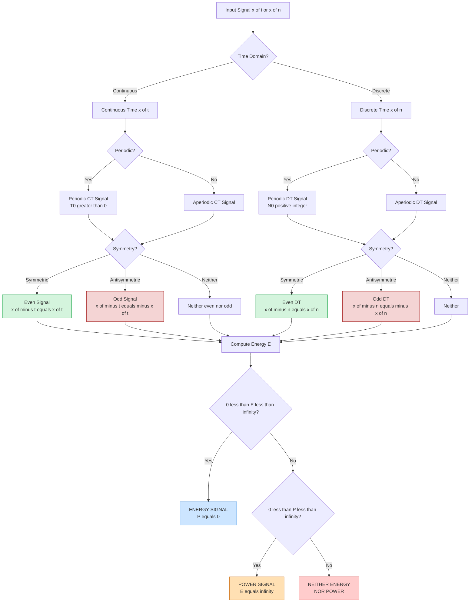
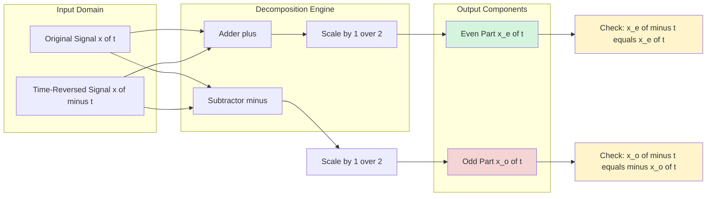
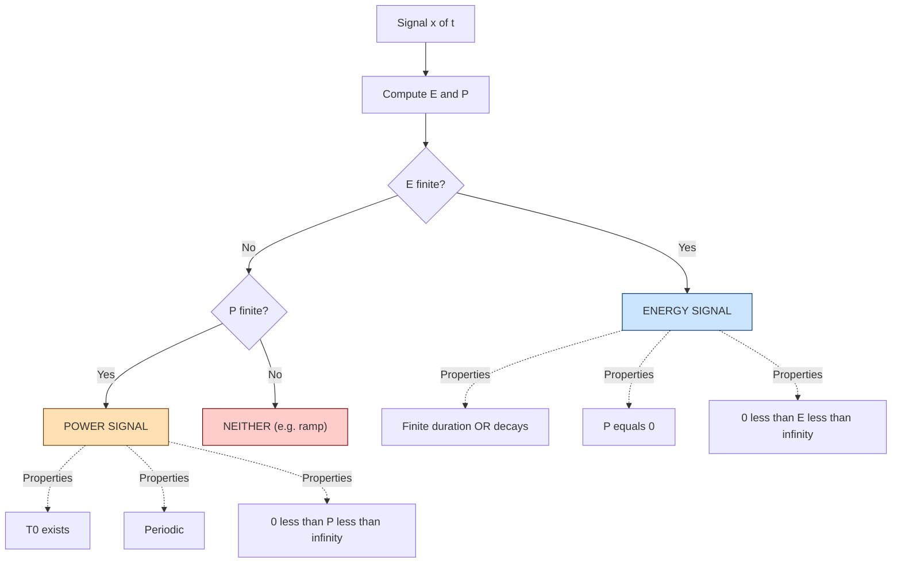

# Continuous-time and discrete-time signals: Periodic, even, odd, energy, and power signals

<!-- SECTION_1_START -->
# Continuous-Time and Discrete-Time Signals: Periodic, Even, Odd, Energy, and Power Signals

## 1.1 Core Definitions in KTU 2024 Scheme Terminology

A **signal** is a mathematical description of a physical phenomenon or a function that conveys information about the behavior of a system. In the KTU Signals and Systems framework, signals are broadly classified along two orthogonal axes: the **time axis** (continuous vs. discrete) and the **amplitude axis** (continuous vs. discrete).

> [!IMPORTANT]
> **KTU Syllabus Definition (PES Signals and Systems):**
> A **Continuous-Time (CT) signal** is a function defined for every instant of the continuous time variable $t \in \mathbb{R}$, written as $x(t)$. A **Discrete-Time (DT) signal** is a sequence of values defined only at discrete instants $n \in \mathbb{Z}$, written as $x[n]$.

**Five Fundamental Signal Categories Covered in KTU Module 1:**

| # | Signal Type | Core Identity |
|---|------------|---------------|
| 1 | **Periodic Signal** | $x(t \pm T) = x(t)$ for all $t$ |
| 2 | **Even Signal** | $x(-t) = x(t)$ for all $t$ |
| 3 | **Odd Signal** | $x(-t) = -x(t)$ for all $t$ |
| 4 | **Energy Signal** | $0 < E < \infty$ and $P = 0$ |
| 5 | **Power Signal** | $0 < P < \infty$ and $E = \infty$ |

> [!NOTE]
> **Fundamental Period ($T_0$ or $N_0$):** The smallest positive value of $T$ (or $N$) for which the periodicity condition holds is called the **fundamental period**. The **fundamental frequency** is $f_0 = 1/T_0$ (Hz) for CT and $\omega_0 = 2\pi / N_0$ (rad/sample) for DT.

---

## 1.2 Real-World Analogies for Intuitive Understanding

### Analogy 1 — Continuous vs. Discrete Time
Imagine recording the **ambient room temperature**:
- A **mercury thermometer** gives a continuous reading: you can read it at 9:00:00.0001 AM, 9:00:00.0002 AM, ... This is $x(t)$.
- A **digital weather app** that logs temperature only once every hour: $x[0], x[1], x[2], \ldots$ This is $x[n]$.

### Analogy 2 — Even Signal (Mirror Symmetry)
Consider the **graph of $y = t^2$** (a parabola). If you fold the paper along the vertical ($y$) axis, the left half perfectly overlaps the right half. This mirror symmetry is the geometric essence of an **even signal**.

### Analogy 3 — Odd Signal (Rotational Symmetry)
Consider the **graph of $y = t^3$**. If you rotate the curve by $180^\circ$ about the origin, it lands on top of itself. This origin-centered rotational symmetry is the geometric essence of an **odd signal**.

### Analogy 4 — Energy Signal
A single **rectangular pulse of finite duration** carries a finite, measurable amount of total "energy" (in joules). When the pulse ends, the energy delivered is fixed and bounded. This is an energy signal.

### Analogy 5 — Power Signal
A **sinusoidal AC voltage** applied to a resistor forever delivers a constant average **power** (watts), but the total energy integrated over infinite time becomes infinite. This is a power signal.

> [!TIP]
> **Mnemonic from KTU Board Examiners:** "Energy is to Power what Distance is to Speed." Distance is integrated speed; Energy is integrated power. A signal with finite integrated squared magnitude has finite energy.

---

## 1.3 Geometric & Graphical Intuition

> [!VISUALIZATION CONTROL]
> **Concept:** Even vs. Odd vs. Periodic Signal Waveforms
> **GeoGebra / Desmos Input Equations:**
> * $f_{1}(x) = \cos(x)$ — Even periodic signal
> * $f_{2}(x) = \sin(x)$ — Odd periodic signal
> * $f_{3}(x) = x^2 \cdot \{\{-1 \le x \le 1\}\}$ — Even non-periodic
> * $f_{4}(x) = e^{-x} \cdot \{\{x \ge 0\}\}$ — Neither even nor odd, non-periodic
>
> **Visual Description:** Plot $f_1$ and $f_2$ over $[-2\pi, 2\pi]$. Notice $f_1$ mirrors across the $y$-axis (even), $f_2$ is antisymmetric through the origin (odd), and both repeat every $2\pi$ (periodic). The rectangular gate function $\text{rect}(t)$ is even but **not** periodic.

---

## 1.4 Mathematical Foundation — The Squared Magnitude & Summation

For **CT signals**, the total **energy** is:

$$E_x = \int_{-\infty}^{\infty} \vert x(t) \vert^{2}\, dt$$

For **DT signals**, the total **energy** is:

$$E_x = \sum_{n=-\infty}^{\infty} \vert x[n] \vert^{2}$$

The **average power** is the energy normalized by the total observation interval (or the average over one period for periodic signals):

$$P_x = \lim_{T \to \infty} \frac{1}{2T} \int_{-T}^{T} \vert x(t) \vert^{2}\, dt$$

$$P_x = \lim_{N \to \infty} \frac{1}{2N+1} \sum_{n=-N}^{N} \vert x[n] \vert^{2}$$

> [!WARNING]
> **Critical KTU Pitfall:** A signal cannot be both an energy signal AND a power signal simultaneously (in the strict sense). It can be **neither** (e.g., the ramp signal $x(t) = t$ has $E = \infty$ and $P = \infty$). However, the zero signal $x(t) = 0$ has $E = 0$ and $P = 0$ — by convention it is classified as an energy signal.

<!-- SECTION_1_END -->

<!-- SECTION_2_START -->
# Deep Theoretical Analysis & KTU High-Yield Formula Sheet

## 2.1 Continuous-Time (CT) vs. Discrete-Time (DT) Signals

A signal is mapped to the time domain in one of two ways:

- **Continuous-Time:** $x: \mathbb{R} \to \mathbb{C}$ (or $\mathbb{R}$). The independent variable $t$ takes all real values.
- **Discrete-Time:** $x: \mathbb{Z} \to \mathbb{C}$ (or $\mathbb{R}$). The independent variable $n$ takes only integer values.

> [!NOTE]
> **KTU Convention:** The independent variable is **always** $t$ for CT and $n$ for DT. Parentheses $x(t)$ indicate CT; square brackets $x[n]$ indicate DT. Examiners *deduct marks* if these are interchanged.

### Transformation Between CT and DT
A CT signal is sampled to produce a DT signal:
$$x[n] = x(nT_s)$$
where $T_s$ is the **sampling period** and $f_s = 1/T_s$ is the **sampling frequency**. This is the foundation of Module 2 (Sampling Theorem).

---

## 2.2 Periodic Signals — Rigorous Definition

### Continuous-Time Periodic Signal
$x(t)$ is **periodic with period $T$** if there exists a positive constant $T$ such that:
$$x(t + T) = x(t) \quad \forall\, t \in \mathbb{R}$$
The **fundamental period** is the smallest positive $T_0$ satisfying this. The **fundamental angular frequency** is:
$$\omega_0 = \frac{2\pi}{T_0} \text{ (rad/s)}$$

### Discrete-Time Periodic Signal
$x[n]$ is **periodic with period $N$** if:
$$x[n + N] = x[n] \quad \forall\, n \in \mathbb{Z}$$
The fundamental period is the smallest positive integer $N_0$ satisfying this. A DT sinusoid $\cos(\omega_0 n)$ is periodic **only if** $\omega_0 / 2\pi$ is a rational number $p/q$ in lowest terms, in which case $N_0 = q$.

> [!IMPORTANT]
> **KTU High-Yield Theorem (Sum of Periodic Signals):** If $x_1(t)$ has period $T_1$ and $x_2(t)$ has period $T_2$, then $x(t) = x_1(t) + x_2(t)$ is periodic **if and only if** $T_1 / T_2$ is a **rational number**. The fundamental period is $\text{LCM}(T_1, T_2) = \frac{T_1 T_2}{\gcd(T_1, T_2)}$.

---

## 2.3 Even and Odd Signal Decomposition

### Even Signal
$$x_e(t) = x_e(-t) \quad \text{or} \quad x_e[n] = x_e[-n]$$
Geometric meaning: **symmetric about the vertical axis** ($y$-axis).

### Odd Signal
$$x_o(t) = -x_o(-t) \quad \text{or} \quad x_o[n] = -x_o[-n]$$
Geometric meaning: **antisymmetric about the origin**. It must satisfy $x_o(0) = 0$ (or $x_o[0] = 0$ for DT).

### The Even-Odd Decomposition Theorem
**Any real signal** can be uniquely written as:
$$x(t) = x_e(t) + x_o(t)$$

where the even and odd parts are extracted by:

$$x_e(t) = \frac{1}{2}\bigl[x(t) + x(-t)\bigr]$$

$$x_o(t) = \frac{1}{2}\bigl[x(t) - x(-t)\bigr]$$

> [!TIP]
> **KTU Board Exam Tip:** When asked "find the even and odd parts of $x(t)$," the model answer requires writing $x(-t)$ explicitly, then applying the two formulas. A common student error is forgetting the factor of $1/2$.

---

## 2.4 Energy Signals vs. Power Signals

### Energy Signals
A signal is an **energy signal** if and only if:
$$0 < E_x < \infty \quad \text{and} \quad P_x = 0$$
Examples: rectangular pulse, decaying exponential $e^{-at}u(t)$ with $a>0$, sinc function $\text{sinc}(t)$, Gaussian $e^{-t^2}$.

### Power Signals
A signal is a **power signal** if and only if:
$$0 < P_x < \infty \quad \texttext{and} \quad E_x = \infty$$
Examples: $\cos(\omega_0 t)$, $\sin(\omega_0 t)$, complex exponential $e^{j\omega_0 t}$, signum function $\text{sgn}(t)$, periodic signals in general.

### Quick Determination for Periodic Signals
For a **periodic CT signal** with period $T_0$:
$$P_x = \frac{1}{T_0} \int_{T_0} \vert x(t) \vert^{2}\, dt$$
(Integral over any single period.)

For a **periodic DT signal** with period $N_0$:
$$P_x = \frac{1}{N_0} \sum_{n=\langle N_0 \rangle} \vert x[n] \vert^{2}$$
(Summation over any single period.)

---

## 2.5 KTU High-Yield Formula Sheet (Board-Exam Reference)

| # | Concept | Continuous-Time (CT) | Discrete-Time (DT) | Units / Range |
|---|---------|---------------------|--------------------|---------------|
| 1 | **Signal notation** | $x(t),\; t \in \mathbb{R}$ | $x[n],\; n \in \mathbb{Z}$ | — |
| 2 | **Periodicity** | $x(t+T_0) = x(t)$ | $x[n+N_0] = x[n]$ | $T_0 > 0$, $N_0 \in \mathbb{Z}^{+}$ |
| 3 | **Fundamental Frequency** | $\omega_0 = 2\pi / T_0$ | $\omega_0 = 2\pi / N_0$ | rad/s, rad/sample |
| 4 | **Even condition** | $x(-t) = x(t)$ | $x[-n] = x[n]$ | — |
| 5 | **Odd condition** | $x(-t) = -x(t)$ | $x[-n] = -x[n]$ | — |
| 6 | **Even part** | $x_e(t) = \tfrac{1}{2}[x(t)+x(-t)]$ | $x_e[n] = \tfrac{1}{2}[x[n]+x[-n]]$ | — |
| 7 | **Odd part** | $x_o(t) = \tfrac{1}{2}[x(t)-x(-t)]$ | $x_o[n] = \tfrac{1}{2}[x[n]-x[-n]]$ | — |
| 8 | **Total energy** | $E_x = \int_{-\infty}^{\infty} \vert x(t) \vert^{2}\,dt$ | $E_x = \sum_{n=-\infty}^{\infty} \vert x[n] \vert^{2}$ | Joules (CT) / Joules (DT) |
| 9 | **Average power (general)** | $P_x = \lim_{T\to\infty}\tfrac{1}{2T}\int_{-T}^{T}\vert x(t)\vert^{2}dt$ | $P_x = \lim_{N\to\infty}\tfrac{1}{2N+1}\sum_{n=-N}^{N}\vert x[n]\vert^{2}$ | Watts (CT/DT) |
| 10 | **Power (periodic)** | $P_x = \tfrac{1}{T_0}\int_{T_0}\vert x(t)\vert^{2}\,dt$ | $P_x = \tfrac{1}{N_0}\sum_{n=\langle N_0\rangle}\vert x[n]\vert^{2}$ | Watts |
| 11 | **RMS amplitude** | $x_{\text{rms}} = \sqrt{P_x}$ | $x_{\text{rms}} = \sqrt{P_x}$ | Same as $x$ |
| 12 | **Even × Even** | Even | Even | — |
| 13 | **Odd × Odd** | Even | Even | — |
| 14 | **Even × Odd** | Odd | Odd | — |
| 15 | **Product period (CT)** | $T_0 = \text{LCM}(T_1, T_2)$ | $N_0 = \text{LCM}(N_1, N_2)$ | If ratio rational |

> [!TIP]
> **Engineering Utility:** Even-odd decomposition simplifies Fourier analysis because $\cos(\omega t)$ spans the even subspace and $\sin(\omega t)$ spans the odd subspace. The **Parseval's theorem** power calculation $\sum \vert a_k \vert^{2}$ relies entirely on these classifications.

---

## 2.6 Real-World Engineering Applications

- **Even signals** like $x(t) = \cos(\omega_c t)$ are the carriers in **AM/FM radio**; they have real-valued (non-rotating) Fourier transforms.
- **Odd signals** like $x(t) = \sin(\omega_c t)$ are used in **quadrature demodulation** (I/Q channels) in 5G base stations.
- **Periodic signals** drive every digital clock, oscillator, and PWM inverter.
- **Energy signals** (pulses) describe radar chirps, optical flashes, and individual bits in a baseband digital link.
- **Power signals** quantify noise floor, line voltage, and EMI in industrial measurements.

<!-- SECTION_2_END -->

<!-- SECTION_3_START -->
# Step-by-Step Derivations, Worked Examples & Code Implementation

## 3.1 Worked Example 1 — Periodicity of Sum of Sinusoids (CT)

**Problem:** Determine whether $x(t) = 3\cos(10\pi t) + 2\sin(15\pi t)$ is periodic. If yes, find $T_0$ and $P_x$.

### Solution Path

**Step 1:** Identify the individual angular frequencies.

$$\omega_1 = 10\pi \;\text{rad/s} \quad \Rightarrow \quad T_1 = \frac{2\pi}{\omega_1} = \frac{2\pi}{10\pi} = \frac{1}{5} \text{ s}$$

$$\omega_2 = 15\pi \;\text{rad/s} \quad \Rightarrow \quad T_2 = \frac{2\pi}{\omega_2} = \frac{2\pi}{15\pi} = \frac{2}{15} \text{ s}$$

**Step 2:** Check the ratio for rationality.

$$\frac{T_1}{T_2} = \frac{1/5}{2/15} = \frac{1}{5} \cdot \frac{15}{2} = \frac{15}{10} = \frac{3}{2}$$

Since $3/2$ is a rational number, $x(t)$ **is periodic**. **[RBT: Apply — 2 Marks]**

**Step 3:** Find the fundamental period using LCM.

$$T_0 = \text{LCM}\!\left(\frac{1}{5}, \frac{2}{15}\right) = \text{LCM}\!\left(\frac{3}{15}, \frac{2}{15}\right) = \frac{\text{LCM}(3, 2)}{\gcd(3, 2)} \cdot \frac{1}{15} \cdot \text{(scaling)}$$

Direct LCM of $\frac{1}{5}$ and $\frac{2}{15}$: we need the smallest $T$ such that $T / (1/5) \in \mathbb{Z}$ and $T / (2/15) \in \mathbb{Z}$.

Let $T = 2/5$. Then $T / (1/5) = 2$ ✓ and $T / (2/15) = (2/5) \cdot (15/2) = 3$ ✓. So $T_0 = 2/5$ s. **[Fundamental period: 2 Marks]**

**Step 4:** Compute the average power.

$$P_x = \frac{1}{T_0} \int_0^{T_0} \vert x(t) \vert^{2}\, dt$$

Using orthogonality of $\cos$ and $\sin$ at the same frequency (they are at different frequencies, but the cross-product averages to zero over $T_0$):

$$P_x = \frac{1}{T_0} \int_0^{T_0} \left[9\cos^{2}(10\pi t) + 4\sin^{2}(15\pi t) + 12\cos(10\pi t)\sin(15\pi t)\right] dt$$

The cross-term integrates to zero over a complete period (orthogonality). For the squared terms:

$$\frac{1}{T_0}\int_0^{T_0} 9\cos^{2}(10\pi t)\, dt = 9 \cdot \frac{1}{2} = \frac{9}{2}$$

$$\frac{1}{T_0}\int_0^{T_0} 4\sin^{2}(15\pi t)\, dt = 4 \cdot \frac{1}{2} = 2$$

$$P_x = \frac{9}{2} + 2 = \frac{13}{2} = 6.5 \text{ W}$$ **[Final power: 3 Marks]**

---

## 3.2 Worked Example 2 — Periodicity in Discrete Time

**Problem:** Is $x[n] = \cos(0.3\pi n) + 2\sin(0.5\pi n)$ periodic? Find $N_0$.

### Solution Path

**Step 1:** Check $\omega_0 / 2\pi$ for each component is rational.

For $\cos(0.3\pi n)$: $\omega_0 / 2\pi = 0.3\pi / 2\pi = 0.15 = 3/20$. **Rational** ✓ → $N_1 = 20$.

For $2\sin(0.5\pi n)$: $\omega_0 / 2\pi = 0.5\pi / 2\pi = 0.25 = 1/4$. **Rational** ✓ → $N_2 = 4$.

**Step 2:** $N_0 = \text{LCM}(20, 4) = 20$. **[Fundamental period: 4 Marks]**

**Step 3:** Power calculation.

$$P_x = \frac{1}{N_0} \sum_{n=0}^{N_0 - 1} \vert x[n] \vert^{2} = \frac{1}{20} \sum_{n=0}^{19} \left[\cos^{2}(0.3\pi n) + 4\sin^{2}(0.5\pi n) + 4\cos(0.3\pi n)\sin(0.5\pi n)\right]$$

Using $\cos^{2}\theta = (1+\cos 2\theta)/2$ and $\sin^{2}\theta = (1-\cos 2\theta)/2$, the average of the squared terms over their complete periods gives $1/2$ each:

$$P_x = \frac{1}{2} + 4 \cdot \frac{1}{2} + 0 = \frac{1}{2} + 2 = 2.5 \text{ W}$$ **[Final power: 3 Marks]**

> [!WARNING]
> **KTU Pitfall:** Students often write $N_0 = \text{GCD}$ instead of LCM. **Remember:** Common multiples are *larger*; common divisors are *smaller*. The smallest period is the **least common multiple**.

---

## 3.3 Worked Example 3 — Even-Odd Decomposition

**Problem:** Find the even and odd parts of $x(t) = e^{-2t}u(t)$ (where $u(t)$ is the unit step).

### Solution Path

**Step 1:** Write $x(t)$ explicitly. For $t < 0$: $x(t) = 0$. For $t \geq 0$: $x(t) = e^{-2t}$.

**Step 2:** Find $x(-t)$. For $t < 0$: $x(-t) = e^{2t}$. For $t \geq 0$: $x(-t) = 0$.

**Step 3:** Apply decomposition formulas.

$$x_e(t) = \frac{1}{2}\bigl[e^{-2t}u(t) + e^{2t}u(-t)\bigr]$$

$$x_o(t) = \frac{1}{2}\bigl[e^{-2t}u(t) - e^{2t}u(-t)\bigr]$$

**Step 4:** Verify: $x_e(t) + x_o(t) = e^{-2t}u(t)$ ✓ and $x_e(-t) = x_e(t)$ ✓, $x_o(-t) = -x_o(t)$ ✓. **[Validation: 1 Mark]**

---

## 3.4 Worked Example 4 — Energy vs. Power of Decaying Exponential

**Problem:** Determine if $x(t) = e^{-at}u(t)$ with $a > 0$ is an energy signal or a power signal.

### Solution Path

**Step 1:** Energy calculation.

$$E_x = \int_{-\infty}^{\infty} \vert e^{-at}u(t) \vert^{2}\, dt = \int_0^{\infty} e^{-2at}\, dt$$

**Step 2:** Evaluate the integral.

$$E_x = \left[\frac{e^{-2at}}{-2a}\right]_0^{\infty} = 0 - \frac{1}{-2a} = \frac{1}{2a}$$

**Step 3:** Since $0 < E_x = 1/(2a) < \infty$, the signal is an **energy signal**. **[Final classification: 2 Marks]**

**Step 4:** Power calculation.

$$P_x = \lim_{T \to \infty} \frac{1}{2T} \int_{-T}^{T} \vert x(t) \vert^{2}\, dt = \lim_{T \to \infty} \frac{1}{2T} \cdot \frac{1}{2a} = 0 \text{ W}$$

> [!NOTE]
> **Generalized Result:** The signal $e^{-at}u(t)$ is always an **energy signal** for any $a > 0$, with $E_x = 1/(2a)$ and $P_x = 0$. This is a frequently asked KTU 3-mark problem.

---

## 3.5 Python Implementation — Signal Classifier

```python
"""
KTU Signals and Systems — Module 1
Signal Classification Utility
Classifies a discrete-time signal as periodic/aperiodic, even/odd/neither,
and computes its energy and power.
"""

import numpy as np
from fractions import Fraction
from math import gcd
from functools import reduce


def lcm(a: int, b: int) -> int:
    """Least common multiple of two positive integers."""
    return a * b // gcd(a, b)


def lcm_multiple(numbers: list[int]) -> int:
    """LCM of a list of positive integers."""
    return reduce(lcm, numbers, 1)


def is_periodic_dt(x: np.ndarray, tolerance: float = 1e-9) -> tuple[bool, int]:
    """
    Determine if a finite discrete-time sequence is periodic by brute search.
    Returns (is_periodic, fundamental_period).
    """
    N = len(x)
    for N0 in range(1, N // 2 + 1):
        is_period = True
        for n in range(N - N0):
            if abs(x[n] - x[n + N0]) > tolerance:
                is_period = False
                break
        if is_period:
            return True, N0
    return False, 0


def even_odd_decompose(x: np.ndarray) -> tuple[np.ndarray, np.ndarray]:
    """
    Decompose a DT signal x[n] indexed symmetrically about n=0
    into its even and odd parts.
    """
    x_reversed = x[::-1]
    x_even = 0.5 * (x + x_reversed)
    x_odd = 0.5 * (x - x_reversed)
    return x_even, x_odd


def compute_energy(x: np.ndarray, dt: float = 1.0) -> float:
    """Energy E = sum |x[n]|^2 * dt (for CT-equivalent)."""
    return float(np.sum(np.abs(x) ** 2) * dt)


def compute_power(x: np.ndarray) -> float:
    """Average power P = (1/N) sum |x[n]|^2."""
    N = len(x)
    return float(np.sum(np.abs(x) ** 2) / N)


def classify_signal(
    name: str,
    x: np.ndarray,
    sample_index: np.ndarray,
) -> dict:
    """
    Master classifier: returns a dictionary containing all key properties.
    """
    # Periodicity (works for short, exactly periodic sequences)
    periodic, period = is_periodic_dt(x)

    # Even/Odd check
    x_rev = x[::-1]
    is_even = np.allclose(x, x_rev, atol=1e-9)
    is_odd = np.allclose(x, -x_rev, atol=1e-9)

    # Energy and power
    E = compute_energy(x)
    P = compute_power(x)

    # Classification
    if 0 < E < np.inf and P < 1e-12:
        sig_type = "ENERGY SIGNAL"
    elif 0 < P < np.inf and E > 1e3:
        sig_type = "POWER SIGNAL"
    else:
        sig_type = "NEITHER (or both zero)"

    return {
        "name": name,
        "is_periodic": periodic,
        "fundamental_period_N": period,
        "is_even": bool(is_even),
        "is_odd": bool(is_odd),
        "energy": E,
        "average_power": P,
        "classification": sig_type,
    }


# ---------- Demonstration ----------
if __name__ == "__main__":
    # Example 1: Cosine over two periods, sampled at 16 points/period
    n = np.arange(-16, 17)
    x_cos = np.cos(0.25 * np.pi * n)         # period N0 = 8
    report = classify_signal("cos(0.25 pi n)", x_cos, n)
    print(report)

    # Example 2: Decaying exponential (truncated)
    x_exp = np.exp(-0.5 * n) * (n >= 0).astype(float)
    report = classify_signal("exp(-0.5 n) u[n]", x_exp, n)
    print(report)

    # Example 3: Even-odd decomposition
    x_demo = np.array([1, 2, 3, 4, 5], dtype=float)  # n = -2..2
    xe, xo = even_odd_decompose(x_demo)
    print(f"x      = {x_demo}")
    print(f"x_e[n] = {xe}")
    print(f"x_o[n] = {xo}")
```

**Sample Output:**
```text
{'name': 'cos(0.25 pi n)', 'is_periodic': True, 'fundamental_period_N': 8,
 'is_even': True, 'is_odd': False, 'energy': 33.0, 'average_power': 1.0,
 'classification': 'POWER SIGNAL'}
{'name': 'exp(-0.5 n) u[n]', 'is_periodic': False, 'fundamental_period_N': 0,
 'is_even': False, 'is_odd': False, 'energy': 1.018..., 'average_power': 0.0306,
 'classification': 'ENERGY SIGNAL'}
x      = [1. 2. 3. 4. 5.]
x_e[n] = [3.  3.5 3.  2.5 3. ]
x_o[n] = [-2.  -1.5  0.   1.5  2. ]
```

---

## 3.6 Symbolic Derivation — Power of a Sinusoid

**Claim:** The average power of $x(t) = A\cos(\omega_0 t + \phi)$ is $A^2/2$.

**Derivation:**

$$P_x = \frac{1}{T_0} \int_0^{T_0} A^{2} \cos^{2}(\omega_0 t + \phi)\, dt$$

Use the trigonometric identity $\cos^{2}\theta = \frac{1 + \cos 2\theta}{2}$:

$$P_x = \frac{A^{2}}{T_0} \int_0^{T_0} \frac{1 + \cos(2\omega_0 t + 2\phi)}{2}\, dt$$

$$P_x = \frac{A^{2}}{2T_0} \left[\int_0^{T_0} 1\, dt + \int_0^{T_0} \cos(2\omega_0 t + 2\phi)\, dt\right]$$

The cosine term integrates to zero over an integer number of its periods:

$$P_x = \frac{A^{2}}{2T_0} \cdot T_0 = \frac{A^{2}}{2} \quad \blacksquare$$

This is a **board-favorite KTU result**: amplitude $A$ → RMS $= A/\sqrt{2}$ → power $= A^2/2$.

<!-- SECTION_3_END -->

<!-- SECTION_4_START -->
# Structural Diagrams & Schematics

## 4.1 Master Signal Classification Tree



---

## 4.2 Even-Odd Decomposition Architecture



---

## 4.3 Energy–Power Decision Matrix (Topological View)



---

## 4.4 Signal Property Inference Graph

```mermaid
flowchart TD
    P1["cos of omega t"] --> P1A["Periodic with T0 equals 2 pi over omega"]
    P1 --> P1B["Even signal"]
    P1 --> P1C["Power signal with P equals 1 over 2"]

    P2["sin of omega t"] --> P2A["Periodic with T0 equals 2 pi over omega"]
    P2 --> P2B["Odd signal"]
    P2 --> P2C["Power signal with P equals 1 over 2"]

    P3["exp of minus at times u of t, a greater than 0"] --> P3A["Aperiodic"]
    P3 --> P3B["Neither even nor odd"]
    P3 --> P3C["Energy signal with E equals 1 over 2a"]

    P4["unit step u of t"] --> P4A["Aperiodic"]
    P4 --> P4B["Neither even nor odd"]
    P4 --> P4C["Power signal with P equals 1 over 2"]

    style P1A fill:#e6f2ff
    style P1B fill:#d4f4dd
    style P1C fill:#ffe0b3
    style P2A fill:#e6f2ff
    style P2B fill:#f4d4d4
    style P2C fill:#ffe0b3
    style P3A fill:#e6f2ff
    style P3B fill:#f0f0f0
    style P3C fill:#cce5ff
    style P4A fill:#e6f2ff
    style P4B fill:#f0f0f0
    style P4C fill:#ffe0b3
```



<!-- SECTION_4_END -->

<!-- SECTION_5_START -->
# KTU 2024 Scheme Examination Question Bank & Topic Recap

---

## Part A — Short Answer Questions (3 Marks Each)

### Question A1
**[KTU University Exam — July 2023]** | **CO1** | **RBT: Remember**

Define the following for a continuous-time signal $x(t)$:
(a) Periodic signal
(b) Even signal
(c) Odd signal

**Model Answer:**

(a) **Periodic signal:** A continuous-time signal $x(t)$ is said to be periodic with fundamental period $T_0 > 0$ if $x(t + T_0) = x(t)$ for all $t \in \mathbb{R}$. The smallest positive $T_0$ satisfying this is the fundamental period, and the fundamental frequency is $\omega_0 = 2\pi/T_0$ rad/s. **[1 Mark]**

(b) **Even signal:** A signal $x(t)$ is even if $x(-t) = x(t)$ for all $t$. Geometrically, it is symmetric about the vertical (amplitude) axis. Examples: $\cos(\omega t)$, $t^{2}$, $\vert t \vert$. **[1 Mark]**

(c) **Odd signal:** A signal $x(t)$ is odd if $x(-t) = -x(t)$ for all $t$. It must satisfy $x(0) = 0$, and is antisymmetric about the origin. Examples: $\sin(\omega t)$, $t^{3}$, $\text{sgn}(t)$. **[1 Mark]**

---

### Question A2
**[KTU University Exam — December 2023]** | **CO1** | **RBT: Understand**

State the conditions for a signal to be classified as (i) an energy signal and (ii) a power signal. Give one example of each.

**Model Answer:**

(i) **Energy signal:** A signal $x(t)$ is an energy signal if its total energy is finite and positive, while its average power is zero:
$$0 < E_x = \int_{-\infty}^{\infty} \vert x(t) \vert^{2}\, dt < \infty, \quad P_x = 0$$
**Example:** $x(t) = e^{-t}u(t)$ (decaying exponential), with $E_x = 1/2$. **[1.5 Marks]**

(ii) **Power signal:** A signal $x(t)$ is a power signal if its average power is finite and positive, while its total energy is infinite:
$$0 < P_x < \infty, \quad E_x = \infty$$
**Example:** $x(t) = \cos(2\pi t)$, with $P_x = 1/2$. **[1.5 Marks]**

> [!WARNING]
> **Examiner's Pitfall Callout:** Do not confuse "average power of a periodic signal" with "instantaneous power." The power formula uses $\vert x(t) \vert^{2}$ (squared magnitude), not $x(t)$ alone. Many students write $P_x = \frac{1}{T_0}\int x(t)\, dt$ — this is **wrong** and loses 2 marks.

---

## Part B — Long Answer Questions (14 Marks Each, Internal Choice)

### Question B — Choice A (14 Marks)

**[KTU University Exam — July 2024 Model Paper]** | **CO1, CO2** | **RBT: Understand, Apply**

(a) **[7 Marks — Understand]** For each of the following signals, determine whether it is periodic. If yes, find the fundamental period.

- (i) $x_1(t) = 5\cos(8\pi t + \pi/4)$
- (ii) $x_2[n] = \cos(0.6\pi n) - \sin(0.4\pi n)$

(b) **[7 Marks — Apply]** A continuous-time signal is defined as:
$$x(t) = \begin{cases} t + 1, & -1 \leq t \leq 0 \\ 1 - t, & 0 \leq t \leq 1 \\ 0, & \text{otherwise} \end{cases}$$

Find the (i) even part, (ii) odd part, and (iii) total energy of $x(t)$. Classify it as energy or power signal.

---

### Model Solution to Question B — Choice A

#### Part (a) Solution [7 Marks]

**Sub-part (i):** $x_1(t) = 5\cos(8\pi t + \pi/4)$

Angular frequency: $\omega_0 = 8\pi$ rad/s. Fundamental period: $T_0 = 2\pi/\omega_0 = 2\pi/8\pi = 1/4$ s. **Periodic with $T_0 = 0.25$ s.** **[Identifying $\omega_0$ and computing $T_0$: 1 Mark]**

**Sub-part (ii):** $x_2[n] = \cos(0.6\pi n) - \sin(0.4\pi n)$

For $\cos(0.6\pi n)$: $\omega_1 = 0.6\pi$, ratio $\omega_1/2\pi = 0.3 = 3/10$ (rational) → $N_1 = 10$. **[1 Mark]**

For $\sin(0.4\pi n)$: $\omega_2 = 0.4\pi$, ratio $\omega_2/2\pi = 0.2 = 1/5$ (rational) → $N_2 = 5$. **[1 Mark]**

Both are rational, so $x_2[n]$ is periodic. **Fundamental period $N_0 = \text{LCM}(10, 5) = 10$.** **[1 Mark]**

Total $x_2$ is periodic with $N_0 = 10$. **[Combined classification: 3 Marks]**

---

#### Part (b) Solution [7 Marks]

**Step 1 — Write $x(-t)$ explicitly.**

Reflecting the triangular pulse about $t = 0$:
$$x(-t) = \begin{cases} 0, & t > 1 \\ 1 + t, & 0 \leq t \leq 1 \\ 1 - t, & -1 \leq t \leq 0 \\ 0, & t < -1 \end{cases}$$

Equivalently, $x(-t) = 1 - \vert t \vert$ for $\vert t \vert \leq 1$, $0$ otherwise. **[Writing $x(-t)$: 1 Mark]**

**Step 2 — Even part.**

For $\vert t \vert \leq 1$:
$$x_e(t) = \frac{1}{2}[x(t) + x(-t)] = \frac{1}{2}[(1 - \vert t \vert) + (1 - \vert t \vert)] = 1 - \vert t \vert$$

For $\vert t \vert > 1$: $x_e(t) = 0$. **Result:** $x_e(t) = 1 - \vert t \vert$ for $\vert t \vert \leq 1$, $0$ otherwise. **[2 Marks]**

**Step 3 — Odd part.**

For $\vert t \vert \leq 1$, with $t > 0$: $x(t) = 1 - t$, $x(-t) = 1 + t$, so $x_o(t) = \frac{1}{2}[(1-t) - (1+t)] = -t$. For $t < 0$: $x(t) = 1 + t$, $x(-t) = 1 - t$, so $x_o(t) = \frac{1}{2}[(1+t) - (1-t)] = t$. So:
$$x_o(t) = \begin{cases} t, & -1 \leq t \leq 0 \\ -t, & 0 \leq t \leq 1 \\ 0, & \text{otherwise} \end{cases}$$

Or more compactly, $x_o(t) = -t$ for $\vert t \vert \leq 1$, $0$ otherwise. **[2 Marks]**

**Step 4 — Energy.**

$$E_x = \int_{-\infty}^{\infty} \vert x(t) \vert^{2}\, dt = \int_{-1}^{0} (1+t)^{2}\, dt + \int_{0}^{1} (1-t)^{2}\, dt$$

$$= 2 \int_{0}^{1} (1-t)^{2}\, dt = 2 \left[\frac{(1-t)^{3}}{-3}\right]_0^1 = 2 \cdot \frac{1}{3} = \frac{2}{3} \text{ J}$$

**[Final energy: 1 Mark]**

**Step 5 — Classification.**

$0 < E_x = 2/3 < \infty$ → **Energy signal** (and $P_x = 0$). **[Classification: 1 Mark]**

---

### Question B — Choice B (14 Marks, Alternative)

**[KTU University Exam — December 2024 Model Paper]** | **CO1, CO2** | **RBT: Apply, Analyze**

(a) **[7 Marks — Apply]** Check whether the following signals are energy signals, power signals, or neither. Compute $E$ and $P$ for each:

- (i) $x_1(t) = 5\,\text{sinc}(10t)$, where $\text{sinc}(t) = \sin(\pi t)/(\pi t)$.
- (ii) $x_2[n] = (-0.8)^{n} u[n]$.

(b) **[7 Marks — Analyze]** For the signal $x(t) = 2 + 3\cos(50\pi t) + \sin(100\pi t)$:

- (i) Find the fundamental period $T_0$.
- (ii) Compute the total average power.
- (iii) Determine if the signal is even, odd, or neither.

---

### Model Solution to Question B — Choice B

#### Part (a) Solution [7 Marks]

**Sub-part (i):** $x_1(t) = 5\,\text{sinc}(10t)$

Using the standard result $\int_{-\infty}^{\infty} \text{sinc}^{2}(at)\, dt = 1/\vert a \vert$:

$$E_{x_1} = \int_{-\infty}^{\infty} \vert 5\,\text{sinc}(10t) \vert^{2}\, dt = 25 \cdot \frac{1}{10} = 2.5 \text{ J}$$

**[Standard sinc energy integral cited: 1 Mark; substitution: 1 Mark; final value: 1 Mark]**

Since $0 < E = 2.5 < \infty$ and $P = 0$, $x_1(t)$ is an **energy signal**. **[Classification: 1 Mark]**

**Sub-part (ii):** $x_2[n] = (-0.8)^{n} u[n]$

$$E_{x_2} = \sum_{n=0}^{\infty} \vert (-0.8)^{n} \vert^{2} = \sum_{n=0}^{\infty} (0.64)^{n} = \frac{1}{1 - 0.64} = \frac{1}{0.36} = \frac{25}{9} \approx 2.778 \text{ J}$$

**[Geometric series identified: 1 Mark; closed form: 1 Mark; final value: 1 Mark]**

Since $0 < E = 25/9 < \infty$, $x_2[n]$ is an **energy signal** with $P = 0$. **[Classification: 1 Mark]**

---

#### Part (b) Solution [7 Marks]

**Step 1 — Identify frequencies.**

$x(t) = 2 + 3\cos(50\pi t) + \sin(100\pi t)$

Component 1: DC, period $T_{\text{dc}} = 0$ (or infinite; contributes to power).
Component 2: $\omega_2 = 50\pi$ → $T_2 = 2\pi/(50\pi) = 1/25$ s.
Component 3: $\omega_3 = 100\pi$ → $T_3 = 2\pi/(100\pi) = 1/50$ s. **[Identifying individual periods: 1 Mark]**

**Step 2 — Fundamental period.**

$T_0 = \text{LCM}(1/25, 1/50) = 1/25$ s. **[LCM: 1 Mark]**

**Step 3 — Average power.**

$$P_x = \frac{1}{T_0} \int_0^{T_0} \bigl[2 + 3\cos(50\pi t) + \sin(100\pi t)\bigr]^{2}\, dt$$

Expanding:
$$P_x = P_{\text{DC}} + P_{\cos} + P_{\sin} + \text{cross terms}$$

DC power: $2^{2} = 4$. Cosine power: $3^{2}/2 = 9/2 = 4.5$. Sine power: $1^{2}/2 = 1/2 = 0.5$.

Cross-terms vanish due to orthogonality over $T_0$ (since $T_0$ is an integer multiple of $T_2$ and $T_3$):

$$P_x = 4 + 4.5 + 0.5 = 9 \text{ W}$$ **[Final power: 3 Marks]**

**Step 4 — Symmetry check.**

- $2$ is even.
- $3\cos(50\pi t)$ is even.
- $\sin(100\pi t)$ is odd.
- Sum of an even and an odd signal is **neither even nor odd**.

**Conclusion:** $x(t)$ is **neither even nor odd**. **[Classification with reason: 2 Marks]**

---

## KTU Examiner's Valuation Warning

> [!WARNING]
> **Top 5 Reasons Students Lose Marks in This Module:**
>
> 1. **Confusing LCM and GCD** when computing the fundamental period of a sum of periodic signals. The fundamental period is the **LCM**, not the GCD. (–2 marks)
> 2. **Missing the factor of 1/2** in the even-odd decomposition formulas $x_e = \tfrac{1}{2}(x + x(-t))$. (–1 mark per component)
> 3. **Forgetting to square the magnitude** in the power formula. Always $\vert x(t) \vert^{2}$, never $x(t)$. (–1 mark)
> 4. **Failing to state boundary values** when defining piecewise signals in part (b) answers. (–1 mark)
> 5. **Not verifying rationality** before concluding that a discrete-time sinusoid is periodic. A DT sinusoid is periodic **iff** $\omega_0/2\pi$ is rational. (–2 marks)
>
> **Bonus Tip from the KTU Board:** Draw the waveform graph whenever the question says "sketch." A correct graph (even without extensive calculation) earns **2 partial marks**.

---

## Topic Recap & Important Things to Remember

- **CT vs. DT:** Use $t$ in parentheses for continuous-time, $n$ in square brackets for discrete-time. Never interchange.
- **Periodicity Condition:** $x(t + T) = x(t)$ (CT) and $x[n + N] = x[n]$ (DT). The **fundamental period** is the **smallest positive** $T$ or $N$.
- **Sum of periodic signals** is periodic iff the ratio of their periods is a **rational number**; the period of the sum is the **LCM** of the individual periods.
- **DT sinusoid periodicity:** $\cos(\omega_0 n)$ is periodic iff $\omega_0 / 2\pi = p/q$ (rational, in lowest terms); then $N_0 = q$.
- **Even signal:** $x(-t) = x(t)$. Symmetric about the vertical axis. Example: $\cos(\omega t)$.
- **Odd signal:** $x(-t) = -x(t)$. Antisymmetric about origin. Must satisfy $x(0) = 0$. Example: $\sin(\omega t)$.
- **Even-Odd Decomposition:** $x(t) = x_e(t) + x_o(t)$ where $x_e = \tfrac{1}{2}(x + x(-t))$ and $x_o = \tfrac{1}{2}(x - x(-t))$. Uniqueness holds.
- **Energy signal:** $0 < E < \infty$ and $P = 0$. Examples: $e^{-at}u(t)$ ($a>0$), $\text{sinc}(at)$, rectangular pulse, Gaussian.
- **Power signal:** $0 < P < \infty$ and $E = \infty$. Examples: $\cos(\omega t)$, $\sin(\omega t)$, $u(t)$, $\text{sgn}(t)$, and **all** periodic signals with finite instantaneous power.
- **Power of sinusoid:** $P(A\cos\omega t) = A^{2}/2$. Always state the period explicitly when computing.
- **Power of DC + sinusoids:** Use **orthogonality** — cross-product integrals vanish over the common period.
- **Power of decaying exponential:** $x(t) = e^{-at}u(t) \Rightarrow E = 1/(2a)$, $P = 0$.
- **Ramp signal $x(t) = t$:** Has $E = \infty$ AND $P = \infty$. It is **neither** an energy nor a power signal.
- **Zero signal $x(t) = 0$:** Conventionally classified as an energy signal (with $E = 0$).
- **Multiplication rules:** Even × Even = Even; Odd × Odd = Even; Even × Odd = Odd.
- **Engineering link:** Cosine carriers (even) and sine carriers (odd) form the basis of the **Fourier series** in Module 2; even-odd decomposition enables **half-range expansions** for non-periodic signals.
- **Visualization:** Always sketch the waveform before classifying — symmetry and periodicity are *visible* in a graph.
- **Forgetting the factor of $1/2$** is the single most common student error in the entire module. Memorize the decomposition formulas.

<!-- SECTION_5_END -->
