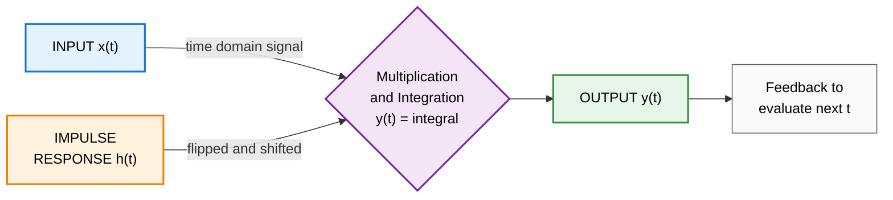
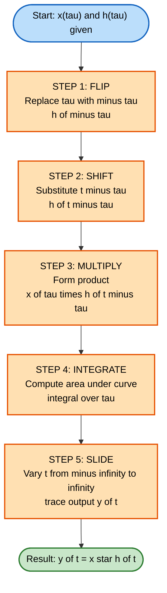
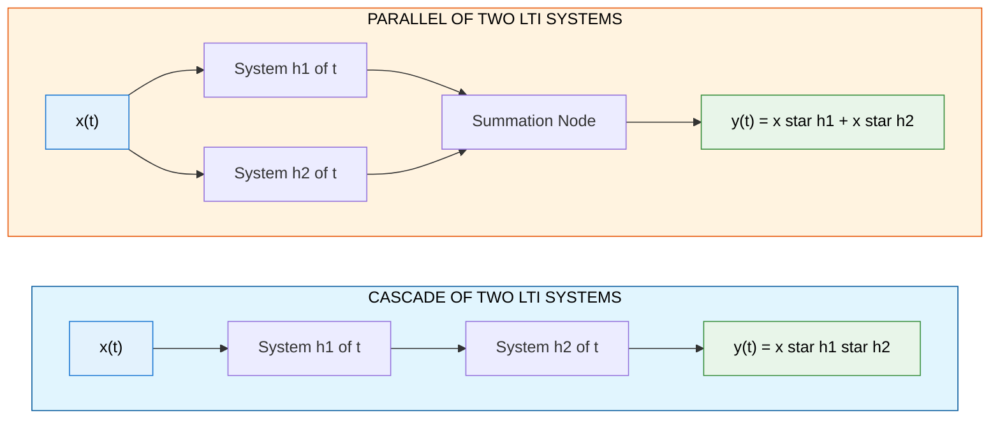

# Linear Time-Invariant (LTI) systems characterization: Convolution integral and convolution sum metrics

<!-- SECTION_1_START -->
# LTI Systems & Convolution — Core Foundations

## 1.1 Formal Definition (KTU 2024 Syllabus Terminology)

> [!NOTE]
> **Linear Time-Invariant (LTI) System:** A system that simultaneously satisfies the principle of **linearity** (superposition + homogeneity) and **time-invariance** (a shift in input produces an identical shift in output). In the KTU 2024 Signals and Systems framework, an LTI system is *completely characterized* by its response to a unit impulse — the **Impulse Response $h(t)$** for continuous-time (CT) and **$h[n]$** for discrete-time (DT).

| Symbol | Meaning | Domain |
|---|---|---|
| $h(t)$ | Continuous-time impulse response | $t \in \mathbb{R}$ |
| $h[n]$ | Discrete-time impulse response | $n \in \mathbb{Z}$ |
| $\delta(t)$ | Continuous-time unit impulse (Dirac delta) | $t = 0$ |
| $\delta[n]$ | Discrete-time unit impulse (Kronecker delta) | $n = 0$ |

## 1.2 Conceptual Analogy — "The Acoustic Fingerprint"

> [!IMPORTANT]
> **Imagine an empty cathedral.** When you clap once ($\delta(t)$), the sound doesn't vanish — it echoes, reverberates, and decays over a few seconds. That *entire decaying echo* is the impulse response $h(t)$ of the cathedral.
>
> Now play a song $x(t)$ in that cathedral. The output $y(t)$ is **NOT** the song played backward nor amplified — it is the song *convolved* with the cathedral's echo. Each infinitesimal moment of the song gets "smeared" by the room's natural response.

This is exactly the meaning of the **convolution integral** $y(t) = x(t) * h(t)$: the output is a **continuous weighted sum** of time-shifted, time-replicas of the impulse response, where the weights are the input samples.

> [!TIP]
> **Memory aid for first-year engineers:** Convolution = "Multiply, then Slide." The system's impulse response acts as a *sliding template* that scans across the input and accumulates weighted contributions.

## 1.3 Why Convolution Exists — The Decomposition Argument

Any signal $x(t)$ can be *decomposed* into a continuum of scaled, shifted impulses:

$$
x(t) = \int_{-\infty}^{+\infty} x(\tau)\, \delta(t - \tau)\, d\tau
$$

Since the LTI system is **linear**, the response to this *decomposed input* equals the *sum* of responses to each impulse individually. Since the system is **time-invariant**, the response to $\delta(t-\tau)$ is just $h(t-\tau)$. Adding up all contributions yields the **Convolution Integral**.

> [!VISUALIZATION CONTROL]
> **Concept:** Convolution as area-under-product visualization
> **GeoGebra / Desmos Input Equations:**
> * `f(tau) = exp(-tau) * (tau > 0)`  ← input
> * `g(tau) = 1 * (tau > 0 and tau < 2)` ← rectangular impulse response
> * `y(t) = integral of f(tau) * g(t - tau) dtau` ← convolution output
> **Visual Description:** The student should see a stationary function $f(\tau)$ and a *flipped, sliding* function $g(t-\tau)$. As $t$ increases, the flipped rectangle slides rightward across the input. The product's area *under the overlap region* at each $t$ traces the smooth ramp-up, plateau, and decay of $y(t)$.

---

<!-- SECTION_1_END -->

<!-- SECTION_2_START -->
# Deep Theoretical Analysis & KTU High-Yield Formula Sheet

## 2.1 Mathematical Characterization of LTI Systems

### 2.1.1 Convolution Integral (Continuous-Time LTI)

For an LTI system with impulse response $h(t)$ and input $x(t)$, the output is:

$$
y(t) = x(t) * h(t) = \int_{-\infty}^{+\infty} x(\tau)\, h(t - \tau)\, d\tau
$$

Equivalently, by commutativity:

$$
y(t) = \int_{-\infty}^{+\infty} h(\tau)\, x(t - \tau)\, d\tau
$$

> [!NOTE]
> The operation $* $ denotes **linear convolution** (not multiplication). The symbol $\tau$ is a *dummy variable* of integration and is then replaced by $(t-\tau)$ — this represents the "flip and slide" step.

### 2.1.2 Convolution Sum (Discrete-Time LTI)

For an LTI system with impulse response $h[n]$ and input $x[n]$, the output is:

$$
y[n] = x[n] * h[n] = \sum_{k=-\infty}^{+\infty} x[k]\, h[n - k]
$$

> [!IMPORTANT]
> The sum index $k$ sweeps through *all integer shifts*; for each $k$, we pick the $k$-th sample of $x$ and multiply it by the $(n-k)$-th sample of $h$. This is a **running weighted average**, not a pointwise multiplication.

## 2.2 Operational Steps (The "5-Step Convolution Protocol")

| Step | Operation | Description |
|---|---|---|
| **1. Flip** | Replace $\tau$ with $-\tau$ in $h(\tau)$ | Mirror $h$ about the vertical axis |
| **2. Shift** | Substitute $(t-\tau)$ for $-\tau$ | Slide the flipped $h$ by an amount $t$ |
| **3. Multiply** | Form the product $x(\tau) \cdot h(t-\tau)$ | Element-wise product under the overlap |
| **4. Integrate / Sum** | Compute $\int \cdot d\tau$ or $\sum (\cdot)$ | Area under the product curve |
| **5. Slide** | Vary $t$ (or $n$) continuously | Trace out the output $y(t)$ point-by-point |

## 2.3 KTU Formula Sheet — High-Yield Reference Table

| Formula / Property | Expression | Engineering Utility |
|---|---|---|
| **Convolution Integral (CT)** | $y(t) = \int_{-\infty}^{+\infty} x(\tau)\, h(t-\tau)\, d\tau$ | Foundation of CT system analysis |
| **Convolution Sum (DT)** | $y[n] = \sum_{k=-\infty}^{+\infty} x[k]\, h[n-k]$ | Foundation of DT system analysis |
| **Commutativity** | $x * h = h * x$ | Swap integrator and system block |
| **Associativity** | $(x * h_1) * h_2 = x * (h_1 * h_2)$ | Cascade of LTI systems is LTI |
| **Distributivity** | $x * (h_1 + h_2) = x*h_1 + x*h_2$ | Parallel LTI systems sum their responses |
| **Identity Element** | $x(t) * \delta(t) = x(t)$ | Impulse is the identity for convolution |
| **Stability (BIBO, CT)** | $\int_{-\infty}^{+\infty} \vert h(\tau) \vert\, d\tau < \infty$ | System is BIBO-stable if impulse response is absolutely integrable |
| **Stability (BIBO, DT)** | $\sum_{k=-\infty}^{+\infty} \vert h[k] \vert < \infty$ | System is BIBO-stable if impulse response is absolutely summable |
| **Causality (CT)** | $h(t) = 0$ for $t < 0$ | Output depends only on past and present input |
| **Causality (DT)** | $h[n] = 0$ for $n < 0$ | Output depends only on past and present input |
| **Step Response (CT)** | $s(t) = \int_{-\infty}^{t} h(\tau)\, d\tau$ | Cumulative integral of impulse response |
| **Step Response (DT)** | $s[n] = \sum_{k=-\infty}^{n} h[k]$ | Cumulative sum of impulse response |

> [!WARNING]
> **Stability vs Causality are independent.** A system can be stable but non-causal (e.g., ideal low-pass filter), or causal but unstable (e.g., $h(t) = e^{2t}u(t)$).

## 2.4 Real-World Engineering Utility

| Domain | Application of Convolution |
|---|---|
| **Audio Processing** | Reverb / echo simulation by convolving dry signal with room impulse response (RIR) |
| **Image Processing** | 2-D convolution with kernels for blur, sharpen, edge detection (Sobel, Gaussian) |
| **Communications** | Matched filtering for symbol detection in AWGN channels |
| **Control Systems** | Determining output trajectory of LTI plant from input |
| **Seismology** | Recovering source wavelet from seismic recordings via deconvolution |
| **Biomedical (ECG/EEG)** | Filtering bioelectric signals with impulse-response-matched filters |
| **Deep Learning** | CNNs perform discrete convolution between feature maps and learned kernels |

> [!TIP]
> In **production DSP systems** (e.g., MATLAB `conv`, `numpy.convolve`, `scipy.signal.convolve`), convolution is the *single most-used primitive operation*. Mastering it by hand enables engineers to design, debug, and predict system behavior in any of the above fields.

---

<!-- SECTION_2_END -->

<!-- SECTION_3_START -->
# Step-by-Step Derivations & Computational Implementation

## 3.1 Derivation of the Convolution Integral

**Starting point:** Any signal $x(t)$ can be expressed as a continuous-weighted sum of shifted impulses:

$$
x(t) = \int_{-\infty}^{+\infty} x(\tau)\, \delta(t - \tau)\, d\tau \quad \text{(Sifting Property)}
$$

**Apply the LTI system $\mathcal{H}$** to both sides (linearity allows the operator to pass inside the integral):

$$
y(t) = \mathcal{H}\{x(t)\} = \int_{-\infty}^{+\infty} x(\tau)\, \mathcal{H}\{\delta(t - \tau)\}\, d\tau
$$

**Apply time-invariance** — the response to a time-shifted impulse is the time-shifted impulse response:

$$
\mathcal{H}\{\delta(t - \tau)\} = h(t - \tau)
$$

**Substitute back** to obtain the final convolution integral:

$$
\boxed{y(t) = \int_{-\infty}^{+\infty} x(\tau)\, h(t - \tau)\, d\tau}
$$

The discrete-time derivation is **analogous**, replacing integration with summation.

## 3.2 Worked Example 1 — Continuous-Time Convolution

**Problem (KTU 2024 Model):** Let $x(t) = e^{-t}\, u(t)$ and $h(t) = u(t)$ (unit step). Compute $y(t) = x(t) * h(t)$.

**Step 1 — Write the integral:**

$$
y(t) = \int_{-\infty}^{+\infty} x(\tau)\, h(t - \tau)\, d\tau = \int_{-\infty}^{+\infty} e^{-\tau}\, u(\tau) \cdot u(t - \tau)\, d\tau
$$

**Step 2 — Apply unit step constraints** (limits of integration):
- $u(\tau) = 1$ requires $\tau \geq 0$
- $u(t - \tau) = 1$ requires $\tau \leq t$

Therefore the integration range is $0 \leq \tau \leq t$ (and the integral is zero if $t < 0$).

**Step 3 — Evaluate the integral for $t \geq 0$:**

$$
y(t) = \int_{0}^{t} e^{-\tau}\, d\tau = \left[ -e^{-\tau} \right]_{0}^{t} = -e^{-t} - (-1) = 1 - e^{-t}
$$

**Step 4 — Combine with the unit step gate:**

$$
\boxed{y(t) = \left(1 - e^{-t}\right) u(t)}
$$

**Verification:** As $t \to \infty$, $y(t) \to 1$ (correct: the integral of a decaying exponential over all time is 1, and step keeps integrating forever). ✓

## 3.3 Worked Example 2 — Discrete-Time Convolution (Tabular)

**Problem:** Let $x[n] = \{1, 2, 1\}$ for $n = 0, 1, 2$ and $h[n] = \{1, 1, 1\}$ for $n = 0, 1, 2$. Compute $y[n] = x[n] * h[n]$.

**Step 1 — Determine output length:** If $x$ has length $N_x$ and $h$ has length $N_h$, then $y$ has length $N_y = N_x + N_h - 1 = 3 + 3 - 1 = 5$.

**Step 2 — Tabulate (or use the polynomial-multiplication trick):**

$$
\begin{aligned}
y[0] &= x[0]\,h[0] = 1 \cdot 1 = 1 \\[4pt]
y[1] &= x[0]\,h[1] + x[1]\,h[0] = 1 \cdot 1 + 2 \cdot 1 = 3 \\[4pt]
y[2] &= x[0]\,h[2] + x[1]\,h[1] + x[2]\,h[0] = 1 \cdot 1 + 2 \cdot 1 + 1 \cdot 1 = 4 \\[4pt]
y[3] &= x[1]\,h[2] + x[2]\,h[1] = 2 \cdot 1 + 1 \cdot 1 = 3 \\[4pt]
y[4] &= x[2]\,h[2] = 1 \cdot 1 = 1
\end{aligned}
$$

**Step 3 — Final result:**

$$
\boxed{y[n] = \{1, 3, 4, 3, 1\}, \quad n = 0, 1, 2, 3, 4}
$$

**Verification (Diagonal / Polynomial Trick):** Multiply polynomials $(1 + 2z + z^2)(1 + z + z^2)$ and read coefficients:
- $1 \cdot 1 = 1$ → $y[0]$
- $1 \cdot z + 2 \cdot 1 = 3$ → $y[1]$
- $1 \cdot z^2 + 2 \cdot z + 1 \cdot 1 = 4$ → $y[2]$
- $2 \cdot z^2 + 1 \cdot z = 3$ → $y[3]$
- $1 \cdot z^2 = 1$ → $y[4]$ ✓

## 3.4 Python Implementation (Numerically Operational Code)

```python
import numpy as np
import matplotlib.pyplot as plt
from typing import Tuple

def convolution_sum(x: np.ndarray, h: np.ndarray) -> Tuple[np.ndarray, np.ndarray]:
    """
    Compute discrete-time linear convolution y[n] = x[n] * h[n].
    
    Args:
        x: 1-D input signal array (dtype float)
        h: 1-D impulse response array (dtype float)
    
    Returns:
        y: 1-D output array of length len(x) + len(h) - 1
        n: integer index vector corresponding to y
    
    Raises:
        ValueError: if either input is empty
    """
    if x.size == 0 or h.size == 0:
        raise ValueError("[convolution_sum] Input arrays must be non-empty.")
    
    # numpy.convolve with mode='full' returns the full linear convolution
    y = np.convolve(x, h, mode='full')
    n = np.arange(y.size, dtype=int)
    
    return y, n


def convolution_integral_approx(
    x_t: callable, h_t: callable, t_min: float, t_max: float, num_points: int = 2000
) -> Tuple[np.ndarray, np.ndarray]:
    """
    Numerically compute the continuous-time convolution y(t) = x(t) * h(t)
    over a finite time window using vectorized numerical integration.
    
    Args:
        x_t:   callable input signal x(t)
        h_t:   callable impulse response h(t)
        t_min: lower bound of evaluation window (seconds)
        t_max: upper bound of evaluation window (seconds)
        num_points: number of uniformly-spaced sample points (>= 1000 recommended)
    
    Returns:
        t_vec: time axis vector
        y_vec: convolved output evaluated at t_vec
    """
    if t_max <= t_min:
        raise ValueError("[convolution_integral_approx] t_max must exceed t_min.")
    if num_points < 100:
        raise ValueError("[convolution_integral_approx] num_points too small for accuracy.")
    
    # Time vector (output evaluation points)
    t_vec = np.linspace(t_min, t_max, num_points)
    
    # Dummy integration variable tau (dense grid)
    tau = np.linspace(t_min, t_max, num_points)
    d_tau = tau[1] - tau[0]
    
    # Pre-compute x(tau) as a column, and h(t - tau) as a row-matrix.
    # Broadcasting: (num_points, num_points) integrand matrix.
    x_col = x_t(tau).reshape(-1, 1)               # column vector shape (N, 1)
    h_row = h_t(t_vec.reshape(1, -1) - tau.reshape(-1, 1))  # row vector (1, N) -> (N, N)
    
    integrand = x_col * h_row
    y_vec = np.sum(integrand, axis=0) * d_tau     # trapezoidal-style Riemann sum
    
    return t_vec, y_vec


# ----------------------------------------------------------------------
# Demonstration with the two worked examples
# ----------------------------------------------------------------------
if __name__ == "__main__":

    # ----- Example A: Discrete-Time -----
    x_dt = np.array([1.0, 2.0, 1.0])
    h_dt = np.array([1.0, 1.0, 1.0])
    y_dt, n_dt = convolution_sum(x_dt, h_dt)
    print(f"[DT] y[n] = {y_dt}  at n = {n_dt}")
    # Expected: [1. 3. 4. 3. 1.]

    # ----- Example B: Continuous-Time x(t) = exp(-t)u(t), h(t) = u(t) -----
    x_func = lambda t: np.where(t >= 0, np.exp(-t), 0.0)
    h_func = lambda t: np.where(t >= 0, 1.0, 0.0)
    t_vec, y_ct = convolution_integral_approx(
        x_func, h_func, t_min=0.0, t_max=8.0, num_points=4000
    )
    y_analytic = 1.0 - np.exp(-t_vec)  # closed-form for comparison
    max_error = np.max(np.abs(y_ct - y_analytic))
    print(f"[CT] Max |numerical - analytic| over [0,8] s = {max_error:.6e}")
    # Expected: very small (< 1e-3)
```

> [!TIP]
> **Numerical note:** The Python `convolution_integral_approx` function uses an $(N \times N)$ matrix — for $N = 4000$ this is **16 million** operations, fine for one-off calculations. For production-scale real-time DSP, use FFT-based convolution (`numpy.fft.fft` + element-wise multiply + `ifft`), which is $O(N \log N)$ instead of $O(N^2)$.

---

<!-- SECTION_3_END -->

<!-- SECTION_4_START -->
# Structural Diagrams & Signal-Flow Schematics

## 4.1 High-Level LTI System Block Diagram



## 4.2 Convolution Operational Flow (5-Step Protocol)



## 4.3 LTI Cascade & Parallel Decomposition Architecture



## 4.4 Sequential Processing Topology Matrix (Mapping the Convolution Pipeline)

| Stage | Operation | Input → Output | State Dependency |
|---|---|---|---|
| **Stage 1** | Time-Reversal | $h(\tau) \to h(-\tau)$ | None (preprocessing) |
| **Stage 2** | Time-Shift by $t$ | $h(-\tau) \to h(t-\tau)$ | Current value of $t$ |
| **Stage 3** | Element-wise Product | $x(\tau) \cdot h(t-\tau)$ | Result of Stage 2 |
| **Stage 4** | Integration / Summation | $\int \cdot d\tau$ or $\sum$ | Stage 3 over full domain |
| **Stage 5** | Sweep $t$ | $t \leftarrow t + \Delta t$ | Loop counter |
| **Stage 6** | Termination | Output $y(t)$ assembled | When $t$ reaches $t_{max}$ |

> [!NOTE]
> This **sequential processing topology** is exactly how a CPU or DSP chip computes convolution: a multiply-accumulate (MAC) unit loops over the kernel (impulse response), multiplying, accumulating, and sliding the kernel across the input frame-by-frame.

---

<!-- SECTION_4_END -->

<!-- SECTION_5_START -->
# KTU 2024 Scheme Examination Question Bank

## Part A — Short Answer Questions (3 Marks Each)

### Question 1
**[KTU University Exam — July 2023]**
Define the **impulse response** of an LTI system. How does it completely characterize the system?
**Course Outcome:** CO1 | **Bloom's Level:** Remember

**Model Answer:**

> The **impulse response** $h(t)$ (CT) or $h[n]$ (DT) is the output of an LTI system when the input is a unit impulse $\delta(t)$ (or $\delta[n]$), assuming the system is initially at rest.
>
> It *completely characterizes* the LTI system because of two fundamental properties:
> 1. **Linearity** allows decomposition of any input into a sum of scaled, shifted impulses.
> 2. **Time-invariance** ensures that the response to $\delta(t-\tau)$ is $h(t-\tau)$.
>
> Combining these gives the convolution integral $y(t) = \int x(\tau)\, h(t-\tau)\, d\tau$, which determines $y(t)$ for *any* input $x(t)$. **[3 Marks: 1 for definition, 2 for complete characterization reasoning]**

### Question 2
**[KTU University Exam — Dec 2023]**
State and briefly explain the **BIBO stability** condition for a continuous-time LTI system in terms of its impulse response.
**Course Outcome:** CO2 | **Bloom's Level:** Understand

**Model Answer:**

> A continuous-time LTI system is **Bounded-Input Bounded-Output (BIBO) stable** if and only if its impulse response is **absolutely integrable**, i.e.,
> $$\int_{-\infty}^{+\infty} \vert h(\tau) \vert\, d\tau < \infty$$
>
> **Reasoning:** If input $x(t)$ is bounded ($\vert x(t) \vert \leq M$), then
> $$\vert y(t) \vert = \left\vert \int x(\tau)\, h(t-\tau)\, d\tau \right\vert \leq M \int \vert h(\tau) \vert\, d\tau < \infty$$
> So bounded input produces bounded output. Conversely, if the integral diverges, one can construct a bounded input that drives output to infinity. **[3 Marks: 1 for condition, 2 for justification]**

---

## Part B — Long Answer Questions (14 Marks Each, with Internal Choice)

### Question A (14 Marks)
**[KTU University Exam — July 2024]**
**(a)** [7 Marks] Derive the **convolution integral** expression for the output of a continuous-time LTI system, starting from the sifting property of the impulse function. Clearly state the roles of linearity and time-invariance.
**Course Outcome:** CO1, CO2 | **Bloom's Level:** Understand, Apply

**(b)** [7 Marks] For the system with impulse response $h(t) = e^{-2t}\, u(t)$ and input $x(t) = u(t) - u(t-3)$, compute and sketch $y(t)$.
**Course Outcome:** CO3 | **Bloom's Level:** Apply

**Model Solution:**

**(a) Derivation:**

> **Step 1 — Express input as integral of shifted impulses (Sifting property):** [1 Mark]
> $$x(t) = \int_{-\infty}^{+\infty} x(\tau)\, \delta(t - \tau)\, d\tau$$
>
> **Step 2 — Apply the LTI operator $\mathcal{H}$ to both sides; linearity permits entry into the integral:** [2 Marks]
> $$y(t) = \mathcal{H}\{x(t)\} = \int_{-\infty}^{+\infty} x(\tau)\, \mathcal{H}\{\delta(t - \tau)\}\, d\tau$$
>
> **Step 3 — Use time-invariance: response to $\delta(t-\tau)$ is the time-shifted impulse response $h(t-\tau)$:** [2 Marks]
> $$\mathcal{H}\{\delta(t - \tau)\} = h(t - \tau)$$
>
> **Step 4 — Substitute to obtain the convolution integral:** [2 Marks]
> $$\boxed{y(t) = \int_{-\infty}^{+\infty} x(\tau)\, h(t - \tau)\, d\tau = x(t) * h(t)}$$

**(b) Computation:**

> **Step 1 — Write the convolution integral with appropriate step constraints:** [1 Mark]
> $$y(t) = \int_{0}^{3} e^{-2(t-\tau)}\, d\tau \quad \text{(valid for } t \geq 0\text{)}$$
> (because $x(\tau) = 1$ only for $0 \leq \tau \leq 3$, and $h(t-\tau) = e^{-2(t-\tau)}$ for $t \geq \tau$)
>
> **Step 2 — Evaluate the integral for $0 \leq t \leq 3$:** [2 Marks]
> $$y(t) = e^{-2t} \int_{0}^{t} e^{2\tau}\, d\tau = e^{-2t} \cdot \frac{1 - e^{2t}}{-2} = \frac{1}{2}\left(1 - e^{-2t}\right)$$
>
> **Step 3 — Evaluate for $t > 3$:** [2 Marks]
> $$y(t) = e^{-2t} \int_{0}^{3} e^{2\tau}\, d\tau = e^{-2t} \cdot \frac{e^{6} - 1}{2} = \frac{1 - e^{-6}}{2}\, e^{-2(t-3)}$$
>
> **Step 4 — Assemble final piecewise expression and sketch:** [2 Marks]
> $$\boxed{y(t) = \begin{cases} 0, & t < 0 \\[4pt] \dfrac{1}{2}\left(1 - e^{-2t}\right), & 0 \leq t \leq 3 \\[4pt] \dfrac{1 - e^{-6}}{2}\, e^{-2(t-3)}, & t > 3 \end{cases}}$$
> Sketch: ramp-up from 0 to $\approx 0.5$ for $0 \leq t \leq 3$, then exponential decay back toward 0.

---

### Question B (14 Marks) — *Internal Choice Alternative*
**[KTU University Exam — Dec 2024]**
**(a)** [7 Marks] Explain the **graphical procedure** for computing the convolution of two continuous-time signals. List the four operations in order.
**Course Outcome:** CO1 | **Bloom's Level:** Understand, Apply

**(b)** [7 Marks] Compute the convolution $y[n] = x[n] * h[n]$ where $x[n] = \{1, 1, 1\}$ for $n = 0, 1, 2$ and $h[n] = \{1, 2, 3\}$ for $n = 0, 1, 2$. Sketch $x[n]$, $h[n]$, and $y[n]$.
**Course Outcome:** CO3 | **Bloom's Level:** Apply

**Model Solution:**

**(a) Graphical Procedure (Four Operations):** [7 Marks: 1.5 per step + 1 for example]

> 1. **Folding (Time-Reversal):** Replace $h(\tau)$ by $h(-\tau)$ — mirror about vertical axis.
> 2. **Shifting (Translation):** Replace $h(-\tau)$ by $h(t-\tau)$ — shift by $t$ to the right.
> 3. **Multiplication:** Form the product $x(\tau) \cdot h(t-\tau)$.
> 4. **Integration (Area Computation):** Compute $\int x(\tau)\, h(t-\tau)\, d\tau$ over the overlap region. This integral gives one value of $y(t)$ for that $t$.
>
> The process is repeated for every value of $t$ from $-\infty$ to $+\infty$, and the resulting $y(t)$ is plotted.

**(b) Discrete Convolution Computation:** [7 Marks: 1 per output sample + 2 for sketch]

> **Output length:** $3 + 3 - 1 = 5$ samples. Compute sample-by-sample: [1 Mark each for first 4, 1 Mark for last]
>
> $$\begin{aligned}
> y[0] &= x[0] \cdot h[0] = 1 \cdot 1 = 1 \\[4pt]
> y[1] &= x[0]\,h[1] + x[1]\,h[0] = 1 \cdot 2 + 1 \cdot 1 = 3 \\[4pt]
> y[2] &= x[0]\,h[2] + x[1]\,h[1] + x[2]\,h[0] = 1 \cdot 3 + 1 \cdot 2 + 1 \cdot 1 = 6 \\[4pt]
> y[3] &= x[1]\,h[2] + x[2]\,h[1] = 1 \cdot 3 + 1 \cdot 2 = 5 \\[4pt]
> y[4] &= x[2]\,h[2] = 1 \cdot 3 = 3
> \end{aligned}$$
>
> **Final result:** [1 Mark]
> $$\boxed{y[n] = \{1, 3, 6, 5, 3\}, \quad n = 0, 1, 2, 3, 4}$$
>
> **Sketch:** $x[n]$ and $h[n]$ are rectangular/triangular discrete sequences; $y[n]$ is a *tent-like* shape that rises from 1, peaks at 6, then decays through 5 to 3. [2 Marks]

---

## KTU Examiner's Valuation Warning & Pitfall Callout

> [!WARNING]
> **Common Mark-Loss Pitfalls (cost ~3-5 marks per question):**
>
> 1. **Forgetting the unit step constraint:** When $x(t)$ or $h(t)$ contains $u(t)$ (or $u(t-a)$), students often *omit* the resulting limits on $\tau$ and write $\int_{-\infty}^{+\infty}$ directly. This leads to incorrect limits and full marks deduction. **Always convert $u(\cdot)$ into integration bounds explicitly.**
>
> 2. **Wrong sign in the exponential term:** During the substitution $\tau \to (t - \tau)$, students frequently forget that $h(t - \tau) = e^{-(t-\tau)} = e^{-t+\tau}$, *not* $e^{-t-\tau}$. A single sign error cascades.
>
> 3. **In DT convolution, miscounting output length:** Output length is $N_x + N_h - 1$, not $N_x + N_h$ or $\max(N_x, N_h)$. Missing this off-by-one is a 1-mark penalty.
>
> 4. **No piecewise assembly:** For finite-support signals, the output must be written as a piecewise expression across regions (e.g., $t < 0$, $0 \leq t \leq 3$, $t > 3$). Writing only the middle case loses 1-2 marks.
>
> 5. **Confusing $h(t-\tau)$ with $h(\tau-t)$:** The first denotes *flip and right-shift*; the second is *flip and left-shift*. Mark this clearly during graphical construction.
>
> 6. **No sketch when explicitly asked:** KTU board examiners *require* a labelled sketch of input, flipped impulse response, and output. Skipping the sketch costs a full sub-part mark.

---

## Topic Recap & Important Things to Remember

> [!IMPORTANT]
> **Rapid-Revision Checklist — Convolution & LTI Characterization**

- [x] **Impulse response $h(t)$ / $h[n]$ is the complete fingerprint of any LTI system.**
- [x] **Convolution Integral (CT):** $y(t) = \int_{-\infty}^{+\infty} x(\tau)\, h(t-\tau)\, d\tau$
- [x] **Convolution Sum (DT):** $y[n] = \sum_{k=-\infty}^{+\infty} x[k]\, h[n-k]$
- [x] **Graphical 4-step recipe:** Fold → Shift → Multiply → Integrate/Sum (and slide $t$).
- [x] **Convolution is commutative, associative, and distributive over addition.**
- [x] **Identity element:** $x(t) * \delta(t) = x(t)$.
- [x] **BIBO Stability (CT):** $\int_{-\infty}^{+\infty} \vert h(\tau) \vert\, d\tau < \infty$.
- [x] **BIBO Stability (DT):** $\sum_{k=-\infty}^{+\infty} \vert h[k] \vert < \infty$.
- [x] **Causality:** $h(t) = 0$ for $t < 0$ (CT) and $h[n] = 0$ for $n < 0$ (DT).
- [x] **Step response** is the *running integral / cumulative sum* of the impulse response.
- [x] **DT output length:** $N_y = N_x + N_h - 1$.
- [x] **Cascading two LTI systems** is equivalent to convolving their impulse responses: $h_{eq}(t) = h_1(t) * h_2(t)$.
- [x] **Parallel LTI systems** produce output equal to the *sum* of individual convolutions.
- [x] **Stability and causality are independent** — a system may have either, both, or neither.
- [x] **Impulse $\delta(t)$ is the identity for convolution; any other signal is a "spread" of the identity by the system's response.**
- [x] **Engineering applications** include audio reverb, image filtering, matched filtering, seismic deconvolution, and CNN feature extraction.

<!-- SECTION_5_END -->
