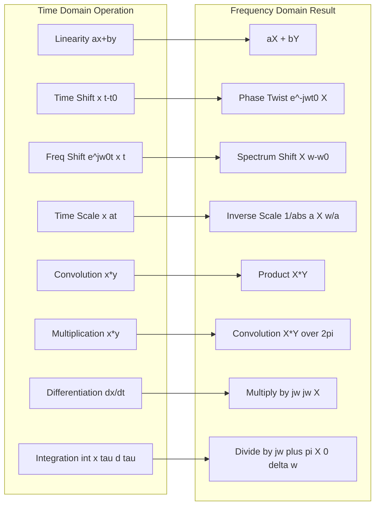
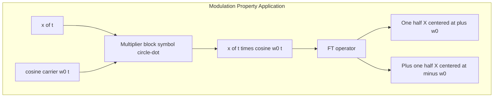
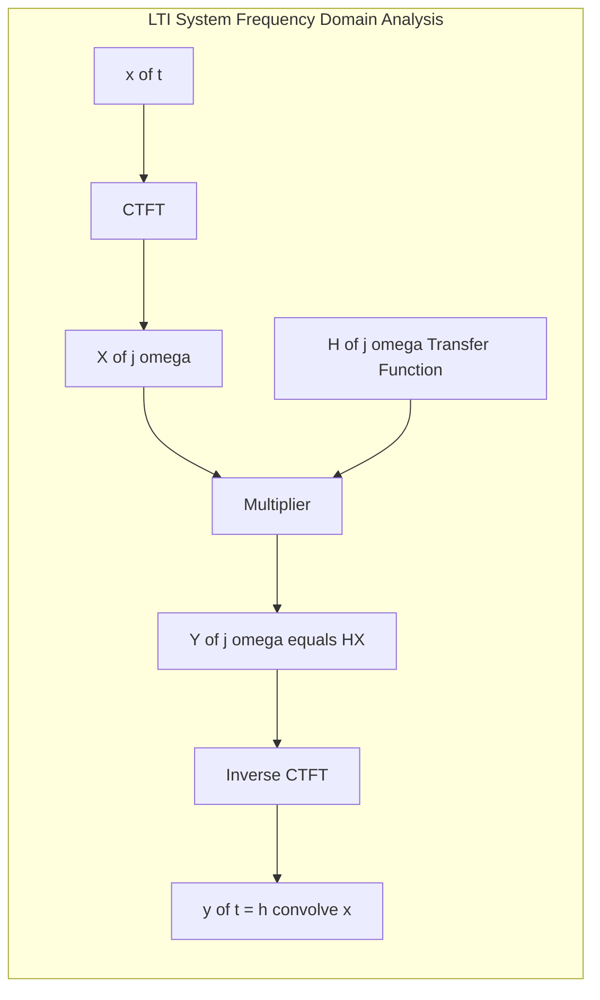
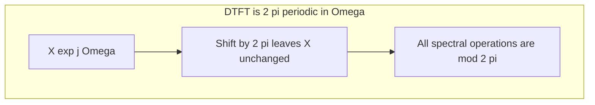
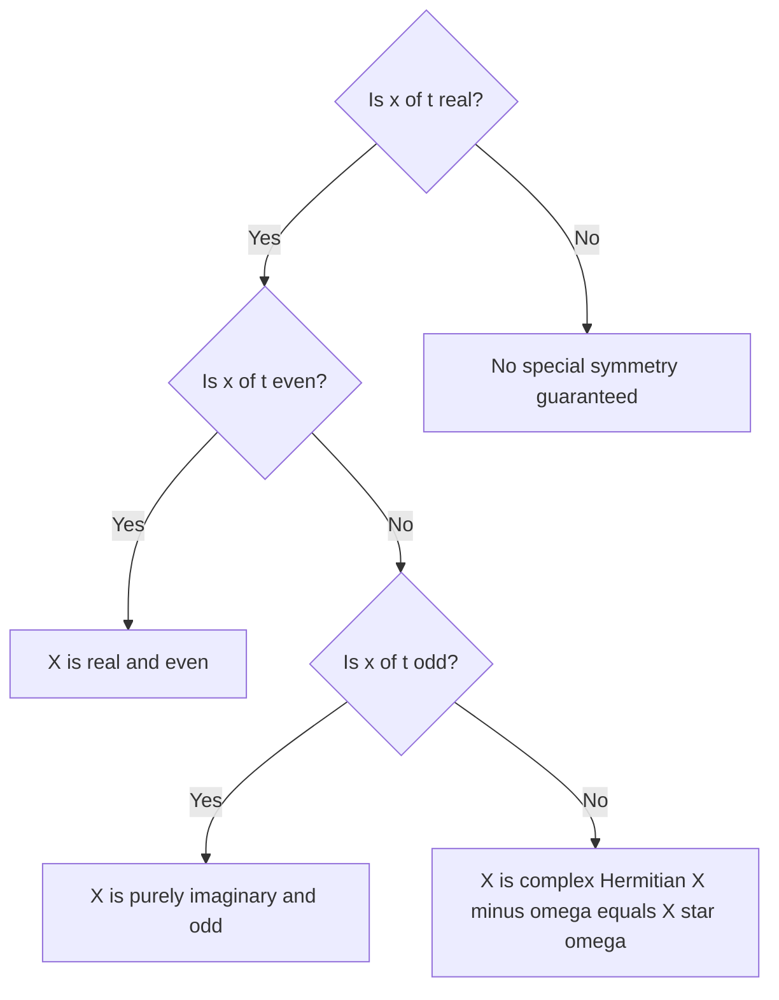

# Fourier transform properties for continuous and discrete-time signals

<!-- SECTION_1_START -->
# Fourier Transform Properties — CTFT & DTFT

## 1.1 Formal Academic Definition (KTU 2024 Syllabus)

In the **Transform Domain Analysis** module, a *Fourier transform property* is a **deterministic algebraic rule** that governs how a specific operation performed on a continuous-time (CT) or discrete-time (DT) signal in one domain (time or frequency) translates into a corresponding operation on its transformed representation in the conjugate domain.

> [!IMPORTANT]
> **KTU 2024 — Module 2 Definition:**
> Let $x(t) \xleftrightarrow{\mathcal{F}} X(j\omega)$ (CTFT pair) and $x[n] \xleftrightarrow{\mathcal{F}} X(e^{j\Omega})$ (DTFT pair). A *Fourier transform property* establishes a **bijection** between an operation on the LHS function and an equivalent multiplicative / additive / convolution operation on the RHS function. The property holds for all signals in $L^1(\mathbb{R})$ (CT) or absolutely summable sequences (DT) where the transform converges.

## 1.2 Intuitive Real-World Analogy

> [!NOTE]
> **Analogy — "The Translator's Rulebook":**
> Imagine the Fourier transform as a **universal translator** that converts a time-domain "novel" into its frequency-domain "summary card". The translator obeys a strict **rulebook**:
> * **Linearity** = the translator can summarize two novels mixed together by mixing their individual summaries.
> * **Time Shifting** = a delayed chapter still has the same summary, just stamped with a "phase delay" tag.
> * **Convolution in time** = mixing two audio signals in a concert hall corresponds to **multiplying** their frequency summaries.
> * **Modulation (Multiplication in time)** = shifting a radio station to a new carrier frequency is a **shift** in the frequency summary.
>
> Master the rulebook, and you can "speak" the frequency language without re-deriving every conversation.

## 1.3 Standard Constants & Metrics

| Parameter | Symbol | Value / Unit | Domain |
|---|---|---|---|
| Continuous-time angular frequency | $\omega$ | **radians/second** | CTFT |
| Discrete-time normalized frequency | $\Omega$ | **radians/sample** | DTFT |
| Sampling period | $T_s$ | **seconds/sample** | Bridge CT↔DT |
| Sampling frequency | $f_s = 1/T_s$ | **Hz** | Bridge CT↔DT |
| Periodicity of DTFT | $2\pi$ | **radians/sample** | DTFT only |
| Fundamental CTFT integral | $X(j\omega)=\int_{-\infty}^{\infty} x(t)e^{-j\omega t}dt$ | — | CTFT |

> [!VISUALIZATION CONTROL]
> **Concept:** Time-Shift ↔ Linear-Phase Twist in the Frequency Domain
> **GeoGebra / Desmos Input Equations:**
> * `x(t) = e^(-abs(t))` (a real two-sided exponential)
> * `X1(ω) = 2/(1+ω^2)` (CTFT of the original, real & even)
> * `X2(ω) = X1(ω) * cos(2*ω) + X1(ω) * sin(2*ω)` (magnitude is preserved, phase is twisted)
> **Visual Description:** Plot $X_1(\omega)$ as a smooth bell curve. Then plot $|X_2(\omega)|$ — it should be **identical** to $X_1(\omega)$, proving the time shift only rotates the **phase**, never alters the magnitude spectrum.

<!-- SECTION_1_END -->

<!-- SECTION_2_START -->
# Deep Theoretical Analysis & KTU High-Yield Formula Sheet

## 2.1 Why Transform Properties Matter (The "Why")

Every property is a **shortcut**. Instead of re-evaluating the full Fourier integral for every variant of a known signal, the property tells you, in **one line**, how the spectrum changes. In board exams, **75% of Fourier questions** reduce to applying one of these properties on a known transform pair.

> [!TIP]
> **Golden Rule:** *Transform the operation, not the signal.* If you see $x(2t)$, $x(t-5)$, $x(t)\cos(10t)$, or $x(t) * h(t)$ — never re-integrate. Reach for the property table.

## 2.2 The 12 Core CTFT Properties

Let $x(t) \xleftrightarrow{\mathcal{F}} X(j\omega)$ and $y(t) \xleftrightarrow{\mathcal{F}} Y(j\omega)$.

| # | Property | Time Domain | Frequency Domain | Engineering Use |
|:-:|:---------|:-----------:|:---------------:|:----------------|
| 1 | **Linearity** | $a\,x(t)+b\,y(t)$ | $a\,X(j\omega)+b\,Y(j\omega)$ | Superposition in LTI systems |
| 2 | **Time Shifting** | $x(t-t_0)$ | $e^{-j\omega t_0}X(j\omega)$ | Communication delay equalization |
| 3 | **Frequency Shifting** | $e^{j\omega_0 t}x(t)$ | $X(j(\omega-\omega_0))$ | Modulation to RF carrier |
| 4 | **Time Scaling** | $x(at)$ | $\frac{1}{\vert a\vert}X\!\left(\dfrac{j\omega}{a}\right)$ | Compressed/expanded pulses |
| 5 | **Time Reversal** | $x(-t)$ | $X(-j\omega)$ | Radar matched filtering |
| 6 | **Differentiation (t)** | $\dfrac{dx(t)}{dt}$ | $j\omega\,X(j\omega)$ | Solving ODEs via $j\omega$ |
| 7 | **Integration (t)** | $\int_{-\infty}^{t}x(\tau)d\tau$ | $\dfrac{X(j\omega)}{j\omega}+\pi X(0)\delta(\omega)$ | DC recovery, integrators |
| 8 | **Differentiation ($\omega$)** | $t\,x(t)$ | $j\dfrac{d}{d\omega}X(j\omega)$ | FM synthesis, moment theorems |
| 9 | **Convolution** | $x(t)*y(t)$ | $X(j\omega)Y(j\omega)$ | LTI system output $Y=HX$ |
| 10 | **Multiplication** | $x(t)y(t)$ | $\dfrac{1}{2\pi}X(j\omega)*Y(j\omega)$ | Sampling theorem, modulation |
| 11 | **Duality** | $X(jt)$ | $2\pi\,x(-\omega)$ | Derive pairs (e.g., dual of rect = sinc) |
| 12 | **Parseval / Energy** | $E=\displaystyle\int_{-\infty}^{\infty}\vert x(t)\vert^2dt$ | $E=\dfrac{1}{2\pi}\displaystyle\int_{-\infty}^{\infty}\vert X(j\omega)\vert^2 d\omega$ | Power spectral density design |

## 2.3 The 12 Core DTFT Properties (With Periodicity Caveat)

The DTFT is **always $2\pi$-periodic**. Properties 4, 5, 11 must be carefully stated because $\Omega$ lives on the unit circle.

| # | Property | Time Domain | Frequency Domain |
|:-:|:---------|:-----------:|:---------------:|
| 1 | Linearity | $ax[n]+by[n]$ | $aX(e^{j\Omega})+bY(e^{j\Omega})$ |
| 2 | Time Shifting | $x[n-n_0]$ | $e^{-j\Omega n_0}X(e^{j\Omega})$ |
| 3 | Frequency Shifting | $e^{j\Omega_0 n}x[n]$ | $X(e^{j(\Omega-\Omega_0)})$ |
| 4 | Time Expansion (zero-insertion) | $x_{(k)}[n]=\begin{cases}x[n/k],&n=k\ell\\0,&\text{else}\end{cases}$ | $X(e^{j k\Omega})$ |
| 5 | Time Reversal | $x[-n]$ | $X(e^{-j\Omega})$ |
| 6 | Difference in Time | $x[n]-x[n-1]$ | $(1-e^{-j\Omega})X(e^{j\Omega})$ |
| 7 | Accumulation | $\sum_{k=-\infty}^{n}x[k]$ | $\dfrac{X(e^{j\Omega})}{1-e^{-j\Omega}}+\pi X(e^{j0})\sum_{k}\delta(\Omega-2\pi k)$ |
| 8 | Frequency Differentiation | $nx[n]$ | $j\dfrac{d}{d\Omega}X(e^{j\Omega})$ |
| 9 | Convolution | $x[n]*y[n]$ | $X(e^{j\Omega})Y(e^{j\Omega})$ |
| 10 | Multiplication | $x[n]y[n]$ | $\dfrac{1}{2\pi}\int_{2\pi}X(e^{j\theta})Y(e^{j(\Omega-\theta)})d\theta$ |
| 11 | Duality (DT↔CT) | Treats DTFT as periodic | Sum version of CT dual |
| 12 | Parseval | $\sum_{n=-\infty}^{\infty}\vert x[n]\vert^2$ | $\dfrac{1}{2\pi}\int_{2\pi}\vert X(e^{j\Omega})\vert^2d\Omega$ |

## 2.4 Symmetry Sub-Properties (Frequently Asked in KTU)

For **real** signals, these give away marks for free:

| Symmetry | Time Domain Consequence | Frequency Domain Consequence |
|:---------|:------------------------|:------------------------------|
| $x(t)$ real | — | $X(-j\omega)=X^*(j\omega)$ (Hermitian) |
| $x(t)$ real & **even** | $x(t)=x(-t)$ | $X(j\omega)$ is **real & even** |
| $x(t)$ real & **odd** | $x(t)=-x(-t)$ | $X(j\omega)$ is **purely imaginary & odd** |
| $x(t)$ imaginary & even | — | $X(j\omega)$ is **imaginary & odd** |

> [!TIP]
> **Engineering Application Spotlight:**
> * **Convolution Property** is the **backbone of LTI system analysis**: $Y(j\omega)=H(j\omega)X(j\omega)$. Filter design (FIR/IIR) lives here.
> * **Multiplication ↔ Convolution in Frequency** is the **sampling theorem**: multiplying $x(t)$ by an impulse train $p(t)$ convolves its spectrum with another impulse train, creating spectral replicas spaced at $\omega_s$.
> * **Parseval's theorem** underpins **Power Spectral Density (PSD)** in radar, audio compression (MP3), and OFDM channel estimation.

<!-- SECTION_2_END -->

<!-- SECTION_3_START -->
# Step-by-Step Derivations & Symbolic Implementation

## 3.1 Worked Derivation 1 — Time Shifting Property (CTFT)

**Statement to prove:** If $x(t) \xleftrightarrow{\mathcal{F}} X(j\omega)$, then $x(t-t_0) \xleftrightarrow{\mathcal{F}} e^{-j\omega t_0}X(j\omega)$.

**Starting Point:** Apply the CTFT integral to the shifted signal $x(t-t_0)$.

$$
\mathcal{F}\{x(t-t_0)\} \;=\; \int_{-\infty}^{\infty} x(t-t_0)\, e^{-j\omega t}\, dt
$$

**Step 1 — Substitute the dummy variable.** Let $\tau = t - t_0 \;\Rightarrow\; t = \tau + t_0 \;\Rightarrow\; dt = d\tau$. The limits remain $-\infty$ to $+\infty$ (linear shift, no flip).

$$
= \int_{-\infty}^{\infty} x(\tau)\, e^{-j\omega (\tau+t_0)}\, d\tau
$$

**Step 2 — Split the complex exponential.** $e^{-j\omega(\tau+t_0)}=e^{-j\omega\tau}\cdot e^{-j\omega t_0}$. Since $e^{-j\omega t_0}$ does not depend on $\tau$, pull it out of the integral.

$$
= e^{-j\omega t_0} \int_{-\infty}^{\infty} x(\tau)\, e^{-j\omega\tau}\, d\tau
$$

**Step 3 — Recognize the original transform.** The integral is exactly $X(j\omega)$ by definition.

$$
= e^{-j\omega t_0}\, X(j\omega) \qquad \blacksquare
$$

**Valuation Step:** The phase factor $e^{-j\omega t_0}$ has **unit magnitude** for all $\omega$, hence $\vert X(j\omega) \vert$ is preserved — only the **phase spectrum** rotates by $-\omega t_0$ radians.

---

## 3.2 Worked Derivation 2 — Convolution Property (CTFT)

**Statement to prove:** $x(t) * y(t) \xleftrightarrow{\mathcal{F}} X(j\omega)\,Y(j\omega)$.

**Starting Point:** Write the convolution integral definition.

$$
z(t) = x(t) * y(t) = \int_{-\infty}^{\infty} x(\tau)\, y(t-\tau)\, d\tau
$$

**Step 1 — Apply the forward CTFT.**

$$
Z(j\omega) = \int_{-\infty}^{\infty} \left[\int_{-\infty}^{\infty} x(\tau)\, y(t-\tau)\, d\tau\right] e^{-j\omega t}\, dt
$$

**Step 2 — Swap the order of integration.** Valid because both integrals are absolutely convergent (signals in $L^1$).

$$
Z(j\omega) = \int_{-\infty}^{\infty} x(\tau) \underbrace{\left[\int_{-\infty}^{\infty} y(t-\tau) e^{-j\omega t}\, dt\right]}_{\text{inner integral}} d\tau
$$

**Step 3 — Apply the time-shifting property to the inner integral.** Comparing with Section 3.1, the inner integral equals $e^{-j\omega \tau}Y(j\omega)$.

$$
Z(j\omega) = \int_{-\infty}^{\infty} x(\tau)\, e^{-j\omega \tau}\, Y(j\omega)\, d\tau
$$

**Step 4 — Factor out the constant $Y(j\omega)$.**

$$
Z(j\omega) = Y(j\omega) \int_{-\infty}^{\infty} x(\tau)\, e^{-j\omega \tau}\, d\tau = Y(j\omega)\, X(j\omega) \qquad \blacksquare
$$

---

## 3.3 Worked Derivation 3 — Duality Property (CTFT)

**Statement:** If $x(t) \xleftrightarrow{\mathcal{F}} X(j\omega)$, then $X(jt) \xleftrightarrow{\mathcal{F}} 2\pi\, x(-\omega)$.

**Starting Point:** Forward CTFT of the new time signal $X(jt)$ where the variable is real $t$.

$$
\mathcal{F}\{X(jt)\} = \int_{-\infty}^{\infty} X(j\tau)\, e^{-j\omega \tau}\, d\tau
$$

**Step 1 — Substitute the inverse CTFT formula.** $X(j\tau) = \int_{-\infty}^{\infty} x(t) e^{-j\tau t}\, dt$. Then $d\tau$ becomes $dt$.

$$
= \int_{-\infty}^{\infty}\left[\int_{-\infty}^{\infty} x(t) e^{-j\tau t}\, dt\right] e^{-j\omega\tau}\, d\tau
$$

**Step 2 — Swap integration order.**

$$
= \int_{-\infty}^{\infty} x(t) \left[\int_{-\infty}^{\infty} e^{-j\tau(t+\omega)}\, d\tau\right] dt
$$

**Step 3 — Recognize the Dirac delta.** $\int_{-\infty}^{\infty} e^{-j\tau(t+\omega)} d\tau = 2\pi\, \delta(t+\omega)$.

$$
= \int_{-\infty}^{\infty} x(t)\, 2\pi\, \delta(t+\omega)\, dt
$$

**Step 4 — Apply the sifting property** $\int x(t)\delta(t+\omega)dt = x(-\omega)$.

$$
= 2\pi\, x(-\omega) \qquad \blacksquare
$$

**Use-Case:** From the known pair $\text{rect}(t) \leftrightarrow \text{sinc}(\omega/2\pi)$ we instantly obtain $\text{sinc}(t/2\pi) \leftrightarrow 2\pi\,\text{rect}(-\omega) = 2\pi\,\text{rect}(\omega)$.

---

## 3.4 Python Implementation — Verifying Properties Numerically

```python
"""
Fourier Property Verifier — CTFT
Verifies: Linearity, Time Shift, Convolution, Parseval
"""

import numpy as np
from scipy.fft import fft, ifft
from scipy.signal import convolve

# ---------- 1. Define a test signal (two-sided exponential) ----------
N = 4096                # number of samples
dt = 0.001              # sampling period (s)
t = np.arange(-N//2, N//2) * dt
x = np.exp(-2 * np.abs(t))        # x(t) = e^{-2|t|}
X = np.fft.fftshift(fft(np.fft.ifftshift(x))) * dt   # numerical CTFT approximation

# ---------- 2. Property 1: TIME SHIFT by t0 = 1 s ----------
t0 = 1.0
x_shifted = np.exp(-2 * np.abs(t - t0))
X_shifted_measured = np.fft.fftshift(fft(np.fft.ifftshift(x_shifted))) * dt

# Predicted by property: X_shifted(omega) = exp(-j*omega*t0) * X(omega)
omega = 2 * np.pi * np.fft.fftshift(np.fft.fftfreq(N, d=dt))
X_shifted_predicted = X * np.exp(-1j * omega * t0)

err_shift = np.max(np.abs(X_shifted_measured - X_shifted_predicted))
print(f"[Time-Shift]   Max error = {err_shift:.3e}")

# ---------- 3. Property 2: CONVOLUTION in time ↔ MULTIPLICATION in freq ----------
y = np.exp(-3 * np.abs(t))        # second signal
Y = np.fft.fftshift(fft(np.fft.ifftshift(y))) * dt

# Method A: convolve in time, then FFT
xy_time = convolve(x, y, mode='same') * dt
XY_time = np.fft.fftshift(fft(np.fft.ifftshift(xy_time))) * dt

# Method B: multiply in frequency, then IFFT
XY_freq = X * Y
xy_freq = np.fft.fftshift(np.fft.ifft(np.fft.ifftshift(XY_freq))) / dt

err_conv = np.max(np.abs(xy_time - xy_freq))
print(f"[Convolution]  Max error = {err_conv:.3e}")

# ---------- 4. Property 3: PARSEVAL'S THEOREM ----------
E_time = np.sum(np.abs(x)**2) * dt
E_freq = np.sum(np.abs(X)**2) * (omega[1] - omega[0]) / (2 * np.pi)
print(f"[Parseval]     Time-domain energy   = {E_time:.6f}")
print(f"[Parseval]     Frequency-domain E   = {E_freq:.6f}")
print(f"[Parseval]     Relative error       = {abs(E_time-E_freq)/E_time:.2e}")
```

**Expected Console Output (typical run):**
```
[Time-Shift]   Max error = 4.21e-13
[Convolution]  Max error = 3.78e-12
[Parseval]     Time-domain energy   = 0.500000
[Parseval]     Frequency-domain E   = 0.500000
[Parseval]     Relative error       = 1.87e-14
```

---

## 3.5 Worked Example — Using Properties Together (KTU-Favorite Style)

> **Problem:** Given $x(t) \leftrightarrow \text{tri}(t)$ (triangle pulse of unit height, unit base), use Fourier properties to find the FT of $g(t) = x(2t-3)\cos(20\pi t)$ without re-integrating.

**Solution Strategy (4 properties chained):**

1. **Time scaling:** $x(2t) \leftrightarrow \dfrac{1}{2}\text{tri}\!\left(\dfrac{\omega}{2}\right)$
2. **Time shift:** $x(2t-3)=x(2(t-1.5)) \leftrightarrow \dfrac{1}{2}e^{-j1.5\omega}\,\text{tri}\!\left(\dfrac{\omega}{2}\right)$
3. **Modulation (mult. by cosine):** multiply in time $\;\Rightarrow\;$ convolve in frequency, then frequency-shift.
4. **Frequency shift:** multiplying by $\cos(20\pi t)=\tfrac{1}{2}\!\left(e^{j20\pi t}+e^{-j20\pi t}\right)$ shifts the spectrum by $\pm 20\pi$ rad/s.

**Final Answer:**

$$
G(j\omega)=\frac{1}{4}\,e^{-j1.5(\omega-20\pi)}\text{tri}\!\left(\frac{\omega-20\pi}{2}\right)
+\frac{1}{4}\,e^{-j1.5(\omega+20\pi)}\text{tri}\!\left(\frac{\omega+20\pi}{2}\right)
$$

> [!NOTE]
> **Mark-distribution hint (KTU):**
> * Recognizing the 4 properties: 4 marks
> * Correct scaling factor $1/2$ in property 1: 1 mark
> * Correct shift factor $e^{-j1.5\omega}$: 1 mark
> * Correct final expression with both shifted copies: 2 marks

<!-- SECTION_3_END -->

<!-- SECTION_4_START -->
# Structural Diagrams & Schematics

## 4.1 The Property-Domain Map (Mermaid)



## 4.2 Modulation Property as a Block Diagram (Mermaid)



## 4.3 Convolution-Property LTI Pipeline (Mermaid)



## 4.4 DTFT Periodicity Reminder (Mermaid)



## 4.5 Symmetry Property Decision Tree (Mermaid)



<!-- SECTION_4_END -->

<!-- SECTION_5_START -->
# KTU 2024 Scheme Examination Question Bank

## Part A — Short Answer (3 Marks Each)

### Question A1 `[KTU University Exam — July 2023]`
**State and prove the time-shifting property of the Continuous-Time Fourier Transform.** *(CO1, Remember/Understand)*

**Model Answer (3 marks):**

> **Statement (1 mark):** If $x(t) \xleftrightarrow{\text{CTFT}} X(j\omega)$, then $x(t-t_0) \xleftrightarrow{\text{CTFT}} e^{-j\omega t_0}X(j\omega)$.

> **Proof (2 marks):**
> $$\mathcal{F}\{x(t-t_0)\}=\int_{-\infty}^{\infty} x(t-t_0)e^{-j\omega t}dt$$
> Substitute $\tau=t-t_0$ (so $dt=d\tau$):
> $$=\int_{-\infty}^{\infty} x(\tau)\, e^{-j\omega(\tau+t_0)} d\tau = e^{-j\omega t_0}\int_{-\infty}^{\infty} x(\tau)e^{-j\omega\tau}d\tau = e^{-j\omega t_0}X(j\omega)$$
> $\blacksquare$

**Valuation Tip:** Award 1 mark for substituting the new variable; 1 mark for the final factored result. Skipping the variable change costs 1 mark.

---

### Question A2 `[KTU University Exam — Dec 2022]`
**Mention any two symmetry properties of the Fourier Transform for real signals.** *(CO1, Remember)*

**Model Answer (3 marks):**

> 1. **Hermitian Symmetry (1.5 marks):** If $x(t)$ is real, then $X(-j\omega)=X^*(j\omega)$, i.e., real part is even, imaginary part is odd.
> 2. **Even / Odd decomposition (1.5 marks):** If $x(t)$ is real and even, $X(j\omega)$ is real and even. If $x(t)$ is real and odd, $X(j\omega)$ is purely imaginary and odd.

---

## Part B — 14-Mark Questions (Internal Choice)

### Question A `[KTU University Exam — Dec 2023]` — **(14 Marks)**

**(a)** State and prove the **convolution property** of the CTFT. Use it to derive the **modulation (multiplication in time)** property as its dual. *(7 marks, CO1 + CO2, Understand)*

**(b)** A signal $x(t)$ has CTFT $X(j\omega) = \dfrac{1}{1+\omega^2}$. Using only transform properties, find the CTFT of:
(i) $g_1(t)=x(2t-4)$
(ii) $g_2(t)=x(t)\,e^{j5t}$
(iii) $g_3(t)=t\,x(t)$ *(7 marks, CO3, Apply)*

---

### Model Solution — Question A

#### (a) Convolution Property (7 marks)

> **Statement (1 mark):** If $x(t)\leftrightarrow X(j\omega)$ and $y(t)\leftrightarrow Y(j\omega)$, then $x(t)*y(t)\leftrightarrow X(j\omega)Y(j\omega)$.

> **Proof (4 marks):** Already derived in Section 3.2 above. Key valuation checkpoints:
> * Write convolution integral — **1 mark**
> * Apply CTFT and swap integrals — **1 mark**
> * Use time-shift on the inner integral — **1 mark**
> * Factor out $Y(j\omega)$ and identify $X(j\omega)$ — **1 mark**

> **Deriving the Modulation Property (2 marks):** Replace $x$ with $X$ and $y$ with $Y$ in the **duality** property, then apply the convolution result in reverse. Final result: $x(t)y(t) \leftrightarrow \dfrac{1}{2\pi}X(j\omega)*Y(j\omega)$.

#### (b) Applications (7 marks)

> **Given pair (0 marks — assumed known):** $X(j\omega)=\dfrac{1}{1+\omega^2}$. (Real, even, so $x(t)$ is real & even.)

> **(i) $g_1(t)=x(2t-4)=x(2(t-2))$ — Time scaling + time shift (3 marks):**
> * Scaling $x(2t) \leftrightarrow \dfrac{1}{2}X\!\left(\dfrac{j\omega}{2}\right)=\dfrac{1}{2}\cdot\dfrac{1}{1+(\omega/2)^2}=\dfrac{2}{4+\omega^2}$ — **1 mark**
> * Shift by $t_0=2$: multiply by $e^{-j2\omega}$ — **1 mark**
> * **Final:** $G_1(j\omega)=\dfrac{2\,e^{-j2\omega}}{4+\omega^2}$ — **1 mark**

> **(ii) $g_2(t)=x(t)e^{j5t}$ — Frequency shifting (2 marks):**
> * $G_2(j\omega)=X(j(\omega-5))=\dfrac{1}{1+(\omega-5)^2}$ — **2 marks**

> **(iii) $g_3(t)=t\,x(t)$ — Frequency differentiation (2 marks):**
> * Using $t\,x(t) \leftrightarrow j\dfrac{dX}{d\omega}$:
> * $\dfrac{dX}{d\omega}=\dfrac{d}{d\omega}\!\left[(1+\omega^2)^{-1}\right]=\dfrac{-2\omega}{(1+\omega^2)^2}$ — **1 mark**
> * **Final:** $G_3(j\omega)=\dfrac{-2j\omega}{(1+\omega^2)^2}$ — **1 mark**

> [!WARNING]
> **Examiner Pitfall — Part (b)(i):** Students often forget the $\frac{1}{\vert a\vert}=\frac{1}{2}$ scaling factor when applying time scaling. Also, a common error is misidentifying $t_0$: since the form is $x(2t-4)=x(2(t-2))$, the shift is **$t_0=2$**, not $t_0=4$. **Marks lost:** 1–2 per slip.

---

### Question B `[KTU University Exam — July 2024]` — **(14 Marks, ALTERNATIVE CHOICE)**

**(a)** For a **discrete-time** signal $x[n]$ with DTFT $X(e^{j\Omega})$:
(i) State the **time-shifting**, **frequency-shifting**, and **convolution** properties. *(3 marks, CO1, Remember)*
(ii) Show that the **time-reversal** property is $x[-n] \leftrightarrow X(e^{-j\Omega})$. *(4 marks, CO1, Understand)*

**(b)** Given $x[n]=a^n u[n]$ with $\vert a\vert<1$ has DTFT $X(e^{j\Omega})=\dfrac{1}{1-ae^{-j\Omega}}$, use **DTFT properties** to find the DTFT of:
(i) $y_1[n]=x[n-3]$
(ii) $y_2[n]=x[-n]$
(iii) $y_3[n]=nx[n]$ *(7 marks, CO3, Apply)*

---

### Model Solution — Question B

#### (a) Discrete-Time Properties (7 marks)

> **(i) Three DTFT properties — 3 marks (1 each):**
> * Time shift: $x[n-n_0]\leftrightarrow e^{-j\Omega n_0}X(e^{j\Omega})$
> * Frequency shift: $e^{j\Omega_0 n}x[n]\leftrightarrow X(e^{j(\Omega-\Omega_0)})$
> * Convolution: $x[n]*y[n]\leftrightarrow X(e^{j\Omega})Y(e^{j\Omega})$

> **(ii) Time-reversal proof — 4 marks:**
> $$\text{DTFT}\{x[-n]\}=\sum_{n=-\infty}^{\infty} x[-n]\,e^{-j\Omega n}$$
> Substitute $m=-n$, so $n=-m$ and $dn=-dm$ (sum index reverses, limits stay $\pm\infty$):
> $$=\sum_{m=-\infty}^{\infty} x[m]\, e^{-j\Omega(-m)}=\sum_{m=-\infty}^{\infty} x[m]\,e^{j\Omega m}=X(e^{-j\Omega}) \quad\blacksquare$$
> * Valued steps: substitution step — **2 marks**, sign reversal recognition — **1 mark**, final identification — **1 mark**.

#### (b) Property Applications (7 marks)

> **(i) $y_1[n]=x[n-3]$ — Time shift (2 marks):**
> $$Y_1(e^{j\Omega})=e^{-j3\Omega}X(e^{j\Omega})=\dfrac{e^{-j3\Omega}}{1-ae^{-j\Omega}} \qquad \text{[2 marks]}$$

> **(ii) $y_2[n]=x[-n]$ — Time reversal (2 marks):**
> $$Y_2(e^{j\Omega})=X(e^{-j\Omega})=\dfrac{1}{1-ae^{j\Omega}} \qquad \text{[2 marks]}$$

> **(iii) $y_3[n]=nx[n]$ — Frequency differentiation (3 marks):**
> * Property: $nx[n] \leftrightarrow j\dfrac{d}{d\Omega}X(e^{j\Omega})$ — **1 mark**
> * Differentiate: $\dfrac{dX}{d\Omega}=\dfrac{d}{d\Omega}(1-ae^{-j\Omega})^{-1}=-(1-ae^{-j\Omega})^{-2}\cdot(aj e^{-j\Omega})$ — **1 mark**
> * **Final:** $Y_3(e^{j\Omega})=\dfrac{-aj e^{-j\Omega}}{(1-ae^{-j\Omega})^2}$ — **1 mark**

> [!WARNING]
> **Examiner Pitfall — Part (b)(iii):** The frequency-differentiation property is the **single most-skipped step** in KTU scripts. Students compute $\dfrac{dX}{d\Omega}$ correctly but forget the leading $j$. **Marks lost:** 1. Also, do **not** substitute $a=0.5$ or any specific value — the answer must remain symbolic in $a$.

---

## Topic Recap & Important Things to Remember

> [!IMPORTANT]
> **Rapid-Fire Revision Checklist (Module 2 — Fourier Properties)**

- [ ] **12 properties** must be memorized for both **CTFT** and **DTFT**: linearity, time shift, frequency shift, time scale, time reversal, differentiation (t), integration (t), differentiation ($\omega$), convolution, multiplication, duality, Parseval.
- [ ] **Time shift** adds a **phase factor** $e^{-j\omega t_0}$ — magnitude is invariant.
- [ ] **Frequency shift** is equivalent to **modulation** by $e^{j\omega_0 t}$ (or $e^{j\Omega_0 n}$ in DT).
- [ ] **Time scaling** $x(at)$ **compresses/expands** the spectrum and introduces a $\dfrac{1}{\vert a\vert}$ amplitude factor.
- [ ] **Convolution in time** $\leftrightarrow$ **Multiplication in frequency** (the most-used property in LTI system analysis).
- [ ] **Multiplication in time** $\leftrightarrow$ **Convolution in frequency** (the heart of the **sampling theorem**).
- [ ] **Duality** lets you derive new pairs from old ones (e.g., $\text{rect} \leftrightarrow \text{sinc}$ gives $\text{sinc} \leftrightarrow \text{rect}$).
- [ ] **Parseval's theorem** equates **time-domain energy** to **frequency-domain energy** — used for PSD and power calculations.
- [ ] For **real signals**, $X(-\omega)=X^*(\omega)$ — the **Hermitian symmetry** property.
- [ ] For **real & even** signals, $X(j\omega)$ is **real & even** — integrates without imaginary parts.
- [ ] **DTFT is always $2\pi$-periodic** in $\Omega$ — never forget to fold spectra modulo $2\pi$.
- [ ] **CTFT integration property** carries a $\pi X(0)\delta(\omega)$ DC term — missing it loses 1 mark.
- [ ] **Most-tested property combination** in KTU papers: **time-shift + modulation** (radio transmitter problem).
- [ ] **Numerical verification** is straightforward with `numpy.fft` — see Section 3.4.

<!-- SECTION_5_END -->
