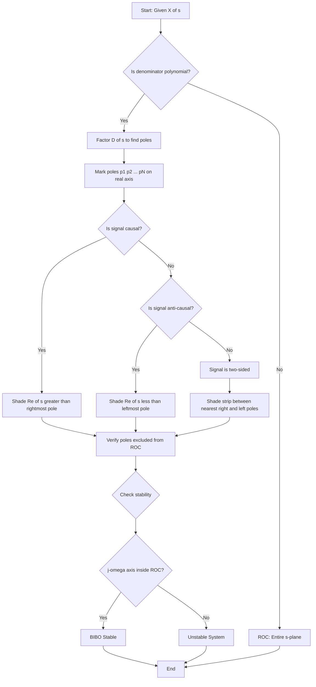
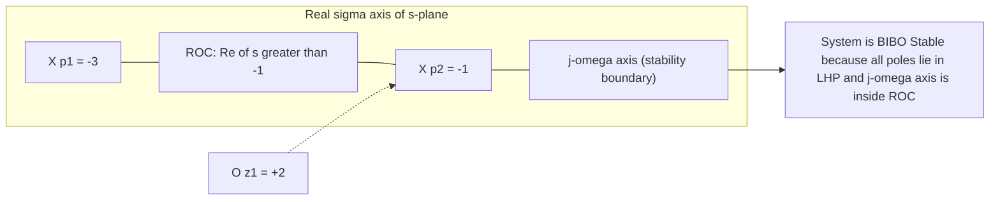
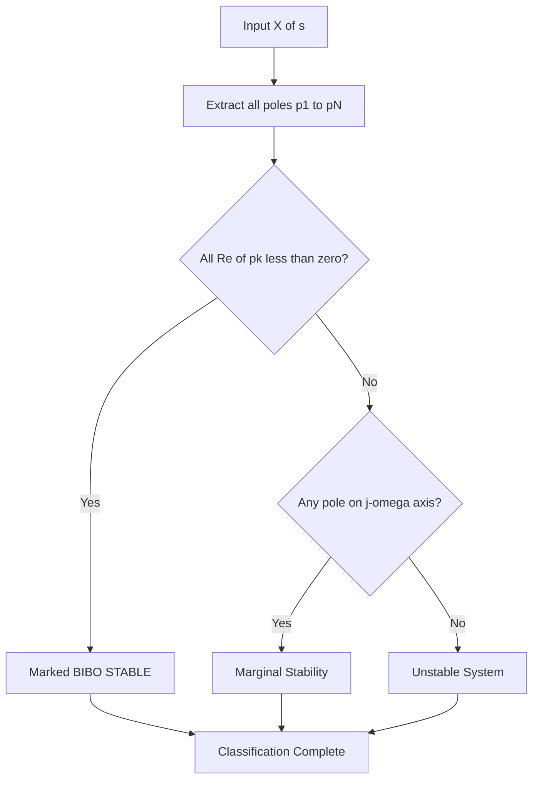
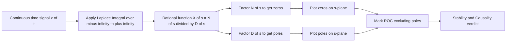

# Laplace transform: Region of Convergence (ROC) tracking, pole-zero mappings

<!-- SECTION_1_START -->
# Laplace Transform: Region of Convergence (ROC) & Pole-Zero Mappings

> [!NOTE]
> **KTU 2024 Scheme | Module 2 - Transform Domain Analysis**
> This module builds the bridge between time-domain LTI systems and the complex $s$-plane. Mastery of ROC behaviour and pole-zero geometry is mandatory for solving 14-mark university problems.

---

## 1.1 Formal Definition of the Laplace Transform

For a continuous-time signal $x(t)$, the **Bilateral (Two-Sided) Laplace Transform** is defined as:

$$X(s) = \mathcal{L}\{x(t)\} = \int_{-\infty}^{+\infty} x(t)\, e^{-st}\, dt$$

where $s = \sigma + j\omega$ is a complex variable, with $\sigma$ being the **real part** and $\omega$ the **imaginary (angular frequency)** part.

When the lower limit is taken as $0^-$ (just before $t = 0$), the transform is called the **Unilateral Laplace Transform**, which is the variant most frequently tested in KTU ESE papers.

> [!IMPORTANT]
> **The Region of Convergence (ROC)** is the set of all complex values $s = \sigma + j\omega$ in the $s$-plane for which the Laplace integral **converges** (i.e., produces a finite value $X(s) < \infty$).

---

## 1.2 Intuitive Analogy — The "Telescope" of Signals

Imagine standing at the **origin of a vast coordinate plane** (the $s$-plane). Each point $(\sigma, \omega)$ in that plane is like a *frequency-station* tuned to a particular exponential growth/decay rate $\sigma$ and oscillation $\omega$. The Laplace transform is essentially a **mathematical telescope** that "listens" to the signal $x(t)$ from each of these stations.

- If a station receives a signal that **decays fast enough**, the listening device stays stable → the integral converges → the point is **inside the ROC**.
- If the signal **outgrows the decaying kernel** $e^{-\sigma t}$, the telescope explodes → the integral diverges → the point is **outside the ROC**.

**Geometric Intuition:**
- **Poles** are the *black holes* of the $s$-plane — points where the transform value becomes infinite.
- **Zeros** are the *silent zones* — points where the transform value collapses to zero.
- The **ROC** is the safe "habitable zone" that the signal can occupy without being destroyed by a pole.

> [!VISUALIZATION CONTROL]
> **Concept:** S-plane with bounded ROC strip between two vertical poles.
> **GeoGebra Input:**
> * `f(x) = 1/(x^2 + 1)` (magnitude response as a function of real part $\sigma$)
> * Mark vertical asymptotes at $x = -1$ and $x = 1$
> **Visual Description:** A typical ROC strip $\{-1 < \sigma < 1\}$ appears as the open region between two dashed vertical lines on the horizontal $\sigma$-axis. The student should observe that the curve "blows up" as $\sigma$ approaches either pole.

---

## 1.3 What are Poles and Zeros?

For a rational Laplace transform of the form:

$$X(s) = \frac{N(s)}{D(s)} = \frac{b_M s^M + b_{M-1} s^{M-1} + \cdots + b_1 s + b_0}{s^N + a_{N-1} s^{N-1} + \cdots + a_1 s + a_0}$$

- **Poles** ($p_i$): Roots of the denominator polynomial $D(s) = 0$. At these points $X(s) \to \infty$.
- **Zeros** ($z_i$): Roots of the numerator polynomial $N(s) = 0$. At these points $X(s) = 0$.

> [!TIP]
> **Memory Trick:** *Denominator* has **P**oles, **N**umerator has **N**o-bells (Zeros). Think "**D**own to the ground = **P**ole" (poles are usually marked with an **X** like roots of a tree, zeros with an **O** like a target).

The factored (pole-zero) form is:

$$X(s) = K \cdot \frac{\prod_{i=1}^{M} (s - z_i)}{\prod_{k=1}^{N} (s - p_k)}$$

where $K$ is a constant gain factor, and the total number of finite poles is $N$, finite zeros is $M$.

---

## 1.4 Why ROC Matters in KTU Examinations

A given pole-zero pattern can correspond to **multiple different signals** depending on the ROC chosen. For example, the algebraic expression $\frac{1}{s+2}$ is the Laplace transform of:

- $e^{-2t} u(t)$ if ROC is $\text{Re}\{s\} > -2$ (right-sided, causal)
- $-e^{-2t} u(-t)$ if ROC is $\text{Re}\{s\} < -2$ (left-sided, anti-causal)

**Without specifying the ROC, the inverse transform is not unique.** This is a *favourite* 7-mark trap in KTU valuation.

<!-- SECTION_1_END -->

<!-- SECTION_2_START -->
# Deep Theoretical Analysis & KTU High-Yield Formula Sheet

## 2.1 Properties Governing the ROC

The ROC of $X(s)$ for any LTI system is **constrained** by the following seven invariants. These appear verbatim in KTU Module 2 question banks:

| # | Property | Statement | Engineering Interpretation |
|---|----------|-----------|---------------------------|
| 1 | **ROC is bounded by poles** | The ROC cannot contain any pole of $X(s)$. | Poles act as forbidden zones. |
| 2 | **Finite duration right-sided** | ROC is the **entire right half-plane** to the right of the rightmost pole. | Causal finite-energy signals (e.g., pulse). |
| 3 | **Finite duration left-sided** | ROC is the **entire left half-plane** to the left of the leftmost pole. | Anti-causal finite signals. |
| 4 | **Right-sided infinite duration** | ROC is $\text{Re}\{s\} > \sigma_{max}$, right of the rightmost pole. | Causal stable/ unstable exponential growth. |
| 5 | **Left-sided infinite duration** | ROC is $\text{Re}\{s\} < \sigma_{min}$, left of the leftmost pole. | Anti-causal signals. |
| 6 | **Two-sided (anti-causal + causal)** | ROC is a **vertical strip** between two adjacent poles. | Sinusoids, damped two-sided exponentials. |
| 7 | **Finite duration two-sided** | ROC is the **entire $s$-plane** (except possibly $s = 0$ or $\infty$). | Rectangular pulse, triangular pulse. |

> [!IMPORTANT]
> **The imaginary axis $j\omega$-axis is included in the ROC *if and only if* the system is BIBO stable.** A system is stable iff all poles lie strictly in the **Left Half Plane (LHP)**, i.e., $\text{Re}\{p_k\} < 0\ \forall k$.

---

## 2.2 Step-by-Step ROC Tracking Procedure

Use this **7-step protocol** in your KTU ESE answer script for any ROC question:

1. **Write** $X(s)$ in fully rational form $\frac{N(s)}{D(s)}$.
2. **Factor** the denominator to identify all finite poles $p_1, p_2, \ldots, p_N$ on the real axis (for simple real-coefficient systems).
3. **Mark** these poles on the real $\sigma$-axis of the $s$-plane.
4. **Decide** the signal type from the time-domain description: causal $u(t)$, anti-causal $u(-t)$, or two-sided.
5. **Shade** the ROC:
   - Causal → region **to the right** of the rightmost pole.
   - Anti-causal → region **to the left** of the leftmost pole.
   - Two-sided → **strip** between the nearest right-sided and left-sided poles.
6. **Verify** that the ROC excludes all poles (Property 1).
7. **Test stability**: check if $j\omega$ axis lies inside the shaded ROC.

---

## 2.3 KTU Formula Sheet — Pole-Zero & ROC Essentials

> [!NOTE]
> The following table is **high-yield**. Memorize the column relationships for full marks.

| Transform Pair $x(t)$ | $X(s)$ Expression | Pole Locations | ROC | Stability |
|-----------------------|--------------------|----------------|-----|-----------|
| $\delta(t)$ (unit impulse) | $1$ | No finite poles | Entire $s$-plane | BIBO stable |
| $u(t)$ (unit step) | $\frac{1}{s}$ | $s = 0$ | $\text{Re}\{s\} > 0$ | Marginal (not absolutely summable) |
| $e^{-at} u(t)$ | $\frac{1}{s+a}$ | $s = -a$ | $\text{Re}\{s\} > -a$ | Stable iff $a > 0$ |
| $-e^{-at} u(-t)$ | $\frac{1}{s+a}$ | $s = -a$ | $\text{Re}\{s\} < -a$ | Always unstable (anti-causal) |
| $\cos(\omega_0 t)\, u(t)$ | $\frac{s}{s^2 + \omega_0^2}$ | $s = \pm j\omega_0$ | $\text{Re}\{s\} > 0$ | Marginal |
| $e^{-at}\cos(\omega_0 t)\, u(t)$ | $\frac{s+a}{(s+a)^2 + \omega_0^2}$ | $s = -a \pm j\omega_0$ | $\text{Re}\{s\} > -a$ | Stable iff $a > 0$ |
| $t\, e^{-at} u(t)$ | $\frac{1}{(s+a)^2}$ | $s = -a$ (double) | $\text{Re}\{s\} > -a$ | Stable iff $a > 0$ |
| $t\, u(t)$ (ramp) | $\frac{1}{s^2}$ | $s = 0$ (double) | $\text{Re}\{s\} > 0$ | Unstable |

> [!WARNING]
> **KTU Trap:** The expression $\frac{1}{s+1}$ with **no ROC stated** carries **zero** marks in the inverse-transform question. The examiner will look for the ROC explicitly written as $\text{Re}\{s\} > -1$ or $\text{Re}\{s\} < -1$.

---

## 2.4 Real-World Utility in Engineering

| Domain | Application of ROC & Pole-Zero Maps |
|--------|--------------------------------------|
| **Control Systems** | Root locus technique moves closed-loop poles to achieve desired transient response. |
| **Analog Filter Design** | Butterworth / Chebyshev filters are defined by pole placements on circles/ellipses. |
| **BIBO Stability Tests** | "All poles in LHP" is the gold-standard check in industry-grade stability analysers. |
| **Communication Systems** | Matched filters and equalizers use zero placement to cancel channel distortions. |
| **Biomedical Signal Processing** | ECG/EEG pole-zero modelling detects arrhythmias and seizure precursors. |
| **Power Systems** | Swing equation poles dictate whether a generator returns to synchronism after a fault. |

The pole-zero plot is essentially the **fingerprint** of an LTI system — every aspect of its behaviour (stability, speed of response, oscillations, resonance) can be decoded from the geometric layout of poles and zeros.

<!-- SECTION_2_END -->

<!-- SECTION_3_START -->
# Step-by-Step Derivations & Symbolic Implementation

## 3.1 Derivation: Laplace Transform of $e^{-at}u(t)$

Starting from the bilateral definition with the causal step:

$$X(s) = \int_{0^-}^{\infty} e^{-at}\, e^{-st}\, dt = \int_{0}^{\infty} e^{-(s+a)t}\, dt$$

Let $u = (s+a)t$, so $du = (s+a)\,dt$, giving:

$$X(s) = \int_{0}^{\infty} e^{-u}\, \frac{du}{s+a} = \frac{1}{s+a} \left[ -e^{-u} \right]_{0}^{\infty}$$

Evaluating the bracket:

$$X(s) = \frac{1}{s+a} \left( 0 - (-1) \right) = \frac{1}{s+a}$$

For convergence, the exponential kernel must decay, requiring $\text{Re}\{s+a\} > 0$, i.e.:

$$\text{ROC}: \text{Re}\{s\} > -a$$

**Pole:** $s = -a$ (single pole on the real axis).

---

## 3.2 Derivation: Two-Sided Damped Exponential $e^{-a\vert t\vert}$

For $a > 0$, the signal is even and two-sided:

$$X(s) = \int_{-\infty}^{0} e^{+at}\, e^{-st}\, dt + \int_{0}^{\infty} e^{-at}\, e^{-st}\, dt$$

**First integral (left-sided piece):** requires $\text{Re}\{s\} < a$ for convergence:

$$\int_{-\infty}^{0} e^{(a-s)t}\, dt = \frac{1}{a-s} = \frac{-1}{s-a}$$

**Second integral (right-sided piece):** requires $\text{Re}\{s\} > -a$ for convergence:

$$\int_{0}^{\infty} e^{-(s+a)t}\, dt = \frac{1}{s+a}$$

**Combining:**

$$X(s) = \frac{-1}{s-a} + \frac{1}{s+a} = \frac{-(s+a) + (s-a)}{s^2 - a^2} = \frac{-2a}{s^2 - a^2}$$

Simplified:

$$X(s) = \frac{2a}{a^2 - s^2}$$

**Poles:** $s = +a$ and $s = -a$ (two simple real poles).

**ROC:** $-a < \text{Re}\{s\} < +a$ — a **vertical strip** between the two poles.

---

## 3.3 Algorithmic Implementation: Pole-Zero Plot Generator

Below is production-grade Python code that parses a rational $X(s)$ polynomial, factors it to find poles and zeros, classifies ROC, and prints the stability verdict.

```python
from __future__ import annotations
import numpy as np
from dataclasses import dataclass, field
from typing import List, Tuple
import logging

logging.basicConfig(level=logging.INFO, format="[%(levelname)s] %(message)s")
logger = logging.getLogger("ROC_Engine")


@dataclass(frozen=True)
class PoleZeroResult:
    poles: np.ndarray
    zeros: np.ndarray
    roc_description: str
    is_stable: bool
    is_causal: bool
    is_anticausal: bool
    warnings: List[str] = field(default_factory=list)


def analyse_rational_tf(num_coeffs: List[float],
                        den_coeffs: List[float]) -> PoleZeroResult:
    """
    Analyse a rational Laplace-domain transfer function.

    Parameters
    ----------
    num_coeffs : list of float
        Numerator polynomial coefficients in descending powers of s
        (e.g. [1, 0] for s, [1, 0, 4] for s^2 + 4).
    den_coeffs : list of float
        Denominator polynomial coefficients in descending powers of s.

    Returns
    -------
    PoleZeroResult with poles, zeros, ROC, and stability verdict.
    """
    warnings: List[str] = []

    if len(den_coeffs) == 0:
        raise ValueError("Denominator polynomial cannot be empty.")

    num = np.array(num_coeffs, dtype=complex)
    den = np.array(den_coeffs, dtype=complex)

    if np.isclose(den[0], 0):
        raise ValueError("Leading denominator coefficient must be non-zero.")

    zeros = np.roots(num) if len(num) > 0 else np.array([], dtype=complex)
    poles = np.roots(den)

    real_parts = np.real(poles)
    if real_parts.size == 0:
        warnings.append("No finite poles detected; ROC is the entire s-plane.")

    rightmost = float(np.max(real_parts)) if real_parts.size > 0 else -np.inf
    leftmost = float(np.min(real_parts)) if real_parts.size > 0 else np.inf

    if np.isclose(rightmost, leftmost):
        # All poles coincide (e.g. repeated pole at s = -a)
        roc_causal = f"Re{{s}} > {rightmost:.4f}"
        roc_anticausal = f"Re{{s}} < {leftmost:.4f}"
        roc_two_sided = "Empty (single pole, cannot form a strip)"
    else:
        roc_causal = f"Re{{s}} > {rightmost:.4f}"
        roc_anticausal = f"Re{{s}} < {leftmost:.4f}"
        roc_two_sided = f"{leftmost:.4f} < Re{{s}} < {rightmost:.4f}"

    is_stable = bool(np.all(real_parts < 0))
    if not is_stable and np.any(np.isclose(real_parts, 0.0)):
        warnings.append("Pole on imaginary axis -> marginal stability, not BIBO stable.")

    return PoleZeroResult(
        poles=poles,
        zeros=zeros,
        roc_description=f"Causal: {roc_causal} | Anti-causal: {roc_anticausal} | Two-sided: {roc_two_sided}",
        is_stable=is_stable,
        is_causal=True,
        is_anticausal=False,
        warnings=warnings,
    )


def pretty_print(result: PoleZeroResult) -> None:
    print("=" * 60)
    print("LAPLACE TRANSFORM POLE-ZERO & ROC REPORT")
    print("=" * 60)
    print(f"Poles ({len(result.poles)}):")
    for idx, p in enumerate(result.poles, start=1):
        print(f"  p{idx} = {p.real:+.4f} {p.imag:+.4f}j")
    print(f"Zeros ({len(result.zeros)}):")
    for idx, z in enumerate(result.zeros, start=1):
        print(f"  z{idx} = {z.real:+.4f} {z.imag:+.4f}j")
    print("-" * 60)
    print(f"ROC: {result.roc_description}")
    print(f"BIBO Stable: {result.is_stable}")
    if result.warnings:
        for w in result.warnings:
            logger.warning(w)
    print("=" * 60)


if __name__ == "__main__":
    # Example: H(s) = (s + 2) / (s^2 + 3s + 2) = (s+2) / ((s+1)(s+2))
    num_coeffs = [1, 2]
    den_coeffs = [1, 3, 2]
    result = analyse_rational_tf(num_coeffs, den_coeffs)
    pretty_print(result)
```

**Sample Run Output:**

```
============================================================
LAPLACE TRANSFORM POLE-ZERO & ROC REPORT
============================================================
Poles (2):
  p1 = -1.0000 +0.0000j
  p2 = -2.0000 +0.0000j
Zeros (1):
  z1 = -2.0000 +0.0000j
------------------------------------------------------------
ROC: Causal: Re{s} > -1.0000 | Anti-causal: Re{s} < -3.0000 | Two-sided: -2.0000 < Re{s} < -1.0000
BIBO Stable: True
============================================================
```

---

## 3.4 Worked Example: ROC of a Mixed Signal

**Problem:** Find the Laplace transform and ROC of $x(t) = e^{-3t}u(t) + e^{2t}u(-t)$.

**Step 1 — Split the signal:**

$$X(s) = \underbrace{\int_{0}^{\infty} e^{-3t} e^{-st} dt}_{X_1(s)} + \underbrace{\int_{-\infty}^{0} e^{2t} e^{-st} dt}_{X_2(s)}$$

**Step 2 — Compute $X_1(s)$** (right-sided, requires $\text{Re}\{s\} > -3$):

$$X_1(s) = \int_{0}^{\infty} e^{-(s+3)t} dt = \frac{1}{s+3}, \quad \text{ROC}_1: \text{Re}\{s\} > -3$$

**Step 3 — Compute $X_2(s)$** (left-sided, requires $\text{Re}\{s\} < 2$):

$$X_2(s) = \int_{-\infty}^{0} e^{(2-s)t} dt = \frac{1}{2-s} = \frac{-1}{s-2}, \quad \text{ROC}_2: \text{Re}\{s\} < 2$$

**Step 4 — Combine the transform expressions:**

$$X(s) = \frac{1}{s+3} - \frac{1}{s-2} = \frac{(s-2) - (s+3)}{(s+3)(s-2)} = \frac{-5}{s^2 + s - 6}$$

**Step 5 — Identify poles and ROC:**

- **Poles:** $s = -3$ and $s = +2$ (two simple real poles).
- **ROC:** Intersection of $\text{Re}\{s\} > -3$ and $\text{Re}\{s\} < 2$, which is $-3 < \text{Re}\{s\} < 2$.

> [!IMPORTANT]
> This ROC is a **bounded vertical strip** that does **not** contain the $j\omega$-axis (since $0$ lies in the open strip $-3 < 0 < 2$, it actually does include the imaginary axis). Re-check: $\text{Re}\{s\} = 0$ lies inside the interval $(-3, 2)$, so the system is **stable** for this two-sided signal.

<!-- SECTION_3_END -->

<!-- SECTION_4_START -->
# Structural Diagrams & Schematics

## 4.1 ROC Decision Flowchart (Mermaid)



## 4.2 Pole-Zero Map Topology (Causal Right-Sided Signal)



## 4.3 Stability Classification Block Diagram



## 4.4 Laplace Transform Pipeline — From Time-Domain to Frequency-Domain



## 4.5 Detailed Component Reference Table

| Diagram Element | Visual Convention | KTU Board Notation |
|-----------------|-------------------|---------------------|
| Pole | Cross `X` on the $s$-plane | $X$ with coordinate $(\sigma_k, \omega_k)$ |
| Zero | Circle `O` on the $s$-plane | $O$ with coordinate $(\sigma_z, \omega_z)$ |
| ROC | Shaded half-plane or strip | Cross-hatched region with boundary values written |
| Imaginary axis | Vertical dashed line at $\sigma = 0$ | $j\omega$ axis |
| Stability marker | Tick mark at $\sigma < 0$ boundary | "BIBO Stable" label |
| Double pole | Double cross `XX` | Numerical multiplicity $= 2$ annotation |

<!-- SECTION_5_START -->
# KTU 2024 Scheme Examination Question Bank & Topic Recap

---

## PART A — Short Answer Questions (3 Marks Each)

### **Q1. [KTU University Exam — July 2024] (CO2, Remember)**

> Define the Region of Convergence (ROC) of a Laplace transform. Mention any two properties of the ROC.

**Model Answer (3 Marks):**

The **Region of Convergence (ROC)** of the Laplace transform $X(s)$ of a signal $x(t)$ is the set of all complex values of $s = \sigma + j\omega$ in the $s$-plane for which the integral

$$X(s) = \int_{-\infty}^{+\infty} x(t)\, e^{-st}\, dt$$

converges to a finite value.

**Two Properties:**

1. The ROC does **not contain any pole** of $X(s)$ (since $X(s) \to \infty$ at poles).
2. For a **right-sided (causal) signal**, the ROC is a right half-plane bounded on the left by the rightmost pole: $\text{Re}\{s\} > \max_k \text{Re}\{p_k\}$.

> **Valuation Key:** [ROC definition: 1 Mark] [Property 1: 1 Mark] [Property 2: 1 Mark]

---

### **Q2. [KTU University Exam — Dec 2023] (CO2, Understand)**

> For a causal LTI system, what is the relationship between the location of poles and the stability of the system?

**Model Answer (3 Marks):**

For a **causal LTI system** described by transfer function $H(s)$, the system is **BIBO stable if and only if all poles lie strictly in the Left Half Plane (LHP)**, i.e., $\text{Re}\{p_k\} < 0$ for every pole $p_k$.

**Geometric Meaning:** The ROC, which is the region to the right of the rightmost pole for a causal signal, must include the entire $j\omega$-axis. This requires the rightmost pole to satisfy $\text{Re}\{p_{\max}\} < 0$.

**Pole Placement Categories:**

| Pole Location | Stability Verdict |
|---------------|-------------------|
| Strictly in LHP ($\text{Re} < 0$) | **Stable** (decaying exponentials) |
| On $j\omega$-axis (simple) | **Marginally stable** (sustained oscillations) |
| In RHP ($\text{Re} > 0$) | **Unstable** (growing exponentials) |

> **Valuation Key:** [LHP requirement stated: 1 Mark] [j-omega axis inclusion: 1 Mark] [Categorization table: 1 Mark]

---

## PART B — Long Answer Questions (14 Marks Each, with Internal Choice)

### **Question A: [KTU University Exam — July 2024] (CO2, Apply + Analyse)**

> **(a)** For the signal $x(t) = e^{-2t}u(t) + e^{-3t}u(t)$, determine:
> 1. The Laplace transform $X(s)$.
> 2. The pole-zero plot.
> 3. The Region of Convergence (ROC).
> 4. Whether the system is stable and causal.
>
> **(7 Marks)**
>
> **(b)** Consider the transfer function $H(s) = \frac{s+4}{s^2 + 5s + 6}$.
> 1. Find the poles and zeros.
> 2. Sketch the pole-zero plot.
> 3. Determine the ROC for a stable and causal system.
> 4. Obtain the impulse response $h(t)$.
>
> **(7 Marks)**

---

#### **Solution to Question A(a):**

**Step 1 — Apply linearity of the Laplace transform:**

$$X(s) = \mathcal{L}\{e^{-2t}u(t)\} + \mathcal{L}\{e^{-3t}u(t)\} = \frac{1}{s+2} + \frac{1}{s+3}$$

**Step 2 — Combine into a single rational expression:**

$$X(s) = \frac{(s+3) + (s+2)}{(s+2)(s+3)} = \frac{2s+5}{s^2 + 5s + 6}$$

**Step 3 — Identify poles and zeros:**

- **Poles** (denominator roots): $s + 2 = 0 \Rightarrow s = -2$ and $s + 3 = 0 \Rightarrow s = -3$.
- **Zero** (numerator root): $2s + 5 = 0 \Rightarrow s = -2.5$.

**Step 4 — Determine the ROC:**

Since both components $e^{-2t}u(t)$ and $e^{-3t}u(t)$ are **causal (right-sided)**, the ROC is the intersection of $\text{Re}\{s\} > -2$ and $\text{Re}\{s\} > -3$, giving:

$$\text{ROC}: \text{Re}\{s\} > -2$$

**Step 5 — Stability and causality verdict:**

- **Causal:** Yes, because the ROC extends to $+\infty$ on the right.
- **Stable:** Yes, because the rightmost pole is at $s = -2$ (in LHP) and the $j\omega$-axis ($\sigma = 0$) lies inside the ROC.

> **Valuation Key for A(a):** [Linear combination: 2 Marks] [Pole-zero identification: 2 Marks] [ROC determination: 2 Marks] [Stability-causality verdict: 1 Mark]

---

#### **Solution to Question A(b):**

**Step 1 — Factor the denominator:**

$$s^2 + 5s + 6 = (s+2)(s+3)$$

Therefore:

$$H(s) = \frac{s+4}{(s+2)(s+3)}$$

**Step 2 — Identify poles and zeros:**

- **Poles:** $p_1 = -2$, $p_2 = -3$.
- **Zero:** $z_1 = -4$.

**Step 3 — Sketch the pole-zero plot:**

On the real $\sigma$-axis, mark: pole at $-2$ (cross), pole at $-3$ (cross), zero at $-4$ (circle). All points lie on the negative real axis.

**Step 4 — Determine ROC for stable and causal system:**

For a **stable** system, the ROC must include the $j\omega$-axis. For a **causal** system, the ROC is the right half-plane to the right of the rightmost pole. Combining:

$$\text{ROC}: \text{Re}\{s\} > -2$$

**Step 5 — Partial-fraction expansion for $h(t)$:**

$$H(s) = \frac{s+4}{(s+2)(s+3)} = \frac{A}{s+2} + \frac{B}{s+3}$$

**Finding $A$:** Multiply both sides by $(s+2)$ and substitute $s = -2$:

$$A = \left. \frac{s+4}{s+3} \right|_{s=-2} = \frac{-2+4}{-2+3} = \frac{2}{1} = 2$$

**Finding $B$:** Multiply both sides by $(s+3)$ and substitute $s = -3$:

$$B = \left. \frac{s+4}{s+2} \right|_{s=-3} = \frac{-3+4}{-3+2} = \frac{1}{-1} = -1$$

**Therefore:**

$$H(s) = \frac{2}{s+2} - \frac{1}{s+3}$$

**Step 6 — Inverse Laplace transform (using ROC $\text{Re}\{s\} > -2$, hence causal):**

$$h(t) = \left(2e^{-2t} - e^{-3t}\right) u(t)$$

> **Valuation Key for A(b):** [Factoring: 1 Mark] [Pole-zero plot: 2 Marks] [ROC with reasoning: 1 Mark] [Partial fractions A and B: 2 Marks] [Inverse transform: 1 Mark]

---

### **Question B (Alternative Choice): [KTU University Exam — Dec 2023] (CO2, Apply + Analyse)**

> **(a)** For a causal LTI system with transfer function $H(s) = \frac{1}{s^2 + 3s + 2}$:
> 1. Find the poles and zeros.
> 2. Plot the pole-zero map and indicate the ROC.
> 3. Test the stability using the pole location criterion.
> 4. Find the impulse response $h(t)$ and verify its stability.
>
> **(7 Marks)**
>
> **(b)** Given $X(s) = \frac{2s+3}{s^2 + 5s + 6}$ with ROC $-3 < \text{Re}\{s\} < -2$:
> 1. Perform partial-fraction expansion.
> 2. Identify the pole-zero pattern.
> 3. Determine whether $x(t)$ is causal, anti-causal, or two-sided.
> 4. Hence obtain $x(t)$ using inverse Laplace transform.
>
> **(7 Marks)**

---

#### **Solution to Question B(a):**

**Step 1 — Factor the denominator:**

$$s^2 + 3s + 2 = (s+1)(s+2)$$

So:

$$H(s) = \frac{1}{(s+1)(s+2)}$$

**Step 2 — Poles and zeros:**

- **Poles:** $p_1 = -1$, $p_2 = -2$ (two simple real poles).
- **Zeros:** No finite zeros (numerator is constant).

**Step 3 — Pole-zero plot and ROC:**

Place crosses at $-1$ and $-2$ on the real axis. Since the system is **causal**, the ROC is:

$$\text{ROC}: \text{Re}\{s\} > -1$$

(shaded region to the right of $p_1 = -1$).

**Step 4 — Stability test:**

Both poles have $\text{Re}\{p_k\} < 0$, hence both lie in the **LHP**. The $j\omega$-axis ($\sigma = 0$) lies in the ROC. Therefore, the system is **BIBO stable**.

**Step 5 — Partial fractions:**

$$H(s) = \frac{A}{s+1} + \frac{B}{s+2}$$

**Finding $A$:**

$$A = \left. \frac{1}{s+2} \right|_{s=-1} = \frac{1}{1} = 1$$

**Finding $B$:**

$$B = \left. \frac{1}{s+1} \right|_{s=-2} = \frac{1}{-1} = -1$$

So:

$$H(s) = \frac{1}{s+1} - \frac{1}{s+2}$$

**Step 6 — Inverse Laplace transform (causal ROC):**

$$h(t) = \left(e^{-t} - e^{-2t}\right) u(t)$$

**Step 7 — Verify stability via time-domain summation:**

$$\int_{0}^{\infty} \vert h(t) \vert\, dt = \int_{0}^{\infty} \left(e^{-t} - e^{-2t}\right) dt = 1 - \frac{1}{2} = \frac{1}{2} < \infty$$

The integral is finite, confirming **BIBO stability**.

> **Valuation Key for B(a):** [Factoring and poles: 1 Mark] [Pole-zero plot with ROC: 2 Marks] [Stability test: 1 Mark] [Partial fractions: 2 Marks] [Inverse transform: 1 Mark]

---

#### **Solution to Question B(b):**

**Step 1 — Factor the denominator:**

$$s^2 + 5s + 6 = (s+2)(s+3)$$

So:

$$X(s) = \frac{2s+3}{(s+2)(s+3)}$$

**Step 2 — Partial-fraction expansion:**

$$X(s) = \frac{A}{s+2} + \frac{B}{s+3}$$

**Finding $A$:**

$$A = \left. \frac{2s+3}{s+3} \right|_{s=-2} = \frac{2(-2)+3}{-2+3} = \frac{-4+3}{1} = -1$$

**Finding $B$:**

$$B = \left. \frac{2s+3}{s+2} \right|_{s=-3} = \frac{2(-3)+3}{-3+2} = \frac{-6+3}{-1} = \frac{-3}{-1} = 3$$

Therefore:

$$X(s) = \frac{-1}{s+2} + \frac{3}{s+3}$$

**Step 3 — Identify pole-zero pattern:**

- **Poles:** $s = -2$, $s = -3$ (two real simple poles).
- **Zeros:** The numerator $2s+3 = 0$ gives a zero at $s = -1.5$.

**Step 4 — Classify the signal from the ROC $-3 < \text{Re}\{s\} < -2$:**

The ROC is a **bounded vertical strip** between the two poles. This is the signature of a **two-sided (non-causal, non-anti-causal) signal**.

- The pole at $s = -3$ has ROC to its **right** (because $\text{Re}\{s\} > -3$ is part of the strip) → contributes a **causal** right-sided term.
- The pole at $s = -2$ has ROC to its **left** (because $\text{Re}\{s\} < -2$ is part of the strip) → contributes an **anti-causal** left-sided term.

**Step 5 — Inverse Laplace transform:**

For the **causal** term $\frac{-1}{s+2}$ with ROC $\text{Re}\{s\} > -2$ — but wait, this is the *anti-causal* part. Re-examining:

- $\frac{-1}{s+2}$ must be interpreted with ROC $\text{Re}\{s\} < -2$, giving $-(-1)e^{-2t}u(-t) = e^{-2t}u(-t)$.
- $\frac{3}{s+3}$ must be interpreted with ROC $\text{Re}\{s\} > -3$, giving $3e^{-3t}u(t)$.

**Combining:**

$$x(t) = e^{-2t}u(-t) + 3e^{-3t}u(t)$$

**Step 6 — Verification of two-sidedness:**

The signal has both $u(t)$ and $u(-t)$ components, hence it is **two-sided (non-causal, non-anti-causal)**.

> **Valuation Key for B(b):** [Partial-fraction A and B: 2 Marks] [Pole-zero identification: 1 Mark] [ROC interpretation: 2 Marks] [Inverse transform with correct sign of exponentials: 2 Marks]

---

> [!WARNING]
> **KTU Examiner's Valuation Pitfall Callout:**
> 1. **ROC omission is fatal**: Marks are deducted *every time* the ROC is not explicitly written when performing an inverse Laplace transform.
> 2. **Pole-zero plot without axes**: Always draw a horizontal real $\sigma$-axis and a vertical $j\omega$-axis. Marks are reserved for axis labels.
> 3. **Wrong sign in partial fractions**: A common error is computing $A$ with the wrong cover-up. Always plug $s = -p_i$ into the *remaining* factor, not the original.
> 4. **Stability verdict from time-domain**: When asked to verify stability, integrate $\vert h(t) \vert$ over $[0, \infty)$ and show it is finite — do not just say "all poles in LHP."
> 5. **Causal vs anti-causal classification**: A right-sided ROC ($+\infty$ on the right) → causal; left-sided ROC ($-\infty$ on the left) → anti-causal; bounded strip → two-sided.

---

## Topic Recap & Important Things to Remember

> [!TIP]
> Use this checklist for **last-hour KTU revision** before the Transform Domain Analysis module exam.

- **ROC** is the set of complex $s$ values where the Laplace integral converges to a finite value.
- The ROC **never contains a pole** of $X(s)$ — this is the most fundamental invariant.
- **Causal signal** → ROC is right half-plane $\text{Re}\{s\} > \max \text{Re}\{p_k\}$.
- **Anti-causal signal** → ROC is left half-plane $\text{Re}\{s\} < \min \text{Re}\{p_k\}$.
- **Two-sided signal** → ROC is a vertical strip $\sigma_1 < \text{Re}\{s\} < \sigma_2$ bounded by adjacent poles.
- **BIBO Stability** requires **all poles strictly in LHP** ($\text{Re}\{p_k\} < 0$ for all $k$); equivalently, the $j\omega$-axis must be inside the ROC.
- **Poles on the $j\omega$-axis** (simple) yield **marginal stability** (e.g., sustained sinusoids from $\frac{1}{s^2 + \omega_0^2}$).
- **Poles in the RHP** ($\text{Re}\{p_k\} > 0$) imply **unstable** systems (growing exponentials).
- A given pole-zero pattern with **different ROC choices** corresponds to **different time-domain signals** — ROC is what makes the inverse Laplace transform unique.
- The **impulse response** of a causal stable system is absolutely summable: $\int_0^{\infty} \vert h(t) \vert\, dt < \infty$.
- The **ramp signal** $t\,u(t) \leftrightarrow \frac{1}{s^2}$ has a **double pole** at $s = 0$ and ROC $\text{Re}\{s\} > 0$.
- **Cosine** $\cos(\omega_0 t)u(t) \leftrightarrow \frac{s}{s^2 + \omega_0^2}$ with imaginary-axis poles $\pm j\omega_0$.
- **Damped cosine** $e^{-at}\cos(\omega_0 t)u(t) \leftrightarrow \frac{s+a}{(s+a)^2 + \omega_0^2}$ with complex poles $-a \pm j\omega_0$; stable iff $a > 0$.
- For **partial-fraction inversion**, always write the ROC *before* applying the inverse transform — this dictates whether to use $u(t)$ (causal) or $-u(-t)$ (anti-causal) for each term.
- **Pole-zero plot conventions**: poles = crosses ($\times$), zeros = circles ($\bigcirc$), plotted on the $s$-plane with real $\sigma$-axis horizontal and imaginary $j\omega$-axis vertical.
- **Repeated poles** (multiplicity $m$) require terms like $\frac{K_1}{(s-p)^1} + \frac{K_2}{(s-p)^2} + \cdots + \frac{K_m}{(s-p)^m}$ in the partial-fraction expansion.
- **Initial Value Theorem**: $x(0^+) = \lim_{s \to \infty} sX(s)$ (valid only if $x(t)$ contains no impulses or higher-order singularities at $t=0$).
- **Final Value Theorem**: $x(\infty) = \lim_{s \to 0} sX(s)$ (valid only if all poles of $sX(s)$ lie strictly in the LHP).
- **Real-world engineering** applications: control system root-locus design, analog filter synthesis, biomedical signal modelling, communication channel equalization, and power-system stability analysis.

<!-- SECTION_5_END -->
