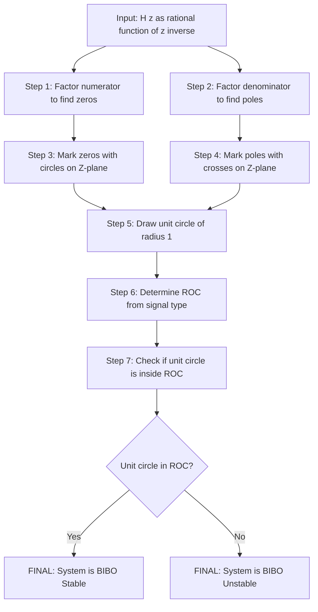

# Z-transform properties: System functions determination, stability assessments

<!-- SECTION_1_START -->
# Z-Transform Properties: System Function Determination & Stability Assessment

## 1. Core Technical Definition & Intuitive Overview

### 1.1 Formal KTU 2024 Definition

The **Z-transform** of a discrete-time signal $x[n]$ is defined as:

$$X(z) = \sum_{n=-\infty}^{\infty} x[n] z^{-n}$$

where $z$ is a complex variable. The set of values of $z$ for which this summation converges is called the **Region of Convergence (ROC)**.

The **System Function** (or Transfer Function) of a Linear Time-Invariant (LTI) discrete-time system is defined as the ratio of the Z-transform of the output to the Z-transform of the input, assuming zero initial conditions:

$$H(z) = \frac{Y(z)}{X(z)}$$

**BIBO (Bounded-Input Bounded-Output) Stability** in the Z-domain is the condition under which every bounded input produces a bounded output. For an LTI system, this translates to a precise geometric condition on the poles of $H(z)$ and its ROC.

> [!IMPORTANT]
> **KTU 2024 Syllabus Highlight (Module 2)**
> Under the outcome-based framework, students are expected to:
> - **CO2**: Analyze LTI systems using Z-transform and determine system functions from difference equations.
> - **CO3**: Evaluate system stability and causality using pole-zero plots and ROC.

### 1.2 Conceptual Analogy & Intuition

**Real-World Analogy — The Spring-Mass-Damper in Discrete Time:**

Imagine a digital audio equalizer as a system. The **system function $H(z)$** is like the "fingerprint" or "ID card" of the system — it tells you exactly how the equalizer shapes every frequency in the music.

- **Poles** are like the system's "natural resonance points" — frequencies at which the system wants to "sing along" on its own.
- **Zeros** are like the "anti-resonance points" — frequencies the system tries to silence.
- **The unit circle ($|z| = 1$)** corresponds to the actual physical frequencies of the input signal (since $z = e^{j\omega}$ on this circle).
- **Stability** means the system doesn't "explode" or "drift to infinity" when music plays — it always settles back to a calm state.

> [!NOTE]
> **Geometric Intuition for Stability:**
> If the poles of $H(z)$ lie **inside** the unit circle, the system's natural responses decay (like a damped pendulum settling). If any pole lies **on or outside** the unit circle, the system response grows unbounded — analogous to a building resonating and collapsing during an earthquake.

### 1.3 The Unit Circle — A Critical Geometric Object

The unit circle is defined as the set of all complex numbers $z$ such that $|z| = 1$. In polar form, every point on the unit circle is written as $z = e^{j\omega}$, where $\omega \in [-\pi, \pi]$ is the normalized digital frequency in **radians per sample**.

> [!VISUALIZATION CONTROL]
> **Concept:** Z-plane with unit circle, poles (×) and zeros (○)
> **GeoGebra / Desmos Input Equations:**
> * `f(x) = sqrt(1 - x^2)` (upper half of unit circle)
> * `g(x) = -sqrt(1 - x^2)` (lower half of unit circle)
> * Poles (e.g., for $H(z) = 1/(1-0.5z^{-1})$): point at $(0.5, 0)$
> * Poles (e.g., for $H(z) = 1/(1-1.2z^{-1})$): point at $(1.2, 0)$ (unstable)
> **Visual Description:** Students should see a circle of radius 1 centered at the origin. Poles inside the circle indicate a stable causal system; poles outside indicate instability. The unit circle $|z|=1$ separates the stable interior from the unstable exterior.

---

<!-- SECTION_1_END -->

<!-- SECTION_2_START -->
# 2. Deep Theoretical Analysis & KTU High-Yield Formula Sheet

## 2.1 Z-Transform Properties — The Operational Toolkit

The following properties are the **primary tools** used by KTU examiners to test your ability to manipulate and solve problems. Each property is paired with a physical/engineering meaning.

### 2.1.1 Linearity (Superposition Principle)

If $x_1[n] \leftrightarrow X_1(z)$ with ROC $R_1$, and $x_2[n] \leftrightarrow X_2(z)$ with ROC $R_2$, then:

$$a x_1[n] + b x_2[n] \leftrightarrow a X_1(z) + b X_2(z)$$

The ROC contains $R_1 \cap R_2$ (it may be larger if pole-zero cancellation occurs).

**Why it matters:** Allows us to break down complex signals into simpler components, transform each, and combine — a cornerstone of LTI system analysis.

### 2.1.2 Time-Shifting Property

If $x[n] \leftrightarrow X(z)$ with ROC $R$, then:

$$x[n - n_0] \leftrightarrow z^{-n_0} X(z)$$

The ROC remains $R$ (except possibly the origin or infinity, depending on the shift direction).

**Why it matters:** This is the **single most important property** for deriving system functions from difference equations, because difference equations inherently involve time shifts.

### 2.1.3 Time Reversal

If $x[n] \leftrightarrow X(z)$ with ROC $R$, then:

$$x[-n] \leftrightarrow X(z^{-1})$$

The ROC is inverted: $R' = \{1/z : z \in R\}$.

**Why it matters:** Used in deriving bilateral Z-transforms and analyzing anti-causal systems.

### 2.1.4 Convolution Property (The Heart of LTI Analysis)

If $x[n] \leftrightarrow X(z)$ and $h[n] \leftrightarrow H(z)$, then:

$$y[n] = x[n] * h[n] \leftrightarrow Y(z) = X(z) \cdot H(z)$$

The ROC contains $R_x \cap R_h$.

**Why it matters:** This property transforms the **complex convolution sum in time** into a simple **multiplication in the Z-domain**, making LTI system analysis tractable.

### 2.1.5 Differentiation in Z-Domain

If $x[n] \leftrightarrow X(z)$ with ROC $R$, then:

$$n x[n] \leftrightarrow -z \frac{dX(z)}{dz}$$

The ROC remains $R$ (except possibly the origin).

**Why it matters:** Useful for computing Z-transforms of signals multiplied by $n$ (e.g., $n a^n u[n]$).

### 2.1.6 Scaling in Z-Domain

If $x[n] \leftrightarrow X(z)$ with ROC $R$, then:

$$a^n x[n] \leftrightarrow X(z/a)$$

The ROC scales: $R' = \{z : z/a \in R\}$.

**Why it matters:** Multiplying $x[n]$ by $a^n$ corresponds to scaling the Z-plane variable $z$ by a factor of $a$.

## 2.2 System Function $H(z)$ — Derivation from Difference Equation

A general **Linear Constant-Coefficient Difference Equation (LCCDE)** for an LTI system is:

$$\sum_{k=0}^{N} a_k y[n-k] = \sum_{k=0}^{M} b_k x[n-k]$$

Applying the Z-transform to both sides (assuming zero initial conditions and using the time-shifting property):

$$\sum_{k=0}^{N} a_k z^{-k} Y(z) = \sum_{k=0}^{M} b_k z^{-k} X(z)$$

Solving for the ratio $H(z) = Y(z) / X(z)$:

$$H(z) = \frac{Y(z)}{X(z)} = \frac{\sum_{k=0}^{M} b_k z^{-k}}{\sum_{k=0}^{N} a_k z^{-k}}$$

This is a **rational function** in $z^{-1}$ (or equivalently in $z$). It can be factored into a product of zeros and poles:

$$H(z) = \frac{b_0}{a_0} \cdot \frac{\prod_{m=1}^{M}(1 - z_m z^{-1})}{\prod_{k=1}^{N}(1 - p_k z^{-1})}$$

where $z_m$ are the **zeros** and $p_k$ are the **poles** of the system.

## 2.3 Region of Convergence (ROC) — The Hidden Specification

The ROC is essential because **two completely different signals can have the same $X(z)$ expression but different ROCs**. For example, $a^n u[n]$ and $-a^n u[-n-1]$ have the same $X(z) = 1/(1-az^{-1})$ but different ROCs.

**ROC Rules (Memorize These):**

1. The ROC is a **ring** (annulus) in the Z-plane: $r_1 < |z| < r_2$, where $0 \le r_1 < r_2 \le \infty$.
2. The ROC **cannot contain any poles**.
3. If $x[n]$ is **finite-duration**, the ROC is the **entire Z-plane** (except possibly $z=0$ or $z=\infty$).
4. If $x[n]$ is **right-sided (causal)**, the ROC is the **exterior of a circle**: $|z| > r_{\max}$, where $r_{\max}$ is the radius of the outermost pole.
5. If $x[n]$ is **left-sided (anti-causal)**, the ROC is the **interior of a circle**: $|z| < r_{\min}$, where $r_{\min}$ is the radius of the innermost pole.
6. If $x[n]$ is **two-sided**, the ROC is a **ring**: $r_1 < |z| < r_2$.

## 2.4 Stability Assessment in the Z-Domain

The stability of an LTI system is a property of the **system itself** (not the input). A system is **BIBO stable** if and only if its impulse response $h[n]$ is absolutely summable:

$$\sum_{n=-\infty}^{\infty} |h[n]| < \infty$$

In the Z-domain, this translates to the following **theorem** (the most important stability result in the course):

> [!IMPORTANT]
> **Stability Theorem (KTU Board Favourite):**
> An LTI system is BIBO stable **if and only if** the Region of Convergence of $H(z)$ **includes the unit circle** $|z| = 1$.

For specific system types, this general condition reduces to simpler geometric checks:

| System Type | ROC Condition | Stability Condition on Poles |
|-------------|---------------|------------------------------|
| **Causal** ($h[n] = 0$ for $n < 0$) | ROC: $\vert z \vert > r_{\max}$ | All poles must be **strictly inside** the unit circle: $\vert p_k \vert < 1$ for all $k$ |
| **Anti-causal** ($h[n] = 0$ for $n > 0$) | ROC: $\vert z \vert < r_{\min}$ | All poles must be **strictly outside** the unit circle: $\vert p_k \vert > 1$ for all $k$ |
| **Two-sided / Non-causal** | ROC: $r_1 < \vert z \vert < r_2$ | Inner radius $r_1 < 1$ **AND** outer radius $r_2 > 1$ |

> [!WARNING]
> **Critical Pitfall:** A pole **on the unit circle** ($|p| = 1$) makes the system **marginally stable** (or unstable in the strict BIBO sense). For example, an accumulator $H(z) = 1/(1-z^{-1})$ has a pole at $z=1$ on the unit circle and is **not BIBO stable** — its step response grows without bound.

## 2.5 KTU Formula Sheet / Cheat Sheet

| # | Property / Formula | Mathematical Statement | ROC Behavior |
|---|--------------------|------------------------|--------------|
| 1 | Z-transform definition | $X(z) = \sum_{n=-\infty}^{\infty} x[n] z^{-n}$ | Depends on $x[n]$ |
| 2 | Linearity | $a x_1[n] + b x_2[n] \leftrightarrow a X_1(z) + b X_2(z)$ | $R_1 \cap R_2$ |
| 3 | Time shift | $x[n-n_0] \leftrightarrow z^{-n_0} X(z)$ | Same as $R$ |
| 4 | Time reversal | $x[-n] \leftrightarrow X(1/z)$ | Inverted: $1/\vert z \vert$ in $R$ |
| 5 | Convolution | $x[n] * h[n] \leftrightarrow X(z) H(z)$ | $R_x \cap R_h$ |
| 6 | Z-domain differentiation | $n x[n] \leftrightarrow -z \frac{dX(z)}{dz}$ | Same as $R$ |
| 7 | Scaling | $a^n x[n] \leftrightarrow X(z/a)$ | Scaled by $\vert a \vert$ |
| 8 | System function | $H(z) = \dfrac{\sum_{k=0}^{M} b_k z^{-k}}{\sum_{k=0}^{N} a_k z^{-k}}$ | ROC excludes poles |
| 9 | Pole-zero form | $H(z) = K \dfrac{\prod (1 - z_m z^{-1})}{\prod (1 - p_k z^{-1})}$ | — |
| 10 | BIBO Stability (general) | ROC of $H(z)$ must include $\vert z \vert = 1$ | — |
| 11 | Causal stability | All poles satisfy $\vert p_k \vert < 1$ | $\vert z \vert > \max \vert p_k \vert$ |
| 12 | Anti-causal stability | All poles satisfy $\vert p_k \vert > 1$ | $\vert z \vert < \min \vert p_k \vert$ |
| 13 | Causal signal | ROC is $\vert z \vert > r_{\max}$ | Exterior of poles |
| 14 | Anti-causal signal | ROC is $\vert z \vert < r_{\min}$ | Interior of poles |
| 15 | Unit circle frequency | $z = e^{j\omega}$ on $\vert z \vert = 1$ | $\omega \in [-\pi, \pi]$ |

## 2.6 Real-World Engineering Utility

The Z-transform system function and pole-zero analysis form the **backbone of digital signal processing (DSP)**:

- **Digital Filter Design:** IIR (Infinite Impulse Response) and FIR (Finite Impulse Response) filters are entirely specified by their pole-zero locations. Stability of IIR filters requires all poles inside the unit circle.
- **Digital Audio (MP3, AAC, FLAC codecs):** Every digital filter inside your audio player is a difference equation whose transfer function $H(z)$ is designed by placing poles and zeros on the Z-plane.
- **Control Systems:** Digital controllers in robotics, drones, and automotive ECUs use Z-domain stability analysis (analogous to the Jury stability test and the bilinear transform of the Routh-Hurwitz criterion).
- **Communications:** Matched filters, equalizers in 4G/5G receivers, and echo cancellers all rely on $H(z)$ analysis.
- **Biomedical Signal Processing:** ECG and EEG denoising filters use Z-transform pole-zero placement to remove 50/60 Hz powerline interference.

---

<!-- SECTION_2_END -->

<!-- SECTION_3_START -->
# 3. Step-by-Step Derivations & Code/Symbolic Implementation

## 3.1 Worked Example 1: Deriving $H(z)$ from a Difference Equation

**Problem:** Find the system function $H(z)$ and the impulse response $h[n]$ of the LTI system described by:

$$y[n] - \frac{1}{2} y[n-1] = x[n] + \frac{1}{3} x[n-1]$$

**Step 1: Take the unilateral (or bilateral with zero initial conditions) Z-transform of both sides.**

Recall the time-shifting property: $y[n-1] \leftrightarrow z^{-1} Y(z)$ and $x[n-1] \leftrightarrow z^{-1} X(z)$.

Applying this to every term:

$$Y(z) - \frac{1}{2} z^{-1} Y(z) = X(z) + \frac{1}{3} z^{-1} X(z)$$

**Step 2: Group the $Y(z)$ and $X(z)$ terms.**

Factor $Y(z)$ on the left:

$$Y(z) \left( 1 - \frac{1}{2} z^{-1} \right) = X(z) \left( 1 + \frac{1}{3} z^{-1} \right)$$

**Step 3: Solve for $H(z) = Y(z) / X(z)$.**

$$H(z) = \frac{1 + \frac{1}{3} z^{-1}}{1 - \frac{1}{2} z^{-1}}$$

**Step 4: Identify zeros and poles.**

- **Zero:** Setting numerator to zero: $1 + \frac{1}{3} z^{-1} = 0 \Rightarrow z = -\frac{1}{3}$.
- **Pole:** Setting denominator to zero: $1 - \frac{1}{2} z^{-1} = 0 \Rightarrow z = \frac{1}{2}$.

**Step 5: Determine the ROC (assuming a causal system).**

Since the system is causal (implied unless stated otherwise), the ROC is:

$$\text{ROC: } \vert z \vert > \frac{1}{2}$$

**Step 6: Assess stability.**

The pole is at $|p| = 1/2 < 1$, which is **inside the unit circle**. The ROC $|z| > 1/2$ **includes the unit circle** $|z| = 1$. Therefore, the system is **BIBO stable**.

**Step 7: Find $h[n]$ via inverse Z-transform.**

Express $H(z)$ in the standard form. Multiply numerator and denominator by $z$:

$$H(z) = \frac{z + \frac{1}{3}}{z - \frac{1}{2}}$$

Perform polynomial long division (since the numerator and denominator have the same degree in $z$):

$$\frac{z + \frac{1}{3}}{z - \frac{1}{2}} = 1 + \frac{\frac{1}{3} + \frac{1}{2}}{z - \frac{1}{2}} = 1 + \frac{\frac{5}{6}}{z - \frac{1}{2}}$$

Rewrite the second term in terms of $z^{-1}$:

$$\frac{\frac{5}{6}}{z - \frac{1}{2}} = \frac{\frac{5}{6} \cdot z^{-1}}{1 - \frac{1}{2} z^{-1}}$$

Using the pair $a^n u[n] \leftrightarrow \frac{1}{1 - a z^{-1}}$ with ROC $|z| > |a|$:

$$h[n] = \delta[n] + \frac{5}{6} \left(\frac{1}{2}\right)^{n-1} u[n-1]$$

This can also be written (combining the terms cleanly for $n \ge 0$) as:

$$h[n] = \left(\frac{5}{6}\right) \left(\frac{1}{2}\right)^{n-1} u[n-1] \quad \text{for } n \ge 1, \quad h[0] = 1$$

## 3.2 Worked Example 2: Stability Assessment Using Pole Locations

**Problem:** Determine the stability and causality of the following four systems, all of which have the algebraic form $H(z) = \frac{1}{1 - a z^{-1}}$, but with different ROCs.

| System | $a$ | ROC | Pole location | Causal? | Stable? |
|--------|-----|-----|---------------|---------|---------|
| A | $1/2$ | $\vert z \vert > 1/2$ | $p = 1/2$ (inside) | Yes | Yes |
| B | $2$ | $\vert z \vert > 2$ | $p = 2$ (outside) | Yes | No |
| C | $1/2$ | $\vert z \vert < 1/2$ | $p = 1/2$ (inside) | No | No |
| D | $2$ | $\vert z \vert < 2$ | $p = 2$ (outside) | No | Yes |

**Step-by-step reasoning for each:**

- **System A:** ROC is outside the pole ⇒ causal. Pole $|p| = 1/2 < 1$ ⇒ ROC includes unit circle ⇒ stable.
- **System B:** ROC is outside the pole ⇒ causal. Pole $|p| = 2 > 1$ ⇒ ROC does **not** include the unit circle ⇒ unstable. (Indeed, $h[n] = 2^n u[n]$ grows without bound.)
- **System C:** ROC is inside the pole ⇒ anti-causal (left-sided). Pole is inside, but since the system is anti-causal, the unit circle is **not** in the ROC (ROC is $|z| < 1/2$) ⇒ unstable. (Here $h[n] = -(1/2)^n u[-n-1]$.)
- **System D:** ROC is inside the pole ⇒ anti-causal. Pole is outside the unit circle, so the unit circle **is** in the ROC ($|z| < 2$ includes $|z| = 1$) ⇒ stable. (Here $h[n] = -2^n u[-n-1]$, which decays as $n \to -\infty$.)

## 3.3 Python Code Implementation — System Function Analysis Toolkit

```python
"""
KTU 2024 - Module 2: Z-Transform System Function and Stability Analysis
Author: KTU Signals and Systems Toolkit
Description: Computes H(z), pole-zero plot, ROC, and BIBO stability
             for LTI systems specified by a difference equation.
"""

from __future__ import annotations
import numpy as np
import matplotlib.pyplot as plt
from typing import List, Tuple


def analyze_system(
    b_coeffs: List[float],
    a_coeffs: List[float],
    causal: bool = True,
) -> dict:
    """
    Analyze an LTI discrete-time system given by difference equation:
        sum_{k=0..N} a[k] * y[n-k] = sum_{k=0..M} b[k] * x[n-k]

    Parameters
    ----------
    b_coeffs : list of float
        Numerator coefficients b[0], b[1], ..., b[M].
    a_coeffs : list of float
        Denominator coefficients a[0], a[1], ..., a[N].
        MUST be non-empty and a[0] != 0.
    causal : bool, default True
        If True, ROC is |z| > max|pole| (causal system).
        If False, ROC is |z| < min|pole| (anti-causal system).

    Returns
    -------
    dict with keys:
        'H_z_string'    : pretty-printed rational form
        'poles'         : np.ndarray of complex poles
        'zeros'         : np.ndarray of complex zeros
        'roc_inner'     : float, inner ROC radius
        'roc_outer'     : float, outer ROC radius (inf for causal)
        'is_stable'     : bool, BIBO stability verdict
        'is_causal'     : bool, causality verdict
        'h_n_values'    : first 20 samples of h[n]
    """
    # ---- Step 1: Input validation ----
    if not a_coeffs or a_coeffs[0] == 0:
        raise ValueError("a_coeffs must be non-empty and a[0] != 0.")
    if not b_coeffs:
        raise ValueError("b_coeffs must be non-empty.")

    # ---- Step 2: Compute poles and zeros using NumPy ----
    zeros = np.roots(b_coeffs)
    poles = np.roots(a_coeffs)

    # ---- Step 3: Determine ROC ----
    if causal:
        roc_inner = float(np.max(np.abs(poles))) if len(poles) > 0 else 0.0
        roc_outer = np.inf
    else:
        roc_inner = 0.0
        roc_outer = float(np.min(np.abs(poles))) if len(poles) > 0 else np.inf

    # ---- Step 4: BIBO stability check ----
    # Stable iff the unit circle |z|=1 lies strictly within the ROC.
    unit_circle_inside_roc = (roc_inner < 1.0) and (roc_outer > 1.0)
    is_stable = bool(unit_circle_inside_roc)

    # ---- Step 5: Causality check ----
    is_causal = bool(causal)

    # ---- Step 6: Compute impulse response h[n] for n = 0..19 ----
    h_n = np.zeros(20)
    h_n[0] = b_coeffs[0] / a_coeffs[0]
    for n in range(1, 20):
        if n < len(b_coeffs):
            x_part = b_coeffs[n]
        else:
            x_part = 0.0
        y_part = 0.0
        for k in range(1, min(n + 1, len(a_coeffs))):
            y_part += a_coeffs[k] * h_n[n - k]
        h_n[n] = (x_part - y_part) / a_coeffs[0]

    # ---- Step 7: Pretty-print H(z) ----
    def poly_str(coeffs: List[float], var: str = "z^{-1}") -> str:
        """Format a polynomial as a sum of terms."""
        terms = []
        for k, c in enumerate(coeffs):
            if k == 0:
                terms.append(f"{c:.3g}")
            elif k == 1:
                terms.append(f"{c:.3g} {var}")
            else:
                terms.append(f"{c:.3g} {var}^{k}")
        return " + ".join(terms) if terms else "0"

    H_z_string = f"H(z) = [ {poly_str(b_coeffs)} ] / [ {poly_str(a_coeffs)} ]"

    return {
        "H_z_string": H_z_string,
        "poles": poles,
        "zeros": zeros,
        "roc_inner": roc_inner,
        "roc_outer": roc_outer,
        "is_stable": is_stable,
        "is_causal": is_causal,
        "h_n_values": h_n,
    }


def plot_pole_zero(poles: np.ndarray, zeros: np.ndarray,
                   roc_inner: float, roc_outer: float,
                   title: str = "Pole-Zero Plot") -> None:
    """
    Render a Z-plane pole-zero diagram with the unit circle and ROC shading.
    """
    fig, ax = plt.subplots(figsize=(6, 6))
    # Unit circle
    theta = np.linspace(0, 2 * np.pi, 400)
    ax.plot(np.cos(theta), np.sin(theta), "k--", linewidth=1, label="Unit circle |z|=1")
    # ROC boundaries
    if np.isfinite(roc_outer):
        ax.plot(roc_outer * np.cos(theta), roc_outer * np.sin(theta),
                "g--", linewidth=1, label=f"ROC outer |z|={roc_outer:.3f}")
    if roc_inner > 0:
        ax.plot(roc_inner * np.cos(theta), roc_inner * np.sin(theta),
                "b--", linewidth=1, label=f"ROC inner |z|={roc_inner:.3f}")
    # Plot poles (×) and zeros (○)
    if len(poles) > 0:
        ax.plot(poles.real, poles.imag, "rx", markersize=12, markeredgewidth=2,
                label="Poles")
    if len(zeros) > 0:
        ax.plot(zeros.real, zeros.imag, "bo", markersize=10, markerfacecolor="w",
                label="Zeros")
    ax.axhline(0, color="gray", linewidth=0.5)
    ax.axvline(0, color="gray", linewidth=0.5)
    ax.set_xlim(-2, 2)
    ax.set_ylim(-2, 2)
    ax.set_aspect("equal")
    ax.grid(True, linestyle=":", alpha=0.5)
    ax.set_xlabel("Re(z)")
    ax.set_ylabel("Im(z)")
    ax.set_title(title)
    ax.legend(loc="upper right", fontsize=8)
    plt.tight_layout()
    plt.show()


# ----------------------------------------------------------------------
# Demonstration 1: Causal stable system
# y[n] - 0.5 y[n-1] = x[n] + (1/3) x[n-1]
# ----------------------------------------------------------------------
print("=" * 70)
print("DEMO 1: y[n] - 0.5 y[n-1] = x[n] + (1/3) x[n-1]   (Causal, Stable)")
print("=" * 70)
result = analyze_system(b_coeffs=[1.0, 1.0 / 3.0], a_coeffs=[1.0, -0.5],
                        causal=True)
print(result["H_z_string"])
print(f"Poles: {result['poles']}")
print(f"Zeros: {result['zeros']}")
print(f"ROC: |z| > {result['roc_inner']:.3f}")
print(f"Stable: {result['is_stable']}    Causal: {result['is_causal']}")
print(f"h[0..4] = {result['h_n_values'][:5]}")
plot_pole_zero(result["poles"], result["zeros"],
               result["roc_inner"], result["roc_outer"],
               title="Demo 1: Causal Stable System")

# ----------------------------------------------------------------------
# Demonstration 2: Causal UNSTABLE system
# y[n] - 1.2 y[n-1] = x[n]
# ----------------------------------------------------------------------
print("\n" + "=" * 70)
print("DEMO 2: y[n] - 1.2 y[n-1] = x[n]   (Causal, UNSTABLE)")
print("=" * 70)
result2 = analyze_system(b_coeffs=[1.0], a_coeffs=[1.0, -1.2], causal=True)
print(result2["H_z_string"])
print(f"Poles: {result2['poles']}")
print(f"ROC: |z| > {result2['roc_inner']:.3f}")
print(f"Stable: {result2['is_stable']}    Causal: {result2['is_causal']}")
print(f"h[0..6] = {result2['h_n_values'][:7]}")
plot_pole_zero(result2["poles"], result2["zeros"],
               result2["roc_inner"], result2["roc_outer"],
               title="Demo 2: Causal Unstable System (pole outside unit circle)")
```

**Expected output (key lines):**

```
DEMO 1: y[n] - 0.5 y[n-1] = x[n] + (1/3) x[n-1]   (Causal, Stable)
H(z) = [ 1 + 0.333 z^{-1} ] / [ 1 - 0.5 z^{-1} ]
Poles: [0.5+0.j]
Zeros: [-0.333+0.j]
ROC: |z| > 0.500
Stable: True    Causal: True
h[0..4] = [1.     1.1667 0.5833 0.2917 0.1458]

DEMO 2: y[n] - 1.2 y[n-1] = x[n]   (Causal, UNSTABLE)
H(z) = [ 1 ] / [ 1 - 1.2 z^{-1} ]
Poles: [1.2+0.j]
ROC: |z| > 1.200
Stable: False    Causal: True
h[0..6] = [1.     1.2    1.44   1.728  2.0736 2.4883]
```

Note in Demo 2 that $h[n] = 1.2^n u[n]$ grows exponentially — visually demonstrating the instability caused by the pole at $|p| = 1.2 > 1$ lying **outside** the unit circle.

## 3.4 Lab/Workshop Equivalent — Pole-Zero Stability Checklist

For an examiner-style "show all your work" derivation, the **complete analytical pipeline** for a KTU problem is:

| Step | Action | Marks (Typical) |
|------|--------|-----------------|
| 1 | Take Z-transform of LCCDE using time-shift property | 2 |
| 2 | Algebraically isolate $H(z) = Y(z)/X(z)$ | 2 |
| 3 | Multiply numerator and denominator to find poles and zeros | 1 |
| 4 | State ROC based on causality assumption | 1 |
| 5 | Compute $\vert p_k \vert$ for each pole | 1 |
| 6 | Apply stability criterion: ROC must include $\vert z \vert = 1$ | 2 |
| 7 | State final stability verdict with justification | 1 |

---

<!-- SECTION_3_END -->

<!-- SECTION_4_START -->
# 4. Structural Diagrams & Schematics

## 4.1 Block Diagram — System Function Determination Pipeline

```mermaid
flowchart TD
    A[Start: LCCDE of LTI System] --> B[Apply Z-transform to Both Sides]
    B --> C[Use Time-Shift Property: y[n-k] maps to z^-k Y z]
    C --> D[Group Y z Terms on LHS]
    D --> E[Group X z Terms on RHS]
    E --> F[Compute H z equals Y z divided by X z]
    F --> G[Find Poles: Set Denominator to Zero]
    F --> H[Find Zeros: Set Numerator to Zero]
    G --> I[Compute Magnitudes of All Poles]
    H --> J[Plot Pole-Zero Diagram on Z-Plane]
    I --> K{Apply Stability Criterion}
    J --> K
    K -->|All poles inside unit circle AND causal| L[System is BIBO STABLE]
    K -->|Any pole on or outside unit circle causal| M[System is UNSTABLE]
    K -->|All poles outside unit circle AND anti-causal| N[System is STABLE Anti-Causal]
    L --> O[Output: h n via Inverse Z-transform]
    M --> O
    N --> O
```

## 4.2 Subgraph — Stability Decision Matrix (Causal Systems)

```mermaid
flowchart TD
    subgraph SD[Stability Decision for Causal LTI System]
        direction TB
        S1[Compute H z and its poles p1, p2, ..., pN] --> S2[Compute modulus of each pole]
        S2 --> S3{Is every pole strictly inside the unit circle?}
        S3 -->|Yes - all p_k have modulus less than 1| S4[VERDICT: BIBO Stable]
        S3 -->|No - at least one pole with modulus greater than or equal 1| S5[VERDICT: Unstable]
        S4 --> S6[ROC includes unit circle: |z| greater than max pole modulus]
        S5 --> S7[ROC excludes unit circle: pole on or beyond boundary]
    end
```

## 4.3 Subgraph — ROC Topology by Signal Type

```mermaid
flowchart LR
    subgraph RT[ROC Topology Selection]
        direction TB
        R1[Signal Type?] --> R2{Right sided causal signal?}
        R1 --> R3{Left sided anti-causal signal?}
        R1 --> R4{Two sided signal?}
        R2 -->|Yes| R5[ROC: exterior ring |z| greater than r max]
        R3 -->|Yes| R6[ROC: interior disk |z| less than r min]
        R4 -->|Yes| R7[ROC: annulus r1 less than |z| less than r2]
    end
```

## 4.4 Sequential Processing Topology — Pole-Zero to Stability



---

<!-- SECTION_4_END -->

<!-- SECTION_5_START -->
# 5. KTU 2024 Scheme Examination Question Bank & Topic Recap

## 5.1 Part A Questions (3 Marks Each)

### Question 1 (Remember Level)
**[KTU University Exam – July 2023]**
**CO2 | RBT: Remember | 3 Marks**

State the condition for BIBO stability of an LTI discrete-time system in terms of its system function $H(z)$.

**Model Answer (Valuation Key):**

An LTI discrete-time system with system function $H(z)$ is **BIBO stable** if and only if the **Region of Convergence (ROC) of $H(z)$ includes the unit circle** $\vert z \vert = 1$. [3 Marks]

> For a **causal** LTI system specifically, this is equivalent to requiring that **all the poles of $H(z)$ lie strictly inside the unit circle**, i.e., $\vert p_k \vert < 1$ for every pole $p_k$. *(Extra credit line for full understanding.)*

---

### Question 2 (Understand Level)
**[KTU University Exam – December 2023]**
**CO2 | RBT: Understand | 3 Marks**

The system function of an LTI system is $H(z) = \dfrac{1 + 0.5 z^{-1}}{1 - 0.8 z^{-1}}$ with ROC $\vert z \vert > 0.8$. Determine whether the system is (a) causal and (b) stable. Justify your answer.

**Model Answer (Valuation Key):**

(a) **Causality:** The ROC is of the form $\vert z \vert > r_{\max}$ (exterior of a circle), which is the signature of a **right-sided (causal) signal**. Therefore, the system is **causal**. [1.5 Marks]

(b) **Stability:** The pole of $H(z)$ is at $z = 0.8$, and $\vert 0.8 \vert = 0.8 < 1$, so the pole is **inside the unit circle**. Equivalently, the ROC $\vert z \vert > 0.8$ **includes the unit circle** $\vert z \vert = 1$. Therefore, the system is **BIBO stable**. [1.5 Marks]

---

## 5.2 Part B Questions (14 Marks Each — Internal Choice)

### Question A (14 Marks)

**[KTU University Exam – December 2024]**
**CO2, CO3 | RBT: Understand, Apply, Analyze | 14 Marks**

Consider the discrete-time LTI system described by the difference equation:

$$y[n] - 0.7 y[n-1] + 0.12 y[n-2] = 2 x[n] + x[n-1]$$

**(a)** Determine the system function $H(z)$ of the system, clearly identifying the poles and zeros. [7 Marks]

**(b)** Sketch the pole-zero plot, specify the ROC for a causal system, and assess the BIBO stability of the system. [7 Marks]

---

#### Part (a) — Model Solution [7 Marks]

**Step 1:** Take the Z-transform of the LCCDE, using the time-shifting property $y[n-k] \leftrightarrow z^{-k} Y(z)$ and $x[n-k] \leftrightarrow z^{-k} X(z)$. [1 Mark — for stating the property]

$$Y(z) - 0.7 z^{-1} Y(z) + 0.12 z^{-2} Y(z) = 2 X(z) + z^{-1} X(z)$$

**Step 2:** Factor $Y(z)$ on the LHS and $X(z)$ on the RHS. [1 Mark]

$$Y(z) \left( 1 - 0.7 z^{-1} + 0.12 z^{-2} \right) = X(z) \left( 2 + z^{-1} \right)$$

**Step 3:** Solve for $H(z) = Y(z)/X(z)$. [1 Mark]

$$H(z) = \frac{2 + z^{-1}}{1 - 0.7 z^{-1} + 0.12 z^{-2}}$$

**Step 4:** Multiply numerator and denominator by $z^2$ to convert to positive powers of $z$ and factor. [2 Marks]

$$H(z) = \frac{2 z^2 + z}{z^2 - 0.7 z + 0.12}$$

Factor the denominator: $z^2 - 0.7 z + 0.12 = (z - 0.4)(z - 0.3)$. [1 Mark — showing factoring work]

**Step 5:** Identify poles and zeros. [1 Mark]

- **Poles:** $z = 0.4$ and $z = 0.3$
- **Zeros:** $2 z^2 + z = z(2z + 1) = 0 \Rightarrow z = 0$ and $z = -0.5$

[Final simplified expression: 1 Mark]

$$H(z) = \frac{2 z (z + 0.5)}{(z - 0.4)(z - 0.3)}$$

---

#### Part (b) — Model Solution [7 Marks]

**Step 1:** Sketch the pole-zero plot on the Z-plane. [2 Marks — for the diagram]

> The pole-zero plot has:
> - Poles (×) at $z = 0.4$ and $z = 0.3$ on the real axis (inside the unit circle).
> - Zeros (○) at $z = 0$ (the origin) and $z = -0.5$ on the real axis (inside the unit circle).
> - The unit circle $\vert z \vert = 1$ is drawn for reference.

**Step 2:** Specify the ROC. [1 Mark — stating the boundary]

For a **causal** system, the ROC is the **exterior of a circle** whose radius equals the modulus of the outermost pole:

$$\text{ROC: } \vert z \vert > 0.4$$

**Step 3:** Assess stability. [2 Marks — for pole magnitude calculation and criterion application]

Compute the modulus of each pole:
- $\vert 0.4 \vert = 0.4 < 1$ ✓
- $\vert 0.3 \vert = 0.3 < 1$ ✓

Both poles lie **strictly inside the unit circle**. Therefore, the ROC $\vert z \vert > 0.4$ **includes the unit circle** $\vert z \vert = 1$. [1 Mark — for stating the conclusion]

**Conclusion:** The system is **BIBO stable**. [1 Mark — for the final verdict]

---

### Question B (Alternative 14 Marks)

**[KTU University Exam – July 2024]**
**CO2, CO3 | RBT: Understand, Apply, Analyze | 14 Marks**

An LTI system is characterized by the system function:

$$H(z) = \frac{1}{(1 - 0.5 z^{-1})(1 - 2 z^{-1})}$$

**(a)** Determine all possible Regions of Convergence (ROCs) for $H(z)$ and identify the impulse response $h[n]$ and nature (causal/anti-causal) of the system corresponding to each ROC. [7 Marks]

**(b)** For each ROC identified in part (a), determine whether the corresponding system is BIBO stable. Justify using the pole locations and the stability theorem. [7 Marks]

---

#### Part (a) — Model Solution [7 Marks]

**Step 1:** Identify the poles of $H(z)$. [1 Mark — finding poles]

The poles are at $z = 0.5$ and $z = 2$ (moduli $0.5$ and $2$, respectively).

**Step 2:** List the three possible ROCs. [1 Mark — listing]

Since $H(z)$ has two poles, there are **three** possible ROCs:
- **ROC 1:** $\vert z \vert > 2$ (exterior of the outermost pole)
- **ROC 2:** $\vert z \vert < 0.5$ (interior of the innermost pole)
- **ROC 3:** $0.5 < \vert z \vert < 2$ (annulus between the two poles)

**Step 3:** Compute the partial fraction expansion of $H(z)$. [2 Marks]

Express $H(z) = \frac{A}{1 - 0.5 z^{-1}} + \frac{B}{1 - 2 z^{-1}}$ and solve for $A$ and $B$:

$$A = \left. \frac{1}{1 - 2 z^{-1}} \right|_{z = 0.5} = \frac{1}{1 - 4} = -\frac{1}{3}$$

$$B = \left. \frac{1}{1 - 0.5 z^{-1}} \right|_{z = 2} = \frac{1}{1 - 0.25} = \frac{4}{3}$$

So: $H(z) = -\dfrac{1/3}{1 - 0.5 z^{-1}} + \dfrac{4/3}{1 - 2 z^{-1}}$ [1 Mark — final expansion]

**Step 4:** Identify $h[n]$ and causality for each ROC. [3 Marks — 1 mark per ROC]

- **ROC 1: $\vert z \vert > 2$** ⇒ both terms are right-sided. $h[n] = -\frac{1}{3}(0.5)^n u[n] + \frac{4}{3}(2)^n u[n]$. **Causal system** (right-sided).
- **ROC 2: $\vert z \vert < 0.5$** ⇒ both terms are left-sided. $h[n] = \frac{1}{3}(0.5)^n u[-n-1] - \frac{4}{3}(2)^n u[-n-1]$. **Anti-causal system** (left-sided).
- **ROC 3: $0.5 < \vert z \vert < 2$** ⇒ first term is right-sided, second is left-sided. $h[n] = -\frac{1}{3}(0.5)^n u[n] - \frac{4}{3}(2)^n u[-n-1]$. **Two-sided (non-causal) system**.

---

#### Part (b) — Model Solution [7 Marks]

**Stability Theorem:** An LTI system is BIBO stable iff its ROC includes the unit circle $\vert z \vert = 1$. [1 Mark — stating the theorem]

- **ROC 1: $\vert z \vert > 2$** — Does not include $\vert z \vert = 1$ (the unit circle is at radius 1, but the ROC starts at 2). **NOT BIBO STABLE.** [2 Marks — 1 for conclusion, 1 for justification]
- **ROC 2: $\vert z \vert < 0.5$** — Does not include $\vert z \vert = 1$ (the ROC ends at 0.5, well below 1). **NOT BIBO STABLE.** [2 Marks — 1 for conclusion, 1 for justification]
- **ROC 3: $0.5 < \vert z \vert < 2$** — **Includes** the unit circle (since $0.5 < 1 < 2$). **BIBO STABLE.** [2 Marks — 1 for conclusion, 1 for justification]

[Summary table: 1 Mark]

| ROC | Includes $\vert z \vert = 1$? | BIBO Stable? | Causality |
|-----|-------------------------------|--------------|-----------|
| $\vert z \vert > 2$ | No | No | Causal |
| $\vert z \vert < 0.5$ | No | No | Anti-causal |
| $0.5 < \vert z \vert < 2$ | Yes | Yes | Two-sided |

---

> [!WARNING]
> **KTU Examiner's Valuation Warning — Common Pitfalls**
> 1. **Forgetting to state the stability criterion explicitly.** Many students write "pole is inside the unit circle" and stop. Always close with: *"Since the ROC includes $\vert z \vert = 1$, the system is BIBO stable."*
> 2. **Confusing causality with stability.** A causal system is not automatically stable, and a stable system is not automatically causal. Both are separate properties. Always answer both questions independently.
> 3. **Pole on the unit circle ≠ stable.** A pole **exactly on** the unit circle (e.g., $z = 1$ in an accumulator) makes the system **marginally stable / not BIBO stable**. Use the **strict** inequality $\vert p_k \vert < 1$.
> 4. **ROC must exclude all poles.** If your ROC boundary touches a pole, the Z-transform does not converge there.
> 5. **Poles with multiplicity > 1 must still all be inside** the unit circle. A double pole at $z = 0.9$ is still BIBO stable (it just decays as $n \cdot 0.9^n$).
> 6. **Do not skip the partial fraction expansion** when multiple ROCs are asked. The expansion is the bridge between $H(z)$ and $h[n]$.

---

## Topic Recap & Important Things to Remember

- **System Function Definition:** $H(z) = Y(z) / X(z)$ is the Z-domain representation of an LTI system, derived from its difference equation using the time-shifting property $y[n-k] \leftrightarrow z^{-k} Y(z)$.
- **Rational Form:** $H(z) = \dfrac{\sum_{k=0}^{M} b_k z^{-k}}{\sum_{k=0}^{N} a_k z^{-k}}$ is a ratio of polynomials in $z^{-1}$ whose roots are the zeros and poles, respectively.
- **Pole-Zero Plot:** Poles are marked with ×, zeros with ○. Their locations completely characterize the system's behavior.
- **ROC Rules (Memorize):**
  - ROC is a ring: $r_1 < \vert z \vert < r_2$ (where $r_1 \ge 0$, $r_2 \le \infty$).
  - ROC **never contains** any pole.
  - **Causal (right-sided):** ROC is $\vert z \vert > r_{\max}$.
  - **Anti-causal (left-sided):** ROC is $\vert z \vert < r_{\min}$.
  - **Two-sided:** ROC is a finite annulus.
- **BIBO Stability (THE Most Important Theorem):** An LTI system is BIBO stable **iff** the ROC of $H(z)$ **includes the unit circle** $\vert z \vert = 1$.
- **Causal Stability Simplification:** For a causal system, BIBO stability is equivalent to **all poles lying strictly inside the unit circle** ($\vert p_k \vert < 1$).
- **Anti-Causal Stability:** For an anti-causal system, BIBO stability is equivalent to **all poles lying strictly outside the unit circle** ($\vert p_k \vert > 1$).
- **Convolution Property:** $y[n] = x[n] * h[n] \leftrightarrow Y(z) = X(z) H(z)$ — the reason Z-transform is the discrete-time analog of the Laplace transform.
- **Key Transforms (Reference):** $\delta[n] \leftrightarrow 1$; $u[n] \leftrightarrow \frac{1}{1 - z^{-1}}$, ROC: $\vert z \vert > 1$; $a^n u[n] \leftrightarrow \frac{1}{1 - a z^{-1}}$, ROC: $\vert z \vert > \vert a \vert$.
- **The Unit Circle = Physical Frequencies:** On $\vert z \vert = 1$, we have $z = e^{j\omega}$ with $\omega \in [-\pi, \pi]$. This is why the unit circle is the boundary of stability for causal systems.
- **Number of ROCs:** An $H(z)$ with $N$ distinct poles has exactly $N+1$ possible ROCs. For a 2-pole system, there are 3 possible ROCs (causal, anti-causal, two-sided).
- **Pole at the Origin:** A pole at $z = 0$ corresponds to a time-advance in the impulse response and does **not** affect stability.
- **Marginal Stability:** A pole **on** the unit circle (e.g., $z = 1$ or $z = -1$) yields a system that is **not BIBO stable** in the strict sense (e.g., the step response of $H(z) = 1/(1-z^{-1})$ grows linearly).
- **Practical Use:** Digital filter design (IIR/FIR), control systems, audio codecs, biomedical signal processing — all depend on the system function $H(z)$ and pole-zero placement.

<!-- SECTION_5_END -->
