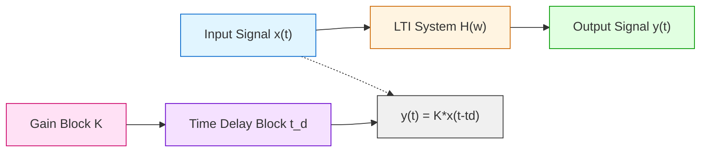
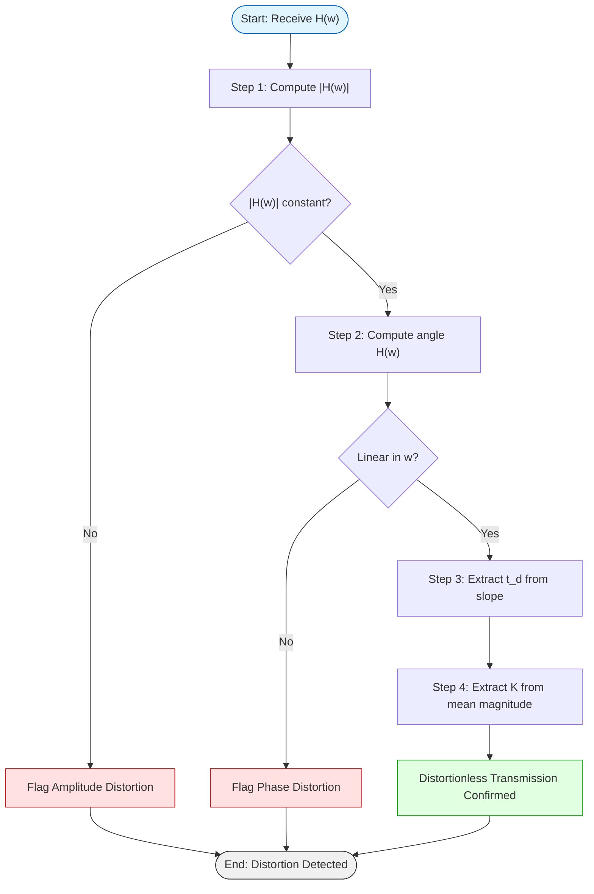
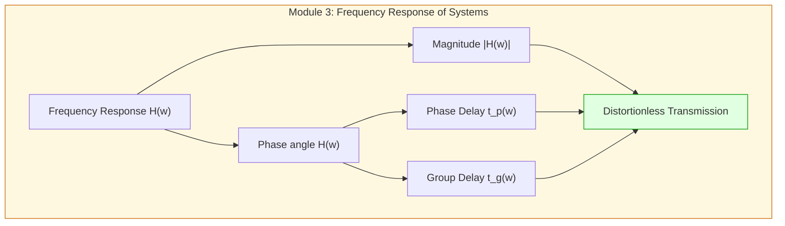

# Distortionless transmission constraints conditions setups metrics parameters

<!-- SECTION_1_START -->

# Distortionless Transmission: Core Definition & Intuitive Overview

> [!NOTE]
> **KTU 2024 Scheme — PECST404 | Module 3 | Frequency Response of Systems**
> *This topic is a high-yield, frequently tested concept in KTU board examinations, typically appearing as a Part A (3 marks) or as a sub-part of a Part B (14 marks) problem.*

## 1.1 Formal Academic Definition

In the context of Linear Time-Invariant (LTI) systems, **distortionless transmission** is defined as the condition under which an input signal $x(t)$ passing through a system $H(\omega)$ produces an output $y(t)$ that retains the **exact waveform shape** of the input, differing only in **amplitude scaling** and **time shifting**.

Mathematically, the output–input relationship is expressed as:

$$y(t) = K \cdot x(t - t_d)$$

where:
- $K$ is a **positive real constant** (independent of time and frequency) — represents overall signal amplification/attenuation
- $t_d$ is a **real, non-negative constant** — represents the finite propagation/transportation delay introduced by the system
- The system transfer function is $H(\omega) = \dfrac{Y(\omega)}{X(\omega)}$

> [!IMPORTANT]
> **Key Distinction (Board Exam Focus):**
> In *distortionless* transmission, the **shape** of the signal is preserved. This is fundamentally different from *distortion-free* systems (which require $K=1$, $t_d=0$) and *lossless* systems (which conserve signal energy, $\int |y(t)|^2 dt = \int |x(t)|^2 dt$).

## 1.2 Conceptual Analogy — The "Photocopier + Postal Mail" Intuition

Imagine an LTI system as a **perfect photocopying machine combined with a postal delivery service**:

| Component | Analogy | Engineering Role |
|-----------|---------|------------------|
| **Photocopier** | May print slightly darker/lighter (scaling) | Represents the **gain constant $K$** |
| **Postal Service** | Takes a *fixed* time to deliver (delay) | Represents the **propagation delay $t_d$** |
| **Content** | The *message* on the paper remains identical | Represents **preserved signal shape** |

✅ **Distortionless** = Paper delivered with the same message, just scaled (lighter/darker) and arriving 2 days late.

❌ **Distorted Transmission** = Either:
- The message is **stretched or compressed** (frequency content altered → *Amplitude Distortion*)
- Different words arrive at *different times* on the same page (*Phase/Delay Distortion*)
- The message is **garbled into new words** (harmonics generated → *Non-linear Distortion*)

## 1.3 Physical Constants and Standard Metrics

> [!IMPORTANT]
> **Critical Parameters Introduced in this Topic:**
> - **Gain Magnitude**: $|H(\omega)| = K = \text{constant}$ (typically expressed in **decibels (dB)**, where $K_{dB} = 20 \log_{10}(K)$)
> - **Time Delay**: $t_d$ measured in **seconds (s)** or **milliseconds (ms)**
> - **Angular Frequency**: $\omega$ measured in **radians per second (rad/s)**
> - **Phase Linearity Slope**: $\dfrac{d\angle H(\omega)}{d\omega} = -t_d$ measured in **seconds/Hz**

> [!VISUALIZATION CONTROL]
> **Concept:** Ideal distortionless magnitude and phase response curves
> **GeoGebra / Desmos Input Equations:**
> * `f(x) = 1` (Magnitude plot — flat line)
> * `g(x) = -2*x` (Phase plot — straight line through origin with slope = $-t_d$)
> **Visual Description:** The student should observe a **horizontal line** for $|H(\omega)|$ on the y-axis (no peaks or dips) and a **perfectly straight line passing through the origin** for $\angle H(\omega)$, with the slope being the negative of the time delay.

<!-- SECTION_1_END -->

<!-- SECTION_2_START -->

# Deep Theoretical Analysis & KTU High-Yield Formula Sheet

## 2.1 Deriving the Frequency-Domain Conditions

Starting from the time-domain definition of distortionless transmission:

$$y(t) = K \cdot x(t - t_d)$$

**Step 1:** Apply the Fourier Transform to both sides. Recall the **time-shifting property**: $\mathcal{F}\{x(t - t_d)\} = X(\omega) \cdot e^{-j\omega t_d}$.

$$Y(\omega) = K \cdot X(\omega) \cdot e^{-j\omega t_d}$$

**Step 2:** Since $H(\omega) = \dfrac{Y(\omega)}{X(\omega)}$, divide both sides by $X(\omega)$ (assuming $X(\omega) \neq 0$):

$$H(\omega) = K \cdot e^{-j\omega t_d}$$

**Step 3:** Separate into magnitude and phase components using Euler's identity $e^{-j\theta} = \cos(\theta) - j\sin(\theta)$:

$$\boxed{H(\omega) = K \cdot e^{-j\omega t_d}}$$

## 2.2 The Two Cardinal Conditions for Distortionless Transmission

> [!IMPORTANT]
> **THE FUNDAMENTAL RESULT — Must Memorize for KTU Board Exam**

| Condition # | Parameter | Required Form | Physical Meaning |
|-------------|-----------|---------------|------------------|
| **Condition 1** | **Magnitude Response** | $\vert H(\omega) \vert = K$ (constant, $\forall \omega$) | All frequency components are **amplified/attenuated equally** |
| **Condition 2** | **Phase Response** | $\angle H(\omega) = -\omega t_d$ (linear in $\omega$) | All frequency components are **delayed by exactly $t_d$ seconds** |

**Violation Consequences:**
- ❌ If $\vert H(\omega) \vert \neq \text{constant}$ → **Amplitude (Frequency) Distortion**
- ❌ If $\angle H(\omega) \neq -\omega t_d$ → **Phase (Delay) Distortion**

## 2.3 Phase Delay and Group Delay — The Twin Metrics

To rigorously characterize the timing behavior of an LTI system, engineers and KTU examiners use two closely related delay metrics:

**Phase Delay ($t_p$):** The time delay experienced by the **steady-state sinusoidal carrier** (or the entire waveform's envelope reference).

$$t_p(\omega) = -\frac{\angle H(\omega)}{\omega}$$

**Group Delay ($t_g$):** The time delay experienced by the **narrow-band envelope/modulation** of a signal — particularly important in communication systems.

$$t_g(\omega) = -\frac{d\angle H(\omega)}{d\omega}$$

> [!IMPORTANT]
> **For Distortionless Transmission (Board Exam Golden Rule):**
> Both $t_p(\omega) = t_d$ and $t_g(\omega) = t_d$ must be **constant and equal to $t_d$** for all $\omega$. This dual condition mathematically enforces the linearity of phase.

## 2.4 KTU High-Yield Formula Cheat Sheet

| # | Formula / Identity | Description | Typical KTU Marks |
|---|--------------------|-------------|-------------------|
| 1 | $y(t) = K \cdot x(t - t_d)$ | Time-domain definition | 2 marks |
| 2 | $H(\omega) = K \cdot e^{-j\omega t_d}$ | Frequency-domain condition | 3 marks |
| 3 | $\vert H(\omega) \vert = K$ | Magnitude condition | 2 marks |
| 4 | $\angle H(\omega) = -\omega t_d$ | Phase condition | 2 marks |
| 5 | $t_p(\omega) = -\dfrac{\angle H(\omega)}{\omega}$ | Phase delay | 2 marks |
| 6 | $t_g(\omega) = -\dfrac{d\angle H(\omega)}{d\omega}$ | Group delay | 2 marks |
| 7 | $K_{dB} = 20 \log_{10}(K)$ | Gain in decibels | 1 mark |
| 8 | $h(t) = K \cdot \delta(t - t_d)$ | Impulse response (ideal system) | 2 marks |

## 2.5 Real-World Engineering Utility

| Application Domain | Why Distortionless Transmission Matters |
|--------------------|------------------------------------------|
| **Telecommunications (4G/5G)** | Preserves digital pulse shapes, prevents Inter-Symbol Interference (ISI) |
| **Audio Engineering** | Ensures faithful reproduction in Hi-Fi speakers and recording studios |
| **Radar & Sonar Systems** | Accurate range finding requires known, constant group delay |
| **Medical Imaging (MRI, Ultrasound)** | Preserves spatial precision of diagnostic scans |
| **Control Systems** | Stability margins depend on phase linearity near crossover frequency |
| **Optical Fiber Communication** | Compensates for chromatic dispersion using dispersion-shifted fibers |

> [!NOTE]
> In practice, **no physical system is truly distortionless** over infinite bandwidth. Engineers design **equalizers** to approximate the ideal $K \cdot e^{-j\omega t_d}$ response within a specific operating band (e.g., voice band 300 Hz–3.4 kHz).

<!-- SECTION_2_END -->

<!-- SECTION_3_START -->

# Step-by-Step Derivations & Code Implementation

## 3.1 Exhaustive Derivation: From Time-Domain to Phase/Group Delay Equivalence

We will prove that the condition $t_p(\omega) = t_g(\omega) = t_d$ is mathematically equivalent to demanding linear phase.

**Given:** $\angle H(\omega) = \phi(\omega)$

**Step 1:** Substitute into the phase delay definition.

$$t_p(\omega) = -\frac{\phi(\omega)}{\omega}$$

**Step 2:** Differentiate the phase function for the group delay.

$$t_g(\omega) = -\frac{d\phi(\omega)}{d\omega}$$

**Step 3:** Apply the distortionless phase requirement $\phi(\omega) = -\omega t_d$.

$$t_p(\omega) = -\frac{(-\omega t_d)}{\omega} = t_d$$

**Step 4:** Differentiate the linear phase function.

$$\frac{d\phi(\omega)}{d\omega} = \frac{d}{d\omega}(-\omega t_d) = -t_d$$

$$t_g(\omega) = -(-t_d) = t_d$$

**Step 5:** Conclude that both delays equal $t_d$, completing the proof that **linear phase is necessary and sufficient** for distortionless transmission.

$$\boxed{t_p(\omega) = t_g(\omega) = t_d \quad \Longleftrightarrow \quad \phi(\omega) = -\omega t_d}$$

## 3.2 Worked Numerical Example — Complete Solution

> **Problem:** A system has transfer function $H(\omega) = 2 \cdot e^{-j3\omega}$. Verify whether the system provides distortionless transmission, and determine the time delay and gain.

**Solution:**

**Step 1:** Compare with the canonical form $H(\omega) = K \cdot e^{-j\omega t_d}$.

$$K = 2, \quad \omega t_d = 3\omega \implies t_d = 3 \text{ seconds}$$

**Step 2:** Check magnitude condition: $\vert H(\omega) \vert = \vert 2 \cdot e^{-j3\omega} \vert = 2$ (constant). ✓

**Step 3:** Check phase condition: $\angle H(\omega) = -3\omega$ (linear in $\omega$). ✓

**Step 4:** Conclusion: System provides **distortionless transmission** with $K = 2$ and $t_d = 3$ s.

## 3.3 Python Implementation — Distortionless Transmission Analyzer

```python
import numpy as np
import matplotlib.pyplot as plt
from typing import Tuple

def analyze_distortionless(
    H_magnitude: np.ndarray,
    H_phase: np.ndarray,
    omega: np.ndarray,
    K_expected: float,
    td_expected: float,
    tolerance: float = 1e-3
) -> Tuple[bool, dict]:
    """
    Analyzes whether an LTI system provides distortionless transmission.
    
    Parameters:
    -----------
    H_magnitude : np.ndarray
        Magnitude response |H(w)| evaluated at each frequency point
    H_phase : np.ndarray
        Phase response angle(H(w)) in radians
    omega : np.ndarray
        Angular frequency vector in rad/s
    K_expected : float
        Expected constant gain
    td_expected : float
        Expected time delay in seconds
    tolerance : float
        Numerical tolerance for deviation checks
    
    Returns:
    --------
    is_distortionless : bool
        True if both conditions are satisfied
    report : dict
        Detailed metrics and parameters
    """
    
    # --- Condition 1: Magnitude constancy check ---
    magnitude_variation = np.max(H_magnitude) - np.min(H_magnitude)
    magnitude_is_constant = magnitude_variation < tolerance
    measured_K = np.mean(H_magnitude)
    
    # --- Condition 2: Phase linearity check ---
    # Theoretical phase reference line: phi(w) = -w * td
    expected_phase = -omega * td_expected
    phase_deviation = np.max(np.abs(H_phase - expected_phase))
    phase_is_linear = phase_deviation < tolerance
    
    # --- Phase delay and group delay computation ---
    # Avoid division by zero at w = 0
    omega_nonzero = omega[omega != 0]
    phase_nonzero = H_phase[omega != 0]
    
    phase_delay = -phase_nonzero / omega_nonzero
    
    # Group delay via numerical differentiation
    group_delay = -np.gradient(H_phase, omega)
    
    # --- Decision logic ---
    is_distortionless = magnitude_is_constant and phase_is_linear
    
    # --- Build diagnostic report ---
    report = {
        "magnitude_variation": magnitude_variation,
        "phase_deviation_max": phase_deviation,
        "measured_gain_K": measured_K,
        "measured_time_delay_td": np.mean(phase_delay),
        "phase_delay_mean": np.mean(phase_delay),
        "phase_delay_std": np.std(phase_delay),
        "group_delay_mean": np.mean(group_delay),
        "group_delay_std": np.std(group_delay),
        "amplitude_distortion": not magnitude_is_constant,
        "phase_distortion": not phase_is_linear
    }
    
    # --- Logging and warnings ---
    if not magnitude_is_constant:
        print(f"[WARNING] Amplitude distortion detected. "
              f"|H(w)| variation = {magnitude_variation:.4f}")
    
    if not phase_is_linear:
        print(f"[WARNING] Phase distortion detected. "
              f"Max phase deviation = {phase_deviation:.4f} rad")
    
    if is_distortionless:
        print(f"[SUCCESS] Distortionless transmission verified.")
        print(f"          K = {measured_K:.4f}, t_d = {report['measured_time_delay_td']:.4f} s")
    
    return is_distortionless, report


# --- Demonstration of an ideal distortionless system ---
def main():
    # Define frequency vector
    omega = np.linspace(-20, 20, 1000)
    
    # Ideal distortionless system parameters
    K = 3.0
    td = 2.5
    
    # Construct H(w) = K * exp(-j * w * td)
    H_complex = K * np.exp(-1j * omega * td)
    H_magnitude = np.abs(H_complex)
    H_phase = np.angle(H_complex)
    
    # Run analysis
    is_ok, report = analyze_distortionless(
        H_magnitude, H_phase, omega, K, td
    )
    
    # Visualization
    fig, axes = plt.subplots(2, 1, figsize=(10, 6))
    
    axes[0].plot(omega, H_magnitude, 'b-', linewidth=2, label='|H(ω)|')
    axes[0].axhline(y=K, color='r', linestyle='--', label=f'K = {K}')
    axes[0].set_title('Magnitude Response — Distortionless System')
    axes[0].set_xlabel('ω (rad/s)')
    axes[0].set_ylabel('|H(ω)|')
    axes[0].grid(True)
    axes[0].legend()
    
    axes[1].plot(omega, H_phase, 'g-', linewidth=2, label='∠H(ω)')
    axes[1].plot(omega, -omega * td, 'r--', label=f'−ω·t_d (t_d={td})')
    axes[1].set_title('Phase Response — Linear Phase Requirement')
    axes[1].set_xlabel('ω (rad/s)')
    axes[1].set_ylabel('Phase (rad)')
    axes[1].grid(True)
    axes[1].legend()
    
    plt.tight_layout()
    plt.show()


if __name__ == "__main__":
    main()
```

## 3.4 Numerical Verification with a Non-Ideal System

```python
def test_distorted_system():
    """
    Demonstrates detection of distortion in a non-ideal system.
    System: H(w) = (1 + j*w/10) * exp(-j*2w) — has non-constant magnitude.
    """
    omega = np.linspace(-20, 20, 1000)
    K = 1.0
    td = 2.0
    
    # Non-ideal magnitude: rises with frequency (introduces amplitude distortion)
    H_magnitude = np.abs(1 + 1j * omega / 10)
    H_phase = -omega * td  # Phase is still linear
    
    is_ok, report = analyze_distortionless(
        H_magnitude, H_phase, omega, K, td
    )
    
    assert not is_ok, "Test should detect amplitude distortion"
    assert report["amplitude_distortion"], "Amplitude distortion should be flagged"
    
    print("[PASS] Distorted system correctly identified.")
```

<!-- SECTION_3_END -->

<!-- SECTION_4_START -->

# Structural Diagrams & Schematics

## 4.1 Block-Level Functional Architecture of a Distortionless Transmission System



## 4.2 Sequential Processing Topology — Distortion Verification Flow



## 4.3 Module-Wise Concept Map for Module 3



<!-- SECTION_4_END -->

<!-- SECTION_5_START -->

# KTU 2024 Scheme Examination Question Bank & Topic Recap

---

## Part A Questions (3 Marks Each)

### **Question A1** `[KTU University Exam — July 2024]`
**CO1 | RBT Level: Remember**

**Q:** Define distortionless transmission. State the necessary and sufficient conditions for a system to provide distortionless transmission.

**Model Answer (3 Marks):**

**Definition (1 Mark):** A system provides distortionless transmission if the output is a scaled and time-delayed replica of the input: $y(t) = K \cdot x(t - t_d)$, where $K$ is a positive constant and $t_d$ is a non-negative real constant.

**Conditions (2 Marks):**
1. **Magnitude Condition:** $\vert H(\omega) \vert = K$ (constant for all $\omega$)
2. **Phase Condition:** $\angle H(\omega) = -\omega t_d$ (linear in $\omega$)

---

### **Question A2** `[KTU University Exam — Dec 2023]`
**CO1 | RBT Level: Understand**

**Q:** Distinguish between phase delay and group delay. Under what condition do they become equal?

**Model Answer (3 Marks):**

| Aspect | Phase Delay ($t_p$) | Group Delay ($t_g$) |
|--------|---------------------|---------------------|
| **Definition** | $t_p(\omega) = -\dfrac{\angle H(\omega)}{\omega}$ | $t_g(\omega) = -\dfrac{d\angle H(\omega)}{d\omega}$ |
| **Physical Meaning** | Delay of the **carrier** sinusoidal component | Delay of the **envelope/modulation** of a narrowband signal |
| **Application** | Single-tone reference signals | Modulated communication signals |

**Equality Condition (1 Mark):** They become equal when the phase response is **linear** in $\omega$, i.e., $\angle H(\omega) = -\omega t_d$, which is precisely the distortionless transmission condition.

---

## Part B Questions (14 Marks Each)

### **Question B1 — Option A (14 Marks)** `[KTU University Exam — Dec 2024]`
**CO2, CO3 | RBT Levels: Understand + Apply**

**Q:** 
**(a)** Derive the conditions for distortionless transmission of a signal through an LTI system in the frequency domain. **(7 Marks)**

**(b)** A system is described by the transfer function $H(\omega) = \dfrac{5}{1 + j\omega/100}$. Determine whether this system provides distortionless transmission over the frequency band $0 \leq \omega \leq 100$ rad/s. Justify your answer with appropriate calculations. **(7 Marks)**

---

**Model Solution:**

### Part (a) — Derivation (7 Marks)

**[Statement of definition: 1 Mark]**

Starting from the time-domain definition of distortionless transmission:

$$y(t) = K \cdot x(t - t_d) \quad \text{...(1)}$$

**[Fourier transform step: 2 Marks]**

Applying the Fourier Transform to both sides of equation (1), and using the time-shifting property $\mathcal{F}\{x(t - t_d)\} = X(\omega) e^{-j\omega t_d}$:

$$Y(\omega) = K \cdot X(\omega) \cdot e^{-j\omega t_d} \quad \text{...(2)}$$

**[Transfer function extraction: 1 Mark]**

Since $H(\omega) = \dfrac{Y(\omega)}{X(\omega)}$:

$$H(\omega) = K \cdot e^{-j\omega t_d} \quad \text{...(3)}$$

**[Magnitude and phase decomposition: 2 Marks]**

Decomposing equation (3):

$$\vert H(\omega) \vert = K \quad \text{(constant)} \quad \text{...(4)}$$

$$\angle H(\omega) = -\omega t_d \quad \text{(linear in } \omega\text{)} \quad \text{...(5)}$$

**[Conclusion: 1 Mark]**

Equations (4) and (5) are the **necessary and sufficient conditions** for distortionless transmission. Any deviation from these introduces either amplitude distortion or phase distortion.

### Part (b) — Numerical Verification (7 Marks)**

**[Writing the given system: 1 Mark]**

$$H(\omega) = \frac{5}{1 + j\omega/100} = \frac{5}{\sqrt{1 + (\omega/100)^2}} \cdot e^{-j\tan^{-1}(\omega/100)}$$

**[Magnitude check: 3 Marks]**

$$\vert H(\omega) \vert = \frac{5}{\sqrt{1 + (\omega/100)^2}}$$

Evaluating at the band edges:
- At $\omega = 0$: $\vert H(0) \vert = 5$
- At $\omega = 50$: $\vert H(50) \vert = \dfrac{5}{\sqrt{1 + 0.25}} = \dfrac{5}{\sqrt{1.25}} \approx 4.472$
- At $\omega = 100$: $\vert H(100) \vert = \dfrac{5}{\sqrt{1 + 1}} = \dfrac{5}{\sqrt{2}} \approx 3.536$

Since $\vert H(\omega) \vert$ varies from $5$ to $3.536$, the magnitude is **NOT constant** → **Amplitude distortion present**.

**[Phase check: 2 Marks]**

$$\angle H(\omega) = -\tan^{-1}\left(\frac{\omega}{100}\right)$$

This is the **arctangent function**, which is **non-linear** in $\omega$ → **Phase distortion present**.

**[Final conclusion: 1 Mark]**

The system does **NOT** provide distortionless transmission over the specified band because both magnitude and phase conditions are violated.

---

### **Question B1 — Option B (14 Marks)** `[KTU University Exam — July 2023]`
**CO2, CO3 | RBT Levels: Understand + Apply**

**Q:**
**(a)** For an LTI system, define phase delay and group delay. Show that for distortionless transmission, both delays must be constant and equal. **(7 Marks)**

**(b)** A system has impulse response $h(t) = 4\delta(t - 0.5)$. Determine the output when the input is $x(t) = 3\cos(10\pi t) + 5\sin(20\pi t + \pi/4)$. Verify if the transmission is distortionless. **(7 Marks)**

---

**Model Solution:**

### Part (a) — Definitions and Equivalence (7 Marks)**

**[Phase delay definition: 1.5 Marks]**

$$t_p(\omega) = -\frac{\angle H(\omega)}{\omega} = -\frac{\phi(\omega)}{\omega}$$

**[Group delay definition: 1.5 Marks]**

$$t_g(\omega) = -\frac{d\angle H(\omega)}{d\omega} = -\frac{d\phi(\omega)}{d\omega}$$

**[Proof of constancy requirement: 2 Marks]**

For $t_p(\omega)$ to be constant, $\phi(\omega)$ must be of the form $\phi(\omega) = -\omega t_d$, since $t_p = -\phi/\omega$ constancy requires $\phi$ to scale linearly with $\omega$.

**[Equivalence proof: 2 Marks]**

Differentiating $\phi(\omega) = -\omega t_d$:
$$\frac{d\phi}{d\omega} = -t_d \implies t_g(\omega) = -(-t_d) = t_d = t_p(\omega)$$

Hence both delays are constant and equal to $t_d$ **if and only if** the phase is linear.

### Part (b) — Impulse Response Analysis (7 Marks)**

**[Identify system parameters: 2 Marks]**

The impulse response $h(t) = 4\delta(t - 0.5)$ implies:
- Gain: $K = 4$
- Time delay: $t_d = 0.5$ s
- Transfer function: $H(\omega) = 4 e^{-j0.5\omega}$

**[Apply distortionless condition: 1 Mark]**

Since $H(\omega)$ is already in canonical form $K e^{-j\omega t_d}$:
- $\vert H(\omega) \vert = 4$ (constant) ✓
- $\angle H(\omega) = -0.5\omega$ (linear) ✓

The system is **distortionless** with $K = 4$ and $t_d = 0.5$ s.

**[Compute output using distortionless property: 3 Marks]**

Since the system is distortionless: $y(t) = 4 \cdot x(t - 0.5)$

$$y(t) = 4 \left[ 3\cos\left(10\pi(t-0.5)\right) + 5\sin\left(20\pi(t-0.5) + \frac{\pi}{4}\right) \right]$$

$$y(t) = 12\cos\left(10\pi t - 5\pi\right) + 20\sin\left(20\pi t - 10\pi + \frac{\pi}{4}\right)$$

Simplifying using periodicity ($5\pi$ and $10\pi$ are integer multiples of $\pi$):

$$y(t) = -12\cos(10\pi t) + 20\sin\left(20\pi t + \frac{\pi}{4}\right)$$

**[Conclusion: 1 Mark]**

The output is a scaled and delayed replica of the input, confirming distortionless transmission.

---

> [!WARNING]
> **KTU Examiner's Valuation Warning — Common Pitfalls:**
> 1. **Do not confuse "distortionless" with "distortion-free"** — distortionless allows scaling and delay; distortion-free requires $K=1$ and $t_d=0$.
> 2. **Always check BOTH conditions** — many students only verify magnitude or only verify phase, losing 3-4 marks.
> 3. **Remember the $e^{-j\omega t_d}$ form** — writing it as $e^{j\omega t_d}$ (positive exponent) is a frequent sign error.
> 4. **Unit consistency** — $\omega$ is in rad/s, $t_d$ must be in seconds for the product $\omega t_d$ to be dimensionless.
> 5. **For non-ideal systems like low-pass filters**, explicitly state that the magnitude is **NOT constant** rather than vaguely saying "it changes."

---

## 📌 Topic Recap & Important Things to Remember

> [!IMPORTANT]
> **Rapid Revision Checklist — Distortionless Transmission**

### 🔑 Core Definition
- Distortionless transmission: $y(t) = K \cdot x(t - t_d)$ — output is a scaled, time-delayed replica of input.
- Frequency domain form: $H(\omega) = K \cdot e^{-j\omega t_d}$

### 🔑 Two Cardinal Conditions (MUST MEMORIZE)
1. **Magnitude condition:** $\vert H(\omega) \vert = K$ = constant (no frequency-dependent gain variation)
2. **Phase condition:** $\angle H(\omega) = -\omega t_d$ = linear in $\omega$ with slope $-t_d$

### 🔑 Delay Metrics
- **Phase delay:** $t_p(\omega) = -\dfrac{\angle H(\omega)}{\omega}$ — delay of sinusoidal carrier
- **Group delay:** $t_g(\omega) = -\dfrac{d\angle H(\omega)}{d\omega}$ — delay of signal envelope/modulation
- For distortionless transmission: $t_p(\omega) = t_g(\omega) = t_d$ (both must be **constant and equal**)

### 🔑 Types of Distortion (Direct Violations)
- **Amplitude/Frequency Distortion** → occurs when $\vert H(\omega) \vert$ is **not constant**
- **Phase/Delay Distortion** → occurs when $\angle H(\omega)$ is **not linear** in $\omega$
- **Non-linear Distortion** → occurs in **non-linear systems** (generates harmonics — not covered under LTI distortionless analysis)

### 🔑 Common System Classifications
| System Type | Magnitude | Phase | Distortionless? |
|-------------|-----------|-------|-----------------|
| Ideal Cable | Constant | Linear | ✅ Yes |
| Pure Delay Line ($e^{-j\omega t_d}$) | $= 1$ | $= -\omega t_d$ | ✅ Yes (with $K=1$) |
| RC Low-pass Filter | Varies | $-\tan^{-1}(\omega RC)$ | ❌ No |
| All-pass Filter | Constant | Non-linear phase | ❌ No (phase distortion only) |

### 🔑 Key Formulas for Board Exam
- $H(\omega) = K e^{-j\omega t_d}$ (canonical form)
- $K_{dB} = 20 \log_{10}(K)$ (gain conversion)
- $t_p$ and $t_g$ formulas as above
- $h(t) = K \delta(t - t_d)$ (ideal impulse response)

### 🔑 Practical Engineering Relevance
- **Communication systems:** Equalizers are designed to flatten magnitude and linearize phase within the signal bandwidth
- **Filter design trade-off:** Sharper filters (e.g., Butterworth, Chebyshev) often have better magnitude response but worse phase linearity
- **Linear-phase FIR filters** are preferred in applications requiring distortionless transmission (e.g., audio processing, data communication)

<!-- SECTION_5_END -->
