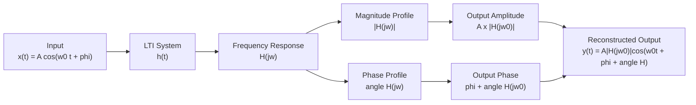
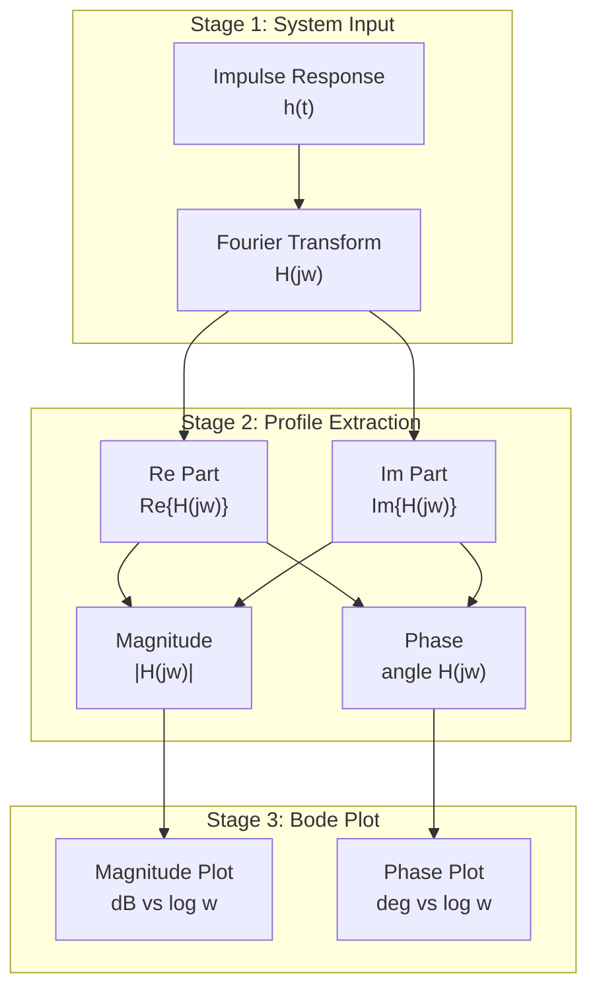
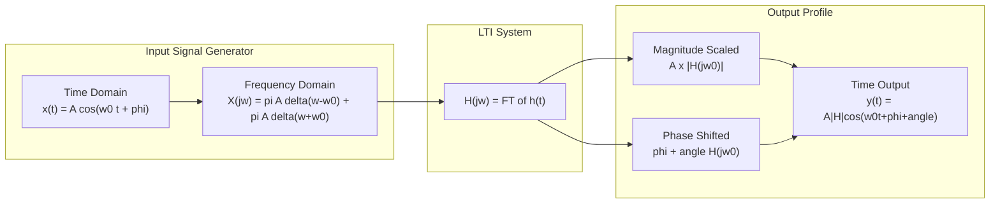
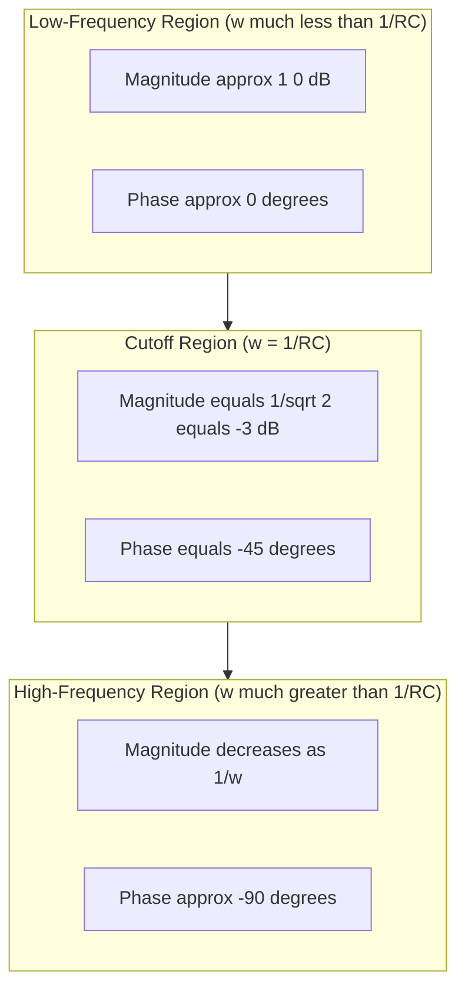

# Frequency response of LTI systems, magnitude and phase profiles tracking

<!-- SECTION_1_START -->
# Frequency Response of LTI Systems: Magnitude and Phase Profiles

## 1.1 Formal Academic Definition (KTU 2024 Syllabus Terminology)

In the context of **Signals and Systems (PECST404)**, the **frequency response** of a Linear Time-Invariant (LTI) system is formally defined as the **Fourier Transform of its impulse response** $h(t)$ (continuous-time) or $h[n]$ (discrete-time).

$$H(j\omega) = \int_{-\infty}^{\infty} h(t)\, e^{-j\omega t}\, dt \quad \text{(Continuous-Time LTI)}$$

$$H(e^{j\Omega}) = \sum_{n=-\infty}^{\infty} h[n]\, e^{-j\Omega n} \quad \text{(Discrete-Time LTI)}$$

> [!IMPORTANT]
> **Syllabus Highlight (KTU 2024 - Module 3):** The frequency response completely characterises an LTI system in the frequency domain. It governs how the system modifies the **amplitude** (magnitude spectrum) and **initial phase** (phase spectrum) of every sinusoidal component present in the input signal.

The two key profiles derived from $H(j\omega)$ are:

- **Magnitude Response:** $\vert H(j\omega) \vert = \sqrt{[\text{Re}\{H(j\omega)\}]^2 + [\text{Im}\{H(j\omega)\}]^2}$
- **Phase Response:** $\angle H(j\omega) = \arctan\!\left(\dfrac{\text{Im}\{H(j\omega)\}}{\text{Re}\{H(j\omega)\}}\right)$

> [!NOTE]
> **Core Concept — Eigenfunction Property:** A complex exponential $e^{j\omega t}$ is an **eigenfunction** of every LTI system. When fed as input, the output is a scaled (complex constant) version of the same exponential. The scaling factor is precisely $H(j\omega)$.

$$\boxed{\,x(t) = e^{j\omega t} \;\xrightarrow{\;\text{LTI System}\;}\; y(t) = H(j\omega)\, e^{j\omega t}\,}$$

## 1.2 Conceptual Analogy — The Audio Equaliser

Imagine a **graphic equaliser** on a music player. Each slider controls a specific frequency band:

- **Bass slider** (low $\omega$): Boosts/cuts low-frequency notes (e.g., kick drum).
- **Treble slider** (high $\omega$): Boosts/cuts high-frequency notes (e.g., cymbals).
- **Mid slider** (mid $\omega$): Affects vocals and guitars.

The **curve formed by all sliders together** is exactly the **magnitude response** $\vert H(j\omega) \vert$ of the system. The equaliser is a filter — and every filter has a frequency response.

**Geometric Intuition:** Think of the complex plane. As $\omega$ sweeps from $0$ to $\infty$, the complex number $H(j\omega)$ traces a **contour**. The distance of this contour point from the origin gives the magnitude, while the angle it makes with the positive real axis gives the phase.

> [!VISUALIZATION CONTROL]
> **Concept:** Magnitude & Phase of a first-order low-pass filter $H(j\omega) = \dfrac{1}{1 + j\omega RC}$ with $RC = 1$.
> **GeoGebra / Desmos Input Equations:**
> * `H_re(ω) = 1 / (1 + ω²)`
> * `H_im(ω) = -ω / (1 + ω²)`
> * `Mag(ω) = sqrt(H_re(ω)² + H_im(ω)²)`
> * `Phase(ω) = atan2(H_im(ω), H_re(ω))`
> * Parametric plot of `(H_re(t), H_im(t))` for $t \in [0, 10]$.
> **Visual Description:** You will observe a semicircle in the lower half of the complex plane with radius $0.5$ centred at $(0.5, 0)$. The magnitude plot is a monotonically decreasing curve approaching zero, and the phase plot decreases monotonically from $0$ to $-\pi/2$.

## 1.3 Standard Metrics and Physical Constants

| Quantity | Symbol | Unit | Description |
|---|---|---|---|
| Magnitude | $\vert H(j\omega) \vert$ | **dimensionless (linear)** or **decibels (dB)** | Amplification factor |
| Phase | $\angle H(j\omega)$ | **radians** or **degrees** | Time-shift introduced |
| Gain in dB | $20 \log_{10}\vert H(j\omega) \vert$ | **dB** | Standard Bode plot scale |
| Group Delay | $\tau_g(\omega) = -\dfrac{d}{d\omega}\angle H(j\omega)$ | **seconds** | Delay of envelope |
| Phase Delay | $\tau_p(\omega) = -\dfrac{\angle H(j\omega)}{\omega}$ | **seconds** | Delay of carrier |
| 3-dB Cutoff | $\vert H(j\omega_c) \vert = \dfrac{\vert H(j0) \vert}{\sqrt{2}}$ | **rad/s** | Half-power frequency |

<!-- SECTION_1_END -->

<!-- SECTION_2_START -->
# Deep Theoretical Analysis & KTU High-Yield Formula Sheet

## 2.1 The Why and How — Step-by-Step Logical Flow

### Step 1: Start with the Input
Let the input be a pure complex exponential (Euler's relation):
$$x(t) = e^{j\omega t}$$

### Step 2: Apply Convolution
For a continuous-time LTI system, the output is the convolution of input with impulse response:
$$y(t) = (h * x)(t) = \int_{-\infty}^{\infty} h(\tau)\, x(t - \tau)\, d\tau$$

### Step 3: Substitute the Exponential
$$y(t) = \int_{-\infty}^{\infty} h(\tau)\, e^{j\omega(t - \tau)}\, d\tau = e^{j\omega t} \int_{-\infty}^{\infty} h(\tau)\, e^{-j\omega \tau}\, d\tau$$

### Step 4: Recognise the Fourier Transform
The integral $\int_{-\infty}^{\infty} h(\tau) e^{-j\omega \tau} d\tau$ is, by definition, $H(j\omega)$. Thus:
$$y(t) = H(j\omega)\, e^{j\omega t}$$

> [!NOTE]
> **The Takeaway:** A sinusoid in produces a sinusoid out — same frequency, scaled by $\vert H(j\omega) \vert$, and phase-shifted by $\angle H(j\omega)$. This is the foundational result enabling all of **filter design, control systems, communications modulation**, and **spectral analysis**.

## 2.2 Response to a Real Sinusoid

For a physical (real) input $x(t) = A \cos(\omega_0 t + \phi)$:
$$y(t) = A\, \vert H(j\omega_0) \vert\, \cos\!\big(\omega_0 t + \phi + \angle H(j\omega_0)\big)$$

The system:
- **Scales amplitude** by $\vert H(j\omega_0) \vert$
- **Adds phase** $\angle H(j\omega_0)$ to every frequency component
- **Does NOT create new frequencies** (a defining LTI property)

## 2.3 KTU Formula Sheet / Cheat Sheet

| # | Formula | Use Case | Units |
|---|---|---|---|
| 1 | $H(j\omega) = \mathcal{F}\{h(t)\}$ | Definition of frequency response | dimensionless |
| 2 | $y(t) = H(j\omega)\, e^{j\omega t}$ | Eigenfunction response | depends on input |
| 3 | $\vert H(j\omega) \vert = \sqrt{H_R^2 + H_I^2}$ | Magnitude profile | linear / dB |
| 4 | $\angle H(j\omega) = \arctan(H_I / H_R)$ | Phase profile | rad / deg |
| 5 | $\text{Gain}_{\text{dB}} = 20 \log_{10}\vert H(j\omega) \vert$ | Bode magnitude | **dB** |
| 6 | $\tau_g(\omega) = -\dfrac{d\,\angle H(j\omega)}{d\omega}$ | Group delay (envelope) | **seconds** |
| 7 | $\tau_p(\omega) = -\dfrac{\angle H(j\omega)}{\omega}$ | Phase delay (carrier) | **seconds** |
| 8 | $H(j\omega_c) = \dfrac{H(j0)}{\sqrt{2}}$ | 3-dB cutoff / half-power | rad/s |
| 9 | $\vert H(e^{j\Omega}) \vert^2 = H(e^{j\Omega}) H^*(e^{j\Omega})$ | Power response (DT) | linear |
| 10 | $\angle H(e^{j\Omega}) = \angle H(z)\big\vert_{z = e^{j\Omega}}$ | Discrete-time phase | rad / deg |

> [!IMPORTANT]
> **KTU Board Exam Tip:** Always work with the **magnitude-squared** $H(j\omega) H^*(j\omega)$ when computing $\vert H(j\omega) \vert^2$ — it eliminates square roots and complex arithmetic, making the algebra cleaner for the valuation key.

## 2.4 Engineering Utility — Where This Is Used

| Domain | Application |
|---|---|
| **Audio Engineering** | Graphic equaliser, crossover networks, headphone tuning |
| **Telecommunications** | Channel filtering, matched filtering, modulation/demodulation |
| **Control Systems** | Stability analysis via Bode plot (gain/phase margins) |
| **Biomedical** | ECG/EEG filtering, removing 50/60 Hz line noise |
| **Radar / Sonar** | Doppler processing, matched filter receivers |
| **Image Processing** | 2-D filters (Gaussian, Laplacian) using separable 1-D responses |
| **Oscilloscopes & Test Equip.** | Probe compensation, anti-aliasing filter design |

<!-- SECTION_2_END -->

<!-- SECTION_3_START -->
# Step-by-Step Derivations & Symbolic Implementation

## 3.1 Worked Derivation 1 — First-Order RC Low-Pass Filter

**Given:** A continuous-time LTI system with impulse response
$$h(t) = \dfrac{1}{RC}\, e^{-t/RC}\, u(t)$$

**Step 1 — Compute the Frequency Response $H(j\omega)$:**

$$H(j\omega) = \int_{0}^{\infty} \dfrac{1}{RC}\, e^{-t/RC}\, e^{-j\omega t}\, dt$$

$$\Rightarrow H(j\omega) = \dfrac{1}{RC} \int_{0}^{\infty} e^{-(1/RC + j\omega)t}\, dt$$

**Step 2 — Evaluate the Integral:**

$$\Rightarrow H(j\omega) = \dfrac{1}{RC} \cdot \left[\dfrac{-e^{-(1/RC + j\omega)t}}{1/RC + j\omega}\right]_{0}^{\infty}$$

$$\Rightarrow H(j\omega) = \dfrac{1}{RC} \cdot \dfrac{1}{1/RC + j\omega} = \dfrac{1}{1 + j\omega RC}$$

**Step 3 — Separate Real and Imaginary Parts:**

Multiplying numerator and denominator by the complex conjugate $(1 - j\omega RC)$:

$$H(j\omega) = \dfrac{1 - j\omega RC}{(1)^2 + (\omega RC)^2} = \underbrace{\dfrac{1}{1 + (\omega RC)^2}}_{\text{Real}} \;-\; j\underbrace{\dfrac{\omega RC}{1 + (\omega RC)^2}}_{\text{Imaginary}}$$

**Step 4 — Compute Magnitude:**

$$\vert H(j\omega) \vert = \sqrt{\left(\dfrac{1}{1 + (\omega RC)^2}\right)^2 + \left(\dfrac{\omega RC}{1 + (\omega RC)^2}\right)^2} = \dfrac{1}{\sqrt{1 + (\omega RC)^2}}$$

**Step 5 — Compute Phase:**

$$\angle H(j\omega) = \arctan\!\left(\dfrac{-\omega RC / (1 + (\omega RC)^2)}{1 / (1 + (\omega RC)^2)}\right) = -\arctan(\omega RC)$$

**Step 6 — Compute 3-dB Cutoff Frequency:**

Setting $\vert H(j\omega_c) \vert = 1/\sqrt{2}$:

$$\dfrac{1}{\sqrt{1 + (\omega_c RC)^2}} = \dfrac{1}{\sqrt{2}} \;\Rightarrow\; \omega_c RC = 1 \;\Rightarrow\; \boxed{\omega_c = \dfrac{1}{RC}}$$

**Step 7 — Compute Group Delay:**

$$\tau_g(\omega) = -\dfrac{d}{d\omega}\big(-\arctan(\omega RC)\big) = \dfrac{RC}{1 + (\omega RC)^2}$$

## 3.2 Worked Derivation 2 — Response to a Real Sinusoid

**Given:** Input $x(t) = 5 \cos(100 t + \pi/4)$ to the RC LPF with $RC = 0.01$ s.

**Step 1 — Compute $\omega RC$ at $\omega = 100$:**
$$\omega RC = 100 \times 0.01 = 1$$

**Step 2 — Magnitude at $\omega = 100$:**
$$\vert H(j100) \vert = \dfrac{1}{\sqrt{1 + 1^2}} = \dfrac{1}{\sqrt{2}} \approx 0.7071$$

**Step 3 — Phase at $\omega = 100$:**
$$\angle H(j100) = -\arctan(1) = -\dfrac{\pi}{4} = -45^{\circ}$$

**Step 4 — Construct the Output:**

$$y(t) = 5 \times \dfrac{1}{\sqrt{2}} \times \cos\!\left(100 t + \dfrac{\pi}{4} - \dfrac{\pi}{4}\right) = \dfrac{5}{\sqrt{2}} \cos(100 t) \approx 3.535 \cos(100 t)$$

> [!NOTE]
> **Key Observation:** The phase delay exactly cancelled the input's initial phase. The amplitude was reduced by a factor of $1/\sqrt{2}$ (the famous 3-dB point).

## 3.3 Python Implementation — Bode Plot Generator

```python
import numpy as np
import matplotlib.pyplot as plt
from scipy import signal

# Define Transfer Function H(s) = 1 / (1 + s*RC), with RC = 0.01
RC = 0.01
num = [1.0]
den = [RC, 1.0]

# Create a continuous-time LTI system
system = signal.TransferFunction(num, den)

# Compute frequency response
w = np.logspace(0, 5, 1000)              # 1 rad/s to 100,000 rad/s
w_out, mag, phase = signal.bode(system, w)

# Convert magnitude to linear
mag_linear = 10 ** (mag / 20.0)

# Print key numerical values
wc = 1.0 / RC                              # Cutoff frequency
mag_at_wc_dB = -3.01                       # Theoretical
print(f"Cutoff frequency ωc = {wc:.2f} rad/s")
print(f"Magnitude at ωc = {mag_at_wc_dB:.2f} dB")

# Plot Bode Diagram
fig, (ax1, ax2) = plt.subplots(2, 1, figsize=(10, 7), sharex=True)

ax1.semilogx(w, mag, 'b', linewidth=2, label=r'$\vert H(j\omega) \vert_{dB}$')
ax1.axvline(wc, color='r', linestyle='--', label=f'ωc = {wc} rad/s')
ax1.axhline(-3, color='g', linestyle=':', label='−3 dB line')
ax1.set_ylabel('Magnitude (dB)')
ax1.set_title('Bode Plot — First-Order RC Low-Pass Filter')
ax1.grid(True, which='both', linestyle=':')
ax1.legend()

ax2.semilogx(w, phase, 'b', linewidth=2, label=r'$\angle H(j\omega)$')
ax2.axvline(wc, color='r', linestyle='--')
ax2.axhline(-45, color='g', linestyle=':', label='−45° at ωc')
ax2.set_xlabel('Frequency ω (rad/s)')
ax2.set_ylabel('Phase (degrees)')
ax2.grid(True, which='both', linestyle=':')
ax2.legend()

plt.tight_layout()
plt.show()
```

## 3.4 Worked Derivation 3 — Discrete-Time Frequency Response

**Given:** $h[n] = (0.5)^n u[n]$

**Step 1 — Apply DTFT:**

$$H(e^{j\Omega}) = \sum_{n=0}^{\infty} (0.5)^n e^{-j\Omega n} = \sum_{n=0}^{\infty} (0.5 e^{-j\Omega})^n$$

**Step 2 — Geometric Series Convergence** (since $\vert 0.5 e^{-j\Omega} \vert = 0.5 < 1$):

$$H(e^{j\Omega}) = \dfrac{1}{1 - 0.5 e^{-j\Omega}}$$

**Step 3 — Multiply by Conjugate:**

$$H(e^{j\Omega}) = \dfrac{1}{1 - 0.5 \cos\Omega + j\, 0.5 \sin\Omega} \cdot \dfrac{1 - 0.5 \cos\Omega - j\, 0.5 \sin\Omega}{1 - 0.5 \cos\Omega - j\, 0.5 \sin\Omega}$$

**Step 4 — Magnitude Squared:**

$$\vert H(e^{j\Omega}) \vert^2 = \dfrac{1}{(1 - 0.5 \cos\Omega)^2 + (0.5 \sin\Omega)^2} = \dfrac{1}{1.25 - \cos\Omega}$$

**Step 5 — Magnitude:**

$$\vert H(e^{j\Omega}) \vert = \dfrac{1}{\sqrt{1.25 - \cos\Omega}}$$

**Step 6 — Phase:**

$$\angle H(e^{j\Omega}) = \arctan\!\left(\dfrac{0.5 \sin\Omega}{1 - 0.5 \cos\Omega}\right)$$

> [!NOTE]
> **Discrete-time note:** The frequency response $H(e^{j\Omega})$ is **always periodic** with period $2\pi$ in $\Omega$ because $e^{j(\Omega + 2\pi)n} = e^{j\Omega n}$. This is a key distinction from continuous-time.

<!-- SECTION_3_END -->

<!-- SECTION_4_START -->
# Structural Diagrams & Schematics

## 4.1 Frequency-Response Processing Topology



## 4.2 Magnitude & Phase Profile Tracking — Sequential Flow



## 4.3 LTI System Response to Sinusoidal Input — Functional Block Architecture



## 4.4 First-Order System Magnitude & Phase Characteristics — Topology Matrix



<!-- SECTION_4_END -->

<!-- SECTION_5_START -->
# KTU 2024 Scheme Examination Question Bank & Topic Recap

## Part A — Short Answer Questions (3 Marks Each)

> **Q1.** [KTU University Exam — July 2024] Define frequency response of an LTI system. Why is the complex exponential $e^{j\omega t}$ called an eigenfunction of an LTI system?

**Model Answer (3 Marks):**
- The frequency response $H(j\omega)$ of an LTI system is the Fourier Transform of its impulse response $h(t)$. **[1 Mark]**
- It completely characterises how the system modifies the amplitude and phase of each sinusoidal input component. **[1 Mark]**
- A complex exponential $e^{j\omega t}$ is called an eigenfunction because when passed through any LTI system, the output is the *same* exponential scaled by a complex constant $H(j\omega)$, i.e., $y(t) = H(j\omega) e^{j\omega t}$. The system only scales — it does not change the functional form. **[1 Mark]**

---

> **Q2.** [KTU University Exam — Dec 2023] Distinguish between phase delay and group delay of an LTI system. Give one formula for each.

**Model Answer (3 Marks):**
- **Phase delay** $\tau_p$: The time delay experienced by a single-frequency carrier (sinusoid). Formula: $\tau_p(\omega) = -\angle H(j\omega) / \omega$. **[1.5 Marks]**
- **Group delay** $\tau_g$: The time delay experienced by the envelope of a narrowband signal. Formula: $\tau_g(\omega) = -d\angle H(j\omega)/d\omega$. **[1.5 Marks]**

---

## Part B — Long Answer Questions (14 Marks Each, Module Internal Choice)

### Question A (14 Marks) — Choice 1

> **Q3(a).** [KTU University Exam — July 2024 | CO2 | Apply — 7 Marks] For a continuous-time LTI system with impulse response $h(t) = e^{-2t} u(t)$, determine and sketch the magnitude and phase responses. Identify the 3-dB bandwidth.

**Step-by-Step Model Solution:**

**Step 1 — Compute $H(j\omega)$ by Fourier Transform.** [2 Marks]

$$H(j\omega) = \int_{0}^{\infty} e^{-2t} e^{-j\omega t}\, dt = \int_{0}^{\infty} e^{-(2 + j\omega)t}\, dt = \dfrac{1}{2 + j\omega}$$

**Step 2 — Multiply by complex conjugate to separate real and imaginary parts.** [2 Marks]

$$H(j\omega) = \dfrac{1}{2 + j\omega} \cdot \dfrac{2 - j\omega}{2 - j\omega} = \dfrac{2}{4 + \omega^2} - j\dfrac{\omega}{4 + \omega^2}$$

**Step 3 — Magnitude profile.** [1 Mark]

$$\vert H(j\omega) \vert = \dfrac{1}{\sqrt{4 + \omega^2}}$$

**Step 4 — Phase profile.** [1 Mark]

$$\angle H(j\omega) = -\arctan\!\left(\dfrac{\omega}{2}\right)$$

**Step 5 — 3-dB bandwidth.** [1 Mark]

Setting $\vert H(j\omega_c) \vert = 1/\sqrt{2} \cdot \vert H(j0) \vert = (1/2)(1/\sqrt{2})$:
$$4 + \omega_c^2 = 8 \;\Rightarrow\; \omega_c = 2 \text{ rad/s}$$

**Step 6 — Sketch.** [Valuation key: clearly label axes, asymptotic behaviour, −3 dB at $\omega_c = 2$ rad/s, phase = −45° at $\omega_c$]

| Feature | Value |
|---|---|
| DC gain | $\vert H(0) \vert = 0.5$ → **−6.02 dB** |
| 3-dB cutoff | $\omega_c = 2$ rad/s |
| Phase at DC | $0^{\circ}$ |
| Phase at $\omega_c$ | $-45^{\circ}$ |
| Phase at $\infty$ | $-90^{\circ}$ |

---

> **Q3(b).** [KTU University Exam — July 2024 | CO3 | Apply — 7 Marks] A causal LTI system is described by the differential equation $\dfrac{dy(t)}{dt} + 3 y(t) = x(t)$. Determine the response $y(t)$ of the system to the input $x(t) = 2 \cos(4t)$.

**Step-by-Step Model Solution:**

**Step 1 — Find $H(j\omega)$ from the differential equation by taking FT of both sides.** [2 Marks]

$$(j\omega) Y(j\omega) + 3 Y(j\omega) = X(j\omega)$$
$$H(j\omega) = \dfrac{Y(j\omega)}{X(j\omega)} = \dfrac{1}{3 + j\omega}$$

**Step 2 — Evaluate at $\omega = 4$ rad/s.** [1 Mark]

$$H(j4) = \dfrac{1}{3 + j4}$$

**Step 3 — Compute magnitude and phase.** [1 Mark]

$$\vert H(j4) \vert = \dfrac{1}{\sqrt{9 + 16}} = \dfrac{1}{5} = 0.2$$
$$\angle H(j4) = -\arctan(4/3) = -53.13^{\circ}$$

**Step 4 — Apply the sinusoidal steady-state response formula.** [1 Mark]

$$y(t) = \vert H(j4) \vert \cdot 2 \cos(4t + \angle H(j4))$$

**Step 5 — Final output.** [2 Marks]

$$\boxed{\,y(t) = 0.4 \cos(4t - 53.13^{\circ})\,}$$

---

### Question B (14 Marks) — Choice 2 (Internal Choice Alternative)

> **Q4(a).** [KTU University Exam — Dec 2023 | CO2 | Understand — 7 Marks] Explain the magnitude and phase Bode plot construction for a first-order low-pass filter $H(j\omega) = \dfrac{1}{1 + j\omega/\omega_c}$ where $\omega_c = 100$ rad/s. Sketch the asymptotic plot and indicate the actual response at $\omega_c$.

**Step-by-Step Model Solution:**

**Step 1 — Identify the low-pass transfer function form.** [1 Mark]

The standard form has DC gain $= 1$ and a single pole at $\omega = \omega_c = 100$ rad/s.

**Step 2 — Magnitude in dB.** [2 Marks]

$$\vert H(j\omega) \vert_{\text{dB}} = 20 \log_{10}\!\left(\dfrac{1}{\sqrt{1 + (\omega/\omega_c)^2}}\right) = -10 \log_{10}\!\left(1 + \dfrac{\omega^2}{\omega_c^2}\right)$$

Asymptotic behaviour:
- $\omega \ll \omega_c$: $\vert H \vert_{\text{dB}} \approx 0$ dB (flat passband)
- $\omega \gg \omega_c$: $\vert H \vert_{\text{dB}} \approx -20 \log_{10}(\omega/\omega_c)$ (rolls off at **−20 dB/decade**)

**Step 3 — Phase in degrees.** [2 Marks]

$$\angle H(j\omega) = -\arctan\!\left(\dfrac{\omega}{\omega_c}\right)$$

- $\omega = \omega_c / 10$: phase $\approx 0^{\circ}$
- $\omega = \omega_c$: phase $= -45^{\circ}$
- $\omega = 10 \omega_c$: phase $\approx -90^{\circ}$

**Step 4 — Actual magnitude at $\omega_c$.** [1 Mark]

$$\vert H(j\omega_c) \vert = \dfrac{1}{\sqrt{2}} = -3.01 \text{ dB}$$

(The asymptotic plot predicts 0 dB at $\omega_c$, so the error is **−3.01 dB** — this is why the asymptotic plot is corrected at the break frequency.)

**Step 5 — Bode plot sketch characteristics.** [1 Mark]

| Region | Magnitude (dB) | Phase (deg) |
|---|---|---|
| $\omega \to 0$ | $0$ | $0$ |
| $\omega = \omega_c$ | $-3.01$ | $-45$ |
| $\omega \to \infty$ | $-20 \log_{10}(\omega/\omega_c)$ | $-90$ |

---

> **Q4(b).** [KTU University Exam — Dec 2023 | CO3 | Apply — 7 Marks] A discrete-time LTI system has impulse response $h[n] = (0.8)^n \cos(\pi n / 4) u[n]$. Determine the magnitude response $\vert H(e^{j\Omega}) \vert$ at $\Omega = 0, \pi/4, \pi/2$.

**Step-by-Step Model Solution:**

**Step 1 — DTFT of $h[n]$.** [2 Marks]

Using Euler's identity, $(0.8)^n \cos(\pi n / 4) = \dfrac{1}{2}(0.8)^n (e^{j\pi n/4} + e^{-j\pi n/4})$.

Applying the DTFT pair $(a)^n u[n] \leftrightarrow \dfrac{1}{1 - a e^{-j\Omega}}$ for $\vert a \vert < 1$:

$$H(e^{j\Omega}) = \dfrac{0.5}{1 - 0.8 e^{j\pi/4} e^{-j\Omega}} + \dfrac{0.5}{1 - 0.8 e^{-j\pi/4} e^{-j\Omega}}$$

**Step 2 — Evaluate at $\Omega = 0$.** [1 Mark]

Each denominator: $1 - 0.8 e^{\pm j\pi/4} = 1 - 0.8(\cos 45^{\circ} \pm j \sin 45^{\circ}) = 1 - 0.566 \mp j\, 0.566$
$\Rightarrow \vert \text{denom} \vert = \sqrt{(0.434)^2 + (0.566)^2} = \sqrt{0.188 + 0.320} = \sqrt{0.508} \approx 0.713$

$$H(e^{j0}) = \dfrac{0.5}{0.713} + \dfrac{0.5}{0.713} = \dfrac{1}{0.713} \approx 1.403$$

**Step 3 — Evaluate at $\Omega = \pi/4$.** [2 Marks]

For first term: $1 - 0.8 e^{j\pi/4} e^{-j\pi/4} = 1 - 0.8 = 0.2$
For second term: $1 - 0.8 e^{-j\pi/4} e^{-j\pi/4} = 1 - 0.8 e^{-j\pi/2} = 1 + j\, 0.8$
$\vert 1 + j\, 0.8 \vert = \sqrt{1.64} \approx 1.281$

$$H(e^{j\pi/4}) = \dfrac{0.5}{0.2} + \dfrac{0.5}{1.281} = 2.5 + 0.390 = 2.890$$

**Step 4 — Evaluate at $\Omega = \pi/2$.** [2 Marks]

For first term: $1 - 0.8 e^{j\pi/4} e^{-j\pi/2} = 1 - 0.8 e^{-j\pi/4} = 1 - 0.566 + j\, 0.566 = 0.434 + j\, 0.566$, $\vert \cdot \vert = 0.713$
For second term: $1 - 0.8 e^{-j\pi/4} e^{-j\pi/2} = 1 - 0.8 e^{-j3\pi/4}$, similarly $\vert \cdot \vert \approx 1.539$

$$H(e^{j\pi/2}) = \dfrac{0.5}{0.713} + \dfrac{0.5}{1.539} = 0.701 + 0.325 = 1.026$$

**Step 5 — Summary.** [Valuation key: tabulate the answers clearly]

| $\Omega$ | $\vert H(e^{j\Omega}) \vert$ |
|---|---|
| $0$ | $1.403$ |
| $\pi/4$ | $2.890$ |
| $\pi/2$ | $1.026$ |

---

## KTU Examiner's Valuation Warning / Pitfall Callout

> [!WARNING]
> **Common Mark-Deduction Traps in Frequency-Response Questions:**
>
> 1. **Forgetting the $\boldsymbol{1/(2\pi)}$ factor in inverse FT** — In CTFT inversion, students often miss the $1/(2\pi)$ scaling. This is a **2-mark trap** if the question demands the time-domain output.
>
> 2. **Confusing $\boldsymbol{\angle H(j\omega)}$ with $\boldsymbol{\angle H(e^{j\Omega})}$ periodicity** — In DT, the phase is **periodic with period $2\pi$** in $\Omega$. Do not unwrap it across the boundary.
>
> 3. **Not identifying the sign of the imaginary part** — A negative imaginary part means **negative phase** (lag). KTU examiners frequently award a dedicated 1 mark for stating the *sign* of the phase.
>
> 4. **Skipping the asymptotic Bode plot sketch** — Even a rough sketch with labelled −20 dB/dec slope and −3 dB point at $\omega_c$ earns 1–2 marks. *Do not skip drawing.*
>
> 5. **Magnitude in linear vs dB** — Always convert to dB explicitly using $20 \log_{10}(\cdot)$ when the question asks for a Bode plot. Mixing linear and dB scales forfeits marks.
>
> 6. **Mixing up $\boldsymbol{\tau_p}$ and $\boldsymbol{\tau_g}$** — Phase delay is for carriers, group delay is for envelopes. Misnaming them costs **0.5–1 mark** in definitional questions.
>
> 7. **Failing to verify the eigenfunction property explicitly** — Always end the derivation by writing the line $y(t) = H(j\omega) e^{j\omega t}$ to signal the eigenfunction property has been proven. Examiners look for this closure.

---

## Topic Recap & Important Things to Remember

- **Frequency response** $H(j\omega)$ (CT) or $H(e^{j\Omega})$ (DT) is the **Fourier Transform of the impulse response** and completely characterises an LTI system in the frequency domain.
- The complex exponential $e^{j\omega t}$ is the **eigenfunction** of every LTI system; the output is $y(t) = H(j\omega) e^{j\omega t}$.
- The **magnitude response** $\vert H(j\omega) \vert$ scales the amplitude of each input sinusoid; the **phase response** $\angle H(j\omega)$ adds a phase shift.
- For a real sinusoid $A \cos(\omega_0 t + \phi)$, the steady-state output is $A \vert H(j\omega_0) \vert \cos(\omega_0 t + \phi + \angle H(j\omega_0))$.
- **Gain in dB** = $20 \log_{10} \vert H(j\omega) \vert$ (use $10 \log_{10}$ for power).
- **3-dB cutoff** is the half-power frequency where $\vert H(j\omega_c) \vert = \vert H(j0) \vert / \sqrt{2}$.
- **Phase delay** $\tau_p(\omega) = -\angle H(j\omega)/\omega$ — for sinusoidal carriers.
- **Group delay** $\tau_g(\omega) = -d\angle H(j\omega)/d\omega$ — for narrowband envelopes.
- **Bode plot conventions:** magnitude in dB vs $\log_{10}(\omega)$; phase in degrees vs $\log_{10}(\omega)$; asymptotes are straight lines for $\omega \ll \omega_c$ and $\omega \gg \omega_c$.
- **Asymptotic slope** for a first-order pole: **−20 dB/decade** above $\omega_c$; phase transitions from $0^{\circ}$ to $-90^{\circ}$ centred at $\omega_c$.
- **DT periodicity:** $H(e^{j\Omega})$ is **always periodic with period $2\pi$** in $\Omega$ — a key distinction from CT.
- **Real impulse response ⇒ conjugate symmetry:** $H(-j\omega) = H^*(j\omega)$ for real $h(t)$, so $\vert H(-j\omega) \vert = \vert H(j\omega) \vert$ and $\angle H(-j\omega) = -\angle H(j\omega)$.
- **Minimum-phase systems** have all poles and zeros inside the unit circle (DT) or left half-plane (CT) — yielding the **smallest possible group delay** for a given magnitude response.
- **LTI systems cannot create new frequencies** — they can only scale, delay, and phase-shift existing ones. This is the cornerstone of **linear filtering theory**.

<!-- SECTION_5_END -->
