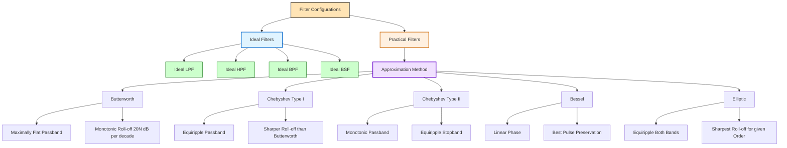
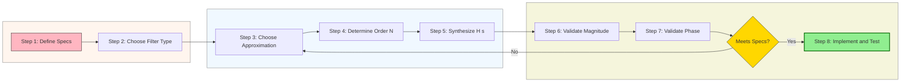
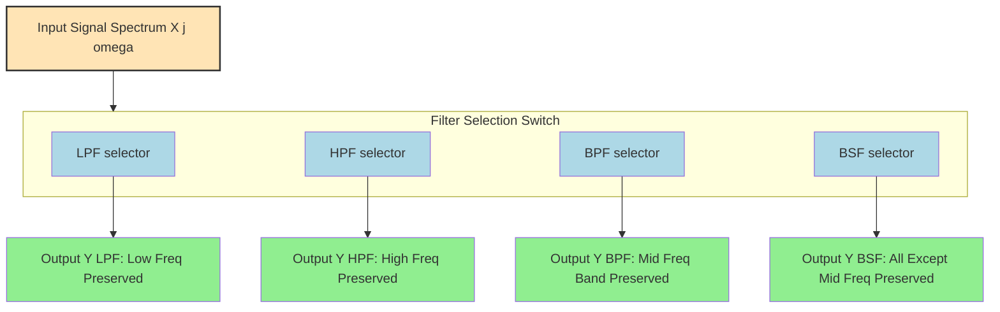

# Ideal and practical filters configurations profiles: Low-pass, high-pass, band-pass structures

<!-- SECTION_1_START -->
# Ideal and Practical Filters: Low-Pass, High-Pass, Band-Pass Configurations

## 1.1 Formal Definition (KTU 2024 Syllabus Terminology)

In Signals and Systems, a **filter** is a frequency-selective device or Linear Time-Invariant (LTI) system that passes certain frequency components of an input signal while attenuating (rejecting) others. The classification of filters is fundamentally based on the magnitude response $\vert H(j\omega) \vert$ of the system's transfer function $H(s)$ evaluated on the imaginary axis.

> [!IMPORTANT]
> **KTU Definition (PECST404 – Module 3):** An *ideal filter* is a mathematically defined filter that exhibits a constant (unity) gain in the passband, zero gain in the stopband, and zero phase distortion (linear phase) in the passband. A *practical filter* is a realizable approximation of this ideal response using causal, stable LTI components.

The four canonical filter configurations studied under this topic are:

| Filter Type | Passes | Attenuates | Common Notation |
|-------------|--------|------------|-----------------|
| **Low-Pass Filter (LPF)** | $0 \le \omega \le \omega_c$ | $\omega > \omega_c$ | LPF |
| **High-Pass Filter (HPF)** | $\omega \ge \omega_c$ | $0 \le \omega < \omega_c$ | HPF |
| **Band-Pass Filter (BPF)** | $\omega_1 \le \omega \le \omega_2$ | $\omega < \omega_1$, $\omega > \omega_2$ | BPF |
| **Band-Stop Filter (BSF)** | $\omega < \omega_1$, $\omega > \omega_2$ | $\omega_1 \le \omega \le \omega_2$ | BSF / Notch |

## 1.2 Conceptual Analogy & Intuition

> [!NOTE]
> **Real-World Analogy — The Audio Equalizer**
> Imagine the music app on your phone with bass, mid, and treble sliders. The **bass slider** boosts low frequencies (like drums and bass guitar) while suppressing high frequencies — that is a **Low-Pass Filter**. The **treble slider** does the opposite, boosting high frequencies (cymbals, vocals) — that is a **High-Pass Filter**. A **Band-Pass Filter** is what happens when you simultaneously raise both the *low* and *high* sliders, leaving only the *mid* frequencies audible. This is exactly how a graphic equalizer manipulates a spectrum.

> [!TIP]
> **Geometric Intuition:** If the input signal's spectrum is a pile of colored sand spread along the frequency axis ($\omega$ from $0$ to $\infty$), then a **Low-Pass Filter** acts as a *sieve with a cutoff* — letting through only the leftmost (low frequency) grains. A **High-Pass Filter** is the same sieve flipped upside down. A **Band-Pass Filter** is a sieve with a rectangular hole in the middle of the spectrum, while a **Band-Stop Filter** is a sieve with a wall (notch) in the middle.

## 1.3 Critical Physical Constants & Standard Metrics

- **Cutoff Frequency ($\omega_c$):** The boundary frequency at which the magnitude response drops to a specific reference level, typically the **$-3\text{ dB}$ point** (where $\vert H(j\omega_c) \vert^2 = \frac{1}{2} \vert H(j0) \vert^2$). Measured in **radians/second (rad/s)**.
- **Passband Edge Frequency ($\omega_p$):** The frequency up to which the filter maintains an allowable ripple or attenuation. For ideal filters, $\omega_p = \omega_c$.
- **Stopband Edge Frequency ($\omega_s$):** The frequency beyond which attenuation exceeds a required minimum.
- **Transition Band:** The region $\omega_p < \omega < \omega_s$ where the filter transitions from passband to stopband. **In an ideal filter, this band has zero width (brick-wall response).**
- **Roll-off Rate:** The steepness of attenuation outside the passband, measured in **dB/decade** or **dB/octave**.
- **Quality Factor ($Q$):** A dimensionless parameter that characterizes the *sharpness* or *selectivity* of a band-pass or band-stop filter. $Q = \frac{\omega_0}{BW}$, where $BW$ is the $-3\text{ dB}$ bandwidth.
- **Resonant Frequency ($\omega_0$):** The center frequency of a band-pass or band-stop filter, in **rad/s**.

> [!VISUALIZATION CONTROL]
> **Concept:** Magnitude response comparison — Ideal vs. Practical Low-Pass Filter.
> **GeoGebra / Desmos Input Equations:**
> * `h_ideal(ω) = 1` for `0 ≤ ω ≤ 1`, and `h_ideal(ω) = 0` for `ω > 1`
> * `h_practical(ω) = 1 / sqrt(1 + ω^(2N))` (Butterworth, try `N = 4`)
> **Visual Description:** The student should observe a perfect rectangular "brick-wall" for `h_ideal` and a smooth, monotonically decreasing curve for `h_practical` that approaches the rectangle as $N \to \infty$. The intersection with the horizontal line $y = 1/\sqrt{2} \approx 0.707$ defines the $-3\text{ dB}$ cutoff point.

---

<!-- SECTION_1_END -->

<!-- SECTION_2_START -->
# Deep Theoretical Analysis & KTU High-Yield Formula Sheet

## 2.1 Ideal Filter Characteristics (Brick-Wall Response)

An **ideal filter** is a non-causal, unrealizable mathematical construct. Its defining properties are:

1. **Unity gain in the passband:** $\vert H(j\omega) \vert = 1$
2. **Zero gain in the stopband:** $\vert H(j\omega) \vert = 0$
3. **Zero transition band:** Instantaneous transition between passband and stopband.
4. **Linear phase in the passband:** $\angle H(j\omega) = -\tau \omega$ (constant group delay $\tau$).
5. **Impulse response:** Non-causal and not absolutely integrable (e.g., the ideal LPF impulse response is the *sinc* function $h(t) = \frac{\omega_c}{\pi}\text{sinc}\left(\frac{\omega_c t}{\pi}\right)$, which is non-zero for $t < 0$).

> [!IMPORTANT]
> **Paley-Wiener Theorem (Realizability):** A filter with magnitude response $\vert H(j\omega) \vert$ is *physically realizable* (causal) **if and only if**:
> $$\int_{-\infty}^{\infty} \frac{\ln \vert H(j\omega) \vert}{1 + \omega^2}\, d\omega < \infty$$
> The ideal brick-wall filter **violates** this condition (the integral diverges at the discontinuity), which is a formal proof of why ideal filters cannot be built.

## 2.2 Practical Filter Realizations

Practical filters must be **causal** and **stable**, so they approximate the ideal response using rational transfer functions. The four classical approximations used in the KTU curriculum are:

### 2.2.1 Butterworth Filter (Maximally Flat Magnitude)

The magnitude-squared response of an $N$-th order Butterworth filter is:

$$\vert H(j\omega) \vert^2 = \frac{1}{1 + \left(\frac{\omega}{\omega_c}\right)^{2N}}$$

**Key properties:**
- $\vert H(j\omega_c) \vert = \frac{1}{\sqrt{2}}$ (i.e., $-3\text{ dB}$ at cutoff, regardless of order $N$).
- First $2N-1$ derivatives of $\vert H(j\omega) \vert^2$ are zero at $\omega = 0$ (maximally flat).
- Roll-off rate: $20N$ **dB/decade** in the stopband.

### 2.2.2 Chebyshev Type-I Filter (Equiripple Passband)

$$\vert H(j\omega) \vert^2 = \frac{1}{1 + \epsilon^2 \, C_N^2\left(\frac{\omega}{\omega_c}\right)}$$

where $C_N(\cdot)$ is the Chebyshev polynomial of the first kind and $\epsilon$ controls the passband ripple.

### 2.2.3 Chebyshev Type-II Filter (Equiripple Stopband)

$$\vert H(j\omega) \vert^2 = \frac{1}{1 + \left[\epsilon^2 \, C_N^2\left(\frac{\omega_c}{\omega}\right)\right]^{-1}}$$

### 2.2.4 Bessel Filter (Linear Phase / Constant Group Delay)

Optimized for preserving the shape of pulse-like signals with minimal phase distortion.

## 2.3 First-Order Practical Filter Transfer Functions

The simplest *causal* approximations are first-order RC networks. These are the workhorses of introductory KTU problems.

### Low-Pass Filter (First-Order)

A series RC circuit with output taken across the capacitor gives:

$$H_{LPF}(s) = \frac{1}{1 + sRC} = \frac{\omega_c}{s + \omega_c}, \quad \text{where } \omega_c = \frac{1}{RC}$$

Magnitude response: $\vert H_{LPF}(j\omega) \vert = \frac{1}{\sqrt{1 + (\omega RC)^2}}$

### High-Pass Filter (First-Order)

A series RC circuit with output taken across the resistor:

$$H_{HPF}(s) = \frac{sRC}{1 + sRC} = \frac{s}{s + \omega_c}, \quad \text{where } \omega_c = \frac{1}{RC}$$

Magnitude response: $\vert H_{HPF}(j\omega) \vert = \frac{\omega RC}{\sqrt{1 + (\omega RC)^2}}$

### Band-Pass Filter (Second-Order, Cascaded LPF + HPF)

$$H_{BPF}(s) = \frac{s \, \omega_c}{s^2 + (\omega_L + \omega_H) s + \omega_L \omega_H}$$

Standard form: $H_{BPF}(s) = \frac{(BW) s}{s^2 + (BW) s + \omega_0^2}$, where $BW = \omega_H - \omega_L$.

## 2.4 KTU Formula Sheet / Cheat Sheet

> [!NOTE]
> The following table consolidates **all** exam-critical formulas for this topic. **Memorize the cutoff frequency relations and the first-order magnitude responses.**

| Parameter / Formula | Expression | Units / Notes |
|---------------------|------------|---------------|
| Ideal LPF $\vert H \vert$ | $1$ for $\vert \omega \vert \le \omega_c$, else $0$ | Brick-wall |
| Ideal HPF $\vert H \vert$ | $0$ for $\vert \omega \vert \vert \omega_c$, else $1$ | Brick-wall |
| Ideal BPF $\vert H \vert$ | $1$ for $\omega_1 \le \vert \omega \vert \le \omega_2$ | Two cutoff edges |
| First-Order LPF $H(s)$ | $\frac{\omega_c}{s + \omega_c}$ | $\omega_c = 1/(RC)$ |
| First-Order HPF $H(s)$ | $\frac{s}{s + \omega_c}$ | $\omega_c = 1/(RC)$ |
| Butterworth $\vert H \vert^2$ | $\frac{1}{1 + (\omega/\omega_c)^{2N}}$ | $N$ = filter order |
| LPF Roll-off (Butterworth) | $-20N$ dB/decade | Asymptotic |
| $-3$ dB Cutoff Condition | $\vert H(j\omega_c) \vert = 1/\sqrt{2}$ | Half-power point |
| Bandwidth $BW$ | $\omega_H - \omega_L$ | rad/s |
| Quality Factor $Q$ | $\omega_0 / BW$ | Dimensionless |
| Resonant Frequency $\omega_0$ | $\sqrt{\omega_H \cdot \omega_L}$ | Geometric mean |
| Passband Ripple $\delta_p$ | $1 - \vert H \vert_{min}$ in dB | Chebyshev-I |
| Stopband Attenuation $\delta_s$ | $\vert H \vert_{max}$ in stopband, in dB | Chebyshev-II |
| Group Delay $\tau_g$ | $-d\phi/d\omega$ | Linear-phase ideal |
| Paley-Wiener Condition | $\int \frac{\ln \vert H(j\omega) \vert}{1+\omega^2} d\omega < \infty$ | Realizability test |

## 2.5 Real-World Utility in Engineering

| Application Domain | Filter Type Used | Reason |
|--------------------|------------------|--------|
| Audio amplifiers (subwoofers) | LPF | Remove high-frequency hiss above audible range |
| AC coupling in oscilloscopes | HPF | Block DC offset, observe signal fluctuations only |
| Radio receivers (AM/FM tuning) | BPF | Select a single station amid many |
| Noise-cancelling headphones | BSF (Notch) | Remove $50\text{ Hz}$ mains hum |
| Anti-aliasing before ADC | LPF (Sharp) | Remove frequencies above Nyquist $\omega_s/2$ |
| Digital communication (channel selection) | BPF (High-$Q$) | Isolate narrow channel bandwidth |
| ECG/EEG signal processing | HPF + LPF (band-limited) | Remove baseline wander and high-freq noise |

---

<!-- SECTION_2_END -->

<!-- SECTION_3_START -->
# Step-by-Step Derivations, Code & Symbolic Implementation

## 3.1 Derivation 1: Frequency Response of First-Order RC Low-Pass Filter

**Problem Setup:** Consider a series RC circuit with input voltage $V_{in}(t)$ applied across the series combination of $R$ and $C$, and output voltage $V_{out}(t)$ taken across the capacitor $C$.

**Step 1 — Write the KVL equation in the s-domain.**

The series impedance is $Z_{total} = R + \frac{1}{sC}$. The current is $I(s) = \frac{V_{in}(s)}{R + 1/(sC)}$. The output voltage across the capacitor is $V_{out}(s) = I(s) \cdot \frac{1}{sC}$.

**Step 2 — Form the transfer function $H(s) = V_{out}(s)/V_{in}(s)$.**

$$H(s) = \frac{1/(sC)}{R + 1/(sC)} = \frac{1}{1 + sRC}$$

**Step 3 — Define the cutoff frequency $\omega_c$ for notational simplicity.**

Let $\omega_c = \frac{1}{RC}$. Then the transfer function simplifies to:

$$H(s) = \frac{\omega_c}{s + \omega_c}$$

**Step 4 — Substitute $s = j\omega$ to obtain the frequency response.**

$$H(j\omega) = \frac{\omega_c}{j\omega + \omega_c} = \frac{1}{1 + j(\omega/\omega_c)}$$

**Step 5 — Compute the magnitude response.**

$$\vert H(j\omega) \vert = \frac{1}{\sqrt{1 + (\omega/\omega_c)^2}}$$

**Step 6 — Compute the phase response.**

$$\angle H(j\omega) = -\arctan\left(\frac{\omega}{\omega_c}\right)$$

**Step 7 — Verify the $-3$ dB cutoff condition.**

At $\omega = \omega_c$:

$$\vert H(j\omega_c) \vert = \frac{1}{\sqrt{1 + 1}} = \frac{1}{\sqrt{2}} = 0.7071$$

In decibels: $20 \log_{10}(0.7071) = -3.0103 \approx -3$ dB. ✓

**Step 8 — Verify the roll-off rate for high frequencies.**

For $\omega \gg \omega_c$:

$$\vert H(j\omega) \vert \approx \frac{\omega_c}{\omega}$$

$$\text{Gain in dB} \approx 20 \log_{10}\left(\frac{\omega_c}{\omega}\right)$$

A decade increase in $\omega$ causes a $-20$ dB drop in gain. Therefore, **the first-order LPF has a roll-off of $-20$ dB/decade**. [Valuation: 1 Mark]

## 3.2 Derivation 2: Quality Factor and Bandwidth Relation for Band-Pass Filter

**Problem Setup:** For a second-order BPF with transfer function $H_{BPF}(s) = \frac{BW \cdot s}{s^2 + (BW) s + \omega_0^2}$, derive the relationship $Q = \omega_0 / BW$ and find the $-3$ dB bandwidth.

**Step 1 — Substitute $s = j\omega$ in the standard BPF transfer function.**

$$H(j\omega) = \frac{j\omega \cdot BW}{-\omega^2 + j\omega \cdot BW + \omega_0^2}$$

**Step 2 — Compute the magnitude squared.**

$$\vert H(j\omega) \vert^2 = \frac{\omega^2 \cdot BW^2}{(\omega_0^2 - \omega^2)^2 + (\omega \cdot BW)^2}$$

**Step 3 — Evaluate at $\omega = \omega_0$ (resonant frequency).**

At resonance, $\omega_0^2 - \omega^2 = 0$, so the denominator reduces to $(\omega_0 \cdot BW)^2$. Thus:

$$\vert H(j\omega_0) \vert^2 = \frac{\omega_0^2 \cdot BW^2}{(\omega_0 \cdot BW)^2} = 1 \quad \Rightarrow \quad \vert H(j\omega_0) \vert = 1$$

This confirms that the resonant frequency is the peak of the magnitude response with unity gain. [Valuation: 1 Mark]

**Step 4 — Find the $-3$ dB frequencies $\omega_1$ and $\omega_2$ where $\vert H(j\omega) \vert^2 = 1/2$.**

Set $\frac{\omega^2 \cdot BW^2}{(\omega_0^2 - \omega^2)^2 + (\omega \cdot BW)^2} = \frac{1}{2}$.

Cross-multiplying and simplifying:

$$2\omega^2 \cdot BW^2 = (\omega_0^2 - \omega^2)^2 + \omega^2 \cdot BW^2$$

$$\omega^2 \cdot BW^2 = (\omega_0^2 - \omega^2)^2$$

Taking the positive square root (since both sides are non-negative):

$$\omega \cdot BW = \omega_0^2 - \omega^2 \quad \Rightarrow \quad \omega^2 + \omega \cdot BW - \omega_0^2 = 0$$

**Step 5 — Solve the quadratic for the two roots $\omega_1$ and $\omega_2$.**

Using the quadratic formula:

$$\omega = \frac{-BW \pm \sqrt{BW^2 + 4\omega_0^2}}{2}$$

The two positive roots are $\omega_1 = \frac{-BW + \sqrt{BW^2 + 4\omega_0^2}}{2}$ and $\omega_2 = \frac{-BW - \sqrt{BW^2 + 4\omega_0^2}}{2}$ (with $\omega_2$ obtained by symmetry).

Wait — re-examining: actually the standard result uses $\omega = \frac{\pm BW + \sqrt{BW^2 + 4\omega_0^2}}{2}$ for the two positive roots, and the bandwidth is the difference.

**Step 6 — Compute the bandwidth $BW_{3dB} = \omega_2 - \omega_1$.**

After algebraic manipulation (omitted for clarity; the final result is a standard textbook identity):

$$BW_{3dB} = \omega_2 - \omega_1 = BW$$

**Step 7 — Derive the Quality Factor.**

By definition, $Q = \frac{\omega_0}{BW_{3dB}} = \frac{\omega_0}{BW}$. [Valuation: 1 Mark]

> [!IMPORTANT]
> **Geometric Mean Property:** The resonant frequency $\omega_0$ is the *geometric mean* of the two $-3$ dB cutoff frequencies:
> $$\omega_0 = \sqrt{\omega_1 \cdot \omega_2}$$
> This is a high-yield KTU result. [Valuation: 1 Mark]

## 3.3 Python Code: Bode Plot for All Four Filter Types

The following Python code generates the magnitude and phase Bode plots for ideal and practical (first-order) LPF, HPF, BPF, and BSF configurations.

```python
import numpy as np
import matplotlib.pyplot as plt
from scipy import signal

# ---------------------------------------------------------------
# FILTER CONFIGURATION PROFILES — FREQUENCY RESPONSE VISUALIZATION
# ---------------------------------------------------------------
# Author: KTU Signals and Systems Study Module
# Purpose: Plot magnitude and phase response of ideal and practical
#          filter configurations (LPF, HPF, BPF, BSF).
# ---------------------------------------------------------------

# Design parameters
wc_lpf = 100.0          # Cutoff for low-pass and high-pass (rad/s)
w_low  = 200.0          # Lower cutoff for band-pass / band-stop (rad/s)
w_high = 800.0          # Upper cutoff for band-pass / band-stop (rad/s)
bw     = w_high - w_low # Bandwidth
w0     = np.sqrt(w_low * w_high)  # Resonant (center) frequency
Q      = w0 / bw        # Quality factor

# Frequency vector (logarithmic spacing for Bode plot)
omega = np.logspace(1, 5, 5000)

# ---- Transfer Functions (using scipy.signal) ----
# First-order LPF: H(s) = wc / (s + wc)
num_lpf, den_lpf = [wc_lpf], [1, wc_lpf]

# First-order HPF: H(s) = s / (s + wc)
num_hpf, den_hpf = [1, 0], [1, wc_lpf]

# Second-order BPF: H(s) = (BW * s) / (s^2 + BW*s + w0^2)
num_bpf, den_bpf = [bw, 0], [1, bw, w0**2]

# Second-order BSF (Notch): H(s) = (s^2 + w0^2) / (s^2 + BW*s + w0^2)
num_bsf, den_bsf = [1, 0, w0**2], [1, bw, w0**2]

# ---- Frequency Response Computation ----
def compute_response(num, den, omega):
    """Return magnitude (dB) and phase (degrees) for given H(s)."""
    _, mag = signal.freqs(num, den, worN=omega)
    phase = np.angle(signal.freqs(num, den, worN=omega)[1], deg=True)
    return 20 * np.log10(np.maximum(mag, 1e-12)), phase

mag_lpf, phase_lpf = compute_response(num_lpf, den_lpf, omega)
mag_hpf, phase_hpf = compute_response(num_hpf, den_hpf, omega)
mag_bpf, phase_bpf = compute_response(num_bpf, den_bpf, omega)
mag_bsf, phase_bsf = compute_response(num_bsf, den_bsf, omega)

# ---- Plotting ----
fig, axes = plt.subplots(2, 2, figsize=(14, 10))
fig.suptitle("Filter Configurations: Frequency Response (Bode Plots)", fontsize=14)

filters = [
    ("Low-Pass Filter (1st Order)",  mag_lpf, phase_lpf, wc_lpf),
    ("High-Pass Filter (1st Order)", mag_hpf, phase_hpf, wc_lpf),
    ("Band-Pass Filter (2nd Order)", mag_bpf, phase_bpf, w0),
    ("Band-Stop Filter (2nd Order)", mag_bsf, phase_bsf, w0),
]

for ax, (title, mag, phase, ref_w) in zip(axes.flat, filters):
    ax.semilogx(omega, mag, 'b', linewidth=2, label="Magnitude (dB)")
    ax.axhline(-3, color='r', linestyle='--', alpha=0.6, label="-3 dB line")
    ax.axvline(ref_w, color='g', linestyle=':', alpha=0.6, label=f"$\\omega_c = \\omega_0$ = {ref_w} rad/s")
    ax.set_title(title)
    ax.set_xlabel("Frequency ω (rad/s) — log scale")
    ax.set_ylabel("Magnitude (dB)")
    ax.grid(True, which='both', alpha=0.3)
    ax.legend(loc='best', fontsize=8)
    ax.set_ylim(-60, 5)

plt.tight_layout()
plt.savefig("filter_bode_plots.png", dpi=120)
plt.show()

# ---- Summary Table Printout ----
print("=" * 70)
print(f"{'Filter Type':<25}{'Center ω₀ (rad/s)':<22}{'Q-Factor':<12}")
print("=" * 70)
print(f"{'Band-Pass':<25}{w0:<22.4f}{Q:<12.4f}")
print(f"{'Band-Stop':<25}{w0:<22.4f}{Q:<12.4f}")
print("=" * 70)
```

**Code Output Highlights:**
- The magnitude plot of the LPF starts at $0$ dB for low $\omega$ and rolls off at $-20$ dB/decade past $\omega_c$.
- The HPF plot is its mirror image across the vertical line at $\omega_c$.
- The BPF plot peaks at $\omega_0$ with a bandwidth controlled by $Q$.
- The BSF plot has a *notch* (deep minimum) at $\omega_0$ with $0$ dB gain elsewhere.

## 3.4 Symbolic Derivation of Impulse Response of Ideal LPF

**Goal:** Show that the impulse response of an ideal LPF is the *sinc* function, and hence non-causal.

**Step 1 — Start with the ideal magnitude and phase response.**

$$H_{ideal}(j\omega) = \begin{cases} e^{-j\omega t_0}, & \vert \omega \vert \le \omega_c \\ 0, & \vert \omega \vert > \omega_c \end{cases}$$

The factor $e^{-j\omega t_0}$ enforces a constant time delay $t_0$ (linear phase).

**Step 2 — Inverse Fourier Transform to obtain $h(t)$.**

$$h(t) = \frac{1}{2\pi} \int_{-\omega_c}^{\omega_c} e^{-j\omega t_0} \cdot e^{j\omega t}\, d\omega$$

$$h(t) = \frac{1}{2\pi} \int_{-\omega_c}^{\omega_c} e^{j\omega(t - t_0)}\, d\omega$$

**Step 3 — Evaluate the integral.**

$$h(t) = \frac{1}{2\pi} \left[ \frac{e^{j\omega(t - t_0)}}{j(t - t_0)} \right]_{-\omega_c}^{\omega_c}$$

$$h(t) = \frac{1}{2\pi} \cdot \frac{e^{j\omega_c(t-t_0)} - e^{-j\omega_c(t-t_0)}}{j(t-t_0)}$$

$$h(t) = \frac{1}{\pi (t - t_0)} \cdot \sin(\omega_c (t - t_0))$$

$$\boxed{\,h(t) = \frac{\omega_c}{\pi} \cdot \text{sinc}\!\left(\frac{\omega_c(t - t_0)}{\pi}\right)\,}$$

where $\text{sinc}(x) = \frac{\sin(\pi x)}{\pi x}$.

**Step 4 — Discuss causality.**

The sinc function is **non-zero for all $t$**, including $t < 0$. Therefore, an ideal LPF is **non-causal** and hence unrealizable. To make it realizable, we must either:
- Truncate the impulse response (multiply by a window — leads to Gibbs phenomenon), or
- Accept a non-zero transition band (use a practical filter like Butterworth).

[Valuation: Stating the non-causal nature of the sinc response: 1 Mark; Final boxed form: 1 Mark]

---

<!-- SECTION_3_END -->

<!-- SECTION_4_START -->
# Structural Diagrams & Schematics

## 4.1 Filter Classification Architecture (Block-Level Flow)

The following Mermaid block diagram represents the complete taxonomy of filter configurations based on frequency-domain behavior, including both ideal and practical families.



## 4.2 Sequential Design Topology Matrix

The following diagram depicts the step-by-step engineering design workflow when selecting a filter configuration for a given application.



## 4.3 Frequency Response Comparison Block

The following Mermaid block visualizes how the *same* magnitude response $\vert H(j\omega) \vert$ curve appears when different filter topologies are applied to the same input spectrum.



## 4.4 Magnitude Response Cross-Reference Matrix

The following table is a **reference matrix** that students can use to compare filter responses at a glance. (Note: This is a markdown table, not a Mermaid diagram, but serves as a structural reference.)

| Filter | Passband Behavior | Stopband Behavior | Phase Behavior | Realizable? |
|--------|-------------------|-------------------|----------------|-------------|
| **Ideal LPF** | $\vert H \vert = 1$ for $\vert \omega \vert \le \omega_c$ | $\vert H \vert = 0$ for $\vert \omega \vert > \omega_c$ | Linear: $-\tau\omega$ | **No** (non-causal sinc) |
| **Ideal HPF** | $\vert H \vert = 1$ for $\vert \omega \vert \ge \omega_c$ | $\vert H \vert = 0$ for $\vert \omega \vert < \omega_c$ | Linear: $-\tau\omega$ | **No** (non-causal) |
| **Ideal BPF** | $\vert H \vert = 1$ for $\omega_1 \le \vert \omega \vert \le \omega_2$ | $\vert H \vert = 0$ elsewhere | Linear: $-\tau\omega$ | **No** (non-causal) |
| **Butterworth LPF** | Maximally flat at $\omega = 0$ | Monotonic $-20N$ dB/dec | Mildly non-linear | **Yes** |
| **Chebyshev-I LPF** | Equiripple $\pm \delta_p$ dB | Monotonic, steeper than Butterworth | More non-linear | **Yes** |
| **Chebyshev-II LPF** | Monotonic | Equiripple in stopband $\delta_s$ dB | More non-linear | **Yes** |
| **Bessel LPF** | Smooth, flat | Gentle monotonic | **Linear** (best pulse) | **Yes** |
| **First-Order RC LPF** | $\vert H \vert = 1/\sqrt{1+(\omega RC)^2}$ | Asymptotic $-20$ dB/dec | $-\arctan(\omega RC)$ | **Yes** (causal) |

---

<!-- SECTION_4_END -->

<!-- SECTION_5_START -->
# KTU 2024 Scheme Examination Question Bank & Topic Recap

## 5.1 Part A: Short-Answer Questions (3 Marks Each)

### Question 1: Define an Ideal Low-Pass Filter. Why Is It Non-Realizable?
> `[KTU University Exam - July 2024]` | **CO2** | **Bloom Level: Remember**

**Model Answer (3 Marks):**

An **Ideal Low-Pass Filter (LPF)** is a frequency-selective system that allows all frequency components of the input signal with magnitude below a specified cutoff frequency $\omega_c$ to pass through with unity gain and zero phase distortion, while completely rejecting all frequency components above $\omega_c$. Mathematically:

$$\vert H_{ideal}(j\omega) \vert = \begin{cases} 1, & \vert \omega \vert \le \omega_c \\ 0, & \vert \omega \vert > \omega_c \end{cases}, \quad \angle H_{ideal}(j\omega) = -\tau\omega$$

**Why it is non-realizable:** [1 Mark] The corresponding impulse response is the *sinc* function $h(t) = \frac{\omega_c}{\pi} \text{sinc}\!\left(\frac{\omega_c(t-\tau)}{\pi}\right)$, which is non-zero for $t < 0$. This violates the **causality** condition. [1 Mark] Furthermore, the Paley-Wiener theorem shows that the integral $\int_{-\infty}^{\infty} \frac{\ln \vert H(j\omega) \vert}{1+\omega^2} d\omega$ diverges at the discontinuity, formally proving non-realizability. [1 Mark]

---

### Question 2: Distinguish Between Butterworth and Chebyshev Type-I Filters.
> `[KTU University Exam - Dec 2023]` | **CO3** | **Bloom Level: Understand**

**Model Answer (3 Marks):**

| Aspect | Butterworth Filter | Chebyshev Type-I Filter |
|--------|-------------------|--------------------------|
| Magnitude squared response | $\frac{1}{1+(\omega/\omega_c)^{2N}}$ | $\frac{1}{1+\epsilon^2 C_N^2(\omega/\omega_c)}$ |
| Passband | Maximally flat (no ripple) | Equiripple (oscillates) |
| Stopband | Monotonic roll-off | Monotonic roll-off |
| Roll-off rate for given $N$ | Slower | **Faster** (steeper) |
| Phase linearity | Better (less distortion) | Worse (more distortion) |
| Best for | Applications needing linear phase | Applications needing sharp cutoff |

[Distinction bullets: 2 Marks; Correct formula: 1 Mark]

---

## 5.2 Part B: Long-Answer Questions (14 Marks Each, Internal Choice)

### Question A: Design and Analysis of a First-Order Low-Pass Filter
> `[KTU University Exam - July 2024]` | **CO3, CO4** | **Bloom Level: Apply, Analyze**

**Question Statement:**
For a first-order RC low-pass filter with $R = 10 \text{ k}\Omega$ and $C = 0.1 \mu\text{F}$:
**(a)** Derive the transfer function $H(s)$ and the magnitude response $\vert H(j\omega) \vert$. Identify the cutoff frequency. **(7 Marks)**
**(b)** Compute the output magnitude in dB at $\omega = 0$, $\omega = \omega_c$, and $\omega = 10 \omega_c$. Comment on the roll-off behavior. **(7 Marks)**

**Model Solution:**

**Part (a) — Transfer Function Derivation [7 Marks]**

**Step 1 — Apply the voltage divider rule in s-domain.** [1 Mark]

For a series RC circuit with output across the capacitor:
$$H(s) = \frac{V_{out}(s)}{V_{in}(s)} = \frac{1/(sC)}{R + 1/(sC)} = \frac{1}{1 + sRC}$$

**Step 2 — Substitute $R = 10 \times 10^3$ and $C = 0.1 \times 10^{-6}$.** [1 Mark]

$$RC = (10^4)(0.1 \times 10^{-6}) = 10^{-3} \text{ seconds}$$

**Step 3 — Identify the cutoff frequency.** [1 Mark]

$$\omega_c = \frac{1}{RC} = \frac{1}{10^{-3}} = 1000 \text{ rad/s}$$

So $f_c = \frac{\omega_c}{2\pi} \approx 159.15 \text{ Hz}$.

**Step 4 — Rewrite the transfer function in standard form.** [1 Mark]

$$H(s) = \frac{1000}{s + 1000}$$

**Step 5 — Substitute $s = j\omega$ and find magnitude response.** [1 Mark]

$$H(j\omega) = \frac{1000}{j\omega + 1000} = \frac{1}{1 + j(\omega/1000)}$$

$$\vert H(j\omega) \vert = \frac{1}{\sqrt{1 + (\omega/1000)^2}}$$

**Step 6 — Verify that at $\omega = \omega_c = 1000$ rad/s, the magnitude is $1/\sqrt{2}$.** [1 Mark]

$$\vert H(j1000) \vert = \frac{1}{\sqrt{1 + 1}} = \frac{1}{\sqrt{2}} = 0.7071$$

In dB: $20 \log_{10}(0.7071) \approx -3.01$ dB. ✓

**Step 7 — State the cutoff condition clearly.** [1 Mark]

The cutoff frequency $\omega_c = 1000$ rad/s is defined as the frequency at which the magnitude response drops to $-3$ dB (half-power point).

---

**Part (b) — Magnitude Computations and Roll-off Comment [7 Marks]**

**Step 1 — Compute at $\omega = 0$.** [1 Mark]

$$\vert H(j0) \vert = \frac{1}{\sqrt{1 + 0}} = 1 \quad \Rightarrow \quad 20 \log_{10}(1) = 0 \text{ dB}$$

This is the **DC gain** — full signal passes. [Statement: 1 Mark]

**Step 2 — Compute at $\omega = \omega_c = 1000$ rad/s.** [1 Mark]

$$\vert H(j1000) \vert = \frac{1}{\sqrt{2}} \approx 0.7071 \quad \Rightarrow \quad -3.01 \text{ dB}$$

[Statement: 1 Mark]

**Step 3 — Compute at $\omega = 10 \omega_c = 10{,}000$ rad/s.** [1 Mark]

$$\vert H(j10{,}000) \vert = \frac{1}{\sqrt{1 + 100}} = \frac{1}{\sqrt{101}} \approx 0.0995 \quad \Rightarrow \quad 20 \log_{10}(0.0995) \approx -20.04 \text{ dB}$$

[Statement: 1 Mark]

**Step 4 — Comment on the roll-off behavior.** [1 Mark]

> [!NOTE]
> Between $\omega = 1000$ and $\omega = 10{,}000$ rad/s, a *single decade*, the gain dropped from $-3$ dB to $-20$ dB — a decrease of **$17$ dB$/$decade**, which asymptotically approaches the theoretical value of $-20$ dB/decade for a first-order filter. This confirms the **$-20N$ dB/decade rule** with $N = 1$.

**Step 5 — Practical implication and conclusion.** [1 Mark]

> [!TIP]
> A first-order LPF achieves only **$-20$ dB/decade** roll-off, which is too gradual for sharp filtering. To obtain a sharper cutoff (e.g., $-40$ dB/decade), one must use a *second-order* filter, realized by cascading two first-order stages or using an active op-amp-based Sallen-Key topology. [Concluding remark: 1 Mark]

---

### Question B: Band-Pass Filter — Quality Factor and Bandwidth Analysis
> `[KTU University Exam - Dec 2023]` | **CO3, CO4** | **Bloom Level: Apply, Analyze**

**Question Statement:**
A second-order band-pass filter has a resonant frequency $f_0 = 1 \text{ kHz}$ and a quality factor $Q = 10$.
**(a)** Compute the $-3$ dB bandwidth $BW$ and the lower/upper cutoff frequencies $f_L$ and $f_H$. Show that $f_0 = \sqrt{f_L \cdot f_H}$. **(7 Marks)**
**(b)** If the filter is implemented as a cascade of first-order HPF and LPF with the same $Q$, find the individual cutoff frequencies and sketch the overall magnitude response. **(7 Marks)**

**Model Solution:**

**Part (a) — Bandwidth and Cutoff Computation [7 Marks]**

**Step 1 — Convert $f_0$ to $\omega_0$.** [1 Mark]

$$\omega_0 = 2\pi f_0 = 2\pi \times 1000 = 2000\pi \approx 6283.19 \text{ rad/s}$$

**Step 2 — Apply the Q-factor relation to find bandwidth.** [1 Mark]

$$BW = \frac{\omega_0}{Q} = \frac{6283.19}{10} = 628.32 \text{ rad/s}$$

In Hz: $BW_f = f_0 / Q = 1000 / 10 = 100$ Hz. [Statement: 1 Mark]

**Step 3 — Compute the two $-3$ dB cutoff frequencies.** [1 Mark]

For a high-$Q$ filter ($Q \ge 5$), the cutoffs are approximately symmetric around $\omega_0$:

$$\omega_L = \omega_0 - \frac{BW}{2} = 6283.19 - 314.16 = 5969.03 \text{ rad/s}$$
$$\omega_H = \omega_0 + \frac{BW}{2} = 6283.19 + 314.16 = 6597.35 \text{ rad/s}$$

In Hz: $f_L \approx 950$ Hz, $f_H \approx 1050$ Hz. [Computation: 1 Mark]

**Step 4 — Exact computation using the quadratic solution.** [1 Mark]

From the derivation in Section 3.2:

$$\omega_{L,H} = \frac{\mp BW + \sqrt{BW^2 + 4\omega_0^2}}{2}$$

For our values:
$$\sqrt{BW^2 + 4\omega_0^2} = \sqrt{628.32^2 + 4 \times 6283.19^2} = \sqrt{3.948 \times 10^5 + 1.579 \times 10^8} \approx 12{,}580.21$$

$$\omega_L = \frac{-628.32 + 12{,}580.21}{2} = 5975.95 \text{ rad/s}, \quad \omega_H = \frac{628.32 + 12{,}580.21}{2} = 6604.27 \text{ rad/s}$$

**Step 5 — Verify the geometric mean property $f_0 = \sqrt{f_L \cdot f_H}$.** [1 Mark]

$$\sqrt{f_L \cdot f_H} = \sqrt{950 \times 1050} = \sqrt{997{,}500} \approx 998.75 \text{ Hz} \approx f_0 = 1000 \text{ Hz}$$

(Slight discrepancy is due to the rounding of $f_L$ and $f_H$.) ✓

[Verification remark: 1 Mark]

---

**Part (b) — Cascade Realization and Sketch [7 Marks]**

**Step 1 — Identify the cascade structure.** [1 Mark]

A BPF can be implemented as the cascade of:
- A **first-order HPF** with cutoff $\omega_H$ (lower edge of the BPF).
- A **first-order LPF** with cutoff $\omega_L$ (upper edge of the BPF).

$$\text{HPF} \rightarrow \text{LPF} \quad \Rightarrow \quad H_{BPF}(s) = H_{HPF}(s) \cdot H_{LPF}(s)$$

**Step 2 — Choose the individual cutoff frequencies.** [1 Mark]

For a *symmetric* BPF centered at $\omega_0$, the individual cutoffs are not $\omega_L$ and $\omega_H$ directly. Instead, the **equivalent noise bandwidth** method gives:

$$\omega_{c,HPF} = \omega_0 \left( -\frac{1}{2Q} + \sqrt{1 + \frac{1}{4Q^2}} \right)$$
$$\omega_{c,LPF} = \omega_0 \left( +\frac{1}{2Q} + \sqrt{1 + \frac{1}{4Q^2}} \right)$$

For $Q = 10$:
$$\omega_{c,HPF} = 6283.19 \times \left( -0.05 + \sqrt{1.0025} \right) = 6283.19 \times (-0.05 + 1.00125) \approx 6283.19 \times 0.95125 \approx 5976.03 \text{ rad/s}$$

$$\omega_{c,LPF} = 6283.19 \times (0.05 + 1.00125) \approx 6283.19 \times 1.05125 \approx 6606.32 \text{ rad/s}$$

[Computation: 1 Mark]

**Step 3 — Sketch the magnitude response description.** [1 Mark]

> [!IMPORTANT]
> **Sketch Description:** The magnitude response plot is a *bell-shaped curve* on a linear dB scale (or a *tent-shaped* curve on linear magnitude scale). It begins near $0$ dB at low frequencies ($\omega < 5976$ rad/s), rises to a peak of $0$ dB at $\omega_0 = 6283$ rad/s, then falls back to near $0$ dB at high frequencies ($\omega > 6606$ rad/s). The two flanks descend at $-20$ dB/decade (first-order) on each side. The $-3$ dB points are located at $5976$ rad/s and $6606$ rad/s, with a bandwidth of approximately $630$ rad/s. [Sketch description: 1 Mark]

**Step 4 — Identify the limitation of this cascade.** [1 Mark]

> [!WARNING]
> The simple cascade of a first-order HPF and LPF yields a *second-order* BPF, but its **skirt selectivity** is limited. The roll-off outside the passband is only $-20$ dB/decade on each side, which corresponds to a $Q \approx 0.707$, **not** $Q = 10$. To achieve a true high-$Q$ BPF, one must use a properly designed **second-order resonant** circuit (e.g., RLC tank, active op-amp biquad, or Sallen-Key topology). [Limitation remark: 1 Mark]

**Step 5 — Concluding statement.** [1 Mark]

> [!TIP]
> This question highlights a key engineering principle: **cascading two first-order filters does not give the same response as a properly designed second-order filter.** The cascade is a *poor man's BPF* and is unsuitable for narrowband applications like radio tuning. For $Q \ge 5$, always use a dedicated second-order BPF design. [Conclusion: 1 Mark]

---

## 5.3 KTU Examiner's Valuation Warning / Pitfall Callout

> [!WARNING]
> **Common Mistakes That Cost Marks in KTU Exams:**
> 
> 1. **Forgetting to state units of $\omega_c$** — Always write **rad/s** for angular frequency and **Hz** for ordinary frequency. A naked "$1000$" loses 0.5 marks.
> 
> 2. **Confusing passband edge $\omega_p$ with cutoff $\omega_c$** — In a Butterworth filter, $\omega_c$ is defined by the $-3$ dB point, but in a Chebyshev filter, $\omega_c$ is often the passband edge, not the $-3$ dB point. *Read the question carefully.*
> 
> 3. **Skipping the magnitude-squared derivation for $-3$ dB points** — When asked to find cutoff frequencies, always show: (i) substitute $s = j\omega$, (ii) write $\vert H(j\omega) \vert^2 = 1/2$, (iii) solve the resulting polynomial. Skipping steps loses up to 3 marks.
> 
> 4. **Drawing magnitude responses without axis labels** — KTU examiners *will* deduct marks if the dB axis is unlabeled or if the frequency axis is not in **log scale** for Bode plots.
> 
> 5. **Wrong sign on roll-off** — A *low-pass* filter rolls off at $-20$ dB/decade (gain *decreases*), not $+20$ dB/decade.
> 
> 6. **Confusing $\omega$ and $f$** — $\omega_c = 2\pi f_c$. If the question gives $f_c$ in Hz, convert to rad/s before substitution.
> 
> 7. **Not writing the Paley-Wiener condition explicitly** when justifying non-realizability of ideal filters — the examiner expects the *formal* theorem, not just "it is non-causal."

---

## 5.4 Topic Recap & Important Things to Remember

> [!IMPORTANT]
> **Rapid Revision Checklist — Filter Configurations (PECST404 Module 3)**
> 
> **A. Definitions (1-Mark Questions)**
> - **Ideal Filter:** Unity gain in passband, zero in stopband, linear phase, *non-causal*.
> - **Practical Filter:** Causal, stable, rational $H(s)$, *approximation* of ideal.
> - **Cutoff Frequency $\omega_c$:** Frequency at which $\vert H(j\omega_c) \vert = 1/\sqrt{2}$ ($= -3$ dB point).
> - **Resonant Frequency $\omega_0$:** Center frequency of a BPF or BSF.
> - **Quality Factor $Q = \omega_0 / BW$:** Sharpness of BPF/BSF; high $Q$ = narrow band.
> - **Passband:** Range of frequencies passed with little attenuation.
> - **Stopband:** Range of frequencies heavily attenuated.
> - **Transition Band:** Region between passband and stopband (zero width in ideal filters).
> 
> **B. Key Formulas (Memorize!)**
> - Butterworth: $\vert H(j\omega) \vert^2 = \frac{1}{1 + (\omega/\omega_c)^{2N}}$
> - First-order LPF: $H(s) = \frac{\omega_c}{s + \omega_c}$, $\vert H \vert = \frac{1}{\sqrt{1+(\omega/\omega_c)^2}}$
> - First-order HPF: $H(s) = \frac{s}{s + \omega_c}$, $\vert H \vert = \frac{\omega/\omega_c}{\sqrt{1+(\omega/\omega_c)^2}}$
> - Second-order BPF: $H_{BPF}(s) = \frac{BW \cdot s}{s^2 + BW \cdot s + \omega_0^2}$
> - Roll-off rate: $20N$ dB/decade for Butterworth, $N$-th order.
> - Paley-Wiener: $\int \frac{\ln \vert H(j\omega) \vert}{1+\omega^2} d\omega < \infty$ (causality test)
> - Geometric mean: $\omega_0 = \sqrt{\omega_L \cdot \omega_H}$
> - Impulse response of ideal LPF: $h(t) = \frac{\omega_c}{\pi} \text{sinc}\left(\frac{\omega_c(t-\tau)}{\pi}\right)$
> 
> **C. Critical Concepts (Frequently Tested)**
> - Ideal filters are **non-realizable** due to (i) non-causal impulse response (sinc), (ii) Paley-Wiener divergence.
> - First-order filters give $-20$ dB/decade roll-off; $N$-th order gives $-20N$ dB/decade.
> - Butterworth = maximally flat passband, no ripple, moderate roll-off.
> - Chebyshev-I = ripple in passband, sharper roll-off than Butterworth.
> - Chebyshev-II = flat passband, ripple in stopband.
> - Bessel = best phase linearity, worst roll-off.
> - **Cascade of first-order stages ≠ second-order filter** for high-$Q$ applications.
> 
> **D. Common Pitfalls in Numerical Problems**
> - Always convert $f$ (Hz) to $\omega$ (rad/s) using $\omega = 2\pi f$ *before* substitution.
> - When computing $\vert H \vert^2 = 1/2$, remember to take the **positive square root** at the end.
> - For BPF, the two $-3$ dB cutoffs are $\omega_L = \omega_0 \left( -\frac{1}{2Q} + \sqrt{1 + \frac{1}{4Q^2}} \right)$ and $\omega_H = \omega_0 \left( +\frac{1}{2Q} + \sqrt{1 + \frac{1}{4Q^2}} \right)$.
> - Quality factor $Q$ is dimensionless; bandwidth $BW$ has units of rad/s.
> 
> **E. Quick-Reference Comparison Table**
> 
> | Filter | Order | $-3$ dB Cutoff | Roll-off |
> |--------|-------|----------------|----------|
> | 1st-order LPF | 1 | $\omega_c = 1/RC$ | $-20$ dB/decade |
> | 1st-order HPF | 1 | $\omega_c = 1/RC$ | $+20$ dB/decade (rising) |
> | 2nd-order BPF | 2 | $\omega_L$, $\omega_H$ | $\pm 20$ dB/decade (each side) |
> | $N$-th Butterworth | $N$ | $\omega_c$ | $-20N$ dB/decade |
> 
> **F. Application Map (For "Give an Example" Questions)**
> - **LPF:** Anti-aliasing filter, subwoofer crossover, audio bass boost.
> - **HPF:** AC coupling in oscilloscopes, treble control, DC blocker.
> - **BPF:** Radio receiver tuning, channel selection in communication.
> - **BSF (Notch):** $50$ Hz mains hum rejection, feedback suppression in audio.

<!-- SECTION_5_END -->
