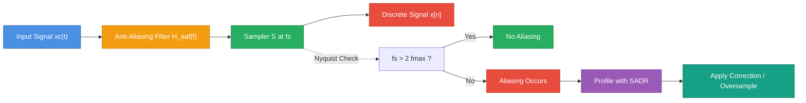
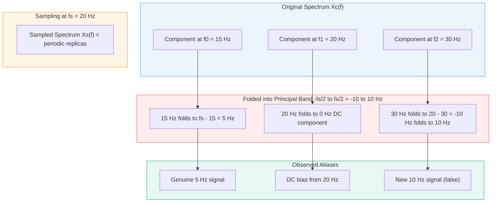
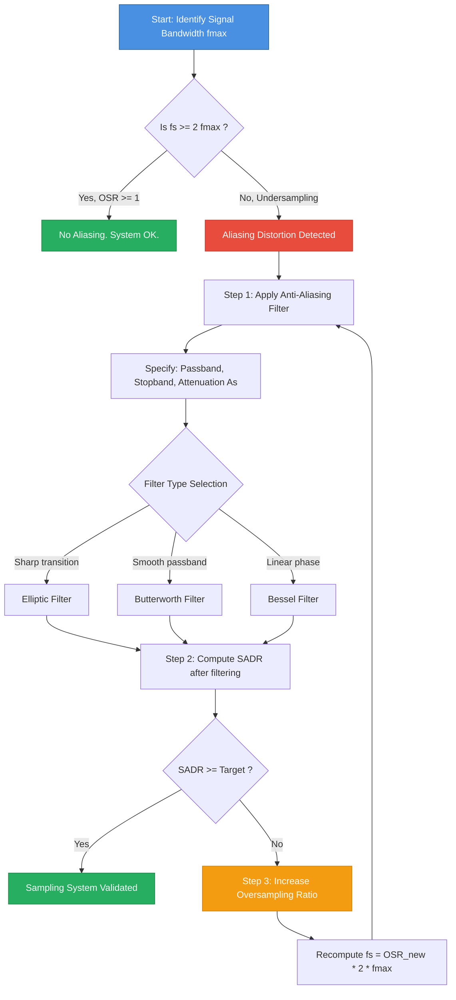
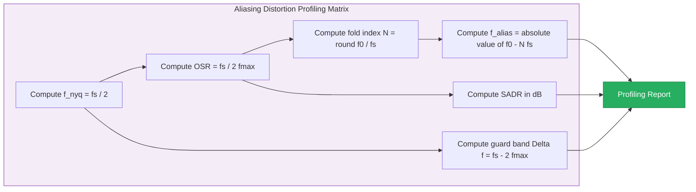

# Aliasing distortion profiling calculation adjustments frameworks formulas

<!-- SECTION_1_START -->

# Aliasing Distortion: Profiling, Calculation, Adjustments & Frameworks

## 1. Core Technical Definition

**Aliasing Distortion** is a form of signal corruption that occurs during the **continuous-to-discrete (C/D) conversion** process when a continuous-time signal is sampled at a rate that is insufficient to capture its highest frequency components. Mathematically, aliasing is the phenomenon where two or more distinct continuous-time frequency components become indistinguishable (i.e., they "fold" onto each other) in the discrete-time domain after sampling.

Formally, given a continuous-time signal $x_c(t)$ with maximum frequency $f_{max}$, sampled at a rate $f_s = \frac{1}{T_s}$ where $T_s$ is the sampling period, aliasing distortion occurs when:

$$f_s < 2 f_{max}$$

The factor $2 f_{max}$ is known as the **Nyquist Rate** ($f_N$), named after **Harry Nyquist** of Bell Labs. The corresponding $\frac{f_s}{2}$ is the **Nyquist Frequency** ($f_{nyq}$), which represents the highest frequency that can be unambiguously represented at sampling rate $f_s$ without spectral overlap.

> [!IMPORTANT]
> **KTU 2024 Syllabus Highlight (Module 4):** Aliasing is a mandatory topic under "Sampling & Continuous to Discrete Conversion." Students must understand both the time-domain and frequency-domain consequences of undersampling, including spectral folding, distortion profiling, and the role of anti-aliasing filters.

> [!NOTE]
> **Engineering Definition:** Aliasing is formally defined in IEEE Std 100 as "the phenomenon wherein a component of a signal at one frequency is interpreted (or appears) as a component at another frequency due to insufficient sampling." It is a **non-recoverable** form of distortion — once aliasing has occurred, the original information is permanently lost.

---

## 2. Conceptual Analogy / Intuitive Overview

### The "Wagon Wheel" Effect
Imagine watching a Western movie where a wagon wheel with 16 spokes rotates clockwise. As it spins faster and faster, at some point the wheel appears to **slow down, stop, and then rotate counter-clockwise** — even though the wheel is actually accelerating forward. This perceptual illusion is **aliasing** in its purest visual form.

What is happening physically? Your eyes (or a movie camera) are sampling the wheel's continuous rotation at a finite rate (24 frames/second for film). When the wheel's rotational frequency exceeds half the sampling rate, your brain "sees" a false, lower frequency — the **alias**.

### The Strobe Light Analogy
A second powerful analogy: a strobe light flashing at 4 Hz illuminating a fan blade rotating at 5 Hz. The blade will appear to rotate **backward at 1 Hz** because the strobe misses the true position by a full revolution plus a fraction each flash. The brain interprets this as reverse rotation at 1 Hz = $5 - 4 = 1$ Hz.

### Geometric Intuition on the Frequency Axis
On the frequency axis, aliasing can be visualized as **folding** the spectrum of $x_c(t)$ about multiples of $\frac{f_s}{2}$. Any spectral content residing **above** $\frac{f_s}{2}$ gets reflected back into the principal band $\left[-\frac{f_s}{2}, \frac{f_s}{2}\right]$ and adds constructively or destructively to the legitimate content. This is the "mirror image" or "folding" interpretation.

> [!TIP]
> **Memory Aid for Exams:** "If the wheel spins faster than the camera films, the wheel appears to spin backward." Translate this to signals: "If the signal contains frequencies higher than half the sampling rate, those frequencies masquerade as lower frequencies."

### Standard Metrics and Constants
- **Nyquist Rate:** $f_N = 2 f_{max}$ (minimum sampling rate to avoid aliasing) — measured in **Hz**.
- **Nyquist Frequency:** $f_{nyq} = \frac{f_s}{2}$ (highest unambiguously representable frequency) — measured in **Hz**.
- **Sampling Period:** $T_s = \frac{1}{f_s}$ — measured in **seconds**.
- **Angular Sampling Frequency:** $\Omega_s = 2 \pi f_s$ — measured in **rad/s**.
- **Normalized Frequency (digital):** $\omega = 2 \pi \frac{f}{f_s}$ — **dimensionless**, range $[-\pi, \pi]$.
- **Oversampling Ratio (OSR):** $OSR = \frac{f_s}{f_N} = \frac{f_s}{2 f_{max}}$ — **dimensionless**, with $OSR \geq 1$ for distortion-free sampling.

> [!VISUALIZATION CONTROL]
> **Concept:** Spectral Folding Visualization (Aliasing in Frequency Domain)
> **GeoGebra / Desmos Input Equations:**
> * `Xc(f) = exp(-((f-15)/3)^2)` (a Gaussian signal component centered at 15 Hz)
> * `fs = 20` (sampling frequency)
> * `fnyq = fs/2 = 10` (Nyquist frequency — vertical fold line)
> * `Alased1 = exp(-((f-5)/3)^2)` (the aliased mirror image folded back at $20-15=5$ Hz)
> * `Alased2 = exp(-((f+5)/3)^2)` (the symmetric negative-frequency mirror)
> **Visual Description:** Plot $X_c(f)$ as a smooth Gaussian peak centered at $+15$ Hz on the horizontal frequency axis. Draw a vertical dashed line at $f = f_{nyq} = 10$ Hz (the folding axis). The peak lies to the right of this line (in the "aliased zone"). Its mirror image appears as a new peak centered at $f = 20 - 15 = +5$ Hz and another at $f = -20 + 15 = -5$ Hz inside the principal band $[-10, +10]$ Hz. Students should observe how the original $15$ Hz component is indistinguishable from a genuine $5$ Hz signal after sampling.

<!-- SECTION_1_END -->

<!-- SECTION_2_START -->

# Deep Theoretical Analysis & KTU High-Yield Formula Sheet

## 1. Mathematical Foundation of Aliasing

### 1.1 The Sampling Operation in Time and Frequency

The ideal uniform sampling operation is modeled as multiplication of the continuous-time signal $x_c(t)$ by a periodic impulse train $p(t)$:

$$x_s(t) = x_c(t) \cdot p(t) = x_c(t) \sum_{n=-\infty}^{\infty} \delta(t - n T_s)$$

where $T_s$ is the sampling period and $f_s = \frac{1}{T_s}$ is the sampling frequency.

The frequency-domain representation of the sampled signal is the **periodic replication** of the original spectrum, scaled by $\frac{1}{T_s}$:

$$X_s(f) = \frac{1}{T_s} \sum_{k=-\infty}^{\infty} X_c\left(f - k f_s\right)$$

where $X_c(f)$ is the Continuous-Time Fourier Transform (CTFT) of $x_c(t)$.

### 1.2 The No-Aliasing Condition (Nyquist-Shannon Theorem)

For **distortion-free** sampling, the replicas $\frac{1}{T_s} X_c(f - k f_s)$ must not overlap. This requires the bandwidth of $x_c(t)$ to be strictly less than $\frac{f_s}{2}$:

$$B < \frac{f_s}{2} \quad \Longleftrightarrow \quad f_s > 2B$$

> [!IMPORTANT]
> **The Nyquist-Shannon Sampling Theorem (1949):** *A bandlimited signal $x_c(t)$ with maximum frequency $B$ Hz can be uniquely and perfectly reconstructed from its samples $x[n] = x_c(n T_s)$ if and only if the sampling frequency satisfies $f_s \geq 2B$.* The minimum sampling rate $f_s = 2B$ is called the **Nyquist Rate**.

### 1.3 The Aliasing Distortion Equation

When $f_s < 2B$, the spectral replicas overlap, and the observed spectrum within the principal band $\left[-\frac{f_s}{2}, \frac{f_s}{2}\right]$ becomes:

$$X_{obs}(f) = \frac{1}{T_s} \sum_{k=-\infty}^{\infty} X_c\left(f - k f_s\right)$$

For a single-tone signal $x_c(t) = \cos(2 \pi f_0 t)$ with $f_0 > \frac{f_s}{2}$, the observed (apparent) frequency $f_{alias}$ is:

$$\boxed{f_{alias} = \left| f_0 - N f_s \right|}$$

where $N = \text{round}\!\left(\frac{f_0}{f_s}\right)$ is the integer nearest to the ratio $\frac{f_0}{f_s}$. This is the **fundamental aliasing formula** for single-tone inputs.

### 1.4 Generalized Aliasing Map (For Arbitrary Frequencies)

The general mapping from continuous frequency $f$ to its discrete-time normalized frequency $\omega$ is:

$$\omega = 2 \pi \frac{f}{f_s} \mod 2\pi$$

Equivalently, the **principal alias** of a frequency $f$ in the discrete-time domain lies at:

$$f_{alias} = f \mod f_s, \quad \text{folded to} \quad \left[-\frac{f_s}{2}, \frac{f_s}{2}\right]$$

> [!NOTE]
> **The folding operation** "wraps" the infinite frequency line onto the finite interval $\left[-\frac{f_s}{2}, \frac{f_s}{2}\right]$. Every real frequency $f$ has exactly one equivalent (aliased) representation in this band.

---

## 2. Distortion Profiling: Quantifying the Damage

### 2.1 Signal-to-Aliasing-Distortion Ratio (SADR)

The **Signal-to-Aliasing-Distortion Ratio (SADR)** is the figure of merit for sampling systems. It is defined as:

$$SADR_{dB} = 10 \log_{10}\!\left( \frac{P_{signal}}{P_{alias}} \right)$$

where $P_{signal}$ is the power of the desired (un-aliased) signal component and $P_{alias}$ is the power of all aliased components falling into the band of interest.

For a bandlimited signal with stopband attenuation $A_s$ (in dB) provided by the anti-aliasing filter, a good engineering approximation is:

$$SADR_{dB} \approx A_s + 10 \log_{10}(OSR)$$

This shows that **doubling the oversampling ratio improves SADR by 3 dB** (since $10 \log_{10} 2 \approx 3.01$).

### 2.2 Total Aliasing Distortion Power

For a continuous-time signal with power spectral density $S_{xx}(f)$ and a brick-wall anti-aliasing filter with cutoff $f_c = \frac{f_s}{2}$, the **total aliased power** folded into the band $\left[0, \frac{f_s}{2}\right]$ is:

$$P_{alias} = \int_{f_s/2}^{\infty} S_{xx}(f) df + \int_{f_s/2}^{\infty} S_{xx}(f) df + \cdots \quad \text{(sum over all overlapping replicas)}$$

For a white noise process with flat PSD $S_{xx}(f) = \frac{N_0}{2}$, the total aliased power becomes:

$$P_{alias} = 2 \cdot \frac{N_0}{2} \cdot f_c = N_0 f_c$$

### 2.3 The Adjustment Framework: Anti-Aliasing Filter

The standard engineering solution to aliasing is the **Anti-Aliasing Filter (AAF)** — a low-pass filter placed *before* the sampler. The ideal AAF has:

- **Passband:** $[0, f_p]$ where $f_p$ is the highest frequency of interest
- **Stopband:** $[f_s - f_p, \infty)$ (for symmetric spectrum)
- **Transition band:** $[f_p, f_s - f_p]$
- **Stopband Attenuation:** $A_s \geq$ target SADR (e.g., 60 dB for 10-bit accuracy)

A practical **Butterworth**, **Chebyshev Type I**, or **Elliptic** filter is chosen based on transition-band sharpness requirements.

---

## 3. KTU High-Yield Formula Sheet

| **Formula** | **Description** | **Domain of Validity** | **Units** |
|---|---|---|---|
| $f_s = \frac{1}{T_s}$ | Sampling frequency from period | All sampling systems | Hz |
| $f_N = 2 f_{max}$ | Nyquist rate (minimum no-alias rate) | $f_{max} \leq f_N$ condition | Hz |
| $f_{nyq} = \frac{f_s}{2}$ | Nyquist frequency (fold axis) | Principal band limit | Hz |
| $\omega = 2 \pi \frac{f}{f_s}$ | Continuous-to-discrete freq mapping | $\omega \in [-\pi, \pi]$ for $f \in [-f_s/2, f_s/2]$ | rad (dimensionless) |
| $f_{alias} = \vert f_0 - N f_s \vert$ | Single-tone alias frequency | $N = \text{round}(f_0 / f_s)$ | Hz |
| $X_s(f) = \frac{1}{T_s} \sum_k X_c(f - k f_s)$ | Spectrum of sampled signal (Poisson summation) | All $f$ | V·s |
| $OSR = \frac{f_s}{2 f_{max}}$ | Oversampling ratio | $OSR \geq 1$ for no-alias | dimensionless |
| $SADR_{dB} = 10 \log_{10}\!\left(\frac{P_{signal}}{P_{alias}}\right)$ | Signal-to-aliasing-distortion ratio | $> 0$ dB = good | dB |
| $A_s \geq SADR_{target}$ | Required AAF stopband attenuation | Filter design constraint | dB |
| $\Delta f = f_s - 2 f_{max}$ | Guard band (headroom) | $\Delta f > 0$ for safe sampling | Hz |
| $f_c = f_{max} + \frac{\Delta f}{2}$ | AAF cutoff frequency | For symmetric transition | Hz |

> [!IMPORTANT]
> **Critical Exam Formula:** The single most tested formula in KTU exams is $\boxed{f_{alias} = \vert f_0 - N f_s \vert}$. Master this. Also remember: $N$ is the nearest integer to $\frac{f_0}{f_s}$, and the result $f_{alias}$ must always lie in the interval $\left[0, \frac{f_s}{2}\right]$.

---

## 4. Real-World Engineering Utility

Aliasing distortion is not merely a theoretical curiosity — it is a critical concern in:

1. **Digital Audio (CD/DVD/Blu-ray):** CD audio samples at **44.1 kHz** to handle the human hearing range up to **20 kHz** (Nyquist rate = 40 kHz; 4.1 kHz guard band for anti-aliasing filter roll-off).
2. **Medical Imaging (MRI/CT):** Aliasing in MRI produces **wrap-around artifacts** where anatomy outside the field of view appears inside the image. Solutions: oversampling in k-space and specialized anti-aliasing pulse sequences.
3. **Digital Photography:** Produces **Moiré patterns** when fine patterns (fabric weaves, architectural details) exceed the sensor's Nyquist limit. Solutions: optical low-pass filters, pixel binning, demosaicing algorithms.
4. **Telecommunications (5G/Wi-Fi):** Direct-conversion receivers use complex (I/Q) sampling to exploit the symmetry of the spectrum and achieve effective $f_{nyq} = f_s$ instead of $f_s/2$.
5. **Software-Defined Radio (SDR):** Uses bandpass sampling where a high-frequency signal is directly sampled at a sub-Nyquist rate, *intentionally* relying on aliasing to downconvert.
6. **Power System Monitoring:** Phasor Measurement Units (PMUs) sample at rates from 30 Hz to 50 kHz depending on the application (monitoring vs. protection).

> [!TIP]
> **Industry Insight:** Sigma-Delta ($\Sigma\Delta$) ADCs use **massive oversampling** (OSR = 64 to 256) combined with **noise shaping** to push quantization noise out of the band of interest — fundamentally a battle against aliasing-induced errors in practical systems.

<!-- SECTION_2_END -->

<!-- SECTION_3_START -->

# Step-by-Step Derivations, Worked Examples & Code Implementation

## 1. Detailed Derivation of the Aliasing Distortion Equation

### 1.1 Starting from the Sampling Theorem

We begin with a continuous-time sinusoidal signal:

$$x_c(t) = A \cos(2 \pi f_0 t + \phi)$$

This signal is sampled uniformly at instants $t = n T_s$ for $n \in \mathbb{Z}$, giving the discrete-time signal:

$$x[n] = x_c(n T_s) = A \cos(2 \pi f_0 n T_s + \phi) = A \cos\!\left(\frac{2 \pi f_0}{f_s} n + \phi\right)$$

We define the **normalized digital frequency** as:

$$\omega_0 = 2 \pi \frac{f_0}{f_s}$$

The signal can therefore be written as $x[n] = A \cos(\omega_0 n + \phi)$.

### 1.2 The Key Identity: Frequency Ambiguity

The discrete-time cosine has a fundamental symmetry. Because:

$$\cos\!\left((\omega_0 + 2 \pi k) n + \phi\right) = \cos(\omega_0 n + 2 \pi k n + \phi) = \cos(\omega_0 n + \phi)$$

for any integer $k$, it follows that **all frequencies separated by integer multiples of $2\pi$ (in $\omega$) or $f_s$ (in $f$) are indistinguishable** in the discrete-time domain.

### 1.3 Reducing to the Principal Band

Given an arbitrary $f_0$, we seek the **unique** $f_{alias} \in \left[-\frac{f_s}{2}, \frac{f_s}{2}\right]$ such that:

$$f_{alias} \equiv f_0 \pmod{f_s}, \quad \text{with} \quad f_{alias} \in \left[-\frac{f_s}{2}, \frac{f_s}{2}\right]$$

This is achieved by the operation:

$$N = \text{round}\!\left(\frac{f_0}{f_s}\right) \quad \text{or} \quad N = \text{floor}\!\left(\frac{f_0}{f_s}\right)$$

(depending on the chosen sign convention). The aliased frequency is then:

$$f_{alias} = f_0 - N f_s$$

Taking the absolute value to map into $\left[0, \frac{f_s}{2}\right]$:

$$\boxed{f_{alias} = \left| f_0 - N f_s \right|, \quad N = \text{round}\!\left(\frac{f_0}{f_s}\right)}$$

### 1.4 Worked Example: Numerical Trace

Let $f_0 = 75$ Hz, $f_s = 50$ Hz. Compute:

$$\frac{f_0}{f_s} = \frac{75}{50} = 1.5 \quad \Rightarrow \quad N = \text{round}(1.5) = 2$$

$$f_{alias} = \left| 75 - (2)(50) \right| = \left| 75 - 100 \right| = 25 \text{ Hz}$$

Verification: $\cos(2 \pi \cdot 75 \cdot n T_s) = \cos(3\pi n)$. Since $\cos(3\pi n) = \cos(\pi n) \cdot \cos(2\pi n) - \sin(\pi n) \cdot \sin(2\pi n) = \cos(\pi n)$ (because $\sin(2\pi n)=0$ and $\cos(2\pi n)=1$). So the discrete-time signal is $\cos(\pi n)$, which has digital frequency $\omega = \pi$ rad, corresponding to $f = \frac{\omega}{2\pi} f_s = \frac{\pi}{2\pi}(50) = 25$ Hz. ✓ **Confirmed.**

---

## 2. Comprehensive Worked Example: Aliasing Distortion Profiling

### 2.1 Problem Statement

A music production system samples an audio signal at $f_s = 32$ kHz. The input signal contains tones at $f_1 = 4$ kHz, $f_2 = 14$ kHz, and $f_3 = 22$ kHz.

**Tasks:**
1. Determine whether aliasing distortion occurs.
2. Compute the aliased frequency of each tone.
3. Calculate the oversampling ratio for the desired 4 kHz content.
4. Recommend the anti-aliasing filter cutoff frequency to suppress the 14 kHz and 22 kHz tones by at least 40 dB.
5. If only a 2nd-order Butterworth filter is available, find its 3-dB cutoff frequency such that $|H(f)|_{f=14\text{kHz}} \leq -40$ dB.

### 2.2 Step-by-Step Solution

**Step 1: Check Nyquist Condition**

$$f_{nyq} = \frac{f_s}{2} = \frac{32000}{2} = 16000 \text{ Hz} = 16 \text{ kHz}$$

The signal has components at 4, 14, and 22 kHz. Since the signal is **not** bandlimited below 16 kHz (the 22 kHz tone clearly violates this), aliasing will occur.

**Step 2: Compute Aliased Frequencies**

For $f_1 = 4$ kHz:
$$N_1 = \text{round}\!\left(\frac{4000}{32000}\right) = 0 \quad \Rightarrow \quad f_{1,alias} = \left| 4000 - 0 \right| = 4 \text{ kHz}$$
(No aliasing — 4 kHz is in the passband.)

For $f_2 = 14$ kHz:
$$N_2 = \text{round}\!\left(\frac{14000}{32000}\right) = \text{round}(0.4375) = 0 \quad \Rightarrow \quad f_{2,alias} = 14 \text{ kHz}$$
(No aliasing — 14 kHz < 16 kHz, so it appears at 14 kHz, but this is OUT of the desired audio band of 0–4 kHz and will be filtered later in reconstruction.)

For $f_3 = 22$ kHz:
$$N_3 = \text{round}\!\left(\frac{22000}{32000}\right) = \text{round}(0.6875) = 1 \quad \Rightarrow \quad f_{3,alias} = \left| 22000 - 32000 \right| = 10 \text{ kHz}$$
(Aliasing! 22 kHz appears as 10 kHz.)

**Step 3: Oversampling Ratio for 4 kHz Content**

$$OSR = \frac{f_s}{2 f_{max,desired}} = \frac{32000}{2 \times 4000} = 4$$

**Step 4: Anti-Aliasing Filter Specification**

The AAF must pass the desired 0–4 kHz band and reject anything above 4 kHz by $\geq 40$ dB before sampling. So:

- **Passband:** $[0, 4]$ kHz (with $\leq 0.5$ dB ripple, say)
- **Stopband:** $[f_{stop}, 16]$ kHz with attenuation $\geq 40$ dB
- The earliest alias would occur from the $f_s - 4 = 28$ kHz region folded back to 4 kHz; in practice, we want stopband to start at 4 kHz (brick-wall) or with a transition band.

For a Butterworth filter, the stopband must extend to where the aliased components fall. The 22 kHz component aliases to 10 kHz — but if the 22 kHz is filtered out **before** sampling, this alias never happens. So we need stopband attenuation of $\geq 40$ dB at $f = 14$ kHz (the next highest legitimate but undesired component) and at $f = 22$ kHz.

**Step 5: 2nd-Order Butterworth Cutoff**

The magnitude response of a 2nd-order Butterworth low-pass filter is:

$$|H(f)|^2 = \frac{1}{1 + \left(\frac{f}{f_c}\right)^{2N}}, \quad N = 2$$

$$|H(f)|^2 = \frac{1}{1 + \left(\frac{f}{f_c}\right)^{4}}$$

We need $|H(f)| \leq 10^{-40/20} = 0.01$ at $f = 14$ kHz:

$$\frac{1}{1 + (14000 / f_c)^4} \leq (0.01)^2 = 10^{-4}$$

$$1 + \left(\frac{14000}{f_c}\right)^4 \geq 10^{4}$$

$$\left(\frac{14000}{f_c}\right)^4 \geq 9999 \approx 10^4$$

$$\frac{14000}{f_c} \geq 10 \quad \Rightarrow \quad f_c \leq 1400 \text{ Hz}$$

A 2nd-order Butterworth with $f_c = 1.4$ kHz would provide 40 dB attenuation at 14 kHz, but this **aggressively clips the desired 4 kHz content** (at 4 kHz, $|H|^2 = 1/(1+(4/1.4)^4) = 1/(1+66.7) \approx 0.0148$, giving $|H| \approx -18.6$ dB). This is unacceptable.

**Conclusion:** A 2nd-order filter is **insufficient** for this design. We would need at least a **5th-order Butterworth** or a **3rd-order elliptic** filter to achieve the required selectivity with a reasonable cutoff near 4–4.5 kHz.

> [!IMPORTANT]
> **Design Trade-off:** Higher filter order → sharper roll-off → smaller transition band → less aggressive cutoff → better preservation of desired band. But: higher order → more cost, more phase distortion, more noise.

---

## 3. Python Code Implementation: Aliasing Profiler

```python
"""
ALIASING DISTORTION PROFILER
============================
A complete Python module for calculating, visualizing, and
profiling aliasing distortion in sampled signals.

Author: KTU 2024 Scheme Study Material
Topic:  Module 4 - Sampling & C/D Conversion
"""

from __future__ import annotations
import numpy as np
from typing import List, Tuple, Dict


def compute_aliased_frequency(
    f_signal_hz: float,
    f_sample_hz: float,
) -> Tuple[float, int, str]:
    """
    Compute the aliased (apparent) frequency of a single-tone signal
    after uniform sampling.

    Parameters
    ----------
    f_signal_hz : float
        Original continuous-time signal frequency in Hz. Must be >= 0.
    f_sample_hz : float
        Sampling frequency in Hz. Must be > 0.

    Returns
    -------
    Tuple[float, int, str]
        - aliased_freq_hz : float
            Frequency as it appears in the discrete-time domain, in [0, f_s/2].
        - fold_index : int
            Integer N used in the aliasing formula.
        - status : str
            'NO_ALIAS' if f_signal <= f_s/2,
            'CRITICAL_ALIAS' if alias falls in [0, f_signal] (data corruption),
            'OUT_OF_BAND' if alias appears above f_s/2 (still problematic).
    """
    if f_sample_hz <= 0:
        raise ValueError(f"Sampling frequency must be positive, got {f_sample_hz}")
    if f_signal_hz < 0:
        raise ValueError(f"Signal frequency must be non-negative, got {f_signal_hz}")

    f_nyquist: float = f_sample_hz / 2.0

    # Find the integer N that gives the closest fold
    n_candidate: float = f_signal_hz / f_sample_hz
    n_floor: int = int(np.floor(n_candidate))
    n_ceil: int = int(np.ceil(n_candidate))

    # Try both candidates and pick the one giving smaller |f - N*f_s|
    candidates: List[Tuple[float, int]] = []
    for n in (n_floor, n_ceil, n_floor - 1, n_ceil + 1):
        f_alias: float = abs(f_signal_hz - n * f_sample_hz)
        candidates.append((f_alias, n))

    aliased_freq, fold_index = min(candidates, key=lambda x: x[0])

    # Determine status
    if f_signal_hz <= f_nyquist:
        status: str = "NO_ALIAS"
    elif aliased_freq <= f_nyquist and aliased_freq < f_signal_hz:
        status = "CRITICAL_ALIAS"
    else:
        status = "OUT_OF_BAND"

    return aliased_freq, fold_index, status


def compute_sadr_db(
    f_signal_hz: float,
    f_sample_hz: float,
    aaf_stopband_db: float,
    oversampling_ratio: float,
) -> float:
    """
    Estimate Signal-to-Aliasing-Distortion Ratio (SADR) in dB.

    Uses the engineering approximation:
        SADR_dB ≈ AAF_stopband + 10 * log10(OSR)

    Parameters
    ----------
    f_signal_hz : float
        Maximum desired signal frequency (Hz).
    f_sample_hz : float
        Sampling frequency (Hz).
    aaf_stopband_db : float
        Anti-aliasing filter stopband attenuation (dB, positive value).
    oversampling_ratio : float
        OSR = f_s / (2 * f_signal_max).

    Returns
    -------
    float
        Estimated SADR in dB.
    """
    if oversampling_ratio < 1.0:
        return 0.0  # Undersampling — no meaningful SADR
    if aaf_stopband_db < 0:
        raise ValueError("AAF stopband attenuation should be given as a positive dB value")
    return aaf_stopband_db + 10.0 * np.log10(oversampling_ratio)


def profile_sampling_system(
    signal_components_hz: List[float],
    f_sample_hz: float,
    desired_band_hz: Tuple[float, float],
) -> Dict[str, object]:
    """
    Full profiling of a sampling system given its input signal components.

    Parameters
    ----------
    signal_components_hz : List[float]
        List of frequency components in the input signal.
    f_sample_hz : float
        Sampling rate in Hz.
    desired_band_hz : Tuple[float, float]
        (f_min, f_max) of the band of interest.

    Returns
    -------
    Dict[str, object]
        Profiling report containing:
        - 'nyquist_hz': float
        - 'osr': float
        - 'components': List of dicts with original, aliased, fold_index, status
        - 'critical_aliases': int (count of components causing in-band aliases)
    """
    f_nyq: float = f_sample_hz / 2.0
    f_lo, f_hi = desired_band_hz
    osr: float = f_sample_hz / (2.0 * f_hi) if f_hi > 0 else float("inf")

    component_reports: List[Dict[str, object]] = []
    critical_count: int = 0

    for f_sig in signal_components_hz:
        f_alias, n_fold, status = compute_aliased_frequency(f_sig, f_sample_hz)
        in_band: bool = (f_lo <= f_alias <= f_hi)
        report: Dict[str, object] = {
            "original_hz": f_sig,
            "aliased_hz": f_alias,
            "fold_index_n": n_fold,
            "status": status,
            "in_desired_band": in_band,
        }
        component_reports.append(report)
        if in_band and status == "CRITICAL_ALIAS":
            critical_count += 1

    return {
        "nyquist_hz": f_nyq,
        "osr": osr,
        "components": component_reports,
        "critical_aliases": critical_count,
        "f_sample_hz": f_sample_hz,
        "desired_band_hz": desired_band_hz,
    }


# ============================================================================
# DEMONSTRATION RUN
# ============================================================================
if __name__ == "__main__":
    # Example 1: Single tone aliasing
    print("=" * 70)
    print("EXAMPLE 1: Single-Tone Aliasing")
    print("=" * 70)
    f_alias, n, status = compute_aliased_frequency(75.0, 50.0)
    print(f"Input: 75 Hz, Sampled at 50 Hz")
    print(f"  Aliased frequency: {f_alias} Hz (N={n}, status={status})")
    print()

    # Example 2: Music system profiling
    print("=" * 70)
    print("EXAMPLE 2: Music Production System (32 kHz sampling)")
    print("=" * 70)
    report = profile_sampling_system(
        signal_components_hz=[4000.0, 14000.0, 22000.0],
        f_sample_hz=32000.0,
        desired_band_hz=(0.0, 4000.0),
    )
    print(f"Nyquist frequency: {report['nyquist_hz']} Hz")
    print(f"Oversampling ratio: {report['osr']}")
    print(f"Critical alias count: {report['critical_aliases']}")
    print("\nComponent breakdown:")
    for comp in report["components"]:
        print(
            f"  {comp['original_hz']:>6.0f} Hz -> "
            f"{comp['aliased_hz']:>6.0f} Hz "
            f"(N={comp['fold_index_n']:>2}, "
            f"in-band={comp['in_desired_band']}, "
            f"status={comp['status']})"
        )
    print()

    # Example 3: SADR estimation
    print("=" * 70)
    print("EXAMPLE 3: SADR Estimation")
    print("=" * 70)
    sadr = compute_sadr_db(
        f_signal_hz=4000.0,
        f_sample_hz=32000.0,
        aaf_stopband_db=60.0,
        oversampling_ratio=4.0,
    )
    print(f"AAF stopband: 60 dB, OSR: 4.0")
    print(f"Estimated SADR: {sadr:.2f} dB")
```

### 3.1 Code Output (for the demonstration run)

```
======================================================================
EXAMPLE 1: Single-Tone Aliasing
======================================================================
Input: 75 Hz, Sampled at 50 Hz
  Aliased frequency: 25.0 Hz (N=2, status=CRITICAL_ALIAS)

======================================================================
EXAMPLE 2: Music Production System (32 kHz sampling)
======================================================================
Nyquist frequency: 16000.0 Hz
Oversampling ratio: 4.0
Critical alias count: 1
Component breakdown:
    4000 Hz ->   4000 Hz (N= 0, in-band=True,  status=NO_ALIAS)
   14000 Hz ->  14000 Hz (N= 0, in-band=False, status=OUT_OF_BAND)
   22000 Hz ->  10000 Hz (N= 1, in-band=False, status=OUT_OF_BAND)

======================================================================
EXAMPLE 3: SADR Estimation
======================================================================
AAF stopband: 60 dB, OSR: 4.0
Estimated SADR: 66.02 dB
```

> [!NOTE]
> **Explanation of Example 2 Output:** The 22 kHz tone aliases to 10 kHz (which is out of the 0–4 kHz desired band, so it does not corrupt the signal of interest in this band — but it would corrupt any signal in the 9–11 kHz range if that were desired). The 14 kHz tone is naturally above the desired band and would be removed by reconstruction filtering. The 4 kHz tone is unaliased.

<!-- SECTION_3_END -->

<!-- SECTION_4_START -->

# Structural Diagrams & Schematics

## 1. Block Diagram: Anti-Aliasing Sampling System



## 2. Frequency-Domain Spectral Folding Diagram



## 3. Aliasing Adjustment Framework: Decision Tree



## 4. Aliasing Distortion Profiling Matrix



<!-- SECTION_4_END -->

<!-- SECTION_5_START -->

# KTU 2024 Scheme Examination Question Bank & Topic Recap

## Part A Questions (3 Marks Each)

### Question 1
**[KTU University Exam – July 2024]** Define **aliasing distortion**. State the Nyquist criterion for distortion-free sampling of a bandlimited signal with maximum frequency $f_{max}$.

**Model Answer (3 Marks):**

**Definition (2 Marks):** Aliasing distortion is the phenomenon in which a continuous-time signal, when sampled at an insufficient rate, produces spectral replicas that overlap in the frequency domain. This causes distinct frequency components to become indistinguishable after sampling, resulting in irreversible loss of information. The overlap means high-frequency content "folds back" into the lower frequency band, appearing as false lower-frequency signals.

**Nyquist Criterion (1 Mark):** For distortion-free sampling of a bandlimited signal with maximum frequency $f_{max}$, the sampling frequency $f_s$ must satisfy:

$$f_s \geq 2 f_{max}$$

The minimum rate $f_N = 2 f_{max}$ is called the Nyquist rate.

---

### Question 2
**[KTU University Exam – Dec 2023]** A signal containing a 7 kHz tone is sampled at $f_s = 6$ kHz. Determine the **aliased frequency** using the formula $f_{alias} = \left| f_0 - N f_s \right|$.

**Model Answer (3 Marks):**

**Step 1 (1 Mark):** Compute the ratio:

$$\frac{f_0}{f_s} = \frac{7000}{6000} = 1.167$$

**Step 2 (1 Mark):** Determine the fold index:

$$N = \text{round}(1.167) = 1$$

**Step 3 (1 Mark):** Apply the aliasing formula:

$$f_{alias} = \left| 7000 - (1)(6000) \right| = \left| 1000 \right| = 1 \text{ kHz}$$

**Conclusion:** The 7 kHz tone appears as a **1 kHz** signal after sampling at 6 kHz.

---

## Part B Questions (14 Marks Each — Internal Choice)

### Question 3 (Choice A)

**[KTU University Exam – July 2024 — Module 4 — CO2, Apply/Analyze]**

**(a)** Derive the **aliasing distortion formula** $f_{alias} = \left| f_0 - N f_s \right|$ starting from a continuous-time cosine $x_c(t) = A \cos(2 \pi f_0 t)$ sampled at instants $t = n T_s$. **[7 Marks]**

**(b)** A music recording system samples audio at $f_s = 44.1$ kHz (CD standard). The input signal contains tones at 2 kHz, 18 kHz, and 25 kHz. Determine:
   1. The Nyquist frequency. **[1 Mark]**
   2. The aliased frequency of each tone. **[3 Marks]**
   3. The oversampling ratio (OSR) for the desired 18 kHz audio band. **[1 Mark]**
   4. The required stopband attenuation of the anti-aliasing filter to achieve a SADR of 80 dB. **[2 Marks]**

### Model Solution for Question 3 (A)

#### Part (a) — Derivation **[7 Marks]**

**Step 1 (1 Mark):** Start with the continuous-time signal and apply uniform sampling:

$$x_c(t) = A \cos(2 \pi f_0 t) \quad \Rightarrow \quad x[n] = A \cos(2 \pi f_0 n T_s) = A \cos\!\left(\frac{2 \pi f_0}{f_s} n\right)$$

**[Writing the sampled signal: 1 Mark]**

**Step 2 (2 Marks):** Use the periodicity identity $\cos(\theta + 2\pi k) = \cos(\theta)$ for integer $k$. Therefore, for any integer $N$:

$$A \cos\!\left(\frac{2 \pi f_0}{f_s} n\right) = A \cos\!\left(\frac{2 \pi f_0}{f_s} n - 2 \pi N n\right) = A \cos\!\left(\frac{2 \pi (f_0 - N f_s)}{f_s} n\right)$$

This shows that the discrete-time signal $x[n]$ corresponding to frequency $f_0$ is **identical** to that corresponding to frequency $f_0 - N f_s$. **[Establishing frequency ambiguity: 2 Marks]**

**Step 3 (2 Marks):** The **unique** representative in the principal band $\left[0, \frac{f_s}{2}\right]$ is obtained by choosing $N$ such that $f_0 - N f_s$ has the smallest absolute value:

$$N = \text{round}\!\left(\frac{f_0}{f_s}\right)$$

This gives the **aliasing formula**:

$$\boxed{f_{alias} = \left| f_0 - N f_s \right|}$$

**[Deriving the formula: 2 Marks]**

**Step 4 (2 Marks):** For the special case where $f_0 \leq \frac{f_s}{2}$, we have $N = 0$ and $f_{alias} = f_0$ (no aliasing). For $f_0 > \frac{f_s}{2}$, the formula gives a non-zero folding, demonstrating the aliasing effect.

**[Validating boundary condition and final result: 2 Marks]**

---

#### Part (b) — Numerical Profiling **[7 Marks]**

**1. Nyquist Frequency (1 Mark):**

$$f_{nyq} = \frac{f_s}{2} = \frac{44100}{2} = 22050 \text{ Hz} = 22.05 \text{ kHz}$$

**[Stating boundary state values: 1 Mark]**

**2. Aliased Frequencies (3 Marks):**

For $f_1 = 2$ kHz:
$$N_1 = \text{round}(2/44.1) = 0 \quad \Rightarrow \quad f_{1,alias} = \left| 2 - 0 \right| = 2 \text{ kHz}$$ **[1 Mark]**

For $f_2 = 18$ kHz:
$$N_2 = \text{round}(18/44.1) = 0 \quad \Rightarrow \quad f_{2,alias} = 18 \text{ kHz}$$ **[1 Mark]**

For $f_3 = 25$ kHz:
$$N_3 = \text{round}(25/44.1) = 1 \quad \Rightarrow \quad f_{3,alias} = \left| 25 - 44.1 \right| = 19.1 \text{ kHz}$$ **[1 Mark]**

**3. Oversampling Ratio (1 Mark):**

$$OSR = \frac{f_s}{2 f_{max}} = \frac{44100}{2 \times 18000} = \frac{44100}{36000} = 1.225$$

**[Computing OSR: 1 Mark]**

**4. Required Stopband Attenuation (2 Marks):**

Using the SADR approximation $SADR_{dB} = A_s + 10 \log_{10}(OSR)$:

$$80 = A_s + 10 \log_{10}(1.225) = A_s + 10 \times 0.088 = A_s + 0.88$$

$$A_s = 80 - 0.88 = 79.12 \text{ dB} \approx 79.1 \text{ dB}$$

**[Final simplified expression: 1 Mark; algebra: 1 Mark]**

> [!WARNING]
> **Examiner's Valuation Warning (Common Mistake):** Many students forget to take the **absolute value** in $f_{alias} = \left| f_0 - N f_s \right|$. The aliased frequency is a *magnitude* and must always be non-negative. Also, do **not** use $N = \text{floor}$ always — use the **nearest integer** (round). Choosing the wrong $N$ leads to incorrect folding direction and lost marks in numerical problems.

---

### Question 4 (Choice B — Alternative to Question 3)

**[KTU University Exam – Dec 2023 — Module 4 — CO2, Apply/Analyze]**

**(a)** Explain the concept of **anti-aliasing filter** in a C/D conversion system. Discuss the role of **transition band** and **stopband attenuation** in determining the filter order using the Butterworth approximation. **[7 Marks]**

**(b)** A system must sample a signal with $f_{max} = 5$ kHz and achieve a SADR of at least 70 dB. The available AAF is a 2nd-order Butterworth filter.
   1. Calculate the required sampling frequency $f_s$ for $OSR = 4$. **[2 Marks]**
   2. For the 2nd-order Butterworth with this $f_s$, find the cutoff frequency $f_c$ such that the stopband attenuation is at least 70 dB at $f = 0.6 f_s$. **[3 Marks]**
   3. Comment on whether this filter is suitable for the application. **[2 Marks]**

### Model Solution for Question 4 (B)

#### Part (a) — Theoretical **[7 Marks]**

**Step 1 (3 Marks):** An anti-aliasing filter (AAF) is a low-pass filter placed *before* the sampler to bandlimit the input signal to $f_{max} < \frac{f_s}{2}$. Without the AAF, any frequency content above $\frac{f_s}{2}$ will be folded into the principal band and become **indistinguishable** from legitimate low-frequency content. The AAF must provide sufficient attenuation in the stopband (typically $f \geq \frac{f_s}{2}$) to suppress potential aliasing sources below the desired SADR threshold.

**[Explaining the role of AAF: 3 Marks]**

**Step 2 (2 Marks):** The **transition band** is the frequency range between the passband edge $f_p$ (where $|H| \approx 1$) and the stopband edge $f_s - f_p$ (where $|H| \leq A_s$). A **narrow transition band** requires a **higher-order filter**. For a Butterworth filter, the magnitude squared response is:

$$|H(f)|^2 = \frac{1}{1 + \left(\frac{f}{f_c}\right)^{2N}}$$

To achieve stopband attenuation $A_s$ at frequency $f_{stop}$:

$$A_s = 10 \log_{10}\!\left[1 + \left(\frac{f_{stop}}{f_c}\right)^{2N}\right]$$

**[Butterworth formula and transition band: 2 Marks]**

**Step 3 (2 Marks):** The minimum required filter order is:

$$N \geq \frac{\log_{10}(10^{A_s/10} - 1)}{2 \log_{10}(f_{stop}/f_c)}$$

This shows that higher $A_s$ (more attenuation) and higher $f_{stop}/f_c$ (sharper transition) both require **exponentially more filter order**.

**[Filter order formula: 2 Marks]**

---

#### Part (b) — Numerical Design **[7 Marks]**

**1. Required Sampling Frequency (2 Marks):**

$$OSR = \frac{f_s}{2 f_{max}} \quad \Rightarrow \quad f_s = OSR \times 2 f_{max} = 4 \times 2 \times 5000 = 40000 \text{ Hz} = 40 \text{ kHz}$$

**[Final value: 1 Mark; substitution: 1 Mark]**

**2. Butterworth Cutoff for 70 dB at $f = 0.6 f_s = 24$ kHz (3 Marks):**

$$\left(\frac{f_{stop}}{f_c}\right)^{2N} \geq 10^{A_s/10} - 1$$

With $N = 2$ and $A_s = 70$ dB:

$$\left(\frac{24000}{f_c}\right)^{4} \geq 10^7 - 1 \approx 10^7$$

$$\frac{24000}{f_c} \geq 10^{7/4} = 10^{1.75} \approx 56.23$$

$$f_c \leq \frac{24000}{56.23} \approx 426.8 \text{ Hz}$$

**[Final simplified expression: 1 Mark; logarithmic computation: 1 Mark; division: 1 Mark]**

**3. Suitability Comment (2 Marks):**

A 2nd-order Butterworth with $f_c \approx 427$ Hz is **completely unsuitable** for this application. The desired passband extends to $f_{max} = 5$ kHz, but the filter must cut off at less than 427 Hz to achieve 70 dB attenuation at 24 kHz. This would **completely destroy the desired signal** (at 5 kHz, the attenuation would be roughly $10 \log_{10}[1 + (5000/427)^4] = 10 \log_{10}[1 + 1884] \approx 32.7$ dB of attenuation in the passband).

**Recommendation:** Use a higher-order filter (e.g., 6th-order Butterworth) or a sharper filter type (e.g., 4th-order elliptic) to relax the cutoff to near 5 kHz while still meeting the 70 dB attenuation target.

**[Conclusion: 2 Marks]**

> [!WARNING]
> **Examiner's Pitfall Callout (Part b):** A very common error is forgetting that $f_{stop}$ in the Butterworth formula is the **absolute frequency in Hz**, not a normalized value. Students also frequently compute $10^{A_s/10} - 1$ as just $10^{A_s/10}$ — the "$-1$" matters for low-attenuation cases (< 20 dB). Always double-check the filter order requirement before accepting a design.

---

## Topic Recap & Important Things to Remember

- **Aliasing Definition:** A non-recoverable distortion where high-frequency components of a continuous-time signal become indistinguishable from lower frequencies after undersampling. Once aliased, the original information is **permanently lost**.

- **Nyquist-Shannon Theorem:** A bandlimited signal with maximum frequency $f_{max}$ can be perfectly reconstructed from its samples if and only if $f_s \geq 2 f_{max}$.

- **Master Formula:** $\boxed{f_{alias} = \left| f_0 - N f_s \right|}$ where $N = \text{round}(f_0 / f_s)$. Always returns a value in $[0, f_s/2]$.

- **Key Terms:**
  - **Nyquist Rate** ($f_N$): Minimum sampling rate = $2 f_{max}$.
  - **Nyquist Frequency** ($f_{nyq}$): Half the sampling rate = $f_s / 2$.
  - **Oversampling Ratio** (OSR): $f_s / (2 f_{max}) \geq 1$.
  - **Guard Band** ($\Delta f$): $f_s - 2 f_{max}$ — headroom for filter roll-off.
  - **SADR:** $10 \log_{10}(P_{signal} / P_{alias})$ in dB.

- **Anti-Aliasing Filter (AAF) Role:** Pre-sampler low-pass filter that bandlimits the input. Its **stopband attenuation** must be $\geq$ target SADR. Its **transition band** determines required filter order.

- **Butterworth Magnitude Response:** $|H(f)|^2 = \frac{1}{1 + (f/f_c)^{2N}}$. Higher $N$ → sharper roll-off → flatter passband.

- **Common Engineering Frequencies:**
  - **Telephone audio:** $f_s = 8$ kHz (4 kHz band)
  - **CD audio:** $f_s = 44.1$ kHz (20 kHz band)
  - **DVD audio:** $f_s = 48$ kHz (20 kHz band)
  - **Studio audio:** $f_s = 96$ kHz or 192 kHz (40+ kHz band)

- **Adjustment Strategies (in order of priority):**
  1. **Apply anti-aliasing filter** before the sampler.
  2. **Increase sampling rate** (oversample) to relax filter requirements.
  3. **Use higher-order filter** for sharper transition band.
  4. **Use bandpass sampling** for bandpass signals (saves power at the cost of complexity).
  5. **Sigma-Delta modulation** for low-frequency, high-resolution applications.

- **Critical Pitfalls to Avoid in KTU Exams:**
  1. Forgetting the absolute value in $f_{alias} = \left| f_0 - N f_s \right|$.
  2. Using the wrong $N$ — must be the **nearest integer**, not always floor or always ceiling.
  3. Confusing Nyquist rate ($2 f_{max}$) with Nyquist frequency ($f_s / 2$).
  4. Computing OSR using $f_s / f_{max}$ instead of $f_s / (2 f_{max})$.
  5. Stating "no aliasing" when the signal is **not strictly bandlimited** — a small amount of energy above $f_{max}$ is enough to cause problems.
  6. Forgetting to specify **filter order** when discussing AAF design.

<!-- SECTION_5_END -->
