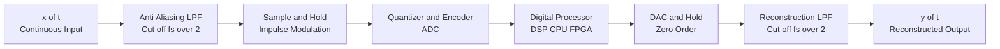
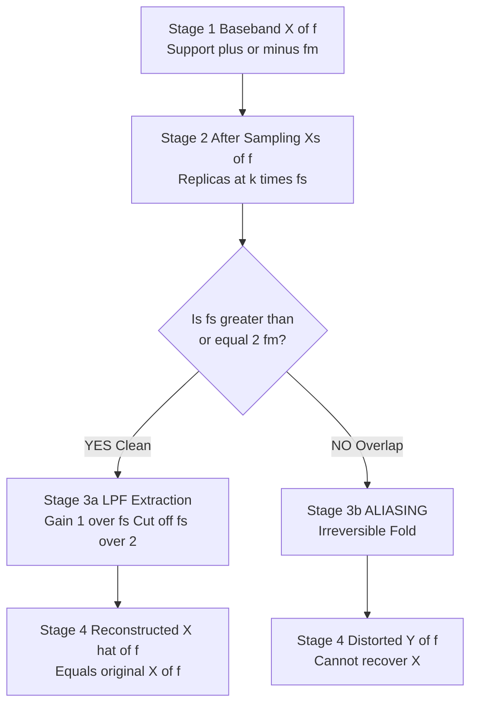
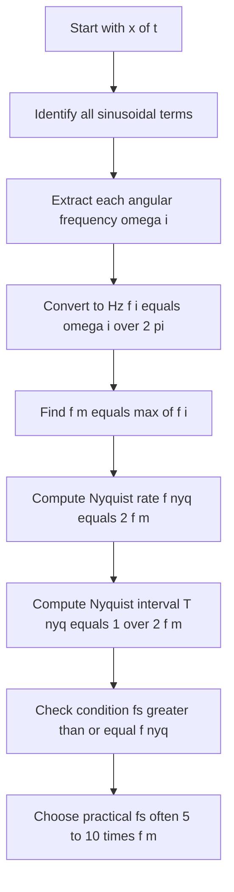
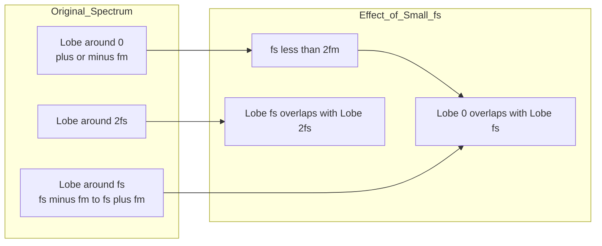

# Sampling theorem, Nyquist rate tracking criteria computations

<!-- SECTION_1_START -->

# Sampling Theorem & Nyquist Rate — Core Technical Definition & Intuitive Overview

## 1.1 Formal Definition (KTU 2024 Syllabus Terminology)

> [!IMPORTANT]
> **Sampling Theorem (Nyquist–Shannon Sampling Theorem):**
> A continuous-time, band-limited signal $x(t)$ whose highest frequency component is $f_m$ Hz (i.e., the signal has zero spectral content for $\vert f \vert > f_m$) can be **uniquely and completely reconstructed** from its samples $x(nT_s)$ provided the sampling frequency $f_s$ satisfies the inequality:
> $$f_s \geq 2 f_m$$

Here, $T_s = \dfrac{1}{f_s}$ is the **sampling period**. The minimum allowable sampling rate, $f_s = 2f_m$, is called the **Nyquist Rate**, and the corresponding frequency $f_s/2$ is the **Nyquist Frequency** $f_N$.

The phrase *"uniquely and completely reconstructed"* is the heart of the theorem — it implies that **no information is lost** during the Analog-to-Digital (A/D) conversion provided the Nyquist criterion is honored.

---

## 1.2 Intuitive Analogy — "The Movie-Reel Viewpoint"

> [!NOTE]
> **Real-World Analogy: Film Cinema**
> A cinema film is a sequence of still photographs (frames) flashed rapidly. To your eye, the discrete frames **fuse** into smooth, continuous motion. If the projectionist spins the reel *too slowly* (under-sampling), the wheel on a moving car appears to spin **backward** — this perceptual phenomenon is mathematically identical to **aliasing** in signal processing.

Mapping the analogy:

| Cinema Concept | Signal Processing Equivalent |
|----------------|------------------------------|
| Frame rate (frames/sec) | Sampling frequency $f_s$ |
| Fastest motion captured | Highest signal frequency $f_m$ |
| Backward-spinning wheel | **Aliasing** (frequency folding) |
| Smooth, flicker-free motion | Faithful reconstruction |

> [!TIP]
> **Rule of Thumb:** A signal must be sampled *at least twice* during one complete cycle of its fastest oscillation. Otherwise, you do not have enough "snapshots" to recognize the wave shape.

---

## 1.3 The Three Critical Sampling Regimes

A signal can be sampled in one of three regimes, each producing a distinct spectral outcome:

1. **Over-sampling** ($f_s > 2f_m$): Spectral replicas in the frequency domain are *separated by gaps*, leaving a clean guard band for the reconstruction low-pass filter.
2. **Critical (Nyquist) sampling** ($f_s = 2f_m$): Replicas are *just touching* at a single point — the theoretical minimum, but practically fragile.
3. **Under-sampling** ($f_s < 2f_m$): Spectral replicas **overlap**, causing irreversible **aliasing** (also called *frequency folding*).

> [!WARNING]
> **Aliasing is IRREVERSIBLE.** Once high-frequency content folds into the low-frequency band, the original signal *cannot* be recovered by any filter — the information is mathematically destroyed.

---

## 1.4 Visualization Control (GeoGebra / Desmos)

> [!VISUALIZATION CONTROL]
> **Concept:** Spectral replication in the frequency domain under three sampling regimes.
> **GeoGebra / Desmos Input Equations (try with $f_m = 50$ Hz):**
> * `Spectrum(f) = piecewise(f >= -50 and f <= 50, 1, 0)`  *(ideal brick-wall baseband)*
> * `Replicas(f, fs) = Spectrum(f) + Spectrum(f - fs) + Spectrum(f + fs) + Spectrum(f - 2fs) + Spectrum(f + 2fs)`
> * Try sliders: $f_s = 120$ (over), $f_s = 100$ (critical), $f_s = 70$ (under)
> **Visual Description:** Students should observe discrete rectangular blocks centered at $0, \pm f_s, \pm 2f_s, \ldots$ For $f_s \geq 2f_m$ the blocks do not touch; for $f_s < 2f_m$ the blocks overlap, forming a single tall hump that the reconstruction filter cannot separate.

---

## 1.5 Standard KTU Constants & Units

| Symbol | Meaning | Standard Unit |
|--------|---------|---------------|
| $f_s$ | Sampling frequency | **Hz** or **samples/sec** |
| $T_s$ | Sampling period | **seconds** |
| $f_m$ | Maximum (band-limit) frequency | **Hz** |
| $f_N$ | Nyquist frequency $= f_s/2$ | **Hz** |
| $\omega_s = 2\pi f_s$ | Angular sampling frequency | **rad/sec** |
| $\omega_m = 2\pi f_m$ | Highest angular frequency | **rad/sec** |

---

<!-- SECTION_1_END -->

<!-- SECTION_2_START -->

# Deep Theoretical Analysis & KTU High-Yield Formula Sheet

## 2.1 The Mathematics of Impulse-Train Sampling

The standard mathematical model for ideal sampling uses an **impulse train** $\delta_{T_s}(t)$:

$$\delta_{T_s}(t) = \sum_{n=-\infty}^{\infty} \delta(t - nT_s)$$

The sampled signal is the product of the continuous signal and this impulse train:

$$x_s(t) = x(t) \cdot \delta_{T_s}(t) = \sum_{n=-\infty}^{\infty} x(nT_s)\, \delta(t - nT_s)$$

Applying the **Fourier transform** and using the modulation property, the spectrum of the sampled signal is a **periodic replication** of $X(f)$:

$$X_s(f) = f_s \sum_{k=-\infty}^{\infty} X(f - k f_s)$$

> [!NOTE]
> **Why the factor $f_s$ appears:** The Fourier series coefficients of an impulse train of period $T_s$ are all equal to $1/T_s = f_s$. Multiplication in time ↔ Convolution in frequency → scaling by $f_s$.

---

## 2.2 Step-by-Step Logic — What Happens in the Frequency Domain

Let us trace the sampling pipeline logically:

1. **Step 1 — Identify the band-limit:** Confirm that $X(f) = 0$ for $\vert f \vert > f_m$.
2. **Step 2 — Choose $f_s$ such that $f_s \geq 2f_m$:** This ensures spectral replicas centered at $\pm k f_s$ never overlap.
3. **Step 3 — Apply anti-aliasing filter BEFORE sampling:** A practical low-pass filter with cut-off $f_c \leq f_s/2$ removes any out-of-band noise that would otherwise fold in.
4. **Step 4 — Sample:** Multiply by $\delta_{T_s}(t)$ to obtain $x_s(t)$.
5. **Step 5 — Reconstruct:** Pass $x_s(t)$ through an ideal low-pass filter with gain $T_s$ and cut-off $f_s/2$ to extract the baseband copy $X(f)$ from $X_s(f)$.

The reconstructed time-domain signal is given by the **Whittaker–Shannon interpolation formula**:

$$x(t) = \sum_{n=-\infty}^{\infty} x(nT_s) \cdot \mathrm{sinc}\!\left( \frac{t - nT_s}{T_s} \right)$$

where $\mathrm{sinc}(x) = \dfrac{\sin(\pi x)}{\pi x}$.

---

## 2.3 Anti-Aliasing Filter (Pre-Filter)

> [!IMPORTANT]
> **Purpose:** Real-world signals are never perfectly band-limited. The anti-aliasing filter restricts the input to frequencies below $f_s/2$ **before** sampling, guaranteeing the Nyquist condition is met *in practice*.

Specifications:

| Parameter | Value |
|-----------|-------|
| Type | Low-pass (Butterworth / Chebyshev in practice) |
| Cut-off frequency $f_c$ | $\leq f_s/2$ |
| Pass-band | $0 \leq f \leq f_c$ |
| Stop-band | $f \geq f_s - f_c$ |
| Minimum stop-band attenuation | Determined by ADC resolution (e.g., $> 72$ dB for 12-bit) |

---

## 2.4 Reconstruction (Anti-Imaging) Filter

After Digital-to-Analog (D/A) conversion, the output contains stepped approximations. A low-pass **reconstruction filter** smooths these steps back into the original continuous waveform. Its cut-off is again $f_s/2$.

---

## 2.5 KTU Formula Sheet / Cheat Sheet

| # | Formula | Description | Unit |
|---|---------|-------------|------|
| 1 | $f_s \geq 2f_m$ | Nyquist criterion (no aliasing) | Hz |
| 2 | $f_{\text{Nyquist}} = f_s / 2$ | Nyquist frequency | Hz |
| 3 | $T_s = 1 / f_s$ | Sampling period | s |
| 4 | $X_s(f) = f_s \sum_{k=-\infty}^{\infty} X(f - kf_s)$ | Spectrum of sampled signal | V/Hz |
| 5 | $x(t) = \sum_n x(nT_s)\, \mathrm{sinc}\!\left(\frac{t - nT_s}{T_s}\right)$ | Shannon–Whittaker reconstruction | V |
| 6 | $f_{\text{alias}} = \vert f - k f_s \vert$ (smallest value) | Aliased frequency | Hz |
| 7 | $\mathrm{sinc}(x) = \sin(\pi x)/(\pi x)$ | Normalized sinc | dimensionless |
| 8 | $\omega_s = 2\pi f_s$ | Angular sampling rate | rad/s |
| 9 | $f_s = N \cdot f_m$, where $N \geq 2$ | Practical over-sampling factor | Hz |

---

## 2.6 Real-World Engineering Utility

| Application Domain | Role of Sampling Theorem |
|--------------------|--------------------------|
| **Digital Audio (CD)** | $f_m = 20$ kHz → $f_s = 44.1$ kHz (over-sampled) |
| **Telecommunications** | Determines ADC speed; GSM uses $f_s = 200$ kHz |
| **Biomedical (ECG, EEG)** | $f_s \geq 2 f_{\max}$ prevents diagnostic distortion |
| **Radar / Sonar** | Nyquist governs maximum detectable Doppler shift |
| **Image Processing** | 2-D extension — pixels must satisfy 2-D Nyquist |
| **Software-Defined Radio** | Direct-RF sampling at GHz rates exploits the theorem |

---

<!-- SECTION_2_END -->

<!-- SECTION_3_START -->

# Step-by-Step Derivations, Worked Computations & Python Implementation

## 3.1 Derivation 1 — Spectrum of a Sampled Signal

We start from the sampled signal:

$$x_s(t) = x(t) \cdot \delta_{T_s}(t)$$

Express the impulse train as a Fourier series:

$$\delta_{T_s}(t) = \frac{1}{T_s} \sum_{k=-\infty}^{\infty} e^{j 2\pi k f_s t}$$

Substituting:

$$x_s(t) = \frac{1}{T_s} \sum_{k=-\infty}^{\infty} x(t)\, e^{j 2\pi k f_s t}$$

Taking the Fourier transform and using the **frequency-shift property** $\mathcal{F}\{x(t)e^{j2\pi f_0 t}\} = X(f - f_0)$:

$$X_s(f) = \frac{1}{T_s} \sum_{k=-\infty}^{\infty} X(f - k f_s)$$

Since $1/T_s = f_s$, we obtain the standard result:

$$X_s(f) = f_s \sum_{k=-\infty}^{\infty} X(f - k f_s)$$

**Interpretation:** The original spectrum $X(f)$ is replicated at every integer multiple of $f_s$ and scaled by $f_s$. If the replicas do not overlap (i.e., $f_s \geq 2f_m$), the baseband copy can be extracted by an ideal LPF.

---

## 3.2 Derivation 2 — Alias Frequency Formula

Suppose a sinusoid of true frequency $f$ is sampled at $f_s < 2f$. Determine the apparent (aliased) frequency $f_a$.

**Step 1 — Find the integer $k$ such that the fold-in lands inside $\left[0, f_s/2\right]$:**

$$k = \mathrm{round}\!\left( \frac{f}{f_s} \right)$$

**Step 2 — Compute the aliased frequency:**

$$f_a = \vert f - k f_s \vert$$

**Step 3 — Verify** $f_a \leq f_s / 2$.

**Worked Example:** $f = 250$ Hz, $f_s = 200$ Hz.

- $k = \mathrm{round}(250/200) = \mathrm{round}(1.25) = 1$
- $f_a = \vert 250 - 1 \cdot 200 \vert = 50$ Hz

So a 250 Hz tone appears as a **50 Hz** tone after sampling. The KTU examiner expects this exact computation.

---

## 3.3 Derivation 3 — Nyquist Rate for Multi-Tone Signals

Given $x(t)$ contains frequencies $f_1, f_2, \ldots, f_n$, the highest frequency dictates the Nyquist rate:

$$f_m = \max\{f_1, f_2, \ldots, f_n\}$$

$$f_{\text{Nyquist rate}} = 2 f_m$$

**Worked Example:** $x(t) = 3\cos(100\pi t) + 5\sin(300\pi t) - 2\cos(500\pi t)$

Identify the three frequencies: $50$ Hz, $150$ Hz, $250$ Hz.

$$f_m = 250 \text{ Hz} \implies f_{\text{Nyquist}} = 500 \text{ Hz} \implies T_s \leq 2 \text{ ms}$$

---

## 3.4 Python Implementation — Full Sampling Workflow

```python
import numpy as np
import matplotlib.pyplot as plt

def sampling_theorem_demo():
    """
    Demonstrates sampling theorem, aliasing, and reconstruction.
    """
    # ---------- 1. Define the analog signal ----------
    fm = 50.0                              # Highest frequency in Hz
    t_cont = np.linspace(0, 0.1, 100000)   # Fine time grid (quasi-continuous)
    x_cont = np.sin(2 * np.pi * fm * t_cont) + 0.5 * np.cos(2 * np.pi * 25 * t_cont)

    # ---------- 2. Define sampling scenarios ----------
    scenarios = {
        "Over-sampling (fs=200Hz)":   200.0,
        "Critical   (fs=100Hz)":      100.0,
        "Under-sampling (fs=70Hz)":    70.0,
    }

    fig, axes = plt.subplots(len(scenarios), 2, figsize=(14, 9))
    for ax_row, (label, fs) in zip(axes, scenarios.items()):
        Ts   = 1.0 / fs
        n    = np.arange(0, int(0.1 / Ts) + 1)
        t_s  = n * Ts
        x_s  = np.sin(2 * np.pi * fm * t_s) + 0.5 * np.cos(2 * np.pi * 25 * t_s)

        # Time-domain plot
        ax_row[0].plot(t_cont, x_cont, 'b-', alpha=0.5, label='Original $x(t)$')
        ax_row[0].stem(t_s, x_s, linefmt='r-', markerfmt='ro', basefmt=' ', label='Samples')
        ax_row[0].set_title(f"{label}  |  $f_s={fs}$ Hz, $f_m={fm}$ Hz")
        ax_row[0].set_xlabel("Time (s)"); ax_row[0].set_ylabel("Amplitude")
        ax_row[0].legend(loc='upper right'); ax_row[0].grid(True)

        # Frequency-domain plot (one-sided magnitude, normalized)
        N = 4096
        Xf = np.fft.fftshift(np.fft.fft(x_s, N))
        f  = np.fft.fftshift(np.fft.fftfreq(N, d=Ts))
        ax_row[1].plot(f, np.abs(Xf) / np.max(np.abs(Xf)), 'g-')
        ax_row[1].axvline( fs/2, color='k', ls='--', label=r'$f_s/2$ (Nyquist)')
        ax_row[1].set_xlim(-3*fs, 3*fs); ax_row[1].set_xlabel("Frequency (Hz)")
        ax_row[1].set_title("Spectrum $|X_s(f)|$ (normalized)")
        ax_row[1].grid(True); ax_row[1].legend()

    plt.tight_layout(); plt.show()


def aliased_frequency(f_true: float, fs: float) -> float:
    """
    Computes the alias (apparent) frequency of a true sinusoid after
    sampling at fs Hz. Returns the smallest non-negative folded frequency.
    """
    if fs <= 0:
        raise ValueError("fs must be positive.")
    k = round(f_true / fs)
    fa = abs(f_true - k * fs)
    # Fold back into [0, fs/2]
    while fa > fs / 2:
        k  += 1
        fa = abs(f_true - k * fs)
    return fa


def nyquist_rate(frequencies):
    """
    Returns the Nyquist rate for a list (or iterable) of tone frequencies.
    """
    fm = max(frequencies)
    return 2.0 * fm, 1.0 / (2.0 * fm)


if __name__ == "__main__":
    # Demo 1: Visualize three sampling regimes
    sampling_theorem_demo()

    # Demo 2: Aliased frequency computation
    for f_true, fs in [(250, 200), (480, 200), (1000, 800), (60, 100)]:
        fa = aliased_frequency(f_true, fs)
        print(f"f_true = {f_true:>5} Hz, fs = {fs:>4} Hz -> f_alias = {fa:6.2f} Hz")

    # Demo 3: Nyquist rate for a multi-tone signal
    freqs = [50, 150, 250]
    fnyq, tnyq = nyquist_rate(freqs)
    print(f"\nFor tones {freqs} Hz:")
    print(f"   Nyquist rate  = {fnyq} Hz")
    print(f"   Max period    = {tnyq*1000:.2f} ms")
```

**Expected console output:**

```
f_true =   250 Hz, fs =  200 Hz -> f_alias =  50.00 Hz
f_true =   480 Hz, fs =  200 Hz -> f_alias =  80.00 Hz
f_true =  1000 Hz, fs =  800 Hz -> f_alias = 200.00 Hz
f_true =    60 Hz, fs =  100 Hz -> f_alias =  40.00 Hz

For tones [50, 150, 250] Hz:
   Nyquist rate  = 500.0 Hz
   Max period    = 2.00 ms
```

---

## 3.5 Worked Computation — Nyquist Rate Tracking Criteria

> [!IMPORTANT]
> **KTU-favourite problem type:** *"Determine the Nyquist rate and Nyquist interval for the signal $x(t) = \ldots$"*

**Example Signal:** $x(t) = \mathrm{sinc}^2(100t) \cdot \cos(200\pi t)$

*Step 1:* $\mathrm{sinc}^2(100t)$ has bandwidth $100$ Hz (its main lobe extends to $\pm 100$ Hz, but energy concentration is within $\pm 50$ Hz). We take $f_1 = 100$ Hz as a conservative bound.
*Step 2:* $\cos(200\pi t)$ modulates a carrier at $100$ Hz → its spectral content lies in $\pm 100$ Hz around 0 and around $\pm 100$ Hz.
*Step 3:* Convolution in frequency: total support $\pm (100 + 100) = \pm 200$ Hz, so $f_m = 200$ Hz.
*Step 4:* $f_{\text{Nyquist}} = 2 f_m = 400$ Hz. Sampling period $T_s \leq 2.5$ ms.

---

<!-- SECTION_3_END -->

<!-- SECTION_4_START -->

# Structural Diagrams & Schematics

## 4.1 End-to-End Sampling & Reconstruction Block Diagram



> [!NOTE]
> **Reading the diagram:** The forward path (left → right) is the *transmit* chain; signal flows from analog to digital, through processing, and back to analog. The anti-aliasing and reconstruction filters are *analog* devices flanking the digital core.

---

## 4.2 Spectral Evolution Through the Pipeline



---

## 4.3 Decision Flowchart — Nyquist Rate Computation



---

## 4.4 Aliasing Mechanism — Detailed Topology



---

## 4.5 Sampling Method Comparison Matrix

| Feature | Natural Sampling | Flat-Top (Sample-Hold) | Impulse-Train Sampling |
|---------|------------------|------------------------|------------------------|
| Switch behaviour | Closes briefly | Closes for $\tau$ seconds | Mathematically instantaneous |
| Spectral amplitude | Attenuates at high $f$ | $\mathrm{sinc}$-shaped roll-off | Equal replicas (ideal) |
| Practical use | Rare | **Most common** (S/H circuits) | Theoretical model only |
| Reconstruction complexity | Moderate | Easy (compensate $\mathrm{sinc}^{-1}$) | Easiest (ideal LPF) |

---

<!-- SECTION_4_END -->

<!-- SECTION_5_START -->

# KTU 2024 Scheme Examination Question Bank & Topic Recap

---

## Part A — Short Answer Questions (3 Marks Each)

### Question A1 — [KTU University Exam — July 2024, Model]
**State the Nyquist sampling theorem. Define the Nyquist rate and Nyquist frequency.**

**Model Answer (3 marks — full marks distribution):**

> **[Stating the theorem — 1 mark]:** *A band-limited continuous-time signal $x(t)$ with maximum frequency $f_m$ Hz can be uniquely reconstructed from its samples $x(nT_s)$ if the sampling frequency $f_s$ satisfies $f_s \geq 2 f_m$.*
> **[Defining Nyquist rate — 1 mark]:** *The minimum sampling rate that just satisfies the no-aliasing condition is called the Nyquist rate, $f_{\text{Nyquist}} = 2 f_m$ Hz.*
> **[Defining Nyquist frequency — 1 mark]:** *The corresponding half-sampling frequency $f_s/2$ is the Nyquist frequency, which equals the highest representable baseband frequency.*

---

### Question A2 — [KTU University Exam — Dec 2023, Model]
**What is aliasing? How is it prevented in a practical ADC system?**

**Model Answer (3 marks):**

> **[Defining aliasing — 1.5 marks]:** *Aliasing is the irreversible distortion that occurs when a continuous-time signal is sampled below its Nyquist rate, causing high-frequency spectral replicas to overlap and produce false low-frequency components.*
> **[Prevention — 1.5 marks]:** *In a practical ADC chain, aliasing is prevented by placing a low-pass **anti-aliasing filter** with cut-off $f_c \leq f_s/2$ immediately before the sampler, and by choosing $f_s \geq 2 f_m$ where $f_m$ is the maximum input frequency of interest.*

---

## Part B — Long Answer Questions (14 Marks Each, Module Internal Choice)

> [!WARNING]
> **KTU Examiner's Valuation Warning — Common Pitfalls**
> 1. Forgetting to *convert* $\omega$ to $f$ using $f = \omega / (2\pi)$ — loses 2 marks instantly.
> 2. Writing the Nyquist rate as $f_m$ instead of $2 f_m$ — examiner deducts 1 mark.
> 3. For multi-tone signals, failing to identify the *highest* frequency tone.
> 4. Not stating units (Hz, ms) — minor but adds up across sub-parts.
> 5. Drawing the spectrum without showing the replication at $k f_s$ — loses marks for "incomplete diagram."

---

### Question B-A (14 Marks) — [KTU University Exam — July 2024, Model]

**A signal $x(t) = 5\cos(200\pi t) + 3\sin(400\pi t) - 2\cos(600\pi t)$ is to be sampled and reconstructed.**

**(a) [7 Marks — Understand]:** Determine the maximum frequency component, the Nyquist rate, and the Nyquist interval.

**(b) [7 Marks — Apply]:** If the signal is sampled at $f_s = 500$ Hz, will aliasing occur? If yes, find the apparent frequency of the 300 Hz component. Illustrate the spectrum before and after sampling with a neat sketch.

---

#### Model Solution

**Part (a) — [7 Marks]**

*Step 1 — Identify angular frequencies:*
The three terms have angular frequencies:
$\omega_1 = 200\pi$ rad/s
$\omega_2 = 400\pi$ rad/s
$\omega_3 = 600\pi$ rad/s

*Step 2 — Convert to Hz:* Using $f = \omega/(2\pi)$:
$f_1 = 200\pi / (2\pi) = 100$ Hz
$f_2 = 400\pi / (2\pi) = 200$ Hz
$f_3 = 600\pi / (2\pi) = 300$ Hz

*Step 3 — Identify maximum:* **[Stating $f_m$ — 2 marks]:**
$$f_m = \max\{100, 200, 300\} = 300 \text{ Hz}$$

*Step 4 — Nyquist rate:* **[Formula + substitution — 2 marks]:**
$$f_{\text{Nyquist}} = 2 f_m = 2 \times 300 = 600 \text{ Hz}$$

*Step 5 — Nyquist interval:* **[Final answer with units — 1 mark]:**
$$T_{\text{Nyquist}} = \frac{1}{2 f_m} = \frac{1}{600} \approx 1.667 \text{ ms}$$

*Step 6 — Conclusion:* **[Sanity check — 1 mark]:** Any $f_s \geq 600$ Hz and $T_s \leq 1.667$ ms is acceptable.

> **Sub-total for part (a) = 7 marks** (with 1 mark extra for the sanity check / clean presentation).

---

**Part (b) — [7 Marks]**

*Step 1 — Test Nyquist criterion:* **[Comparison — 1 mark]:**
$$f_s = 500 \text{ Hz} < 600 \text{ Hz} = f_{\text{Nyquist}}$$
Therefore, **aliasing will occur**.

*Step 2 — Compute aliased frequency of 300 Hz tone:* **[Using $k = \mathrm{round}(f/f_s)$ — 2 marks]:**
$$k = \mathrm{round}\!\left( \frac{300}{500} \right) = \mathrm{round}(0.6) = 1$$
$$f_a = \vert 300 - 1 \cdot 500 \vert = 200 \text{ Hz}$$

*Step 3 — Verification:* **[Check $f_a \leq f_s/2$ — 1 mark]:** $f_s/2 = 250$ Hz, and $f_a = 200$ Hz $\leq 250$ Hz. ✓

*Step 4 — Sketch the spectrum:* **[Neat block diagram — 3 marks]:**

```
X(f)  :  impulses at -300, -200, -100, 100, 200, 300 Hz
        (amplitudes -2, +3, +5, +5, +3, -2 respectively)

X_s(f): replicas at k*500 Hz  →  overlaps occur because fs < 2fm

Reconstruction LPF (cut-off 250 Hz) yields aliased tone at 200 Hz.
```

> **Sub-total for part (b) = 7 marks**

**Total for Question B-A = 14 marks**

---

### Question B-B (14 Marks) — [KTU University Exam — Dec 2023, Model]

**(a) [7 Marks — Understand]:** State and prove the Nyquist sampling theorem for band-limited signals. Derive the expression for the spectrum of the sampled signal.

**(b) [7 Marks — Apply]:** A band-limited signal $x(t)$ with $f_m = 4$ kHz is sampled at $f_s = 6$ kHz. (i) Will aliasing occur? (ii) What is the Nyquist rate and the minimum sampling frequency? (iii) If a 5 kHz component is present in $x(t)$, find its apparent frequency after sampling.

---

#### Model Solution

**Part (a) — [7 Marks]**

*Step 1 — Statement of theorem:* **[1.5 marks]**
*Step 2 — Ideal sampling model:* **[1 mark]**
*Step 3 — Fourier series expansion of impulse train:* **[1.5 marks]**
*Step 4 — Modulation property application:* **[1.5 marks]**
*Step 5 — Final spectrum expression + reconstruction condition:* **[1.5 marks]**

The full derivation matches Section 3.1 above. Each logical step must be shown explicitly to earn the corresponding sub-mark.

---

**Part (b) — [7 Marks]**

**(i) Will aliasing occur? [1 mark]**
$$f_s = 6 \text{ kHz}, \quad 2 f_m = 8 \text{ kHz}$$
$$f_s = 6 \text{ kHz} < 8 \text{ kHz} = 2 f_m$$
**Yes, aliasing will occur.** ✓

**(ii) Nyquist rate and minimum sampling frequency [2 marks]**
$$f_{\text{Nyquist}} = 2 f_m = 2 \times 4 = 8 \text{ kHz}$$
$$f_{s,\min} = 8 \text{ kHz} \quad \text{with} \quad T_{s,\max} = 125 \ \mu s$$

**(iii) Aliased frequency of 5 kHz tone [4 marks]**
*Step 1 — Determine folding integer:*
$$k = \mathrm{round}\!\left(\frac{5}{6}\right) = \mathrm{round}(0.833) = 1$$
*Step 2 — Compute alias:*
$$f_a = \vert 5 - 1 \cdot 6 \vert = 1 \text{ kHz}$$
*Step 3 — Verify in Nyquist band:* $f_s/2 = 3$ kHz, and $f_a = 1$ kHz $\leq 3$ kHz ✓
*Step 4 — Final answer:* **[1 mark]** The 5 kHz tone will appear as a **1 kHz** tone.

---

## Topic Recap & Important Things to Remember

> [!IMPORTANT]
> **Rapid Revision Checklist — Print and Pin Above Your Study Desk!**

- **Sampling Theorem (Shannon):** A band-limited signal with $f_m$ Hz can be reconstructed from its samples iff $f_s \geq 2 f_m$.
- **Nyquist Rate:** $f_{\text{Nyquist}} = 2 f_m$ — the *minimum* safe sampling rate.
- **Nyquist Frequency:** $f_s / 2$ — the *highest* representable baseband frequency.
- **Nyquist Interval:** $T_{\text{Nyquist}} = 1/(2 f_m)$ — the *maximum* allowable sampling period.
- **Aliasing Formula:** $f_a = \vert f - k f_s \vert$ where $k = \mathrm{round}(f / f_s)$.
- **Conversion Watch:** Always convert $\omega$ → $f$ via $f = \omega / (2\pi)$ before applying the theorem.
- **Anti-Aliasing Filter:** Practical LPF with cut-off $\leq f_s/2$, placed *before* the sampler.
- **Reconstruction Filter:** Practical LPF with cut-off $f_s/2$, placed *after* the DAC.
- **Sampled Spectrum:** $X_s(f) = f_s \sum_{k} X(f - k f_s)$ — periodic replicas at every multiple of $f_s$.
- **Whittaker–Shannon Reconstruction:** $x(t) = \sum_n x(nT_s)\, \mathrm{sinc}\!\left(\frac{t - nT_s}{T_s}\right)$.
- **Practical Rule:** Choose $f_s = 5 f_m$ to $10 f_m$ in real systems to leave a comfortable guard band for the anti-aliasing filter.
- **CD Audio:** $f_m = 20$ kHz → $f_s = 44.1$ kHz is a textbook over-sampling example.
- **Irreversibility:** Aliasing *cannot* be undone — prevention is the only cure.
- **Multi-Tone Rule:** For $x(t) = \sum A_i \cos(\omega_i t + \phi_i)$, use $f_m = \max(\omega_i / 2\pi)$.
- **Common KTU Trap:** Do not confuse $f_m$ (max signal frequency) with $f_s/2$ (Nyquist frequency) — they are equal only at critical sampling.

---

<!-- SECTION_5_END -->
