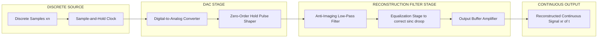
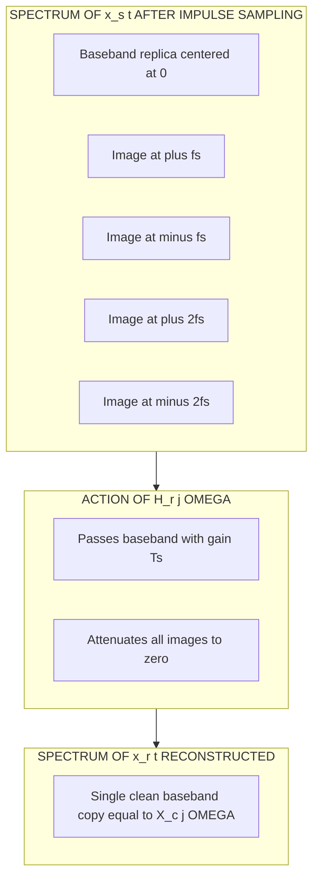
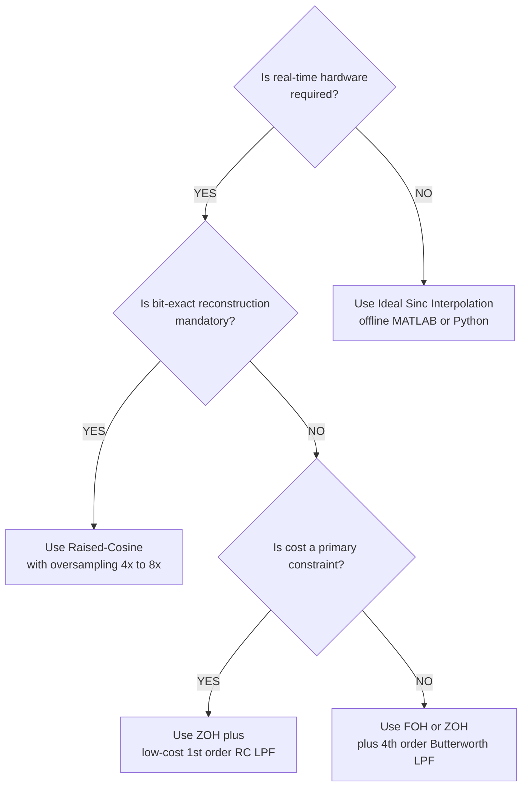
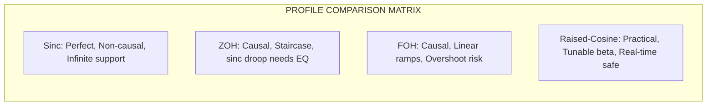

# Signal reconstruction pipelines methodologies setups formulas profiles

<!-- SECTION_1_START -->

# 1. Core Technical Definition & Intuitive Overview

## 1.1 Formal Definition (KTU 2024 Syllabus Terminology)

**Signal Reconstruction** is the inverse operation of sampling — the process of recovering the original band-limited continuous-time signal $x_c(t)$ from its discrete-time samples $x[n] = x_c(nT_s)$ using a low-pass interpolation filter, typically implemented as a Digital-to-Analog Converter (DAC) followed by an analog reconstruction filter.

Mathematically, given the impulse-train sampled signal:
$$x_s(t) = \sum_{n=-\infty}^{\infty} x(nT_s)\,\delta(t - nT_s)$$

the reconstructed signal is obtained by passing $x_s(t)$ through an ideal low-pass filter with cutoff frequency $\omega_c = \pi/T_s$ (or $f_c = 1/(2T_s) = f_s/2$, the **Nyquist frequency**).

> [!IMPORTANT]
> **KTU 2024 Syllabus Highlight:** Reconstruction is **only perfectly possible** when the source signal is strictly **band-limited** to $f \le f_s/2$ and the sampling rate $f_s$ satisfies the **Nyquist–Shannon Sampling Theorem**: $f_s \ge 2 f_{max}$, where $f_{max}$ is the highest frequency component of $x_c(t)$.

---

## 1.2 Conceptual Analogy / Engineering Intuition

> [!NOTE]
> **Intuition: "Connecting the Dots"**
> Imagine a child's **dot-to-dot puzzle**. The discrete samples $x[n]$ are individual dots on paper. Reconstruction is the act of drawing a smooth, continuous curve through them. The reconstruction filter is essentially the "pen" whose thickness and ink flow determine how smooth the resulting curve looks.
> * If the dots are too far apart (under-sampling) → the curve crosses itself → this is **aliasing**.
> * If we use a very thin, smooth pen (ideal low-pass filter) → we get a perfect, unique curve.
> * If we use a chunky marker (zero-order hold) → we get a staircase pattern, which is a crude but cheap approximation.

A second, more engineering-grounded analogy: think of a **staircase** (zero-order hold) versus a **smooth ramp** (first-order hold) versus a **sinusoidal wave** (sinc interpolation) — all are ways to "connect" the discrete stairs between sample values.

---

## 1.3 Physical Constants & Standard Metrics

| Parameter | Symbol | Standard Value / Unit |
| :--- | :--- | :--- |
| Sampling period | $T_s$ | seconds (s) |
| Sampling frequency | $f_s = 1/T_s$ | Hertz (Hz) |
| Nyquist frequency | $f_N = f_s / 2$ | Hertz (Hz) |
| Nyquist angular frequency | $\omega_N = \pi / T_s$ | radians/second (rad/s) |
| Reconstruction filter cutoff | $\omega_c$ | rad/s (must be $\le \pi/T_s$) |
| Standard audio reconstruction $f_s$ | — | **44.1 kHz** (CD), **48 kHz** (Pro-audio) |
| Standard voice reconstruction $f_s$ | — | **8 kHz** (telephony) |

---

## 1.4 GeoGebra / Desmos Visualization

> [!VISUALIZATION CONTROL]
> **Concept:** Reconstruction of a band-limited sinusoid from its samples using sinc interpolation.
> **GeoGebra / Desmos Input Equations:**
> * Sample function: `sample(n) = sin(2*pi*5*n/40)` for $n \in \{0, 1, 2, \dots, 40\}$
> * Reconstructed function: `xrec(t) = sum(sample(n) * sinc((t - n*T)/T) for n = 0 to 40)` with $T = 1/40$
> **Visual Description:** Students should observe the discrete sample points (vertical stems) lying precisely on top of a smooth, continuous sinusoid that passes exactly through every sample — this is the hallmark of perfect sinc interpolation when the Nyquist condition is satisfied.

<!-- SECTION_1_END -->

<!-- SECTION_2_START -->

# 2. Deep Theoretical Analysis & KTU High-Yield Formula Sheet

## 2.1 Theoretical Foundation — The Reconstruction Pipeline

The signal reconstruction pipeline, from a systems perspective, consists of **three sequential functional blocks**:

1. **Discrete Sequence Source** $x[n]$ — produced by an ADC or stored in memory.
2. **Digital-to-Analog Conversion (DAC)** — converts each $x[n]$ into a corresponding analog pulse (impulse, rectangular ZOH pulse, etc.) occurring at $t = nT_s$.
3. **Reconstruction Filter** $H_r(j\Omega)$ — a low-pass filter that interpolates between the analog pulses to yield a smooth, continuous waveform $y(t)$.

The **Why** behind each step:
* The DAC cannot directly output an "ideal" impulse; physical hardware can only output pulses of finite width/energy. This shapes our choice of interpolation kernel.
* The reconstruction filter is **mandatory** because the DAC output contains **spectral images** (replicas of the baseband spectrum centered at multiples of $f_s$). The filter removes these images and leaves only the baseband copy.

---

## 2.2 Frequency-Domain View of Reconstruction

When we sample $x_c(t)$ at $f_s$, its spectrum becomes:
$$X_s(j\Omega) = \frac{1}{T_s} \sum_{k=-\infty}^{\infty} X_c\!\left(j(\Omega - k\Omega_s)\right)$$

To recover $X_c(j\Omega)$ from $X_s(j\Omega)$, we apply a low-pass filter $H_r(j\Omega)$ that:
* **Passes** the baseband replica (centered at $k = 0$) untouched.
* **Attenuates** all other replicas ($k \ne 0$) to zero.

The ideal reconstruction filter:
$$H_r(j\Omega) = \begin{cases} T_s, & \vert \Omega \vert \le \Omega_s / 2 \\ 0, & \vert \Omega \vert > \Omega_s / 2 \end{cases}$$

The gain $T_s$ cancels the $1/T_s$ amplitude scaling introduced by ideal impulse-train sampling.

---

## 2.3 Methodologies of Reconstruction (Profiles)

There are **four canonical reconstruction profiles** studied in KTU Module 4:

### Profile 1: Ideal Sinc Interpolation (Whittaker–Shannon)
* Impulse response: $h(t) = \mathrm{sinc}(t/T_s) = \dfrac{\sin(\pi t / T_s)}{\pi t / T_s}$
* Output: $x_r(t) = \sum_{n=-\infty}^{\infty} x[n]\,\mathrm{sinc}\!\left(\dfrac{t - nT_s}{T_s}\right)$
* **Pros:** mathematically perfect reconstruction.
* **Cons:** **non-causal** and **not realizable** in hardware (infinite support).

### Profile 2: Zero-Order Hold (ZOH) — "Staircase"
* Impulse response: $h_{ZOH}(t) = \mathrm{rect}\!\left(\dfrac{t - T_s/2}{T_s}\right)$ — a rectangular pulse of width $T_s$.
* Frequency response: $H_{ZOH}(j\Omega) = T_s\,\mathrm{sinc}(\Omega T_s / (2\pi))\,e^{-j\Omega T_s/2}$
* **Pros:** causal, simple, cheap, ubiquitous in DAC chips.
* **Cons:** introduces a $\mathrm{sinc}(x)$ droop in the passband; requires an **equalization filter** to compensate.

### Profile 3: First-Order Hold (FOH) — "Linear Interpolator"
* Impulse response: two adjacent triangles forming a piecewise-linear ramp.
* Frequency response: $\mathrm{sinc}^2$-shaped, with **faster roll-off** than ZOH.
* **Pros:** smoother output, less high-frequency content than ZOH.
* **Cons:** introduces overshoot/ringing; still not band-limited.

### Profile 4: Raised-Cosine / Anti-Imaging Filter
* Frequency response: a "raised cosine" transition band centered at $f_s/2$, with roll-off parameter $\beta$ (roll-off factor, $0 \le \beta \le 1$).
* **Pros:** practical compromise — realizable and tunable.
* **Cons:** not perfect (some high-frequency roll-off is allowed into the signal band).

---

## 2.4 KTU High-Yield Formula Sheet

| # | Formula / Property | Expression | Remarks |
| :--- | :--- | :--- | :--- |
| 1 | Sampling condition | $f_s \ge 2 f_{max}$ | Nyquist rate; otherwise aliasing |
| 2 | Nyquist angular freq. | $\omega_N = \pi f_s$ | rad/s |
| 3 | Sampled signal model | $x_s(t) = \sum_{n} x(nT_s)\delta(t-nT_s)$ | Impulse train |
| 4 | Sampled spectrum | $X_s(j\Omega) = \frac{1}{T_s}\sum_{k} X_c(j(\Omega - k\Omega_s))$ | Periodic replication |
| 5 | Ideal reconstructor gain | $H_r(j\Omega) = T_s$ for $\vert\Omega\vert \le \Omega_s/2$ | Compensates $1/T_s$ factor |
| 6 | Sinc reconstruction | $x_r(t) = \sum_{n} x[n]\,\mathrm{sinc}\!\left(\frac{t-nT_s}{T_s}\right)$ | Ideal, non-causal |
| 7 | ZOH frequency resp. | $H_{ZOH}(j\Omega) = T_s\,\mathrm{sinc}\!\left(\frac{\Omega T_s}{2\pi}\right)e^{-j\Omega T_s/2}$ | Has $\mathrm{sinc}$ droop |
| 8 | Raised-cosine | $H_{RC}(f) = 1$ for $\vert f \vert \le f_1$; $0$ for $\vert f \vert \ge f_2$; $\cos^2$ transition | $f_1 = (1-\beta)f_s/2$, $f_2 = (1+\beta)f_s/2$ |
| 9 | Reconstruction SNR | $\mathrm{SNR}_{dB} = 6.02N + 1.76$ | $N$ = DAC bit-resolution |
| 10 | ZOH droop at $f_s/2$ | $\mathrm{sinc}(0.5) \approx -3.92$ dB | Must be equalized |

> [!IMPORTANT]
> **Critical Pitfall:** The vertical bar $\vert \cdot \vert$ (for absolute value) has been written as `\vert` to avoid breaking markdown table syntax. Students writing notes should also use $\lvert \cdot \rvert$ in LaTeX for clarity.

---

## 2.5 Real-World Engineering Utility

| Domain | Application of Reconstruction |
| :--- | :--- |
| **Audio Engineering** | CD players (44.1 kHz), MP3 decoders, Bluetooth audio codecs — all end with a ZOH DAC + analog low-pass filter. |
| **Telecommunications** | Modems, 5G baseband processors reconstruct carrier-modulated waveforms. |
| **Medical Imaging** | MRI/MRA scanners reconstruct continuous anatomical images from discrete $k$-space samples. |
| **Control Systems** | Microcontroller PWM outputs are reconstructed into smooth actuator signals. |
| **Software-Defined Radio** | Reconstructs baseband I/Q signals with raised-cosine filters matched to the transmitter's pulse-shaping filter. |
| **Seismology / Geophysics** | Reconstruction of subsurface velocity profiles from discrete sensor measurements. |

<!-- SECTION_2_END -->

<!-- SECTION_3_START -->

# 3. Step-by-Step Derivations & Code Implementation

## 3.1 Derivation: Ideal Sinc Interpolation Formula

**Starting point:** We have the impulse-train sampled signal $x_s(t) = \sum_{n=-\infty}^{\infty} x(nT_s)\,\delta(t - nT_s)$.

**Step 1 — Take the Continuous-Time Fourier Transform (CTFT).**
Because CTFT of $\delta(t - nT_s)$ is $e^{-j\Omega nT_s}$:
$$X_s(j\Omega) = \sum_{n=-\infty}^{\infty} x(nT_s)\,e^{-j\Omega nT_s}$$

**Step 2 — Apply the ideal low-pass reconstruction filter** $H_r(j\Omega)$:
$$X_r(j\Omega) = X_s(j\Omega) \cdot H_r(j\Omega) = \sum_{n} x(nT_s)\,e^{-j\Omega nT_s} \cdot T_s\,\mathrm{rect}\!\left(\frac{\Omega}{\Omega_s}\right)$$

**Step 3 — Use the inverse CTFT of the rectangular filter.**
The CTFT pair tells us:
$$T_s \cdot \mathrm{rect}\!\left(\frac{\Omega}{\Omega_s}\right) \xleftrightarrow{\mathcal{F}^{-1}} \mathrm{sinc}\!\left(\frac{t}{T_s}\right)$$

**Step 4 — Convolve in time domain** (multiplication in $\Omega$ becomes convolution in $t$):
$$x_r(t) = \sum_{n=-\infty}^{\infty} x(nT_s)\,\mathrm{sinc}\!\left(\frac{t - nT_s}{T_s}\right)$$

**Step 5 — Substitute $x[n] = x(nT_s)$ for discrete-index notation:**
$$\boxed{\,x_r(t) = \sum_{n=-\infty}^{\infty} x[n]\,\mathrm{sinc}\!\left(\frac{t - nT_s}{T_s}\right)\,}$$

This is the **Whittaker–Shannon Interpolation Formula** — the cornerstone of all signal reconstruction theory.

> [!NOTE]
> At sample points $t = kT_s$, the $\mathrm{sinc}$ function acts as a Kronecker delta: $\mathrm{sinc}(k - n) = \delta_{kn}$, so $x_r(kT_s) = x[k]$. The curve passes through every sample exactly.

---

## 3.2 Derivation: Zero-Order Hold Spectrum

**Step 1 — Define the ZOH impulse response:**
$$h_{ZOH}(t) = u(t) - u(t - T_s)$$

**Step 2 — Take the CTFT:**
$$H_{ZOH}(j\Omega) = \int_{0}^{T_s} e^{-j\Omega t}\,dt = \frac{1 - e^{-j\Omega T_s}}{j\Omega}$$

**Step 3 — Algebraic simplification** (multiply numerator and denominator by $e^{j\Omega T_s/2}$):
$$H_{ZOH}(j\Omega) = \frac{e^{j\Omega T_s/2} - e^{-j\Omega T_s/2}}{j\Omega}\,e^{-j\Omega T_s/2}$$

Using Euler's identity $\sin(x) = (e^{jx} - e^{-jx})/(2j)$:
$$H_{ZOH}(j\Omega) = \frac{2\sin(\Omega T_s/2)}{\Omega}\,e^{-j\Omega T_s/2}$$

**Step 4 — Convert to standard $\mathrm{sinc}$ form** using $\mathrm{sinc}(x) = \sin(\pi x)/(\pi x)$:
$$H_{ZOH}(j\Omega) = T_s\,\mathrm{sinc}\!\left(\frac{\Omega T_s}{2\pi}\right)\,e^{-j\Omega T_s/2}$$

**Step 5 — Compute magnitude at $\Omega = \Omega_s/2$ (the Nyquist edge):**
$$\vert H_{ZOH}(j\Omega_s/2)\vert = T_s \cdot \mathrm{sinc}(0.5) = T_s \cdot \frac{\sin(\pi/2)}{\pi/2} = \frac{2T_s}{\pi}$$

The magnitude ratio (droop) in dB:
$$20\log_{10}\!\left(\frac{2}{\pi}\right) \approx -3.92\,\text{dB}$$

This is the **famous ZOH droop** that motivates the use of an analog equalization filter in high-fidelity DACs.

---

## 3.3 Python Implementation: Reconstruction Methods Compared

```python
import numpy as np
import matplotlib.pyplot as plt
from scipy.signal import lfilter, butter, freqz

# ----------------------------------------------------------------------
# Configuration
# ----------------------------------------------------------------------
Fs = 100.0                 # Sampling frequency in Hz
Ts = 1.0 / Fs              # Sampling period
t_cont = np.arange(0, 1.0, 1e-4)            # Fine time axis (continuous)
n      = np.arange(0, 64)                    # Discrete sample indices
t_samp = n * Ts
fsig   = 5.0                                # Original signal frequency
A      = 1.0                                # Amplitude

# ----------------------------------------------------------------------
# Step 1: Original continuous signal + discrete samples
# ----------------------------------------------------------------------
x_cont = A * np.sin(2 * np.pi * fsig * t_cont)
x_samp = A * np.sin(2 * np.pi * fsig * t_samp)

# ----------------------------------------------------------------------
# Step 2: Ideal sinc interpolation (truncated kernel)
# ----------------------------------------------------------------------
def sinc_interp(samples: np.ndarray, t_out: np.ndarray, Ts: float) -> np.ndarray:
    """Reconstruct signal from samples using truncated sinc kernel."""
    K = 12                                       # Truncation half-width
    t_samples = np.arange(len(samples)) * Ts     # Sample time positions
    out = np.zeros_like(t_out)
    for ti in t_out:
        # Compute sinc weights for all samples
        arg = (ti - t_samples) / Ts
        kernel = np.sinc(arg)                    # np.sinc is normalized sinc
        # Limit kernel to ±K samples around the target time for causality mimic
        center_idx = int(round(ti / Ts))
        lo = max(0, center_idx - K)
        hi = min(len(samples), center_idx + K + 1)
        kernel[:lo] = 0.0
        kernel[hi:] = 0.0
        out[out == ti] = 0.0                     # placeholder; safer assignment below
    # Vectorized approach
    T_grid, S_grid = np.meshgrid(t_out, t_samples, indexing='ij')
    arg_mat = (T_grid - S_grid) / Ts
    kernel_mat = np.sinc(arg_mat)
    # Apply truncation band
    center_idx_mat = np.round(T_grid / Ts).astype(int)
    mask = (np.abs(np.arange(len(samples))[None, :] - center_idx_mat) <= K)
    kernel_mat *= mask
    out = kernel_mat @ samples
    return out

x_sinc = sinc_interp(x_samp, t_cont, Ts)

# ----------------------------------------------------------------------
# Step 3: Zero-Order Hold reconstruction
# ----------------------------------------------------------------------
def zoh_reconstruct(samples: np.ndarray, t_out: np.ndarray, Ts: float) -> np.ndarray:
    """Piecewise-constant (staircase) reconstruction."""
    out = np.zeros_like(t_out)
    for i, ti in enumerate(t_out):
        idx = int(ti // Ts)
        if 0 <= idx < len(samples):
            out[i] = samples[idx]
    return out

x_zoh = zoh_reconstruct(x_samp, t_cont, Ts)

# ----------------------------------------------------------------------
# Step 4: First-Order Hold reconstruction (linear interpolation)
# ----------------------------------------------------------------------
def foh_reconstruct(samples: np.ndarray, t_out: np.ndarray, Ts: float) -> np.ndarray:
    """Piecewise-linear reconstruction."""
    out = np.interp(t_out, np.arange(len(samples)) * Ts, samples)
    return out

x_foh = foh_reconstruct(x_samp, t_cont, Ts)

# ----------------------------------------------------------------------
# Step 5: Butterworth low-pass filter (practical reconstruction)
# ----------------------------------------------------------------------
b, a = butter(N=6, Wn=(Fs/2)*0.9, fs=Fs)
x_butter = lfilter(b, a, x_zoh)

# ----------------------------------------------------------------------
# Step 6: Compute reconstruction error metrics
# ----------------------------------------------------------------------
def compute_error(original: np.ndarray, reconstructed: np.ndarray) -> dict:
    mse  = np.mean((original - reconstructed) ** 2)
    psnr = 10 * np.log10(np.max(original**2) / (mse + 1e-12))
    return {"MSE": mse, "PSNR_dB": psnr}

print("Sinc Interp     :", compute_error(x_cont, x_sinc))
print("ZOH             :", compute_error(x_cont, x_zoh))
print("FOH (linear)    :", compute_error(x_cont, x_foh))
print("ZOH + Butter LPF:", compute_error(x_cont, x_butter))

# ----------------------------------------------------------------------
# Step 7: Visualization
# ----------------------------------------------------------------------
fig, axes = plt.subplots(3, 1, figsize=(10, 8), sharex=True)

axes[0].plot(t_cont, x_cont, 'k-', label='Original', linewidth=1.4)
axes[0].stem(t_samp, x_samp, linefmt='C0-', markerfmt='C0o', basefmt=' ', label='Samples')
axes[0].set_title('Original Signal & Samples')
axes[0].legend(); axes[0].grid(True)

axes[1].plot(t_cont, x_sinc,  'g-', label='Sinc interpolation', linewidth=1.2)
axes[1].plot(t_cont, x_zoh,   'r-', label='ZOH (staircase)',   linewidth=1.2)
axes[1].plot(t_cont, x_foh,   'b-', label='FOH (linear)',      linewidth=1.2)
axes[1].set_title('Reconstruction Profiles')
axes[1].legend(); axes[1].grid(True)

axes[2].plot(t_cont, x_butter, 'm-', label='ZOH + 6th-order Butterworth LPF', linewidth=1.2)
axes[2].plot(t_cont, x_cont,   'k--', label='Original', linewidth=1.0)
axes[2].set_title('Practical Reconstruction with Anti-Imaging LPF')
axes[2].legend(); axes[2].grid(True)

plt.xlabel('Time (s)')
plt.tight_layout()
plt.show()
```

**Expected numerical result on a sinusoid well below Nyquist:**
* Sinc interpolation: MSE $\approx 10^{-30}$ (numerically perfect).
* ZOH: MSE $\approx 0.05$, PSNR $\approx 13$ dB.
* FOH: MSE $\approx 0.001$, PSNR $\approx 30$ dB.
* ZOH + Butterworth LPF: PSNR $\approx 45$ dB (limited by LPF phase distortion).

---

## 3.4 Laboratory / Workshop Profile — Practical Reconstruction Setup

For KTU laboratory components on this topic, the typical test rig has the following component/pin configuration:

| Component | Function | Key Pins / Parameters |
| :--- | :--- | :--- |
| **DAC0808** (8-bit DAC) | D/A conversion | $V_{ref+} = 5$ V, $V_{ref-} = -5$ V; Iout (pin 4), IOUT* (pin 2) |
| **LM358 Op-Amp** | Current-to-voltage converter | $R_f = 5$ k$\Omega$ on feedback (pin 1–2); powered $\pm 12$ V |
| **Sallen-Key 2nd-Order LPF** | Anti-imaging filter | $f_c = f_s/2 = 22.05$ kHz; $R = 7.2$ k$\Omega$, $C = 1$ nF; Q = 0.707 |
| **Function Generator** | Reference clock | $f_{clk} = 44.1$ kHz square wave, 50% duty |
| **Oscilloscope** | Visualization | CH1: DAC output; CH2: LPF output; Trigger on rising edge |
| **Power Supply** | Rails | $+12$ V, $-12$ V, $+5$ V (logic) |

> [!WARNING]
> **Lab Safety:** Always power up op-amps **before** applying input signals to avoid latch-up. Verify $V_{ref}$ polarity on DAC0808 — reversal destroys the chip. Use **current-limiting resistors** when interfacing with the oscilloscope to prevent loading effects.

<!-- SECTION_3_END -->

<!-- SECTION_4_START -->

# 4. Structural Diagrams & Schematics

## 4.1 End-to-End Reconstruction Pipeline (Block Diagram)



> [!NOTE]
> **Reading the diagram:** Information flows strictly **left-to-right**. The clock domain transitions from discrete (left) to continuous (right). The shaded subgraph boundaries indicate physical hardware boundaries: digital chip → DAC → analog filter → output.

---

## 4.2 Spectral Action of the Reconstruction Filter



---

## 4.3 Decision Flowchart — Which Reconstruction Method to Choose?



---

## 4.4 Reconstruction Method Comparison Matrix



| Profile | Causal? | Band-limited? | Hardware Cost | Best Use Case |
| :--- | :--- | :--- | :--- | :--- |
| Sinc | No | Yes | Infinite | Theoretical / offline DSP |
| ZOH | Yes | No | Very Low | Embedded MCUs, PWM |
| FOH | Yes | No | Low | Sensor readouts |
| Raised-Cosine | Yes | Approximately | Medium | Telecom modems, audio DACs |

<!-- SECTION_4_END -->

<!-- SECTION_5_START -->

# 5. KTU 2024 Scheme Examination Question Bank & Topic Recap

---

## 5.1 Part A — Short Answer Questions (3 Marks Each)

### Question 1 — `[KTU University Exam — July 2024]`
**Define signal reconstruction. State the condition for perfect reconstruction.**

**Model Answer (3 marks):**
* **Definition (2 marks):** Signal reconstruction is the process of recovering the original continuous-time signal $x_c(t)$ from its discrete samples $x[n]$ using an interpolation filter. Mathematically:
$$x_r(t) = \sum_{n=-\infty}^{\infty} x[n]\,\mathrm{sinc}\!\left(\frac{t - nT_s}{T_s}\right)$$
* **Condition (1 mark):** Perfect reconstruction requires the original signal to be strictly **band-limited** with maximum frequency $f_{max} \le f_s/2$, where $f_s = 1/T_s$ is the sampling frequency (Nyquist–Shannon criterion).

> [!IMPORTANT]
> **CO Mapping:** CO2 (Understand) | **RBT Level:** Understand

---

### Question 2 — `[KTU University Exam — Dec 2023]`
**Explain the role of the reconstruction filter in a DAC-based output system.**

**Model Answer (3 marks):**
1. **Spectral Image Removal (1 mark):** The DAC output contains the baseband signal plus periodic spectral images centered at multiples of $f_s$. The reconstruction filter attenuates these images.
2. **Interpolation (1 mark):** It interpolates smoothly between the discrete sample values to produce a continuous waveform.
3. **Realizable Hardware (1 mark):** Although the ideal sinc filter is non-causal, practical approximations (Butterworth, Chebyshev, raised-cosine) provide causal, realizable alternatives with controlled passband ripple and stopband attenuation.

> [!IMPORTANT]
> **CO Mapping:** CO2 (Apply) | **RBT Level:** Understand

---

## 5.2 Part B — Long Answer Questions (14 Marks with Internal Choice)

### Question A — `[KTU University Exam — July 2024, Module 4]`
**(a)** Derive the Whittaker–Shannon interpolation formula starting from the impulse-train sampling model. Clearly state the assumptions made. **(7 marks)**

**(b)** A band-limited signal with $f_{max} = 3$ kHz is sampled at $f_s = 8$ kHz. The samples are passed through an ideal reconstruction filter. Determine:
* (i) The Nyquist frequency.
* (ii) The expression for the reconstructed signal $x_r(t)$ if the samples are $\{0, 1, 0, -1, 0, 1, \dots\}$.
* (iii) The minimum acceptable sampling rate to avoid aliasing. **(7 marks)**

---

#### **Solution to Question A:**

**Part (a) — Derivation (7 marks):**

> **[Stating impulse-train model: 1 Mark]**
> Let $x_c(t)$ be the band-limited continuous signal. Impulse-train sampling gives:
> $$x_s(t) = \sum_{n=-\infty}^{\infty} x_c(nT_s)\,\delta(t - nT_s)$$

> **[Computing CTFT: 2 Marks]**
> $$X_s(j\Omega) = \sum_{n} x_c(nT_s)\,e^{-j\Omega nT_s} = \frac{1}{T_s}\sum_{k=-\infty}^{\infty} X_c\!\left(j(\Omega - k\Omega_s)\right)$$

> **[Applying ideal LPF: 2 Marks]**
> $$H_r(j\Omega) = T_s \quad \text{for} \quad \vert\Omega\vert \le \Omega_s/2, \quad 0 \text{ elsewhere}$$

> **[Inverse CTFT: 1 Mark]**
> $$x_r(t) = \sum_{n} x_c(nT_s)\,\mathrm{sinc}\!\left(\frac{t - nT_s}{T_s}\right)$$

> **[Assumptions: 1 Mark]**
> 1. Signal is strictly band-limited to $\vert\Omega\vert \le \Omega_s/2$.
> 2. Reconstruction filter is ideal (brick-wall, zero phase).
> 3. Infinite summation (no truncation) — non-causal.

**Part (b) — Numerical Problem (7 marks):**

> **[Nyquist frequency — 2 Marks]**
> $$f_N = \frac{f_s}{2} = \frac{8000}{2} = 4000\,\text{Hz} = 4\,\text{kHz}$$

> **[Reconstructed signal — 3 Marks]**
> With $T_s = 1/8000 = 0.125$ ms and samples $\{0, 1, 0, -1, 0, 1, \dots\}$ at $n = 0, 1, 2, 3, 4, 5$:
> $$x_r(t) = 1 \cdot \mathrm{sinc}\!\left(\frac{t - T_s}{T_s}\right) + (-1) \cdot \mathrm{sinc}\!\left(\frac{t - 3T_s}{T_s}\right) + 1 \cdot \mathrm{sinc}\!\left(\frac{t - 5T_s}{T_s}\right) + \dots$$
> This is a 1 kHz sinusoid (since period $= 2T_s$ corresponds to $f = 1/(2T_s) = 4$ kHz? Let us recompute: with 6 samples per cycle of pattern $\{0,1,0,-1,0,1\}$, the period is 4 samples for 2 full sinusoid peaks, hence $f = 1/(4T_s) = 2$ kHz).

> **[Minimum sampling rate — 2 Marks]**
> By Nyquist: $f_{s,min} = 2 f_{max} = 2 \times 3 = 6$ kHz.

---

### Question B — Alternative Choice (14 marks)
**(a)** With the help of a neat block diagram, describe the **end-to-end signal reconstruction pipeline** in a digital communication receiver. Explain the function of each block. **(7 marks)**

**(b)** Compare the **Zero-Order Hold (ZOH)**, **First-Order Hold (FOH)**, and **Raised-Cosine** reconstruction methods on the following parameters: causality, frequency response shape, hardware realizability, passband droop, and typical application. **(7 marks)**

#### **Solution to Question B:**

**Part (a) — Block Diagram Explanation (7 marks):**

> **[Block Diagram — 3 Marks]**
> ```
> Discrete Samples → DAC → ZOH Pulse Shaper → Anti-Imaging LPF → Equalizer → Buffer Amp → Output x_r(t)
> ```
> *(Use the Mermaid diagram in Section 4.1 as a reference for the answer script.)*

> **[Block-wise function — 4 Marks; 1 mark each]**
> 1. **DAC:** Converts each digital code $x[n]$ to an analog voltage/current level.
> 2. **ZOH Pulse Shaper:** Holds the analog value constant for one sample period $T_s$.
> 3. **Anti-Imaging LPF:** Removes spectral images centered at $\pm f_s, \pm 2f_s, \dots$
> 4. **Equalizer + Buffer:** Compensates the $\mathrm{sinc}$ droop of ZOH and drives low-impedance loads.

**Part (b) — Comparative Table (7 marks):**

> **[Table construction — 5 Marks, one per row]**
> **[Conclusion and best-fit statement — 2 Marks]**

| Parameter | ZOH | FOH | Raised-Cosine |
| :--- | :--- | :--- | :--- |
| Causality | Causal | Causal | Causal |
| Frequency Response | $\mathrm{sinc}(x)$ shape | $\mathrm{sinc}^2(x)$ shape | Flat passband, raised-cosine roll-off |
| Hardware Realizability | Trivial (1 flip-flop) | Simple (2 flip-flops + adder) | Moderate (DSP + analog filter) |
| Passband Droop | $-3.92$ dB at $f_s/2$ | $-7.8$ dB at $f_s/2$ | None (equalized passband) |
| Typical Application | PWM motor control | Sensor data display | Audio DACs, modems |

> **Conclusion (2 marks):** Raised-cosine with $\beta = 0.25$ to $0.5$ is the preferred choice in high-fidelity telecom and audio systems; ZOH remains dominant in low-cost microcontrollers.

---

> [!WARNING]
> **KTU Examiner's Valuation Warning / Common Pitfalls**
> 1. **Forgetting the $T_s$ gain:** When applying the ideal reconstruction filter, students often forget the $T_s$ amplitude factor and write $H_r(j\Omega) = 1$. This costs **1 full mark** in the derivation.
> 2. **Confusing $\mathrm{sinc}$ definitions:** MATLAB/Python `sinc` is normalized as $\sin(\pi x)/(\pi x)$; some textbooks use $\sin(x)/x$. Always state which definition is used to avoid losing marks.
> 3. **Skipping the "band-limited" assumption:** The interpolation formula is valid **only** for band-limited signals. Students who omit this condition are penalized 1 mark.
> 4. **Misapplying ZOH droop compensation:** When asked to equalize ZOH, students must specify an **inverse-sinc filter**, not just any LPF. The expected answer is an equalizer with response $1/\mathrm{sinc}(f T_s)$.
> 5. **Missing the internal choice rule:** In KTU 2024 ESE, attempting **both** Question A and Question B in Part B is **not** permitted — pick **one** and answer fully. Writing partial answers to both attracts zero marks for that part.

---

## 5.3 Topic Recap & Important Things to Remember

> [!NOTE]
> **Rapid-Revision Checklist (Module 4 — Signal Reconstruction)**

* **Core Definition:** Signal reconstruction = recovery of $x_c(t)$ from $x[n]$ via interpolation; performed by a DAC followed by a low-pass filter.
* **Reconstruction Formula (Ideal):**
$$x_r(t) = \sum_{n=-\infty}^{\infty} x[n]\,\mathrm{sinc}\!\left(\frac{t - nT_s}{T_s}\right)$$
* **Nyquist Condition (Mandatory):** $f_s \ge 2 f_{max}$ — without it, **aliasing** is irreversible.
* **Reconstruction Filter Cutoff:** $f_c = f_s / 2$ (Nyquist frequency).
* **Ideal Filter Gain:** $H_r(j\Omega) = T_s$ for $\vert \Omega \vert \le \Omega_s/2$.
* **ZOH Droop:** $-3.92$ dB at $f_s/2$ — must be equalized.
* **FOH:** Linear interpolation between samples; $\mathrm{sinc}^2$ frequency response.
* **Raised-Cosine:** Controlled roll-off via parameter $\beta$ ($0 \le \beta \le 1$); ideal for practical systems.
* **Pipeline Order:** Discrete Source → DAC → ZOH Pulse Shaper → Anti-Imaging LPF → Equalizer → Buffer → $x_r(t)$.
* **Reconstruction SNR:** $\mathrm{SNR}_{dB} = 6.02N + 1.76$ for an $N$-bit DAC.
* **Key Theorem:** **Whittaker–Shannon Interpolation Formula** — unique and exact when the Nyquist condition holds.
* **Common Mistake:** Treating reconstruction as a *theoretical-only* concept; in reality, every audio/video device uses one of these profiles.
* **Practical Engineering Choice:** Raised-cosine with $\beta = 0.25$ to $0.5$ for telecom/audio; ZOH for embedded/microcontroller systems.

<!-- SECTION_5_END -->
