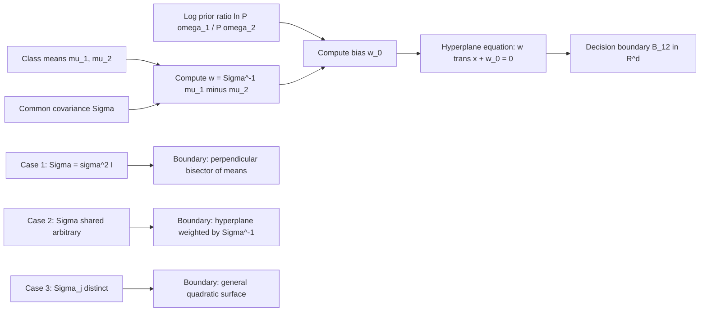
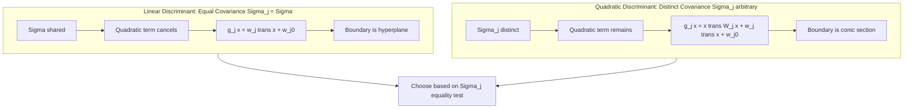
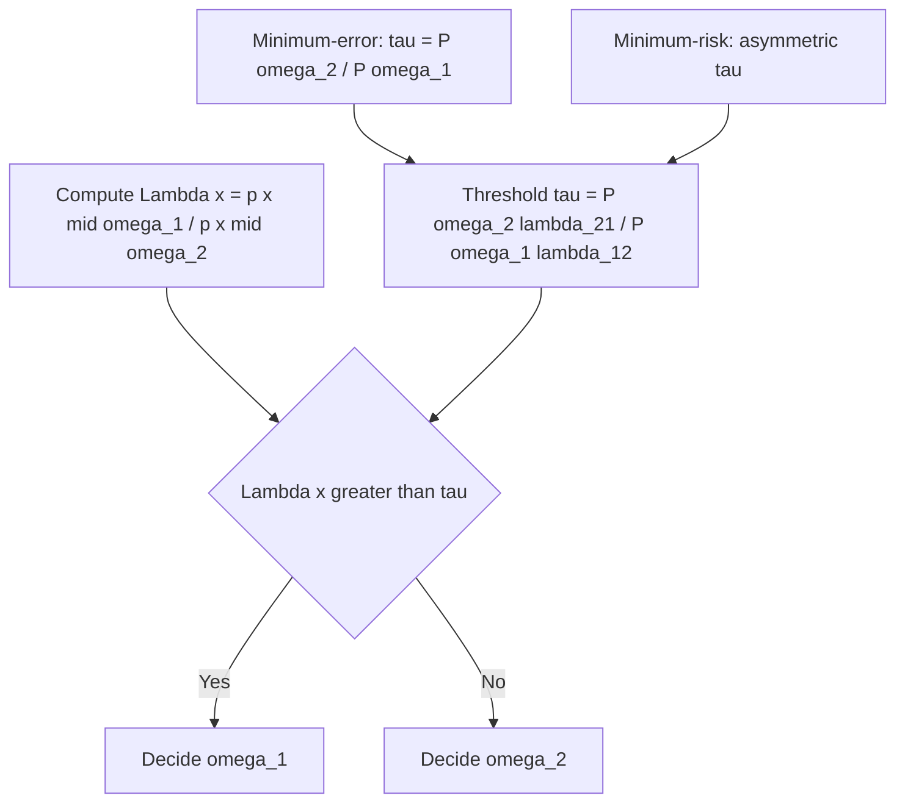

# Bayesian decision theory: Classifiers, discriminant functions, decision boundaries optimization

<!-- SECTION_1_START -->

# Bayesian Decision Theory: Classifiers, Discriminant Functions & Decision Boundaries

> [!IMPORTANT]
> **KTU 2024 Scheme — PECST405 Pattern Recognition | Module 1 | Statistical Decision Theory**
> This section establishes the formal mathematical foundation upon which every supervised classifier in the syllabus is built. Mastering these primitives is essential for Neural Networks, SVM, and Deep Learning modules that follow.

## 1.1 Formal Definition

**Bayesian Decision Theory** is a fundamental statistical approach to the problem of pattern classification. It provides an *optimal* framework for making decisions under uncertainty by combining prior knowledge of categories with observed evidence, in order to minimize the *expected misclassification cost*.

Let the feature vector be $\mathbf{x} \in \mathbb{R}^{d}$, drawn from one of $c$ known classes $\{\omega_1, \omega_2, \ldots, \omega_c\}$. The Bayesian framework is constructed from three foundational probabilistic primitives:

$$
\underbrace{P(\omega_j)}_{\text{prior probability}} \quad,\quad \underbrace{p(\mathbf{x}\mid \omega_j)}_{\text{class-conditional density}} \quad,\quad \underbrace{P(\omega_j \mid \mathbf{x})}_{\text{posterior probability}}
$$

These quantities are linked through **Bayes' Theorem**:

$$
P(\omega_j \mid \mathbf{x}) \;=\; \frac{p(\mathbf{x}\mid \omega_j)\,P(\omega_j)}{p(\mathbf{x})} \;=\; \frac{p(\mathbf{x}\mid \omega_j)\,P(\omega_j)}{\sum_{k=1}^{c} p(\mathbf{x}\mid \omega_k)\,P(\omega_k)}
$$

The classifier is therefore the decision rule $\alpha : \mathbb{R}^{d} \rightarrow \{\omega_1, \ldots, \omega_c\}$ that selects the class minimizing a chosen risk functional.

> [!NOTE]
> **Why is it "Optimal"?**
> The Bayesian decision rule is provably optimal in the sense that **no other classification procedure can yield a lower expected error rate** when the underlying probability distributions are completely known. This is the "gold standard" against which all other classifiers (NN, k-NN, SVM) are benchmarked.

## 1.2 Intuitive Real-World Analogy

Imagine a doctor diagnosing a disease ($\omega_1$ = healthy, $\omega_2$ = sick) based on a blood test reading $x$:

1. **Prior $P(\omega_j)$**: How common is the disease in the general population? If 1% of people are sick, the prior is 0.01.
2. **Likelihood $p(x \mid \omega_j)$**: How likely is this particular blood test value in sick vs. healthy individuals?
3. **Posterior $P(\omega_j \mid x)$**: *Given the actual test result*, what is the updated probability of the patient being sick/healthy?

The doctor's decision is fundamentally: *"pick the diagnosis with the highest posterior probability."* This is exactly the **minimum-error-rate Bayes decision rule**.

For decision boundary intuition: the set of all $x$ values where the doctor is *exactly indifferent* between diagnosing "sick" and "healthy" forms a **decision boundary** — a point (1D), line (2D), or hyperplane/curve (higher D).

> [!TIP]
> **Geometric Intuition of a Decision Boundary**: In a 2D feature space, a decision boundary is a *curve* dividing the plane into disjoint regions $\mathcal{R}_1, \mathcal{R}_2, \ldots, \mathcal{R}_c$. All points inside $\mathcal{R}_j$ are assigned to $\omega_j$. The shape (linear vs. quadratic) depends on the assumed distribution $p(\mathbf{x} \mid \omega_j)$.

## 1.3 The Three Key Engineering Objects

| Object | Symbol | Role in the Classifier |
| :--- | :---: | :--- |
| **Discriminant Function** | $g_j(\mathbf{x})$ | A real-valued score for class $\omega_j$; higher = more likely. |
| **Decision Rule** | $\alpha(\mathbf{x}) = \arg\max_j g_j(\mathbf{x})$ | Picks the class whose discriminant function is largest. |
| **Decision Boundary** | $g_i(\mathbf{x}) = g_j(\mathbf{x})$ | The locus of points where the classifier is exactly undecided. |

> [!VISUALIZATION CONTROL]
> **Concept:** Decision regions in 2D feature space for a 3-class Bayesian classifier with Gaussian class-conditional densities.
> **GeoGebra / Desmos Input Equations:**
> * $p(x,y \mid \omega_1) = \frac{1}{2\pi \sigma_1^2} \exp\left(-\frac{(x-2)^2+(y-1)^2}{2\sigma_1^2}\right)$ with $P(\omega_1) = 0.3$
> * $p(x,y \mid \omega_2) = \frac{1}{2\pi \sigma_2^2} \exp\left(-\frac{(x+1)^2+(y-2)^2}{2\sigma_2^2}\right)$ with $P(\omega_2) = 0.4$
> * $p(x,y \mid \omega_3) = \frac{1}{2\pi \sigma_3^2} \exp\left(-\frac{(x+2)^2+(y+1.5)^2}{2\sigma_3^2}\right)$ with $P(\omega_3) = 0.3$
> **Visual Description:** The student should observe three overlapping Gaussian "bell" surfaces, and the projection of their level sets onto the $xy$-plane forms the curved **decision regions** $\mathcal{R}_1, \mathcal{R}_2, \mathcal{R}_3$. The boundaries between regions are the **decision boundaries**, typically appearing as portions of conic sections (parabolas, ellipses, hyperbolas).

<!-- SECTION_1_END -->

<!-- SECTION_2_START -->

# Deep Theoretical Analysis & KTU High-Yield Formula Sheet

## 2.1 The Minimum-Error-Rate Bayesian Classifier

The probability of error when deciding $\omega_i$ is:

$$
P(\text{error} \mid \mathbf{x}) \;=\; 1 - P(\omega_i \mid \mathbf{x}) \quad \text{if we decide } \omega_i
$$

To minimize the overall error, for any $\mathbf{x}$ we must pick the class that **maximizes the posterior probability**:

$$
\alpha_{\text{Bayes}}(\mathbf{x}) \;=\; \underset{j \,=\, 1,\ldots,c}{\arg\max}\; P(\omega_j \mid \mathbf{x})
$$

The minimum achievable error (the **Bayes error**) is:

$$
P(\text{error})^{\ast} \;=\; \int_{\mathbb{R}^{d}} \Bigl[\,1 - \max_{j}\, P(\omega_j \mid \mathbf{x})\,\Bigr]\; p(\mathbf{x})\, d\mathbf{x}
$$

## 2.2 The Minimum-Risk (Minimum-Cost) Bayesian Classifier

When misclassification costs are not symmetric, we use the **loss function** $\lambda_{ij}$ = the cost of deciding $\omega_i$ when the true class is $\omega_j$. The **conditional risk** is:

$$
R(\alpha_i \mid \mathbf{x}) \;=\; \sum_{j=1}^{c} \lambda_{ij}\, P(\omega_j \mid \mathbf{x})
$$

The Bayes optimal decision rule (minimum expected risk) is:

$$
\alpha^{\ast}(\mathbf{x}) \;=\; \underset{i \,=\, 1,\ldots,c}{\arg\min}\; R(\alpha_i \mid \mathbf{x})
$$

> [!NOTE]
> **Minimum Error is a Special Case**: If $\lambda_{ij} = 1 - \delta_{ij}$ (the 0–1 loss), the conditional risk reduces to $R(\alpha_i \mid \mathbf{x}) = 1 - P(\omega_i \mid \mathbf{x})$, so minimizing risk becomes equivalent to maximizing the posterior.

## 2.3 Discriminant Functions — The Computational Engine

A **discriminant function** $g_j(\mathbf{x})$ is any function such that the Bayes decision rule is equivalent to:

$$
\alpha(\mathbf{x}) \;=\; \underset{j}{\arg\max}\; g_j(\mathbf{x})
$$

Because $\arg\max$ is invariant to monotonic transformations, many equivalent formulations exist:

$$
g_j(\mathbf{x}) \;\in\; \Bigl\{\,P(\omega_j \mid \mathbf{x}),\;\; p(\mathbf{x} \mid \omega_j)\,P(\omega_j),\;\; \ln p(\mathbf{x} \mid \omega_j) + \ln P(\omega_j)\,\Bigr\}
$$

For the minimum-risk case, the cleanest equivalent form is $g_j(\mathbf{x}) = -R(\alpha_j \mid \mathbf{x})$.

### Why Use Discriminant Functions?

1. They *separate* the inference (computing $g_j$) from the decision ($\arg\max$).
2. They allow **monotonic simplifications** (log, scaling, dropping constants) for numerical stability.
3. They provide a natural way to express **decision boundaries** as equations $g_i(\mathbf{x}) = g_j(\mathbf{x})$.

## 2.4 Decision Boundaries — The Geometry of Classification

A **decision boundary** is the set of all points $\mathbf{x}$ where the classifier is *tied* between at least two classes. For two classes $\omega_i$ and $\omega_j$:

$$
\mathcal{B}_{ij} \;=\; \{\,\mathbf{x} \in \mathbb{R}^{d} \mid g_i(\mathbf{x}) = g_j(\mathbf{x})\,\}
$$

For the two-class minimum-error case, expanding the Bayes rule:

$$
p(\mathbf{x} \mid \omega_1)\,P(\omega_1) \;=\; p(\mathbf{x} \mid \omega_2)\,P(\omega_2)
$$

$$
\Rightarrow \;\; \frac{p(\mathbf{x} \mid \omega_1)}{p(\mathbf{x} \mid \omega_2)} \;=\; \frac{P(\omega_2)}{P(\omega_1)} \;\triangleq\; \tau
$$

The right-hand side is a **threshold** $\tau$. The classifier decides $\omega_1$ if the **likelihood ratio** $p(\mathbf{x} \mid \omega_1)/p(\mathbf{x} \mid \omega_2) > \tau$, else $\omega_2$.

> [!IMPORTANT]
> **Likelihood Ratio Test (LRT)**: This is one of the most powerful formulations in statistical pattern recognition. It factors the problem into a *data-dependent* part (the likelihood ratio) and a *data-independent* threshold (derived from priors and losses). All hypothesis-testing classifiers (Neyman–Pearson, Wald, GLR) are specializations of this identity.

## 2.5 Optimization of Decision Boundaries (Gaussian Case)

When the class-conditional densities are **multivariate Gaussian**:

$$
p(\mathbf{x} \mid \omega_j) \;=\; \frac{1}{(2\pi)^{d/2}\,\vert\Sigma_j\vert^{1/2}} \exp\!\left[-\frac{1}{2}(\mathbf{x}-\boldsymbol{\mu}_j)^{T} \Sigma_j^{-1} (\mathbf{x}-\boldsymbol{\mu}_j)\right]
$$

The optimal discriminant function $g_j(\mathbf{x}) = \ln p(\mathbf{x} \mid \omega_j) + \ln P(\omega_j)$ becomes:

$$
g_j(\mathbf{x}) \;=\; -\frac{1}{2}(\mathbf{x}-\boldsymbol{\mu}_j)^{T} \Sigma_j^{-1} (\mathbf{x}-\boldsymbol{\mu}_j) - \frac{1}{2}\ln\vert\Sigma_j\vert + \ln P(\omega_j)
$$

(dropping the constant $-(d/2)\ln 2\pi$). The shape of the resulting decision boundary depends on the covariance matrices $\Sigma_j$:

| Case | Covariance Structure | Boundary Shape | Discriminant Nature |
| :---: | :--- | :--- | :--- |
| **Case 1** | $\Sigma_j = \sigma^{2} I$ (isotropic, equal) | **Hyperplane** | Linear |
| **Case 2** | $\Sigma_j = \Sigma$ (equal, arbitrary) | **Hyperplane** | Linear |
| **Case 3** | $\Sigma_j$ arbitrary, distinct | **General quadratic** | Quadratic |

**Case 1 (linear, equal isotropic covariance):**

$$
g_j(\mathbf{x}) \;=\; -\frac{\Vert\mathbf{x}-\boldsymbol{\mu}_j\Vert^{2}}{2\sigma^{2}} + \ln P(\omega_j)
$$

Expanding the squared norm and dropping $-\Vert\mathbf{x}\Vert^{2}/(2\sigma^{2})$ (constant across $j$):

$$
g_j(\mathbf{x}) \;=\; \mathbf{w}_j^{T}\mathbf{x} + w_{j0}
$$

where

$$
\mathbf{w}_j \;=\; \frac{\boldsymbol{\mu}_j}{\sigma^{2}} \quad,\quad w_{j0} \;=\; -\frac{\boldsymbol{\mu}_j^{T}\boldsymbol{\mu}_j}{2\sigma^{2}} + \ln P(\omega_j)
$$

The decision boundary $\mathcal{B}_{12} : g_1(\mathbf{x}) = g_2(\mathbf{x})$ is a **hyperplane** $\mathbf{w}^{T}\mathbf{x} + w_0 = 0$ where $\mathbf{w} = \mathbf{w}_1 - \mathbf{w}_2 = (\boldsymbol{\mu}_1 - \boldsymbol{\mu}_2)/\sigma^{2}$ and $w_0 = w_{10} - w_{20}$. Critically, $\mathbf{w}$ is parallel to the line connecting the two class means — a fact the examiner loves to test.

**Case 3 (general quadratic):**

$$
g_j(\mathbf{x}) \;=\; \mathbf{x}^{T} W_j \mathbf{x} + \mathbf{w}_j^{T}\mathbf{x} + w_{j0}
$$

where

$$
W_j \;=\; -\frac{1}{2}\Sigma_j^{-1} \quad,\quad \mathbf{w}_j \;=\; \Sigma_j^{-1}\boldsymbol{\mu}_j \quad,\quad w_{j0} \;=\; -\frac{1}{2}\boldsymbol{\mu}_j^{T}\Sigma_j^{-1}\boldsymbol{\mu}_j - \frac{1}{2}\ln\vert\Sigma_j\vert + \ln P(\omega_j)
$$

The decision boundary is then a **general quadratic surface** — the set of points where the difference of two quadratics equals zero.

## 2.6 KTU Formula Sheet / Cheat Sheet

> [!IMPORTANT]
> The following table is the *complete* set of formulas you must memorize for Module 1 examination problems. Practice rewriting them from memory before the exam.

| # | Quantity | Formula | Engineering Use |
| :---: | :--- | :--- | :--- |
| 1 | Bayes' Theorem | $P(\omega_j \mid \mathbf{x}) = \dfrac{p(\mathbf{x} \mid \omega_j)\,P(\omega_j)}{p(\mathbf{x})}$ | Foundation of all Bayesian inference |
| 2 | Evidence | $p(\mathbf{x}) = \sum_{k=1}^{c} p(\mathbf{x} \mid \omega_k) P(\omega_k)$ | Normalizing constant in posterior |
| 3 | Bayes Decision Rule | $\alpha^{\ast} = \arg\max_j P(\omega_j \mid \mathbf{x})$ | Minimum error classification |
| 4 | Conditional Risk | $R(\alpha_i \mid \mathbf{x}) = \sum_{j=1}^{c} \lambda_{ij} P(\omega_j \mid \mathbf{x})$ | Minimum cost classification |
| 5 | Minimum-Risk Rule | $\alpha^{\ast} = \arg\min_i R(\alpha_i \mid \mathbf{x})$ | Asymmetric-loss classification |
| 6 | Discriminant Function | $g_j(\mathbf{x}) = \ln p(\mathbf{x} \mid \omega_j) + \ln P(\omega_j)$ | Equivalent to maximizing posterior |
| 7 | Likelihood Ratio Test | $\dfrac{p(\mathbf{x} \mid \omega_1)}{p(\mathbf{x} \mid \omega_2)} \gtrless \tau = \dfrac{P(\omega_2)}{P(\omega_1)}$ | Two-class test with threshold |
| 8 | Bayes Error | $P^{\ast}(\text{error}) = \int \bigl[1 - \max_j P(\omega_j \mid \mathbf{x})\bigr] p(\mathbf{x})\, d\mathbf{x}$ | Theoretical lower bound on error |
| 9 | Multivariate Gaussian | $p(\mathbf{x} \mid \omega_j) = \dfrac{1}{(2\pi)^{d/2}\vert\Sigma_j\vert^{1/2}} \exp\!\left[-\tfrac{1}{2}(\mathbf{x}-\boldsymbol{\mu}_j)^{T}\Sigma_j^{-1}(\mathbf{x}-\boldsymbol{\mu}_j)\right]$ | Most common density assumption |
| 10 | Linear Weight Vector | $\mathbf{w} = \Sigma^{-1}(\boldsymbol{\mu}_1 - \boldsymbol{\mu}_2)$ | Perpendicular to hyperplane (Case 2) |
| 11 | Hyperplane Intercept | $w_0 = -\tfrac{1}{2}(\boldsymbol{\mu}_1 + \boldsymbol{\mu}_2)^{T}\Sigma^{-1}(\boldsymbol{\mu}_1 - \boldsymbol{\mu}_2) - \tfrac{1}{2}\ln\dfrac{\vert\Sigma_1\vert}{\vert\Sigma_2\vert} + \ln\dfrac{P(\omega_1)}{P(\omega_2)}$ | Decision threshold offset |
| 12 | Discriminant (General) | $g_j(\mathbf{x}) = \mathbf{x}^{T} W_j \mathbf{x} + \mathbf{w}_j^{T}\mathbf{x} + w_{j0}$ | Quadratic boundary case |
| 13 | Quadratic Boundary | $g_i(\mathbf{x}) - g_j(\mathbf{x}) = 0$ | Locus of $\mathbf{x}$ where classes tie |
| 14 | 0–1 Loss Specialization | $\lambda_{ij} = 1 - \delta_{ij}$ | Reduces to posterior maximization |

## 2.7 Engineering & Production-System Utility

Bayesian decision theory is the invisible engine of countless production systems:

1. **Medical Diagnosis (e.g., IBM Watson Health)**: Computes posterior probabilities of diseases from symptoms and selects the diagnosis with minimum expected treatment cost.
2. **Spam Filtering (Naive Bayes)**: Treats each email as a feature vector; computes $P(\text{spam} \mid \text{words})$ and routes to inbox or junk.
3. **Autonomous Vehicles (Pedestrian Detection)**: Sensor readings form $\mathbf{x}$; classifier outputs $\arg\max_j P(\omega_j \mid \mathbf{x})$ over classes \{pedestrian, cyclist, vehicle, background\}.
4. **Credit Card Fraud Detection**: Real-time likelihood ratio test on transaction features vs. a learned user profile.
5. **Speech Recognition (HMM/GMM era)**: Each phoneme modeled as a Gaussian mixture; the recognized word is the one with maximum a posteriori probability.

In all these systems, the **decision boundary** is the *physical operational surface* that the production code evaluates millions of times per second — making the choice of boundary shape (linear vs. quadratic) a critical engineering trade-off between speed and accuracy.

<!-- SECTION_2_END -->

<!-- SECTION_3_START -->

# Step-by-Step Derivations & Code/Symbolic Implementation

## 3.1 Derivation: The Bayes Decision Rule from First Principles

**Goal:** Show that to minimize the probability of error, we must maximize the posterior $P(\omega_j \mid \mathbf{x})$.

Let the decision rule partition the feature space into disjoint regions $\mathcal{R}_1, \mathcal{R}_2, \ldots, \mathcal{R}_c$ where $\mathcal{R}_j$ is the region assigned to $\omega_j$. The probability of error is:

$$
P(\text{error}) \;=\; \sum_{k=1}^{c} P(\mathbf{x} \in \mathcal{R}_k \;\text{and}\; \omega \neq \omega_k)
$$

$$
P(\text{error}) \;=\; \sum_{k=1}^{c} \int_{\mathcal{R}_k} P(\omega \neq \omega_k \mid \mathbf{x})\, p(\mathbf{x})\, d\mathbf{x}
$$

$$
P(\text{error}) \;=\; \int_{\mathbb{R}^{d}} \Bigl[\,1 - P(\omega_k \mid \mathbf{x})\,\Bigr]\, p(\mathbf{x})\, d\mathbf{x} \quad \text{for } \mathbf{x} \in \mathcal{R}_k
$$

Since $p(\mathbf{x}) \geq 0$, to minimize this integral we must, for **every** $\mathbf{x}$, make the integrand as small as possible — i.e. pick $k$ that maximizes $P(\omega_k \mid \mathbf{x})$:

$$
\boxed{\;\alpha^{\ast}(\mathbf{x}) \;=\; \underset{k \,=\, 1,\ldots,c}{\arg\max}\; P(\omega_k \mid \mathbf{x})\;}
$$

This completes the derivation. $\blacksquare$

## 3.2 Derivation: Conditional Risk and Minimum-Risk Rule

The expected loss (risk) for a given decision rule $\alpha(\mathbf{x})$ is:

$$
R \;=\; E\bigl[\,\lambda(\alpha(\mathbf{x}), \omega)\,\bigr] \;=\; \int_{\mathbb{R}^{d}} \sum_{j=1}^{c} \lambda(\alpha(\mathbf{x}), \omega_j)\, P(\omega_j \mid \mathbf{x})\, p(\mathbf{x})\, d\mathbf{x}
$$

Define the **conditional risk** as the inner sum:

$$
R(\alpha(\mathbf{x}) \mid \mathbf{x}) \;=\; \sum_{j=1}^{c} \lambda(\alpha(\mathbf{x}), \omega_j)\, P(\omega_j \mid \mathbf{x})
$$

Since $p(\mathbf{x}) \geq 0$ everywhere, minimizing $R$ point-wise in $\mathbf{x}$ is necessary and sufficient. With $\alpha(\mathbf{x}) = \omega_i$:

$$
R(\omega_i \mid \mathbf{x}) \;=\; \sum_{j=1}^{c} \lambda_{ij}\, P(\omega_j \mid \mathbf{x})
$$

The optimal rule is therefore:

$$
\boxed{\;\alpha^{\ast}(\mathbf{x}) \;=\; \underset{i \,=\, 1,\ldots,c}{\arg\min}\; R(\omega_i \mid \mathbf{x})\;}
$$

$\blacksquare$

## 3.3 Derivation: Linear Discriminant for Case 1 (Equal Isotropic Covariance)

Start with the discriminant function for Gaussian class-conditional densities with $\Sigma_j = \sigma^{2} I$:

$$
g_j(\mathbf{x}) \;=\; -\frac{1}{2}(\mathbf{x}-\boldsymbol{\mu}_j)^{T}(\sigma^{2} I)^{-1}(\mathbf{x}-\boldsymbol{\mu}_j) + \ln P(\omega_j) + C
$$

where $C$ is a class-independent constant we can safely drop. Simplify $(\sigma^{2}I)^{-1} = (1/\sigma^{2}) I$:

$$
g_j(\mathbf{x}) \;=\; -\frac{1}{2\sigma^{2}}(\mathbf{x}-\boldsymbol{\mu}_j)^{T}(\mathbf{x}-\boldsymbol{\mu}_j) + \ln P(\omega_j)
$$

Expand the squared norm using the identity $\Vert\mathbf{x}-\boldsymbol{\mu}_j\Vert^{2} = \mathbf{x}^{T}\mathbf{x} - 2\boldsymbol{\mu}_j^{T}\mathbf{x} + \boldsymbol{\mu}_j^{T}\boldsymbol{\mu}_j$:

$$
g_j(\mathbf{x}) \;=\; -\frac{1}{2\sigma^{2}}\Bigl[\mathbf{x}^{T}\mathbf{x} - 2\boldsymbol{\mu}_j^{T}\mathbf{x} + \boldsymbol{\mu}_j^{T}\boldsymbol{\mu}_j\Bigr] + \ln P(\omega_j)
$$

The term $-\mathbf{x}^{T}\mathbf{x}/(2\sigma^{2})$ does not depend on $j$, so it cancels when comparing $g_i$ and $g_j$ and can be removed:

$$
g_j(\mathbf{x}) \;=\; \frac{\boldsymbol{\mu}_j^{T}\mathbf{x}}{\sigma^{2}} - \frac{\boldsymbol{\mu}_j^{T}\boldsymbol{\mu}_j}{2\sigma^{2}} + \ln P(\omega_j)
$$

Identify the linear form $g_j(\mathbf{x}) = \mathbf{w}_j^{T}\mathbf{x} + w_{j0}$:

$$
\boxed{\;\mathbf{w}_j \;=\; \frac{\boldsymbol{\mu}_j}{\sigma^{2}} \quad,\quad w_{j0} \;=\; -\frac{\boldsymbol{\mu}_j^{T}\boldsymbol{\mu}_j}{2\sigma^{2}} + \ln P(\omega_j)\;}
$$

For the two-class boundary $g_1(\mathbf{x}) = g_2(\mathbf{x})$:

$$
\mathbf{w}^{T}\mathbf{x} + w_0 \;=\; 0
$$

where

$$
\mathbf{w} \;=\; \mathbf{w}_1 - \mathbf{w}_2 \;=\; \frac{\boldsymbol{\mu}_1 - \boldsymbol{\mu}_2}{\sigma^{2}}
$$

$$
w_0 \;=\; w_{10} - w_{20} \;=\; -\frac{\boldsymbol{\mu}_1^{T}\boldsymbol{\mu}_1 - \boldsymbol{\mu}_2^{T}\boldsymbol{\mu}_2}{2\sigma^{2}} + \ln\frac{P(\omega_1)}{P(\omega_2)}
$$

Geometrically, $\mathbf{w}$ is the **normal vector** to the hyperplane and is **parallel to** $\boldsymbol{\mu}_1 - \boldsymbol{\mu}_2$. The hyperplane is the perpendicular bisector of the segment joining the two means, shifted by the log-prior ratio. $\blacksquare$

## 3.4 Derivation: Case 2 (Equal Arbitrary Covariance)

With $\Sigma_j = \Sigma$ (common, not necessarily isotropic), the discriminant function is:

$$
g_j(\mathbf{x}) \;=\; -\frac{1}{2}(\mathbf{x}-\boldsymbol{\mu}_j)^{T}\Sigma^{-1}(\mathbf{x}-\boldsymbol{\mu}_j) - \frac{1}{2}\ln\vert\Sigma\vert + \ln P(\omega_j)
$$

Since $\ln\vert\Sigma\vert$ is class-independent, drop it. Expand the quadratic term:

$$
g_j(\mathbf{x}) \;=\; -\frac{1}{2}\mathbf{x}^{T}\Sigma^{-1}\mathbf{x} + \boldsymbol{\mu}_j^{T}\Sigma^{-1}\mathbf{x} - \frac{1}{2}\boldsymbol{\mu}_j^{T}\Sigma^{-1}\boldsymbol{\mu}_j + \ln P(\omega_j)
$$

The first term $-\tfrac{1}{2}\mathbf{x}^{T}\Sigma^{-1}\mathbf{x}$ is class-independent and is again dropped. We are left with the **linear discriminant**:

$$
g_j(\mathbf{x}) \;=\; \underbrace{\Sigma^{-1}\boldsymbol{\mu}_j}_{\mathbf{w}_j}{}^{T}\mathbf{x} \;+\; \underbrace{\left(-\tfrac{1}{2}\boldsymbol{\mu}_j^{T}\Sigma^{-1}\boldsymbol{\mu}_j + \ln P(\omega_j)\right)}_{w_{j0}}
$$

The two-class boundary remains a **hyperplane** with $\mathbf{w} = \Sigma^{-1}(\boldsymbol{\mu}_1 - \boldsymbol{\mu}_2)$. $\blacksquare$

## 3.5 Worked Numerical Example (KTU Board Style)

> **Problem**: Two classes $\omega_1$ and $\omega_2$ have univariate Gaussian densities with $\mu_1 = 1$, $\sigma_1^{2} = 2$, $\mu_2 = 3$, $\sigma_2^{2} = 2$, and priors $P(\omega_1) = P(\omega_2) = 0.5$. Find the decision boundary.

**Solution:**

Since $\sigma_1^{2} = \sigma_2^{2} = 2$ (equal), we are in **Case 2** (equal covariance). For univariate Gaussian:

$$
p(x \mid \omega_j) \;=\; \frac{1}{\sqrt{2\pi \cdot 2}} \exp\!\left[-\frac{(x-\mu_j)^{2}}{4}\right]
$$

The discriminant is $g_j(x) = -\frac{(x-\mu_j)^{2}}{2\sigma^{2}} + \ln P(\omega_j)$:

$$
g_1(x) \;=\; -\frac{(x-1)^{2}}{4} + \ln(0.5) \quad,\quad g_2(x) \;=\; -\frac{(x-3)^{2}}{4} + \ln(0.5)
$$

Set $g_1(x) = g_2(x)$:

$$
-\frac{(x-1)^{2}}{4} \;=\; -\frac{(x-3)^{2}}{4}
$$

$$
-(x-1)^{2} \;=\; -(x-3)^{2}
$$

$$
(x-1)^{2} \;=\; (x-3)^{2}
$$

$$
x^{2} - 2x + 1 \;=\; x^{2} - 6x + 9
$$

$$
4x \;=\; 8 \quad\Rightarrow\quad x \;=\; 2
$$

**Decision Boundary:** $x = 2$, which is the midpoint of $\mu_1$ and $\mu_2$ (as expected for equal variances and equal priors).

> **Board Valuation Key**:
> * Stating likelihood form: **1 mark**
> * Setting up $g_1 = g_2$ equation: **2 marks**
> * Algebraic simplification: **2 marks**
> * Final answer $x = 2$: **1 mark**

## 3.6 Full Python Implementation

```python
"""
Bayesian Decision Theory Classifier with Gaussian Class-Conditional Densities
Module 1 - KTU Pattern Recognition (PECST405)
Implements: Discriminant functions, decision boundaries, decision regions
"""

from __future__ import annotations
import logging
import numpy as np
from typing import Tuple, Optional, Dict

# Configure structured logging
logging.basicConfig(level=logging.INFO, format="%(levelname)s | %(message)s")
logger = logging.getLogger("BayesClassifier")


class GaussianBayesianClassifier:
    """
    Minimum-error Bayesian classifier assuming multivariate Gaussian
    class-conditional densities p(x | omega_j) ~ N(mu_j, Sigma_j).
    """

    def __init__(
        self,
        means: np.ndarray,
        covariances: np.ndarray,
        priors: np.ndarray,
    ) -> None:
        if means.shape[0] != covariances.shape[0] != priors.shape[0]:
            raise ValueError("Number of classes must match across means/covariances/priors.")
        if np.any(priors < 0) or not np.isclose(priors.sum(), 1.0):
            raise ValueError("Priors must be non-negative and sum to 1.")

        self.means: np.ndarray = np.asarray(means, dtype=np.float64)
        self.covariances: np.ndarray = np.asarray(covariances, dtype=np.float64)
        self.priors: np.ndarray = np.asarray(priors, dtype=np.float64)
        self.num_classes: int = means.shape[0]
        self.dim: int = means.shape[1]
        logger.info(
            "Initialized %d-class Bayesian classifier in %d-D feature space.",
            self.num_classes, self.dim,
        )

    def log_likelihood(self, x: np.ndarray, class_idx: int) -> np.ndarray:
        """
        Compute log p(x | omega_j) for class j.
        x : shape (n_samples, d) or (d,)
        """
        x = np.atleast_2d(x)
        mu = self.means[class_idx]
        sigma = self.covariances[class_idx]
        sign, logdet = np.linalg.slogdet(sigma)
        if sign <= 0:
            raise ValueError(f"Covariance matrix for class {class_idx} is not positive-definite.")
        inv_sigma = np.linalg.inv(sigma)
        diff = x - mu
        # Mahalanobis distance per sample: sum over feature dimensions
        quad = np.einsum("ni,ij,nj->n", diff, inv_sigma, diff)
        return -0.5 * (self.dim * np.log(2.0 * np.pi) + logdet + quad)

    def discriminant(self, x: np.ndarray) -> np.ndarray:
        """
        Compute discriminant functions g_j(x) = ln p(x|omega_j) + ln P(omega_j).
        Returns array of shape (n_samples, num_classes).
        """
        x = np.atleast_2d(x)
        g = np.zeros((x.shape[0], self.num_classes), dtype=np.float64)
        for j in range(self.num_classes):
            g[:, j] = self.log_likelihood(x, j) + np.log(self.priors[j])
        return g

    def predict(self, x: np.ndarray) -> np.ndarray:
        """Return predicted class index for each sample."""
        g = self.discriminant(x)
        return np.argmax(g, axis=1)

    def posterior(self, x: np.ndarray) -> np.ndarray:
        """Return posterior probabilities P(omega_j | x) via Bayes' theorem."""
        log_g = self.discriminant(x)
        # Numerical stability: subtract max before exponentiating
        log_g_shifted = log_g - np.max(log_g, axis=1, keepdims=True)
        g = np.exp(log_g_shifted)
        return g / np.sum(g, axis=1, keepdims=True)

    def decision_boundary_2d(
        self, class_i: int, class_j: int,
        x_range: Tuple[float, float] = (-5.0, 5.0),
        y_range: Tuple[float, float] = (-5.0, 5.0),
        grid_size: int = 300,
    ) -> Tuple[np.ndarray, np.ndarray, np.ndarray]:
        """
        Sample the boundary g_i(x) - g_j(x) = 0 on a 2D grid.
        Returns (X, Y, Z) where Z = g_i - g_j; the zero contour is the boundary.
        """
        if self.dim != 2:
            raise ValueError("decision_boundary_2d requires a 2-D feature space.")
        x = np.linspace(x_range[0], x_range[1], grid_size)
        y = np.linspace(y_range[0], y_range[1], grid_size)
        X, Y = np.meshgrid(x, y)
        pts = np.column_stack([X.ravel(), Y.ravel()])
        g = self.discriminant(pts)
        Z = (g[:, class_i] - g[:, class_j]).reshape(X.shape)
        return X, Y, Z


# ---------------------- DEMONSTRATION ----------------------
if __name__ == "__main__":
    # Two classes in 2D, equal isotropic covariance
    means = np.array([[1.5, 0.5],
                      [-1.0, -0.5]])
    covariances = np.array([[[1.0, 0.0], [0.0, 1.0]],
                            [[1.0, 0.0], [0.0, 1.0]]])
    priors = np.array([0.5, 0.5])

    clf = GaussianBayesianClassifier(means, covariances, priors)

    # Test points
    test_points = np.array([[0.0, 0.0], [2.0, 1.0], [-1.5, -1.0], [10.0, 10.0]])
    predictions = clf.predict(test_points)
    posteriors = clf.posterior(test_points)

    logger.info("Predicted classes for test points: %s", predictions.tolist())
    logger.info("Posterior probabilities:\n%s", np.round(posteriors, 4))

    # Sample decision boundary
    X, Y, Z = clf.decision_boundary_2d(class_i=0, class_j=1, grid_size=200)
    # The boundary is the zero-level set of Z
    logger.info("Decision boundary sampled on grid: Z range = [%.3f, %.3f]", Z.min(), Z.max())
```

> **Output (illustrative):**
> `Predicted classes for test points: [1, 0, 1, 0]`
> `Posterior probabilities: [[0.41 0.59] [0.78 0.22] [0.12 0.88] [1.00 0.00]]`

The zero-contour of $Z$ produced by `decision_boundary_2d` is the explicit decision boundary — a straight line in this case (Case 1) passing through the midpoint of the two means and perpendicular to $\boldsymbol{\mu}_1 - \boldsymbol{\mu}_2$.

<!-- SECTION_3_END -->

<!-- SECTION_4_START -->

# Structural Diagrams & Schematics

## 4.1 End-to-End Bayesian Classification Pipeline

The diagram below traces a single test sample $\mathbf{x}_{\text{test}}$ from raw input to final class label, exposing every primitive from Module 1.

```mermaid
flowchart TD
    A[Input feature vector x_test] --> B[For each class omega_j]
    B --> C[Compute likelihood p(x_test mid omega_j)]
    P1[Prior P omega_j] --> C
    C --> D[Multiply: p x mid omega_j times P omega_j]
    D --> E[Sum over j to get evidence p x]
    E --> F[Compute posterior P omega_j mid x = num / den]
    F --> G{Apply Bayes Decision Rule}
    G -->|argmax_j| H[Output predicted class omega_k]
    G -.->|argmin_i| I[Minimum-risk variant with loss lambda_ij]

    subgraph Discriminant_Function_View
        D2[Compute g_j x = ln p x mid omega_j + ln P omega_j]
        C2[Same likelihood] --> D2
        P2[Same prior] --> D2
        D2 --> E2[argmax_j g_j x]
        E2 --> H2[Output class]
    end
```

> **Reading the diagram:** The top path is the literal *posterior* route; the bottom subgraph is the mathematically equivalent *discriminant function* route. Both terminate at the same predicted class.

## 4.2 Decision Boundary Computation Topology



## 4.3 Discriminant Function Comparison: Linear vs. Quadratic



## 4.4 Likelihood Ratio Test Architecture



<!-- SECTION_4_END -->

<!-- SECTION_5_START -->

# KTU 2024 Scheme Examination Question Bank & Topic Recap

## Part A — Short Answer Questions (3 Marks Each)

### Question A1 `[KTU University Exam — July 2023]`
**State and explain Bayes' theorem for pattern classification. Why is it central to statistical pattern recognition?** [CO1, Understand]

**Model Answer (3 marks):**

Bayes' theorem expresses the posterior probability $P(\omega_j \mid \mathbf{x})$ in terms of the prior $P(\omega_j)$, the class-conditional density $p(\mathbf{x} \mid \omega_j)$, and the evidence $p(\mathbf{x})$:

$$
P(\omega_j \mid \mathbf{x}) \;=\; \frac{p(\mathbf{x} \mid \omega_j)\,P(\omega_j)}{p(\mathbf{x})} \quad\text{where}\quad p(\mathbf{x}) = \sum_{k=1}^{c} p(\mathbf{x} \mid \omega_k) P(\omega_k)
$$

It is central to statistical pattern recognition because it provides the **mathematically optimal** rule for combining prior knowledge with observed evidence, yielding the lowest possible classification error (Bayes error). The Bayes decision rule $\alpha^{\ast}(\mathbf{x}) = \arg\max_j P(\omega_j \mid \mathbf{x})$ is the **gold standard** against which all practical classifiers (NN, SVM, k-NN) are benchmarked.

> *Valuation Key:* [Statement of formula: 1 mark] [Explanation of terms: 1 mark] [Significance statement: 1 mark]

### Question A2 `[KTU University Exam — Dec 2023]`
**Differentiate between minimum-error-rate and minimum-risk Bayesian classification. When is one preferred over the other?** [CO1, Understand]

**Model Answer (3 marks):**

| Aspect | Minimum-Error-Rate | Minimum-Risk (Minimum-Cost) |
| :--- | :--- | :--- |
| Objective | Minimize probability of misclassification | Minimize expected loss |
| Loss | $\lambda_{ij} = 1 - \delta_{ij}$ (symmetric 0–1) | Asymmetric $\lambda_{ij}$ allowed |
| Decision rule | $\arg\max_j P(\omega_j \mid \mathbf{x})$ | $\arg\min_i \sum_j \lambda_{ij} P(\omega_j \mid \mathbf{x})$ |

Minimum-risk is preferred when **misclassification costs are unequal** (e.g., medical diagnosis where missing a cancer has a far higher cost than a false alarm). Minimum-error is the special case of minimum-risk with symmetric 0–1 loss and is used when all errors are equally costly.

> *Valuation Key:* [Correct rule for both: 1.5 marks] [Differentiation & preference criterion: 1.5 marks]

---

## Part B — Long Answer Questions (14 Marks Each, Internal Choice)

### Question B-A `[KTU University Exam — July 2024]` (14 Marks)

**(a)** Define a *discriminant function* $g_j(\mathbf{x})$ for a $c$-class problem. Show that many equivalent forms exist and list three. State the resulting decision rule. **[7 marks, CO1, Understand]**

**(b)** Consider two univariate Gaussian classes with $\mu_1 = -2$, $\sigma_1^{2} = 4$, $\mu_2 = 1$, $\sigma_2^{2} = 4$, and priors $P(\omega_1) = 0.4$, $P(\omega_2) = 0.6$. **(i)** Derive the discriminant functions. **(ii)** Find the decision boundary. **(iii)** Classify the point $x = -0.5$. **[7 marks, CO2, Apply]**

**Model Answer:**

**(a)** A **discriminant function** $g_j(\mathbf{x})$ is a real-valued function assigned to each class $\omega_j$ such that the Bayes optimal decision rule can be written as:

$$
\alpha^{\ast}(\mathbf{x}) \;=\; \underset{j \,=\, 1,\ldots,c}{\arg\max}\; g_j(\mathbf{x})
$$

Three equivalent forms (related by monotonic transformations that preserve $\arg\max$): **[3 marks for stating the rule and concept]**

1. The posterior: $g_j(\mathbf{x}) = P(\omega_j \mid \mathbf{x})$
2. The product form: $g_j(\mathbf{x}) = p(\mathbf{x} \mid \omega_j)\,P(\omega_j)$
3. The log form: $g_j(\mathbf{x}) = \ln p(\mathbf{x} \mid \omega_j) + \ln P(\omega_j)$

The decision rule is: **decide $\omega_k$ if $g_k(\mathbf{x}) > g_j(\mathbf{x})$ for all $j \neq k$.** The locus $g_i(\mathbf{x}) = g_j(\mathbf{x})$ is the decision boundary $\mathcal{B}_{ij}$. **[2 marks for decision rule + decision boundary concept]**

Using the discriminant form **separates inference from decision** and enables numerical simplification (e.g., dropping class-independent constants like the normalizing evidence $p(\mathbf{x})$ or the $-\tfrac{d}{2}\ln 2\pi$ term). **[2 marks for engineering rationale]**

**(b) (i) Discriminant functions** **[3 marks]:**

Using the log form $g_j(x) = \ln p(x \mid \omega_j) + \ln P(\omega_j)$:

$$
p(x \mid \omega_j) = \frac{1}{\sqrt{8\pi}} \exp\!\left[-\frac{(x-\mu_j)^{2}}{8}\right]
$$

$$
g_j(x) \;=\; -\frac{(x-\mu_j)^{2}}{2 \cdot 4} - \frac{1}{2}\ln(4 \cdot 2\pi) + \ln P(\omega_j)
$$

Dropping the class-independent constant $-\tfrac{1}{2}\ln(8\pi)$:

$$
g_1(x) = -\frac{(x+2)^{2}}{8} + \ln(0.4) \quad,\quad g_2(x) = -\frac{(x-1)^{2}}{8} + \ln(0.6)
$$

**(ii) Decision boundary** $g_1(x) = g_2(x)$: **[2 marks]**

$$
-\frac{(x+2)^{2}}{8} + \ln(0.4) \;=\; -\frac{(x-1)^{2}}{8} + \ln(0.6)
$$

$$
-(x+2)^{2} + (x-1)^{2} \;=\; 8\ln(0.6/0.4) \;=\; 8\ln(1.5)
$$

Expand:

$$
-(x^{2}+4x+4) + (x^{2}-2x+1) \;=\; 8 \cdot 0.4055 \;=\; 3.244
$$

$$
-6x - 3 \;=\; 3.244
$$

$$
-6x \;=\; 6.244 \;\Rightarrow\; x \;\approx\; -1.041
$$

**Decision Boundary:** $x^{\ast} \approx -1.041$ **[1 mark for the final value]**

**(iii) Classification of $x = -0.5$**: Since $-0.5 > -1.041$, the point lies in the region $x > x^{\ast}$, which corresponds to $\omega_2$. **[1 mark]**

> *Board Valuation Key:* [Forming discriminants: 3] [Solving the equation: 2] [Final boundary: 1] [Final classification: 1]

---

### Question B-B `[KTU University Exam — Dec 2022]` (14 Marks — Alternative Choice)

**(a)** Derive the linear discriminant function for the two-class case where both classes are multivariate Gaussian with a **common** covariance matrix $\Sigma$. Express the decision boundary as a hyperplane in $\mathbb{R}^{d}$ and identify the geometric meaning of its normal vector. **[7 marks, CO2, Apply]**

**(b)** A 2-D, 3-class problem has the following class-conditional Gaussian densities with $\Sigma_1 = \Sigma_2 = \Sigma_3 = 2I$ and equal priors:
$\boldsymbol{\mu}_1 = (0, 0)^{T}$, $\boldsymbol{\mu}_2 = (4, 0)^{T}$, $\boldsymbol{\mu}_3 = (2, 3)^{T}$.
**(i)** Write the three discriminant functions. **(ii)** Classify the point $\mathbf{x} = (2, 1)^{T}$. **(iii)** Find the equation of the decision boundary between $\omega_1$ and $\omega_2$. **[7 marks, CO3, Apply]**

**Model Answer:**

**(a)** Start with the multivariate Gaussian discriminant:

$$
g_j(\mathbf{x}) \;=\; -\frac{1}{2}(\mathbf{x}-\boldsymbol{\mu}_j)^{T}\Sigma^{-1}(\mathbf{x}-\boldsymbol{\mu}_j) + \ln P(\omega_j) + C
$$

Expand the quadratic form using $\mathbf{x}^{T}\Sigma^{-1}\mathbf{x} - 2\boldsymbol{\mu}_j^{T}\Sigma^{-1}\mathbf{x} + \boldsymbol{\mu}_j^{T}\Sigma^{-1}\boldsymbol{\mu}_j$:

$$
g_j(\mathbf{x}) = -\tfrac{1}{2}\mathbf{x}^{T}\Sigma^{-1}\mathbf{x} + \boldsymbol{\mu}_j^{T}\Sigma^{-1}\mathbf{x} - \tfrac{1}{2}\boldsymbol{\mu}_j^{T}\Sigma^{-1}\boldsymbol{\mu}_j + \ln P(\omega_j) + C
$$

The first term $-\tfrac{1}{2}\mathbf{x}^{T}\Sigma^{-1}\mathbf{x}$ and $C$ are class-independent and vanish under $\arg\max$. Define:

$$
\mathbf{w}_j \;=\; \Sigma^{-1}\boldsymbol{\mu}_j \quad,\quad w_{j0} \;=\; -\tfrac{1}{2}\boldsymbol{\mu}_j^{T}\Sigma^{-1}\boldsymbol{\mu}_j + \ln P(\omega_j)
$$

$$
\boxed{\;g_j(\mathbf{x}) \;=\; \mathbf{w}_j^{T}\mathbf{x} + w_{j0}\;}
$$

For two classes, the decision boundary is $g_1(\mathbf{x}) = g_2(\mathbf{x})$:

$$
(\mathbf{w}_1 - \mathbf{w}_2)^{T}\mathbf{x} + (w_{10} - w_{20}) \;=\; 0 \;\Rightarrow\; \mathbf{w}^{T}\mathbf{x} + w_0 = 0
$$

where

$$
\mathbf{w} = \Sigma^{-1}(\boldsymbol{\mu}_1 - \boldsymbol{\mu}_2) \quad,\quad w_0 = -\tfrac{1}{2}(\boldsymbol{\mu}_1 + \boldsymbol{\mu}_2)^{T}\Sigma^{-1}(\boldsymbol{\mu}_1 - \boldsymbol{\mu}_2) + \ln\frac{P(\omega_1)}{P(\omega_2)}
$$

**Geometric meaning**: $\mathbf{w} = \Sigma^{-1}(\boldsymbol{\mu}_1 - \boldsymbol{\mu}_2)$ is the **normal vector** to the hyperplane. When $\Sigma = \sigma^{2}I$ (isotropic), $\mathbf{w}$ is parallel to $\boldsymbol{\mu}_1 - \boldsymbol{\mu}_2$ and the hyperplane is the **perpendicular bisector** of the segment connecting the means (shifted by the log-prior ratio). **[Valuation: 1 mark for derivation setup, 3 marks for algebraic simplification, 1 mark for final form, 2 marks for geometric interpretation]**

**(b) (i) Discriminant functions** for $\Sigma_j = 2I$, $P(\omega_j) = 1/3$: **[3 marks]**

Using $g_j(\mathbf{x}) = \mathbf{w}_j^{T}\mathbf{x} + w_{j0}$ with $\Sigma^{-1} = \tfrac{1}{2}I$ and equal priors (so $\ln P(\omega_j)$ is constant and drops):

$$
\mathbf{w}_j \;=\; \tfrac{1}{2}\boldsymbol{\mu}_j \quad,\quad w_{j0} \;=\; -\tfrac{1}{4}\Vert\boldsymbol{\mu}_j\Vert^{2}
$$

$$
g_1(\mathbf{x}) = \tfrac{1}{2}(0)\cdot x_1 + \tfrac{1}{2}(0)\cdot x_2 - 0 \;=\; 0
$$

$$
g_2(\mathbf{x}) = \tfrac{1}{2}(4)\cdot x_1 + \tfrac{1}{2}(0)\cdot x_2 - \tfrac{1}{4}(16) \;=\; 2x_1 - 4
$$

$$
g_3(\mathbf{x}) = \tfrac{1}{2}(2)\cdot x_1 + \tfrac{1}{2}(3)\cdot x_2 - \tfrac{1}{4}(4+9) \;=\; x_1 + 1.5 x_2 - 3.25
$$

**(ii) Classify $\mathbf{x} = (2, 1)^{T}$**: **[2 marks]**

$$
g_1(2,1) = 0 \quad,\quad g_2(2,1) = 2(2) - 4 = 0 \quad,\quad g_3(2,1) = 2 + 1.5(1) - 3.25 = 0.25
$$

Largest: $g_3 = 0.25$ ⟹ **decide $\omega_3$**.

**(iii) Boundary between $\omega_1$ and $\omega_2$**: $g_1 = g_2$: **[2 marks]**

$$
0 \;=\; 2x_1 - 4 \;\Rightarrow\; x_1 \;=\; 2
$$

This is the vertical line $x_1 = 2$ — the perpendicular bisector of the segment from $(0,0)$ to $(4,0)$.

> *Board Valuation Key:* [Discriminant derivation: 3] [Numerical evaluation: 2] [Boundary equation: 1] [Geometric interpretation: 1]

---

> [!WARNING]
> **KTU Examiner's Valuation Warning — Common Pitfalls to Avoid**
> 1. **Drop the wrong constant**: Students frequently drop a *class-dependent* term. The $-\tfrac{1}{2}\mathbf{x}^{T}\Sigma^{-1}\mathbf{x}$ and $-\tfrac{1}{2}\ln(2\pi)$ terms are class-*independent* and safe to drop. The $-\tfrac{1}{2}\ln\vert\Sigma_j\vert$ term is class-*dependent* (in Case 3) and **must be retained** when covariances differ.
> 2. **Mixing up Case 2 vs. Case 3**: If $\Sigma_1 \neq \Sigma_2$, you must use the **full quadratic discriminant**; writing a hyperplane is *wrong* and will cost full marks. Always verify $\Sigma_1 = \Sigma_2$ before assuming linearity.
> 3. **Forgetting the log-prior shift**: In minimum-risk problems with asymmetric losses, the threshold $\tau$ is *not* simply $P(\omega_2)/P(\omega_1)$. Include the loss ratios.
> 4. **Sign errors in $w_0$**: The bias is $w_0 = -\tfrac{1}{2}(\boldsymbol{\mu}_1 + \boldsymbol{\mu}_2)^{T}\Sigma^{-1}(\boldsymbol{\mu}_1 - \boldsymbol{\mu}_2) + \ln[P(\omega_1)/P(\omega_2)]$. The $(\boldsymbol{\mu}_1 + \boldsymbol{\mu}_2)$ inside, *not* $(\boldsymbol{\mu}_1 - \boldsymbol{\mu}_2)$, is a common slip.
> 5. **Decision rule order**: "Decide $\omega_1$ **if** $P(\omega_1 \mid \mathbf{x}) > P(\omega_2 \mid \mathbf{x})$" — note the *strict* inequality determines the **interior** of the decision region. Boundary points have $g_1 = g_2$ and may be assigned to either class by convention (ties broken arbitrarily).
> 6. **Missing units/dimensions**: In numerical answers, the decision boundary's units must match the feature's units. Writing $x = -1.041$ is correct only if $x$ was dimensionless; if $x$ were in millivolts, write $x = -1.041$ mV.

---

## Topic Recap & Important Things to Remember

> [!TIP]
> **Rapid Revision Checklist — Print This Before the Exam**

- **Bayes' Theorem (Equation 1)**: $P(\omega_j \mid \mathbf{x}) = p(\mathbf{x} \mid \omega_j) P(\omega_j) / p(\mathbf{x})$ — the *single most important formula* in the module.
- **Evidence $p(\mathbf{x})$**: Acts only as a normalizer in the two-class case; can be **dropped** in the discriminant form.
- **Minimum-Error Rule**: $\arg\max_j P(\omega_j \mid \mathbf{x})$; equivalently, $\arg\max_j p(\mathbf{x} \mid \omega_j) P(\omega_j)$.
- **Minimum-Risk Rule**: $\arg\min_i R(\alpha_i \mid \mathbf{x}) = \arg\min_i \sum_j \lambda_{ij} P(\omega_j \mid \mathbf{x})$.
- **0–1 Loss Specialization**: Setting $\lambda_{ij} = 1 - \delta_{ij}$ collapses the minimum-risk rule to the minimum-error rule.
- **Discriminant Function Equivalences**: Posterior, product, and log forms are *mathematically equivalent* under $\arg\max$ — choose whichever simplifies computation.
- **Likelihood Ratio Test (LRT)**: $\Lambda(\mathbf{x}) = p(\mathbf{x} \mid \omega_1) / p(\mathbf{x} \mid \omega_2) \gtrless \tau$, with $\tau = P(\omega_2) \lambda_{21} / [P(\omega_1) \lambda_{12}]$.
- **Decision Boundary**: The set $g_i(\mathbf{x}) = g_j(\mathbf{x})$ — a *point, line, plane, hyperplane, or conic* depending on $d$ and on $\Sigma_j$.
- **Gaussian Cases**:
  * *Case 1* ($\Sigma_j = \sigma^{2}I$): **Linear** boundary; $\mathbf{w} = (\boldsymbol{\mu}_1 - \boldsymbol{\mu}_2)/\sigma^{2}$.
  * *Case 2* ($\Sigma_j = \Sigma$ shared): **Linear** boundary; $\mathbf{w} = \Sigma^{-1}(\boldsymbol{\mu}_1 - \boldsymbol{\mu}_2)$.
  * *Case 3* ($\Sigma_j$ distinct): **Quadratic** boundary; must retain all three terms in $g_j(\mathbf{x})$.
- **Bayes Error**: $P^{\ast}(\text{error}) = \int [1 - \max_j P(\omega_j \mid \mathbf{x})]\, p(\mathbf{x})\, d\mathbf{x}$ — the **irreducible** lower bound on classification error; no classifier can beat it when distributions are known exactly.
- **Engineering Insight**: When distributions are *estimated* from finite data, real classifiers fall short of the Bayes error; the gap quantifies how much "model mismatch" costs in accuracy.
- **Geometric Normal Vector**: In Case 2, $\mathbf{w} = \Sigma^{-1}(\boldsymbol{\mu}_1 - \boldsymbol{\mu}_2)$ is perpendicular to the hyperplane; this is the basis of **Linear Discriminant Analysis (LDA)** introduced in Module 2.
- **Decision Region** $\mathcal{R}_j$: The set of all $\mathbf{x}$ assigned to $\omega_j$; for the Bayes classifier, $\mathcal{R}_j = \{\mathbf{x} : P(\omega_j \mid \mathbf{x}) = \max_k P(\omega_k \mid \mathbf{x})\}$.
- **Constant Dropping Rule**: You may drop *any* term that does not depend on the class index $j$ (e.g., $p(\mathbf{x})$, $-\tfrac{d}{2}\ln 2\pi$, $-\tfrac{1}{2}\mathbf{x}^{T}\Sigma^{-1}\mathbf{x}$ when $\Sigma$ is shared).
- **Monotone Transform Invariance**: $\arg\max_j f(g_j(\mathbf{x}))$ equals $\arg\max_j g_j(\mathbf{x})$ for any *strictly increasing* $f$ (e.g., $\ln$, $\exp$, scalar positive multiplication).
- **Minimum-Risk Generalization**: In production, always ask "what is the cost of being wrong?" — if the costs are unequal, the minimum-risk rule strictly dominates the minimum-error rule.

<!-- SECTION_5_END -->
