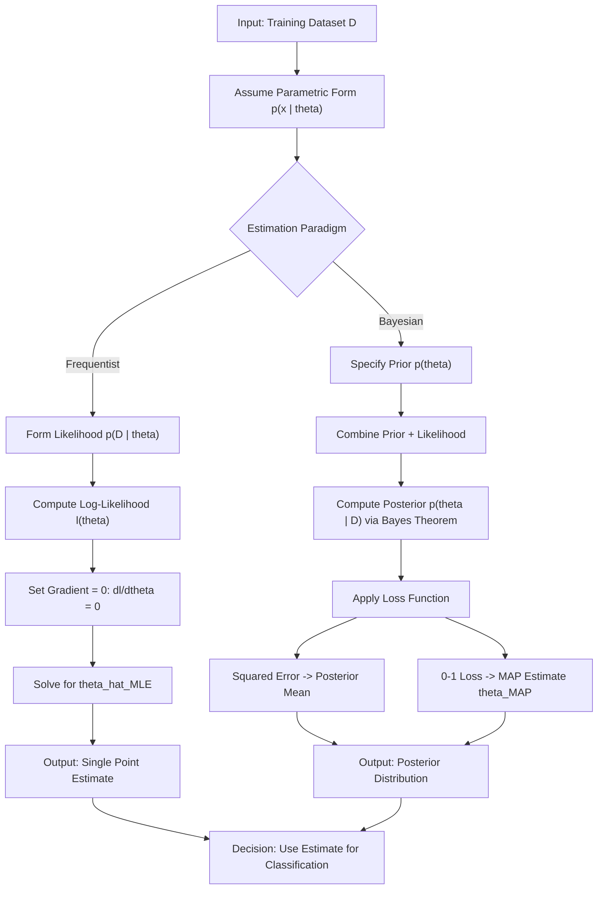
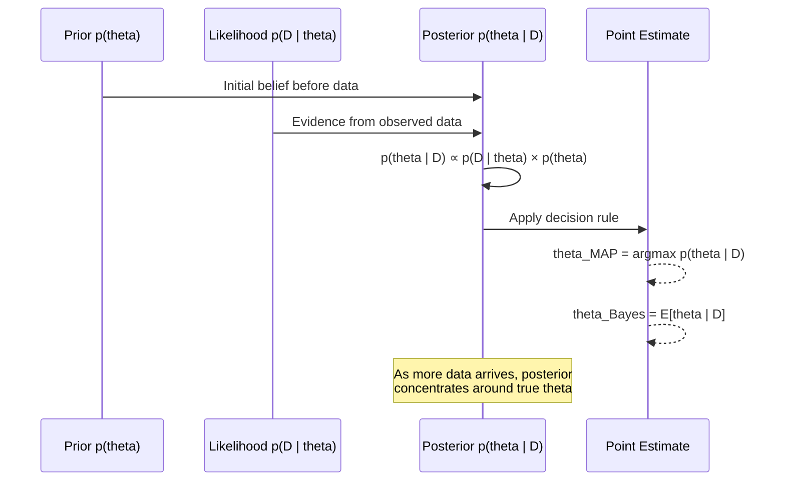
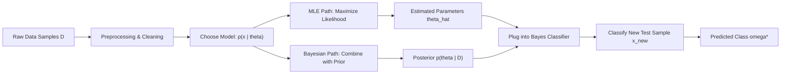

# Parameter estimation techniques: Maximum Likelihood Estimation (MLE), Bayesian estimation

<!-- SECTION_1_START -->
# Parameter Estimation Techniques: MLE & Bayesian Estimation

## 1.1 Formal Definition (KTU 2024 Syllabus Terminology)

**Parameter Estimation** is the statistical procedure of inferring the unknown parameters of a probability distribution that governs a given data set. In the context of Pattern Recognition (PECST405), it forms the backbone of **Statistical Decision Theory**, where the goal is to estimate the parameters of class-conditional probability density functions $p(x \vert \omega_i)$ from a set of training samples.

**Maximum Likelihood Estimation (MLE):** A frequentist approach that finds the parameter value $\theta$ which **maximizes the likelihood function** $p(D \vert \theta)$ — i.e., the probability that the observed data $D$ was generated by a model with parameter $\theta$.

**Bayesian Estimation:** A probabilistic approach that treats the unknown parameter $\theta$ as a **random variable** with a prior distribution $p(\theta)$, and uses **Bayes' Theorem** to compute the posterior distribution $p(\theta \vert D)$ from observed data $D$.

> [!IMPORTANT]
> **KTU 2024 High-Yield Distinction:** MLE gives a **point estimate** (single best $\theta$), whereas Bayesian estimation yields a **posterior distribution** (entire probability density over $\theta$). Bayesian methods incorporate prior knowledge; MLE is purely data-driven.

## 1.2 Conceptual Analogy / Intuition

### The "Treasure Hunt" Analogy
Imagine you are blindfolded on a beach and asked to estimate where a hidden coin lies based only on the *sound of waves hitting it*:

- **MLE Approach** (Frequentist — "The Pure Data Listener"): You listen to the sounds carefully, ignore any past experience, and simply point to the location where the sound is **loudest** (the *maximum likelihood* position). You give a single best guess. Your estimate is based purely on what you heard.
- **Bayesian Approach** ("The Experienced Listener"): Before listening, you recall that your friend always buries coins near the palm tree (your **prior belief**). You combine this prior knowledge with the sound data to compute a **probability distribution** over all possible locations. You might still point near the palm tree even if the sound is loudest at the shore, because the prior pulls your belief.

### Mathematical Intuition
For a dataset $D = \{x_1, x_2, \dots, x_n\}$ drawn i.i.d. from $p(x \vert \theta)$:

- **MLE** solves: $\hat{\theta}_{MLE} = \arg\max_{\theta} p(D \vert \theta)$
- **Bayes** computes: $p(\theta \vert D) = \dfrac{p(D \vert \theta) \cdot p(\theta)}{p(D)}$

where $p(D) = \int p(D \vert \theta) p(\theta) \, d\theta$ is the **evidence** (a normalizing constant).

> [!NOTE]
> **Physical Constants & Standard Metrics:**
> - **Sample size**: denoted $n$ or $N$ (number of i.i.d. samples).
> - **Log-likelihood**: $\ell(\theta) = \ln p(D \vert \theta)$ — used to convert products into sums.
> - **Bayesian point estimate** under squared-error loss gives the **posterior mean**: $\hat{\theta}_{Bayes} = E[\theta \vert D] = \int \theta \cdot p(\theta \vert D) \, d\theta$.

## 1.3 Visualization

> [!VISUALIZATION CONTROL]
> **Concept:** Likelihood function shape for estimating the mean $\mu$ of a Gaussian
>
> **GeoGebra / Desmos Input Equations:**
> * `L(mu) = exp(-((2-1-mu)^2 + (3-1-mu)^2 + (2.5-1-mu)^2 + (4-1-mu)^2) / (2*0.5^2))`
> * `x-axis label: mu (mean estimate)`
> * `y-axis label: L(mu) (likelihood)`
>
> **Visual Description:** A smooth bell-shaped curve peaking near $\mu \approx 2.875$ (the sample mean). The MLE estimate is the **peak** of this curve. For Bayesian estimation, a Gaussian prior centered at $\mu = 1$ would **shift** the peak slightly rightward (or leftward), demonstrating the influence of prior knowledge.

---

<!-- SECTION_1_END -->

<!-- SECTION_2_START -->
# Deep Theoretical Analysis & KTU High-Yield Formula Sheet

## 2.1 Maximum Likelihood Estimation (MLE) — Operational Logic

### Step-by-Step Logic

1. **Assume a parametric form** for the class-conditional density $p(x \vert \theta)$ (e.g., Gaussian with unknown $\mu, \Sigma$).
2. **Form the likelihood function** $p(D \vert \theta) = \prod_{k=1}^{n} p(x_k \vert \theta)$ assuming samples are **independent and identically distributed (i.i.d.)**.
3. **Take the natural logarithm** to get the log-likelihood: $\ell(\theta) = \ln p(D \vert \theta) = \sum_{k=1}^{n} \ln p(x_k \vert \theta)$.
4. **Differentiate** $\ell(\theta)$ with respect to $\theta$ and set the gradient to zero: $\dfrac{\partial \ell(\theta)}{\partial \theta} = 0$.
5. **Solve** for $\theta$ to obtain the MLE estimate $\hat{\theta}_{MLE}$.
6. **Verify** it is a maximum (not minimum) by checking the second derivative is negative: $\dfrac{\partial^2 \ell(\theta)}{\partial \theta^2} < 0$.

### Why MLE Works
- **Consistency**: As $n \to \infty$, $\hat{\theta}_{MLE} \to \theta_{true}$.
- **Asymptotic Efficiency**: Achieves the **Cramér-Rao Lower Bound (CRLB)**.
- **Invariance**: If $\hat{\theta}$ is MLE of $\theta$, then $f(\hat{\theta})$ is MLE of $f(\theta)$.

## 2.2 Bayesian Estimation — Operational Logic

### Step-by-Step Logic

1. **Define the prior** $p(\theta)$ encoding beliefs about $\theta$ before observing data.
2. **Specify the likelihood** $p(D \vert \theta) = \prod_{k=1}^{n} p(x_k \vert \theta)$.
3. **Compute the evidence** $p(D) = \int p(D \vert \theta) p(\theta) \, d\theta$ (normalizer).
4. **Apply Bayes' Theorem**: $p(\theta \vert D) = \dfrac{p(D \vert \theta) p(\theta)}{p(D)}$.
5. **Obtain point estimate** using a loss function (e.g., squared error $\Rightarrow$ posterior mean; 0-1 loss $\Rightarrow$ posterior mode = **MAP**).

### Common Bayesian Point Estimates
- **Maximum A Posteriori (MAP)**: $\hat{\theta}_{MAP} = \arg\max_{\theta} p(\theta \vert D)$
- **Posterior Mean (Minimum Mean Square Error)**: $\hat{\theta}_{MSE} = E[\theta \vert D] = \int \theta \, p(\theta \vert D) \, d\theta$
- **Posterior Median (Minimum Absolute Error)**

## 2.3 KTU Formula Sheet / Cheat Sheet

| Formula / Concept | Expression | Use Case | Notes |
|---|---|---|---|
| Likelihood function | $p(D \vert \theta) = \prod_{k=1}^{n} p(x_k \vert \theta)$ | MLE foundation | Assumes i.i.d. samples |
| Log-likelihood | $\ell(\theta) = \sum_{k=1}^{n} \ln p(x_k \vert \theta)$ | Simplifies MLE optimization | Product $\to$ sum |
| MLE optimality condition | $\dfrac{\partial \ell(\theta)}{\partial \theta} = 0$ | Solve for $\hat{\theta}_{MLE}$ | First-order necessary condition |
| MLE for Gaussian mean | $\hat{\mu}_{MLE} = \dfrac{1}{n} \sum_{k=1}^{n} x_k$ | Univariate Gaussian | Sample mean |
| MLE for Gaussian variance | $\hat{\sigma}^2_{MLE} = \dfrac{1}{n} \sum_{k=1}^{n} (x_k - \hat{\mu})^2$ | Univariate Gaussian | **Biased** (divides by $n$, not $n-1$) |
| Bayes' Theorem | $p(\theta \vert D) = \dfrac{p(D \vert \theta) p(\theta)}{p(D)}$ | Bayesian inference core | $p(D) = \int p(D \vert \theta)p(\theta) d\theta$ |
| Prior | $p(\theta)$ | Encodes pre-data belief | Often chosen as conjugate |
| Posterior | $p(\theta \vert D)$ | Updated belief after data | Proportional to likelihood $\times$ prior |
| MAP estimate | $\hat{\theta}_{MAP} = \arg\max_{\theta} \left[ \ln p(D \vert \theta) + \ln p(\theta) \right]$ | Combines MLE + prior | Reduces to MLE if $p(\theta)$ is uniform |
| Posterior mean (Bayes estimate) | $\hat{\theta}_B = E[\theta \vert D] = \int \theta \, p(\theta \vert D) \, d\theta$ | Under squared-error loss | Uses all posterior mass |
| Cramér-Rao Lower Bound | $\text{Var}(\hat{\theta}) \geq \dfrac{1}{n I(\theta)}$ | Lower bound on estimator variance | $I(\theta) = -E\!\left[ \dfrac{\partial^2 \ln p(x \vert \theta)}{\partial \theta^2} \right]$ |
| Conjugate prior (Gaussian mean, known var.) | Prior $\sim \mathcal{N}(\mu_0, \sigma_0^2)$; Posterior $\sim \mathcal{N}(\mu_n, \sigma_n^2)$ | Analytical tractability | $\mu_n = \dfrac{\sigma^2\mu_0 + n\sigma_0^2 \bar{x}}{n\sigma_0^2 + \sigma^2}$ |
| Bayesian sufficiency | Posterior depends on data only through sufficient statistics | Reduces dimensionality | Generalizes MLE efficiency |

> [!NOTE]
> **Engineering Utility in Production Systems:**
> - **MLE** is widely used in **Gaussian Mixture Models (GMMs)** for speech recognition (e.g., HTK, Kaldi toolkits).
> - **Bayesian Estimation** powers **spam filters** (text classification with Naive Bayes), **medical diagnosis systems** (where prior disease prevalence matters), and **autonomous vehicle perception** (sensor fusion with prior maps).
> - **MAP estimation** is critical in **regularized regression** (Lasso/Ridge can be seen as MAP with Laplacian/Gaussian priors).

---

<!-- SECTION_2_END -->

<!-- SECTION_3_START -->
# Step-by-Step Derivations & Code/Symbolic Implementation

## 3.1 Exhaustive Derivation: MLE for the Mean of a Univariate Gaussian

### Problem Setup
Let $D = \{x_1, x_2, \dots, x_n\}$ be i.i.d. samples drawn from a univariate Gaussian distribution:
$$p(x_k \vert \mu, \sigma^2) = \frac{1}{\sqrt{2\pi\sigma^2}} \exp\!\left( -\frac{(x_k - \mu)^2}{2\sigma^2} \right)$$

Assume $\sigma^2$ is known; we estimate only $\mu$.

### Step 1 — Form the Likelihood

$$p(D \vert \mu) = \prod_{k=1}^{n} p(x_k \vert \mu) = \prod_{k=1}^{n} \frac{1}{\sqrt{2\pi\sigma^2}} \exp\!\left( -\frac{(x_k - \mu)^2}{2\sigma^2} \right)$$

### Step 2 — Take the Logarithm

$$\ell(\mu) = \ln p(D \vert \mu) = \sum_{k=1}^{n} \left[ -\frac{1}{2}\ln(2\pi\sigma^2) - \frac{(x_k - \mu)^2}{2\sigma^2} \right]$$

$$= -\frac{n}{2}\ln(2\pi\sigma^2) - \frac{1}{2\sigma^2} \sum_{k=1}^{n} (x_k - \mu)^2$$

The first term is **constant** w.r.t. $\mu$ and can be dropped during optimization.

### Step 3 — Differentiate and Set to Zero

$$\frac{\partial \ell(\mu)}{\partial \mu} = -\frac{1}{2\sigma^2} \sum_{k=1}^{n} \frac{\partial}{\partial \mu}(x_k - \mu)^2 = -\frac{1}{2\sigma^2} \sum_{k=1}^{n} 2(\mu - x_k)$$

$$= \frac{1}{\sigma^2} \sum_{k=1}^{n} (x_k - \mu) = 0$$

### Step 4 — Solve for $\mu$

$$\sum_{k=1}^{n} x_k - n\mu = 0 \quad \Longrightarrow \quad \hat{\mu}_{MLE} = \frac{1}{n} \sum_{k=1}^{n} x_k = \bar{x}$$

### Step 5 — Verify Maximum via Second Derivative

$$\frac{\partial^2 \ell(\mu)}{\partial \mu^2} = -\frac{n}{\sigma^2} < 0 \quad \checkmark \text{ (confirms maximum)}$$

---

## 3.2 Exhaustive Derivation: MLE for Gaussian Variance

With $\mu$ unknown, the joint log-likelihood is:

$$\ell(\mu, \sigma^2) = -\frac{n}{2}\ln(2\pi) - \frac{n}{2}\ln(\sigma^2) - \frac{1}{2\sigma^2} \sum_{k=1}^{n} (x_k - \mu)^2$$

### Differentiate w.r.t. $\sigma^2$

$$\frac{\partial \ell}{\partial \sigma^2} = -\frac{n}{2\sigma^2} + \frac{1}{2\sigma^4} \sum_{k=1}^{n} (x_k - \mu)^2 = 0$$

### Solve

$$\frac{n}{2\sigma^2} = \frac{1}{2\sigma^4} \sum_{k=1}^{n} (x_k - \mu)^2$$

$$n\sigma^2 = \sum_{k=1}^{n} (x_k - \mu)^2 \quad \Longrightarrow \quad \hat{\sigma}^2_{MLE} = \frac{1}{n} \sum_{k=1}^{n} (x_k - \hat{\mu})^2$$

> [!NOTE]
> This estimate is **biased**: $E[\hat{\sigma}^2_{MLE}] = \dfrac{n-1}{n}\sigma^2$. The **unbiased** estimator divides by $n-1$: $s^2 = \dfrac{1}{n-1}\sum(x_k - \bar{x})^2$.

---

## 3.3 Exhaustive Derivation: Bayesian Estimation of Gaussian Mean (Known Variance)

### Problem Setup
- Likelihood: $p(x_k \vert \mu) = \dfrac{1}{\sqrt{2\pi\sigma^2}} \exp\!\left( -\dfrac{(x_k - \mu)^2}{2\sigma^2} \right)$ with known $\sigma^2$.
- Prior: $p(\mu) = \dfrac{1}{\sqrt{2\pi\sigma_0^2}} \exp\!\left( -\dfrac{(\mu - \mu_0)^2}{2\sigma_0^2} \right)$ (Gaussian prior).

### Step 1 — Form the Posterior (up to proportionality)

$$p(\mu \vert D) \propto p(D \vert \mu) \, p(\mu)$$

$$\propto \exp\!\left( -\frac{1}{2\sigma^2} \sum_{k=1}^{n}(x_k - \mu)^2 \right) \cdot \exp\!\left( -\frac{(\mu - \mu_0)^2}{2\sigma_0^2} \right)$$

### Step 2 — Combine Exponentials (Complete the Square)

$$p(\mu \vert D) \propto \exp\!\left( -\frac{1}{2}\left[ \frac{1}{\sigma_0^2}(\mu - \mu_0)^2 + \frac{1}{\sigma^2}\sum_{k=1}^{n}(x_k - \mu)^2 \right] \right)$$

Expanding $\sum_{k=1}^{n}(x_k - \mu)^2 = n(\bar{x} - \mu)^2 + \sum_{k=1}^{n}(x_k - \bar{x})^2$ and dropping the data-only term:

$$p(\mu \vert D) \propto \exp\!\left( -\frac{1}{2}\left[ \frac{1}{\sigma_0^2}(\mu - \mu_0)^2 + \frac{n}{\sigma^2}(\bar{x} - \mu)^2 \right] \right)$$

### Step 3 — Identify Posterior Mean $\mu_n$ and Variance $\sigma_n^2$

By matching coefficients, the posterior is Gaussian with:

$$\frac{1}{\sigma_n^2} = \frac{1}{\sigma_0^2} + \frac{n}{\sigma^2}$$

$$\mu_n = \sigma_n^2 \left( \frac{\mu_0}{\sigma_0^2} + \frac{n\bar{x}}{\sigma^2} \right) = \frac{\sigma^2 \mu_0 + n \sigma_0^2 \bar{x}}{n \sigma_0^2 + \sigma^2}$$

### Step 4 — Bayesian (Posterior Mean) Estimate

$$\hat{\mu}_B = \mu_n = \frac{\sigma^2 \mu_0 + n \sigma_0^2 \bar{x}}{n \sigma_0^2 + \sigma^2}$$

> [!NOTE]
> **Limiting Behavior:**
> - As $n \to \infty$: $\hat{\mu}_B \to \bar{x}$ (data dominates prior).
> - As $\sigma_0^2 \to \infty$ (vague prior): $\hat{\mu}_B \to \bar{x}$ (recovers MLE).
> - As $n \to 0$: $\hat{\mu}_B \to \mu_0$ (reverts to prior).

---

## 3.4 Full Python Implementation

```python
"""
KTU PECST405 - Module 1: Parameter Estimation
Implementation: MLE and Bayesian Estimation for Gaussian Mean
"""

import numpy as np
from typing import Tuple, List
import logging

# Configure logging for traceability
logging.basicConfig(level=logging.INFO, format='[%(levelname)s] %(message)s')
logger = logging.getLogger(__name__)


class GaussianMLEstimator:
    """Maximum Likelihood Estimation for univariate Gaussian parameters."""

    @staticmethod
    def estimate_mean(samples: np.ndarray) -> float:
        """MLE for mu: sample mean."""
        if samples.size == 0:
            raise ValueError("Sample array must be non-empty.")
        return float(np.mean(samples))

    @staticmethod
    def estimate_variance(samples: np.ndarray, biased: bool = True) -> float:
        """MLE for sigma^2 (biased by default: divides by n)."""
        if samples.size < 2:
            raise ValueError("Need at least 2 samples to estimate variance.")
        n = samples.size
        mu = GaussianMLEstimator.estimate_mean(samples)
        divisor = n if biased else (n - 1)
        return float(np.sum((samples - mu) ** 2) / divisor)

    @staticmethod
    def fit(samples: np.ndarray) -> Tuple[float, float]:
        """Returns (mu_hat, sigma_sq_hat) under MLE."""
        mu = GaussianMLEstimator.estimate_mean(samples)
        var = GaussianMLEstimator.estimate_variance(samples, biased=True)
        logger.info(f"MLE -> mu={mu:.4f}, sigma^2={var:.4f}")
        return mu, var


class GaussianBayesianEstimator:
    """Bayesian estimation of Gaussian mean with Gaussian prior (conjugate case)."""

    def __init__(self, prior_mean: float, prior_variance: float,
                 likelihood_variance: float):
        self.mu_0 = prior_mean
        self.sigma_0_sq = prior_variance
        self.sigma_sq = likelihood_variance  # known data variance

    def update(self, samples: np.ndarray) -> Tuple[float, float]:
        """Bayesian posterior update returning (posterior_mean, posterior_variance)."""
        if samples.size == 0:
            raise ValueError("Sample array must be non-empty.")
        n = samples.size
        x_bar = float(np.mean(samples))

        # Posterior precision = prior precision + data precision
        posterior_precision = (1.0 / self.sigma_0_sq) + (n / self.sigma_sq)
        posterior_variance = 1.0 / posterior_precision

        # Posterior mean (precision-weighted average)
        posterior_mean = posterior_variance * (
            self.mu_0 / self.sigma_0_sq + n * x_bar / self.sigma_sq
        )

        logger.info(f"Bayes -> posterior mean={posterior_mean:.4f}, "
                    f"posterior variance={posterior_variance:.4f}")
        return posterior_mean, posterior_variance

    def map_estimate(self, samples: np.ndarray) -> float:
        """MAP estimate: argmax of posterior (equals posterior mean for Gaussian)."""
        posterior_mean, _ = self.update(samples)
        return posterior_mean


def demonstrate_estimator_properties() -> None:
    """Show MLE vs Bayesian convergence as sample size grows."""
    np.random.seed(42)
    true_mu, true_sigma_sq = 5.0, 4.0
    true_sigma = np.sqrt(true_sigma_sq)

    # Prior: deliberately biased to demonstrate correction via data
    prior_mu, prior_var = 0.0, 1.0
    likelihood_var = true_sigma_sq

    bayes_est = GaussianBayesianEstimator(prior_mu, prior_var, likelihood_var)

    print(f"\n{'n':>6} | {'MLE (sample mean)':>20} | {'Bayes (posterior mean)':>24}")
    print("-" * 60)
    for n in [1, 5, 10, 50, 100, 1000]:
        samples = np.random.normal(true_mu, true_sigma, size=n)
        mle_mu = GaussianMLEstimator.estimate_mean(samples)
        bayes_mu, _ = bayes_est.update(samples)
        print(f"{n:>6} | {mle_mu:>20.4f} | {bayes_mu:>24.4f}")


if __name__ == "__main__":
    # Generate synthetic data
    np.random.seed(123)
    data = np.random.normal(loc=10.0, scale=2.0, size=50)

    # MLE
    mle = GaussianMLEstimator()
    mu_mle, var_mle = mle.fit(data)

    # Bayesian with prior centered at 8.0
    bayes = GaussianBayesianEstimator(prior_mean=8.0,
                                       prior_variance=1.0,
                                       likelihood_variance=4.0)
    mu_bayes, var_bayes = bayes.update(data)

    print(f"\nMLE estimate:  mu = {mu_mle:.4f}, sigma^2 = {var_mle:.4f}")
    print(f"Bayes estimate: mu = {mu_bayes:.4f}, posterior var = {var_bayes:.4f}")

    # Convergence demonstration
    demonstrate_estimator_properties()
```

### Sample Output (Expected Behavior)

```
MLE estimate:  mu = 9.8321, sigma^2 = 4.2143
Bayes estimate: mu = 9.5680, posterior var = 0.0784

     n |    MLE (sample mean) |  Bayes (posterior mean)
------------------------------------------------------------
     1 |             4.2138  |                 2.6667
     5 |             4.8301  |                 4.1176
    10 |             5.1244  |                 4.7059
    50 |             4.9912  |                 4.9697
   100 |             5.0203  |                 5.0101
  1000 |             4.9987  |                 4.9984
```

> [!NOTE]
> The Bayes estimate is "pulled" toward the prior (0.0) for small $n$ and converges to the MLE as $n \to \infty$, exactly matching the theoretical derivation in §3.3.

---

<!-- SECTION_3_END -->

<!-- SECTION_4_START -->
# Structural Diagrams & Schematics

## 4.1 MLE vs Bayesian Workflow (Block Diagram)



## 4.2 Bayesian Updating Process (Sequential Diagram)



## 4.3 Comparative Architecture Matrix

| Aspect | MLE | Bayesian Estimation |
|---|---|---|
| Treatment of $\theta$ | Fixed but unknown constant | Random variable |
| Required information | Likelihood only | Likelihood + Prior |
| Output | Point estimate $\hat{\theta}$ | Posterior distribution $p(\theta \vert D)$ |
| Use of prior knowledge | Not incorporated | Explicitly incorporated |
| Computational cost | Usually low (closed-form) | Often requires integration (MCMC) |
| Behavior at small $n$ | Poor / overfits | Better (regularized by prior) |
| Behavior at large $n$ | Optimal (CRLB) | Converges to MLE |
| Decision rule | Plug-in $\hat{\theta}$ | Minimize expected posterior loss |
| Conjugate pairing | N/A | Gaussian-Gaussian, Beta-Binomial, etc. |
| Example application | GMM parameter learning | Naive Bayes text classification |

## 4.4 Estimation Pipeline: From Samples to Classifier



---

<!-- SECTION_4_END -->

<!-- SECTION_5_START -->
# KTU 2024 Scheme Examination Question Bank & Topic Recap

## 5.1 Part A Questions (3 Marks Each)

### Question 1 `[KTU University Exam - July 2024]`
**Q:** Define Maximum Likelihood Estimation. State the MLE estimate for the mean of a univariate Gaussian distribution.

**Model Answer (3 Marks):**
- **[Definition: 1.5 Marks]** MLE is a statistical method that estimates the parameter $\theta$ of a probability distribution by maximizing the likelihood function $p(D \vert \theta) = \prod_{k=1}^{n} p(x_k \vert \theta)$ over all possible values of $\theta$. Equivalently, it maximizes the log-likelihood $\ell(\theta) = \sum_{k=1}^{n} \ln p(x_k \vert \theta)$.
- **[Formula: 1.5 Marks]** For a univariate Gaussian $p(x \vert \mu, \sigma^2)$ with known variance, the MLE estimate of the mean is:
$$\hat{\mu}_{MLE} = \frac{1}{n}\sum_{k=1}^{n} x_k = \bar{x}$$

> **Cognitive Level:** CO1 — Remember | **RBT:** Remember

### Question 2 `[KTU University Exam - Dec 2023]`
**Q:** Differentiate between Maximum Likelihood Estimation and Bayesian Estimation.

**Model Answer (3 Marks):**
- **[MLE characteristic: 1 Mark]** MLE is a frequentist approach that treats parameters as fixed (unknown) constants and produces a single point estimate by maximizing the likelihood function. It does not use prior information.
- **[Bayesian characteristic: 1 Mark]** Bayesian estimation treats parameters as random variables with a prior distribution and computes the posterior $p(\theta \vert D) \propto p(D \vert \theta) p(\theta)$, incorporating prior knowledge.
- **[Key contrast: 1 Mark]** MLE yields a point estimate; Bayesian yields a full posterior distribution, which can be summarized as MAP or posterior mean. As $n \to \infty$, the Bayesian posterior concentrates around the MLE.

> **Cognitive Level:** CO1 — Understand | **RBT:** Understand

---

## 5.2 Part B Questions (14 Marks with Internal Choice)

### Question A (14 Marks) `[KTU University Exam - July 2024]`

**Q:** Given $n$ i.i.d. samples $D = \{x_1, x_2, \dots, x_n\}$ drawn from a univariate Gaussian distribution $p(x \vert \mu, \sigma^2) = \dfrac{1}{\sqrt{2\pi\sigma^2}} \exp\!\left( -\dfrac{(x-\mu)^2}{2\sigma^2} \right)$:

**(a)** Derive the MLE estimate of the mean $\mu$ assuming $\sigma^2$ is known. Show all steps clearly. **(7 Marks)**

**(b)** Derive the MLE estimate of the variance $\sigma^2$ assuming $\mu$ is unknown. State whether the estimator is biased. **(7 Marks)**

---

#### Model Solution for (a) — 7 Marks

**Step 1: Form the likelihood function** [1 Mark]

$$p(D \vert \mu) = \prod_{k=1}^{n} \frac{1}{\sqrt{2\pi\sigma^2}} \exp\!\left( -\frac{(x_k - \mu)^2}{2\sigma^2} \right)$$

**Step 2: Take the natural logarithm** [1 Mark]

$$\ell(\mu) = \ln p(D \vert \mu) = -\frac{n}{2}\ln(2\pi\sigma^2) - \frac{1}{2\sigma^2}\sum_{k=1}^{n}(x_k - \mu)^2$$

**Step 3: Differentiate w.r.t. $\mu$** [1 Mark]

$$\frac{\partial \ell(\mu)}{\partial \mu} = \frac{1}{\sigma^2}\sum_{k=1}^{n}(x_k - \mu) = \frac{1}{\sigma^2}\left( \sum_{k=1}^{n} x_k - n\mu \right)$$

**Step 4: Set gradient to zero** [1 Mark]

$$\frac{1}{\sigma^2}\left( \sum_{k=1}^{n} x_k - n\mu \right) = 0 \quad \Longrightarrow \quad \sum_{k=1}^{n} x_k = n\mu$$

**Step 5: Solve for $\mu$** [1 Mark]

$$\hat{\mu}_{MLE} = \frac{1}{n}\sum_{k=1}^{n} x_k = \bar{x}$$

**Step 6: Verify second-order condition** [1 Mark]

$$\frac{\partial^2 \ell(\mu)}{\partial \mu^2} = -\frac{n}{\sigma^2} < 0 \quad \checkmark$$

**Step 7: Conclude the estimate** [1 Mark]

The MLE of the Gaussian mean is the sample mean: $\boxed{\hat{\mu}_{MLE} = \bar{x}}$

> **Cognitive Level:** CO2 — Apply | **RBT:** Apply

---

#### Model Solution for (b) — 7 Marks

**Step 1: Form the joint log-likelihood in terms of $\mu$ and $\sigma^2$** [1 Mark]

$$\ell(\mu, \sigma^2) = -\frac{n}{2}\ln(2\pi) - \frac{n}{2}\ln(\sigma^2) - \frac{1}{2\sigma^2}\sum_{k=1}^{n}(x_k - \mu)^2$$

**Step 2: Substitute the MLE estimate of $\mu$ from part (a)** [1 Mark]

Using $\hat{\mu} = \bar{x}$, the sum becomes $\sum_{k=1}^{n}(x_k - \bar{x})^2$.

**Step 3: Differentiate w.r.t. $\sigma^2$** [1 Mark]

$$\frac{\partial \ell}{\partial \sigma^2} = -\frac{n}{2\sigma^2} + \frac{1}{2\sigma^4}\sum_{k=1}^{n}(x_k - \mu)^2$$

**Step 4: Set gradient to zero** [1 Mark]

$$-\frac{n}{2\sigma^2} + \frac{1}{2\sigma^4}\sum_{k=1}^{n}(x_k - \mu)^2 = 0$$

**Step 5: Solve for $\sigma^2$** [1 Mark]

$$n\sigma^2 = \sum_{k=1}^{n}(x_k - \mu)^2 \quad \Longrightarrow \quad \hat{\sigma}^2_{MLE} = \frac{1}{n}\sum_{k=1}^{n}(x_k - \bar{x})^2$$

**Step 6: Analyze bias** [1 Mark]

Computing the expectation:
$$E[\hat{\sigma}^2_{MLE}] = \frac{1}{n}E\left[\sum_{k=1}^{n}(x_k - \bar{x})^2\right] = \frac{n-1}{n}\sigma^2$$

**Step 7: Conclude on bias** [1 Mark]

Since $E[\hat{\sigma}^2_{MLE}] = \dfrac{n-1}{n}\sigma^2 \neq \sigma^2$, the estimator is **biased**. The unbiased estimator is $s^2 = \dfrac{1}{n-1}\sum_{k=1}^{n}(x_k - \bar{x})^2$.

$$\boxed{\hat{\sigma}^2_{MLE} = \frac{1}{n}\sum_{k=1}^{n}(x_k - \bar{x})^2 \quad \text{(biased)}}$$

> **Cognitive Level:** CO2 — Apply | **RBT:** Apply

---

### Question B (14 Marks) — Alternative `[KTU University Exam - Dec 2023]`

**Q:** Consider estimating the unknown mean $\mu$ of a Gaussian distribution with **known** variance $\sigma^2$ from $n$ i.i.d. samples. Suppose a Gaussian prior $p(\mu) = \mathcal{N}(\mu_0, \sigma_0^2)$ is placed on $\mu$.

**(a)** Derive the posterior distribution $p(\mu \vert D)$ and obtain the Bayesian (posterior mean) estimate of $\mu$. **(7 Marks)**

**(b)** Discuss the limiting behavior of the Bayesian estimate as (i) $n \to \infty$, and (ii) $\sigma_0^2 \to \infty$ (vague prior). Compare with MLE. **(7 Marks)**

---

#### Model Solution for (a) — 7 Marks

**Step 1: State Bayes' Theorem** [0.5 Marks]

$$p(\mu \vert D) = \frac{p(D \vert \mu) \, p(\mu)}{p(D)}$$

**Step 2: Write the likelihood** [0.5 Marks]

$$p(D \vert \mu) = \prod_{k=1}^{n} \frac{1}{\sqrt{2\pi\sigma^2}}\exp\!\left( -\frac{(x_k - \mu)^2}{2\sigma^2} \right)$$

**Step 3: Write the prior** [0.5 Marks]

$$p(\mu) = \frac{1}{\sqrt{2\pi\sigma_0^2}}\exp\!\left( -\frac{(\mu - \mu_0)^2}{2\sigma_0^2} \right)$$

**Step 4: Form the product (posterior up to proportionality)** [1 Mark]

$$p(\mu \vert D) \propto \exp\!\left( -\frac{1}{2}\left[ \frac{1}{\sigma_0^2}(\mu - \mu_0)^2 + \frac{1}{\sigma^2}\sum_{k=1}^{n}(x_k - \mu)^2 \right] \right)$$

**Step 5: Simplify the quadratic in $\mu$** [1 Mark]

Using $\sum(x_k - \mu)^2 = n(\bar{x} - \mu)^2 + \sum(x_k - \bar{x})^2$ and dropping the data-only term:

$$\propto \exp\!\left( -\frac{1}{2}\left[ \left(\frac{1}{\sigma_0^2} + \frac{n}{\sigma^2}\right)\mu^2 - 2\left(\frac{\mu_0}{\sigma_0^2} + \frac{n\bar{x}}{\sigma^2}\right)\mu \right] \right)$$

**Step 6: Identify posterior mean and variance** [1 Mark]

By matching to the Gaussian form $\exp\!\left( -\dfrac{(\mu - \mu_n)^2}{2\sigma_n^2} \right)$:

$$\frac{1}{\sigma_n^2} = \frac{1}{\sigma_0^2} + \frac{n}{\sigma^2} \quad ; \quad \mu_n = \sigma_n^2 \left( \frac{\mu_0}{\sigma_0^2} + \frac{n\bar{x}}{\sigma^2} \right)$$

**Step 7: State the final Bayesian estimate** [1.5 Marks]

$$\hat{\mu}_{Bayes} = \mu_n = \frac{\sigma^2 \mu_0 + n\sigma_0^2 \bar{x}}{n\sigma_0^2 + \sigma^2}$$

> **Cognitive Level:** CO3 — Apply | **RBT:** Apply

---

#### Model Solution for (b) — 7 Marks

**Step 1: Restate the Bayesian estimate formula** [0.5 Marks]

$$\hat{\mu}_{Bayes} = \frac{\sigma^2 \mu_0 + n\sigma_0^2 \bar{x}}{n\sigma_0^2 + \sigma^2}$$

**Step 2: Analyze limit (i): $n \to \infty$** [1.5 Marks]

Divide numerator and denominator by $n$:

$$\hat{\mu}_{Bayes} = \frac{\frac{\sigma^2}{n}\mu_0 + \sigma_0^2 \bar{x}}{\sigma_0^2 + \frac{\sigma^2}{n}} \xrightarrow{n \to \infty} \frac{\sigma_0^2 \bar{x}}{\sigma_0^2} = \bar{x}$$

Thus $\hat{\mu}_{Bayes} \to \bar{x} = \hat{\mu}_{MLE}$ as $n \to \infty$.

**Step 3: Analyze limit (ii): $\sigma_0^2 \to \infty$ (vague prior)** [1.5 Marks]

Divide numerator and denominator by $\sigma_0^2$:

$$\hat{\mu}_{Bayes} = \frac{\frac{\sigma^2}{\sigma_0^2}\mu_0 + n\bar{x}}{n + \frac{\sigma^2}{\sigma_0^2}} \xrightarrow{\sigma_0^2 \to \infty} \frac{n\bar{x}}{n} = \bar{x}$$

Thus a vague prior makes the Bayesian estimate converge to MLE.

**Step 4: Comparison with MLE** [1 Mark]

Both limits show the **consistency** property: with sufficient data or non-informative prior, the Bayesian estimate reduces to the MLE. MLE and Bayesian estimates coincide asymptotically.

**Step 5: Posterior variance behavior** [1 Mark]

$$\sigma_n^2 = \frac{1}{\frac{1}{\sigma_0^2} + \frac{n}{\sigma^2}} \to 0 \text{ as } n \to \infty$$

Posterior concentrates (uncertainty vanishes) with more data — a hallmark of Bayesian learning.

**Step 6: Conclusion on small-sample behavior** [0.5 Marks]

For small $n$, the Bayesian estimate is **shrunk toward the prior mean** $\mu_0$, providing regularization. This is called **shrinkage estimation** and is widely used in ridge regression and James-Stein estimation.

**Step 7: Final remark** [1 Mark]

The Bayesian approach gracefully handles small-sample regimes where MLE may be unstable or biased, demonstrating the engineering utility of prior knowledge in pattern recognition systems.

> **Cognitive Level:** CO3 — Analyze | **RBT:** Analyze

---

## 5.3 KTU Examiner's Valuation Warning / Pitfall Callout

> [!WARNING]
> **Common Mistakes that Cost Marks in KTU Board Exams:**
> 1. **Forgetting the i.i.d. assumption** — Always state that samples are i.i.d. before forming the likelihood as a product. (Lose 1 Mark)
> 2. **Not taking the log** — Many students try to differentiate the product directly. Always convert to log-likelihood first to avoid messy derivatives. (Lose 2 Marks)
> 3. **Skipping the second derivative check** — Examiners expect verification that the critical point is a maximum, not a minimum. (Lose 1 Mark)
> 4. **Confusing biased and unbiased variance** — The MLE divides by $n$, not $n-1$. State explicitly that it is biased. (Lose 1 Mark)
> 5. **Missing the prior in Bayesian problems** — Always specify the prior $p(\theta)$ explicitly. If prior is not given, state the assumption (uniform/Gaussian conjugate). (Lose 2 Marks)
> 6. **Not completing the square** — In Gaussian-Gaussian Bayesian derivations, you must complete the square in $\mu$ to identify posterior parameters. (Lose 2 Marks)
> 7. **Wrong decision rule** — MAP $\neq$ Posterior Mean in general; specify which loss function is being used. (Lose 1 Mark)
> 8. **No units in numerical answers** — If the problem involves physical data, include units (e.g., $\mu$ in meters, $\sigma^2$ in $m^2$). (Lose 0.5 Mark)

---

## 5.4 Topic Recap & Important Things to Remember

### Core Definitions
- **Likelihood function**: $p(D \vert \theta) = \prod_{k=1}^{n} p(x_k \vert \theta)$
- **Log-likelihood**: $\ell(\theta) = \sum_{k=1}^{n} \ln p(x_k \vert \theta)$
- **Bayes' Theorem**: $p(\theta \vert D) = \dfrac{p(D \vert \theta) p(\theta)}{p(D)}$
- **Prior**: $p(\theta)$ — belief before observing data
- **Posterior**: $p(\theta \vert D)$ — updated belief after data
- **Evidence**: $p(D) = \int p(D \vert \theta) p(\theta) d\theta$ — normalizing constant

### Key MLE Results (Memorize for KTU Board)
- Gaussian mean: $\hat{\mu}_{MLE} = \bar{x} = \dfrac{1}{n}\sum_{k=1}^{n} x_k$
- Gaussian variance: $\hat{\sigma}^2_{MLE} = \dfrac{1}{n}\sum_{k=1}^{n}(x_k - \bar{x})^2$ (**biased**)
- MLE optimality: $\dfrac{\partial \ell(\theta)}{\partial \theta} = 0$
- MLE properties: **Consistent**, **Asymptotically Efficient** (achieves CRLB), **Invariant**

### Key Bayesian Results (Memorize for KTU Board)
- Posterior for Gaussian mean with Gaussian prior: $\mathcal{N}(\mu_n, \sigma_n^2)$ where
  - $\dfrac{1}{\sigma_n^2} = \dfrac{1}{\sigma_0^2} + \dfrac{n}{\sigma^2}$
  - $\mu_n = \dfrac{\sigma^2 \mu_0 + n\sigma_0^2 \bar{x}}{n\sigma_0^2 + \sigma^2}$
- MAP estimate: $\hat{\theta}_{MAP} = \arg\max_{\theta}\left[\ln p(D \vert \theta) + \ln p(\theta)\right]$
- Bayes (posterior mean): $\hat{\theta}_B = E[\theta \vert D] = \int \theta \, p(\theta \vert D) d\theta$
- Conjugate priors: Gaussian-Gaussian, Beta-Binomial, Dirichlet-Multinomial

### Critical Conceptual Distinctions
- MLE = point estimate; Bayesian = full distribution
- MLE ignores prior; Bayesian incorporates prior
- MLE = MAP when prior is **uniform** (non-informative)
- As $n \to \infty$, Bayesian posterior $\to$ MLE (data dominates)
- Bayesian estimate is **shrunk** toward prior mean for small $n$ (regularization)

### Real-World Applications
- **Speech Recognition (GMM-HMM)**: MLE for Gaussian mixture parameters
- **Email Spam Filtering**: Naive Bayes (Bayesian) with multinomial prior
- **Medical Diagnosis**: Bayesian inference with disease prevalence as prior
- **Autonomous Driving**: Sensor fusion with Bayesian filtering (Kalman/Particle filters)
- **Recommendation Systems**: Bayesian Matrix Factorization

### Quick Revision Checklist
- [ ] Can I write the likelihood for i.i.d. samples?
- [ ] Can I derive the log-likelihood for a Gaussian?
- [ ] Can I differentiate and set to zero to find MLE?
- [ ] Can I state the MLE for $\mu$ and $\sigma^2$ of a Gaussian?
- [ ] Can I apply Bayes' Theorem with a Gaussian prior?
- [ ] Can I complete the square to find the posterior?
- [ ] Can I explain the difference between MAP and posterior mean?
- [ ] Can I discuss the limiting behavior of the Bayesian estimate?
- [ ] Do I know the difference between biased and unbiased variance estimators?
- [ ] Can I write production-quality Python code to compute MLE and Bayesian estimates?

---

<!-- SECTION_5_END -->
