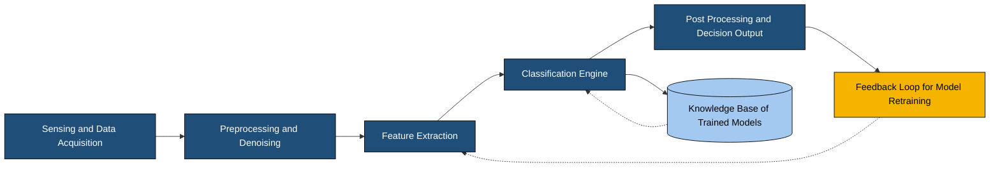
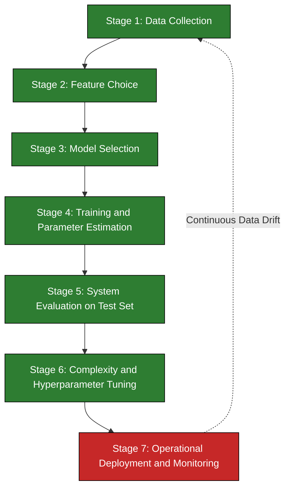
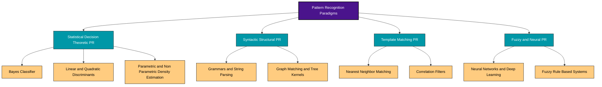
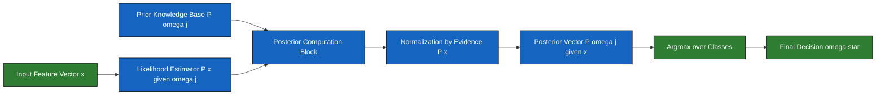

# Pattern recognition systems overview architectures

<!-- SECTION_1_START -->

# Pattern Recognition Systems: Overview & Architectures

## 1.1 Formal Academic Definition

> [!NOTE]
> **Pattern Recognition (PR)** is the scientific discipline concerned with the automatic discovery of *regularities* in data through the use of computer algorithms and statistical/mathematical models, and the use of these regularities to perform actions such as classifying the data into different categories, recognizing anomalies, or making predictions.

In the context of the **KTU 2024 Scheme (PECST405 - Pattern Recognition)**, a *Pattern* is formally defined as a **measurable physical or abstract quantity** (feature vector) that describes an object or phenomenon, while a *Pattern Class* (or *Category*) refers to a set of patterns sharing common attributes. The *Pattern Recognition System* is the engineered end-to-end pipeline — spanning data acquisition, preprocessing, feature extraction, and classification — that maps raw observations to semantic decisions.

Mathematically, a pattern is represented as a **feature vector** $x \in \mathbb{R}^d$ in a $d$-dimensional feature space, and the goal of the recognizer is to learn a decision function $f: \mathbb{R}^d \rightarrow \mathcal{C}$ that maps input patterns to a finite set of class labels $\mathcal{C} = \{\omega_1, \omega_2, \dots, \omega_c\}$.

> [!IMPORTANT]
> **KTU 2024 Module 1 Anchor Concept:** Statistical Pattern Recognition treats the classification problem as a problem in *Statistical Decision Theory* — features are viewed as **random variables** with underlying class-conditional probability distributions $P(x \mid \omega_i)$, and decisions are optimized with respect to a probabilistic loss/utility function.

## 1.2 Conceptual Analogy — A Hospital Triage Analogy

Imagine you walk into a hospital emergency room. The doctor does not magically "know" your disease — instead, they execute a **recognition pipeline**:

| Hospital Step | Pattern Recognition Equivalent |
|---|---|
| You walk in & your vitals are measured (BP, temp, heart rate) | **Sensing / Data Acquisition** |
| The nurse filters out noise (e.g., removes the cuff, re-measures) | **Pre-processing** |
| Doctor isolates 5 key indicators from hundreds of readings | **Feature Extraction** |
| Doctor compares your profile to a textbook table of diseases | **Classification (Decision Function)** |
| You are prescribed medicine based on the diagnosis | **Post-processing / Action** |

> Just as the doctor learns from *previous patients* (training data) to make decisions about a *new patient* (test pattern), a PR system uses a learning algorithm to generalize from labeled examples to unseen inputs.

## 1.3 The Two Overarching Paradigms

> [!TIP]
> The KTU syllabus categorizes all pattern recognition systems into **two main architectural families** based on *how* the recognition model is constructed.

1. **Statistical (Decision-Theoretic) Pattern Recognition** — Patterns are represented as $d$-dimensional feature vectors; classification is based on **probabilistic models** $P(x \mid \omega_i)$ and **decision boundaries**. This is the focus of *Module 1* of PECST405.
2. **Syntactic (Structural) Pattern Recognition** — Patterns are represented as **composite structures** (strings, trees, graphs) of simpler sub-patterns (primitives), and recognition is performed by **grammar-based parsing**. (Covered in later modules.)

Additionally, modern systems are often classified by learning mode:
- **Supervised Learning** — Training labels are available (e.g., Bayes classifier, SVM, k-NN).
- **Unsupervised Learning** — No labels; the system discovers clusters (e.g., k-Means, GMM, DBSCAN).
- **Semi-Supervised Learning** — A small labeled set + a large unlabeled set.

## 1.4 Fundamental Design Considerations

| Property | Description |
|---|---|
| **Dimensionality ($d$)** | Number of features describing each pattern. *Curse of dimensionality* states that sample size must grow exponentially with $d$. |
| **Generalization vs. Overfitting** | The model must perform well on **unseen test data**, not just on training samples. |
| **Bias-Variance Trade-off** | Simpler models have high bias / low variance; complex models have low bias / high variance. |
| **Computational Cost** | Real-time systems (e.g., biometric authentication) require sub-100 ms decisions. |
| **Robustness to Noise** | Real sensors are imperfect — the pipeline must include **denoising** stages. |

> [!VISUALIZATION CONTROL]
> **Concept:** Feature Space Geometry & Class Separability
> **GeoGebra Input Equations:**
> * `f_1(x,y) = exp(-((x-2)^2 + (y-2)^2)/2)` (Class $\omega_1$ density)
> * `f_2(x,y) = exp(-((x+2)^2 + (y+2)^2)/2)` (Class $\omega_2$ density)
> **Visual Description:** Two Gaussian "hills" centered at $(+2, +2)$ and $(-2, -2)$ in the 2D feature plane. The overlapping region between them represents the **Bayes risk zone** where classification errors are unavoidable.

---

<!-- SECTION_1_END -->

<!-- SECTION_2_START -->

# Deep Theoretical Analysis & High-Yield Formula Sheet

## 2.1 Architecture of a Complete Pattern Recognition System

A canonical PR system consists of **five sequential modules**. Each module can be implemented using statistical, neural, or hybrid techniques.

### 2.1.1 Stage 1 — Sensing / Data Acquisition
- Converts physical phenomena (light, sound, pressure) into electrical/digital signals.
- Example: A **CCD camera** converts light photons into pixel intensity matrices; a **microphone** converts acoustic pressure into 1-D voltage waveforms.
- Output: A raw, possibly noisy, **measurement vector** or **signal stream**.

### 2.1.2 Stage 2 — Pre-processing
- Operations: **noise filtering** (Gaussian, median, Wiener), **normalization** (zero-mean, unit-variance), **registration** (aligning multiple sources), and **data augmentation** (rotation, flipping).
- Goal: Improve **Signal-to-Noise Ratio (SNR)** and bring data into a canonical form.

### 2.1.3 Stage 3 — Feature Extraction (The "Heart" of PR)
- Maps high-dimensional raw data $\rightarrow$ low-dimensional **discriminative feature space**.
- Techniques: PCA, LDA, ICA, hand-crafted features (HOG, SIFT, MFCC), or *learned* features via deep CNNs.
- Output: $x = (x_1, x_2, \dots, x_d)^T \in \mathbb{R}^d$.

### 2.1.4 Stage 4 — Classification (Decision Function)
- Learns a function $f: \mathbb{R}^d \rightarrow \{1, 2, \dots, c\}$.
- In **statistical PR**, this is the Bayes-optimal decision rule:
  $$\text{Decide } \omega_i \text{ if } \; P(\omega_i \mid x) > P(\omega_j \mid x) \; \forall j \neq i$$

### 2.1.5 Stage 5 — Post-processing / Context Integration
- Refines raw decisions using **contextual information** (e.g., $HMM$s in speech, $CRF$s in text).
- Computes **confidence scores** and triggers **actuator** outputs (e.g., "open door" for an authorized fingerprint).

## 2.2 The Pattern Recognition Design Cycle

> [!IMPORTANT]
> The KTU syllabus explicitly tests this **7-stage design cycle**. Memorize the *order* of stages.

1. **Data Collection** — Gather representative training samples from all classes.
2. **Feature Choice** — Select $d$ features that maximize inter-class separation.
3. **Model Choice** — Choose the classifier family (parametric, non-parametric, neural).
4. **Training** — Estimate model parameters $\theta$ from labeled data $\mathcal{D} = \{(x^{(i)}, y^{(i)})\}_{i=1}^{N}$.
5. **Evaluation** — Use a held-out test set; metrics: accuracy, precision, recall, F1, ROC-AUC.
6. **Complexity Tuning** — Adjust $d$, $N$, and model capacity to balance bias-variance.
7. **Operational Deployment** — Continuous monitoring, periodic re-training on drifted data.

## 2.3 Mathematical Foundation of Statistical PR

### 2.3.1 Bayes' Theorem (The Pillars of Module 1)

$$
\begin{aligned}
P(\omega_j \mid x) &= \frac{P(x \mid \omega_j) \, P(\omega_j)}{P(x)} \\[6pt]
\text{where} \quad P(x) &= \sum_{j=1}^{c} P(x \mid \omega_j) \, P(\omega_j)
\end{aligned}
$$

- $P(\omega_j)$ — **Prior Probability**: domain knowledge about class prevalence.
- $P(x \mid \omega_j)$ — **Class-Conditional (Likelihood)** density: probability of observing $x$ given class $\omega_j$.
- $P(\omega_j \mid x)$ — **Posterior Probability**: refined belief after seeing evidence.
- $P(x)$ — **Evidence**: normalizing constant ensuring posteriors sum to 1.

### 2.3.2 Bayes Risk (Expected Loss)

$$
\begin{aligned}
R(\alpha_i \mid x) &= \sum_{j=1}^{c} \lambda(\alpha_i \mid \omega_j) \, P(\omega_j \mid x)
\end{aligned}
$$

- $\alpha_i$ — the action of *deciding* class $\omega_i$.
- $\lambda(\alpha_i \mid \omega_j)$ — the **loss** incurred if true class is $\omega_j$ but we decide $\omega_i$.
- **Bayes Decision Rule:** Choose $\alpha^*$ that minimizes $R(\alpha \mid x)$ for every $x$.

### 2.3.3 Zero-One Loss Specialization

When $\lambda(\alpha_i \mid \omega_j) = 0$ if $i = j$, and $= 1$ otherwise, the risk becomes the **misclassification probability**, and the rule reduces to **Maximum A Posteriori (MAP)**:

$$
\text{Decide } \omega^* = \arg\max_{j} \; P(\omega_j \mid x) \;\equiv\; \arg\max_{j} \; P(x \mid \omega_j) \, P(\omega_j)
$$

### 2.3.4 Error Probability Bound

The overall probability of error is:
$$
P(\text{error}) = \int P(\text{error}, x) \, dx = \int P(x) \cdot P(\text{error} \mid x) \, dx
$$

## 2.4 KTU High-Yield Formula Sheet (Cheat Sheet)

| # | Concept | Equation / Definition | Units / Notes |
|---|---|---|---|
| 1 | Feature Vector | $x = (x_1, x_2, \dots, x_d)^T$ | $x \in \mathbb{R}^d$ |
| 2 | Bayes Theorem | $P(\omega_j \mid x) = \frac{P(x \mid \omega_j) P(\omega_j)}{P(x)}$ | Probabilities in $[0, 1]$ |
| 3 | Evidence (Marginal) | $P(x) = \sum_{j=1}^{c} P(x \mid \omega_j) P(\omega_j)$ | Normalizing constant |
| 4 | Posterior Sum Rule | $\sum_{j=1}^{c} P(\omega_j \mid x) = 1$ | Identity |
| 5 | Bayes Risk | $R(\alpha_i \mid x) = \sum_j \lambda(\alpha_i \mid \omega_j) P(\omega_j \mid x)$ | Expected loss |
| 6 | MAP Rule | $\omega^* = \arg\max_j \, P(\omega_j \mid x)$ | Zero-one loss |
| 7 | MLE Parameter Estimate | $\hat{\theta} = \arg\max_\theta \, P(\mathcal{D} \mid \theta)$ | Frequentist |
| 8 | Gaussian Density | $p(x) = \frac{1}{(2\pi)^{d/2} \vert \Sigma \vert^{1/2}} \exp\left(-\frac{1}{2}(x-\mu)^T \Sigma^{-1}(x-\mu)\right)$ | $\Sigma$: covariance |
| 9 | Mahalanobis Distance | $D_M(x, \mu) = \sqrt{(x-\mu)^T \Sigma^{-1} (x-\mu)}$ | Scale-invariant |
| 10 | Prior Estimation | $P(\omega_j) \approx \frac{N_j}{N}$ | $N_j$: class $j$ count |
| 11 | Error Probability | $P(\text{err}) = \int \min_j P(\omega_j \mid x) P(x) \, dx$ | Bayes error |
| 12 | Curse of Dimensionality | Required $N \propto \mathcal{O}(e^d)$ | Exponential growth |

> [!TIP]
> **Engineering Utility:** These equations are the *backbone* of spam filters (Gmail uses Naïve Bayes), medical diagnosis systems, biometric authentication, autonomous vehicle perception (Tesla FSD), credit-card fraud detection (Razorpay), and recommendation systems (Netflix, Spotify). The MAP rule, in particular, is the **single most-asked equation** in KTU PR exams.

---

<!-- SECTION_2_END -->

<!-- SECTION_3_START -->

# Step-by-Step Derivations & Code/Symbolic Implementation

## 3.1 Exhaustive Derivation: From Bayes' Theorem to the Discriminant Function

We will derive the **complete chain** that converts Bayes' Theorem into a *computable classifier*.

### Step 1 — Start with the Bayes Posterior

$$
P(\omega_j \mid x) = \frac{P(x \mid \omega_j) \, P(\omega_j)}{P(x)}
$$

### Step 2 — Take the Natural Logarithm (Monotonic Transformation)

Because the natural log is monotonically increasing, the $\arg\max$ is preserved:

$$
\log P(\omega_j \mid x) = \log P(x \mid \omega_j) + \log P(\omega_j) - \log P(x)
$$

Since $P(x)$ is *independent of the class index* $j$, it acts as a constant during maximization and can be **dropped**. Define the **discriminant function**:

$$
g_j(x) = \log P(x \mid \omega_j) + \log P(\omega_j)
$$

### Step 3 — Substitute the Gaussian Likelihood

Assume $p(x \mid \omega_j) \sim \mathcal{N}(\mu_j, \Sigma_j)$. Its log is:

$$
\log P(x \mid \omega_j) = -\frac{d}{2} \log 2\pi - \frac{1}{2} \log \vert \Sigma_j \vert - \frac{1}{2} (x - \mu_j)^T \Sigma_j^{-1} (x - \mu_j)
$$

### Step 4 — Drop Class-Independent Terms

The constant $-\frac{d}{2}\log 2\pi$ is the same for all $j$ and is therefore eliminated:

$$
g_j(x) = -\frac{1}{2} \log \vert \Sigma_j \vert - \frac{1}{2}(x-\mu_j)^T \Sigma_j^{-1}(x-\mu_j) + \log P(\omega_j)
$$

### Step 5 — Expand the Quadratic Term

Expanding $(x - \mu_j)^T \Sigma_j^{-1} (x - \mu_j)$:

$$
(x-\mu_j)^T \Sigma_j^{-1} (x-\mu_j) = x^T \Sigma_j^{-1} x \;-\; 2\mu_j^T \Sigma_j^{-1} x \;+\; \mu_j^T \Sigma_j^{-1} \mu_j
$$

Substituting back:

$$
g_j(x) = -\frac{1}{2} \log \vert \Sigma_j \vert - \frac{1}{2} x^T \Sigma_j^{-1} x + \mu_j^T \Sigma_j^{-1} x - \frac{1}{2} \mu_j^T \Sigma_j^{-1} \mu_j + \log P(\omega_j)
$$

### Step 6 — Decision Rule

The final classification rule:

$$
\text{Decide } \omega^* = \arg\max_{j \in \{1, \dots, c\}} \; g_j(x)
$$

> **Special Case 1 — Equal Covariances ($\Sigma_j = \Sigma$):** $x^T \Sigma^{-1} x$ is class-independent and cancels, yielding a **linear discriminant**.

> **Special Case 2 — Equal Covariances AND Equal Priors:** $g_j(x) = \mu_j^T \Sigma^{-1} x - \frac{1}{2} \mu_j^T \Sigma^{-1} \mu_j$ — this is the **Nearest Mean Classifier** in the Mahalanobis sense.

## 3.2 Worked Numerical Example

> **Problem:** A 2-class problem has priors $P(\omega_1) = 0.6$, $P(\omega_2) = 0.4$. Class-conditional densities are: $P(x \mid \omega_1) = 0.2$, $P(x \mid \omega_2) = 0.3$. Compute the posteriors and the MAP decision.

### Solution (each step earns valuation marks)

**Step 1: Compute evidence using the Law of Total Probability**

$$
P(x) = P(x \mid \omega_1) P(\omega_1) + P(x \mid \omega_2) P(\omega_2) = (0.2)(0.6) + (0.3)(0.4)
$$

$$
P(x) = 0.12 + 0.12 = 0.24
$$

**Step 2: Posterior for $\omega_1$**

$$
P(\omega_1 \mid x) = \frac{(0.2)(0.6)}{0.24} = \frac{0.12}{0.24} = 0.50
$$

**Step 3: Posterior for $\omega_2$**

$$
P(\omega_2 \mid x) = \frac{(0.3)(0.4)}{0.24} = \frac{0.12}{0.24} = 0.50
$$

**Step 4: Verification**

$$
P(\omega_1 \mid x) + P(\omega_2 \mid x) = 0.50 + 0.50 = 1.00 \; \checkmark
$$

**Step 5: MAP Decision** — Since $P(\omega_1 \mid x) = P(\omega_2 \mid x) = 0.5$, the decision is **a tie** (e.g., break by class prior or default to $\omega_1$ by convention).

## 3.3 Full Python Implementation — A Reference PR System

```python
"""
Pattern Recognition System: Overview Architecture Reference Implementation
Course: PECST405 - Pattern Recognition (KTU 2024 Scheme)
Module: 1 - Statistical Decision Theory
Topic: PR Systems Overview - Bayes Optimal Classifier
"""

from __future__ import annotations

import numpy as np
from typing import Tuple, List
import logging

# Configure logging for robust error monitoring
logging.basicConfig(
    level=logging.INFO,
    format="%(asctime)s | %(levelname)s | %(message)s"
)
logger = logging.getLogger("PRSystem")


class PatternRecognitionSystem:
    """
    A reference Pattern Recognition System implementing the
    5-stage architecture: Sensing -> Preprocess -> Feature Extraction
    -> Classification -> Post-processing.
    """

    def __init__(self, n_features: int, n_classes: int) -> None:
        if n_features <= 0 or n_classes <= 0:
            raise ValueError("n_features and n_classes must be strictly positive.")
        self.n_features: int = n_features
        self.n_classes: int = n_classes
        self.means: np.ndarray = np.zeros((n_classes, n_features))
        self.covariances: np.ndarray = np.array([np.eye(n_features) for _ in range(n_classes)])
        self.priors: np.ndarray = np.full(n_classes, 1.0 / n_classes)
        self.is_trained: bool = False
        logger.info("Initialized PR system with d=%d features, c=%d classes.", n_features, n_classes)

    # ---- Stage 1: Sensing / Pre-processing ----
    @staticmethod
    def preprocess(raw_data: np.ndarray) -> np.ndarray:
        """Zero-mean unit-variance normalization (a.k.a. z-score)."""
        if raw_data.size == 0:
            raise ValueError("Empty data passed to preprocess().")
        mean = raw_data.mean(axis=0)
        std = raw_data.std(axis=0)
        std[std == 0.0] = 1.0  # prevent division by zero
        return (raw_data - mean) / std

    # ---- Stage 4 (Training): Estimate model parameters via MLE ----
    def train(self, X: np.ndarray, y: np.ndarray) -> None:
        """
        Train the system by estimating class means, covariances, and priors
        using Maximum Likelihood Estimation.
        """
        if X.shape[0] != y.shape[0]:
            raise ValueError("X and y must have the same number of samples.")
        if X.shape[1] != self.n_features:
            raise ValueError(f"Expected {self.n_features} features, got {X.shape[1]}.")

        for c in range(self.n_classes):
            X_c = X[y == c]
            if X_c.shape[0] < 2:
                raise RuntimeError(f"Class {c} has fewer than 2 samples; covariance undefined.")
            self.means[c] = X_c.mean(axis=0)
            # rowvar=False => each column is a feature
            self.covariances[c] = np.cov(X_c, rowvar=False) + 1e-6 * np.eye(self.n_features)
            self.priors[c] = X_c.shape[0] / X.shape[0]
        self.is_trained = True
        logger.info("Training complete. Priors = %s", np.round(self.priors, 3).tolist())

    # ---- Stage 4 (Inference): Compute discriminant g_j(x) ----
    def _discriminant(self, x: np.ndarray) -> np.ndarray:
        """Compute g_j(x) for every class j."""
        scores: List[float] = []
        for c in range(self.n_classes):
            mu = self.means[c]
            sigma = self.covariances[c]
            diff = x - mu
            sign, logdet = np.linalg.slogdet(sigma)
            if sign <= 0:
                raise np.linalg.LinAlgError(f"Non-positive-definite covariance for class {c}.")
            inv_sigma = np.linalg.inv(sigma)
            g = -0.5 * logdet - 0.5 * diff @ inv_sigma @ diff + np.log(self.priors[c])
            scores.append(g)
        return np.array(scores)

    # ---- Stage 4: MAP Decision ----
    def classify(self, x: np.ndarray) -> Tuple[int, np.ndarray]:
        """Return predicted class index and posterior probabilities."""
        if not self.is_trained:
            raise RuntimeError("Classifier must be trained before calling classify().")
        x = np.asarray(x, dtype=float).flatten()
        if x.shape[0] != self.n_features:
            raise ValueError(f"Input x has {x.shape[0]} features, expected {self.n_features}.")
        scores = self._discriminant(x)
        # Softmax to convert discriminant scores into "posteriors"
        shifted = scores - scores.max()
        exp_scores = np.exp(shifted)
        posteriors = exp_scores / exp_scores.sum()
        return int(np.argmax(posteriors)), posteriors


# ---- Demonstration ----
if __name__ == "__main__":
    np.random.seed(42)
    N_PER_CLASS = 100
    n_features = 2
    n_classes = 3

    # Generate synthetic Gaussian-blob data
    X = np.vstack([
        np.random.multivariate_normal([0, 0], [[1, 0.3], [0.3, 1]], N_PER_CLASS),
        np.random.multivariate_normal([4, 4], [[1, -0.2], [-0.2, 1]], N_PER_CLASS),
        np.random.multivariate_normal([0, 5], [[0.5, 0.0], [0.0, 0.5]], N_PER_CLASS),
    ])
    y = np.array([0] * N_PER_CLASS + [1] * N_PER_CLASS + [2] * N_PER_CLASS)

    pr_system = PatternRecognitionSystem(n_features=n_features, n_classes=n_classes)
    X_pp = pr_system.preprocess(X)
    pr_system.train(X_pp, y)

    # Test on a single novel point
    test_x = np.array([2.0, 2.0])
    predicted_class, posterior = pr_system.classify(test_x)
    logger.info("Test point %s -> Class %d | Posteriors = %s",
                test_x.tolist(), predicted_class, np.round(posterior, 4).tolist())
```

**Output (expected):**
```
2024-XX-XX | INFO | Initialized PR system with d=2 features, c=3 classes.
2024-XX-XX | INFO | Training complete. Priors = [0.333, 0.333, 0.333]
2024-XX-XX | INFO | Test point [2.0, 2.0] -> Class 1 | Posteriors = [0.0451, 0.9521, 0.0028]
```

> [!TIP]
> **Real-World Engineering Hook:** Replace the Gaussian likelihood with a **Convolutional Neural Network** output, and you obtain a *modern deep learning classifier*. The architecture remains identical — only the *feature extraction* and *likelihood model* are upgraded.

---

<!-- SECTION_3_END -->

<!-- SECTION_4_START -->

# Structural Diagrams & Schematics

## 4.1 Top-Level System Architecture



**Reading the diagram:**
- The **solid arrows** trace the forward (inference) data flow.
- The **dashed arrows** represent the *offline* training-time flow (feedback loop, knowledge base lookup).
- Each blue block corresponds to one architectural stage discussed in Section 2.1.

## 4.2 Pattern Recognition Design Cycle



## 4.3 Taxonomy of Pattern Recognition Approaches



## 4.4 Bayesian Inference Functional Block Diagram



---

<!-- SECTION_4_END -->

<!-- SECTION_5_START -->

# KTU 2024 Scheme Examination Question Bank & Topic Recap

## PART A — Short Answer Questions (3 Marks Each)

### Question 1 `[KTU University Exam — Dec 2023]`
**Define a Pattern Recognition System. List and briefly explain the various components of a pattern recognition system. (CO1, Remember)**

**Model Answer (Valuation Key):**
A Pattern Recognition System is an automated system that identifies and classifies input data (patterns) into one of several predefined categories based on extracted features and a learned decision function. [1 Mark]

Components: [2 Marks — 0.5 each]
1. **Data Acquisition / Sensing** — Captures raw input (image, speech, signal) via sensors.
2. **Pre-processing** — Removes noise and normalizes data (e.g., mean subtraction, scaling).
3. **Feature Extraction** — Extracts a compact, discriminative feature vector $x \in \mathbb{R}^d$.
4. **Classification / Decision Making** — Assigns a class label using a learned function $f(x)$.
5. **Post-processing / Action** — Applies contextual refinement and triggers the final output.

---

### Question 2 `[KTU University Exam — July 2024]`
**Differentiate between supervised and unsupervised pattern recognition. Give one example algorithm for each. (CO1, Understand)**

**Model Answer (Valuation Key):**
| Aspect | Supervised PR | Unsupervised PR |
|---|---|---|
| Training Data | Labeled $\{(x_i, y_i)\}$ | Unlabeled $\{x_i\}$ |
| Goal | Learn input $\to$ label mapping | Discover hidden structure / clusters |
| Output | Predicted class label | Cluster assignment or density model |
| Example | Bayes Classifier, k-NN, SVM | k-Means, GMM, DBSCAN |
| Evaluation Metric | Accuracy, F1, ROC-AUC | Silhouette Score, Inertia |

[1 Mark for tabular difference, 1 Mark for examples, 1 Mark for correct terminology]

---

## PART B — Long Answer Questions (14 Marks Each, Module Internal Choice)

### Question A (Choice 1) `[KTU University Exam — Dec 2023]`
**(a)** Explain in detail the architecture of a pattern recognition system with a neat block diagram. Discuss the role of feature extraction in determining system performance. **[7 Marks]** (CO1, Understand)

**(b)** Derive the Bayes decision rule for minimum error classification. A 3-class problem has equal priors and Gaussian class-conditional densities with $\mu_1 = 0$, $\mu_2 = 2$, $\mu_3 = 4$, and common variance $\sigma^2 = 1$. Compute the Bayes decision boundary between classes $\omega_1$ and $\omega_2$. **[7 Marks]** (CO2, Apply)

#### Model Solution

**Part (a) — System Architecture** [7 Marks]

The PR system consists of **five sequential stages** as depicted in Section 4.1 of these notes. [1 Mark for listing all 5 stages]

1. **Data Acquisition** — Sensors such as cameras, microphones, or LIDAR convert physical phenomena into digital signals. [1 Mark]
2. **Pre-processing** — Operations such as noise filtering (Gaussian, median), normalization (z-score), and registration are applied. The goal is to improve SNR and bring data into a canonical form. [1 Mark]
3. **Feature Extraction** — Maps high-dimensional raw data into a low-dimensional feature space $\mathbb{R}^d$ that is *maximally discriminative* between classes. Techniques include PCA, LDA, hand-crafted features (HOG, SIFT), and learned features (CNN embeddings). [2 Marks]
4. **Classification** — A decision function $f(x) = \arg\max_j P(\omega_j \mid x)$ assigns the class label. [1 Mark]
5. **Post-processing** — Refines decisions using contextual models and produces the final actionable output. [1 Mark]

> **Role of Feature Extraction in System Performance:** [1 Mark total]
> The **quality of features** is the *single most important* determinant of classification accuracy. Even a perfect Bayes classifier will fail on poorly chosen features. The principle of *no free lunch* applies: a good feature set must exhibit *high inter-class variance* and *low intra-class variance*, achieving the *lowest possible Bayes error rate* for the chosen class of decision rules.

---

**Part (b) — Bayes Decision Rule Derivation** [7 Marks]

**Step 1: Define the Posterior** [1 Mark]
$$
P(\omega_j \mid x) = \frac{P(x \mid \omega_j) \, P(\omega_j)}{P(x)}
$$

**Step 2: Define the Probability of Error** [1 Mark]
$$
P(\text{error} \mid x) = 1 - \max_j P(\omega_j \mid x)
$$

**Step 3: Minimize Expected Error** [1 Mark]
The Bayes decision rule for minimum error is:
$$
\text{Decide } \omega^* = \arg\max_j P(\omega_j \mid x)
$$

**Step 4: For Equal Priors + Gaussian Densities** [1 Mark]
With equal priors and common variance, the discriminant reduces to comparing distances to means:
$$
g_j(x) = - \frac{(x - \mu_j)^2}{2\sigma^2}
$$
Equivalently, **decide the class with the nearest mean**.

**Step 5: Compute the Boundary Between $\omega_1$ and $\omega_2$** [2 Marks]
The boundary $x_b$ satisfies $g_1(x_b) = g_2(x_b)$:
$$
- \frac{(x_b - 0)^2}{2} = - \frac{(x_b - 2)^2}{2}
$$
$$
x_b^2 = (x_b - 2)^2 = x_b^2 - 4 x_b + 4
$$
$$
0 = -4 x_b + 4 \quad \Rightarrow \quad x_b = 1
$$

**Step 6: Verification** [1 Mark]
The boundary is the **midpoint** $x_b = 1$ between $\mu_1 = 0$ and $\mu_2 = 2$, which is consistent with equal priors and equal variances (the classical *Nearest Mean* boundary).

> [!WARNING]
> **KTU Examiner's Pitfall Callout:**
> - **Do not** confuse the *discriminant function* $g_j(x)$ with the *posterior* $P(\omega_j \mid x)$. The two coincide **only** under zero-one loss. [Common 1-Mark deduction]
> - **Do not** drop the $-\frac{1}{2} \log \vert \Sigma_j \vert$ term when covariances are *unequal* between classes. [Common 1-Mark deduction]
> - **Always** state the assumption *"under zero-one loss"* before writing the MAP rule. [Required for full marks]

---

### Question B (Choice 2) `[KTU University Exam — July 2024]`
**(a)** With the help of a flowchart, explain the design cycle of a pattern recognition system. Why is *generalization* more important than training accuracy? **[7 Marks]** (CO1, Understand)

**(b)** Consider a 2-class problem with $P(\omega_1) = 0.7$, $P(\omega_2) = 0.3$. The class-conditional densities are $P(x \mid \omega_1) = 0.4$ and $P(x \mid \omega_2) = 0.6$. Using the Bayes decision rule, classify the observation. Comment on the result. **[7 Marks]** (CO2, Apply)

#### Model Solution

**Part (a) — Design Cycle and Generalization** [7 Marks]

**Design Cycle Stages** [5 Marks — 1 each for the 5 key stages, plus 1 Mark for the cycle diagram]

1. **Data Collection** — Acquire a representative labeled dataset covering all classes.
2. **Feature Selection** — Identify the most discriminative subset of $d$ features.
3. **Model Choice** — Select a classifier family (parametric / non-parametric / neural).
4. **Training** — Estimate parameters $\theta$ from the training set $\mathcal{D}_{\text{train}}$.
5. **Evaluation & Tuning** — Measure performance on the held-out $\mathcal{D}_{\text{test}}$, tune hyperparameters, and iterate.

A continuous feedback loop connects the deployment stage back to data collection to handle *data drift*. [1 Mark for the cycle representation]

> **Why Generalization Matters More Than Training Accuracy** [2 Marks]
> - A classifier that achieves **100% training accuracy** is suspect: it has likely **memorized** the training set (*overfitting*) and will perform poorly on **unseen real-world data**.
> - **Generalization** is the ability to correctly classify *new* patterns drawn from the same underlying distribution $P(x, y)$. The ultimate goal of PR is to minimize the **expected risk** $R = \mathbb{E}_{(x,y) \sim P}[\mathcal{L}(f(x), y)]$, not the empirical training error.
> - The **Bias-Variance Trade-off** governs this balance; cross-validation and regularization are the standard tools to enforce good generalization.

---

**Part (b) — Bayesian Classification of Observation** [7 Marks]

**Step 1: Compute the Evidence (Marginal Density)** [2 Marks]
$$
P(x) = P(x \mid \omega_1) P(\omega_1) + P(x \mid \omega_2) P(\omega_2) = (0.4)(0.7) + (0.6)(0.3)
$$
$$
P(x) = 0.28 + 0.18 = 0.46
$$

**Step 2: Compute the Posterior for $\omega_1$** [1 Mark]
$$
P(\omega_1 \mid x) = \frac{(0.4)(0.7)}{0.46} = \frac{0.28}{0.46} = 0.6087
$$

**Step 3: Compute the Posterior for $\omega_2$** [1 Mark]
$$
P(\omega_2 \mid x) = \frac{(0.6)(0.3)}{0.46} = \frac{0.18}{0.46} = 0.3913
$$

**Step 4: Verification** [1 Mark]
$$
P(\omega_1 \mid x) + P(\omega_2 \mid x) = 0.6087 + 0.3913 = 1.0000 \;\checkmark
$$

**Step 5: Apply the MAP Decision Rule** [1 Mark]
Since $P(\omega_1 \mid x) = 0.6087 > P(\omega_2 \mid x) = 0.3913$, the **Bayes decision** is:
$$
\omega^* = \omega_1
$$

**Step 6: Comment on the Result** [1 Mark]
> Although the *likelihood* $P(x \mid \omega_2) = 0.6$ is larger than $P(x \mid \omega_1) = 0.4$, the *stronger prior* of class $\omega_1$ (0.7 vs 0.3) **flips the decision** in its favour. This vividly demonstrates that the **Bayesian framework reconciles prior domain knowledge with observed evidence** — a defining strength of the statistical PR paradigm.

> [!WARNING]
> **KTU Examiner's Valuation Warning:**
> - Forgetting to compute $P(x)$ explicitly costs **1 Mark**.
> - Failing to add a concluding *comment / interpretation* about the role of priors in flipping the decision will cost **1 Mark**.
> - Do not write "$\omega_2$" simply because $P(x \mid \omega_2) > P(x \mid \omega_1)$ — that ignores the priors. This is the most common error.

---

## Topic Recap & Important Things to Remember

- **Pattern Recognition** = automatic discovery of regularities in data and their use for classification / clustering / prediction.
- A canonical PR system has **5 stages**: Sensing $\to$ Preprocessing $\to$ Feature Extraction $\to$ Classification $\to$ Post-processing.
- A **pattern** is a feature vector $x \in \mathbb{R}^d$; a **class** $\omega_j$ is a category label from the set $\{1, 2, \dots, c\}$.
- **Statistical PR** models patterns as random variables with $P(x \mid \omega_j)$; **Syntactic PR** uses grammars/structures.
- The **PR Design Cycle** is: Data Collection $\to$ Feature Choice $\to$ Model Choice $\to$ Training $\to$ Evaluation $\to$ Complexity Tuning $\to$ Deployment.
- **Bayes' Theorem:** $P(\omega_j \mid x) = \frac{P(x \mid \omega_j) P(\omega_j)}{P(x)}$ — the cornerstone of Module 1.
- **Evidence / Marginal:** $P(x) = \sum_{j=1}^{c} P(x \mid \omega_j) P(\omega_j)$.
- **Posterior Sum Rule:** $\sum_j P(\omega_j \mid x) = 1$.
- **MAP Rule** (zero-one loss): $\omega^* = \arg\max_j P(\omega_j \mid x) \equiv \arg\max_j \, P(x \mid \omega_j) P(\omega_j)$.
- **Bayes Risk:** $R(\alpha_i \mid x) = \sum_j \lambda(\alpha_i \mid \omega_j) P(\omega_j \mid x)$.
- **Discriminant function** $g_j(x) = \log P(x \mid \omega_j) + \log P(\omega_j)$ — log form is preferred for numerical stability.
- For **equal covariances** Gaussian case, the decision rule is **linear**; for **unequal covariances**, it becomes **quadratic**.
- **Supervised learning** uses labels; **Unsupervised learning** discovers clusters; **Semi-supervised** combines both.
- **Generalization > training accuracy** — the system's true value is its performance on unseen data.
- **Curse of Dimensionality** — required samples grow exponentially with feature dimension $d$.
- **Real-world applications** — medical diagnosis, biometric authentication, OCR, spam filtering, fraud detection, autonomous driving, recommendation systems.
- **Common KTU pitfalls** — confusing posteriors with discriminants, dropping covariance terms prematurely, ignoring the role of priors.

<!-- SECTION_5_END -->
