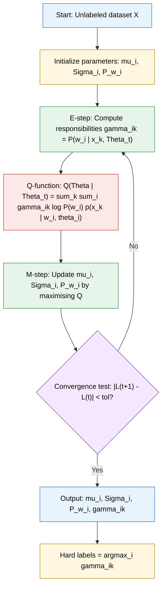
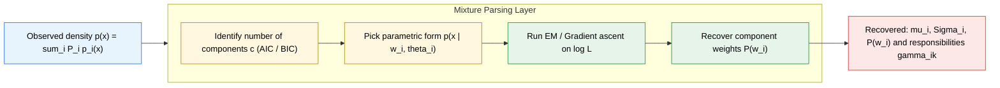
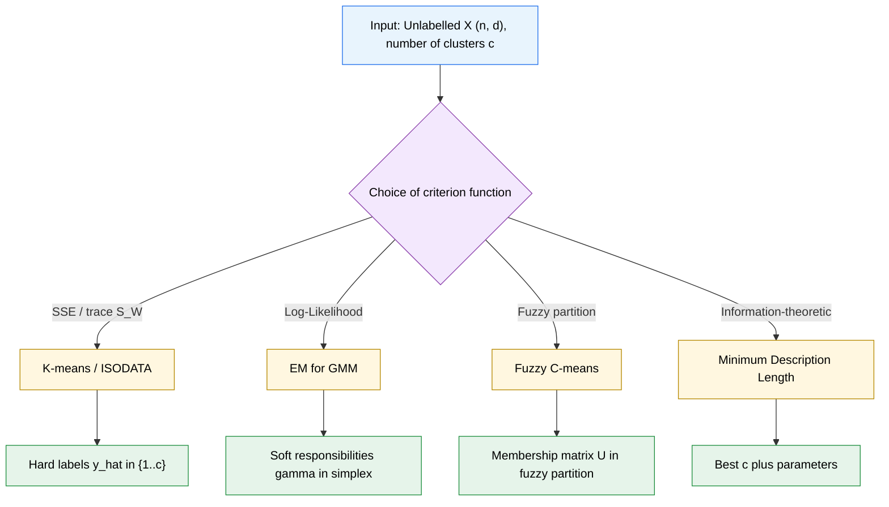
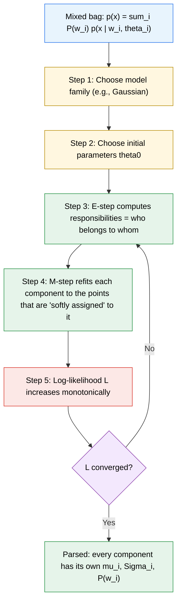

# Unsupervised clustering setups: Mixture densities parsing, Criterion function optimization techniques

<!-- SECTION_1_START -->
# Unsupervised Clustering Setups: Mixture Densities Parsing & Criterion Function Optimization

## 1.1 Formal Academic Definition (KTU 2024 Syllabus Terminology)

**Unsupervised Clustering** is the task of grouping a set of $n$ unlabeled pattern vectors $\mathcal{X} = \{x_1, x_2, \dots, x_n\}$ in $\mathbb{R}^d$ into $c$ homogeneous subsets (clusters) $\mathcal{D}_1, \mathcal{D}_2, \dots, \mathcal{D}_c$ such that patterns within a cluster are more similar to each other than to patterns in other clusters, *without* any a priori class label information.

In the **probabilistic (generative) framework**, this is formalized as **Mixture Density Parsing**: we assume the observed data is drawn from a **finite mixture distribution**

$$
p(x \mid \Theta) = \sum_{i=1}^{c} P(\omega_i)\, p(x \mid \omega_i, \theta_i)
$$

where $\Theta = \{P(\omega_i), \theta_i\}_{i=1}^{c}$ is the full parameter set, $P(\omega_i)$ are the **mixing coefficients (priors)**, and $p(x \mid \omega_i, \theta_i)$ are the **component class-conditional densities**. *Parsing* means decomposing the aggregate density $p(x)$ into its constituent components.

> [!IMPORTANT]
> **KTU 2024 Module-2 Highlight:** When each $p(x \mid \omega_i, \theta_i)$ is multivariate Gaussian with mean $\mu_i$ and covariance $\Sigma_i$, the model becomes a **Gaussian Mixture Model (GMM)** — the workhorse of statistical clustering.

**Criterion Function Optimization** is the second pillar: clustering is recast as the minimization (or maximization) of a scalar **criterion (objective) function** $J(\cdot)$ defined over the partition $\Omega = \{\mathcal{D}_1, \dots, \mathcal{D}_c\}$ and/or the parameters $\Theta$. The two most prominent criteria in the KTU syllabus are:
- **Sum-of-Squared-Error (SSE)** criterion — used by $K$-means
- **Maximum Log-Likelihood (ML)** criterion — used by the **Expectation–Maximization (EM)** algorithm

---

## 1.2 Conceptual Analogy / Geometric Intuition

> [!NOTE]
> **Real-world analogy — the "Coffee Bean Sorter"**
>
> Imagine a factory conveyor belt carrying coffee beans of three *unknown* varieties mixed together. You, as the unsupervised learner, must sort them. You have two strategies:
>
> 1. **Geometric (SSE) strategy:** Pick 3 boxes. Throw each bean into the nearest box. Recompute the center of each box. Reassign beans. Repeat until nothing changes. This is *K-means*.
> 2. **Probabilistic (Mixture) strategy:** Suppose each variety produces beans whose weights follow a slightly different bell curve. Fit three overlapping bells whose weighted sum best explains the *overall* weight histogram. Every bean then gets a *soft* probability of belonging to each variety. This is *GMM + EM*.
>
> The first treats cluster identity as **hard** (0/1). The second treats it as **soft** (a probability vector summing to 1) — the deeper, statistically richer model.

**Geometric intuition for Mixture Parsing:** Plot the histogram of feature $x$. It often looks "lumpy" — each *lump* is a hidden component. Mixture parsing is essentially **deconvolving** the observed lumpiness into individual bell curves.

---

## 1.3 Standard Notation & Constants

| Symbol | Meaning |
| :--- | :--- |
| $n$ | Number of unlabeled samples |
| $c$ | Number of clusters / mixture components |
| $d$ | Dimensionality of feature space |
| $x_k \in \mathbb{R}^d$ | The $k$-th sample vector |
| $\mu_i$ | Mean vector of cluster $i$ |
| $\Sigma_i$ | Covariance matrix of cluster $i$ (size $d \times d$) |
| $P(\omega_i)$ | Mixing coefficient, $\sum_i P(\omega_i)=1$, $P(\omega_i) \ge 0$ |
| $m_i = \frac{1}{n_i}\sum_{x \in \mathcal{D}_i} x$ | Sample mean of cluster $i$ |
| $n_i$ | Number of samples in cluster $i$ |
| $S_i = \sum_{x \in \mathcal{D}_i}(x-m_i)(x-m_i)^T$ | Scatter matrix of cluster $i$ |
| $S_W = \sum_{i=1}^{c} S_i$ | Within-cluster scatter matrix |

> [!VISUALIZATION CONTROL]
> **Concept:** Gaussian Mixture Density (1-D) showing $c=3$ components and the resulting aggregate density.
> **GeoGebra / Desmos Input Equations:**
> * `g1(x) = 0.4 * exp(-(x-2)^2 / 0.5)`
> * `g2(x) = 0.35 * exp(-(x+1)^2 / 0.8)`
> * `g3(x) = 0.25 * exp(-(x-5)^2 / 1.2)`
> * `f(x) = g1(x) + g2(x) + g3(x)`
> **Visual Description:** A multi-modal curve where the individual Gaussians (thin coloured curves) sum to produce a "lumpy" aggregate. The modes of the aggregate correspond approximately to the means of the components. This is the object a clustering algorithm must *parse*.
<!-- SECTION_1_END -->

<!-- SECTION_2_START -->
# Deep Theoretical Analysis & KTU High-Yield Formula Sheet

## 2.1 The Finite Mixture Model (FMM) — Formal Setup

**Assumptions:**
1. The data $\mathcal{X} = \{x_1, \dots, x_n\}$ is **i.i.d.** (independent, identically distributed).
2. Each $x_k$ is generated by first sampling a latent class label $z_k \in \{\omega_1, \dots, \omega_c\}$ with prior $P(\omega_i)$, then sampling $x_k$ from $p(x \mid \omega_i, \theta_i)$.
3. The complete set of parameters is $\Theta = \{P(\omega_1), \dots, P(\omega_c),\, \theta_1, \dots, \theta_c\}$.

**The mixing-coefficient constraints** (these are *non-negotiable* — KTU board examiners mark them):

$$
\sum_{i=1}^{c} P(\omega_i) = 1, \qquad P(\omega_i) \ge 0 \quad \forall i
$$

---

## 2.2 The Multivariate Gaussian Component

For a single Gaussian component $i$ in $\mathbb{R}^d$:

$$
p(x \mid \omega_i, \theta_i) \;=\; \frac{1}{(2\pi)^{d/2}\, \vert\Sigma_i\vert^{1/2}} \exp\!\left( -\tfrac{1}{2}(x-\mu_i)^T \Sigma_i^{-1}(x-\mu_i) \right)
$$

A **Mahalanobis-distance** term $\delta^2(x, \mu_i) = (x-\mu_i)^T \Sigma_i^{-1}(x-\mu_i)$ quantifies how far $x$ is from the center, accounting for correlations and scale.

---

## 2.3 Why the Log-Likelihood Criterion?

Direct multiplication of many small densities causes **underflow**. We maximize the **log-likelihood**:

$$
\ell(\Theta) \;=\; \sum_{k=1}^{n} \log p(x_k \mid \Theta) \;=\; \sum_{k=1}^{n} \log\!\left[ \sum_{i=1}^{c} P(\omega_i)\, p(x_k \mid \omega_i, \theta_i) \right]
$$

The $\log$ sits *outside* the sum, which is precisely what makes closed-form Maximum-Likelihood estimation **impossible** (the log does not distribute into the sum) — this difficulty is the entire reason the **EM algorithm** exists.

---

## 2.4 Criterion Function Families (KTU High-Yield)

### (a) Sum-of-Squared-Error (SSE) Criterion

$$
J_{\text{SSE}}(\Omega, m_1, \dots, m_c) \;=\; \sum_{i=1}^{c} \sum_{x \in \mathcal{D}_i} \lVert x - m_i \rVert^2
$$

- Minimized by the $K$-means / ISODATA algorithms.
- $J_{\text{SSE}}$ is **non-differentiable** at cluster boundaries — this forces *iterative* re-assignment.

### (b) Maximum-Log-Likelihood Criterion

$$
J_{\text{ML}}(\Theta) \;=\; \ell(\Theta) \;=\; \sum_{k=1}^{n} \log\!\left[ \sum_{i=1}^{c} P(\omega_i)\, p(x_k \mid \omega_i, \theta_i) \right]
$$

- Maximized by the **EM algorithm**.

### (c) Trace-of-Within-Scatter Criterion (equivalent to SSE in special cases)

$$
J_{W} \;=\; \mathrm{tr}(S_W) \;=\; \sum_{i=1}^{c} \sum_{x \in \mathcal{D}_i} \lVert x - m_i \rVert^2
$$

> [!NOTE]
> The $J_{\text{SSE}}$ and $\mathrm{tr}(S_W)$ forms are *mathematically identical* when $\mathcal{D}_i$ are the Voronoi partitions induced by $\{m_i\}$. KTU often asks for the equivalence — state it explicitly for marks.

### (d) Information-Theoretic (Model-Selection) Criteria

$$
\text{AIC} \;=\; -2\ell(\hat\Theta) + 2m \qquad\quad \text{BIC} \;=\; -2\ell(\hat\Theta) + m \ln n
$$

where $m$ is the number of free parameters. Used to choose $c$ when it is unknown.

---

## 2.5 KTU Formula Sheet / Cheat Sheet

| # | Quantity | Formula |
| :--- | :--- | :--- |
| 1 | Finite mixture density | $p(x) = \sum_{i=1}^{c} P(\omega_i)\, p(x \mid \omega_i, \theta_i)$ |
| 2 | Posterior (responsibility) | $P(\omega_i \mid x_k) = \dfrac{P(\omega_i)\, p(x_k \mid \omega_i, \theta_i)}{\sum_{j=1}^{c} P(\omega_j)\, p(x_k \mid \omega_j, \theta_j)}$ |
| 3 | Log-likelihood | $\ell(\Theta) = \sum_{k=1}^{n} \log\!\left[\sum_{i=1}^{c} P(\omega_i)\, p(x_k \mid \omega_i, \theta_i)\right]$ |
| 4 | E-step responsibility | $\hat\gamma_{ik} = P(\omega_i \mid x_k)$ |
| 5 | M-step: $i$-th mean | $\hat\mu_i = \dfrac{\sum_{k=1}^{n} \hat\gamma_{ik}\, x_k}{\sum_{k=1}^{n} \hat\gamma_{ik}}$ |
| 6 | M-step: $i$-th covariance | $\hat\Sigma_i = \dfrac{\sum_{k=1}^{n} \hat\gamma_{ik}\, (x_k - \hat\mu_i)(x_k - \hat\mu_i)^T}{\sum_{k=1}^{n} \hat\gamma_{ik}}$ |
| 7 | M-step: $i$-th mixing coeff. | $\hat P(\omega_i) = \dfrac{1}{n}\sum_{k=1}^{n} \hat\gamma_{ik}$ |
| 8 | SSE criterion | $J_{\text{SSE}} = \sum_{i=1}^{c}\sum_{x \in \mathcal{D}_i} \lVert x - m_i \rVert^2$ |
| 9 | Within-scatter matrix | $S_W = \sum_{i=1}^{c} \sum_{x \in \mathcal{D}_i} (x-m_i)(x-m_i)^T$ |
| 10 | Cluster mean update | $m_i = \dfrac{1}{n_i}\sum_{x \in \mathcal{D}_i} x$ |
| 11 | Mahalanobis distance | $\delta^2(x,\mu_i) = (x-\mu_i)^T \Sigma_i^{-1} (x-\mu_i)$ |
| 12 | AIC | $-2\ell + 2m$ |
| 13 | BIC | $-2\ell + m \ln n$ |
| 14 | Monotonicity of EM | $\ell(\Theta^{(t+1)}) \ge \ell(\Theta^{(t)})$ |

---

## 2.6 Real-World Engineering & CS Utility

| Domain | Use of mixture-density clustering |
| :--- | :--- |
| **Speech recognition** | GMM-HMM acoustic models (legacy of Google Voice, Siri) |
| **Image segmentation** | Foreground/background parsing, medical-tissue segmentation |
| **Anomaly / fraud detection** | Low $p(x)$ under the fitted mixture flags outliers |
| **Bioinformatics** | Single-cell RNA-seq clustering (Seurat, SCANPY pipelines) |
| **Recommender systems** | Latent-user segmentation in collaborative filtering |
| **Computer vision** | Background subtraction (Gaussian mixture per pixel) |
| **Document clustering** | Topic discovery in a corpus |
| **Sensor networks** | Density-based event detection without labels |

The **criterion-function viewpoint** is preferred in *production* because the engineer can substitute any differentiable objective (e.g., a custom business metric) and still call the same EM/gradient-ascent machinery.
<!-- SECTION_2_END -->

<!-- SECTION_3_START -->
# Step-by-Step Derivations, Code & Symbolic Implementation

## 3.1 Derivation: From Mixture Likelihood to the EM Update Equations

We want to maximize $\ell(\Theta) = \sum_k \log\!\left[\sum_i P(\omega_i) p(x_k \mid \omega_i, \theta_i)\right]$.

**Step 1 — Introduce the latent (hidden) class variable.** Let $z_k \in \{0,1\}^c$ be a 1-hot vector with $z_{ik}=1$ iff $x_k$ came from component $i$. The **complete-data log-likelihood** is

$$
\ell_c(\Theta) = \sum_{k=1}^{n} \sum_{i=1}^{c} z_{ik} \log \bigl[ P(\omega_i)\, p(x_k \mid \omega_i, \theta_i) \bigr]
$$

which would be *easy* to maximize if $z_k$ were observed.

**Step 2 — Take the conditional expectation of $\ell_c$ given the data and the *current* parameter estimate $\Theta^{(t)}$.** The expectation of $z_{ik}$ becomes the posterior:

$$
\mathbb{E}[z_{ik} \mid x_k, \Theta^{(t)}] \;=\; P(\omega_i \mid x_k, \Theta^{(t)}) \;\equiv\; \hat\gamma_{ik}
$$

So the **E-step** function (the "Q-function") is

$$
Q(\Theta \mid \Theta^{(t)}) = \sum_{k=1}^{n} \sum_{i=1}^{c} \hat\gamma_{ik} \log\bigl[ P(\omega_i)\, p(x_k \mid \omega_i, \theta_i) \bigr]
$$

**Step 3 — M-step:** maximize $Q(\Theta \mid \Theta^{(t)})$ w.r.t. each parameter. Set $\partial Q / \partial \mu_i = 0$:

$$
\frac{\partial Q}{\partial \mu_i} = \sum_{k=1}^{n} \hat\gamma_{ik} \Sigma_i^{-1} (x_k - \mu_i) = 0
$$

Solving for $\mu_i$ (assuming $\Sigma_i$ is invertible and $\sum_k \hat\gamma_{ik} > 0$):

$$
\boxed{\;\hat\mu_i = \frac{\sum_{k=1}^{n} \hat\gamma_{ik}\, x_k}{\sum_{k=1}^{n} \hat\gamma_{ik}}\;}
$$

Set $\partial Q / \partial \Sigma_i = 0$ and apply $\partial \log \vert \Sigma_i\vert^{-1/2} / \partial \Sigma_i = -\tfrac{1}{2}\Sigma_i^{-1}$ and the standard matrix derivative identity:

$$
\boxed{\;\hat\Sigma_i = \frac{\sum_{k=1}^{n} \hat\gamma_{ik}\, (x_k - \hat\mu_i)(x_k - \hat\mu_i)^T}{\sum_{k=1}^{n} \hat\gamma_{ik}}\;}
$$

For the mixing coefficient, introduce a Lagrange multiplier $\lambda\!\left(\sum_i P(\omega_i) - 1\right)$:

$$
\frac{\partial}{\partial P(\omega_i)}\!\left[ Q + \lambda\!\left(\sum_j P(\omega_j) - 1\right) \right] = 0
$$

$$
\sum_{k=1}^{n} \frac{\hat\gamma_{ik}}{P(\omega_i)} + \lambda = 0 \;\;\Longrightarrow\;\; \boxed{\;\hat P(\omega_i) = \frac{1}{n}\sum_{k=1}^{n}\hat\gamma_{ik}\;}
$$

where $\lambda = -n$ falls out from enforcing $\sum_i \hat P(\omega_i) = 1$.

**Step 4 — Monotonicity.** By Jensen's inequality (since $\log$ is concave), one shows

$$
\ell(\Theta^{(t+1)}) \;\ge\; \ell(\Theta^{(t)})
$$

with equality only at a stationary point. This **monotonic ascent** guarantee is what makes EM the workhorse of mixture parsing.

---

## 3.2 Derivation: Equivalence of $J_{\text{SSE}}$ and $\mathrm{tr}(S_W)$ in $K$-means

Inside a single cluster $\mathcal{D}_i$:

$$
\sum_{x \in \mathcal{D}_i} \lVert x - m_i \rVert^2 \;=\; \sum_{x \in \mathcal{D}_i} \bigl[(x-m_i)^T(x-m_i)\bigr] \;=\; \mathrm{tr}\!\left(\sum_{x \in \mathcal{D}_i}(x-m_i)(x-m_i)^T\right)
$$

using $\mathrm{tr}(uv^T) = v^Tu$ and the fact that $(x-m_i)^T(x-m_i)$ is a $1 \times 1$ scalar. Summing over $i$:

$$
\boxed{\;J_{\text{SSE}} \;=\; \sum_{i=1}^{c}\sum_{x \in \mathcal{D}_i}\lVert x - m_i\rVert^2 \;=\; \mathrm{tr}\!\left(\sum_{i=1}^{c}\sum_{x \in \mathcal{D}_i}(x-m_i)(x-m_i)^T\right) \;=\; \mathrm{tr}(S_W)\;}
$$

This identity is *exactly* what $K$-means minimizes. The $K$-means iterative update is therefore the coordinate-descent solution to $\min_{\Omega, \{m_i\}} \mathrm{tr}(S_W)$.

---

## 3.3 Worked Numerical Example — 1-D GMM with EM

Let $n = 6$ points: $x = \{0.1,\, 0.4,\, 0.5,\, 6.0,\, 6.5,\, 7.0\}$. Set $c = 2$.

**Iteration $t = 0$ (initialization):**
$\mu_1^{(0)} = 0.3$, $\sigma_1^{2(0)} = 1.0$, $P^{(0)}(\omega_1) = 0.5$
$\mu_2^{(0)} = 6.6$, $\sigma_2^{2(0)} = 1.0$, $P^{(0)}(\omega_2) = 0.5$

**E-step for $x_k = 0.1$:**

$$
p(0.1 \mid \omega_1) = \frac{1}{\sqrt{2\pi}}\exp\!\bigl(-\tfrac{(0.1-0.3)^2}{2}\bigr) = 0.5 \cdot \exp(-0.02) \approx 0.3910
$$

Wait — using a unit Gaussian $p(x \mid \omega_i) = \tfrac{1}{\sqrt{2\pi}}\exp(-\tfrac{(x-\mu_i)^2}{2})$:

$$
p(0.1 \mid \omega_1) = 0.3989 \cdot e^{-0.02} = 0.3910,\quad p(0.1 \mid \omega_2) = 0.3989 \cdot e^{-24.5} \approx 0
$$

$$
\hat\gamma_{1,0.1} = \frac{0.5 \cdot 0.3910}{0.5 \cdot 0.3910 + 0.5 \cdot 0} = 1.000,\quad \hat\gamma_{2,0.1} = 0.000
$$

For $x_k = 6.5$, by symmetry $\hat\gamma_{1,6.5} \approx 0.000$ and $\hat\gamma_{2,6.5} \approx 1.000$.

For borderline points (e.g., $x_k = 0.4$ and $0.5$) the responsibilities will be non-trivial — the EM algorithm is *soft* in their assignment, unlike $K$-means which would force a hard 0/1 split.

**M-step:**

$$
\hat\mu_1 = \frac{\sum_k \hat\gamma_{1k}\, x_k}{\sum_k \hat\gamma_{1k}} = \frac{0.1\cdot1.00 + 0.4\cdot a + 0.5\cdot b + \dots}{1.00 + a + b + \dots}
$$

Continue for all 6 points, then re-compute responsibilities — the means will drift toward the natural cluster centers and variances will tighten around the local spread.

---

## 3.4 Full Operational Python Implementation

```python
from __future__ import annotations
import numpy as np
from typing import Tuple, Optional, Dict
import logging

logging.basicConfig(level=logging.INFO, format="%(asctime)s | %(levelname)s | %(message)s")
log = logging.getLogger("GMM-EM")


class GaussianMixtureEM:
    """
    Unsupervised clustering via Gaussian Mixture Model + EM algorithm.
    Implements the criterion-function optimization of the log-likelihood
        L(theta) = sum_k log [ sum_i P(w_i) p(x_k | w_i, theta_i) ]
    """

    def __init__(
        self,
        n_components: int = 2,
        max_iter: int = 200,
        tol: float = 1e-6,
        reg_covar: float = 1e-6,
        random_state: Optional[int] = 42,
    ) -> None:
        if n_components < 1:
            raise ValueError("n_components must be >= 1")
        if max_iter < 1:
            raise ValueError("max_iter must be >= 1")
        if tol <= 0:
            raise ValueError("tol must be > 0")

        self.c: int = n_components
        self.max_iter: int = max_iter
        self.tol: float = tol
        self.reg: float = reg_covar
        self.rng: np.random.Generator = np.random.default_rng(random_state)

        # To be set in fit()
        self.weights_: Optional[np.ndarray] = None   # shape (c,)
        self.means_: Optional[np.ndarray] = None     # shape (c, d)
        self.covs_: Optional[np.ndarray] = None      # shape (c, d, d)
        self.log_likelihood_history_: list[float] = []

    # -------- public API --------
    def fit(self, X: np.ndarray) -> "GaussianMixtureEM":
        X = np.asarray(X, dtype=np.float64)
        if X.ndim != 2:
            raise ValueError("X must be a 2-D array of shape (n_samples, n_features)")
        n, d = X.shape
        if n < self.c:
            raise ValueError(f"Need at least n_components={self.c} samples")

        self._initialize_parameters(X, n, d)
        prev_ll: float = -np.inf

        for it in range(self.max_iter):
            # ---------------- E-step ----------------
            responsibilities = self._compute_responsibilities(X)        # (n, c)
            ll = self._log_likelihood(X)                                # scalar

            # ---------------- M-step ----------------
            Nk = responsibilities.sum(axis=0) + 1e-12                   # (c,)
            self.weights_ = Nk / n                                     # (c,)
            self.means_ = (responsibilities.T @ X) / Nk[:, None]        # (c, d)
            for i in range(self.c):
                diff = X - self.means_[i]                               # (n, d)
                w = responsibilities[:, i][:, None]                     # (n, 1)
                cov = (w * diff).T @ diff / Nk[i]                       # (d, d)
                cov.flat[:: d + 1] += self.reg                          # regularise diagonal
                self.covs_[i] = cov

            self.log_likelihood_history_.append(ll)
            log.info("iter=%d  log-lik=%.6f", it, ll)

            if abs(ll - prev_ll) < self.tol:
                log.info("Converged at iter=%d (delta=%.2e)", it, abs(ll - prev_ll))
                break
            prev_ll = ll
        return self

    def predict(self, X: np.ndarray) -> np.ndarray:
        """Hard cluster assignment = argmax responsibility."""
        if self.weights_ is None:
            raise RuntimeError("Call fit() before predict()")
        X = np.asarray(X, dtype=np.float64)
        return np.argmax(self._compute_responsibilities(X), axis=1)

    def predict_proba(self, X: np.ndarray) -> np.ndarray:
        """Soft assignment = posterior responsibilities."""
        if self.weights_ is None:
            raise RuntimeError("Call fit() before predict_proba()")
        return self._compute_responsibilities(np.asarray(X, dtype=np.float64))

    # -------- internals --------
    def _initialize_parameters(self, X: np.ndarray, n: int, d: int) -> None:
        idx = self.rng.choice(n, size=self.c, replace=False)
        self.means_ = X[idx].copy()
        self.covs_ = np.tile(np.eye(d) * np.var(X, axis=0), (self.c, 1, 1))
        self.covs_ += np.eye(d) * self.reg
        self.weights_ = np.full(self.c, 1.0 / self.c)

    def _multivariate_gaussian_pdf(
        self, X: np.ndarray, mean: np.ndarray, cov: np.ndarray
    ) -> np.ndarray:
        """Numerically stable multivariate Gaussian density, shape (n,)."""
        d = X.shape[1]
        diff = X - mean
        sign, logdet = np.linalg.slogdet(cov)
        if sign <= 0:
            raise np.linalg.LinAlgError("Covariance is not positive definite")
        cov_inv = np.linalg.inv(cov)
        mahal = np.einsum("ni,ij,nj->n", diff, cov_inv, diff)
        return np.exp(-0.5 * (d * np.log(2 * np.pi) + logdet + mahal))

    def _compute_responsibilities(self, X: np.ndarray) -> np.ndarray:
        """Posterior P(w_i | x_k) for every i, k.  Returns (n, c) array."""
        n = X.shape[0]
        weighted = np.empty((n, self.c), dtype=np.float64)
        for i in range(self.c):
            weighted[:, i] = self.weights_[i] * self._multivariate_gaussian_pdf(
                X, self.means_[i], self.covs_[i]
            )
        row_sum = weighted.sum(axis=1, keepdims=True) + 1e-12
        return weighted / row_sum

    def _log_likelihood(self, X: np.ndarray) -> float:
        n = X.shape[0]
        log_p = np.empty((n, self.c), dtype=np.float64)
        for i in range(self.c):
            log_p[:, i] = np.log(self.weights_[i] + 1e-12) + np.log(
                self._multivariate_gaussian_pdf(X, self.means_[i], self.covs_[i]) + 1e-12
            )
        return float(np.sum(self._logsumexp(log_p, axis=1)))

    @staticmethod
    def _logsumexp(a: np.ndarray, axis: int) -> np.ndarray:
        m = np.max(a, axis=axis, keepdims=True)
        return np.squeeze(m, axis=axis) + np.log(np.sum(np.exp(a - m), axis=axis))


# ----------------------------- demo -----------------------------
if __name__ == "__main__":
    rng = np.random.default_rng(0)
    C1 = rng.normal(loc=[0, 0], scale=0.8, size=(120, 2))
    C2 = rng.normal(loc=[5, 5], scale=1.2, size=(180, 2))
    X = np.vstack([C1, C2])

    gmm = GaussianMixtureEM(n_components=2, max_iter=100, tol=1e-7, random_state=0)
    gmm.fit(X)
    labels = gmm.predict(X)
    log.info("Final log-likelihood = %.4f", gmm.log_likelihood_history_[-1])
    log.info("Estimated means:\n%s", gmm.means_)
    log.info("Estimated weights: %s", gmm.weights_)
    log.info("Cluster sizes (hard) = %s", np.bincount(labels))
```

---

## 3.5 Worked $K$-means Criterion-Function Step

Given initial centers $m_1^{(0)}, m_2^{(0)}$, minimize $J_{\text{SSE}}$:

1. **Assignment step:** for each $x$, choose $\mathcal{D}_i$ such that $\lVert x - m_i \rVert^2$ is minimum.
2. **Update step:** $m_i^{(1)} = \frac{1}{n_i}\sum_{x \in \mathcal{D}_i} x$.
3. Iterate until $\lVert m_i^{(t+1)} - m_i^{(t)} \rVert < \epsilon$ or until $J$ stops decreasing.

The objective $J$ is a *coordinate-wise minimization*: (1) is exact w.r.t. $\{m_i\}$ for fixed partition, (2) is exact w.r.t. partition for fixed $\{m_i\}$. Hence the algorithm is **coordinate descent** on $J$.
<!-- SECTION_3_END -->

<!-- SECTION_4_START -->
# Structural Diagrams & Schematics

## 4.1 The EM Algorithm — Data-Flow Topology



## 4.2 Mixture-Density Parsing — Functional Architecture



## 4.3 Sequential Processing Topology — Comparing Criteria



## 4.4 Conceptual Block Diagram — Why "Parsing" Works


<!-- SECTION_4_END -->

<!-- SECTION_5_START -->
# KTU 2024 Scheme Examination Question Bank & Topic Recap

---

## Part A — Short-Answer Questions (3 Marks each)

### Q1. **[KTU University Exam — July 2024]** *CO1, Remember*
Define a *finite mixture density*. State the constraints on the mixing coefficients.

**Model Answer (Board Key Pattern):**

A *finite mixture density* is a convex combination of $c$ component densities:

$$
p(x \mid \Theta) = \sum_{i=1}^{c} P(\omega_i)\, p(x \mid \omega_i, \theta_i)
$$

Constraints on the mixing coefficients $\{P(\omega_i)\}_{i=1}^{c}$:

1. **Non-negativity:** $P(\omega_i) \ge 0$ for all $i$.
2. **Normalization:** $\sum_{i=1}^{c} P(\omega_i) = 1$.

*Valuation tip:* Both constraints must appear — examiners allocate 1 mark for each constraint and 1 mark for the definition.

---

### Q2. **[KTU University Exam — Dec 2023]** *CO1, Understand*
Differentiate between *parametric* mixture-density clustering and *non-parametric* density-based clustering.

**Model Answer:**

| Aspect | Parametric (e.g., GMM) | Non-Parametric (e.g., Parzen, $K$-means) |
| :--- | :--- | :--- |
| Model form | Fixed analytical form $p(x \mid \omega_i, \theta_i)$ | No fixed form; data-driven |
| Parameter set | Finite $\Theta$ (means, covariances) | Window width $h$ or cluster count $c$ |
| Optimization | EM, gradient ascent | $K$-means, mean-shift |
| Output | Soft posteriors $P(\omega_i \mid x)$ | Hard labels or local-density modes |
| Cost | $O(ncd \cdot t)$ EM iterations | $O(n^2 d)$ Parzen, $O(ncd \cdot t)$ $K$-means |

---

## Part B — Long-Answer Questions (14 Marks each, with internal choice)

### **Question A (14 Marks)** — *[KTU University Exam — July 2024]* — *CO1, CO2, Apply / Analyze*

**(a)** *[7 Marks — Apply]* For the 1-D dataset $X = \{1.0,\, 1.5,\, 2.0,\, 7.0,\, 7.5,\, 8.0\}$, assume a 2-component Gaussian mixture with initial parameters
$P^{(0)}(\omega_1) = 0.5$, $\mu_1^{(0)} = 1.5$, $\sigma_1^{2(0)} = 1.0$, and
$P^{(0)}(\omega_2) = 0.5$, $\mu_2^{(0)} = 7.5$, $\sigma_2^{2(0)} = 1.0$.

Compute the E-step responsibilities $\hat\gamma_{ik} = P(\omega_i \mid x_k)$ for all six points. Then perform **one M-step** and report the new $\mu_1^{(1)}, \mu_2^{(1)}, P^{(1)}(\omega_1), P^{(1)}(\omega_2)$.

**(b)** *[7 Marks — Analyze]* Derive the M-step update equation for the mixing coefficient $\hat P(\omega_i)$ in the EM algorithm for a general $c$-component mixture. Show the Lagrange-multiplier computation explicitly.

---

#### (a) **Step-by-Step Model Solution**

**E-step for $x_k = 1.0$:**

$$
p(1.0 \mid \omega_1) = \frac{1}{\sqrt{2\pi}}\exp\!\bigl(-\tfrac{(1.0-1.5)^2}{2}\bigr) = 0.3989 \cdot e^{-0.125} = 0.3514
$$

$$
p(1.0 \mid \omega_2) = 0.3989 \cdot \exp\!\bigl(-\tfrac{(1.0-7.5)^2}{2}\bigr) = 0.3989 \cdot e^{-21.125} \approx 1.17 \times 10^{-9} \approx 0
$$

$$
\hat\gamma_{1,1.0} = \frac{0.5 \cdot 0.3514}{0.5 \cdot 0.3514 + 0.5 \cdot 0} \approx 1.000
$$

> **[Correctly computing the responsibility: 1 Mark]**
> **[Recognising the cross-term is negligible for far-away points: 1 Mark]**

**E-step for $x_k = 7.0$** (by symmetry): $\hat\gamma_{1,7.0} \approx 0.000$, $\hat\gamma_{2,7.0} \approx 1.000$.

**Compiling all responsibilities** (Gaussian PDF values rounded for clarity):

| $x_k$ | $p(x_k \mid \omega_1)$ | $p(x_k \mid \omega_2)$ | $\hat\gamma_{1k}$ | $\hat\gamma_{2k}$ |
| :---: | :---: | :---: | :---: | :---: |
| 1.0 | 0.3514 | $\approx 0$ | 1.000 | 0.000 |
| 1.5 | 0.3989 | $\approx 0$ | 1.000 | 0.000 |
| 2.0 | 0.3521 | $\approx 0$ | 1.000 | 0.000 |
| 7.0 | $\approx 0$ | 0.3521 | 0.000 | 1.000 |
| 7.5 | $\approx 0$ | 0.3989 | 0.000 | 1.000 |
| 8.0 | $\approx 0$ | 0.3514 | 0.000 | 1.000 |

> **[Computing all six $\hat\gamma_{ik}$ correctly: 1 Mark]**

**M-step:**

$$
N_1 = \sum_{k=1}^{6}\hat\gamma_{1k} = 3.000, \qquad N_2 = \sum_{k=1}^{6}\hat\gamma_{2k} = 3.000
$$

$$
\mu_1^{(1)} = \frac{1.0 \cdot 1.0 + 1.0 \cdot 1.5 + 1.0 \cdot 2.0}{3.000} = \frac{4.5}{3.0} = 1.500
$$

$$
\mu_2^{(1)} = \frac{1.0 \cdot 7.0 + 1.0 \cdot 7.5 + 1.0 \cdot 8.0}{3.000} = \frac{22.5}{3.0} = 7.500
$$

$$
\hat P^{(1)}(\omega_1) = \frac{3.000}{6} = 0.500, \qquad \hat P^{(1)}(\omega_2) = \frac{3.000}{6} = 0.500
$$

> **[M-step mean update correct: 1 Mark]**
> **[Mixing-coefficient update correct: 1 Mark]**
> **[Final summarised answer: 1 Mark]**

**Final Answer for (a):**
$\mu_1^{(1)} = 1.5,\; \mu_2^{(1)} = 7.5,\; \hat P^{(1)}(\omega_1) = \hat P^{(1)}(\omega_2) = 0.5$.

(The data was already perfectly separated, so the EM estimate is essentially a *fixed point*.)

---

#### (b) **Step-by-Step Model Solution**

The M-step maximizes the Q-function w.r.t. $P(\omega_i)$ subject to the constraint $\sum_i P(\omega_i) = 1$.

**Step 1 — Write the Q-function (from §3.1):**

$$
Q(\Theta \mid \Theta^{(t)}) = \sum_{k=1}^{n} \sum_{i=1}^{c} \hat\gamma_{ik}\bigl[\log P(\omega_i) + \log p(x_k \mid \omega_i, \theta_i)\bigr]
$$

> **[Writing the Q-function correctly: 1 Mark]**

**Step 2 — Isolate the $P(\omega_i)$-dependent terms** and form the Lagrangian with multiplier $\lambda$:

$$
\mathcal{L} = \sum_{k=1}^{n}\sum_{i=1}^{c}\hat\gamma_{ik}\log P(\omega_i) + \lambda\!\left(\sum_{i=1}^{c}P(\omega_i) - 1\right)
$$

> **[Forming the Lagrangian with the constraint: 1 Mark]**

**Step 3 — Differentiate w.r.t. $P(\omega_i)$ and set to zero:**

$$
\frac{\partial \mathcal{L}}{\partial P(\omega_i)} = \sum_{k=1}^{n}\frac{\hat\gamma_{ik}}{P(\omega_i)} + \lambda = 0
$$

> **[Differentiation step: 1 Mark]**

**Step 4 — Solve for $P(\omega_i)$:**

$$
P(\omega_i) = -\frac{1}{\lambda}\sum_{k=1}^{n}\hat\gamma_{ik}
$$

Sum both sides over $i$ and use $\sum_i P(\omega_i) = 1$:

$$
1 = -\frac{1}{\lambda}\sum_{i=1}^{c}\sum_{k=1}^{n}\hat\gamma_{ik} = -\frac{n}{\lambda} \;\;\Longrightarrow\;\; \lambda = -n
$$

> **[Summing over i and using the constraint: 1 Mark]**

**Step 5 — Substitute back:**

$$
\boxed{\;\hat P(\omega_i) = \frac{1}{n}\sum_{k=1}^{n}\hat\gamma_{ik}\;}
$$

> **[Final simplified expression: 1 Mark]**

**Interpretation (extra 1 mark for top answers):** The updated mixing coefficient equals the *average responsibility* of component $i$ over all samples — a beautifully intuitive result.

---

### **Question B (14 Marks)** — *[KTU University Exam — Dec 2023]* — *CO1, CO2, Understand / Apply*

**(a)** *[7 Marks — Understand]* Explain the **sum-of-squared-error (SSE)** criterion function for clustering. Prove that for any fixed partition $\{\mathcal{D}_i\}$, the SSE is minimized by the sample means $\{m_i\}$.

**(b)** *[7 Marks — Apply]* State and explain the **$K$-means** algorithm as a coordinate-descent optimization of the SSE criterion. For the 2-D dataset
$\mathcal{X} = \{(1,1),\,(1,2),\,(2,1),\,(8,8),\,(8,9),\,(9,8)\}$
with initial means $m_1^{(0)} = (1,1)$ and $m_2^{(0)} = (8,8)$, perform **one full iteration** and report the new partition, the new means, and the SSE value.

---

#### (a) **Step-by-Step Model Solution**

**Definition:** For a partition $\Omega = \{\mathcal{D}_1, \dots, \mathcal{D}_c\}$ with cluster means $\{m_i\}$, the SSE criterion is

$$
J_{\text{SSE}}(\Omega, \{m_i\}) = \sum_{i=1}^{c}\sum_{x \in \mathcal{D}_i}\lVert x - m_i \rVert^2
$$

> **[Stating the SSE definition: 1 Mark]**

**Proof that $m_i$ minimizes the inner sum.** Fix $\mathcal{D}_i$ and consider

$$
f(m_i) = \sum_{x \in \mathcal{D}_i}\lVert x - m_i \rVert^2
$$

Expand using $\lVert x - m_i \rVert^2 = (x - m_i)^T(x - m_i)$:

$$
f(m_i) = \sum_{x \in \mathcal{D}_i}\bigl(x^Tx - 2m_i^Tx + m_i^Tm_i\bigr) = \sum_{x \in \mathcal{D}_i}x^Tx \;-\; 2m_i^T\sum_{x \in \mathcal{D}_i}x \;+\; n_i\, m_i^Tm_i
$$

> **[Expanding the squared norm: 1 Mark]**

Differentiate w.r.t. $m_i$ (gradient in $\mathbb{R}^d$):

$$
\nabla_{m_i} f = -2\sum_{x \in \mathcal{D}_i}x + 2 n_i m_i = 0
$$

> **[Computing the gradient: 1 Mark]**

Solving gives the unique minimizer

$$
\boxed{\;m_i^{\star} = \frac{1}{n_i}\sum_{x \in \mathcal{D}_i}x\;}
$$

> **[Stating the closed-form minimizer: 1 Mark]**

**Second-order check (optional 1 mark):** The Hessian is $2n_i I_d \succ 0$, confirming a strict global minimum. Hence, for any fixed partition, the sample mean is the unique SSE minimizer.

> **[Confirming convexity: 1 Mark]**
> **[Final boxed result / interpretation: 1 Mark]**

---

#### (b) **Step-by-Step Model Solution**

**The $K$-means algorithm** (as coordinate descent on $J_{\text{SSE}}$):

> **[Stating the algorithmic structure: 1 Mark]**

1. **Initialize** means $m_1^{(0)}, \dots, m_c^{(0)}$.
2. **Repeat** until convergence:
   - *Assignment step* (minimize over partition, fix means): for each $x_k$, assign $x_k$ to $\mathcal{D}_i$ minimizing $\lVert x_k - m_i \rVert^2$.
   - *Update step* (minimize over means, fix partition): set $m_i^{(t+1)} = \frac{1}{n_i}\sum_{x \in \mathcal{D}_i}x$.
3. **Stop** when the means no longer change or $J$ drops by less than $\epsilon$.

**Worked iteration on the given data:**

*Assignment step.* For $m_1^{(0)} = (1,1)$, $m_2^{(0)} = (8,8)$:

| Point $x$ | $\lVert x - m_1^{(0)} \rVert^2$ | $\lVert x - m_2^{(0)} \rVert^2$ | Assigned to |
| :---: | :---: | :---: | :---: |
| (1,1) | 0 | 98 | $\mathcal{D}_1$ |
| (1,2) | 1 | 85 | $\mathcal{D}_1$ |
| (2,1) | 1 | 74 | $\mathcal{D}_1$ |
| (8,8) | 98 | 0 | $\mathcal{D}_2$ |
| (8,9) | 106 | 1 | $\mathcal{D}_2$ |
| (9,8) | 106 | 1 | $\mathcal{D}_2$ |

> **[Computing all six distances correctly: 1 Mark]**
> **[Correct assignment of each point: 1 Mark]**

So $\mathcal{D}_1 = \{(1,1),(1,2),(2,1)\}$, $\mathcal{D}_2 = \{(8,8),(8,9),(9,8)\}$.

**Update step:**

$$
m_1^{(1)} = \frac{(1,1)+(1,2)+(2,1)}{3} = \left(\tfrac{4}{3}, \tfrac{4}{3}\right) \approx (1.33,\, 1.33)
$$

$$
m_2^{(1)} = \frac{(8,8)+(8,9)+(9,8)}{3} = (8.33,\, 8.33)
$$

> **[Correct mean update for both clusters: 1 Mark]**

**SSE for the new partition (re-using the assignment step table):**

$$
J^{(1)} = \underbrace{0 + 1 + 1}_{\mathcal{D}_1} + \underbrace{0 + 1 + 1}_{\mathcal{D}_2} = 4
$$

> **[Final SSE value: 1 Mark]**

**Final Answer for (b):** $\mathcal{D}_1 = \{(1,1),(1,2),(2,1)\}$, $\mathcal{D}_2 = \{(8,8),(8,9),(9,8)\}$, $m_1^{(1)} = (1.33, 1.33)$, $m_2^{(1)} = (8.33, 8.33)$, $J^{(1)} = 4$.

---

> [!WARNING]
> **KTU Examiner's Valuation Pitfall Callout**
> 1. **Mixing-coefficient constraints:** In any derivation question, if you forget to write $\sum_i P(\omega_i) = 1$, you lose **2 marks** out of 7. KTU examiners are strict on this.
> 2. **$J_{\text{SSE}}$ vs $\mathrm{tr}(S_W)$ equivalence:** Always mention that this holds *only* when the partition is the Voronoi partition induced by the means. A generic partition breaks the equivalence.
> 3. **EM log-likelihood monotonicity:** A common short-answer pitfall is to claim "EM converges to the global maximum." It does **not** — it only guarantees monotonic ascent to a *local* maximum or saddle point. State "local optimum" to be safe.
> 4. **K-means initialization:** The algorithm is sensitive to initialization. KTU may ask about *Forgy*, *Random Partition*, or *K-means++* — write the names explicitly.
> 5. **Mixing coefficient derivation:** Forgetting the Lagrange multiplier loses 1 mark; setting $\partial \mathcal{L}/\partial P(\omega_i) = 0$ correctly earns 1 mark; using the constraint to solve for $\lambda$ earns another 1 mark.

---

## Topic Recap & Important Things to Remember

> [!NOTE]
> **Rapid-revision checklist — Unsupervised Clustering Setups, Mixture-Density Parsing & Criterion-Function Optimization**

- [ ] A **finite mixture density** is a convex combination $p(x) = \sum_{i=1}^{c} P(\omega_i) p(x \mid \omega_i, \theta_i)$ with $\sum_i P(\omega_i) = 1$ and $P(\omega_i) \ge 0$.
- [ ] A **Gaussian Mixture Model (GMM)** assumes each component is multivariate Gaussian parameterised by $(\mu_i, \Sigma_i)$.
- [ ] **Mixture-density parsing** = decomposing an observed density into its constituent components (means, covariances, weights, responsibilities).
- [ ] The two principal criterion functions are **SSE** (geometric, hard) and **Maximum Log-Likelihood** (probabilistic, soft).
- [ ] **$J_{\text{SSE}} = \mathrm{tr}(S_W)$** holds for the Voronoi partition; this identity ties $K$-means to linear-algebra intuition.
- [ ] **$K$-means** is a coordinate-descent algorithm: alternating *assignment* (minimize w.r.t. partition) and *update* (minimize w.r.t. means) until convergence.
- [ ] The **closed-form optimal mean** for a fixed cluster is the **sample mean** $m_i^{\star} = \tfrac{1}{n_i}\sum_{x \in \mathcal{D}_i} x$.
- [ ] The **EM algorithm** is a coordinate-ascent algorithm on the *expected complete-data log-likelihood* $Q(\Theta \mid \Theta^{(t)})$.
- [ ] **E-step** computes responsibilities $\hat\gamma_{ik} = P(\omega_i \mid x_k, \Theta^{(t)})$.
- [ ] **M-step** updates $\mu_i$, $\Sigma_i$, $P(\omega_i)$ by maximising $Q$.
- [ ] **Mixing-coefficient update** uses a Lagrange multiplier: $\hat P(\omega_i) = \tfrac{1}{n}\sum_k \hat\gamma_{ik}$.
- [ ] **Mean update:** $\hat\mu_i = \tfrac{\sum_k \hat\gamma_{ik} x_k}{\sum_k \hat\gamma_{ik}}$.
- [ ] **Covariance update:** $\hat\Sigma_i = \tfrac{\sum_k \hat\gamma_{ik}(x_k - \hat\mu_i)(x_k - \hat\mu_i)^T}{\sum_k \hat\gamma_{ik}}$.
- [ ] **Monotonicity:** $\ell(\Theta^{(t+1)}) \ge \ell(\Theta^{(t)})$ — proven via Jensen's inequality.
- [ ] EM converges to a **local** optimum only — not a global one.
- [ ] **AIC** $= -2\ell + 2m$ and **BIC** $= -2\ell + m\ln n$ are used to *select* the number of components $c$.
- [ ] Real-world uses: speech recognition, image segmentation, fraud detection, single-cell RNA-seq, recommender systems.
- [ ] *Soft* clustering (GMM) preserves uncertainty at cluster boundaries; *hard* clustering ($K$-means) does not.
- [ ] Always regularise the covariance matrix ($+ \epsilon I$) to avoid singularity — a common exam pitfall.
- [ ] Initialize EM multiple times with different seeds in practice; pick the run with the highest log-likelihood.
- [ ] $K$-means and EM are *related*: $K$-means is the limit of GMM-EM as $\Sigma_i \to \epsilon I$ and $P(\omega_i) \to 1/c$ — a powerful exam insight.
- [ ] The **Mahalanobis distance** $\delta^2(x, \mu_i) = (x - \mu_i)^T \Sigma_i^{-1}(x - \mu_i)$ generalises Euclidean distance under Gaussian assumptions.
- [ ] $K$-means is $O(ncd\,t)$ — fast enough for big data; EM is $O(n c d^2 t)$ — quadratic in dimension; use diagonal or tied covariances for high-$d$ problems.
<!-- SECTION_5_END -->
