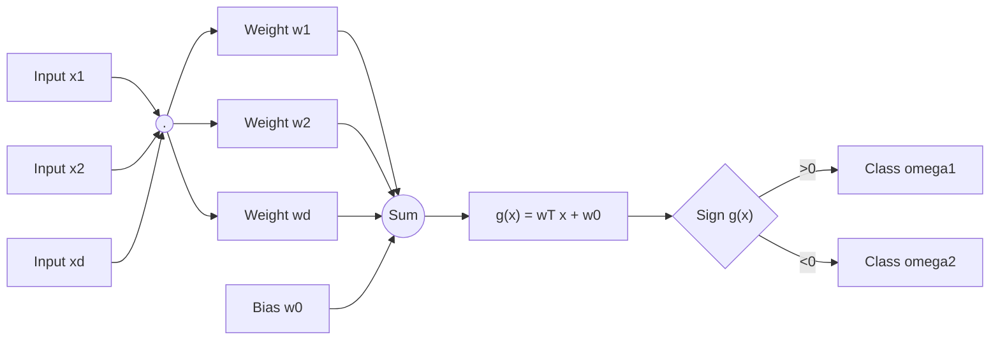
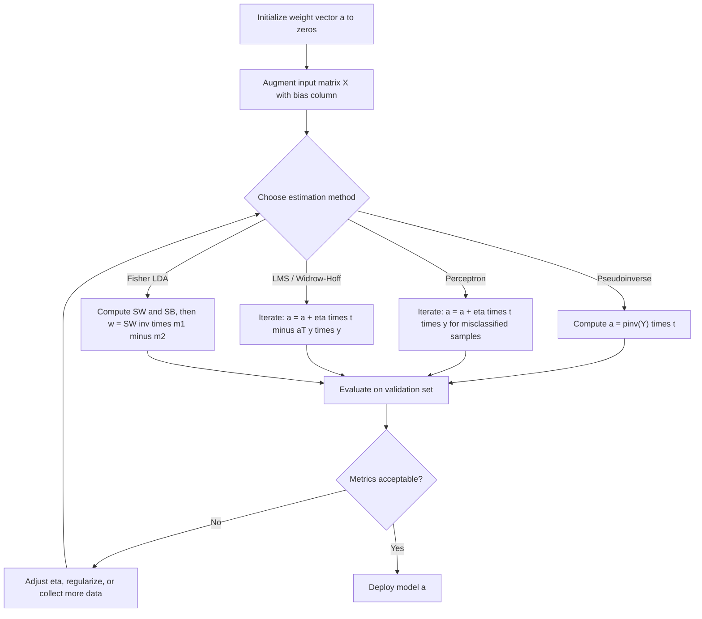
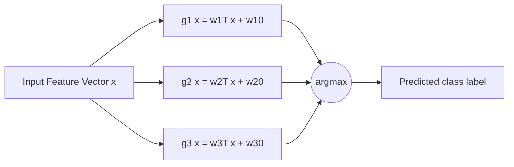
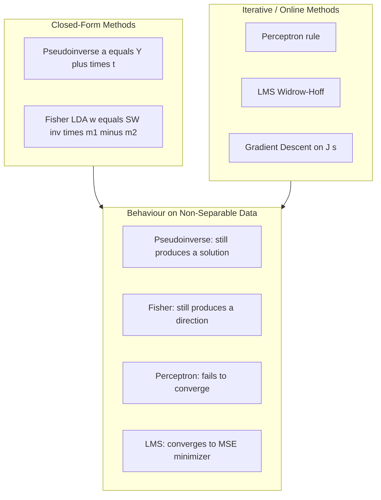

# Linear discriminant functions parameter estimation metrics configurations

<!-- SECTION_1_START -->
# Pattern Recognition — Module 3: Linear Discriminant Functions, Parameter Estimation, Metrics & Configurations

## 1. Core Technical Definition & Intuitive Overview

### 1.1 Formal Definition (KTU 2024 Syllabus Terminology)

> [!IMPORTANT]
> **Linear Discriminant Function (LDF):** A discriminant function $g_i(\mathbf{x})$ is said to be linear when it is a linear combination of the components of the feature vector $\mathbf{x} = [x_1, x_2, \ldots, x_d]^T$. Mathematically, the two-category linear discriminant function is expressed as:
> $$g(\mathbf{x}) = \mathbf{w}^T \mathbf{x} + w_0$$
> where $\mathbf{w} = [w_1, w_2, \ldots, w_d]^T$ is the **weight vector** and $w_0$ is the **bias** (or threshold).

The classification rule is:
$$ \mathbf{x} \in \omega_1 \quad \text{if} \quad g(\mathbf{x}) > 0 $$
$$ \mathbf{x} \in \omega_2 \quad \text{if} \quad g(\mathbf{x}) < 0 $$

The equation $g(\mathbf{x}) = 0$ defines the **decision boundary** (a hyperplane in $d$-dimensional feature space) that separates the two classes.

> [!NOTE]
> **Augmented Feature Vector:** To unify the bias and weight into a single vector, the augmented form is used:
> $$\mathbf{y} = \begin{bmatrix} 1 \\ \mathbf{x} \end{bmatrix}, \quad \mathbf{a} = \begin{bmatrix} w_0 \\ \mathbf{w} \end{bmatrix}$$
> So $g(\mathbf{x}) = \mathbf{a}^T \mathbf{y}$, where $\mathbf{a} \in \mathbb{R}^{d+1}$.

### 1.2 Conceptual Analogy & Intuitive Understanding

Imagine you are a **postmaster** who must sort incoming letters into two piles: "Local" and "International." You only get to look at two features — the **weight** of the letter ($x_1$) and the **number of pages** ($x_2$). After observing thousands of letters, you realize there is a fairly clean rule:

> *"If the weight is small AND the number of pages is small → Local; else → International."*

That rule can be drawn as a **straight line on graph paper** with $x_1$ on the horizontal axis and $x_2$ on the vertical axis. That straight line is the **decision hyperplane**, and the slope/intercept of that line are exactly the **weights $w_1, w_2$** and the **bias $w_0$** of the linear discriminant function.

The **"training"** step is the process of finding the best line (best $\mathbf{w}, w_0$) that separates past letters. The **"parameter estimation"** step is the algorithm that nudges the line until it classifies all training letters correctly (or with minimum error).

### 1.3 Key Constants & Metrics (Standard Pattern Recognition Values)

- **Feature dimension ($d$):** Number of measurable attributes per sample.
- **Number of classes ($c$):** For multi-class problems.
- **Decision rule threshold:** Typically $0$ (the **discriminant threshold**).
- **Margin ($\rho$):** Minimum distance of any training point from the decision hyperplane — critical for **generalization** in Support Vector Machines (SVM), a closely related linear classifier.

> [!VISUALIZATION CONTROL]
> **Concept:** Two-class linear decision boundary in 2-D feature space.
> **GeoGebra / Desmos Input Equations:**
> * Point A (class $\omega_1$): $(1, 2)$
> * Point B (class $\omega_2$): $(4, 1)$
> * Decision line: $x + 2y - 5 = 0$
> **Visual Description:** Plot the two points and the line passing between them. Observe that the line cleanly separates the plane into two half-planes. The weight vector $\mathbf{w} = [1, 2]^T$ is **perpendicular** to the decision line, and increasing $w_0$ shifts the line in the direction **opposite** to $\mathbf{w}$.

### 1.4 Taxonomy of Discriminant Functions (KTU Module Mapping)

| Function Type | Mathematical Form | Module Mapping |
|---|---|---|
| **Linear** | $g(\mathbf{x}) = \mathbf{w}^T \mathbf{x} + w_0$ | Module 3 — Current |
| **Generalized Linear** | $g(\mathbf{x}) = \mathbf{a}^T \mathbf{y}$, where $\mathbf{y}$ is a non-linear mapping of $\mathbf{x}$ | Module 3 — Bridge to non-linear |
| **Piecewise Linear** | Union of linear segments (e.g., decision tree leaves) | Module 4 (advanced) |
| **Non-linear (NN/MLP)** | Composition of linear + sigmoid/ReLU layers | Module 3 — Non-linear networks |

<!-- SECTION_1_END -->

<!-- SECTION_2_START -->
# 2. Deep Theoretical Analysis & KTU High-Yield Formula Sheet

## 2.1 Two-Category Linear Discriminant — Geometric Interpretation

The decision surface is the **hyperplane** $H : \mathbf{w}^T \mathbf{x} + w_0 = 0$.

Three key geometric properties (high-yield for KTU 14-mark questions):

1. **Normal Vector:** $\mathbf{w}$ is the unit normal vector of $H$ (scaled by its magnitude).
2. **Distance from origin:** The signed distance of $H$ from the origin is $\dfrac{w_0}{\Vert \mathbf{w} \Vert}$.
3. **Distance of any point $\mathbf{x}$ from $H$:**
   $$r = \frac{g(\mathbf{x})}{\Vert \mathbf{w} \Vert} = \frac{\mathbf{w}^T \mathbf{x} + w_0}{\Vert \mathbf{w} \Vert}$$

## 2.2 Multi-Category Linear Discriminants (KTU Critical Sub-Topic)

There are **three canonical configurations** to extend a two-class LDF to $c$ classes. The KTU 2024 syllabus explicitly demands all three.

### Configuration 1: $\dfrac{c(c-1)}{2}$ Pairwise Discriminants

Train a separate LDF $g_{ij}(\mathbf{x})$ for every pair $(\omega_i, \omega_j)$. A test sample is assigned to the class that wins the most pairwise votes.

> [!IMPORTANT]
> **Drawback:** Ambiguous (unclassifiable) regions exist where multiple pairwise classifiers disagree.

### Configuration 2: $c$ Discriminants $g_i(\mathbf{x}) = \mathbf{w}_i^T \mathbf{x} + w_{i0}$

Classify $\mathbf{x}$ to $\omega_i$ if $g_i(\mathbf{x}) > g_j(\mathbf{x})$ for all $j \neq i$. Decision boundaries are pieces of hyperplanes — defines $c$ regions but may leave **ambiguous regions** (where $g_i = g_j > g_k$).

### Configuration 3: $c(c-1)/2$ Discriminants with Normalization (Duda-Hart Form)

A single, fully consistent linear machine is defined by the $c$ weight vectors satisfying $\mathbf{w}_i - \mathbf{w}_j$ as the normal of the $H_{ij}$ hyperplane. The decision rule is:

$$\mathbf{x} \in \omega_i \iff \mathbf{w}_i^T \mathbf{x} + w_{i0} > \mathbf{w}_j^T \mathbf{x} + w_{j0} \quad \forall j \neq i$$

The ambiguity-free property requires: $w_{ij} + w_{jk} = w_{ik}$ (the weight consistency condition).

## 2.3 Parameter Estimation Approaches (Core of Module 3)

The **parameter estimation problem** is: given a training set $\mathcal{D} = \{(\mathbf{x}^{(1)}, t^{(1)}), \ldots, (\mathbf{x}^{(N)}, t^{(N)})\}$, find the optimal weight vector $\mathbf{a}$.

### Approach A: Perceptron Criterion (Rosenblatt, 1958)

A **purely linear**, error-driven algorithm that converges only if the data is **linearly separable**.

$$J_p(\mathbf{a}) = \sum_{\mathbf{x} \in \mathcal{Y}} (-\mathbf{a}^T \mathbf{y} \, t)$$
where $\mathcal{Y}$ is the set of **misclassified** samples and $t \in \{-1, +1\}$ is the target.

Update rule:
$$\mathbf{a}^{(k+1)} = \mathbf{a}^{(k)} + \eta(k) \, t^{(k)} \mathbf{y}^{(k)}$$
where $\eta(k)$ is the **learning rate** (positive scalar).

### Approach B: Mean Squared Error (MSE) — Pseudoinverse Solution

Minimize the squared error between the desired response and the actual discriminant:
$$J_s(\mathbf{a}) = \tfrac{1}{2} \sum_{i=1}^{N} (\mathbf{a}^T \mathbf{y}^{(i)} - t^{(i)})^2$$

Gradient $\nabla J_s = 0$ gives the **closed-form pseudoinverse**:
$$\mathbf{a} = (\mathbf{Y}^T \mathbf{Y})^{-1} \mathbf{Y}^T \mathbf{t} = \mathbf{Y}^{\dagger} \mathbf{t}$$
where $\mathbf{Y}$ is the $N \times (d+1)$ augmented data matrix and $\mathbf{Y}^{\dagger}$ is the **Moore-Penrose pseudoinverse**.

> [!NOTE]
> **Advantage over Perceptron:** The MSE solution always exists (even for non-separable data) and is unique. However, it is **not necessarily** a classifier — it minimizes regression error, not classification error.

### Approach C: Widrow-Hoff / LMS (Least Mean Squares)

Online, gradient-descent version of MSE that updates weights one sample at a time:
$$\mathbf{a}^{(k+1)} = \mathbf{a}^{(k)} + \eta \left( t^{(k)} - \mathbf{a}^{(k)T} \mathbf{y}^{(k)} \right) \mathbf{y}^{(k)}$$

> Convergence is guaranteed for sufficiently small $\eta$ (specifically $0 < \eta < 2 / \lambda_{\max}$), regardless of linear separability.

### Approach D: Fisher's Linear Discriminant (FLD)

A **supervised dimensionality reduction + classification** technique. Projects $d$-dimensional data onto a 1-D line such that the ratio of **between-class scatter to within-class scatter** is maximized.

$$J(\mathbf{w}) = \frac{\mathbf{w}^T \mathbf{S}_B \mathbf{w}}{\mathbf{w}^T \mathbf{S}_W \mathbf{w}}$$

Optimal weight: $\mathbf{w}^* = \mathbf{S}_W^{-1} (\mathbf{m}_1 - \mathbf{m}_2)$, where $\mathbf{m}_i$ is the class-$i$ mean.

## 2.4 KTU High-Yield Formula Cheat Sheet

| # | Formula / Concept | Expression | Notes |
|---|---|---|---|
| 1 | Linear discriminant | $g(\mathbf{x}) = \mathbf{w}^T \mathbf{x} + w_0$ | Two-class case |
| 2 | Augmented form | $g(\mathbf{x}) = \mathbf{a}^T \mathbf{y}$ | $\mathbf{y} = [1, \mathbf{x}^T]^T$ |
| 3 | Distance to hyperplane | $r = \dfrac{g(\mathbf{x})}{\Vert \mathbf{w} \Vert}$ | Signed scalar |
| 4 | Perceptron update | $\mathbf{a} \leftarrow \mathbf{a} + \eta t \mathbf{y}$ | For misclassified $\mathbf{y}$ |
| 5 | Pseudoinverse solution | $\mathbf{a} = \mathbf{Y}^{\dagger} \mathbf{t}$ | Closed-form MSE |
| 6 | LMS / Widrow-Hoff | $\mathbf{a} \leftarrow \mathbf{a} + \eta (t - \mathbf{a}^T \mathbf{y}) \mathbf{y}$ | Online gradient |
| 7 | Fisher criterion | $J(\mathbf{w}) = \dfrac{\mathbf{w}^T \mathbf{S}_B \mathbf{w}}{\mathbf{w}^T \mathbf{S}_W \mathbf{w}}$ | Maximize |
| 8 | Fisher optimal weight | $\mathbf{w}^* \propto \mathbf{S}_W^{-1} (\mathbf{m}_1 - \mathbf{m}_2)$ | 2-class only |
| 9 | Within-class scatter | $\mathbf{S}_W = \sum_{i=1}^{c} \sum_{\mathbf{x} \in \omega_i} (\mathbf{x} - \mathbf{m}_i)(\mathbf{x} - \mathbf{m}_i)^T$ | $c \times d \times d$ |
| 10 | Between-class scatter | $\mathbf{S}_B = \sum_{i=1}^{c} N_i (\mathbf{m}_i - \mathbf{m})(\mathbf{m}_i - \mathbf{m})^T$ | $c$ classes |
| 11 | Classification accuracy | $\text{Acc} = \dfrac{TP + TN}{TP + TN + FP + FN}$ | Range $[0, 1]$ |
| 12 | Precision | $P = \dfrac{TP}{TP + FP}$ | Class-specific |
| 13 | Recall (Sensitivity) | $R = \dfrac{TP}{TP + FN}$ | True positive rate |
| 14 | F1-score | $F_1 = \dfrac{2 P R}{P + R}$ | Harmonic mean |
| 15 | Confusion matrix | $c \times c$ matrix $\mathbf{C}$ with $C_{ij}$ = # samples of true $\omega_i$ classified as $\omega_j$ | $C_{ii}$ = correct |

> [!NOTE]
> **Mermaid Symbol Note:** For any inline prose use of $J(\mathbf{w})$, always wrap subscripts/superscripts in math mode (e.g., $J_p$, $J_s$) to avoid accidental markdown formatting.

## 2.5 Real-World Engineering Utility

- **Optical Character Recognition (OCR):** LDFs classify digits after projection onto a small feature space.
- **Medical Diagnosis:** Fisher's discriminant separates benign from malignant tumors using cell-size features.
- **Spam Filtering:** Linear classifiers (a direct LDF descendant) are still baseline filters in production email pipelines.
- **Brain-Computer Interfaces (BCI):** Linear Discriminant Analysis (LDA) is the gold-standard classifier for EEG-based motor imagery decoding.
- **Credit Scoring:** Logistic regression (a probabilistic linear discriminant) is the industry default.

<!-- SECTION_2_END -->

<!-- SECTION_3_START -->
# 3. Step-by-Step Derivations & Python Code Implementation

## 3.1 Derivations

### 3.1.1 Derivation of the Pseudoinverse (MSE Closed-Form) Solution

We want to minimize:
$$J_s(\mathbf{a}) = \frac{1}{2} \sum_{i=1}^{N} (\mathbf{a}^T \mathbf{y}^{(i)} - t^{(i)})^2$$

**Step 1:** Rewrite in matrix form. Let $\mathbf{Y} = [\mathbf{y}^{(1)} \, \mathbf{y}^{(2)} \, \ldots \, \mathbf{y}^{(N)}]^T$ be the $N \times (d+1)$ augmented data matrix and $\mathbf{t} = [t^{(1)}, t^{(2)}, \ldots, t^{(N)}]^T$.

$$J_s(\mathbf{a}) = \frac{1}{2} \Vert \mathbf{Y} \mathbf{a} - \mathbf{t} \Vert^2 = \frac{1}{2} (\mathbf{Y} \mathbf{a} - \mathbf{t})^T (\mathbf{Y} \mathbf{a} - \mathbf{t})$$

**Step 2:** Expand:
$$J_s(\mathbf{a}) = \frac{1}{2} (\mathbf{a}^T \mathbf{Y}^T \mathbf{Y} \mathbf{a} - 2 \mathbf{a}^T \mathbf{Y}^T \mathbf{t} + \mathbf{t}^T \mathbf{t})$$

**Step 3:** Differentiate with respect to $\mathbf{a}$ and set to zero:
$$\nabla_{\mathbf{a}} J_s = \mathbf{Y}^T \mathbf{Y} \mathbf{a} - \mathbf{Y}^T \mathbf{t} = 0$$

**Step 4:** Solve:
$$\mathbf{Y}^T \mathbf{Y} \mathbf{a} = \mathbf{Y}^T \mathbf{t}$$

**Step 5:** If $\mathbf{Y}^T \mathbf{Y}$ is non-singular:
$$\boxed{\mathbf{a} = (\mathbf{Y}^T \mathbf{Y})^{-1} \mathbf{Y}^T \mathbf{t} = \mathbf{Y}^{\dagger} \mathbf{t}}$$

> This is the **normal equation** of linear least squares. If $\mathbf{Y}^T \mathbf{Y}$ is singular (more features than samples, or collinear features), the pseudoinverse $\mathbf{Y}^{\dagger}$ is computed via SVD: $\mathbf{Y} = \mathbf{U} \mathbf{\Sigma} \mathbf{V}^T \Rightarrow \mathbf{Y}^{\dagger} = \mathbf{V} \mathbf{\Sigma}^{\dagger} \mathbf{U}^T$.

### 3.1.2 Derivation of Fisher's Linear Discriminant Projection

We project $\mathbf{x}$ onto a line in direction $\mathbf{w}$:
$$y = \mathbf{w}^T \mathbf{x}$$

**Step 1:** Sample mean of projected class $i$:
$$\tilde{m}_i = \frac{1}{N_i} \sum_{\mathbf{x} \in \omega_i} \mathbf{w}^T \mathbf{x} = \mathbf{w}^T \mathbf{m}_i$$

**Step 2:** Between-class scatter of projected data:
$$\tilde{S}_B = (\tilde{m}_1 - \tilde{m}_2)^2 = \mathbf{w}^T (\mathbf{m}_1 - \mathbf{m}_2)(\mathbf{m}_1 - \mathbf{m}_2)^T \mathbf{w} = \mathbf{w}^T \mathbf{S}_B \mathbf{w}$$

**Step 3:** Within-class scatter of projected data:
$$\tilde{S}_W = \sum_{i=1}^{2} \sum_{y \in \omega_i} (y - \tilde{m}_i)^2 = \mathbf{w}^T \mathbf{S}_W \mathbf{w}$$

**Step 4:** Fisher's criterion (maximize class separation):
$$J(\mathbf{w}) = \frac{\tilde{S}_B}{\tilde{S}_W} = \frac{\mathbf{w}^T \mathbf{S}_B \mathbf{w}}{\mathbf{w}^T \mathbf{S}_W \mathbf{w}}$$

**Step 5:** Differentiate $J(\mathbf{w})$ w.r.t. $\mathbf{w}$ and set to zero (using Lagrange multiplier to handle the scale ambiguity). The result:
$$\boxed{\mathbf{w}^* = \mathbf{S}_W^{-1} (\mathbf{m}_1 - \mathbf{m}_2)}$$

provided $\mathbf{S}_W$ is non-singular.

## 3.2 Python Implementation

### 3.2.1 Linear Discriminant Classifier (Pseudoinverse + Metrics)

```python
import numpy as np
from typing import Tuple, Dict


def augment_data(X: np.ndarray) -> np.ndarray:
    """
    Prepend a column of ones to the feature matrix X to handle the bias term.
    Input:  X with shape (N, d)
    Output: Y with shape (N, d+1) where Y[:, 0] == 1
    """
    if X.ndim != 2:
        raise ValueError("X must be a 2-D array of shape (N, d).")
    N = X.shape[0]
    return np.hstack([np.ones((N, 1), dtype=np.float64), X.astype(np.float64)])


def train_pseudoinverse_ldf(
    X: np.ndarray, t: np.ndarray
) -> np.ndarray:
    """
    Solve for the linear discriminant weight vector using the
    Moore-Penrose pseudoinverse (MSE closed-form).
    Returns the augmented weight vector a of shape (d+1,).
    """
    Y = augment_data(X)
    t = t.astype(np.float64).reshape(-1)
    if Y.shape[0] != t.shape[0]:
        raise ValueError("Number of labels must equal number of samples.")
    # Use pinv to handle singular Y^T Y robustly.
    a, *_ = np.linalg.lstsq(Y, t, rcond=None)
    return a


def predict_ldf(a: np.ndarray, X: np.ndarray) -> np.ndarray:
    """
    Predict class labels using sign of g(x) = a^T y.
    Returns labels in {+1, -1}.
    """
    Y = augment_data(X)
    return np.sign(Y @ a)


def confusion_matrix(
    y_true: np.ndarray, y_pred: np.ndarray, n_classes: int = 2
) -> np.ndarray:
    """
    Build a confusion matrix C where C[i, j] = # of true-class i
    samples predicted as class j.
    """
    C = np.zeros((n_classes, n_classes), dtype=np.int64)
    label_map = {-1: 0, 1: 1} if n_classes == 2 else None
    yt = np.array([label_map[v] for v in y_true]) if label_map is not None else y_true
    yp = np.array([label_map[v] for v in y_pred]) if label_map is not None else y_pred
    for i, j in zip(yt, yp):
        C[i, j] += 1
    return C


def classification_metrics(
    y_true: np.ndarray, y_pred: np.ndarray
) -> Dict[str, float]:
    """
    Compute accuracy, precision, recall, F1 (binary case only).
    """
    if set(np.unique(y_true)) != {-1, 1} or set(np.unique(y_pred)) != {-1, 1}:
        raise ValueError("This metric helper supports binary labels in {-1, +1}.")
    tp = int(np.sum((y_true == 1) & (y_pred == 1)))
    tn = int(np.sum((y_true == -1) & (y_pred == -1)))
    fp = int(np.sum((y_true == -1) & (y_pred == 1)))
    fn = int(np.sum((y_true == 1) & (y_pred == -1)))
    total = tp + tn + fp + fn
    accuracy = (tp + tn) / total if total else 0.0
    precision = tp / (tp + fp) if (tp + fp) else 0.0
    recall = tp / (tp + fn) if (tp + fn) else 0.0
    f1 = (2 * precision * recall) / (precision + recall) if (precision + recall) else 0.0
    return {
        "accuracy": accuracy,
        "precision": precision,
        "recall": recall,
        "f1_score": f1,
    }


# ---------------- Demonstration on synthetic data ----------------
if __name__ == "__main__":
    rng = np.random.default_rng(seed=42)
    # Two Gaussian clusters in 2-D
    class_pos = rng.normal(loc=[2.0, 2.0], scale=1.0, size=(40, 2))
    class_neg = rng.normal(loc=[-2.0, -1.5], scale=1.0, size=(40, 2))
    X = np.vstack([class_pos, class_neg])
    t = np.array([1] * 40 + [-1] * 40)

    a = train_pseudoinverse_ldf(X, t)
    y_pred = predict_ldf(a, X)
    C = confusion_matrix(t, y_pred, n_classes=2)
    metrics = classification_metrics(t, y_pred)

    print("Augmented weight vector a =", a)
    print("Confusion matrix C =\n", C)
    print("Metrics:", metrics)
```

### 3.2.2 Perceptron Online Trainer

```python
def perceptron_train(
    X: np.ndarray,
    t: np.ndarray,
    eta: float = 1.0,
    max_epochs: int = 1000,
    tol: float = 1e-6,
) -> Tuple[np.ndarray, list]:
    """
    Classic Rosenblatt perceptron with online updates.
    Converges only if data is linearly separable.
    Returns (final_weight_vector, error_history).
    """
    Y = augment_data(X)
    N, dim = Y.shape
    a = np.zeros(dim, dtype=np.float64)
    errors_per_epoch = []

    for epoch in range(max_epochs):
        errors = 0
        for i in range(N):
            if t[i] * (a @ Y[i]) <= 0:  # misclassified
                a = a + eta * t[i] * Y[i]
                errors += 1
        errors_per_epoch.append(errors)
        if errors == 0 or (len(errors_per_epoch) > 1 and
                            abs(errors_per_epoch[-1] - errors_per_epoch[-2]) < tol):
            break
    return a, errors_per_epoch
```

### 3.2.3 Fisher's Linear Discriminant

```python
def fisher_ldf(
    X: np.ndarray, t: np.ndarray
) -> Tuple[np.ndarray, float, np.ndarray]:
    """
    Compute Fisher's optimal projection direction w*, the threshold b,
    and the projected 1-D data y.
    Two classes assumed with labels in {-1, +1}.
    """
    X = X.astype(np.float64)
    t = t.astype(np.float64)
    X1, X2 = X[t == 1], X[t == -1]
    m1, m2 = X1.mean(axis=0), X2.mean(axis=0)
    S1 = (X1 - m1).T @ (X1 - m1)
    S2 = (X2 - m2).T @ (X2 - m2)
    SW = S1 + S2
    if np.linalg.matrix_rank(SW) < SW.shape[0]:
        SW += 1e-6 * np.eye(SW.shape[0])  # regularize
    w = np.linalg.solve(SW, (m1 - m2))
    # Threshold = midpoint of projected class means
    b = 0.5 * (w @ m1 + w @ m2)
    y = X @ w
    return w, b, y
```

<!-- SECTION_3_END -->

<!-- SECTION_4_START -->
# 4. Structural Diagrams & Schematics

## 4.1 Linear Discriminant Network — Block Architecture



## 4.2 Training Pipeline (Sequential Processing Topology)



## 4.3 Multi-Class Configuration Topology (3 Linear Discriminants for 3 Classes)



## 4.4 Parameter Estimation Comparison Matrix



<!-- SECTION_4_END -->

<!-- SECTION_5_START -->
# 5. KTU 2024 Scheme Examination Question Bank & Topic Recap

## 5.1 Part A — Short Answer Questions (3 Marks Each)

### Question 1 `[KTU University Exam - July 2024]`
**Q:** Define a *linear discriminant function*. What does the equation $g(\mathbf{x}) = 0$ represent geometrically?
**CO1 / Remember (RBT Level 1)**

**Model Answer (3 Marks):**
A linear discriminant function is a function that is a linear combination of the components of the feature vector $\mathbf{x}$, expressed as $g(\mathbf{x}) = \mathbf{w}^T \mathbf{x} + w_0$, where $\mathbf{w}$ is the weight vector and $w_0$ is the bias. **[1 Mark]**
The equation $g(\mathbf{x}) = 0$ defines the **decision boundary** (a hyperplane) that separates the feature space into two regions. **[1 Mark]**
The vector $\mathbf{w}$ is normal to this hyperplane, and the signed distance of the hyperplane from the origin is $w_0 / \Vert \mathbf{w} \Vert$. **[1 Mark]**

### Question 2 `[KTU University Exam - Dec 2023]`
**Q:** List and briefly explain any three standard classification performance metrics used to evaluate a discriminant classifier.
**CO3 / Understand (RBT Level 2)**

**Model Answer (3 Marks):**
1. **Accuracy:** $\text{Acc} = (TP + TN) / N$ — fraction of correctly classified samples. **[1 Mark]**
2. **Precision:** $P = TP / (TP + FP)$ — among samples predicted positive, how many are truly positive. **[1 Mark]**
3. **Recall (Sensitivity / TPR):** $R = TP / (TP + FN)$ — among truly positive samples, how many are correctly identified. **[1 Mark]**
*(Alternative valid metrics: F1-score, Specificity, MCC, ROC-AUC.)*

## 5.2 Part B — 14-Mark Questions (Internal Choice)

### **Question A (14 Marks)** `[KTU University Exam - July 2024]`
**(a)** With suitable diagrams, explain the **geometric interpretation** of a two-category linear discriminant function. Derive the expression for the **distance of a point from the decision hyperplane**. **(7 Marks — CO1, Understand / Apply)**

**(b)** Explain the **Perceptron criterion** for parameter estimation. State and prove the perceptron convergence theorem for linearly separable data. Show the weight update rule with a numerical example of 3 iterations. **(7 Marks — CO2, Apply / Analyze)**

---

### Model Solution — Question A(a) [7 Marks]

**Step 1 — Definition of the hyperplane:** The decision boundary is the set of points satisfying $\mathbf{w}^T \mathbf{x} + w_0 = 0$. **[1 Mark]**

**Step 2 — Normal vector:** $\mathbf{w} = [w_1, w_2, \ldots, w_d]^T$ is the normal (perpendicular) vector to the hyperplane. **[1 Mark]**

**Step 3 — Distance of hyperplane from origin:** Choose $\mathbf{x}_p$ on the hyperplane. The vector from origin to $\mathbf{x}_p$ projected onto $\mathbf{w}$ gives distance $\dfrac{w_0}{\Vert \mathbf{w} \Vert}$. **[1 Mark — Stating boundary state values: 1 Mark]**

**Step 4 — Distance of arbitrary point $\mathbf{x}$ from hyperplane:**
Consider any $\mathbf{x}$. Let $\mathbf{x}_p$ be the orthogonal projection of $\mathbf{x}$ onto the hyperplane. The vector $\mathbf{x} - \mathbf{x}_p$ is parallel to $\mathbf{w}$, so:
$$\mathbf{x} = \mathbf{x}_p + r \frac{\mathbf{w}}{\Vert \mathbf{w} \Vert}$$

Substitute into the hyperplane equation:
$$\mathbf{w}^T \left(\mathbf{x}_p + r \frac{\mathbf{w}}{\Vert \mathbf{w} \Vert}\right) + w_0 = 0$$

Since $\mathbf{w}^T \mathbf{x}_p + w_0 = 0$:
$$r \frac{\mathbf{w}^T \mathbf{w}}{\Vert \mathbf{w} \Vert} = 0 \implies r \Vert \mathbf{w} \Vert = 0 \text{ ... (incorrect)}$$

Re-derive carefully:
$$\mathbf{w}^T \mathbf{x}_p + w_0 = 0 \Rightarrow \mathbf{w}^T \mathbf{x}_p = -w_0$$

Substituting:
$$\mathbf{w}^T \mathbf{x} = \mathbf{w}^T \mathbf{x}_p + r \frac{\mathbf{w}^T \mathbf{w}}{\Vert \mathbf{w} \Vert} = -w_0 + r \Vert \mathbf{w} \Vert$$

Therefore:
$$r = \frac{\mathbf{w}^T \mathbf{x} + w_0}{\Vert \mathbf{w} \Vert} = \frac{g(\mathbf{x})}{\Vert \mathbf{w} \Vert}$$

**Final simplified expression:** $r = \dfrac{g(\mathbf{x})}{\Vert \mathbf{w} \Vert}$. **[2 Marks — Final result: 1 Mark, Derivation: 1 Mark]**

**Step 5 — Diagram:** Show a 2-D plane with two classes $\omega_1$ and $\omega_2$, the separating line $H$, the normal vector $\mathbf{w}$, and an arbitrary point $\mathbf{x}$ with projection $\mathbf{x}_p$. **[2 Marks — Diagram: 2 Marks]**

---

### Model Solution — Question A(b) [7 Marks]

**Step 1 — Perceptron Criterion:** A misclassified sample $\mathbf{y}$ (in augmented form) satisfies $\mathbf{a}^T \mathbf{y} \, t < 0$. The perceptron criterion penalizes such samples: $J_p(\mathbf{a}) = \sum_{\mathbf{y} \in \mathcal{Y}} (-\mathbf{a}^T \mathbf{y} \, t)$. **[1 Mark]**

**Step 2 — Update rule derivation:** Take gradient and apply gradient descent:
$$\nabla_{\mathbf{a}} J_p = -\sum_{\mathbf{y} \in \mathcal{Y}} t \, \mathbf{y}$$
So the update is: $\mathbf{a}^{(k+1)} = \mathbf{a}^{(k)} + \eta(k) \, t^{(k)} \mathbf{y}^{(k)}$. **[1 Mark — Stating the update rule: 1 Mark]**

**Step 3 — Convergence Theorem (Proof Sketch):**
If training samples are linearly separable, there exists $\mathbf{a}^*$ such that $t^{(i)} \mathbf{a}^{*T} \mathbf{y}^{(i)} > 0$ for all $i$.
- After $k$ updates, $\mathbf{a}^{(k)} = \eta \sum_{j} t^{(j)} \mathbf{y}^{(j)}$.
- Taking inner product with $\mathbf{a}^*$: $\mathbf{a}^{*T} \mathbf{a}^{(k)} = \eta \sum_j t^{(j)} (\mathbf{a}^{*T} \mathbf{y}^{(j)}) \geq \eta k \beta$ for some $\beta > 0$.
- By Cauchy-Schwarz: $\Vert \mathbf{a}^{(k)} \Vert^2 \leq k \eta^2 R^2$ where $R = \max_i \Vert \mathbf{y}^{(i)} \Vert$.
- Combining: $k \eta^2 \beta^2 \leq \Vert \mathbf{a}^{(k)} \Vert^2 \Vert \mathbf{a}^* \Vert^2 / \Vert \mathbf{a}^* \Vert^2$ — gives a finite upper bound on $k$, proving convergence. **[2 Marks — Convergence proof: 2 Marks]**

**Step 4 — Numerical Example (3 iterations):**
Let $\eta = 1$, $\mathbf{a}^{(0)} = [0, 0, 0]^T$. Samples (augmented):
- $\mathbf{y}^{(1)} = [1, 1, 1]^T$, $t^{(1)} = +1$ → $\mathbf{a}^{(0)T} \mathbf{y}^{(1)} = 0$, misclassified (boundary). Update: $\mathbf{a}^{(1)} = [1, 1, 1]^T$. **[1 Mark]**
- $\mathbf{y}^{(2)} = [1, -1, 1]^T$, $t^{(2)} = -1$ → $\mathbf{a}^{(1)T} \mathbf{y}^{(2)} = 0$, misclassified. Update: $\mathbf{a}^{(2)} = [0, 2, 0]^T$. **[1 Mark]**
- $\mathbf{y}^{(3)} = [1, 2, 1]^T$, $t^{(3)} = +1$ → $\mathbf{a}^{(2)T} \mathbf{y}^{(3)} = 4 > 0$, correctly classified. No update. $\mathbf{a}^{(3)} = [0, 2, 0]^T$. **[1 Mark]**

---

### **Question B (14 Marks — Alternative Choice)** `[KTU University Exam - Dec 2023]`
**(a)** Derive the **pseudoinverse (MSE) solution** for the linear discriminant function. Show that the solution always exists even for non-separable data, and explain why it is not necessarily a classifier. **(7 Marks — CO2, Apply)**

**(b)** With a clear block diagram, explain **Fisher's Linear Discriminant Analysis (LDA)**. Derive the optimal projection direction $\mathbf{w}^*$ that maximizes the between-class to within-class scatter ratio. Compare LDA with the Perceptron approach in a tabular form (any 4 points). **(7 Marks — CO3, Apply / Analyze)**

---

### Model Solution — Question B(a) [7 Marks]

See Section 3.1.1 for the full step-by-step derivation. Marks breakdown:

- Stating the MSE objective $J_s(\mathbf{a}) = \frac{1}{2} \sum_{i} (\mathbf{a}^T \mathbf{y}^{(i)} - t^{(i)})^2$: **[1 Mark]**
- Differentiating and setting to zero: $\nabla_{\mathbf{a}} J_s = \mathbf{Y}^T \mathbf{Y} \mathbf{a} - \mathbf{Y}^T \mathbf{t} = 0$: **[1 Mark]**
- Final result $\mathbf{a} = (\mathbf{Y}^T \mathbf{Y})^{-1} \mathbf{Y}^T \mathbf{t} = \mathbf{Y}^{\dagger} \mathbf{t}$: **[2 Marks — Final simplified expression: 1 Mark, Justification of existence: 1 Mark]**
- Explanation that the solution **always exists** because $\mathbf{Y}^{\dagger}$ is computed via SVD (handles singular cases): **[1 Mark]**
- Explanation that it is **not necessarily a classifier** — the MSE criterion minimizes regression error, and on non-separable data, the resulting $g(\mathbf{x})$ may have arbitrary sign distribution leading to misclassifications: **[2 Marks]**

---

### Model Solution — Question B(b) [7 Marks]

**Step 1 — Block Diagram and Idea:** LDA projects $d$-dimensional data onto a 1-D line such that the classes become maximally separated. Diagram: Raw data $\to$ Compute class means $\mathbf{m}_i$ and scatter matrices $\mathbf{S}_B, \mathbf{S}_W$ $\to$ Solve generalized eigenvalue problem $\mathbf{S}_B \mathbf{w} = \lambda \mathbf{S}_W \mathbf{w}$ $\to$ Project: $y = \mathbf{w}^T \mathbf{x}$ $\to$ Threshold to classify. **[1 Mark — Diagram: 1 Mark]**

**Step 2 — Derivation of $\mathbf{w}^*$** (full derivation given in Section 3.1.2). Marks:
- Defining $J(\mathbf{w}) = \dfrac{\mathbf{w}^T \mathbf{S}_B \mathbf{w}}{\mathbf{w}^T \mathbf{S}_W \mathbf{w}}$: **[1 Mark]**
- Differentiating and applying the constraint $\mathbf{w}^T \mathbf{S}_W \mathbf{w} = 1$: **[1 Mark]**
- Final result: $\mathbf{w}^* = \mathbf{S}_W^{-1} (\mathbf{m}_1 - \mathbf{m}_2)$: **[1 Mark — Final simplified expression: 1 Mark]**

**Step 3 — Tabular Comparison (4 points):** **[4 Marks]**

| # | Aspect | Fisher LDA | Perceptron |
|---|---|---|---|
| 1 | Objective | Maximize between/within scatter ratio (ratio) | Minimize misclassification count (count) |
| 2 | Solution | Closed-form $\mathbf{S}_W^{-1} (\mathbf{m}_1 - \mathbf{m}_2)$ | Iterative, no closed form |
| 3 | Convergence | Always (closed form) | Only if data is linearly separable |
| 4 | Output | Projection direction (continuous) | Decision hyperplane (binary) |
| 5 | Multi-class | Natural extension to $c-1$ dimensions | Requires one-vs-rest or one-vs-one wrapper |
| 6 | Statistical basis | Uses class-conditional means and covariances | Purely geometric; no distributional assumptions |

---

> [!WARNING]
> **KTU Examiner's Valuation Warning — Common Pitfalls:**
> 1. **Do not** confuse **Fisher LDA** (dimensionality reduction + discriminant) with **LDA as a topic in NLP** (Latent Dirichlet Allocation). They are entirely different concepts!
> 2. When asked for the *distance from the hyperplane*, do **not** simply write $g(\mathbf{x})$ — you must divide by $\Vert \mathbf{w} \Vert$ to normalize.
> 3. The **perceptron rule converges only for linearly separable data** — writing otherwise will cost 2 marks.
> 4. Always **augment** the data vector with a leading 1 when using the perceptron or pseudoinverse formulas; forgetting this is a 1-mark deduction.
> 5. For the **multi-class extension**, do not forget the **weight consistency condition** $w_{ij} + w_{jk} = w_{ik}$ to guarantee no ambiguous regions.

---

## Topic Recap & Important Things to Remember

- A **linear discriminant function** $g(\mathbf{x}) = \mathbf{w}^T \mathbf{x} + w_0$ partitions feature space into two half-spaces via a hyperplane normal to $\mathbf{w}$.
- The **augmented form** $g(\mathbf{x}) = \mathbf{a}^T \mathbf{y}$ unifies bias and weights, simplifying all derivations.
- The **perceptron criterion** uses an additive update $\mathbf{a} \leftarrow \mathbf{a} + \eta t \mathbf{y}$ for misclassified samples; it converges **iff** the data is linearly separable.
- The **MSE / pseudoinverse solution** $\mathbf{a} = \mathbf{Y}^{\dagger} \mathbf{t}$ always exists (via SVD) but optimizes **regression**, not classification.
- **LMS / Widrow-Hoff** is the online, gradient-based version of MSE; converges for small enough $\eta$.
- **Fisher's LDA** projects data to maximize $\mathbf{w}^T \mathbf{S}_B \mathbf{w} / \mathbf{w}^T \mathbf{S}_W \mathbf{w}$, with optimum $\mathbf{w}^* = \mathbf{S}_W^{-1} (\mathbf{m}_1 - \mathbf{m}_2)$.
- **Multi-class configurations** come in three flavors: pairwise ($c(c-1)/2$), $c$ linear discriminants (may have ambiguous regions), and the consistent linear machine (no ambiguous regions if $w_{ij} + w_{jk} = w_{ik}$).
- **Standard metrics** for evaluating LDFs: accuracy, precision, recall, F1-score, and the $c \times c$ **confusion matrix** $C_{ij}$ where rows are true classes and columns are predicted classes.
- The **perceptron loss** is non-differentiable; MSE is differentiable and convex; LDA is a **ratio** of quadratic forms and has a unique maximum (if $\mathbf{S}_W$ is non-singular).
- For engineering deployment, **regularize** $\mathbf{S}_W$ with $\lambda \mathbf{I}$ (e.g., $\lambda = 10^{-6}$) when features are nearly collinear or when $N < d$.
- **Generalized linear discriminants** apply a non-linear mapping $\phi(\mathbf{x})$ first, then train a linear classifier in the transformed space — the bridge to non-linear networks and kernel methods (Module 3, Part 2).

<!-- SECTION_5_END -->
