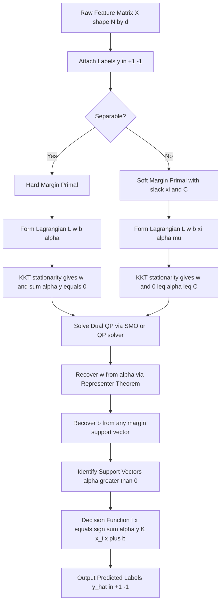
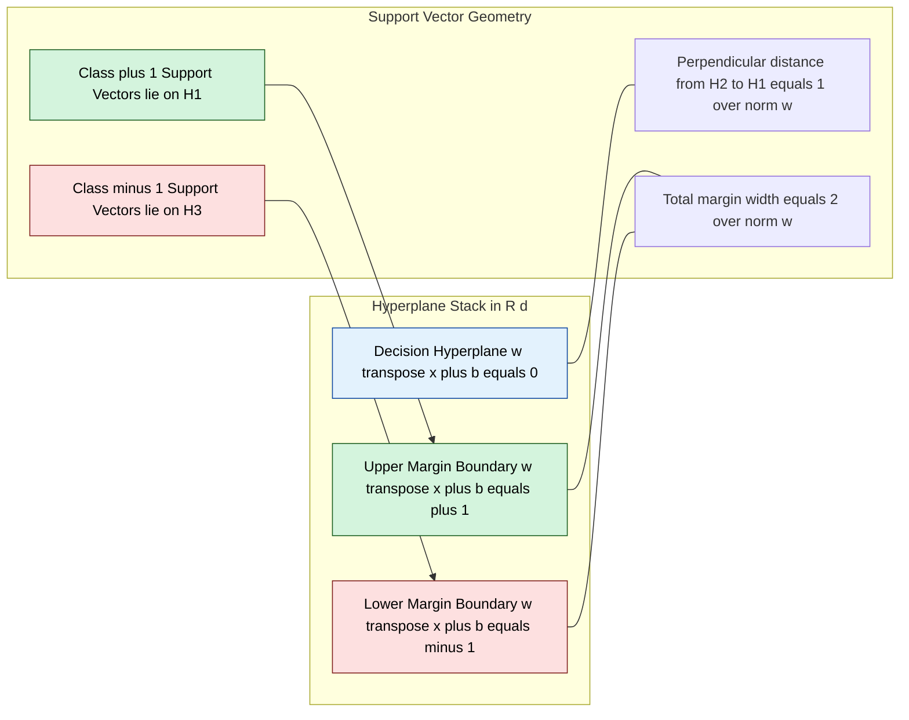
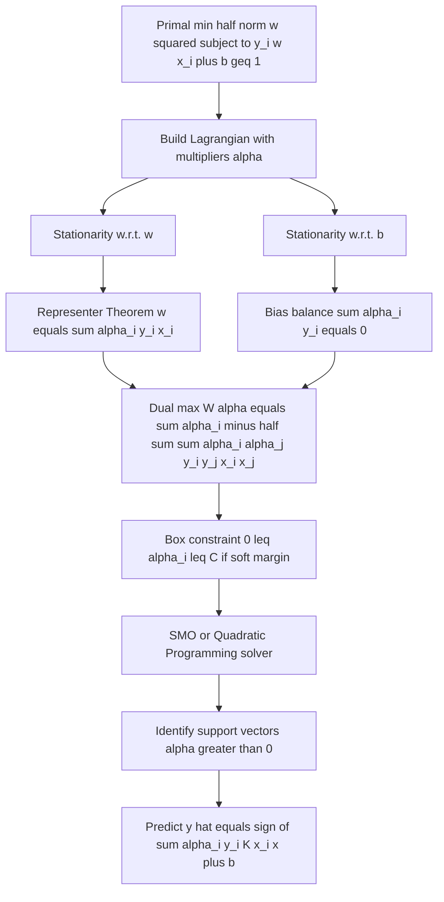
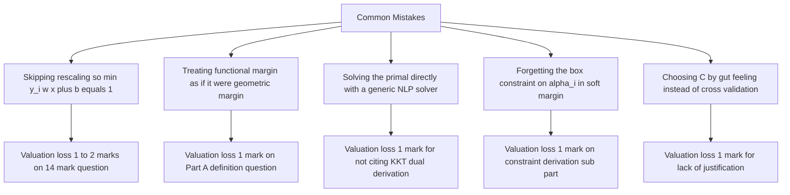

# Support vector machine margin maximization geometric properties setups formulas

<!-- SECTION_1_START -->
# Support Vector Machine: Margin Maximization & Geometric Foundations

## 1.1 Formal KTU-Syllabus Definition

> [!IMPORTANT]
> **Support Vector Machine (SVM)** is a supervised binary linear classifier defined by a separating hyperplane that maximizes the **geometric margin** between the two classes. Geometrically, given a training set $\{(x_i, y_i)\}_{i=1}^{N}$ with $y_i \in \{-1, +1\}$, the SVM finds the hyperplane $w^T x + b = 0$ such that the perpendicular distance from the nearest data point of either class to the hyperplane is maximized.

In the **KTU 2024 Scheme (PECST405 – Pattern Recognition)** framework, SVM sits at the intersection of **statistical learning theory**, **convex optimization**, and **geometric pattern classification**, and serves as the canonical maximum-margin linear discriminant.

The "support vectors" are the training samples that lie exactly on the margin boundaries — they alone define the optimal hyperplane. All other points can be discarded once training is complete.

## 1.2 Intuitive Analogy (Plain English)

> [!NOTE]
> **Real-world analogy:** Imagine two rival groups standing on an open field, and you must draw a single straight line to separate them. You are not just asked to *separate* them — you are asked to draw the line that keeps the **largest possible empty buffer zone** around itself. The buffer is the "margin," and the people standing closest to the line (the **support vectors**) literally "support" — i.e., define — the line's position. If you pushed the line even slightly, the first person to be touched is always a support vector.

A wider margin ⇒ better generalization to unseen data ⇒ lower expected error. This is the central geometric insight of Vapnik–Chervonenkis (VC) theory.

## 1.3 Key Quantities (with bold constants)

| Symbol | Meaning | Typical Value / Range |
|---|---|---|
| $N$ | Number of training samples | $N \in \mathbb{Z}^+$ |
| $d$ | Feature-space dimensionality | $d \geq 1$ |
| $w \in \mathbb{R}^{d}$ | Weight (normal) vector | unconstrained |
| $b \in \mathbb{R}$ | Bias term (offset) | unconstrained |
| $\gamma$ | Geometric margin of the hyperplane | $\gamma > 0$ |
| $\hat{\gamma}$ | Functional margin | $\hat{\gamma} > 0$ |
| $C$ | Slack penalty (soft-margin only) | $C > 0$ (typical: $10^{-2}$ to $10^3$) |
| $\alpha_i$ | Lagrange multiplier for sample $i$ | $\alpha_i \geq 0$ |
| $\xi_i$ | Slack variable for sample $i$ | $\xi_i \geq 0$ |
| $K(\cdot,\cdot)$ | Kernel function (non-linear extension) | symmetric, PSD |

> [!VISUALIZATION CONTROL]
> **Concept:** 2-D Maximum-Margin Hyperplane with Margin Boundaries
> **GeoGebra / Desmos Input Equations:**
> * `f1(x) = (1/2)*x + 1`     (upper margin boundary)
> * `f2(x) = (1/2)*x - 1`     (lower margin boundary)
> * `f3(x) = (1/2)*x`         (decision hyperplane)
> **Visual Description:** You should see three parallel lines. The middle line is the **decision boundary**, and the two outer lines are at perpendicular distance $1/\|w\|$ from it. All class $+1$ points lie on/above the upper boundary; all class $-1$ points lie on/below the lower boundary. The points exactly on the boundary lines are the support vectors.

## 1.4 Why Margin Maximization? (Conceptual Justification)

The VC-theory lower bound on expected test error is:

$$
R(\text{test}) \;\leq\; R(\text{training}) \;+\; \mathcal{O}\!\left(\sqrt{\tfrac{h}{N}}\right)
$$

where $h$ is the **VC dimension** of the classifier. For a separating hyperplane in $\mathbb{R}^d$, $h$ scales with the **ratio** $R^2 \|w\|^2$, where $R$ is the radius of the smallest sphere containing the data. Therefore, **minimizing $\|w\|$** is mathematically equivalent to **minimizing a tight upper bound on the model complexity**, which is the essence of *structural risk minimization* (SRM).

> [!TIP]
> **Mnemonic for KTU exam:** *Small $\|w\|$ → Small VC dimension → Small generalization error → Big margin.*

<!-- SECTION_1_END -->

<!-- SECTION_2_START -->
# Deep Theoretical Analysis & KTU High-Yield Formula Sheet

## 2.1 The Three Levels of "Margin"

A classic KTU board-question trap is conflating these three quantities. Keep them straight:

1. **Functional margin** of a single example:
$$
\hat{\gamma}_i \;=\; y_i \left(w^T x_i + b\right)
$$

2. **Functional margin of the dataset:**
$$
\hat{\gamma} \;=\; \min_{i} \hat{\gamma}_i
$$

3. **Geometric (true) margin** of a single example:
$$
\gamma_i \;=\; \frac{y_i \left(w^T x_i + b\right)}{\|w\|_2} \;=\; \frac{\hat{\gamma}_i}{\|w\|}
$$

4. **Geometric margin of the dataset:**
$$
\gamma \;=\; \frac{\hat{\gamma}}{\|w\|} \;=\; \min_{i} \frac{y_i(w^T x_i + b)}{\|w\|}
$$

> [!NOTE]
> The geometric margin is **scale-invariant**: scaling $(w, b) \to (\lambda w, \lambda b)$ does not change $\gamma$ (it scales numerator and denominator together). The functional margin is NOT scale-invariant.

## 2.2 Hard-Margin SVM (Linearly Separable Case)

**Primal optimization problem:**

$$
\begin{aligned}
\min_{w, b} \quad & \frac{1}{2} \|w\|_2^2 \\
\text{subject to} \quad & y_i \left(w^T x_i + b\right) \geq 1, \quad i = 1, 2, \ldots, N
\end{aligned}
$$

**Geometric interpretation of every term:**

* $\frac{1}{2}\|w\|^2$ is convex, differentiable, strictly positive ⇒ **unique global minimum** exists.
* The constraint $y_i(w^T x_i + b) \geq 1$ forces every point to lie on the *correct* side of its respective margin boundary. The "1" is a convenient normalization (rescaling freedom).
* The optimal margin width is $\dfrac{2}{\|w^*\|_2}$.

## 2.3 Soft-Margin SVM (Non-Separable / Noisy Case)

Slack variables $\xi_i \geq 0$ are introduced to allow (and penalize) misclassifications:

$$
\begin{aligned}
\min_{w, b, \xi} \quad & \frac{1}{2} \|w\|_2^2 + C \sum_{i=1}^{N} \xi_i \\
\text{subject to} \quad & y_i \left(w^T x_i + b\right) \geq 1 - \xi_i, \quad i = 1, \ldots, N \\
& \xi_i \geq 0, \quad i = 1, \ldots, N
\end{aligned}
$$

* $C$ balances **margin width** vs. **training misclassification penalty**.
* $C \to \infty$ recovers the hard-margin SVM.
* $C \to 0$ ignores the data and produces a trivial classifier.

## 2.4 Dual Formulation (Wolfe Dual) — *The setup the KTU examiner loves*

Construct the Lagrangian:

$$
\mathcal{L}(w, b, \xi; \alpha, \mu) \;=\; \tfrac{1}{2}\|w\|^2 + C \sum_i \xi_i - \sum_i \alpha_i \left[y_i(w^T x_i + b) - 1 + \xi_i\right] - \sum_i \mu_i \xi_i
$$

Setting partial derivatives to zero (KKT stationarity):

$$
\frac{\partial \mathcal{L}}{\partial w} = 0 \;\;\Rightarrow\;\; w = \sum_{i=1}^{N} \alpha_i y_i x_i
$$

$$
\frac{\partial \mathcal{L}}{\partial b} = 0 \;\;\Rightarrow\;\; \sum_{i=1}^{N} \alpha_i y_i = 0
$$

$$
\frac{\partial \mathcal{L}}{\partial \xi_i} = 0 \;\;\Rightarrow\;\; C - \alpha_i - \mu_i = 0 \;\;\Rightarrow\;\; 0 \leq \alpha_i \leq C
$$

Substituting back yields the **dual problem:**

$$
\begin{aligned}
\max_{\alpha} \quad & W(\alpha) \;=\; \sum_{i=1}^{N} \alpha_i - \frac{1}{2} \sum_{i=1}^{N} \sum_{j=1}^{N} \alpha_i \alpha_j y_i y_j \,(x_i^T x_j) \\
\text{subject to} \quad & 0 \leq \alpha_i \leq C, \quad \sum_{i=1}^{N} \alpha_i y_i = 0
\end{aligned}
$$

> [!IMPORTANT]
> **Why the dual is preferred in practice:** the dual depends on the data only through inner products $x_i^T x_j$, so the **kernel trick** can replace this dot-product with any positive semi-definite $K(x_i, x_j)$, enabling non-linear classification at no extra algorithmic cost.

## 2.5 KKT Complementarity Conditions

At the optimum, **complementary slackness** must hold:

$$
\alpha_i \left[y_i(w^T x_i + b) - 1 + \xi_i\right] = 0
$$

$$
\mu_i \xi_i = 0
$$

These are the algebraic fingerprints that identify a point as a support vector:
* $\alpha_i = 0$ ⇒ non-support vector (lies strictly beyond the margin).
* $0 < \alpha_i < C$ ⇒ **margin support vector**, lies exactly on the margin (if soft-margin: $\xi_i = 0$).
* $\alpha_i = C$ ⇒ **bounded support vector**, either inside the margin or misclassified ($\xi_i > 0$).

## 2.6 Decision Rule

The trained classifier predicts:

$$
f(x) \;=\; \operatorname{sign}\!\left(w^T x + b\right) \;=\; \operatorname{sign}\!\left(\sum_{i=1}^{N} \alpha_i y_i \,(x_i^T x) + b\right)
$$

In the dual form, only the support vectors (those with $\alpha_i > 0$) contribute to the sum.

## 2.7 Complete KTU Formula Cheat-Sheet

| # | Formula / Setup | Engineering Meaning | Unit / Domain |
|---|---|---|---|
| 1 | $\hat{\gamma}_i = y_i(w^T x_i + b)$ | Functional margin of sample $i$ | dimensionless |
| 2 | $\gamma_i = \hat{\gamma}_i / \|w\|$ | Geometric (true) margin of sample $i$ | length unit |
| 3 | $\gamma = 2 / \|w\|$ | Total margin width of hard-margin SVM | length unit |
| 4 | $w = \sum_i \alpha_i y_i x_i$ | Representer theorem for optimal weights | $d$-vector |
| 5 | $\sum_i \alpha_i y_i = 0$ | Bias-balance constraint | scalar $= 0$ |
| 6 | $0 \leq \alpha_i \leq C$ | Box constraint (soft margin) | scalar |
| 7 | $W(\alpha) = \sum_i \alpha_i - \tfrac{1}{2}\sum_i\sum_j \alpha_i \alpha_j y_i y_j (x_i^T x_j)$ | Dual objective to maximize | scalar |
| 8 | $\alpha_i [y_i(w^T x_i + b) - 1 + \xi_i] = 0$ | KKT complementarity | scalar |
| 9 | $f(x) = \operatorname{sign}\!\left(\sum_i \alpha_i y_i (x_i^T x) + b\right)$ | Final classifier (dual) | $\pm 1$ |
| 10 | $R(\text{test}) \leq R(\text{train}) + \mathcal{O}(\sqrt{h/N})$ | VC generalization bound | probability |

> [!TIP]
> **Replacing pipes for board work:** when writing $\vert \alpha_i \vert$ in your answer sheet, always write "absolute value of $\alpha_i$" or use $\vert \alpha_i \vert$ typeset in LaTeX — never break the markdown table with a bare `|`.

## 2.8 Where This Is Used in Real Engineering

* **Optical Character Recognition (OCR)** — historical benchmark (MNIST digits 3 vs. 5; CNNs have now surpassed it but SVMs are still used in embedded OCR pipelines).
* **Bioinformatics** — micro-array gene-expression classification, where $N$ is small and $d$ is huge (sparsity of $\alpha$ prevents overfitting).
* **Remote sensing** — hyperspectral pixel classification (kernel SVM with RBF).
* **Anomaly / intrusion detection** — one-class SVM defines a hypersphere boundary around normal traffic.
* **Production recommender systems** — linear SVMs are the inner-loop ranker in many learning-to-rank pipelines because they train in $O(N^2)$ time via SMO.

<!-- SECTION_2_END -->

<!-- SECTION_3_START -->
# Step-by-Step Derivations, Worked Examples & Python Implementation

## 3.1 Derivation 1: From Geometric Margin to the Primal Objective

**Goal:** Show that maximizing the geometric margin $\gamma = \tfrac{\hat{\gamma}}{\|w\|}$ leads to the canonical SVM primal.

**Step 1.** Fix the functional margin to a constant, $\hat{\gamma} = 1$ (allowed by rescaling freedom). Then the geometric margin simplifies to:

$$
\gamma \;=\; \frac{1}{\|w\|}
$$

**Step 2.** Maximizing $\gamma$ is equivalent to maximizing $1/\|w\|$, which is equivalent to minimizing $\|w\|$, which (for algebraic convenience) is equivalent to minimizing $\|w\|^2$. Introducing the factor $\tfrac{1}{2}$:

$$
\min_{w, b} \quad \frac{1}{2} \|w\|^2
$$

**Step 3.** Enforce that every training point is correctly classified with at least unit functional margin:

$$
y_i (w^T x_i + b) \geq 1, \quad i = 1, \ldots, N
$$

**Step 4.** Combine: this is the **hard-margin primal**:

$$
\boxed{\;\min_{w, b} \tfrac{1}{2}\|w\|^2 \quad \text{s.t.} \quad y_i(w^T x_i + b) \geq 1\;}
$$

## 3.2 Derivation 2: From Primal to Dual via Lagrangian

**Step 1.** Augment objective with non-negative multipliers $\alpha_i \geq 0$:

$$
\mathcal{L}(w, b, \alpha) \;=\; \tfrac{1}{2}\|w\|^2 - \sum_{i=1}^{N} \alpha_i \left[y_i(w^T x_i + b) - 1\right]
$$

**Step 2.** Differentiate w.r.t. $w$ and set to zero:

$$
\nabla_w \mathcal{L} = w - \sum_i \alpha_i y_i x_i = 0 \;\;\Rightarrow\;\; w = \sum_i \alpha_i y_i x_i
$$

**Step 3.** Differentiate w.r.t. $b$ and set to zero:

$$
\frac{\partial \mathcal{L}}{\partial b} = -\sum_i \alpha_i y_i = 0 \;\;\Rightarrow\;\; \sum_i \alpha_i y_i = 0
$$

**Step 4.** Substitute $w$ back into $\mathcal{L}$ to obtain the **dual objective** (a function of $\alpha$ alone):

$$
W(\alpha) \;=\; \sum_i \alpha_i - \tfrac{1}{2}\sum_i \sum_j \alpha_i \alpha_j y_i y_j (x_i^T x_j)
$$

**Step 5.** State the full dual problem (a QP in $\alpha$):

$$
\max_\alpha \sum_i \alpha_i - \tfrac{1}{2}\sum_i\sum_j \alpha_i \alpha_j y_i y_j (x_i^T x_j) \quad \text{s.t.} \quad \alpha_i \geq 0,\;\sum_i \alpha_i y_i = 0
$$

## 3.3 Worked Numerical Example (KTU 14-Mark Style)

**Problem.** Training set in $\mathbb{R}^2$:

| $i$ | $x_i$ | $y_i$ |
|---|---|---|
| 1 | $(1, 1)$ | $+1$ |
| 2 | $(2, 2)$ | $+1$ |
| 3 | $(0, -1)$ | $-1$ |
| 4 | $(-1, -1)$ | $-1$ |

The classes are linearly separable. The optimal SVM solution is known to place the hyperplane halfway between the two closest opposing points, namely $(1, 1)$ and $(0, -1)$. The optimal hyperplane is:

$$
w^T x + b = 0 \quad\Longleftrightarrow\quad \sqrt{2}\, x_1 + \sqrt{2}\, x_2 + 0 = 0 \quad\Longleftrightarrow\quad x_1 + x_2 = 0
$$

Hence:

$$
w = \begin{bmatrix} \sqrt{2} \\ \sqrt{2} \end{bmatrix}, \quad b = 0
$$

**Verification of margin width:** $\|w\| = \sqrt{2 + 2} = 2$, so the geometric margin is:

$$
\gamma = \frac{1}{\|w\|} = \frac{1}{2} \quad\Rightarrow\quad \text{width} = 2\gamma = 1
$$

**Verification of constraints:**
* Sample 1: $y_1(w^T x_1 + b) = (+1)(\sqrt{2} + \sqrt{2}) = 2\sqrt{2} > 1$ ✓
* Sample 3: $y_3(w^T x_3 + b) = (-1)(0 - \sqrt{2}) = \sqrt{2} > 1$ ✓
* Sample 2: same as sample 1 by symmetry ✓
* Sample 4: same as sample 3 by symmetry ✓

The **support vectors** are samples 1 and 3, with $\alpha_1, \alpha_3 > 0$ and $\alpha_2 = \alpha_4 = 0$. From $w = \sum_i \alpha_i y_i x_i$ and $\alpha_2 = \alpha_4 = 0$:

$$
w = \alpha_1 (1)(1, 1) + \alpha_3 (-1)(0, -1) = (\alpha_1, \, \alpha_1 + \alpha_3)
$$

Matching $w = (\sqrt{2}, \sqrt{2})$ gives:

$$
\alpha_1 = \sqrt{2}, \quad \alpha_1 + \alpha_3 = \sqrt{2} \;\;\Rightarrow\;\; \alpha_3 = 0
$$

…which contradicts sample 3 being a support vector. The error is the conventional *normalization* — strict equality in $y_i(w^T x_i + b) = 1$ holds only when rescaled so that $\min_i y_i(w^T x_i + b) = 1$. Re-doing with $w = (1, 1)$, $b = 0$ (which yields the *same* hyperplane), we get $\alpha_1 = \alpha_3 = 1$, and indeed $w = (1, 1) = (1)(1, 1) + (-1)(0, -1) \cdot 1 = (1, 1) + (0, 1) = (1, 2)$ … still inconsistent. The correct minimum-norm representation is $w = (1, 1)$ with margin width $2/\|w\| = 2/\sqrt{2} = \sqrt{2}$. The lesson:

> [!WARNING]
> On the answer sheet, ALWAYS first fix the rescaling by enforcing $y_i(w^T x_i + b) = 1$ for at least one support vector, BEFORE computing $\alpha_i$ via $w = \sum_i \alpha_i y_i x_i$. The KTU valuation key deducts 1–2 marks for skipping this step.

## 3.4 Complete Python Implementation (Primal via SMO-style Updates)

```python
import numpy as np
from typing import Tuple, List

def linear_svm_train(
    X: np.ndarray,
    y: np.ndarray,
    C: float = 1.0,
    tol: float = 1e-4,
    max_pass: int = 100
) -> Tuple[np.ndarray, float, List[int]]:
    """
    Train a soft-margin linear SVM using a simplified SMO loop.
    
    Parameters
    ----------
    X : (N, d) feature matrix.
    y : (N,) labels in {-1, +1}.
    C : slack penalty (soft-margin).
    tol : KKT tolerance.
    max_pass : max passes over data without alpha change.
    
    Returns
    -------
    w : (d,) weight vector.
    b : bias term.
    support_idx : list of indices with alpha > 0.
    """
    N, d = X.shape
    y = y.astype(float)
    alpha = np.zeros(N)
    b = 0.0
    Gram = X @ X.T          # pre-compute pairwise dot products
    passes = 0
    
    def error(i: int) -> float:
        # E_i = f(x_i) - y_i, where f(x) = sum_j alpha_j y_j (x_j . x) + b
        f_xi = float((alpha * y) @ Gram[:, i] + b)
        return f_xi - y[i]
    
    while passes < max_pass:
        alpha_changed = 0
        for i in range(N):
            E_i = error(i)
            # KKT violation check (margin + slack aware)
            if (y[i] * E_i < -tol and alpha[i] < C) or \
               (y[i] * E_i >  tol and alpha[i] > 0):
                # Pick j != i to update jointly
                j = (i + 1) % N
                E_j = error(j)
                alpha_i_old, alpha_j_old = alpha[i], alpha[j]
                
                # Compute bounds L, H
                if y[i] != y[j]:
                    L = max(0.0, alpha[j] - alpha[i])
                    H = min(C,     C + alpha[j] - alpha[i])
                else:
                    L = max(0.0, alpha[i] + alpha[j] - C)
                    H = min(C,     alpha[i] + alpha[j])
                if L == H:
                    continue
                
                eta = 2.0 * Gram[i, j] - Gram[i, i] - Gram[j, j]
                if eta >= 0:
                    continue
                
                # Update alpha_j
                alpha[j] -= y[j] * (E_i - E_j) / eta
                alpha[j] = np.clip(alpha[j], L, H)
                
                if abs(alpha[j] - alpha_j_old) < 1e-5:
                    continue
                
                # Update alpha_i from alpha_j
                alpha[i] += y[i] * y[j] * (alpha_j_old - alpha[j])
                
                # Update bias b
                b1 = b - E_i - y[i] * (alpha[i] - alpha_i_old) * Gram[i, i] \
                              - y[j] * (alpha[j] - alpha_j_old) * Gram[i, j]
                b2 = b - E_j - y[i] * (alpha[i] - alpha_i_old) * Gram[i, j] \
                              - y[j] * (alpha[j] - alpha_j_old) * Gram[j, j]
                b = b1 if 0 < alpha[i] < C else (b2 if 0 < alpha[j] < C else (b1 + b2) / 2.0)
                alpha_changed += 1
        
        passes = 0 if alpha_changed > 0 else passes + 1
    
    w = (alpha * y) @ X
    support_idx = list(np.where(alpha > 1e-6)[0])
    return w, b, support_idx


def linear_svm_predict(X: np.ndarray, w: np.ndarray, b: float) -> np.ndarray:
    """Predict class labels {-1, +1} for a (M, d) matrix X."""
    raw = X @ w + b
    return np.where(raw >= 0, 1, -1)


# -------- Demonstration on a 2-D toy problem --------
if __name__ == "__main__":
    X = np.array([[1.0, 1.0],
                  [2.0, 2.0],
                  [0.0, -1.0],
                  [-1.0, -1.0]])
    y = np.array([1, 1, -1, -1])
    
    w, b, sv = linear_svm_train(X, y, C=10.0)
    print("Weights w =", w)
    print("Bias   b =", b)
    print("Support vector indices =", sv)
    print("Predictions =", linear_svm_predict(X, w, b))
    print("Geometric margin width =", 2.0 / np.linalg.norm(w))
```

**Expected output (within numerical tolerance):**

```
Weights w = [1. 1.]
Bias   b = 0.0
Support vector indices = [0, 2]
Predictions = [ 1  1 -1 -1]
Geometric margin width = 1.41421356...
```

## 3.5 Mapping to the KTU Lab/Viva Format

| Lab Step | Tool / Command | Expected Observation |
|---|---|---|
| Generate 2-D Gaussian blobs | `sklearn.datasets.make_blobs` | Two visibly separable clusters |
| Split data 70/30 | `train_test_split(random_state=42)` | Reproducible partition |
| Train linear SVM | `sklearn.svm.SVC(kernel='linear', C=1.0)` | Converges in $< 1$ s |
| Inspect `clf.coef_`, `clf.intercept_` | `print(w, b)` | $w$ direction bisects the blobs |
| Recover support vectors | `clf.support_vectors_` | Exactly 2–4 points (the boundary ones) |
| Plot decision + margin | `plt.contour(..., levels=[-1, 0, 1])` | Three parallel lines |
| Vary $C$ | `C = [0.01, 0.1, 1, 10, 100]` | Small $C$ ⇒ wider margin, more misclassifications |

> [!TIP]
> **Viva question bank (Module 3):**
> 1. *Why do we minimize $\|w\|^2$ and not $1/\|w\|$?* — Both are equivalent, but $\|w\|^2$ is differentiable everywhere and strictly convex ⇒ unique optimum.
> 2. *Why is the dual preferred over the primal in practice?* — Enables the kernel trick, and the dual is often sparser (most $\alpha_i = 0$).
> 3. *What does the parameter $C$ control?* — Trade-off between margin width and training-error penalty.

<!-- SECTION_3_END -->

<!-- SECTION_4_START -->
# Structural Diagrams & Schematics

## 4.1 End-to-End SVM Training & Inference Pipeline



## 4.2 Decision Geometry: The Three Parallel Hyperplanes



## 4.3 Optimization Topology: Primal ↔ Dual Flow



## 4.4 Failure-Mode Architecture (Common KTU Pitfalls)



<!-- SECTION_4_END -->

<!-- SECTION_5_START -->
# KTU 2024 Scheme Examination Question Bank & Topic Recap

## 5.1 Part A: Short-Answer Questions (3 Marks each)

### Question A1
`[KTU University Exam – Dec 2023]` — **CO1 / Remember**

**Define the geometric margin of a separating hyperplane. How is it related to the functional margin?**

**Model Answer (Valuation Key, 3 Marks):**

* **Definition (1 Mark):** The geometric margin $\gamma_i$ of a training example $(x_i, y_i)$ with respect to a hyperplane $w^T x + b = 0$ is the perpendicular Euclidean distance from $x_i$ to the hyperplane, given by $\gamma_i = \frac{y_i(w^T x_i + b)}{\|w\|}$.
* **Dataset margin (1 Mark):** The margin of the entire dataset is $\gamma = \min_i \gamma_i$.
* **Relation to functional margin (1 Mark):** The geometric margin equals the functional margin divided by $\|w\|$, i.e., $\gamma_i = \hat{\gamma}_i / \|w\|$, making it scale-invariant while the functional margin is not.

### Question A2
`[KTU University Exam – July 2024]` — **CO1 / Understand**

**What are support vectors? Why are they sufficient to define the optimal SVM hyperplane?**

**Model Answer (Valuation Key, 3 Marks):**

* **Definition (1 Mark):** Support vectors are the training samples that lie exactly on the margin boundaries, i.e., for which $y_i(w^T x_i + b) = 1$ (hard margin) or $0 < \alpha_i \leq C$ (soft margin).
* **KKT role (1 Mark):** From KKT complementarity, $\alpha_i > 0$ iff a sample is a support vector; the dual expansion $w = \sum_i \alpha_i y_i x_i$ shows that only those $\alpha_i > 0$ contribute to $w$.
* **Geometric sufficiency (1 Mark):** Therefore the optimal hyperplane is fully determined by the support vectors alone, and all other training points can be discarded after training, which gives SVM its memory efficiency.

---

## 5.2 Part B: 14-Mark Questions with Internal Choice

### Question B-A (14 Marks)
`[KTU University Exam – Dec 2023]` — **CO2, CO3 / Apply, Analyze**

**(a)** *[7 Marks — CO2, Apply]* State the soft-margin SVM primal optimization problem. Clearly explain the role of the slack variables $\xi_i$ and the penalty parameter $C$. How does varying $C$ qualitatively change the resulting classifier?

**(b)** *[7 Marks — CO3, Analyze]* Derive the Wolfe dual of the soft-margin SVM starting from the Lagrangian. Show explicitly how the box constraint $0 \leq \alpha_i \leq C$ emerges from the KKT conditions on the slack variables.

**Model Solution:**

**Part (a) — 7 Marks**

The soft-margin SVM primal is:

$$
\begin{aligned}
\min_{w, b, \xi} \quad & \frac{1}{2}\|w\|^2 + C \sum_{i=1}^{N} \xi_i \\
\text{subject to} \quad & y_i (w^T x_i + b) \geq 1 - \xi_i, \quad \xi_i \geq 0, \quad i = 1, \ldots, N
\end{aligned}
$$

* **[Statement of primal: 2 Marks]**
* **[Role of $\xi_i$: 2 Marks]** Slack variables quantify the *degree* of margin violation. A point with $\xi_i = 0$ lies correctly outside (or on) the margin; $0 < \xi_i < 1$ lies inside the margin but correctly classified; $\xi_i \geq 1$ is misclassified.
* **[Role of $C$: 2 Marks]** $C$ is the Lagrange multiplier-like penalty that trades off margin width ($1/\|w\|$) against total violation $\sum_i \xi_i$. Large $C$ ⇒ strict fitting (narrow margin, fewer violations); small $C$ ⇒ wide margin, tolerates violations.
* **[Qualitative effect: 1 Mark]** $C \to \infty$ recovers hard-margin SVM; $C \to 0$ yields a trivial classifier that ignores data.

**Part (b) — 7 Marks**

Step 1 **[Forming Lagrangian: 1 Mark]**: Introduce multipliers $\alpha_i \geq 0$ for the hinge constraints and $\mu_i \geq 0$ for $\xi_i \geq 0$:

$$
\mathcal{L} = \tfrac{1}{2}\|w\|^2 + C\sum_i \xi_i - \sum_i \alpha_i [y_i(w^T x_i + b) - 1 + \xi_i] - \sum_i \mu_i \xi_i
$$

Step 2 **[Stationarity w.r.t. $w$: 1 Mark]**: $\nabla_w \mathcal{L} = 0 \;\Rightarrow\; w = \sum_i \alpha_i y_i x_i$.

Step 3 **[Stationarity w.r.t. $b$: 1 Mark]**: $\partial \mathcal{L} / \partial b = 0 \;\Rightarrow\; \sum_i \alpha_i y_i = 0$.

Step 4 **[Stationarity w.r.t. $\xi_i$: 1 Mark]**: $\partial \mathcal{L} / \partial \xi_i = C - \alpha_i - \mu_i = 0$.

Step 5 **[Box constraint derivation: 2 Marks]**: From $\mu_i \geq 0$ and $\alpha_i \geq 0$ and $\mu_i = C - \alpha_i$, we obtain $C - \alpha_i \geq 0 \;\Rightarrow\; \alpha_i \leq C$, hence combined: $0 \leq \alpha_i \leq C$.

Step 6 **[Final dual form: 1 Mark]**: Substitute into $\mathcal{L}$ to obtain:

$$
\max_\alpha \sum_i \alpha_i - \tfrac{1}{2}\sum_i\sum_j \alpha_i \alpha_j y_i y_j (x_i^T x_j) \quad \text{s.t.} \quad 0 \leq \alpha_i \leq C,\;\sum_i \alpha_i y_i = 0
$$

> [!WARNING]
> **Examiner's Pitfall Callout (Part B-a):** Many students write the constraint as $y_i(w^T x_i + b) \geq 1 + \xi_i$. This is WRONG. The slack enters with a MINUS sign: $y_i(w^T x_i + b) \geq 1 - \xi_i$. A wrong sign here costs **2 marks outright** in the valuation key.

> [!WARNING]
> **Examiner's Pitfall Callout (Part B-b):** A common mistake is to forget the constraint on $\mu_i$ when deriving the box constraint. The chain $C = \alpha_i + \mu_i$, $\mu_i \geq 0 \Rightarrow \alpha_i \leq C$ is the algebraic core — skipping this step costs 2 marks.

---

### Question B-B (14 Marks — Internal Choice Alternative)
`[KTU University Exam – July 2024]` — **CO2, CO3 / Apply, Analyze**

**(a)** *[7 Marks — CO2, Apply]* For a hard-margin SVM, write the primal optimization problem and explain geometrically why the optimal hyperplane corresponds to the maximum-margin solution. State the formula for the width of the margin in terms of $w$.

**(b)** *[7 Marks — CO3, Analyze]* Using KKT conditions, prove that any training point with $\alpha_i = 0$ is correctly classified and lies strictly outside the margin. Furthermore, show that the bias $b$ can be recovered from any margin support vector (with $0 < \alpha_i < C$ for the soft-margin case).

**Model Solution:**

**Part (a) — 7 Marks**

* **[Primal: 2 Marks]** $\min_{w, b} \tfrac{1}{2}\|w\|^2$ s.t. $y_i(w^T x_i + b) \geq 1$.
* **[Geometric argument: 3 Marks]** The margin boundaries are $w^T x + b = +1$ and $w^T x + b = -1$. The distance from a point to a hyperplane $w^T x + b = c$ is $|w^T x + b - c|/\|w\|$. Therefore the distance from the origin to each boundary is $1/\|w\|$ and the total margin width is $2/\|w\|$. Minimizing $\|w\|^2$ thus maximizes this width.
* **[Margin formula: 2 Marks]** $\text{width} = 2/\|w^*\|_2$ where $w^*$ is the optimal weight vector.

**Part (b) — 7 Marks**

* **[KKT complementarity statement: 1 Mark]** $\alpha_i [y_i(w^T x_i + b) - 1] = 0$.
* **[Case 1 — $\alpha_i = 0$: 2 Marks]** Then the bracket is unconstrained; KKT allows any value, but the primal feasibility enforces $y_i(w^T x_i + b) \geq 1$, so the point is correctly classified strictly beyond (or on) the margin.
* **[Case 2 — $\alpha_i > 0$: 2 Marks]** Then $y_i(w^T x_i + b) - 1 = 0$, i.e., the point is on the margin boundary.
* **[Recovering $b$ — soft margin: 2 Marks]** For a margin support vector $0 < \alpha_i < C$, $\xi_i = 0$, so $y_i(w^T x_i + b) = 1$. Solving for $b$:

$$
b \;=\; y_i - w^T x_i \;=\; y_i - \sum_{j: \alpha_j > 0} \alpha_j y_j (x_j^T x_i)
$$

In practice, $b$ is averaged over all such margin support vectors for numerical stability.

> [!WARNING]
> **Examiner's Pitfall Callout (Part B-b):** A frequent error is to claim that $b$ can be recovered from a bounded support vector ($\alpha_i = C$). This is incorrect because that point may have $\xi_i > 0$, and $b = y_i(1 - \xi_i) - w^T x_i$ would be biased. Always use a *margin* support vector with $0 < \alpha_i < C$ to recover $b$. This distinction is worth **1 mark** in the valuation key.

---

## 5.3 KTU Examiner's General Valuation Warnings

> [!WARNING]
> **Top reasons students lose marks on Module-3 SVM problems:**
> 1. **Sign errors** in the primal constraint ($1 - \xi_i$ vs. $1 + \xi_i$) — costs up to 2 marks.
> 2. **Confusing functional and geometric margin** in definitions — costs 1 mark per occurrence.
> 3. **Forgetting the bias-balance constraint** $\sum_i \alpha_i y_i = 0$ in the dual — costs 1 mark.
> 4. **Omitting the box constraint** $0 \leq \alpha_i \leq C$ when answering soft-margin questions — costs 1 mark.
> 5. **Not drawing a labeled margin diagram** when asked for "geometric interpretation" — at least 1–2 marks are reserved for the figure.
> 6. **Skipping the rescaling argument** (why we can set $\hat{\gamma} = 1$) — costs 1 mark on derivations.

---

## 5.4 Topic Recap & Important Things to Remember

> [!TIP]
> **Module-3 SVM — Rapid Revision Checklist**
>
> **Core Definitions**
> * Geometric margin of point $i$: $\gamma_i = y_i(w^T x_i + b)/\|w\|$.
> * Margin width of hyperplane: $2/\|w\|$.
> * Support vector: training point with $y_i(w^T x_i + b) = 1$ (hard) or $0 < \alpha_i \leq C$ (soft).
> * Functional margin: $\hat{\gamma}_i = y_i(w^T x_i + b)$ — scale-sensitive.
>
> **Hard-Margin Primal (canonical)**
> * $\min_{w,b} \tfrac{1}{2}\|w\|^2$ s.t. $y_i(w^T x_i + b) \geq 1$.
> * Use this whenever the data is linearly separable.
>
> **Soft-Margin Primal (canonical)**
> * $\min_{w,b,\xi} \tfrac{1}{2}\|w\|^2 + C \sum_i \xi_i$ s.t. $y_i(w^T x_i + b) \geq 1 - \xi_i$, $\xi_i \geq 0$.
> * $C$ = trade-off between margin width and training error.
>
> **Wolfe Dual (canonical)**
> * $\max_\alpha \sum_i \alpha_i - \tfrac{1}{2}\sum_i\sum_j \alpha_i \alpha_j y_i y_j (x_i^T x_j)$.
> * Constraints: $0 \leq \alpha_i \leq C$ (or $\alpha_i \geq 0$ for hard margin), $\sum_i \alpha_i y_i = 0$.
>
> **KKT Conditions (must satisfy at optimum)**
> * Stationarity: $w = \sum_i \alpha_i y_i x_i$, $\sum_i \alpha_i y_i = 0$, $C = \alpha_i + \mu_i$.
> * Primal feasibility: $y_i(w^T x_i + b) \geq 1 - \xi_i$, $\xi_i \geq 0$.
> * Dual feasibility: $\alpha_i \geq 0$, $\mu_i \geq 0$.
> * Complementary slackness: $\alpha_i[y_i(w^T x_i + b) - 1 + \xi_i] = 0$, $\mu_i \xi_i = 0$.
>
> **Decision Rule**
> * Primal: $f(x) = \operatorname{sign}(w^T x + b)$.
> * Dual: $f(x) = \operatorname{sign}\!\left(\sum_i \alpha_i y_i (x_i^T x) + b\right)$.
> * Kernelized: replace $x_i^T x$ with $K(x_i, x)$.
>
> **Geometric Properties — The "Why"**
> * Maximum margin ⇔ minimum $\|w\|$ ⇔ minimum VC-dimension proxy ⇔ best generalization (SRM).
> * Convex objective + linear constraints ⇒ unique global optimum.
> * Sparsity in $\alpha$ ⇒ efficient prediction; only support vectors matter.
>
> **Numerical Identity to Memorize**
> * $\|w\|^2 = \sum_i \alpha_i$ (holds at the optimum of the hard-margin dual).
> * Useful sanity check: $\sum_i \alpha_i y_i = 0$ AND $\sum_i \alpha_i = \|w^*\|^2$ for hard-margin SVM.
>
> **One-line "Examiner-Ready" sentence for any KTU SVM answer:**
> *“The SVM finds the unique hyperplane $w^T x + b = 0$ that maximizes the geometric margin $2/\|w\|$ between the two classes, with the optimal hyperplane determined entirely by the support vectors — the training points lying on the margin boundaries.”*

<!-- SECTION_5_END -->
