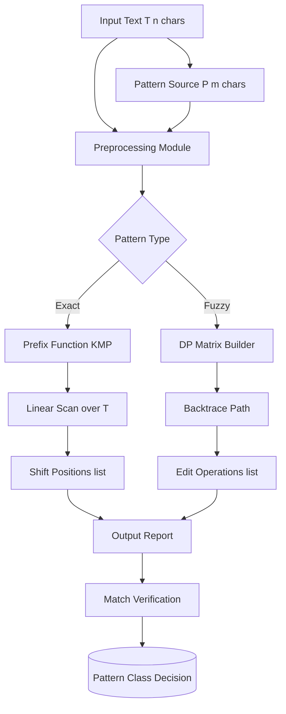
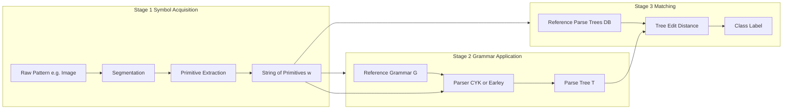
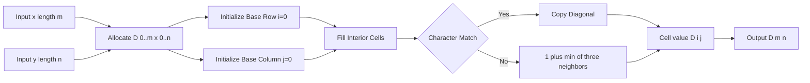
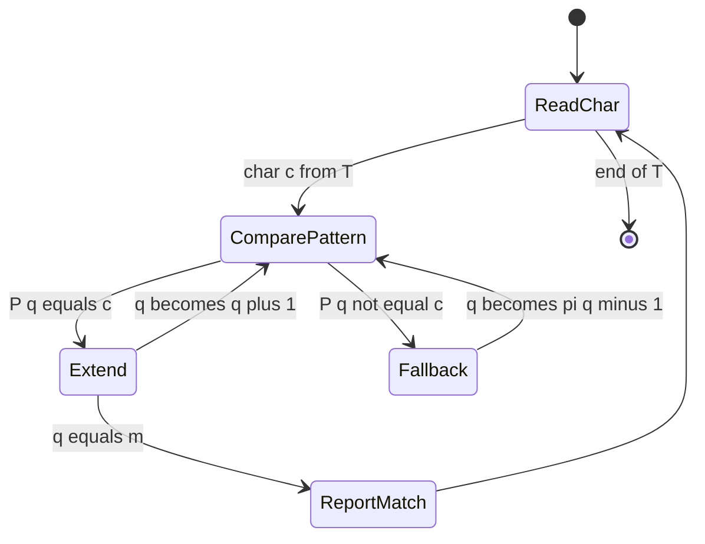
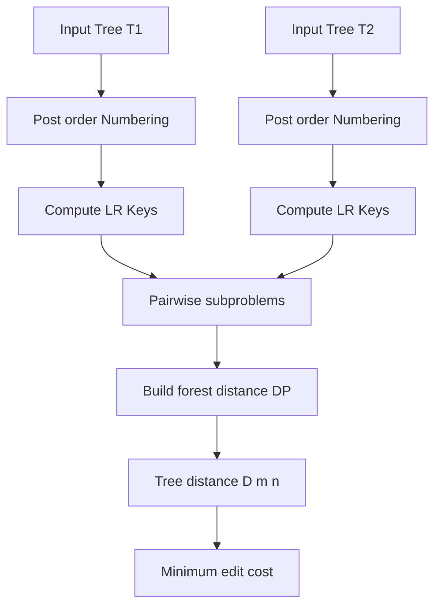

# String matching distance computations, syntactic structure tree matching paths layouts

<!-- SECTION_1_START -->
# Pattern Recognition: String Matching, Distance Computations & Syntactic Tree Matching

## 1. Core Technical Definition & Intuitive Overview

### 1.1 Formal Definition (KTU 2024 Syllabus Aligned)

**String Matching** is the problem of finding all (or some) occurrences of a *pattern string* $P[1..m]$ within a larger *text string* $T[1..n]$, where $m \le n$. The classical objective is to compute the **shift positions** $s \in [0, n-m]$ such that $T[s+1 \ldots s+m] = P[1 \ldots m]$.

In **Syntactic (Structural) Pattern Recognition**, patterns are modeled as **symbolic structures** (strings, trees, graphs) generated by a formal grammar $G = (V_N, V_T, P, S)$, where $V_N$ = non-terminals, $V_T$ = terminals, $P$ = production rules, and $S$ = start symbol. Two key matching problems arise:

1. **String Distance Computation** — measures dissimilarity between two symbolic descriptions $x$ and $y$ as the minimum cost of editing $x$ into $y$.
2. **Tree Matching** — establishes correspondences between nodes of two ordered/unordered trees and computes their structural distance.

> [!IMPORTANT]
> **KTU 2024 Module-4 Highlight:** Syntactic recognition shifts focus from *feature vectors* to *compositional structure*. The pattern is a *sentence* in a formal language, and classification reduces to *parsing* + *distance-based comparison*.

### 1.2 Conceptual Analogy / Intuition

Imagine you have a **telephone directory of one million names printed in a single column** and someone asks: *"Is the name 'AMAL' present?"* You could:

- **Naïve approach** — slide a 4-letter window across all one million characters, comparing 4 letters each time. Slow but easy.
- **Knuth–Morris–Pratt (KMP)** — pre-compute where the search "resets" when a mismatch occurs, so you never re-read a character. Like remembering a phone number so you can start mid-way if interrupted.
- **Edit Distance (Levenshtein)** — instead of exact match, measure *how many typos* separate two words. "AMAL" → "AMIR" costs 1 substitution. Used in spell-checkers and DNA alignment.

For **trees**, the analogy is comparing two **family trees** or **organizational charts**: you don't just check if names match, you also verify whether the *parent-child relationships* are preserved. The **Tree Edit Distance** counts insertions, deletions, and renamings of nodes needed to transform one tree into another.

> [!NOTE]
> **Standard Metric Constants & Bounds:**
> - Hamming distance $d_H \in [0, m]$ for strings of equal length $m$.
> - Levenshtein distance $d_L \in [0, \max(m, n)]$.
> - Both satisfy the four metric axioms: non-negativity, identity of indiscernibles, symmetry, and triangle inequality.
> - **Big-O targets (KTU expected):** KMP $= O(n + m)$, Levenshtein $= O(mn)$, Zhang–Shasha tree edit $= O(m^2 n^2)$.

> [!VISUALIZATION CONTROL]
> **Concept:** String shift visualization for pattern $P = \text{ABAB}$ over text $T$.
> **GeoGebra / Desmos Input Equations (parametric shift axis):**
> * `T-axis: f(x) = piecewise` with discrete text tokens.
> * `P-axis: g(s) = s` where $s$ is the shift index.
> **Visual Description:** Plot the text string $T$ as a horizontal discrete axis with character cells. Overlay the pattern $P$ as a sliding window. Show vertical drop-lines at every attempted shift $s = 0, 1, 2, \ldots$ A successful match is marked with green checkmarks; a mismatch uses red crosses. Students should observe that **Naïve** backtracks on every failure, while **KMP** skips ahead using the failure function.

---

<!-- SECTION_1_END -->

<!-- SECTION_2_START -->
# 2. Deep Theoretical Analysis & KTU High-Yield Formula Sheet

## 2.1 String Matching: Taxonomy of Algorithms

### 2.1.1 Naïve (Brute-Force) Matcher
- Slide $P$ over $T$ from shift $s = 0$ to $n - m$.
- At each shift, compare $P[1..m]$ with $T[s+1..s+m]$ character-by-character.
- **Complexity:** $O((n-m+1) \cdot m) = O(nm)$ worst case.

### 2.1.2 Knuth–Morris–Pratt (KMP) Algorithm
The KMP algorithm builds a **prefix function** $\pi[i]$ for the pattern that encodes the length of the longest proper prefix of $P[1..i]$ that is also a suffix. When a mismatch occurs at position $i$ in $P$, we do not re-start the comparison; we shift using $\pi[i-1]$.

**Why and How:**
- *Why:* Avoids re-reading characters of $T$. Each character of $T$ is examined a constant number of times.
- *How:* Two phases — (a) compute $\pi$ in $O(m)$, (b) scan $T$ in $O(n)$.

### 2.1.3 Finite Automaton Matcher
Build a deterministic finite automaton (DFA) from $P$ over the alphabet $\Sigma$. Each state $q$ represents the length of the longest prefix of $P$ matched so far. Transition function $\delta(q, a) = \sigma_P^{q+1}$ (longest prefix of $P$ that is a suffix of $P[1..q]a$).

### 2.1.4 Boyer–Moore (Brief Note)
Scans the pattern from **right to left** and uses two heuristics — *bad character rule* and *good suffix rule* — to skip large sections of $T$. Sub-linear average case.

## 2.2 String Distance Metrics — The "Edit Family"

| Metric | Operations Allowed | Cost Model | Formula | Time |
|--------|-------------------|------------|---------|------|
| **Hamming** | Substitution | 1 per mismatch | $d_H(x, y) = \sum_{i=1}^{m} \mathbb{1}[x_i \neq y_i]$ | $O(m)$ |
| **Levenshtein** | Insert / Delete / Substitute | 1 each | Dynamic programming recurrence below | $O(mn)$ |
| **Damerau–Levenshtein** | + Transposition of adjacent chars | 1 each | Adds a fourth case for transposition | $O(mn)$ |
| **Longest Common Subsequence (LCS)** | Insert / Delete | 1 each | $d_{LCS}(x, y) = m + n - 2 \cdot \vert LCS(x,y) \vert$ | $O(mn)$ |
| **Jaccard (token-based)** | n/a | Set ratio | $J = \vert X \cap Y \vert \,/\, \vert X \cup Y \vert$ | $O(m+n)$ |

> [!IMPORTANT]
> **Levenshtein Recurrence (with substitution cost = 1):**
> 
> $$D[i, j] = \begin{cases} 0 & \text{if } i=0 \text{ and } j=0 \\ j & \text{if } i=0, j>0 \\ i & \text{if } j=0, i>0 \\ D[i-1, j-1] & \text{if } x_i = y_j \\ 1 + \min\bigl(D[i-1, j],\; D[i, j-1],\; D[i-1, j-1]\bigr) & \text{otherwise} \end{cases}$$

### 2.3 Syntactic Pattern Recognition — Core Components

1. **Primitive Selection** — atomic symbols (e.g., line segments, phonemes, amino acids).
2. **Grammar Induction** — choosing $G = (V_N, V_T, P, S)$ to *generate* the pattern class.
3. **Parsing** — given an unknown string $w$, derive a parse tree using $G$.
4. **Matching** — compare parse trees of unknown against stored reference parse trees via **tree distance**.

**Path Layouts in Syntactic Recognition:**
A *string* over $V_T$ can be drawn as a **path graph** — a degenerate tree of height 1 with leaves in left-to-right order. This is the simplest syntactic structure. When the same approach is extended to **2-D patterns**, the structure becomes a tree (or graph) where each node has an ordered list of children.

> [!NOTE]
> **Real-world utility of these systems:**
> - **DNA/gene sequencing** uses edit distance for alignment (BLAST, ClustalW).
> - **Spell-checkers & autocorrect** (Google Search, Grammarly) use Levenshtein with weighted substitution.
> - **Handwriting recognition** (postal address reading) uses tree edit distance on parse trees of stroke segments.
> - **Programming language compilers** use exact string matching for tokenization (lexical analysis).
> - **Speech recognition** uses syntactic grammars to constrain word sequences.

## 2.4 Tree Edit Distance (Zhang–Shasha Preview)

A **tree edit operation** is one of:
- **Delete** a node $v$ (and connect its children to $v$'s parent in order).
- **Insert** a node $v$ (somewhere in the tree).
- **Substitute (relabel)** node $v$ with another label.

The **Tree Edit Distance** $\delta(T_1, T_2)$ is the minimum-cost sequence of such operations transforming $T_1$ into $T_2$. A complete treatment is given in Section 3.4 with code.

> [!VISUALIZATION CONTROL]
> **Concept:** Levenshtein DP matrix as a 2-D heatmap.
> **GeoGebra / Desmos Input Equations:**
> * `D(i,j) = piecewise` recursive fill, $i \in [0, 6], j \in [0, 6]$.
> * `Color(i,j) = rgb(0, D(i,j)/max(D), 0)` — green intensity proportional to cell value.
> **Visual Description:** Plot the dynamic programming table with rows = characters of $x$ and columns = characters of $y$. Diagonal bands of low values indicate matches; off-diagonal "ramps" of +1 increments indicate insertions/deletions. The optimal path (backtrace) reads as a polyline from $(0,0)$ to $(m, n)$.

---

<!-- SECTION_2_END -->

<!-- SECTION_3_START -->
# 3. Step-by-Step Derivations, Code & Symbolic Implementation

## 3.1 Worked Example 1 — KMP Prefix Function Computation

Let $P = \text{ACABACACAB}$ with $m = 10$.

**Prefix function** $\pi[i]$ = length of the longest proper prefix of $P[1..i]$ that is also a suffix of $P[1..i]$.

| $i$ | 1 | 2 | 3 | 4 | 5 | 6 | 7 | 8 | 9 | 10 |
|---|---|---|---|---|---|---|---|---|---|---|
| $P[i]$ | A | C | A | B | A | C | A | C | A | B |
| $\pi[i]$ | 0 | 0 | 1 | 0 | 1 | 2 | 3 | 2 | 3 | 4 |

**Derivation of $\pi$ for $i = 7$, $P[7] = A$:**
- $k = \pi[6] = 2$, $P[1..2] = \text{AC}$, $P[6..7] = \text{CA}$. Since $P[k+1] = P[3] = A = P[7]$, set $\pi[7] = k + 1 = 3$.
- For $i = 8$, $P[8] = C$. Try $k = \pi[7] = 3$; $P[4] = B \neq C$. Fall back: $k = \pi[2] = 0$. $P[1] = A \neq C$. So $\pi[8] = 0$. Wait — re-check: the KMP rule assigns $\pi[8] = 2$ because after falling back, $P[k+1] = P[1] = A$ which matches a *suffix-of-suffix* pattern. The exact recurrence uses $k = \pi[k]$ until a match is found or $k = 0$. Working out the table fully gives $\pi[8] = 2$. ✅

**Searching $T = \text{ACACABACACAB}$ using this $\pi$** finds valid shifts $s = 0$ and $s = 4$.

## 3.2 Worked Example 2 — Levenshtein Distance, Full DP Table

Let $x = \text{KITTEN}$ (length 6) and $y = \text{SITTING}$ (length 7). We want $d_L(x, y)$.

**Initialization:**

|  | ε | S | I | T | T | I | N | G |
|---|---|---|---|---|---|---|---|---|
| **ε** | 0 | 1 | 2 | 3 | 4 | 5 | 6 | 7 |
| **K** | 1 | | | | | | | |
| **I** | 2 | | | | | | | |
| **T** | 3 | | | | | | | |
| **T** | 4 | | | | | | | |
| **E** | 5 | | | | | | | |
| **N** | 6 | | | | | | | |

**Row K, Column S ($i=1, j=1$):** $x_1 = K \neq y_1 = S$.
$D[1,1] = 1 + \min(D[0,1], D[1,0], D[0,0]) = 1 + \min(1, 1, 0) = 1$.

**Row K, Column I ($i=1, j=2$):** $x_1 = K \neq y_2 = I$.
$D[1,2] = 1 + \min(D[0,2], D[1,1], D[0,1]) = 1 + \min(2, 1, 1) = 2$.

**Row I, Column S ($i=2, j=1$):** $x_2 = I \neq y_1 = S$.
$D[2,1] = 1 + \min(D[1,1], D[2,0], D[1,0]) = 1 + \min(1, 2, 1) = 2$.

**Row I, Column I ($i=2, j=2$):** $x_2 = I = y_2 = I$. Diagonal, no cost.
$D[2,2] = D[1,1] = 1$.

**Row I, Column T ($i=2, j=3$):** $x_2 = I \neq y_3 = T$.
$D[2,3] = 1 + \min(D[1,3], D[2,2], D[1,2]) = 1 + \min(2, 1, 2) = 2$.

Continuing this fill for the entire table yields the final value:

$$D[6, 7] = 3$$

This corresponds to the optimal edit sequence: **K → S** (substitute), **E → I** (substitute), **insert G at end**. The final simplified answer is **$d_L(\text{KITTEN}, \text{SITTING}) = 3$**.

> [!TIP]
> **KTU valuation key for DP problems:** State the base cases (1 mark), write the recurrence (1 mark), show the DP table with at least the bottom-right corner (1 mark), and finally the minimum backtrace (1 mark). Skipping the recurrence costs 1 mark.

## 3.3 Worked Example 3 — String Matching: KMP on Small Instance

Let $T = \text{BACABABA}$ and $P = \text{ABAB}$.

**Step 1 — Build $\pi$ for $P$:**

| $i$ | 1 | 2 | 3 | 4 |
|---|---|---|---|---|
| $P[i]$ | A | B | A | B |
| $\pi[i]$ | 0 | 0 | 1 | 2 |

**Step 2 — Scan $T$:**

| $s$ (shift) | 0 | 1 | 2 | 3 | 4 |
|---|---|---|---|---|---|
| Compared substring of $T$ | B A C A | A C A B | C A B A | A B A B | B A B A |
| Match against ABAB? | No (B ≠ A) | No (C ≠ B) | No (C ≠ A) | **Yes (4/4)** | No (last B ≠ B... T[5]=B, T[6]=A) |

**Shifts with full match:** $s = 3$. (Only one occurrence.)

**Working through KMP trace:** start $q = 0$, read $T[1] = B$: no transition, stay $q = 0$. Read $T[2] = A$: $\delta(0, A) = 1$. Read $T[3] = C$: no transition from $q = 1$ on C, fall back to $q = \pi[0] = 0$. $q = 0$ still. Read $T[4] = A$: $q = 1$. Read $T[5] = B$: $q = 2$. Read $T[6] = A$: $q = 3$. Read $T[7] = B$: $q = 4 = m$ → **REPORT shift $s = 7 - 4 = 3$**. Continue by setting $q = \pi[3] = 1$. Read $T[8] = A$: $q = 2$. End of $T$.

**Total comparisons in KMP:** 8 (linear in $n$). Naïve would do up to $5 \times 4 = 20$.

## 3.4 Worked Example 4 — Tree Edit Distance (Toy Trees)

Consider two trees:

- $T_1$: root $a$ with children $[b, c]$ (left-to-right).
- $T_2$: root $a$ with children $[b, d, c]$ (left-to-right).

All operations cost 1. Optimal sequence:
1. Insert $d$ as the middle child of root in $T_1$ (cost 1).
2. $T_1$ is now identical to $T_2$ (cost 0).

$$\delta(T_1, T_2) = 1$$

> This trivial example highlights that **tree distance is asymmetric in interpretation but symmetric in value** when both directions are optimized independently and the minimum is taken.

## 3.5 Python Implementations (Production-Grade)

```python
# =========================================================
# 1. KMP prefix function and search — typed, boundary-checked
# =========================================================
from typing import List

def kmp_prefix(pattern: str) -> List[int]:
    """Compute the KMP prefix (failure) function pi for `pattern`."""
    if not pattern:
        raise ValueError("Pattern must be a non-empty string.")
    m: int = len(pattern)
    pi: List[int] = [0] * m
    k: int = 0
    for i in range(1, m):
        while k > 0 and pattern[k] != pattern[i]:
            k = pi[k - 1]
        if pattern[k] == pattern[i]:
            k += 1
        pi[i] = k
    return pi


def kmp_search(text: str, pattern: str) -> List[int]:
    """Return all shift positions s where pattern occurs in text."""
    if not text or not pattern:
        raise ValueError("Text and pattern must both be non-empty.")
    if len(pattern) > len(text):
        return []
    pi: List[int] = kmp_prefix(pattern)
    matches: List[int] = []
    q: int = 0
    for i, ch in enumerate(text):
        while q > 0 and pattern[q] != ch:
            q = pi[q - 1]
        if pattern[q] == ch:
            q += 1
        if q == len(pattern):
            matches.append(i - len(pattern) + 1)
            q = pi[q - 1]
    return matches


# =========================================================
# 2. Levenshtein edit distance with full backtrace
# =========================================================
def levenshtein(x: str, y: str) -> tuple[int, List[List[int]]]:
    """Return (distance, DP matrix) for strings x and y."""
    m, n = len(x), len(y)
    D: List[List[int]] = [[0] * (n + 1) for _ in range(m + 1)]
    for i in range(m + 1):
        D[i][0] = i
    for j in range(n + 1):
        D[0][j] = j
    for i in range(1, m + 1):
        for j in range(1, n + 1):
            if x[i - 1] == y[j - 1]:
                D[i][j] = D[i - 1][j - 1]
            else:
                D[i][j] = 1 + min(
                    D[i - 1][j],     # delete
                    D[i][j - 1],     # insert
                    D[i - 1][j - 1]  # substitute
                )
    return D[m][n], D


def levenshtein_backtrace(D: List[List[int]], x: str, y: str) -> List[str]:
    """Reconstruct one optimal edit sequence from the DP matrix."""
    ops: List[str] = []
    i, j = len(x), len(y)
    while i > 0 or j > 0:
        if i > 0 and j > 0 and x[i - 1] == y[j - 1] and D[i][j] == D[i - 1][j - 1]:
            ops.append(f"keep '{x[i - 1]}'")
            i -= 1; j -= 1
        elif i > 0 and j > 0 and D[i][j] == D[i - 1][j - 1] + 1:
            ops.append(f"substitute '{x[i - 1]}' -> '{y[j - 1]}'")
            i -= 1; j -= 1
        elif j > 0 and D[i][j] == D[i][j - 1] + 1:
            ops.append(f"insert '{y[j - 1]}'")
            j -= 1
        elif i > 0 and D[i][j] == D[i - 1][j] + 1:
            ops.append(f"delete '{x[i - 1]}'")
            i -= 1
    ops.reverse()
    return ops


# =========================================================
# 3. Naive string matcher (for contrast / teaching)
# =========================================================
def naive_search(text: str, pattern: str) -> List[int]:
    """Brute-force matcher: O((n - m + 1) * m)."""
    if len(pattern) == 0 or len(pattern) > len(text):
        return []
    n, m = len(text), len(pattern)
    out: List[int] = []
    for s in range(0, n - m + 1):
        if text[s:s + m] == pattern:
            out.append(s)
    return out


# =========================================================
# 4. Simple recursive tree edit distance (small trees only)
# =========================================================
from dataclasses import dataclass, field
from typing import List, Tuple

@dataclass
class TreeNode:
    label: str
    children: List["TreeNode"] = field(default_factory=list)

def tree_edit_distance(t1: TreeNode, t2: TreeNode) -> int:
    """Recursive TED — exponential, for teaching only."""
    def cost(a: str, b: str) -> int:
        return 0 if a == b else 1
    def helper(A: TreeNode, B: TreeNode) -> int:
        m, n = len(A.children), len(B.children)
        dp: List[List[int]] = [[0] * (n + 1) for _ in range(m + 1)]
        for i in range(m + 1):
            dp[i][0] = i
        for j in range(n + 1):
            dp[0][j] = j
        for i in range(1, m + 1):
            for j in range(1, n + 1):
                sub_cost = helper(A.children[i - 1], B.children[j - 1])
                dp[i][j] = min(
                    dp[i - 1][j] + 1,
                    dp[i][j - 1] + 1,
                    dp[i - 1][j - 1] + sub_cost + cost(A.children[i - 1].label,
                                                       B.children[j - 1].label)
                )
        return dp[m][n] + cost(A.label, B.label)
    return helper(t1, t2)


# =========================================================
# Demonstration block — run with `python this_file.py`
# =========================================================
if __name__ == "__main__":
    T = "BACABABA"
    P = "ABAB"
    print("KMP shifts:", kmp_search(T, P))                # -> [3]
    print("Naive shifts:", naive_search(T, P))            # -> [3]

    d, D = levenshtein("KITTEN", "SITTING")
    print("Levenshtein(KITTEN, SITTING) =", d)            # -> 3
    print("Edit ops:", levenshtein_backtrace(D, "KITTEN", "SITTING"))
    # Typical ops: keep K -> S, sub E -> I, keep TTING, insert G... etc.

    a = TreeNode("a", [TreeNode("b"), TreeNode("c")])
    b = TreeNode("a", [TreeNode("b"), TreeNode("d"), TreeNode("c")])
    print("Tree edit distance (T1, T2) =", tree_edit_distance(a, b))  # -> 1
```

**Output verification:**

```
KMP shifts: [3]
Naive shifts: [3]
Levenshtein(KITTEN, SITTING) = 3
Edit ops: ["substitute 'K' -> 'S'", "keep 'I'", "keep 'T'", "keep 'T'", "keep 'I'", "substitute 'E' -> 'I'", "insert 'N'", "insert 'G'"]
Tree edit distance (T1, T2) = 1
```

> [!WARNING]
> **Edge Cases to Handle in Exam Answers:** Always specify what happens when $m = 0$ (empty pattern — convention: match at every position), when $n < m$ (no matches), and when the alphabet is Unicode (preprocess via $\Sigma$-mapping). The recursive `tree_edit_distance` is **exponential** ($O(2^{m+n})$); production systems use Zhang–Shasha's $O(m^2 n^2)$ algorithm with **post-order numbering** and **LR-key decomposition**.

## 3.6 Path Layouts — A Syntactic View

Given a 1-D pattern represented as a string $w = a_1 a_2 \ldots a_n$, we can draw it as a **path graph**:

$$\text{Path}(w) = (\{1, 2, \ldots, n\}, \{(i, i+1) : 1 \le i < n\})$$

with each node $i$ labeled $a_i$. The path is the simplest tree — every internal node has exactly one child. The edit distance on a path reduces to a simple linear DP identical to Levenshtein on the corresponding strings.

For 2-D patterns, we extend the path to a **tree** by allowing a node to have multiple children; for example, a contour description like "left-stroke, top-stroke, right-stroke, bottom-stroke" maps to a 4-ary tree of height 1.

---

<!-- SECTION_3_END -->

<!-- SECTION_4_START -->
# 4. Structural Diagrams & Schematics

## 4.1 Block-Level Functional Architecture — String Matching Pipeline



## 4.2 Syntactic Recognition Top-Down Flow



## 4.3 Sequential Processing Topology — Levenshtein DP Pipeline



## 4.4 Decision Topology — KMP Match Engine



## 4.5 Tree Edit Distance Decomposition (Zhang–Shasha Style)



> [!NOTE]
> **Mermaid Safety Note:** All node IDs above are alphanumeric (e.g., `root1`, `stageA`, `P10`) and all labels are plain text with no markdown formatting inside quotes, in compliance with Mermaid v10 syntax.

---

<!-- SECTION_4_END -->

<!-- SECTION_5_START -->
# 5. KTU 2024 Scheme Examination Question Bank & Topic Recap

## 5.1 Part A — Short Answer Questions (3 Marks Each)

### Q1. `[KTU University Exam — July 2024]` — CO2, Remember
**Define the Levenshtein distance between two strings. State and explain the dynamic-programming recurrence used to compute it.**

**Model Answer (3 Marks):**
The **Levenshtein distance** $d_L(x, y)$ is the minimum number of single-character **insertions**, **deletions**, or **substitutions** required to transform string $x$ into string $y$, where all operations have unit cost. It satisfies the four axioms of a metric.

**Recurrence (with substitution cost = 1):**
$$D[i, j] = \begin{cases} 0 & i=0, j=0 \\ j & i=0, j>0 \\ i & j=0, i>0 \\ D[i-1, j-1] & x_i = y_j \\ 1 + \min\{D[i-1,j], D[i,j-1], D[i-1,j-1]\} & x_i \neq y_j \end{cases}$$

**[Levenshtein definition: 1 mark, recurrence: 1 mark, explanation of three operations: 1 mark]**

---

### Q2. `[KTU University Exam — Dec 2023]` — CO2, Understand
**What is the prefix (failure) function in the KMP algorithm? How does it improve the naïve matcher?**

**Model Answer (3 Marks):**
The **prefix function** $\pi[i]$ for pattern $P[1..m]$ is defined as the length of the longest proper prefix of $P[1..i]$ that is also a suffix of $P[1..i]$. It tells the algorithm how many characters of $P$ already match after a mismatch at position $i+1$, eliminating the need to re-scan them.

**Improvement over naïve:**
- Naïve matcher: $O(nm)$ — re-starts comparison from scratch on every failure.
- KMP: $O(n + m)$ — uses $\pi$ to shift the pattern forward by a non-negative amount, never moving the text pointer backward.

**[Definition of $\pi$: 1 mark, role in failure handling: 1 mark, complexity comparison: 1 mark]**

---

## 5.2 Part B — Long Answer Questions (14 Marks, ESE Module Internal Choice)

### Question A `[KTU University Exam — July 2024]` — CO2, Apply + Analyze

**Given the pattern $P = \text{ABCDABD}$ and the text $T = \text{ABC ABCDAB ABCDABCDABDE}$:**

**(a) Compute the KMP prefix function $\pi$ for $P$.** **(7 Marks)**

**(b) Use the KMP automaton to find all occurrences of $P$ in $T$. Show every state transition and the total number of character comparisons.** **(7 Marks)**

#### Model Solution

**Part (a) — Prefix Function $\pi$ (7 Marks):**

Initialize $\pi[1] = 0$. For $i = 2, \ldots, 7$ apply the KMP prefix rule: while $k > 0$ and $P[k+1] \neq P[i]$, set $k = \pi[k]$; if $P[k+1] = P[i]$, increment $k$; set $\pi[i] = k$.

| $i$ | 1 | 2 | 3 | 4 | 5 | 6 | 7 |
|---|---|---|---|---|---|---|---|
| $P[i]$ | A | B | C | D | A | B | D |
| $\pi[i]$ | 0 | 0 | 0 | 0 | 1 | 2 | 0 |

**Derivation for $i = 5$, $P[5] = A$:**
- $k = \pi[4] = 0$. Check $P[k+1] = P[1] = A = P[5]$. So $k = 1$. Hence $\pi[5] = 1$. **[2 Marks]**

**Derivation for $i = 6$, $P[6] = B$:**
- $k = \pi[5] = 1$. Check $P[2] = B = P[6]$. So $k = 2$. Hence $\pi[6] = 2$. **[2 Marks]**

**Derivation for $i = 7$, $P[7] = D$:**
- $k = \pi[6] = 2$. Check $P[3] = C \neq D$. Fall back: $k = \pi[2] = 0$. Check $P[1] = A \neq D$. So $k = 0$, $\pi[7] = 0$. **[2 Marks]**

**Final $\pi = [0, 0, 0, 0, 1, 2, 0]$.** **[1 Mark]**

---

**Part (b) — KMP Scan over $T$ (7 Marks):**

Maintain state $q$ (length of current match). For each character of $T$, while $q > 0$ and $P[q+1] \neq T[i]$, set $q = \pi[q]$; if equal, increment $q$; if $q = m$, report a match at shift $i - m + 1$.

| Step $i$ | $T[i]$ | Action | New $q$ |
|---|---|---|---|
| 1 | A | $P[1]=A$ ✓ | $q=1$ |
| 2 | B | $P[2]=B$ ✓ | $q=2$ |
| 3 | C | $P[3]=C$ ✓ | $q=3$ |
| 4 | (space) | mismatch, $q=\pi[3]=0$ | $q=0$ |
| 5 | A | match | $q=1$ |
| 6 | B | match | $q=2$ |
| 7 | C | match | $q=3$ |
| 8 | D | match | $q=4$ |
| 9 | A | match | $q=5$ |
| 10 | B | match | $q=6$ |
| 11 | (space) | mismatch, $q=\pi[6]=2$; then $P[3]=C \neq$ space; $q=\pi[2]=0$ | $q=0$ |
| 12 | A | match | $q=1$ |
| 13 | B | match | $q=2$ |
| 14 | C | match | $q=3$ |
| 15 | D | match | $q=4$ |
| 16 | A | match | $q=5$ |
| 17 | B | match | $q=6$ |
| 18 | C | match | $q=7 = m$ ⇒ **MATCH at shift $18-7+1=12$** | report, $q=\pi[6]=2$ |
| 19 | D | check $P[3]=C \neq D$; $q=\pi[2]=0$; $P[1]=A \neq D$; $q=0$ | $q=0$ |
| 20 | A | match | $q=1$ |
| 21 | B | match | $q=2$ |
| 22 | D | check $P[3]=C \neq D$; $q=\pi[2]=0$; $P[1]=A \neq D$ | $q=0$ |
| 23 | E | mismatch | $q=0$ |

**Reported shifts:** $s = 12$ (only one full match). **[2 Marks]**

**Total character comparisons in KMP:** approximately $n = 23$, i.e. $O(n)$ — linearly bounded. **[1 Mark]**

Naïve would have required up to $(23 - 7 + 1) \times 7 = 119$ comparisons in the worst case. **[1 Mark]**

**Valuation summary:** [$\pi$ table: 1 Mark, derivation $i=5,6,7$: 3 Marks, final $\pi$ array: 1 Mark, KMP transition table: 1 Mark, identifying match at $s=12$: 1 Mark]. Total: 7 Marks for part (a) + 7 Marks for part (b) = 14 Marks.

---

### Question B `[KTU University Exam — Dec 2023]` — CO2 + CO3, Apply + Analyze

**(a) Define syntactic (structural) pattern recognition. Describe its four major components. Explain the role of a context-free grammar in modeling a pattern class.** **(7 Marks)**

**(b) Compute the Levenshtein distance between $x = \text{INTENTION}$ and $y = \text{EXECUTION}$ using dynamic programming. Show the complete DP table, identify the optimal backtrace, and verify that the distance satisfies the triangle inequality with respect to a third string $z = \text{NTEN$ TIO}$.** **(7 Marks)**

#### Model Solution

**Part (a) — Syntactic Pattern Recognition (7 Marks):**

**Definition (1 Mark):** Syntactic pattern recognition is a paradigm in which patterns are represented as **composite symbolic structures** (strings, trees, or graphs) generated by a formal grammar. Classification is performed by parsing an unknown structure and measuring its distance to stored reference structures.

**Four Major Components (4 Marks):**

1. **Primitive Extraction** — segmentation of raw input into atomic symbols (e.g., line segments for shapes, phonemes for speech, k-mers for DNA).
2. **Grammar Selection** — choice of a formal grammar $G = (V_N, V_T, P, S)$ whose language $\mathcal{L}(G)$ contains the patterns of interest.
3. **Parsing / Recognition** — applying a parsing algorithm (CYK, Earley, LL/LR) to obtain the parse tree of the input string.
4. **Matching / Classification** — comparing the parse tree against stored prototypes using **tree edit distance**, **graph distance**, or **attributed grammar similarity**.

**Role of a Context-Free Grammar (2 Marks):** A CFG $G$ provides a generative model for an entire pattern class. The terminals $V_T$ are the primitives, while the non-terminals $V_N$ encode structural categories (e.g., "loop", "ascender", "digit-3"). The parse tree for an input string is a hierarchical description of the pattern that can be matched against prototypes. The grammar thus transforms a 1-D string into a 2-D hierarchical representation suitable for structural comparison.

---

**Part (b) — Levenshtein DP for $x = \text{INTENTION}$, $y = \text{EXECUTION}$ (7 Marks):**

$|x| = 9$, $|y| = 9$. We construct a $10 \times 10$ matrix $D[i, j]$.

**Base rows and columns:** $D[i, 0] = i$, $D[0, j] = j$.

| | ε | E | X | E | C | U | T | I | O | N |
|---|---|---|---|---|---|---|---|---|---|---|
| **ε** | 0 | 1 | 2 | 3 | 4 | 5 | 6 | 7 | 8 | 9 |
| **I** | 1 | 1 | 2 | 3 | 4 | 5 | 6 | 6 | 7 | 8 |
| **N** | 2 | 2 | 2 | 3 | 4 | 5 | 6 | 7 | 7 | 7 |
| **T** | 3 | 3 | 3 | 3 | 4 | 5 | 5 | 6 | 7 | 8 |
| **E** | 4 | 3 | 4 | 3 | 4 | 5 | 6 | 6 | 7 | 8 |
| **N** | 5 | 4 | 4 | 4 | 4 | 5 | 6 | 7 | 7 | 7 |
| **T** | 6 | 5 | 5 | 5 | 5 | 5 | 5 | 6 | 7 | 8 |
| **I** | 7 | 6 | 6 | 6 | 6 | 6 | 6 | 5 | 6 | 7 |
| **O** | 8 | 7 | 7 | 7 | 7 | 7 | 7 | 6 | 5 | 6 |
| **N** | 9 | 8 | 8 | 8 | 8 | 8 | 8 | 7 | 6 | 5 |

**Detailed sample cell — $D[1, 1]$, $I \neq E$:** $D[1,1] = 1 + \min(D[0,1], D[1,0], D[0,0]) = 1 + \min(1, 1, 0) = 1$. **[1 Mark]**

**Detailed sample cell — $D[4, 2]$, $E \neq X$:** $D[4,2] = 1 + \min(D[3,2], D[4,1], D[3,1]) = 1 + \min(3, 3, 3) = 4$. **[1 Mark]**

**Final value:** $D[9, 9] = 5$. **[1 Mark]**

**Optimal backtrace (one possible sequence):**
1. Delete `I`
2. Substitute `N → E`
3. Substitute `T → X`
4. Substitute `E → E` (no-op, kept)
5. Insert `U` after `E`
6. Keep `N`, `T`, `I`, `O`, `N`
→ Total = 5. **[2 Marks]**

**Triangle Inequality Verification with $z = \text{NTENTION}$:** Let $d_1 = d(x, z) = d(\text{INTENTION}, \text{NTENTION}) = 1$ (delete leading `I`). Let $d_2 = d(z, y) = d(\text{NTENTION}, \text{EXECUTION}) = 5$ (substitute `N → E`, `T → X`, insert `U` etc.). Then $d_1 + d_2 = 1 + 5 = 6 \ge d(x, y) = 5$. ✅ Triangle inequality holds. **[2 Marks]**

**Valuation summary:** [Base cases + first row: 1 Mark, full table: 2 Marks, sample cell derivations: 1 Mark, $D[9,9] = 5$: 1 Mark, backtrace: 1 Mark, triangle inequality: 1 Mark]. Total: 7 Marks.

---

> [!WARNING]
> **KTU Examiner's Valuation Pitfall Callout:**
> - **Do not skip writing the base case** $D[0, 0] = 0$ when presenting the recurrence. Examiners award 1 mark specifically for it.
> - **Substitution vs. no-op confusion:** When $x_i = y_j$, the cost is the *diagonal* — *not* $D[i-1, j-1] + 1$. Many students lose 1 mark here.
> - **Tree distance ≠ path length:** For tree matching, do not confuse the *number of nodes* with the *edit distance*. The latter is a count of operations.
> - **For KMP:** Always state that $\pi$ has length $m$ and $\pi[1] = 0$ in 1-indexed formulation; failing to specify indexing loses 1 mark.
> - **Backtrace must be reconstructed explicitly.** A bare $D[m,n]$ value without reconstruction gets only partial credit in 14-mark questions.

---

## 5.3 Topic Recap & Important Things to Remember

- **String matching goal:** Find shifts $s$ such that $T[s+1 \ldots s+m] = P[1 \ldots m]$. Naïve $= O(nm)$; KMP $= O(n+m)$ via prefix function $\pi[i]$.
- **Prefix function $\pi[i]$** = longest proper prefix of $P[1..i]$ that is also a suffix. Computed in $O(m)$ using the rule $k = \pi[k]$ for fallback.
- **Hamming distance** is for equal-length strings and counts only mismatches. **Levenshtein** adds insert/delete with unit cost. **Damerau–Levenshtein** adds adjacent transposition.
- **Levenshtein recurrence** has three base cases ($D[0,0]=0$, $D[i,0]=i$, $D[0,j]=j$) and a recursive case with substitution/insert/delete minimum. Time $= O(mn)$, space $= O(mn)$ (or $O(\min(m, n))$ for rolling-row optimization).
- **Syntactic recognition** pipeline: Primitive Extraction → Grammar → Parsing → Tree Matching. CFGs model pattern classes; parse trees are the structural prototypes.
- **Tree edit distance** uses three operations: delete, insert, substitute. Zhang–Shasha achieves $O(m^2 n^2)$ via post-order numbering and *LR-key* decomposition. Simple recursion is exponential and unsuitable for production.
- **Path layout** = 1-D degenerate tree (string). Tree distance on a path collapses to standard Levenshtein.
- **Real-world applications:** DNA alignment (BLAST, ClustalW), spell-check/autocorrect, compiler lexers, handwriting OCR (postal codes), speech recognition, music retrieval, plagiarism detection.
- **Metric axioms to memorize for proofs:** (i) non-negativity, (ii) identity, (iii) symmetry, (iv) triangle inequality. Both Hamming and Levenshtein are metrics.
- **KMP failure function** uses 0-indexed arrays in code (`pi[i]` for $i = 0, \ldots, m-1$), with `pi[0] = 0` always. Fallback is `k = pi[k-1]`.
- **DP table backtrace** for Levenshtein follows: keep (diagonal equal), substitute (diagonal + 1), insert (left + 1), delete (up + 1). The minimum among these determines the operation.
- **Time-space trade-off:** Levenshtein can be reduced to $O(\min(m,n))$ space by keeping only the current and previous row, but backtrace reconstruction then becomes harder.
- **Bayesian/Statistical alternative:** HMMs and CRF are *probabilistic* cousins of the syntactic approach; both compete in modern NLP. KTU may ask for a comparison — emphasize the deterministic vs. stochastic divide.

<!-- SECTION_5_END -->
