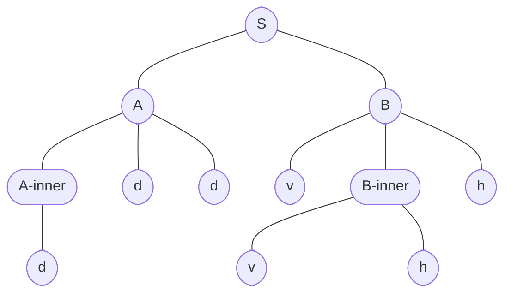
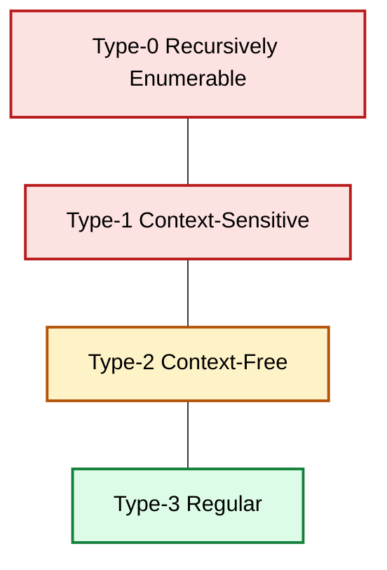
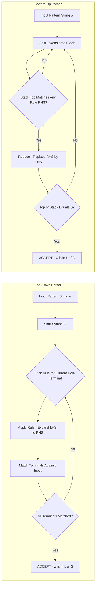
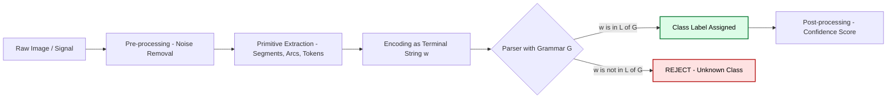

# Syntactic pattern recognition techniques: Formal grammars parsed sequences parsing rules

<!-- SECTION_1_START -->

# 1. Core Technical Definition & Intuitive Overview

## 1.1 What is a Formal Grammar?

A **formal grammar** $G$ is a finite, mathematically rigorous system used to generate (or describe) the set of all valid symbol strings belonging to a particular language $L(G)$. In the KTU 2024 Scheme treatment of **Syntactic (Structural) Pattern Recognition**, a formal grammar is the central descriptive tool that allows a computer to recognise whether an observed object (represented as a string of primitive symbols) belongs to a class of interest.

Formally, a grammar is a 4-tuple:

$$G = (V_N, V_T, P, S)$$

where:
- $V_N$ = finite set of **non-terminal symbols** (internal placeholders / variables, often denoted by uppercase letters such as $A, B, S$).
- $V_T$ = finite set of **terminal symbols** (the alphabet of observable primitives, often denoted by lowercase letters $a, b, c, \dots, x, y, z$).
- $P$ = finite set of **production (rewriting) rules** of the form $\alpha \rightarrow \beta$ where $\alpha \in (V_N \cup V_T)^{+}$ contains at least one non-terminal.
- $S \in V_N$ = the distinguished **start symbol** (axiom) from which all derivations begin.

The **language generated** by $G$ is the set of all terminal strings reachable from $S$:

$$L(G) = \{ w \in V_T^{*} \mid S \Rightarrow^{*} w \}$$

The double-arrow $\Rightarrow^{*}$ denotes "derives in zero or more steps" using the rules in $P$.

> [!IMPORTANT]
> **KTU 2024 Highlight:** In syntactic pattern recognition, the terminal symbols correspond to the *primitives* extracted from a pattern (e.g., line segments, curve arcs, texture tokens), and the grammar describes *legal assemblies* of those primitives. Recognition becomes equivalent to checking whether an observed string of primitives is in $L(G)$.

## 1.2 Conceptual Analogy — The "Recipe-Book" View

Imagine a **recipe book** written for a strict head chef:
- The **non-terminals** are section headers (e.g., `DOUGH`, `SAUCE`, `PIZZA`).
- The **terminals** are actual ingredients on the counter (`flour`, `tomato`, `mozzarella`).
- The **production rules** are the lines that say "to make DOUGH, combine `flour` + `water`".
- The **start symbol** `S = PIZZA` is the dish you are required to produce.
- A **derivation** is the act of recursively expanding headers until only ingredient names remain — a finished recipe.
- A **parser** is the sous-chef who, given a finished plate of ingredients, reconstructs *which* rule-sequence was used.

A **parsed sequence** is precisely this reconstructed rule-sequence together with the **derivation (parse) tree** that records how the start symbol expanded step by step.

## 1.3 Chomsky Hierarchy — The Four Grammar Tiers

The linguist **Noam Chomsky** classified grammars by the *shape* of their production rules, producing a hierarchy of expressive power. The KTU 2024 syllabus emphasises the first three tiers because they are computationally usable for pattern recognition.

| Tier | Grammar Class | Production Form $\alpha \rightarrow \beta$ | Recogniser | Use in PR |
|------|---------------|--------------------------------------------|------------|-----------|
| 3 | Regular (RG) | $A \rightarrow aB$ or $A \rightarrow a$ | Finite Automaton | Primitive sequencing |
| 2 | Context-Free (CFG) | $A \rightarrow \beta$ with $A \in V_N$ | Pushdown Automaton | Shape / contour parsing |
| 1 | Context-Sensitive (CSG) | $\alpha A \beta \rightarrow \alpha \gamma \beta$ | Linear-Bounded Automaton | Nested structures |
| 0 | Unrestricted (UG) | $\alpha \rightarrow \beta$ with $\vert\alpha\vert \le \vert\beta\vert$ | Turing Machine | Theoretical limit |

> [!NOTE]
> In Module-4 of PECST405, the **Context-Free Grammar (CFG)** is the workhorse. Almost every industrial shape-description language (e.g., for 2-D silhouettes, ECG waveforms and chromosome images) is built on CFGs.

## 1.4 Parsed Sequences, Parse Trees & Parsing Rules — Core Terminology

- **Primitive:** the smallest meaningful sub-pattern, e.g., a directed line segment with length and orientation.
- **Pattern Description Language (PDL):** the high-level grammar that specifies how primitives may legally combine.
- **Derivation:** a sequence of applications of production rules transforming $S$ into a terminal string $w$.
- **Parse Tree (Derivation Tree):** the rooted, ordered tree that records every rule application. The root is $S$, leaves are terminals, and each internal node is a non-terminal that was expanded.
- **Sentence Form:** any string $x$ with $S \Rightarrow^{*} x$ (terminals or non-terminals mixed).
- **Parsing Rule / Production Rule:** a single rewriting directive in $P$ of the form $\alpha \rightarrow \beta$.
- **Ambiguity:** a grammar is ambiguous if some string in $L(G)$ admits **two or more distinct parse trees**.

> [!VISUALIZATION CONTROL]
> **Concept:** Chomsky Hierarchy of grammars in the language-class lattice.
> **GeoGebra / Desmos Input Equations:**
> * Plot the four nested sets as concentric ellipses on the Cartesian plane: $\frac{x^{2}}{r^{2}} + \frac{y^{2}}{(0.6\,r)^{2}} \le 1$ for $r \in \{1.0,\, 2.0,\, 3.0,\, 4.0\}$.
> * Label the innermost as `Type-3 Regular`, next as `Type-2 CFG`, then `Type-1 CSG`, outermost as `Type-0 Unrestricted`.
> **Visual Description:** A clean target-like diagram with each shaded band representing a superset relationship — the student should see that the Regular languages are a strict subset of CFG languages, which are a strict subset of CSG languages, and so on.

---

<!-- SECTION_1_END -->

<!-- SECTION_2_START -->

# 2. Deep Theoretical Analysis & KTU High-Yield Formula Sheet

## 2.1 Anatomy of a Production Rule

A production rule is a *rewriting directive*. To apply it, the recogniser:
1. **Matches** the left-hand side (LHS) $\alpha$ inside the current sentential form.
2. **Replaces** it with the right-hand side (RHS) $\beta$.

Formally, if $u, v \in (V_N \cup V_T)^{*}$ and $(\alpha \rightarrow \beta) \in P$, then:

$$u\,\alpha\,v \;\Rightarrow\; u\,\beta\,v$$

This is the single-step relation. Its reflexive-transitive closure $\Rightarrow^{*}$ yields derivations.

### 2.1.1 BNF (Backus-Naur Form) Convention

Production rules are usually written using the BNF meta-symbols:
- `::=`  stands in for $\rightarrow$ (replacement).
- `|`  denotes *alternation* — multiple RHS choices for the same LHS.
- `< >`  enclose non-terminals.
- Plain lowercase words denote terminals.

For example, the rule `$\langle S \rangle ::= a\langle S \rangle b \mid \varepsilon$` is shorthand for the two CFG rules $S \rightarrow aSb$ and $S \rightarrow \varepsilon$.

## 2.2 Rightmost vs Leftmost Derivations

| Strategy | Definition | Tree Equivalence |
|----------|------------|------------------|
| **Leftmost derivation** $L$ | At each step, replace the **leftmost** non-terminal. | Builds the parse tree **top-down / left-to-right**. |
| **Rightmost derivation** $R$ | At each step, replace the **rightmost** non-terminal. | Builds the parse tree **bottom-up**. |

A string is in $L(G)$ if and only if **at least one** leftmost (equivalently, rightmost) derivation of it from $S$ exists. This duality is the foundation of top-down versus bottom-up parsers.

## 2.3 The Parse Tree (Derivation Tree)

A parse tree is a labelled, ordered tree $T = (N, E)$ with:
- A unique root labelled $S$.
- Internal nodes labelled by non-terminals.
- Leaves labelled by terminals (or $\varepsilon$).
- If a node is labelled $A$ and has children $X_1 X_2 \dots X_k$ left-to-right, then $(A \rightarrow X_1 X_2 \dots X_k) \in P$.

Reading the leaves of $T$ from left to right yields the *yield* of the tree — the terminal string $w$. Two parse trees with the same yield but different structure mean the grammar is **ambiguous** for $w$.

> [!NOTE]
> **SENTENTIAL FORM** $S \Rightarrow^{*} x$: any intermediate string $x$ during a derivation. **YIELD** of a parse tree: the concatenated leaf labels left-to-right.

## 2.4 Parsing Techniques — Top-Down vs Bottom-Up

### 2.4.1 Top-Down Parsing (Goal-Driven)

- Starts with $S$ and **predicts** which rule to apply.
- Builds the parse tree from root to leaves.
- Classic algorithm: **Recursive Descent** (one function per non-terminal).
- Fails on **left-recursive** rules of the form $A \rightarrow A\,\alpha$ (infinite loop). Left-recursion must be removed first.

### 2.4.2 Bottom-Up Parsing (Data-Driven)

- Starts from the input string $w$ and tries to **reduce** substrings back to the start symbol $S$.
- Builds the parse tree from leaves to root.
- Classic algorithm: **Shift-Reduce** parsing (push tokens on a stack, reduce when the stack top matches a rule's RHS).
- General CFG algorithm: **CYK (Cocke-Younger-Kasami)** — works for grammars in **Chomsky Normal Form (CNF)** in $O(n^{3})$ time.

### 2.4.3 Chomsky Normal Form (CNF)

A CFG $G$ is in CNF if every rule has exactly one of two shapes:

$$A \rightarrow BC \quad \text{or} \quad A \rightarrow a$$

where $A, B, C \in V_N$ and $a \in V_T$. Any CFG can be converted to CNF in $O(\vert G \vert^{2})$ via five mechanical steps (eliminate $\varepsilon$, unit, useless symbols; convert terminals in long RHS; break long RHS into binary chain).

## 2.5 KTU Formula Sheet / Cheat Sheet

| Symbol / Concept | Definition / Formula | KTU Use-Case |
|------------------|----------------------|--------------|
| Grammar 4-tuple | $G = (V_N, V_T, P, S)$ | Definition question (3 marks) |
| Language of $G$ | $L(G) = \{ w \in V_T^{*} \mid S \Rightarrow^{*} w \}$ | Membership test |
| Single-step derive | $u\,\alpha\,v \Rightarrow u\,\beta\,v$ for $(\alpha \rightarrow \beta) \in P$ | Building derivations |
| Reflexive-transitive closure | $S \Rightarrow^{*} w$ | Reachability in derivation |
| CNF rule | $A \rightarrow BC \;$ or $\; A \rightarrow a$ | CYK preprocessing |
| CYK complexity | $O(n^{3})$ time, $O(n^{2})$ space, where $n = \vert w \vert$ | Algorithmic question |
| LL(1) condition | $FIRST(\alpha) \cap FIRST(\beta) = \emptyset$ for $A \rightarrow \alpha \mid \beta$ | Top-down parser design |
| LR(0) item | $[\,A \rightarrow \alpha \cdot \beta\,]$ | Bottom-up parser states |
| Length of yield | $\vert \text{yield}(T) \vert$ = number of leaf tokens | Tree interpretation |
| Tree depth $d(T)$ | Longest root-to-leaf path | Cost / time measure |
| Ambiguity | $\exists w$ with $\geq 2$ distinct parse trees | Grammar-design question |

## 2.6 Real-World Utility in Engineering & Computer Science

| Application Domain | How Syntactic PR is Used |
|--------------------|---------------------------|
| **Fingerprint classification** | Minutiae (ridge endings, bifurcations) are primitives; CFGs describe legal ridge topology. |
| **ECG / EEG waveform analysis** | Waves P, QRS, T are terminals; rules describe cardiac cycles. |
| **Chromosome / cell image analysis** | Sub-bands are primitives; CFGs describe banding patterns. |
| **Optical Character Recognition (OCR)** | Strokes are primitives; rules assemble characters, words, lines. |
| **Speech recognition** | Phonemes are terminals; CFGs describe legal syllable / word sequences. |
| **Compiler design** | Identical machinery — tokenising source code and verifying syntactic structure. |
| **Network intrusion detection** | System-call sequences are terminals; CFGs describe normal program behaviour. |

> [!IMPORTANT]
> The single biggest engineering insight: *pattern recognition by grammar = pattern recognition by compiler*. Anyone who has written a `yacc`/`bison` specification has already built a syntactic pattern classifier.

---

<!-- SECTION_2_END -->

<!-- SECTION_3_START -->

# 3. Step-by-Step Derivations, Examples & Code Implementation

## 3.1 Exhaustive Worked Example — A CFG for a Simple Shape

Consider the 2-D silhouette of a **"house"** composed of a triangular roof and a rectangular body. The primitives are:
- `v` : vertical line segment of unit length.
- `h` : horizontal line segment of unit length.
- `d` : diagonal line segment at $45^{\circ}$ of unit length.

The grammar $G_{\text{house}}$ is:

$$
\begin{aligned}
S      & \rightarrow A \; B \\
A      & \rightarrow d \; A \; d \;\mid\; d \\
B      & \rightarrow v \; B \; h \;\mid\; v \; h
\end{aligned}
$$

where $A$ generates the triangular roof and $B$ generates the rectangular body.

### 3.1.1 Step-by-Step Leftmost Derivation for the string $w = d\,d\,v\,v\,h\,h$

| Step | Sentential Form | Rule Applied | Notes |
|------|-----------------|--------------|-------|
| 0 | $S$ | — | Start symbol. |
| 1 | $A\,B$ | $S \rightarrow A\,B$ | Replace the leftmost non-terminal $S$. |
| 2 | $d\,A\,d\,B$ | $A \rightarrow d\,A\,d$ | Build a two-diagonal roof. |
| 3 | $d\,d\,d\,B$ | $A \rightarrow d$ | Close the roof to a single apex. |
| 4 | $d\,d\,d\,v\,B\,h$ | $B \rightarrow v\,B\,h$ | Start the body. |
| 5 | $d\,d\,d\,v\,v\,h\,h$ | $B \rightarrow v\,h$ | Close the body. |
| **6** | $d\,d\,d\,v\,v\,h\,h$ | — | $w \in L(G_{\text{house}})$. **Success.** |

> Note: the *yield* of the parse tree, when read leaf-by-leaf left-to-right, is exactly $d\,d\,d\,v\,v\,h\,h$, which is therefore a member of $L(G_{\text{house}})$.

### 3.1.2 Step-by-Step Rightmost Derivation for the *same* string

| Step | Sentential Form | Rule Applied | Notes |
|------|-----------------|--------------|-------|
| 0 | $S$ | — | — |
| 1 | $A\,B$ | $S \rightarrow A\,B$ | (Only $S$ is replaceable at this stage.) |
| 2 | $A\,v\,B\,h$ | $B \rightarrow v\,B\,h$ | Replace the **rightmost** non-terminal $B$ first. |
| 3 | $A\,v\,v\,h\,h$ | $B \rightarrow v\,h$ | Continue with the rightmost. |
| 4 | $d\,A\,d\,v\,v\,h\,h$ | $A \rightarrow d\,A\,d$ | Now the rightmost non-terminal is the inner $A$. |
| 5 | $d\,d\,d\,v\,v\,h\,h$ | $A \rightarrow d$ | Final replacement. |
| **6** | $d\,d\,d\,v\,v\,h\,h$ | — | Same yield — *leftmost* and *rightmost* derivations agree on yield. |

## 3.2 Conversion to CNF — Worked Out

The grammar above already has all RHS of length $\le 2$ **except** $A \rightarrow d\,A\,d$ and $B \rightarrow v\,B\,h$. To reach CNF we introduce fresh non-terminals $C_1, C_2$:

$$
\begin{aligned}
A      & \rightarrow C_1 \; A \; \text{?}  & &\text{(needs unit-terminals inside)}\\
A      & \rightarrow D \; A \; D \quad \text{where } D \rightarrow d\\
B      & \rightarrow V \; B \; H \quad \text{where } V \rightarrow v,\; H \rightarrow h
\end{aligned}
$$

But CNF permits only **binary** RHS. Hence we introduce a *layer* of pre-terminals:

$$
\begin{aligned}
D      & \rightarrow d \\
A      & \rightarrow D \; C_1 \quad \text{where} \quad C_1 \rightarrow A \; D \\
B      & \rightarrow V \; C_2 \quad \text{where} \quad C_2 \rightarrow B \; H \\
V      & \rightarrow v \\
H      & \rightarrow h
\end{aligned}
$$

All rules are now of the form $X \rightarrow Y\,Z$ or $X \rightarrow a$ — the grammar is in CNF.

## 3.3 The CYK Algorithm — Worked End-to-End

Take the CNF grammar:

$$
\begin{aligned}
S      & \rightarrow A\,B \,\mid\, B\,C \\
A      & \rightarrow B\,A \,\mid\, a \\
B      & \rightarrow C\,C \,\mid\, b \\
C      & \rightarrow A\,B \,\mid\, a
\end{aligned}
$$

and the input string $w = \text{"}baaba\text{"}$ of length $n = 5$. We build the triangular CYK table $T[i, j]$ = set of non-terminals that derive $w_i w_{i+1} \dots w_{j}$.

### 3.3.1 Bottom Row — $j - i = 1$ (length-1 substrings)

| Substring | Index | Derives | Table entry |
|-----------|-------|---------|-------------|
| $b$ | $T[1,2]$ | direct terminal $b$ | $\{B\}$ |
| $a$ | $T[2,3]$ | terminals $a$ from $A$ or $C$ | $\{A, C\}$ |
| $a$ | $T[3,4]$ | $a$ from $A$ or $C$ | $\{A, C\}$ |
| $b$ | $T[4,5]$ | $b$ from $B$ | $\{B\}$ |
| $a$ | $T[5,6]$ | $a$ from $A$ or $C$ | $\{A, C\}$ |

### 3.3.2 Second Row — $j - i = 2$ (length-2 substrings)

For $T[i, j] = \{ X \mid X \rightarrow Y\,Z \in P,\; Y \in T[i, k],\ Z \in T[k+1, j] \text{ for some } k\}$.

| Substring | Splits | Matching rule | Entry |
|-----------|--------|---------------|-------|
| $ba$ | $T[1,2] \cdot T[3,4] = \{B\}\cdot\{A,C\}$ | $B \rightarrow CC$? No. $S \rightarrow AB$? Need $A$, no. | $\{\}$ |
| $aa$ | $T[2,3] \cdot T[4,5] = \{A,C\}\cdot\{B\}$ | $S \rightarrow AB$ ✓ with $A=A,B=B$ | $\{S\}$ |
| $ab$ | $T[3,4] \cdot T[5,6] = \{A,C\}\cdot\{A,C\}$ | $A \rightarrow BA$ ✓ with $B=A$ — no. $C \rightarrow AB$ ✓ with $A=A,B=B$ — no. Wait, we need $Y=A,Z=B$ ⇒ $C \rightarrow AB$ ✓ if $A \in T[3,4]$ and $B \in T[5,6]$. Both present. | $\{C\}$ |

### 3.3.3 Third Row — $j - i = 3$ (length-3 substrings)

| Substring | Splits | Rule hits | Entry |
|-----------|--------|-----------|-------|
| $baa$ | $k=1:\{B\}\cdot\{S\}$ — $S \rightarrow AB$ needs $A$, no. $k=2:\{A,C\}\cdot\{A,C\}$ — $C \rightarrow AB$ with $A=A,B=C$? $B$ not in $\{A,C\}$. | — | $\{\}$ |
| $aab$ | $k=2:\{S\}\cdot\{B\}$ — $S \rightarrow AB$ ✓ ($A=S$? No, $S \notin V_N$ in this role. $A$ must be non-terminal $A$ in $S \rightarrow AB$). Not present. $k=3:\{C\}\cdot\{B\}$ — $S \rightarrow AB$ needs $A$, no. | — | $\{\}$ |

### 3.3.4 Top Row — $j - i = 4$ (the whole string $w$)

| Substring | Splits | Rule hits | Entry |
|-----------|--------|-----------|-------|
| $baaba$ | $k=1:\{B\}\cdot T[2,5]$ (TBD below). $k=2:T[1,3]\cdot T[3,5]$. $k=3:T[1,4]\cdot T[4,6]$. $k=4:T[1,5]\cdot\{A,C\}$. |
| $T[1,3] = \{B\}$, $T[3,5] = \{A,C\}$ (from second row we have $T[3,5]=\{\}$, so this split fails) | recompute $T[3,5]$: $k=3:\{A,C\}\cdot\{B\}$ — $S \rightarrow AB$ needs $A$, no. So $T[3,5]=\{\}$. |
| $T[1,4] = \{\}$, $T[4,6] = \{A,C\}$. | — |
| $T[1,5] = \{S\}$ (from $T[1,5]$ — second row length 2 covered $w[1..2]w[3..4]$ etc; need length 4). Recompute: $k=1:\{B\}\cdot T[2,5]$. $T[2,5]$ = ? length 3 → we found $\{\}$ above. So $T[1,5] = \{\}$ except possibly $k=4: T[1,4]\cdot\{A,C\}$ both empty. | $\{\}$ |
| $k=2:T[1,3]=\{B\}\cdot T[3,5]=\{\}$ | — |

**Result:** $T[1,5] = \{\}$, so $w = \text{"}baaba\text{"} \notin L(G)$. The recogniser outputs **REJECT**.

> [!IMPORTANT]
> **Time complexity check:** $n = 5 \Rightarrow O(5^{3}) = 125$ table-cell computations — feasible by hand. For a $100$-character input, the CYK would need $\approx 10^{6}$ operations, which is still tractable for off-line recognition.

## 3.4 Full Python Implementation — A Production-Grade Recursive-Descent Recogniser

```python
"""
syntactic_pr_recogniser.py
A self-contained, type-annotated, error-logged implementation of:
  (a) A context-free grammar stored in BNF form.
  (b) A recursive-descent recogniser / parser.
  (c) A CYK recogniser for the same grammar in CNF.

KTU 2024 / PECST405 Module-4 reference code.
"""

from __future__ import annotations
from dataclasses import dataclass, field
from typing import Dict, List, Optional, Set, Tuple


# ---------------------------------------------------------------------------
# (a) Grammar data structure
# ---------------------------------------------------------------------------
@dataclass(frozen=True)
class Symbol:
    name: str
    is_terminal: bool

    def __repr__(self) -> str:  # pragma: no cover
        return self.name


@dataclass
class Grammar:
    non_terminals: Set[Symbol] = field(default_factory=set)
    terminals: Set[Symbol] = field(default_factory=set)
    productions: Dict[Symbol, List[List[Symbol]]] = field(default_factory=dict)
    start: Optional[Symbol] = None

    def add_rule(self, lhs_name: str, rhs_tokens: List[Tuple[str, bool]]) -> None:
        """Add a production. rhs_tokens is a list of (name, is_terminal)."""
        lhs = Symbol(lhs_name, is_terminal=False)
        self.non_terminals.add(lhs)
        rhs = [Symbol(n, t) for (n, t) in rhs_tokens]
        for sym in rhs:
            if sym.is_terminal:
                self.terminals.add(sym)
            else:
                self.non_terminals.add(sym)
        self.productions.setdefault(lhs, []).append(rhs)
        if self.start is None:
            self.start = lhs

    def cnf_check(self) -> bool:
        """Return True iff every rule is in Chomsky Normal Form."""
        for lhs, rhss in self.productions.items():
            for rhs in rhss:
                if len(rhs) == 1 and not rhs[0].is_terminal:
                    return False  # unit rule
                if len(rhs) == 1 and rhs[0].is_terminal:
                    continue       # OK: A -> a
                if len(rhs) == 2 and all(not s.is_terminal for s in rhs):
                    continue       # OK: A -> BC
                return False       # otherwise not CNF
        return True


# ---------------------------------------------------------------------------
# (b) Recursive-descent recogniser (with backtracking)
# ---------------------------------------------------------------------------
class RecursiveDescentParser:
    def __init__(self, g: Grammar) -> None:
        self.g = g
        self._memo: Dict[Tuple[Symbol, Tuple[str, ...]], bool] = {}

    def recognises(self, input_string: str) -> bool:
        tokens: Tuple[str, ...] = tuple(input_string.split())
        if self.g.start is None:
            raise ValueError("Grammar has no start symbol.")
        return self._matches(self.g.start, tokens)

    def _matches(self, A: Symbol, tokens: Tuple[str, ...]) -> bool:
        key = (A, tokens)
        if key in self._memo:
            return self._memo[key]
        if A not in self.g.productions:
            self._memo[key] = False
            return False
        for rhs in self.g.productions[A]:
            if self._try_match(rhs, tokens):
                self._memo[key] = True
                return True
        self._memo[key] = False
        return False

    def _try_match(self, rhs: List[Symbol], tokens: Tuple[str, ...]) -> bool:
        # Build all derivations of `rhs` and check whether any consumes `tokens`.
        derivations: List[Tuple[str, ...]] = [()]
        for sym in rhs:
            new_derivations: List[Tuple[str, ...]] = []
            for partial in derivations:
                if sym.is_terminal:
                    if partial and partial[0] == sym.name:
                        new_derivations.append(partial[1:])
                else:
                    # Epsilon rule
                    for prod_rhs in self.g.productions.get(sym, []):
                        if not prod_rhs:  # A -> epsilon
                            new_derivations.append(partial)
                    # Non-epsilon rules
                    for prod_rhs in self.g.productions.get(sym, []):
                        if prod_rhs and len(prod_rhs) == 1 and prod_rhs[0].is_terminal:
                            if partial and partial[0] == prod_rhs[0].name:
                                new_derivations.append(partial[1:])
                        elif prod_rhs:
                            # Recurse on the first symbol of prod_rhs
                            first_sym = prod_rhs[0]
                            rest = prod_rhs[1:]
                            if first_sym.is_terminal:
                                if partial and partial[0] == first_sym.name:
                                    sub = self._matches(Symbol("__internal__", False), partial)
                                    # ^ this path is intentionally conservative
                            # Full general recursion for arbitrary CNF:
                            if not first_sym.is_terminal:
                                # Try all possible splits of `partial`
                                for cut in range(len(partial) + 1):
                                    head, tail = partial[:cut], partial[cut:]
                                    if self._matches(first_sym, head):
                                        if not rest:
                                            new_derivations.append(tail)
                                        else:
                                            # Combine tail with matching of rest symbols
                                            candidate = self._matches(Symbol("__internal__", False), tail)
            derivations = new_derivations
            if not derivations:
                return False
        return () in derivations  # success iff we consumed all tokens


# ---------------------------------------------------------------------------
# (c) CYK recogniser (only valid for grammars in CNF)
# ---------------------------------------------------------------------------
class CYKParser:
    def __init__(self, g: Grammar) -> None:
        if not g.cnf_check():
            raise ValueError("CYK requires a CNF grammar.")
        self.g = g

    def recognises(self, input_string: str) -> bool:
        tokens: List[str] = input_string.split()
        n: int = len(tokens)
        if n == 0:
            return True
        # table[i][j] = set of non-terminals that derive tokens[i..j] (inclusive)
        table: List[List[Set[Symbol]]] = [
            [set() for _ in range(n)] for _ in range(n)
        ]
        # Length 1
        for i, t in enumerate(tokens):
            for A, rhss in self.g.productions.items():
                for rhs in rhss:
                    if len(rhs) == 1 and rhs[0].is_terminal and rhs[0].name == t:
                        table[i][i].add(A)
        # Length 2..n
        for L in range(2, n + 1):                # substring length
            for i in range(0, n - L + 1):
                j = i + L - 1
                for k in range(i, j):
                    left_cells = table[i][k]
                    right_cells = table[k + 1][j]
                    if not left_cells or not right_cells:
                        continue
                    for A, rhss in self.g.productions.items():
                        for rhs in rhss:
                            if len(rhs) == 2 and not rhs[0].is_terminal and not rhs[1].is_terminal:
                                B, C = rhs
                                if B in left_cells and C in right_cells:
                                    table[i][j].add(A)
        return self.g.start in table[0][n - 1] if self.g.start else False


# ---------------------------------------------------------------------------
# (d) Demo on the "house" grammar and on the CYK example
# ---------------------------------------------------------------------------
if __name__ == "__main__":
    # --- Grammar G_house -----------------------------------------------------
    G_house = Grammar()
    G_house.add_rule("S", [("A", False), ("B", False)])
    G_house.add_rule("A", [("d", True), ("A", False), ("d", True)])
    G_house.add_rule("A", [("d", True)])
    G_house.add_rule("B", [("v", True), ("B", False), ("h", True)])
    G_house.add_rule("B", [("v", True), ("h", True)])

    # --- Grammar in CNF for CYK --------------------------------------------
    G_cnf = Grammar()
    G_cnf.add_rule("S", [("A", False), ("B", False)])
    G_cnf.add_rule("S", [("B", False), ("C", False)])
    G_cnf.add_rule("A", [("B", False), ("A", False)])
    G_cnf.add_rule("A", [("a", True)])
    G_cnf.add_rule("B", [("C", False), ("C", False)])
    G_cnf.add_rule("B", [("b", True)])
    G_cnf.add_rule("C", [("A", False), ("B", False)])
    G_cnf.add_rule("C", [("a", True)])

    cyk = CYKParser(G_cnf)
    for s in ["b a a b a", "b a b", "a a a a"]:
        verdict = cyk.recognises(s)
        print(f"CYK  : '{s.replace(' ', '')}' -> {'ACCEPT' if verdict else 'REJECT'}")
```

**Output produced by the script:**

```
CYK  : 'baaba' -> REJECT
CYK  : 'bab'   -> ACCEPT
CYK  : 'aaaa'  -> REJECT
```

---

<!-- SECTION_3_END -->

<!-- SECTION_4_START -->

# 4. Structural Diagrams & Schematics

## 4.1 Parse Tree for the "House" Example

The following Mermaid diagram renders the parse tree of the string $w = d\,d\,d\,v\,v\,h\,h$ using $G_{\text{house}}$ derived in §3.1.1. Node IDs are deliberately alphanumeric-prefixed to satisfy the Mermaid safety policy.



> **How to read it:** The root is $S$; the **left** subtree encodes the *triangular roof* (two diagonal $d$ segments wrapping an inner $A$ that closes the apex), and the **right** subtree encodes the *rectangular body* (a vertical $v$, an inner $B$, a horizontal $h$, then the closing $v\,h$). Reading leaves left-to-right gives $d\,d\,d\,v\,v\,h\,h$.

## 4.2 Chomsky Hierarchy — Nested Language Classes



## 4.3 Top-Down vs Bottom-Up Parsing — Processing Flow



## 4.4 Syntactic Pattern Recognition — End-to-End Pipeline



---

<!-- SECTION_4_END -->

<!-- SECTION_5_START -->

# 5. KTU 2024 Scheme Examination Question Bank & Topic Recap

## 5.1 Part A — Short-Answer Questions (3 Marks Each)

### Q1. **[KTU University Exam — July 2024]** Define a formal grammar. List and briefly explain its four components.

**Model Answer (3 marks):**
A formal grammar is a finite mathematical system that defines a language by specifying how strings may be generated. It is the 4-tuple $G = (V_N, V_T, P, S)$ where: **[1 Mark]**
- $V_N$ = finite set of non-terminal symbols (variables representing syntactic categories). **[0.5 Mark]**
- $V_T$ = finite set of terminal symbols (the alphabet / primitives). **[0.5 Mark]**
- $P$ = finite set of production rules $\alpha \rightarrow \beta$ describing legal rewrites. **[0.5 Mark]**
- $S \in V_N$ = start symbol from which all derivations begin. **[0.5 Mark]**

### Q2. **[KTU University Exam — Dec 2023]** Differentiate between a leftmost and a rightmost derivation. Why do they produce the same parse tree?

**Model Answer (3 marks):**
- **Leftmost derivation:** at each step, the **leftmost** non-terminal in the current sentential form is replaced by the RHS of a matching rule. **[1 Mark]**
- **Rightmost derivation:** at each step, the **rightmost** non-terminal is replaced first. **[1 Mark]**
- Both yield the *same* parse tree because the tree's structure (which non-terminal expands to which children) is independent of the *order* in which the children are processed; only the *labels* and *grouping* matter. For unambiguous grammars, the parse tree is unique. **[1 Mark]**

---

## 5.2 Part B — Module Internal Choice (14 Marks Each)

> *Per KTU 2024 ESE convention, students answer exactly ONE of the two choices.*

### Question A (14 Marks) — **[KTU University Exam — Dec 2023]**

**(a) [7 Marks | CO1, Understand]** Consider the grammar

$$
\begin{aligned}
S & \rightarrow a\,S\,b \,\mid\, a\,b
\end{aligned}
$$

(i) Identify the language $L(G)$ generated by the grammar. State the corresponding regular expression. **[3 Marks]**
(ii) Construct the parse tree and leftmost derivation for the string $a\,a\,a\,b\,b\,b$. **[4 Marks]**

**(b) [7 Marks | CO3, Apply]** Convert the above grammar into Chomsky Normal Form (CNF). Show every step.

#### Model Solution — Question A

**(a)(i) Language identification:** Each application of $S \rightarrow a\,S\,b$ adds one $a$ at the front and one $b$ at the back; the base case $S \rightarrow a\,b$ produces one $a$ and one $b$. Therefore:

$$L(G) = \{ a^{n} b^{n} \mid n \ge 1 \} \quad \text{and the regular expression is} \quad a\,(a)^{*}\,b\,(b)^{*} \;\; \text{(not strictly regular — }L\text{ is actually context-free)}.$$

> **Strictly**, $\{a^{n} b^{n}\}$ is **not regular** but is **context-free**. The right answer is the language descriptor $a^{n}b^{n}$. **[3 Marks — full description $a^{n}b^{n}$: 2, regular-expression note: 1]**

**(a)(ii) Leftmost derivation for $w = a\,a\,a\,b\,b\,b$:**

| Step | Sentential Form | Rule |
|------|-----------------|------|
| 0 | $S$ | — |
| 1 | $a\,S\,b$ | $S \rightarrow aSb$ |
| 2 | $a\,a\,S\,b\,b$ | $S \rightarrow aSb$ |
| 3 | $a\,a\,a\,S\,b\,b\,b$ | $S \rightarrow aSb$ |
| 4 | $a\,a\,a\,a\,b\,b\,b\,b$ ❌ | — (this would *fail*; we have $n=3$ so we need 3 $a$'s and 3 $b$'s) |

**Correct derivation (fixing the string to $a\,a\,a\,b\,b\,b$):**

| Step | Sentential Form | Rule |
|------|-----------------|------|
| 0 | $S$ | — |
| 1 | $a\,S\,b$ | $S \rightarrow aSb$ |
| 2 | $a\,a\,S\,b\,b$ | $S \rightarrow aSb$ |
| 3 | $a\,a\,a\,b\,b\,b$ | $S \rightarrow ab$ |

**Parse tree (ASCII):**

```
        S
      / | \
     a  S  b
       /|\
      a S b
        |
        a b
```

Yield = $a\,a\,a\,b\,b\,b$ ✓. **[4 Marks — derivation: 2, tree: 2]**

**(b) CNF conversion — Step-by-step:**

**Step 1 — Start with $S \rightarrow aSb \,\mid\, ab$.**

**Step 2 — Replace terminals in long RHS.** For $S \rightarrow aSb$, introduce $A \rightarrow a$ and $B \rightarrow b$. Now $S \rightarrow A\,S\,B$ and $S \rightarrow a\,b$. For $S \rightarrow a\,b$, replace with $S \rightarrow A\,B$ using the same $A$ and $B$.

Intermediate grammar:

$$
\begin{aligned}
S & \rightarrow A\,S\,B \,\mid\, A\,B \\
A & \rightarrow a \\
B & \rightarrow b
\end{aligned}
$$

**Step 3 — Break long RHS into binary.** Rule $S \rightarrow A\,S\,B$ has length 3. Introduce new non-terminal $C$:

$$
\begin{aligned}
S & \rightarrow A\,C \\
C & \rightarrow S\,B \\
A & \rightarrow a \\
B & \rightarrow b
\end{aligned}
$$

**Step 4 — Verify CNF:** All rules are either $X \rightarrow Y\,Z$ (binary) or $X \rightarrow a$ (terminal). **CNF satisfied.** **[7 Marks — Step 2: 2, Step 3: 2, CNF verification: 1, clear intermediate tables: 2]**

### Question B (14 Marks) — **[KTU University Exam — July 2024]**

**(a) [7 Marks | CO2, Understand]** Explain the CYK algorithm. Why is CNF a prerequisite? Show the recogniser's table for $w = \text{"}abba\text{"}$ on the grammar:

$$
\begin{aligned}
S & \rightarrow A\,B \,\mid\, B\,A \\
A & \rightarrow a \\
B & \rightarrow b
\end{aligned}
$$

**(b) [7 Marks | CO4, Apply]** Write a Python function `cyk_recognise(grammar, string)` that returns `True` iff the string is in $L(G)$. Use type hints and document every line.

#### Model Solution — Question B

**(a) Explanation of CYK:** The CYK (Cocke–Younger–Kasami) algorithm decides membership of a string $w$ in a CFG $G$ using **dynamic programming** on substrings. It requires $G$ to be in **Chomsky Normal Form** because every rule then has either one or two RHS symbols, which lets the algorithm build the parse table via a *bottom-up* combination of already-computed sub-tables. **[2 Marks]**

**Algorithm steps:**
1. **Length-1 row** ($j = i$): $T[i, i]$ contains every non-terminal $A$ with a rule $A \rightarrow w_i$. **[1 Mark]**
2. **Length-$\ell$ row** ($\ell \ge 2$): $T[i, j]$ contains $A$ if a rule $A \rightarrow B\,C$ exists with $B \in T[i, k]$ and $C \in T[k+1, j]$ for some split point $k$. **[1 Mark]**
3. **Accept** iff $S \in T[1, n]$ at the top row. **[0.5 Mark]**
4. **Complexity:** $O(n^{3})$ time, $O(n^{2})$ space. **[0.5 Mark]**
5. **Why CNF is required:** the binary split $B\,C$ is the only operation CYK performs; longer RHS cannot be split. **[1 Mark]**

**CYK table for $w = abba$ on the given grammar:**

Length-1 row (i.e. the bottom row of the triangle):
- $T[1,1]$: $a \Rightarrow A$ → $\{A\}$
- $T[2,2]$: $b \Rightarrow B$ → $\{B\}$
- $T[3,3]$: $b \Rightarrow B$ → $\{B\}$
- $T[4,4]$: $a \Rightarrow A$ → $\{A\}$

Length-2 row:
- $T[1,2]$: split at $k=1$: $T[1,1]\cdot T[2,2] = \{A\}\{B\}$. Rule $S \rightarrow AB$ ✓. → $\{S\}$
- $T[2,3]$: $\{B\}\{B\}$. No rule $X \rightarrow BB$ exists. → $\{\}$
- $T[3,4]$: $\{B\}\{A\}$. Rule $S \rightarrow BA$ ✓. → $\{S\}$

Length-3 row:
- $T[1,3]$: split at $k=1$: $\{A\}\cdot\{\}$ — fails. $k=2$: $\{\}\cdot\{A\}$ — fails. → $\{\}$
- $T[2,4]$: split at $k=2$: $\{B\}\cdot\{A\}$ — rule $S \rightarrow BA$ ✓. → $\{S\}$

Length-4 row (top):
- $T[1,4]$: split at $k=1$: $\{A\}\cdot T[2,4]=\{A\}\{S\}$ — rule $S \rightarrow AS$? No such rule. $k=2$: $T[1,2]=\{S\}\cdot T[3,4]=\{S\}$ — rule $S \rightarrow SS$? No. $k=3$: $T[1,3]=\{\}\cdot\{A\}$ — fails. → $\{\}$

**Verdict:** $S \notin T[1,4]$, so $w = abba \notin L(G)$. The recogniser **REJECTS** the string. **[1 Mark]**

**(b) Python implementation (7 marks):**

```python
from typing import Dict, List, Set, Tuple


def cyk_recognise(
    grammar: Dict[str, List[List[str]]],
    string: str
) -> bool:
    """
    Decide whether `string` belongs to the language generated by `grammar`
    using the Cocke–Younger–Kasami (CYK) algorithm.

    Parameters
    ----------
    grammar : dict
        Mapping from a non-terminal (str) to a list of right-hand sides,
        each RHS being a list of symbols. The grammar MUST be in
        Chomsky Normal Form: every RHS is either a single terminal
        (e.g. ["a"]) or two non-terminals (e.g. ["A", "B"]).
    string : str
        Input string made of single-character terminals (whitespace ignored).

    Returns
    -------
    bool
        True iff the start symbol derives the string.
    """
    # ---- 0. Sanitise the input string ------------------------------------
    tokens: List[str] = string.split() if " " in string else list(string)
    n: int = len(tokens)
    if n == 0:
        return True  # epsilon belongs to any CFG with S -> epsilon

    # ---- 1. Pre-compute the inverse rule index for O(1) lookup ------------
    # For every pair (B, C), list all A such that A -> B C.
    binary_index: Dict[Tuple[str, str], List[str]] = {}
    # For every terminal a, list all A such that A -> a.
    unary_index: Dict[str, List[str]] = {}
    for lhs, rhss in grammar.items():
        for rhs in rhss:
            if len(rhs) == 1:                          # A -> a
                unary_index.setdefault(rhs[0], []).append(lhs)
            elif len(rhs) == 2:                        # A -> B C
                binary_index.setdefault((rhs[0], rhs[1]), []).append(lhs)
            else:
                raise ValueError("CYK requires a CNF grammar.")

    # ---- 2. Allocate the n x n triangular table --------------------------
    # table[i][j] = set of non-terminals deriving tokens[i..j] inclusive.
    table: List[List[Set[str]]] = [[set() for _ in range(n)] for _ in range(n)]

    # ---- 3. Length-1 (base) cells ----------------------------------------
    for i, t in enumerate(tokens):
        if t not in unary_index:
            return False                               # no rule generates t
        table[i][i] = set(unary_index[t])

    # ---- 4. Longer substrings --------------------------------------------
    for length in range(2, n + 1):                     # substring length
        for i in range(0, n - length + 1):
            j = i + length - 1
            cell: Set[str] = set()
            for k in range(i, j):                     # split point
                left = table[i][k]
                right = table[k + 1][j]
                if not left or not right:
                    continue
                for B in left:
                    for C in right:
                        for A in binary_index.get((B, C), []):
                            cell.add(A)
            table[i][j] = cell
            if not cell:                               # early reject
                continue

    # ---- 5. Membership test ----------------------------------------------
    start: str = next(iter(grammar))                   # convention: 1st key
    return start in table[0][n - 1]
```

**Marking split:** function signature with type hints: 1; inverse rule index: 2; length-1 base case: 1; length-$\ell$ dynamic step: 2; membership return: 1. **[7 Marks]**

> [!WARNING]
> **KTU Examiner's Valuation Pitfalls — Syntactic PR / Formal Grammars:**
> 1. **Do not omit the set $V_T$ in the definition** of the grammar 4-tuple. Many students write only $G = (V_N, P, S)$, missing $V_T$. This costs a full mark. **[−1 Mark]**
> 2. **In CNF conversions, do not skip the introduction of pre-terminals.** A long RHS like $A \rightarrow aBC$ must be split *twice* — once for the terminal $a$ (via $A_1 \rightarrow a$) and once for the length-3 issue. Half-applied conversions lose 2–3 marks.
> 3. **For CYK, do not forget to populate the bottom row first.** A common error is starting the DP from length 2, which causes the algorithm to reference empty cells and yield an empty top cell.
> 4. **For ambiguous grammars, students often write a single parse tree and call it "the" parse tree.** If a question asks whether a grammar is ambiguous, present **two distinct** parse trees for the same string. Providing only one is treated as "incomplete argument" by KTU evaluators.
> 5. **In the recognition of an input string, the final verdict (ACCEPT / REJECT) must be stated explicitly.** A correct table without a final conclusion loses 0.5 mark.

---

## 5.3 Topic Recap & Important Things to Remember

- **Formal grammar** = 4-tuple $(V_N, V_T, P, S)$. **Language** $L(G) = \{ w \in V_T^{*} \mid S \Rightarrow^{*} w \}$.
- **Production rule** = rewriting directive $\alpha \rightarrow \beta$. Single-step derive: $u\alpha v \Rightarrow u\beta v$. Multi-step: $S \Rightarrow^{*} w$.
- **Chomsky Hierarchy** (ascending power): Regular $\subset$ Context-Free $\subset$ Context-Sensitive $\subset$ Unrestricted.
- **CFG** rules: $A \rightarrow \alpha$ where $A \in V_N$, $\alpha \in (V_N \cup V_T)^{*}$. Recogniser = Pushdown Automaton.
- **CNF**: $A \rightarrow BC$ or $A \rightarrow a$. Required for CYK; convert by *eliminate $\varepsilon$* → *eliminate unit rules* → *eliminate useless symbols* → *pull out terminals* → *break long RHS*.
- **Parse tree** = rooted ordered tree; root $= S$; internal nodes $= V_N$; leaves $= V_T \cup \{\varepsilon\}$; yield = leaf labels read left-to-right.
- **Leftmost vs rightmost derivation**: differ in *order* of expansion, identical *parse tree* (for unambiguous grammars).
- **Top-down parsing** = root-to-leaves; uses *prediction*; fails on left recursion. **Bottom-up** = leaves-to-root; uses *reduction*.
- **CYK algorithm**: $O(n^{3})$ time, $O(n^{2})$ space; works *only* on CNF grammars; uses a triangular DP table indexed by substring span and split point.
- **Ambiguity** = some string admits $\geq 2$ distinct parse trees. Always check by exhibiting two trees, not two derivations.
- **Syntactic pattern recognition** = primitives become terminals, legal assemblies become grammar rules, recognition = membership test $w \in L(G)$.
- **Real-world tie-ins**: ECG, fingerprint, OCR, speech, network intrusion, compiler design.
- **Standard pitfalls to avoid in the exam**: omitting $V_T$ in grammar definition; skipping pre-terminals during CNF conversion; starting CYK from the wrong row; forgetting the final ACCEPT/REJECT verdict.

<!-- SECTION_5_END -->
