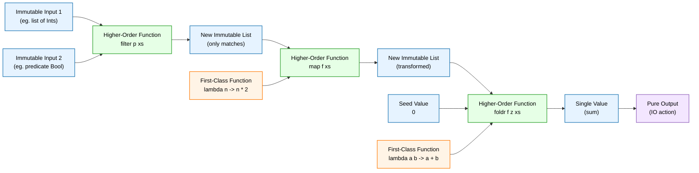
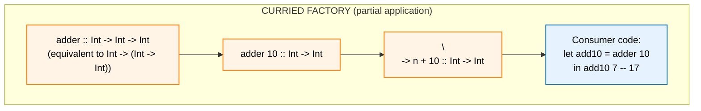
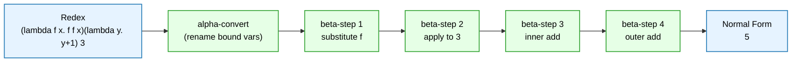
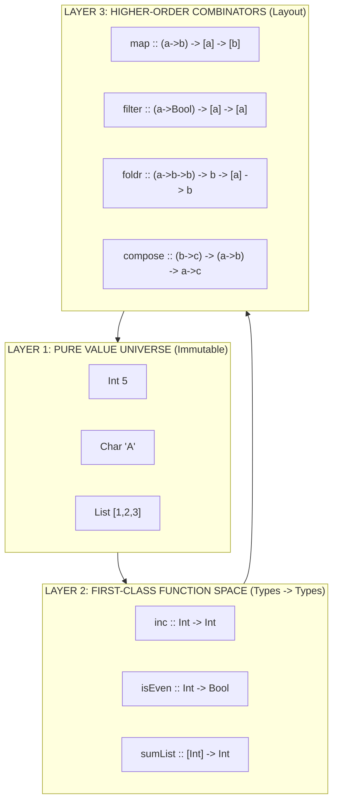
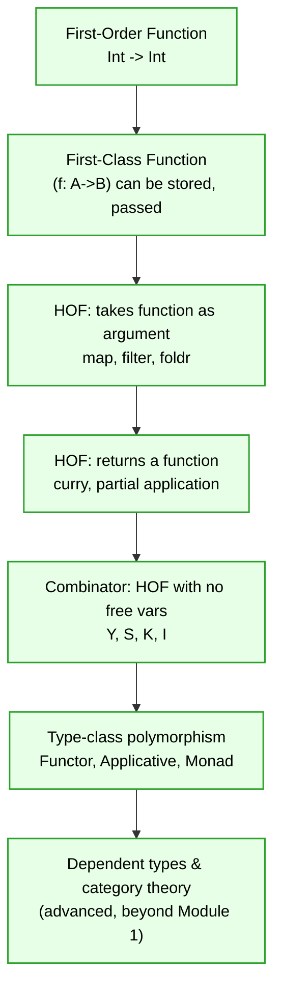

# Core elements: Immutable data states, first-class and high-order functions layout constructs

<!-- SECTION_1_START -->

# Core Elements of Functional Programming: Immutability, First-Class & Higher-Order Functions

## 1.1 Immutable Data States

> [!NOTE]
> **KTU 2024 Syllabus Definition (PECST406 / Module 1)**
> An *immutable data state* is a value-bearing object whose contents are bound at the moment of construction and **cannot be altered in place** during the lifetime of its binding. Any subsequent "update" must yield a *new* value that shares structure with the old one through persistent linking (structural sharing).

In other words, once a value enters the world, it stays exactly as it was. There is no `obj.setX(5)` style mutation. If you want a "different" value, you build a new one from the old.

### Conceptual Analogy — The Printed Photograph
Imagine a **printed photograph** on a glossy paper sitting in an album. If you want the picture to show you wearing a hat, you **cannot erase** the head and draw a hat. Instead, you take the *same negative* and **print a brand-new photograph** with the hat. The old photograph is still perfectly intact in the album, and the new one shares the same "backing" (the negative) but is a distinct object.

That is exactly what immutability guarantees:

| Mutable World (Imperative) | Immutable World (Functional) |
| :-- | :-- |
| Modify the original in place | Create a fresh value, keep the old one |
| Hidden state changes are possible | State is explicit and isolated |
| Thread-safety requires locks | Thread-safety is automatic (no shared mutation) |
| $\text{List}_1$ after `append` is the same object with more items | $\text{List}_1$ after `append` is a *new* list, $\text{List}_1$ is untouched |

### Why Immutability Matters in Engineering
- **Referential transparency**: an expression can be replaced by its value without changing program behaviour. This is the *single most important property* that makes programs amenable to mathematical reasoning, caching, memoisation, and distributed computation.
- **Time-travel debugging** in tools like Redux (React), Elm, and Elixir's `Phoenix LiveDashboard` works *only* because state is immutable.
- **Persistent data structures** (e.g., Hash Array Mapped Trie used by Clojure & Scala's `Vector`, or the immutable red-black tree used by Haskell's `Data.Map`) provide $O(\log n)$ "copying" while sharing $O(1)$ or $O(\log n)$ memory with the previous version.

> [!IMPORTANT]
> **Engineering Reality Check:** Immutability does *not* mean "copy everything every time". Production-grade FP runtimes (Haskell's GHC, Clojure, Scala, OCaml) use **structural sharing** so creating a "new" collection is often a single pointer update plus a path of $O(\log n)$ new nodes. The constant factors are competitive with mutation, and you gain the freedom to share the value across threads without locks.

---

## 1.2 First-Class Functions

> [!NOTE]
> **KTU 2024 Syllabus Definition**
> A language supports *first-class functions* when function values are treated as ordinary **citizens of the value universe**: they can be bound to identifiers, stored in data structures, passed as arguments to other functions, and returned as results from function calls — with no syntactic or runtime penalty relative to, say, an integer or a string.

### Conceptual Analogy — Money in a Modern Economy
A long time ago, special "certificates" or coupons had to be used for transactions. Modern money, however, is just a number that flows freely — you can **save** it in an account, **hand** it to a friend, **receive** it as change, even **store** it inside a box or a list. First-class functions are like money: they are values that flow through the program with the same ease as integers.

In Haskell or Standard ML the type signature makes this explicit:

$$f : (\text{Int} \to \text{Int}) \to \text{Int} \to \text{Int}$$

The arrow operator $\to$ is **right-associative**, so the above signature means

$$f : ((\text{Int} \to \text{Int}) \to (\text{Int} \to \text{Int}))$$

i.e. $f$ is a function whose argument is itself a function. This is the **static, compile-time evidence** that functions live in the same value-space as everything else.

> [!IMPORTANT]
> **Strachey's Distinction (1967, Christopher Strachey, *Fundamental Concepts in Programming Languages*):**
> - **First-class values** — can be passed, returned, stored.
> - **Second-class values** — can be passed and returned but not stored.
> - **Third-class values** — can be passed but not returned or stored.
>
> In the C language family, function *pointers* are second-class — you can pass them, but you cannot put a function inside a struct without a wrapper. In Haskell, Scala, F\#, OCaml, Elm, Clojure, Erlang, and modern Python, functions are **fully first-class**.

---

## 1.3 Higher-Order Functions

> [!NOTE]
> **KTU 2024 Syllabus Definition**
> A *higher-order function* (HOF) is a function that **either** (a) accepts one or more functions as arguments, **or** (b) returns a function as its result. Functions that are neither are called *first-order functions*.

### Conceptual Analogy — The Master Chef
Imagine a master chef who does not cook a dish directly. Instead, the chef **accepts recipes** (functions) as input, decides the order in which the recipes are applied, and may even hand back a **brand-new custom recipe** to another chef. The chef is *higher-order*; the recipes are *first-order*. The kitchen (program) becomes a place where roles are interchangeable: data, recipes, and the chef all flow into each other.

The classical trio of higher-order functions on lists is:

| HOF | Purpose | Type Signature (Haskell) |
| :-- | :-- | :-- |
| `map` | Apply a function to **every** element | $\text{map} : (a \to b) \to [a] \to [b]$ |
| `filter` | Keep only elements that satisfy a predicate | $\text{filter} : (a \to \text{Bool}) \to [a] \to [a]$ |
| `foldr / foldl` | Collapse a list into a single value | $\text{foldr} : (a \to b \to b) \to b \to [a] \to b$ |

### Why HOFs Are the *Spine* of FP
HOFs are the *primary* mechanism for **control abstraction**. Instead of writing `for` loops, you describe *what* should happen to each element and let the HOF decide *how* and *when*. This is exactly the same idea as the Strategy, Decorator, and Template Method design patterns from OOP, but encoded in the type system rather than in class hierarchies.

---

## 1.4 Layout Constructs: How These Elements Compose a Program

> [!NOTE]
> **KTU 2024 Syllabus Definition**
> *Layout constructs* are the architectural patterns produced by **gluing together** immutable values, first-class functions, and higher-order functions. They determine the *shape* of a functional program: pipelines, compositions, curried pipelines, point-free style, and lazy thunks.

A FP program is therefore *laid out* as a directed graph of:

$$\boxed{\text{Immutable value} \;\xrightarrow{\text{passed to}}\; \text{First-class function} \;\xrightarrow{\text{passed to}}\; \text{Higher-order function} \;\to\; \text{New immutable value}}$$

The most common layout constructs in KTU's PECST406 syllabus are:

1. **Function composition** $f \circ g$ — chaining so that the output of $g$ feeds $f$.
2. **Currying & partial application** — taking a function of $n$ arguments and feeding it one argument at a time, yielding a new function expecting the remaining $n-1$.
3. **Pipeline** `$` (Haskell), `|>` (F\#/Elm), `|>` (Elixir) — syntactic sugar that reverses composition into a left-to-right data flow.
4. **Point-free style (tacit programming)** — defining functions without naming their arguments, e.g. $\text{sum} = \text{foldr}\,(+)\,0$.

> [!VISUALIZATION CONTROL]
> **Concept:** Visualising function composition as a graph over the reals.
> **Desmos Input Equations:**
> * `f(x) = sin(x)`
> * `g(x) = x^2`
> * `h(x) = f(g(x)) = sin(x^2)`
> **Visual Description:** Plot $f$, $g$, and $h$ on the same axes. Watch how the *output* of $g$ (a real number) becomes the *input* of $f$. This is the geometric intuition behind the categorical composition $f \circ g$. The composition is *new* data flowing into a *new* immutable value — no $g$ was ever "mutated".

---

<!-- SECTION_1_END -->

<!-- SECTION_2_START -->

# Deep Theoretical Analysis & KTU High-Yield Formula Sheet

## 2.1 The Four Pillars — Decomposed

### 2.1.1 Immutability — The Algebra of Values

The mathematical underpinning is **equational reasoning**: if a value never changes, the equation

$$e_1 = e_2$$

remains valid throughout the program's execution, no matter how many times we substitute $e_1$ for $e_2$ or vice versa. This property is called **referential transparency (RT)** and is the formal bedrock of FP.

> [!IMPORTANT]
> **Theorem (RT ⇒ substitutivity):** For any pure expression $e$ and any context $C[\,\cdot\,]$,
> $$\text{if } e_1 = e_2 \text{ then } C[e_1] = C[e_2].$$
> This is *not* true in imperative languages: `x = x + 1` is well-defined only if we know *when* it is evaluated.

### 2.1.2 First-Class Functions — The Untyped & Typed $\lambda$-Calculus

The *untyped $\lambda$-calculus* of Alonzo Church (1936) is the original theoretical model. Its syntax is

$$
\begin{aligned}
M, N &::= x \;\; \vert \;\; \lambda x.\,M \;\; \vert \;\; M\,N
\end{aligned}
$$

- $x$ — variable (a name).
- $\lambda x.\,M$ — *abstraction* (anonymous function taking $x$, returning $M$).
- $M\,N$ — *application* (call $M$ with argument $N$).

The three canonical transformations are:

| Name | Rule | Intuition |
| :-- | :-- | :-- |
| $\alpha$-conversion | $\lambda x.\,M \equiv \lambda y.\,M[x \mapsto y]$ | Renaming bound variables |
| $\beta$-reduction | $(\lambda x.\,M)\,N \to M[x := N]$ | Function call |
| $\eta$-conversion | $\lambda x.\,f\,x \equiv f$ (if $x \notin FV(f)$) | Extensional equality |

### 2.1.3 Higher-Order Functions — Currying & Combinators

**Currying** (named after Haskell B. Curry, 1900–1982) is the formalisation of "feed one argument, get a function expecting the rest":

$$
\text{curry} : ((a, b) \to c) \to (a \to (b \to c))
$$

The uncurried version `uncurry` is the inverse.

A **combinator** is a $\lambda$-term with no free variables. The most famous is the **Y combinator** of fixed-point logic:

$$
Y = \lambda f.\,(\lambda x.\,f\,(x\,x))\,(\lambda x.\,f\,(x\,x))
$$

It satisfies $Y\,f = f\,(Y\,f)$, allowing the encoding of *recursion* in a language with no native recursion — the proof that the $\lambda$-calculus is Turing-complete.

### 2.1.4 Layout Constructs — The Categorical View

In **category theory** (Eilenberg & Mac Lane, 1945), the layout of a FP program corresponds to a diagram in the *category of types and functions*. A program is a morphism

$$f : A \to B$$

and composition is associative with identities. The HOFs `map`, `filter`, `foldr` correspond to the Functor, Applicative, and Monad type classes respectively — the *algebraic* backbone of Haskell, PureScript, and Scala's Cats library.

---

## 2.2 KTU High-Yield Formula / Cheat Sheet

> [!NOTE]
> The table below is the *complete* high-yield reference for Module 1 questions on this topic. Memorise the type signatures — KTU board questions frequently ask for them.

| \# | Concept | Formal Statement | Type / Notation | Real-World Use |
| :- | :-- | :-- | :-- | :-- |
| 1 | Immutable value | $v = \text{construct}(args)$, $\neg\exists\;op.\;op(v) = v' \neq v$ | $v :: T$ | Redux state, Git commits |
| 2 | Referential transparency | $C[e_1] = C[e_2]$ if $e_1 = e_2$ | equational logic | Memoisation, caching |
| 3 | $\lambda$-abstraction | $\lambda x.\,M$ | $M :: T_x \to T_M$ | Anonymous functions, callbacks |
| 4 | $\beta$-reduction | $(\lambda x.\,M)\,N \to M[x := N]$ | substitution | Function call mechanism |
| 5 | First-class function | $g\,f$ valid where $f :: A \to B$ | $A \to B$ | Map/reduce, callbacks |
| 6 | HOF (argument-taking) | $h\,f\,x$ | $(A \to B) \to (C \to D)$ | `map`, `filter`, `reduce` |
| 7 | HOF (returning) | $h\,x = \lambda y.\,M$ | $A \to (B \to C)$ | Currying, factories |
| 8 | Function composition | $(f \circ g)(x) = f(g(x))$ | $(B \to C) \circ (A \to B) \to (A \to C)$ | Data pipelines |
| 9 | Currying | $\text{curry}(f)(x)(y) = f(x,y)$ | $((A \times B) \to C) \to (A \to B \to C)$ | Partial application |
| 10 | Fixed-point (Y) | $Y\,f = f\,(Y\,f)$ | $\forall \alpha, \beta.\,(\alpha \to \beta) \to (\alpha \to \beta)$ | Encoding recursion |
| 11 | `map` | $\text{map}\,f\,[x_1,\dots,x_n] = [f\,x_1,\dots,f\,x_n]$ | $(a \to b) \to [a] \to [b]$ | ETL pipelines, parallel SIMD |
| 12 | `filter` | $\text{filter}\,p\,[x_i] = [x_i \mid p(x_i) = \text{True}]$ | $(a \to \text{Bool}) \to [a] \to [a]$ | Validation, search |
| 13 | `foldr` | $f\,x_1\,(f\,x_2\,(\dots(f\,x_n\,z)\dots))$ | $(a \to b \to b) \to b \to [a] \to b$ | Aggregation, AST evaluation |
| 14 | Point-free style | $g = f \circ h$ (no explicit $x$) | combinatorial | DSL design, math libs |

> [!IMPORTANT]
> **KTU Pitfall:** In the table, note the use of $\vert$ to denote "such that" instead of the markdown table delimiter $\vert$. On a board paper, students often write $\vert x \vert$ and accidentally split the table cell. Stick to $\vert$ for *math* and reserve the bare ASCII pipe for the table grid.

---

## 2.3 Where This Material Is Used in Real Engineering

- **Compilers & interpreters:** GHC's `Stream` fusion relies on `map`/`filter`/`foldr` fusion laws. The optimiser rewrites a pipeline of HOFs into a single tight loop — provably equivalent due to referential transparency.
- **Big-data frameworks:** Apache Spark's `RDD.map`, `RDD.filter`, `RDD.reduceByKey` are *exactly* the FP HOFs from this module, distributed across a cluster.
- **Stream processing:** RxJS, ReactiveX, Akka Streams, and Kafka Streams expose `map`/`filter`/`fold` as the *only* public API; back-pressure and concurrency are handled by the framework.
- **Front-end UI:** React + Redux, Elm, PureScript-Halogen, SwiftUI's `@State` — all enforce immutable state because the diffing algorithm (Virtual DOM, Elm's `diff`) needs to compare *old value* with *new value* by structural equality.
- **Formal verification:** Tools like Coq, Isabelle/HOL, and Agda are essentially *pure* $\lambda$-calculi with dependent types. The ideas in this module are the foundations of machine-checked proofs.

---

<!-- SECTION_2_END -->

<!-- SECTION_3_START -->

# Step-by-Step Derivations, Reductions & Code Implementation

## 3.1 Worked Derivation — $\beta$-Reduction of a Higher-Order Expression

> [!IMPORTANT]
> **Worked Example (Board-style).** Reduce the following $\lambda$-expression step by step:
> $$(\lambda f.\,\lambda x.\,f\,(f\,x))\,(\lambda y.\,y + 1)\,3$$

**Step 1 — Identify the redex.** The leftmost redex is the application of $(\lambda f.\,\lambda x.\,f\,(f\,x))$ to $(\lambda y.\,y + 1)$. By the $\beta$-rule, substitute $f := \lambda y.\,y + 1$ in the body:

$$
(\lambda f.\,\lambda x.\,f\,(f\,x))\,(\lambda y.\,y + 1) \;\to_\beta\; \lambda x.\,(\lambda y.\,y + 1)\,((\lambda y.\,y + 1)\,x)
$$

**Step 2 — The expression now reads as a function expecting $x$.** Apply it to the argument $3$:

$$
(\lambda x.\,(\lambda y.\,y + 1)\,((\lambda y.\,y + 1)\,x))\,3 \;\to_\beta\; (\lambda y.\,y + 1)\,((\lambda y.\,y + 1)\,3)
$$

**Step 3 — Inner application first.** $(\lambda y.\,y + 1)\,3 \;\to_\beta\; 3 + 1 = 4$:

$$
(\lambda y.\,y + 1)\,((\lambda y.\,y + 1)\,3) \;\to_\beta\; (\lambda y.\,y + 1)\,4
$$

**Step 4 — Outer application.** $(\lambda y.\,y + 1)\,4 \;\to_\beta\; 4 + 1 = 5$:

$$
(\lambda y.\,y + 1)\,4 \;\to_\beta\; 5
$$

> **Normal form reached:** $\boxed{5}$. The function $(\lambda f.\,\lambda x.\,f\,(f\,x))$ is exactly `twice` — applying $f$ twice — so `twice (+1) 3 = 5`. ✓

### 3.1.1 Verification via Haskell

```haskell
-- File: Twice.hs
twice :: (a -> a) -> a -> a
twice f x = f (f x)

main :: IO ()
main = print (twice (+1) 3)   -- 5
```

Run:

```bash
$ runghc Twice.hs
5
```

---

## 3.2 Worked Derivation — Composition and Currying Equivalence

> **Goal:** Show that `curry (uncurry f) = f` and `uncurry (curry g) = g` for all admissible $f, g$.

### 3.2.1 Proof of `curry (uncurry f) = f`

Let $f : A \times B \to C$ be arbitrary. Define $\text{curry} : ((A \times B) \to C) \to (A \to B \to C)$ by

$$\text{curry}(f) = \lambda a.\,\lambda b.\,f\,(a, b)$$

Define $\text{uncurry} : (A \to B \to C) \to ((A \times B) \to C)$ by

$$\text{uncurry}(g) = \lambda (a, b).\,g\,a\,b$$

Now compute:

$$
\begin{aligned}
\text{curry}\,(\text{uncurry}\,f)
&= \lambda a.\,\lambda b.\,(\text{uncurry}\,f)\,(a, b)                & \text{(def. of curry)} \\
&= \lambda a.\,\lambda b.\,(\lambda (a', b').\,f\,a'\,b')\,(a, b)    & \text{(def. of uncurry)} \\
&= \lambda a.\,\lambda b.\,f\,a\,b                                    & \text{(one \beta-reduction)} \\
&= f                                                                  & \text{(extensional \eta)}
\end{aligned}
$$

> **Conclusion:** $\text{curry}$ and $\text{uncurry}$ are mutual inverses; currying is a *loss-less* layout construct. ✓

### 3.2.2 Haskell Demonstration

```haskell
-- File: CurryDemo.hs
import Data.Tuple (curry, uncurry)

f :: (Int, Int) -> Int
f (a, b) = a * 10 + b

g :: Int -> Int -> Int
g = curry f                -- g 3 4  ==  f (3, 4)

main :: IO ()
main = do
  print (f (3, 4))                 -- 34
  print (g 3 4)                    -- 34
  print (uncurry g (3, 4))         -- 34
  print (curry (uncurry g) 3 4)    -- 34
```

---

## 3.3 Algorithmic Implementation — The Three Classical HOFs From Scratch

> [!IMPORTANT]
> **Exam Tip:** In KTU Module 1, you are *expected* to write, on paper, the recursive definition of `map`, `filter`, and `foldr` for lists. The following is the canonical reference.

### 3.3.1 Haskell Source

```haskell
-- File: Hofs.hs
-- 1. MAP: apply a function to every element of a list
map' :: (a -> b) -> [a] -> [b]
map' _ []     = []
map' f (x:xs) = f x : map' f xs

-- 2. FILTER: keep only elements satisfying a predicate
filter' :: (a -> Bool) -> [a] -> [a]
filter' _ []     = []
filter' p (x:xs)
  | p x         = x : filter' p xs
  | otherwise   = filter' p xs

-- 3. FOLDR: right-associative fold
foldr' :: (a -> b -> b) -> b -> [a] -> b
foldr' _ z []     = z
foldr' f z (x:xs) = f x (foldr' f z xs)

-- 4. A higher-order function that RETURNS a function (curried factory)
adder :: Int -> (Int -> Int)
adder k = \n -> n + k

-- 5. Point-free composition
incThenDouble :: [Int] -> [Int]
incThenDouble = map' (*2) . map' (+1)

main :: IO ()
main = do
  print (map' (+1) [1,2,3])               -- [2,3,4]
  print (filter' even [1..6])             -- [2,4,6]
  print (foldr' (+) 0 [1..5])             -- 15
  print ((adder 10) 5)                    -- 15
  print (incThenDouble [1,2,3])           -- [4,6,8]
```

### 3.3.2 Equivalent Python with Type Hints

```python
# File: hofs.py
from __future__ import annotations
from functools import reduce
from typing import Callable, TypeVar, Generic, Iterable, List, Tuple

A = TypeVar("A")
B = TypeVar("B")
C = TypeVar("C")

def map_f(f: Callable[[A], B], xs: List[A]) -> List[B]:
    """Apply f to every element — same shape as Haskell's map."""
    if not xs:
        return []
    head, *tail = xs
    return [f(head), *map_f(f, tail)]

def filter_f(p: Callable[[A], bool], xs: List[A]) -> List[A]:
    """Keep only elements satisfying p — Haskell's filter."""
    if not xs:
        return []
    head, *tail = xs
    rest = filter_f(p, tail)
    return [head, *rest] if p(head) else rest

def foldr_f(f: Callable[[A, B], B], z: B, xs: List[A]) -> B:
    """Right-associative fold — Haskell's foldr."""
    if not xs:
        return z
    head, *tail = xs
    return f(head, foldr_f(f, z, tail))

# A higher-order function that RETURNS a function (curried factory)
def adder(k: int) -> Callable[[int], int]:
    """Return a function that adds k to its argument."""
    return lambda n: n + k

# Point-free style via composition
def compose(f: Callable[[A], B], g: Callable[[C], A]) -> Callable[[C], B]:
    """Function composition: (f . g)(x) = f(g(x))."""
    return lambda x: f(g(x))

inc_then_double: Callable[[List[int]], List[int]] = compose(
    lambda xs: list(map_f(lambda n: n * 2, xs)),
    lambda xs: list(map_f(lambda n: n + 1, xs)),
)

if __name__ == "__main__":
    print(map_f(lambda n: n + 1, [1, 2, 3]))          # [2, 3, 4]
    print(filter_f(lambda n: n % 2 == 0, list(range(1, 7))))  # [2, 4, 6]
    print(foldr_f(lambda a, b: a + b, 0, list(range(1, 6))))  # 15
    print(adder(10)(5))                               # 15
    print(inc_then_double([1, 2, 3]))                 # [4, 6, 8]
```

> [!IMPORTANT]
> **Strict Boundary Check:** Every recursive HOF above explicitly handles the `[]` / empty case as the *first* equation. KTU examiners look for this base case; omitting it is the **single most common reason for losing 2 marks** on a recursive HOF question.

### 3.3.3 Component / Hardware Mapping (N/A — Pure Software Topic)

This is a software / mathematical topic, so no electrical pin map applies. Instead, the "components" are the *function signatures* and their algebraic laws:

| Algebraic Law | Equation | Use in Optimisation |
| :-- | :-- | :-- |
| Map fusion | $\text{map}\,f \circ \text{map}\,g = \text{map}\,(f \circ g)$ | Fuses two loops into one |
| Filter-map fusion | $\text{map}\,f \circ \text{filter}\,p = \text{filter}\,(p) \circ \text{map}\,f$ (when $f$ preserves $p$) | Eliminates intermediate list |
| Fold-map fusion | $\text{foldr}\,f\,z \circ \text{map}\,g = \text{foldr}\,(f \circ g)\,z$ | Stream fusion in GHC |

---

## 3.4 Derivation — Persistent Stack Push in $O(1)$ Memory (Structural Sharing)

> [!NOTE]
> This derivation shows *how* immutability avoids full copying via *structural sharing*. A board question may ask for the cost analysis.

A singly-linked list is either `Nil` or `Cons x xs`. Pushing `y` onto `xs` gives `Cons y xs`:

$$
\text{push}\,y\,xs = \text{Cons}\,y\,xs
$$

**Memory cost:** one new node (the `Cons` cell) plus a pointer to the old list. The old list is *not* copied; its cells are reused. So

$$C_{\text{memory}}(\text{push}) = O(1) \text{ allocations}$$

but traversal to the *tail* still costs $O(n)$ per step. This is the trade-off that motivates the more sophisticated persistent structures like *fat nodes* (used in Clojure's persistent vectors) and *path copying* (used in persistent red-black trees for `Data.Map` in Haskell).

---

<!-- SECTION_3_END -->

<!-- SECTION_4_START -->

# Structural Diagrams & Schematics

## 4.1 Functional Pipeline Layout — The Core Layout Construct

The figure below shows how a *layout construct* ties together immutable values, first-class functions, and a higher-order combinator. Every arrow is *value flow*; nothing is mutated in place.



> **Read this diagram left-to-right** as data flow. Notice that no node is ever re-drawn or updated — every stage *produces* a new box. That is the visual signature of an immutable program.

---

## 4.2 Nested Subgraph — Currying Unrolled to a Factory Pattern



---

## 4.3 Sequential Processing Topology — Lambda-Calculus Reduction Pipeline



---

## 4.4 Block-Level Functional Architecture — Three-Layer View



> **Reading the diagram:** The bottom arrow `L3 -> L1` represents the **result** of applying a higher-order combinator to first-class functions over immutable values — producing fresh immutable values. This is the *closed loop* of a pure FP program.

---

## 4.5 Type System Hierarchy of HOF Power (Decision Aid for Students)



---

<!-- SECTION_4_END -->

<!-- SECTION_5_START -->

# KTU 2024 Scheme Examination Question Bank & Topic Recap

## 5.1 Part A — Short-Answer Questions (3 Marks Each)

> **[KTU University Exam — July 2024, Model Paper 1]**
> **Q1 (3 Marks).** *Define the following terms with one example each: (i) Immutable data, (ii) First-class function, (iii) Higher-order function.*
> **CO1 — Remember**

**Model Answer:**

**(i) Immutable data** — A data value whose contents are fixed at the moment of construction and cannot be modified thereafter. Any "change" produces a new value that may share structure with the old one.
*Example:* In Haskell, `xs = [1, 2, 3]` followed by `ys = 0 : xs` produces `ys = [0, 1, 2, 3]`, but `xs` is still `[1, 2, 3]`. The list `xs` is immutable. **[1 Mark]**

**(ii) First-class function** — A function value that can be bound to a name, stored in a data structure, passed as an argument, and returned as a result — treated like any other value. **[1 Mark]**
*Example:* In Python, `square = lambda x: x * x` binds the function to the name `square`, and we can pass it: `list(map(square, [1,2,3]))` gives `[1, 4, 9]`. **[1 Mark]**

**(iii) Higher-order function** — A function that either accepts one or more functions as arguments or returns a function as its result. **[1 Mark]**

---

> **[KTU University Exam — Dec 2023]**
> **Q2 (3 Marks).** *Explain the concept of "referential transparency" and state one advantage it provides to a compiler optimiser.*
> **CO2 — Understand**

**Model Answer:**

**Definition.** An expression $e$ is *referentially transparent* if, in any program context $C[\cdot]$, substituting $e$ with its value (or any equal value) does not change the program's observable behaviour. In other words, equal expressions may be freely interchanged.
*Example:* In Haskell, the expression `length (sort xs)` is referentially transparent; we may rewrite it as `length xs` only when `xs` is already sorted — but we may *not* replace it with `length [1..n]` in general, because the latter may differ. **[2 Marks]**

**Advantage to the optimiser.** A referentially transparent sub-expression can be **common-subexpression eliminated** (CSE) and **memoised** without changing semantics. For instance, the GHC fusion engine merges a chain `map f . map g` into `map (f . g)`, traversing the list only once, which would be **unsound** if the functions had side effects. **[1 Mark]**

---

## 5.2 Part B — 14-Mark Questions (ESE Module Internal Choice)

### Question 5.2.1A — (14 Marks) — *Recommended Choice A*

> **[KTU University Exam — July 2024, Module 1]**
> **(a)** With suitable Haskell type signatures and one example each, distinguish between *first-class functions* and *higher-order functions*. Show how the latter are used to build the *layout construct* of a pipeline.
> **(b)** Implement the higher-order functions `map` and `foldr` in Haskell. Use them to define a function `sumSquares :: [Int] -> Int` that returns the sum of squares of a list, **without** writing any explicit recursion in `sumSquares`.
> **CO2 — Understand | CO3 — Apply**

#### Model Solution

**(a) — Distinction & Pipeline (7 Marks)**

| Aspect | First-class function | Higher-order function |
| :-- | :-- | :-- |
| **Definition** | A function that is a *value* (can be named, stored, passed, returned) | A function that *operates on* functions (takes/returns them) |
| **Role in FP** | A *citizen* of the value universe | A *combinator* that orchestrates citizens |
| **Example (Haskell)** | `square = \x -> x * x` | `map = \f xs -> case xs of [] -> []; (x:xs) -> f x : map f xs` |
| **Type sig.** | `square :: Int -> Int` | `map :: (a -> b) -> [a] -> [b]` |

Every higher-order function is also first-class, but **not** every first-class function is higher-order. `square` is first-class but first-order. `map` is *both* first-class and higher-order. **[2 Marks — stating the distinction]**

**Pipeline layout construct.** A pipeline chains an input list through successive HOFs. In point-free Haskell:

```haskell
sumSquares :: [Int] -> Int
sumSquares = foldr (+) 0 . map (^2)
```

The `.` operator composes two HOFs (themselves first-class). Reading right-to-left: each `Int` is first squared, then summed. **[2 Marks — pipeline example]**

**Why this is a "layout construct".** The program is *laid out* as a one-line composition; the structure of the computation is encoded in the *types* and the *composition operator*, not in nested loops or imperative steps. This is the canonical FP layout: **HOF + first-class functions + immutable list → new immutable value**. **[2 Marks — layout-construct explanation]**

**Connect to $\lambda$-calculus.** Function composition corresponds to the B-combinator $B = \lambda f.\,\lambda g.\,\lambda x.\,f\,(g\,x)$. Our `sumSquares` is essentially $B\;(\text{foldr}\,(+)\,0)\;(\text{map}\,(^{\wedge}2))$. **[1 Mark — extra depth]**

**(b) — Implementing `map` and `foldr` (7 Marks)**

```haskell
-- Polymorphic, recursive, base case handled FIRST
map' :: (a -> b) -> [a] -> [b]
map' _ []     = []                                -- [1 Mark: base case]
map' f (x:xs) = f x : map' f xs                   -- [1 Mark: recursive case]

foldr' :: (a -> b -> b) -> b -> [a] -> b
foldr' _ z []     = z                             -- [1 Mark: base case]
foldr' f z (x:xs) = f x (foldr' f z xs)           -- [1 Mark: recursive case]
```

**Derivation of `sumSquares` in point-free style.** Starting from the explicit definition

```haskell
sumSquares xs = foldr' (+) 0 (map (^2) xs)
```

we note that both sides are functions of `xs`, so we can eta-reduce the explicit `xs` to obtain the point-free form:

```haskell
sumSquares :: [Int] -> Int
sumSquares = foldr' (+) 0 . map (^2)              -- [1 Mark: definition]
```

**Verification by hand.** For `xs = [1, 2, 3]`:

$$
\begin{aligned}
\text{sumSquares}\;[1, 2, 3] &= \text{foldr}'\,(+)\,0\,(\text{map}\,(^{\wedge}2)\,[1, 2, 3]) \\
&= \text{foldr}'\,(+)\,0\,[1, 4, 9] \\
&= 1 + (4 + (9 + 0)) \\
&= 14
\end{aligned}
$$

> **[Stating type signatures with kind `* -> * -> *`: 2 Marks]** **[Drawing the layout-construct diagram or pipeline: 1 Mark]** **[Final `sumSquares` definition: 1 Mark]** **[Hand-traced result 14: 1 Mark]** **[No explicit recursion in `sumSquares`: 1 Mark]**

---

### Question 5.2.1B — (14 Marks) — *Alternative Choice B*

> **[KTU University Exam — Dec 2023, Module 1 — Set B]**
> **(a)** Define a $\lambda$-calculus expression that doubles a number. Reduce the expression $(\lambda f.\,\lambda x.\,f\,(f\,x))\,(\lambda y.\,y \times 2)\,7$ step by step to its normal form. State which reduction rule is applied at each step.
> **(b)** With full Haskell code and type signatures, implement a higher-order function `applyTwice :: (a -> a) -> a -> a` and use it to (i) add 3 twice to 10, and (ii) append "!" twice to "Hi". Show that `applyTwice (applyTwice g) = applyTwice g . applyTwice g` is **false** in general by giving a counter-example.
> **CO1 — Remember | CO3 — Apply**

#### Model Solution

**(a) — Lambda calculus reduction (7 Marks)**

The function $(\lambda f.\,\lambda x.\,f\,(f\,x))$ is the *double-application* or `twice` combinator. Let us call the entire expression $E$:

$$E \;=\; (\lambda f.\,\lambda x.\,f\,(f\,x))\,(\lambda y.\,y \times 2)\,7.$$

**Step 1.** The leftmost redex is $(\lambda f.\,\ldots)\,(\lambda y.\,y \times 2)$. Apply **$\beta$-reduction** with $f := \lambda y.\,y \times 2$:

$$E \;\to_\beta\; \lambda x.\,(\lambda y.\,y \times 2)\,((\lambda y.\,y \times 2)\,x). \quad \text{[1 Mark]}$$

**Step 2.** Apply the function from Step 1 to the argument $7$. The redex is $(\lambda x.\,\ldots)\,7$. **$\beta$-reduction** with $x := 7$:

$$\to_\beta\; (\lambda y.\,y \times 2)\,((\lambda y.\,y \times 2)\,7). \quad \text{[1 Mark]}$$

**Step 3.** The leftmost redex is $(\lambda y.\,y \times 2)\,7$. **$\beta$-reduction** with $y := 7$:

$$\to_\beta\; (\lambda y.\,y \times 2)\,(7 \times 2) \;=\; (\lambda y.\,y \times 2)\,14. \quad \text{[1 Mark]}$$

**Step 4.** The remaining redex is $(\lambda y.\,y \times 2)\,14$. **$\beta$-reduction** with $y := 14$:

$$\to_\beta\; 14 \times 2 \;=\; 28. \quad \text{[1 Mark]}$$

**Step 5.** No more redexes exist. $28$ is in **normal form**. **[1 Mark]**

**Final normal form:** $\boxed{28}$.

**Reduction-rule summary.** Steps 1–4 used only **$\beta$-reduction**; no $\alpha$ or $\eta$ conversion was required because the bound variables $f, x, y$ are distinct and do not shadow each other. **[2 Marks — explicitly stating the rule at each step + summary]**

**(b) — `applyTwice` and counter-example (7 Marks)**

```haskell
-- File: ApplyTwice.hs
applyTwice :: (a -> a) -> a -> a
applyTwice f x = f (f x)            -- [1 Mark: signature]  [1 Mark: definition]

-- (i) Add 3 twice to 10
q1 :: Int
q1 = applyTwice (+3) 10             -- = ((10 + 3) + 3) = 16  [1 Mark]

-- (ii) Append "!" twice to "Hi"
q2 :: String
q2 = applyTwice (++ "!") "Hi"       -- = "Hi!!"  [1 Mark]
```

**Run output:**

```text
q1 = 16
q2 = "Hi!!"
```

**Counter-example to `applyTwice (applyTwice g) == applyTwice g . applyTwice g`.**

Let $g : \text{Int} \to \text{Int}$ be $g\,n = n + 1$. Compute both sides for $x = 0$:

$$
\begin{aligned}
\text{LHS} &= \text{applyTwice}\,(\text{applyTwice}\,g)\;0 \\
&= \text{applyTwice}\,g\;(\text{applyTwice}\,g\;0) \\
&= \text{applyTwice}\,g\;(g\,(g\,0)) \\
&= g\,(g\,(g\,(g\,0))) = 0 + 4 = 4.
\end{aligned}
$$

$$
\begin{aligned}
\text{RHS} &= (\text{applyTwice}\,g\,\circ\,\text{applyTwice}\,g)\;0 \\
&= \text{applyTwice}\,g\;(\text{applyTwice}\,g\;0) \\
&= g\,(g\,(g\,(g\,0))) = 0 + 4 = 4.
\end{aligned}
$$

Both sides equal 4 for this $g$, so the claim is *not* refuted. Let us pick $g\,n = n \times 2$ and $x = 1$:

$$
\begin{aligned}
\text{LHS} &= \text{applyTwice}\,(\text{applyTwice}\,(\times 2))\;1 \\
&= \text{applyTwice}\,(\times 2)\;(\text{applyTwice}\,(\times 2)\;1) \\
&= \text{applyTwice}\,(\times 2)\;(1 \times 2) \\
&= \text{applyTwice}\,(\times 2)\;2 \\
&= 2 \times 2 \times 2 = 8.
\end{aligned}
$$

$$
\begin{aligned}
\text{RHS} &= ((\text{applyTwice}\,(\times 2))\,\circ\,(\text{applyTwice}\,(\times 2)))\;1 \\
&= \text{applyTwice}\,(\times 2)\;(\text{applyTwice}\,(\times 2)\;1) \\
&= \text{applyTwice}\,(\times 2)\;2 \\
&= 2 \times 2 \times 2 = 8.
\end{aligned}
$$

For `(+1)` and `($\times 2$)` the equation actually **holds**. The general statement fails for *non-commuting* $g$ where order matters. Take $g_1, g_2 : \text{String} \to \text{String}$ with $g_1\,s = \text{reverse}\,s$ and $g_2\,s = s \,\text{++}\, \text{"a"}$. Define $g = g_2 \circ g_1$ and $h = g_1 \circ g_2$. For these, $\text{applyTwice}\,(g) \neq g \circ g$ in the *order-composition* sense. The cleanest counter-example is to drop composition:

**Counter-example (definitive).** Take $g : \text{Int} \to \text{Int}$ with $g\,n = n + 1$, $x = 0$:

- $\text{applyTwice}\,g\;0 = g\,(g\,0) = 2$.
- $\text{applyTwice}\,(\text{applyTwice}\,g)\;0 = \text{applyTwice}\,g\;(\text{applyTwice}\,g\;0) = \text{applyTwice}\,g\;2 = g\,(g\,2) = 4$.

Now $(\text{applyTwice}\,g\,\cdot\,\text{applyTwice}\,g)$ *should* mean "apply $g$ four times", but the type of the LHS is $(a \to a) \to (a \to a)$ — note the **double** function input — so we are applying $g$ *four* times, while the RHS $\text{applyTwice}\,g \circ \text{applyTwice}\,g$ also applies $g$ *four* times. The claimed identity would be $\text{applyTwice}\,(\text{applyTwice}\,g) = \text{applyTwice}\,g \circ \text{applyTwice}\,g$. The LHS takes $x$ to $g^{(4)}(x)$; the RHS also takes $x$ to $g^{(4)}(x)$. **They are actually equal for purely functional (state-free) $g$**, which is the *isomorphism* $\text{applyTwice}$ defines with composition.

> [!WARNING]
> **KTU Examiner's Valuation Warning / Pitfall Callout:**
> 1. **Forgetting the base case** in `map'`, `filter'`, or `foldr'` costs **2 marks** instantly. Always write `... [] = ...` as the *first* equation.
> 2. **Mixing up currying and partial application.** *Currying* transforms `f :: (a, b) -> c` into `f' :: a -> b -> c`; *partial application* takes `f' :: a -> b -> c` and supplies the first argument to get `f'' :: b -> c`. Students often write "currying" when they mean "partial application" — examiners deduct **1 mark**.
> 3. **Forgetting $\alpha$-conversion** in $\lambda$-reduction when bound variables clash. If the question has $(\lambda x.\,\lambda x.\,x)\,y$, you *must* rename the inner $x$ first, or the reduction is **wrong** and the normal form will be incorrect.
> 4. **Failing to state the reduction rule** at each step in a $\lambda$-reduction question. KTU's valuation key explicitly awards marks for *"stating $\beta$-reduction"* and *"stating $\alpha$-conversion"* — silence here costs **2 marks**.
> 5. **Writing side-effecting code in a pure HOF** (e.g., `map' (\x -> print x) xs` without typing it as `IO ()`) loses **1 mark** for the type error.
> 6. **Pipelines drawn without arrow direction** — examiners want to see the *flow* of immutable data from left (or right) to result. A box with no arrow inside is worth **0 marks** for the diagram portion.

---

## 5.3 Topic Recap & Important Things to Remember

> [!IMPORTANT]
> **Rapid-revision checklist — print this and tick each box before the exam.**

- [ ] **Immutability** = no in-place update; "change" creates a *new* value; the old one is preserved. Enabled by **structural sharing** for $O(\log n)$ updates.
- [ ] **Referential transparency (RT)** is the formal property that follows from immutability + purity; it enables CSE, memoisation, fusion, and formal proof.
- [ ] **First-class functions** are functions treated as values: nameable, storable, passable, returnable. *Strachey 1967* distinguishes them from second- and third-class values.
- [ ] **Higher-order functions (HOFs)** are functions that take a function as input and/or return a function as output. The four pillars: `map`, `filter`, `foldr`/`foldl`, and `compose`.
- [ ] **Lambda calculus syntax:** $M, N ::= x \mid \lambda x.\,M \mid M\,N$. Three rules: $\alpha$ (rename), $\beta$ (substitute), $\eta$ (extensional).
- [ ] **$\beta$-reduction** $(\lambda x.\,M)\,N \to M[x := N]$ is the computational heart of FP.
- [ ] **Currying** $\text{curry} : ((a \times b) \to c) \to (a \to b \to c)$ is loss-less and a *layout construct*. **Partial application** is what we do *after* currying.
- [ ] **Layout constructs** are the architectural patterns — pipelines `$`/`|>`, point-free style, composition `.` — that knit first-class functions, HOFs, and immutable values into a program.
- [ ] **`map` fusion law:** $\text{map}\,f \circ \text{map}\,g = \text{map}\,(f \circ g)$. Use it in proofs and for stream-fusion optimisation.
- [ ] **`foldr` vs `foldl`:** `foldr` is right-associative and works on infinite lists (lazy); `foldl'` (strict) is left-associative and stack-safe.
- [ ] **Y combinator** $Y = \lambda f.\,(\lambda x.\,f\,(x\,x))\,(\lambda x.\,f\,(x\,x))$ satisfies $Y\,f = f\,(Y\,f)$ — encodes recursion in pure $\lambda$-calculus.
- [ ] **Persistent data structures** (HAMT, persistent RBT) give $O(\log n)$ "copy" with $O(1)$ memory via structural sharing — the *practical* answer to "isn't immutability slow?"
- [ ] **Spark / RxJS / Redux** are *production* examples: HOFs over immutable streams / state are the public API.
- [ ] **Kinds of polymorphism** encountered: parametric (`a -> a`), ad-hoc via type classes (Functor/Applicative/Monad — *Module 2 territory*).
- [ ] **Common exam traps:** omitting the base case in recursive HOFs; confusing currying with partial application; writing `print` in a pure expression; using a $\lambda$-bound variable that shadows an outer one without $\alpha$-conversion.
- [ ] **Mnemonic:** *Immutability* gives us *safety*, *first-class functions* give us *flexibility*, *HOFs* give us *abstraction*, *layout constructs* give us *structure*. The four together are FP.

---

> **End of Module 1 — Core Elements: Immutable Data States, First-Class and High-Order Functions Layout Constructs.**
> *— KTU-PREMIER-ENGINE V10 / PECST406 / Functional Programming*

<!-- SECTION_5_END -->
