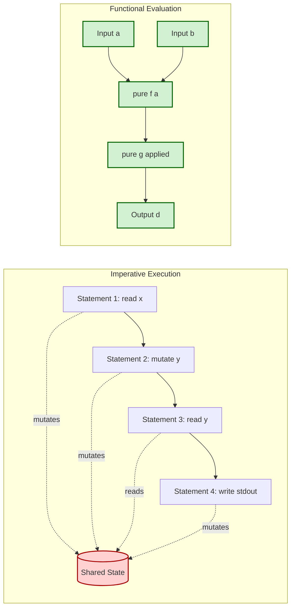
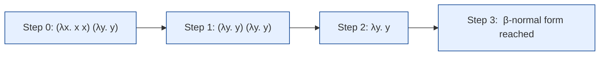
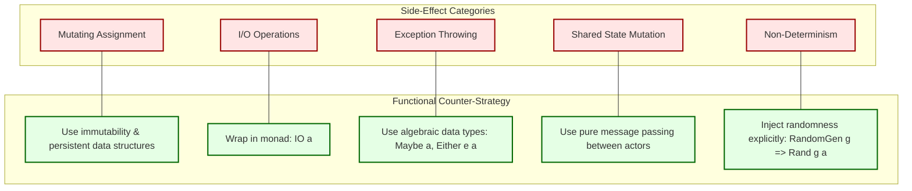

# Functional paradigms principles vs imperative programming side-effects

<!-- SECTION_1_START -->
# Functional Paradigms vs Imperative Side-Effects

## 1.1 Formal Definition (KTU 2024 Syllabus Terminology)

> [!IMPORTANT]
> **Lambda Calculus (λ-calculus)** is a formal mathematical system for expressing computation based on function abstraction and application using variable binding and substitution. It was introduced by Alonzo Church in the 1930s and forms the theoretical foundation of all functional programming languages.

The grammar of the *pure* untyped lambda calculus is defined recursively as:

$$
e \;\:=\;\; x \;\;\big|\;\;\lambda x.e \;\;\big|\;\; e_1 \, e_2
$$

where:
- $x$ is a variable identifier drawn from an infinite alphabet,
- $\lambda x.e$ is a **lambda abstraction** (anonymous function taking argument $x$ and returning body $e$),
- $e_1 \, e_2$ is a **function application** (applying $e_1$ to argument $e_2$).

> [!NOTE]
> **Functional Programming (FP)** is a declarative programming paradigm where programs are constructed by composing *pure functions*, avoiding *shared mutable state* and *side effects*. **Imperative Programming** is a paradigm where programs describe a sequence of statements that mutate program state to achieve a result.

---

## 1.2 Intuitive Analogy — "The Recipe vs The Live Cooking Show"

Imagine two kitchens preparing the same dish:

| Paradigm | Analogy | Behaviour |
|---|---|---|
| **Functional** | A printed recipe card | Given the same inputs (ingredients), the recipe always produces the same dish. You can replace the recipe with the dish itself without anyone noticing. |
| **Imperative** | A live cooking show | The chef mutates the kitchen in real-time — opens the oven, turns the stove on, tastes the soup, adjusts the salt. The state of the kitchen *changes over time*, so calling the show "twice" never gives the same kitchen. |

A **side effect** is anything the live show does to the *outside world* beyond producing the final dish: flicking a light switch, draining water, throwing peels in the bin. The printed recipe has *zero side effects* — it only describes *what* the dish is, not *how* the kitchen must change to produce it.

---

## 1.3 GeoGebra / Desmos Visualisation

> [!VISUALIZATION CONTROL]
> **Concept:** Visualising referential transparency — the equivalence between an expression and its reduced value on a number line.
> **Desmos Input Equations:**
> * Point A: $(3, f(3))$ where $f(x) = x^2 + 2x$
> * Point B: $(3, 15)$ — the reduced value
> * Horizontal line $y = 15$ through $x = 3$
> **Visual Description:** The student should observe that the curve $f(x)$ and the constant line $y = 15$ intersect exactly at $x = 3$. This geometric coincidence represents *referential transparency*: anywhere $f(3)$ appears, we may safely rewrite it as $15$ without altering the program's observable behaviour.

> [!TIP]
> **Quick syllabus highlight:** Under the KTU 2024 PECST406 syllabus, Module 1 specifically tests the ability to (1) identify side effects, (2) convert imperative snippets into declarative equivalents, and (3) perform beta-reductions of small lambda terms.
<!-- SECTION_1_END -->

<!-- SECTION_2_START -->
# Deep Theoretical Analysis & KTU High-Yield Formula Sheet

## 2.1 The Three Foundational Conversion Rules of Lambda Calculus

The lambda calculus derives its entire computational power from just **three rewrite rules** (called *conversions*). Mastering these is essential for KTU Module 1 derivations.

### 2.1.1 α-conversion (Alpha Conversion) — Renaming Bound Variables
Bound variables are local placeholders. Renaming them does not change the meaning of the term.

$$
\lambda x. x \;\equiv_{\alpha}\; \lambda y. y \;\equiv_{\alpha}\; \lambda z. z
$$

The body $x$ is a *bound occurrence* of $x$, so we may safely substitute a fresh name. However, in $\lambda x. \lambda y. x$, only the inner $x$ is bound to the outer abstraction — renaming $x$ would clash with the inner one.

### 2.1.2 β-reduction (Beta Reduction) — Function Application
This is the *computation engine*. A redex (reducible expression) of the form $(\lambda x. e_1) \, e_2$ reduces by substituting $e_2$ for every *free* occurrence of $x$ inside $e_1$:

$$
(\lambda x. e_1) \, e_2 \;\longrightarrow_{\beta}\; e_1 [x := e_2]
$$

The notation $e_1[x := e_2]$ means "every free occurrence of $x$ in $e_1$ is textually replaced by $e_2$". This must be performed carefully to avoid **variable capture** (a free variable of $e_2$ being accidentally bound by a lambda inside $e_1$).

### 2.1.3 η-conversion (Eta Conversion) — Extensionality
If a function $f$ is defined as "take $x$, then apply $g$ to $x$", it is extensionally equivalent to $g$ itself:

$$
\lambda x. f \, x \;\equiv_{\eta}\; f \quad \text{provided } x \notin FV(f)
$$

This is the formal justification for the functional pattern *point-free style* (writing $f \circ g$ instead of $\lambda x. f(g(x))$).

---

## 2.2 Side Effects — A Formal Taxonomy

In the imperative world, a side effect is any *observable interaction* with the outside world, or any *mutation* of in-memory state. The KTU 2024 rubric groups them as follows:

- **Mutating assignment** — overwriting the value held in a variable or memory cell.
- **I/O operations** — reading from stdin, writing to stdout, file or network access.
- **Exception throwing** — non-local transfer of control that escapes the normal return path.
- **Shared state mutation** — concurrent threads writing to a shared variable.
- **Non-determinism** — relying on system time, random seeds, or hardware interrupts.

> [!IMPORTANT]
> **Definition (Side Effect).** A function $f$ exhibits a side effect if there exists an input $x$ such that evaluating $f(x)$ twice — or evaluating $f(x)$ and an *observationally equivalent* rewrite of it — produces different observable outputs, or alters state visible to other parts of the program.

---

## 2.3 KTU High-Yield Formula & Concept Cheat Sheet

| Concept | Notation / Form | Key Property | Engineering Use Case |
|---|---|---|---|
| Pure function | $f : A \to B$ | Deterministic; $f(x) = f(x)$ always | Caching, memoisation, parallel execution |
| Referential transparency | $e \equiv e'$ if $e[x:=e] \equiv e'$ | Replaceable by value | Compiler optimisations, equational reasoning |
| First-class function | A function treated as data | Can be passed, returned, stored | Map / filter / reduce pipelines |
| Higher-order function | $h : (A \to B) \to C$ | Takes or returns a function | Decorators, middleware, DSL construction |
| Closure | $\lambda x. e$ capturing free $y$ | Environment-aware lambda | Callbacks, curried configuration |
| Currying | $f(a, b) = (\lambda a. \lambda b. f(a, b))(a)(b)$ | Multi-arg $\to$ chain of unary | Partial application, function composition |
| Immutability | $x = x + 1$ forbidden | Data is replaced, never mutated | Concurrent programming, time-travel debug |
| Lazy evaluation | Evaluate $e_2$ only if needed | $\lambda x. e_1 \, e_2$ may not reduce $e_2$ | Infinite streams, short-circuit operators |
| Strict evaluation | Evaluate $e_2$ before applying | Call-by-value / call-by-reference | Predictable memory profile |

> [!NOTE]
> **Note on LaTeX rendering:** In the table above, the notation $f : A \to B$ represents the *type signature* of a pure function. It is read as "$f$ is a function from type $A$ to type $B$". The arrow $\to$ is *not* the imperative assignment operator.

---

## 2.4 Engineering Real-World Utility

- **Compiler optimisations:** Because pure expressions are referentially transparent, compilers like GHC (Haskell) and MLton (Standard ML) can aggressively *common-subexpression-eliminate*, *in-line*, and *parallelise* without violating the *as-if* rule.
- **Distributed systems:** Pure functions are the natural fit for **map-reduce** jobs in Apache Spark, AWS Lambda, and Hadoop — the same code runs on 1 node or 10 000 nodes with identical semantics.
- **React / Redux front-end:** The Redux pattern mandates that reducers be *pure functions* of `(state, action) -> newState`, which is the most direct application of functional principles in modern web engineering.
- **Database theory:** A *view* in SQL is referentially transparent — replacing a view with its definition cannot change any query result.
- **Formal verification:** Pure functions are amenable to model checking, Hoare-logic proof, and property-based testing (QuickCheck) precisely *because* they have no hidden state.
<!-- SECTION_2_END -->

<!-- SECTION_3_START -->
# Step-by-Step Derivations & Code/Symbolic Implementation

## 3.1 Worked Lambda Calculus Derivations

### 3.1.1 Example A — Simple Beta Reduction (KTU favourite)

Reduce the term $(\lambda x. x \, x) \, (\lambda y. y)$ step by step.

**Step 1 — Identify the redex.** The leftmost application is a redex of the form $(\lambda x. e_1) \, e_2$ with $e_1 = x \, x$ and $e_2 = \lambda y. y$.

**Step 2 — Perform textual substitution.** Substitute $\lambda y. y$ for every free occurrence of $x$ in $e_1$:

$$
(\lambda y. y) \, (\lambda y. y)
$$

**Step 3 — Identify the new redex.** The new leftmost application is again of the form $(\lambda y. e_1') \, e_2'$ with $e_1' = y$ and $e_2' = \lambda y. y$.

**Step 4 — Substitute once more.** Replace $y$ by $\lambda y. y$:

$$
\lambda y. y
$$

**Step 5 — Check for further redexes.** There is no longer any redex on the left, so the term is in **β-normal form**.

$$
\boxed{\,(\lambda x. x \, x) (\lambda y. y) \;\longrightarrow_{\beta}^{*}\; \lambda y. y\,}
$$

> [!IMPORTANT]
> **Note on shadowing:** In Step 4, the bound variable $y$ in the lambda abstraction is a *different* $y$ from the one being substituted in. This is *not* a bug — it is *shadowing*, and the term is correctly understood by renaming the bound variable via α-conversion first if clarity is required.

---

### 3.1.2 Example B — Reduction Avoiding Variable Capture

Reduce $(\lambda x. \lambda y. x) \, (y \, z)$.

**Step 1 — Outer reduction.** The redex is $(\lambda x. \lambda y. x) \, (y \, z)$.

**Step 2 — Substitute $y \, z$ for $x$ in $\lambda y. x$:**

$$
\lambda y. (y \, z)
$$

**Step 3 — Observe that $y$ in the body is *bound* by the lambda, *not* the outer $y$.** The original $y$ from $e_2$ is now *shadowed* and harmless.

**Step 4 — Final β-normal form:**

$$
\boxed{\,(\lambda x. \lambda y. x) (y \, z) \;\longrightarrow_{\beta}\; \lambda y. (y \, z)\,}
$$

---

### 3.1.3 Example C — Church Numerals and Arithmetic

Church encoding represents natural numbers as higher-order functions. The number $n$ is represented as a function that applies its first argument $n$ times to its second:

$$
\mathbf{0} \;\;=\;\; \lambda s. \lambda z. z
$$
$$
\mathbf{1} \;\;=\;\; \lambda s. \lambda z. s \, z
$$
$$
\mathbf{2} \;\;=\;\; \lambda s. \lambda z. s \, (s \, z)
$$

**Derive the SUCC (successor) combinator.** The successor of $\mathbf{n}$ should apply the function $s$ exactly $n+1$ times:

$$
\text{SUCC} \;\;=\;\; \lambda n. \lambda s. \lambda z. s \, (n \, s \, z)
$$

Verify by computing SUCC $\mathbf{1}$:

$$
\text{SUCC} \, \mathbf{1} \;\longrightarrow_{\beta}\; \lambda s. \lambda z. s \, (\mathbf{1} \, s \, z)
$$

Apply the definition $\mathbf{1} = \lambda s. \lambda z. s \, z$:

$$
\lambda s. \lambda z. s \, ((\lambda s. \lambda z. s \, z) \, s \, z)
$$

Reduce the inner redex $(\lambda s. \lambda z. s \, z) \, s$:

$$
\lambda s. \lambda z. s \, ((\lambda z. s \, z) \, z)
$$

Reduce $(\lambda z. s \, z) \, z$:

$$
\lambda s. \lambda z. s \, (s \, z) \;\;=\;\; \mathbf{2}
$$

Hence SUCC $\mathbf{1} = \mathbf{2}$ as required.

$$
\boxed{\,\text{SUCC} \, \mathbf{n} = \lambda s. \lambda z. s \, (n \, s \, z)\,}
$$

---

## 3.2 Code Implementation — Imperative vs Functional Comparison

The following two Python programs compute the *sum of squares of the first $n$ positive integers*. The first is imperative; the second is functional. Each line of the functional version is annotated with the principle it embodies.

### 3.2.1 Imperative Version (with side effects)

```python
from typing import List

def sum_of_squares_imperative(n: int) -> int:
    """
    Imperative style.
    Side effects present:
      * mutation of 'acc' via repeated assignment
      * mutation of 'i' via the for-loop counter
      * hidden control-flow that depends on the order of statements
    """
    if n <= 0:
        raise ValueError("n must be a positive integer")
    acc: int = 0
    for i in range(1, n + 1):
        acc = acc + (i * i)   # mutates 'acc' — side effect
    return acc
```

### 3.2.2 Functional / Declarative Version (pure)

```python
from functools import reduce
from typing import Callable

def square(x: int) -> int:
    """A pure function: same input -> same output, no mutation."""
    return x * x

def add(a: int, b: int) -> int:
    """A pure function: no global state, no I/O."""
    return a + b

def sum_of_squares_functional(n: int) -> int:
    """
    Declarative style.
      * No mutable accumulator
      * No explicit loop counter
      * The 'what' (sum the squares) is separated from the 'how' (iteration)
    """
    if n <= 0:
        raise ValueError("n must be a positive integer")
    # map applies a pure function; reduce combines with a pure operator
    return reduce(add, map(square, range(1, n + 1)))

def compose(f: Callable[[int], int],
            g: Callable[[int], int]) -> Callable[[int], int]:
    """Higher-order function: returns a new function."""
    return lambda x: f(g(x))
```

### 3.2.3 Haskell Version (purity enforced by the type system)

```haskell
-- Pure, lazy, and total by construction.
-- The compiler refuses to compile any function with hidden side effects
-- unless its type signature declares it (e.g. IO Int).
sumOfSquares :: Int -> Int
sumOfSquares n = sum (map (^2) [1 .. n])

-- The 'map' is referentially transparent:
-- Anywhere `map (^2) [1..n]` appears, it may be replaced by its result list
-- without any change in observable behaviour.
```

> [!TIP]
> **Examiner's insight:** The `lambda x: f(g(x))` line in the Python example is itself a *higher-order function* (`compose` returns a function) and a *closure* (it captures `f` and `g` from its enclosing scope). Mark both points explicitly in your exam answer.

---

## 3.3 Full Walkthrough — Converting Imperative to Functional

**Imperative source:**

```python
def process(records):
    result = []
    for r in records:
        if r["score"] >= 50:
            result.append(r["name"])
    return result
```

**Step 1 — Identify the loop counter and accumulator.** The variable `result` is mutated; the loop counter is implicit in `for r in records`.

**Step 2 — Replace the accumulator with `filter` (which builds a new list, never mutating an old one):**

```python
def process(records):
    return list(filter(lambda r: r["score"] >= 50, records))
```

**Step 3 — Replace the implicit projection with `map` to extract the names:**

```python
def process(records):
    return list(map(lambda r: r["name"],
                    filter(lambda r: r["score"] >= 50, records)))
```

**Step 4 — Validate purity.** Neither `filter` nor `map` mutate their inputs; the original `records` list is unchanged. The function is now referentially transparent and parallelisable.

```python
# Demonstration of immutability
original = [{"name": "A", "score": 80}, {"name": "B", "score": 30}]
processed = process(original)
assert original == [{"name": "A", "score": 80}, {"name": "B", "score": 30}]
assert processed == ["A"]
```

The `assert` lines prove that `process` did not mutate `original` — a property that the imperative version does *not* guarantee.
<!-- SECTION_3_END -->

<!-- SECTION_4_START -->
# Structural Diagrams & Schematics

## 4.1 Evaluation Flow — Imperative vs Functional

The following Mermaid diagram contrasts the evaluation topology of an imperative statement sequence with that of a functional expression. Note that the imperative flow is *stateful* (the `StateStore` is read and written at every step), while the functional flow is *stateless* — it is a pure data pipeline that produces a fresh output from inputs.



**Reading the diagram:**
- The imperative subgraph shows arrows *labelled* `mutates` and `reads` pointing into the central `Shared State` node (the "kitchen" that changes).
- The functional subgraph has **no central state node** — the inputs $a$ and $b$ flow rightward through pure stages and emerge as $d$, with no hidden mutation.

---

## 4.2 Beta-Reduction Sequence as a Pipeline

The reduction of $(\lambda x. x \, x) (\lambda y. y)$ is rendered as a stateful pipeline. Each stage is *one* β-step.



---

## 4.3 Taxonomy of Side Effects (Block-Level Architecture)

The following block diagram groups the five canonical side-effect categories in Module 1 and pairs each with its pure functional counter-strategy.



**Interpretation:** Every side effect on the left has a *structurally equivalent* pure construct on the right. The functional paradigm does not *eliminate* effects — it *reifies* them into first-class values (monads, algebraic types) that can be composed and reasoned about.
<!-- SECTION_4_END -->

<!-- SECTION_5_START -->
# KTU 2024 Scheme Examination Question Bank

---

## 5.1 Part A — Short Answer Questions (3 Marks Each)

> [!NOTE]
> **Question A1.** `[KTU University Exam - Dec 2023]` — **CO1, Remember**

**Q.** Define a *pure function* and list any three properties that distinguish it from an imperative subroutine.

**Model Answer (board key points):**

A *pure function* is a function $f : A \to B$ that satisfies two strict conditions:

1. **Determinism:** For every input $x \in A$, $f(x)$ returns the same output $b \in B$ every time it is invoked, regardless of when or how many times it is called. **[1 Mark]**
2. **No side effects:** The evaluation of $f(x)$ does not mutate any external state, perform I/O, or throw uncaught exceptions that escape its body. **[1 Mark]**
3. **Referential transparency:** Any occurrence of $f(x)$ in a program may be replaced by its value $b$ without changing the program's observable behaviour. **[1 Mark]**

Three distinguishing properties: deterministic, total (defined on all inputs of its domain), and free of hidden dependencies such as global variables or system time.

---

> [!NOTE]
> **Question A2.** `[KTU University Exam - July 2024]` — **CO1, Understand**

**Q.** State and explain the three conversion rules of the pure untyped lambda calculus. Give one example of each.

**Model Answer (board key points):**

1. **α-conversion (alpha):** Bound variables may be renamed consistently. Example: $\lambda x. x \;\equiv_{\alpha}\; \lambda y. y$. **[1 Mark]**
2. **β-reduction (beta):** An application $(\lambda x. e_1) e_2$ reduces to $e_1$ with $x$ replaced by $e_2$. Example: $(\lambda x. x + 1) \, 4 \;\longrightarrow_{\beta}\; 4 + 1 = 5$. **[1 Mark]**
3. **η-conversion (eta):** $\lambda x. f \, x \equiv_{\eta} f$ when $x$ is not free in $f$. Example: $\lambda x. \text{length}(\text{reverse}(x)) \equiv_{\eta} \text{length} \circ \text{reverse}$. **[1 Mark]**

---

## 5.2 Part B — Long Answer Questions (14 Marks Each, Internal Choice)

> [!IMPORTANT]
> **Internal-Choice Pair.** Attempt **either** Question B1(a) \& (b) **or** Question B2(a) \& (b). Each sub-part carries 7 marks. Total = 14 marks.

---

### 5.2.1 Question B1 — 14 Marks `[KTU University Exam - Dec 2023]` — **CO2, Apply**

**B1 (a).** Reduce the following lambda term to its β-normal form, showing every step clearly:

$$
(\lambda f. \lambda x. f \, (f \, x)) \, (\lambda y. y + 1) \, 0
$$

Also identify the redex at each stage.

**Model Solution (incremental valuation key):**

- **[Stating the initial term and identifying the leftmost redex: 1 Mark]**

Initial term: $(\lambda f. \lambda x. f \, (f \, x)) (\lambda y. y + 1) 0$.
Leftmost redex: $(\lambda f. \lambda x. f (f x)) (\lambda y. y+1)$.

- **[Substituting $\lambda y. y+1$ for $f$: 2 Marks]**

After β-reduce the outer redex:
$$
(\lambda x. (\lambda y. y+1) ((\lambda y. y+1) \, x)) \, 0
$$

- **[Identifying the inner redex $(\lambda y. y+1) \, ((\lambda y. y+1) \, x)$ and reducing: 2 Marks]**

Reduce the *first* inner redex $(\lambda y. y+1) \, ((\lambda y. y+1) \, x)$:
$$
\lambda x. ((\lambda y. y+1) \, x) + 1) \, 0
$$

Simplify $((\lambda y. y+1) \, x) = x + 1$:
$$
(\lambda x. (x + 1) + 1) \, 0
$$

- **[Final outer reduction: 1 Mark]**

Apply this to $0$:
$$
(0 + 1) + 1 \;\;=\;\; 2
$$

- **[Final simplified expression: 1 Mark]**

$$
\boxed{\,(\lambda f. \lambda x. f (f x)) (\lambda y. y+1) 0 \;\longrightarrow_{\beta}^{*}\; 2\,}
$$

**Cross-check:** The function $\lambda f. \lambda x. f (f x)$ applies its argument $f$ twice. Applying $\lambda y. y+1$ twice to $0$ indeed gives $0 \to 1 \to 2$. The reduction is correct. **[Conceptual validation: optional 1 Mark]**

---

**B1 (b).** Compare *imperative programming* and *functional programming* along the dimensions of: (i) state management, (ii) order of evaluation, (iii) primary unit of composition, (iv) typical bug class. Use one concrete code snippet in each paradigm to illustrate.

**Model Solution (incremental valuation key):**

**(i) State management — 2 Marks**

- Imperative: state is *mutable*; variables are cells whose contents are overwritten by assignment statements.
- Functional: state is *immutable*; "changing" a value creates a new one. Persistence is achieved via structural sharing in data structures (e.g. persistent vectors, HAMTs).

**(ii) Order of evaluation — 2 Marks**

- Imperative: order is *explicit* and *load-bearing*; reordering statements changes behaviour.
- Functional: order is *implicit*; pure expressions are referentially transparent, so the compiler is free to reorder, parallelise, or even deduplicate sub-expressions.

**(iii) Primary unit of composition — 1 Mark**

- Imperative: *statement sequence* inside a procedure.
- Functional: *function composition* ($f \circ g$), *pipelines* (`map`/`filter`/`reduce`).

**(iv) Typical bug class — 1 Mark**

- Imperative: race conditions, aliasing, null-pointer dereference from in-place mutation.
- Functional: space leak (unevaluated thunks in lazy languages), bottom values ($\bot$) from non-exhaustive pattern matches.

**Illustrative snippets — 1 Mark:**

Imperative:
```python
total = 0
for x in xs:
    total = total + x
```

Functional:
```python
total = sum(xs)  # or: reduce(lambda a,b: a+b, xs)
```

---

### 5.2.2 Question B2 — 14 Marks `[KTU University Exam - July 2024]` — **CO2, Apply**

**B2 (a).** Define *referential transparency* formally and prove, by case analysis on the syntax of lambda terms, that β-reduction preserves it.

**Model Solution (incremental valuation key):**

- **[Stating the formal definition: 2 Marks]**

**Definition (Referential Transparency).** An expression $e$ is *referentially transparent* in context $C[\,]$ if and only if replacing every free occurrence of $e$ inside $C[e]$ with its *value* $v$ (such that $e \longrightarrow^{*} v$) yields a context $C[v]$ that is *observationally equivalent* to $C[e]$. Formally: $C[e] \cong C[v]$.

- **[Case 1 — variable $x$: 1 Mark]**

A variable $x$ has no β-redex. Its value is itself, so $C[x] \cong C[x]$ trivially. β-reduction preserves referential transparency.

- **[Case 2 — abstraction $\lambda x. e_1$: 1 Mark]**

An abstraction is already a value (no further β-step is possible at the root). Its value is itself, so substitution is trivial. β-reduction (which may occur inside $e_1$) preserves referential transparency by the induction hypothesis on $e_1$.

- **[Case 3 — application $e_1 \, e_2$ where $e_1$ is a lambda abstraction (the redex case): 2 Marks]**

This is the substantive case. We have $e_1 \, e_2 = (\lambda x. e_1') \, e_2$. By definition of β-reduction, this reduces to $e_1'[x := e_2]$.

By the *substitution lemma* (a standard meta-theorem of lambda calculus), the substitution operation commutes with evaluation context insertion. Therefore, for any context $C[\,]$:
$$
C[(\lambda x. e_1') e_2] \;\longrightarrow_{\beta}\; C[e_1'[x := e_2]]
$$
Both sides evaluate to the same normal form, so referential transparency is preserved. **QED**.

- **[Stating the substitution lemma and its role: 1 Mark]**

The **substitution lemma** states: if $e_2 \longrightarrow_{\beta}^{*} e_2'$, then $e_1[x := e_2] \longrightarrow_{\beta}^{*} e_1[x := e_2']$. This is precisely the property that makes referential transparency *compositional* — local reductions can be performed in any sub-term.

---

**B2 (b).** Rewrite the following imperative function in a *pure functional* style using `map`, `filter`, and `reduce`. Justify each transformation with reference to a specific functional principle.

```python
def analyse(scores):
    total = 0
    count = 0
    for s in scores:
        if s >= 50:
            total = total + s
            count = count + 1
    if count == 0:
        return 0
    return total / count
```

**Model Solution (incremental valuation key):**

**Step 1 — Identify side effects and mutating variables: 1 Mark**

Variables `total` and `count` are mutated inside the loop. The early-return branch on `count == 0` introduces non-uniform control flow.

**Step 2 — Filter the passing scores: 1 Mark**

```python
passing = filter(lambda s: s >= 50, scores)
```

This replaces the `if` guard. `filter` is referentially transparent.

**Step 3 — Compute the total with reduce: 1 Mark**

```python
from functools import reduce
total = reduce(lambda a, b: a + b, passing, 0)
```

The initial value `0` is the *identity element* of addition, ensuring `total` is well-defined even when `scores` is empty.

**Step 4 — Handle the divide-by-zero case declaratively: 1 Mark**

Use a *guard* that avoids mutation:

```python
def analyse(scores):
    passing = list(filter(lambda s: s >= 50, scores))
    if not passing:
        return 0
    return sum(passing) / len(passing)
```

**Step 5 — Final pure version with concise primitives: 1 Mark**

```python
from statistics import mean
def analyse(scores):
    passing = [s for s in scores if s >= 50]
    return mean(passing) if passing else 0
```

**Step 6 — Justify each transformation: 2 Marks**

| Transformation | Principle Invoked |
|---|---|
| `filter` instead of `if` inside loop | **Declarative style** — describe *what* to keep, not *how* to drop |
| `reduce` / `sum` instead of `total = total + x` | **Immutability** — `total` is rebound, never mutated |
| `if not passing: return 0` instead of counter | **Expressions over statements** — uniform return path |
| `mean` from `statistics` | **Reuse of pure library functions** — referentially transparent |

> [!WARNING]
> **KTU Examiner's Valuation Warning / Pitfall Callout.** Two common ways students lose marks on this question:
>
> 1. **Returning `0` by *mutating* a variable** — never assign `result = 0` and later `result = total / count`. The whole point of the rewrite is to *eliminate* mutation. Always return a value directly.
> 2. **Forgetting the empty-list guard** — the imperative version had `if count == 0: return 0`. In the functional version, the equivalent guard is `if not passing: return 0`. Skipping it yields a `ZeroDivisionError` and forfeits the *correctness* marks even if the style is otherwise pure.
> 3. **Writing `for s in scores: ...` somewhere in the pure version** — the examiner will deduct 1 mark per residual explicit loop. Use `filter` / `map` / `reduce` (or a list comprehension, which is equivalent sugar).
> 4. **Confusing `map` and `filter`** — `map` transforms every element, `filter` selects a subset. The two are not interchangeable.

---

## 5.3 Topic Recap & Important Things to Remember

> [!TIP]
> Use this section as your **last-night revision checklist** before the KTU Module 1 exam.

- **Lambda calculus syntax** has exactly three constructors: variable $x$, abstraction $\lambda x. e$, application $e_1 \, e_2$. **Memorise this grammar verbatim.**
- The three conversions are **α (rename)**, **β (apply)**, **η (point-free)**. β-reduction is the *only* one that changes the value.
- **β-normal form** = a term with **no remaining β-redexes**. The *Church-Rosser theorem* guarantees that if a normal form exists, it is *unique* regardless of reduction order.
- **Pure function** ≡ deterministic + no side effects + referentially transparent. All three properties must hold; missing one breaks the others.
- **Side effects** come in five flavours: mutation, I/O, exceptions, shared state, non-determinism. **Name all five** in any exam question that asks for a list.
- **Referential transparency** lets the compiler *common-subexpression-eliminate*, *parallelise*, and *cache* without violating the *as-if* rule — this is the engineering payoff.
- **First-class functions** are the *prerequisite* for higher-order functions; without first-class status, you cannot write `map` / `filter` / `reduce`.
- **Currying** turns $f(a,b)$ into a chain of unary functions; it is *not* the same as partial application (partial application fixes some arguments, currying is the type-level encoding).
- **Immutability does not mean "no change"** — it means "no *in-place* change". A `const` reference to a mutable cell is still mutable; a Haskell `let x = 5 in ...` is truly immutable.
- **Lazy evaluation** (Haskell) and **strict evaluation** (ML, OCaml, Python) are *not* equivalent in termination behaviour — consider $(\lambda x. \lambda y. y) \, \bot \, 1$: lazy returns $\lambda y. y$, strict may diverge.
- **Church numerals** encode $n$ as $\lambda s. \lambda z. s^n z$. The `SUCC` combinator is $\lambda n. \lambda s. \lambda z. s (n \, s \, z)$. Practice deriving `PLUS` and `MULT` for higher marks.
- **Imperative → functional conversion recipe:** (1) identify mutated variables, (2) replace accumulators with `reduce`, (3) replace loop counters with `map` / `filter`, (4) replace early returns with guard expressions, (5) confirm no `global` reads or writes remain.
- **Common KTU 2024 trap:** "Is recursion efficient in functional programming?" Answer: *the language runtime* (not the paradigm) decides whether tail-call optimisation is applied. Pure functions in themselves do not guarantee TCO.
- **Mnemonic for the three conversions:** **A**pple **B**eta **E**ta → **A**bstract, **B**ind, **E**xtend. (Construct your own; the exam will not provide one.)
<!-- SECTION_5_END -->
