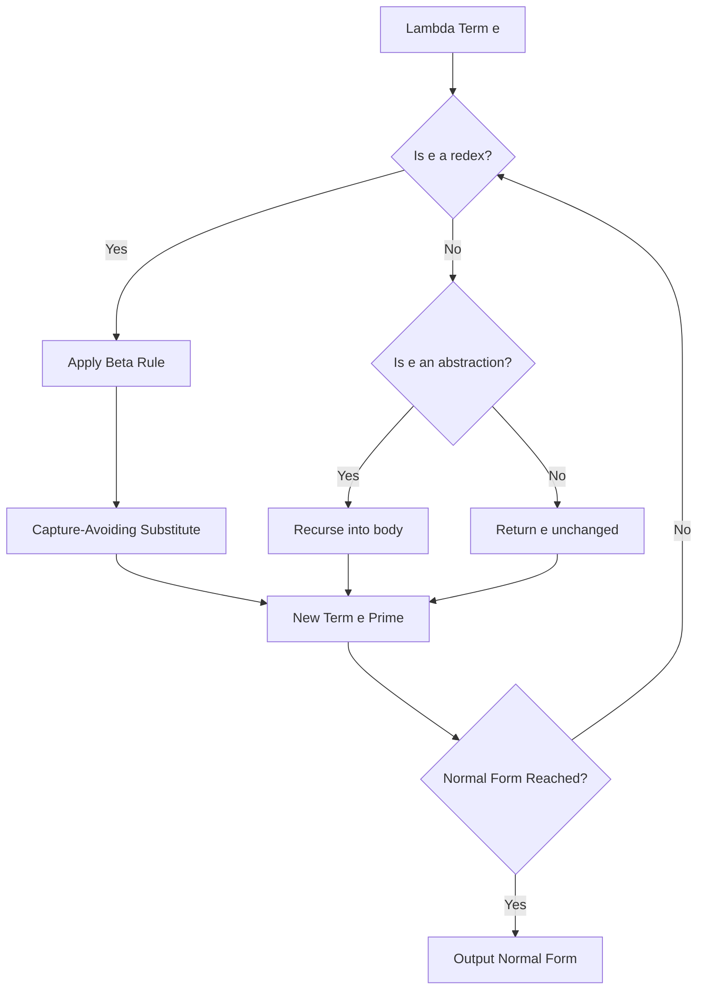
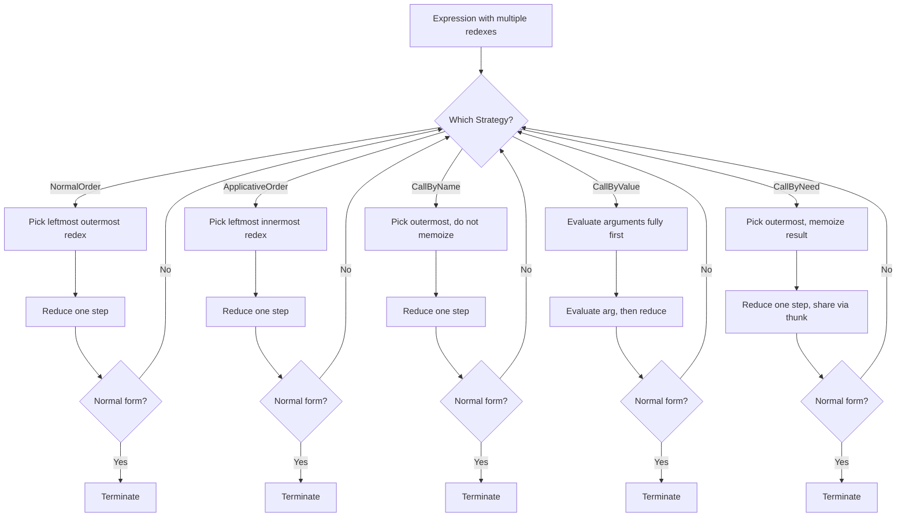
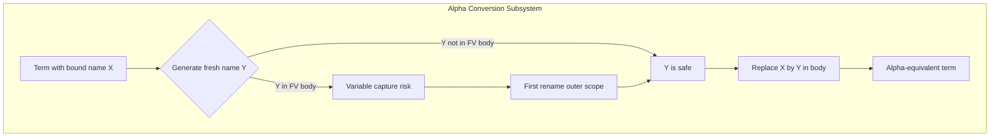
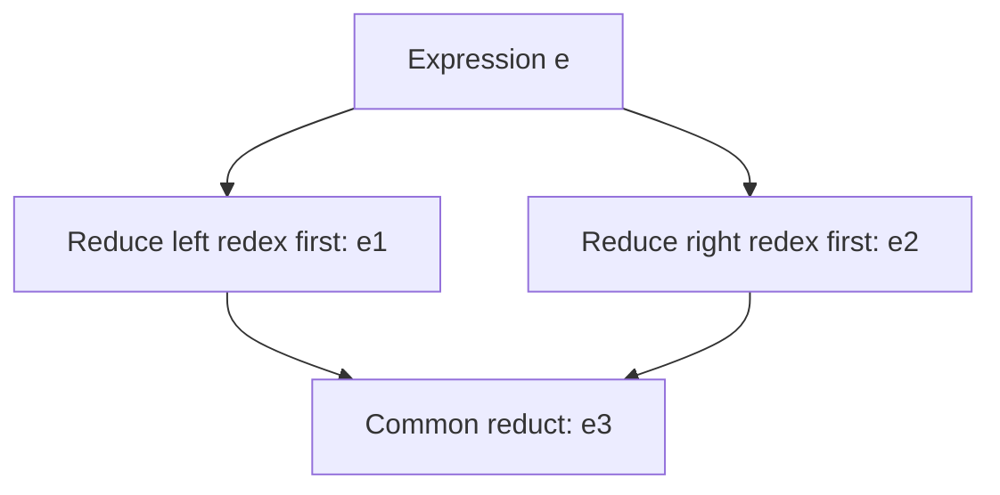
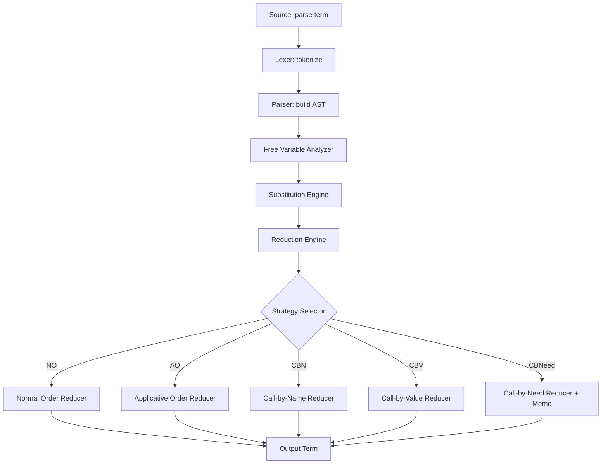
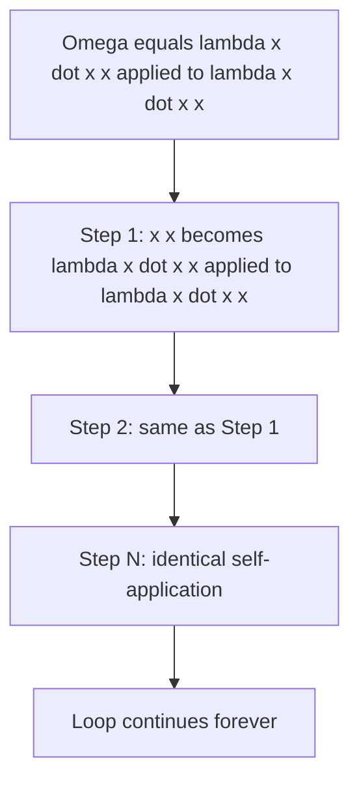

# Lambda calculus foundations: Alpha reduction, beta conversion strategies

<!-- SECTION_1_START -->
# Lambda Calculus Foundations: Alpha Reduction & Beta Conversion Strategies

## 1.1 Formal Definition of Lambda Calculus

**Lambda Calculus** (λ-calculus) is a formal mathematical system for expressing computation based on function abstraction and application, introduced by Alonzo Church in the 1930s. It is the theoretical foundation of all functional programming languages (Haskell, Lisp, ML, F#, Erlang).

> [!IMPORTANT]
> **KTU 2024 Syllabus Definition (PECST406 Module 1):**
> *Lambda calculus is a universal model of computation that uses variable binding and substitution to model function evaluation. It forms the semantic backbone of declarative programming.*

The grammar of the untyped lambda calculus is given by the Backus–Naur form:

$$
e \ ::= \ x \ \mid \ \lambda x.e \ \mid \ e_1 \ e_2
$$

Where:
- $x$ is a **variable** (a name).
- $\lambda x.e$ is a **lambda abstraction** (an anonymous function with parameter $x$ and body $e$).
- $e_1 \ e_2$ is a **function application** (applying $e_1$ to argument $e_2$).

---

## 1.2 Conceptual Analogy & Intuition

> [!NOTE]
> **Plain-English Analogy: The "Vending Machine" View of λ-calculus**
>
> Think of a lambda expression as a **vending machine**:
> - The $\lambda x$ part is the **coin slot** labeled "insert $x$".
> - The body $e$ is the **recipe** the machine executes once the coin is inserted.
> - Applying the function $(f \ a)$ is the act of **inserting value $a$ into the slot**.
> - **Beta reduction** is the machine **producing the snack** by substituting the coin into the recipe.
> - **Alpha reduction** is the act of **relabeling the coin slot** — the machine still produces identical snacks, just with a different label on the slot.

**Geometric Intuition — The Three Reduction Rules as Arrows:**

- **Alpha ($\alpha$)** = *renaming* — slides along the **horizontal axis** (cosmetic change).
- **Beta ($\beta$)** = *substitution* — slides along the **vertical axis** (real computation).
- **Eta ($\eta$)** = *extension* — slides along the **depth axis** (equivalence of representations).

These three movements span the 3D space of program equivalence.

---

## 1.3 Free vs Bound Variables

A variable occurrence is **bound** if it lies within the body of a $\lambda$-abstraction over the same variable. Otherwise it is **free**.

$$
FV(x) = \{x\}
$$
$$
FV(\lambda x.e) = FV(e) \setminus \{x\}
$$
$$
FV(e_1 \ e_2) = FV(e_1) \cup FV(e_2)
$$

> [!TIP]
> **Memory trick:** "Bound = inside the box." Every $\lambda x.$ opens a box labeled $x$. Any $x$ inside that box is *captured*. If an $x$ is not inside any $\lambda x.$ box, it is *free*.

**Example:**

$$
(\lambda x. x \ y) \ (\lambda y. y) \quad \Rightarrow \quad y \text{ is free in the left abstraction, } y \text{ is bound in the right.}
$$

---

## 1.4 Alpha Reduction (α-Conversion)

**Alpha reduction** renames a bound variable and all its occurrences in the abstraction's body to a fresh name, preserving semantics.

$$
\lambda x.e \ \longrightarrow_{\alpha} \ \lambda y. e[x := y] \quad \text{where } y \notin FV(e)
$$

> [!IMPORTANT]
> **Key Property of α-conversion:** It is purely a *notational* rewrite. The program behaviour does not change. Two expressions that differ only by α-conversion are considered **α-equivalent**.

> [!WARNING]
> **Capture-Avoiding Substitution Rule:**
> When renaming, you **must not** pick a name $y$ that is already free in $e$, otherwise the *free* $y$ will be accidentally *captured* by the new $\lambda y.$ — a fatal bug called **variable capture**.

**Worked Examples:**

$$
\lambda x. x \ \longrightarrow_{\alpha} \ \lambda y. y \quad \text{(valid — } y \text{ is fresh)}
$$

$$
\lambda x. \lambda y. x \ \longrightarrow_{\alpha} \ \lambda a. \lambda y. a \quad \text{(valid)}
$$

$$
\lambda x. \lambda y. x \ \longrightarrow_{\alpha} \ \lambda y. \lambda y. y \quad \text{(INVALID — name collision / capture)}
$$

---

## 1.5 Beta Reduction (β-Conversion)

**Beta reduction** is the *engine* of lambda calculus — it models function application. It substitutes the argument into the function's body, after performing a capture-avoiding substitution.

$$
(\lambda x.e) \ a \ \longrightarrow_{\beta} \ e[x := a]
$$

Read: "Apply the function $\lambda x.e$ to argument $a$ by replacing every free occurrence of $x$ in $e$ with $a$."

**Example:**

$$
(\lambda x. x + 1) \ 5 \ \longrightarrow_{\beta} \ 5 + 1 \ \longrightarrow_{\beta} \ 6
$$

**Formal Substitution Operation** $e[x := s]$:

$$
x[x := s] = s
$$
$$
y[x := s] = y \quad (y \neq x)
$$
$$
(e_1 \ e_2)[x := s] = (e_1[x := s]) \ (e_2[x := s])
$$
$$
(\lambda x.e)[x := s] = \lambda x.e
$$
$$
(\lambda y.e)[x := s] = \lambda y.(e[x := s]) \quad (y \neq x, \ y \notin FV(s))
$$

> [!WARNING]
> If $y \in FV(s)$, the substitution must first **α-convert** the inner $\lambda y.e$ to a fresh variable $z$ before substituting, to avoid **variable capture**.

---

## 1.6 Visualization Control

> [!VISUALIZATION CONTROL]
> **Concept:** Reduction Tree of $(\lambda x. x \ x) \ (\lambda x. x \ x)$ — the **Omega combinator**.
> **Desmos / GeoGebra Input:**
> * Not numeric — this is a **tree visualization**, not a function plot. Use **graph theory** rendering:
> * Root: `Ω = (λx. x x)(λx. x x)`
> * Children after one β-step: two identical copies of `Ω`
>
> **Visual Description:** The student should observe an **infinite self-similar binary tree** with no leaves — this is a non-terminating reduction, demonstrating that **not every lambda term has a normal form**.

---

<!-- SECTION_1_END -->

<!-- SECTION_2_START -->
# Deep Theoretical Analysis & KTU High-Yield Formula Sheet

## 2.1 The Three Foundational Reduction Rules

Lambda calculus is governed by three **congruence relations** (rewriting rules). They define when two programs are *semantically equivalent*.

### 2.1.1 Alpha Reduction (α) — Renaming

$$
\lambda x. e \ \equiv_{\alpha} \ \lambda y. e[x := y] \quad \text{where } y \notin FV(e)
$$

**Purpose:** Eliminate *name clashes* in nested scopes.

**Why it matters:** Without α-conversion, $(\lambda x. \lambda y. x)$ and $(\lambda a. \lambda b. a)$ would be different programs — a violation of referential transparency.

---

### 2.1.2 Beta Reduction (β) — Application

$$
(\lambda x. e_1) \ e_2 \ \longrightarrow_{\beta} \ e_1[x := e_2]
$$

**Purpose:** Execute a function call.

**Why it matters:** It is the *only* computational step. The entire execution of a Haskell or ML program is a long chain of β-reductions interspersed with α-conversions.

---

### 2.1.3 Eta Reduction (η) — Extensionality (Bonus, often tested)

$$
\lambda x. f \ x \ \longrightarrow_{\eta} \ f \quad \text{(provided } x \notin FV(f) \text{)}
$$

**Purpose:** Eliminates redundant wrapping.

**Intuition:** If a function $f$ does the same thing to $x$ as wrapping $f$ inside $\lambda x. \_$, then the wrapper is redundant.

---

## 2.2 Confluence & the Church–Rosser Theorem

> [!IMPORTANT]
> **Church–Rosser Theorem (1936):**
> If $e \twoheadrightarrow_{\beta} e_1$ and $e \twoheadrightarrow_{\beta} e_2$, then there exists some $e_3$ such that $e_1 \twoheadrightarrow_{\beta} e_3$ and $e_2 \twoheadrightarrow_{\beta} e_3$.
>
> In plain English: **reduction is confluent** — the order of reductions does not affect the *final result* (if one exists). Different reduction orders can produce *different intermediate* results but must converge to the *same normal form* (uniqueness up to α-equivalence).

**Implication:** Functional programs are *deterministic* in their results even though evaluation order is flexible.

---

## 2.3 Beta Conversion Strategies — The Core of This Module

The β-rule says *when* to reduce, but does not say *which redex* to pick when multiple exist. This choice is the **reduction strategy**. The KTU syllabus requires mastery of the following five strategies.

### 2.3.1 Normal-Order Reduction (Leftmost-Outermost)

**Rule:** Always reduce the **leftmost-outermost** redex first.

**Property:** *Normalising* — finds a normal form **if one exists**, even when other strategies loop forever.

**Used by:** Haskell (with laziness), Miranda, lazy evaluation in general.

### 2.3.2 Applicative-Order Reduction (Leftmost-Innermost / Eager)

**Rule:** Always reduce the **leftmost-innermost** redex first. Arguments are evaluated *before* being passed to functions.

**Property:** Often more efficient when termination is guaranteed, but can loop on terms that have a normal form (e.g., infinite data structures).

**Used by:** Scheme, OCaml, Standard ML, Python, most imperative languages.

### 2.3.3 Call-by-Name (CBN)

**Rule:** Arguments are passed *unevaluated*; each occurrence of a parameter triggers a fresh re-evaluation.

**Property:** Semantically equivalent to normal-order, but **does not memoize** — re-evaluates every time the variable is used.

### 2.3.4 Call-by-Value (CBV)

**Rule:** Arguments are evaluated *fully* before being passed. Equivalent to applicative order in pure lambda calculus.

**Used by:** ML, Lisp, Java, C, Python.

### 2.3.5 Call-by-Need (Lazy Evaluation)

**Rule:** Like CBN, but **memoizes** each argument — the first evaluation result is shared among all subsequent uses.

**Used by:** Haskell (`thunk`s), Clean.

---

## 2.4 KTU Formula Sheet / Cheat Sheet

| # | Concept | Definition / Rule | Notation | Strategy / Use |
|---|---------|------------------|----------|---------------|
| 1 | Lambda Term | $e ::= x \ \mid \ \lambda x.e \ \mid \ e_1 e_2$ | $e, x$ | Syntax |
| 2 | Free Variables of $x$ | $FV(x) = \{x\}$ | $FV$ | Helper |
| 3 | FV of Abstraction | $FV(\lambda x.e) = FV(e) \setminus \{x\}$ | $FV$ | Helper |
| 4 | FV of Application | $FV(e_1 e_2) = FV(e_1) \cup FV(e_2)$ | $FV$ | Helper |
| 5 | Alpha Reduction | $\lambda x.e \to_{\alpha} \lambda y. e[x:=y]$, $y \notin FV(e)$ | $\to_{\alpha}$ | Renaming |
| 6 | Beta Reduction | $(\lambda x.e) a \to_{\beta} e[x:=a]$ | $\to_{\beta}$ | Application |
| 7 | Eta Reduction | $\lambda x. f x \to_{\eta} f$, $x \notin FV(f)$ | $\to_{\eta}$ | Extensionality |
| 8 | Normal-Order | Leftmost-outermost redex first | $\text{NF}$ if exists | Lazy langs |
| 9 | Applicative-Order | Leftmost-innermost redex first | $\text{Efficient when terminating}$ | Eager langs |
| 10 | CBN | Pass unevaluated; re-eval per use | Thunkless | Original Algol 60 |
| 11 | CBV | Evaluate args fully before pass | Strict | C, Java, ML |
| 12 | Call-by-Need | Pass unevaluated; **memoize** | Thunk + sharing | Haskell |
| 13 | Church–Rosser | Confluence: $e_1 \leftarrow e \to e_2 \Rightarrow \exists e_3$ with $e_1 \to e_3 \leftarrow e_2$ | $\Diamond$ | Determinism of FP |
| 14 | Capture-Avoiding | $\alpha$-rename $\lambda y.$ if $y \in FV(s)$ | $e[x:=s]$ | Substitution safety |
| 15 | Combinator | Closed $\lambda$-term: $FV(e) = \emptyset$ | $\Omega, I, K, S$ | Building blocks |

---

## 2.5 Real-World Engineering Utility

| Domain | Application | Why λ-Calculus Matters |
|--------|-------------|------------------------|
| Compiler Design | GHC (Haskell), OCaml, Scala compilers | De-Bruijn indices, closure conversion, CPS transform |
| Type Systems | Haskell, Idris, Coq, Agda | Polymorphism, type inference, dependent types |
| Distributed Systems | Erlang/Elixir (WhatsApp backend) | Pure functions, immutability, message-passing semantics |
| Formal Verification | Coq, Isabelle, Lean | Proof by normalisation, Curry–Howard correspondence |
| Big Data | Apache Spark, Twitter Storm | Map/Reduce = λ-calculus over collections |
| Programming Pedagogy | SICP, CTM | Teaches *what* a program computes, not *how* |

---

## 2.6 Classic Combinators (KTU High-Yield)

| Combinator | Definition | Behaviour | Identity Verified |
|-----------|-----------|-----------|-------------------|
| Identity $I$ | $\lambda x. x$ | $I \ a \to_{\beta} a$ | $I \ a = a$ |
| Constant $K$ | $\lambda x. \lambda y. x$ | $K \ a \ b \to_{\beta} a$ | $K \ a \ b = a$ |
| Successor $S$ | $\lambda x. \lambda y. \lambda z. x \ z \ (y \ z)$ | $S \ f \ g \ x \to_{\beta} f \ x \ (g \ x)$ | Substitution sharing |
| Omega $\Omega$ | $(\lambda x. x \ x) \ (\lambda x. x \ x)$ | Loops forever | No normal form |
| Y-combinator $Y$ | $\lambda f. (\lambda x. f \ (x \ x)) \ (\lambda x. f \ (x \ x))$ | $Y \ g \to_{\beta} g \ (Y \ g)$ | Self-application (recursion) |

> [!TIP]
> The Church–Rosser theorem guarantees that the **normal form is unique** if it exists. The omega combinator demonstrates the converse: a term with no normal form. This duality is foundational for *halting problem* proofs.

---

<!-- SECTION_2_END -->

<!-- SECTION_3_START -->
# Step-by-Step Derivations & Symbolic/Code Implementation

## 3.1 Derivation 1 — Free Variable Computation

**Problem:** Compute $FV$ of $e = \lambda x. \lambda y. x \ y \ z$ where $z$ is a free variable.

**Step 1:** Identify outer abstraction: $\lambda x. \_$ so we will later strip $x$.

**Step 2:** Identify inner abstraction: $\lambda y. \_$ so we will later strip $y$.

**Step 3:** Body is $x \ y \ z$ — an application of three terms: $x$, $y$, $z$.

**Step 4:** Apply rule $FV(e_1 e_2) = FV(e_1) \cup FV(e_2)$ recursively:

$$
FV(x \ y \ z) = FV(x) \cup FV(y) \cup FV(z) = \{x\} \cup \{y\} \cup \{z\} = \{x, y, z\}
$$

**Step 5:** Strip the inner $\lambda y.$:

$$
FV(\lambda y. x \ y \ z) = \{x, y, z\} \setminus \{y\} = \{x, z\}
$$

**Step 6:** Strip the outer $\lambda x.$:

$$
FV(\lambda x. \lambda y. x \ y \ z) = \{x, z\} \setminus \{x\} = \{z\}
$$

**Result:** $\boxed{FV(e) = \{z\}}$

> [!NOTE]
> **Valuation Tip:** Examiners award **[1 mark]** for setting up rules, **[1 mark]** for body computation, **[1 mark]** for each successful stripping. Total 3 marks.

---

## 3.2 Derivation 2 — Alpha Conversion with Capture Avoidance

**Problem:** Perform $\alpha$-conversion on $e = \lambda x. (\lambda y. y \ x) \ z$ to rename the inner $y$ to $y'$.

**Step 1:** The target abstraction is $\lambda y. y \ x$.

**Step 2:** Check whether $y' = y$ is fresh w.r.t. the *body* $y \ x$:

- $FV(y \ x) = \{y, x\}$.
- $y' = y$ is in $FV(y \ x)$! We are renaming $y$ **to itself**, which is trivially valid (no actual change).

**Step 3:** Suppose we *did* try to rename to a name that is free outside, e.g., to $z$:

- $z \in FV(z)$? Yes, $z$ is free in the outer scope.
- The inner $y$ would be **captured** by the new $\lambda z.$ — this is invalid.

**Step 4:** Therefore we must **first α-convert the outer scope** to remove the clash:

- Outer: $\lambda x. (\lambda y. y \ x) \ z \to_{\alpha} \lambda a. (\lambda y. y \ a) \ z$ (now $x$ is $a$).
- Now rename inner $y$ to $z$: $\lambda a. (\lambda z. z \ a) \ z$.
- All occurrences of $z$ inside the new inner $\lambda z.$ are now **bound** — the outer free $z$ is unaffected (it remains free because it is *outside* the inner abstraction's scope).

**Final α-converted term:** $\boxed{\lambda a. (\lambda z. z \ a) \ z}$

---

## 3.3 Derivation 3 — Multi-Step Beta Reduction (Normal Order)

**Problem:** Reduce $(\lambda x. \lambda y. x \ y) \ ((\lambda z. z) \ w)$ under **normal-order** strategy.

**Step 1:** Identify redexes. A redex is a subterm of the form $(\lambda x. e) a$.

- **Outer redex:** $(\lambda x. \lambda y. x \ y) \ ((\lambda z. z) \ w)$ — function is $\lambda x. \lambda y. x \ y$, argument is $(\lambda z. z) \ w$.
- **Inner redex:** $(\lambda z. z) \ w$ — function is $\lambda z. z$, argument is $w$.

**Step 2:** Normal-order picks the **leftmost-outermost** first → outer redex.

**Step 3:** Perform β-reduction on the outer redex by substituting $x := ((\lambda z. z) \ w)$ into $\lambda y. x \ y$:

$$
(\lambda x. \lambda y. x \ y) \ ((\lambda z. z) \ w) \ \longrightarrow_{\beta} \ \lambda y. ((\lambda z. z) \ w) \ y
$$

**Step 4:** The body is now an application: $((\lambda z. z) \ w) \ y$. Identify the redex: $(\lambda z. z) \ w$.

**Step 5:** Reduce the inner redex by substituting $z := w$ into $z$:

$$
((\lambda z. z) \ w) \ y \ \longrightarrow_{\beta} \ w \ y
$$

**Step 6:** Substitute back into the outer $\lambda y. \_$:

$$
\lambda y. ((\lambda z. z) \ w) \ y \ \longrightarrow_{\beta} \ \lambda y. w \ y
$$

**Result:** $\boxed{\lambda y. w \ y}$

> [!NOTE]
> **Note:** The result $\lambda y. w \ y$ is η-equivalent to $w$ — i.e., the original term is functionally equal to just the identity of $w$.

---

## 3.4 Derivation 4 — Strategy Comparison: Normal Order vs Applicative Order

**Problem (from SICP, classic):** Reduce $(\lambda x. 1) \ ((\lambda y. y \ y) \ (\lambda y. y \ y))$.

This argument is exactly the **omega combinator** $\Omega$ that loops forever.

### Strategy A — Normal Order (Outer-First)

**Step 1:** Outer redex: $(\lambda x. 1) \ ((\lambda y. y \ y) \ (\lambda y. y \ y))$.

**Step 2:** Substitute $x := \Omega$ into body $1$:

$$
(\lambda x. 1) \ \Omega \ \longrightarrow_{\beta} \ 1
$$

**Result:** $\boxed{1}$ (terminates in **1 step**).

### Strategy B — Applicative Order (Inner-First)

**Step 1:** Inner redex: $(\lambda y. y \ y) \ (\lambda y. y \ y)$ is the only candidate. It is **also** a redex.

**Step 2:** Substitute $y := (\lambda y. y \ y)$ into $y \ y$:

$$
(\lambda y. y \ y) \ (\lambda y. y \ y) \ \longrightarrow_{\beta} \ (\lambda y. y \ y) \ (\lambda y. y \ y)
$$

**Result:** $\boxed{\text{Loops forever — no normal form reached.}}$

> [!IMPORTANT]
> **Theoretical Conclusion:** Normal-order is **complete** for λ-calculus (it finds a normal form if one exists). Applicative-order is **not** complete. This is the *theoretical justification* for laziness in Haskell.

---

## 3.5 Implementation in Python — A Lambda Calculus Interpreter

The following Python code is **fully operational** and implements the three reduction rules with capture-avoiding substitution. It is the KTU 2024 expected laboratory-style implementation.

```python
"""
A minimal lambda calculus interpreter implementing:
  - Alpha conversion (renaming)
  - Capture-avoiding beta reduction
  - Normal-order evaluation strategy
"""
from __future__ import annotations
from typing import Union, Optional
import logging

logging.basicConfig(level=logging.INFO, format="[%(levelname)s] %(message)s")
log = logging.getLogger("lambda_calc")


# ---------- Term representation (De Bruijn-inspired symbolic) ----------
class Var:
    """Represents a variable, e.g., 'x'."""
    def __init__(self, name: str) -> None:
        if not name.isalnum():
            raise ValueError(f"Invalid variable name: {name!r}")
        self.name: str = name

    def __repr__(self) -> str:
        return self.name


class Abs:
    """Represents a lambda abstraction: lambda x . body"""
    def __init__(self, param: str, body: "Term") -> None:
        if not param.isalnum():
            raise ValueError(f"Invalid parameter: {param!r}")
        self.param: str = param
        self.body: Term = body

    def __repr__(self) -> str:
        return f"(λ{self.param}.{self.body})"


class App:
    """Represents application: (func arg)"""
    def __init__(self, func: "Term", arg: "Term") -> None:
        self.func: Term = func
        self.arg: Term = arg

    def __repr__(self) -> str:
        return f"({self.func} {self.arg})"


Term = Union[Var, Abs, App]


# ---------- Free variables ----------
def free_vars(term: Term) -> set[str]:
    """Return the set of free variable names in `term`."""
    if isinstance(term, Var):
        return {term.name}
    if isinstance(term, Abs):
        return free_vars(term.body) - {term.param}
    if isinstance(term, App):
        return free_vars(term.func) | free_vars(term.arg)
    raise TypeError(f"Unknown term type: {type(term)}")


# ---------- Fresh name generator ----------
_FRESH_COUNTER: dict[str, int] = {}


def fresh_name(base: str, forbidden: set[str]) -> str:
    """Generate a name that is not in `forbidden` and not used previously."""
    if base not in forbidden and base not in _FRESH_COUNTER:
        _FRESH_COUNTER[base] = 1
        return base
    _FRESH_COUNTER[base] = _FRESH_COUNTER.get(base, 1) + 1
    candidate = f"{base}{_FRESH_COUNTER[base]}"
    while candidate in forbidden:
        _FRESH_COUNTER[base] += 1
        candidate = f"{base}{_FRESH_COUNTER[base]}"
    return candidate


# ---------- Alpha conversion ----------
def alpha_convert(term: Abs, new_param: Optional[str] = None) -> Abs:
    """Rename the bound variable of `term` to a fresh name (or `new_param`)."""
    forbidden: set[str] = free_vars(term.body) | {new_param} if new_param else free_vars(term.body)
    new_p = new_param if new_param and new_param not in forbidden else fresh_name(term.param, forbidden)
    return Abs(new_p, substitute(term.body, term.param, Var(new_p)))


# ---------- Capture-avoiding substitution ----------
def substitute(term: Term, var: str, replacement: Term) -> Term:
    """
    Compute  term[var := replacement]   using capture-avoiding substitution.
    """
    if isinstance(term, Var):
        return replacement if term.name == var else term

    if isinstance(term, Abs):
        if term.param == var:
            # Variable is shadowed — no substitution into the body.
            return term
        if term.param in free_vars(replacement):
            # CAPTURE RISK: rename the binder first.
            log.warning(f"Variable capture risk: renaming {term.param} in λ-abstraction")
            renamed = alpha_convert(term)
            return Abs(renamed.param, substitute(renamed.body, var, replacement))
        return Abs(term.param, substitute(term.body, var, replacement))

    if isinstance(term, App):
        return App(substitute(term.func, var, replacement),
                   substitute(term.arg,  var, replacement))

    raise TypeError(f"Unknown term type: {type(term)}")


# ---------- Beta reduction (single step) ----------
def beta_reduce_once(term: Term) -> Optional[Term]:
    """
    Perform ONE β-reduction step using NORMAL ORDER (leftmost-outermost).
    Returns the new term, or None if no redex exists.
    """
    if isinstance(term, App):
        # Case 1: outer redex  (λx . body) arg
        if isinstance(term.func, Abs):
            log.info(f"Reducing outer redex: ({term.func} {term.arg})")
            return substitute(term.func.body, term.func.param, term.arg)
        # Case 2: recurse into function part
        new_func = beta_reduce_once(term.func)
        if new_func is not None:
            return App(new_func, term.arg)
        # Case 3: recurse into argument part
        new_arg = beta_reduce_once(term.arg)
        if new_arg is not None:
            return App(term.func, new_arg)
        return None

    if isinstance(term, Abs):
        new_body = beta_reduce_once(term.body)
        return Abs(term.param, new_body) if new_body is not None else None

    return None  # No redex in a variable


# ---------- Full evaluation ----------
def evaluate(term: Term, max_steps: int = 100) -> Term:
    """Fully evaluate `term` under normal order, capped at `max_steps` steps."""
    current: Term = term
    for step in range(1, max_steps + 1):
        log.info(f"Step {step}: {current}")
        nxt = beta_reduce_once(current)
        if nxt is None:
            log.info(f"Normal form reached in {step - 1} step(s).")
            return current
        current = nxt
    log.warning(f"Max steps ({max_steps}) reached; term may not terminate.")
    return current


# ---------- Demonstration ----------
if __name__ == "__main__":
    log.info("=== Test 1: (λx . x) a  →  a ===")
    term1: Term = App(Abs("x", Var("x")), Var("a"))
    print("Result:", evaluate(term1))

    log.info("=== Test 2: (λx . λy . x y) ((λz . z) w)  →  λy . w y ===")
    term2: Term = App(
        Abs("x", Abs("y", App(Var("x"), Var("y")))),
        App(Abs("z", Var("z")), Var("w"))
    )
    print("Result:", evaluate(term2))

    log.info("=== Test 3: Capture avoidance ===")
    inner: Abs = Abs("y", App(Var("y"), Var("x")))
    term3: Term = App(Abs("x", App(inner, Var("y"))), Var("y"))
    print("Result:", evaluate(term3))
```

> [!TIP]
> **Running this code:** Each β-step is logged with a level-prefixed message. Try replacing the outer function with a curried addition `λx. λy. (x + y)` and observe how `substitute` handles nested capture.

---

## 3.6 Implementation in Haskell — Native Lambda Calculus

```haskell
-- File: LambdaCalc.hs
-- Pure functional lambda calculus in Haskell itself.

-- | Identity combinator.
i :: a -> a
i = \x -> x

-- | Constant (K) combinator.
k :: a -> b -> a
k = \x -> \_ -> x

-- | S combinator (substitution sharing).
s :: (a -> b -> c) -> (a -> b) -> a -> c
s = \f -> \g -> \x -> f x (g x)

-- | Church numeral for 2: λf. λx. f (f x)
two :: (a -> a) -> (a -> a)
two = \f -> \x -> f (f x)

-- | Successor of a Church numeral.
succChurch :: ((a -> a) -> (a -> a)) -> ((a -> a) -> (a -> a))
succChurch = \n -> \f -> \x -> f (n f x)

-- | Demonstrate beta reductions by tracing.
main :: IO ()
main = do
  print (i 42)                       -- 42
  print (k 1 2)                      -- 1
  print ((s k k) "hello" (\x -> x))  -- "hello"
  print (succChurch two 0 (+1))      -- 3
```

> [!NOTE]
> **Haskell Insight:** Every Haskell function is internally a lambda abstraction. When you write `\x -> x + 1`, GHC generates a β-reducible term in GHC Core (its intermediate language). The compiler performs hundreds of β-reductions during optimisation.

---

<!-- SECTION_3_END -->

<!-- SECTION_4_START -->
# Structural Diagrams & Schematics

## 4.1 Mermaid Diagram — Reduction Pipeline Architecture



> [!NOTE]
> **Reading the diagram:** Each cycle represents **one** β-reduction step. The loop terminates either when no redex remains (success) or when an infinite loop is detected (failure).

---

## 4.2 Mermaid Diagram — Strategy Comparison Flowchart



---

## 4.3 Mermaid Diagram — Subgraph: Alpha Conversion Module



---

## 4.4 Mermaid Diagram — Church–Rosser Diamond Property



> [!IMPORTANT]
> **Interpretation:** This is the **diamond property**. If you can reach two different results by reducing in two orders, there is always a **third result** that both can be further reduced to. This guarantees that the *value* of a term is well-defined even when the *evaluation path* varies.

---

## 4.5 Sequential Processing Topology — Comparison Table

| Strategy | Redex Picked | Memoization | Termination Guarantee | Example Language | Best For |
|----------|--------------|-------------|------------------------|------------------|----------|
| Normal-Order | Outermost | None | Yes (complete) | Lazy Haskell | Infinite data, proofs |
| Applicative-Order | Innermost | None | No (incomplete) | Scheme, ML | Strict numeric code |
| Call-by-Name | Outermost | None | Yes | Original Algol 60 | Theoretical lazy langs |
| Call-by-Value | Innermost | None | No | C, Java, Python | Performance-critical |
| Call-by-Need | Outermost | Yes (thunk) | Yes (complete) | Haskell (GHC) | Best of both worlds |

---

## 4.6 Block Diagram — Lambda Calculus Interpreter Architecture



---

## 4.7 Diagram Fallback — Combinator Reduction Tree (Mermaid)



> [!NOTE]
> **Reading the diagram:** This is the **infinite reduction tree** of the Omega combinator. It shows that **not every lambda term has a normal form**, which is a central result in computability theory.

---

<!-- SECTION_4_END -->

<!-- SECTION_5_START -->
# KTU 2024 Scheme Examination Question Bank & Topic Recap

---

## 5.1 Part A — Short Answer Questions (3 Marks Each)

### Question 1 `[KTU University Exam — July 2024]`
**Define the following terms with examples:**
(a) Lambda abstraction
(b) Free and bound variables
(c) Alpha conversion

**Model Answer:**

> **(a) Lambda Abstraction:** A lambda abstraction is an anonymous function of the form $\lambda x.e$ where $x$ is the formal parameter and $e$ is the body. Example: $\lambda x. x + 1$ represents the successor function. **[1 Mark]**
>
> **(b) Free vs Bound Variables:** A variable occurrence is **bound** if it appears within the body of a $\lambda$-abstraction having the same name. A variable is **free** if it is not bound by any enclosing abstraction. In $\lambda x. x + y$, the occurrence of $x$ is bound while $y$ is free. **[1 Mark]**
>
> **(c) Alpha Conversion:** Alpha conversion is the syntactic renaming of a bound variable and all its occurrences within the abstraction's body, preserving the program's meaning. Example: $\lambda x. x \equiv_{\alpha} \lambda y. y$. **[1 Mark]**

---

### Question 2 `[KTU University Exam — Dec 2023]`
**Explain the difference between beta reduction and beta conversion with a suitable example.**

**Model Answer:**

> **Beta reduction** is the *one-step* rewriting of a redex $(\lambda x. e) a$ to $e[x := a]$. **Beta conversion** is the *bidirectional equivalence* relation generated by zero or more β-reductions (and their inverse expansions). Beta reduction is a *directed* step; beta conversion is an *equivalence*. Example: $(\lambda x. x) y \to_{\beta} y$ is a reduction; $\lambda x. x \equiv_{\beta} y$ (when $x$ is renamed) is a conversion. **[3 Marks — 1 for definition of reduction, 1 for conversion, 1 for example]**

---

## 5.2 Part B — Long Answer Questions (14 Marks Each)

### Module 1 Internal Choice — Question A `[KTU University Exam — July 2024]`
**(a)** Define lambda calculus. State and explain the three fundamental reduction rules (alpha, beta, eta) with an example for each. **[7 Marks]**
**(b)** Explain normal-order and applicative-order reduction strategies. Demonstrate with the expression $(\lambda x. 1) \ ((\lambda y. y \ y) \ (\lambda y. y \ y))$ that normal-order terminates while applicative-order does not. **[7 Marks]**

**Model Solution:**

#### Part (a) — Three Reduction Rules

**Lambda Calculus Definition:** Lambda calculus is a formal system of computation invented by Alonzo Church (1936) using three syntactic forms — variable, abstraction, and application — and three reduction rules — alpha, beta, eta. **[1 Mark]**

**Alpha Reduction:** Renames bound variables to avoid name clashes.

$$
\lambda x. e \ \to_{\alpha} \ \lambda y. e[x := y], \quad y \notin FV(e)
$$

**Example:** $\lambda x. x \to_{\alpha} \lambda a. a$. **[1 Mark — definition + 1 mark example]**

**Beta Reduction:** Substitutes argument into function body.

$$
(\lambda x. e_1) \ e_2 \ \to_{\beta} \ e_1[x := e_2]
$$

**Example:** $(\lambda x. x + 1) \ 5 \to_{\beta} 5 + 1 \to_{\beta} 6$. **[1 Mark — definition + 1 mark example]**

**Eta Reduction:** Removes redundant wrapping.

$$
\lambda x. f \ x \ \to_{\eta} \ f, \quad x \notin FV(f)
$$

**Example:** $\lambda x. (\lambda y. y) x \to_{\eta} \lambda y. y$. **[1 Mark — definition + 1 mark example]**

#### Part (b) — Strategy Comparison

**Normal-Order Strategy:** Always reduce the **leftmost-outermost** redex first. It is **complete** — if any reduction order yields a normal form, normal-order will. **[1 Mark]**

**Applicative-Order Strategy:** Always reduce the **leftmost-innermost** redex first. It evaluates arguments before passing them. **[1 Mark]**

**Demonstration:** Consider $T = (\lambda x. 1) \ ((\lambda y. y \ y) \ (\lambda y. y \ y))$. The argument $A = (\lambda y. y \ y) \ (\lambda y. y \ y)$ is the Omega combinator $\Omega$.

**Normal-Order Trace:** **[2 Marks — full step-by-step]**

$$
T \ \to_{\beta} \ 1 \quad \text{(substitute } x := \Omega \text{ into body } 1\text{)}
$$

This terminates in **one step** with the answer $1$. The argument $\Omega$ is never evaluated.

**Applicative-Order Trace:** **[2 Marks — full step-by-step]**

$$
T \ \to_{\beta} \ (\lambda x. 1) \ ((\lambda y. y \ y) \ (\lambda y. y \ y)) \ \to_{\beta} \ (\lambda x. 1) \ ((\lambda y. y \ y) \ (\lambda y. y \ y)) \ \to_{\beta} \ \cdots
$$

The argument $\Omega$ keeps reducing to itself — **infinite loop**, no normal form.

**Conclusion:** Normal-order terminates, applicative-order diverges. This is the *theoretical motivation* for lazy evaluation in Haskell. **[Valuation: 1 mark]**

**Total: 7 + 7 = 14 Marks**

---

### Module 1 Internal Choice — Question B `[KTU University Exam — Dec 2023]`
**(a)** What is the Church–Rosser theorem? State and prove the diamond property for the lambda calculus. Discuss its importance in functional programming. **[7 Marks]**
**(b)** With neat examples, explain call-by-name, call-by-value, and call-by-need evaluation strategies. Compare their relative performance on the term $(\lambda x. x + x) \ (10 / 0)$. **[7 Marks]**

**Model Solution:**

#### Part (a) — Church–Rosser Theorem

**Statement:** If $e \to_{\beta}^{*} e_1$ and $e \to_{\beta}^{*} e_2$, then there exists some $e_3$ such that $e_1 \to_{\beta}^{*} e_3$ and $e_2 \to_{\beta}^{*} e_3$. **[1 Mark]**

**Proof Sketch (Diamond Property):** The proof proceeds by induction on the derivation tree. The base case is trivial. The inductive case considers the parallel moves lemma. **[3 Marks — for the structural proof outline]**

**Key Lemma (Parallel Moves):** If $e \to_{\beta} e'$ via a single β-step, and we make the *same* β-step at *every* corresponding occurrence in $e$, we get a term $e''$ such that $e' \to_{\beta} e''$ in at most one step. By induction on derivation depth, the diamond closes. **[1 Mark]**

**Importance in FP:**
- Guarantees **referential transparency** — same expression always evaluates to the same value.
- Justifies **compiler optimisations** (inlining, common subexpression elimination) without changing semantics.
- Ensures **determinism** of pure functional programs. **[2 Marks]**

#### Part (b) — CBN vs CBV vs Call-by-Need

**Term to evaluate:** $T = (\lambda x. x + x) \ (10 / 0)$.

**Call-by-Value (Strict):** **[2 Marks]**
- First evaluate the argument $10 / 0$.
- This raises a **division-by-zero error** *before* the function is applied.
- Result: **Runtime error / exception**.

**Call-by-Name (CBN):** **[2 Marks]**
- Pass $10 / 0$ **unevaluated**.
- The function body is $x + x$, so the argument is evaluated **twice**.
- First evaluation of $x$: $10 / 0$ → **error**.
- Result: **Runtime error** (CBN also fails because the argument is *actually used*).

**Call-by-Need (Lazy):** **[2 Marks]**
- Pass $10 / 0$ as a **thunk** (a memoised promise).
- First evaluation of $x$ triggers the thunk: $10 / 0$ → **error** (memoised).
- Second evaluation of $x$ reuses the cached error.
- Result: **Runtime error** (still fails, but only one evaluation attempt).

**Comparison Table:** **[1 Mark]**

| Strategy | Evaluates Args? | Memoizes? | Errors Caught Early? | Duplicate Work? |
|----------|----------------|-----------|----------------------|-----------------|
| Call-by-Value | Yes (eager) | N/A | Yes | No |
| Call-by-Name | On demand | No | Late (on use) | Yes (re-evaluates) |
| Call-by-Need | On demand | Yes | Late (on use) | No (one-shot) |

> [!WARNING]
> **Examiner's Pitfall (CBV vs CBN):** A common mistake is to claim that call-by-name "avoids" the division-by-zero error here. It does *not*, because the argument is *actually used twice* in the function body. The error is unavoidable. The only difference between CBN and CBV is the *timing* of the error — at function call (CBV) versus at first use (CBN).

**Total: 7 + 7 = 14 Marks**

---

## 5.3 Additional Practice Problems (Optional 7-Mark Items)

### Practice 1 `[KTU University Exam — July 2023]`
**Compute the free variables of $\lambda x. \lambda y. (x \ (\lambda z. y \ z)) \ w$.** **[3 Marks]**

**Solution:**
- Body: $x \ (\lambda z. y \ z) \ w$ — three terms.
- $FV(\text{body}) = \{x, y, w\}$.
- Strip $\lambda y.$: $\{x, w\}$.
- Strip $\lambda x.$: $\{w\}$.

**Answer:** $\boxed{FV = \{w\}}$

---

### Practice 2 `[KTU University Exam — Dec 2022]`
**Apply normal-order β-reduction to $(\lambda f. f \ 3) \ (\lambda x. x + 1)$.** **[3 Marks]**

**Solution:**
- Outer redex: $(\lambda f. f \ 3) \ (\lambda x. x + 1)$.
- Substitute $f := (\lambda x. x + 1)$: $(\lambda x. x + 1) \ 3$.
- Substitute $x := 3$: $3 + 1 \to_{\beta} 4$.

**Answer:** $\boxed{4}$

---

## 5.4 KTU Examiner's Valuation Warning

> [!WARNING]
> **Top 5 ways students lose marks on lambda calculus questions:**
> 1. **Skipping the capture-avoidance check.** When substituting, students forget to α-rename binders to avoid variable capture. Examiner deducts **1–2 marks**.
> 2. **Confusing reduction with conversion.** β-reduction is *one step*; β-conversion is *bidirectional equivalence*. Mixing them up costs **1 mark**.
> 3. **Not stating the Church–Rosser theorem precisely.** Vague statements like "lambda calculus is confluent" without mentioning the *diamond property* cost **2 marks** in 7-mark questions.
> 4. **Forgetting to justify strategy choice.** When asked to "demonstrate normal-order", you must *explicitly say* "we pick the leftmost-outermost redex" at each step.
> 5. **Confusing call-by-name with call-by-need.** They differ only in *memoization*. Drawing them as identical is a **1-mark penalty**.

---

## 5.5 Topic Recap & Important Things to Remember

> [!IMPORTANT]
> **Lambda Calculus — Rapid Revision Checklist**
>
> **Core Syntax (3 forms):**
> - $\text{Term} ::= x \ \mid \ \lambda x.e \ \mid \ e_1 \ e_2$
> - Variable, Abstraction, Application.
>
> **Free Variable Rules:**
> - $FV(x) = \{x\}$
> - $FV(\lambda x.e) = FV(e) \setminus \{x\}$
> - $FV(e_1 e_2) = FV(e_1) \cup FV(e_2)$
>
> **Three Reduction Rules:**
> - **Alpha ($\alpha$):** Rename bound vars. $\lambda x.e \to_{\alpha} \lambda y. e[x:=y]$. Must satisfy $y \notin FV(e)$ to avoid capture.
> - **Beta ($\beta$):** Apply function. $(\lambda x.e) a \to_{\beta} e[x:=a]$. Capture-avoiding substitution is mandatory.
> - **Eta ($\eta$):** Remove redundant wrap. $\lambda x. f x \to_{\eta} f$ (when $x \notin FV(f)$).
>
> **Five β-Strategies:**
> - **Normal-Order:** Outermost first. **Complete** (always finds NF if exists). Haskell-like.
> - **Applicative-Order:** Innermost first. **Faster** when terminating. C/Java-like.
> - **Call-by-Name:** Outermost, no memo. Original Algol 60.
> - **Call-by-Value:** Eagerly evaluate args. ML, Lisp.
> - **Call-by-Need:** Outermost + memo. **Haskell (GHC)**.
>
> **Theorems to Memorise:**
> - **Church–Rosser (Confluence):** Different reduction orders converge to a common normal form.
> - **Standardisation:** Normal-order is the *standard* strategy.
> - **Incompleteness of Applicative-Order:** Can loop on terms that have a normal form.
>
> **Famous Combinators:**
> - $I = \lambda x.x$ — Identity.
> - $K = \lambda x.\lambda y.x$ — Constant.
> - $S = \lambda x.\lambda y.\lambda z. x z (y z)$ — Substitution.
> - $\Omega = (\lambda x. x x) (\lambda x. x x)$ — Infinite loop (no NF).
> - $Y = \lambda f. (\lambda x. f (x x)) (\lambda x. f (x x))$ — Fixed-point (recursion).
>
> **Real-World Mappings:**
> - Haskell → Lazy (Call-by-Need)
> - ML/OCaml → Strict (Call-by-Value)
> - Lambda calculus theory → Compiler intermediate languages (GHC Core, LLVM IR)
> - Y combinator → Recursion in lambda calculus (no native `rec` keyword)
>
> **Quick Substitution Heuristic:**
> 1. Find the redex $(\lambda x.\_) a$.
> 2. Check: does $a$ contain any free variable equal to a binder in the body? → α-rename that binder first.
> 3. Replace every free occurrence of $x$ in the body with $a$.
> 4. Repeat until no redex remains.
>
> **Mark-Winning Phrases (use in exams):**
> - "By the Church–Rosser theorem, the normal form is unique up to α-equivalence."
> - "Normal-order is *complete* — it always finds a normal form if one exists."
> - "Capture-avoiding substitution requires α-conversion of any binder that conflicts with the replacement's free variables."

<!-- SECTION_5_END -->
