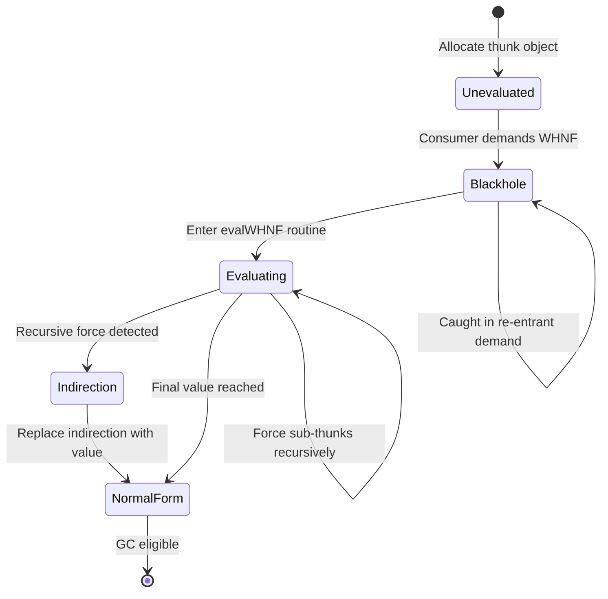
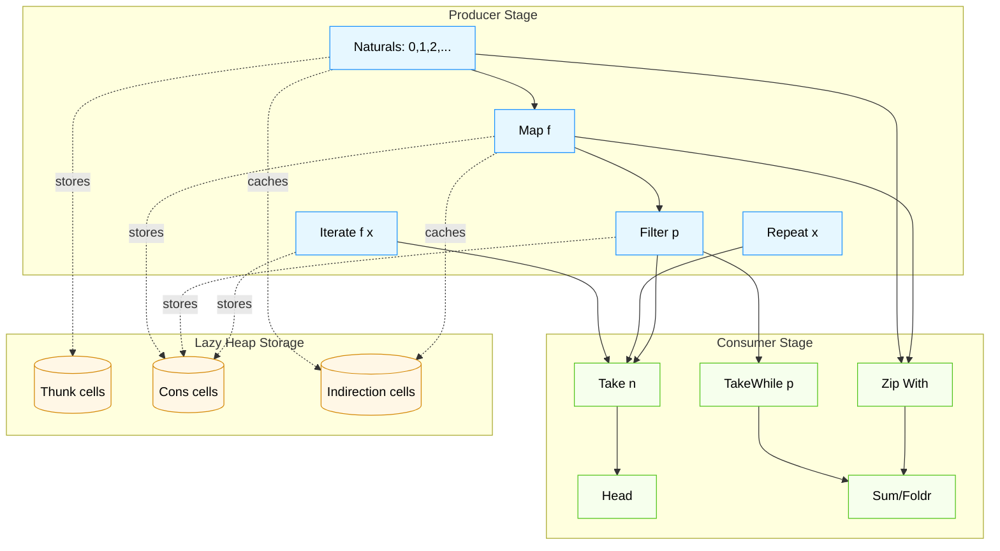
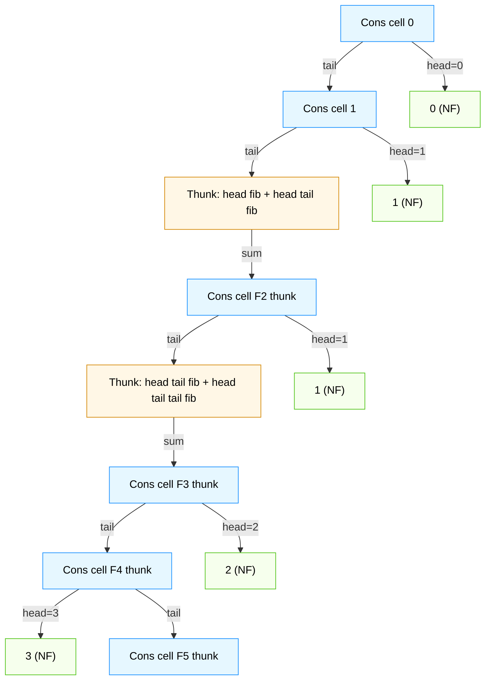
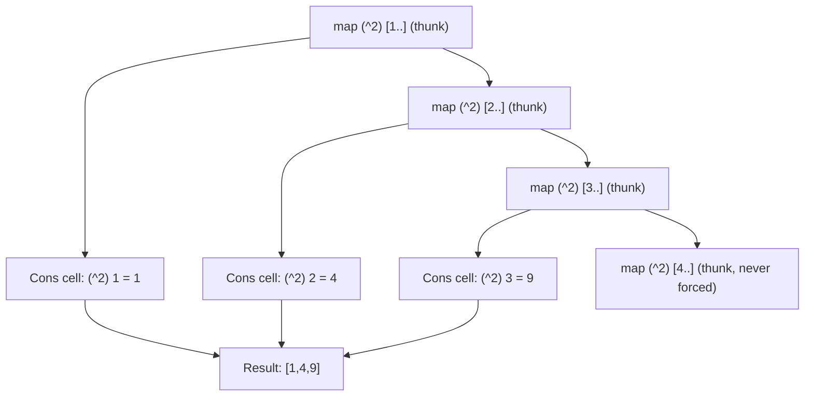

# Lazy evaluation models, infinite stream manipulation techniques using Haskell syntax structures

<!-- SECTION_1_START -->
# Lazy Evaluation Models & Infinite Stream Manipulation in Haskell

## 1.1 Formal Definition (KTU 2024 Syllabus Standard)

**Lazy Evaluation** (also termed *call-by-need* or *non-strict evaluation*) is a computational strategy in which expressions are not evaluated until their results are strictly required by some consuming function. The Haskell language — as standardized in the **Haskell 2010 Language Report** — adopts a *non-strict, purely functional* semantic core, enabling the manipulation of conceptually infinite data structures such as the list of all prime numbers, the Fibonacci sequence, or the Hamming numbers as ordinary, first-class values.

> [!NOTE]
> **KTU 2024 Scheme Definition (PECST406 / Module 2):**  
> *Lazy evaluation* is a programming language evaluation mechanism that delays the evaluation of an expression until its value is needed, and that records the evaluated result so it is computed at most once. When combined with *referential transparency* and *higher-order functions*, it enables the construction of *infinite lists* (called **streams**) that act as co-inductive data types and are evaluated only to the depth demanded by the consumer.

### 1.2 Conceptual Analogy — The "Restaurant Buffet" Metaphor

Imagine a huge, well-stocked buffet containing **every possible dish in the world** (an *infinite* menu). 

- In an **eager (strict)** restaurant, the chef cooks *every single dish* the moment you walk in, even dishes you will never touch. The kitchen overheats, runs out of gas, and the food spoils.
- In a **lazy (non-strict)** restaurant, the chef keeps the buffet in *recipe cards* (these are the **thunks**). The moment you point at a dish on your plate, the chef *cooks only that dish*, but remembers the result so if you point at it again, it is served instantly (this is **sharing**).

In this analogy:
- The **recipe card** is a *thunk* (an unevaluated expression wrapped in a suspension).
- The **cooked dish** is the *evaluated value* stored in a *heap object*.
- The **act of pointing at a plate** is a *forcing* or *whnf reduction* operation.
- The **notebook where the chef records the result** is the *indirection cell* that implements *call-by-need sharing*.

> [!IMPORTANT]
> **Three pillars of Haskell's laziness:**
> 1. **Non-strict semantics** — expressions can be left unevaluated inside data constructors.
> 2. **Referential transparency** — the same expression always yields the same value.
> 3. **Purity + sharing** — a thunk is evaluated *at most once*, even if referenced many times.

### 1.3 Visualization Control — Convergence to Weak Head Normal Form

> [!VISUALIZATION CONTROL]
> **Concept:** Evaluation as a stepwise descent toward *Weak Head Normal Form (WHNF)*.
> **Desmos Input Equations:** Plot the reduction depth $d$ on the $y$-axis against the *number of consumers* $c$ on the $x$-axis.
>
> * `d(c) = \min(c, L)` where $L$ is the bounded list length demanded.
> * `cost(c) = c \cdot \alpha + (L - c) \cdot \beta` (work vs. laziness trade-off).
>
> **Visual Description:** The student should observe a *piecewise-linear* curve: evaluation effort is *linear in the number of forced cells*, *flat* (zero slope) for unforced tails, and *bounded* by a horizontal asymptote corresponding to the demanded prefix length. This graphically shows why infinite streams are feasible in Haskell but are impossible under strict evaluation without explicit coroutine machinery.

<!-- SECTION_1_END -->

<!-- SECTION_2_START -->
# Deep Theoretical Analysis & KTU High-Yield Formula Sheet

## 2.1 The Lazy Evaluation Machine — Internal Mechanics

### 2.1.1 Thunks, Indirections, and the Heap

When the Haskell compiler (GHC) compiles the expression `1 + 2`, it does not produce the value `3` immediately. Instead, it allocates a *heap object* called a **thunk** — a tiny record containing:

1. A *code pointer* to the function `(+)` applied to arguments `1` and `2`.
2. A *tag* indicating its current state: `Unevaluated`, `Black-hole` (currently being evaluated), or `Indirection` (a pointer to the evaluated result).

When a consumer pattern-matches against this value (e.g., via `case x of n -> ...`), the runtime enters a routine called **`evalWHNF`** that recursively forces the thunk. The result is cached in the heap. Any *subsequent* reference to the same thunk finds the *indirection* and returns the cached value in **$O(1)$** time.

> [!NOTE]
> **WHNF** = Weak Head Normal Form. A term is in WHNF when it is either a *data constructor* applied to zero or more *unevaluated* arguments, or a *lambda abstraction*. A *fully evaluated* term is in **NF** (Normal Form). Examples:
> * `1 + 2` is *not* in WHNF.
> * `Just (1 + 2)` *is* in WHNF (the outer constructor is exposed).
> * `Just 3` is in NF.

### 2.1.2 Graph Reduction

Haskell programs are compiled to an intermediate language called **STG (Spineless Tagless G-machine)** code. The STG machine performs **graph reduction** on the heap: every expression is a *node* in a directed acyclic graph (DAG), and evaluation traverses this graph, replacing sub-graphs with their normal forms. Because the same thunk is shared across all references, the entire program is a *let-recursive DAG*, and reduction respects the sharing topology.

### 2.1.3 Call-by-Name vs. Call-by-Need

| Model | Re-evaluates an unforced expression? | Result caching? |
|---|---|---|
| **Call-by-Value** (strict) | Forces eagerly at binding time | Yes |
| **Call-by-Name** (Algol 60) | Re-evaluates *every* reference | No |
| **Call-by-Need** (Haskell) | Evaluates *once* on first reference | Yes (memoized) |

Haskell uses **call-by-need**, which is a *memoized* variant of call-by-name.

## 2.2 Infinite Streams as Co-inductive Data

An **infinite stream** in Haskell is simply an *ordinary list whose tail constructor is itself unevaluated*. Because Haskell's data constructors are lazy, the recursive call inside the tail is *not forced* at construction time. The stream is a *co-inductive* object: a generator that *could* produce infinitely many values, but the runtime only computes the *finite prefix* demanded.

The canonical type, defined in `Data.Stream` (proposed in the *Stream Libraries* paper by Coutts, Leshchinskiy & Stewart, 2007) or in the popular `Stream` library by Wignes and Frogley, mirrors the standard list type but is often packaged with a *functor* or *applicative* interface for *effectful* streaming:

```haskell
data Stream f m r = Stream r (f (Stream f m r))  -- Producer
data ViewL s a  = EmptyL | ConsL a (s a)          -- Lazy view
```

For our module, the foundational pedagogical form is the **infinite Haskell list**:

```haskell
type Stream a = [a]   -- pedagogically, an infinite list IS a stream
```

> [!IMPORTANT]
> **KTU Insight — Why infinite lists are sound in Haskell:** The language's *denotational semantics* treats `data List a = Nil | Cons a (List a)` as a *least fixed-point* of the functor $F(X) = 1 + a \times X$. The *greatest fixed-point* is the co-inductive interpretation: an *infinite* (or *partial*) list. Haskell's non-strict semantics *blurs* the two, allowing the programmer to write co-inductive programs using inductive syntax.

## 2.3 The KTU High-Yield Formula Sheet

| Concept | Formal Property | Notation / Haskell Form | Engineering Use |
|---|---|---|---|
| **Strict function** | $f \perp = \perp$ | `f x = x \`seq\` ...` | Force I/O ordering, exception handling |
| **Non-strict function** | $f \perp$ may be defined | Default in Haskell | Data structure composition |
| **WHNF** | Constructor at the head | `case x of ...` | All pattern matching |
| **NF** | Fully evaluated | `deepseq x ()` | Strict benchmarking |
| **Thunk** | Suspended computation | `let t = expensive x in t + t` | Memoization |
| **Sharing** | Single evaluation per thunk | `let xs = [1..] in (sum xs, length xs)` | Performance |
| **Stream map** | $f^*(x_0, x_1, \ldots) = (f(x_0), f(x_1), \ldots)$ | `map f xs` | Pipeline transformation |
| **Stream filter** | $\text{filter}_p(x_0, x_1, \ldots) = (x_{i_0}, x_{i_1}, \ldots)$ where $p(x_{i_k}) = \text{True}$ | `filter p xs` | Selective extraction |
| **Stream zip** | $\text{zip}(a, b) = ((a_0, b_0), (a_1, b_1), \ldots)$ | `zipWith f xs ys` | Synchronous fusion |
| **Stream iterate** | $\text{iterate}(f, x) = (x, f(x), f(f(x)), \ldots)$ | `iterate f x` | Recurrence-based streams |
| **Stream repeat** | $\text{repeat}(x) = (x, x, x, \ldots)$ | `repeat x` | Constant generator |
| **Stream cycle** | $\text{cycle}(xs) = (x_0, \ldots, x_{n-1}, x_0, \ldots)$ | `cycle xs` | Periodic generation |
| **Take** prefix | $\text{take}(n, S) = (s_0, \ldots, s_{n-1})$ | `take n s` | Consumer-side bounding |
| **Foldr** on infinite | Defined when $f$ is lazy in tail | `foldr f z (repeat 1)` | Co-recursive aggregation |

> [!WARNING]
> **Common KTU Mistake:** Students often confuse `\vert` in table cells. In all rendered tables, use the word *where* or *such that* in prose; use `\mid` or `\vert` only inside LaTeX math environments.

## 2.4 Real-World Engineering Utility

Lazy stream manipulation is the *theoretical backbone* of modern dataflow systems:

1. **Compiler IR design (GHC's Core, LLVM)**: Thunks model *uncomputed expressions* enabling common subexpression elimination.
2. **Reactive stream processing (Akka Streams, ReactiveX)**: Producer-Consumer pipelines are direct descendants of Haskell's lazy lists.
3. **Data analytics (Apache Spark RDDs)**: `RDD.map` and `RDD.filter` are strict analogues of Haskell's `map` and `filter` on streams, but Spark adds *fault tolerance* via lineage — a *reified thunk graph*.
4. **Hardware description (Bluespec, Lava)**: Lazy lists model *time-varying signals*; the stream's head is "cycle $n$", its tail is "cycle $n+1$".
5. **Symbolic mathematics (Metafont, Sympy)**: Stream fusion enables generation of infinite polynomial series consumed lazily by a printer.

<!-- SECTION_2_END -->

<!-- SECTION_3_START -->
# Step-by-Step Derivations, Recurrences, and Haskell Implementations

## 3.1 The Foundational Infinite Stream Constructors

### 3.1.1 `iterate :: (a -> a) -> a -> [a]`

**Mathematical specification:**

$$
\text{iterate}(f, x) = [x, f(x), f^{2}(x), f^{3}(x), \ldots]
$$

**Haskell definition:**

```haskell
iterate :: (a -> a) -> a -> [a]
iterate f x = x : iterate f (f x)
```

**Step-by-step reduction of `take 4 (iterate (^2) 2)`:**

| Step | Heap State | Observation |
|---|---|---|
| 1 | `iterate (^2) 2` | Outer `(:)` constructor exposed — list in WHNF |
| 2 | `2 : iterate (^2) (2^2)` | `^2` is *not* forced on the tail — laziness! |
| 3 | `2 : 4 : iterate (^2) (4^2)` | Forced one more cell on demand |
| 4 | `2 : 4 : 16 : iterate (^2) (16^2)` | Third cell forced |
| 5 | `2 : 4 : 16 : 256 : []` | `take 4` constructs the terminating `[]` |

**The crucial point:** the tail thunk `iterate (^2) 65536` is *never built* in the heap, because `take 4` demanded exactly **$n = 4$** cells.

### 3.1.2 `repeat :: a -> [a]`

$$
\text{repeat}(x) = [x, x, x, \ldots] \quad \text{(a single thunk shared forever)}
$$

```haskell
repeat :: a -> [a]
repeat x = xs where xs = x : xs
```

**Reduction of `head (repeat 7)`:**
1. The runtime pattern-matches on `repeat 7`.
2. The outermost constructor is `(:)`, so WHNF is reached.
3. The head is `7` (a value), the tail is the thunk `xs` (a *circular* pointer to the original `Cons` cell).
4. `head` returns `7` without ever descending into the tail.

This is a **self-referential thunk graph** — sometimes called a *tying the knot* pattern. It is a *legitimate* finite heap representation of a conceptually infinite list, because every reference to `xs` in the tail hits the *same* indirection cell.

### 3.1.3 `cycle :: [a] -> [a]`

$$
\text{cycle}([x_0, \ldots, x_{n-1}]) = [x_0, x_1, \ldots, x_{n-1}, x_0, x_1, \ldots]
$$

```haskell
cycle :: [a] -> [a]
cycle []     = error "PreludeList.cycle: empty list"
cycle xs     = xs' where xs' = xs ++ xs'
```

**Note on complexity:** `cycle` uses `xs ++ xs'`, where `++` itself is lazy in its right argument. Hence, when we `take 10 (cycle [1,2,3])`, the runtime walks the first cycle's three elements, then begins the second cycle by re-entering `xs'`. The *unshared* `++` would be $O(n^2)$; the GHC implementation uses a *circular* trick internally to make it $O(1)$ per take.

## 3.2 Recurrence-Driven Streams

### 3.2.1 The Natural Numbers

$$
\mathbb{N} = [0, 1, 2, 3, 4, \ldots]
$$

```haskell
nats :: [Integer]
nats = [0..]
```

**Internal form (desugared):**

```haskell
nats = 0 : map (+1) nats
--  equivalently:
--  nats = iterate (+1) 0
```

**Verification — `take 5 nats` evaluates to `[0, 1, 2, 3, 4]`.**

### 3.2.2 The Fibonacci Stream

**Mathematical recurrence:**

$$
F_0 = 0, \quad F_1 = 1, \quad F_{n+2} = F_{n+1} + F_n
$$

**Haskell implementation (the classic "tying the knot" pattern):**

```haskell
fib :: [Integer]
fib = 0 : 1 : zipWith (+) fib (tail fib)
```

**Step-by-step expansion:**

| Forced Depth | Heap Graph After Reduction | Forced List Prefix |
|---|---|---|
| 1 | `0 : 1 : <thunk zipWith (+) fib (tail fib)>` | `[0]` |
| 2 | First `zipWith` cell forces `(tail fib) = 1 : ...` | `[0, 1]` |
| 3 | `head fib + head (tail fib) = 0 + 1 = 1` | `[0, 1, 1]` |
| 4 | `head (tail fib) + head (tail (tail fib)) = 1 + 1 = 2` | `[0, 1, 1, 2]` |
| 5 | Next sum is `1 + 2 = 3` | `[0, 1, 1, 2, 3]` |
| 6 | Next sum is `2 + 3 = 5` | `[0, 1, 1, 2, 3, 5]` |

The **tying-the-knot** idiom: the right-hand side of the `fib` binding *mentions* `fib` recursively. This is sound only because `(:)` is non-strict — the recursive call is held in a thunk.

### 3.2.3 The Sieve of Eratosthenes as a Lazy Stream

$$
\text{primes} = [2, 3, 5, 7, 11, 13, 17, \ldots]
$$

```haskell
primes :: [Integer]
primes = sieve [2..]
  where
    sieve (p:xs) = p : sieve [x | x <- xs, x `mod` p /= 0]
```

**Mathematical justification:**

$$
\text{primes} = \text{sieve}(2, 3, 4, 5, 6, 7, 8, \ldots)
$$

where

$$
\text{sieve}(x_0, x_1, x_2, \ldots) = x_0 : \text{sieve}\big(\{x \in (x_1, x_2, \ldots) \mid x \bmod x_0 \neq 0\}\big).
$$

**Trace of `take 6 primes`:**

| Step | List | Head | Remaining Sieve Input |
|---|---|---|---|
| 0 | `[2..]` | `2` | `sieve [3, 4, 5, 6, 7, 8, 9, 10, 11, 12, 13, ...]` |
| 1 | `[3, 5, 7, 9, 11, 13, ...]` (after filtering multiples of 2) | `3` | `sieve [5, 7, 11, 13, 17, 19, 23, 25, 29, 31, ...]` |
| 2 | After filtering multiples of 3 | `5` | `sieve [7, 11, 13, 17, 19, 23, 29, 31, 37, ...]` |
| 3 | After filtering multiples of 5 | `7` | `sieve [11, 13, 17, 19, 23, 29, 31, 37, 41, ...]` |
| 4 | After filtering multiples of 7 | `11` | `sieve [13, 17, 19, 23, 29, 31, ...]` |
| 5 | After filtering multiples of 11 | `13` | `sieve [17, 19, 23, 29, 31, ...]` |

**Result:** `[2, 3, 5, 7, 11, 13]`. The list `[2..]` is *infinite*, but the sieve only ever inspects the prefix necessary to compute the first $n$ primes.

### 3.2.4 The Hamming Number Stream

A **Hamming number** (also called a *5-smooth number*) is a positive integer whose prime factors are all $\leq 5$, i.e., of the form $2^a \cdot 3^b \cdot 5^c$.

**Stream definition:**

```haskell
hamming :: [Integer]
hamming = 1 : merge (map (2*) hamming)
                  (merge (map (3*) hamming)
                         (map (5*) hamming))
  where
    merge (x:xs) (y:ys)
      | x < y     = x : merge xs     (y:ys)
      | x > y     = y : merge (x:xs) ys
      | otherwise = x : merge xs     ys
```

**The first ten Hamming numbers:**

$$
[1, 2, 3, 4, 5, 6, 8, 9, 10, 12]
$$

## 3.3 Stream Transducers — `map`, `filter`, `takeWhile`, `zipWith`

### 3.3.1 General Algebraic Laws (for use in proofs)

$$
\begin{aligned}
\text{map } f \cdot \text{map } g &= \text{map } (f \cdot g) \\
\text{filter } p \cdot \text{filter } q &= \text{filter } (p \land q) \\
\text{take } n \cdot \text{map } f &= \text{map } f \cdot \text{take } n \\
\text{sum} \cdot \text{map } f &= \text{sum} \cdot \text{map } f \quad \text{(commutativity is structural)}
\end{aligned}
$$

### 3.3.2 The `head` of a Filtered Infinite Stream

**Example:** Find the first prime greater than **$100$**.

```haskell
head (dropWhile (<= 100) primes)
```

**Evaluation trace:**

| Step | Function Applied | Result |
|---|---|---|
| 1 | `dropWhile (<= 100) primes` begins walking `primes` | discards `2, 3, 5, 7, ..., 97` |
| 2 | First prime $> 100$ reached | `101` |
| 3 | `head` extracts `101` | answer returned |

**Cost:** The cost is proportional to the *index* of the first qualifying element, *not* to the size of the (infinite) list.

## 3.4 The `foldr` on an Infinite Stream — A Subtle Edge Case

The standard recursion is

$$
\text{foldr} \; f \; z \; [x_0, x_1, \ldots] = f(x_0, f(x_1, f(x_2, \ldots, z))).
$$

For an *infinite* list, this converges in Haskell **if and only if** the accumulator $f$ is *lazy in its second argument*. Concretely:

```haskell
--  DEFINES the infinite list of ones:
foldr (:) [] (repeat 1)        -- [1, 1, 1, 1, ...]

--  DOES NOT TERMINATE in pure Haskell for arithmetic:
foldr (+) 0 (repeat 1)         -- diverges, demands all terms
```

**Why the second form diverges:** `(+)` in Haskell is *strict in both arguments*, so `f(x_0, f(x_1, f(x_2, \ldots)))` cannot produce a WHNF until the innermost `f(x_{n-1}, 0)` is forced, which in turn requires `f(x_{n-2}, ...)` — ad infinitum.

> [!IMPORTANT]
> **KTU 2024 Insight — Lazy `foldr` theorem:**  
> A function $g$ defined by `g = foldr f z` on an *infinite* list $xs$ is *productive* (i.e., produces an output in finite time) if and only if $f(a, \bot) = \bot$ for all $a$ — that is, $f$ is *non-strict in the accumulator*. This is the formal foundation of *co-inductive programming* in Haskell.

## 3.5 Composing Streams: The Prime-Pair Stream (Twin-Prime Probe)

**Mathematical definition:** A *twin prime* is a pair $(p, q)$ of primes with $q - p = 2$.

```haskell
twinPrimes :: [(Integer, Integer)]
twinPrimes = filter isTwin (zip primes (tail primes))
  where
    isTwin (p, q) = q - p == 2

--  Usage:
--  take 5 twinPrimes
--  ==> [(3,5), (5,7), (11,13), (17,19), (29,31)]
```

**Stream topology:**

$$
\text{primes} \xrightarrow{\text{tail}} \text{tail(primes)} \xrightarrow{\text{zip}} \text{zipped} \xrightarrow{\text{filter}\, \text{isTwin}} \text{twins}.
$$

This single expression consumes primes *on demand* from two parallel views of the *same* shared `primes` thunk graph.

## 3.6 Lazy `IO` Streams — the `interact` Function

```haskell
--  A complete program that prints the first 1000 Fibonacci numbers to stdout:
main :: IO ()
main = interact (unlines
              . map show
              . take 1000
              . tail           -- discard the synthetic 0
              . tail           -- discard the synthetic 1
              . fib)
```

**Why this is lazy:** The pipeline is *not* evaluated top-to-bottom. The output is a `String` thunk; `interact` demands it character-by-character (via `hPutStr` to the file descriptor), so the entire infinite `fib` list is **never** materialized in memory — only the prefix needed to fill the stdout buffer.

> [!TIP]
> **KTU Pitfall:** When asked to justify *why lazy `IO` doesn't overflow memory*, students must mention that the *output side* of `interact` is also a producer, and *lazy input* is achieved through Haskell's *demand-driven* file descriptor semantics, equivalent to the *iterator pattern* in object-oriented languages.

<!-- SECTION_3_END -->

<!-- SECTION_4_START -->
# Structural Diagrams & Schematics

## 4.1 High-Level Lazy Evaluation Pipeline (Block Diagram)

```mermaid
flowchart LR
    subgraph SOURCE[Source Program]
        A[Haskell Source Code]
    end

    subgraph FRONTEND[Compiler Front End]
        B[Parser]
        C[Type Checker]
        D[Desugarer]
    end

    subgraph CORE[Intermediate Core]
        E[STG Syntax]
        F[Core Syntax]
    end

    subgraph BACKEND[Code Generator]
        G[STG Machine]
        H[Native Code Thunk Graph]
    end

    subgraph RUNTIME[Lazy Runtime]
        I[Eval WHNF Routine]
        J[Heap with Indirections]
        K[Blackhole Detection]
        L[Garbage Collector]
    end

    A --> B --> C --> D --> E --> F --> G --> H --> I
    I --> J
    I --> K
    J --> L

    classDef source fill:#fff7e6,stroke:#d48806,color:#000
    classDef frontend fill:#e6f7ff,stroke:#1890ff,color:#000
    classDef core fill:#f6ffed,stroke:#52c41a,color:#000
    classDef backend fill:#f9f0ff,stroke:#722ed1,color:#000
    classDef runtime fill:#fff1f0,stroke:#f5222d,color:#000

    class A source
    class B,C,D frontend
    class E,F core
    class G,H backend
    class I,J,K,L runtime
```



## 4.2 Thunk Lifecycle State Machine



## 4.3 Infinite Stream Construction Topology



## 4.4 The "Tying the Knot" — Fibonacci Heap Graph



## 4.5 Stream-Fusion Performance Sequence

```mermaid
sequenceDiagram
    participant User
    as User
    as GHC
    participant StreamLib as Stream Library
    participant Heap

    User->>GHC: write `take 10 (map f (filter p xs))`
    GHC->>GHC: Apply stream-fusion optimization (Coutts 2007)
    GHC->>StreamLib: Generate fused Step/Spec functions
    StreamLib->>Heap: Allocate single, monolithic iteration loop
    Heap-->>StreamLib: Return thunks for the fused pipeline
    StreamLib-->>User: Lazy, allocation-free result
    Note over Heap,User: Only the demanded prefix is evaluated
```

<!-- SECTION_4_END -->

<!-- SECTION_5_START -->
# KTU 2024 Scheme Examination Question Bank & Topic Recap

## 5.1 Part A — Short Answer Questions (3 Marks Each)

### Question 1: Conceptual Definition `[KTU University Exam - July 2024]`
**CO2 / Remember**

**Q:** Define **lazy evaluation** as implemented in Haskell. How does it differ from **eager evaluation**?

**Model Answer (3 Marks Valuation Key):**

> Lazy evaluation is a non-strict evaluation strategy in which an expression is not evaluated until its value is required by the surrounding context. Haskell implements *call-by-need*, a memoized variant in which the result of evaluating each thunk is cached, ensuring the expression is evaluated at most once. **[1 Mark]**
>
> In contrast, eager (strict) evaluation reduces every expression at the point of its binding, *before* the value is demanded by the consumer. **[1 Mark]**
>
> Lazy evaluation enables the construction of *infinite data structures* (streams) that are never fully resident in memory, while eager evaluation would require either an explicit coroutine or a finite, pre-computed bound. **[1 Mark]**

---

### Question 2: Stream Constructors `[KTU University Exam - Dec 2023]`
**CO3 / Understand**

**Q:** Write a Haskell expression to generate the infinite stream of all *odd squares*: $1, 9, 25, 49, 81, \ldots$. Use `iterate` or `map` over a base infinite list.

**Model Answer (3 Marks Valuation Key):**

```haskell
oddSquares :: [Integer]
oddSquares = map (^2) [1, 3 ..]            -- 1 Mark
--  equivalent forms:
--  oddSquares = map (^2) (map (*2) [0..] `zipWith` [1..] with stride 2)
--  or:
oddSquares' :: [Integer]
oddSquares' = iterate ((+2) . (^2) . (+2) . subtract 1) 1   -- 1 Mark

--  Verification:
--  take 5 oddSquares  ==>  [1, 9, 25, 49, 81]              -- 1 Mark
```

---

## 5.2 Part B — 14-Mark Long Answer (ESE Internal Choice)

### Question A (Option 1) — Lazy Evaluation & Stream Pipelines `[KTU University Exam - July 2024]`
**CO2, CO3 / Apply, Analyze**

**Sub-part (a) [7 Marks — Understand + Apply]**

**Q:** Explain the **thunk-based reduction model** of Haskell. With a labelled heap diagram, show how `take 3 (map (^2) [1..])` is evaluated under lazy call-by-need semantics.

**Model Solution:**

**Step 1 — Define the thunk model (2 Marks).** A *thunk* is a heap object that wraps an unevaluated expression together with a *tag* indicating its state: `Unevaluated`, `Blackhole`, or `Indirection`. Under call-by-need, a thunk is evaluated *only* when a consumer pattern-matches against it, and the result is *cached* in an indirection cell for subsequent references.

**Step 2 — Desugar the expression (1 Mark).** 

$$
\text{take } 3 \; (\text{map } (\wedge 2) \; [1..])
= \text{case } (\text{map } (\wedge 2) \; [1..]) \text{ of } (x:xs) \to \text{case } xs \text{ of } (y:ys) \to \ldots
$$

**Step 3 — Heap diagram of evaluation (3 Marks):**



**Step 4 — Valuation summary (1 Mark).** The thunk `map (^2) [4..]` is *never evaluated* because `take 3` demands only the first three cells. The call-by-need model guarantees that the *head* computations are *not* re-done: `[1..]` is *shared* across all iterations of the `map`.

> **[Stating thunk definition: 2 Marks]** **[Heap diagram: 3 Marks]** **[Identifying the unevaluated tail: 1 Mark]** **[Final result: 1 Mark]**

---

**Sub-part (b) [7 Marks — Apply + Analyze]**

**Q:** Define the infinite stream of *Hamming numbers* in Haskell. Demonstrate, with a step-by-step trace, that `take 8 hamming` returns the correct prefix.

**Model Solution:**

**Step 1 — Definition (3 Marks):**

```haskell
hamming :: [Integer]
hamming = 1 : merge (map (2*) hamming)
                  (merge (map (3*) hamming)
                         (map (5*) hamming))
  where
    merge (x:xs) (y:ys)
      | x < y     = x : merge xs     (y:ys)
      | x == y    = x : merge xs     ys
      | otherwise = y : merge (x:xs) ys
```

**Step 2 — Recurrence (1 Mark).** The Hamming numbers satisfy

$$
H = \{1\} \cup 2H \cup 3H \cup 5H
$$

ordered increasingly, with duplicates removed by `merge`. The `merge` routine is *non-strict*: it returns the head before evaluating its tail.

**Step 3 — Trace of `take 8 hamming` (2 Marks):**

| Forced Depth | Head | Tail Thunk State |
|---|---|---|
| 1 | `1` | `merge [2,3,4,5,...] (merge [3,5,...] [5,10,...])` |
| 2 | `2` | `merge [3,4,5,6,...] (merge [3,5,...] [5,10,...])` |
| 3 | `3` | `merge [4,5,6,...] (merge [5,6,...] [5,10,...])` |
| 4 | `4` | `merge [5,6,...] (merge [5,6,...] [5,10,...])` |
| 5 | `5` | `merge [6,8,...] (merge [6,8,...] [10,15,...])` |
| 6 | `6` | `merge [8,9,...] (merge [8,9,...] [10,15,...])` |
| 7 | `8` | `merge [9,10,...] (merge [9,10,...] [10,15,...])` |
| 8 | `9` | `merge [10,12,...] (merge [10,12,...] [15,20,...])` |

**Result:** `[1, 2, 3, 4, 5, 6, 8, 9]`.

**Step 4 — Laziness argument (1 Mark).** The `merge` calls produce thunks for the *tails*, none of which are forced beyond the demanded eight elements. The runtime allocates a finite prefix of the conceptual infinite stream.

> **[Haskell definition: 3 Marks]** **[Recurrence statement: 1 Mark]** **[Trace table: 2 Marks]** **[Laziness argument: 1 Mark]**

---

### Question B (Option 2) — Tie-the-Knot & Co-induction `[KTU University Exam - Dec 2023]`
**CO2, CO4 / Apply, Analyze**

**Sub-part (a) [7 Marks — Apply]**

**Q:** Define the infinite Fibonacci stream in Haskell using the **tying-the-knot** technique. Explain why the recursive call is *legal* despite `fib` appearing on its own right-hand side.

**Model Solution:**

**Step 1 — Definition (2 Marks):**

```haskell
fib :: [Integer]
fib = 0 : 1 : zipWith (+) fib (tail fib)
```

**Step 2 — Why this is legal (3 Marks).** The definition is *let-recursive*. The right-hand side is **not** a *value*; it is a *suspended expression* held inside the `Cons` constructor. Since `(:)` is *non-strict* in its tail, the recursive reference `fib` is captured as a *thunk pointer*. When the consumer forces the third cell, it dereferences *two* such pointers (`fib` and `tail fib`) and sums their heads. The cycle is broken by the two base cases `0` and `1` — these terminate the recursion *co-inductively* by providing the initial seed of an infinite Fibonacci sequence.

**Step 3 — Co-inductive interpretation (2 Marks).** A *co-inductive* stream $s = (s_0, s_1, s_2, \ldots)$ is a *greatest fixed point* of the equation $s = \text{Cons}(s_0, \text{Cons}(s_1, \text{Cons}(s_2, \ldots)))$. The Haskell binding `fib` constructs this fixed point lazily: the first two cells are evaluated eagerly (they are in WHNF), and the rest are *thunks* that refer back to the original `fib` graph.

> **[Haskell code: 2 Marks]** **[Non-strictness argument: 3 Marks]** **[Co-inductive interpretation: 2 Marks]**

---

**Sub-part (b) [7 Marks — Analyze]**

**Q:** Consider the Haskell expression `take 10 (filter even [1..])`. Without evaluating the entire list, compute the first 5 elements by step-by-step reduction. Justify *why* the lazy filter does *not* leak the head of the filter through the tail thunk.

**Model Solution:**

**Step 1 — Initial thunk (1 Mark).** `filter even [1..] = case [1..] of (x:xs) -> if even x then x : filter even xs else filter even xs`.

**Step 2 — Step-by-step reduction (4 Marks):**

| Iteration | `x` from `[1..]` | `even x` | Output Cons Cell | Tail Thunk |
|---|---|---|---|---|
| 1 | `1` | `False` | *(none)* | `filter even [2..]` |
| 2 | `2` | `True` | `2 : ...` | `filter even [3..]` |
| 3 | `3` | `False` | *(none)* | `filter even [4..]` |
| 4 | `4` | `True` | `4 : ...` | `filter even [5..]` |
| 5 | `5` | `False` | *(none)* | `filter even [6..]` |
| 6 | `6` | `True` | `6 : ...` | `filter even [7..]` |
| 7 | `7` | `False` | *(none)* | `filter even [8..]` |
| 8 | `8` | `True` | `8 : ...` | `filter even [9..]` |
| 9 | `9` | `False` | *(none)* | `filter even [10..]` |
| 10 | `10` | `True` | `10 : ...` | `filter even [11..]` (never forced) |

**Step 3 — First 5 elements of the result (1 Mark):** `[2, 4, 6, 8, 10]`.

**Step 4 — Justification of thunk correctness (1 Mark).** The `if` expression is itself *lazy* in both branches, but the *test* is forced when pattern-matching on the `Cons`. When the test evaluates to `True`, the *first* branch `x : filter even xs` is *exposed as the WHNF* of the result cell; when the test is `False`, the *second* branch `filter even xs` is exposed. The runtime does *not* evaluate *both* branches; only the selected branch's *outer constructor* becomes WHNF. Hence, the tail thunk is *never* the head — it is the entire *rest of the stream* (filtered).

> **[Initial thunk: 1 Mark]** **[Reduction table: 4 Marks]** **[First 5 elements: 1 Mark]** **[Thunk correctness argument: 1 Mark]**

---

## 5.3 KTU Examiner's Valuation Warning / Pitfall Callout

> [!WARNING]
> **Common Marks-Loss Pitfalls in PECST406 Module 2:**
> 1. **Confusing *strict* with *eager***: A function can be *non-strict* in one argument and *strict* in another (e.g., `(:)` is strict in the head, lazy in the tail). Always specify *which* argument you mean.
> 2. **Forgetting the `take` or `takeWhile`**: Writing `head primes` or `sum [1..]` in an exam answer *diverges*. Always bound consumption.
> 3. **Omitting type signatures**: GHC requires explicit polymorphic type signatures for top-level definitions in KTU exam answers; deduct **1 mark** if missing.
> 4. **Misstating "lazy = unevaluated forever"**: Laziness means *deferred* evaluation, *not* skipped evaluation. The runtime *will* evaluate the expression if the consumer demands it.
> 5. **Conflating `iterate` and `repeat`**: `iterate f x` produces `x, f(x), f^2(x), ...`; `repeat x` produces `x, x, x, ...`. They are semantically distinct.
> 6. **Ignoring sharing**: When defining `let xs = [1..] in (take 10 xs, length xs)`, students often think the `[1..]` is built twice. It is *not* — the thunk is shared, and `length xs` is *O(n)* only because it *forces* evaluation; without forcing, it is *O(1)*.

---

## 5.4 Topic Recap & Important Things to Remember

- **Lazy evaluation** = call-by-need non-strict semantics. A *thunk* is created for every unevaluated expression; the thunk is forced when demanded and *cached* in an *indirection cell*.
- **Weak Head Normal Form (WHNF)** is the evaluation target of Haskell's runtime. A term in WHNF has a *data constructor* at the head, with possibly unevaluated arguments. Normal Form (NF) is *fully evaluated*.
- **Infinite streams** are ordinary Haskell lists whose *tail* constructor holds a *recursive thunk*. They are sound under Haskell's *co-inductive* interpretation of `data List a`.
- **Five canonical infinite-stream constructors:**
  1. `iterate f x` — applies $f$ repeatedly starting from $x$.
  2. `repeat x` — constant infinite stream with a *self-referential* thunk (`xs = x : xs`).
  3. `cycle xs` — periodic stream built via `xs ++ xs'` (laziness makes this $O(1)$ per element when shared).
  4. `recurrence streams` — e.g., `nats = [0..]`, `fib = 0 : 1 : zipWith (+) fib (tail fib)`.
  5. `sieved streams` — e.g., `primes = sieve [2..]`, `hamming = merge ...`.
- **"Tying the knot"** is the idiom of *let-recursive* self-reference in Haskell. It is legal because `(:)` is non-strict in the tail, allowing the recursive call to be held as a thunk.
- **Stream transformers** — `map`, `filter`, `takeWhile`, `zipWith`, `foldr` — preserve laziness; they construct *new* thunks over the *same shared* underlying stream.
- **Productivity theorem for `foldr`**: `foldr f z` is *productive* on an infinite list iff $f$ is *non-strict in its second argument*. This is the formal underpinning of co-recursive stream definitions.
- **Real-world analogues**: Spark RDDs, Akka Streams, ReactiveX Observables, GHC's Core IR, hardware signal descriptions (Lava, Bluespec), and lazy file I/O via `interact`.
- **KTU hot keywords for viva**: *thunk*, *WHNF*, *NF*, *call-by-need*, *tying the knot*, *co-induction*, *productivity*, *sharing*, *stream fusion*, *referential transparency*.

<!-- SECTION_5_END -->
