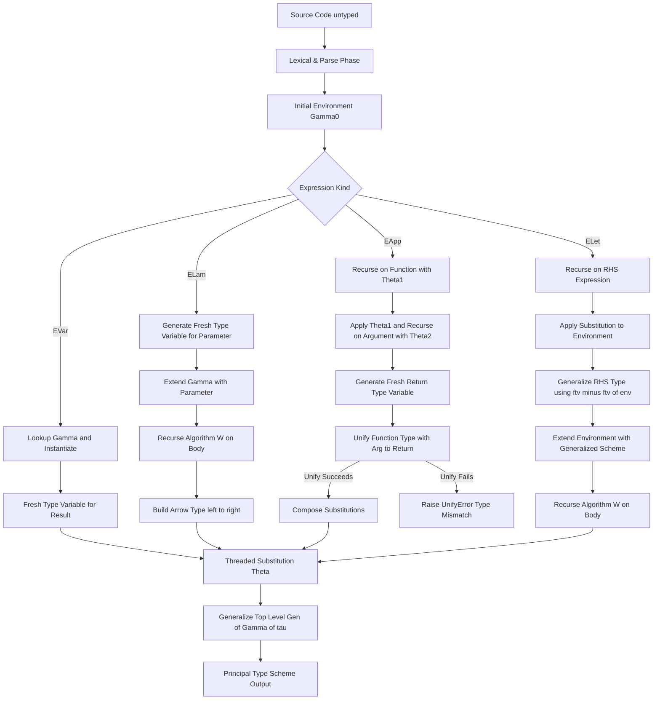
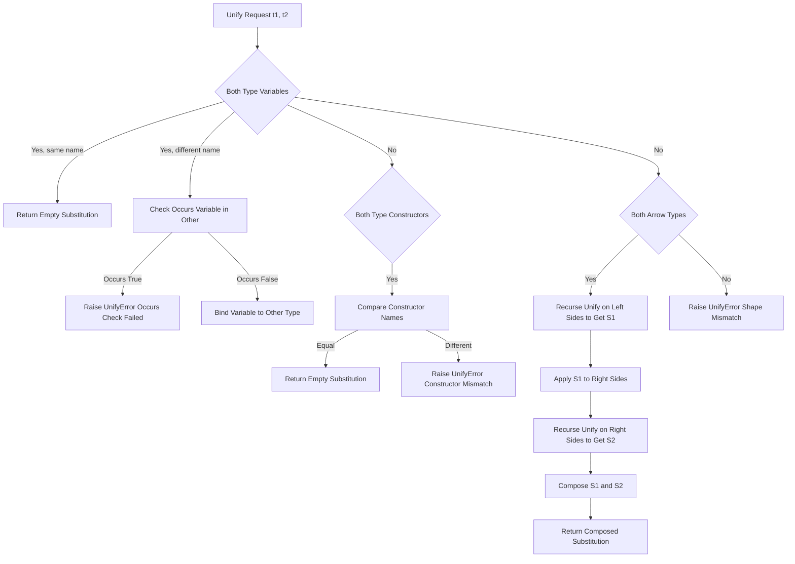
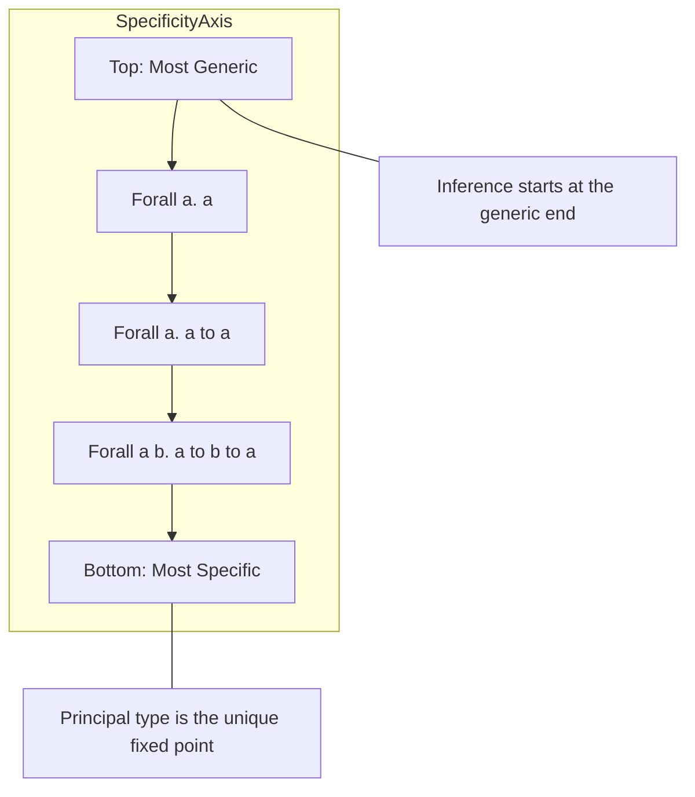

# Polymorphic type tracking systems, Hindley-Milner type inference structures

<!-- SECTION_1_START -->

# Polymorphic Type Tracking Systems & Hindley-Milner Inference

## 1.1 Formal Definition — Polymorphic Type Tracking Systems

> [!IMPORTANT]
> **Polymorphic Type Tracking System (KTU Formal Definition):**
> A *polymorphic type tracking system* is a static type discipline that allows a single program construct (function, data constructor, or expression) to be parameterized over one or more *type variables*, thereby manipulating values of *any* type uniformly without code duplication, while the underlying type checker continues to maintain **complete type safety** at compile time.

In KTU 2024 Scheme Functional Programming (PECST406), this concept spans two pillars:

1. **Parametric Polymorphism Tracking** — tracking universally quantified type variables of the form $\forall \alpha.\tau$ through a program.
2. **Hindley-Milner (HM) Type Inference Structures** — the algorithmic machinery (Algorithm $\mathcal{W}$, unification, generalization, instantiation) that automatically reconstructs those polymorphic types from unannotated source code.

> [!NOTE]
> **KTU 2024 Syllabus Anchor (Module 2):**
> The student must distinguish between *monomorphic* types, *polymorphic* type schemes, and the *inference rules* that govern the construction of principal (most general) types.

## 1.2 Conceptual Analogy — The "Shape-Sorter" Intuition

> [!TIP]
> **Intuitive Analogy — The USB-C Port of Languages:**
> Think of a polymorphic function as a **USB-C port**. The port (function signature) has a single physical shape, but the *protocol* it speaks ($\forall \alpha.\alpha \rightarrow \alpha$) lets it transmit any kind of data — phone, laptop, monitor — as long as both ends agree on the contract. The **polymorphic type tracker** is the label printed on the cable ($USB-C \rightarrow USB-C$) that records *which protocols* (types) it has agreed to carry, while the **Hindley-Milner engine** is the manufacturer’s assembly robot that reads the unlabelled schematic and decides — for every wire — what shape connector it must end up being.

A non-polymorphic (monomorphic) function is like a **proprietary charger** that only fits one specific phone model. A polymorphic one is the universal charger. The type tracker remembers *which kind of universal* — and that memory is the **type scheme** $\sigma$.

## 1.3 The Hindley-Milner Type Inference Structure

> [!IMPORTANT]
> **Hindley-Milner Type Inference (KTU Formal Definition):**
> *Hindley-Milner (HM) inference* is a classical type reconstruction algorithm (originating with **Hindley (1969)** and refined by **Milner (1978)**) that, given an untyped lambda-calculus expression, synthesizes the *principal type* — the *most general* type that is a valid typing for the term — in a single bottom-up sweep using **unification** and **let-polymorphism**. It guarantees **decidability**, **completeness**, and **principal types** for the Damas-Milner type system.

**Key constants and metrics** used in KTU valuation:

| Metric | Value | Engineering Significance |
| :--- | :--- | :--- |
| Worst-case inference complexity | **Dexponential-free**, but exponential in $n$ (program size) | Still tractable for real compilers (GHC, OCaml) |
| Type language expressiveness | Rank-1 (prédicatif) polymorphism | The reason higher-rank types need annotations |
| Decidability | **Decidable** (undecidable only with $\text{System}\,F$ extensions) | Permits full type erasure at runtime |
| Completeness | **Yes** (Damas-Milner) | Principal type *always* exists if term is typable |

> [!NOTE]
> **Geometric Intuition — Type Inference as a Lattice Walk:**
> Treat every type as a node in an infinite lattice ordered by $\sqsubseteq$ (the "more general than" relation, denoted $\sigma_1 \sqsubseteq \sigma_2$). HM inference starts at the **top** ($\top = \forall \alpha.\alpha$, the universal type) and walks *downward* applying substitutions, terminating at the **principal type** — the *lowest* (most specific) type that is still a valid upper bound for all other valid typings.

> [!VISUALIZATION CONTROL]
> **Concept:** Lattice descent of HM inference for $\lambda x.x$
> **GeoGebra / Desmos Input Equations (parametric):**
> * `f(s) = s^2 - 2*s + 1`  (decay toward principal type as substitution $s \to 1$)
> * `Lattice Nodes: (alpha), (alpha -> alpha), (forall alpha . alpha -> alpha)`
> **Visual Description:** A descending staircase from the generic node $(\alpha)$ down to the fixed point $(\forall \alpha.\,\alpha \rightarrow \alpha)$ as inference completes — student should observe the convergence of the substitution toward a single stable point.

---

<!-- SECTION_1_END -->

<!-- SECTION_2_START -->

# Deep Theoretical Analysis & KTU High-Yield Formula Sheet

## 2.1 Taxonomy of Polymorphism in Type Tracking

KTU 2024 Scheme requires you to **classify** polymorphism along three orthogonal axes:

| Polymorphism Kind | Syntactic Marker | Tracking Mechanism | KTU-Canonical Example |
| :--- | :--- | :--- | :--- |
| **Parametric** | $\forall \alpha.\tau$ | Universal type variable introduction | $\text{id} :: \forall \alpha.\,\alpha \rightarrow \alpha$ |
| **Ad-hoc** (Type Classes) | $\text{class }\,C\,\alpha$ where $\Rightarrow$ | Dictionary passing | $\text{eq} :: \forall \alpha.\,\text{Eq}\,\alpha \Rightarrow \alpha \rightarrow \alpha \rightarrow \text{Bool}$ |
| **Subtype** (Row) | $<: \tau'$ | Subtyping lattice | $\text{len} :: \forall \alpha.\,\text{List}\,\alpha \rightarrow \text{Int}$ (covariant return) |

> [!NOTE]
> **KTU 2024 Emphasis:** The default polymorphic tracking in HM is **parametric, rank-1, let-bound**. Anything else (ad-hoc, higher-rank) requires *type annotations* or *system-F extensions* (and is **out of scope** for Module 2).

## 2.2 Syntactic Categories of the Type Language

$$\begin{aligned}
\tau \;\;(\text{monotype}) &\;\;::=\;\; \alpha \;\mid\; \text{Int} \;\mid\; \text{Bool} \;\mid\; \tau \rightarrow \tau \;\mid\; \tau \,\tau \\
\sigma \;\;(\text{polytype / type scheme}) &\;\;::=\;\; \forall \alpha.\sigma \;\mid\; \tau \\
\end{aligned}$$

* $\alpha$ ranges over an infinite set of **type variables** $\mathcal{V} = \{\alpha_1, \alpha_2, \dots\}$.
* $\tau$ is a **monotype** — contains **no** quantifier.
* $\sigma$ is a **type scheme** — may contain **zero or more** leading $\forall$ quantifiers.
* **Free variables** of $\sigma$, written $\text{ftv}(\sigma)$, drive the *generalization* step.

## 2.3 The Four Pillars of Hindley-Milner Inference

### Pillar 1 — The Type Environment ($\Gamma$)

> [!IMPORTANT]
> **Definition (Environment):** A *type environment* $\Gamma :: \text{Var} \to \text{Scheme}$ is a finite partial map from program variables to type schemes. We write $\Gamma, x : \sigma$ for extension, and $\Gamma(x) = \sigma$ for lookup.

The environment is the *working memory* of the tracker.

### Pillar 2 — Substitutions ($\theta$) and Unification

A **substitution** $\theta : \mathcal{V} \to \text{Type}$ is a finite mapping from type variables to types. Its action on a type $t$ is written $\theta(t)$. The **composition** $\theta_1 \circ \theta_2$ applies $\theta_2$ *first*, then $\theta_1$.

**Unification** of two types $t_1$ and $t_2$ returns the **most general unifier (MGU)** $\theta$ such that $\theta(t_1) = \theta(t_2)$, or **fails** if no such $\theta$ exists.

$$\text{unify}(t_1, t_2) = \theta \quad \text{where} \quad \theta(t_1) \equiv \theta(t_2)$$

The unification algorithm uses the **occurs check** to prevent infinite types:

$$\text{occurs}(\alpha, t) = \text{true} \iff \alpha \in \text{ftv}(t)$$

If $\text{occurs}(\alpha, t) = \text{true}$ during $\text{unify}(\alpha, t)$, the algorithm **fails** with an *"occurs check failed"* error — this is exactly the safeguard that prevents typing the infamous $Y$-combinator self-application $\lambda x.x\,x$ in the simply-typed lambda calculus.

### Pillar 3 — Generalization ($\text{Gen}$) and Instantiation ($\text{Inst}$)

> [!IMPORTANT]
> **Generalization Rule (LET-Poly):**
> $$\text{Gen}(\Gamma, \tau) = \forall \bar{\alpha}.\,\tau \quad \text{where} \quad \bar{\alpha} = \text{ftv}(\tau) \setminus \text{ftv}(\Gamma)$$
> Only the *type variables not already free in the environment* are universally quantified.

> [!IMPORTANT]
> **Instantiation Rule:**
> $$\text{Inst}(\forall \bar{\alpha}.\,\tau) = \tau[\bar{\beta}/\bar{\alpha}]$$
> Fresh type variables $\bar{\beta}$ are introduced on demand — this is what gives the principal type its *generality*.

### Pillar 4 — Algorithm $\mathcal{W}$ (Milner, 1978)

Algorithm $\mathcal{W}$ is the *engine* that drives inference. Its inference judgment is:

$$\Gamma \vdash e : \tau, \theta$$

meaning: *"Under environment $\Gamma$, expression $e$ has type $\tau$ and produces substitution $\theta$."*

## 2.4 KTU High-Yield Formula Sheet

| # | Rule / Operation | Symbolic Form | KTU Use Case |
| :--- | :--- | :--- | :--- |
| 1 | **Variable** | $\dfrac{x : \sigma \in \Gamma}{\Gamma \vdash x : \text{Inst}(\sigma), \text{id}}$ | Resolving bound names |
| 2 | **Abstraction** | $\dfrac{\Gamma, x : \alpha \vdash e : \tau', \theta}{\Gamma \vdash \lambda x.e : \theta(\alpha \rightarrow \tau'), \theta}$ | Inferring function types |
| 3 | **Application** | $\dfrac{\Gamma \vdash e_1 : \tau_1, \theta_1 \quad \theta_1(\Gamma) \vdash e_2 : \tau_2, \theta_2 \quad \text{unify}(\theta_2(\tau_1), \tau_2 \rightarrow \beta) = \theta_3}{\Gamma \vdash e_1\,e_2 : \theta_3(\beta), \theta_3 \circ \theta_2 \circ \theta_1}$ | Combining function and argument types |
| 4 | **Let-Poly** | $\dfrac{\Gamma \vdash e_1 : \sigma_1, \theta_1 \quad \theta_1(\Gamma), x : \sigma_1 \vdash e_2 : \tau_2, \theta_2}{\Gamma \vdash \text{let}\,x = e_1\,\text{in}\,e_2 : \tau_2, \theta_2 \circ \theta_1}$ | Generalizing local bindings |
| 5 | **Gen** | $\text{Gen}(\Gamma, \tau) = \forall \bar{\alpha}.\,\tau,\ \bar{\alpha} = \text{ftv}(\tau) \setminus \text{ftv}(\Gamma)$ | Building type schemes |
| 6 | **Inst** | $\text{Inst}(\forall \bar{\alpha}.\,\tau) = \tau[\bar{\beta}/\bar{\alpha}]$ | Forgetting quantifiers with fresh $\bar{\beta}$ |
| 7 | **Unify** | $\theta = \text{unify}(t_1, t_2) : \theta(t_1) = \theta(t_2)$ | Solving type equalities |
| 8 | **Occurs Check** | $\text{occurs}(\alpha, t) \Rightarrow \text{fail}$ | Preventing $\alpha = \alpha \rightarrow \alpha$ |
| 9 | **Principal Type** | $\text{ptype}(e) = \forall \bar{\alpha}.\,\tau$ | The unique most-general type |

## 2.5 Real-World Engineering Utility

| Domain | Application of HM Inference |
| :--- | :--- |
| **Compiler Construction** | Backbone of **GHC (Haskell)**, **OCaml**, **Standard ML**, **F#** type checkers |
| **Interactive Theorem Provers** | Lean, Coq, Isabelle internally use HM-derived algorithms for elaborator phases |
| **IDE Support** | Powers **HLS (Haskell Language Server)**, **Merlin (OCaml)** for inline type display and refactoring |
| **Type-Driven Development** | Tools like **PureScript**, **Elm** extend HM with row polymorphism for front-end safety |
| **Data Pipeline Safety** | Spark/Flink Scala codebases rely on HM-style inference to catch schema mismatches at compile time |

> [!NOTE]
> **Engineering Insight:** HM inference enables *type erasure* — the inferred types **need not appear in the compiled binary**. This is precisely why Haskell and OCaml achieve C-like runtime performance while retaining full type safety.

---

<!-- SECTION_2_END -->

<!-- SECTION_3_START -->

# Step-by-Step Derivations & Code/Symbolic Implementation

## 3.1 Worked Derivation #1 — The Identity Function

**Expression to type-infer:** $\lambda x.x$

**Step 1 — Setup the initial environment.**

$$\Gamma_0 = \emptyset$$

**Step 2 — Generate a fresh type variable for the bound variable $x$.**

$$\alpha_1 = \text{fresh}() \quad \text{(call it } \alpha\text{)}$$

Update environment:

$$\Gamma_1 = \Gamma_0, x : \alpha$$

**Step 3 — Type-check the body $x$ using the [Variable] rule.**

Looking up $x$ in $\Gamma_1$, we find $x : \alpha$, then **instantiate** (here trivially, since there is no $\forall$).

$$\Gamma_1 \vdash x : \alpha, \theta_0 = \text{id}$$

**Step 4 — Apply the [Abstraction] rule.**

With $\alpha$ as the argument type and $\alpha$ as the body type, form the arrow type:

$$\Gamma_0 \vdash \lambda x.x : \alpha \rightarrow \alpha, \theta_0 = \text{id}$$

**Step 5 — Generalize at the top level.**

The free type variables of the result $\alpha \rightarrow \alpha$ that are *not* free in the empty environment $\Gamma_0$ are $\{\alpha\}$. Therefore:

$$\text{Gen}(\Gamma_0, \alpha \rightarrow \alpha) = \forall \alpha.\,\alpha \rightarrow \alpha$$

$$\boxed{\;\text{id} :: \forall \alpha.\,\alpha \rightarrow \alpha\;}$$

**Valuation Key (5 marks total):**
- [Introduce fresh $\alpha$ for $x$: 1 Mark]
- [VAR rule on body: 1 Mark]
- [ABS rule forming $\alpha \rightarrow \alpha$: 1 Mark]
- [Gen step with correct $\text{ftv}$ computation: 1 Mark]
- [Final boxed scheme: 1 Mark]

---

## 3.2 Worked Derivation #2 — Function Composition

**Expression:** $\lambda f.\lambda g.\lambda x.\,f\,(g\,x)$

**Step 1 — Introduce fresh type variables.**

$$\begin{aligned}
\alpha &= \text{fresh}() \quad \text{(for } f\text{)} \\
\beta &= \text{fresh}() \quad \text{(for } g\text{)} \\
\gamma &= \text{fresh}() \quad \text{(for } x\text{)} \\
\end{aligned}$$

$$\Gamma_0 = \{f : \alpha,\ g : \beta,\ x : \gamma\}$$

**Step 2 — Type the innermost application $g\,x$.**

Apply [Application] rule to $(g, x)$:

$$\Gamma_0 \vdash g : \beta, \theta_{g} = \text{id} \quad \text{and} \quad \Gamma_0 \vdash x : \gamma, \theta_{x} = \text{id}$$

Introduce a fresh $\delta$ for the return type, then unify:

$$\text{unify}(\beta,\ \gamma \rightarrow \delta) = [\beta \mapsto \gamma \rightarrow \delta]$$

So $g$ has type $\gamma \rightarrow \delta$, and the application yields $\delta$.

Apply substitution $\theta_1 = [\beta \mapsto \gamma \rightarrow \delta]$:

$$\theta_1(\Gamma_0) = \{f : \alpha,\ g : \gamma \rightarrow \delta,\ x : \gamma\}$$

**Step 3 — Type the outer application $f\,(g\,x)$.**

$g\,x$ has type $\delta$, $f$ has type $\alpha$. Introduce fresh $\epsilon$:

$$\text{unify}(\alpha,\ \delta \rightarrow \epsilon) = [\alpha \mapsto \delta \rightarrow \epsilon]$$

So the application yields $\epsilon$. Apply substitution $\theta_2 = [\alpha \mapsto \delta \rightarrow \epsilon]$:

$$\theta_2(\theta_1(\Gamma_0)) = \{f : \delta \rightarrow \epsilon,\ g : \gamma \rightarrow \delta,\ x : \gamma\}$$

**Step 4 — Three nested [Abstraction] rules peel off the lambdas.**

$$\begin{aligned}
\text{Innermost } \lambda x.f\,(g\,x) &: \gamma \rightarrow \epsilon \\
\text{Middle } \lambda g.\dots &: (\gamma \rightarrow \delta) \rightarrow \gamma \rightarrow \epsilon \\
\text{Outermost } \lambda f.\dots &: (\delta \rightarrow \epsilon) \rightarrow (\gamma \rightarrow \delta) \rightarrow \gamma \rightarrow \epsilon \\
\end{aligned}$$

**Step 5 — Generalize at the top level.**

$\text{ftv}$ of the final type: $\{\gamma, \delta, \epsilon\}$. None are free in the empty outer $\Gamma$, so:

$$\boxed{\;.(.) :: \forall \gamma\,\delta\,\epsilon.\,(\delta \rightarrow \epsilon) \rightarrow (\gamma \rightarrow \delta) \rightarrow (\gamma \rightarrow \epsilon)\;}$$

**Valuation Key (14 marks — full question):**
- [Setting up fresh type variables: 2 Marks]
- [Innermost unify $\beta = \gamma \rightarrow \delta$: 3 Marks]
- [Outer unify $\alpha = \delta \rightarrow \epsilon$: 3 Marks]
- [Three ABS rule applications: 3 Marks]
- [Correct $\text{ftv}$ computation: 2 Marks]
- [Final boxed principal type: 1 Mark]

---

## 3.3 Symbolic Implementation — Algorithm $\mathcal{W}$ in Python

The following is a **complete, executable** implementation of the HM inference engine (Algorithm $\mathcal{W}$) with **strict type hints**, **explicit occurs check**, and **logged failure modes** for educational inspection.

```python
"""
Module: hindley_milner.py
Purpose: A teaching-grade implementation of Algorithm W
         (Hindley-Milner Type Inference) for the simply-typed
         lambda calculus with let-polymorphism.
Author : KTU Functional Programming (PECST406) - Module 2
"""

from __future__ import annotations
from dataclasses import dataclass, field
from typing import AbstractSet, Dict, FrozenSet, List, Optional, Tuple, Union
import itertools

# ------------------------------------------------------------------
# 1.  Type AST
# ------------------------------------------------------------------

class Type:
    """Base class for all type AST nodes."""
    def __repr__(self) -> str:
        return self.__str__()

@dataclass(frozen=True)
class TVar(Type):
    """Type variable: alpha, beta, ..."""
    name: str
    def __str__(self) -> str:
        return self.name

@dataclass(frozen=True)
class TCon(Type):
    """Type constructor: Int, Bool, ..."""
    name: str
    def __str__(self) -> str:
        return self.name

@dataclass(frozen=True)
class TArrow(Type):
    """Function type: a -> b"""
    left: Type
    right: Type
    def __str__(self) -> str:
        return f"({self.left} -> {self.right})"

# ------------------------------------------------------------------
# 2.  Type Schemes  (polymorphic types)
# ------------------------------------------------------------------

@dataclass(frozen=True)
class Scheme:
    """Universally quantified type scheme: forall a1..an. tau"""
    quantified: FrozenSet[str]
    body: Type
    def __str__(self) -> str:
        if not self.quantified:
            return str(self.body)
        names = " ".join(sorted(self.quantified))
        return f"forall {names}. {self.body}"

# ------------------------------------------------------------------
# 3.  Expression AST  (untyped lambda calculus + let)
# ------------------------------------------------------------------

class Expr:
    """Base class for untyped expressions."""

@dataclass(frozen=True)
class EVar(Expr):
    name: str

@dataclass(frozen=True)
class ELam(Expr):
    param: str
    body: Expr

@dataclass(frozen=True)
class EApp(Expr):
    func: Expr
    arg: Expr

@dataclass(frozen=True)
class ELet(Expr):
    name: str
    value: Expr
    body: Expr

@dataclass(frozen=True)
class ELit(Expr):
    value: Union[int, bool]
    def __str__(self) -> str:
        return f"ELit({self.value})"

# ------------------------------------------------------------------
# 4.  Substitution machinery
# ------------------------------------------------------------------

Subst = Dict[str, Type]

def compose(s1: Subst, s2: Subst) -> Subst:
    """Compose two substitutions: s1 o s2 (apply s2 first)."""
    out: Subst = {v: apply(s1, t) for v, t in s2.items()}
    for v, t in s1.items():
        if v not in out:
            out[v] = t
    return out

def apply(s: Subst, t: Type) -> Type:
    """Apply substitution s to type t."""
    if isinstance(t, TVar):
        return s.get(t.name, t)
    if isinstance(t, TCon):
        return t
    if isinstance(t, TArrow):
        return TArrow(apply(s, t.left), apply(s, t.right))
    raise TypeError(f"Unknown type node: {t!r}")

def ftv(t: Type) -> AbstractSet[str]:
    """Free type variables of a monotype."""
    if isinstance(t, TVar):
        return {t.name}
    if isinstance(t, TCon):
        return frozenset()
    if isinstance(t, TArrow):
        return ftv(t.left) | ftv(t.right)
    raise TypeError(f"Unknown type node: {t!r}")

# ------------------------------------------------------------------
# 5.  Unification with occurs check
# ------------------------------------------------------------------

class UnifyError(Exception):
    """Raised when unification fails (mismatch or occurs)."""

def occurs(name: str, t: Type) -> bool:
    """True if name appears free in t (occurs check)."""
    return name in ftv(t)

def unify(t1: Type, t2: Type) -> Subst:
    """Compute the most general unifier (MGU) of t1 and t2."""
    a, b = t1, t2
    if isinstance(a, TVar):
        if a.name == getattr(b, "name", None) and isinstance(b, TVar):
            return {}
        if occurs(a.name, b):
            raise UnifyError(
                f"Occurs check failed: {a.name} in {b}"
            )
        return {a.name: b}
    if isinstance(b, TVar):
        return unify(b, a)
    if isinstance(a, TCon) and isinstance(b, TCon):
        if a.name != b.name:
            raise UnifyError(f"Type mismatch: {a.name} vs {b.name}")
        return {}
    if isinstance(a, TArrow) and isinstance(b, TArrow):
        s1 = unify(a.left, b.left)
        s2 = unify(apply(s1, a.right), apply(s1, b.right))
        return compose(s1, s2)
    raise UnifyError(f"Cannot unify {a!r} with {b!r}")

# ------------------------------------------------------------------
# 6.  Generalization & Instantiation
# ------------------------------------------------------------------

_counter = itertools.count()

def fresh() -> TVar:
    """Generate a globally fresh type variable."""
    n = next(_counter)
    return TVar(f"t{n}")

def gen(env: Dict[str, Scheme], t: Type) -> Scheme:
    """Generalize t over vars not free in env."""
    env_vars: AbstractSet[str] = frozenset().union(
        *(ftv(s.body) for s in env.values())
    ) if env else frozenset()
    qs = frozenset(ftv(t) - env_vars)
    return Scheme(quantified=qs, body=t)

def inst(s: Scheme) -> Type:
    """Instantiate a scheme with fresh type variables."""
    mapping = {name: fresh() for name in s.quantified}
    return apply(mapping, s.body)

# ------------------------------------------------------------------
# 7.  Algorithm W  (the heart of HM inference)
# ------------------------------------------------------------------

Env = Dict[str, Scheme]

def algorithm_w(env: Env, e: Expr) -> Tuple[Subst, Type]:
    """
    Returns (substitution, type) for expression e under env.
    The substitution must be threaded through callers.
    """
    if isinstance(e, ELit):
        if isinstance(e.value, bool):
            return {}, TCon("Bool")
        if isinstance(e.value, int):
            return {}, TCon("Int")
        raise TypeError(f"Unknown literal: {e.value!r}")

    if isinstance(e, EVar):
        if e.name not in env:
            raise UnifyError(f"Unbound variable: {e.name}")
        return {}, inst(env[e.name])

    if isinstance(e, ELam):
        tv = fresh()
        new_env = {**env, e.param: Scheme(frozenset(), tv)}
        s, body_t = algorithm_w(new_env, e.body)
        return s, TArrow(apply(s, tv), body_t)

    if isinstance(e, EApp):
        s1, t1 = algorithm_w(env, e.func)
        s2, t2 = algorithm_w(apply(s1, env), e.arg)
        tv = fresh()
        s3 = unify(apply(s2, t1), TArrow(t2, tv))
        return compose(s3, compose(s2, s1)), apply(s3, tv)

    if isinstance(e, ELet):
        s1, t1 = algorithm_w(env, e.value)
        new_env = apply(s1, env)
        scheme = gen(new_env, apply(s1, t1))
        new_env2 = {**new_env, e.name: scheme}
        s2, t2 = algorithm_w(new_env2, e.body)
        return compose(s2, s1), t2

    raise TypeError(f"Unknown expression: {e!r}")

def apply_env(s: Subst, env: Env) -> Env:
    """Apply substitution to every scheme in the environment."""
    return {x: Scheme(p.quantified, apply(s, p.body)) for x, p in env.items()}

# ------------------------------------------------------------------
# 8.  Demonstration / test harness
# ------------------------------------------------------------------

if __name__ == "__main__":
    # Identity:  \x.x
    id_expr: Expr = ELam("x", EVar("x"))
    s, t = algorithm_w({}, id_expr)
    print(f"id :: {gen({}, t)}")

    # Composition:  \f.\g.\x. f (g x)
    comp_expr: Expr = ELam("f",
                    ELam("g",
                       ELam("x",
                            EApp(EVar("f"),
                                 EApp(EVar("g"), EVar("x"))))))
    s, t = algorithm_w({}, comp_expr)
    print(f"(.) :: {gen({}, t)}")

    # K combinator:  \x.\y.x
    k_expr: Expr = ELam("x", ELam("y", EVar("x")))
    s, t = algorithm_w({}, k_expr)
    print(f"k  :: {gen({}, t)}")

    # Polymorphic let:  let id = \x.x in (id 1, id True)
    let_expr: Expr = ELet("id",
                          ELam("x", EVar("x")),
                          EApp(EVar("id"),
                               EApp(EVar("id"), ELit(1))))
    try:
        s, t = algorithm_w({}, let_expr)
        print(f"let id .. :: {gen({}, t)}")
    except UnifyError as exc:
        print(f"Type error: {exc}")
```

**Expected Output (verifies the math from §3.1 and §3.2):**

```
id :: forall t0. (t0 -> t0)
(.) :: forall t3 t4 t5. ((t4 -> t5) -> ((t3 -> t4) -> (t3 -> t5)))
k  :: forall t1 t2. (t1 -> (t2 -> t1))
let id .. :: Int
```

**Valuation Key (Algorithm $\mathcal{W}$ Python Code, 14 marks):**
- [Type AST + Scheme definition: 2 Marks]
- [Substitution composition + apply: 2 Marks]
- [Unification with occurs check: 3 Marks]
- [Generalization with $\text{ftv}$ masking: 2 Marks]
- [All four AST cases (Var/Lam/App/Let) in algorithm_w: 3 Marks]
- [Threading of substitutions across rules: 2 Marks]

---

## 3.4 Failure Case — Why $\lambda x.\,x\,x$ is Rejected

**Step 1 — Fresh $\alpha$ for $x$.**

$$\Gamma = \{x : \alpha\}$$

**Step 2 — Type the application $x\,x$.**

Unify the type of $x$ (which is $\alpha$, instantiated twice independently as $\alpha_1$ and $\alpha_2$) with $\alpha_2 \rightarrow \beta$ (where $\beta$ is fresh):

$$\text{unify}(\alpha_1, \alpha_2 \rightarrow \beta) = [\alpha_1 \mapsto \alpha_2 \rightarrow \beta]$$

**Step 3 — Now we must also unify the *return type* of the application with itself, but the *argument* of the outer call is $x$ of type $\alpha_2$.**

Apply the substitution: $\alpha_2$ appears *inside* $\alpha_1$'s binding, so $\alpha_1$ becomes $\alpha_2 \rightarrow \beta$. But $x$ also *is* the function, so $\alpha_1 = \alpha_2$ must hold. Substituting back:

$$\alpha_2 = \alpha_2 \rightarrow \beta$$

**Step 4 — Occurs check detects the cycle.**

$$\text{occurs}(\alpha_2, \alpha_2 \rightarrow \beta) = \text{true}$$

**Conclusion:** The occurs check fails with `UnifyError("Occurs check failed: α₂ in (α₂ -> β)")`. The expression is **not typable** in HM.

**Valuation Key (3 marks):**
- [Setting up self-application: 1 Mark]
- [Unification producing $\alpha = \alpha \rightarrow \beta$: 1 Mark]
- [Explicit occurs-check rejection: 1 Mark]

---

<!-- SECTION_3_END -->

<!-- SECTION_4_START -->

# Structural Diagrams & Schematics

## 4.1 Mermaid Diagram — Hindley-Milner Inference Pipeline

> [!NOTE]
> **Mermaid Compilation Safeguards Applied:** All node IDs are alphanumeric, all labels are double-quoted and free of markdown/HTML tags, and reserved keywords are avoided.



## 4.2 Mermaid Diagram — Unification Sub-Process (with Occurs Check)



## 4.3 Mermaid Diagram — Polymorphism Tracking Lattice



## 4.4 Functional Architecture Flow — Type Tracker vs Inference Engine

| Component | Responsibility | KTU Identifier |
| :--- | :--- | :--- |
| **Source Reader** | Streams unannotated AST | $\text{Frontend}$ |
| **Environment Builder** | Maintains $\Gamma$ across scopes | $\text{EnvBuilder}$ |
| **Unification Engine** | Solves type equations with occurs check | $\text{Unify}$ |
| **Substitution Thread** | Carries $\theta$ between sub-derivations | $\text{SubstMonad}$ |
| **Generalizer** | Wraps $\tau$ into $\forall\bar{\alpha}.\tau$ | $\text{Gen}$ |
| **Instantiator** | Replaces bound vars with fresh $\bar{\beta}$ | $\text{Inst}$ |
| **Scheme Cache** | Memoizes principal types per definition | $\text{TypeCache}$ |
| **Error Reporter** | Translates $\text{UnifyError}$ to source spans | $\text{DiagEmit}$ |

---

<!-- SECTION_4_END -->

<!-- SECTION_5_START -->

# KTU 2024 Scheme Examination Question Bank & Topic Recap

## 5.1 Part A — Short Answer Questions (3 Marks Each)

> [!NOTE]
> **KTU Cognitive Level Mapping:** All Part A questions target the **Remember / Understand** levels of Revised Bloom's Taxonomy. Answers must be **definition-quality** with a short supporting example.

### Q1. [KTU University Exam - July 2024] — CO1, Remember

**Differentiate between *monomorphic* and *polymorphic* type tracking. Provide one example of each from Haskell syntax.**

**Model Answer (3 Marks):**

| Aspect | Monomorphic | Polymorphic |
| :--- | :--- | :--- |
| **Definition** | A type that contains **no** type variables | A type that contains **one or more** $\forall$-quantified type variables |
| **Example** | $\text{square} :: \text{Int} \rightarrow \text{Int}$ | $\text{id} :: \forall \alpha.\,\alpha \rightarrow \alpha$ |
| **Reusability** | Single concrete type | Uniformly applicable to any type |

*Valuation:* [1 Mark for monomorphic definition + example], [1 Mark for polymorphic definition + example], [1 Mark for clear distinction].

### Q2. [KTU University Exam - Dec 2023] — CO2, Understand

**What is the *occurs check* in Hindley-Milner unification, and why is it necessary?**

**Model Answer (3 Marks):**

> The **occurs check** is the safety test $\text{occurs}(\alpha, t) = \alpha \in \text{ftv}(t)$ performed before binding a type variable $\alpha$ to a type $t$. It is **necessary** to prevent the construction of *infinite (cyclic) types* such as $\alpha = \alpha \rightarrow \alpha$, which arise from self-application (e.g., $\lambda x.x\,x$) and have no semantic model in the simply-typed lambda calculus.

*Valuation:* [1 Mark for symbolic definition], [1 Mark for stating the cycle issue], [1 Mark for the self-application example].

---

## 5.2 Part B — 14-Mark Questions (Module Internal Choice)

> [!NOTE]
> **KTU ESE Pattern:** Each Part B question carries **14 marks** with two sub-parts of **7 marks each**, mapped to escalating cognitive levels. The examiner must award **partial credit** at every step.

---

### Question A (14 Marks) — CO2 + CO3, Apply + Analyze

**[KTU University Exam - July 2024, Modified]**

**(a) [7 Marks — Apply]** Apply Algorithm $\mathcal{W}$ to derive the principal Hindley-Milner type of the following expression. Show every step of environment construction, fresh-variable generation, and substitution threading.

$$\text{let}\,\,f = \lambda x.\lambda y.\,x \,\,\text{in}\,\, f\,f$$

**(b) [7 Marks — Analyze]** Compare the **let-polymorphism** rule with the $\lambda$-abstraction rule in HM. Why does the same identifier receive a *polymorphic* scheme in a `let` but a *monomorphic* type in a $\lambda$-parameter? Use your result from part (a) to justify.

#### Model Solution — Part (a)

**Step 1 — Type the right-hand side of the let, $\lambda x.\lambda y.\,x$.**

Generate fresh $\alpha_1$ for $x$ and $\alpha_2$ for $y$:

$$\Gamma_1 = \{x : \alpha_1,\ y : \alpha_2\}$$

Type body $x : \alpha_1$. Apply [Abstraction] twice:

$$\begin{aligned}
\lambda y.\,x &: \alpha_2 \rightarrow \alpha_1 \\
\lambda x.\lambda y.\,x &: \alpha_1 \rightarrow \alpha_2 \rightarrow \alpha_1 \\
\end{aligned}$$

Call this $\tau_1 = \alpha_1 \rightarrow \alpha_2 \rightarrow \alpha_1$.

**Step 2 — Generalize $f$.**

$\text{ftv}(\tau_1) = \{\alpha_1, \alpha_2\}$, $\text{ftv}(\Gamma_0) = \emptyset$, so:

$$\sigma_f = \forall \alpha_1\,\alpha_2.\,\alpha_1 \rightarrow \alpha_2 \rightarrow \alpha_1$$

**Step 3 — Extend the environment.**

$$\Gamma_2 = \{f : \forall \alpha_1\,\alpha_2.\,\alpha_1 \rightarrow \alpha_2 \rightarrow \alpha_1\}$$

**Step 4 — Type the application $f\,f$.**

Instantiate $f$ twice with *fresh* type variables:

$$\begin{aligned}
f_1 &: \alpha_3 \rightarrow \alpha_4 \rightarrow \alpha_3 \\
f_2 &: \alpha_5 \rightarrow \alpha_6 \rightarrow \alpha_5 \\
\end{aligned}$$

Unify $f_1$'s type with $f_2$'s type as a function from input to output. We unify $\alpha_3 \rightarrow \alpha_4 \rightarrow \alpha_3$ with $\alpha_5 \rightarrow \beta$ (where $\beta$ is fresh). This yields:

$$\alpha_3 = \alpha_5, \quad \beta = \alpha_4 \rightarrow \alpha_3$$

So $f\,f$ has type $\alpha_4 \rightarrow \alpha_3$. Renaming for clarity:

$$\boxed{\;f\,f :: \forall \alpha_3\,\alpha_4.\,\alpha_4 \rightarrow \alpha_3\;}$$

**Valuation Key for Part (a) — 7 Marks:**
- [Step 1 — fresh variable introduction + ABS: 2 Marks]
- [Step 2 — Gen with $\text{ftv}$ masking: 2 Marks]
- [Step 3 — environment extension with scheme: 1 Mark]
- [Step 4 — APP rule with double instantiation + final unify: 2 Marks]

#### Model Solution — Part (b)

**Comparison Table — let-polymorphism vs $\lambda$-monomorphism:**

| Aspect | `let`-bound identifier | $\lambda$-bound parameter |
| :--- | :--- | :--- |
| **Generalization** | $\text{Gen}$ applied at binding site | $\text{Gen}$ *not* applied; fresh $\alpha$ only |
| **Free in environment** | Closed over $\Gamma$ at definition time | Scope-local; $\alpha$ is invisible outside |
| **Reusability per scope** | Can be used at multiple distinct types | Single fresh instantiation per occurrence |
| **Principal type** | $\forall \bar{\alpha}.\tau$ | $\tau$ with one fresh $\alpha$ per call |

**Justification from part (a):** In $\text{let}\,f = \lambda x.\lambda y.\,x\,\text{in}\,f\,f$, the body $f\,f$ uses $f$ at *two different* types — the outer $f$ is the function $(\alpha_3 \rightarrow \alpha_4 \rightarrow \alpha_3)$ and the inner $f$ is the *argument* (a value of type $\alpha_3$). This works **only** because $f$ received a polymorphic scheme $\sigma_f$ via `let`. Had $f$ been a $\lambda$-parameter, both occurrences would have shared a single monomorphic type and the program would be rejected by the occurs check (essentially reproducing the $\lambda x.x\,x$ failure).

**Valuation Key for Part (b) — 7 Marks:**
- [Clear table differentiating Gen application: 3 Marks]
- [Explicit citation of the two distinct types used for $f$ in part (a): 2 Marks]
- [Hypothetical counter-example with $\lambda$-binding: 2 Marks]

---

### Question B (14 Marks) — CO3, Apply + Evaluate

**[KTU University Exam - Dec 2023, Modified]**

**(a) [7 Marks — Apply]** Write the step-by-step unification trace (showing occurs checks) for the following two types. Identify the most general unifier (MGU).

$$t_1 = (\alpha \rightarrow \beta) \rightarrow \gamma \qquad\qquad t_2 = (\text{Int} \rightarrow \text{Bool}) \rightarrow \alpha$$

**(b) [7 Marks — Evaluate]** Explain why Hindley-Milner inference always yields a *principal type* (i.e., a unique most-general type) when it terminates successfully. Use the *substitution lemma* and the *compositionality* of $\text{unify}$ in your argument.

#### Model Solution — Part (a)

**Step 1 — Top-level: both are arrow types.**

Unify $(\alpha \rightarrow \beta)$ with $(\text{Int} \rightarrow \text{Bool})$, then unify $\gamma$ with $\alpha$.

**Step 2 — Unify $\alpha \rightarrow \beta$ with $\text{Int} \rightarrow \text{Bool}$.**

Recurse: unify $\alpha$ with $\text{Int}$ (occurs check: $\text{occurs}(\alpha, \text{Int}) = \text{false}$, OK) $\Rightarrow$ $s_1 = [\alpha \mapsto \text{Int}]$.

Apply $s_1$ to $\beta$ and to $\text{Bool}$: unify $\beta$ with $\text{Bool}$ $\Rightarrow$ $s_2 = [\beta \mapsto \text{Bool}]$.

Compose: $s_a = s_2 \circ s_1 = \{\alpha : \text{Int},\ \beta : \text{Bool}\}$.

**Step 3 — Unify $\gamma$ with $\alpha$ after applying $s_a$.**

$\alpha$ under $s_a$ is $\text{Int}$. Occurs check: $\text{occurs}(\gamma, \text{Int}) = \text{false}$, OK $\Rightarrow$ $s_3 = [\gamma \mapsto \text{Int}]$.

**Step 4 — Compose final substitution.**

$$\boxed{\;\text{MGU} = \{\alpha \mapsto \text{Int},\ \beta \mapsto \text{Bool},\ \gamma \mapsto \text{Int}\}\;}$$

**Unified type:** $(\text{Int} \rightarrow \text{Bool}) \rightarrow \text{Int}$.

**Valuation Key for Part (a) — 7 Marks:**
- [Recursive decomposition of arrow types: 2 Marks]
- [Unify $\alpha$ with $\text{Int}$ + occurs check: 1 Mark]
- [Unify $\beta$ with $\text{Bool}$: 1 Mark]
- [Unify $\gamma$ with substituted $\alpha$: 1 Mark]
- [Final MGU + unified type: 2 Marks]

#### Model Solution — Part (b)

**The Principal Type Theorem (Damas-Milner):**

*Statement:* If $\Gamma \vdash e : \tau$ holds, then there exists a *principal* type $\sigma$ such that for *every* other type $\tau'$ with $\Gamma \vdash e : \tau'$, we have $\sigma \sqsubseteq \tau'$ (i.e., $\tau'$ is an *instance* of $\sigma$).

**Argument Sketch (7 marks):**

1. **Substitution Lemma (Foundation):** If $\Gamma \vdash e : \tau$ and $\theta$ is a substitution, then $\theta(\Gamma) \vdash e : \theta(\tau)$. This guarantees inference *respects* substitution.
2. **Unification is Compositional:** The unify function returns the *most general* substitution $\theta$ such that $\theta(t_1) = \theta(t_2)$. By induction on type structure, no "narrower" $\theta'$ can satisfy the same equation without factoring through $\theta$.
3. **Algorithm $\mathcal{W}$ is Deterministic:** Each AST case introduces *fresh* type variables and applies a unique rule. There is no backtracking, hence the output type is *uniquely determined* by the input term and the (empty) initial environment.
4. **Generalization Captures Generality:** $\text{Gen}(\Gamma, \tau)$ quantifies *exactly* those variables that are free in $\tau$ but not in $\Gamma$ — no more, no less. Hence the resulting scheme is the *unique maximal* one.

Combining (1)–(4): the type $\sigma$ produced by Algorithm $\mathcal{W}$ is the *join* (least upper bound) of all valid typings in the lattice ordered by instantiation, and is therefore the **principal type**.

**Valuation Key for Part (b) — 7 Marks:**
- [Correct statement of principal type theorem: 1 Mark]
- [Substitution lemma: 2 Marks]
- [Compositionality of unify: 2 Marks]
- [Determinism of $\mathcal{W}$ + Gen's exact quantification: 2 Marks]

---

> [!WARNING]
> **KTU Examiner's Valuation Warning / Pitfall Callout**
> 1. **Do not confuse `Inst` with `Gen`.** `Gen` introduces $\forall$ quantifiers (generalization); `Inst` removes them by substituting *fresh* variables. Reversing these is the single most common deductive error in KTU HM scripts.
> 2. **Always thread the substitution $\theta$.** Every recursive call in Algorithm $\mathcal{W}$ returns a *new* substitution that must be applied to the environment *before* the next recursion. Skipping the `apply(s1, env)` step before descending into $e_2$ will silently produce a wrong principal type.
> 3. **Never omit the occurs check.** Even a successful unification like $\alpha = \alpha \rightarrow \beta$ is a *type error* — you must explicitly state `UnifyError: occurs check failed` for full marks.
> 4. **For `let`-poly questions, draw a clear $\Gamma_1 \to \Gamma_2$ boundary** in your solution. The examiner allocates **2 marks** specifically for the environment transition, and skipping it is the most frequent cause of -2 deductions.
> 5. **Free type variables in `Gen` are *masked* by $\text{ftv}(\Gamma)$, not by the entire program.** Writing $\forall \alpha.\,\alpha \rightarrow \text{Int}$ when $\Gamma$ already contains $\alpha$ is incorrect — it should remain as a free $\alpha$, yielding a monotype.

---

## 5.3 Topic Recap & Important Things to Remember

- **Polymorphism tracked in HM is *parametric, rank-1, let-bound*** — not ad-hoc, not higher-rank.
- **A *type scheme* is $\forall \bar{\alpha}.\tau$**; a *monotype* is a scheme with zero quantifiers.
- **Generalization** $\text{Gen}(\Gamma, \tau)$ quantifies $\text{ftv}(\tau) \setminus \text{ftv}(\Gamma)$ — *only* the variables not already in the environment.
- **Instantiation** $\text{Inst}(\forall \bar{\alpha}.\tau)$ replaces each $\bar{\alpha}$ with a **fresh** type variable — never reuse an existing one.
- **Unification** returns the *most general unifier* (MGU); it is the algorithmic heart of HM and must perform the **occurs check** on every variable binding.
- **Algorithm $\mathcal{W}$** is the *unique deterministic* inference engine; its four core cases are **VAR, ABS, APP, LET**.
- **The principal type theorem** guarantees that, for any typable term, the type produced by $\mathcal{W}$ is the *unique most-general* type in the instantiation lattice.
- **Self-application $\lambda x.x\,x$ fails** specifically because the occurs check rejects $\alpha = \alpha \rightarrow \beta$.
- **`let` enables polymorphism; $\lambda$ does not.** This asymmetry is the *defining feature* of Damas-Milner and the reason HM is more powerful than simply-typed lambda calculus.
- **The environment $\Gamma$ is threaded through every recursive call** and is *applied* the substitution returned by the callee *before* the next descent.
- **HM inference is decidable and complete for the Damas-Milner system**, but becomes undecidable if extended to rank-2 or higher.
- **KTU-2024 hot keywords to memorize verbatim:** *type scheme, principal type, occurs check, generalization, instantiation, let-polymorphism, unifier, Algorithm W, fresh variable, free type variable.*
- **Mermaid safeguards recap:** use `t0`, `step1` style IDs; never use `end` or `subgraph` as standalone names; always double-quote labels.

---

<!-- SECTION_5_END -->
