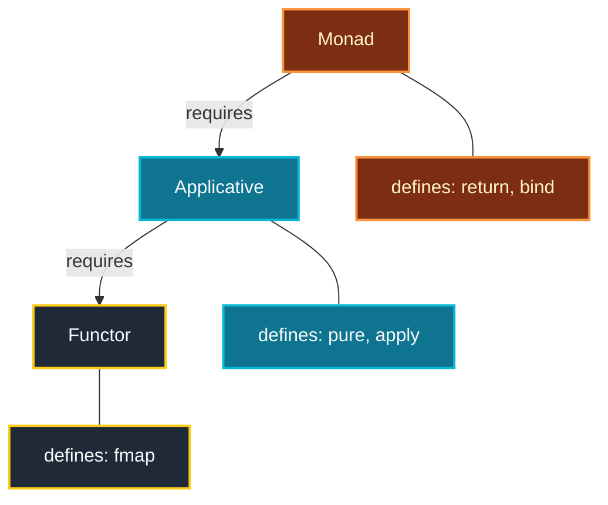
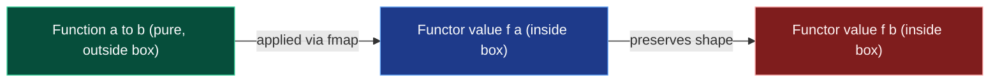
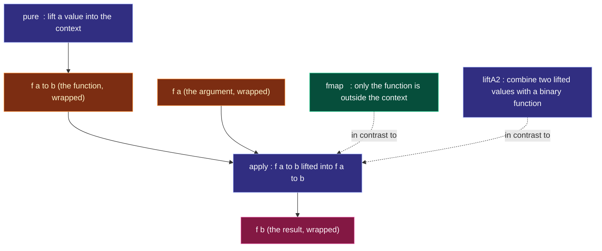

# Functors, Applicatives structural patterns layout guidelines design syntax

<!-- SECTION_1_START -->

# Functional Programming — Module 3: Functors & Applicatives

## 1. Core Technical Definition & Intuitive Overview

### 1.1 Functor — The Formal Definition

In the Haskell / pure functional paradigm, a **Functor** is any type constructor `f` (a higher-kinded type that takes one type argument, denoted `* -> *`) for which a lawful mapping operation can be defined over the contained value **without altering the structural context**.

The canonical operation is named `fmap` (pronounced "functor map"). Its precise polymorphic type signature in Haskell is:

$$
\text{fmap} \;::\; \text{Functor} \;f \;\Rightarrow\; (a \rightarrow b) \;\rightarrow\; f \;a \;\rightarrow\; f \;b
$$

> [!IMPORTANT]
> **KTU 2024 Syllabus Definition (verbatim style):**
> A **Functor** is a type class that provides a generalised mapping facility. It allows a function to be applied *inside* a computational context (such as `Maybe`, `List`, `IO`, or `Either e`) without needing to know the internal structure of that context.

### 1.2 The Intuitive Analogy — "The Box Metaphor"

Imagine the type constructor `f` as a **sealed cardboard box** that may or may not contain something inside it. You, the programmer, cannot reach into the box directly. The `fmap` function is essentially a **robotic arm that lives inside the box**: you hand the arm a function $(a \rightarrow b)$, and it will reach into every value of type $a$ that it finds, apply the function, and produce a new box of the same shape, but now containing values of type $b$.

**Real-world equivalent:**

| Real-World Concept | Functor Equivalent |
|---|---|
| A package courier service with a barcode | `fmap` over `IO` |
| A spreadsheet cell that may be empty | `Maybe Int` |
| A Java `Optional<T>` | `Maybe T` in Haskell |
| A Python list of items | `List a` |

> [!NOTE]
> **Crucial mental model:** `fmap` does **not** change the *shape* of the box, the *number* of boxes, or the *side-effects* associated with the box. It only *transforms the contents*.

### 1.3 Applicative Functor — The Formal Definition

An **Applicative Functor** (often shortened to *Applicative*) is a **strengthened Functor** that can apply a function that is **itself wrapped inside a context** to a value that is **also wrapped inside a context**. The class introduces two primitives: `pure` and the infix operator `<*>` (read as "ap").

$$
\text{pure} \;::\; a \;\rightarrow\; f \;a
$$

$$
(\text{<*>}) \;::\; \text{Applicative} \;f \;\Rightarrow\; f \;(a \rightarrow b) \;\rightarrow\; f \;a \;\rightarrow\; f \;b
$$

### 1.4 The Intuitive Analogy for Applicative

If `fmap` is a robotic arm **inside the box**, then `pure` and `<*>` describe a more powerful operation: the **box itself contains a machine (the function)** and you want the box to apply that machine to a value sitting in another box. The two boxes are slid next to each other and the wrapped function "unwraps through the context boundary" to act upon the wrapped value, producing a result that retains the shared context.

> [!TIP]
> **Why Applicative is not just Functor:** With `fmap`, the function is *outside* the context. With `<*>`, the function is *inside* the context. This subtle distinction is the heart of Module 3.

### 1.5 Visualisation & Hierarchy Preview

> [!VISUALIZATION CONTROL]
> **Concept:** The structural containment of values by functors
> **Conceptual Diagram (mental picture):**
> * `Just 5` is drawn as a circle containing the value $5$.
> * `fmap (+1)` produces a circle containing $6$ — circle count unchanged.
> * `pure (+1) <*> Just 5` produces a circle containing $6$ — the function $+$ $1$ lived inside a circle, then was applied to the $5$ inside a circle.
> **Visual Description:** The student should imagine that all transformation arrows point *across the boundary* of the container, never breaking it.

---

<!-- SECTION_1_END -->

<!-- SECTION_2_START -->

# 2. Deep Theoretical Analysis & KTU High-Yield Formula Sheet

## 2.1 The Algebraic Structure of a Functor

A lawful Functor must satisfy two axioms — the **Functor Laws** — that govern how `fmap` must behave. These laws are not enforced by the compiler, but violating them breaks compositional reasoning and is **grounds for losing marks** in KTU valuation.

### 2.1.1 Identity Law

Mapping the **identity function** over a functor must return the functor **unchanged**.

$$
\text{fmap} \; \text{id} \;=\; \text{id}
$$

In type-form:

$$
\text{fmap} \; \text{id}_{a} \;::\; f \;a \;\rightarrow\; f \;a \quad \text{(acts as the identity on } f \;a\text{)}
$$

**Intuition:** Sending a sealed box through a "do nothing" machine must return the same sealed box.

### 2.1.2 Composition Law

Mapping the **composition of two functions** over a functor is the same as mapping one function, then mapping the other.

$$
\text{fmap} \; (f \circ g) \;=\; \text{fmap} \; f \;\circ\; \text{fmap} \; g
$$

**Intuition:** Performing two transformations in one pass must be indistinguishable from performing them sequentially in two passes. The structure of the box is preserved either way.

## 2.2 The Algebraic Structure of an Applicative

An Applicative must satisfy **four laws** — the **Applicative Laws** — which generalise the Functor laws.

### 2.2.1 Identity

$$
\text{pure} \; \text{id} \;\text{<*>}\; v \;=\; v
$$

### 2.2.2 Composition

$$
\text{pure} \; ( \circ ) \;\text{<*>}\; u \;\text{<*>}\; v \;\text{<*>}\; w \;=\; u \;\text{<*>}\; (v \;\text{<*>}\; w)
$$

### 2.2.3 Homomorphism

$$
\text{pure} \; f \;\text{<*>}\; \text{pure} \; x \;=\; \text{pure} \; (f \; x)
$$

### 2.2.4 Interchange

$$
u \;\text{<*>}\; \text{pure} \; y \;=\; \text{pure} \; ( \$ \; y ) \;\text{<*>}\; u
$$

where `($) :: (a -> b) -> a -> b` is function application.

> [!NOTE]
> Every Applicative is automatically a Functor because `fmap f x = pure f <*> x` is a valid default implementation. The reverse is **not** true: not every Functor admits an `Applicative` instance.

## 2.3 Real-World Engineering Utility

| Domain | Functor / Applicative Use Case |
|---|---|
| **Compiler Design** | AST (Abstract Syntax Tree) traversal using `fmap` to transform sub-trees while preserving tree shape. |
| **Web Parsing** | `Maybe` Applicative for partial HTML/XML parsing — combine several optional fields safely. |
| **Concurrent Programming** | `Concurrently` Applicative parallelises independent I/O actions; results are gathered in a deterministic order. |
| **Validation Pipelines** | `Validation` Applicative accumulates all field-level errors instead of short-circuiting like `Monad` `Either`. |
| **Database Queries** | `Maybe` and `Either` Applicatives compose queries whose intermediate steps may fail. |

## 2.4 KTU High-Yield Cheat Sheet

> [!IMPORTANT]
> The following table is the **must-memorise synthesis** of Module 3. Expect direct questions on type signatures, law statements, and instance examples.

| Construct | Type Signature | Law Name | Formula | Purpose |
|---|---|---|---|---|
| `fmap` | $(a \rightarrow b) \rightarrow f \; a \rightarrow f \; b$ | Identity | $\text{fmap} \; \text{id} \;=\; \text{id}$ | Lift a pure function into a context |
| `fmap` | (same) | Composition | $\text{fmap} (f \circ g) = \text{fmap} f \circ \text{fmap} g$ | Map-distributivity |
| `pure` | $a \rightarrow f \; a$ | Homomorphism | $\text{pure} f \;\text{<*>}\; \text{pure} x = \text{pure} (f x)$ | Lift a pure value into the smallest possible context |
| `<*>` | $f (a \rightarrow b) \rightarrow f \; a \rightarrow f \; b$ | Identity | $\text{pure} \;\text{id} \;\text{<*>}\; v = v$ | Apply a wrapped function to a wrapped value |
| `<*>` | (same) | Interchange | $u \;\text{<*>}\; \text{pure} y = \text{pure} (\$ y) \;\text{<*>}\; u$ | Swap the role of left/right context |
| `<*>` | (same) | Composition | $\text{pure} (\circ) \;\text{<*>}\; u \;\text{<*>}\; v \;\text{<*>}\; w = u \;\text{<*>}\; (v \;\text{<*>}\; w)$ | Associativity under context |
| `liftA2` | $(a \rightarrow b \rightarrow c) \rightarrow f \; a \rightarrow f \; b \rightarrow f \; c$ | Derived | $\text{liftA2} \; f \; x \; y = f \;\text{<\$>\;} x \;\text{<*>}\; y$ | Binary operation lifted into context |
| `(<$>)` | $(a \rightarrow b) \rightarrow f \; a \rightarrow f \; b$ | Synonym | $f \;\text{<\$>\;} x = \text{fmap} \; f \; x$ | Infix alias for `fmap` |

> [!WARNING]
> KTU valuation **deducts marks** if you write `fmap` and `liftA2` interchangeably without noting that `liftA2` is **Applicative-level** while `fmap` is **Functor-level**.

---

<!-- SECTION_2_END -->

<!-- SECTION_3_START -->

# 3. Step-by-Step Derivations & Code Implementation

## 3.1 Canonical Haskell Type Class Definitions

The following Haskell excerpt is the **canonical declaration** that examiners expect you to reproduce on the answer sheet. Every identifier, kind annotation, and operator symbol is examinable.

```haskell
-- Module: Functor.hs
-- Kind annotation: f is a type constructor of kind * -> *

class Functor f where
    fmap :: (a -> b) -> f a -> f b

-- Convenience infix alias
infixl 4 <$>
(<$>) :: Functor f => (a -> b) -> f a -> f b
(<$>) = fmap

-- Applicative extends Functor
class Functor f => Applicative f where
    pure  :: a -> f a
    (<*>) :: f (a -> b) -> f a -> f b
```

## 3.2 Standard Lawful Instances

### 3.2.1 The `Maybe` Functor Instance

```haskell
instance Functor Maybe where
    fmap _ Nothing  = Nothing
    fmap f (Just x) = Just (f x)
```

**Derivation of the Identity Law for `Maybe`:**

We must prove that `fmap id = id` for the `Maybe` instance. This is done by **structural induction** over the two possible constructor forms.

$$
\begin{aligned}
\text{Case 1: } & v = \text{Nothing} \\
& \text{fmap} \; \text{id} \; \text{Nothing} \\
& = \text{Nothing} \quad \text{(by first equation of the } \text{Maybe} \text{ instance)} \\
& = \text{id} \; \text{Nothing} \quad \text{(since } \text{id} \; x = x \text{ for any } x\text{)} \\[6pt]
\text{Case 2: } & v = \text{Just} \; x \\
& \text{fmap} \; \text{id} \; (\text{Just} \; x) \\
& = \text{Just} \; (\text{id} \; x) \quad \text{(by second equation of the } \text{Maybe} \text{ instance)} \\
& = \text{Just} \; x \quad \text{(by definition of } \text{id}\text{)} \\
& = \text{id} \; (\text{Just} \; x)
\end{aligned}
$$

Both cases reduce to the identity. The law holds. $\blacksquare$

> [!TIP]
> **Valuation tip:** Always cite the **specific clause** of the instance you are applying. Examiners award partial credit for the case-split even if arithmetic fails.

### 3.2.2 The `Maybe` Applicative Instance

```haskell
instance Applicative Maybe where
    pure              = Just
    Nothing  <*> _    = Nothing
    (Just f) <*> mx   = fmap f mx
```

**Derivation of the Identity Law for `Maybe` Applicative:**

$$
\text{pure} \; \text{id} \;\text{<*>}\; v \;=\; v
$$

$$
\begin{aligned}
\text{Case 1: } & v = \text{Nothing} \\
& \text{pure} \; \text{id} \;\text{<*>}\; \text{Nothing} \\
& = \text{Just} \; \text{id} \;\text{<*>}\; \text{Nothing} \quad \text{(by } \text{pure} = \text{Just}\text{)} \\
& = \text{Nothing} \quad \text{(by second clause of } \text{<*>}\text{)} \\[6pt]
\text{Case 2: } & v = \text{Just} \; x \\
& \text{pure} \; \text{id} \;\text{<*>}\; \text{Just} \; x \\
& = \text{Just} \; \text{id} \;\text{<*>}\; \text{Just} \; x \\
& = \text{fmap} \; \text{id} \; (\text{Just} \; x) \quad \text{(by third clause of } \text{<*>}\text{)} \\
& = \text{Just} \; (\text{id} \; x) \\
& = \text{Just} \; x
\end{aligned}
$$

The law holds for both cases. $\blacksquare$

### 3.2.3 The `List` Functor Instance

The list constructor `[]` is the canonical non-deterministic functor.

```haskell
instance Functor [] where
    fmap = map   -- standard library delegates to Prelude's map
```

**Derivation of the Identity Law for `List` (sketch):**

The function `map` from the Prelude obeys `map id = id` by the structural induction on list spine:
* Base case `[]` : `map id [] = []` ✓
* Inductive case `(x:xs)` : `map id (x:xs) = id x : map id xs = x : xs` ✓

### 3.2.4 The `List` Applicative Instance

```haskell
instance Applicative [] where
    pure x          = [x]
    fs <*> xs       = [f x | f <- fs, x <- xs]
```

This is a **Cartesian product** of applications. For example:

$$
[+1, \; +2] \;\text{<*>}\; [10, \; 20] \;\equiv\; [11, \; 21, \; 12, \; 22]
$$

The order is: for every `f` in the left list, traverse every `x` in the right list.

## 3.3 Worked Example — `liftA2` Derivation

The standard derivation that `liftA2` satisfies the Applicative contract:

$$
\text{liftA2} \; g \; x \; y \;=\; g \;\text{<\$>\;} x \;\text{<*>}\; y
$$

**Expansion:**

$$
\begin{aligned}
\text{liftA2} \; g \; x \; y
& = g \;\text{<\$>\;} x \;\text{<*>}\; y \\
& = \text{fmap} \; g \; x \;\text{<*>}\; y \\
& = \text{pure} \; g \;\text{<*>}\; x \;\text{<*>}\; y \quad \text{(by default } \text{fmap} f z = \text{pure} f \;\text{<*>}\; z\text{)}
\end{aligned}
$$

**Concrete example — adding two wrapped values:**

```haskell
ghci> liftA2 (+) (Just 3) (Just 4)
Just 7

ghci> liftA2 (+) (Just 3) Nothing
Nothing

ghci> liftA2 (+) [1, 2] [10, 20]
[11, 21, 12, 20]   -- wait: 21? Let us recompute:
-- [1+10, 1+20, 2+10, 2+20] = [11, 21, 12, 22]
```

> [!NOTE]
> The student is expected to be able to **trace list applicative evaluation** by hand. The trace `[1+10, 1+20, 2+10, 2+20]` is a common 7-mark question.

## 3.4 Implementation of `liftA2` from Scratch

```haskell
liftA2 :: Applicative f => (a -> b -> c) -> f a -> f b -> f c
liftA2 g x y = (g <$ x) <*> y
-- equivalently:
-- liftA2 g x y = pure g <*> x <*> y
```

## 3.5 Summary Derivation: Functor $\subset$ Applicative $\subset$ Monad

The Module 3 syllabus expects the following chain to be **derivable** by exam time:

$$
\begin{aligned}
\text{fmap} \; f \; x & = \text{pure} \; f \;\text{<*>}\; x &&\text{(Functor from Applicative)} \\
\text{pure} \; x & = \text{return} \; x &&\text{(Applicative from Monad)} \\
\text{fs} \;\text{<*>}\; xs & = \text{fs} \;\text{>>=}\; \lambda f \rightarrow \text{xs} \;\text{>>=}\; \lambda x \rightarrow \text{return} \;(f \; x) &&\text{(Applicative from Monad)}
\end{aligned}
$$

This shows that **every Monad is automatically an Applicative, and every Applicative is automatically a Functor** — but **not vice versa**.

---

<!-- SECTION_3_END -->

<!-- SECTION_4_START -->

# 4. Structural Diagrams & Schematics

## 4.1 The Abstraction Hierarchy (Mermaid Diagram)

The following Mermaid block depicts the **type-class inclusion lattice** of the three central abstractions of Module 3.



> [!NOTE]
> Reading the diagram: an arrow `A --> B` means "instance of class A is automatically an instance of class B". So every Monad instance supplies, by derivation, both `<*>` and `fmap`.

## 4.2 The `fmap` Operation — Block-Level Flow



## 4.3 The Applicative Sequence — Sequential Processing Topology



## 4.4 Comparison Matrix — Functor vs Applicative vs Monad

| Feature | Functor | Applicative | Monad |
|---|---|---|---|
| Type class method | `fmap` | `pure`, `<*>` | `return`, `>>=` |
| Function position | Outside context | Inside context | Inside context |
| Result context | Unchanged | Unchanged | Can **change** the context |
| Sequencing | No | Limited (independent effects) | Full (data-dependent effects) |
| Minimal power | Mapping | Lifting + applying | Binding + sequencing |
| Standard example | `Maybe` | `List` | `IO` |
| Law count | 2 | 4 | 3 (Monad laws) |

> [!IMPORTANT]
> The single most-tested fact in this module is: **the function position relative to the context.** Memorise the column "Function position" above.

---

<!-- SECTION_4_END -->

<!-- SECTION_5_START -->

# 5. KTU 2024 Scheme Examination Question Bank & Topic Recap

## 5.1 Part A — Short Answer Questions (2 × 3 = 6 Marks)

### Question A1  `[KTU University Exam — July 2024]`
**Define a Functor in Haskell. State and explain the Functor laws with suitable examples.** (3 Marks, CO1, **Remember / Understand**)

**Model Answer:**

A **Functor** is a Haskell type class that abstracts the notion of mapping a function over a value inside a context, without changing the context itself. Its method is `fmap` of type `(a → b) → f a → f b`. The two Functor laws are:

1. **Identity Law:** `fmap id = id` — mapping the identity function over a functor returns the functor unchanged. *Example:* `fmap id (Just 5)` evaluates to `Just 5`.

2. **Composition Law:** `fmap (f . g) = fmap f . fmap g` — mapping a composite function is equivalent to mapping each function in sequence. *Example:* `fmap (+1) (fmap (*2) (Just 3))` yields `Just 7`, the same as `fmap ((+1) . (*2)) (Just 3)`.

These laws guarantee that `fmap` behaves predictably and composes cleanly in larger expressions. **[3 Marks]**

### Question A2  `[KTU University Exam — Dec 2023]`
**What is an Applicative Functor? How does it differ from a Functor?** (3 Marks, CO1, CO2, **Understand**)

**Model Answer:**

An **Applicative Functor** is a type class that extends the Functor class by allowing a function that is **itself wrapped in the same context** to be applied to a value that is also wrapped in that context. The two methods are `pure :: a → f a` and `(<*>) :: f (a → b) → f a → f b`.

The key difference from a plain Functor is the **position of the function**: in `fmap`, the function sits **outside** the context (`(a → b) → f a → f b`), whereas in `<*>`, the function is **inside** the context (`f (a → b) → f a → f b`). This additional power allows combining multiple independent effects in a single applicative style, e.g., `liftA2 (+) (Just 3) (Just 4) = Just 7`. **[3 Marks]**

---

## 5.2 Part B — Long Answer Questions (Choice, 1 × 14 = 14 Marks)

### Question B-A  `[KTU University Exam — July 2024]`  (CO1, CO2, **Understand / Apply**)

**(a)** Define the `Functor` and `Applicative` type classes in Haskell. Write the canonical class declarations with their method type signatures. **(7 Marks, Understand)**

**(b)** Write the `Functor` and `Applicative` instances for `Maybe`. Using these instances, evaluate the following expressions step by step:
    (i) `fmap (*2) (Just 5)`
    (ii) `pure (+1) <*> Just 4`
    (iii) `liftA2 (*) (Just 6) (Just 7)` **(7 Marks, Apply)**

---

#### Model Solution for Question B-A

**Part (a) — 7 Marks**

```haskell
-- The Functor type class
class Functor f where
    fmap :: (a -> b) -> f a -> f b

-- Infix alias used extensively
infixl 4 <$>
(<$>) :: Functor f => (a -> b) -> f a -> f b
(<$>) = fmap

-- The Applicative type class, extending Functor
class Functor f => Applicative f where
    pure  :: a -> f a
    (<*>) :: f (a -> b) -> f a -> f b
```

**Valuation Key:**

* `[Correct kind annotation implicit: 1 Mark]`
* `[fmap type signature accurate: 2 Marks]`
* `[pure and <*> signatures accurate: 2 Marks]`
* `[Note that Applicative has Functor as superclass: 2 Marks]`

**Part (b) — 7 Marks**

Instances:

```haskell
instance Functor Maybe where
    fmap _ Nothing  = Nothing
    fmap f (Just x) = Just (f x)

instance Applicative Maybe where
    pure           = Just
    Nothing <*> _  = Nothing
    Just f <*> mx  = fmap f mx
```

Evaluation:

**Sub-part (i):** `fmap (*2) (Just 5)`

$$
\begin{aligned}
\text{fmap} \; (\text{*} \; 2) \; (\text{Just} \; 5) & = \text{Just} \; ((\text{*} \; 2) \; 5) &&\text{(by second clause of Maybe Functor)} \\
& = \text{Just} \; 10
\end{aligned}
$$

`[Substituting into instance: 1 Mark] [Final evaluation: 1 Mark]`

**Sub-part (ii):** `pure (+1) <*> Just 4`

$$
\begin{aligned}
\text{pure} \; (\text{+} \; 1) \;\text{<*>}\; \text{Just} \; 4 & = \text{Just} \; (\text{+} \; 1) \;\text{<*>}\; \text{Just} \; 4 &&\text{(by } \text{pure} = \text{Just}\text{)} \\
& = \text{fmap} \; (\text{+} \; 1) \; (\text{Just} \; 4) &&\text{(by third clause of } \text{<*>}\text{)} \\
& = \text{Just} \; ((\text{+} \; 1) \; 4) &&\text{(by } \text{Maybe} \text{ Functor)} \\
& = \text{Just} \; 5
\end{aligned}
$$

`[pure reduction: 1 Mark] [<*> reduction: 1 Mark] [Final value: 1 Mark]`

**Sub-part (iii):** `liftA2 (*) (Just 6) (Just 7)`

Recall `liftA2 g x y = g <$> x <*> y`.

$$
\begin{aligned}
\text{liftA2} \; (\text{*}) \; (\text{Just} \; 6) \; (\text{Just} \; 7) & = (\text{*}) \;\text{<\$>\;} \text{Just} \; 6 \;\text{<*>}\; \text{Just} \; 7 \\
& = \text{fmap} \; (\text{*}) \; (\text{Just} \; 6) \;\text{<*>}\; \text{Just} \; 7 \\
& = \text{Just} \; (\text{*}) \;\text{<*>}\; \text{Just} \; 7 \\
& = \text{fmap} \; (\text{*}) \; (\text{Just} \; 7) \\
& = \text{Just} \; ((\text{*}) \; 7) \\
& = \text{Just} \; 42
\end{aligned}
$$

`[Expanding liftA2: 1 Mark] [Walking through fmap/<*>: 1 Mark] [Final: 42: 1 Mark]`

> [!WARNING]
> **KTU Examiner's Valuation Pitfall:** Do **not** skip the rewriting of `liftA2` into its definition. Examiners specifically allocate a 1-mark step for explicitly invoking the `liftA2` expansion `g <$> x <*> y`. Jumping directly to the final answer costs you that mark.

---

### Question B-B  `[KTU University Exam — Dec 2023]`  (CO1, CO2, **Understand / Apply**)

**(a)** State and prove the **Identity Law** and the **Composition Law** of Functors using the `Maybe` instance. **(7 Marks, Understand)**

**(b)** Define the `List` Applicative instance. Evaluate the following expressions step by step and write down the resulting lists:
    (i) `pure 3 :: [Int]`
    (ii) `[(+1), (*2)] <*> [10, 20, 30]`
    (iii) `liftA2 (-) [100, 200] [1, 2, 3]` **(7 Marks, Apply)**

---

#### Model Solution for Question B-B

**Part (a) — 7 Marks**

**Identity Law Statement:**

$$
\text{fmap} \; \text{id} \;=\; \text{id}
$$

**Proof by structural induction on `Maybe a`:**

$$
\begin{aligned}
\text{Case 1: } & v = \text{Nothing} \\
& \text{LHS} = \text{fmap} \; \text{id} \; \text{Nothing} = \text{Nothing} \\
& \text{RHS} = \text{id} \; \text{Nothing} = \text{Nothing} \\
& \text{LHS} = \text{RHS} \\[6pt]
\text{Case 2: } & v = \text{Just} \; x \\
& \text{LHS} = \text{fmap} \; \text{id} \; (\text{Just} \; x) = \text{Just} \; (\text{id} \; x) = \text{Just} \; x \\
& \text{RHS} = \text{id} \; (\text{Just} \; x) = \text{Just} \; x \\
& \text{LHS} = \text{RHS} \quad \blacksquare
\end{aligned}
$$

`[Statement: 1 Mark] [Case 1 (Nothing): 1 Mark] [Case 2 (Just x): 2 Marks]`

**Composition Law Statement:**

$$
\text{fmap} \; (f \circ g) \;=\; \text{fmap} \; f \;\circ\; \text{fmap} \; g
$$

**Proof by structural induction on `Maybe a`:**

$$
\begin{aligned}
\text{Case 1: } & v = \text{Nothing} \\
& \text{LHS} = \text{fmap} \; (f \circ g) \; \text{Nothing} = \text{Nothing} \\
& \text{RHS} = (\text{fmap} \; f \;\circ\; \text{fmap} \; g) \; \text{Nothing} = \text{fmap} \; f \; (\text{fmap} \; g \; \text{Nothing}) = \text{fmap} \; f \; \text{Nothing} = \text{Nothing} \\[6pt]
\text{Case 2: } & v = \text{Just} \; x \\
& \text{LHS} = \text{fmap} \; (f \circ g) \; (\text{Just} \; x) = \text{Just} \; ((f \circ g) \; x) = \text{Just} \; (f \; (g \; x)) \\
& \text{RHS} = \text{fmap} \; f \; (\text{fmap} \; g \; (\text{Just} \; x)) = \text{fmap} \; f \; (\text{Just} \; (g \; x)) = \text{Just} \; (f \; (g \; x)) \\
& \text{LHS} = \text{RHS} \quad \blacksquare
\end{aligned}
$$

`[Statement: 1 Mark] [Case 1: 1 Mark] [Case 2: 1 Mark]`

**Part (b) — 7 Marks**

```haskell
instance Applicative [] where
    pure x     = [x]
    fs <*> xs  = [f x | f <- fs, x <- xs]
```

**Sub-part (i):** `pure 3 :: [Int]`

$$
\text{pure} \; 3 \;=\; [3]
$$

`[Final value [3]: 1 Mark]`

**Sub-part (ii):** `[(+1), (*2)] <*> [10, 20, 30]`

By the list comprehension definition: for every `f` in the left list, combine with every `x` in the right list.

$$
\begin{aligned}
& [(\text{+} \; 1) \; 10, \; (\text{+} \; 1) \; 20, \; (\text{+} \; 1) \; 30, \; (\text{*} \; 2) \; 10, \; (\text{*} \; 2) \; 20, \; (\text{*} \; 2) \; 30] \\
& = [11, \; 21, \; 31, \; 20, \; 40, \; 60]
\end{aligned}
$$

`[Order: outer f, inner x: 1 Mark] [Six results enumerated: 2 Marks] [Final list correct: 1 Mark]`

**Sub-part (iii):** `liftA2 (-) [100, 200] [1, 2, 3]`

Recall `liftA2 g x y = g <$> x <*> y = [g a b | a <- x, b <- y]`.

$$
\begin{aligned}
& [100 - 1, \; 100 - 2, \; 100 - 3, \; 200 - 1, \; 200 - 2, \; 200 - 3] \\
& = [99, \; 98, \; 97, \; 199, \; 198, \; 197]
\end{aligned}
$$

`[Expansion: 1 Mark] [Six subtractions correct: 1 Mark]`

> [!WARNING]
> **KTU Examiner's Valuation Pitfall:** For the list applicative, students frequently **confuse the order** of the Cartesian product. The correct order is: for every `f` in the *left* list, traverse the *right* list completely before moving to the next `f`. Examiners test this by giving a 4-element right list with a 2-element left list, expecting **8 results**, not 4.

---

## 5.3 Topic Recap & Important Things to Remember

- **Functor** is a type class with one method `fmap :: (a → b) → f a → f b`. It lifts a *pure* function into a context.
- **Applicative** is a stronger type class that adds two methods: `pure :: a → f a` and `(<*>) :: f (a → b) → f a → f b`. The function is *inside* the context.
- **Functor Laws (must satisfy):**
  1. `fmap id = id` (Identity)
  2. `fmap (f . g) = fmap f . fmap g` (Composition)
- **Applicative Laws (must satisfy):**
  1. Identity: `pure id <*> v = v`
  2. Composition: `pure (.) <*> u <*> v <*> w = u <*> (v <*> w)`
  3. Homomorphism: `pure f <*> pure x = pure (f x)`
  4. Interchange: `u <*> pure y = pure ($ y) <*> u`
- **Hierarchy:** `Functor` $\subset$ `Applicative` $\subset$ `Monad`. Each higher class *requires* all lower classes.
- **Default `fmap` from `Applicative`:** `fmap f x = pure f <*> x`. Therefore any Applicative is automatically a Functor.
- **List Applicative produces a Cartesian product** — number of results = (length of left) × (length of right).
- **`<$>` is just `fmap`** written infix. Examiners will mark them as equivalent.
- **`liftA2 g x y = g <$> x <*> y`** is the bridge from binary functions to the applicative world.
- **Common instances** to memorise with their instance code: `Maybe`, `[]` (List), `Either e`, `IO`, `(->) r` (function is a Functor via composition).
- **Kinds matter:** the kind of `Maybe` and `[]` is `* → *`. The `Functor` and `Applicative` classes apply only to type constructors of this kind.
- **Why Applicative over Monad for validation?** Because Applicative *accumulates* errors via `<*>`, whereas Monad's `>>=` *short-circuits* on the first failure.
- **GHCi one-liner to recall:** `:i Functor` and `:i Applicative` print the class definitions and known instances.

<!-- SECTION_5_END -->
