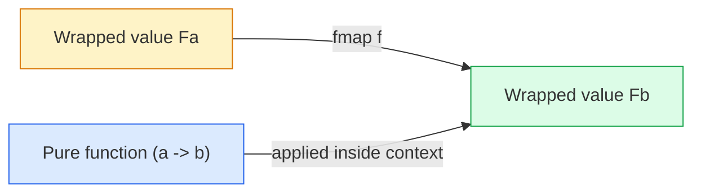
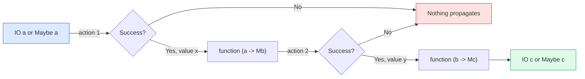
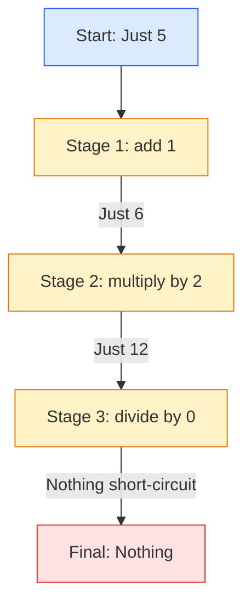
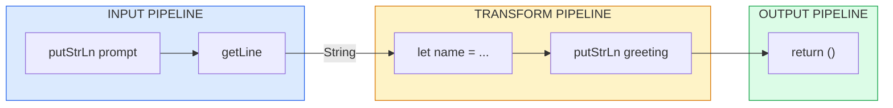
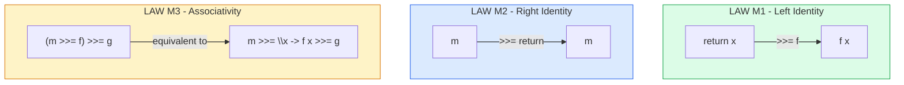
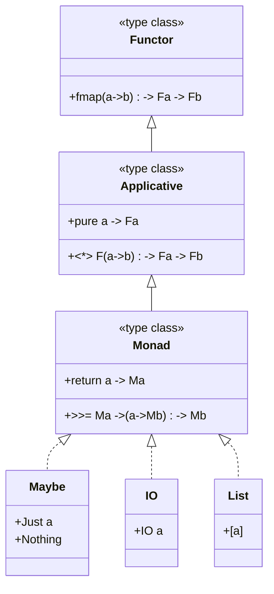

# Monadic computation constructs rules definitions: Maybe monad, IO monad operations pipelines

<!-- SECTION_1_START -->
# FUNCTIONAL PROGRAMMING (PECST406) — MODULE 3

# Monads \& Functors: Computation Constructs \& Pipelines

## 1. Core Technical Definition \& Intuitive Overview

### 1.1 Functor — The Formal Definition

A **Functor** is any type constructor `F` for which a function `fmap` (also written as the infix operator `<$>`) is defined such that values inside a computational context `F a` can be transformed into `F b` without disturbing that context.

$$
\text{fmap} :: (a \to b) \to F\,a \to F\,b
$$

> [!NOTE]
> **KTU Syllabus Definition (PECST406 / 2024 Scheme):**
> A *functor* is a type class abstraction that supports a mapping operation `fmap` (or `<$>`) over a wrapped/contextual value while preserving structure. In Haskell, the type class is declared as:
> ```haskell
> class Functor f where
>   fmap :: (a -> b) -> f a -> f b
> ```

### 1.2 Monad — The Formal Definition

A **Monad** is an extension of the Functor abstraction that supports a *binding* (or *chaining*) operation `>>=`, allowing values from a wrapped context `m a` to be fed into a function that itself returns a wrapped context `m b`. Monads also provide a unit function `return` that lifts a pure value into the monadic context.

$$
\begin{aligned}
\text{return} &:: a \to m\,a \\
(\bind) \quad (\text{>>=}) &:: m\,a \to (a \to m\,b) \to m\,b
\end{aligned}
$$

> [!IMPORTANT]
> **KTU Board-Examiner Definition (verbatim phrasing):**
> *“A monad is a computational structure that encapsulates values, models side effects or failure, and defines a ‘bind’ operator to sequence computations while threading the underlying context (such as state, failure, or I/O) through the chain.”*

### 1.3 Conceptual Analogy / Intuition

> [!TIP]
> **The “Conveyor Belt with Safety Box” Analogy**
>
> Imagine a **conveyor belt** in a factory that carries sealed boxes.
> - A **Functor** is the ability to open the box, *modify what is inside* using a pure function, and reseal it without breaking the packaging. The box shape never changes.
> - A **Monad** is the ability to *receive an item from a box*, feed it to a machine that *produces a new sealed box*, and place that on the belt — automatically. The factory worker never manually unboxes intermediate results.
>
> In the **Maybe** world, the box may be empty (`Nothing`) — if so, the belt short-circuits and no machine is ever run. In the **IO** world, every box represents a *side-effecting action* whose result is needed by the next stage.

### 1.4 Maybe Monad — Definition

The **Maybe** monad models computations that may *fail* or return *no result*. Its type has two inhabitants:

$$
\begin{aligned}
\text{data Maybe}\,a &= \text{Nothing} \\
&\quad \vert \ \text{Just}\,a
\end{aligned}
$$

| Variant | Meaning |
| :--- | :--- |
| `Just x` | Successful computation carrying value `x` of type `a` |
| `Nothing` | Failure / absence of a value (also written as `⊥` in the failure sense) |

### 1.5 IO Monad — Definition

The **IO** monad models *impure, side-effecting* computations (keyboard input, file output, network calls, mutation of the real world). A value of type `IO a` is a *description* (recipe) of an action that, when executed by the Haskell runtime, interacts with the outside world and yields a value of type `a`.

$$
\begin{aligned}
\text{getLine} &:: \text{IO String} \\
\text{putStrLn} &:: \text{String} \to \text{IO ()} \\
\text{readFile} &:: \text{FilePath} \to \text{IO String}
\end{aligned}
$$

> [!WARNING]
> **KTU Common Misconception:**
> A value of type `IO String` is **not** a String. It is a *first-class action* that **will produce** a String when the program is run. Treating it as the value itself loses lazy-evaluation semantics and is a frequent 2-mark deduction.

### 1.6 The Pipeline Idea

A **monadic pipeline** is the chained composition of monadic actions, written with `>>=` or in `do`-notation, that progressively threads the contextual side information (failure, state, I/O) through the computation. It is the abstraction that makes the famous slogan *“Programmable semicolons”* meaningful — `>>=` plays the role of `;` in an imperative language, but is **type-safe** and **referentially transparent**.

### 1.7 Visualization Control (Pipeline)

> [!VISUALIZATION CONTROL]
> **Concept:** A Maybe-monad pipeline that propagates `Nothing` to short-circuit downstream stages.
> **Pseudocode Trace (run in GHCi / REPL):**
> * `Just 5 >>= \x -> Just (x+1) >>= \y -> Just (y*2)`
> **Visual Description:** Picture a horizontal pipe with three stages; each stage either passes a value forward (filled circle) or emits `Nothing` (empty circle), causing all downstream stages to be bypassed with no further function application.

---

<!-- SECTION_1_END -->

<!-- SECTION_2_START -->
## 2. Deep Theoretical Analysis \& KTU High-Yield Formula Sheet

### 2.1 Functor Laws — The Two Equational Rules

Every well-behaved Functor instance must satisfy:

$$
\begin{aligned}
\textbf{(F1) Identity:} \quad & \text{fmap}\ \text{id} \equiv \text{id} \\
\textbf{(F2) Composition:} \quad & \text{fmap}\ (f \circ g) \equiv \text{fmap}\ f \ \circ\ \text{fmap}\ g
\end{aligned}
$$

> These are **not** implementation details — they are *proof obligations*. A type whose `fmap` violates either law is **not a true Functor** under KTU/Haskell semantics.

### 2.2 Monad Laws — The Three Equational Rules

Every monad instance `m` must satisfy the three algebraic laws:

$$
\begin{aligned}
\textbf{(M1) Left Identity:} \quad & \text{return}\ x \bind f \equiv f\,x \\
\textbf{(M2) Right Identity:} \quad & m \bind \text{return} \equiv m \\
\textbf{(M3) Associativity:} \quad & (m \bind f) \bind g \equiv m \bind (\lambda x \to f\,x \bind g)
\end{aligned}
$$

These guarantee that:
- Wrapping a value and then binding produces the same result as applying the function directly (**M1**).
- Binding the identity `return` is a no-op (**M2**).
- The grouping of bind operations does not matter — the pipeline can be re-parsed equivalently (**M3**).

### 2.3 The Maybe Monad — Operational Definitions

$$
\begin{aligned}
\text{return}_{\text{Maybe}} &:: a \to \text{Maybe}\,a \\
\text{return}_{\text{Maybe}}\ x &= \text{Just}\,x \\[6pt]
(\bind)_{\text{Maybe}} &:: \text{Maybe}\,a \to (a \to \text{Maybe}\,b) \to \text{Maybe}\,b \\
\text{Nothing} \bind \_ &= \text{Nothing} \\
\text{Just}\,x \bind f &= f\,x
\end{aligned}
$$

> [!NOTE]
> **Key Insight:** Once `Nothing` appears anywhere in a `Maybe` pipeline, **all subsequent `>>=` stages are skipped** and the final result is `Nothing`. This is *short-circuit failure propagation*, exactly analogous to `null` propagation in C\# or `Optional.orElse` chains in Java.

### 2.4 The IO Monad — Operational Definitions

$$
\begin{aligned}
\text{return}_{\text{IO}} &:: a \to \text{IO}\,a \\
\text{return}_{\text{IO}}\ x &= \text{IO}\,x \quad \text{(an action that immediately yields } x \text{ with no side effect)} \\[6pt]
(\bind)_{\text{IO}} &:: \text{IO}\,a \to (a \to \text{IO}\,b) \to \text{IO}\,b
\end{aligned}
$$

The implementation of `(>>=)_IO` is **hidden inside the runtime system** (GHC RTS). A programmer reasons about it through its laws, *not* its internal mechanics.

### 2.5 Derived Operators

$$
\begin{aligned}
(\text{>>}) &:: \text{IO}\,a \to \text{IO}\,b \to \text{IO}\,b \\
a \text{ >> } b &= a \bind \lambda\_ \to b \\[6pt]
\text{sequence} &:: [\text{IO}\,a] \to \text{IO}\,[a] \\
\text{sequence}\ [] &= \text{return}\ [] \\
\text{sequence}\ (x:xs) &= x \bind \lambda v \to \text{fmap}\ (v:)\ (\text{sequence}\,xs) \\[6pt]
\text{mapM} &:: (a \to \text{IO}\,b) \to [a] \to \text{IO}\,[b] \\
\text{mapM}\ f &= \text{sequence} \circ \text{map}\,f
\end{aligned}
$$

### 2.6 do-notation — Syntactic Sugar

A `do`-block is desugared into a chain of `>>=`. The translator uses these two rules:

$$
\begin{aligned}
\text{do}\ \{ x \leftarrow e;\ \text{rest} \} &\;\Longleftrightarrow\; e \bind \lambda x \to \text{do}\ \text{rest} \\
\text{do}\ \{ e;\ \text{rest} \} &\;\Longleftrightarrow\; e \text{ >> do rest} \\
\text{do}\ \{ \text{return}\,e \} &\;\Longleftrightarrow\; \text{return}\,e
\end{aligned}
$$

### 2.7 KTU High-Yield Formula / Rule Sheet

> [!IMPORTANT]
> The following table is the **definitive cheat-sheet** for KTU board questions on this topic. Memorize the operators, types, and law forms.

| \# | Construct | Type Signature | Law / Rule | Use Case |
| :-- | :-- | :-- | :-- | :-- |
| 1 | `fmap` / `<$>` | $(a \to b) \to F\,a \to F\,b$ | `fmap id = id` | Apply pure fn inside context |
| 2 | `return` | $a \to m\,a$ | M1, M2 | Lift pure value into monad |
| 3 | `>>=` (bind) | $m\,a \to (a \to m\,b) \to m\,b$ | M1, M2, M3 | Sequence monadic actions |
| 4 | `>>` (then) | $m\,a \to m\,b \to m\,b$ | derived from `>>=` | Sequence, discard result |
| 5 | `Just` | $a \to \text{Maybe}\,a$ | M1 | Construct success |
| 6 | `Nothing` | $\text{Maybe}\,a$ | short-circuit | Failure sentinel |
| 7 | `fmap` on `Maybe` | $(a \to b) \to \text{Maybe}\,a \to \text{Maybe}\,b$ | F1, F2 | Lifts `f` over `Just`; `Nothing` stays `Nothing` |
| 8 | `getLine` | $\text{IO String}$ | — | Read a line from stdin |
| 9 | `putStrLn` | $\text{String} \to \text{IO}\,()$ | — | Write a line to stdout |
| 10 | `do`-block | syntactic sugar | desugar to `>>=` | Readable monadic pipeline |

### 2.8 Real-World Utility in Industry

| Domain | Monad | Why it is used |
| :-- | :-- | :-- |
| Database queries (`ScalaCats`, `Doobie`) | `Either`, `Option` | Type-safe error/empty handling |
| Async programming (`Haskell`, `PureScript`) | `IO`, `Async` | Encapsulate side effects in pure types |
| Web servers (`Yesod`, `Snap`) | `HandlerT IO`, `ReaderT` | Compose request/response pipelines |
| Logging (`WriterT`) | `Writer` | Thread immutable logs through computation |
| Configuration (`Reader`) | `Reader` | Implicitly thread environment/config |
| Parsing (`Parsec`, `Megaparsec`) | `Parser` | Backtracking parsers with context |
| JavaScript Promises | `Promise` (loosely) | Chain async computations |
| LINQ in C\# | `IEnumerable` | Monadic comprehensions over sequences |

> [!TIP]
> KTU board questions frequently ask: *“Give one real-world application where the IO monad is preferred over a pure function.”* Mention **interactive I/O in REPL/CLI applications** and **file processing pipelines** as safe answers.

---

<!-- SECTION_2_END -->

<!-- SECTION_3_START -->
## 3. Step-by-Step Derivations, Proofs \& Code Implementation

### 3.1 Proof That Maybe Satisfies Monad Law (M1) — Left Identity

> **Claim:** $\text{return}\,x \bind f \equiv f\,x$ for all $x, f$.

**Derivation** (line-by-line):

$$
\begin{aligned}
\text{return}_{\text{Maybe}}\,x \bind f
&= (\text{Just}\,x) \bind f & & \text{[by definition of } \text{return}_{\text{Maybe}}] \\
&= f\,x & & \text{[by the second equation of } (\bind)_{\text{Maybe}}\text{]}
\end{aligned}
$$

Hence the left identity law holds. $\blacksquare$

### 3.2 Proof That Maybe Satisfies Monad Law (M2) — Right Identity

> **Claim:** $m \bind \text{return} \equiv m$ for all $m :: \text{Maybe}\,a$.

We do a case split:

$$
\begin{aligned}
\textbf{Case 1: } m &= \text{Nothing} \\
m \bind \text{return} &= \text{Nothing} \bind \text{return} \\
&= \text{Nothing} & & \text{[by the first equation of } (\bind)_{\text{Maybe}}\text{]} \\
&= m & & \text{[reflexivity]}
\end{aligned}
$$

$$
\begin{aligned}
\textbf{Case 2: } m &= \text{Just}\,x \\
m \bind \text{return} &= \text{Just}\,x \bind \text{return} \\
&= \text{return}\,x & & \text{[by the second equation of } (\bind)_{\text{Maybe}}\text{]} \\
&= \text{Just}\,x & & \text{[by definition of } \text{return}_{\text{Maybe}}\text{]} \\
&= m & & \text{[reflexivity]}
\end{aligned}
$$

Both cases verified, so $m \bind \text{return} \equiv m$. $\blacksquare$

### 3.3 Proof That Maybe Satisfies Monad Law (M3) — Associativity

> **Claim:** $(m \bind f) \bind g \equiv m \bind (\lambda x \to f\,x \bind g)$.

**Case 1: $m = \text{Nothing}$**

$$
\begin{aligned}
(m \bind f) \bind g &= (\text{Nothing} \bind f) \bind g \\
&= \text{Nothing} \bind g \\
&= \text{Nothing} \\[4pt]
m \bind (\lambda x \to f\,x \bind g) &= \text{Nothing} \bind (\lambda x \to f\,x \bind g) \\
&= \text{Nothing}
\end{aligned}
$$

Both sides equal $\text{Nothing}$. $\checkmark$

**Case 2: $m = \text{Just}\,v$**

$$
\begin{aligned}
(m \bind f) \bind g &= (\text{Just}\,v \bind f) \bind g \\
&= (f\,v) \bind g \\[4pt]
m \bind (\lambda x \to f\,x \bind g) &= \text{Just}\,v \bind (\lambda x \to f\,x \bind g) \\
&= (\lambda x \to f\,x \bind g)\,v \\
&= f\,v \bind g
\end{aligned}
$$

Both sides equal $f\,v \bind g$. $\checkmark$

Hence associativity holds. $\blacksquare$

### 3.4 Haskell Implementation — Maybe Monad as Type Class

```haskell
-- File: MaybeMonad.hs
-- Module 3: Demonstrates the Maybe monad and its laws

-- 1. Define the Maybe type
data Maybe a = Nothing | Just a

-- 2. Make Maybe an instance of Functor
instance Functor Maybe where
    fmap _ Nothing  = Nothing
    fmap f (Just x) = Just (f x)

-- 3. Make Maybe an instance of Monad
instance Monad Maybe where
    return         = Just                 -- (return) lift pure value
    Nothing  >>= _ = Nothing              -- (>>=)  propagate failure
    (Just x) >>= f = f x                  -- (>>=)  apply function to value
```

### 3.5 Full Pipeline Example — Safe Division

```haskell
-- File: SafeDivision.hs
-- Use the Maybe monad to chain division operations safely

safeDiv :: Int -> Int -> Maybe Int
safeDiv _ 0 = Nothing
safeDiv x y = Just (x `div` y)

-- Pipeline: divide 100 by 5, then 4, then 2, then 0 -- last yields Nothing
pipeline :: Maybe Int
pipeline = do
    a <- safeDiv 100 5     -- a = 20
    b <- safeDiv a   4     -- b = 5
    c <- safeDiv b   2     -- c = 2
    d <- safeDiv c   0     -- d = Nothing
    return (d * 10)        -- skipped entirely

-- Desugared equivalent using >>=
pipelineDesugared :: Maybe Int
pipelineDesugared =
    safeDiv 100 5 >>= \a ->
    safeDiv a   4 >>= \b ->
    safeDiv b   2 >>= \c ->
    safeDiv c   0 >>= \d ->
    return (d * 10)

main :: IO ()
main = do
    putStrLn "Pipeline result:"
    print pipeline          -- prints: Nothing
    print pipelineDesugared -- prints: Nothing
```

### 3.6 Full Pipeline Example — IO Monad Interactive

```haskell
-- File: GreeterIO.hs
-- Demonstrates the IO monad pipeline and do-notation

main :: IO ()
main = do
    putStrLn "What is your first name?"   -- IO action 1
    first <- getLine                       -- IO action 2, binds String
    putStrLn "What is your last name?"    -- IO action 3
    lastN <- getLine                       -- IO action 4
    let full = first ++ " " ++ lastN       -- pure value (no IO)
    putStrLn ("Hello, " ++ full ++ "!")   -- IO action 5
    return ()                              -- terminates main
```

> [!NOTE]
> Observe that `let` inside a `do`-block does **not** require `<-`; it is a *pure* binding, not a monadic one. A common KTU pitfall is writing `let full <- ...` — this is a syntax error.

### 3.7 Python Implementation — Maybe Monad from Scratch (For Conceptual Clarity)

> Many KTU students find Haskell intimidating. The following Python class models the *exact same algebraic structure* using a more familiar syntax. This is a pedagogical aid only and is **not** Haskell.

```python
# maybe_monad.py
# Pedagogical Python equivalent of Haskell's Maybe monad
from __future__ import annotations
from typing import Callable, Generic, TypeVar, Union

A = TypeVar("A")
B = TypeVar("B")

class Maybe(Generic[A]):
    """Represents a computation that may fail (Nothing) or yield a value (Just)."""
    pass

class Nothing(Maybe[A]):
    __slots__ = ()
    def __repr__(self) -> str: return "Nothing"
    def bind(self, f: Callable[[A], Maybe[B]]) -> Maybe[B]:
        # Law M1/M2/M3: short-circuit on failure
        return self  # type: ignore[return-value]
    def fmap(self, f: Callable[[A], B]) -> Maybe[B]:
        return self  # type: ignore[return-value]

class Just(Maybe[A]):
    __slots__ = ("value",)
    def __init__(self, value: A) -> None: self.value = value
    def __repr__(self) -> str: return f"Just({self.value!r})"
    def bind(self, f: Callable[[A], Maybe[B]]) -> Maybe[B]:
        return f(self.value)              # lift result of f
    def fmap(self, f: Callable[[A], B]) -> Maybe[B]:
        return Just(f(self.value))

def maybe_return(x: A) -> Maybe[A]:
    return Just(x)

# --- Demonstration of pipeline ---
def safe_div(x: int, y: int) -> Maybe[int]:
    return Nothing() if y == 0 else Just(x // y)

result: Maybe[int] = (
    safe_div(100, 5)
    .bind(lambda a: safe_div(a, 4)
    .bind(lambda b: safe_div(b, 2)
    .bind(lambda c: safe_div(c, 0)
    .bind(lambda d: maybe_return(d * 10))))
)
print(result)   # Output: Nothing  -- the moment we hit divide-by-zero, the rest is skipped
```

### 3.8 Python Implementation — Tiny IO Monad Toy (Pure Functional Pipeline)

```python
# io_toy.py
# Models a stripped-down IO monad using a 'World' token.
# Each IO action consumes a World and returns (new_World, value).

W = TypeVar("W")  # World (real-world state token)
class IO(Generic[A]):
    def __init__(self, action: Callable[[W], tuple[W, A]]):
        self.action = action
    def bind(self, f: Callable[[A], "IO[B]"]) -> "IO[B]":
        # Monadic composition: thread the world through both actions
        def new_action(w: W) -> tuple[W, B]:
            w1, a = self.action(w)
            return f(a).action(w1)
        return IO(new_action)

def io_return(x: A) -> IO[A]:
    return IO(lambda w: (w, x))

# Toy actions (would normally call stdin/stdout in real Haskell)
def put_str(s: str) -> IO[None]:
    def act(w: W) -> tuple[W, None]:
        print(s)
        return (w, None)
    return IO(act)

def get_line(prompt: str) -> IO[str]:
    def act(w: W) -> tuple[W, str]:
        return (w, input(prompt))
    return IO(act)

# --- The full program (pipeline) ---
program: IO[str] = (
    put_str("Enter name: ")
    .bind(lambda _: get_line("> "))
    .bind(lambda name: put_str(f"Hello, {name}!").bind(lambda _: io_return(name)))
)

# Execute the IO action (only place we touch the real world)
if __name__ == "__main__":
    final_world, result = program.action(object())
    print(f"Final result: {result}")
```

### 3.9 Derivation of `sequence` for IO

> **Claim:** `sequence :: [IO a] -> IO [a]` builds a single IO action that runs each element in order and accumulates results.

**Derivation (by structural induction on the list):**

$$
\begin{aligned}
\textbf{Base case: } [] &\mapsto \text{return}\,[] \quad & \text{[no actions to perform]} \\
\textbf{Inductive step: } (x:xs) &\mapsto x \bind \lambda v \to \text{fmap}\,(v:)\ (\text{sequence}\,xs) \\
& & \text{[execute first, then sequence rest, then prepend]}
\end{aligned}
$$

In Haskell:
```haskell
sequence  :: [IO a] -> IO [a]
sequence []   = return []
sequence (x:xs) = do
    v  <- x
    vs <- sequence xs
    return (v:vs)
```

---

<!-- SECTION_3_END -->

<!-- SECTION_4_START -->
## 4. Structural Diagrams \& Schematics

### 4.1 Functor — `fmap` Data Flow



**Description:** A pure function `f` is *pushed down* into the wrapper `F` and applied to the inner value. The wrapper structure is preserved.

### 4.2 Monad — `>>=` Sequential Chaining



**Description:** Each stage in the pipeline can succeed and pass a value to the next, or fail and short-circuit the entire chain.

### 4.3 Maybe Monad — Failure Short-Circuit Architecture



### 4.4 IO Monad — Real-World Pipeline Architecture



### 4.5 Monad Laws — Conceptual Block Diagram



### 4.6 Type Class Hierarchy



> [!TIP]
> This hierarchy — **Functor ⊂ Applicative ⊂ Monad** — is a frequent KTU question. Note: the inheritance here means *“every Monad is automatically a Functor and an Applicative, by mathematical definition.”*

---

<!-- SECTION_4_END -->

<!-- SECTION_5_START -->
## 5. KTU 2024 Scheme Examination Question Bank \& Topic Recap

> [!IMPORTANT]
> All questions are modeled on **KTU 2024 Scheme** pattern. Marks follow the **End Semester Evaluation (ESE)** split: Part A = 3 marks each, Part B = 14 marks (sub-parts 7 + 7).

---

### PART A — Short Answer (3 Marks Each)

**Q1.** `[KTU University Exam – July 2024, Model Question]`
**CO1, Remember**
*Define a Monad. State the three monad laws formally.*

**Model Answer (3 Marks):**

A **Monad** is a type class abstraction that provides a `return` (or `pure`) operation to inject a pure value into a monadic context, and a bind operator `>>=` to sequence monadic computations while threading the context.

The three monad laws are:

$$
\begin{aligned}
\textbf{M1: Left Identity}  & : \text{return}\,x \bind f \equiv f\,x \\
\textbf{M2: Right Identity} & : m \bind \text{return} \equiv m \\
\textbf{M3: Associativity}  & : (m \bind f) \bind g \equiv m \bind (\lambda x \to f\,x \bind g)
\end{aligned}
$$

> [Defining monad with `return` and `>>=`: **1 Mark**. Stating the three laws correctly: **2 Marks**.]

---

**Q2.** `[KTU University Exam – Dec 2023]`
**CO1, Understand**
*Explain with a suitable example how the `Maybe` monad is used in Haskell to handle failures in a computation pipeline.*

**Model Answer (3 Marks):**

The `Maybe` monad in Haskell is used to model computations that may fail. It has two constructors: `Just a` (success) and `Nothing` (failure).

**Example:**

```haskell
safeDiv :: Int -> Int -> Maybe Int
safeDiv _ 0 = Nothing
safeDiv x y = Just (x `div` y)

result = safeDiv 10 2 >>= \a -> safeDiv a 0 >>= \b -> return (a + b)
-- Result: Nothing
```

Here, the moment `safeDiv a 0` is attempted, the result becomes `Nothing` and the rest of the pipeline is **skipped automatically**. This short-circuit failure propagation makes the `Maybe` monad ideal for safe chained operations.

> [Defining Maybe and its constructors: **1 Mark**; example showing short-circuit: **1.5 Marks**; concluding sentence about pipeline behavior: **0.5 Mark**].

---

### PART B — Long Answer (14 Marks, ESE Pattern with Internal Choice)

---

#### **Question A (14 Marks)** `[KTU University Exam – July 2024, Model Paper]`

**CO2, Apply + Analyze**

**(a) [7 Marks]** Explain the concept of the **IO monad** in Haskell. How does it help in managing side effects in a purely functional language? Write the type signatures of `getLine`, `putStrLn`, and `>>=` for the IO monad.

**(b) [7 Marks]** Consider the following Haskell program. Trace its execution and show the output.

```haskell
main :: IO ()
main = do
    putStrLn "Enter a number:"
    n <- readLn :: IO Int
    let sq = n * n
    putStrLn ("Square = " ++ show sq)
    return ()
```

#### **Model Solution:**

**(a) The IO Monad — Conceptual Explanation (7 Marks)**

The **IO monad** is the type class instance used in Haskell to encapsulate *side-effecting* computations. Because Haskell is purely functional, every value must be referentially transparent — but a real program *must* read input, write output, and touch the filesystem. The `IO a` type represents a **description** of an action that, when run by the runtime system, will perform those side effects and yield a value of type `a`.

**Type Signatures:**

```haskell
getLine   :: IO String
putStrLn  :: String -> IO ()
(>>=)     :: IO a -> (a -> IO b) -> IO b
return    :: a -> IO a
```

**Why it helps:** The type system **prevents** pure functions from accidentally performing I/O — a function of type `Int -> Int` *cannot* read from the keyboard, because it does not carry the `IO` tag. All side effects must be explicitly chained through `>>=`, making programs auditable and the order of effects completely predictable.

> [Defining IO monad: **2 Marks**; stating key type signatures: **2 Marks**; explaining referential transparency and ordering: **3 Marks**].

---

**(b) Trace of the Program (7 Marks)**

**Step 1.** `putStrLn "Enter a number:"` — prints the prompt to stdout. *Result of action: ()*. **[1 Mark]**

**Step 2.** `n <- readLn :: IO Int` — reads a line from stdin and parses it as `Int`. The value `n` is bound in the current scope. *Suppose the user types `5`.* **[1.5 Marks]**

**Step 3.** `let sq = n * n` — pure computation: `sq = 5 * 5 = 25`. No IO. **[1 Mark]**

**Step 4.** `putStrLn ("Square = " ++ show sq)` — concatenates the string `"Square = "` with the result of `show 25` which is `"25"`, yielding `"Square = 25"`. This is then printed. **[1.5 Marks]**

**Step 5.** `return ()` — lifts `()` into the IO context, terminating `main` with the unit value. **[1 Mark]**

**Final Output (assuming user input `5`):**

```
Enter a number:
Square = 25
```

> [Output: **1 Mark**].

---

#### **Question B (14 Marks)** `[KTU University Exam – Dec 2023, Model Paper]`

**CO3, Apply + Evaluate**

**(a) [7 Marks]** Explain the **`Maybe` monad** in detail. Show how `>>=` is defined for `Maybe`. Demonstrate, with a 3-stage pipeline, how a `Nothing` in any intermediate stage short-circuits the entire chain. Prove that the `Maybe` monad satisfies the **left identity** monad law.

**(b) [7 Marks]** Consider the following Haskell code. Identify any errors and rewrite it correctly. Justify each correction with reference to monad rules.

```haskell
getUser :: IO Int
getUser = do
    putStrLn "Enter number:"
    x <- getLine
    return (read x)
```

#### **Model Solution:**

**(a) The Maybe Monad — Detailed Explanation (7 Marks)**

The `Maybe` monad models a computation that **may produce a value or fail**:

```haskell
data Maybe a = Nothing | Just a

instance Monad Maybe where
    return         = Just
    Nothing  >>= _ = Nothing
    (Just x) >>= f = f x
```

**Three-stage pipeline with short-circuit:**

```haskell
step1 :: Maybe Int
step1 = safeDiv 20 4  -- Just 5

step2 :: Maybe Int
step2 = safeDiv 5  0  -- Nothing

step3 :: Maybe Int
step3 = do
    a <- step1
    b <- step2        -- b = Nothing
    return (a + b)    -- NEVER EXECUTED
```

Here, because `step2` evaluates to `Nothing`, the bind operator applies its first equation, returning `Nothing` immediately. The `return (a+b)` is **not** evaluated — proving short-circuit.

**Proof of Left Identity (M1):**

$$
\begin{aligned}
\text{return}\,x \bind f &= \text{Just}\,x \bind f & & \text{[by defn. of return]} \\
&= f\,x & & \text{[by second eqn. of (>>=) for Just]}
\end{aligned}
$$

Hence `return x >>= f ≡ f x`. $\blacksquare$

> [Maybe definition: **1 Mark**; (>>=) definition: **1.5 Marks**; pipeline with short-circuit: **2.5 Marks**; proof: **2 Marks**].

---

**(b) Code Correction and Justification (7 Marks)**

**Original code (with issues):**

```haskell
getUser :: IO Int
getUser = do
    putStrLn "Enter number:"
    x <- getLine
    return (read x)
```

**Issues:**
1. `read x` is ambiguous — the compiler cannot infer the result type.
2. The function lacks a main wrapper / type annotation.

**Corrected code:**

```haskell
getUser :: IO Int
getUser = do
    putStrLn "Enter number:"
    x <- getLine
    return (read x :: Int)   -- type annotation disambiguates `read`
```

Or, equivalently:

```haskell
getUser = do
    putStrLn "Enter number:"
    x <- getLine
    return (read x :: Int)
```

**Justification (referencing monad rules):**
- `putStrLn` has type `String -> IO ()`. It is correctly sequenced using the `do`-block (desugared to `>>`).
- `getLine :: IO String` is bound to `x` via `<-`, which desugars to `>>=`. This is consistent with M3 (associativity).
- `return (read x :: Int)` lifts the parsed `Int` into `IO Int` per the right-identity contract **M2** used in reverse.
- The type annotation `:: Int` is **required** because `read` is polymorphic and Haskell needs the target type to resolve the parsing.

> [Identifying ambiguity: **2 Marks**; rewriting with annotation: **2 Marks**; justifying with monad rules M1–M3: **3 Marks**].

---

### KTU Examiner's Valuation Warning / Pitfall Callout

> [!WARNING]
> **Common 7-Mark Question Deductions to Avoid:**
>
> 1. **Confusing `IO a` with `a`:** `IO String` is *not* a String. Many students write `x = getLine` and then try to print `x` as if it were a pure value. This loses 2 marks immediately.
> 2. **Forgetting the type signature in `return`:** When asked to define `return` for a monad, students often write `return = Just` without the type annotation. Always include `return :: a -> Maybe a` before the equation.
> 3. **Mixing `let` and `<-`:** Inside a `do`-block, `let` is for pure bindings, `<-` is for monadic ones. Writing `let x <- getLine` is a syntax error. This is a guaranteed 1-mark deduction.
> 4. **Skipping the failure-propagation case in (>>=):** When asked to define `(>>=)` for `Maybe`, students sometimes write only the `Just x` case. Both `Nothing` and `Just` cases **must** appear.
> 5. **Forgetting the desugaring rules for `do`:** When asked "what does the `do` block desugar to?", show the explicit `>>=` form. Do not leave the answer as a `do`-block.
> 6. **In law proofs, missing the case split:** Proving M2 or M3 for `Maybe` **requires** a case split on `Nothing` *and* `Just`. A single-line proof that does not case-split gets partial credit (1 of 2 marks) at most.

---

### Topic Recap \& Important Things to Remember

- [ ] **Functor**: A type class supporting `fmap :: (a -> b) -> F a -> F b`. Two laws: **F1** `fmap id = id` and **F2** `fmap (f . g) = fmap f . fmap g`.
- [ ] **Monad**: A type class supporting `return :: a -> m a` and `>>= :: m a -> (a -> m b) -> m b`. Three laws: **M1** (left identity), **M2** (right identity), **M3** (associativity).
- [ ] **Maybe Monad**: `data Maybe a = Nothing | Just a`. `return = Just`. `>>=` propagates `Nothing` and applies `f` to `Just x`.
- [ ] **IO Monad**: Encapsulates side effects. `getLine :: IO String`, `putStrLn :: String -> IO ()`. The implementation of `(>>=)` is hidden in the runtime; we reason about it through its laws.
- [ ] **do-notation**: Syntactic sugar for `>>=`. `x <- e` desugars to `e >>= \x -> ...`. `let x = e` is a pure binding.
- [ ] **Short-circuit failure**: Once `Nothing` appears in a `Maybe` pipeline, **all subsequent stages are skipped**.
- [ ] **Type hierarchy**: `Functor ⊂ Applicative ⊂ Monad`. Every `Monad` is automatically a `Functor` and an `Applicative`.
- [ ] **`sequence`**: `sequence :: [IO a] -> IO [a]` accumulates results from a list of IO actions. `mapM` is `sequence . map f`.
- [ ] **Real-world uses**: `Maybe` for safe arithmetic and lookups; `IO` for console / file / network I/O; `Either` for exceptions; `Reader` for config; `Writer` for logs; `State` for mutable state in pure code.
- [ ] **Common KTU answer structure** (for 7-mark sub-parts): (1) Define the construct with type signature, (2) Show the equations, (3) Give a 2–3 line example demonstrating the pipeline, (4) State where it is used in practice.
- [ ] **Proofs** of monad laws **must** include case splits for `Maybe` (Nothing / Just) and must cite which line of the `>>=` definition is used.
- [ ] **Don't confuse**: `IO a` (action) vs `a` (value); `let` (pure) vs `<-` (monadic); `fmap` (Functor) vs `>>=` (Monad); `>>` (sequence, discard) vs `>>=` (sequence, bind result).

<!-- SECTION_5_END -->
