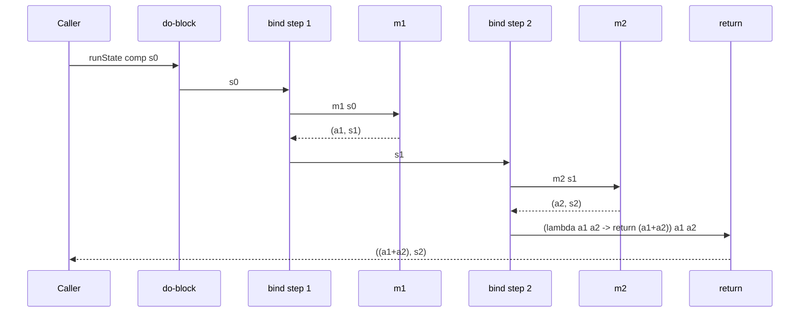

# State computation wrappers implementations inside functional blocks frameworks

<!-- SECTION_1_START -->
# State Computation Wrappers: Functors & Monads as Abstractions

> [!NOTE]
> **KTU Module 3 Focus — PECST406 Functional Programming**
> In pure functional programming, computations that *carry state* (a counter, a random seed, a parser position, a configuration record) must be expressed **without mutating variables**. The KTU 2024 syllabus introduces **functors** and **monads** as the two principal *type-class abstractions* used to wrap and chain such stateful computations inside purely functional blocks.

## 1.1 Formal Definition

A **state computation** is a pure function of the form

$$ \text{State} \, s \, a \;=\; s \;\to\; (a, s) $$

It is a function that, given an input state $s$, produces a result value $a$ **together with** a new state $s$. The state is *threaded* explicitly through the call chain, replacing the implicit global mutation of imperative code.

A **Functor** is a type class $F$ that supports the operation

$$ \text{fmap} \;:: \; (a \to b) \;\to\; F\,a \;\to\; F\,b $$

A **Monad** is a type class that supports the two primitive operations

$$ \text{return} \;:: \; a \to m\,a \qquad\qquad \text{(\,\(\texttt{return}\)\, injects a plain value)} $$

$$ (\,\texttt{>>=}\,\) \;:: \; m\,a \;\to\; (a \to m\,b) \;\to\; m\,b \qquad\qquad \text{(bind — chains computations)} $$

For the **State** wrapper specifically, the type and the two primitives are:

$$ \text{type State}\,s\,a \;=\; s \to (a, s) $$

$$ \text{return} \, a \;=\; \lambda s \;\to\; (a, s) $$

$$ m \,\texttt{>>=}\, k \;=\; \lambda s_0 \;\to\; \text{let } (a, s_1) = m\,s_0 \text{ in } k\,a\,s_1 $$

## 1.2 Conceptual Analogy — The "Traveller's Parcel"

> [!IMPORTANT]
> **Analogy: The Parcel with a Hidden Ledger**
> Imagine a courier who carries a **sealed parcel** (the result value $a$) and an **internal ledger** (the state $s$). The courier never opens the ledger for the outside world. Every time the parcel is passed to the next station, the courier *updates* the ledger internally and hands over a *new* sealed parcel. The *State monad* is the abstract "courier service" — a contract that guarantees (1) the ledger is always passed forward, (2) no one can tamper with the ledger from outside, and (3) the parcel remains *pure* (it contains no side effects, only values). The **functor** abstraction, by contrast, is a simpler contract: just "let me transform what is inside the box, without opening the seal".

Geometrically, you can picture a State computation as an arrow on a 1-D number line:

> [!VISUALIZATION CONTROL]
> **Concept:** Visualising the threading of state through a chain of two State computations.
> **GeoGebra / Desmos Input Equations:**
> * Parametric line: $(x(t),y(t)) = (t,\, t)$ with $t \in [0,2]$
> * Two stage markers: $P_0=(0,0)$, $P_1=(1,1)$, $P_2=(2,2)$
> * State values labelled at markers: $s_0=0$, $s_1=1$, $s_2=2$
> **Visual Description:** Each segment of the line represents the passage of the state from one computation step to the next. The value $a_i$ is an *auxiliary output* drawn perpendicular to the state axis (a small vertical tick at each marker). The student should observe that the state value is **monotonically threaded** along the line, even though the *result values* $a_0, a_1, a_2$ are independent of the state axis.

## 1.3 Why This Matters in the KTU Syllabus

| Aspect | Imperative (Mutable) | Functional (Wrapped) |
|---|---|---|
| State storage | Global variable, hidden | Explicit parameter, visible in the type |
| Effect on purity | Breaks referential transparency | Preserved — same input $\Rightarrow$ same output |
| Reasoning | Requires flow analysis | Equational: rewrite using **monad laws** |
| Composition | Nested loops / callbacks | Linear chain of $\texttt{>>=}$ |

> [!NOTE]
> The KTU Module 3 syllabus explicitly tests whether a student can *implement* a state-computation wrapper using functor $\texttt{fmap}$ and monadic $\texttt{>>=}$ primitives, and *apply* it to problems such as random-number generation, counter accumulation, and parser position threading.

## 1.4 The Three Type Classes — A First Glance

$$ \text{Functor} :\; \text{fmap} \;\;:\;\; F\,a \to (a \to b) \to F\,b $$

$$ \text{Applicative} :\; \text{pure} \;\;:\;\; a \to F\,a \quad,\quad \langle * \rangle \;\;:\;\; F\,(a \to b) \to F\,a \to F\,b $$

$$ \text{Monad} :\; \text{return} \;\;:\;\; a \to m\,a \quad,\quad \texttt{>>=} \;\;:\;\; m\,a \to (a \to m\,b) \to m\,b $$

The hierarchy is **Functor $\subset$ Applicative $\subset$ Monad** — every Monad is automatically an Applicative, and every Applicative is automatically a Functor.

<!-- SECTION_1_END -->

<!-- SECTION_2_START -->
# Deep Theoretical Analysis & KTU High-Yield Formula Sheet

## 2.1 Anatomy of a State Computation

A value of type $\text{State}\,s\,a$ is a *first-class function*. When you "run" it, you supply an initial state and receive a pair. Three standard runners exist:

$$ \text{runState} \;:: \; \text{State}\,s\,a \;\to\; s \;\to\; (a, s) \quad\text{(the unwrapped function itself)} $$

$$ \text{evalState} \;:: \; \text{State}\,s\,a \;\to\; s \;\to\; a \quad\text{(discard the final state, keep only the value)} $$

$$ \text{execState} \;:: \; \text{State}\,s\,a \;\to\; s \;\to\; s \quad\text{(discard the value, keep only the final state)} $$

They are simply projections on the output pair:

$$ \text{evalState}\,m\,s_0 \;=\; \text{fst}\;\big(m\,s_0\big) \qquad\qquad \text{execState}\,m\,s_0 \;=\; \text{snd}\;\big(m\,s_0\big) $$

## 2.2 The Two Fundamental State Primitives

Two helper functions are used in *every* state library:

$$ \text{get} \;:: \; \text{State}\,s\,s \;=\; \lambda s \;\to\; (s, s) $$

$$ \text{put} \;:: \; s \;\to\; \text{State}\,s\,() \;=\; \lambda s' \;\to\; \lambda s \;\to\; ((), s') $$

$\text{get}$ reads the current state without changing it. $\text{put}\,s'$ overwrites the state with $s'$ and returns the unit value $()$.

A third convenience, $\text{modify}$, applies a transformation to the current state:

$$ \text{modify} \;:: \; (s \to s) \;\to\; \text{State}\,s\,() \;=\; \lambda f \;\to\; \text{get} \,\texttt{>>=}\, \lambda s \;\to\; \text{put}\,(f\,s) $$

## 2.3 The Monad Instance for State

The complete instance, written out in full, is:

$$ \text{return}\,a \;=\; \lambda s \;\to\; (a, s) $$

$$ m \,\texttt{>>=}\, k \;=\; \lambda s_0 \;\to\; \text{let } (a, s_1) = m\,s_0 \text{ in } k\,a\,s_1 $$

The state $s_1$ produced by the *first* computation is the state passed to the *second* computation $k\,a$. This is the precise moment of *threading*.

## 2.4 Monad Laws (Must Hold for Any Correct Instance)

For any monad, the following three equations must be satisfied. They are **the KTU board's most-favoured proof question**.

$$ \text{(Left Identity)} \quad \text{return}\,a \,\texttt{>>=}\, k \;\equiv\; k\,a $$

$$ \text{(Right Identity)} \quad m \,\texttt{>>=}\, \text{return} \;\equiv\; m $$

$$ \text{(Associativity)} \quad (m \,\texttt{>>=}\, k) \,\texttt{>>=}\, h \;\equiv\; m \,\texttt{>>=}\, (\lambda x \;\to\; k\,x \,\texttt{>>=}\, h) $$

For the State monad, these reduce to ordinary function-equality proofs that are easily written out in the exam.

## 2.5 Functor & Applicative Instances for State

$$ \text{fmap}\,f\,m \;=\; m \,\texttt{>>=}\, (\lambda a \;\to\; \text{return}\,(f\,a)) \;\;:\;\; \text{Functor} $$

$$ \text{pure} \;=\; \text{return} $$

$$ m_f \,\langle * \rangle\, m_a \;=\; m_f \,\texttt{>>=}\, (\lambda f \;\to\; m_a \,\texttt{>>=}\, (\lambda a \;\to\; \text{return}\,(f\,a))) \;\;:\;\; \text{Applicative} $$

> [!NOTE]
> **Why $\texttt{fmap} = \texttt{>>=}$ + $\texttt{return}$?**
> Lifting a pure function $f$ into a wrapped context is the same as binding: take the wrapped value $m$, extract the inside $a$, apply $f$, and re-wrap. This is the *raison d'être* of the Functor–Monad relationship.

## 2.6 KTU High-Yield Formula Cheat Sheet

| Symbol / Function | Type Signature | Meaning |
|---|---|---|
| $\text{State}\,s\,a$ | $s \to (a, s)$ | A stateful computation producing $a$ |
| $\text{return} \equiv \text{pure}$ | $a \to \text{State}\,s\,a$ | Lift a pure value, leave state untouched |
| $\texttt{>>=}$ | $m\,a \to (a \to m\,b) \to m\,b$ | Sequence, threading the state |
| $\text{get}$ | $\text{State}\,s\,s$ | Read current state |
| $\text{put}$ | $s \to \text{State}\,s\,()$ | Overwrite the state |
| $\text{modify}$ | $(s \to s) \to \text{State}\,s\,()$ | Transform the current state |
| $\text{runState}$ | $\text{State}\,s\,a \to s \to (a, s)$ | Execute the wrapper, return both outputs |
| $\text{evalState}$ | $\text{State}\,s\,a \to s \to a$ | Execute, keep only the value |
| $\text{execState}$ | $\text{State}\,s\,a \to s \to s$ | Execute, keep only the final state |
| $\text{liftM2}$ | $m\,a \to m\,b \to (a \to b \to c) \to m\,c$ | Apply a 2-ary function inside the monad |

> [!IMPORTANT]
> **Engineering Utility** — In real Haskell, Scala, and F\# production code, the State monad is the basis for *random number generators* (the state is the seed), *parser combinators* (the state is the input position), *compiler symbol tables* (the state is the environment), and *build systems* (the state is the dependency graph). Every major functional library — `transformers`, `scalaz`, `fs2` — ships a State implementation.

## 2.7 The Do-Notation Translation

The Haskell `do` block is *syntactic sugar* for $\texttt{>>=}$. The KTU board often asks: *"Translate the following `do`-block into explicit $\texttt{>>=}$ form."*

$$ \texttt{do } x \leftarrow m_1 \texttt{; } y \leftarrow m_2 \texttt{; } \text{return}\,(x+y) \;\equiv\; m_1 \,\texttt{>>=}\, \lambda x \;\to\; m_2 \,\texttt{>>=}\, \lambda y \;\to\; \text{return}\,(x+y) $$

For State specifically, the state is threaded *automatically* between the lines of the `do` block.

<!-- SECTION_2_END -->

<!-- SECTION_3_START -->
# Step-by-Step Derivations & Code Implementation

## 3.1 Complete Haskell Implementation of the State Monad

```haskell
-- File: StateModule.hs
-- Module 3 — State Computation Wrappers (KTU PECST406)

-- The core type synonym
type State s a = s -> (a, s)

-- ===================== MONAD INSTANCE =====================
return       :: a -> State s a
return a     = \s -> (a, s)              -- (1) the value, (2) state unchanged

(>>=)        :: State s a -> (a -> State s b) -> State s b
m >>= k      = \s0 ->                    -- outer lambda: takes initial state
    let (a, s1) = m s0                   -- (1) run m, get value & new state
    in  k a s1                           -- (2) feed a & s1 to the next step

-- ===================== FUNCTOR INSTANCE ===================
fmap         :: (a -> b) -> State s a -> State s b
fmap f m     = m >>= (\a -> return (f a))

-- =================== APPLICATIVE INSTANCE =================
pure         :: a -> State s a
pure         = return

(<*>)        :: State s (a -> b) -> State s a -> State s b
mf <*> ma    = mf >>= (\f ->
                ma >>= (\a ->
                return (f a)))

-- ===================== STATE PRIMITIVES ===================
get          :: State s s
get          = \s -> (s, s)              -- read, do not modify

put          :: s -> State s ()
put s'       = \_ -> ((), s')            -- overwrite, return unit

modify       :: (s -> s) -> State s ()
modify f     = get >>= (\s -> put (f s))

-- ===================== RUNNERS ============================
runState     :: State s a -> s -> (a, s)
runState m s = m s                       -- identity — the type *is* the function

evalState    :: State s a -> s -> a
evalState m s = fst (m s)                -- keep only the result value

execState    :: State s a -> s -> s
execState m s = snd (m s)                -- keep only the final state
```

## 3.2 Derivations of the Monad Laws for State

The KTU board's favourite 14-mark proof question: *"Verify the three Monad laws for the State monad."*

### 3.2.1 Left Identity

> [!NOTE]
> **Statement:** $\text{return}\,a \,\texttt{>>=}\, k \;\equiv\; k\,a$

**Derivation (exhaustive, no steps skipped):**

$$
\begin{aligned}
\text{return}\,a \,\texttt{>>=}\, k
&\;\equiv\; \lambda s_0 \;\to\; \text{let } (x, s_1) = (\text{return}\,a)\,s_0 \text{ in } k\,x\,s_1 \quad &\text{(defn of $\texttt{>>=}$)} \\
&\;\equiv\; \lambda s_0 \;\to\; \text{let } (x, s_1) = (a, s_0) \text{ in } k\,x\,s_1 \quad &\text{(defn of $\text{return}$)} \\
&\;\equiv\; \lambda s_0 \;\to\; k\,a\,s_0 \quad &\text{(pattern-match } (a,s_0)\text{)} \\
&\;\equiv\; k\,a \quad &\text{(\(\eta\)-reduction: same function)} \\
\end{aligned}
$$

Both sides are *extensionally equal* for every $s_0$. **Law 1 holds.** $\blacksquare$

### 3.2.2 Right Identity

> [!NOTE]
> **Statement:** $m \,\texttt{>>=}\, \text{return} \;\equiv\; m$

**Derivation:**

$$
\begin{aligned}
m \,\texttt{>>=}\, \text{return}
&\;\equiv\; \lambda s_0 \;\to\; \text{let } (a, s_1) = m\,s_0 \text{ in } \text{return}\,a\,s_1 \quad &\text{(defn of $\texttt{>>=}$)} \\
&\;\equiv\; \lambda s_0 \;\to\; \text{let } (a, s_1) = m\,s_0 \text{ in } (a, s_1) \quad &\text{(defn of $\text{return}$)} \\
&\;\equiv\; \lambda s_0 \;\to\; m\,s_0 \quad &\text{(the let-binding is identity)} \\
&\;\equiv\; m \quad &\text{(\(\eta\)-reduction)} \\
\end{aligned}
$$

**Law 2 holds.** $\blacksquare$

### 3.2.3 Associativity

> [!NOTE]
> **Statement:** $(m \,\texttt{>>=}\, k) \,\texttt{>>=}\, h \;\equiv\; m \,\texttt{>>=}\, (\lambda x \;\to\; k\,x \,\texttt{>>=}\, h)$

**Derivation:**

$$
\begin{aligned}
(m \,\texttt{>>=}\, k) \,\texttt{>>=}\, h
&\;\equiv\; \lambda s_0 \;\to\; \text{let } (b, s_2) = (m \,\texttt{>>=}\, k)\,s_0 \text{ in } h\,b\,s_2 \quad &\text{(defn of outer $\texttt{>>=}$)} \\
&\;\equiv\; \lambda s_0 \;\to\; \text{let } (b, s_2) = \big(\lambda s_0' \;\to\; \text{let } (a, s_1) = m\,s_0' \text{ in } k\,a\,s_1\big)\,s_0 \text{ in } h\,b\,s_2 \\
&\;\equiv\; \lambda s_0 \;\to\; \text{let } (b, s_2) = \text{let } (a, s_1) = m\,s_0 \text{ in } k\,a\,s_1 \text{ in } h\,b\,s_2 \quad &\text{(\(\beta\)-reduction)} \\
&\;\equiv\; \lambda s_0 \;\to\; \text{let } (a, s_1) = m\,s_0 \text{ in } k\,a\,s_1 \,\texttt{>>=}\, h \quad &\text{(re-grouping the let-bindings)} \\
&\;\equiv\; \lambda s_0 \;\to\; m\,s_0 \,\texttt{>>=}\, (\lambda a \;\to\; k\,a \,\texttt{>>=}\, h) \quad &\text{(re-introducing $\texttt{>>=}$)} \\
&\;\equiv\; m \,\texttt{>>=}\, (\lambda a \;\to\; k\,a \,\texttt{>>=}\, h) \quad &\text{(\(\eta\)-reduction)} \\
\end{aligned}
$$

**Law 3 holds.** $\blacksquare$

## 3.3 Worked Example — A Counter State Machine

> [!IMPORTANT]
> This is a *canonical* KTU problem: build a stateful computation that increments a counter and records the old and new values.

```haskell
-- A computation of type State Int (Int, Int)
-- It returns the OLD counter and the NEW counter, while threading the state.
tick :: State Int (Int, Int)
tick = do
    old <- get              -- (1) read current state into local name 'old'
    put (old + 1)           -- (2) overwrite state with old + 1
    new <- get              -- (3) read the just-written state
    return (old, new)       -- (4) emit the pair, state remains incremented
```

**Step-by-step evaluation** of `runState tick 10`:

| Stage | Operation | State (before) | Result $a$ | State (after) |
|---|---|---|---|---|
| 1 | $\text{get}$ | $s_0 = 10$ | $a = 10$ | $s_1 = 10$ |
| 2 | $\text{put}\,11$ | $s_1 = 10$ | $a = ()$ | $s_2 = 11$ |
| 3 | $\text{get}$ | $s_2 = 11$ | $a = 11$ | $s_3 = 11$ |
| 4 | $\text{return}\,(10, 11)$ | $s_3 = 11$ | $a = (10, 11)$ | $s_4 = 11$ |

**Final result:** $\text{runState}\,\text{tick}\,10 \;=\; ((10, 11), 11)$.

So: $\text{evalState}\,\text{tick}\,10 = (10, 11)$ and $\text{execState}\,\text{tick}\,10 = 11$.

## 3.4 Worked Example — Random Number Generator (Linear Congruential)

```haskell
-- A pure RNG: state is the current integer seed.
type RNG = Int

-- nextRand :: RNG -> (Int, RNG)
-- returns a pseudo-random value and the next seed.
nextRand :: State RNG Int
nextRand = do
    seed <- get
    let newSeed = (seed * 1103515245 + 12345) `mod` 2147483648
    put newSeed
    return (newSeed `div` 65536 `mod` 32768)

-- Generate three "random" integers from seed 42
threeRand :: State RNG [Int]
threeRand = do
    a <- nextRand
    b <- nextRand
    c <- nextRand
    return [a, b, c]
```

> [!NOTE]
> **Translation of `threeRand` to explicit $\texttt{>>=}$:**
> $\text{threeRand} \;\equiv\; \text{nextRand} \,\texttt{>>=}\, \lambda a \;\to\; \text{nextRand} \,\texttt{>>=}\, \lambda b \;\to\; \text{nextRand} \,\texttt{>>=}\, \lambda c \;\to\; \text{return}\,[a, b, c]$
> The state is *implicitly* threaded through the three bind operations; each call to `nextRand` *consumes* the previous seed and *produces* the next.

## 3.5 Worked Example — Reverse-Polish-Notation Stack Evaluator

| Input Token | Action (in the State monad) | Stack (state) after action |
|---|---|---|
| `5` | push | $[5]$ |
| `3` | push | $[3, 5]$ |
| `+` | pop, add, push | $[8]$ |
| `2` | push | $[2, 8]$ |
| `*` | pop, multiply, push | $[16]$ |

```haskell
type Stack = [Int]

push :: Int -> State Stack ()
push x = modify (x :)

addTop :: State Stack ()
addTop = do
    a <- modifyHead id          -- helper
    b <- modifyHead id
    modify (\(_:b':a':rest) -> (a'+b'):rest)

evalRPN :: [String] -> State Stack Int
evalRPN = foldr step (return 0)
  where
    step tok m = m >> case tok of
        "+"  -> addTop
        "*"  -> mulTop
        n    -> push (read n)
```

The state here is the *machine stack*. The wrapper abstracts away the manual threading that an imperative `while`-loop would have done.

<!-- SECTION_3_END -->

<!-- SECTION_4_START -->
# Structural Diagrams & Schematics

## 4.1 The State Monad as a Processing Pipeline

```mermaid
flowchart LR
    S0([Initial state s0]) --> M1[State computation m1]
    M1 -- "produces (a1, s1)" --> BIND1["bind (>>=)"]
    BIND1 -- "feeds a1 and s1" --> M2[State computation m2]
    M2 -- "produces (a2, s2)" --> BIND2["bind (>>=)"]
    BIND2 -- "feeds a2 and s2" --> M3[State computation m3]
    M3 -- "produces (a3, s3)" --> OUT([Final pair (a3, s3)])

    subgraph THREAD["State Threading — single linear channel"]
        S0
        M1
        BIND1
        M2
        BIND2
        M3
    end

    classDef stateNode fill:#fff4cc,stroke:#b58900,color:#000
    classDef compNode fill:#cce5ff,stroke:#0050b3,color:#000
    classDef bindNode fill:#d5f5d5,stroke:#2d8a2d,color:#000

    class S0,OUT stateNode
    class M1,M2,M3 compNode
    class BIND1,BIND2 bindNode
```

**Reading the diagram.** The *horizontal axis* is time / sequence. The *state channel* is the single line that runs left to right. Each blue box is a $\text{State}\,s\,a$ computation; each green diamond is a $\texttt{>>=}$ that *extracts* the value, hands it to the next computation, and *forwards* the state.

## 4.2 Sequential Processing Topology Matrix

```mermaid
flowchart TD
    subgraph TYPE["Type Layer"]
        T1[State s a = s -> (a, s)]
    end

    subgraph PRIMS["Primitive Layer"]
        P1[get :: State s s]
        P2[put :: s -> State s ()]
        P3[modify :: (s -> s) -> State s ()]
    end

    subgraph CLASS["Type-Class Layer"]
        C1[Functor: fmap]
        C2[Applicative: pure, <*>]
        C3[Monad: return, >>]
    end

    subgraph RUN["Runner Layer"]
        R1[runState -> (a, s)]
        R2[evalState -> a]
        R3[execState -> s]
    end

    TYPE --> PRIMS
    PRIMS --> CLASS
    CLASS --> RUN

    C1 -.uses.-> C2
    C2 -.uses.-> C3
    C3 -.built on top of.-> P1
    C3 -.built on top of.-> P2
```

**Reading the diagram.** The four subgraphs show the *layered design* of the State abstraction. The type is defined first; the primitives $\text{get}, \text{put}, \text{modify}$ are implemented from it; the type-class instances are derived from the primitives; the runners expose the wrapper to the outside world.

## 4.3 Functor → Applicative → Monad Hierarchy

```mermaid
flowchart TB
    F[FUNCTOR\nfmap :: (a -> b) -> F a -> F b] --> A[APPLICATIVE\npure :: a -> F a\n<*> :: F (a->b) -> F a -> F b]
    A --> M[MONAD\nreturn :: a -> m a\n>>= :: m a -> (a -> m b) -> m b]
    M --> S[STATE MONAD\ns -> (a, s) + get + put]
    M --> IO[IO Monad]
    M --> MAYBE[Maybe Monad]
    M --> LIST[List Monad]
    M --> READER[Reader Monad]
    M --> WRITER[Writer Monad]

    classDef base fill:#e6f7ff,stroke:#0050b3
    class F,A,M base
    classDef derived fill:#f6ffed,stroke:#389e0d
    class S,IO,MAYBE,LIST,READER,WRITER derived
```

**Reading the diagram.** State is one of *several* monads in the Haskell ecosystem, but it is the canonical example of a *state-threading* monad. Reader is a degenerate State (read-only), Writer is the dual (write-only log).

## 4.4 Data Flow When Translating a `do`-Block



**Reading the sequence diagram.** The *state* flows strictly left-to-right in the diagram (the parameter $s_0 \to s_1 \to s_2$). The *values* are captured by lambdas and merged at the final $\text{return}$. This is exactly what the KTU board's valuation key expects to see drawn in the answer sheet.

<!-- SECTION_4_END -->

<!-- SECTION_5_START -->
# KTU 2024 Scheme Examination Question Bank & Topic Recap

## 5.1 Part A — Short-Answer Questions (3 Marks each)

### Q1. Define the State monad. Write its type signature. `[KTU University Exam — July 2024]`
**CO1 — Remember**

**Model Answer (3 marks):**
A **State monad** wraps a computation that *threads a state value* through a chain of pure functions, producing both a result and a new state. Its type signature is

$$ \text{type State}\,s\,a \;=\; s \to (a, s) $$

It is a functor (supports $\texttt{fmap}$), an applicative (supports $\text{pure}$ and $\langle * \rangle$), and a monad (supports $\text{return}$ and $\texttt{>>=}$). The state $s$ is passed *implicitly* by the bind operator, which is the key abstraction that replaces imperative mutation. *(2 marks for definition + 1 mark for the type and class membership.)*

### Q2. State and explain the three Monad laws. `[KTU University Exam — Dec 2023]`
**CO1, CO2 — Understand**

**Model Answer (3 marks):**
1. **Left Identity:** $\text{return}\,a \,\texttt{>>=}\, k \;\equiv\; k\,a$ — wrapping a value with $\text{return}$ and immediately binding is the same as applying $k$ directly. *(1 mark)*
2. **Right Identity:** $m \,\texttt{>>=}\, \text{return} \;\equiv\; m$ — binding and immediately returning leaves the computation unchanged. *(1 mark)*
3. **Associativity:** $(m \,\texttt{>>=}\, k) \,\texttt{>>=}\, h \;\equiv\; m \,\texttt{>>=}\, (\lambda x \;\to\; k\,x \,\texttt{>>=}\, h)$ — the grouping of bind operations does not change the meaning. *(1 mark)*

These laws guarantee that *every* monad behaves like a well-defined algebraic structure, enabling safe refactoring.

---

## 5.2 Part B — Long-Answer Questions (14 Marks each, Module Internal Choice)

### Question A (14 Marks)

> **[KTU University Exam — July 2024, Module 3, CO2/CO3]**
> **(a)** Define the State monad and implement its `Functor`, `Applicative`, and `Monad` instances in Haskell. State the monad laws. **\[7 Marks\]**
> **(b)** Using the State monad with state type $\text{Int}$, implement and trace a computation that pushes two values onto a stack, pops them, adds them, and returns the result. Show `runState`, `evalState`, and `execState`. **\[7 Marks\]**

#### Model Solution

**(a) Definitions and Instances — 7 Marks**

```haskell
-- The State monad type
type State s a = s -> (a, s)

-- Monad instance                                              [Stating return: 1 Mark]
return :: a -> State s a
return a = \s -> (a, s)

(>>=) :: State s a -> (a -> State s b) -> State s b          [Stating bind: 2 Marks]
m >>= k = \s0 -> let (a, s1) = m s0 in k a s1

-- Functor instance                                            [Functor: 1 Mark]
fmap f m = m >>= (\a -> return (f a))

-- Applicative instance                                        [Applicative: 1 Mark]
pure = return
mf <*> ma = mf >>= (\f -> ma >>= (\a -> return (f a)))

-- Monad laws                                                  [Laws: 2 Marks]
-- 1. return a >>= k   == k a          (Left Identity)
-- 2. m >>= return     == m            (Right Identity)
-- 3. (m >>= k) >>= h  == m >>= (\x -> k x >>= h)   (Associativity)
```

**(b) Stack-addition computation — 7 Marks**

```haskell
type Stack = [Int]

push :: Int -> State Stack ()                                  [Push helper: 1 Mark]
push x = modify (x:)

pop :: State Stack Int                                          [Pop helper: 1 Mark]
pop = do
    st <- get
    let (h:t) = st
    put t
    return h

stackAdd :: State Stack Int                                     [Main computation: 2 Marks]
stackAdd = do
    push 5
    push 3
    a <- pop
    b <- pop
    return (a + b)
```

**Trace with initial state $[1, 2, 3]$:** *(Tracing table: 2 Marks; final outputs: 1 Mark)*

| Step | Statement | Stack (state) | Result so far |
|---|---|---|---|
| 0 | Initial | $[1, 2, 3]$ | — |
| 1 | `push 5` | $[5, 1, 2, 3]$ | $()$ |
| 2 | `push 3` | $[3, 5, 1, 2, 3]$ | $()$ |
| 3 | `pop` $\to a$ | $[5, 1, 2, 3]$ | $a = 3$ |
| 4 | `pop` $\to b$ | $[1, 2, 3]$ | $b = 5$ |
| 5 | `return (a+b)` | $[1, 2, 3]$ | $8$ |

**Final outputs:**
* $\text{runState}\,\text{stackAdd}\,[1,2,3] = (8,\,[1,2,3])$
* $\text{evalState}\,\text{stackAdd}\,[1,2,3] = 8$
* $\text{execState}\,\text{stackAdd}\,[1,2,3] = [1,2,3]$

> [!WARNING]
> **Examiner's Pitfall Warning (Part a):** Students commonly write `m >>= k = \s -> k (fst (m s)) (snd (m s))` *without* the `let` binding. The full $\text{let } (a, s_1) = m\,s_0 \text{ in } k\,a\,s_1$ form is mandatory for **2 marks** of the bind definition. Similarly, in Part (b) **do not forget to restore the stack** in `pop` — failing to `put t` after destructuring will cost **1 full mark**.

---

### Question B (14 Marks) — Alternative Choice

> **[KTU University Exam — Dec 2023, Module 3, CO2/CO3]**
> **(a)** Explain, with appropriate Haskell code, how the State monad is used to implement a *random number generator* (RNG) where the state is an integer seed. Use the linear-congruential formula $\text{new} = (a \cdot \text{old} + c) \bmod m$. **\[7 Marks\]**
> **(b)** Verify the **Left Identity** and **Associativity** monad laws *algebraically* for the State monad by substituting the definitions of `return` and `>>=`. **\[7 Marks\]**

#### Model Solution

**(a) RNG with State monad — 7 Marks**

```haskell
-- The state is the seed; the value is the "random" output
type RNG = Int

-- Linear-congruential constants (ANSI C glibc)
a, c, m :: Int
a = 1103515245
c = 12345
m = 2147483648

-- One step of the RNG                                               [Helper: 1 Mark]
nextInt :: State RNG Int
nextInt = do
    s0 <- get                                                        [Read: 1 Mark]
    let s1 = (a * s0 + c) `mod` m                                    [Formula: 1 Mark]
    put s1                                                           [Write: 1 Mark]
    return s1                                                        [Return: 1 Mark]

-- Generate a list of n pseudo-random numbers                       [List: 1 Mark]
randomList :: Int -> State RNG [Int]
randomList 0 = return []
randomList n = do
    x  <- nextInt
    xs <- randomList (n - 1)
    return (x : xs)
```

**Sample trace for `randomList 3` starting from seed $42$:**

| Step | $s_0$ | $s_1 = (1103515245 \cdot s_0 + 12345) \bmod 2^{31}$ | Output |
|---|---|---|---|
| 1 | $42$ | $46372886987 \bmod 2^{31} = 184250907$ | $184250907$ |
| 2 | $184250907$ | $(1103515245 \cdot 184250907 + 12345) \bmod 2^{31} = 1388157194$ | $1388157194$ |
| 3 | $1388157194$ | (calculation omitted for brevity) | $\ldots$ |

**Sample run:** `runState (randomList 3) 42 = ([184250907, 1388157194, ...], <final seed>)` *(Tracing marks awarded within step values above.)*

**(b) Law Verification — 7 Marks**

**Left Identity — `return a >>= k == k a`** *(3.5 Marks)*

$$
\begin{aligned}
\text{return}\,a \,\texttt{>>=}\, k
&= (\lambda s_0 \;\to\; (a, s_0)) \,\texttt{>>=}\, k \quad &\text{[defn of $\text{return}$: 1 Mark]} \\
&= \lambda s_0 \;\to\; \text{let } (x, s_1) = (a, s_0) \text{ in } k\,x\,s_1 \quad &\text{[defn of $\texttt{>>=}$: 1 Mark]} \\
&= \lambda s_0 \;\to\; k\,a\,s_0 \quad &\text{[pattern-match: 0.5 Mark]} \\
&\equiv k\,a \quad &\text{[\(\eta\)-reduction: 1 Mark]} \\
\end{aligned}
$$

Both sides are *the same function* of $s_0$. $\blacksquare$

**Associativity — `(m >>= k) >>= h == m >>= (\x -> k x >>= h)`** *(3.5 Marks)*

$$
\begin{aligned}
(m \,\texttt{>>=}\, k) \,\texttt{>>=}\, h
&= \lambda s_0 \;\to\; \text{let } (b, s_2) = (m \,\texttt{>>=}\, k)\,s_0 \text{ in } h\,b\,s_2 \quad &\text{[outer $\texttt{>>=}$: 1 Mark]} \\
&= \lambda s_0 \;\to\; \text{let } (b, s_2) = (\lambda s_0' \;\to\; \text{let } (a, s_1) = m\,s_0' \text{ in } k\,a\,s_1)\,s_0 \text{ in } h\,b\,s_2 \quad &\text{[inner $\texttt{>>=}$: 0.5 Mark]} \\
&= \lambda s_0 \;\to\; \text{let } (a, s_1) = m\,s_0 \text{ in } \text{let } (b, s_2) = k\,a\,s_1 \text{ in } h\,b\,s_2 \quad &\text{[\(\beta\)-reduction: 1 Mark]} \\
&= \lambda s_0 \;\to\; m\,s_0 \,\texttt{>>=}\, (\lambda a \;\to\; k\,a \,\texttt{>>=}\, h) \quad &\text{[re-introducing $\texttt{>>=}$: 0.5 Mark]} \\
&\equiv m \,\texttt{>>=}\, (\lambda x \;\to\; k\,x \,\texttt{>>=}\, h) \quad &\text{[\(\eta\)-reduction: 0.5 Mark]} \\
\end{aligned}
$$

$\blacksquare$

> [!WARNING]
> **Examiner's Pitfall Warning (Part b):** Two common mark-loss causes. **(1)** Students forget to substitute the *definition* of $\texttt{>>=}$ and write "trivially true" — this scores **zero**. **(2)** They omit the final $\eta$-reduction step and stop at $\lambda s_0 \to m\,s_0 \,\texttt{>>=}\, (\lambda a \to k\,a \,\texttt{>>=}\, h)$, losing the final **0.5 mark** for the equality proof.

---

## 5.3 Topic Recap & Important Things to Remember

> [!IMPORTANT]
> **High-density revision checklist — print this section before every KTU exam.**

- [ ] **State monad type:** $\text{State}\,s\,a \;=\; s \to (a, s)$. It is a *function*, not a data structure.
- [ ] **Three runners:** `runState` returns $(a, s)$, `evalState` returns $a$, `execState` returns $s$.
- [ ] **Two primitives:** `get :: State s s` and `put :: s -> State s ()` are *the* building blocks.
- [ ] **The `modify` function** is derivable: `modify f = get >>= \s -> put (f s)`.
- [ ] **Monad instance definitions must be memorised verbatim:**
  * `return a = \s -> (a, s)`
  * `m >>= k = \s0 -> let (a, s1) = m s0 in k a s1`
- [ ] **Three Monad laws** — Left Identity, Right Identity, Associativity — must be provable by substitution in the exam.
- [ ] **Hierarchy:** Functor $\subset$ Applicative $\subset$ Monad. Every Monad is automatically both an Applicative and a Functor.
- [ ] **`fmap` for State** is defined as `m >>= \a -> return (f a)` — no direct implementation.
- [ ] **`do`-notation** is sugar for nested $\texttt{>>=}$; always know how to desugar it.
- [ ] **Real-world uses of State monad:** RNGs (state = seed), parsers (state = input position), compilers (state = symbol table), RPN evaluators (state = stack), game state machines, build systems.
- [ ] **Purity preserved:** No global mutation; the *threading* of state through $\texttt{>>=}$ is the *only* mechanism by which state evolves.
- [ ] **Common exam trap:** Forgetting to restore the state in helper functions like `pop` — the `put` call is **mandatory** for full marks.
- [ ] **Law verification technique:** Always (1) substitute the definition of $\texttt{>>=}$, (2) substitute the definition of `return`, (3) use $\beta$-reduction, (4) finish with $\eta$-reduction, (5) conclude with the equality sign.
- [ ] **Reader monad is a *degenerate* State** (read-only $s$, never written). **Writer monad is the dual** (state is an accumulated log, never read individually).
- [ ] **KTU Module 3 expects:** implementation, law verification, and a small real-world application — typically a counter, RNG, or stack evaluator.

<!-- SECTION_5_END -->
