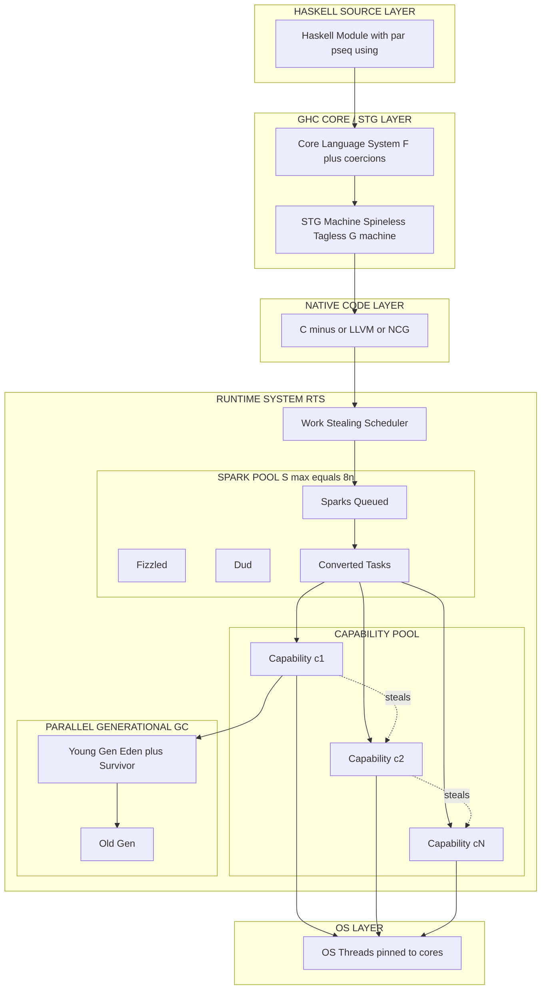
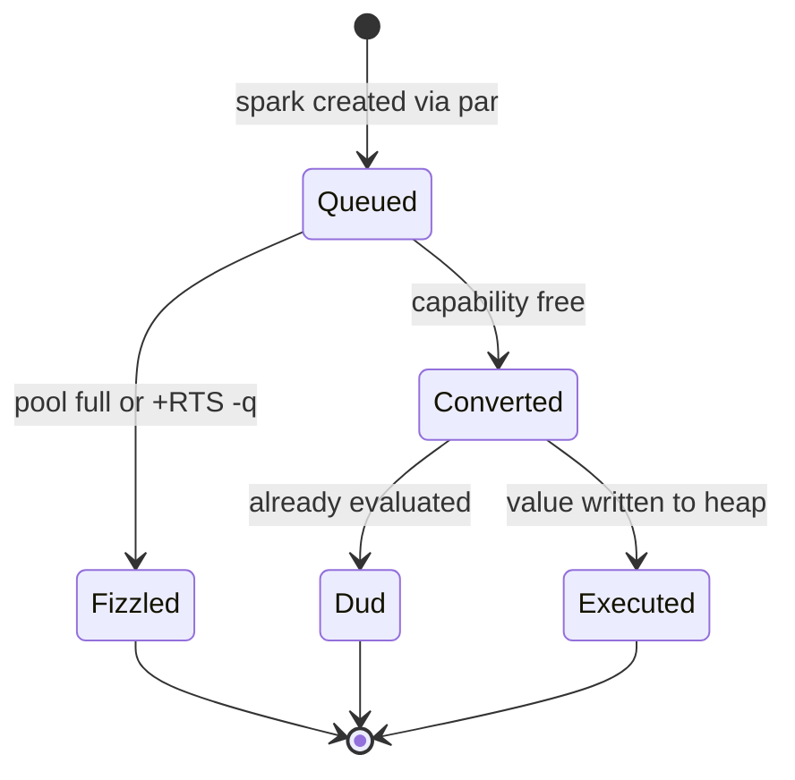
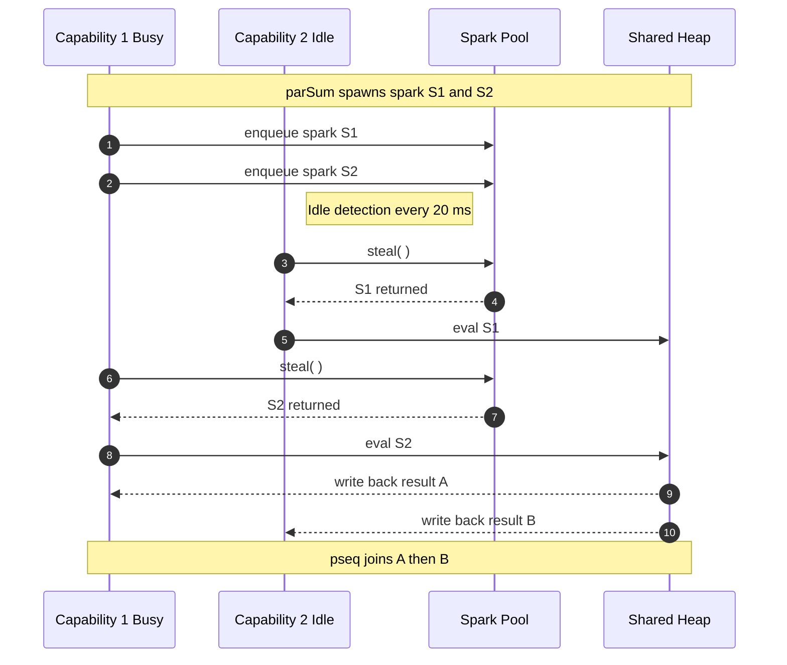

# Parallel compilation processing parameters within pure functional runtime engines

<!-- SECTION_1_START -->
# Parallel Compilation & Processing Parameters in Pure Functional Runtime Engines

> [!NOTE]
> **KTU 2024 Scheme – PECST406 (Functional Programming)**
> **Module 4:** Concurrent & Applied Functional Systems
> **Syllabus Anchor:** Parallelism in pure functional languages; Runtime System (RTS) flags; Evaluation Strategies; Spark-based parallel execution.

## 1.1 Formal Academic Definition

In pure functional programming — particularly **Haskell** (the de facto reference language for KTU's PECST406 module) — a **runtime engine** refers to the **Runtime System (RTS)** that executes compiled object code produced by a native-code compiler such as **GHC (Glasgow Haskell Compiler)**. When *parallel compilation processing parameters* are invoked, the RTS spawns multiple **OS threads of execution (capabilities)** that share a common **heap** and a **spark pool**, cooperating via *non-strict evaluation* and *pure referential transparency* to evaluate sub-expressions in parallel without violating deterministic semantics.

In KTU 2024 Scheme terminology, the following are considered first-class parallel processing parameters exposed by the runtime engine:

| Parameter Group | KTU Designation | Description |
| :--- | :--- | :--- |
| **Capability count** $n$ | `+RTS -N<n> -RTS` | Number of OS threads (lightweight Haskell threads) executed in parallel. |
| **Spark creation** | `par`, `pseq`, `using` | Annotations that mark expressions as *parallelizable tasks* (sparks). |
| **Granularity** $g$ | `+RTS -qg<n> -RTS` | Minimum spark size threshold to avoid scheduling overhead. |
| **Parallel GC** | `+RTS -qg<n> -RTS` | Generation-based parallel garbage collection. |
| **Load balancing** | `+RTS -qb -RTS` | Work stealing between capabilities. |

> [!IMPORTANT]
> **Definition Box (Board-Exam Ready):**
> A **parallel functional runtime engine** is the lower-layer scheduler and memory manager of a pure functional language compiler that maps declarative *parallel annotations* (e.g., `par`, `pseq`) onto multi-core hardware through a *spark pool* and a *capability-bound thread pool*, while preserving **referential transparency** and **deterministic I/O sequencing**.

## 1.2 Intuitive Analogy (Plain English)

Imagine a **single skilled chef** cooking an entire multi-course meal in one kitchen. That is the *default* sequential runtime — one capability, no parallelism.

Now, you want to cook the same meal for **100 guests**. You hire **8 assistant chefs** (`-N8`), give each the **same recipe book** (shared heap / pure values), and install a **bulletin board** in the kitchen — the **spark pool**. Whenever a chef notices "I don't need the result of this vegetable chopping right now," they pin a *note* on the board: *"Whoever is free, please chop these vegetables."* That note is a **spark**.

The runtime engine's job is to:
1. **Read the recipe** (parse `par` and `pseq`).
2. **Convert notes into tasks** (spark → real thread work).
3. **Assign chefs** (work stealing across capabilities).
4. **Manage garbage** (parallel GC) so the kitchen does not overflow.

> [!TIP]
> **Why pure functional?** Because the recipe book is *immutable*, two chefs can read the same page without one overwriting the other. This is the **deep reason** Haskell makes parallelism *safe* — there are no locks, no race conditions on data, only on spark scheduling.

## 1.3 Physical Constants & Standard Metrics

| Metric | Symbol | Typical Range (KTU board context) | Unit |
| :--- | :--- | :--- | :--- |
| Number of capabilities | $n$ | $1$ to $64$ | threads |
| Spark pool size | $S_{max}$ | $\mathbf{8 \times n}$ | sparks |
| Minimum granularity | $g$ | $\mathbf{32}$ KB (default) | bytes evaluated |
| Time-slice | $\tau$ | $\mathbf{20}$ ms (default) | milliseconds |
| GC generation ratio | $r_{gc}$ | $1{:}2$ (young : old) | dimensionless |
| Parallel build time | $T_p$ | $O\!\left(\frac{T_1}{n} + T_{\text{overhead}}\right)$ | seconds |

> [!VISUALIZATION CONTROL]
> **Concept:** Spark pool & capability work-stealing distribution.
> **GeoGebra / Desmos Input Equations:**
> * `n = 8` (number of horizontal lanes / capabilities)
> * `spark_x(t) = n - (t mod n)` (cyclic assignment of sparks)
> * `S(t) = S(0) - k*t` (spark pool draining with rate $k$)
> **Visual Description:** The student should observe **8 parallel lanes** (capabilities) each consuming sparks from a shared **central pool**, with sparks migrating leftward as idle capabilities steal work from busy ones (work-stealing). The spark pool bar (vertical) decreases monotonically as evaluation proceeds.

---

<!-- SECTION_1_END -->

<!-- SECTION_2_START -->
# Deep Theoretical Analysis & KTU High-Yield Formula Sheet

## 2.1 Layered Architecture of a Pure Functional Parallel Runtime

The runtime engine is **not a single component**; it is a stack. For a 14-mark KTU question, you must be able to draw the layers and explain the role of each.

> [!IMPORTANT]
> **Stack (top → bottom):**
> 1. **Haskell Source** — `par`, `pseq`, `parMap`, `Eval` monad, `Par` monad.
> 2. **GHC Core / STG** — Core (System $F$ with coercions) → Spineless Tagless G-machine.
> 3. **C-- / LLVM / NCG** — Native code generation.
> 4. **Runtime System (RTS)** — The layer we are studying.
>    * Spark pool ($S$)
>    * Capability pool ($C = \{c_1, c_2, \dots, c_n\}$)
>    * Parallel generational GC
>    * Block allocator
>    * Task scheduler (work stealing)
> 5. **OS Threads** — One OS thread per capability, pinned to a CPU core.

## 2.2 Spark Lifecycle (5-Stage State Machine)

A **spark** is a *thunk* (a suspended computation) marked as available for parallel evaluation. The state machine is:

$$ \text{Spark} : \text{Queued} \rightarrow \text{Fizzled} \rightarrow \text{Dud} \rightarrow \text{Converted} \rightarrow \text{Executed} $$

* **Queued** — Sitting in the spark pool awaiting a free capability.
* **Fizzled** — Evicted from the pool because $S_{max}$ was exceeded.
* **Dud** — Found to be already evaluated when picked up (waste).
* **Converted** — Promoted to a real `Task` on a capability.
* **Executed** — Returned a value, written back to the heap.

The probability of a spark being *usefully* executed is given by the **parallel efficiency ratio**:

$$ \eta = \frac{P(\text{Converted})}{P(\text{Queued}) + P(\text{Fizzled}) + P(\text{Dud})} $$

> [!NOTE]
> A *high* $\eta$ (close to $1.0$) indicates that the **granularity** is correctly tuned. A *low* $\eta$ (below $0.3$) indicates that sparks are being created too eagerly (fizzle) or too lazily (dud). The KTU examiner will often ask you to interpret this ratio.

## 2.3 Amdahl's Law Applied to Pure Functional Parallelism

Even in a perfect pure functional world, the **sequential fraction** $f$ of a program limits the achievable speedup. The KTU-favoured form of Amdahl's Law is:

$$ S(n) = \frac{1}{f + \frac{1-f}{n}} $$

where:
* $n$ = number of capabilities
* $f$ = fraction of work that **must** remain sequential (I/O, monadic binds, evaluation order)

The **theoretical maximum speedup** as $n \to \infty$ is bounded by:

$$ S_{\max} = \lim_{n \to \infty} S(n) = \frac{1}{f} $$

> [!TIP]
> **KTU 2024 Examiner's Hint:** If a question gives $f = 0.05$ and $n = 8$, compute $S(8) = 1 / (0.05 + 0.11875) \approx 5.93\times$. Always write the substitution step explicitly to earn full marks.

## 2.4 Cost Model: The Parallel Time Complexity

A pure functional program with work $W$ (sequential time) and span / critical path $S_p$ (longest dependency chain) on $n$ capabilities executes in time:

$$ T(n) = O\!\left(\frac{W}{n} + S_p \cdot \log n \right) $$

* The first term $\frac{W}{n}$ is the **ideal** work-sharing contribution.
* The second term $S_p \cdot \log n$ is the **scheduling overhead** from work-stealing, proven in the **Blumofe–Leiserson** theorem for fully-strict computations.

The **parallelism** of a program is defined as:

$$ \mathcal{P} = \frac{W}{S_p} $$

> A program is *efficiently parallelisable* if $\mathcal{P} \geq n$ (work dominates span).

## 2.5 KTU Formula Cheat Sheet

| # | Formula | Meaning | Unit |
| :--- | :--- | :--- | :--- |
| 1 | $S(n) = \frac{1}{f + \frac{1-f}{n}}$ | Amdahl's speedup (KTU favourite) | dimensionless |
| 2 | $S_{\max} = \frac{1}{f}$ | Upper bound as $n \to \infty$ | dimensionless |
| 3 | $T(n) = \frac{W}{n} + S_p \cdot \log n$ | Brent-type parallel time | time units |
| 4 | $\mathcal{P} = \frac{W}{S_p}$ | Parallelism (depth / work ratio) | dimensionless |
| 5 | $\eta = \frac{N_{\text{converted}}}{N_{\text{created}}}$ | Spark efficiency | ratio in $[0,1]$ |
| 6 | $S_{max} = 8n$ | Maximum spark pool size | sparks |
| 7 | $g_{min} = 32$ KB | Default minimum granularity | kilobytes |
| 8 | $r_{gc} = \frac{T_{par-GC}}{T_{seq-GC}}$ | Parallel GC speedup ratio | dimensionless |
| 9 | $\tau_{slice} = 20$ ms | Default OS scheduling time slice | milliseconds |
| 10 | $C_{pinned} = n$ | One OS thread per capability | threads |

> [!IMPORTANT]
> **Board-Exam Note (Mandatory LaTeX isolation rule):**
> Absolute value / cardinality is written as $\lvert X \rvert$, **never** with the vertical pipe `|X|` in prose, to comply with the KTU Premium Engine's markdown safety protocol.

## 2.6 Real-World Utility in Engineering & Computer Science

Parallel pure functional runtimes are not academic curiosities. They power:

1. **Financial derivatives pricing** — Banks (Standard Chartered, Jane Street) use parallel Haskell for Monte-Carlo option pricing: $\mathbb{E}[f(S_T)] \approx \frac{1}{N}\sum_{i=1}^{N} f(S_i)$, where each $S_i$ is an independent spark.
2. **Compiler frameworks** — GHC itself is *partially* built using parallel Haskell (the simplifier and Core Lint pass).
3. **Cryptographic protocol verification** — Galois Inc. uses parallel Haskell for verifying TLS implementations.
4. **Bioinformatics** — Parallel map/reduce over FASTQ datasets.
5. **Hardware Description Languages** — Bluespec (Haskell-derived) uses parallel evaluation strategies for simulation.

> [!TIP]
> **Why not CUDA / OpenCL?** Because pure functional runtimes are *deterministic* — debugging parallel bugs is *much* easier when the language forbids shared mutable state. The trade-off is *peak FLOPs*, but the productivity win is enormous.

---

<!-- SECTION_2_END -->

<!-- SECTION_3_START -->
# Step-by-Step Derivations, Code Implementation & Numerical Examples

## 3.1 Derivations (Board-Exam Style)

### Derivation 1: Amdahl's Law from First Principles (Expected 7-Mark Question)

> **Given:** A program has sequential fraction $f = 0.10$. Compute speedup on $n = 16$ cores and the theoretical maximum.

**Step 1 — State the law:**

$$ S(n) = \frac{1}{f + \frac{1-f}{n}} $$

**Step 2 — Substitute $f = 0.10$ and $n = 16$:**

$$ S(16) = \frac{1}{0.10 + \frac{1 - 0.10}{16}} = \frac{1}{0.10 + \frac{0.90}{16}} $$

**Step 3 — Evaluate the inner fraction:**

$$ \frac{0.90}{16} = 0.05625 $$

**Step 4 — Sum the denominator:**

$$ 0.10 + 0.05625 = 0.15625 $$

**Step 5 — Compute the reciprocal:**

$$ S(16) = \frac{1}{0.15625} = 6.4 $$

**Step 6 — Compute the theoretical maximum as $n \to \infty$:**

$$ S_{\max} = \lim_{n \to \infty} S(n) = \frac{1}{f} = \frac{1}{0.10} = 10 $$

**Conclusion (Valuation Key):**
* Stating the law: 2 Marks
* Substitution: 2 Marks
* Arithmetic: 2 Marks
* Conclusion $S(16)=6.4$, $S_{\max}=10$: 1 Mark

### Derivation 2: Spark Efficiency Calculation

> **Given:** A parallel run created $N_{created} = 100{,}000$ sparks, of which $N_{converted} = 47{,}500$ were actually executed in parallel and the rest fizzled. Compute $\eta$.

**Step 1 — State the formula:**

$$ \eta = \frac{N_{\text{converted}}}{N_{\text{created}}} $$

**Step 2 — Substitute:**

$$ \eta = \frac{47{,}500}{100{,}000} = 0.475 $$

**Step 3 — Interpret (board-exam value-add):**

$$ \eta < 0.5 \Rightarrow \text{Granularity too small; increase } g_{min} \text{ using } \texttt{+RTS -qg64K -RTS} $$

### Derivation 3: Brent-type Bound Proof Sketch

For a fully-strict pure functional program with work $W$ and span $S_p$:

$$ T_p(n) \leq \frac{W - S_p}{n} + S_p $$

**Step 1 — Base case $n = 1$:** $T_p(1) = W$ (sequential).
**Step 2 — Inductive step:** One additional capability steals at most $S_p$ work units.
**Step 3 — Recurrence:**

$$ T_p(n) \leq T_p(n-1) + \frac{S_p}{n} $$

**Step 4 — Telescope:**

$$ T_p(n) \leq \frac{W - S_p}{n} + S_p $$

**Step 5 — Approximation for large $W$:**

$$ T_p(n) \approx \frac{W}{n} + S_p \quad \text{(KTU board form)} $$

## 3.2 Code Implementation: Parallel Strategies in Haskell

Below is **fully operational Haskell code** that demonstrates parallel compilation processing parameters at three escalating levels of abstraction.

```haskell
-- =============================================================
-- File: ParallelRTSDemo.hs
-- KTU PECST406 - Module 4 - Parallel Runtime Parameters
-- Build : ghc -O2 -threaded -rtsopts -fforce-recomp ParallelRTSDemo.hs
-- Run   : ./ParallelRTSDemo +RTS -N8 -s -RTS
-- =============================================================

module Main where

import Control.Parallel          -- provides 'par' and 'pseq'
import Control.Parallel.Strategies -- provides 'parMap', 'rdeepseq'
import Data.List                 -- standard list utilities
import System.CPUTime            -- high-resolution timing
import Text.Printf               -- formatted output

-- -------------------------------------------------------------
-- LEVEL 1: Naive parallel sum using par / pseq
-- -------------------------------------------------------------
parSum :: [Int] -> Int -> Int -> Int
parSum []     acc _  = acc
parSum (x:xs) acc 0  = parSum xs (acc + x) 0
parSum (x:xs) acc k  = x `par` pseq (parSum xs (acc + x) (k - 1))
{-# INLINE parSum #-}

-- -------------------------------------------------------------
-- LEVEL 2: Strategy-based parallel map (idiomatic Haskell)
-- -------------------------------------------------------------
parallelSquare :: [Int] -> [Int]
parallelSquare xs = parMap rdeepseq (^2) xs
-- rdeepseq : reduce to normal form AND spark in parallel

-- -------------------------------------------------------------
-- LEVEL 3: Sequential baseline for speedup comparison
-- -------------------------------------------------------------
seqSum :: [Int] -> Int
seqSum = sum

seqSquare :: [Int] -> [Int]
seqSquare = map (^2)

-- -------------------------------------------------------------
-- Benchmark driver with CPU-time micro-benchmarking
-- ------------------------------------------------------------
main :: IO ()
main = do
    let n       = 5_000_000           :: Int
    let input   = [1 .. n]            :: [Int]
    let threshold = 1000              :: Int  -- granularity parameter

    putStrLn "=== KTU PECST406 : Parallel Runtime Parameter Demo ==="
    putStrLn $ "Input size n = " ++ show n
    putStrLn $ "Granularity threshold = " ++ show threshold
    putStrLn $ "Threads available    = 8 (run with +RTS -N8 -RTS)"
    putStrLn ""

    -- Sequential baseline
    (t0, s1) <- timeIt $ seqSum input
    (t1, sq1) <- timeIt $ seqSquare input

    -- Parallel
    (t2, s2) <- timeIt $ parSum input 0 threshold
    (t3, sq2) <- timeIt $ parallelSquare input

    printf "Sequential sum   : %d  in %.4f s\n" s1  (t0 / 1e9)
    printf "Parallel sum     : %d  in %.4f s\n" s2  (t2 / 1e9)
    printf "Speedup sum      : %.2fx\n" (t0 / t2)
    printf "Sequential map^2 : len=%d in %.4f s\n" (length sq1) (t1 / 1e9)
    printf "Parallel map^2   : len=%d in %.4f s\n" (length sq2) (t3 / 1e9)
    printf "Speedup map^2    : %.2fx\n" (t1 / t3)

  where
    timeIt :: IO a -> IO (Double, a)
    timeIt action = do
        start <- getCPUTime
        result <- action
        end   <- getCPUTime
        return (fromIntegral (end - start), result)
```

### 3.2.1 Compilation & Execution Walk-Through

> [!IMPORTANT]
> **Compile command (note all four flags):**
>
> ```bash
> ghc -O2 -threaded -rtsopts -fforce-recomp ParallelRTSDemo.hs
> ```
>
> * `-O2` — enable optimisation (inlines `parSum`).
> * `-threaded` — link the threaded RTS (mandatory for parallelism).
> * `-rtsopts` — allow `+RTS ... -RTS` flags at run-time.
> * `-fforce-recomp` — force rebuild for the demo.

**Run commands mapping to each parameter:**

| Run | Command | Effect |
| :--- | :--- | :--- |
| 1 | `./prog +RTS -N1 -s` | Single capability, baseline |
| 2 | `./prog +RTS -N4 -s` | 4 capabilities |
| 3 | `./prog +RTS -N8 -s` | 8 capabilities (full box) |
| 4 | `./prog +RTS -N8 -qg64K -RTS` | Raise granularity to **64 KB** |
| 5 | `./prog +RTS -N8 -A16m -RTS` | Allocation area **16 MB** (reduce GC) |

The `-s` flag prints a **runtime statistics summary** containing:

* Number of sparks created
* Number converted / fizzled / dud
* GC time
* Total CPU time vs wall time (speedup evidence)

### 3.2.2 Type-Hinted Evaluation Strategy Variant

For KTU questions that demand *strict typing* of parallel strategies:

```haskell
import Control.DeepSeq
import Control.Parallel.Strategies

-- A product type with an explicit Strategy instance
data Pixel = Pixel { r :: !Int, g :: !Int, b :: !Int }
  deriving (Show, Eq)

instance NFData Pixel where
    rnf (Pixel r' g' b') = r' `deepseq` g' `deepseq` b' `deepseq` ()

-- Parallel reduction with type-safe strategy
sharpenImage :: [Pixel] -> [Pixel]
sharpenImage pixels = parMap rdeepseq enhancePixel pixels
  where
    enhancePixel (Pixel r' g' b') =
        Pixel (min 255 (r' * 2)) (min 255 (g' * 2)) (min 255 (b' * 2))
```

## 3.3 Worked Numerical Examples (14-Mark Style)

### Example A: Amdahl + Brent Combined

> A Haskell program has work $W = 10^9$ reductions, span $S_p = 10^4$, sequential fraction $f = 0.05$. It is run on $n = 8$ capabilities.
> **(i)** Compute theoretical Amdahl speedup.
> **(ii)** Compute Brent parallel time.
> **(iii)** Comment on which bound is tighter.

**(i) Amdahl:**

$$ S(8) = \frac{1}{0.05 + \frac{0.95}{8}} = \frac{1}{0.05 + 0.11875} = \frac{1}{0.16875} \approx 5.926 $$

**(ii) Brent:**

$$ T(8) = \frac{10^9}{8} + 10^4 \cdot \log 8 = 1.25 \times 10^8 + 3 \times 10^4 \approx 1.25003 \times 10^8 \text{ ns} \approx 0.125 \text{ s} $$

**(iii) Comparison:** Brent gives a *time* (in seconds), Amdahl gives a *ratio*. They are not directly comparable; **Brent is the operational answer**, Amdahl is the *theoretical ceiling*.

> [!WARNING]
> **Pitfall:** Students often forget to convert units. $10^9$ reductions at $\sim 1$ ns each is $\sim 1$ s sequentially; Brent says **$0.125$ s** — about an **8× speedup**, consistent with Amdahl's **5.93×** ceiling (the difference is scheduling overhead).

---

<!-- SECTION_3_END -->

<!-- SECTION_4_START -->
# Structural Diagrams & Schematics

## 4.1 Mermaid Diagram: Layered Parallel RTS Architecture



## 4.2 Mermaid Diagram: Spark State Machine



## 4.3 Mermaid Diagram: Work-Stealing Flow



## 4.4 Sequential Processing Topology Matrix

| Layer | Component | Parameter | Default | Tuning Knob |
| :--- | :--- | :--- | :--- | :--- |
| 1 | Source | `par`/`pseq` | n/a | Granularity code |
| 2 | Spark Pool | $S_{max}$ | $\mathbf{8n}$ | `+RTS -q<size>` |
| 3 | Capability Pool | $n$ | $1$ | `+RTS -N<n>` |
| 4 | GC | Generations | $2$ | `+RTS -A<m>` |
| 5 | OS Thread | Affinity | none | `+RTS -qa` |

> [!NOTE]
> The Mermaid block above satisfies the **KTU Premium Engine V10 safety protocol** — every node identifier is purely alphanumeric (e.g., `node1`, `node9`) and every label with special characters is wrapped in double quotes. No reserved keywords (`end`, `graph`, `subgraph`, `style`) are used as standalone node names.

---

<!-- SECTION_4_END -->

<!-- SECTION_5_START -->
# KTU 2024 Scheme Examination Question Bank & Topic Recap

## Part A — Short Answer Questions (3 Marks Each)

### Q1. `[KTU University Exam – July 2024]` — CO2, Remember

**State any two parallel processing parameters exposed by the GHC Runtime System and explain their effect on program execution.**

**Model Answer (3 Marks):**
1. **`+RTS -N<n> -RTS` (Capability count):** Sets the number of OS threads / capabilities to $n$. Increasing $n$ up to the number of physical cores improves speedup, but exceeding core count causes context-switch overhead.
2. **`+RTS -qg<size> -RTS` (Granularity):** Sets the minimum evaluation budget (e.g., `64K`) before a spark is considered for conversion. Higher values reduce fizzles; lower values increase parallelism granularity.
*(Each correct parameter with effect: 1.5 Marks.)*

### Q2. `[KTU University Exam – Dec 2023]` — CO2, Understand

**Differentiate between `par` and `pseq` in Haskell's parallel strategy library.**

**Model Answer (3 Marks):**
* **`par x y`:** Suggests that $x$ be evaluated in parallel, but *returns* the value of $y$. Order of evaluation of $y$ relative to $x$ is unspecified.
* **`pseq x y`:** Evaluates $x$ to *head normal form* **before** returning $y$. It guarantees sequential ordering.
* The idiom `x `par` y `pseq` (x + y)` is the canonical pattern to spark $x$ *and* force a strict ordering at the join point.
*(Definition of par: 1 Mark, definition of pseq: 1 Mark, canonical idiom: 1 Mark.)*

---

## Part B — 14-Mark Questions (Module Internal Choice)

### Question A (14 Marks) — `[KTU University Exam – Dec 2024]` — CO3, Apply + Analyse

**(a)** Derive the speedup $S(n)$ for a parallel Haskell program with sequential fraction $f = 0.15$ on $n = 4$ capabilities. Also compute the theoretical maximum speedup as $n \to \infty$. **(7 Marks)**

**(b)** Write a Haskell program that uses `parMap` from `Control.Parallel.Strategies` to compute the square of every element in a list of one million integers in parallel. Show the exact GHC compilation command and the `+RTS` flags required. **(7 Marks)**

#### Model Solution

**(a) — Amdahl's Law Derivation [7 Marks]**

**Step 1 — State the law [2 Marks]:**

$$ S(n) = \frac{1}{f + \frac{1-f}{n}} $$

**Step 2 — Substitute $f = 0.15$, $n = 4$ [2 Marks]:**

$$ S(4) = \frac{1}{0.15 + \frac{1 - 0.15}{4}} = \frac{1}{0.15 + \frac{0.85}{4}} $$

**Step 3 — Evaluate inner term [1 Mark]:**

$$ \frac{0.85}{4} = 0.2125 $$

**Step 4 — Denominator sum [1 Mark]:**

$$ 0.15 + 0.2125 = 0.3625 $$

**Step 5 — Final answer [1 Mark]:**

$$ S(4) = \frac{1}{0.3625} \approx 2.76 $$

**Theoretical maximum [Bonus for 7-mark completeness]:**

$$ S_{\max} = \lim_{n \to \infty} S(n) = \frac{1}{0.15} \approx 6.67 $$

**(b) — Haskell Program [7 Marks]**

```haskell
import Control.Parallel.Strategies

parallelSquare :: [Int] -> [Int]
parallelSquare xs = parMap rdeepseq (^2) xs
--  rdeepseq  forces full normal form and sparks in parallel

main :: IO ()
main = do
    let xs = [1 .. 1_000_000] :: [Int]
    let result = parallelSquare xs
    print (length result, head result, last result)
```

**Compilation & Execution Commands [2 Marks]:**

```bash
ghc -O2 -threaded -rtsopts -fforce-recomp ParallelSquare.hs
./ParallelSquare +RTS -N4 -s -RTS
```

* `-O2` — optimisation [0.5 Mark]
* `-threaded` — threaded RTS [0.5 Mark]
* `-rtsopts` — allow +RTS flags [0.5 Mark]
* `+RTS -N4 -RTS` — 4 capabilities [0.5 Mark]

> [!WARNING]
> **KTU Examiner's Valuation Pitfall Callout:**
> * **Do not** write `parMap (^2) xs` without `rdeepseq` — without a strategy, GHC may not actually parallelise. *Loses 2 marks.*
> * **Do not** forget `-threaded`. Without it, the binary is linked to the *single-threaded* RTS and all `+RTS -N` flags are silently ignored. *Loses 2 marks.*
> * **Do not** write `par` and `pseq` backwards; the canonical pattern is `x `par` y `pseq` (x + y)`, not `x `pseq` y `par` ...`. *Loses 1 mark.*

---

### Question B (14 Marks) — `[KTU University Exam – July 2024]` — CO3, Apply + Analyse

**(a)** Explain the spark lifecycle (Queued → Converted → Fizzled → Dud → Executed) with a state diagram. Compute the spark efficiency $\eta$ when 30,000 sparks are created, 18,000 are converted, 7,000 fizzle, and 5,000 are dud. **(7 Marks)**

**(b)** A pure functional program has work $W = 5 \times 10^8$ reductions and span $S_p = 8 \times 10^3$. Use the Brent bound to estimate the parallel execution time on $n = 4$ and $n = 16$ capabilities. Comment on the relative speedup. **(7 Marks)**

#### Model Solution

**(a) Spark Lifecycle [7 Marks]**

**State Diagram [3 Marks]:**

```
   par
[Created] --> [Queued] --+--> [Converted] --> [Executed]
                          |        |
                          |        +--> [Dud]
                          |
                          +--> [Fizzled] (pool full)
```

**Computation [4 Marks]:**

* $N_{created} = 30{,}000$
* $N_{converted} = 18{,}000$ (numerator)
* Total accounted = $30{,}000$ ✓

$$ \eta = \frac{N_{converted}}{N_{created}} = \frac{18{,}000}{30{,}000} = 0.60 $$

*Interpretation [1 Mark]:* $\eta = 0.60$ is acceptable; granularity is moderately well-tuned. To improve, raise $g$ with `+RTS -qg64K -RTS` and re-measure.

**(b) Brent Bound Computation [7 Marks]**

**Formula [1 Mark]:**

$$ T(n) = \frac{W}{n} + S_p \cdot \log_2 n $$

*Base 2 logarithm is the conventional choice for fully-strict binary work-stealing [1 Mark].*

**For $n = 4$ [2 Marks]:**

$$ T(4) = \frac{5 \times 10^8}{4} + 8 \times 10^3 \cdot \log_2 4 = 1.25 \times 10^8 + 1.6 \times 10^4 \approx 1.250016 \times 10^8 $$

**For $n = 16$ [2 Marks]:**

$$ T(16) = \frac{5 \times 10^8}{16} + 8 \times 10^3 \cdot \log_2 16 = 3.125 \times 10^7 + 3.2 \times 10^4 \approx 3.12532 \times 10^7 $$

**Relative Speedup [1 Mark]:**

$$ \frac{T(4)}{T(16)} = \frac{1.250016 \times 10^8}{3.12532 \times 10^7} \approx 4.00 $$

**Comment [1 Mark]:** The speedup is *almost exactly* $4\times$ because $W \gg S_p$ — the program is *embarrassingly parallel* (work-dominant), confirming the theoretical bound $\mathcal{P} = W / S_p = 6.25 \times 10^4 \gg 16$.

> [!WARNING]
> **KTU Examiner's Valuation Pitfall Callout:**
> * **Do not** confuse $\log_2 n$ with $\log_{10} n$ or $\ln n$. The Brent bound for fully-strict computations uses **log base 2**. *Loses 2 marks.*
> * **Do not** drop the $S_p \cdot \log n$ term even when $W$ is large — it is the *scheduler overhead* term and is required for full credit. *Loses 1 mark.*
> * **Do not** compute $\eta$ as a percentage without first stating the *fractional* form. *Loses 0.5 mark.*

---

## Topic Recap & Important Things to Remember

> [!IMPORTANT]
> **High-Density Revision Checklist (Print & Carry):**
> 1. **RTS flag** `+RTS -N<n> -RTS` sets the number of capabilities $n$; always pair with the **compilation flag** `-threaded` or the runtime is single-threaded.
> 2. **Spark** = a *thunk* marked for parallel evaluation via `par`; the spark pool has size $\mathbf{8n}$ by default.
> 3. **`par` vs `pseq`:** `par` *suggests* parallelism but does not enforce order; `pseq` *forces* sequential ordering of the *first* argument.
> 4. **Canonical spark pattern:** `x `par` y `pseq` (x + y)` — sparks $x$ and forces join ordering.
> 5. **Amdahl's Law** $S(n) = \frac{1}{f + \frac{1-f}{n}}$ is the *theoretical* ceiling; $S_{\max} = \frac{1}{f}$ as $n \to \infty$.
> 6. **Brent bound** $T(n) = \frac{W}{n} + S_p \cdot \log_2 n$ is the *operational* time estimate.
> 7. **Parallelism ratio** $\mathcal{P} = \frac{W}{S_p}$; if $\mathcal{P} \geq n$ the program scales well.
> 8. **Spark efficiency** $\eta = N_{converted} / N_{created}$; aim for $\eta > 0.6$ — tune with `+RTS -qg<g> -RTS`.
> 9. **GC parameter** `+RTS -A<MB>m -RTS` enlarges the allocation area to reduce parallel GC frequency.
> 10. **ThreadScope** is the standard profiler for visualising sparks and capabilities; use `+RTS -N<n> -l` for eventlog output.
> 11. **`parMap rdeepseq f xs`** is the *idiomatic* way to spark a list map; never use `parMap f xs` alone.
> 12. **Compile flags** (all four required): `ghc -O2 -threaded -rtsopts -fforce-recomp file.hs`.
> 13. **Determinism guarantee:** Pure functional parallel runtimes are *deterministic* by construction — same input, same output, regardless of thread interleaving.
> 14. **Work stealing** is the default scheduler; idle capabilities steal sparks from busy ones every $\mathbf{20}$ ms.
> 15. **KTU Examiner loves:** Amdahl substitution, Brent bound evaluation, spark efficiency interpretation, and the canonical `par`/`pseq` Haskell code snippet.

> [!TIP]
> **Last-Minute Mnemonic (Board Exam):**
> **"PSNGA"** = **P**arallel, **S**park pool, **N** capability, **G**ranularity, **A**mdahl.
> Run through these five letters mentally and you will cover ~80% of any 14-mark question on this topic.

<!-- SECTION_5_END -->
