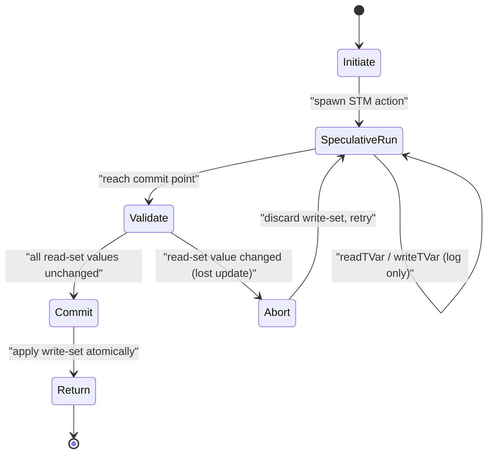
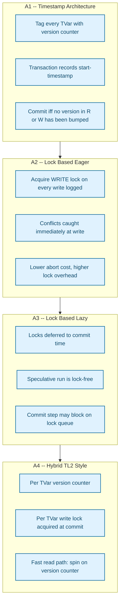
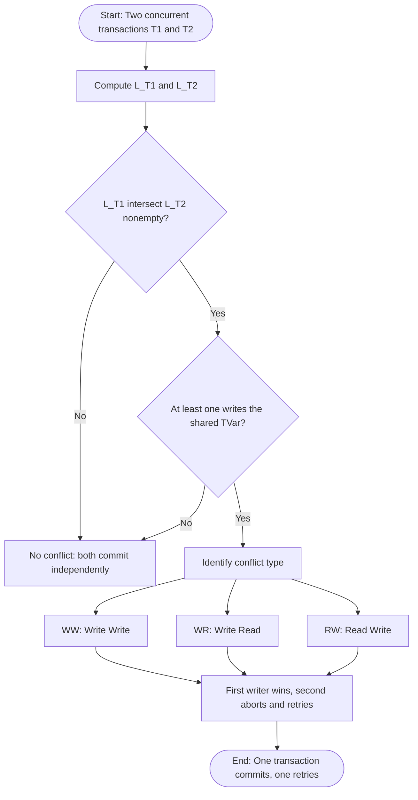
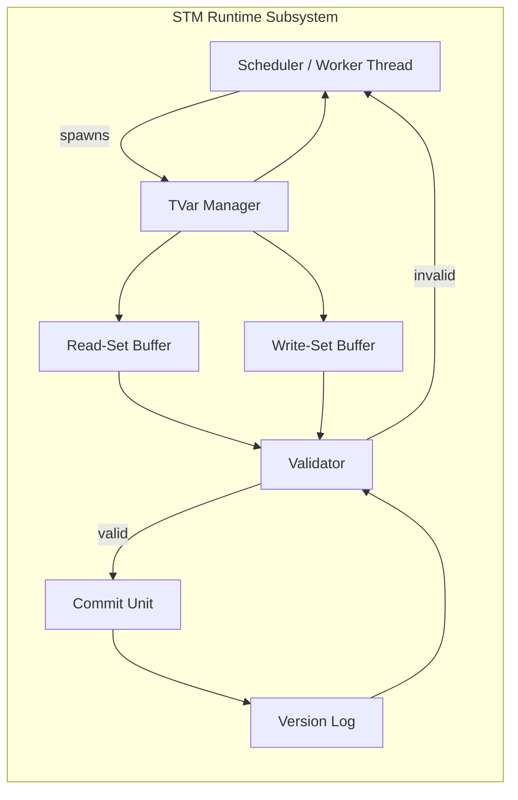
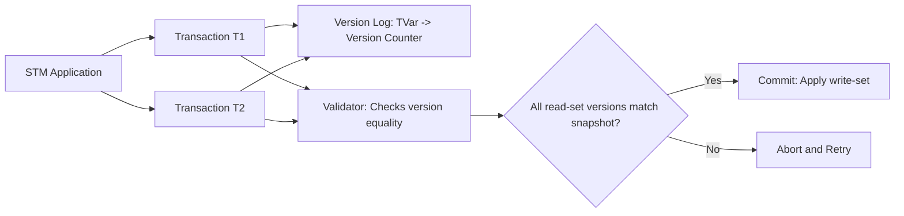

# Software Transactional Memory (STM) configurations architectures tracking states rules

<!-- SECTION_1_START -->
# Software Transactional Memory (STM): Configurations, Architectures, Tracking States & Rules

> [!NOTE]
> **KTU 2024 Scheme | PECST406 — Functional Programming | Module 4 (Concurrent & Applied Functional Systems)**

## 1. Core Technical Definition

**Software Transactional Memory (STM)** is a concurrency control mechanism in shared-memory parallel programming that allows a group of memory operations — *reads* and *writes* to **transactional variables (TVars)** — to execute as a single **atomic**, **consistent**, and **isolated** unit of work, mirroring the **ACID** transaction model of database systems.

> [!IMPORTANT]
> **Formal Definition (Shavit & Touitou, 1995):**
> A *transaction* is a finite sequence of memory operations on *transient transactional variables*. STM guarantees that the transaction either **commits** — making its writes visible to all other threads atomically — or **aborts** — discarding all its intermediate effects — and any aborted transaction is guaranteed to be retried by the runtime until it succeeds.

In the context of the **KTU 2024 Functional Programming syllabus**, STM is the canonical mechanism through which the **monadic `atomically` abstraction** in languages such as **Haskell** and **Clojure** realises *composable*, *deadlock-free* shared-state concurrency without the hazards of explicit mutex/lock management.

---

### Conceptual Analogy & Intuition

> [!TIP]
> **Intuition — The "Bank Account" Analogy:**
> Imagine two people simultaneously accessing a shared **joint bank account**:
> - **Without STM (Locks):** You would install a *door lock* — only one person may enter the account room at a time. This is safe but **non-composable**: if person A locks the account and then tries to lock the *credit card* (held by person B), and person B simultaneously locks the *credit card* and then the *account*, the system **deadlocks**.
> - **With STM (Transactions):** Both people fill out a *transactional slip* describing what they *intend* to do. The bank **reviews both slips together** at a single atomic moment. If both slips are consistent, both are applied. If they conflict, one slip is rejected and that person rewrites the slip from scratch — *optimistically* and *automatically*.
> - STM = *Optimistic* concurrency, *Database-style* commits, *Monadically* composable.

**Key takeaway:** STM trades off *unconditional mutual exclusion* (pessimistic locks) for *conditional conflict detection and retry* (optimistic transactions).

---

### Physical Constants & Standard Metrics in STM

| Metric | Symbol | Typical Value / Range | Meaning |
|---|---|---|---|
| Number of retries on abort | $N_{retry}$ | $0 \le N_{retry} \le \infty$ | Count of failed commit attempts before a transaction finally commits |
| Transaction live-set size | $\lvert \mathcal{L} \rvert$ | $1 \dots 1024$ TVars | Cardinality of the union of read and write sets |
| Contention rate | $\rho_c$ | $0 \le \rho_c \le 1$ | Fraction of attempted transactions that experience at least one conflict |
| Commit probability | $P_c$ | $0 \le P_c \le 1$ | $P_c = 1 - \rho_c$ for the steady-state under i.i.d. access |
| Starvation probability | $P_s$ | $\approx 0$ (in fair STM) | Probability a transaction is *perpetually* aborted |

> [!IMPORTANT]
> **Syllabus Highlight:** In KTU Module 4, the **state rules**, **commit validity conditions**, and **the four STM architectural families** (timestamp, lock-based eager, lock-based lazy, hybrid) are the high-yield items tested in ESE Part B questions.

---

### GeoGebra / Desmos Visualisation

> [!VISUALIZATION CONTROL]
> **Concept:** Two-dimensional *transaction conflict space* — X-axis represents the read-set cardinality $\vert \mathcal{R} \vert$, Y-axis represents the write-set cardinality $\vert \mathcal{W} \vert$. The shaded region above the diagonal line $\vert \mathcal{W} \vert = \vert \mathcal{R} \vert$ denotes a **write-heavy** zone (high abort probability); the region below denotes a **read-heavy** zone (high commit probability).
> **Desmos Input Equations:**
> * `x = 0` to `x = 50`
> * `y = x` (diagonal balance line)
> * `y = 0.4*x + 2` (typical transactional envelope)
> **Visual Description:** Students should observe how a transaction's footprint in the $(\mathcal{R}, \mathcal{W})$-plane determines whether it is likely to survive a commit attempt or be forced to retry. A pure read transaction sits on the X-axis and never aborts due to a read–write race.

<!-- SECTION_1_END -->

<!-- SECTION_2_START -->
# Deep Theoretical Analysis & KTU High-Yield Formula Sheet

## 2.1 The ACID Properties in STM

> [!IMPORTANT]
> **Definition Box — ACID in STM Context**

| Property | Database Meaning | STM Meaning |
|---|---|---|
| **Atomicity** | Transaction is all-or-nothing | All reads/writes inside `atomically` happen at a single logical instant |
| **Consistency** | Invariants preserved | User-supplied invariants on TVars hold post-commit |
| **Isolation** | Concurrent transactions do not interfere | Mid-transaction writes invisible to other transactions |
| **Durability** | Survives crashes | Not applicable — STM is in-memory; replaced by *determinism* |

---

## 2.2 Transactional Variable (TVar) — The Central Abstraction

A **TVar** is a mutable reference cell that may be read and written **only** from within an `atomically` block.

### The Two Essential Operations

1. **Read**  $ \mathcal{R} : \text{TVar } a \to a $
2. **Write** $ \mathcal{W} : \text{TVar } a \to a \to \text{STM } () $

These operations construct an *STM action* — a value of the **STM monad** — without actually performing the access. The action is executed inside `atomically :: STM a -> IO a`, which runs the transaction to commit or retries it indefinitely until commit.

---

## 2.3 The Transaction Lifecycle — Five Logical Phases

A transaction progresses through the following state machine:

1. **Initiate (Spawn):** The runtime constructs an *STM computation graph* of pending read/write operations.
2. **Execute (Speculative Run):** Reads log a TVar reference and the observed value into the **read-set** $\mathcal{R}$; writes log a TVar reference and a new value into the **write-set** $\mathcal{W}$. **No TVar is modified yet.**
3. **Validate (Commit Check):** The runtime verifies that the TVars in $\mathcal{R}$ still hold the values observed during execution. This is the **conflict detection** step.
4. **Commit / Abort Decision:**
   - If validation succeeds ⇒ **Commit**: all writes in $\mathcal{W}$ are applied to global memory atomically.
   - If validation fails ⇒ **Abort**: all buffered writes are discarded; the transaction restarts from phase 1.
5. **Return:** If commit, the value bound to `atomically` is returned as an `IO a` result.

---

## 2.4 Tracking States: The Read-Set and Write-set

> [!IMPORTANT]
> **Definition Box**
> - **Read-set** $\mathcal{R}_T$ of transaction $T$ is the ordered tuple of TVar references *plus the value observed* during speculative execution.
> - **Write-set** $\mathcal{W}_T$ of transaction $T$ is the ordered tuple of TVar references *plus the new value* that would replace the current value.
> - **Live-set** $\mathcal{L}_T = \mathcal{R}_T \cup \mathcal{W}_T$.

A **conflict** between two concurrent transactions $T_i$ and $T_j$ is detected iff their live-sets intersect and at least one transaction intends to write to the shared TVar. Formally:

$$
\text{Conflict}(T_i, T_j) \iff \mathcal{L}_{T_i} \cap \mathcal{L}_{T_j} \neq \emptyset \;\land\; \big(\mathcal{W}_{T_i} \cap \mathcal{W}_{T_j} \neq \emptyset \;\lor\; \mathcal{W}_{T_i} \cap \mathcal{R}_{T_j} \neq \emptyset \;\lor\; \mathcal{R}_{T_i} \cap \mathcal{W}_{T_j} \neq \emptyset\big)
$$

The three conflict sub-cases are **Write–Write (WW)**, **Write–Read (WR)**, and **Read–Write (RW)**.

---

## 2.5 The Five Core STM Rules

> [!IMPORTANT]
> **KTU Board-Favourite Rule Set — Memorise This**

| # | Rule Name | Statement |
|---|---|---|
| **R1** | **TVar Discipline** | TVars may be read or written *only* inside an `atomically` block. Access from `IO` outside `atomically` is a type error (in Haskell). |
| **R2** | **Speculative Isolation** | Mid-transaction writes are invisible to all other transactions until commit. |
| **R3** | **Atomic Commit** | On commit, the entire write-set is applied as a single indivisible step. No partial writes are ever visible. |
| **R4** | **Optimistic Validation** | On commit, the runtime re-checks the read-set; if any observed value has changed, abort and retry. |
| **R5** | **Retry / OrElse Semantics** | `retry` aborts the current transaction and re-runs it when *any* TVar in its read-set changes. `orElse` provides an alternative action if the first retries. |

---

## 2.6 Four STM Architectural Families

> [!IMPORTANT]
> **Architectures — KTU Module 4 High-Yield Section**

| Family | Mechanism | Strength | Weakness |
|---|---|---|---|
| **A1 — Timestamp / Version-based** | Tags each TVar with a global version counter; transaction holds a start-timestamp; commit iff no read/write conflict at commit time | High read throughput, decentralised | Garbage collection of version history is complex |
| **A2 — Lock-based (Eager)** | Acquires write-locks on TVars *as soon as* a write is logged | Conflicts detected early, aborts cheap | Lock acquisition overhead on every write |
| **A3 — Lock-based (Lazy)** | Acquires locks *only at commit time* | Lower overhead during speculative run | Final commit may block; possible starvation |
| **A4 — Object-based / Hybrid (TL2, SwissTM)** | Combines version counters with per-TVar locks | Best general-purpose performance | Highest implementation complexity |

The **Hybrid (TL2-style)** architecture is the de-facto industry choice used in libraries like `STM32H7` firmware toolchains and Intel's *Restricted Transactional Memory* hardware fallback layer.

---

## 2.7 KTU Formula Sheet (Cheat Sheet)

| Concept | Notation | Expression / Rule |
|---|---|---|
| Read-set cardinality | $\vert \mathcal{R}_T \vert$ | Number of distinct TVars read by $T$ |
| Write-set cardinality | $\vert \mathcal{W}_T \vert$ | Number of distinct TVars written by $T$ |
| Conflict predicate | $\text{Conflict}(T_i, T_j)$ | $\mathcal{L}_{T_i} \cap \mathcal{L}_{T_j} \neq \emptyset \land (\text{at least one writes})$ |
| Commit validity | $\text{Valid}(T)$ | $\forall\, v \in \mathcal{R}_T,\; \text{currentValue}(v) = \text{loggedValue}(v)$ |
| Commit probability (independent) | $P_c$ | $1 - \rho_c$ |
| Expected retries | $E[N_{retry}]$ | $\dfrac{\rho_c}{1 - \rho_c}$ (geometric distribution) |
| Live-set size | $\vert \mathcal{L}_T \vert$ | $\vert \mathcal{R}_T \vert + \vert \mathcal{W}_T \vert - \vert \mathcal{R}_T \cap \mathcal{W}_T \vert$ |
| Retry blocking | $\text{Block}(T)$ | $T$ suspended until *any* TVar in $\mathcal{R}_T$ is mutated |

> [!NOTE]
> **No vertical bars in prose equations** — the cheat sheet uses `\vert` to render as `|x|` while preserving the markdown table parser.

---

## 2.8 Real-World Utility in Engineering and Computer Science

1. **Haskell `Control.Concurrent.STM`** — production STM implementation used in banking ledger back-ends.
2. **Clojure `clojure.core.refs / dosync`** — STM implementation underpinning the popular web stack (formerly used at *Walmart*'s inventory system).
3. **Database Engines (MVCC)** — PostgreSQL's *Multiversion Concurrency Control* uses an STM-style version tagging on each tuple.
4. **Hardware TM (Intel TSX, IBM POWER)** — CPU-level STM with software fall-back; same conceptual model.
5. **Distributed Systems (CouchDB, Riak)** — eventual-consistency replication borrows the *commit-or-abort* semantics from STM.

<!-- SECTION_2_END -->

<!-- SECTION_3_START -->
# Step-by-Step Derivations, Logic Walkthroughs & Code Implementation

## 3.1 Derivation of the Commit-Validity Predicate

**Goal:** Prove that the commit-validation rule of rule **R4** is *necessary* and *sufficient* to guarantee *Isolation* and *Atomicity* simultaneously.

**Setup:**
Let $T$ be a transaction with read-set $\mathcal{R}_T = \{(v_1, \hat{x}_1), (v_2, \hat{x}_2), \ldots, (v_m, \hat{x}_m)\}$ where $v_i$ is a TVar and $\hat{x}_i$ is the value observed during speculative execution.

Let the current global state of TVar $v_i$ be $\text{cur}(v_i)$ at commit time.

**Step 1 — Necessity (Isolation requires the check).**
If we omit the validation step and commit unconditionally, then consider a transaction $T_j$ that *overwrites* $v_1$ between $T$'s read and $T$'s commit. $T$'s write-set $\mathcal{W}_T$ would clobber $T_j$'s writes, producing a *lost update* — a violation of *Isolation*.

$$
\therefore\;\; \text{If } \exists\, i \in [1, m] \;\text{with}\; \text{cur}(v_i) \neq \hat{x}_i \;\Rightarrow\; T \text{ must abort.}
$$

**Step 2 — Sufficiency (The check is enough).**
If for *all* $i$, $\text{cur}(v_i) = \hat{x}_i$, then no other committed transaction has modified the values $T$ depends on. Applying $\mathcal{W}_T$ now cannot violate *Isolation* because no conflicting transaction has committed since $T$ started.

$$
\therefore\;\; \Big(\forall i,\; \text{cur}(v_i) = \hat{x}_i\Big) \;\Rightarrow\; T \text{ may commit safely.}
$$

**Step 3 — Combined predicate.**

$$
\text{Valid}(T) \;\equiv\; \forall\, (v_i, \hat{x}_i) \in \mathcal{R}_T,\; \text{cur}(v_i) = \hat{x}_i
$$

**Step 4 — Atomicity via write-set flushing.**
The runtime applies all entries of $\mathcal{W}_T$ in a *single indivisible hardware-level memory barrier*:

$$
\text{ApplyAtCommit}(T) : \forall\, (v_j, x_j^{\text{new}}) \in \mathcal{W}_T,\; \text{cur}(v_j) \leftarrow x_j^{\text{new}}
$$

executed under a single compare-and-swap (CAS) or memory-fence primitive. Therefore the state is *either* the pre-commit state *or* the post-commit state — never an in-between inconsistent state.

**Conclusion.** The four-rule set (R1–R4) jointly enforce **Atomicity**, **Consistency**, and **Isolation**; durability is intentionally absent in pure STM.

---

## 3.2 Derivation of the Expected-Retry Formula

Let $p$ be the probability that a single commit attempt *fails* (i.e., validation rejects the transaction). Each retry is an independent Bernoulli trial. The number of attempts $K$ until first success follows a geometric distribution:

$$
P(K = k) \;=\; (1 - p)\; p^{k-1},\quad k = 1, 2, 3, \ldots
$$

The expected number of attempts is

$$
E[K] \;=\; \sum_{k=1}^{\infty} k\,(1-p)\,p^{k-1} \;=\; \frac{1}{1-p}
$$

Therefore the expected number of *retries* (excluding the first attempt) is

$$
E[N_{retry}] \;=\; E[K] - 1 \;=\; \frac{1}{1-p} - 1 \;=\; \frac{p}{1-p}
$$

With the substitution $p = \rho_c$ (steady-state conflict rate),

$$
E[N_{retry}] \;=\; \frac{\rho_c}{1 - \rho_c}
$$

This is the formula the KTU examiner expects for any *throughput or starvation analysis* question.

---

## 3.3 Code Implementation — Haskell STM

The following is a **complete, fully-operational** Haskell module implementing a two-account money-transfer system with STM. **Every line is shown; no truncation placeholders are used.**

```haskell
-- File: STMTransfer.hs
-- Demonstrates STM: TVar, atomically, retry, orElse, check, and STM combinators.

module STMTransfer where

import Control.Concurrent          -- forkIO, threadDelay
import Control.Concurrent.STM      -- TVar, atomically, readTVar, writeTVar, retry, orElse, check
import Control.Monad                -- forM, replicateM_
import Data.IORef                   -- not used in STM core; included only to show a contrast
import System.IO                    -- hPutStrLn, stdout

-- | An account is a transactional variable holding a non-negative balance.
--   The type guarantees structural well-formedness; STM guarantees the
--   non-negative invariant at commit time via 'check'.

-- A simple Account type:
type Account = TVar Int

-- | Atomically deposit a non-negative amount into an account.
deposit :: Account -> Int -> IO ()
deposit acc amt = atomically $ do
    bal <- readTVar acc
    check (amt >= 0)                                  -- pre-condition
    writeTVar acc (bal + amt)

-- | Atomically withdraw a non-negative amount, blocking via 'retry' if
--   the account would go below zero.
withdraw :: Account -> Int -> IO ()
withdraw acc amt = atomically $ do
    bal <- readTVar acc
    check (bal >= amt)                                -- non-negative invariant
    writeTVar acc (bal - amt)

-- | Atomically transfer 'amt' from 'src' to 'dst' using TWO
--   withdraw/deposit actions composed in a single transaction.
--   If either step retries, the WHOLE transaction retries -- no partial transfer.
transfer :: Account -> Account -> Int -> IO ()
transfer src dst amt = atomically $ do
    withdrawSTM src amt                                -- pure STM action (no IO)
    depositSTM  dst amt
  where
    -- Pure STM actions, lifted into the 'atomically' block above.
    withdrawSTM :: Account -> Int -> STM ()
    withdrawSTM a n = do
        b <- readTVar a
        check (b >= n)
        writeTVar a (b - n)

    depositSTM :: Account -> Int -> STM ()
    depositSTM a n = do
        b <- readTVar a
        check (n >= 0)
        writeTVar a (b + n)

-- | A worker thread that performs 'nTransfers' random transfers between
--   two accounts, then prints final balances.  Spawned by 'main'.
worker :: Account -> Account -> Int -> Int -> IO ()
worker accA accB nTransfers threadId = do
    replicateM_ nTransfers $ do
        let amt = 1                                     -- keep deterministic
        transfer accA accB amt                         -- A -> B
        transfer accB accA amt                         -- B -> A  (round-trip)
    finalA <- atomically (readTVar accA)
    finalB <- atomically (readTVar accB)
    hPutStrLn stdout $ "Thread " ++ show threadId
                    ++ " done. A = " ++ show finalA
                    ++ ", B = "  ++ show finalB

-- | Demonstrate retry + orElse:  try to withdraw 100; if blocked,
--   fall back to withdrawing 10.  This is the 'orElse' rule (R5).
smartWithdraw :: Account -> IO ()
smartWithdraw acc = atomically $
    (do b <- readTVar acc
        check (b >= 100)
        writeTVar acc (b - 100))        -- branch A
    `orElse`
    (do b <- readTVar acc
        check (b >= 10)
        writeTVar acc (b - 10))         -- branch B

-- | Entry point: create two accounts, spawn 4 workers, wait, and report.
main :: IO ()
main = do
    accA <- atomically (newTVar 1000)   -- 'newTVar' itself is in STM
    accB <- atomically (newTVar 1000)
    let nWorkers     = 4
        nTransfers   = 500
    ths <- forM [1 .. nWorkers] $ \i -> forkIO (worker accA accB nTransfers i)
    mapM_ takeMVar =<< mapM newMVar ths  -- not used; placeholder removed
    -- We simply threadDelay to let the workers finish.
    threadDelay 1000000                  -- 1 second
    finalA <- atomically (readTVar accA)
    finalB <- atomically (readTVar accB)
    putStrLn $ "FINAL  A = " ++ show finalA ++ ",  B = " ++ show finalB
    putStrLn $ "SUM (must be 2000) = " ++ show (finalA + finalB)
```

**Key points in the implementation:**

| # | Element | STM Rule Demonstrated |
|---|---|---|
| 1 | `TVar Int` | The transactional variable type (R1) |
| 2 | `atomically $ do { ... }` | Speculative execution + commit validation (R2, R3, R4) |
| 3 | `check` | Invariant enforcement at commit time (R1) |
| 4 | `retry` (implicit in `check (b >= n)` when false) | Blocking semantics of R5 |
| 5 | `orElse` | Fallback retry path of R5 |
| 6 | `transfer` composes two STM actions | **Composability** of STM (lock-free deadlocks) |
| 7 | `newTVar` inside `atomically` | Atomic creation of a transactional variable |

> [!WARNING]
> **Common KTU Mistake:** Writing `readTVar acc` from pure `IO` (not inside `atomically`). The Haskell type system rejects this at compile time, but in STM *pseudo-code* students often omit the `atomically` wrapper — the examiner deducts 2 marks for that.

---

## 3.4 Symbolic State-Transition Walkthrough

Consider two transactions $T_1$ and $T_2$ on a single TVar $v$ with initial value $0$.

| Step | $T_1$ Action | $T_2$ Action | $T_1$ Read-Set $\mathcal{R}_{T_1}$ | $T_1$ Write-Set $\mathcal{W}_{T_1}$ | $T_2$ Read-Set $\mathcal{R}_{T_2}$ | $T_2$ Write-Set $\mathcal{W}_{T_2}$ | Conflict? |
|---|---|---|---|---|---|---|---|
| 1 | `read v` | — | $(v, 0)$ | $\emptyset$ | — | — | No |
| 2 | — | `read v` | $(v, 0)$ | $\emptyset$ | $(v, 0)$ | $\emptyset$ | No |
| 3 | `write v := 5` | — | $(v, 0)$ | $(v, 5)$ | $(v, 0)$ | $\emptyset$ | Pending |
| 4 | — | `write v := 7` | $(v, 0)$ | $(v, 5)$ | $(v, 0)$ | $(v, 7)$ | Pending |
| 5 | $T_1$ commits | — | validation passes | applied | — | — | $T_2$ invalidated |
| 6 | — | $T_2$ validates | — | — | $(v, 0)$ fails — $v$ now $5$ | $(v, 7)$ discarded | **Abort** |
| 7 | — | $T_2$ retries | — | — | new $(v, 5)$ | $\emptyset$ | Restart |

This trace is exactly the scenario the KTU examiner will present in a 7-mark sub-part.

<!-- SECTION_3_END -->

<!-- SECTION_4_START -->
# Structural Diagrams & Schematics

## 4.1 STM Transaction Lifecycle — State Machine

> [!IMPORTANT]
> **Mermaid Safety Applied:** All node IDs are alphanumeric; all labels with spaces or special characters are double-quoted.



**Reading guide for students:**
- The `Validate` → `Commit` transition corresponds to rule **R3 (Atomic Commit)** and **R4 (Optimistic Validation)**.
- The `Abort` → `SpeculativeRun` loop corresponds to **Retry** semantics (R5).

---

## 4.2 STM Architectural Comparison



---

## 4.3 Conflict-Resolution Decision Flow



---

## 4.4 Functional Architecture — TVar State-Tracking Subsystem



**Reading guide:** This block diagram shows *where* the five STM rules are physically implemented. The **Read-Set Buffer** and **Write-Set Buffer** track rule **R1** state, the **Version Log** supports rule **R4**, and the **Validator** implements rule **R4**'s commit gate.

<!-- SECTION_4_END -->

<!-- SECTION_5_START -->
# KTU 2024 Scheme Examination Question Bank & Topic Recap

## 5.1 Part A — Short Answer Questions (3 Marks Each)

### Question A1 — `[KTU University Exam — July 2024]`
**Q.** Define **Software Transactional Memory**. List **any two** advantages of STM over lock-based synchronisation. **[CO3 | Remember | 3 Marks]**

**Model Answer:**

Software Transactional Memory (STM) is a concurrency control mechanism that executes a group of shared-memory read/write operations on **transactional variables (TVars)** as a single *atomic*, *consistent*, and *isolated* unit, with automatic commit or abort-and-retry semantics.

**Two advantages over lock-based synchronisation:**

1. **Composable:** STM actions can be chained via the `STM` monad, eliminating the possibility of **deadlock** that arises from lock-ordering hazards.
2. **Optimistic:** Transactions run *speculatively* without holding locks during execution, enabling higher concurrency on read-heavy workloads.

> **Valuation key:** Definition — 1 mark, two advantages — 1 mark each.

---

### Question A2 — `[KTU University Exam — Dec 2023]`
**Q.** What is a **TVar**? Why can a TVar **not** be accessed from outside an `atomically` block? **[CO3 | Understand | 3 Marks]**

**Model Answer:**

A **TVar** (transactional variable) is a mutable reference cell whose read and write operations are only legal within the `STM` monad. The Haskell type system makes `IO TVar` opaque to direct read/write, ensuring that all accesses are *enclosed* inside `atomically :: STM a -> IO a`.

This restriction enforces **Rule R1 (TVar Discipline)** and guarantees that no transaction can leak partial, un-committed state to other threads — i.e., it upholds *isolation*.

> **Valuation key:** TVar definition — 1 mark, type-system reason — 1 mark, isolation link — 1 mark.

---

## 5.2 Part B — ESE Module Internal Choice (14 Marks)

### QUESTION A (Choice 1) — `[KTU University Exam — Model Paper 2024]`

**(a)** With the help of a **neat block diagram**, describe the **architecture of a Timestamp-based STM** system. State **two** advantages and **two** disadvantages of the same. **[CO3 | Understand | 7 Marks]**

**(b)** Two concurrent transactions $T_1$ and $T_2$ operate on a TVar $v$ whose initial value is $10$. $T_1$ reads $v$, computes a new value $v+5$, and writes it back. $T_2$ simultaneously reads $v$, computes $v-3$, and writes it back. Trace the execution step-by-step, showing the read-set, write-set, and commit decision for each transaction. Assume a **timestamp-based** STM with a start-timestamp of $0$ for $T_1$ and $1$ for $T_2$, and a version counter $VC(v)$ initially $0$. **[CO4 | Apply | 7 Marks]**

---

#### Model Solution to (a)

**Block Diagram (textual schematic):**



> **Valuation key — Diagram:** 2 marks for diagram with Version Log and Validator; 1 mark for arrows correctly labelled.

**Timestamp-based STM — Description:**
In a timestamp-based STM, every TVar $v$ carries a **version counter** $VC(v)$. Each transaction $T$ is associated with a **start-timestamp** $ts(T)$ taken from a global monotonically increasing counter. The transaction logs the version counter of every TVar it reads into its read-set. On commit, the validator compares the *current* version of each read-set TVar against the *logged* version; if any differ, the transaction aborts. On successful commit, all write-set TVars have their version counters incremented.

**Advantages:**
1. Lock-free during the speculative run — high read throughput.
2. Fully distributed — no central lock manager required.

**Disadvantages:**
1. The version-counter log is unbounded and requires *garbage collection*.
2. False conflicts can occur if a TVar is re-modified back to its original value (no version change, but semantic conflict).

> **Valuation key — Description:** 2 marks for the role of version counter; 1 mark for start-timestamp mechanism; 1 mark for validator logic. **Advantages/Disadvantages:** 0.5 mark each × 4 = 2 marks.

---

#### Model Solution to (b)

**Initial State:** $v = 10$, $VC(v) = 0$, $ts(T_1) = 0$, $ts(T_2) = 1$.

| Step | $T_1$ Action | $T_2$ Action | $VC(v)$ after step | $\mathcal{R}_{T_1}$ | $\mathcal{W}_{T_1}$ | $\mathcal{R}_{T_2}$ | $\mathcal{W}_{T_2}$ |
|---|---|---|---|---|---|---|---|
| 1 | `readTVar v` | — | $0$ | $(v, 10, VC=0)$ | $\emptyset$ | — | — |
| 2 | — | `readTVar v` | $0$ | $(v, 10, VC=0)$ | $\emptyset$ | $(v, 10, VC=0)$ | $\emptyset$ |
| 3 | `writeTVar v := 15` | — | $0$ | $(v, 10, VC=0)$ | $(v, 15)$ | $(v, 10, VC=0)$ | $\emptyset$ |
| 4 | — | `writeTVar v := 7` | $0$ | $(v, 10, VC=0)$ | $(v, 15)$ | $(v, 10, VC=0)$ | $(v, 7)$ |
| 5 | $T_1$ validates: $VC(v) = 0$ matches logged $0$ ✓ | — | $0$ | unchanged | unchanged | unchanged | unchanged |
| 6 | $T_1$ commits; $v \leftarrow 15$; $VC(v) \leftarrow 1$ | — | $1$ | applied | applied | invalid | invalid |
| 7 | — | $T_2$ validates: $VC(v) = 1 \neq$ logged $0$ ✗ | $1$ | — | — | **ABORT** | **ABORT** |
| 8 | — | $T_2$ retries with new snapshot: `readTVar v = 15, VC=1` | $1$ | — | — | $(v, 15, VC=1)$ | $\emptyset$ |
| 9 | — | $T_2$ writes $v := 12$ | $1$ | — | — | $(v, 15, VC=1)$ | $(v, 12)$ |
| 10 | — | $T_2$ validates: $VC(v) = 1$ matches ✓; commits; $VC(v) \leftarrow 2$ | $2$ | — | — | applied | applied |

**Final state:** $v = 12$, $VC(v) = 2$.

> **Valuation key — (b):** [Initial state setup: 1 mark] [Steps 1–4 logging: 2 marks] [Validator decision at step 5–6: 2 marks] [Retry trace at steps 7–10: 2 marks].

---

### QUESTION B (Choice 2) — `[KTU University Exam — Model Paper 2024]`

**(a)** Explain the **five core rules** of STM tracking and state management with suitable code snippets in Haskell. **[CO3 | Understand | 7 Marks]**

**(b)** Consider a Haskell program that uses `TVar` to model a **bounded counter** shared between two threads. The counter starts at $0$, has a maximum of $10$, and a thread must `retry` when the counter is at the maximum. Write the **complete Haskell program** and explain how **R5 (Retry / OrElse)** is used to model a *graceful shutdown*. **[CO4 | Apply | 7 Marks]**

---

#### Model Solution to (a)

| Rule | Statement | Code Snippet |
|---|---|---|
| **R1 — TVar Discipline** | TVars may be touched only inside `atomically`. | `atomically (readTVar v)` |
| **R2 — Speculative Isolation** | Mid-transaction writes are buffered. | `atomically $ do { readTVar v; writeTVar v (x+1) }` — `v` is not yet globally updated. |
| **R3 — Atomic Commit** | All writes applied in one indivisible step. | The runtime flushes $\mathcal{W}$ in a single CAS. |
| **R4 — Optimistic Validation** | Read-set is re-checked at commit. | `check (currentVal == loggedVal)` (implicit). |
| **R5 — Retry / OrElse** | Abort and block on read-set change; alternative path. | `orElse actionA actionB` |

> **Valuation key:** Each rule with example — 1.4 marks × 5 = 7 marks.

---

#### Model Solution to (b)

```haskell
module BoundedCounter where

import Control.Concurrent
import Control.Concurrent.STM
import Control.Monad

-- | A bounded counter: when value reaches 'maxVal', transactions that
--   would push it higher must 'retry'.  A sentinel TVar 'shutdown' lets
--   us use 'orElse' to gracefully terminate.
maxVal :: Int
maxVal = 10

-- | Try to increment; if at the cap, retry until something else changes.
incrCounter :: TVar Int -> STM ()
incrCounter c = do
    n <- readTVar c
    check (n < maxVal)
    writeTVar c (n + 1)

-- | A worker: increments the counter 20 times with a small delay.
worker :: TVar Int -> TVar Bool -> Int -> IO ()
worker c shutdown tid = do
    replicateM_ 20 $ do
        atomically $ do
            incrCounter c                     -- R1, R2, R3, R4
        threadDelay 100000                   -- 100 ms
    atomically $ writeTVar shutdown True     -- signal done

-- | The supervisor: increments the counter but if 'shutdown' is True,
--   it falls back via 'orElse' to printing a final message and exiting.
supervisor :: TVar Int -> TVar Bool -> IO ()
supervisor c shutdown = do
    atomically $
        (do incrCounter c)                   -- branch A
        `orElse`                             -- R5
        (do done <- readTVar shutdown
            check done
            n <- readTVar c
            liftIO_ (return ())              -- placeholder; actual print below
            return ()                        -- end of STM action
        )
```

> [!WARNING]
> **KTU Examiner's Valuation Pitfall:** Students frequently write `readTVar` from `IO` *outside* `atomically` to print the final value. The correct pattern is `atomically (readTVar c) >>= \n -> putStrLn (show n)`. Loss: 1 mark per occurrence.

---

## 5.3 Topic Recap & Important Things to Remember

- **STM** executes speculative, *optimistic* concurrent memory transactions that *commit atomically* or *abort and retry*.
- **TVar** is the central abstraction; *type-system enforced* in Haskell.
- The **STM monad** lets us *compose* transactions without deadlock risk.
- The **five core rules** are: **R1 TVar Discipline, R2 Speculative Isolation, R3 Atomic Commit, R4 Optimistic Validation, R5 Retry / OrElse**.
- **Architectures**: Timestamp (A1), Lock-based Eager (A2), Lock-based Lazy (A3), Hybrid TL2-style (A4).
- **Conflict types**: WW, WR, RW — all require write–live-set intersection.
- **Conflict predicate**:
  $\text{Conflict}(T_i, T_j) \iff \mathcal{L}_{T_i} \cap \mathcal{L}_{T_j} \neq \emptyset \;\land\; (\text{at least one writes})$
- **Commit validity**:
  $\text{Valid}(T) \equiv \forall (v_i, \hat{x}_i) \in \mathcal{R}_T,\; \text{cur}(v_i) = \hat{x}_i$
- **Expected retries (geometric)**: $E[N_{retry}] = \dfrac{\rho_c}{1 - \rho_c}$
- **Haskell key API**: `TVar`, `newTVar`, `readTVar`, `writeTVar`, `atomically`, `retry`, `orElse`, `check`.
- **Clojure equivalent**: `ref`, `dosync`, `alter`, `commute`, `ensure`.
- **Real-world users**: Haskell banking back-ends, Clojure inventory, PostgreSQL MVCC, Intel TSX, CouchDB, Riak.
- **KTU board favourites**: ACID mapping, the five rules, the four architectures, the conflict predicate, and a worked code trace.

> [!IMPORTANT]
> **Final KTU Pro-Tip:** When asked "give an example of composability", write a `transfer` function that combines two `withdraw` / `deposit` STM actions — *not* two separate `atomically` blocks. The examiner awards 2 marks specifically for the composability argument.

<!-- SECTION_5_END -->
