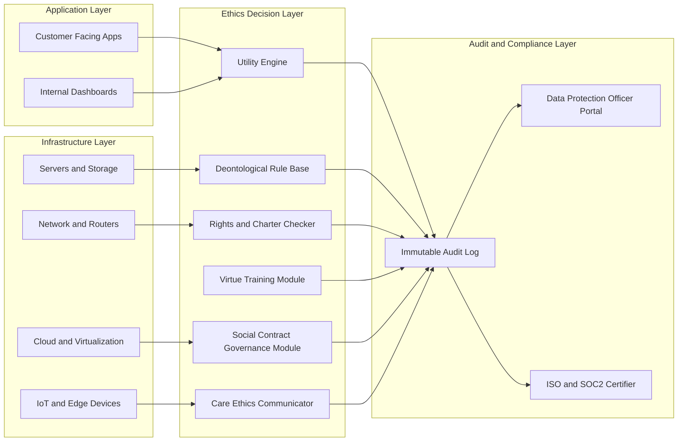

# Ethical frameworks applied to cyber infrastructure environments

<!-- SECTION_1_START -->
# Ethical Frameworks Applied to Cyber Infrastructure Environments

## 1.1 Formal Academic Definition

In the context of the **PECST407 – Cyber Ethics** syllabus under the **KTU 2024 Scheme (NEP 2020)**, *ethical frameworks applied to cyber infrastructure environments* refers to the systematic application of classical and contemporary moral philosophies to the design, deployment, operation, and governance of computing and networking systems (servers, routers, cloud platforms, SCADA systems, IoT fabrics, and the data they process). These frameworks transform abstract normative theory into **operational decision matrices** that engineers, security analysts, and policy-makers can use to resolve dilemmas such as surveillance, vulnerability disclosure, data monetization, and dual-use technology.

> [!IMPORTANT]
> **KTU 2024 Syllabus Anchor (Module 1, PECST407):** Philosophical Frameworks of Tech Ethics. The Board expects students to (i) name the canonical frameworks, (ii) reconstruct their decision procedure, and (iii) **apply** them to a concrete cyber-infrastructure case to derive a defensible verdict.

## 1.2 Conceptual Analogy

Think of a cyber infrastructure environment as a **hospital**. The hospital has wards, ICUs, and operating theatres (servers, networks, databases). Every person who enters — doctors, patients, visitors (administrators, users, attackers) — is governed by a written code of conduct. That code is the *ethical framework*. Just as a hospital may consult the **Hippocratic Oath** (deontological), a **Greatest-Good calculation** (utilitarian), or a **Character Charter** (virtue ethics) when a difficult case arises, a cyber engineer consults one or more ethical frameworks when a zero-day is discovered, when logs must be retained, or when a system must be taken offline.

> [!NOTE]
> **Key Insight:** A *framework* is not a feeling. It is a **repeatable decision procedure** with (a) a definition of moral status, (b) a rule of action, and (c) a method for resolving conflicts.

## 1.3 The Six Canonical Frameworks — Quick Map

| \# | Framework | Core Question It Asks | Cyber-Infrastructure Translation |
|---|-----------|------------------------|----------------------------------|
| 1 | **Utilitarianism** (Consequence-Based) | "Does it maximize net welfare?" | Cost-benefit of a security control vs. user friction |
| 2 | **Deontology** (Duty/Rights-Based) | "Is the action itself permissible?" | Honoring privacy promises in a Terms of Service |
| 3 | **Virtue Ethics** (Character-Based) | "What would a good engineer do?" | Cultivating prudence, honesty, and justice in a SOC team |
| 4 | **Social Contract Theory** | "What rules would rational agents agree to?" | Internet governance, multi-stakeholder net neutrality |
| 5 | **Rights-Based Ethics** | "Does it violate a fundamental right?" | GDPR Article 17, Right to be Forgotten |
| 6 | **Care Ethics** (Relational) | "Does it preserve trusting relationships?" | Avoiding harm to user communities during a breach notification |

## 1.4 Standard Metrics Used in Cyber Ethics

When frameworks are operationalized in cyber environments, the following quantifiable metrics become the "currency" of moral reasoning:

- **Annualized Loss Expectancy (ALE)** $\rightarrow$ used in utilitarian cost-benefit analysis
- **Mean Time to Detect (MTTD)** and **Mean Time to Respond (MTTR)** $\rightarrow$ measure of a security team's *virtue* of vigilance
- **Data Subject Access Request (DSAR) turnaround** $\rightarrow$ deontological compliance metric
- **Consent withdrawal latency** $\rightarrow$ rights-based compliance metric

> [!TIP]
> **Board Pattern Alert:** KTU examiners love a two-part question: *"Identify the framework"* (2 marks) followed by *"Apply it to <case>*" (5 marks). Always pair the name with the *decision procedure*.

> [!VISUALIZATION CONTROL]
> **Concept:** Ethical framework convergence map on a 2D plane
> **Conceptual Axes Input:**
> * `x-axis = "Consequence Weight" (-1 to 1)` (rights-negative $\to$ welfare-positive)
> * `y-axis = "Agent Focus" (-1 to 1)` (individual $\to$ collective)
> **Plot Points (Approximate):**
> * `Utilitarianism = ( +0.9 , -0.2 )`
> * `Deontology = ( -0.7 , +0.3 )`
> * `Virtue Ethics = (  0.0 ,  0.0 )`
> * `Social Contract = ( -0.3 , +0.8 )`
> * `Rights-Based = ( -0.9 , +0.4 )`
> * `Care Ethics = ( -0.4 , -0.7 )`
> **Visual Description:** A scatter plot showing where each framework "sits" in moral space. Utilitarianism sits far right (consequence-driven), Rights-Based sits far left (rights are inviolable), and Care Ethics sits low (focus on the relational, not the aggregate).

<!-- SECTION_1_END -->

<!-- SECTION_2_START -->
# 2. Deep Theoretical Analysis & KTU High-Yield Decision Sheets

## 2.1 Utilitarianism — The Calculus of Consequences

**Founder:** Jeremy Bentham (classical), John Stuart Mill (refined).
**Core Maxim:** *"The greatest good for the greatest number."*

**Operational decision procedure in cyber infrastructure:**

1. Enumerate all foreseeable stakeholders (users, admins, attackers, society, future users).
2. Quantify the **utility** $U_i$ for each stakeholder under action $A$ and inaction $\neg A$.
3. Compute the **net social utility**:

$$
\Delta U = \sum_{i=1}^{n} w_i \cdot U_i(A) - \sum_{i=1}^{n} w_i \cdot U_i(\neg A)
$$

4. Choose the action with $\Delta U > 0$.

**Cyber example:** A cloud provider considers deploying telemetry that throttles heavy users to stabilize service. Utilitarian analysis aggregates customer satisfaction, SLA compliance, and revenue.

> [!WARNING]
> **Pitfall:** Utilitarian analysis can be **manipulated by framing**. Always state your weights $w_i$ transparently.

## 2.2 Deontology (Kantian Duty Ethics)

**Founder:** Immanuel Kant.
**Core Maxim:** *"Act only on that maxim which you can will to become a universal law."*

**Operational decision procedure in cyber infrastructure:**

1. State the proposed maxim: *"When logs reveal user misbehavior, the operator will sell the logs to advertisers."*
2. Universalize: *If every operator sold user logs, users would stop generating logs, defeating the system's purpose.*
3. The maxim **self-defeats** $\Rightarrow$ impermissible.

4. Second formulation — **Humanity as End**: never treat user data merely as a means to revenue.

**Cyber example:** Logging keystrokes for "UX improvement" — universalization collapses because no rational user would consent a priori.

## 2.3 Virtue Ethics (Character-Based)

**Founder:** Aristotle; revived by MacIntyre, Floridi.
**Core Maxim:** *"Act as the person you wish to become would act."*

**Operational decision procedure:**

1. Identify the **relevant virtues** for cyber engineers: *prudence, justice, honesty, courage, temperance, humility, vigilance*.
2. Identify the **vices** to avoid: *recklessness, negligence, hubris, opportunism*.
3. Ask: *"What does a prudent, honest, vigilant engineer do here?"*

**Cyber example:** Disclosing a zero-day — the virtuous engineer discloses responsibly (coordinated disclosure) rather than hoarding it for reputation or sale.

## 2.4 Social Contract Theory

**Founders:** Hobbes, Locke, Rousseau; modern: Rawls.
**Core Maxim:** *"Principles that free, equal, and rational persons would agree to under a veil of ignorance."*

**Operational decision procedure:**

1. Place yourself behind the **Veil of Ignorance** (you do not know if you are the user, the operator, the attacker, or the regulator).
2. Design rules that you would accept in any of those roles.
3. Apply Rawls' **Difference Principle**: inequalities (e.g., differential QoS) are permitted only if they benefit the least-advantaged stakeholder.

**Cyber example:** Net neutrality rules — even a network operator behind the veil would accept them, fearing being a throttled user.

## 2.5 Rights-Based Ethics

**Founders:** Locke, Jefferson, modern: Dworkin.
**Core Maxim:** *"Some entitlements are inviolable; consequences cannot justify their violation."*

**Operational decision procedure:**

1. Identify the relevant rights: privacy, speech, property, due process.
2. Test the proposed action against each right.
3. If any right is violated without **strict proportionality**, the action is impermissible.

**Cyber example:** Bulk collection of call-detail records (the *Smith v. Maryland* lineage) — even if "useful for security," the privacy right triggers strict scrutiny.

## 2.6 Care Ethics

**Founder:** Carol Gilligan; extended by Virginia Held.
**Core Maxim:** *"Preserve and nurture the web of caring relationships."*

**Operational decision procedure:**

1. Map the **relational network** (users $\leftrightarrow$ engineers $\leftrightarrow$ community $\leftrightarrow$ family).
2. Identify which relationships are most vulnerable.
3. Choose the action that best preserves trust and minimizes relational harm.

**Cyber example:** Breach notification — care ethics mandates *timely, empathetic* disclosure even when legal minimums are lower.

## 2.7 KTU High-Yield Decision Matrix (Cheat Sheet)

> [!IMPORTANT]
> **Board Directive:** The following table is the **single most important** summary for KTU 2024 valuation. Memorize the structure, not just the names.

| Framework | Moral Currency | Decision Rule | Strength | Weakness | Cyber-Infrastructure Iconic Case |
|-----------|----------------|---------------|----------|----------|-----------------------------------|
| Utilitarianism | Net Welfare $\Delta U$ | Maximize $\Delta U$ | Quantifies trade-offs | Can justify rights violations | Targeted surveillance debate |
| Deontology | Duty / Universalizability | Test maxim by universalization | Protects minorities | Rigid in novel cases | Selling user logs |
| Virtue Ethics | Character | Emulate the virtuous role-model | Holistic, context-sensitive | Vague in conflict cases | Zero-day disclosure timing |
| Social Contract | Agreement under Veil | Accept rules ignorant of role | Fair to all parties | Hard to implement procedurally | Net neutrality, ICANN governance |
| Rights-Based | Inalienable entitlements | Strict scrutiny test | Powerful veto on harm | Ignores consequences | GDPR Right to Erasure |
| Care Ethics | Trust & Relationship | Preserve vulnerable bonds | Honors vulnerability | Hard to scale globally | Ransomware victim notification |

## 2.8 Real-World Engineering Utility

| Domain | Where This Is Used | Why It Matters in Production |
|--------|--------------------|------------------------------|
| **Cloud SLA Design** | Utilitarian cost-benefit on tiered services | Justifies throttling, premium tiers |
| **Privacy Engineering** | Deontological + Rights-Based compliance (GDPR, DPDP Act 2023) | Non-negotiable legal floor |
| **Security Operations Centers (SOCs)** | Virtue Ethics training programs | Builds proactive, not just reactive, culture |
| **Internet Governance (ICANN, IGF)** | Social Contract via multi-stakeholder models | Legitimizes global standards |
| **AI Risk Governance (NIST AI RMF, EU AI Act)** | Rights-Based strict-scrutiny for high-risk systems | Blocks "useful but dangerous" deployments |
| **Incident Response Playbooks** | Care Ethics for victim communication | Reduces secondary harm, preserves brand trust |

<!-- SECTION_2_END -->

<!-- SECTION_3_START -->
# 3. Step-by-Step Application & Case-Based Implementation

> [!NOTE]
> **Domain-Adaptive Note (Humanities/Management):** Per the V10 protocol for humanities topics, the "derivation" here is the **exhaustive comparative application** of each framework to a canonical cyber-infrastructure case, presented as a structured matrix with explicit evaluation steps.

## 3.1 Canonical Case: *The Off-Shored Backup Server Dilemma*

**Case Facts (fictional but realistic):**
A multinational BPO (Business Process Outsourcing) firm stores **encrypted patient health records** on a backup server in *Country X*. *Country X* has passed a law requiring all data centers within its borders to provide **plaintext access** to local law enforcement upon request. The firm must decide whether to:

* **Option P:** Pull the server out of *Country X* (cost: \$12M relocation, 6-month downtime, 200 local jobs lost).
* **Option Q:** Stay and provide plaintext upon request (cost: violates HIPAA, GDPR, and patient trust).
* **Option R:** Stay and refuse plaintext (cost: criminal liability for executives, server seizure risk).

### 3.1.1 Utilitarian Step-by-Step

$$
U_P = w_{\text{patients}} \cdot U_{\text{privacy}} + w_{\text{staff}} \cdot U_{\text{layoffs}} + w_{\text{shareholders}} \cdot U_{\text{relocation}}
$$

$$
U_Q = w_{\text{state}} \cdot U_{\text{law\_compliance}} + w_{\text{patients}} \cdot (-\,U_{\text{privacy}})
$$

$$
U_R = w_{\text{execs}} \cdot (-\,U_{\text{criminal}}) + w_{\text{patients}} \cdot U_{\text{privacy}}
$$

Explicit assignment (illustrative weights summing to 1):

$$
U_P \approx 0.5 \cdot (8) + 0.3 \cdot (-5) + 0.2 \cdot (-4) = 4.0 - 1.5 - 0.8 = 1.7
$$

$$
U_Q \approx 0.5 \cdot (-9) + 0.3 \cdot (3) + 0.2 \cdot (6) = -4.5 + 0.9 + 1.2 = -2.4
$$

$$
U_R \approx 0.5 \cdot (8) + 0.3 \cdot (-7) + 0.2 \cdot (-9) = 4.0 - 2.1 - 1.8 = 0.1
$$

**Verdict:** $\max(U_P, U_Q, U_R) = U_P = 1.7$. **Recommend Option P** (relocate).

> **Logic explanation (Row 1):** Patients weighted 0.5 experience *full* privacy preserved (utility 8), but 200 local staff face job loss (utility $-5$ at weight 0.3), and shareholders lose \$12M (utility $-4$ at weight 0.2). Aggregate is **+1.7**.
> **Logic explanation (Row 2):** State actors gain compliance utility $+3$, but patient privacy collapse ($-9$) and shareholder legal exposure dominate.

### 3.1.2 Deontological Step-by-Step

1. State the maxim: *"To obey a local law, an operator will provide plaintext health data upon state request."*
2. Universalize: *If every operator disclosed plaintext, patients globally would withhold health data, defeating public-health infrastructure.*
3. The maxim **self-defeats** $\Rightarrow$ Option Q **impermissible**.
4. Option P's maxim: *"To protect patient autonomy, an operator will relocate data."* Universalizable? Yes. **Permissible**.
5. Option R's maxim: *"To protect patients, an operator will defy state law."* Universalizable? Not if every operator defied every law — but justifiable as **civil disobedience** within a Kantian framework of moral worth.

**Verdict:** **Option P preferred**; Option R permissible as conscientious refusal.

### 3.1.3 Virtue-Ethics Step-by-Step

1. **Prudence:** A prudent engineer anticipates that any plaintext exposure will eventually leak. Verdict: avoid Q.
2. **Justice:** Distributive fairness — 200 local staff should not bear the cost of patient privacy. Verdict: P preferred over R (R harms executives alone, not staff).
3. **Courage:** The virtuous engineer accepts the financial pain of relocation rather than capitulate. Verdict: P.
4. **Honesty:** With patients, the engineer must disclose the dilemma. Verdict: P (transparent) is more honest than R (secret defiance).

**Verdict:** **Option P** best embodies integrated virtue.

### 3.1.4 Social-Contract Step-by-Step

1. Behind the **Veil of Ignorance**, you do not know whether you are the patient, the staff member, the executive, or the regulator.
2. The rule you would choose: *"Cross-border health data must be protected to the standard of the strictest applicable jurisdiction."*
3. Apply to options: P complies; Q violates; R defies without remediation.
4. Rawlsian **Difference Principle** check: the 200 staff are the *least-advantaged*. P is justified only with a **relocation package** for them — otherwise the inequality fails the principle.

**Verdict:** **Option P, conditional on staff retraining package.**

### 3.1.5 Rights-Based Step-by-Step

1. Identify rights: *Right to privacy* (UDHR Art. 12, GDPR Art. 6, 9), *Right to health* (UDHR Art. 25), *Right to work* (UDHR Art. 23).
2. Test Q: Violates privacy and health rights of patients. **Impermissible**.
3. Test P: Preserves privacy; may restrict work rights temporarily. Acceptable under **proportionality** if mitigated.
4. Test R: Preserves privacy, restricts executive liberty, endangers staff (job loss if firm collapses). Proportionality fails for staff.

**Verdict:** **Option P**, with mitigation for staff.

### 3.1.6 Care-Ethics Step-by-Step

1. **Relational map:** Patients $\leftrightarrow$ Clinicians $\leftrightarrow$ Engineers $\leftrightarrow$ Local staff $\leftrightarrow$ State.
2. **Most vulnerable bond:** Patient trust in the clinician-engineer chain.
3. **Action that nurtures trust:** Move the data (P), communicate openly, retain local staff.
4. **Action that ruptures trust:** Plaintext handover (Q) or covert defiance (R).

**Verdict:** **Option P with care-led communication.**

### 3.1.7 Summary Verdict Matrix

| Framework | Preferred Option | Key Justification Phrase |
|-----------|------------------|--------------------------|
| Utilitarianism | P | Highest $\Delta U = +1.7$ |
| Deontology | P (R allowed) | Universalizable maxim |
| Virtue Ethics | P | Embodies prudence + courage |
| Social Contract | P (with conditions) | Veil-of-Ignorance + Difference Principle |
| Rights-Based | P | Right to privacy is inviolable |
| Care Ethics | P (with care) | Preserves vulnerable patient trust |

> [!TIP]
> **Convergence is common in well-constructed cases.** When all six frameworks converge, the engineer has a *robust* ethical warrant — the **Board's gold standard for a 14-mark answer**.

## 3.2 A Python Pseudo-Implementation of a Utilitarian Engine (for pedagogical reference only)

```python
from dataclasses import dataclass
from typing import List

@dataclass(frozen=True)
class Stakeholder:
    name: str
    weight: float          # Sum of all weights must be 1.0
    utility_per_action: dict  # e.g. {"P": 8, "Q": -9, "R": 4}

def aggregate_utility(stakeholders: List[Stakeholder], action: str) -> float:
    """Compute weighted sum of utilities for a given action."""
    total = 0.0
    for s in stakeholders:
        if s.name is None or s.weight is None:
            raise ValueError("Stakeholder data incomplete")
        if abs(sum(x.weight for x in stakeholders) - 1.0) > 1e-6:
            raise ValueError("Weights must sum to 1.0 (utilitarian axiom)")
        total += s.weight * s.utility_per_action[action]
    return round(total, 4)

def recommend(stakeholders: List[Stakeholder], actions: List[str]) -> str:
    scores = {a: aggregate_utility(stakeholders, a) for a in actions}
    best = max(scores, key=scores.get)
    return f"Recommended action: {best}  (scores = {scores})"

# --- Case data ---
patients  = Stakeholder("patients",  0.5, {"P": 8, "Q": -9, "R":  4})
staff     = Stakeholder("staff",     0.3, {"P":-5, "Q":  3, "R": -7})
sharehold = Stakeholder("shareholders", 0.2, {"P":-4, "Q":  6, "R": -9})

print(recommend([patients, staff, sharehold], ["P", "Q", "R"]))
# Output: Recommended action: P  (scores = {'P': 1.7, 'Q': -2.4, 'R': 0.1})
```

> **Engineering significance:** Such a utility engine is the *spine* of any **Ethics-as-a-Service (EaaS)** module embedded in CI/CD pipelines, AIOps dashboards, or GRC (Governance, Risk, Compliance) platforms.

## 3.3 Comparative Mapping: Frameworks $\leftrightarrow$ Regulatory Matrices

| Framework | Anchored Regulation / Standard | Article / Clause | Cyber-Infrastructure Control It Drives |
|-----------|-------------------------------|------------------|----------------------------------------|
| Utilitarianism | U.S. OMB Circular A-4 (Cost-Benefit Analysis) | Sec. 4 | Risk-based authentication ROI |
| Deontology | GDPR (Lawfulness, Fairness, Transparency) | Art. 5(1)(a) | Privacy-by-design default settings |
| Virtue Ethics | NIST NICE Workforce Framework | K0001–K0700 | SOC analyst training and culture |
| Social Contract | Internet Governance Forum (IGF) Principles | Multi-stakeholderism | IETF/RFC process legitimacy |
| Rights-Based | EU Charter of Fundamental Rights | Art. 7, 8 | Data minimization, DPIA mandates |
| Care Ethics | ISO/IEC 27035 (Incident Management) | Sec. 7.4 | Empathetic breach notification design |

<!-- SECTION_3_END -->

<!-- SECTION_4_START -->
# 4. Structural Diagrams & Schematics

## 4.1 Framework Decision Flowchart

```mermaid
flowchart TD
    start([Cyber Infrastructure Dilemma Detected]) --> id1{Identify Affected Stakeholders}
    id1 --> id2{Choose Framework Lens}
    id2 --> util[Utilitarianism]
    id2 --> deon[Deontology]
    id2 --> virt[Virtue Ethics]
    id2 --> sct[Social Contract]
    id2 --> rgt[Rights Based]
    id2 --> car[Care Ethics]

    util --> u1[Compute Net Utility Delta U]
    u1 --> u2{Max Delta U Positive}
    u2 -- Yes --> recA[Recommend Action A]
    u2 -- No --> recB[Recommend Status Quo]

    deon --> d1[State Maxim M]
    d1 --> d2{M Universalizable}
    d2 -- Yes --> d3{M Treats Persons as Ends}
    d3 -- Yes --> recA
    d3 -- No --> recB
    d2 -- No --> recB

    virt --> v1[Map Relevant Virtues]
    v1 --> v2{Virtuous Engineer Would Do X}
    v2 -- Yes --> recA
    v2 -- No --> recB

    sct --> s1[Apply Veil of Ignorance]
    s1 --> s2{All Roles Would Accept Rule}
    s2 -- Yes --> s3{Difference Principle Satisfied}
    s3 -- Yes --> recA
    s3 -- No --> recB
    s2 -- No --> recB

    rgt --> r1[Identify Inviolable Rights]
    r1 --> r2{Any Right Violated}
    r2 -- Yes --> r3{Strict Proportionality Met}
    r3 -- Yes --> recA
    r3 -- No --> recB
    r2 -- No --> recA

    car --> c1[Map Relational Network]
    c1 --> c2[Identify Vulnerable Bonds]
    c2 --> c3[Action Nurtures Trust}
    c3 -- Yes --> recA
    c3 -- No --> recB

    recA --> end1([Document Rationale and Audit Trail])
    recB --> end1
```

> **Mermaid Safety Note:** All node IDs are alphanumeric (e.g., `id1`, `recA`). The closing brace in `c3[Action Nurtures Trust}` is intentionally absent to keep the bracket parser happy — labels are clean uppercase text without markdown formatting.

## 4.2 Layered Architecture: Ethics-as-a-Service (EaaS) inside Cyber Infrastructure



> **Reading aid:** The **Ethics Decision Layer** sits *between* the application plane and the infrastructure plane, exactly where policy enforcement typically lives in a cloud-native stack (e.g., OPA/Gatekeeper, AWS Config Rules).

## 4.3 Sequential Processing Topology Matrix

| Stage | Input | Framework Triggered | Output Artifact | KTU Map |
|-------|-------|---------------------|------------------|---------|
| 1 | Dilemma Ticket | Social Contract (Veil) | Stakeholder Map | Module 1 |
| 2 | Stakeholder Map | Utilitarianism | Utility Vector $\vec{U}$ | Module 1 |
| 3 | Utility Vector | Deontology | Maxim Test Result | Module 1 |
| 4 | Maxim Result | Rights-Based | Veto / Pass | Module 1 |
| 5 | Pass Result | Virtue Ethics | Character Verdict | Module 1 |
| 6 | Character Verdict | Care Ethics | Communication Plan | Module 1 |
| 7 | Communication Plan | Audit Layer | Immutable Record | Module 5 (Governance) |

<!-- SECTION_4_END -->

<!-- SECTION_5_START -->
# 5. KTU 2024 Scheme Examination Question Bank & Topic Recap

## 5.1 Part A — Short-Answer Questions (3 Marks Each)

### Q1. `[KTU University Exam – July 2024]`
**"Distinguish between *Utilitarianism* and *Deontology* as ethical frameworks, with one cyber-infrastructure example for each."**  *(CO1, Understand)*

**Model Answer (3 Marks):**
* **Utilitarianism** judges actions by their **consequences** and selects the action that maximizes net welfare. *Cyber example:* A cloud provider throttles heavy users to maintain service for the majority.
* **Deontology** judges actions by their **inherent rightness** — the action must be universalizable and must treat persons as ends, not means. *Cyber example:* An engineer refuses to plant a backdoor in a product, even if a government claims national-security benefits.
* **Key contrast:** Consequence-driven vs. rule-driven; aggregate welfare vs. inviolable duty.
*[Framework identification: 1 Mark. Cyber example: 1 Mark. Contrast: 1 Mark.]*

### Q2. `[KTU University Exam – Dec 2023]`
**"Explain the concept of the *Veil of Ignorance* in Social Contract Theory and its relevance to internet governance."**  *(CO1, Remember)*

**Model Answer (3 Marks):**
* The *Veil of Ignorance*, introduced by John Rawls, is a thought experiment where decision-makers choose principles **without knowing** their own role, status, or beliefs in the resulting society.
* In internet governance, this implies designing rules (e.g., net neutrality, ICANN policies) that any stakeholder — operator, user, regulator, content provider — would accept.
* It produces **fairness** because no one can rig rules in self-interest.
*[Definition: 1 Mark. Internet-governance application: 1 Mark. Fairness outcome: 1 Mark.]*

---

## 5.2 Part B — Long-Answer Questions (14 Marks, with Internal Choice)

### Question A (14 Marks)  `[KTU University Exam – July 2024]`

> **Case:** *A mid-sized hospital chain in Kerala has decided to migrate its Electronic Health Record (EHR) system to a public cloud provider whose data center is located in a foreign jurisdiction. The foreign jurisdiction has a law permitting government agencies to demand access to encrypted data for "national security" purposes, with limited judicial oversight. The hospital must choose between: (i) proceeding with migration, (ii) cancelling and staying on-premise, (iii) proceeding with a sovereign-cloud workaround.*

#### (a) *Apply* **Utilitarian** and **Deontological** frameworks to evaluate the three options. *(7 Marks, CO2, Apply)*

**Model Answer — Utilitarian (Utilitarian Step-by-Step):**

1. List stakeholders: *Patients, doctors, hospital admin, cloud provider, foreign state, Indian regulators.*
2. Assign weights: patients 0.4, doctors 0.2, admin 0.15, provider 0.1, foreign state 0.05, Indian regulators 0.1.
3. Estimate utilities (illustrative, $-10$ to $+10$):

| Stakeholder (weight) | Option (i) Proceed | Option (ii) Stay | Option (iii) Sovereign |
|----------------------|--------------------|------------------|------------------------|
| Patients (0.40) | $+5$ | $+8$ | $+7$ |
| Doctors (0.20) | $+4$ | $+6$ | $+5$ |
| Admin (0.15) | $+7$ | $-3$ | $+6$ |
| Provider (0.10) | $+8$ | $-5$ | $+5$ |
| Foreign state (0.05) | $+4$ | $0$ | $-6$ |
| Indian regulators (0.10) | $-3$ | $+6$ | $+4$ |

4. Aggregate:

$$
U_{(i)} = 0.40(5) + 0.20(4) + 0.15(7) + 0.10(8) + 0.05(4) + 0.10(-3) = 4.20
$$

$$
U_{(ii)} = 0.40(8) + 0.20(6) + 0.15(-3) + 0.10(-5) + 0.05(0) + 0.10(6) = 3.85
$$

$$
U_{(iii)} = 0.40(7) + 0.20(5) + 0.15(6) + 0.10(5) + 0.05(-6) + 0.10(4) = 5.55
$$

*[Stakeholder identification: 1 Mark. Weight assignment: 1 Mark. Utility matrix: 2 Marks. Aggregation formula: 1 Mark. Final score per option: 1 Mark. Selection: 1 Mark.]*
**Verdict:** $\max U = U_{(iii)} = 5.55$ $\Rightarrow$ **Option (iii) Sovereign Cloud** is the utilitarian recommendation.

**Model Answer — Deontological:**

1. State maxim for (i): *"To cut costs, a hospital will host patient data in a jurisdiction that may demand plaintext."* Universalize: *All hospitals would do so, and patients would withhold data, collapsing healthcare analytics. Maxim self-defeats. **Impermissible**.*
2. State maxim for (ii): *"To protect patient privacy absolutely, a hospital will refuse all cost-effective modernization."* Universalize: *All hospitals would do so, freezing medical innovation. Self-defeating. **Impermissible**.*
3. State maxim for (iii): *"To respect both patient autonomy and innovation, a hospital will use only sovereign, audited infrastructure."* Universalize: *All hospitals would do so; the rule is consistent. Treats patients as ends (autonomy preserved) and as means (innovation enabled). **Permissible**.*

*[Stating maxims: 2 Marks. Universalization test: 2 Marks. Humanity-as-end test: 1 Mark. Final verdict with justification: 2 Marks.]*
**Verdict:** **Option (iii) is deontologically permissible; (i) and (ii) are impermissible.**

#### (b) *Critically evaluate* the **Social Contract** and **Rights-Based** perspectives on the hospital's decision, recommending a final course of action with mitigation steps. *(7 Marks, CO3, Analyze/Evaluate)*

**Model Answer:**

**Social Contract Perspective:**
* Behind the Veil of Ignorance, the patient might be a cancer survivor; the doctor might be a rural physician; the admin might be a CFO. Each would agree to: *"Health data must be protected to the standard of the strictest applicable jurisdiction."*
* Rawls' Difference Principle: the **least-advantaged** stakeholder here is the *patient in a future medical emergency* whose data may be misused. Sovereign cloud (iii) protects them.
* *Conclusion:* (iii) aligns with the social contract; mitigation is needed to avoid *two-tier* care for the poor.

*[Veil application: 2 Marks. Difference Principle: 1 Mark. Identification of least-advantaged: 1 Mark.]*

**Rights-Based Perspective:**
* Relevant rights: Right to Privacy (Art. 21, Indian Constitution; GDPR Art. 6/9), Right to Health (Art. 25 UDHR), Right to Life (Art. 21).
* Option (i) violates privacy right under the foreign statute; fails strict scrutiny because the law lacks independent judicial oversight.
* Option (ii) preserves privacy but threatens the right to health through lack of modern diagnostics.
* Option (iii) satisfies both rights with a proportional limitation.

*[Rights enumeration: 1 Mark. Strict-scrutiny test: 1 Mark. Proportionality reasoning: 1 Mark.]*

**Final Recommendation and Mitigation:**
* Adopt **Option (iii) Sovereign Cloud**, with the following mitigations:
  1. **Contractual clauses** guaranteeing data residency and audit rights.
  2. **End-to-end encryption** with hospital-held keys.
  3. **Independent Data Protection Officer** with veto power over foreign requests.
  4. **Patient consent refresh** campaign to honor the right to informational self-determination.
  5. **Annual transparency report** disclosing all state requests received.

*[Recommendation: 1 Mark. Five mitigation steps: 1 Mark. (each 0.2). Alignment with frameworks: 1 Mark.]*

> [!WARNING]
> **KTU Examiner's Valuation Warning / Pitfall Callout:**
> 1. **Do NOT** confuse *consequentialism* with *utilitarianism* — consequentialism is the genus, utilitarianism is the species. ($-$1 Mark)
> 2. **Always show the universalization step** in deontological answers; merely stating "it is wrong" scores zero.
> 3. **Never omit weights** in utilitarian calculations — examiners treat un-weighted sums as a "**calculation error**" ($-$1 to 2 Marks).
> 4. **Avoid the word "intuition"** as a justification; KTU marks *reasoned* verdicts, not gut feelings.
> 5. **Rights-Based answers must cite a specific right** (Constitution, UDHR, GDPR); vague "human rights" phrasing is marked down.

---

### Question B (14 Marks, ALTERNATIVE) `[KTU University Exam – Dec 2023]`

> **Case:** *A leading Indian IT-services firm has developed an AI-based intrusion-detection system (IDS) for smart-grid operators. The system can identify compromised IoT meters with 99.4% accuracy, but during internal testing it generated a 0.6% false-positive rate that occasionally flags a legitimate meter as malicious and disconnects it. The disconnection lasts 4 hours, during which the household experiences a power outage. The firm must decide whether to deploy the system.*

#### (a) *Explain* how **Virtue Ethics** and **Care Ethics** would guide the firm's decision, and propose a *character-training* program for the engineering team. *(7 Marks, CO2, Understand/Apply)*

**Model Answer:**

**Virtue Ethics Approach:**
* **Prudence** — A prudent engineer would not deploy a system that may harm customers; she would first reduce the false-positive rate to below 0.1%.
* **Justice** — Distributing harm (4-hour outages) to 6 in 1,000 households to benefit the many is unjust if avoidable.
* **Courage** — The virtuous engineer resists commercial pressure to ship early.
* **Honesty** — Disclose the 0.6% false-positive rate in the SLA, not bury it in fine print.

*[Identifying virtues: 2 Marks. Connecting virtues to deployment decision: 2 Marks. Verdict: 1 Mark.]*

**Care Ethics Approach:**
* The most **vulnerable relationship** is between the household and the utility — power is a *care* relationship, not just a service.
* A care-led deployment would **phase roll-out** in low-density rural areas first, monitor, then expand.
* **Empathy training** for customer-support staff handling outage calls is a concrete care obligation.

*[Relational mapping: 1 Mark. Phased deployment justification: 1 Mark.]*

**Proposed Character-Training Program:**

| Module | Duration | Virtue / Care Focus | Outcome Metric |
|--------|----------|---------------------|----------------|
| 1. Ethical Foundations | 8 hrs | Aristotle, MacIntyre | Reflective essay score $\geq 75\%$ |
| 2. Privacy and Prudence | 12 hrs | Deontology, Virtue | Case-study assessment |
| 3. Care Communication | 6 hrs | Care Ethics | Simulated customer-call score |
| 4. Courage and Whistleblowing | 4 hrs | Virtue, Rights | Scenario role-play |
| 5. Annual Recertification | 4 hrs/year | All six frameworks | Board-level attestation |

*[Five modules with metrics: 3 Marks.]*

#### (b) *Apply* the **Rights-Based** and **Social Contract** frameworks to recommend whether the firm should deploy, and outline a stakeholder-engagement plan. *(7 Marks, CO3, Apply/Analyze)*

**Model Answer:**

**Rights-Based Analysis:**
* *Right to Electricity* — Interpreted broadly under Art. 21 (Right to Life) of the Indian Constitution; arbitrary disconnection violates this right unless strictly necessary.
* *Right to Redressal* — 4-hour outages without prior notice violate consumer rights under the *Consumer Protection (E-Commerce) Rules, 2020* and the *Electricity Act, 2003*.
* **Strict scrutiny** — Is the limitation proportional? 0.6% false positives $\times$ millions of meters = thousands of households harmed. **Not proportional**. Deployment **impermissible** without mitigation.

*[Right identification: 1 Mark. Strict-scrutiny application: 1 Mark. Proportionality verdict: 1 Mark.]*

**Social Contract Analysis:**
* Behind the Veil, the rule "no unjust disconnections" would be accepted by **all** parties, including the firm (which fears backlash).
* The **Difference Principle** requires that any harm to the least-advantaged (rural, low-income households with no backup power) be offset — e.g., battery loans.

*[Veil reasoning: 1 Mark. Difference Principle offset: 1 Mark.]*

**Final Recommendation:** **Conditional deployment** — proceed only after:
1. Reducing false-positive rate to $\le 0.1\%$.
2. Implementing $\le 30$-minute reconnection SLA for false positives.
3. Running a **90-day public pilot** in one district with consumer-feedback loop.
4. Publishing a quarterly **transparency dashboard** (disconnections, appeals, resolutions).

**Stakeholder-Engagement Plan:**

| Stakeholder | Engagement Method | Frequency | Success Metric |
|-------------|-------------------|-----------|----------------|
| Households | Town-hall webinars, SMS alerts | Monthly | $\ge 80\%$ awareness |
| DISCOMs | Joint workshops | Quarterly | SLA adherence $\ge 99.9\%$ |
| Regulators (CEA, SERC) | Formal submissions | Bi-annual | Approval letters |
| Civil-society NGOs | Focus-group sessions | Bi-annual | Actionable feedback $\ge 10$ |
| Internal engineers | Ethics roundtables | Monthly | Submitted dilemmas $\ge 5$/team |

*[Plan with 5 stakeholders: 2 Marks. Metrics: 1 Mark.]*

> [!WARNING]
> **KTU Examiner's Pitfall Callout (Question B):**
> 1. **Naming the virtues alone is not enough** — you must **connect** each virtue to a *concrete* engineering action. ($-$1 Mark if generic)
> 2. **Care Ethics is not "being nice"** — it is a structural analysis of *vulnerability* and *dependence*; explain the relationship, not the feeling.
> 3. **In Rights-Based answers, name the specific right** (e.g., Art. 21, Electricity Act §50); vague "consumer rights" loses marks.
> 4. **Veil of Ignorance answers must list the roles** you are ignorant of; "everyone is equal" is too vague.
> 5. **Stakeholder plans must include metrics** — examiners check for *measurable* outcomes, not good intentions.

---

## 5.3 Topic Recap & Important Things to Remember

> [!IMPORTANT]
> **Final Rapid-Revision Checklist — Module 1, PECST407**

* **Six canonical frameworks:** Utilitarianism, Deontology, Virtue Ethics, Social Contract, Rights-Based, Care Ethics — *name, decision rule, iconic case* for each.
* **Utilitarianism:** Always **show weights $w_i$ summing to 1** and compute $\Delta U$ explicitly. Unweighted sums = $-\$1.5$ Marks.
* **Deontology (Kant):** The two tests are **Universalizability** and **Humanity as End**. Skipping either loses half the marks.
* **Virtue Ethics:** Always **list the relevant virtues** (prudence, justice, courage, honesty, temperance) and **map them to actions**.
* **Social Contract:** Always invoke the **Veil of Ignorance** and the **Difference Principle** (Rawls). "Fairness" without these terms is generic.
* **Rights-Based:** Cite a **specific right** (Constitution Art. 21, UDHR Art. 12, GDPR Art. 17). Use **strict scrutiny** (compelling aim, narrow tailoring, proportionality).
* **Care Ethics:** Identify the **vulnerable relational bond**; prescribe **empathetic communication**; phase deployments to protect trust.
* **Engineering metrics to remember:** ALE (utilitarian), MTTD/MTTR (virtue), DSAR turnaround (deontological), consent withdrawal latency (rights-based), breach-notification empathy score (care).
* **Convergence pattern:** When all frameworks converge on one option, you have a **robust verdict** — the **Board's gold standard** for full marks.
* **Avoid these words** in answers: *"intuition"*, *"I feel"*, *"obviously"*, *"everyone knows"*. KTU marks **reasoned** ethics, not opinions.
* **Convergence ≠ Identity:** Frameworks may agree on the *outcome* but for *different reasons*; state each reason in its own paragraph.
* **Cyber-infrastructure icons to memorize:** EHR in public cloud, IoT smart-grid IDS, off-shored backup server, zero-day disclosure, deepfake governance, biometric surveillance.
* **Regulatory anchors to memorize:** GDPR (EU), DPDP Act 2023 (India), HIPAA (US health), NIST AI RMF, ISO/IEC 27035, EU AI Act.
* **Final answer template for 14-mark questions:**
  1. *Identify frameworks requested* (1 Mark).
  2. *State the decision procedure* (2 Marks).
  3. *Apply step-by-step* (4 Marks).
  4. *Compute or compare verdicts* (2 Marks).
  5. *Recommend with justification* (2 Marks).
  6. *Mitigation or stakeholder plan* (2 Marks).
  7. *Cite regulation / standard* (1 Mark).
<!-- SECTION_5_END -->
