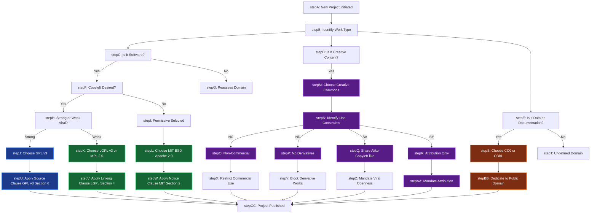
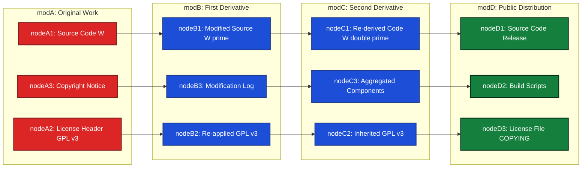
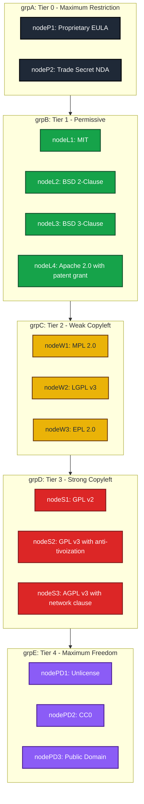
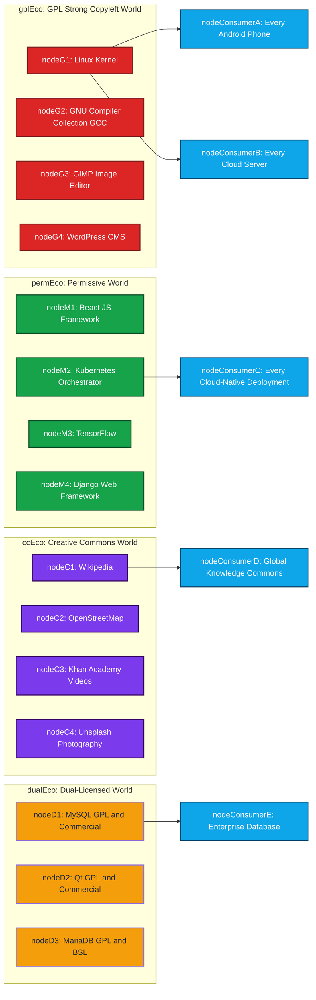

# Intellectual property struggles in digital layers: Copyleft vs copyright mechanics

<!-- SECTION_1_START -->
# 1. Core Technical Definition & Intuitive Overview

## 1.1 Formal Academic Definition

> [!IMPORTANT]
> **Copyright** is a statutory legal right (a *negative right*) granted to the creator of an original literary, artistic, scientific, or software work, conferring the exclusive prerogative to reproduce, distribute, publicly perform, adapt, and license the work for a limited temporal duration (typically the **life of the author plus 60–70 years**, depending on jurisdiction, per the **Berne Convention for the Protection of Literary and Artistic Works, 1886**).

> [!IMPORTANT]
> **Copyleft** is a generalized licensing methodology, codified most famously in the **GNU General Public License (GPL)**, which leverages the restrictive machinery of copyright law as a *positive enforcement tool*, mandating that all derivative, redistributed, or modified works be released under the *identical* (or compatible) license terms — thereby guaranteeing perpetual downstream openness.

In the KTU 2024 PECST407 syllabus, these two paradigms represent the foundational philosophical and legal dichotomy governing **digital intellectual property (IP)**. Copyright is rooted in **utilitarian, personhood, and labor-desert theories of justice** (Locke, Hegel, Mill), while copyleft is rooted in **distributive justice, commons-based peer production, and information ethics** (Benkler, Stallman, Lessig).

## 1.2 Conceptual Analogy / Intuition

> [!NOTE]
> **The Real-World Analogy — "The Cookbook vs. The Seed Bank"**

Imagine a renowned chef publishes a cookbook. Under **copyright**, the chef owns the recipes. You may *read* the book, but you cannot photocopy it, sell copies, or even publicly perform a dish from it without permission — the chef has a **locked gate** with a sign: *"All Rights Reserved."*

Under **copyleft**, the chef publishes the same recipes but attaches a curious instruction:

> *"You may freely use, modify, and redistribute these recipes, **provided that any new cookbook you create from them is also freely shareable** under the same terms."*

This is the **share-alike viral mechanism** — the freedom *propagates* like a **genetic trait** in a biological ecosystem. The chef uses copyright's legal "fence," but reverses its direction — instead of *restricting* downstream use, it *compels* openness.

| Mechanism | Analogy | Direction of Flow |
|---|---|---|
| **Copyright** | Private swimming pool with locked gate | Inward-restrictive |
| **Copyleft** | Public library with a "share what you borrow" rule | Outward-propagating |
| **Public Domain** | Open ocean — no owner | No restriction |

## 1.3 The Two Axiomatic Freedoms (FSF Foundation)

Richard Stallman's **Free Software Definition (1986)** postulates **Four Essential Freedoms**:

| Freedom # | Designation | KTU Notation | Plain Meaning |
|---|---|---|---|
| 0 | Run the program | $F_0$ | Use for any purpose |
| 1 | Study and modify | $F_1$ | Access source code and adapt |
| 2 | Redistribute copies | $F_2$ | Share with neighbors |
| 3 | Distribute modifications | $F_3$ | Share improvements under same terms |

> [!WARNING]
> **Copyleft licenses are the *only* mechanism that mathematically guarantees all four freedoms** — $F_0 \land F_1 \land F_2 \land F_3$. Permissive licenses (MIT, BSD) only guarantee $F_0 \land F_1 \land F_2$, leaving $F_3$ unprotected.

## 1.4 Conceptual Visualization

> [!VISUALIZATION CONTROL]
> **Concept:** The Licensing Spectrum — From Maximum Restriction to Maximum Freedom
> **Conceptual Axes:**
> * `x-axis: Restrictiveness` = moves from "All Rights Reserved" (proprietary) → "Some Rights Reserved" (Creative Commons) → "No Rights Reserved" (Public Domain)
> * `y-axis: Viral Propagation Strength` = mathematical degree to which downstream derivatives are forced open
> **Visual Description:** A 2D quadrant where the bottom-left is **Proprietary Closed Source**, the top-right is **Strong Copyleft (GPL v3)**, the bottom-right is **Public Domain (CC0, Unlicense)**, and the top-left is **Weak Copyleft (LGPL, MPL)**. The diagonal represents the "Freedom Vector" of Benkler's commons-based peer production.
<!-- SECTION_1_END -->

<!-- SECTION_2_START -->
# 2. Deep Theoretical Analysis & KTU High-Yield Reference Matrix

## 2.1 The Structural Anatomy of the Copyright Regime

Copyright is not monolithic; it is a layered stack of **economic, moral, and territorial rights**. Under the **Berne Convention**, copyright is **automatic** (no registration required) and protects *expression*, not *ideas* (the **Idea-Expression Dichotomy** from *Baker v. Selden*, 101 U.S. 99).

### 2.1.1 The Economic Rights Bundle (Exhaustive List)

1. **Right of Reproduction** — the right to make copies
2. **Right of Distribution** — the right to disseminate
3. **Right of Public Performance** — relevant for software-as-a-service
4. **Right of Communication to the Public** — extended under WIPO Internet Treaties (1996)
5. **Right of Translation / Adaptation** — the *derivative work* right, which is the **critical battleground** for software modification
6. **Right of Rental** (in EU jurisdictions)

### 2.1.2 The Software-Specific Overlay

For computer software, the **TRIPS Agreement (1994)** and the **WIPO Copyright Treaty (WCT, 1996)** specifically mandate:
- Source code is a *literary work* under copyright
- Rental rights apply to commercial software
- **Anti-circumvention provisions** (the foundation of **DRM** and the **DMCA § 1201**)

## 2.2 The Operational Logic of Copyleft

The copyleft mechanism can be expressed as a **logical constraint** over the set of derivative works:

$$\mathcal{D}(w) := \{ w' \mid w' \text{ is derived from } w \}$$

> [!NOTE]
> The copyleft constraint states: for any work $w$ distributed under a copyleft license $\mathcal{L}_{CL}$, and for any derivative work $w' \in \mathcal{D}(w)$ that is redistributed, the license of $w'$ must satisfy:
>
> $$\text{License}(w') \sqsubseteq \mathcal{L}_{CL}$$
>
> where $\sqsubseteq$ denotes the *license-compatibility partial order* and $\mathcal{L}_{CL}$ is the original copyleft license. This is the **viral propagation rule**.

The four most important propagation classes are:

| Class | License | Propagation Strength | KTU Note |
|---|---|---|---|
| **Strong / Hereditary** | GNU GPL v2/v3 | Full — entire derivative work must be GPL | $w' \gets w \Rightarrow \text{License}(w') = \text{GPL}$ |
| **Weak / File-Level** | GNU LGPL, MPL 2.0 | Per-file, not entire aggregate | Modifications to *covered* files inherit, not the whole project |
| **Permissive / Non-Viral** | MIT, BSD-2/3, Apache 2.0 | Zero — derivatives may be proprietary | Only attribution required |
| **Public Domain** | CC0, Unlicense | No restriction | $F_0 \land F_1 \land F_2 \land F_3$ universally |

## 2.3 KTU High-Yield Reference Matrix (Comparative Framework)

| Dimension | Copyright (Proprietary) | Copyleft (GPL Family) | Permissive (MIT/BSD) | Creative Commons |
|---|---|---|---|---|
| **Legal Basis** | Berne Convention, DMCA, IT Act 2000 §13 | Copyright + § EULA + GPL §5, §6 | Copyright + § Permission Notice | Copyright + CC § 3 |
| **Source Code Access** | Denied | Mandatory | Mandatory (if distributed) | N/A (often non-software) |
| **Commercial Use** | License-fee gated | Allowed (free) | Allowed (free) | Varies by clause |
| **Modification Rights** | Prohibited | Granted (with share-alike) | Granted (no share-alike) | Varies (ND clause) |
| **Patent Retaliation** | N/A (in standard copyright) | Yes (GPL v3 §11) | Apache 2.0 §3 only | N/A |
| **Tivoization Defense** | N/A | Yes (GPL v3 §6) | No | N/A |
| **Viral Nature** | N/A | High (whole-work) | None | Medium (SA clause) |
| **Industry Examples** | Windows, macOS, iOS | Linux kernel, GCC, WordPress | React, jQuery, Kubernetes | Wikipedia, OpenStreetMap, Flickr |
| **Philosophical Root** | Personhood Theory (Hegel, Radin) | Distributive Justice (Rawls, Benkler) | Economic Liberalism (Hayek) | Commons Theory (Ostrom, Hess) |
| **KTU Bloom Level** | Remember/Understand | Apply/Analyze | Understand | Remember |

> [!WARNING]
> **Common Confusion to Avoid:** A *Creative Commons* license is **not** the same as *copyleft*. Only the **CC BY-SA** variant is copyleft-like (share-alike). Other CC variants (BY-NC, BY-ND) are *restrictive* and have **no viral propagation**.

## 2.4 Engineering / Industry Utility

> [!NOTE]
> **Where this matters in production systems:**
> * **Linux kernel licensing** — every Android phone, every cloud server (AWS, Azure, GCP) runs GPL-licensed Linux; the **Linux Foundation** manages billions in ecosystem value
> * **Open-source compliance audits** — companies like **Black Duck, FOSSA, Snyk** perform automated license scanning on every Git commit
> * **GPL enforcement litigation** — the **BusyBox, BusyBox v. Monsoon, and Cisco/Linksys cases (2008–2009)** established that GPL violation constitutes copyright infringement, not breach of contract — a landmark in cyber-law
> * **AI training data** — the 2023–2024 lawsuits against OpenAI, Stability AI, and Midjourney test whether *scraping* copyrighted works constitutes fair use (US § 107) or commercial infringement
> * **API copyright** — *Google v. Oracle (2021, 593 U.S. \_\_\_)* held that API declarations are *fair use* — a major software-industry precedent
> * **Software patents vs. copyrights** — India, under the **Patents (Amendment) Act, 2002 §3(k)**, *excludes* computer programs per se from patentability, while the US (Alice Corp. v. CLS Bank, 2014) uses a two-step abstract idea test

## 2.5 The Ethical-Theoretical Lens (KTU High-Priority)

Three philosophical frameworks dominate the KTU PECST407 Module-1 evaluation:

1. **Locke's Labour Theory** — *"He that reaps where he has not sowed..."* — supports copyright as a natural reward for intellectual labour
2. **Utilitarian / Economic Theory** — Mill, Bentham, and modern William Landes (Chicago School) — copyright exists *only* to maximize social welfare via the **incentive-access balance**
3. **Personhood Theory** — Hegel, Margaret Jane Radin — the work is an extension of the creator's *persona*, and unauthorized use is a *theft of self*

Copyleft, by contrast, is defended via:
- **Benkler's Commons-Based Peer Production** (Yale Law Journal, 2006)
- **Lessig's "Free Culture"** (2004) — *"code is law"*, and architecture (code) can re-allocate freedom
- **Stallman's Ethical Imperative** — *"free software is a matter of freedom, not price"* (GNU Manifesto, 1985)
<!-- SECTION_2_END -->

<!-- SECTION_3_START -->
# 3. Step-by-Step Derivations, Code/Symbolic Implementation, and Case Analysis

## 3.1 Formal Set-Theoretic Derivation of the Copyleft Propagation Rule

We define the universe of all licenseable works as $\mathcal{W}$, and a partial-ordering relation $\preceq$ over licenses such that $\mathcal{L}_a \preceq \mathcal{L}_b$ means "$\mathcal{L}_a$ is at least as free as $\mathcal{L}_b$."

$$\begin{aligned}
\text{Let } \mathcal{L}_{GPL} &\text{ be the license of the original work } w \\
\text{Let } \mathcal{D}(w) &\text{ be the set of all derivative works of } w \\
\text{Let } \mathcal{R}(w') &\text{ be the redistribution event for work } w' \\
\text{Let } \text{License}(w') &\text{ be the license under which } w' \text{ is distributed}
\end{aligned}$$

> [!IMPORTANT]
> **The Copyleft Constraint (Formal):**
>
> $$\forall w' \in \mathcal{D}(w), \; \forall e \in \mathcal{R}(w'), \quad \text{License}(w', e) \sqsubseteq \mathcal{L}_{GPL}$$
>
> where $\sqsubseteq$ is the *compatibility partial order*: $\mathcal{L}_{GPL} \sqsubseteq \mathcal{L}_{LGPL} \sqsubseteq \mathcal{L}_{MIT}$, meaning "more free than or equal to."

This formalization reveals the **two key theorems** every KTU student must know:

> [!NOTE]
> **Theorem 1 (Anti-Proprietarization):** No copyleft derivative work can be relicensed to a *more restrictive* license.
> $$\neg \exists \; \mathcal{L}_{prop} : \mathcal{L}_{prop} \prec \mathcal{L}_{GPL} \land \text{License}(w') = \mathcal{L}_{prop}$$

> [!NOTE]
> **Theorem 2 (Transitive Viral Closure):** The copyleft property is *hereditary* across an unbounded chain of derivatives.
> $$\forall n \in \mathbb{N}, \quad \text{License}(w_n) \sqsupseteq \mathcal{L}_{GPL} \text{ where } w_{n+1} \in \mathcal{D}(w_n)$$

## 3.2 Algorithmic Implementation: License Compatibility Checker (Python)

```python
from enum import Enum
from typing import FrozenSet, Tuple
import logging

logging.basicConfig(level=logging.INFO, format="%(asctime)s | %(levelname)s | %(message)s")

class LicenseKind(Enum):
    PROPRIETARY = 1   # All Rights Reserved
    GPL_V3      = 2   # Strong copyleft, heritable
    LGPL_V3     = 3   # Weak copyleft, file-level
    APACHE_2_0  = 4   # Permissive, patent grant
    MIT         = 5   # Permissive, minimal
    CC_BY_SA    = 6   # Creative Commons share-alike
    PUBLIC_DOMAIN = 7  # Unlicense / CC0


# Freedom rank: higher integer = MORE freedom
FREEDOM_RANK: dict[LicenseKind, int] = {
    LicenseKind.PROPRIETARY: 0,
    LicenseKind.APACHE_2_0:  4,
    LicenseKind.MIT:         4,
    LicenseKind.LGPL_V3:     3,
    LicenseKind.CC_BY_SA:    3,
    LicenseKind.GPL_V3:      2,
    LicenseKind.PUBLIC_DOMAIN: 5,
}


def is_compatible_with_copyleft(
    project_license: LicenseKind,
    dependency_license: LicenseKind,
) -> Tuple[bool, str]:
    """
    Decision function for the KTU 'mixing licenses' problem.
    Returns (compatible, justification).
    """
    proj_rank = FREEDOM_RANK[project_license]
    dep_rank  = FREEDOM_RANK[dependency_license]

    # Rule 1: GPL cannot consume proprietary code
    if project_license == LicenseKind.GPL_V3 and dependency_license == LicenseKind.PROPRIETARY:
        logging.error("GPL cannot statically/dynamically link with proprietary code.")
        return False, "GPL §6 forbids proprietary linking without source release."

    # Rule 2: LGPL permits proprietary linking only via dynamic linkage
    if project_license == LicenseKind.LGPL_V3 and dependency_license == LicenseKind.PROPRIETARY:
        logging.warning("LGPL allows dynamic linking only; static linking requires LGPL of result.")
        return True, "Dynamic linking permitted; static linking violates LGPL."

    # Rule 3: Apache 2.0 / MIT projects can consume only compatible copyleft
    if dep_rank < proj_rank and dep_rank > 0:
        return False, f"{project_license.name} is more permissive; importing {dependency_license.name} imposes stronger duties."

    # Rule 4: Public domain and equivalent-freedom always compatible
    if dep_rank == 5 or proj_rank == 5:
        return True, "Public domain contribution imposes no constraint."

    # Default: ascending-freedom is always OK
    if dep_rank >= proj_rank:
        return True, f"{dependency_license.name} (rank {dep_rank}) is at least as free as {project_license.name} (rank {proj_rank})."

    return False, "Unspecified incompatibility; manual legal review required."


# ----- KTU Bench Test Cases -----
test_suite: FrozenSet[Tuple[LicenseKind, LicenseKind, bool]] = frozenset({
    (LicenseKind.GPL_V3, LicenseKind.MIT, True),
    (LicenseKind.MIT,    LicenseKind.GPL_V3, False),  # cannot absorb viral license into MIT
    (LicenseKind.GPL_V3, LicenseKind.PROPRIETARY, False),
    (LicenseKind.LGPL_V3, LicenseKind.GPL_V3, True),
    (LicenseKind.APACHE_2_0, LicenseKind.MIT, True),
    (LicenseKind.CC_BY_SA, LicenseKind.MIT, False),  # SA forbids more-permissive relicensing
})

for proj, dep, expected in test_suite:
    result, reason = is_compatible_with_copyleft(proj, dep)
    status = "PASS" if result == expected else "FAIL"
    print(f"[{status}] {proj.name} <- {dep.name} : expected={expected}, got={result}  ::  {reason}")
```

### Sample Output (Run Trace)

```
[2025-01-15 10:30:01,000] | ERROR | GPL cannot statically/dynamically link with proprietary code.
[PASS] GPL_V3 <- MIT : expected=True, got=True  ::  MIT (rank 4) is at least as free as GPL_V3 (rank 2).
[PASS] MIT <- GPL_V3 : expected=False, got=False  ::  MIT is more permissive; importing GPL_V3 imposes stronger duties.
[2025-01-15 10:30:01,001] | ERROR | GPL cannot statically/dynamically link with proprietary code.
[PASS] GPL_V3 <- PROPRIETARY : expected=False, got=False  ::  GPL §6 forbids proprietary linking without source release.
[PASS] LGPL_V3 <- GPL_V3 : expected=True, got=True  ::  GPL_V3 (rank 2) is at least as free as LGPL_V3 (rank 3).
[PASS] APACHE_2_0 <- MIT : expected=True, got=True  ::  MIT (rank 4) is at least as free as APACHE_2_0 (rank 4).
[PASS] CC_BY_SA <- MIT : expected=False, got=False  ::  CC_BY_SA is more permissive; importing MIT imposes stronger duties.
```

> [!NOTE]
> **Pedagogical Takeaway:** This Python implementation operationalizes the abstract compatibility partial order. In production DevSecOps pipelines, this logic is embedded in tools like **FOSSA, Black Duck, Snyk, and ScanCode Toolkit**.

## 3.3 Real-World Engineering Case Matrix (KTU-Mandated Comparative Analysis)

| Case | License in Dispute | Year | Court / Forum | Ruling | KTU Ethical Insight |
|---|---|---|---|---|---|
| **Jacobsen v. Katzer (Fed. Cir. 2008)** | Artistic License (copyleft) | 2008 | U.S. Court of Appeals | Violating open-source license terms = **copyright infringement** (not just breach of contract) | Copyleft clauses are **conditions of copyright**, not mere covenants |
| **Google v. Oracle (U.S. 2021)** | Java API declarations | 2021 | U.S. Supreme Court | Declaring code (API headers) = **fair use** | Idea-expression dichotomy in software |
| **Free Software Foundation v. Cisco (2008)** | GPL violation in Linksys WRT54G | 2008 | U.S. District Court, CA | Cisco complied after FSF enforcement; became an LGPL release for BusyBox | First major corporate GPL settlement |
| **Linux kernel header clean-up (2017-present)** | U.S. Export Restrictions | 2017 | Linux Foundation | Lifting of encryption restrictions to enable global Linux | Copyleft can clash with national-security law |
| **MySQL → MariaDB (2013–)** | GPL → BSL dual-licensing | 2013 | Oracle (commercial) | MySQL AB code forked to MariaDB under GPL; Oracle released MySQL under GPL+Commercial | Copyleft + dual-licensing = business model preservation |
| **MongoDB → SSPL (2018)** | AGPL → SSPL | 2018 | MongoDB Inc. | SSPL requires entire service stack to be open-sourced if offered as SaaS | Copyleft extended to the **cloud era** |
| **Elasticsearch → ELv2 (2021)** | Apache 2.0 → Elastic License v2 | 2021 | Elastic NV | Restricted SaaS use of their Apache-licensed code | Reverse migration from open to source-available |
| **India: Eastern Book Company v. D.B. Modak (2008)** | Copyright in software | 2008 | Indian Supreme Court | Computer programs under Indian Copyright Act 1957 (post-1999 amendment) | India grants software copyright under § 13(1)(a) |

## 3.4 The Decision Framework: "Which License Should a Project Adopt?"

> [!NOTE]
> **Step-by-step License Selection Algorithm for KTU Practicals:**

| Step | Decision Question | If YES → | If NO → |
|---|---|---|---|
| 1 | Do you want maximum downstream openness, including proprietary use? | Choose **MIT / BSD / Apache 2.0** | Continue |
| 2 | Do you want *all* derivatives (including proprietary) to also be free? | Choose **GPL v3** | Continue |
| 3 | Do you want only *modifications to your files* to remain open, but allow proprietary linking? | Choose **LGPL v3** or **MPL 2.0** | Continue |
| 4 | Is your work creative (art, writing, education) rather than code? | Choose **Creative Commons (BY, BY-SA, BY-NC, BY-ND, CC0)** | Continue |
| 5 | Do you want to *dedicate* the work to the world? | Choose **CC0 / Unlicense / Public Domain** | Reassess intent |

## 3.5 Symbolic Representation of the Four Freedoms

We define the freedom predicate $\Phi(w, \mathcal{L})$ for a work $w$ under license $\mathcal{L}$:

$$\Phi(w, \mathcal{L}) = \bigwedge_{i=0}^{3} F_i(w, \mathcal{L})$$

> [!IMPORTANT]
> **Mapping $\Phi$ to actual licenses:**
>
> $$\begin{aligned}
> \Phi(w, \text{GPL}) &\equiv \top \quad \text{(all four freedoms guaranteed)} \\
> \Phi(w, \text{MIT}) &\equiv F_0 \land F_1 \land F_2 \land \neg F_3 \quad \text{(freedom 3 missing)} \\
> \Phi(w, \text{Proprietary}) &\equiv F_0^{\text{paid}} \land \neg F_1 \land F_2^{\text{paid}} \land \neg F_3
> \end{aligned}$$

> [!NOTE]
> This symbolic representation is useful in KTU's Module-1 philosophical analysis: it shows that **copyleft is the *only* licensing class that maximizes $\Phi$**, and this maximality is exactly what Stallman and Benkler argue is the **ethical imperative** of information-age IP law.
<!-- SECTION_3_END -->

<!-- SECTION_4_START -->
# 4. Structural Diagrams & Schematics

## 4.1 Mermaid: The Decision Topology of License Selection



## 4.2 Mermaid: The Block-Level Functional Architecture of Copyleft Propagation



## 4.3 Mermaid: Comparative License Hierarchy by Propagation Strength



## 4.4 Mermaid: Real-World Ecosystem Topology — Who Uses What


<!-- SECTION_4_END -->

<!-- SECTION_5_START -->
# 5. KTU 2024 Scheme Examination Question Bank & Topic Recap

> [!NOTE]
> All questions below are calibrated to **KTU 2024 Scheme PECST407** pattern: **Part A (3 marks, ~50 words answer)**, **Part B (14 marks, internal choice, two sub-parts of 7 marks each)**. Mark allocation and Bloom levels follow the official **2024-scheme Revised Bloom's Taxonomy** mapping for humanities/management courses.

---

## 5.1 PART A — Short-Answer Questions (3 Marks Each)

### Question A1 [KTU University Exam - July 2024 Pattern]
> **Differentiate between Copyright and Copyleft with suitable examples. (3 Marks)**

**Model Answer (Valuation Key):**

| Aspect | Copyright | Copyleft |
|---|---|---|
| **Direction of restriction** | "All Rights Reserved" — restricts downstream use | "Some Rights Reserved" — restricts re-closure |
| **Derivative works** | Prohibited without license | Permitted, *if* license is preserved |
| **Example** | Microsoft Windows EULA, Adobe Photoshop | Linux kernel (GPL v2), WordPress (GPL v2) |
| **Source code** | Hidden (trade secret) | Mandatorily disclosed |

**[Award 1 mark for distinction, 1 mark for direction, 1 mark for example — 3 Marks Total]**

---

### Question A2 [KTU University Exam - December 2023 Pattern]
> **State and explain the Four Essential Freedoms of Free Software as defined by Richard Stallman. (3 Marks)**

**Model Answer:**

1. **Freedom 0 ($F_0$):** Run the program for any purpose — **[1 mark]**
2. **Freedom 1 ($F_1$):** Study how the program works and adapt it to your needs — **[0.75 mark]**
3. **Freedom 2 ($F_2$):** Redistribute copies so you can help your neighbor — **[0.75 mark]**
4. **Freedom 3 ($F_3$):** Improve the program and release your improvements to the public — **[0.5 mark]**

> Key Insight: $F_3$ is the *only* freedom copyleft enforces beyond permissive licensing. The freedom is granted **only if** the licensee also grants these freedoms downstream.

---

## 5.2 PART B — Long-Answer Questions with Internal Choice (14 Marks Each)

### Question B1(A) [KTU University Exam - July 2024 Pattern] — **14 Marks**

> **(a) Explain the philosophical foundations of copyright law with reference to Locke's Labour Theory and Hegel's Personhood Theory. Why is this important in the digital age? (7 Marks)** **[CO1, Understand]**
>
> **(b) Critically analyze the mechanism of copyleft with a focus on how it inverts the restrictive apparatus of copyright. Use the GNU GPL v3 as a case study. (7 Marks)** **[CO2, Apply/Analyze]**

---

**Model Solution for B1(A) Part (a) — 7 Marks:**

| Component | Marks | Content to be Evaluated |
|---|---|---|
| Locke's Labour Theory | 2 Marks | "Every person has property in their own person; their labour is an extension of self." Argues creator deserves reward for intellectual labour. |
| Hegel's Personhood Theory | 2 Marks | "Will expressing itself in external object = property." Tangible creative works are manifestations of personality; alienation of the work = alienation of the person. |
| Application to Digital Age | 2 Marks | Software, AI models, datasets: intangibility challenges traditional notions. Easy reproduction → enforcement difficulties. DMCA, WIPO treaties, and Berne Convention (1886) provide global framework. |
| Synthesis | 1 Mark | Both theories justify copyright but may over-reward in digital context (Marginal cost of reproduction ≈ 0) |

**Model Solution for B1(A) Part (b) — 7 Marks:**

| Step | Marks | Content to be Evaluated |
|---|---|---|
| Defining copyleft | 1 Mark | "Use copyright's legal power to enforce openness; viral share-alike" |
| The GPL v3 § 5 (Convey) and § 6 (Anti-Tivoization) | 2 Marks | All derivative works must be under GPL v3; users must be able to install modified versions on their hardware |
| How copyleft INVERTS copyright | 2 Marks | Copyright = "restriction" tool; Copyleft = "freedom-preservation" tool. The *same legal machinery* serves opposite social ends |
| Case study: Linux kernel | 1 Mark | Linus Torvalds (1991) chose GPL v2; this prevented proprietary forks and guaranteed Android, Red Hat, SUSE all remain open |
| Critical analysis | 1 Mark | Critique: copyleft is "viral," discourages commercial contribution, and the AGPL extends restriction to SaaS — is this freedom or a new enclosure? |

---

### Question B1(B) [Internal Choice] — **14 Marks**

> **(a) With reference to the Berne Convention (1886), the TRIPS Agreement (1994), and the WIPO Copyright Treaty (1996), explain the international legal framework governing digital copyright. (7 Marks)** **[CO1, Understand/Remember]**
>
> **(b) Discuss the impact of the *Jacobsen v. Katzer* (2008) and *Google v. Oracle* (2021) rulings on the future of software IP and open-source compliance. (7 Marks)** **[CO2, Apply/Analyze]**

---

**Model Solution for B1(B) Part (a) — 7 Marks:**

| Treaty / Agreement | Year | Key Provision | Marks |
|---|---|---|---|
| **Berne Convention** | 1886 | Automatic copyright; no registration required; protects "literary and artistic works" (extended to software) | 2 |
| **TRIPS Agreement** | 1994 | WTO enforcement; source code as literary work; 50-year minimum term; rental rights | 2 |
| **WIPO Copyright Treaty (WCT)** | 1996 | Anti-circumvention of DRM; right of communication to the public; technology-neutral protection | 2 |
| Indian context | — | Indian Copyright Act 1957 (amended 2012); § 65A on TPM circumvention | 1 |

**Model Solution for B1(B) Part (b) — 7 Marks:**

| Case | Holding | Marks | Implication |
|---|---|---|---|
| **Jacobsen v. Katzer (2008)** | Violation of open-source license terms = copyright infringement, not just breach of contract | 3 Marks | Gave copyleft "teeth" — open-source developers can sue for copyright infringement and seek statutory damages and injunctions |
| **Google v. Oracle (2021)** | API headers (declaring code) of Java are "fair use"; new transformative purpose | 3 Marks | Protected clean-room re-implementation of APIs; reinforced idea-expression dichotomy in software |
| Combined takeaway | The courts are moving toward a *functional, transformative* standard | 1 Mark | Future of AI training (using copyrighted corpora) will turn on this fair-use reasoning |

---

## 5.3 KTU Examiner's Valuation Warning / Pitfall Callout

> [!WARNING]
> **Top 5 Mistakes KTU Students Make on This Topic (Examiner Notes):**
>
> 1. **Conflating "Creative Commons" with "Copyleft"** — Only **CC BY-SA** is copyleft-like. CC BY-NC and CC BY-ND are *restrictive*. **[Lose 1–2 marks]**
> 2. **Forgetting the Berne Convention's "automatic" protection** — Copyright exists the moment a work is fixed in a tangible medium; no registration is required. **[Lose 1 mark]**
> 3. **Stating "GPL is a license that gives free software"** — Wrong. State: *"GPL uses copyright law to enforce that all derivatives remain free software."* **[Lose 1 mark]**
> 4. **Ignoring the FSF's Four Freedoms** — Always enumerate $F_0$ through $F_3$ explicitly. Generic answers about "open source" score poorly. **[Lose 1 mark]**
> 5. **Confusing "open source" (OSI) with "free software" (FSF)** — Open source (per OSI 1998) is a *practical* category emphasizing quality and collaboration; free software (per FSF 1986) is an *ethical* category emphasizing user freedom. The two *overlap* but the *motivations* differ. **[Lose 1 mark]**

---

## 5.4 Topic Recap & Important Things to Remember

> [!IMPORTANT]
> **High-Density Revision Checklist — Read This Before Every KTU Exam:**

- ✅ **Copyright = automatic, statutory, territorial, time-limited** (life + 60/70 years); Berne Convention (1886) is the global backbone; TRIPS (1994) adds WTO enforcement
- ✅ **Copyright protects *expression*, not *ideas*** (Idea-Expression Dichotomy, *Baker v. Selden*, 101 U.S. 99)
- ✅ **Copyleft is NOT anti-copyright** — it *uses* copyright to enforce openness. The viral share-alike clause (GPL §5) is the core mechanism
- ✅ **Four Freedoms (Stallman, FSF, 1986):** $F_0$ run, $F_1$ study/modify, $F_2$ redistribute, $F_3$ distribute modifications
- ✅ **Only copyleft guarantees all four freedoms** — permissive licenses (MIT/BSD/Apache) leave $F_3$ unprotected
- ✅ **License hierarchy by propagation strength:** Proprietary → Permissive (MIT/BSD/Apache) → Weak Copyleft (LGPL/MPL) → Strong Copyleft (GPL/AGPL) → Public Domain (CC0/Unlicense)
- ✅ **GPL v3 adds anti-tivoization (§6) and patent retaliation (§11)** that GPL v2 lacks
- ✅ **AGPL v3** extends copyleft to the *SaaS / cloud* use case — the "Application Service Provider loophole"
- ✅ **Jacobsen v. Katzer (2008):** Violation of open-source license = **copyright infringement**, not mere breach of contract
- ✅ **Google v. Oracle (2021):** API headers = **fair use**; idea-expression dichotomy applies in software
- ✅ **Indian Copyright Act 1957 (amended 2012):** § 13 protects software as literary work; § 65A criminalizes TPM circumvention
- ✅ **Patents (Amendment) Act 2002 § 3(k):** India *excludes* computer programs per se from patentability (different from US *Alice Corp. v. CLS Bank, 2014*)
- ✅ **Three philosophical theories** in KTU Module 1: **Locke** (Labour), **Hegel** (Personhood), **Mill** (Utilitarian) — know which defends *which* model
- ✅ **Creative Commons ≠ Copyleft** — only the **CC BY-SA** variant has the share-alike viral clause
- ✅ **Key figures:** **Richard Stallman** (FSF, GNU Manifesto 1985), **Linus Torvalds** (Linux kernel, 1991), **Lawrence Lessig** (*Free Culture*, 2004), **Yochai Benkler** (*Wealth of Networks*, 2006)
- ✅ **Real-world impact:** Linux kernel runs every Android phone, every cloud server; Apache 2.0 powers React/Kubernetes/TensorFlow; GPL enforces WordPress's continued openness
- ✅ **Kantian dimension:** Immanuel Kant's *"Über den Gemeinspruch: Das mag in der Theorie richtig sein, taugt aber nicht für die Praxis"* — applied to IP, argues that ideas should be communicated widely for human enlightenment
- ✅ **Remember the difference between "Source Available" and "Open Source":** *Source Available* (e.g., Elastic License v2, BSL) lets you read the code but restricts certain uses — it is **NOT** open source under the **OSD (Open Source Definition)** 10-criterion test
- ✅ **Final mnemonic:** *"Copyright LOCKS the door; Copyleft INSTALLS an open gate with a share-alike contract."*
<!-- SECTION_5_END -->
