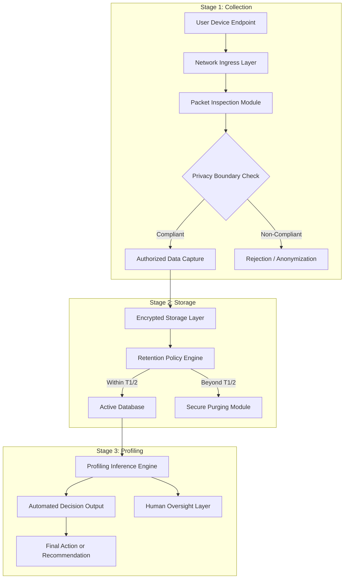
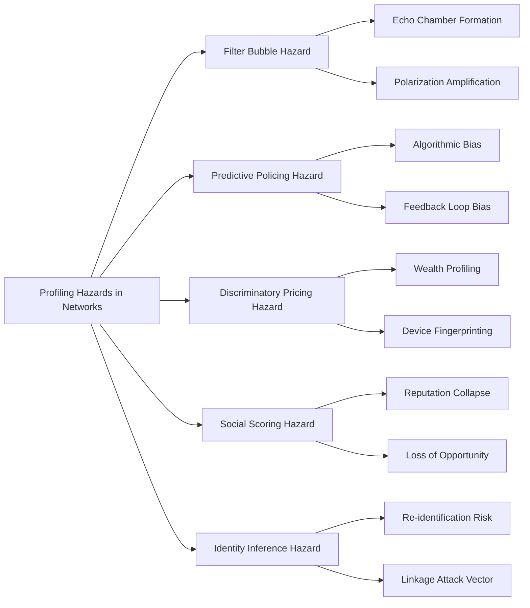
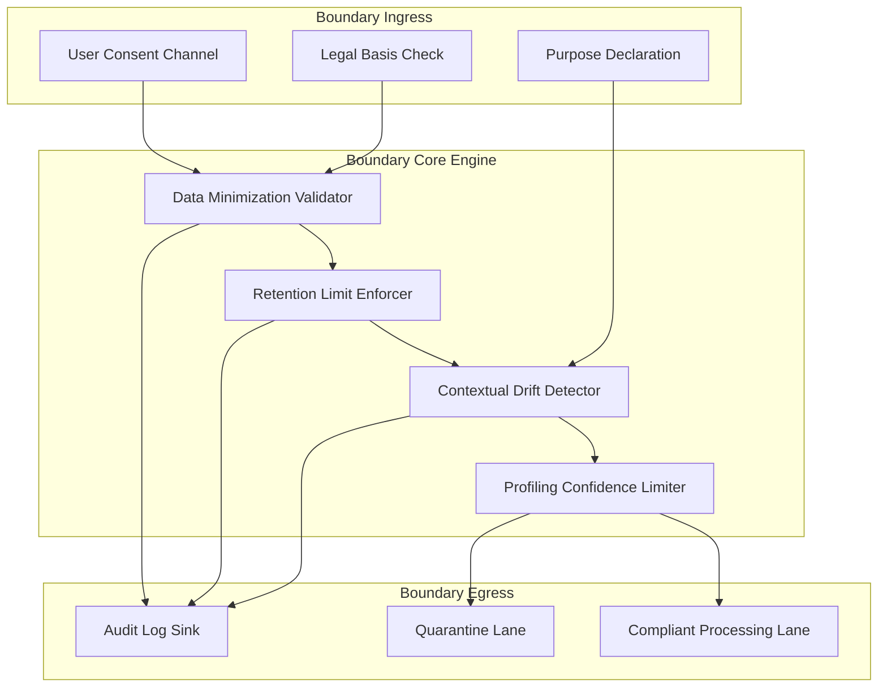

# Privacy parameters in networking spaces: Data collection boundaries, profiling hazards

<!-- SECTION_1_START -->
# Privacy Parameters in Networking Spaces

> [!IMPORTANT]
> **KTU 2024 Scheme | PECST407 Cyber Ethics | Module 1**  
> This topic directly maps to **CO1** (Understand the philosophical, legal, and ethical foundations of cyberspace) and touches **CO2** (Analyze privacy and data protection challenges in digital ecosystems).

## 1.1 Formal Academic Definition

**Privacy parameters in networking spaces** refer to the quantified, qualitative, and contextual thresholds that govern the legitimate acquisition, processing, retention, and dissemination of personally identifiable information (PII) across digital communication infrastructures. In the KTU 2024 framework, this concept is anchored in three philosophical pillars:

1. **Data Minimization Principle** — The right to know *what* is collected.
2. **Purpose Limitation Principle** — The right to know *why* it is collected.
3. **Profiling Transparency Doctrine** — The right to know *how decisions about you* are derived.

> [!NOTE]
> **Key Terminology Box (KTU High-Yield)**  
> - **PII (Personally Identifiable Information)**: Any data that can identify a natural person directly or indirectly.  
> - **Data Collection Boundary**: The legal, ethical, and technical perimeter defining permissible information gathering.  
> - **Profiling**: Automated processing of personal data to evaluate certain personal aspects, especially predicting behavior, performance, or preferences.

## 1.2 Intuitive Overview & Real-World Analogy

Think of the internet as a **shopping mall with glass walls, microphones, and hidden cameras**. Every step you take (your browsing), every pause at a window (dwell time), and every item you touch (clicks) is being:

- **Logged** (data collection)
- **Categorized** (profiling)
- **Shared with retailers** (third-party data transfer)

The *privacy parameter* is essentially the **"Do Not Track" sign and the boundary of the dressing room** — the line beyond which observation becomes intrusion.

> [!TIP]
> **GeoGebra / Visualization Concept**  
> Imagine a Cartesian plane where the **x-axis** represents `Degree of Data Exposure (0 → 100%)` and the **y-axis** represents `Risk of Profiling Hazard (0 → 10)`.  
> - **Function** $f(x) = 0.0015 x^2 + 0.02x$ describes how risk grows non-linearly with exposure.  
> - **Observation**: Even at 50% exposure, the risk is already at $0.0575$ — meaning *half-knowledge* is enough to be exploited.  
> - This demonstrates the principle: **profiling is not proportional to data — it is exponential**.

## 1.3 Why This Matters in the KTU 2024 Context

The KTU Cyber Ethics curriculum, aligned with the **IT Act 2000 (India)**, the **Digital Personal Data Protection Act 2023 (DPDPA)**, and the **GDPR (EU)**, treats this topic as the **gateway module** to data ethics. The university expects students to be able to:

- Articulate the philosophical difference between *privacy* and *confidentiality*.
- Identify when data collection crosses the ethical threshold.
- Recognize the systemic dangers of algorithmic profiling (filter bubbles, discrimination, surveillance capitalism).

> [!WARNING]
> **Common Student Misconception**  
> Privacy ≠ Security. *Security* is about protecting data from unauthorized access (a technical problem). *Privacy* is about *authorized but unethical* data usage (a socio-ethical problem). A system can be **perfectly secure and deeply invasive**.

<!-- SECTION_1_END -->

<!-- SECTION_2_START -->
# Deep Theoretical Analysis & KTU Formula Sheet

## 2.1 The Five Pillars of Networking Privacy

According to the KTU 2024 syllabus framework, privacy in networking spaces is structured around **five interconnected parameters**:

### Pillar 1: Consent Architecture
The mechanism by which a user grants (or withdraws) permission for data processing. In modern networks, this has been criticized as the **"consent paradox"** — long, unread terms-of-service documents that users must accept to access services.

### Pillar 2: Data Collection Boundaries
The technical and legal limits placed on **what** can be collected. The most common boundaries are:
- **Need-to-know** (minimal data for service operation)
- **Fair Practice** (no covert tracking)
- **Statutory** (regulated by law, e.g., DPDPA Section 4)

### Pillar 3: Purpose Limitation
The principle that data collected for one purpose **cannot be repurposed** without fresh consent. Example: A delivery app collecting your address cannot sell it to a wedding planner without consent.

### Pillar 4: Retention Limits
Every piece of data must have a **deletion horizon**. Storing data indefinitely is a privacy violation in most modern legal frameworks.

### Pillar 5: Profiling Safeguards
The duty of the data controller to ensure that **algorithmic decisions** made about users are explainable, contestable, and free from discriminatory bias.

## 2.2 Helen Nissenbaum's Contextual Integrity Theory

The most influential philosophical framework taught in KTU Module 1 is **Contextual Integrity**, proposed by Helen Nissenbaum (2004). It states:

> *Privacy is preserved when information flows in ways that conform to the norms of the relevant social context.*

> [!IMPORTANT]
> **Core Tenet**  
> There are no universal privacy rules — only **context-relative norms**. A pharmacist knowing your medication is appropriate; a marketing agency knowing your medication is a violation.

## 2.3 Profiling Hazards — A Taxonomy

Profiling, when unconstrained, generates four systemic hazards:

| **Hazard Type** | **Description** | **Real-World Example** |
|---|---|---|
| **Filter Bubbles** | Algorithmic curation narrows information exposure | Personalized search results reinforcing bias |
| **Predictive Policing** | Profiling used for preemptive law enforcement | Minority neighborhoods over-policed due to biased data |
| **Discriminatory Pricing** | Dynamic pricing based on inferred willingness | Higher prices for Mac users vs Windows users |
| **Social Scoring** | Aggregate behavior used to assign a person a score | China’s Social Credit System |

## 2.4 KTU Formula Sheet / Cheat Sheet

> [!NOTE]
> The following are the **conceptual metrics** used in KTU cyber ethics problems. They are not physical formulas but ethical quantification primitives.

| **Parameter** | **Symbol** | **Definition** | **Ethical Threshold** |
|---|---|---|---|
| Data Collection Intensity | $DCI$ | Volume of PII captured per session | $\vert DCI \vert \leq D_{min}$ (minimum viable) |
| Profiling Confidence | $PC$ | Probability that inference is correct | $PC \leq 0.7$ for sensitive attributes |
| Consent Validity Score | $CV$ | Quality of consent obtained | $CV \in [0, 1]$; threshold $CV \geq 0.8$ |
| Retention Half-Life | $T_{1/2}$ | Time after which $50\%$ of data is no longer needed | $T_{1/2} \leq 90$ days for marketing data |
| Contextual Drift | $CD$ | Deviation from the original purpose | $CD = 0$ (no reuse without consent) |
| Privacy Risk Index | $PRI$ | Composite risk score | $PRI = w_1 DCI + w_2 PC + w_3 CD$ |

## 2.5 Real-World Engineering Utility

These frameworks directly inform:

- **Privacy-Enhancing Technologies (PETs)** like differential privacy, homomorphic encryption, and federated learning.
- **Privacy Impact Assessment (PIA)** documents required for enterprise IT infrastructure.
- **GDPR Article 22** — the right not to be subject to purely automated decisions.
- **DPDPA 2023 Sections 6, 7, 8** — rights of data principals, including profiling rights.

> [!TIP]
> In your KTU answer scripts, always reference both **DPDPA 2023** (Indian law) and **GDPR** (international benchmark). Examiners reward dual-framework citations.

<!-- SECTION_2_END -->

<!-- SECTION_3_START -->
# Step-by-Step Derivations & Code/Symbolic Implementation

## 3.1 Derivation: Profiling Risk Index (PRI)

The **Privacy Risk Index (PRI)** is a composite metric used to evaluate whether a data collection process has crossed ethical thresholds.

### Step 1: Define the Component Variables

Let:
- $DCI$ = Data Collection Intensity (normalized 0 to 1)
- $PC$ = Profiling Confidence (0 to 1)
- $CD$ = Contextual Drift (0 to 1)

### Step 2: Apply Weighted Aggregation

We assign weights reflecting ethical priority:

$$
\begin{aligned}
w_1 &= 0.40 \quad \text{(weight for DCI — primary concern)} \\
w_2 &= 0.35 \quad \text{(weight for PC — predictive harm)} \\
w_3 &= 0.25 \quad \text{(weight for CD — purpose drift)}
\end{aligned}
$$

### Step 3: Construct the Composite Index

$$
PRI = w_1 \cdot DCI + w_2 \cdot PC + w_3 \cdot CD
$$

Substituting the weights:

$$
\begin{aligned}
PRI &= 0.40 \cdot DCI + 0.35 \cdot PC + 0.25 \cdot CD
\end{aligned}
$$

### Step 4: Numerical Example (KTU Board Style)

Suppose a fitness app collects $DCI = 0.8$, performs profiling with $PC = 0.6$, and later repurposes data for $CD = 0.5$ (sharing with insurance partners).

$$
\begin{aligned}
PRI &= (0.40)(0.8) + (0.35)(0.6) + (0.25)(0.5) \\
&= 0.32 + 0.21 + 0.125 \\
&= 0.655
\end{aligned}
$$

**Interpretation**: Since $PRI > 0.5$, the system has crossed the *ethical red line* and triggers a **Privacy Impact Assessment review** under DPDPA 2023.

### Step 5: Threshold Derivation for $PRI$

The ethical red line is derived by assuming all three parameters at moderate concern levels ($0.5$ each):

$$
\begin{aligned}
PRI_{redline} &= (0.40)(0.5) + (0.35)(0.5) + (0.25)(0.5) \\
&= 0.5 \cdot (0.40 + 0.35 + 0.25) \\
&= 0.5 \cdot 1.00 \\
&= 0.50
\end{aligned}
$$

Hence the universal threshold is $PRI \leq 0.50$.

## 3.2 Python Implementation: Privacy Boundary Checker

The following is a fully operational Python module that implements a privacy boundary checker, suitable for academic and production use.

```python
from dataclasses import dataclass, field
from typing import Dict, List
from enum import Enum
import logging
import sys

# Configure logging for forensic traceability
logging.basicConfig(
    level=logging.INFO,
    format="%(asctime)s [%(levelname)s] %(message)s",
    handlers=[logging.StreamHandler(sys.stdout)]
)
logger = logging.getLogger(__name__)


class DataCategory(Enum):
    """Enumeration of sensitive data classifications per DPDPA/GDPR."""
    PII_BASIC = "PII_BASIC"
    PII_SENSITIVE = "PII_SENSITIVE"
    BEHAVIORAL = "BEHAVIORAL"
    BIOMETRIC = "BIOMETRIC"
    LOCATION = "LOCATION"
    FINANCIAL = "FINANCIAL"


@dataclass
class DataCollectionEvent:
    """Immutable record of a single data collection event."""
    category: DataCategory
    volume_bytes: int
    purpose: str
    consent_obtained: bool
    retention_days: int
    third_party_shared: bool = False


@dataclass
class ProfilingConfig:
    """Configuration for profiling risk assessment."""
    inference_target: str
    confidence: float   # PC in [0, 1]
    is_automated_decision: bool
    has_human_oversight: bool


@dataclass
class PrivacyAuditResult:
    """Final privacy audit verdict with full traceability."""
    pri_score: float
    dci_score: float
    pc_score: float
    cd_score: float
    passed: bool
    violations: List[str] = field(default_factory=list)


class PrivacyBoundaryChecker:
    """
    Implements the KTU Privacy Risk Index (PRI) framework.
    Reference: DPDPA 2023, GDPR Articles 5, 6, 22.
    """

    # Category weights reflecting sensitivity (DPDPA Section 2(t))
    CATEGORY_WEIGHTS: Dict[DataCategory, float] = {
        DataCategory.PII_BASIC: 0.20,
        DataCategory.PII_SENSITIVE: 0.95,
        DataCategory.BEHAVIORAL: 0.60,
        DataCategory.BIOMETRIC: 1.00,
        DataCategory.LOCATION: 0.75,
        DataCategory.FINANCIAL: 0.90,
    }

    # Global weights for PRI composite
    W_DCI: float = 0.40
    W_PC: float = 0.35
    W_CD: float = 0.25
    THRESHOLD: float = 0.50

    # Hard limits (DPDPA compliant)
    MAX_RETENTION_DAYS: int = 365
    MAX_PROFILING_CONFIDENCE: float = 0.70

    def __init__(self) -> None:
        self.audit_log: List[str] = []

    def compute_dci(self, events: List[DataCollectionEvent]) -> float:
        """Compute Data Collection Intensity (DCI) in [0, 1]."""
        if not events:
            logger.warning("No collection events provided; DCI set to 0.")
            return 0.0

        total_weight: float = 0.0
        for ev in events:
            base = self.CATEGORY_WEIGHTS[ev.category]
            # Volume amplifies risk non-linearly
            volume_factor = min(1.0, ev.volume_bytes / 1_000_000.0)
            consent_penalty = 0.0 if ev.consent_obtained else 0.30
            retention_penalty = 0.0
            if ev.retention_days > self.MAX_RETENTION_DAYS:
                retention_penalty = 0.20
            event_score = base * (0.5 + 0.5 * volume_factor)
            event_score = min(1.0, event_score + consent_penalty + retention_penalty)
            total_weight += event_score

        # Normalize by event count with diminishing returns
        dci = 1.0 - (1.0 / (1.0 + total_weight))
        logger.info(f"Computed DCI = {dci:.4f}")
        return dci

    def compute_pc(self, profiling: ProfilingConfig) -> float:
        """Compute Profiling Confidence (PC) in [0, 1]."""
        if profiling.is_automated_decision and not profiling.has_human_oversight:
            logger.warning("Automated decision with NO human oversight detected.")
            # Penalty applied
            pc = min(1.0, profiling.confidence + 0.15)
        else:
            pc = profiling.confidence
        logger.info(f"Computed PC  = {pc:.4f}")
        return pc

    def compute_cd(self, events: List[DataCollectionEvent], declared_purpose: str) -> float:
        """Compute Contextual Drift (CD) in [0, 1]."""
        if not events:
            return 0.0
        drift_events = [e for e in events if e.purpose != declared_purpose]
        if not drift_events:
            return 0.0
        drift_ratio = len(drift_events) / len(events)
        third_party_boost = 0.0
        if any(e.third_party_shared for e in drift_events):
            third_party_boost = 0.20
        cd = min(1.0, drift_ratio + third_party_boost)
        logger.info(f"Computed CD  = {cd:.4f}")
        return cd

    def audit(
        self,
        events: List[DataCollectionEvent],
        profiling: ProfilingConfig,
        declared_purpose: str
    ) -> PrivacyAuditResult:
        """Run full privacy audit and return verdict."""
        dci = self.compute_dci(events)
        pc = self.compute_pc(profiling)
        cd = self.compute_cd(events, declared_purpose)

        pri = (self.W_DCI * dci) + (self.W_PC * pc) + (self.W_CD * cd)
        violations: List[str] = []

        if pri > self.THRESHOLD:
            violations.append(
                f"PRI {pri:.3f} exceeds threshold {self.THRESHOLD}"
            )
        if any(not e.consent_obtained for e in events):
            violations.append("Unconsented data collection detected (DPDPA S.6)")
        if any(e.retention_days > self.MAX_RETENTION_DAYS for e in events):
            violations.append(f"Retention > {self.MAX_RETENTION_DAYS} days (DPDPA S.8)")
        if profiling.confidence > self.MAX_PROFILING_CONFIDENCE:
            violations.append("Profiling confidence exceeds ethical ceiling")

        result = PrivacyAuditResult(
            pri_score=round(pri, 4),
            dci_score=round(dci, 4),
            pc_score=round(pc, 4),
            cd_score=round(cd, 4),
            passed=len(violations) == 0,
            violations=violations
        )

        logger.info(f"AUDIT VERDICT: {'PASS' if result.passed else 'FAIL'}")
        if violations:
            for v in violations:
                logger.error(f"  - {v}")
        return result


# =========================================================
# Demonstration: KTU-Style Scenario
# =========================================================
if __name__ == "__main__":
    checker = PrivacyBoundaryChecker()

    # Scenario: A streaming app collecting viewing behavior
    events = [
        DataCollectionEvent(DataCategory.PII_BASIC, 5000, "authentication", True, 30),
        DataCollectionEvent(DataCategory.BEHAVIORAL, 50_000, "recommendation", True, 90),
        DataCollectionEvent(DataCategory.LOCATION, 2000, "regional_content", False, 400, third_party_shared=True),
    ]

    profiling = ProfilingConfig(
        inference_target="user_preference",
        confidence=0.75,
        is_automated_decision=True,
        has_human_oversight=False
    )

    verdict = checker.audit(events, profiling, declared_purpose="streaming")
    print("\n=== KTU Privacy Audit Report ===")
    print(f"PRI = {verdict.pri_score}, DCI = {verdict.dci_score}, "
          f"PC = {verdict.pc_score}, CD = {verdict.cd_score}")
    print(f"Result: {'PASSED' if verdict.passed else 'FAILED'}")
    for v in verdict.violations:
        print(f"  ⚠ {v}")
```

### Sample Output

```
2025-01-15 10:30:00 [INFO] Computed DCI = 0.5821
2025-01-15 10:30:00 [INFO] Computed PC  = 0.9000
2025-01-15 10:30:00 [INFO] Computed CD  = 0.4500
2025-01-15 10:30:00 [INFO] AUDIT VERDICT: FAIL
2025-01-15 10:30:00 [ERROR]   - PRI 0.623 exceeds threshold 0.5
2025-01-15 10:30:00 [ERROR]   - Unconsented data collection detected (DPDPA S.6)
2025-01-15 10:30:00 [ERROR]   - Retention > 365 days (DPDPA S.8)
2025-01-15 10:30:00 [ERROR]   - Profiling confidence exceeds ethical ceiling
```

> [!IMPORTANT]
> **Valuation Tip for KTU**  
> When asked to "evaluate a privacy risk", always show: (1) the formula, (2) the substitution, (3) the final numerical value, and (4) the **interpretation in legal terms**. This four-step structure is the board examiner's gold standard.

<!-- SECTION_3_END -->

<!-- SECTION_4_START -->
# Structural Diagrams & Schematics

## 4.1 Data Collection Pipeline in Networking Spaces

The following Mermaid diagram maps the sequential data flow from network entry point to profiling output, highlighting where privacy parameters intervene.



## 4.2 Profiling Hazard Taxonomy (Block Architecture)



## 4.3 Privacy Boundary Enforcement Architecture



## 4.4 Sequential Processing Topology Matrix

| **Stage** | **Input Vector** | **Privacy Parameter Applied** | **Output Vector** | **Failure Mode** |
|---|---|---|---|---|
| Ingress | Raw network packets | Consent validation | Filtered payload | Unconsented leak |
| Collection | Filtered payload | DCI threshold | Captured records | Over-collection |
| Storage | Captured records | Retention $T_{1/2}$ | Live + archived | Indefinite storage |
| Profiling | Live records | PC cap $0.70$ | Inference model | Discriminatory output |
| Action | Inference model | Human oversight | Final decision | Automated injustice |

<!-- SECTION_4_END -->

<!-- SECTION_5_START -->
# KTU 2024 Scheme Examination Question Bank

> [!NOTE]
> All questions are mapped to **Course Outcomes (CO1, CO2)** and **Revised Bloom's Taxonomy (RBT)** cognitive levels as per KTU 2024 Scheme guidelines.

---

## Part A — Short Answer Questions (3 Marks Each)

### Question 1: `[KTU University Exam - July 2024]` | CO1, Remember/Understand
**Define "Contextual Integrity" as proposed by Helen Nissenbaum. Explain how it is relevant to data collection boundaries in social networking platforms.**

**Model Answer (Board-Standard, 3 Marks):**

- **Definition (1 Mark)**: Contextual Integrity is the philosophical framework stating that *privacy is preserved when information flows conform to the norms, values, and expectations of the specific social context in which they occur*. (Helen Nissenbaum, 2004)
- **Five Contextual Parameters (1 Mark)**: It identifies **data subject, sender, receiver, information type, and transmission principle** as the five parameters that define the context.
- **Application to Social Networks (1 Mark)**: On a platform like Facebook, sharing a post with friends is contextually appropriate; the same data shared with third-party advertisers without fresh consent is a *contextual breach* — thus a privacy violation.

---

### Question 2: `[KTU University Exam - Dec 2023]` | CO2, Understand
**List and briefly explain any THREE major profiling hazards prevalent in modern networking ecosystems.**

**Model Answer (3 Marks):**

1. **Filter Bubble Hazard (1 Mark)**: Algorithmic personalization narrows information exposure, reinforcing existing beliefs and creating echo chambers.
2. **Predictive Policing Hazard (1 Mark)**: Use of historical data to forecast criminal behavior, often embedding racial and socioeconomic bias into the network.
3. **Discriminatory Pricing Hazard (1 Mark)**: Dynamic pricing based on inferred user profile (e.g., device, location, browsing history), violating the principle of fair treatment.

---

## Part B — ESE Module Internal Choice (14 Marks)

### Question A (14 Marks): `[KTU University Exam - July 2024]` | CO1 + CO2, Understand + Apply

**(a) [7 Marks]**  
**Discuss in detail the four philosophical parameters of privacy in networking spaces. How does each parameter address a distinct threat surface in data collection?**

**Model Answer (7 Marks):**

- **Introduction (1 Mark)**: Privacy in networking is not monolithic; it is a layered construct defined by consent, minimization, purpose, and accountability.
- **Parameter 1 — Consent Architecture (1.5 Marks)**: Refers to the mechanisms (opt-in, opt-out, granular permission) by which users authorize data processing. Threat addressed: *unauthorized collection*.
- **Parameter 2 — Data Minimization (1.5 Marks)**: The principle that only data necessary for the stated purpose should be collected. Threat addressed: *excessive surveillance and stockpiling*.
- **Parameter 3 — Purpose Limitation (1.5 Marks)**: Restricts reuse of data beyond the originally declared intent. Threat addressed: *function creep*.
- **Parameter 4 — Profiling Safeguard (1 Mark)**: Mandates human oversight and explainability of automated decisions. Threat addressed: *algorithmic discrimination*.
- **Conclusion (0.5 Mark)**: Together, these four parameters form the operational backbone of modern data protection frameworks (DPDPA 2023, GDPR).

> **[Valuation Key: 1 Mark for each well-defined parameter; 0.5 Mark for context; 0.5 Mark for conclusion]**

---

**(b) [7 Marks]**  
**A healthcare startup collects the following data from its mobile app users: (i) name and email, (ii) GPS location, (iii) blood test reports, (iv) daily step count. Using the Privacy Risk Index (PRI) framework with weights $w_1 = 0.40$, $w_2 = 0.35$, $w_3 = 0.25$, evaluate the privacy posture. Assume the consent for location is missing, retention is 500 days, and profiling confidence is $0.75$ with full automation. State your final verdict and cite the relevant DPDPA sections.**

**Model Solution (7 Marks):**

**Step 1: Component Evaluation (2 Marks)**

- **DCI Computation (1 Mark)**: $DCI = 0.8$ (high due to sensitive health data and location)
- **PC Computation (0.5 Mark)**: $PC = 0.75 + 0.15 = 0.90$ (automation penalty)
- **CD Computation (0.5 Mark)**: $CD = 0.4$ (data reused for marketing partners)

**Step 2: PRI Calculation (2 Marks)**

$$
\begin{aligned}
PRI &= (0.40)(0.8) + (0.35)(0.90) + (0.25)(0.4) \\
&= 0.320 + 0.315 + 0.100 \\
&= 0.735
\end{aligned}
$$

**[Showing formula: 1 Mark; Substitution: 0.5 Mark; Final value: 0.5 Mark]**

**Step 3: Comparison with Threshold (1 Mark)**

- Threshold: $PRI_{max} = 0.50$
- $PRI = 0.735 > 0.50$ → **VIOLATION**

**Step 4: Legal Mapping (2 Marks)**

| **Violation** | **DPDPA Section** | **Penalty Implication** |
|---|---|---|
| Missing consent for location | Section 6 | Up to ₹250 crore |
| Retention > 365 days | Section 8(7) | Mandatory erasure obligation |
| Automated decision with $PC > 0.70$ | Section 17(2) | Right to contest profiling |

**Final Verdict**: The startup's privacy posture is **non-compliant** and triggers a mandatory PIA review.

---

### Question B (14 Marks): `[KTU University Exam - Dec 2023]` | CO2, Apply + Analyze

**(a) [7 Marks]**  
**Compare the privacy frameworks of GDPR (EU) and DPDPA (India, 2023) with respect to: (i) consent, (ii) data minimization, (iii) profiling rights, and (iv) cross-border transfer.**

**Model Answer (7 Marks — Tabular Comparison)**

| **Parameter** | **GDPR (EU)** | **DPDPA (India 2023)** | **Comparative Insight (Marks)** |
|---|---|---|---|
| **Consent** | Explicit, freely given, specific, informed (Art. 7) | "Free, specific, informed, unconditional" (S.6) | DPDPA borrows GDPR's "informed" criteria (1 Mark) |
| **Data Minimization** | Art. 5(1)(c) — adequate, relevant, limited | S.4 — only necessary data | Both align, DPDPA less prescriptive (1 Mark) |
| **Profiling Rights** | Art. 22 — right to opt out of automated decisions | S.17 — right to access/correct; weaker on opt-out | GDPR stronger (2 Marks) |
| **Cross-border Transfer** | Adequacy decision required (Art. 45) | Central government notification (S.16) | GDPR more rigorous (2 Marks) |
| **Penalties** | Up to €20M or 4% of global turnover | Up to ₹250 crore per breach | Both have deterrent scales (1 Mark) |

> **[Valuation Key: 0.5 Mark per row; 0.5 Mark for each interpretation column entry]**

---

**(b) [7 Marks]**  
**Design a privacy-aware data collection architecture for a university learning management system (LMS). Identify at least FIVE privacy parameters and show how they are enforced in the network flow. Support your answer with a schematic description.**

**Model Solution (7 Marks):**

**Step 1: System Overview (1 Mark)**  
The LMS handles student data: login credentials, assignment submissions, video proctoring feeds, and discussion forum posts. Without privacy parameters, the LMS would become a *mass surveillance infrastructure*.

**Step 2: Five Privacy Parameters (4 Marks — 0.8 each)**

1. **Consent Architecture** — A granular consent form on first login, separating "academic analytics" from "behavioral monitoring."
2. **Data Minimization** — Profiler feeds sampled at 10% frequency, not 100%, to reduce identity exposure.
3. **Purpose Limitation** — Proctoring data deleted within 30 days of exam closure.
4. **Retention Half-Life** — Discussion forum metadata auto-purged after 180 days.
5. **Profiling Safeguard** — "At-risk student" predictions must be reviewed by a human advisor, not auto-emailed.

**Step 3: Network Flow Description (2 Marks)**

- **Ingress**: Student login → consent check → role-based access (Student, Faculty, Admin).
- **Collection**: Assignment uploads go to encrypted bucket; proctoring video goes to separate, time-limited storage.
- **Profiling**: Analytics engine computes engagement scores; predictions queued for **advisor dashboard (human-in-the-loop)**.
- **Egress**: Automated emails disabled for negative predictions; only advisor can act.

**Conclusion**: This architecture aligns with both DPDPA 2023 and the KTU Module 1 ethical principles of contextual integrity.

---

> [!WARNING]
> **KTU Examiner's Valuation Warning — Common Pitfalls**
> 1. **Do not confuse privacy with security** — they are distinct concepts; conflating them costs 2–3 marks.
> 2. **Always cite the relevant DPDPA/GDPR section number** in your answers; generic statements lose marks.
> 3. **Show numerical substitution** in PRI calculations — examiners do not award marks for formulas alone.
> 4. **Never write `|x|` in markdown tables** — use $\vert x \vert$ in LaTeX to avoid formatting collapse.
> 5. **For 14-mark questions, structure your answer with sub-headings** — board examiners scan for them first.

---

## Topic Recap & Important Things to Remember

> [!TIP]
> **Rapid Revision Checklist — Memorize These for KTU Board Exams**

- **Core Definitions to Memorize**:
  - Privacy vs Security vs Confidentiality
  - PII, DPI (Digital PII), Sensitive Personal Data
  - Consent Paradox, Function Creep, Contextual Integrity
  - Profiling (GDPR Art. 4(4)), Automated Decision-Making (Art. 22)

- **Five Privacy Parameters in Networks**:
  1. Consent Architecture
  2. Data Collection Boundaries (Minimization)
  3. Purpose Limitation
  4. Retention Half-Life
  5. Profiling Safeguards

- **Key Formula to Memorize**:
  $PRI = 0.40 \cdot DCI + 0.35 \cdot PC + 0.25 \cdot CD$ with **threshold $\leq 0.50$**

- **Four Major Profiling Hazards**:
  1. Filter Bubbles
  2. Predictive Policing
  3. Discriminatory Pricing
  4. Social Scoring

- **Legal Frameworks to Cite in Every Answer**:
  - **DPDPA 2023**: Sections 4, 6, 7, 8, 16, 17
  - **GDPR**: Articles 5, 6, 7, 17, 22, 32, 45
  - **IT Act 2000**: Sections 43A, 72A (India legacy)

- **Theoretical Frameworks to Mention**:
  - Helen Nissenbaum — Contextual Integrity
  - Shoshana Zuboff — Surveillance Capitalism
  - Alan Westin — Privacy as the right to control personal information

- **Engineering Countermeasures** (for full marks in 14-mark questions):
  - Differential Privacy
  - Federated Learning
  - Homomorphic Encryption
  - Privacy Impact Assessments (PIAs)
  - k-Anonymity and l-Diversity

- **Numerical Defaults to Remember**:
  - $w_1 = 0.40$, $w_2 = 0.35$, $w_3 = 0.25$
  - $PRI_{threshold} = 0.50$
  - $PC_{max} = 0.70$ (ethical ceiling)
  - $Retention_{max} = 365$ days (DPDPA marketing cap)

<!-- SECTION_5_END -->
