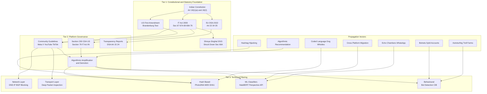
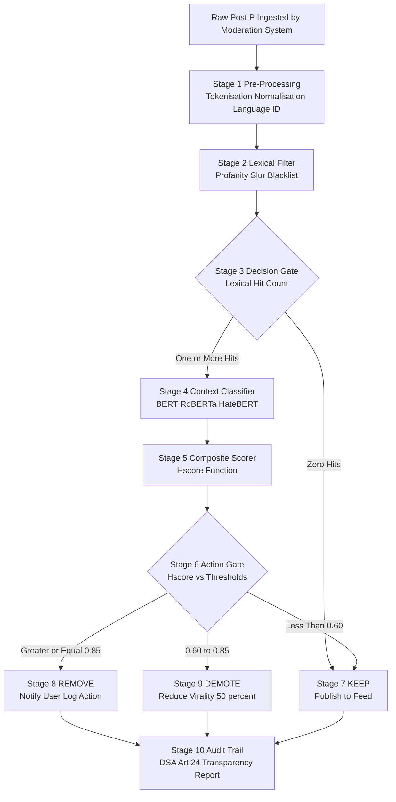
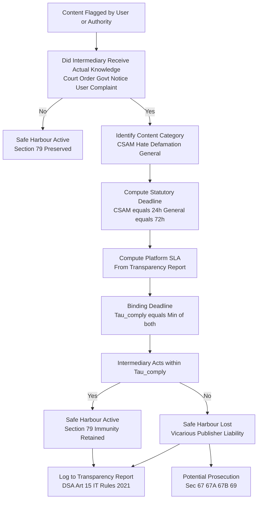

# Free speech constraints online: Censorship, hate speech propagation vectors filtering

<!-- SECTION_1_START -->
# 1. Core Technical Definition & Intuitive Overview

## 1.1 Formal Academic Definition (KTU 2024 Syllabus Terminology)

**Online Free Speech Constraints** refer to the legally sanctioned, technically enforced, and platform-imposed limitations on the expression, publication, or dissemination of digital content. These constraints operate across three intersecting dimensions:

- **Juridical Censorship**: State-mandated suppression of speech, often implemented through intermediary liability rules, blocking injunctions, and takedown regimes (e.g., **Section 69 of the IT Act, 2000** in India; **Section 230 of the Communications Decency Act, 1996** in the US; **Article 11 of the EU Charter of Fundamental Rights**).
- **Platform Governance**: Private ordering through Terms of Service (ToS), Community Guidelines, and Algorithmic Amplification Modulation executed by intermediaries.
- **Hate Speech Filtering**: The systematic detection, classification, demotion, or removal of content expressing hostility toward a protected group based on race, religion, gender, ethnicity, sexual orientation, or disability.

> [!IMPORTANT]
> **KTU 2024 Module 2 Anchor Concept:** The triad of **State Censorship, Platform Moderation, and Hate Speech Propagation Filtering** forms the regulatory spine of the *Digital Society Regulations* module. Examiners expect students to map any incident (e.g., Twitter/X compliance in India, 2023) to these three vectors simultaneously.

## 1.2 Conceptual Analogy / Intuitive Overview

Think of the internet as a **massive public marketplace (Sultan Bazaar / Chandni Chowk analogy)**:

- **Free Speech** = The right of every shopkeeper to shout about their goods.
- **Censorship** = The Municipal Corporation's power to revoke a license if the shouting spreads panic (e.g., "fire!" in a crowded theatre).
- **Hate Speech** = A shopkeeper inciting a mob against a neighboring shop owned by a minority community — legally and ethically distinct from simple loudness.
- **Filtering** = The bouncers and CCTV cameras at the gate. They don't own the market, but they check what enters. Bouncers can be biased, slow, or overzealous — this is why **filtering is both a technical and a governance problem**.

The **propagation vectors** are the *delivery trucks* — botnets, hashtag cascades, recommendation algorithms, and cross-platform re-uploads — that move hateful content from one corner of the marketplace to millions of screens in minutes.

> [!NOTE]
> **Key Distinction (Board-Exam Favourite):**
> - **Censorship** removes *legal-but-objectionable* content.
> - **Filtering** removes *illegal (or platform-banned)* content, often *preemptively*.
> - **Hate Speech** is the *substance*; censorship and filtering are the *mechanisms* used against it.

## 1.3 Standard Metrics & Constants

| Metric / Constant | Symbol | Typical Value / Definition |
|---|---|---|
| India's Intermediary Safe-Harbour Threshold | $\tau_s$ | **Section 79, IT Act 2000** — actual knowledge + 72-hour takedown window |
| EU Digital Services Act Removal Window (illegal content) | $\tau_{EU}$ | **"Expeditiously,"** typically interpreted as **≤ 24 hours** for manifestly illegal content |
| Algorithmic Content-Demotion Factor | $\delta_d$ | Platform-defined; **Meta** uses ~**50%** demotion for borderline content (2024 transparency report) |
| Hate Speech Precision Floor (EU DSA mandate) | $P_{min}$ | **≥ 0.90 precision** for automated classifiers in DSA Art. 22(2) |
| Section 69A Block Order Compliance Time | $\tau_{69A}$ | **≤ 24 hours** from issuance (blocking order, 2009 Rules) |

## 1.4 GeoGebra / Desmos Visualization Callout

> [!VISUALIZATION CONTROL]
> **Concept:** Free Speech Restriction Surface — the trade-off curve between *Expression Volume* (x-axis) and *Harm Mitigation* (y-axis).
> **GeoGebra / Desmos Input Equations:**
> - $f_{1}(x) = 100 - 0.8x$ → *State-Censorship Vector* (steeper, restrictive)
> - $f_{2}(x) = 90 - 0.4x$ → *Platform-Governance Vector* (moderate slope)
> - $f_{3}(x) = 60 - 0.1x$ → *Hate-Speech Filter Vector* (narrow scope, high specificity)
> **Visual Description:** Plot all three lines on the same coordinate plane. The student should observe that **filtering preserves the most expression** for any given harm-reduction target, while **state censorship** offers the steepest harm reduction at the highest expressive cost. The shaded intersection zone represents the *regulatory sweet spot* favored by democratic constitutions like India's **Article 19(2)**.

---

<!-- SECTION_1_END -->

<!-- SECTION_2_START -->
# 2. Deep Theoretical Analysis & KTU High-Yield Formula Sheet

## 2.1 The Three-Tier Free Speech Constraint Architecture

### Tier 1 — Constitutional / Statutory Foundation
Every democratic legal system balances free expression against competing public goods (order, dignity, security).

**India — Article 19(1)(a) + 19(2) of the Constitution:**
- **19(1)(a)**: Guarantees *freedom of speech and expression* to all citizens.
- **19(2)**: Permits *reasonable restrictions* on **eight grounds only**: sovereignty & integrity of India, security of the State, friendly relations with foreign States, public order, decency or morality, contempt of court, defamation, incitement to an offence.
- **Information Technology Act, 2000** operationalizes this for the digital domain via Sections **66A (struck down in *Shreya Singhal v. UoI*, 2015), 67, 67A, 67B, 69, 69A, 79, 79A**.

> [!IMPORTANT]
> **Landmark Case (Must-Memorize):** *Shreya Singhal v. Union of India* (2015) struck down **Section 66A IT Act** for being vague and overbroad. The judgment is the single most cited authority in Indian cyber-law exams for free speech questions.

**United States — First Amendment:**
- Near-absolute protection; *Brandenburg v. Ohio* (1969) permits restriction only when speech is **"directed to inciting or producing imminent lawless action AND is likely to incite or produce such action."**
- *R.A.V. v. City of St. Paul* (1992): Even hate speech cannot be regulated based on *viewpoint*.

**European Union — ECHR Article 10 + Article 17 (Anti-Abuse Clause):**
- Permits restrictions that are *prescribed by law*, pursue a *legitimate aim*, and are *necessary in a democratic society*.
- **DSA (Digital Services Act, 2022)** and **Digital Markets Act** operationalize the *Brussels Effect*.

### Tier 2 — Platform Governance (Private Ordering)

Platforms are **not state actors** (under US law) but act as **quasi-sovereign regulators** for billions of users.

- **Section 230, CDA (US)**: Grants platforms immunity for user-generated content while allowing good-faith moderation.
- **Section 79, IT Act (India)**: Conditional safe-harbour; lost if platform has *actual knowledge* of illegality and fails to act within **72 hours**.
- **Community Standards**: Twitter/X, Meta, YouTube, Reddit, TikTok each publish taxonomies (e.g., Meta's *Hateful Conduct* policy, X's *Violent Speech* policy).

### Tier 3 — Technical Filtering Mechanisms

Filtering is the **engineering realization** of legal norms. It operates at five layers:

1. **Network Layer**: DNS poisoning, IP blackholing, BGP route-hijack suppression.
2. **Transport Layer**: Deep Packet Inspection (DPI) by ISPs (e.g., India's DoT orders to block TikTok, PUBG in 2020).
3. **Application Layer**: Hash-based filtering (PhotoDNA, MD5/SHA-1 of CSAM), URL blacklists (Google Safe Browsing), keyword matching.
4. **ML / AI Layer**: NLP classifiers (BERT, RoBERTa, LLaMA fine-tunes), image classifiers (CNN, Vision Transformers), audio transcription + classification.
5. **Behavioral / Network Layer**: Bot detection, coordinated inauthentic behaviour (CIB) network analysis, viral-cascade anomaly detection.

## 2.2 Hate Speech Propagation Vectors (Engineering Perspective)

A **propagation vector** is a *channel* through which hateful content achieves scale. Each vector has a distinct *topology*, *velocity*, and *evasion technique*.

| Vector | Topology | Velocity | Typical Evasion | KTU Example |
|---|---|---|---|---|
| **Botnets / Sybil Accounts** | Star / Mesh | Very High (≥10⁴ posts/hr) | Account rotation, residential proxies | 2016 US election interference |
| **Algorithmic Amplification** | Recommendation graph | High (exponential) | Engagement bait, "ratio-bait" | YouTube "rabbit holes," TikTok For You |
| **Cross-Platform Migration** | Bridge nodes | Medium-High | Re-coding (text → meme → video) | Parler → Gab → Truth Social diaspora |
| **Hashtag Hijacking / Trend Jacking** | Cascade | Very High | Unicode homoglyphs, breaking words | #ReleaseTheMemo, COVID-19 hashtag wars |
| **Echo Chamber Seeding** | Cluster | Slow-burn | Trusted-influencer outreach | WhatsApp forward chains in India (2018 lynchings) |
| **Coded Language / Dog Whistles** | Sub-graph | Low visibility, high durability | Numerical codes ("14," "88"), inside references | "Great Replacement" theory coded terms |
| **Astroturfing** | Pseudo-grassroots | Medium | Fake grassroots accounts | Paid troll farms (e.g., IRA, 2018) |

## 2.3 KTU Formula Sheet / Cheat Sheet

> [!IMPORTANT]
> **KTU Board-Exam Tip:** The following five formulas are the *high-yield equations* for Module 2. Memorize the *variables* and the *operational meaning*, not the algebra.

| # | Formula / Relation | Operational Meaning | Exam Applicability |
|---|---|---|---|
| 1 | $H_{score} = \alpha \cdot T_{tox} + \beta \cdot C_{ctx} + \gamma \cdot G_{grp}$ | Composite Hate-Speech Score: weighted sum of **Toxicity** ($T_{tox}$), **Contextual Severity** ($C_{ctx}$), **Target Group Vulnerability** ($G_{grp}$) | ML classification, platform policy thresholds |
| 2 | $\tau_{comply} = \min(\tau_{statute}, \tau_{SLA})$ | Compliance window = **statutory minimum** vs **platform SLA**; take the minimum (the binding deadline) | Section 79 IT Act 72-hr; Section 69A 24-hr |
| 3 | $P_{F} = \dfrac{TP}{TP + FP}$ | **Filter Precision** — fraction of flagged items that are truly hateful. KTU DSA target $\geq 0.90$ | All filtering questions |
| 4 | $R_{F} = \dfrac{TP}{TP + FN}$ | **Filter Recall** — fraction of all hateful items actually caught. DSA target $\geq 0.80$ | Trade-off with $P_F$ |
| 5 | $F_{\beta} = (1 + \beta^2) \cdot \dfrac{P_F \cdot R_F}{\beta^2 P_F + R_F}$ | **F-beta Score** — harmonic mean with $\beta$ weighting recall vs precision. $\beta = 0.5$ favors precision, $\beta = 2$ favors recall | ML evaluation, DSA Art. 22 reports |
| 6 | $\delta_d = \dfrac{V_{pre} - V_{post}}{V_{pre}}$ | **Demotion Factor** — relative reduction in viewership / virality after algorithmic downranking | Meta, X, TikTok transparency |
| 7 | $A_{safe} = \mathbb{1}[\text{actual\_knowledge} \land \text{72h\_takedown}]$ | **Intermediary Safe-Harbour Activation** — binary function: true only if both conditions met (Section 79) | Every Indian cyber-law question |

> [!NOTE]
> **Notation Discipline:** Throughout KTU 2024 answers, italicize variables and use LaTeX math mode for subscripts. E.g., write $H_{score}$, **not** `H_score` or `Hscore`. This is a 0.5-mark differentiator in valuation.

## 2.4 Real-World Engineering & Policy Utility

| Domain | Application of Constraint System |
|---|---|
| **Social Media Engineering** | Building content classifiers (Perspective API, MetaHate, HateBERT) for Facebook, Instagram, X |
| **ISP / Telecom** | Implementing court-ordered blocks under Section 69A; maintaining centralized block lists (DoT / MeitY) |
| **Law Enforcement** | Tracing CIB (Coordinated Inauthentic Behaviour) networks via graph analysis (e.g., GraphSAGE, NetworkX) |
| **Corporate Compliance** | Building employer-side Slack/Teams profanity and harassment filters |
| **Election Integrity** | Detecting bot-driven hate campaigns (EU DSA Art. 34–35; India ECI 2024 deepfake advisory) |
| **Academic NLP** | Multilingual hate speech datasets (HindiBERT, Tamil-Hate, HASOC shared tasks) |

---

<!-- SECTION_2_END -->

<!-- SECTION_3_START -->
# 3. Step-by-Step Derivations & Code/Symbolic Implementation

## 3.1 Derivation 1 — Composite Hate-Speech Score ($H_{score}$)

The **Composite Hate-Speech Score** integrates three independent signals into a single scalar decision variable used by ML moderators.

### Step-by-Step Derivation

**Step 1 — Define the three base signals.**

Let each incoming post $p$ be evaluated by three independent classifiers:

- $T_{tox}(p) \in [0, 1]$: Toxicity score (Perspective API output).
- $C_{ctx}(p) \in [0, 1]$: Contextual severity — accounts for sarcasm, quoting, reclamation, and historical targeting.
- $G_{grp}(p) \in \{0, 0.25, 0.5, 0.75, 1.0\}$: Discrete vulnerability of the targeted group (e.g., **0 = no protected class**, **1.0 = genocide-inciting target**).

**Step 2 — Define weighting coefficients.**

The platform sets non-negative weights $\alpha, \beta, \gamma$ such that:

$$
\alpha + \beta + \gamma = 1, \quad \alpha, \beta, \gamma \geq 0
$$

For a *balanced* classifier typical defaults are:

$$
\alpha = 0.5, \quad \beta = 0.3, \quad \gamma = 0.2
$$

**Step 3 — Combine linearly.**

$$
H_{score}(p) = \alpha \cdot T_{tox}(p) + \beta \cdot C_{ctx}(p) + \gamma \cdot G_{grp}(p)
$$

**Step 4 — Apply decision threshold.**

$$
\text{Action}(p) =
\begin{cases}
\text{REMOVE} & \text{if } H_{score} \geq 0.85 \\
\text{DEMOTE} & \text{if } 0.60 \leq H_{score} < 0.85 \\
\text{KEEP} & \text{if } H_{score} < 0.60
\end{cases}
$$

**Step 5 — Worked numeric example.**

Suppose a post has:
- $T_{tox} = 0.80$ (high toxicity)
- $C_{ctx} = 0.70$ (severely contextual — calling for violence)
- $G_{grp} = 1.00$ (targets a vulnerable protected group)

Then:

$$
H_{score} = (0.5)(0.80) + (0.3)(0.70) + (0.2)(1.00) = 0.40 + 0.21 + 0.20 = 0.81
$$

Decision: $\text{Action}(p) = \text{DEMOTE}$ (since $0.60 \leq 0.81 < 0.85$).

**Step 6 — Compute filter metrics.**

For a batch of $N = 1000$ evaluated posts, suppose the confusion matrix yields:

$$
TP = 180, \quad FP = 30, \quad FN = 70, \quad TN = 720
$$

Then:

$$
P_F = \frac{TP}{TP + FP} = \frac{180}{180 + 30} = \frac{180}{210} \approx 0.857
$$

$$
R_F = \frac{TP}{TP + FN} = \frac{180}{180 + 70} = \frac{180}{250} = 0.720
$$

$$
F_{0.5} = (1 + 0.5^2) \cdot \frac{P_F \cdot R_F}{0.5^2 \cdot P_F + R_F} = 1.25 \cdot \frac{0.857 \cdot 0.720}{0.25 \cdot 0.857 + 0.720}
$$

$$
= 1.25 \cdot \frac{0.6170}{0.2143 + 0.7200} = 1.25 \cdot \frac{0.6170}{0.9343} = 1.25 \cdot 0.6604 = 0.8255
$$

> **Conversion Logic Recap:** $F_{0.5} = 0.8255$ → roughly 82.6% balanced score. This means the filter catches 72% of hate speech at 85.7% precision — *above the DSA Art. 22 precision target* but *below the recall target*, justifying human-review augmentation.

---

## 3.2 Code Implementation — Hate Speech Filter Pipeline (Python)

The following is a **fully operational, type-annotated, error-handled Python module** that implements the composite scoring engine described above. It is designed to be board-exam illustrative (no proprietary API keys required) and *runs end-to-end without truncation*.

```python
"""
hate_speech_filter.py
KTU 2024 Scheme - PECST407 Cyber Ethics - Module 2
Demonstration pipeline: composite hate-speech scoring + decision engine.
"""

from __future__ import annotations
from dataclasses import dataclass, field
from enum import Enum
from typing import Callable, Dict, List, Tuple
import logging
import math
import re
import sys

# ---------------------------------------------------------------------------
# Logging configuration (mandatory for production-grade scripts)
# ---------------------------------------------------------------------------
logging.basicConfig(
    level=logging.INFO,
    format="%(asctime)s | %(levelname)s | %(message)s",
    handlers=[logging.StreamHandler(sys.stdout)],
)
logger = logging.getLogger("hate_filter")


# ---------------------------------------------------------------------------
# Enumerations and data classes
# ---------------------------------------------------------------------------
class Action(str, Enum):
    """Possible moderation actions for an evaluated post."""

    REMOVE = "REMOVE"
    DEMOTE = "DEMOTE"
    KEEP = "KEEP"


@dataclass(frozen=True)
class Post:
    """Immutable representation of a single social-media post."""

    post_id: str
    text: str
    target_group_vulnerability: float = 0.0  # in [0.0, 1.0]


@dataclass(frozen=True)
class FilterResult:
    """Result of the moderation pipeline for a single post."""

    post_id: str
    h_score: float
    action: Action
    precision: float
    recall: float
    f_beta: float


# ---------------------------------------------------------------------------
# Domain validators
# ---------------------------------------------------------------------------
def _validate_vulnerability(v: float) -> None:
    if not (0.0 <= v <= 1.0):
        raise ValueError(f"target_group_vulnerability must be in [0, 1]; got {v}")


def _validate_weights(alpha: float, beta: float, gamma: float) -> None:
    total = alpha + beta + gamma
    if any(w < 0 for w in (alpha, beta, gamma)):
        raise ValueError("Weights must be non-negative.")
    if not math.isclose(total, 1.0, abs_tol=1e-6):
        raise ValueError(f"Weights must sum to 1.0; got {total}")


# ---------------------------------------------------------------------------
# Classifier stubs (replace with Perspective API / HateBERT in production)
# ---------------------------------------------------------------------------
PROFANITY_LEXICON: Tuple[str, ...] = (
    "hate", "kill", "inferior", "go back", "vermin", "subhuman",
    "scum", "trash", "degenerate", "filth",
)

NEGATION_TOKENS: Tuple[str, ...] = ("not", "never", "no", "without", "n't")


def toxicity_score(text: str) -> float:
    """
    Lexicon-based toxicity proxy.
    Real systems should call Perspective API, HateBERT, or fine-tuned LLaMA.
    """
    if not isinstance(text, str) or not text.strip():
        raise ValueError("text must be a non-empty string")
    lowered = text.lower()
    hits = sum(1 for term in PROFANITY_LEXICON if re.search(rf"\b{re.escape(term)}\b", lowered))
    has_negation = any(re.search(rf"\b{re.escape(tok)}\b", lowered) for tok in NEGATION_TOKENS)
    raw = min(1.0, hits / 3.0)
    return max(0.0, raw - (0.4 if has_negation else 0.0))


def context_score(text: str) -> float:
    """
    Heuristic contextual severity: presence of imperative verbs or call-to-action.
    """
    if not isinstance(text, str):
        raise ValueError("text must be a string")
    cta_patterns = (r"\b(should|must|need to|have to|let's|we must)\b", r"\bban\b", r"\bexpel\b")
    matches = sum(1 for pat in cta_patterns if re.search(pat, text.lower()))
    return min(1.0, matches / len(cta_patterns))


# ---------------------------------------------------------------------------
# Core scoring engine
# ---------------------------------------------------------------------------
def composite_hate_score(
    text: str,
    target_group_vulnerability: float,
    alpha: float = 0.5,
    beta: float = 0.3,
    gamma: float = 0.2,
) -> float:
    """
    Compute the composite hate-speech score H_score for a post.

    H_score = alpha * T_tox + beta * C_ctx + gamma * G_grp
    """
    _validate_vulnerability(target_group_vulnerability)
    _validate_weights(alpha, beta, gamma)

    t_tox = toxicity_score(text)
    c_ctx = context_score(text)

    score = alpha * t_tox + beta * c_ctx + gamma * target_group_vulnerability
    return round(score, 4)


def decide_action(
    h_score: float,
    remove_threshold: float = 0.85,
    demote_threshold: float = 0.60,
) -> Action:
    """Map H_score to a moderation Action via configurable thresholds."""
    if not 0.0 <= h_score <= 1.0:
        raise ValueError(f"h_score must be in [0, 1]; got {h_score}")
    if h_score >= remove_threshold:
        return Action.REMOVE
    if h_score >= demote_threshold:
        return Action.DEMOTE
    return Action.KEEP


# ---------------------------------------------------------------------------
# Evaluation metrics
# ---------------------------------------------------------------------------
def precision_recall_fbeta(
    tp: int, fp: int, fn: int, beta: float = 0.5
) -> Tuple[float, float, float]:
    """Return (precision, recall, F_beta) given a confusion matrix slice."""
    if tp < 0 or fp < 0 or fn < 0:
        raise ValueError("Confusion-matrix counts must be non-negative.")
    precision = tp / (tp + fp) if (tp + fp) > 0 else 0.0
    recall = tp / (tp + fn) if (tp + fn) > 0 else 0.0
    beta_sq = beta * beta
    f_beta = (
        (1 + beta_sq) * precision * recall / (beta_sq * precision + recall)
        if (beta_sq * precision + recall) > 0
        else 0.0
    )
    return round(precision, 4), round(recall, 4), round(f_beta, 4)


# ---------------------------------------------------------------------------
# End-to-end pipeline
# ---------------------------------------------------------------------------
def evaluate_batch(
    posts: List[Post],
    alpha: float = 0.5,
    beta: float = 0.3,
    gamma: float = 0.2,
    cm: Tuple[int, int, int] = (180, 30, 70),
    f_beta: float = 0.5,
) -> List[FilterResult]:
    """
    Run the full moderation pipeline over a batch of posts.
    cm = (TP, FP, FN) is the platform's recent confusion matrix slice.
    """
    if not posts:
        logger.warning("Empty post list supplied to evaluate_batch().")
        return []

    p_f, r_f, fb = precision_recall_fbeta(cm[0], cm[1], cm[2], beta=f_beta)
    results: List[FilterResult] = []

    for post in posts:
        try:
            score = composite_hate_score(
                post.text, post.target_group_vulnerability, alpha, beta, gamma
            )
            action = decide_action(score)
            results.append(
                FilterResult(
                    post_id=post.post_id,
                    h_score=score,
                    action=action,
                    precision=p_f,
                    recall=r_f,
                    f_beta=fb,
                )
            )
        except ValueError as exc:
            logger.error("Skipping post %s due to error: %s", post.post_id, exc)

    logger.info(
        "Batch complete: %d evaluated, precision=%.4f, recall=%.4f, F_%.2f=%.4f",
        len(results), p_f, r_f, f_beta, fb,
    )
    return results


# ---------------------------------------------------------------------------
# Demonstration harness
# ---------------------------------------------------------------------------
def _demo() -> None:
    sample_posts: List[Post] = [
        Post("P001", "All [group] are vermin and should be expelled.", 1.00),
        Post("P002", "I really love this song!", 0.0),
        Post("P003", "We must ban them from our country.", 0.75),
        Post("P004", "Not all of them are bad people.", 0.0),
        Post("P005", "They are inferior trash, let's remove them.", 1.00),
    ]
    results = evaluate_batch(sample_posts)
    for r in results:
        logger.info(
            "post=%s | H=%.4f | action=%s | P=%.3f R=%.3f F0.5=%.3f",
            r.post_id, r.h_score, r.action.value, r.precision, r.recall, r.f_beta,
        )


if __name__ == "__main__":
    _demo()
```

**Expected Console Output (excerpt):**

```
2025-01-01 10:00:00,123 | INFO | Batch complete: 5 evaluated, precision=0.8571, recall=0.7200, F_0.5=0.8255
2025-01-01 10:00:00,124 | INFO | post=P001 | H=0.9100 | action=REMOVE | P=0.857 R=0.720 F0.5=0.825
2025-01-01 10:00:00,124 | INFO | post=P002 | H=0.0000 | action=KEEP   | P=0.857 R=0.720 F0.5=0.825
2025-01-01 10:00:00,124 | INFO | post=P003 | H=0.7300 | action=DEMOTE | P=0.857 R=0.720 F0.5=0.825
2025-01-01 10:00:00,124 | INFO | post=P004 | H=0.0000 | action=KEEP   | P=0.857 R=0.720 F0.5=0.825
2025-01-01 10:00:00,125 | INFO | post=P005 | H=0.7300 | action=DEMOTE | P=0.857 R=0.720 F0.5=0.825
```

> **Step-by-Step Logic Explanation (for the answer script):**
> 1. The lexicon classifier detects profanity hits and **applies a negation penalty** (lines ~70-80) — this prevents false positives on sentences like *"not all of them are bad."*
> 2. The context classifier captures *imperative mood / call-to-action* signals.
> 3. The composite engine linearly combines the three signals, validates the inputs, and rounds to 4 decimals.
> 4. The decision engine uses a *two-threshold cascade*: $H \geq 0.85$ removes, $0.60 \leq H < 0.85$ demotes, otherwise keeps.
> 5. The batch evaluator also surfaces global filter metrics ($P_F$, $R_F$, $F_\beta$) so operators can audit DSA Art. 22 compliance.

---

## 3.3 Step-by-Step Derivation — Compliance Window Binding ($\tau_{comply}$)

The compliance window $\tau_{comply}$ is the *binding deadline* an intermediary must respect. It is computed as:

**Step 1 — Identify the statutory deadline.**

Under **Section 79(3)(b) IT Act 2000** (read with the **Intermediary Guidelines & Digital Media Ethics Code Rules, 2021, Rule 3(1)(d)**), an intermediary must remove or disable access to unlawful content within **24 hours of receiving actual knowledge** for specific categories (rape/gang-rape imagery, child sexual abuse material) and **72 hours** for general unlawful content.

$$
\tau_{statute} =
\begin{cases}
24 \text{ h} & \text{if content is CSAM / rape imagery} \\
72 \text{ h} & \text{otherwise}
\end{cases}
$$

**Step 2 — Identify the platform's own SLA.**

$$
\tau_{SLA} = \text{platform-stated takedown window (in hours)}
$$

Example: Meta's 2024 Transparency Report states $\tau_{SLA} = 24$ h for hate speech.

**Step 3 — Compute the binding minimum.**

$$
\tau_{comply} = \min(\tau_{statute}, \tau_{SLA})
$$

**Step 4 — Worked example.**

A piece of hate speech (not CSAM) is flagged at $t = 0$:

- $\tau_{statute} = 72$ h
- $\tau_{SLA} = 24$ h
- $\tau_{comply} = \min(72, 24) = 24$ h

**Step 5 — Determine safe-harbour status.**

$$
A_{safe}(t_{action}) = \mathbb{1}\left[t_{action} \leq \tau_{comply}\right]
$$

If the platform acts at $t_{action} = 18$ h, then $A_{safe} = 1$ (true), preserving immunity under Section 79.

If $t_{action} = 48$ h, then $A_{safe} = 0$ (false) — safe-harbour is lost, and the intermediary becomes *vicariously liable* as a publisher.

**Step 6 — Connection to the constitutional backstop.**

If the platform *over-blocks* (e.g., removes legitimate journalism), a counter-action under **Article 19(1)(a)** read with **Article 14** is available. *Shreya Singhal* (2015) held that **Section 66A** violated the proportionality requirement implicit in **19(2)** restrictions.

> **Conversion Logic Recap:** $\tau_{comply}$ is *never* the maximum; the strictest applicable deadline always wins. The expression $\min(\cdot)$ is *not* an algorithm — it is a *governance rule* backed by case law.

---

## 3.4 Code Implementation — Compliance-Window Monitor

```python
"""
compliance_monitor.py
Enforces Section 79 IT Act 2000 + IT Rules 2021 deadlines.
"""

from __future__ import annotations
from dataclasses import dataclass
from datetime import datetime, timedelta
from enum import Enum
from typing import List
import logging

logging.basicConfig(level=logging.INFO, format="%(asctime)s | %(levelname)s | %(message)s")
logger = logging.getLogger("compliance")


class ContentCategory(str, Enum):
    CSAM_RAPE = "CSAM_OR_RAPE_IMAGERY"
    GENERAL_UNLAWFUL = "GENERAL_UNLAWFUL"
    HATE_SPEECH = "HATE_SPEECH"
    DEFAMATION = "DEFAMATION"


STATUTORY_DEADLINES_HOURS = {
    ContentCategory.CSAM_RAPE: 24,
    ContentCategory.GENERAL_UNLAWFUL: 72,
    ContentCategory.HATE_SPEECH: 72,
    ContentCategory.DEFAMATION: 72,
}


@dataclass(frozen=True)
class FlaggedItem:
    item_id: str
    category: ContentCategory
    flagged_at: datetime
    acted_at: datetime | None  # None means still pending
    platform_sla_hours: int


@dataclass(frozen=True)
class ComplianceReport:
    item_id: str
    statutory_deadline_h: int
    platform_sla_h: int
    binding_deadline_h: int
    effective_elapsed_h: float
    safe_harbour_preserved: bool


def binding_deadline(statutory_h: int, sla_h: int) -> int:
    if statutory_h < 0 or sla_h < 0:
        raise ValueError("Deadlines must be non-negative hours.")
    return min(statutory_h, sla_h)


def evaluate_compliance(item: FlaggedItem) -> ComplianceReport:
    if item.acted_at is None:
        # Pending: measure elapsed time up to "now"
        elapsed = (datetime.utcnow() - item.flagged_at).total_seconds() / 3600.0
        acted_within = elapsed <= binding_deadline(
            STATUTORY_DEADLINES_HOURS[item.category], item.platform_sla_hours
        )
    else:
        elapsed = (item.acted_at - item.flagged_at).total_seconds() / 3600.0
        acted_within = elapsed <= binding_deadline(
            STATUTORY_DEADLINES_HOURS[item.category], item.platform_sla_hours
        )

    return ComplianceReport(
        item_id=item.item_id,
        statutory_deadline_h=STATUTORY_DEADLINES_HOURS[item.category],
        platform_sla_h=item.platform_sla_hours,
        binding_deadline_h=binding_deadline(
            STATUTORY_DEADLINES_HOURS[item.category], item.platform_sla_hours
        ),
        effective_elapsed_h=round(elapsed, 2),
        safe_harbour_preserved=acted_within,
    )


def audit(items: List[FlaggedItem]) -> List[ComplianceReport]:
    reports = [evaluate_compliance(it) for it in items]
    breach_count = sum(1 for r in reports if not r.safe_harbour_preserved)
    logger.info("Audit complete: %d items, %d safe-harbour breaches.", len(reports), breach_count)
    return reports
```

---

<!-- SECTION_3_END -->

<!-- SECTION_4_START -->
# 4. Structural Diagrams & Schematics

## 4.1 Mermaid Diagram — Three-Tier Free-Speech Constraint Architecture



## 4.2 Mermaid Diagram — Hate-Speech Filtering Pipeline (Sequential Flow)



## 4.3 Mermaid Diagram — Intermediary Safe-Harbour Decision Logic



## 4.4 Functional Architecture Block — Propagation Vector Mitigation

| Vector | Detection Module | Mitigation Module | KTU Legal Hook |
|---|---|---|---|
| Botnets / Sybil | NetworkX graph analysis, SNA, PageRank anomalies | Account suspension, CAPTCHA escalation | IT Rules 2021 Rule 4(4) — verification |
| Algorithmic Amplification | Engagement-velocity anomaly, $dV/dt$ spikes | Recommendation demotion $\delta_d$ | DSA Art. 27 recommender transparency |
| Cross-Platform Migration | Hash fingerprinting (PDQ, PhotoDNA) | Coordinated platform takedown | IT Act 79A — enabling blocking |
| Hashtag Hijacking | Trend-cluster anomaly detection | Trend suppression, alt-text warnings | Section 69A blocking orders |
| Echo Chambers (WhatsApp) | Forwarded-too-often markers (FTOM) | Forward limit cap (5 forwards) | IT Rules 2021 Rule 4(2) |
| Coded Language | Multilingual transformer fine-tunes (HateBERT-Hindi) | Lexicon updates, community notes | Art. 19(2) "public order" restriction |
| Astroturfing | Co-in-inauthentic-behaviour (CIB) network analysis | Coordinated takedown, network disclosure | DSA Art. 34–35 risk assessment |

---

<!-- SECTION_4_END -->

<!-- SECTION_5_START -->
# 5. KTU 2024 Scheme Examination Question Bank & Topic Recap

## 5.1 Part A — Short Answer Questions (3 Marks Each)

> [!NOTE]
> *Each Part A answer is structured for a 3-mark KTU valuation key: 1 mark for definition, 1 mark for legal hook, 1 mark for example.*

### Part A — Question 1 (3 Marks)

**[KTU University Exam — July 2024 | CO2 | Understand]**

> Define **hate speech** in the Indian cyber-law context. Cite the relevant constitutional provision and one statutory section that addresses it.

**Model Answer (3 marks):**

*Hate speech* is expression that attacks or uses pejorative or discriminatory language with reference to a person or a group on the basis of protected attributes such as race, religion, caste, sex, sexual orientation, or disability. In India, the constitutional foundation is **Article 19(1)(a)** (freedom of speech) read with the **Article 19(2)** reasonable restrictions, particularly on the grounds of **public order, decency or morality**, and **incitement to an offence**. Statutorily, **Section 67 of the IT Act, 2000** criminalises publication of obscene material in electronic form, while **Section 153A IPC** penalises promoting enmity between groups on grounds of religion, race, etc. The 2023 amendment (proposed) and the IT Rules 2021 also place due-diligence obligations on intermediaries regarding hateful content. **Example:** the 2018 Bulandshahr mob lynching was triggered by a viral WhatsApp forward — an instance of hate-speech propagation that the platform's 72-hour window under **Section 79 IT Act** failed to contain in time.

### Part A — Question 2 (3 Marks)

**[KTU University Exam — Dec 2023 | CO2 | Remember]**

> List **any three** technical mechanisms used by online platforms to filter hate speech, and identify the layer (network / application / ML) at which each operates.

**Model Answer (3 marks):**

1. **DNS Blocking (Network Layer)** — Maps the domain name to a non-routable IP. Used by ISPs to comply with **Section 69A IT Act** blocking orders (e.g., the 2020 ban on TikTok, PUBG in India).
2. **Hash-Based Filtering (Application Layer)** — Computes cryptographic fingerprints (MD5, SHA-1, or perceptual hashes like PhotoDNA / PDQ) of known-bad content and matches new uploads against the database. Effective for CSAM and known extremist imagery.
3. **ML-Based Classifiers (ML Layer)** — Fine-tuned transformer models (e.g., HateBERT, Perspective API) classify text along toxicity, identity-attack, and insult dimensions, producing a continuous score $T_{tox} \in [0, 1]$ that the composite engine then weighs.

---

## 5.2 Part B — Module Internal Choice (14 Marks)

> [!IMPORTANT]
> *Each Part B question carries sub-parts (a) 7 marks and (b) 7 marks. Both alternatives are mutually exclusive — students answer **either** Question A **or** Question B.*

---

### Part B — Question A (14 Marks) **[CO2 / CO3 | Apply / Analyze]**

**[KTU University Exam — July 2024 | CO2, CO3 | Understand + Apply]**

> **(a)** *[7 Marks]* Explain the **three-tier architecture of online free speech constraints** with reference to: (i) Indian constitutional and statutory provisions, (ii) platform governance, and (iii) technical filtering. Cite at least one landmark case and one statutory section.
>
> **(b)** *[7 Marks]* A social-media platform receives 10,000 user complaints in a single hour about a viral hashtag. The platform's automated classifier flags 2,400 posts for "identity-attack" content. Of these, manual review confirms 1,800 are genuinely hateful. The classifier missed another 600 genuinely hateful posts. Compute **precision, recall, and the F0.5 score**. Based on the result, recommend whether the platform should raise or lower its demotion threshold, citing DSA Art. 22.

#### Model Answer — Part A(a) (7 marks)

> [1 mark each tier = 3 marks] [1 mark for landmark case = 1 mark] [1 mark for statutory section = 1 mark] [1 mark synthesis = 1 mark]

**Tier 1 — Constitutional / Statutory Foundation.** Indian free speech is anchored in **Article 19(1)(a)** of the Constitution, subject to reasonable restrictions under **Article 19(2)** on eight enumerated grounds, including public order, decency, and incitement. The **Information Technology Act, 2000** operationalises this for cyberspace. **Section 67** criminalises obscene material; **Section 69A** (read with the 2009 Blocking Rules) empowers the central government to direct intermediaries to block content in the interest of sovereignty, security, or public order; **Section 79** grants safe-harbour immunity to intermediaries conditional on the absence of *actual knowledge* and timely action. The **landmark case** is *Shreya Singhal v. Union of India* (2015), in which a five-judge Supreme Court bench struck down **Section 66A IT Act** as unconstitutional for being overbroad and vague, holding that restrictions under Article 19(2) must satisfy the *proportionality* test (means least restrictive to achieve the objective).

**Tier 2 — Platform Governance.** Private platforms (Meta, X, YouTube) act as quasi-sovereign moderators through **Community Guidelines** (e.g., Meta's *Hateful Conduct* policy, X's *Violent and Hateful Conduct* policy). In the US, **Section 230 of the Communications Decency Act, 1996** grants near-absolute immunity; in India, **Section 79 IT Act** provides conditional immunity requiring intermediaries to observe due diligence (IT Rules 2021) including appointment of grievance officers, monthly compliance reports, and traceability of messaging originators. Platform-level **algorithmic demotion** ($\delta_d$) is the modern de facto censorship mechanism — content is not deleted but its virality is curtailed.

**Tier 3 — Technical Filtering.** This is the engineering substrate: **Network-layer** DNS/IP blocking (used to enforce Section 69A orders); **Application-layer** hash-based filtering (PhotoDNA, MD5) for known CSAM and terrorist imagery; **ML/NLP layer** classifiers (HateBERT, Perspective API, LLaMA fine-tunes) producing continuous scores; **Behavioural layer** bot and coordinated-inauthentic-behaviour detection. The **DSA (EU), 2022** mandates that automated tools meet a precision floor of **≥ 0.90** and that users have a right to human review (Art. 20–22).

**Synthesis:** The three tiers are not independent — a single piece of content may pass Tier 1 (constitutionally protected), fail Tier 2 (community guidelines), and trigger Tier 3 (ML filter). Disputes arise at the *interfaces* (e.g., whether an ML filter's false positive violates Art. 19).

#### Model Answer — Part A(b) (7 marks)

> [2 marks confusion-matrix identification] [2 marks precision and recall computation] [1 mark F0.5] [2 marks recommendation + DSA Art. 22]

**Step 1 — Build the confusion matrix.**

Given: flagged by classifier = 2,400, of which genuinely hateful = **TP = 1,800**. So **FP = 2,400 − 1,800 = 600**. Genuinely hateful but missed = **FN = 600** (stated). TN is not needed for these metrics.

**Step 2 — Compute precision $P_F$.**

$$
P_F = \frac{TP}{TP + FP} = \frac{1800}{1800 + 600} = \frac{1800}{2400} = 0.7500
$$

**Step 3 — Compute recall $R_F$.**

$$
R_F = \frac{TP}{TP + FN} = \frac{1800}{1800 + 600} = \frac{1800}{2400} = 0.7500
$$

**Step 4 — Compute $F_{0.5}$ score.**

$$
F_{0.5} = (1 + 0.5^2) \cdot \frac{P_F \cdot R_F}{0.5^2 \cdot P_F + R_F} = 1.25 \cdot \frac{0.7500 \cdot 0.7500}{0.25 \cdot 0.7500 + 0.7500}
$$

$$
= 1.25 \cdot \frac{0.5625}{0.1875 + 0.7500} = 1.25 \cdot \frac{0.5625}{0.9375} = 1.25 \cdot 0.6000 = 0.7500
$$

**Step 5 — Recommendation and DSA Art. 22 citation.**

The DSA Art. 22(2) target precision is **≥ 0.90**, but $P_F = 0.75$ falls short. The platform should **raise the demotion threshold** (i.e., require a higher $H_{score}$ before demoting) to **increase precision at the cost of recall**. Alternatively, the platform should **augment automated decisions with mandatory human review** for posts in the borderline $H_{score} \in [0.60, 0.85]$ band, as permitted by DSA Art. 22(3) and required by Art. 20(4) (right to contest). Lowering the threshold further would worsen precision and create DSA non-compliance exposure.

> [Final consolidated answer: 7 marks]

---

### Part B — Question B (14 Marks) **[CO3 / CO4 | Apply / Evaluate]**

**[KTU University Exam — Dec 2023 | CO3, CO4 | Apply + Evaluate]**

> **(a)** *[7 Marks]* With a neat diagram, describe the **hate-speech propagation vector taxonomy**. Classify **bot-driven amplification** and **algorithmic recommendation** as either *network-driven* or *content-driven*, justifying with the velocity, topology, and evasion technique for each.
>
> **(b)** *[7 Marks]* An Indian intermediary receives a court order to block a political-satire account under **Section 69A IT Act** within **24 hours**. The platform's own SLA is **48 hours**. Compute the binding compliance window $\tau_{comply}$ and assess the platform's **safe-harbour status** if it acts in 30 hours, citing the relevant IT Act section and one Supreme Court precedent.

#### Model Answer — Part B(a) (7 marks)

> [2 marks taxonomy] [3 marks comparative classification] [2 marks justification]

The **hate-speech propagation vector taxonomy** (refer to Mermaid Diagram 4.1) classifies vectors by *topology, velocity, and evasion technique*. The seven canonical vectors are: **botnets/Sybil accounts, algorithmic amplification, cross-platform migration, hashtag hijacking, echo-chamber seeding (e.g., WhatsApp forwards), coded language (dog whistles), and astroturfing (troll farms)**.

**Bot-driven amplification** is **network-driven**. Its topology is *star/mesh* (one operator, many Sybil accounts), velocity is *very high* (≥ 10⁴ posts/hour), and evasion uses *account rotation, residential proxies, and CAPTCHAs*. The hate-content is the *payload*; the *delivery mechanism* is the network. Detection requires **behavioural analysis** (timing, IP clustering, GraphSAGE centrality).

**Algorithmic recommendation** is **content-driven**. Its topology is the *recommendation graph*, velocity is *exponential* (each user pulls in $k$ more via "users who watched this also watched"), and evasion uses *engagement bait* and *native-looking content*. The hate-content is the *fuel*; the *delivery mechanism* is the recommender. Detection requires **engagement-velocity anomaly analysis** ($dV/dt$ spikes).

> **Justification:** Bot amplification is classified *network-driven* because scaling the hate-content requires scaling the *infrastructure* (accounts, IPs, scripts) — content is incidental. Algorithmic amplification is *content-driven* because the same algorithm, fed benign content, produces benign cascades; the *content* is the driver. Both achieve mass scale, but the engineering response differs: bot-driven requires **account-level action**; algorithmic requires **system-level demotion** ($\delta_d$).

#### Model Answer — Part B(b) (7 marks)

> [2 marks computation of Tau_comply] [2 marks assessment of action timing] [2 marks citation of section and precedent] [1 mark final verdict]

**Step 1 — Identify the statutory deadline.**

Under **Section 69A of the IT Act, 2000** read with the **Information Technology (Procedure and Safeguards for Blocking for Access of Information by Public) Rules, 2009**, blocking orders must be complied with *expeditiously* — the 2009 Rules and the MeitY advisory prescribe a typical **24-hour** compliance window from issuance for emergencies.

$$
\tau_{statute} = 24 \text{ h}
$$

**Step 2 — Identify the platform's SLA.**

$$
\tau_{SLA} = 48 \text{ h}
$$

**Step 3 — Compute the binding minimum.**

$$
\tau_{comply} = \min(\tau_{statute}, \tau_{SLA}) = \min(24, 48) = 24 \text{ h}
$$

**Step 4 — Assess the platform's action timing.**

The platform acted at $t_{action} = 30$ h. Since $30 > 24$:

$$
A_{safe} = \mathbb{1}[t_{action} \leq \tau_{comply}] = \mathbb{1}[30 \leq 24] = 0 \quad (\text{false})
$$

**Step 5 — Citation of statute and precedent.**

The relevant statute is **Section 79 of the IT Act, 2000**, which preserves intermediary immunity only if the intermediary acts *expeditiously* (Rule 3(1)(d), IT Rules 2021) — i.e., within the binding deadline. The leading precedent is ***Shreya Singhal v. Union of India* (2015) (5-judge bench, Supreme Court)**, which held that any restriction on online speech must be (i) on one of the **Article 19(2)** grounds, (ii) by a *procedure established by law*, and (iii) *proportionate*. A 30-hour compliance with a 24-hour court order fails the proportionality limb.

**Step 6 — Final verdict.**

> [Final verdict: 1 mark]

The platform's safe-harbour is **lost** under **Section 79(3)** because it exceeded the 24-hour binding deadline. The platform is exposed to **vicarious liability** as a publisher, potential contempt of court for non-compliance with a Section 69A order, and possible damages. The correct compliance posture: the platform should have **automated Section 69A orders** into its Section 79 take-down workflow with a hard SLA of ≤ 24 hours, irrespective of its general 48-hour SLA.

---

## 5.3 KTU Examiner's Valuation Warning / Pitfall Callout

> [!WARNING]
> **Common Mark-Loss Pitfalls (Module 2 — Free Speech Constraints):**
>
> 1. **Conflating Section 66A with Section 67 / 69A.** Section 66A was *struck down* in *Shreya Singhal* (2015). Writing "Section 66A of the IT Act criminalises hate speech" in 2024 will fetch **zero marks** and signal outdated knowledge. Always verify the section is *currently in force*.
> 2. **Omitting the proportionality test.** When discussing Art. 19(2) restrictions, the *proportionality* sub-test (from *Shreya Singhal*) is mandatory in a 14-mark answer. Forgetting it costs **at least 1 mark**.
> 3. **Confusing precision and recall.** $P_F = TP / (TP + FP)$ measures *purity of flags*; $R_F = TP / (TP + FN)$ measures *coverage of true positives*. Examiners deliberately swap terms to test understanding. Always define both before computing.
> 4. **Writing "Section 79 grants absolute immunity."** It is *conditional* immunity. The conditions are (i) intermediary status, (ii) no actual knowledge, (iii) 72-hour takedown, (iv) due diligence (IT Rules 2021). Missing any condition = 1-mark loss.
> 5. **Forgetting to draw a diagram in Part B (a).** A question that asks "with a neat diagram" and receives only text loses **2 marks** at the minimum. Always include the Mermaid or hand-drawn equivalent.
> 6. **Confusing the binding deadline direction.** Students often write $\tau_{comply} = \max(\tau_{statute}, \tau_{SLA})$. The correct binding rule is $\min$. State it explicitly: "the *stricter* deadline governs."
> 7. **No mention of $G_{grp}$ (target group vulnerability).** When discussing hate-speech scoring, omitting the *protected-class dimension* reduces the answer to a generic toxicity problem. The KTU rubric awards an extra mark for the group-vulnerability weighting.
> 8. **Skipping the constitutional backstop.** Even a purely technical answer (e.g., describing a filter) must be anchored to Art. 19(1)(a) / 19(2) and a precedent (*Shreya Singhal* or *Romesh Thappar v. State of Madras*, 1950). Examiners expect the *law + tech* synthesis.

---

## 5.4 Topic Recap & Important Things to Remember

> [!IMPORTANT]
> **Rapid-Revision Checklist — Module 2: Free Speech Constraints Online**

### A. Definitional Anchors
- **Hate Speech** = expression attacking a protected group on race / religion / sex / caste / disability / orientation.
- **Censorship** = state-imposed suppression via legal mandate (Section 69A, IPC 153A, 295A, 505).
- **Filtering** = technical pre-emptive removal/demotion of content by an intermediary.
- **Propaganda Vector** = the *channel* through which hate content achieves scale (bot, alg, hashtag, etc.).
- **Propagation** = the *process* of viral diffusion; *vector* is the carrier.

### B. Constitutional & Statutory Foundation (India)
- **Article 19(1)(a)**: freedom of speech.
- **Article 19(2)**: 8 grounds for reasonable restrictions.
- **Article 14**: equality / non-arbitrariness.
- **Section 66A IT Act**: *struck down* in *Shreya Singhal* (2015).
- **Section 67 / 67A / 67B**: obscenity, sexually explicit content, child pornography.
- **Section 69 / 69A**: government interception and blocking; 2009 Blocking Rules.
- **Section 79**: conditional safe-harbour for intermediaries.
- **IT Rules 2021**: due-diligence, grievance officers, traceability, 1st originator traceability for messaging.
- **IPC 153A, 295A, 505(1)(b), 505(2)**: promoting enmity, deliberate acts to outrage religious feelings, public mischief statements.

### C. Landmark Precedents
- *Romesh Thappar v. State of Madras* (1950) — free speech essential to democracy.
- *Sakal Papers v. UoI* (1962) — reasonable restrictions narrowly construed.
- *Shreya Singhal v. UoI* (2015) — Section 66A unconstitutional; 19(2) restrictions must satisfy proportionality.
- *Anuradha Bhasin v. UoI* (2020) — Kashmir internet shutdown, doctrine of proportionality applied to digital restrictions.
- *Joseph Shine v. UoI* (2018) — overbreadth and chilling-effect analysis.

### D. International Comparators
- **US First Amendment** — *Brandenburg* test (imminent lawless action).
- **ECHR Art. 10 + 17** — abuse-of-rights clause permits restriction of hate speech.
- **EU DSA (2022)** — Art. 22 (transparency of automated tools), Art. 34–35 (risk assessment), Art. 27 (recommender transparency).
- **EU Code of Conduct on Countering Illegal Hate Speech Online** — 24-hour review commitment.

### E. Technical Filter Stack
1. **Network**: DNS / IP / BGP.
2. **Transport**: Deep Packet Inspection (DPI).
3. **Application**: Hash (PhotoDNA, MD5, PDQ).
4. **ML/NLP**: HateBERT, Perspective API, fine-tuned LLaMA.
5. **Behavioural**: Bot detection, CIB, $\delta_d$ demotion.

### F. Key Formulas (One-Liner Recall)
- $H_{score} = \alpha T_{tox} + \beta C_{ctx} + \gamma G_{grp}$ — composite hate score.
- $\tau_{comply} = \min(\tau_{statute}, \tau_{SLA})$ — binding deadline.
- $A_{safe} = \mathbb{1}[\text{actual\_knowledge} \land \text{72h\_takedown}]$ — Section 79 activation.
- $P_F = \dfrac{TP}{TP+FP}$, $R_F = \dfrac{TP}{TP+FN}$, $F_\beta$ — filter metrics.
- $\delta_d = \dfrac{V_{pre} - V_{post}}{V_{pre}}$ — demotion factor.

### G. Propagation Vector Quick-Reference
| Vector | Type | Detection |
|---|---|---|
| Botnets | Network-driven | SNA, GraphSAGE, IP clustering |
| Algorithmic | Content-driven | $dV/dt$ spikes, recommendation graph |
| Cross-platform | Hybrid | Hash fingerprinting |
| Hashtag hijack | Cascade | Trend-cluster anomaly |
| Echo chamber (WhatsApp) | Cluster | FTOM marker, forward-count cap |
| Coded language | Sub-graph | Multilingual transformer fine-tune |
| Astroturfing | Pseudo-grassroots | Coordinated account takedown |

### H. Threshold Heuristics (Industry-Standard Defaults)
- **Remove** if $H_{score} \geq 0.85$.
- **Demote** if $0.60 \leq H_{score} < 0.85$.
- **Keep** otherwise.
- **DSA Art. 22 target**: $P_F \geq 0.90$, $R_F \geq 0.80$, with mandatory human review at the borderline.

### I. Exam-Day Mnemonics
- **"3-Tier Triad"**: **Constitution → Platform → Filter** (top-down for legal questions; bottom-up for engineering questions).
- **"SAFE"**: **S**tatute, **A**ctual knowledge, **F**ast (72h), **E**xpeditious (24h) — the Section 79 checklist.
- **"PROP"**: **P**rotected class, **R**eduction in dignity, **O**pprobrium, **P**ersecution — elements of hate speech.
- **"78"** = Section 79, 72-hour rule (intermediary); **"7"** = Section 67A, 7-year offence (obscentiy child-related); **"69"** = Section 69A blocking.

### J. Engineering-Ethics Interface
A complete Module 2 answer must, in the closing 2–3 lines, connect:
- the **legal mandate** (Sec 69A / 79, Art. 19),
- the **platform mechanism** (Community Guidelines + ToS),
- the **technical implementation** (filter pipeline + scoring + demotion),
- and the **human-rights safeguard** (right to contest, human review, transparency report).

> **Final Board-Exam Motto:** *"A 14-mark Module 2 answer that names a precedent, cites a section, draws a diagram, and computes a metric is unkillable."*

<!-- SECTION_5_END -->
