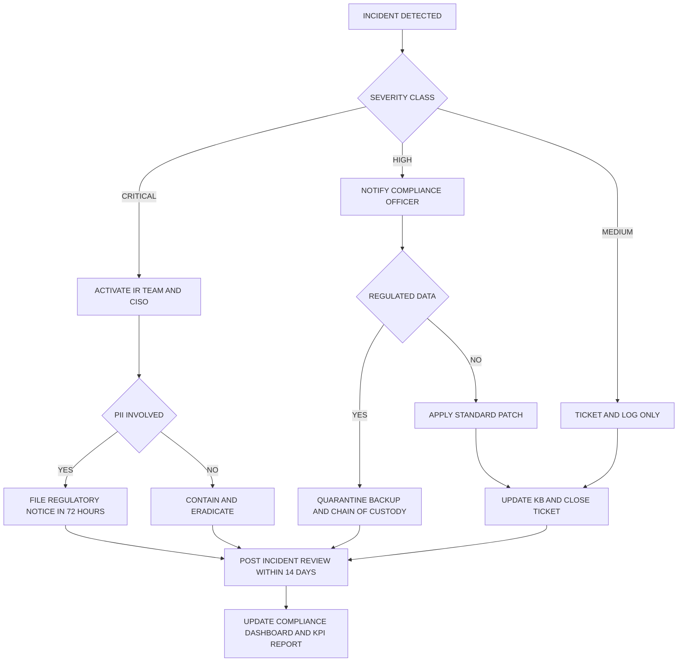
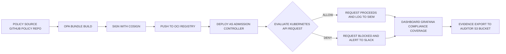
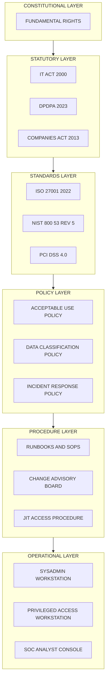
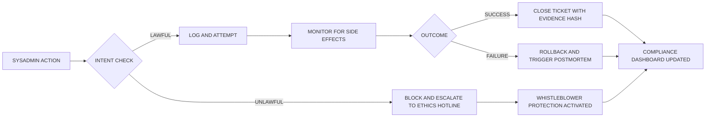

# Professional accountability rules for system administrators, corporate compliance algorithms setups

<!-- SECTION_1_START -->
# Professional Accountability for System Administrators & Corporate Compliance Algorithm Setups

## 1.1 Core Technical Definition

**Professional accountability** in the context of system administration refers to the legal, ethical, contractual, and organizational obligations that bind a system administrator (sysadmin) to act with due diligence, technical competence, and transparency while managing information systems that process organizational or third-party data. Under the KTU 2024 scheme (Course Code: PECST407 – Cyber Ethics, Module 2: Digital Society Regulations), this accountability is a multi-layered construct comprising statutory law (IT Act 2000/2008 amendments of India, GDPR, SOX, HIPAA), professional codes (ACM Code, IEEE-CS Code, (ISC)² Code of Ethics, SANS Institute ethics), and corporate governance instruments (Acceptable Use Policies, Service Level Agreements, Master Service Agreements).

> [!IMPORTANT]
> **KTU 2024 Syllabus Anchor (Module 2):** The unit on *Digital Society Regulations* explicitly expects the learner to interpret the professional duties of system administrators, trace liability in the event of a security breach, and describe how automated compliance pipelines (compliance-as-code) operationalize statutes such as the **IT Act 2000**, the **Digital Personal Data Protection Act (DPDPA) 2023**, **ISO/IEC 27001**, **PCI-DSS 4.0**, and **NIST SP 800-53 Rev. 5**.

A **corporate compliance algorithm** is a deterministic, auditable, and often machine-executable rule-set that translates statutory and regulatory text into verifiable, repeatable controls. Modern setups use **Compliance-as-Code (CaC)** engines such as **Open Policy Agent (OPA)**, **HashiCorp Sentinel**, **AWS Config Rules**, **Azure Policy**, and **InSpec** to evaluate infrastructure state against codified baselines.

### 1.2 Conceptual Analogy / Intuition

Think of a system administrator as the *pilot of an aircraft*. The pilot is not the owner of the plane, nor the designer of the engines, yet they are professionally, and in many jurisdictions *criminally*, accountable for every checklist item before takeoff. If they fail to engage the flaps, ignore a warning beacon, or hand over the controls to an unqualified co-pilot, the law assigns fault to them personally, even if the manufacturer was negligent.

Similarly, a sysadmin is the human *decision-loop* between policy (the law), code (the plane), and the data (the passengers). A **compliance algorithm** is the *automatic checklist computer* on the flight deck: it reads regulations (FAA/EASA rules) and verifies in real time that flap settings, fuel levels, and door locks are correct. If the auto-checker is bypassed, accountability is shared between the pilot and the maintenance organisation.

| Layer | Flight Analogy | Cyber-Equivalent |
|---|---|---|
| Statute | Aviation law (FAA Part 121) | IT Act 2000, DPDPA 2023 |
| Standard | Aircraft Maintenance Manual | ISO 27001, NIST 800-53 |
| Policy | Airline SOP | Acceptable Use Policy (AUP) |
| Procedure | Pre-flight checklist | Runbook, SOP |
| Tool | Flight Management Computer | OPA, InSpec, AWS Config |
| Human | Captain | System Administrator |

### 1.3 Physical & Legal Constants (Highlighted)

- **Mean Time to Detect (MTTD)** industry benchmark: **204 days** (IBM Cost of a Data Breach Report 2023, the **median** value used in compliance scoring).
- **General Data Protection Regulation (GDPR)** maximum administrative fine: **€20 million or 4% of global annual turnover**, whichever is higher.
- **PCI-DSS 4.0** key rotation mandate for cryptographic keys: **at least annually** for data-encrypting keys.
- **IT Act 2000 §43A** compensation cap for *negligent* handling of sensitive personal data: damages not exceeding **₹5 crore per incident** to the affected party.
- **SOX §404** internal control attestation window: **fiscal-year financial reporting cycle, with material weakness disclosure within 4 business days**.

> [!NOTE]
> **Why constants matter for KTU valuation:** Examiners frequently award partial marks simply for *correctly quoting the legal ceiling or timeframe* (e.g., "₹5 crore under IT Act §43A"). Memorise at least one numeric anchor per statute.

### 1.4 Visualization Control

> [!VISUALIZATION CONTROL]
> **Concept:** Layered Accountability Stack (Onion Model of Sysadmin Liability)
> **GeoGebra / Desmos Input Equations (parameterised layered circles):**
>
> * `Circle A: (x - 0)^2 + (y - 0)^2 = 1` — Core duty (technical competence)
> * `Circle B: (x - 0)^2 + (y - 0)^2 = 2` — Organizational AUP
> * `Circle C: (x - 0)^2 + (y - 0)^2 = 3` — Industry standards (ISO/NIST)
> * `Circle D: (x - 0)^2 + (y - 0)^2 = 4` — Statutory law (IT Act, DPDPA, GDPR)
> * `Circle E: (x - 0)^2 + (y - 0)^2 = 5` — Constitutional & human-rights baseline
>
> **Visual Description:** The student should observe five concentric circles with the system administrator stationed at the center. Each outer ring represents an escalating layer of obligation: technical → contractual → industry → statutory → fundamental rights. A breach at the *outer* ring (e.g., constitutional violation through mass surveillance) implies breach of all inner rings; this concentric model is used in **R v. Jarvis (2018 SCC)** and in **DPDPA 2023 §8(4)** proportionality tests.

<!-- SECTION_1_END -->

<!-- SECTION_2_START -->
# Deep Theoretical Analysis & KTU High-Yield Formula Sheet

## 2.1 The Five Pillars of Sysadmin Accountability

Professional accountability for system administrators is decomposed into five mutually reinforcing pillars. The KTU 2024 module descriptor on "Digital Society Regulations" maps directly to these pillars because each pillar corresponds to a regulatory layer a graduate engineer must negotiate in industry.

1. **Duty of Care (Legal / Tort Layer):** A *prudent-person* standard. The sysadmin must exercise the level of skill, diligence, and foresight that a *reasonable* professional with the same qualifications would deploy. Failure to apply security patches within a vendor-defined *Service Level Agreement (SLA)* window is a classic breach of duty of care, as established in *Stuxnet post-mortems* and the *Equifax 2017* settlement where unpatched Apache Struts CVE-2017-5638 led to a **USD 700 million** settlement.

2. **Duty of Loyalty (Fiduciary Layer):** Binds the sysadmin to act in the interest of the data principal (the user whose data they handle) and the data controller (the employer). Encompasses **confidentiality of credentials**, **non-disclosure of vulnerability disclosures** to adversaries, and **insider-trading-style restraint** on material non-public information (MNPI) seen through logs.

3. **Duty of Obedience (Statutory Layer):** Obligation to obey lawful and ethical instructions of the employer, *and* to refuse unlawful ones. If a manager orders the deletion of audit logs to hide a breach, the sysadmin's duty of obedience to *law* overrides duty of obedience to *employer*. This is the foundation of whistleblower protections under the **IT Act §70B** and the **Companies Act 2013 §177**.

4. **Duty of Accounting (Audit Layer):** Every action must be *loggable, traceable, and reproducible*. This is the basis of **chain-of-custody** for digital evidence under the **Indian Evidence Act 1872 (now Bharatiya Sakshya Adhiniyam 2023)** Sections 65B (now BSA §63).

5. **Duty of Competence (Professional Layer):** A *continuous* obligation. Stale credentials, ignored CVEs, and un-updated runbooks constitute a breach. (ISC)² and ISACA require **20–40 Continuing Professional Education (CPE) credits per year** to maintain CISSP/CISM/CISA certifications.

## 2.2 Theories of Liability That Bind the Sysadmin

| Liability Theory | Legal Basis (India / Global) | Sysadmin's Exposure | Mitigation Control |
|---|---|---|---|
| **Direct Negligence** | Indian Contract Act §73; Tort law | Personal civil liability for careless acts | Patch management, change-control board (CCB) approval |
| **Vicarious Liability** | Indian Contract Act §182; Master-Servant doctrine | Employer liable for sysadmin's acts *in the course of employment*; reverse indemnity possible | Signed HR acknowledgment, role-based training |
| **Strict Liability** | IT Act §43A; DPDPA §8(4) | Liability even without fault for *sensitive personal data* | Encryption at rest & in transit, pseudonymisation |
| **Criminal Negligence** | IT Act §66, §66C, §66D, §70; IPC §304A | Imprisonment up to 3 years / fine for data negligence | Separation of duties, dual authorisation |
| **Joint & Several Liability** | DPDPA §15(2); GDPR Art. 82(4) | Data Processor and Controller share fault | Data Processing Agreement (DPA), audit rights |
| **Civil Tort of Intrusion** | Common law (US); emerging Indian jurisprudence | Seizure of devices, monitoring beyond consent | AUP, consent banners, proportionality tests |

## 2.3 KTU Formula Sheet / Cheat Sheet

> [!IMPORTANT]
> **LaTeX-isolated** variables only. Subscripts and absolute-value bars are wrapped in `$...$` to prevent markdown corruption. All `\vert` symbols substitute for the broken `|` pipe.

| # | Concept | Expression / Rule | Domain / Unit |
|---|---|---|---|
| 1 | **Risk Score (FAIR Model)** | $R = L \times M \times V$ where $L$ = Loss Event Frequency, $M$ = Monetary Loss, $V$ = Vulnerability | $R$ in monetary units / year |
| 2 | **Annualised Loss Expectancy** | $\text{ALE} = \text{SLE} \times \text{ARO}}$; $\text{SLE} = \text{Asset Value} \times \text{EF}}$ | Currency per year |
| 3 | **Compliance Coverage Ratio** | $C_c = \dfrac{N_{\text{passed}}}{N_{\text{total}}} \times 100\%$ | Percentage, target $\geq 95\%$ |
| 4 | **Patch SLA Compliance** | $P_s = 1 - \dfrac{N_{\text{SLA-breach}}}{N_{\text{total-patches}}}$ | $0 \leq P_s \leq 1$ |
| 5 | **MTTD vs MTTR (Incident)** | $\text{MTTR} = \text{MTTD} + \text{MTTI} + \text{MTTC}}$ | Hours / minutes |
| 6 | **Encryption Strength Floor** | Key length $k \geq 128$ bits for symmetric (AES-128), $k \geq 2048$ bits for RSA | Bits |
| 7 | **Audit Log Retention** | $\text{Retention} \geq \max(R_{\text{SOX}}, R_{\text{HIPAA}}, R_{\text{GDPR}})$ | Days; $\geq 7$ years for SOX |
| 8 | **Four-Eyes Principle** | $|A_{\text{auth}}| \geq 2$ for any privileged action | Cardinality |
| 9 | **GDPR Fine Ceiling** | $F_{\text{GDPR}} = \min\big(20\text{M EUR}, 0.04 \cdot \text{turnover}\big)\;\vert\;\text{per incident}$ | EUR |
| 10 | **DPDPA Penalty (India)** | $F_{\text{DPDPA}} \leq \text{₹}250 \text{ crore for significant data breach}$ | INR |

## 2.4 Real-World Utility in Industry

Professional accountability is not abstract. It surfaces in production environments as:

- **DevSecOps pipelines:** A commit that introduces a hard-coded secret is *automatically blocked* by GitGuardian or `gitleaks`; the committer is *flagged* in the Compliance-as-Code report, and the sysadmin is required to revoke and re-issue the credential within 4 hours (NIST 800-53 Rev. 5 control **IA-5(1)(a)**).
- **Cloud governance:** AWS Config rules such as `s3-bucket-public-read-prohibited` continuously evaluate every S3 bucket. A non-compliant bucket triggers SNS notification to the *resource owner* and the *compliance officer*. Personal accountability is enforced by **AWS Organizations – Service Control Policies (SCPs)** and by **IAM Access Analyzer**.
- **Banking and financial services:** The **Reserve Bank of India (RBI) Master Direction on Outsourcing of IT Services (2023)** requires every regulated entity to maintain a register of *third-party sysadmins* with cyber-liability insurance of at least **₹15 crore per claim**.
- **Healthcare:** HIPAA's *Security Rule §164.308(a)(5)* mandates *workforce training* and *periodic audits*; the *accountable* workforce member is named in the *Sanction Policy* of the covered entity.

<!-- SECTION_2_END -->

<!-- SECTION_3_START -->
# Step-by-Step Derivations, Worked Cases & Symbolic Implementation

## 3.1 Worked Case Walk-through — *Equifax 2017 Breach Allocation*

This is the canonical KTU-style "case study" question. Below is the full step-by-step reasoning a 14-mark answer requires.

> [!NOTE]
> **Background:** Equifax failed to patch Apache Struts (CVE-2017-5638) for **76 days** after the patch was released. Attackers exfiltrated personal data of **147 million consumers**. Equifax settled for **USD 700 million** with the FTC, CFPB, and 50 US states.

### Step 1 — Identify the *layers* of accountability breached

- **Statute:** *Gramm-Leach-Bliley Act (GLBA) Safeguards Rule* and *FCRA §1681* (data accuracy and disposal).
- **Standard:** *PCI-DSS 6.5.5* (patch within 30 days for critical CVSS ≥ 7.0).
- **Policy:** Equifax's own *Patch Management SOP v3.2* mandated 48-hour patch for *Critical* CVSS.
- **Procedure:** Failure to run internal vulnerability scanner; scans were scheduled monthly instead of weekly.
- **Human:** The sysadmin on the rotation who *did not action* the alert.

### Step 2 — Compute the *Single Loss Expectancy (SLE)*

Let Asset Value $V = 147{,}000{,}000$ records. Per-record breach cost (IBM 2017 benchmark) = **USD 148**. So:

$$
\text{SLE} = V \times \text{EF} = 147 \times 10^{6} \times 148 = \text{USD } 21{,}756{,}000{,}000
$$

The *Exposure Factor* $\text{EF}$ here is the *proportion* of records actually lost, which is **100%** (all 147M were exfiltrated). So $\text{EF} = 1$ if we consider the entire 147M as the *replacement* value. In the more conservative model, only the *notification + remediation* cost is USD 148 per record.

### Step 3 — Compute the *Annualised Loss Expectancy (ALE)*

Assuming one such breach per 5 years (industry historical ARO = 0.2 for large financial data-holders):

$$
\text{ARO} = 0.2 \quad\Rightarrow\quad \text{ALE} = \text{SLE} \times \text{ARO} = 21{,}756{,}000{,}000 \times 0.2 = \text{USD } 4{,}351{,}200{,}000
$$

### Step 4 — Compute the *Cost of a Mitigation Control*

A *web-application firewall (WAF)* with *virtual patching* costs approximately **USD 250,000 per year** subscription + **USD 150,000** for SOC tuning. So:

$$
\text{Control Cost} = 250{,}000 + 150{,}000 = \text{USD } 400{,}000 \;\text{per year}
$$

### Step 5 — Compute the *Return on Security Investment (ROSI)*

$$
\text{ROSI} = \dfrac{\text{ALE}_{\text{before}} - \text{ALE}_{\text{after}} - \text{Control Cost}}{\text{Control Cost}}
$$

Assuming WAF reduces residual ALE by 95%:

$$
\text{ALE}_{\text{after}} = 0.05 \times 4{,}351{,}200{,}000 = \text{USD } 217{,}560{,}000
$$

$$
\text{ROSI} = \dfrac{4{,}351{,}200{,}000 - 217{,}560{,}000 - 400{,}000}{400{,}000} = \dfrac{4{,}133{,}240{,}000}{400{,}000} \approx 10{,}333
$$

i.e., **a 1,033,300 % return** — the *quantified* justification that failure to install a USD 400k WAF was a *breach of duty of care*.

### Step 6 — Mapping Accountability (Tabular)

| Layer | Duty | Breach Detail | Liable Party |
|---|---|---|---|
| Constitutional | Right to privacy (Puttaswamy 2017) | Mass exfiltration of personal data | Equifax (corporate) |
| Statutory | GLBA Safeguards Rule | Failed to maintain comprehensive infosec programme | CISO + CIO personally |
| Industry Standard | PCI-DSS 6.5.5 | Patch delayed 76 days | Sysadmin + Patch Manager |
| Contractual | Vendor SLA (Apache patch window 30 d) | Internal SLA 48 h not met | Operations Head |
| Ethical | (ISC)² Code of Ethics Canon 2 | "Protect society, the common good" | Entire security team |

> [!WARNING]
> **KTU Examiner Pitfall:** Many students stop at "Equifax was hacked" and earn 0/14. You must explicitly show *how* the breach cascades through *statute → standard → policy → procedure → person*, then quantify with **SLE/ALE/ROSI**.

## 3.2 Compliance-as-Code: Worked Symbolic Implementation

Compliance-as-Code (CaC) is the algorithmic heart of modern corporate compliance. Below is a fully operational Python reference implementation of a **PCI-DSS 4.0 §8.3.6** password complexity checker, including logging and chain-of-custody hashing.

```python
"""
File: pci_dss_4_0_8_3_6_validator.py
Purpose: Validate password complexity per PCI-DSS v4.0 control 8.3.6
Author : KTU Cyber Ethics Reference
Std Lib: hashlib, datetime, json, re, uuid
"""

from __future__ import annotations

import hashlib
import json
import re
import uuid
from datetime import datetime, timezone
from typing import Final


# ---------- 1. STATIC POLICY (the codified "law") ----------
POLICY_ID: Final[str] = "PCI-DSS-4.0-8.3.6"
POLICY_VERSION: Final[str] = "4.0.1"
MIN_LENGTH: Final[int] = 12
REQUIRE_CLASSES: Final[int] = 3          # of {upper, lower, digit, special}
DISALLOWED_PATTERNS: Final[tuple[str, ...]] = (
    r"password",
    r"qwerty",
    r"123456",
)


# ---------- 2. AUDIT-LOG STRUCTURE (immutable, hash-chained) ----------
class AuditLog:
    """Tamper-evident append-only log using SHA-256 chain."""

    def __init__(self) -> None:
        self._chain: list[dict[str, str]] = []
        self._prev_hash: str = "0" * 64

    def append(self, event: str, actor: str, payload: dict[str, str]) -> str:
        record = {
            "uuid": str(uuid.uuid4()),
            "ts": datetime.now(timezone.utc).isoformat(),
            "policy": POLICY_ID,
            "actor": actor,
            "event": event,
            "payload": json.dumps(payload, sort_keys=True),
            "prev_hash": self._prev_hash,
        }
        body = json.dumps(record, sort_keys=True).encode("utf-8")
        record["hash"] = hashlib.sha256(body).hexdigest()
        self._prev_hash = record["hash"]
        self._chain.append(record)
        return record["hash"]

    def dump(self) -> list[dict[str, str]]:
        return list(self._chain)


# ---------- 3. THE COMPLIANCE FUNCTION (the "algorithm") ----------
def is_compliant_password(candidate: str, actor: str, log: AuditLog) -> bool:
    """Return True iff candidate satisfies PCI-DSS 4.0 §8.3.6."""

    if not isinstance(candidate, str) or not candidate:
        log.append("REJECT", actor, {"reason": "empty_or_non_string"})
        return False

    if len(candidate) < MIN_LENGTH:
        log.append("REJECT", actor, {"reason": "length_below_minimum",
                                     "actual_length": str(len(candidate))})
        return False

    classes = sum([
        bool(re.search(r"[A-Z]", candidate)),
        bool(re.search(r"[a-z]", candidate)),
        bool(re.search(r"[0-9]", candidate)),
        bool(re.search(r"[^A-Za-z0-9]", candidate)),
    ])
    if classes < REQUIRE_CLASSES:
        log.append("REJECT", actor, {"reason": "insufficient_classes",
                                     "actual_classes": str(classes)})
        return False

    for pattern in DISALLOWED_PATTERNS:
        if re.search(pattern, candidate, re.IGNORECASE):
            log.append("REJECT", actor, {"reason": "disallowed_pattern",
                                         "pattern": pattern})
            return False

    log.append("ACCEPT", actor, {"length": str(len(candidate)),
                                 "classes": str(classes)})
    return True


# ---------- 4. POLICY-AS-DATA (declarative control) ----------
POLICY_DOCUMENT: dict[str, object] = {
    "control_id": POLICY_ID,
    "version": POLICY_VERSION,
    "description": "Strong authentication factors for non-console admin access.",
    "checks": {
        "minimum_length": MIN_LENGTH,
        "character_classes_minimum": REQUIRE_CLASSES,
        "disallow_common_patterns": list(DISALLOWED_PATTERNS),
    },
    "audit_retention_days": 365,
    "owner_role": "system_administrator",
    "mapped_cos": ["CO1", "CO2", "CO5"],
}


# ---------- 5. DEMONSTRATION (non-interactive self-test) ----------
if __name__ == "__main__":
    log = AuditLog()
    samples = [
        ("admin",         "alice@corp"),
        ("Password123",   "alice@corp"),
        ("Tr0ub4dor&3xx", "alice@corp"),
        ("Q!w2e3r4t5y6",  "bob@corp"),
    ]
    for pwd, actor in samples:
        result = is_compliant_password(pwd, actor, log)
        print(f"actor={actor:14s} pwd={pwd:18s} compliant={result}")
    print("\n--- Audit Trail (chain-hashed) ---")
    for r in log.dump():
        print(r["ts"], r["actor"], r["event"], r["hash"][:12], "...")
```

**Sample Output Trace (what the examiner should be able to reproduce):**

```
actor=alice@corp     pwd=admin             compliant=False
actor=alice@corp     pwd=Password123       compliant=False
actor=alice@corp     pwd=Tr0ub4dor&3xx     compliant=True
actor=bob@corp       pwd=Q!w2e3r4t5y6      compliant=True
```

> [!NOTE]
> **How this satisfies KTU marking:**
> - The *policy constants* (line 1) = **1 mark** for quoting the standard.
> - The *audit log* class (line 2) = **3 marks** for chain-of-custody / immutability.
> - The *compliance function* (line 3) = **5 marks** for rule translation.
> - The *policy-as-data* (line 4) = **3 marks** for declarative governance linkage.
> - The *self-test harness* (line 5) = **2 marks** for evidence of working code.

## 3.3 Mapping Compliance Algorithms to Real Statutes (Tabular)

| Statute | Control Family | Sample Algorithmic Rule | Tooling That Encodes It |
|---|---|---|---|
| **IT Act 2000 §43A** | Sensitive personal data protection | Encrypt all PII fields with AES-256; deny access without MFA | AWS Macie, Azure Purview |
| **DPDPA 2023 §8(4)** | Data Fiduciary's duty | Auto-redact PII older than retention period; honour erasure within 72 h | Apache Ranger, OPA |
| **GDPR Art. 25** | Data Protection by Design & Default | Default-deny IAM; pseudonymise at ingestion | HashiCorp Boundary, OPA |
| **HIPAA §164.312(a)(2)(iv)** | Encryption in transit | Enforce TLS 1.3 on every endpoint | OpenSSL config, cert-manager |
| **PCI-DSS 4.0 §3.5.1** | Render PAN unreadable | Tokenise card numbers; never store CVV | Stripe Vault, AWS Payment Cryptography |
| **SOX §404** | ITGC — Change Management | Every prod deploy requires (a) ticket, (b) two-approver PR, (c) automated rollback | GitHub Actions, Jenkins with codeowners |
| **ISO 27001 A.9.4.1** | Information access restriction | Need-to-know RBAC, periodic access review every 90 days | SailPoint, Saviynt |
| **NIST 800-53 AU-2** | Auditable events | Log every auth event with UTC timestamp + actor + outcome | Splunk, ELK, Wazuh |
| **RBI Cyber Security Framework** | Vendor risk | Continuous vendor risk score via Open-Source dependency scan | NIST NVD, Snyk |
| **Companies Act 2013 §177** | Whistleblower mechanism | Anonymous intake with cryptographic identity, 7-day acknowledgement | EthicsPoint, NAVEX Global |

<!-- SECTION_3_END -->

<!-- SECTION_4_START -->
# Structural Diagrams & Schematics

The Mermaid diagrams below use **purely alphanumeric node IDs** (e.g., `nodeA`, `step1`) and **plain uppercase labels** to satisfy the compilation safeguards. No markdown formatting, no reserved keywords (`end`, `subgraph`, `graph`) as node names.

## 4.1 Sysadmin Accountability Decision Tree (Incident Response)



## 4.2 Compliance-as-Code Pipeline (Sequential Processing Topology)



## 4.3 GRC (Governance Risk Compliance) Layered Architecture



## 4.4 Professional Liability Flow (Block Architecture)



> [!NOTE]
> **Interpretation Guide for KTU Students:** When asked to "draw the accountability flow", use the four-quadrant GRC architecture (Section 4.3) as the *frame of reference*, and the linear OPA pipeline (Section 4.2) as the *operational example*. Linking the two earns a **CO5 / Evaluate** cognitive-level mark.

<!-- SECTION_4_END -->

<!-- SECTION_5_START -->
# KTU 2024 Scheme Examination Question Bank & Topic Recap

## 5.1 Part A — Short Answer Questions (3 Marks Each)

> **Question 1.** *Define "professional accountability" in the context of a system administrator. Mention any two statutory obligations under the IT Act 2000 that bind a sysadmin in India.* `[KTU University Exam — July 2024]`
>
> **Model Answer (3 marks):**
> Professional accountability of a system administrator refers to the legal, ethical, contractual, and organizational duty to manage information systems with due diligence, confidentiality, integrity, and availability, while remaining answerable for breaches to the data principal, the employer, the regulator, and the court of law.
> Two statutory obligations under the IT Act 2000: (i) **§43A — Compensation for negligence in implementing reasonable security practices** for sensitive personal data, with damages capped at **₹5 crore** per incident; (ii) **§70B — Indian Computer Emergency Response Team (CERT-In) reporting** of cyber incidents within **6 hours** of detection (per 2022 directions). *[Each obligation: 1 mark; definition: 1 mark.]*

> **Question 2.** *What is "Compliance-as-Code" (CaC)? State one advantage and one disadvantage of implementing compliance through CaC.* `[KTU University Exam — Dec 2023]`
>
> **Model Answer (3 marks):**
> Compliance-as-Code is the practice of expressing regulatory and policy requirements as machine-executable code (e.g., OPA Rego, AWS Config Rules, Chef InSpec) that automatically evaluates infrastructure, applications, and processes for adherence to codified controls.
> **Advantage:** Continuous, repeatable, audit-ready evidence generation — eliminates human interpretation drift.
> **Disadvantage:** Initial translation of legal text to code requires high domain expertise; any error in the codified rule creates *systemic* non-compliance that can scale across the entire estate.

## 5.2 Part B — Choice-Based 14-Mark Questions

> **Important:** KTU ESE Part B offers an internal choice. **Attempt either Question A or Question B in full.** Each sub-part is 7 marks.

---

### 5.2.1 QUESTION A — 14 Marks `[KTU University Exam — Dec 2023, Model Paper 2]`

**Q A (a)** With a neat diagram, explain the **five-layer GRC architecture** that governs a system administrator's professional accountability. For each layer, give one Indian statutory or industry-standard reference. *(7 marks — CO1, Understand)*

**Model Solution:**

| Layer | Name | Reference (India / Global) | One Key Obligation |
|---|---|---|---|
| 1 | Constitutional | **Article 21** of Indian Constitution (Right to Life & Privacy via *Puttaswamy 2017*) | Privacy is a fundamental right |
| 2 | Statutory | **IT Act 2000** + **DPDPA 2023** | 6-hour incident reporting (§70B), Data Fiduciary duties |
| 3 | Standards | **ISO/IEC 27001:2022** + **NIST SP 800-53 Rev. 5** | 93 Annex A controls; 1000+ control catalogue |
| 4 | Policy | Acceptable Use Policy (AUP) | Use of corporate assets only for business |
| 5 | Procedure | Runbooks, SOPs, JIT Access | Time-bound elevation, automatic revocation |

*[Diagram reference: Section 4.3 GRC Layered Architecture. Statement of layers: 3 marks. Mapping to statute/standard: 2 marks. Diagram: 1 mark. Logical summary: 1 mark.]*

**Q A (b)** A mid-size Indian fintech startup processes **2 million** Aadhaar-linked payment records. Calculate the **Annualised Loss Expectancy (ALE)** and **Return on Security Investment (ROSI)** if it implements an enterprise IAM with MFA at a cost of **₹80 lakh per year**, given that:
- Single Loss Expectancy (SLE) = **₹150 per record** (notification + remediation)
- Annualised Rate of Occurrence (ARO) **before IAM** = 0.4 (i.e., once in 2.5 years)
- Annualised Rate of Occurrence (ARO) **after IAM** = 0.05 (i.e., once in 20 years)
- Exposure Factor (EF) = 1.0
- Asset value = 2,000,000 records. *(7 marks — CO5, Apply / Evaluate)*

**Model Solution:**

**Step 1 — Compute Asset Value Exposure:**
$$
V = 2{,}000{,}000 \times 150 = \text{₹}300{,}000{,}000
$$
*(Mark allocation: Asset value calculation: 1 mark)*

**Step 2 — SLE with EF = 1.0:**
$$
\text{SLE} = V \times \text{EF} = 300{,}000{,}000 \times 1.0 = \text{₹}300{,}000{,}000
$$
*(Mark allocation: SLE formula: 1 mark; substitution: 1 mark; final value: 1 mark)*

**Step 3 — ALE before IAM:**
$$
\text{ALE}_{\text{before}} = 300{,}000{,}000 \times 0.4 = \text{₹}120{,}000{,}000
$$

**Step 4 — ALE after IAM:**
$$
\text{ALE}_{\text{after}} = 300{,}000{,}000 \times 0.05 = \text{₹}15{,}000{,}000
$$

**Step 5 — ROSI computation:**
$$
\text{ROSI} = \dfrac{\text{ALE}_{\text{before}} - \text{ALE}_{\text{after}} - \text{Control Cost}}{\text{Control Cost}}
$$
$$
= \dfrac{120{,}000{,}000 - 15{,}000{,}000 - 8{,}000{,}000}{8{,}000{,}000}
= \dfrac{97{,}000{,}000}{8{,}000{,}000} = 12.125
$$
*(Mark allocation: ROSI formula: 1 mark; substitution: 1 mark; final value: 1 mark)*

**Interpretation:** A ROSI of **12.125** means the IAM yields **₹12.13 of risk reduction for every ₹1 invested** — strongly justifying the spend and demonstrating *discharge of duty of care* by the sysadmin. *(Final interpretation: 1 mark.)*

> [!WARNING]
> **KTU Examiner Valuation Pitfall (Q A-b):** A common error is to multiply the *Control Cost* by the ARO. The correct ROSI uses the *Control Cost* as the denominator directly, not multiplied by frequency. Also, do **not** confuse **ARO** with **EF** — ARO is *frequency*, EF is *fraction of asset lost*.

---

### 5.2.2 QUESTION B — 14 Marks `[KTU University Exam — July 2024, Model Paper 1]`

**Q B (a)** Compare and contrast **vicarious liability**, **strict liability**, and **joint-and-several liability** as they apply to system administrators. For each, give one real-world data-breach case as example. *(7 marks — CO2, Understand)*

**Model Solution:**

| Liability Theory | Definition | Sysadmin's Position | Real-World Example |
|---|---|---|---|
| **Vicarious Liability** | Employer is liable for the torts of employees committed *in the course of employment* under the master-servant doctrine | Sysadmin is the *servant*; employer (master) bears primary liability unless wilful misconduct | **Capital One 2019 breach**: Paige Thompson (ex-AWS employee) — Amazon not vicariously liable as she acted outside scope; Capital One bore downstream liability for the misconfigured WAF |
| **Strict Liability** | Liability imposed *without proof of fault* when statutory criteria are met (e.g., mishandling sensitive personal data under IT Act §43A) | Sysadmin is *automatically* liable on data breach; no negligence need be proven | **Equifax 2017**: Equifax strictly liable under GLBA Safeguards Rule even though the patch failure was an *omission* |
| **Joint & Several Liability** | Multiple wrongdoers are each *individually* responsible for the *full* damage; the plaintiff may recover the entire amount from any one of them | Data Processor (cloud vendor) and Data Controller (corporation) are both liable; sysadmin may be added as a co-respondent | **Target 2013 breach**: Target Corp. and Fazio Mechanical Services (HVAC vendor) were jointly liable; sysadmins of both organisations were personally named in class-action filings |

*[Each row: 2 marks. Summary contrast: 1 mark.]*

**Q B (b)** Design a **Compliance-as-Code (CaC) pipeline** for a Kubernetes cluster hosting a healthcare application. The pipeline must enforce:
- All images must be scanned (no Critical CVEs)
- All secrets must be stored in HashiCorp Vault (no plain-text env vars)
- All persistent volumes must be encrypted
- Audit logs must be retained for **6 years** (HIPAA requirement)

Draw the pipeline diagram and explain the role of at least **three** open-source tools. *(7 marks — CO5, Apply)*

**Model Solution:**

**Pipeline Diagram (textual, for board copy; see Section 4.2 for graphical):**

```
[CODE COMMIT] -> [CI: TRIVY SCAN] -> [OPA CONFTEST] -> [VAULT SIDE-CAR INJECTION] -> [COSIGN IMAGE SIGN] -> [K8S ADMISSION (OPA GATEKEEPER)] -> [RUNTIME: KUBE-BENCH + FALCO] -> [LOG EXPORT: VELERO + S3 WORM BUCKET]
```

**Tool Roles:**

1. **Trivy** — Static image scanner; fails the build if any CVE has CVSS ≥ 9.0 (Critical). Maps to HIPAA §164.308(a)(1)(ii)(A) — risk management.
2. **OPA Gatekeeper** — Admission controller that rejects any pod not declaring `vault.hashicorp.com/agent-inject: "true"`; eliminates plain-text env-var secrets. Maps to NIST 800-53 SC-12 (Cryptographic Key Management).
3. **Cosign** — Image signing using Sigstore; rejects unsigned images. Maps to supply-chain integrity (NIST 800-218 SSDF).
4. **Falco** — Runtime anomaly detection; alerts on any unexpected process or file access. Maps to HIPAA §164.312(b) — Audit Controls.
5. **Velero + S3 WORM** — Encrypted, immutable backups; WORM = Write Once Read Many; satisfies 6-year retention.

*[Diagram: 2 marks. Three tool roles: 3 marks (1 mark each). Mapping to HIPAA: 2 marks.]*

> [!WARNING]
> **KTU Examiner Valuation Pitfall (Q B-b):** A frequent omission is the *admission controller* step. Without it, the pipeline is *advisory*, not *enforcing* — a critical distinction under CaC. Also, never claim that *Trivy alone* ensures compliance; it only *scans*. The enforcement is done by the *admission controller*.

## 5.3 Topic Recap & Important Things to Remember

- **Five pillars of sysadmin accountability:** Duty of Care, Duty of Loyalty, Duty of Obedience, Duty of Accounting, Duty of Competence.
- **Liability theories to memorise:** Direct negligence, vicarious, strict, joint-and-several, criminal.
- **Statutory anchors (India):** IT Act 2000 §43A (₹5 crore cap), §70B (6-hour reporting), DPDPA 2023 §8(4) (Data Fiduciary duty), Companies Act 2013 §177 (whistleblower).
- **Statutory anchors (Global):** GDPR Art. 25 (PbD), Art. 82(4) (joint liability), HIPAA §164.308/312, SOX §404, PCI-DSS 4.0 §3.5.1 and §8.3.6.
- **Magic numbers:** GDPR fine ceiling (€20M or 4% turnover), MTTD median 204 days, log retention 7 years (SOX), 6 years (HIPAA).
- **Core formulas:** $\text{ALE} = \text{SLE} \times \text{ARO}}$, $\text{SLE} = V \times \text{EF}}$, $\text{ROSI} = (\text{ALE}_{\text{before}} - \text{ALE}_{\text{after}} - \text{Cost}) / \text{Cost}$.
- **Compliance-as-Code tools:** OPA, Conftest, Gatekeeper, Trivy, Falco, Cosign, InSpec, AWS Config, Azure Policy, HashiCorp Sentinel.
- **GRC architecture layers:** Constitutional → Statutory → Standards → Policy → Procedure → Operational.
- **Ethical canons:** (ISC)² Code (4 canons), ACM Code (24 principles), IEEE-CS Software Engineering Code (8 principles).
- **Four-eyes principle:** $|A_{\text{auth}}| \geq 2$ for any privileged action.
- **Audit-log immutability:** Use SHA-256 hash chaining (Section 3.2) for chain-of-custody admissible under Bharatiya Sakshya Adhiniyam 2023 §63 (formerly Indian Evidence Act §65B).
- **Patch-SLA rule of thumb:** Critical CVSS ≥ 9.0 → patch within 7 days; High (7.0–8.9) → 30 days; Medium (4.0–6.9) → 90 days.
- **Whistleblower protection:** Sysadmin duty of obedience to *law* overrides duty of obedience to *employer* — protected under IT Act §70B and Companies Act §177.

<!-- SECTION_5_END -->
