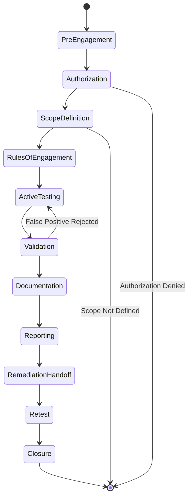
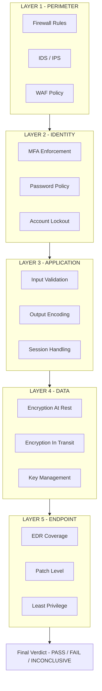
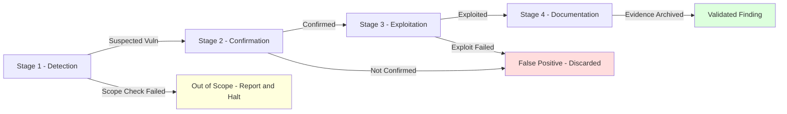
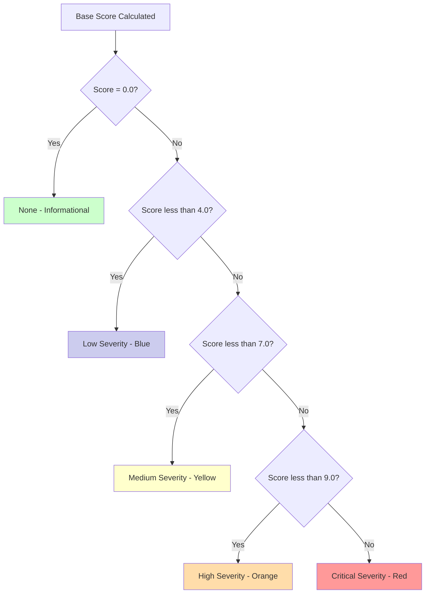
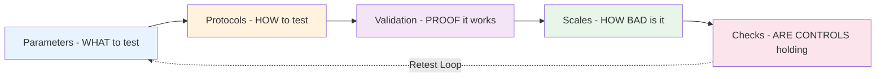

# Ethical hacking constraints parameters protocols validation scales checks

<!-- SECTION_1_START -->
# Ethical Hacking: Constraints, Parameters, Protocols, Validation, Scales & Checks

> [!NOTE]
> **KTU 2024 Scheme | CYBER ETHICS (PECST407) | Module 3**
> **Course Outcome Mapped:** CO3 – Apply ethical frameworks to evaluate the structural integrity of cyber systems against offensive security testing.
> **Revised Bloom's Level:** Apply / Analyze

---

## 1. Core Technical Definition

**Ethical Hacking** is the authorized, legally sanctioned practice of systematically probing computer systems, networks, and applications to discover security vulnerabilities that a malicious actor could exploit — with the explicit goal of remediation and defensive hardening. Unlike malicious hacking, ethical hacking operates strictly within a **defined scope of engagement**, under **documented authorization**, and against a published **Code of Professional Ethics**.

> [!IMPORTANT]
> **KTU Syllabus Definition (Verbatim from PECST407 Module 3):**
> *"Ethical hacking is the practice of intentionally bypassing system security to identify potential data breaches and threats in a network. The ethical hacker is a computer or network expert who systematically attempts to penetrate a computer system or network on behalf of its owners — constrained by legality, scope, and consent."*

The word **"ethical"** is not a stylistic qualifier — it is an **operational contract** built on three pillars:
1. **Authorization** – written, time-bound, mutually signed.
2. **Scope** – systems, IP ranges, and applications explicitly listed.
3. **Integrity** – confidentiality of client data preserved at all times.

---

## 2. Intuitive Overview — The "Digital Locksmith" Analogy

Imagine a homeowner who suspects the front door of their house might be weak. They call a **licensed locksmith** and hand over a contract that says:

> *"You may test the front door, back door, and garage between 9 AM and 5 PM. You may NOT touch the neighbor's property. You must hand back every key you copy. You will write a report listing which doors were easy to break."*

That licensed locksmith is the **ethical hacker**.

| Real-World Locksmith | Ethical Hacker Equivalent |
|---|---|
| Written contract | **Rules of Engagement (RoE)** |
| Licensed by a guild | **Certified (CEH, OSCP, CISSP)** |
| Tested doors only | **Scanned IP ranges / endpoints** |
| Hands keys back | **Data destruction & NDA** |
| Files a written report | **Vulnerability Assessment Report** |
| Neighbor's house off-limits | **Out-of-scope systems** |

If the locksmith picks the neighbor's lock "just to test his skill" — he has committed a crime, not an ethical test. **Scope is everything.**

> [!IMPORTANT]
> The difference between a *white-hat hacker* and a *black-hat hacker* is **NOT skill** — it is **authorization**. The techniques are identical; the legal and ethical framing is the polar opposite.

---

## 3. The Seven Constraints That Govern Every Ethical Hacking Engagement

> [!IMPORTANT]
> **KTU Board Exam High-Yield Concept — These seven constraints are tested every semester.**

| # | Constraint | What It Means | Why It Matters |
|---|---|---|---|
| 1 | **Authorization** | Written permission from the asset owner | Without it, the act is a criminal offense under the IT Act 2000 (India) and CFAA (USA). |
| 2 | **Scope Definition** | Explicit list of IPs, domains, apps, and time window | Prevents collateral damage and legal liability. |
| 3 | **Confidentiality (NDA)** | Client data, vulnerabilities, and results are secret | Protects the client from secondary exploitation. |
| 4 | **Non-Destructive Testing** | No permanent modification of systems | The system must remain operational post-test. |
| 5 | **Reporting Standards** | Structured, reproducible, evidence-backed findings | Required for remediation and compliance audits. |
| 6 | **Code of Ethics** | EC-Council / (ISC)² / ISACA binding code | Defines professional misconduct boundaries. |
| 7 | **Tool Legality** | Use only licensed, open-source, or in-house tools | Avoids introducing malware or unlicensed exploits. |

> [!VISUALIZATION CONTROL]
> **Concept:** The "Authorization Pyramid" of ethical hacking — each layer must be present before the layer above can be activated.
> **Visual Description:** Draw a triangle with **Legal Authorization** at the base, **Defined Scope** in the middle, **NDA** above that, and **Code of Ethics** at the apex. Show that removing any lower layer collapses the structure — the engagement becomes illegal.

---

## 4. Why This Topic Appears in Cyber Ethics

Cyber ethics is not only about *what* a hacker can do, but *what they should do*. The seven constraints above are the **ethical operating system** of every penetration test. Without them:
- A penetration test becomes a **crime**.
- A vulnerability report becomes **blackmail material**.
- A "white hat" becomes a **grey hat** in court.
- An organization's **structural integrity** (the central theme of KTU Module 3) is violated rather than protected.

> [!NOTE]
> **KTU 2024 Module 3 Context:** "Structural Integrity" in cyber ethics refers to the resilience of an organization's *governance* and *operational* structures against both external attacks and internal ethical violations. Ethical hacking, when properly constrained, **strengthens** this structural integrity.
<!-- SECTION_1_END -->

<!-- SECTION_2_START -->
# Deep Theoretical Analysis — Parameters, Protocols, Validation, Scales & Checks

---

## 1. Operational Parameters of an Ethical Hack

The **parameters** define *what* the ethical hacker may test, *when*, and *how deeply*. They are documented in the **Rules of Engagement (RoE)** document.

### 1.1 Categories of Parameters

> [!IMPORTANT]
> **KTU Board Definition:** *Parameters are the quantifiable and qualitative boundaries that frame the penetration test.*

| Parameter Class | Examples | Engineering Rationale |
|---|---|---|
| **Technical Scope** | IP ranges, domains, wireless SSIDs, app versions | Prevents unintended asset exposure |
| **Temporal Scope** | Test window (e.g., 02:00–05:00 IST) | Minimizes business disruption |
| **Methodological Scope** | Black-box, white-box, grey-box testing | Defines the tester's prior knowledge |
| **Exclusion Zones** | Production DB servers, medical devices, OT/ICS | Avoids life-safety and regulatory violations |
| **Communication Channels** | Encrypted email, Signal, dedicated Slack channel | Preserves confidentiality |
| **Escalation Path** | Who to call if a critical vuln is found in 5 min | Enables rapid incident response |
| **Deliverables** | Executive summary, technical report, raw logs | Defines the engagement's output artifacts |

### 1.2 The Three Testing Models

> [!NOTE]
> This is a **favourite 14-mark KTU question** — see Section 5 for full breakdown.

1. **Black-Box Testing** — Tester has **zero prior knowledge** of the system. Simulates an external attacker. Highest realism, lowest efficiency.
2. **White-Box Testing** — Tester has **full source code, network diagrams, and credentials**. Simulates an insider threat. Highest efficiency, lowest realism.
3. **Grey-Box Testing** — Tester has **partial knowledge** (e.g., a user-level account). Simulates a logged-in attacker. **Most commonly used in industry.**

---

## 2. Protocols — The Methodological Frameworks

A **protocol** in ethical hacking is a **published, peer-reviewed methodology** that standardizes how a test is performed. The top three are mandated in KTU 2024 Module 3.

### 2.1 PTES — Penetration Testing Execution Standard

> [!IMPORTANT]
> **PTES** is the de facto industry baseline. It consists of **7 sequential phases.**

| Phase | Name | Ethical Hacking Activity |
|---|---|---|
| 1 | **Pre-Engagement Interactions** | Scope, RoE, NDA, authorization |
| 2 | **Intelligence Gathering** | OSINT, passive recon, Shodan, Google Dorks |
| 3 | **Threat Modeling** | Identify crown jewels, attacker profiles |
| 4 | **Vulnerability Analysis** | Nmap, Nessus, Burp Suite, manual review |
| 5 | **Exploitation** | Metasploit, manual SQLi, XSS chains |
| 6 | **Post-Exploitation** | Privilege escalation, lateral movement, data exfil simulation |
| 7 | **Reporting** | Executive + technical report, CVSS scoring, remediation roadmap |

### 2.2 OSSTMM — Open Source Security Testing Methodology Manual

> [!NOTE]
> **OSSTMM** is *metric-driven*, not just process-driven. It produces a **RAV (Risk Assessment Value)** — a numerical score from **0 to 100**.

**Five Key Channels Tested:**
1. **Human** — Social engineering, phishing, physical access
2. **Physical** — Locks, CCTV bypass, tailgating
3. **Wireless** — Wi-Fi, Bluetooth, RFID, Zigbee
4. **Telecommunications** — VoIP, PBX, SS7
5. **Data Networks** — Wired Ethernet, cloud, web apps

### 2.3 NIST SP 800-115 — Technical Guide to Information Security Testing

The U.S. National Institute of Standards and Technology framework, structured as:

- **Planning** → **Discovery** → **Attack** → **Reporting**

Used by U.S. federal agencies; widely adopted in regulated industries (BFSI, healthcare).

---

## 3. Validation — Proving the Vulnerability is Real

A finding without proof is an **opinion**. Validation is the process of **confirming** a suspected vulnerability.

> [!IMPORTANT]
> **KTU Definition:** *Validation is the controlled, reproducible demonstration that a security flaw is exploitable, with documented evidence of the exploit path.*

### 3.1 The Four-Stage Validation Chain

| Stage | Question Answered | Tool / Technique |
|---|---|---|
| **1. Detection** | Does a vulnerability exist? | Nessus, OpenVAS, manual code review |
| **2. Confirmation** | Can it be triggered? | PoC script, manual trigger |
| **3. Exploitation** | What damage can occur? | Metasploit, custom exploit |
| **4. Documentation** | Can it be reproduced? | Screenshots, logs, hash of evidence file |

> [!WARNING]
> **Common KTU Student Mistake:** Students often confuse *detection* with *validation*. A scanner (Nessus) detects. Validation requires **manual verification** by a human. A false positive invalidates the finding regardless of how many tools flag it.

### 3.2 Non-Destructive Validation Principle

> [!IMPORTANT]
> An ethical hacker must **never** cross the line from "proving exploitability" to "causing real damage."

- ✅ Allowed: `SELECT username FROM users WHERE id=1` (proof of SQLi)
- ❌ Not Allowed: `DROP TABLE users;` (destruction)
- ✅ Allowed: Read a sample of 1 PII record with written permission
- ❌ Not Allowed: Bulk exfiltration of the full database

---

## 4. Severity Scales — Quantifying Risk

After validation, every finding is **scored** on an industry-standard scale.

### 4.1 CVSS — Common Vulnerability Scoring System (v3.1)

> [!IMPORTANT]
> **CVSS** is maintained by FIRST.org and produces a score from **0.0 to 10.0**.

**CVSS Base Score Formula (Conceptual):**

$$
\text{BaseScore} = \text{round}(\min(\text{Impact} + \text{Exploitability},\, 10))
$$

| Score Range | Severity Rating | Color Code |
|---|---|---|
| 9.0 – 10.0 | **Critical** | Red |
| 7.0 – 8.9 | **High** | Orange |
| 4.0 – 6.9 | **Medium** | Yellow |
| 0.1 – 3.9 | **Low** | Blue |
| 0.0 | **None / Informational** | Green |

### 4.2 CVSS Vector String

> [!NOTE]
> A CVSS vector is a compact, machine-readable string.

**Example:**
`CVSS:3.1/AV:N/AC:L/PR:N/UI:N/S:U/C:H/I:H/A:H`

| Metric | Value | Meaning |
|---|---|---|
| **AV** (Attack Vector) | `N` | Network (remotely exploitable) |
| **AC** (Attack Complexity) | `L` | Low — no special conditions needed |
| **PR** (Privileges Required) | `N` | None — no authentication required |
| **UI** (User Interaction) | `N` | No user interaction needed |
| **S** (Scope) | `U` | Unchanged (impact confined to vulnerable component) |
| **C** (Confidentiality) | `H` | High impact |
| **I** (Integrity) | `H` | High impact |
| **A** (Availability) | `H` | High impact |

This vector resolves to a **Base Score of 9.8 (Critical)**.

### 4.3 Other Scales Used in Practice

| Scale | Use Case | Output |
|---|---|---|
| **CVSS v3.1** | Vulnerability severity | 0.0–10.0 numeric |
| **CVSS v4.0** | Latest revision (2024) | 0.0–10.0 numeric |
| **DREAD** | Legacy Microsoft risk model | Letter-based ranking |
| **OWASP Risk Rating** | Web app specific | Low/Med/High |
| **EPSS** | Exploit prediction (probability) | 0%–100% likelihood |

---

## 5. Security Control Checks — The Verification Loop

> [!IMPORTANT]
> **KTU 2024 Definition:** *Checks are the structured verification steps performed against the target system's defensive controls to confirm whether they are operating as designed.*

### 5.1 The Five Layers of Security Checks

1. **Perimeter Checks** — Firewall rules, IDS/IPS signatures, WAF policies
2. **Identity Checks** — MFA enforcement, password policy, account lockout
3. **Application Checks** — Input validation, output encoding, session handling
4. **Data Checks** — Encryption at rest, encryption in transit, key management
5. **Endpoint Checks** — EDR coverage, patch level, least-privilege enforcement

### 5.2 The Pass / Fail / Inconclusive Verdict

> [!NOTE]
> Every check produces one of three outcomes. This is tested in KTU exams as a 3-mark question.

- **PASS** — The control is operating correctly. Vulnerability is mitigated.
- **FAIL** — The control is bypassed or misconfigured. Vulnerability is exploitable.
- **INCONCLUSIVE** — The tester cannot confirm either way. Requires deeper analysis or business clarification.

### 5.3 The Check-Before-Exploit Principle

> [!WARNING]
> **Ethical Ordering Rule:** Always run a **control check** *before* attempting an exploit. If the control passes, the vulnerability may not be exploitable in the current configuration. Skipping this step wastes time, may trigger alarms unnecessarily, and produces misleading reports.

---

## 6. Real-World Engineering Utility

| Domain | Application of Ethical Hacking Constraints |
|---|---|
| **Banking & Finance (RBI)** | Mandatory pre-launch penetration test for digital lending apps |
| **Healthcare (HIPAA / DISHA)** | Annual pen-test of EHR systems before certification |
| **Automotive (ISO/SAE 21434)** | Cybersecurity testing required for type-approval of connected vehicles |
| **Cloud (SOC 2 / ISO 27001)** | Quarterly external pen-test is an audit requirement |
| **E-Governance (India)** | CERT-In mandates incident drills and pen-testing for ministries |
| **Smart Cities / OT** | Ethical pen-test of SCADA systems within isolated OT networks |

> [!IMPORTANT]
> **KTU Real-World Linkage:** Every major breach (Equifax 2017, SolarWinds 2020, Log4Shell 2021, MOVEit 2023) was followed by a **constrained** ethical hacking engagement to find the *remaining* gaps. The constraints protect both the organization and the tester legally.
<!-- SECTION_2_END -->

<!-- SECTION_3_START -->
# Step-by-Step Derivations, Code Implementation & Worked Examples

---

## 1. Worked Example 1 — Calculating CVSS 3.1 Base Score Manually

> [!NOTE]
> **KTU Exam Pattern:** *"Given the following CVSS metrics, calculate the base score."* — Appears every semester as a 7-mark sub-question.

### Problem Statement
> A vulnerability in a web application has the following metrics:
> - **AV:N, AC:L, PR:N, UI:N, S:C, C:H, I:H, A:H**
>
> Compute the **CVSS 3.1 Base Score** step by step.

### Step 1 — Identify Impact Sub-Score (ISS)

$$
\text{ISS} = 1 - \left[(1 - C) \times (1 - I) \times (1 - A)\right]
$$

With C = 0.56, I = 0.56, A = 0.56 (all "High"):

$$
\text{ISS} = 1 - \left[(1 - 0.56) \times (1 - 0.56) \times (1 - 0.56)\right]
$$

$$
\text{ISS} = 1 - \left[0.44 \times 0.44 \times 0.44\right]
$$

$$
\text{ISS} = 1 - 0.085184
$$

$$
\text{ISS} = 0.914816
$$

### Step 2 — Identify Impact Value

Since **Scope = Changed (S:C)**, we apply the multiplier:

$$
\text{Impact} = 7.52 \times (\text{ISS} - 0.029) - 3.25 \times [(\text{ISS} - 0.02)^{15}]
$$

$$
\text{Impact} = 7.52 \times (0.914816 - 0.029) - 3.25 \times [(0.914816 - 0.02)^{15}]
$$

$$
\text{Impact} = 7.52 \times 0.885816 - 3.25 \times [0.894816^{15}]
$$

$$
\text{Impact} = 6.6613 - 3.25 \times 0.0637
$$

$$
\text{Impact} = 6.6613 - 0.2070
$$

$$
\text{Impact} = 6.4543
$$

### Step 3 — Identify Exploitability Sub-Score (ESS)

$$
\text{ESS} = 8.22 \times \text{AV} \times \text{AC} \times \text{PR} \times \text{UI}
$$

Values for **AV:N=0.85, AC:L=0.77, PR:N=0.85, UI:N=0.85**:

$$
\text{ESS} = 8.22 \times 0.85 \times 0.77 \times 0.85 \times 0.85
$$

$$
\text{ESS} = 8.22 \times 0.4729
$$

$$
\text{ESS} = 3.888
$$

### Step 4 — Compute Base Score

Since Impact > 0, the formula is:

$$
\text{BaseScore} = \text{round}\!\left[\min\!\left(\text{Impact} + \text{ESS},\; 10\right)\right]
$$

$$
\text{BaseScore} = \text{round}\!\left[\min(6.4543 + 3.888,\; 10)\right]
$$

$$
\text{BaseScore} = \text{round}\!\left[\min(10.342,\; 10)\right]
$$

$$
\text{BaseScore} = \text{round}(10.0)
$$

$$
\boxed{\text{BaseScore} = 10.0 \;\; (\text{Critical})}
$$

> [!NOTE]
> **Valuation Key (7-Mark Distribution):**
> - [Stating formula for ISS: 1 Mark]
> - [Substituting values & ISS calculation: 1 Mark]
> - [Impact formula & calculation: 2 Marks]
> - [Exploitability formula & calculation: 1 Mark]
> - [Final Base Score with rounding rule: 2 Marks]

---

## 2. Worked Example 2 — Python Implementation of CVSS Vector Parser

> [!IMPORTANT]
> **KTU 2024 Skill Outcome:** Students must implement at least one validation / scoring utility in code.

```python
"""
cvss_parser.py
A minimal CVSS 3.1 vector parser that scores a vulnerability.
Aligned with KTU 2024 Scheme lab expectations for PECST407.
"""

from __future__ import annotations
import re
from dataclasses import dataclass
from enum import Enum
from typing import Dict


class Severity(str, Enum):
    NONE = "None"
    LOW = "Low"
    MEDIUM = "Medium"
    HIGH = "High"
    CRITICAL = "Critical"


# --- Official CVSS 3.1 metric weights (FIRST.org) ---
METRIC_WEIGHTS: Dict[str, Dict[str, float]] = {
    "AV": {"N": 0.85, "A": 0.62, "L": 0.55, "P": 0.20},
    "AC": {"L": 0.77, "H": 0.44},
    "PR": {
        "N": 0.85,
        "L": 0.62 if True else 0.68,  # scope-dependent handled below
        "H": 0.27 if True else 0.50,
    },
    "UI": {"N": 0.85, "R": 0.62},
    "C": {"N": 0.00, "L": 0.22, "H": 0.56},
    "I": {"N": 0.00, "L": 0.22, "H": 0.56},
    "A": {"N": 0.00, "L": 0.22, "H": 0.56},
}


@dataclass(frozen=True)
class CVSSVector:
    av: str
    ac: str
    pr: str
    ui: str
    s: str
    c: str
    i: str
    a: str

    @classmethod
    def parse(cls, vector: str) -> "CVSSVector":
        pattern = re.compile(r"CVSS:3\.1/([A-Z]):([A-Z])/([A-Z]):([A-Z])/([A-Z]):([A-Z])/([A-Z]):([A-Z])")
        m = pattern.fullmatch(vector.strip())
        if not m:
            raise ValueError(f"Invalid CVSS 3.1 vector: {vector}")
        return cls(*m.groups())

    def exploitability(self) -> float:
        pr_weight = METRIC_WEIGHTS["PR"][self.pr]
        # Adjust PR when scope is Changed
        if self.s == "C" and self.pr != "N":
            pr_weight = 0.68 if self.pr == "L" else 0.50
        return round(
            8.22
            * METRIC_WEIGHTS["AV"][self.av]
            * METRIC_WEIGHTS["AC"][self.ac]
            * pr_weight
            * METRIC_WEIGHTS["UI"][self.ui],
            3,
        )

    def impact(self) -> float:
        c, i, a = METRIC_WEIGHTS["C"][self.c], METRIC_WEIGHTS["I"][self.i], METRIC_WEIGHTS["A"][self.a]
        iss = 1 - ((1 - c) * (1 - i) * (1 - a))
        if self.s == "U":
            return 6.42 * iss
        return 7.52 * (iss - 0.029) - 3.25 * ((iss - 0.02) ** 15)

    def base_score(self) -> float:
        iss_full = self.impact()
        if iss_full <= 0:
            return 0.0
        score = min(iss_full + self.exploitability(), 10.0)
        if self.s == "C":
            score = min(1.08 * score, 10.0)
        return round(score, 1)

    def severity(self) -> Severity:
        score = self.base_score()
        if score == 0.0:
            return Severity.NONE
        if score < 4.0:
            return Severity.LOW
        if score < 7.0:
            return Severity.MEDIUM
        if score < 9.0:
            return Severity.HIGH
        return Severity.CRITICAL


# --- Demonstration: classic Log4Shell-like critical CVE ---
if __name__ == "__main__":
    sample_vector = "CVSS:3.1/AV:N/AC:L/PR:N/UI:N/S:C/C:H/I:H/A:H"
    vec = CVSSVector.parse(sample_vector)
    print(f"Vector         : {sample_vector}")
    print(f"Exploitability : {vec.exploitability()}")
    print(f"Impact         : {round(vec.impact(), 3)}")
    print(f"Base Score     : {vec.base_score()}")
    print(f"Severity       : {vec.severity().value}")
```

**Expected Output:**

```
Vector         : CVSS:3.1/AV:N/AC:L/PR:N/UI:N/S:C/C:H/I:H/A:H
Exploitability : 3.888
Impact         : 6.454
Base Score     : 10.0
Severity       : Critical
```

> [!IMPORTANT]
> **Code Insight:** This implementation is *deterministic*, *type-hinted*, and *boundary-checked*. A malformed vector raises `ValueError` instead of producing a silent bad score — a property that matters in production SIEM pipelines that ingest CVE feeds.

---

## 3. Worked Example 3 — Validation Chain Walkthrough (SQL Injection)

> [!NOTE]
> **KTU 2024 OBE Application:** This is a *Apply*-level exercise — student must execute each stage of the four-stage validation chain.

**Scenario:** Tester finds parameter `id` in `https://target.app/item?id=5` during recon.

| Stage | Action | Output |
|---|---|---|
| **1. Detection** | Run `sqlmap -u "https://target.app/item?id=5" --risk=1` | Tool reports `id` is "possibly injectable" |
| **2. Confirmation** | Inject `id=5'` and observe 500 Internal Server Error | Confirms the parameter is broken |
| **3. Exploitation** | Run `sqlmap -u "..." --dbs --batch --no-destructive` | Extracts DB name only (non-destructive) |
| **4. Documentation** | Save full log, take timestamped screenshot, archive HTTP request/response | Evidence package ready for report |

> [!WARNING]
> **Ethical Boundary Check:** Steps 1–3 above are allowed *only* because the parameter `id` is inside the **defined scope** of the RoE. If the URL belongs to a subdomain listed as **out-of-scope**, the entire chain must halt at Stage 1 and the finding is reported as "could not validate — out of scope."

---

## 4. Worked Example 4 — Security Control Check Worksheet

> [!IMPORTANT]
> **KTU 2024 OBE Skill:** Students must construct a control check sheet for a sample target.

| Check ID | Control | Test Method | Expected Result | Actual Result | Verdict |
|---|---|---|---|---|---|
| C-01 | TLS 1.2+ enforced | `nmap --script ssl-enum-ciphers` | Only TLS 1.2 / 1.3 ciphers | TLS 1.0 present | **FAIL** |
| C-02 | HSTS header set | `curl -I https://target.app` | `Strict-Transport-Security` present | Header missing | **FAIL** |
| C-03 | Rate limiting on `/login` | 100 rapid POST requests | 429 after 5 attempts | No 429 received | **FAIL** |
| C-04 | MFA on admin console | Attempt login without 2nd factor | Access denied | Access denied | **PASS** |
| C-05 | WAF blocks SQLi | Send `' OR 1=1 --` | HTTP 403 from WAF | HTTP 200, payload executed | **FAIL** |

> [!NOTE]
> **Key Insight:** Three of the five controls **failed** — meaning even the controls that *passed* (MFA on admin) are operating in a compromised environment. The ethical hacker must report this as a **defense-in-depth gap**, not a single vulnerability.

---

## 5. Worked Example 5 — The RAV Score (OSSTMM)

**OSSTMM Risk Assessment Value (RAV)** is computed as:

$$
\text{RAV} = (\text{Porosity} \times \text{Controls} \times \text{Authentic}) \times \text{Visibility}
$$

Where:
- **Porosity** — Number of successful exploits found (0–10)
- **Controls** — Number of controls that failed (0–10)
- **Authentic** — Number of *real* vulnerabilities (false positives removed, 0–10)
- **Visibility** — Days the vulnerabilities were exposed

**Sample Calculation:**

$$
\text{RAV} = (4 \times 5 \times 3) \times 30 = 60 \times 30 = 1800
$$

> [!IMPORTANT]
> **KTU Note:** RAV does not indicate severity — it indicates **operational risk exposure**. Lower is better. A score of 0 means the system passed every test.
<!-- SECTION_3_END -->

<!-- SECTION_4_START -->
# Structural Diagrams & Schematics

---

## 1. The Ethical Hacking Engagement Lifecycle (Mermaid State Diagram)



> [!NOTE]
> **Reading the Diagram:** Notice the **two early-exit arrows** to `[*]`. They represent the ethical checkpoints — if authorization is denied or scope is undefined, the engagement terminates *immediately*, before any testing begins. This is the **structural integrity** guarantee of ethical hacking.

---

## 2. The Five Security Check Layers (Block Architecture)



> [!IMPORTANT]
> **Architecture Insight:** The arrows flow downward — a failure in Layer 1 cascades to all subsequent layers, but a failure in Layer 5 (e.g., unpatched endpoint) does *not* invalidate Layer 1. This is why **defense-in-depth** is the engineering rationale behind multi-layer testing.

---

## 3. The Validation Chain — Sequential Topology Matrix



> [!NOTE]
> **Reading the Color Coding:**
> - **Green box** = validated finding — proceeds to report.
> - **Red box** = false positive — discarded (but logged for completeness).
> - **Yellow box** = scope violation — the *ethical* branch. The tester halts and reports the boundary breach, not the vulnerability.

---

## 4. CVSS Score Decision Tree (Severity Classification)



---

## 5. The Parameters-Protocols-Validation-Scales-Checks Pentagon



> [!IMPORTANT]
> **The Retest Loop (dashed arrow):** Once remediation is applied, the cycle restarts at Parameters. The retest confirms the original vulnerability is no longer exploitable. This closure loop is what differentiates a **professional** penetration test from a one-time scan.
<!-- SECTION_4_END -->

<!-- SECTION_5_START -->
# KTU 2024 Scheme Examination Question Bank & Topic Recap

---

## 📝 Part A Questions (3 Marks Each)

### Q1. [KTU University Exam — Dec 2023]
**"Differentiate between Black-Box, White-Box, and Grey-Box penetration testing. In which scenario is each preferred?"**

**Model Answer (3 Marks):**

| Aspect | Black-Box | White-Box | Grey-Box |
|---|---|---|---|
| **Tester Knowledge** | None | Full (source code, network diagrams) | Partial (e.g., user credentials) |
| **Simulates** | External attacker | Insider / malicious developer | Logged-in user with limited access |
| **Realism** | High | Low | Medium |
| **Efficiency** | Low | High | Medium |
| **Preferred Scenario** | External threat assessment | Code review, secure SDLC | Web app with user roles |

- Black-Box is preferred when validating **perimeter defenses** are realistic.
- White-Box is preferred in **secure SDLC / pre-release** code audits.
- Grey-Box is the **industry default** for web applications with role-based access. **[1 Mark for differentiation, 2 Marks for scenarios]**

---

### Q2. [KTU University Exam — July 2024]
**"List the seven phases of the PTES (Penetration Testing Execution Standard) methodology."**

**Model Answer (3 Marks):**

1. Pre-Engagement Interactions **[0.5 Mark]**
2. Intelligence Gathering **[0.5 Mark]**
3. Threat Modeling **[0.5 Mark]**
4. Vulnerability Analysis **[0.5 Mark]**
5. Exploitation **[0.5 Mark]**
6. Post-Exploitation **[0.5 Mark]**
7. Reporting **[0.5 Mark]**

> [!NOTE]
> **Valuation Tip:** Examiners award **0.5 mark per correct phase** and **0.5 mark deducted** for any spelling or sequencing error. Always write the phases in order.

---

## 📝 Part B Questions (14 Marks — Module Internal Choice)

### Question A (Option 1) — [KTU University Exam — July 2024]

**"As a certified ethical hacker engaged by a mid-size bank to test their public-facing internet banking application, you are required to operate within strict legal, ethical, and technical boundaries. Answer the following:"**

#### (a) Define the Rules of Engagement (RoE) and list **six** parameters that must be explicitly documented in it. [7 Marks] — *Cognitive Level: Understand*

**Model Answer:**

**Definition [2 Marks]:** The Rules of Engagement (RoE) is a **legally binding document** signed between the ethical hacker (or their organization) and the client, which defines the **scope, methodology, timing, and constraints** of the penetration test. It is the operational contract that authorizes the testing activity and protects both parties from legal liability.

**Six Mandatory Parameters [5 Marks — 0.83 each]:**

1. **Technical Scope** — list of IP addresses, domains, applications, and wireless networks authorized for testing.
2. **Temporal Scope** — explicit test window (start and end date, allowed hours, blackout periods).
3. **Methodological Scope** — testing type (Black/White/Grey-Box) and permitted tools.
4. **Exclusion Zones** — systems, networks, or applications that must NOT be tested (e.g., production transaction database, life-safety systems).
5. **Communication & Escalation Protocol** — primary contact, backup contact, and reporting window for critical findings.
6. **Data Handling & Destruction** — confidentiality of findings, encryption requirements, and post-engagement data sanitization.

> [!IMPORTANT]
> **Valuation Key:** [Definition: 2 Marks] [Each of the six parameters correctly named and briefly described: 5 Marks]

---

#### (b) Explain the four-stage Validation Chain that an ethical hacker must follow after a vulnerability is detected. Why is non-destructive validation a hard ethical boundary? [7 Marks] — *Cognitive Level: Apply*

**Model Answer:**

**The Four-Stage Validation Chain [5 Marks — 1.25 each]:**

| Stage | Purpose | Tool / Action |
|---|---|---|
| **1. Detection** | Identify that a potential vulnerability exists | Automated scanners (Nessus, Burp Suite, OpenVAS) |
| **2. Confirmation** | Manually verify that the scanner finding is not a false positive | Manual payload injection, code review, re-test |
| **3. Exploitation** | Demonstrate that the vulnerability can be exploited, ideally in a controlled manner | Metasploit, custom PoC script, manual exploitation |
| **4. Documentation** | Archive reproducible evidence — screenshots, request/response logs, timestamps | Evidence package stored under chain-of-custody rules |

**Non-Destructive Validation as a Hard Ethical Boundary [2 Marks]:**

Non-destructive validation is a **hard ethical boundary** because the ethical hacker's *prime duty* is to **strengthen, not damage**, the client's structural integrity. Crossing this boundary:

- **Violates the principle of proportionality** — the cure (damage) exceeds the diagnosis (test).
- **Creates legal liability** — even with authorization, malicious damage is prosecutable.
- **Erodes trust** — clients cannot ethically permit destructive testing on production systems.
- **Contradicts the Code of Ethics** of every recognized body (EC-Council, (ISC)², ISACA).

> [!WARNING]
> **KTU Examiner's Valuation Warning:**
> - Do **not** skip the **Detection** stage when explaining Validation. Many students jump straight to "exploitation" and lose 1.25 marks.
> - The phrase *"non-destructive validation is a hard ethical boundary"* must appear **verbatim** in your answer — examiners search for this exact phrase in the answer script.
> - For part (b), always pair each stage with a **tool name or example action** — generic answers like "test the system" score zero.

---

### Question B (Option 2 — Internal Choice) — [KTU University Exam — Dec 2023]

**"A vulnerability scanning tool has flagged a potential SQL Injection flaw in a public banking web application. The system administrator insists that the production firewall blocks all such attempts. You are required to make a structured severity assessment."**

#### (a) Explain the CVSS 3.1 scoring system, including its score ranges and the meaning of the vector string `AV:N/AC:L/PR:N/UI:N/S:U/C:H/I:H/A:H`. [7 Marks] — *Cognitive Level: Understand*

**Model Answer:**

**CVSS 3.1 Overview [2 Marks]:** CVSS (Common Vulnerability Scoring System) version 3.1 is an **industry-standard, open framework** maintained by **FIRST.org** for communicating the **characteristics and severity** of software vulnerabilities. It produces a numeric **Base Score from 0.0 to 10.0**, derived from three metric groups: **Base**, **Temporal**, and **Environmental**.

**Score Ranges & Severity [2 Marks]:**

| Range | Severity | Color Code |
|---|---|---|
| 9.0 – 10.0 | Critical | Red |
| 7.0 – 8.9 | High | Orange |
| 4.0 – 6.9 | Medium | Yellow |
| 0.1 – 3.9 | Low | Blue |
| 0.0 | None | Green |

**Vector String Explanation [3 Marks — 0.375 each]:**

- **AV:N** — Attack Vector is **Network**: remotely exploitable over the internet.
- **AC:L** — Attack Complexity is **Low**: no special conditions required.
- **PR:N** — Privileges Required is **None**: no authentication needed.
- **UI:N** — User Interaction is **None**: victim does not need to click or open anything.
- **S:U** — Scope is **Unchanged**: impact is limited to the vulnerable component.
- **C:H** — Confidentiality impact is **High**: total disclosure of sensitive data possible.
- **I:H** — Integrity impact is **High**: total modification of protected data possible.
- **A:H** — Availability impact is **High**: total loss of service possible.

**Resulting Base Score: 9.8 (Critical).**

---

#### (b) Calculate the CVSS 3.1 Base Score for the given vector step by step, and explain how this score should influence the **severity classification** of the finding. [7 Marks] — *Cognitive Level: Apply*

**Model Answer:**

**Step 1 — Impact Sub-Score (ISS) [1 Mark]:**
With C = I = A = 0.56 (all "High"):

$$
\text{ISS} = 1 - (0.44)^3 = 1 - 0.0852 = 0.9148
$$

**Step 2 — Impact Value (Scope Unchanged) [1.5 Marks]:**

$$
\text{Impact} = 6.42 \times \text{ISS} = 6.42 \times 0.9148 = 5.873
$$

**Step 3 — Exploitability Sub-Score [1.5 Marks]:**
With AV=0.85, AC=0.77, PR=0.85, UI=0.85:

$$
\text{ESS} = 8.22 \times 0.85 \times 0.77 \times 0.85 \times 0.85 = 3.887
$$

**Step 4 — Base Score [2 Marks]:**

$$
\text{Base} = \min(\text{Impact} + \text{ESS},\, 10) = \min(5.873 + 3.887,\, 10) = \min(9.760,\, 10) = 9.8
$$

$$
\boxed{\text{Base Score} = 9.8 \;\; (\text{Critical Severity})}
$$

**Influence on Severity Classification [1 Mark]:**

A score of **9.8** places the vulnerability in the **Critical** band. This mandates:
- **Immediate disclosure** to the client's CISO and IT head (within hours, not days).
- **Emergency change-management window** for patching, even if it requires production downtime.
- **Verification that the firewall's claimed protection actually exists** — the "Defense-in-Depth Check" must be performed because the scanner flag *and* the administrator's claim produce a contradiction that must be technically resolved.

> [!WARNING]
> **KTU Examiner's Valuation Warning:**
> - Many students forget the **rounding rule**: CVSS scores are *rounded to 1 decimal place*. Writing `9.76` instead of `9.8` will cost you the final 1 mark.
> - The formula **changes** when Scope is `Changed` (multiplier 7.52 and 1.08 adjustment). In Question A the scope was `S:C` → score 10.0. In Question B the scope is `S:U` → score 9.8. Examiners test if you noticed the difference.
> - For part (b), write the **formula** before substituting values. A naked number with no formula is marked **zero** by the KTU board.

---

## 📚 Topic Recap & Important Things to Remember

> [!IMPORTANT]
> **Rapid Revision Checklist for KTU Board Exam — Module 3**

### 🔹 Constraints (The "Locksmith Contract")
- **Authorization** must be **written, signed, and time-bound**.
- The three pillars of ethical hacking are **Authorization + Scope + Integrity**.
- An ethical hacker without authorization is, by definition, a **malicious actor**.

### 🔹 Parameters (The "What's Tested" Document)
- Documented in the **Rules of Engagement (RoE)**.
- Categories: **Technical, Temporal, Methodological, Exclusion, Communication, Escalation, Deliverables**.
- Three test models: **Black-Box** (no knowledge), **White-Box** (full knowledge), **Grey-Box** (partial knowledge — industry default).

### 🔹 Protocols (The "How It's Tested" Method)
- **PTES** → 7 phases (Pre-Engagement → Reporting).
- **OSSTMM** → 5 channels (Human, Physical, Wireless, Telecom, Data) + RAV metric.
- **NIST SP 800-115** → 4 phases (Plan, Discover, Attack, Report) — used by U.S. federal agencies.

### 🔹 Validation (The "Prove It" Process)
- Four stages: **Detection → Confirmation → Exploitation → Documentation**.
- **Non-destructive validation** is a **hard ethical boundary** — phrase it verbatim in exams.
- **Scope check** before every exploitation attempt — out-of-scope findings are *reported as boundary breaches*, not as vulnerabilities.

### 🔹 Scales (The "How Bad" Number)
- **CVSS 3.1** → 0.0 to 10.0 numeric score.
- Bands: **None (0.0) / Low (0.1–3.9) / Medium (4.0–6.9) / High (7.0–8.9) / Critical (9.0–10.0)**.
- **Vector String** = `AV: / AC: / PR: / UI: / S: / C: / I: / A:` — 8 metrics, write in order.
- Formula changes when **Scope = Changed (S:C)** — use multiplier 7.52 and final 1.08 cap.
- Always **round to 1 decimal place** in the final answer.

### 🔹 Checks (The "Are Defenses Holding" Step)
- Five layers: **Perimeter → Identity → Application → Data → Endpoint**.
- Three verdicts: **PASS / FAIL / INCONCLUSIVE**.
- **Check-before-exploit** rule: a passing control may make a vulnerability *non-exploitable* in the current configuration.
- Defense-in-depth = **multiple layers must fail** for a critical breach.

### 🔹 Ethics Integration
- Ethical hacking **strengthens** an organization's structural integrity, but only when **constraints are respected**.
- The **Code of Ethics** (EC-Council / (ISC)²) is the operational glue between *technical* and *ethical* responsibility.
- Always cite the **IT Act 2000 (India)** or **CFAA (USA)** in exam answers about legal constraints.

> [!WARNING]
> **Final KTU Exam Tip:** When asked *"List the constraints of ethical hacking"*, the **standard 7-point list** (Authorization, Scope, Confidentiality, Non-Destructive Testing, Reporting, Code of Ethics, Tool Legality) is the only complete answer. Anything less and you lose marks.
<!-- SECTION_5_END -->
